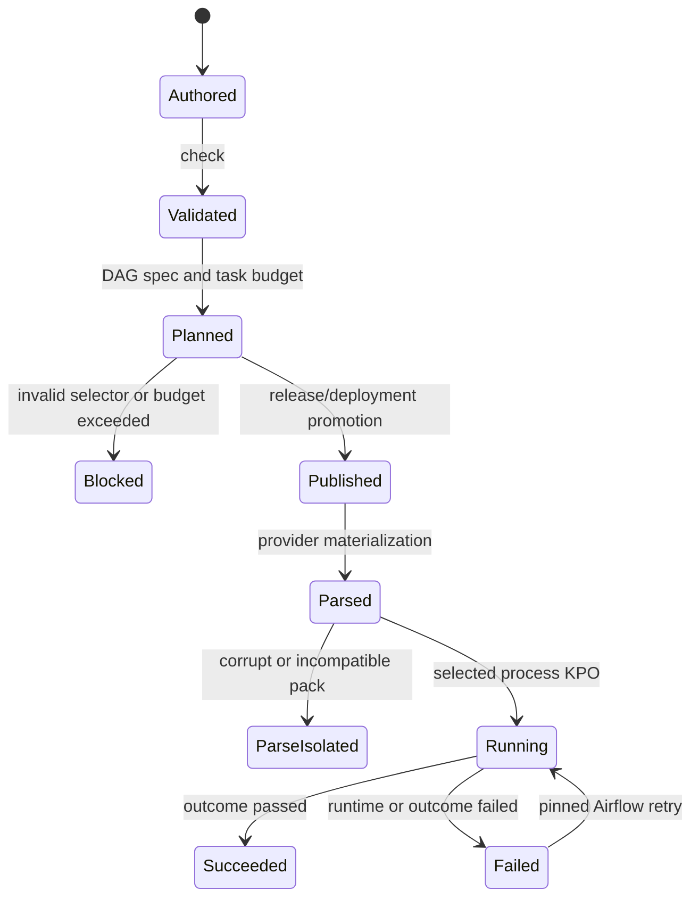
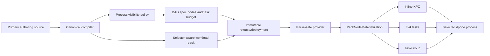

# Feature design: Airflow step visibility v1

- Status: IMPLEMENTED
- Owner: dpone maintainers
- Issue: Industrial Self-Service Airflow roadmap, Phase 2
- Target release: TBD
- Last verified: 2026-07-16

## Executive summary

The Airflow self-service path already compiles one editable pipeline source into
canonical manifests, workload packs, and DAG specs. Multi-process batch
workloads are represented by one DAG-spec node per process, but the provider
currently ignores each node's process selector and reuses the whole workload
pack. A DAG with two process nodes can therefore execute the complete manifest
twice under different task IDs. The same path also ignores the node
`task_group`, while every compact pack always expands hooks, runtime, and the
outcome gate into visible Airflow tasks.

This slice makes process selection a fail-closed execution contract and gives
users one bounded presentation policy:

```yaml
execution:
  visibility: inline  # inline | task | group
```

`visibility` controls how the internal steps of one selected dpone process are
shown in Airflow. It never changes dpone data semantics, dependencies, retries,
state, evidence, or the number of logical processes:

- `inline`: one process-scoped KPO executes hooks, runtime, and outcome
  validation as one Airflow task;
- `task`: hooks, runtime, and outcome validation are separate flat tasks;
- `group`: the same visible tasks are placed in an Airflow TaskGroup.

The beginner default is `inline`. Existing generated DAG specs without an
explicit visibility field keep their legacy expanded behavior. New builds emit
an explicit value, estimate the resulting Airflow task count, warn before graph
growth becomes surprising, and block an unsafe task explosion.

## Personas and customer journey

| Persona | Goal | Current pain | Success signal |
|---|---|---|---|
| First-time data engineer | See one understandable task for one load | Technical hook and outcome tasks dominate a simple DAG | Default preview shows one task per process without custom Python |
| Advanced data engineer | Diagnose or retry an individual internal step | Inline execution hides the exact failing stage | `task` exposes stable process-scoped hook/runtime/outcome tasks |
| Domain owner | Keep a large DAG readable | Flat technical tasks create visual noise | `group` contains the expanded steps in a named TaskGroup |
| Airflow operator | Bound scheduler and metadata DB load | A recipe can multiply tasks without an explicit limit | Build reports estimated tasks and blocks above the configured maximum |
| Platform engineer | Govern presentation defaults | Users can bypass a recipe's intended operating model | Existing recipe/profile locks govern the ordinary visibility field |
| Maintainer | Preserve one execution path | Selector and visibility policy can drift between preview and provider | DAG spec and pack carry one deterministic materialization contract |

Journey:

1. A scaffolded flow omits `execution.visibility`; compilation resolves it to
   `inline`.
2. `dpone check` validates the enum and any recipe/profile lock without Airflow,
   network, or credentials.
3. `dpone airflow preview` shows each process node, its selector, resolved
   visibility, TaskGroup name when applicable, and estimated visible tasks.
4. Build emits a selector-aware compact pack and an explicit node contract in
   the DAG spec.
5. The provider reads only the deployment index, DAG spec, and referenced pack.
6. At task execution, the runtime receives one validated process selector and
   executes only that process.
7. A failed dpone outcome fails the Airflow node in all three visibility modes.
8. If task budgets are exceeded, publication fails with an actionable error;
   Airflow parse never receives the invalid DAG spec.

## Scope

### In scope

- Process-level `execution.visibility: inline|task|group` in classic, flow,
  folder, and recipe-derived authoring.
- An explicit `visibility` field in every newly built `DagSpecNode`.
- Selector-aware runtime and separate-hook commands for multi-process packs.
- Fail-closed provider validation when a selected node references a pack that
  cannot honor selectors.
- Stable, process-scoped Airflow task IDs for every materialized internal step.
- Shared TaskGroup creation for nodes with the same explicit `task_group`.
- One-task inline outcome validation without a separate outcome-gate task.
- Build-time visible-task estimates, warning threshold, and hard limit.
- Reuse of recipe/profile locked parameters for override governance.
- Preview/explain output, schemas, generated references, docs, and migration
  guidance.
- Regression coverage for the current duplicate-full-workload execution bug.

### Non-goals

- Changing Step, Workload, DAG, pack, release, or deployment ownership.
- Creating one runtime pack per process.
- Dynamic Task Mapping or backfill chunk materialization.
- Running authoring compilation or repository discovery during DAG parsing.
- Making TaskGroup a scheduling or isolation boundary; it remains a visual
  grouping construct inside one DAG.
- Hiding multiple logical processes inside one Airflow task.
- A generic graph-contraction engine for mixed inline and visible processes.
- First-class DLQ, asset partitions, or OpenLineage export; those remain
  separate roadmap slices.

### Assumptions and constraints

- A `DagSpecNode` represents one selected process inside one independently
  runnable workload pack.
- The workload pack stays environment-neutral and selector-independent; the DAG
  spec supplies the selector at materialization time.
- `inline` means internal-step inlining, not process inlining. Every logical
  process remains independently visible, retryable, and dependency-addressable.
- The runtime image and provider are released together for selector-aware packs.
- Airflow TaskGroup does not reduce task instances or metadata DB volume.
- Provider imports and DAG parse remain free of network, database, Vault,
  Airflow Variables, Airflow Connections, and cache-refresh calls.
- The standing maintainer instruction to complete the frozen roadmap is
  approval for this compatibility-preserving specification.

## Public contract

### CLI

The beginner path remains unchanged. Visibility is optional:

```yaml
kind: dpone.flow.v1
authoring:
  mode: flow
  source: pipelines/orders_daily/pipeline.yaml
metadata:
  id: orders_daily
  domain: sales
processes:
  - name: load_orders
    source: {type: mssql, connection_ref: mssql_dev, table: {schema: dbo, name: orders}}
    sink:
      type: clickhouse
      connection_ref: clickhouse_dev
      table: {schema: analytics, name: orders}
      strategy: {mode: incremental_merge, unique_key: id}
    execution:
      visibility: inline
```

Diagnostic examples:

```bash
dpone check pipelines/orders_daily
dpone airflow preview orders_daily
dpone airflow explain orders_daily
```

Human preview adds one concise line per node:

```text
load_orders: inline, 1 visible task, selector=dbo.orders
```

JSON preview/explain adds:

```yaml
node_id: orders_daily__load_orders
selector: dbo.orders
visibility: inline
task_group: null
estimated_visible_tasks: 1
```

No new top-level CLI command is introduced. Validation failures retain the
existing structured-error exit codes: authoring/build validation uses `1`, bad
CLI input uses `2`, a safety policy violation uses `4`, and an unexpected
internal failure uses `5`.

### Python API

The canonical provider imports remain unchanged:

```python
from airflow.providers.dpone import DponeDag, DponeTaskGroup, load_dpone_dags
```

The public escape hatch remains source compatible:

```python
DponeTaskGroup.from_pack(
    "cached://workloads/load_orders",
    index_path="/opt/airflow/dags/.dpone-cache/current/airflow-index.json",
)
```

`DponeTaskGroup.from_pack` continues to materialize the complete pack as a
TaskGroup and therefore uses `group` presentation. Selector-scoped embedding is
not added to this escape hatch in v1; process-scoped materialization is owned by
`DponeDag.from_spec` and `load_dpone_dags`.

Internal provider functions receive one immutable node context:

```python
@dataclass(frozen=True, slots=True)
class PackNodeMaterialization:
    node_id: str
    workload_id: str
    selector: str | None
    visibility: Literal["inline", "task", "group"]
    task_group: str | None
```

This value object is provider-internal in v1. It prevents `operator_overrides`
from carrying domain semantics such as selector, task IDs, or grouping.

### Manifest/schema

`execution.visibility` belongs to a process because it controls the rendering
of that process's internal steps. It is present in flow and folder schemas and
is added to the canonical batch process configuration schema.

Rules:

- allowed values are `inline`, `task`, and `group`;
- omitted value resolves to `inline` for newly compiled sources;
- `group` uses `task_group` when one is declared, otherwise the sanitized
  `node_id`;
- `task_group` with `inline` or `task` is retained as semantic metadata but does
  not create an Airflow TaskGroup;
- recipes and profiles may set visibility and lock the same field using the
  existing locked-parameter mechanism;
- a locked visibility override fails during authoring compilation, never during
  DAG parsing;
- invalid values fail `check`, preview, and build identically.

New DAG specs serialize:

```yaml
nodes:
  - node_id: orders_daily__load_orders
    workload_id: orders_daily
    selector: dbo.orders
    visibility: inline
    task_group: null
    pack_path: .dpone/gitops/airflow/orders_daily/airflow-pack.json
    estimated_visible_tasks: 1
```

The compact pack adds an additive selector/runtime presentation contract. The
build plane emits one bounded process plan per compiled selector; the provider
selects a plan and never edits shell text:

```yaml
runtime_selection:
  mode: process_plan
  required_for_selected_nodes: true
process_plans:
  dbo.orders:
    selector: dbo.orders
    runtime_commands:
      inline: "... dpone run ... --selector dbo.orders ..."
      expanded: "... dpone run ... --selector dbo.orders ..."
    steps: [...]
```

`runtime_command` remains the legacy expanded command for old provider readers.
Pack schema major stays `3`; all additions are optional for legacy readers.

DAG wiring adds bounded policy:

```yaml
wiring:
  mode: waves
  visible_task_budget:
    warn: 100
    max: 250
```

Defaults are `warn: 100` and `max: 250`. Both are positive integers and
`warn <= max`. A platform may lower either value in the domain catalog. Raising
the maximum above `250` is rejected in v1; a larger platform ceiling requires a
future explicit policy capability rather than an unbounded authoring override.

### Artifacts and evidence

The DAG spec records for every node:

- `selector`;
- resolved `visibility`;
- `task_group`;
- `estimated_visible_tasks`.

The DAG spec records the aggregate budget result:

```yaml
visible_task_plan:
  estimated_total: 17
  warn_threshold: 100
  max_tasks: 250
  status: within_budget  # within_budget | warning | blocked
```

The pack fingerprint includes `runtime_selection`, both runtime commands, and
the step graph. The DAG-spec fingerprint includes visibility, task-group names,
estimates, and budget policy. Runtime evidence continues to identify the
selected process through existing process/selector fields; no authoring YAML or
secret data is copied into evidence.

Stable errors and warnings:

| Code | Stage | Meaning |
|---|---|---|
| `DPONE_AIRFLOW_VISIBILITY_INVALID` | check/build | Visibility is not inline, task, or group |
| `DPONE_AIRFLOW_VISIBLE_TASK_BUDGET_INVALID` | build | warn/max policy is invalid |
| `DPONE_AIRFLOW_VISIBLE_TASK_BUDGET_WARNING` | build | Estimated task count exceeds warn |
| `DPONE_AIRFLOW_VISIBLE_TASK_BUDGET_EXCEEDED` | build | Estimated task count exceeds max |
| `DPONE_AIRFLOW_PACK_SELECTOR_UNSUPPORTED` | parse | Selected node references an incompatible pack |
| `DPONE_AIRFLOW_NODE_SELECTOR_MISSING` | build/parse | A multi-process node has no selector |
| `DPONE_AIRFLOW_TASK_ID_CONFLICT` | parse | Process-scoped IDs are not unique |
| `DPONE_AIRFLOW_INLINE_OUTCOME_FAILED` | task execution | Inline runtime outcome is not passed |

### Compatibility and migration

- Existing authoring files remain valid.
- Existing DAG specs without `visibility` are interpreted as legacy `task`
  presentation, preserving the previously emitted step graph.
- Newly built DAG specs always contain an explicit visibility and default to
  `inline`.
- Existing packs without `runtime_selection` remain usable only for unselected
  legacy nodes. A node with a non-empty selector fails closed instead of running
  the whole manifest.
- Rebuild/reconcile is the migration for multi-process releases; packs are never
  patched in place.
- `runtime_command` remains available for at least the existing pack schema-v3
  support window. New providers prefer `runtime_commands.expanded` or
  `runtime_commands.inline` according to the DAG-spec node.
- Legacy `DponeTaskGroup.from_pack` behavior is unchanged.
- Rollback is performed by promoting the previous immutable deployment and its
  matching provider/runtime compatibility set.

## Detailed algorithm

### Build plane

1. Compile the selected classic, flow, folder, or recipe source through the one
   canonical authoring compiler.
2. For each compiled process, read `raw_config.execution.visibility` and resolve
   omitted to `inline`.
3. Validate visibility and recipe/profile lock policy.
4. Create one `DagSpecNode` with a stable node ID, workload ID, non-empty
   selector for batch processes, visibility, and optional task-group name.
5. Count selector-scoped internal steps using the same pure step-plan policy as
   compact-pack generation.
6. Estimate visible Airflow tasks:
   - `inline`: `1`;
   - `task` or `group`: count of materialized pre-hook steps + runtime + outcome
     gate.
7. Sum node estimates, compare to `warn` and `max`, add one warning or block the
   DAG-spec build. A blocked spec is not published.
8. Build one workload pack with one bounded process plan per compiled selector.
   Every plan contains selector-aware hook commands and two runtime commands:
   - inline command executes all process-owned hooks normally, writes XCom, and
     returns its summary to inline outcome evaluation;
   - expanded command sets `DPONE_SKIP_AIRFLOW_SEPARATE_HOOKS=1`, because those
     hooks are separate Airflow tasks, then writes XCom for the outcome gate.
9. Include the new contracts in pack/spec fingerprints and immutable release
   identity.

### Parse plane

1. Loader reads the bounded deployment index, DAG spec, and listed packs only.
2. For each node, validate node ID, visibility, selector requirement, and pack
   selector capability without importing runtime, Vault, connector, or
   Kubernetes clients.
3. Create `PackNodeMaterialization`; never encode node semantics in arbitrary
   operator overrides.
4. Prefix every internal task ID with `node_id` before creating an operator.
5. Resolve the exact immutable `process_plans[selector]`. Missing or duplicate
   plans fail closed; the provider does not rewrite commands or parse manifests.
6. Materialize by visibility:
   - `inline`: create only the runtime KPO, use the inline command, execute hooks
     inside dpone, and validate the returned XCom outcome in the same operator;
   - `task`: create process-prefixed pre-hook KPOs, runtime KPO, and outcome
     Python task in the DAG root;
   - `group`: get or create the TaskGroup named by `task_group` or `node_id`, then
     create the same prefixed tasks inside it.
7. Return the node's entrypoints and terminal object. DAG-spec edges connect the
   upstream terminal to every downstream entrypoint.
8. Detect any duplicate final Airflow task/group ID and apply the existing
   invalid-DAG policy. Publish is fail-closed; emergency parse remains isolated.

### Task execution

1. KPO renders the pinned interval identity and receives the prebuilt
   selector-specific command from the immutable pack plan.
2. The build plane constructed argv with `shlex.quote`; the provider never
   concatenates a selector into an eval/string template.
3. `dpone run <runtime-manifest> --selector <selector>` resolves exactly one
   process or fails before connector creation.
4. Expanded pre-hook commands use the same selector contract.
5. Runtime writes evidence and an XCom summary.
6. `inline` evaluates that returned summary in the same operator; `task` and
   `group` use the separate outcome gate. A non-passed result fails the Airflow
   node in every mode.
7. Airflow retries the same selector, release, deployment, pack, and runtime
   image. State/evidence ordering remains owned by the existing dpone runtime.

### Pseudocode

```text
for workload in dag_membership:
    manifest = load_metadata(workload.manifest)
    for process in manifest.processes:
        visibility = normalize(process.raw.execution.visibility, default=inline)
        selector = require_selector_for_batch_process(process)
        internal_steps = plan_pack_steps(workload, process)
        visible_count = 1 if visibility == inline else len(internal_steps)
        node = DagSpecNode(..., selector, visibility, visible_count)

total = sum(node.visible_count for node in nodes)
if total > budget.max:
    block_publication(DPONE_AIRFLOW_VISIBLE_TASK_BUDGET_EXCEEDED)
if total > budget.warn:
    warn(DPONE_AIRFLOW_VISIBLE_TASK_BUDGET_WARNING)

for node in dag_spec.topological_order:
    pack = resolve_pinned_pack(node.workload_id)
    if node.selector and not pack.runtime_selection.supported:
        fail_node_parse(DPONE_AIRFLOW_PACK_SELECTOR_UNSUPPORTED)

    context = PackNodeMaterialization(node)
    if context.visibility == inline:
        wired = build_inline_runtime(pack, context, inline_outcome=True)
    else:
        group = task_group(context) if context.visibility == group else None
        wired = build_expanded_steps(pack, context, group=group)
    wire_dag_edges(wired)
```

### State machine



No new dpone checkpoint state is introduced. Airflow task state reflects the
selected process; dpone state and evidence continue to advance only according
to the runtime's existing transaction ordering.

### Edge cases

- Empty process list remains an authoring error before DAG planning.
- A batch process without a selector blocks build.
- Duplicate selectors or node IDs block build; duplicate final Airflow IDs also
  fail parse isolation as defense in depth.
- A single-process legacy manifest can use an old selector-less spec/pack path.
- A multi-process old pack referenced by a selected node fails closed and asks
  for rebuild; it never runs the whole manifest.
- `inline` with separate-task hooks executes those hooks inside the runtime
  command exactly once.
- `task`/`group` set the skip flag only for hooks that were materialized as
  separate Airflow tasks.
- A hook failure prevents runtime; a runtime failure prevents outcome success;
  an invalid/missing XCom summary fails all visibility modes.
- Deferrable KPO validates inline outcome in `trigger_reentry`; synchronous KPO
  validates it after `execute` returns.
- A TaskGroup name collision between unrelated nodes is rejected unless both
  nodes intentionally declare the same `task_group`.
- TaskGroup prefixes remain enabled, preserving unique fully qualified task IDs.
- A warning threshold equal to max is valid; both must be positive.
- Task count at max is allowed; max + 1 is blocked.
- Airflow 2 compatibility uses `airflow.utils.task_group.TaskGroup`; Airflow 3
  prefers `airflow.sdk.TaskGroup`.
- Cancellation and retry do not change selector or visibility.
- Schema drift, empty source data, null values, and duplicate records retain
  existing runtime semantics and are not presentation concerns.

## Architecture

### Components and responsibilities

| Component | Existing/new | Responsibility | Dependencies |
|---|---|---|---|
| `AirflowStepVisibilityPolicy` | new | Normalize visibility and estimate visible steps | Pure mappings/value objects only |
| `DagSpecNode` | extend | Carry selector, visibility, group, and estimate | Visibility value object |
| `AirflowDagSpecBuilder` | extend | Build selector-safe nodes and enforce DAG budget | Manifest metadata loader, policy |
| Compact pack builder | extend | Emit selector contract and inline/expanded commands | Existing step planner/runtime materializer |
| `PackNodeMaterialization` | new provider value object | Separate node semantics from operator overrides | Python stdlib only |
| Pack task materializer | refactor | Build inline or expanded process-scoped tasks | Static pack + node context |
| DAG materializer | extend | Reuse TaskGroups and wire node boundaries | Provider compatibility imports |
| Inline outcome operator behavior | extend | Fail one KPO from returned XCom summary | Existing outcome evaluator |
| Preview/explain renderers | extend | Show resolved visibility and budget | DAG spec/report only |

### Ports, adapters, and composition root

The build-plane visibility policy is a pure domain service under
`dpone.gitops`; it does not import Airflow. The provider owns Airflow adapters
and compatibility imports. `dag_materializer` is the composition root that
constructs node contexts, TaskGroups, and operators from static artifacts.

`operator_overrides` remains an Airflow operational escape hatch for retries,
pool, priority, and similar allowlisted values. Selector, visibility, task IDs,
commands, image, namespace, and TaskGroup ownership are contract-owned and
cannot be overridden through that mapping.

### Data and control flow



### Alternatives and tradeoffs

| Alternative | Advantages | Disadvantages | Decision |
|---|---|---|---|
| One pack per process | Simple provider commands | Duplicates immutable workload artifacts and breaks workload ownership | Rejected |
| Treat inline as all processes in one KPO | Fewest tasks | Loses independent retry/dependencies and requires graph contraction | Rejected |
| Parse and edit shell commands in provider | Small pack change | Fragile, unsafe, and couples provider to shell formatting | Rejected |
| Put selector in `operator_overrides` | Minimal signature change | Mixes domain identity with arbitrary Airflow settings | Rejected |
| One node context plus selector-indexed pack plans | Explicit, testable, parse-safe; provider never edits commands | Additive pack/provider contract and small command duplication | Adopted |
| Always expand outcome gate | Reuses current code | Inline still exposes technical task and misses UX goal | Rejected |
| Inline operator validates returned XCom | One task and fail-closed result | Requires sync/deferrable compatibility tests | Adopted |
| Ignore TaskGroup task counts | Simpler budget | Understates metadata DB/task-instance cost | Rejected |

### ADR requirement

No new ADR is required. The feature implements the already frozen Step,
Workload, DAG, pack, and parse-safe provider contracts. The selector bug is a
violation of those decisions rather than a new architecture. This approved
specification is the normative implementation contract. If implementation
requires process-specific packs or scheduler-side authoring compilation, work
must stop and an ADR is required.

### Quality-budget impact

Expected new cohesive modules:

- one build-plane policy module for visibility/budgets;
- one provider node-materialization value-object/helper module if needed;
- focused tests and docs.

Existing `airflow_compact_pack.py`, provider `pack_tasks.py`, and
`dag_materializer.py` must remain below repository module-size and import-graph
budgets. The refactor must reduce responsibilities rather than adding another
generic plugin system. No runtime connector or Vault dependency may enter the
provider package.

## Market comparison

Research date: 2026-07-16. Facts below come from current official project or
vendor documentation; dpone decisions are explicitly marked as inference.

| System/version | Relevant capability | Observed design | Strength | Limitation | Adopt/reject | Source/date |
|---|---|---|---|---|---|---|
| dlt | Orchestrator task granularity | N/A for a public inline/task/group DAG rendering contract | N/A | Does not answer this Airflow graph policy | N/A | dlt production docs, 2026-07-16 |
| Informatica | Visual task/session grouping | Platform-owned workflow UI | Mature operations | Not a static Airflow provider contract | N/A | Informatica docs, 2026-07-16 |
| Airbyte | Job/attempt execution | Connector jobs are platform units | Simple operational model | No comparable per-step Airflow presentation contract | N/A | Airbyte docs, 2026-07-16 |
| Fivetran | Managed sync job | One managed sync abstraction | Low user ceremony | No user-controlled Airflow step graph | N/A | Fivetran docs, 2026-07-16 |
| Pentaho | Transformation/job steps | UI exposes engine steps | Detailed diagnostics | Different runtime and deployment model | N/A | Pentaho docs, 2026-07-16 |
| Microsoft SSIS | Control/data-flow task visibility | Package author chooses explicit tasks and containers | Familiar operational grouping | Not selector-safe static Airflow materialization | N/A | Microsoft SSIS docs, 2026-07-16 |
| gusty | YAML-to-Airflow task generation | Declarative nodes become tasks/groups | Small authoring surface | Does not supply dpone workload/runtime identity | N/A | gusty docs, 2026-07-16 |
| Astronomer Cosmos 1.x | dbt node/task granularity and TaskGroups | Local creates one task per node; watcher combines one producer with visible watchers; folders can become TaskGroups | Makes performance/visibility tradeoff explicit | dbt-specific and some modes add coordination tasks | Adopt explicit presentation choice and grouping; reject scheduler-side project execution | [execution modes](https://astronomer.github.io/astronomer-cosmos/guides/run_dbt/execution-modes.html), [watcher](https://astronomer.github.io/astronomer-cosmos/guides/run_dbt/airflow-worker/watcher-execution-mode.html), [FAQ](https://astronomer.github.io/astronomer-cosmos/faq.html), 2026-07-16 |
| Apache Beam | Composite transforms | Runner may expose or fuse logical transforms | Separates logical graph from physical execution | Not an Airflow task UX contract | Adopt logical/physical separation only | Beam docs, 2026-07-16 |

Airflow documents Task as its basic execution unit and TaskGroup as visual
organization that keeps tasks in the same DAG. Therefore dpone counts grouped
tasks against budgets and does not describe TaskGroup as runtime isolation:
[Airflow tasks](https://airflow.apache.org/docs/apache-airflow/stable/core-concepts/tasks.html),
[Airflow TaskGroups](https://airflow.apache.org/docs/apache-airflow/stable/core-concepts/dags.html#taskgroups).

## Measurable differentiation

```yaml
axis: beginner graph simplicity with selector-safe execution
scenario: one 10-process workload with no separate hooks
baseline: current provider creates 20 technical runtime/outcome tasks and ignores selectors
metric:
  - visible Airflow tasks
  - correctly selected process invocations
  - parse side effects
target:
  visible_tasks_default: 10
  selected_process_accuracy: 100%
  duplicate_full_manifest_invocations: 0
  parse_network_db_secret_calls: 0
procedure: build one immutable deployment, parse it on every tested Airflow pair, inspect task IDs and execute command/env contracts with fake KPOs
artifact: test_artifacts/airflow-step-visibility-v1/validation-report.md
limitations: live KPO outcome behavior remains UNVERIFIED unless an approved Airflow/Kubernetes environment is available
```

## Security, privacy, and operations

- Selector values come from compiled immutable manifests, are schema-validated,
  shell-quoted once on the build plane, and are never evaluated or rewritten by
  the provider.
- Selector is non-secret but may reveal table naming; ordinary logs use process
  identity already present in DAG metadata and never connection/Vault paths.
- Operator overrides cannot replace command, arguments, image, namespace,
  pod spec, selector, visibility, task ID, or outcome behavior.
- Parse path performs no remote I/O, secret resolution, metadata DB access,
  Variable/Connection access, or cache refresh.
- Task budget is enforced at build and reported in preview/explain.
- Metrics: estimated visible tasks, resolved visibility counts, selector-capable
  pack count, parse failures by stable code, and inline outcome failures.
- Alert on any selector-unsupported parse error in a current deployment; recovery
  is rebuild/reconcile/promote, not manual pack editing.
- Evidence and logs never include row data or credentials.

## Test and certification plan

| Layer | Scenario | Environment | Expected artifact |
|---|---|---|---|
| Unit | Visibility normalization and budget boundaries | Local, no Airflow | Focused pytest result |
| Unit | Selector-aware inline/expanded command construction | Local shell-contract tests | Focused pytest result |
| Contract | Flow/folder/classic/recipe produce identical explicit visibility | Local compiler/schema | Semantic fingerprint assertions |
| Contract | Multi-process nodes inject distinct selectors and IDs | Fake Airflow/KPO | Provider materialization report |
| Contract | Old selected pack fails closed; old unselected pack remains readable | Fake Airflow | Compatibility test report |
| Contract | Inline/task/group preserve entry/terminal wiring | Fake Airflow 2/3 imports | Provider test report |
| Contract | Sync and deferrable inline outcome fail closed | Fake operator lifecycle | Outcome test report |
| Integration | Preview -> release -> preview deployment -> provider parse | Local static cache | DAG/task inventory JSON |
| Performance | 100 DAG/500 workloads cold/warm parse | Fixed benchmark runner | Benchmark JSON |
| Compatibility | Airflow 2.10/2.11/3.2/3.3 wheel smoke | Exact CI matrix | Wheel smoke artifacts |
| Live certification | Selected MSSQL -> ClickHouse process via KPO | Approved live environment only | Route/run evidence or UNVERIFIED record |

Required negative cases:

- invalid/missing visibility;
- invalid budget, warn > max, zero/negative thresholds, total max + 1;
- duplicate node ID, selector, flat task ID, and TaskGroup ID;
- selector containing shell metacharacters is rejected by selector grammar or
  passed as one argv value without execution;
- selected node with legacy pack;
- multi-process workload where each node previously ran the full manifest;
- inline missing/invalid/failed XCom summary;
- deferrable trigger-reentry failure;
- task/group hook failure ordering;
- corrupt pack runtime-selection contract;
- parse-time import trap for runtime, connector, Vault, Kubernetes client,
  Airflow Variable, and Airflow Connection modules;
- task budget does not treat a TaskGroup as one task;
- recipe/profile locked visibility override;
- malformed DAG among 500 valid DAGs remains isolated only at parse, while
  publish remains fail-closed.

Focused checks are followed by the repository-selected checks and the complete
non-live gate. A skipped live check is reported as `UNVERIFIED`, never `PASS`.

## Documentation plan

- Add a beginner section to the Airflow self-service guide: keep `inline` unless
  an operator needs step-level retry/diagnostics.
- Add a three-mode diagram and screenshots/task inventories generated from an
  executable fixture.
- Document that TaskGroup changes presentation, not isolation or task count.
- Add reference entries for visibility, budget policy, DAG-spec fields, pack
  runtime-selection fields, and stable errors.
- Add an operator runbook for selector-unsupported packs and task-budget blocks.
- Update compatibility and migration guidance for rebuilding old
  multi-process releases.
- Update generated schema/reference docs and executable quickstarts.
- Mark the Phase 2 backlog item complete only after docs and evidence pass.

## Rollout and rollback

1. Ship schemas and build-plane policy first; old providers ignore additive
   fields.
2. Ship selector-aware pack generation and provider materialization in the same
   release candidate.
3. Rebuild the golden route and multi-process fixtures; do not mutate released
   packs.
4. Run provider wheel smoke on the exact Airflow/Python matrix and the parse SLO.
5. Promote a preview deployment, then a non-production runnable deployment.
6. Alert on selector capability and inline outcome errors before production
   promotion.
7. Roll back by atomically selecting the previous deployment and matching
   provider/runtime image. Never downgrade only the provider while retaining a
   new selector-aware deployment.

Release blockers are any duplicate/full-manifest execution, false Airflow
success, task-budget bypass, selector shell injection, parse side effect, or
compatibility-pair failure.

## Agent execution plan

| Agent/role | Owned paths | Read-only paths | Forbidden paths | Dependency |
|---|---|---|---|---|
| Explorer | none | manifest, DAG spec, compact pack, provider, tests | all writes | Before implementation |
| Architect | none | this spec and relevant ADRs | all writes | Before implementation |
| Test/certifier | focused visibility/provider tests only when delegated | production paths, standards | shared schemas/docs | Approved spec |
| Implementer | path-scoped build-plane or provider modules from task contract | adjacent tests/docs | unrelated runtime/connectors | Approved spec + red tests |
| Docs/UX reviewer | visibility docs/examples when delegated | schemas/spec/tests | production code | Stable public behavior |
| Integrator | shared schemas, DAG spec, pack/provider integration, changelog, backlog | whole scoped diff | `.cursor/`, unrelated user changes | All scoped work |

The current Codex task is the integrator and shared-file owner. Parallel writer
work requires separate worktrees and `agent-task-contract.yml`; if agents are
unavailable, the integrator performs the same roles sequentially and records
the limitation.

## Approval checklist

- [x] User problem and CJM are clear.
- [x] Algorithm and failure semantics are implementable without guessing.
- [x] Public contracts and compatibility are explicit.
- [x] Architecture and alternatives are justified.
- [x] Relevant market research uses current official sources.
- [x] Claimed differentiation is measurable.
- [x] Tests, evidence, docs, rollout, and rollback are complete.
- [x] Path ownership and integration plan are conflict-safe.
- [x] Maintainer changed status to `APPROVED` through the standing instruction to complete the frozen roadmap.
