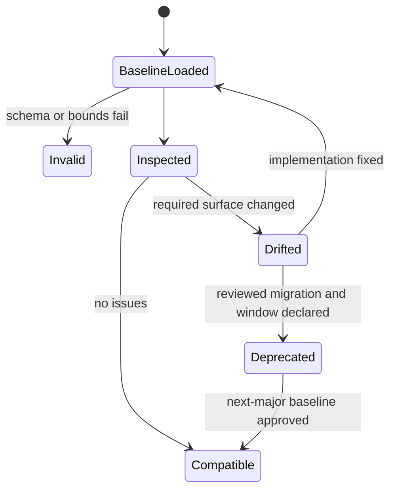
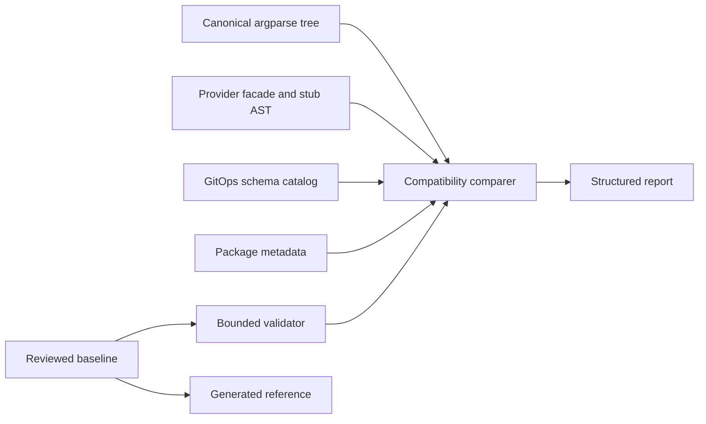

# Feature design: Airflow self-service v1 public contract freeze

- Status: APPROVED
- Owner: dpone maintainers
- Approval: maintainer request to complete the frozen Industrial Self-Service
  Airflow roadmap as one goal
- Target release: 1.0.0
- Last verified: 2026-07-16

## Executive summary

The Airflow self-service implementation now spans authoring, preview, immutable
release/deployment artifacts, a typed provider, safe sample execution and
operator workflows. The individual contracts are tested, but there is no single
machine-readable statement of which user-facing surfaces become stable in
dpone 1.0. A parser refactor, provider cleanup or schema-registry change can
therefore pass focused tests while accidentally removing part of the promised
golden path.

This slice adds one repository-owned
`dpone.airflow-self-service-public-contracts.v1` baseline and a read-only docs
gate. The gate inspects the real argparse tree, provider facade and stub, GitOps
schema catalog, package metadata and compatibility policy. It emits a bounded
`dpone.airflow-public-contract-report.v1` report and generated reference page.
It does not execute Airflow, import Vault, inspect credentials, contact package
indexes or run a pipeline.

Success means every breaking change to the frozen Airflow self-service surface
is explicit, reviewable and accompanied by the declared SemVer/deprecation
process, while additive optional capabilities remain possible.

## Personas and customer journey

| Persona | Goal | Current pain | Success signal |
| --- | --- | --- | --- |
| First-time data engineer | Rely on the five-command journey across upgrades | Stability is described across several documents | The five commands and required options are one checked contract |
| Platform engineer | Upgrade dpone and its provider safely | Provider, schema and CLI promises can drift independently | One report names every missing or incompatible surface |
| Extension author | Build against a durable provider/schema major | Public versus internal symbols are not summarized in one place | Canonical exports, signatures and schema majors are listed |
| Release manager | Prove that a release follows SemVer and support windows | Version and deprecation checks are fragmented | CI attaches a deterministic contract report to the exact commit |

Journey:

1. A user follows the unchanged five-command golden path.
2. A maintainer changes a parser, provider facade, stub, schema registration or
   compatibility alias.
3. `dpone docs check-airflow-public-contracts` loads the reviewed baseline and
   inspects current source without network or runtime imports.
4. Additive optional fields/options/exports are reported but do not fail the
   baseline. Missing required surfaces, changed parameter kinds, narrowed
   support or early alias removal fail with a stable issue code.
5. For an intentional compatible addition, the implementation lands first and
   the baseline may be updated in the same reviewed change.
6. For a breaking change, maintainers publish migration and deprecation
   metadata, choose the next major release, update the baseline and regenerate
   the reference page.
7. Operators can read the generated reference without understanding the parser
   or Python AST.

## Scope

### In scope

- One authoritative YAML baseline for Airflow self-service CLI, provider API,
  public schema majors, package compatibility and support windows.
- The five beginner commands plus the platform Airflow commands required to
  build, publish, materialize, diagnose, retain and recover deployments.
- Canonical `airflow.providers.dpone` exports and non-variadic signatures.
- Required `dpone.*.v1` GitOps schema kinds used by the frozen architecture.
- Provider legacy-facade deprecation window of at least two minor releases and
  12 months, whichever is later.
- A deterministic JSON/text report, generated Markdown reference and docs gate.
- Additive compatibility: new optional commands, options, exports and schema
  majors are allowed until explicitly promoted into the baseline.

### Non-goals

- Freezing all historical dpone commands or every internal Python module.
- Declaring the current `0.72.x` package itself to be `1.0.0`.
- Automatically editing the baseline from current source; that would turn a
  breaking implementation into its own approval.
- Proving live Airflow, Kubernetes, Vault, MSSQL or ClickHouse behavior.
- Replacing the existing compatibility registry, generated CLI reference,
  provider matrix or JSON Schema catalog.
- Signing catalogs or running third-party conformance. Those are subsequent
  Phase 4 slices that consume this stable contract.

### Assumptions and constraints

- The baseline is a reviewed source file, not generated output.
- Generated Markdown is derived only from the baseline producer.
- The checker may import the dependency-light dpone command registry and GitOps
  schema definitions, but never the runtime plane or vendor SDKs.
- Provider inspection reads source and PEP 561 stub files through a confined
  repository path. It does not import Airflow.
- A v1 schema kind is stable by major identifier. Additive JSON Schema changes
  are governed by existing schema tests; the baseline only prevents accidental
  disappearance or major renaming.
- The current package remains pre-1.0 until all Phase 4 release gates pass.

## Public contract

### Baseline

```yaml
schema: dpone.airflow-self-service-public-contracts.v1
target_release: 1.0.0
policy:
  semver: 2.0.0
  additions: compatible
  removals: next_major_after_deprecation
  provider_legacy_window:
    minimum_minor_releases: 2
    minimum_days: 365
cli:
  - command: dpone init project
    required_options: [--airflow]
  - command: dpone init pipeline
    required_positionals: [name]
    required_options: [--recipe, --airflow]
python:
  namespace: airflow.providers.dpone
  exports:
    - name: load_dpone_dags
      callable: true
schemas:
  required_kinds:
    - dpone.release-set.v1
    - dpone.deployment-set.v1
provider:
  distribution: apache-airflow-providers-dpone
  reader_distribution: dpone-airflow-pack
  canonical_namespace: airflow.providers.dpone
  legacy_namespace: dpone_airflow_pack
```

The checked-in baseline contains the complete agreed list. Unknown keys,
duplicate commands/exports/schema kinds, relative escapes and non-v1 schema
identifiers fail before inspection.

### CLI

```bash
dpone docs check-airflow-public-contracts
dpone docs check-airflow-public-contracts --format json
dpone docs update-airflow-public-contract-reference
dpone docs update-airflow-public-contract-reference --check
```

Rules:

- default output is concise text; JSON is a stable machine report;
- check is read-only and returns `0` when compatible, `2` for contract drift or
  invalid baseline, and `5` only for unexpected internal failures;
- update writes only the generated block in
  `docs/reference/airflow-public-contracts.md` atomically through the existing
  generated-doc service;
- update never changes the baseline;
- absolute paths and repository topology stay out of ordinary text output;
- no command performs network, Airflow metadata, DB, Vault, Kubernetes,
  Variable, Connection or cache-refresh I/O.

### Python/provider API

The baseline freezes these canonical provider symbols:

```python
from airflow.providers.dpone import (
    AirflowDeploymentIndex,
    AirflowDeploymentIndexError,
    AirflowIndexArtifact,
    CacheResolution,
    CacheResolver,
    DponeDag,
    DponeTaskGroup,
    LoadReport,
    get_provider_info,
    load_airflow_deployment_index,
    load_dpone_dags,
)
```

For callable/class methods the baseline records parameter name, parameter kind,
required/default status and return annotation. The checker rejects removal,
renaming, making an optional parameter required, changing positional/keyword
kind incompatibly or narrowing literal policy values. Adding an optional
keyword parameter is compatible.

The formal `apache-airflow-providers-dpone` distribution owns the canonical
namespace and provider discovery metadata. The lightweight
`dpone-airflow-pack` distribution remains the Airflow-independent reader and
implementation dependency. `dpone_airflow_pack` legacy facade exports delegate
to the same implementation and emit at most one deprecation warning per
process. Their removal date must satisfy both declared minor-release and
calendar windows.

### Schemas and report

The report is additive and local:

```yaml
schema: dpone.airflow-public-contract-report.v1
baseline: dpone.airflow-self-service-public-contracts.v1
target_release: 1.0.0
status: passed
fingerprint: sha256:...
checks:
  cli: {required: 5, compatible: 5}
  python: {required: 11, compatible: 11}
  schemas: {required: 8, compatible: 8}
issues: []
```

The fingerprint hashes canonical normalized baseline content, not timestamps or
absolute paths. Issues use stable codes:

- `DPONE_PUBLIC_CONTRACT_BASELINE_INVALID`
- `DPONE_PUBLIC_CLI_COMMAND_MISSING`
- `DPONE_PUBLIC_CLI_ARGUMENT_MISSING`
- `DPONE_PUBLIC_PROVIDER_EXPORT_MISSING`
- `DPONE_PUBLIC_PROVIDER_SIGNATURE_INCOMPATIBLE`
- `DPONE_PUBLIC_SCHEMA_KIND_MISSING`
- `DPONE_PUBLIC_PACKAGE_COMPATIBILITY_NARROWED`
- `DPONE_PUBLIC_DEPRECATION_WINDOW_VIOLATED`
- `DPONE_PUBLIC_CONTRACT_REFERENCE_OUTDATED`

### Compatibility and migration

- Existing behavior is unchanged; the gate is additive.
- The baseline targets 1.0 while packages remain 0.72.x/0.73.x during the
  completion program.
- A baseline entry cannot be deleted merely to make CI green. Removal requires
  a migration document, compatibility-registry entry, announcement release and
  a next-major target.
- Provider legacy exports remain for at least two minor releases and at least
  365 days after the recorded announcement, whichever is later.
- Rollback removes only the new docs gate/report/reference; it does not change
  runtime artifacts or authoring sources.

## Detailed algorithm

1. Resolve the baseline, provider source/stub and generated-doc paths beneath
   repository root; reject escapes and symlinks outside the root.
2. Load bounded YAML and require the exact top-level schema and supported policy
   vocabulary.
3. Normalize and sort CLI commands, provider exports, schema kinds and support
   entries; reject duplicates and unbounded strings/lists.
4. Build the canonical argparse tree and walk exact command tokens without
   invoking handlers or constructing `AppContext`.
5. Compare required positional names and option strings. Extra optional
   arguments are compatible; a missing or incompatible required argument is an
   issue.
6. Parse canonical provider `__init__.py` and `__init__.pyi` with `ast`. Compare
   `__all__`, class methods/functions, parameter kinds/default presence, literal
   policy values and returns without importing Airflow.
7. Load the GitOps schema registry and check every required kind exists once
   with its declared major.
8. Read package metadata files as TOML and prove core/reader/provider version
   parity, formal provider dependency bounds have not narrowed below the
   baseline and provider discovery metadata remains present only in the formal
   provider distribution.
9. Validate legacy support metadata against release/date windows. A missing
   announcement or premature removal is a blocker.
10. Build a sorted issue list and canonical fingerprint; return text or JSON.
11. The reference producer renders only baseline promises and policy, updates
    the marked generated block atomically and supports `--check`.
12. CI runs check plus reference check. No current-source snapshot is generated
    automatically.

### Pseudocode

```text
baseline = load_and_validate_bounded_yaml(path)
actual_cli = inspect_argparse_tree(build_root_parser())
actual_provider = inspect_python_ast(provider_py, provider_pyi)
actual_schemas = index(gitops_schema_contracts())
actual_packages = inspect_toml(core, provider)

issues = []
issues += compare_required_cli(baseline.cli, actual_cli)
issues += compare_provider_api(baseline.python, actual_provider)
issues += compare_schema_majors(baseline.schemas, actual_schemas)
issues += compare_package_support(baseline.provider, actual_packages)
issues += check_deprecation_windows(baseline.compatibility, today)

report = canonical_report(baseline_fingerprint, sorted(issues))
return 0 if not issues else 2
```

### State machine



### Edge cases

- Empty baseline, duplicate command/export/schema or unknown field: invalid.
- A command alias points to the same parser but canonical tokens disappear:
  missing command.
- Option help changes while option semantics remain: compatible.
- Optional option added: compatible; required positional added to a frozen
  command: incompatible.
- Provider implementation exports a symbol absent from stub: incompatible even
  when `__all__` contains it.
- Airflow is not installed: check still works because provider files are parsed,
  not imported.
- One schema has two registrations: baseline invalid/ambiguous, never first-win.
- A schema adds optional properties: baseline remains compatible.
- Clock is naive or release cannot be parsed for a removal decision: fail
  closed, do not guess that the window elapsed.
- Generated reference differs only in ordering: producer canonicalizes it.

## Architecture

### Components and responsibilities

| Component | Existing/new | Responsibility | Dependencies |
| --- | --- | --- | --- |
| `airflow_public_contracts` model | New docs service module | Validate/normalize baseline and compare pure projections | stdlib, bounded YAML input |
| CLI projection | Existing `cli_reference` helpers extended/reused | Read canonical argparse tree | command registry only |
| Formal provider distribution | New package, existing facade moved | Own `airflow.providers.dpone`, typing and Airflow discovery | lightweight reader plus tested Airflow range |
| Provider AST projection | New docs service module | Parse facade/stub without importing Airflow | stdlib `ast` |
| Schema projection | Existing GitOps schema registry | Enumerate public contract kinds | dependency-light GitOps contracts |
| Check service/command | New | Compose projections and render report | injected docs context |
| Reference producer/command | New | Render checked baseline into Markdown | generated-doc helper |
| Baseline YAML | New authority | Reviewed v1 promise | maintainers |

### Ports, adapters and composition root

The docs command is the composition root. Filesystem/YAML capabilities come
from `DocsServiceContext`; parser and schema projections are injected callables
in tests. Provider inspection is a pure adapter over bytes. No runtime service,
vendor SDK, Airflow object or global client enters the model.

### Data and control flow



### Alternatives and tradeoffs

| Alternative | Advantages | Disadvantages | Decision |
| --- | --- | --- | --- |
| Freeze every dpone command | Maximum coverage | Freezes historical complexity and blocks cleanup | Rejected |
| Snapshot raw `--help` output | Simple | Help wording/order becomes accidental API | Rejected |
| Import provider and use `inspect.signature` | Direct runtime view | Requires Airflow and risks import side effects | Rejected |
| Hand-maintained prose only | No code | Drift is invisible to CI | Rejected |
| Reviewed semantic baseline plus AST/parser checks | Stable and additive | Requires a small projection layer | Adopted |

### ADR requirement

No new ADR is required. ADRs 0006-0013 already define authority, artifact and
provider boundaries. This slice operationalizes the Phase 4 freeze rule without
changing runtime architecture. The specification itself is the public policy
record.

### Quality-budget impact

- New modules stay below 300 SLOC and separate baseline parsing, provider AST
  projection and orchestration.
- No new runtime-to-docs dependency; docs service may depend on app parser and
  GitOps contract projections at the existing composition seam.
- No generic plugin framework, service locator or arbitrary source execution.
- Existing `max_sloc` and graph budgets remain unchanged.

## Market comparison

Checked on 2026-07-16 against current official primary documentation.

| System/version | Relevant capability | Observed design | Adopt/reject |
| --- | --- | --- | --- |
| dlt 1.29 | Verified sources require tests, test data, demos, docs and data-engineer review; `dlt init` materializes source code | Clear publication bar and fast bootstrap | Adopt evidence categories; reject copied executable source as the dpone trust unit |
| Airbyte current connector tooling | Language-agnostic QA, validation/acceptance and regression suites run locally and in CI; support tiers vary requirements | Scalable black-box contract testing and explicit tiers | Adopt reusable conformance and tiered proof in the next slice; reject treating tests as live certification |
| Fivetran Connector SDK 2.x | Local `fivetran debug`, required `update()` contract, managed runtime and explicit SDK limitations | Small required API and local feedback | Adopt minimal stable surface and fail-fast probes; reject managed-runtime coupling |
| Apache Beam current I/O standards | Prescriptive docs, unit/integration/performance standards for first- and third-party I/O | Strong reusable extension checklist | Adopt machine-readable standards and exact evidence; reject runner-specific scope for Airflow authoring |
| Astronomer Cosmos current | Quickstarts and multiple execution modes with documented isolation/feature tradeoffs | Good progressive disclosure | Adopt concise beginner path and explicit capability matrix; reject mode-dependent hidden semantics |
| Astronomer Blueprint Preview | Platform-owned templates expose bounded fields through YAML/UI; feature remains Preview | Strong self-service separation and lifecycle labels | Adopt platform-owned declarative recipes; reject scheduler-time arbitrary Python |
| Informatica INFAConnect | Connector listing/certification lifecycle is relevant to marketplace governance | Managed marketplace model does not expose a portable Airflow provider contract | N/A for local public API freeze |
| Pentaho | No current official portable Airflow provider/recipe conformance contract found | Product plugin ecosystem is a different layer | N/A |
| Microsoft SSIS | Extension/versioning is tied to the SSIS runtime and Visual Studio deployment model | Different orchestrator/runtime boundary | N/A |
| gusty | DAG authoring helper, not a current signed extension certification ecosystem | Relevant to DAG generation but not v1 ecosystem governance | N/A |

Sources:

- <https://dlthub.com/docs/dlt-ecosystem/verified-sources>
- <https://dlthub.com/docs/general-usage/glossary>
- <https://airbyte.com/blog/how-we-test-airbyte-and-marketplace-connectors>
- <https://fivetran.com/docs/connectors/connector-sdk>
- <https://beam.apache.org/documentation/io/io-standards/>
- <https://beam.apache.org/documentation/io/testing/>
- <https://astronomer.github.io/astronomer-cosmos/getting_started/>
- <https://www.astronomer.io/docs/learn/blueprint-overview>

## Measurable differentiation

```yaml
axis: stable self-service contract drift detection
scenario: a provider export, required golden-path option, or v1 schema kind is accidentally removed
baseline: prose-only compatibility documentation
metric: percentage of seeded breaking mutations rejected before package build
target: 100% of the maintained mutation corpus
procedure: apply one isolated mutation per surface and run the docs contract gate
artifact: test_artifacts/airflow-v1-public-contract-freeze/mutation-report.json
limitations: proves repository contract detection, not live production correctness or human usability
```

## Security, privacy and operations

- Inputs are repository-owned bounded text files; provider paths are confined.
- AST parsing never executes provider or recipe code.
- Reports contain logical names, versions and issue codes only; no credentials,
  Vault paths, environment values or absolute paths.
- The gate has no network and does not inspect environment variables.
- A malformed/ambiguous baseline fails closed.
- Baseline update is a reviewed source change; the command cannot bless current
  implementation automatically.
- CI should archive JSON output as release evidence after the command exists.

### Release-blocker console redaction follow-up

The PR security scan traced topology fields named `secret_name` and
`secret_ref` to the generic text stdout sink. Those fields are identifiers, not
secret values, but the sink previously had no last-resort protection if a
renderer accidentally supplied a real credential. The implementation therefore
applies one dependency-free redactor at the text output boundary. It removes
secret assignments, secret-bearing CLI flags, URI passwords, bearer tokens,
private-key blocks and explicit caller-provided secret values while preserving
logical `connection_ref` and resolver identifiers. Existing route-executor
redaction delegates to the same implementation. JSON contracts remain owned by
their structured producers and are not rewritten at the stdout layer.

Impact is limited to text output that previously exposed a value in a
secret-bearing shape; such values now become `[REDACTED]`. Validation requires
focused assignment/URI/key tests, the existing output/CLI corpus, CodeQL on the
exact pushed commit and the ordinary non-live release gate. The CodeQL result
remains `UNVERIFIED` until the remote check completes.

## Test and certification plan

| Layer | Scenario | Environment | Expected artifact |
| --- | --- | --- | --- |
| Unit | Bounds, duplicates, command and signature comparisons | local | focused pytest |
| Mutation | Remove command/option/export/schema and narrow provider support | local | mutation report |
| Contract | Baseline matches actual parser/provider/schema/package source | local | public contract report |
| Parse safety | Airflow/Vault/Kubernetes imports and network calls forbidden | local | import guard test |
| Docs | Generated reference and navigation are current | local | strict MkDocs |
| Compatibility | Airflow 2.10/2.11/3.2/3.3 provider matrix | CI | existing matrix jobs |
| Live certification | Not required for static contract freeze | N/A | N/A |

Negative tests include path traversal, symlink escape, malformed YAML, unknown
keys, duplicate identities, missing provider stub, variadic public signature,
narrowed Literal policy, duplicate schema registration, naive clock and premature
legacy removal.

## Documentation plan

- Add generated `docs/reference/airflow-public-contracts.md`.
- Cross-link from compatibility, provider, self-service and release docs.
- Add command help to the generated CLI reference.
- Record Phase 4 progress in the backlog and changelog.
- Explain that the baseline is a promise, not a completeness inventory of all
  internal dpone APIs.

## Rollout and rollback

1. Land baseline, checker, schema/report, tests and generated reference while
   package version remains pre-1.0.
2. Run the checker in ordinary validation; add required CI wiring only after the
   local corpus is green.
3. Use the baseline as input to extension conformance and final release audit.
4. Roll back the checker/reference if it blocks on a false semantic comparison;
   do not delete baseline entries or weaken a support window as a workaround.

## Agent execution plan

| Agent/role | Owned paths | Read-only paths | Forbidden paths | Dependency |
| --- | --- | --- | --- | --- |
| Explorer | parser/provider/schema/compatibility inventory | repository | all writes | none |
| Architect | specification and boundary review | docs/ADR/current contracts | all writes | explorer |
| Test certifier | mutation and parse-safety review | tests/tooling | all writes | specification |
| Docs/UX reviewer | generated reference and CJM review | docs | all writes | specification |
| Integrator | task-contract owned paths | repository | `.cursor/**` and unrelated files | all findings |

Agent thread capacity was unavailable when this slice started. Independent
fresh-context review therefore remains `UNVERIFIED` until a reviewer can run;
the integrator must not report it as passed.

## Approval checklist

- [x] User problem and CJM are clear.
- [x] Algorithm and failure semantics are implementable without guessing.
- [x] Public contracts and compatibility are explicit.
- [x] Architecture and alternatives are justified.
- [x] Relevant market research uses current official sources.
- [x] Claimed differentiation is measurable.
- [x] Tests, evidence, docs, rollout and rollback are complete.
- [x] Path ownership and integration plan are conflict-safe.
- [x] Maintainer authorized completion of the frozen roadmap and the
  specification is marked `APPROVED`.
