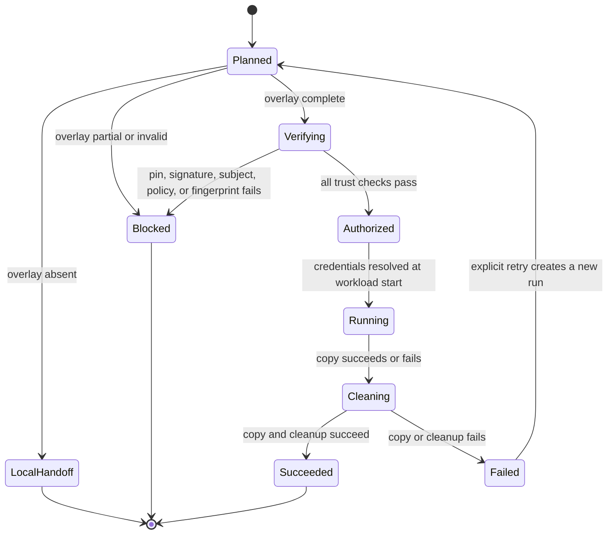
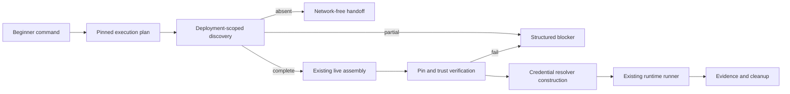

# Feature design: Beginner auto-live safe sample

- Status: IMPLEMENTED
- Owner: dpone maintainers
- Issue: Industrial Self-Service Airflow Phase 1B
- Target release: v0.72.7
Last verified: 2026-07-15

Implementation evidence: [v0.72.7 validation report](../test_artifacts/airflow-self-service-v0727-beginner-live-sample/validation-report.md).

## Executive summary

The fifth beginner command already validates sample policy, creates a pinned
release/deployment, writes an execution plan, and runs the shared safe-sample
runtime with fail-closed local ports:

```bash
dpone run pipelines/orders_daily --sample 1000 --target temporary
```

The route-certified live implementation also exists, but it currently requires
the user to repeat the operation through a platform command with internal file
paths and `--enable-live-copy`. This breaks the five-command self-service
journey and exposes concepts that belong to the platform team.

This change lets the beginner facade automatically reuse the existing live
runtime assembly when a platform-owned, deployment-pinned authorization
overlay is complete. It does not add a runner, execution engine, beginner flag,
credential backend, or mutable `current` lookup at runtime. If the overlay is
absent, the current network-free handoff remains available. If an overlay is
partially present, invalid, untrusted, expired, or mismatched, execution fails
closed with a structured error and performs no credential or database I/O.

Measurable outcome: a prepared development platform lets a new user complete
the full five-command journey, including a real bounded sample copy, without
copying a second command or knowing binding, registry, Vault, pack, release,
deployment, attestation, or KPO paths.

The maintainer authorized autonomous completion of the frozen self-service
plan in this task. That authorization approves this scoped specification; it
does not authorize any broader Phase 2 or Phase 3 feature.

## Personas and customer journey

| Persona | Goal | Current pain | Success signal |
|---|---|---|---|
| First-time data engineer | Safely inspect a small real sample | The displayed handoff contains internal runtime concepts and still needs platform-only flags | One beginner command either runs live or explains one platform blocker |
| Platform engineer | Pre-authorize a certified route without exposing secrets | Must teach users binding, registry, policy, and attestation paths | CI materializes one deployment-scoped authorization directory; users do nothing |
| Security engineer | Prove that automatic convenience does not bypass trust | Automatic dispatch could accidentally resolve credentials before verification | Signed subject, fingerprints, policy, and path integrity are checked before credentials or I/O |
| Airflow operator | Reuse the same pinned execution behavior inside runtime environments | Local and operator paths could diverge | Beginner facade calls the same live assembly and runtime runner as the platform command |

Journey:

1. A user creates and checks a pipeline through the existing golden path.
2. Platform CI builds and promotes the immutable deployment.
3. Platform CI certifies the route, builds a deployment-bound attestation,
   signs it outside dpone, and materializes the authorization overlay.
4. The user runs the fifth command with no new option.
5. dpone builds the same pinned execution plan as today.
6. dpone discovers the overlay by deployment ID and pipeline ID without reading
   secrets or resolving `current` again.
7. A complete overlay selects the existing verified live assembly. An absent
   overlay selects the existing network-free handoff. A partial overlay fails.
8. The user sees `execution_mode`, evidence path, outcome, and an actionable
   structured error when platform preparation is incomplete.
9. Retry uses a new run ID and the same pinned deployment unless the user
   explicitly rebuilds/rechecks source state.

## Scope

### In scope

- Automatic live selection inside `dpone run ... --sample ... --target temporary`.
- A deployment-scoped, platform-owned local authorization-overlay layout.
- Read-only discovery with explicit `ready`, `not_configured`, `incomplete`,
  and `invalid` results.
- Reuse of `build_live_safe_sample_runtime_assembly` and
  `run_local_safe_sample_runtime_handoff` through dependency injection.
- Additive machine-readable `execution_mode` and `live_selection` output.
- Stable fail-closed error codes and security exit-code classification.
- Updated handoff output that never claims live execution succeeded when only
  the local network-free rehearsal ran.
- Unit, contract, mocked integration, documentation, and full regression gates.

### Non-goals

- A second safe-sample runner or a generic executor-strategy framework.
- New beginner flags or a sixth golden-path command.
- Automatic signing, key handling, OIDC token acquisition, or trust-root refresh.
- Secret values in the authorization overlay, execution plan, CLI, logs, or evidence.
- Production route certification claims without an approved live environment.
- Changing release/deployment identity or adding attestation bytes to either digest.
- Resolving Airflow Variables, Connections, Vault, Kubernetes Secrets, or
  databases during command planning or Airflow DAG parsing.
- General Phase 2 recipes, selectors, flow authoring, or Phase 3 Assets work.

### Assumptions and constraints

- The current deployment pointer is verified once while building the execution
  plan; all later lookup uses its concrete deployment ID.
- The platform cache contains immutable route authorization files under a
  deployment-specific directory.
- Existing binding-set, connection-registry, and credential-runtime source
  files remain the environment authority and are fingerprint-checked against
  the pinned deployment before credential resolution.
- Route attestation remains the sole production trust authority. Directory
  presence is only an opt-in signal, never proof of authorization.
- A missing overlay is backward-compatible and network-free. A directory that
  exists but is incomplete is configuration drift and must not be ignored.

## Public contract

### CLI

No command or option is added. The canonical invocation remains:

```bash
dpone run pipelines/orders_daily --sample 1000 --target temporary
```

Selection behavior:

| Condition | Execution mode | External I/O | Exit |
|---|---|---:|---:|
| No deployment-scoped authorization directory | `local_handoff` | No | Existing result |
| Complete overlay and verified live assembly | `live_copy` | Bounded source/temporary target only | `0` on success |
| Overlay directory exists but a required file is absent | `blocked` | No | `3` |
| Invalid path, checksum/fingerprint, signature, subject, policy, or safety decision | `blocked` | No | `4` |
| Live dependency becomes unavailable after authorization | `live_copy` failed | Possibly partial, cleanup required | `3` |

Human output names the actual mode. It must not render `safe sample run passed`
for a network-free rehearsal as if rows were copied. Text and Markdown never
print the platform runtime command; local mode tells the user to rerun the same
fifth command after the platform prepares the signed overlay. JSON output adds:

```json
{
  "safe_sample": {
    "execution_mode": "live_copy",
    "live_selection": {
      "status": "ready",
      "deployment_id": "sha256:...",
      "pipeline_id": "orders_daily",
      "authorization_overlay_profile": "deployment_scoped_v1"
    }
  }
}
```

Allowed `execution_mode` values are `live_copy`, `local_handoff`, and
`blocked`. `authorization_overlay_profile` identifies only the local cache
layout; it is deliberately distinct from the signed route-attestation
`authorization_profile`, whose production value remains
`safe_sample_production`. The nested object never exposes Vault paths, secret fields, signed
URLs, tokens, passwords, or raw registry bodies.

### Platform authorization overlay

The first implementation uses a deterministic local cache layout and no new
editable pipeline schema:

```text
.dpone-cache/
  route-authorizations/
    sha256-<deployment digest>/
      <pipeline_id>/
        route-attestation.json
        route-attestation.sigstore.json
        route-certification-bundle.json
        route-attestation-policy.json
```

Rules:

- The path is derived only from the verified `deployment_id` and canonical
  pipeline ID; it is never accepted from the beginner command or manifest.
- IDs must be safe single path components. Traversal, absolute paths, symlink
  escape, or `current` in the derived runtime lookup is rejected.
- The directory is materialized by platform CI/cache synchronization, not by
  Airflow DAG parsing and not by the beginner user.
- The four files retain their existing schemas and verification algorithms.
- The attestation subject must match release ID, deployment ID, environment,
  route tuple, runtime image, certification bundle digest, and authorization
  profile.
- The overlay is environment-specific authorization metadata, not part of the
  environment-neutral release and not part of deployment identity.

### Python API

No new top-level public import is required. The internal readiness boundary is
small and structural:

```python
discover_live_safe_sample_inputs(
    plan: SafeSampleExecutionPlan,
    *,
    project_root: str | Path,
    cache_root: str | Path,
) -> LiveSafeSampleInputDiscovery
```

`LiveSafeSampleInputDiscovery` contains status, safe IDs, optional input paths,
and structured errors. It does not resolve credentials and does not provide an
execution method.

The existing public/platform API remains:

```python
build_live_safe_sample_runtime_assembly(...) -> LiveSafeSampleRuntimeAssembly
run_local_safe_sample_runtime_handoff(...) -> SafeSampleRuntimeRunReport
```

### Manifest/schema

No pipeline, release-set, deployment-set, Airflow index, binding-set,
connection-registry, or credential-runtime schema changes are required. The
authorization overlay reuses the four existing route-attestation contracts.

### Artifacts and evidence

Existing execution plan, init-fetch manifest, runtime evidence, route
attestation verification, and temporary-target lifecycle evidence remain the
authoritative artifacts. Runtime evidence must record:

- release and deployment IDs;
- execution mode;
- route attestation verification receipt;
- safe route ID and authorization profile;
- actual credential version metadata where available;
- cleanup outcome and errors.

The CLI selection diagnostic is additive and not a substitute for runtime
evidence.

### Compatibility and migration

- Repositories without the overlay keep the v0.72.6 network-free behavior.
- Existing explicit `dpone ops safe-sample-runtime-run --enable-live-copy ...`
  remains supported as the platform escape hatch.
- No old manifest changes are required.
- Removing or renaming the overlay directory immediately disables automatic
  live selection and restores the local handoff.
- A partial overlay is intentionally stricter than the previous absence: it
  returns a platform configuration error instead of silently rehearsing.

## Detailed algorithm

1. Validate the existing CLI argument tuple and safe-sample policy.
2. Build the temporary target plan.
3. Materialize or reuse the local immutable release/deployment as today.
4. Load and verify one current deployment projection, then pin its release and
   deployment IDs into the execution plan.
5. Derive safe path components from the pinned deployment and pipeline IDs;
   reject them before writing a handoff artifact.
6. Write the existing credential-free handoff for safe identities.
7. Construct the authorization directory under the configured cache root.
8. If the directory does not exist, select `local_handoff`.
9. If the directory exists, require all four regular files. Missing, symlinked,
   escaped, or non-regular inputs select `blocked` before credentials or I/O.
10. Require the conventional environment binding-set, registry, and
    credential-runtime files. Missing inputs select `blocked`.
11. Reopen the pipeline and all environment files through bounded, descriptor-
    pinned, no-follow reads. A path swap, symlink, non-regular file, or oversized
    input selects `blocked`.
12. Pass the parsed snapshots and pinned plan to the existing live assembly.
13. The live assembly verifies pinned source bytes, signature, certification
    digest, attestation subject, policy, environment fingerprints, schemas, and
    bound route in the existing order.
14. Only after step 13 does it construct the workload-scoped credential
    resolver, SQL clients, data copier, and temporary-target adapter.
15. Execute through the existing runtime handoff with pinned init-fetch,
    temporary target lifecycle, bounded copy, cleanup, and evidence.
16. On assembly failure, emit the stable structured code, select `blocked`, and
    do not fall back to a live or less-trusted path.
17. On runtime failure, preserve evidence and cleanup errors; never advance a
    checkpoint or claim a passed data outcome.

### Pseudocode

```text
plan = build_existing_pinned_execution_plan()
handoff = write_existing_handoff(plan)
selection = discover(plan, pinned_deployment_id, pipeline_id)

if selection.status == not_configured:
    report = run_existing_network_free_handoff(plan)
    return local_handoff(report, selection)

if selection.status in {incomplete, invalid}:
    return blocked(selection.errors)

try:
    assembly = build_existing_live_assembly(
        plan=plan,
        source=user_selected_source,
        environment_inputs=selection.environment_inputs,
        route_attestation_inputs=selection.attestation_inputs,
    )
except trusted_input_or_policy_error as error:
    return blocked(redact(error))

report = run_existing_runtime(
    assembly.plan,
    copier=assembly.data_copier,
    target=assembly.temporary_target_executor,
    verification=assembly.route_attestation_verification,
)
return live_copy(report, selection)
```

### State machine



### Ordering, transactions, retries, and replay

- Selection is a pure read over pinned metadata and deterministic paths.
- Route and environment verification precede credential resolver construction.
- Credential resolution occurs once per workload start through the existing
  workload-scoped resolver.
- Temporary target creation, copy, and drop retain the existing lifecycle and
  `finally` cleanup semantics.
- No new retry loop is introduced at the facade. Retrying the command creates a
  new run ID and isolated output directory.
- A stale overlay bound to an older deployment fails subject verification; it
  cannot silently authorize the new deployment.
- Two concurrent runs have separate temporary target names and evidence paths.
- Overlay publication remains create-only/atomic platform work. The reader
  treats a partially visible directory as incomplete and fails closed.
- Consume-time file reads use bounded no-follow descriptors and verify that the
  opened path did not change, closing the discovery-to-read race window.

### Failure classification and recovery

| Code | Meaning | Exit | Recovery |
|---|---|---:|---|
| `DPONE_SAFE_SAMPLE_LIVE_INPUTS_INCOMPLETE` | Overlay or environment inputs are partial | 3 | Platform rematerializes the complete pinned set |
| `DPONE_SAFE_SAMPLE_LIVE_INPUT_PATH_INVALID` | Unsafe ID, traversal, symlink, or escaped path | 4 | Remove unsafe materialization and re-sync from trusted CI |
| Existing `DPONE_ROUTE_ATTESTATION_*` | Signature, subject, policy, expiry, or revocation failure | 4 | Rebuild/re-sign for the exact deployment; never bypass |
| Existing `DPONE_SAFE_SAMPLE_PIPELINE_SOURCE_*` | Source is not pinned to the workload pack | 4 | Re-run check/build from committed source |
| Existing `DPONE_CACHE_CHECKSUM_MISMATCH` | Pinned runtime artifact is corrupt | 4 | Re-sync cache; immutable release is not edited |
| Existing credential/runtime code | Runtime resolver unavailable or invalid | 3 or 4 by existing family | Fix platform binding/runtime; do not put secret in CLI |
| Existing target cleanup code | Temporary target could not be removed | 3 | Operator follows evidence/runbook and performs audited cleanup |
| `DPONE_INTERNAL_SAFE_SAMPLE_LIVE_ASSEMBLY_FAILED` | Unexpected assembly defect, with exception text redacted | 5 | Keep the code/run context and inspect platform logs; do not bypass trust checks |

### Edge cases

- Empty source: live execution succeeds with `data_outcome=no_data` and still
  drops the temporary target.
- Exact sample boundary: no additional source row is copied.
- Missing route directory: compatible local handoff, not an implicit error.
- Empty existing route directory: incomplete configuration error.
- Overlay for another deployment: not discovered; old directory remains inert.
- Valid signature over another route/pipeline: subject mismatch, no credentials.
- Credential rotation between workloads: each workload resolves once at start;
  evidence stores safe version metadata.
- Process crash after target creation: runtime evidence may be incomplete; the
  operator runbook uses run ID and deterministic temporary name for cleanup.
- Cleanup failure after successful copy: overall execution is failed, not passed.
- Secret-like or unexpected assembly exception text is replaced by one bounded
  safe message before CLI or evidence serialization.

## Architecture

### Components and responsibilities

| Component | Existing/new | Responsibility | Dependencies |
|---|---|---|---|
| `run_safe_sample_cmd` | Existing, changed | Thin composition and user output | policy, deployment, discovery, live assembly, runner |
| Live input discovery | New | Pure deterministic platform-input selection | execution-plan view, filesystem paths only |
| Verified current deployment | Existing | Verify current pointer once and return pinned identity | local cache |
| Live runtime assembly | Existing | Verify trust/environment and construct live ports | route verifier, credential resolver factories |
| Runtime handoff/runner | Existing | Execute init-fetch, target lifecycle, copy, evidence | injected ports |
| Route attestation verifier | Existing | Verify signed deployment-bound authorization | hardened file reads, cosign adapter |
| Binding credential resolver | Existing | Resolve logical refs at workload start | registry and resolver adapters |

### Ports, adapters, and composition root

The command remains the outer composition root. Discovery returns data only and
owns no runtime behavior. The live assembly continues to depend on credential
and signature-verification ports; vendor adapters stay outside services. The
runner receives the selected artifact fetcher, copier, target lifecycle, and
verification receipt through constructor/function injection. No service
locator, import-time I/O, or Airflow dependency is added.

### Data and control flow



### Alternatives and tradeoffs

| Alternative | Advantages | Disadvantages | Decision |
|---|---|---|---|
| Keep explicit second command | No implementation change | Breaks golden path and teaches platform internals | Reject |
| Add `--enable-live-copy` to beginner command | Explicit user intent | Sixth concept/flag; user can bypass UX but not trust; duplicates platform API | Reject |
| Add a generic executor strategy/plugin | General extension point | Speculative abstraction for one choice; larger coupling | Reject |
| Put attestation refs into deployment identity/index | Explicit projection | Creates circular subject/identity concerns and schema rollout | Reject for this slice |
| Deterministic deployment-scoped authorization overlay | Minimal, no identity cycle, fail-closed, easy rollback | Requires documented materializer layout | Adopt |
| Silently fall back when overlay is partial | More apparent availability | Hides drift and could mask an intended security control | Reject |

### ADR requirement

ADR-0014 requires an addendum. Its trust decision remains unchanged, but the
composition consequence changes: the five-command facade may auto-dispatch to
live execution when a platform-owned deployment overlay is complete. Missing
overlay remains network-free; invalid or partial overlay fails closed. No new
ADR is required because release/deployment identity and trust authority do not
change.

### Quality-budget impact

- One cohesive readiness module, target below 250 SLOC.
- Command changes remain composition-only; split helpers if the module would
  exceed the repository `max_sloc` budget.
- No new canonical-layer dependency from services to readiness/runtime.
- No Airflow or Vault import on base CLI help/import paths.
- Global module and graph budgets remain those in
  `docs/benchmarks/quality_budgets.yml`; this specification does not redefine them.

## Market comparison

Research date: 2026-07-15. Facts below come from current official primary
documentation; inferences are explicitly identified.

| System/version | Relevant capability | Observed design | Strength | Limitation for this scenario | Adopt/reject | Source/date |
|---|---|---|---|---|---|---|
| dlt 1.28.1 / dltHub current | Pipeline run with environment profiles | Credentials/config are separate from code; profile selection supplies environment-specific runtime configuration | Low-friction local-to-deployed run model | Does not establish dpone's deployment-bound signed route authorization contract | Adopt late binding and one run command; retain stronger dpone trust gate | [dlt credentials](https://dlthub.com/docs/general-usage/credentials), [profiles](https://dlthub.com/docs/hub/pipeline-operations/profiles), 2026-07-15 |
| Informatica Cloud current | Connections bound to runtime environments | Connections/tasks select a hosted or Secure Agent runtime environment | Strong platform-owned environment separation | UI/platform model is heavier than a five-command Git workflow | Adopt platform-owned runtime binding, reject beginner exposure to runtime internals | [Secure Agent groups](https://docs.informatica.com/cloud-common-services/administrator/current-version/runtime-environments/secure-agent-groups.html), 2026-07-15 |
| Airbyte current | Managed connection and sync | Source/destination connection is configured once and later triggered from platform interfaces | End users do not pass secret paths per run | Current official docs do not describe dpone-equivalent signed route/deployment authorization | Adopt connection reuse; no direct trust pattern to adopt | [Airbyte docs](https://docs.airbyte.com/), 2026-07-15 |
| Fivetran current | Connection setup followed by automatic sync | User creates a source-to-destination connection and the service runs syncs | Minimal run-time user ceremony | Managed SaaS abstraction does not expose portable release/deployment evidence | Adopt minimum ceremony, retain portable evidence | [Fivetran connections](https://fivetran.com/docs/getting-started/fivetran-dashboard/connectors), 2026-07-15 |
| Pentaho | N/A | Desktop/server transformation execution is not the decision point changed here | N/A | No relevant signed deployment-scoped beginner auto-dispatch contract identified | N/A |
| Microsoft SSIS | N/A | Package execution/environment binding is broader deployment tooling | N/A | Not relevant to this narrow facade composition change | N/A |
| gusty | N/A | DAG authoring helper, not safe sample credential/runtime selection | N/A | Different capability | N/A |
| Astronomer Cosmos | N/A | dbt-to-Airflow graph rendering | N/A | Does not own dpone runtime sample-copy trust | N/A |
| Apache Beam | N/A | Distributed data processing SDK/runner portability | N/A | Runner selection is not deployment authorization for this CLI | N/A |

Relevant adjacent Airflow fact: Airflow 3.3 Connections/Hooks are runtime
credential abstractions, but dpone keeps Airflow Connection resolution in its
operator-side compatibility bridge instead of importing Airflow into the
runtime image. Source: [Airflow Connections and Hooks](https://airflow.apache.org/docs/apache-airflow/stable/authoring-and-scheduling/connections.html),
2026-07-15.

## Measurable differentiation

```yaml
axis: beginner actions required for a bounded, deployment-authorized sample
scenario: prepared development platform, certified MSSQL-to-ClickHouse route
baseline: v0.72.6 requires the beginner command plus a copied platform command with internal paths
metric: additional user commands and platform-only arguments after the five-command journey
target:
  additional_commands: 0
  platform_only_arguments_exposed: 0
  credential_or_database_calls_before_trust_verification: 0
  structured_blocker_coverage_for_actionable_configuration_errors: ">=90%"
procedure: run the executable First DAG journey with and without a complete overlay, capture JSON and trace injected ports
artifact: test_artifacts/airflow-self-service-v0727-beginner-live-sample/validation-report.md
limitations: mocked integration proves ordering but is not live MSSQL/ClickHouse or Sigstore certification
```

## Security, privacy, and operations

- No secret value or secret hash enters the overlay, plan, args, logs, or evidence.
- Registry body and Vault paths are not added to normal user output.
- The overlay path is derived from verified identities and bounded to cache root.
- Hardened attestation reads reject symlinks, parent replacement, oversized
  files, and descriptor/path identity mismatch.
- `current` is resolved before planning only; runtime receives concrete release
  and deployment IDs.
- Signature verification, subject matching, policy, revocation, and fingerprints
  all precede credential resolver construction.
- Production keeps Sigstore attestation mandatory. Development auto-live also
  requires the same verified overlay; no insecure convenience bypass is added.
- The runtime preserves source read-only, sample/byte/time budgets, ephemeral
  target naming, TTL/cleanup semantics, and PII redaction.
- Metrics/events distinguish `local_handoff`, `live_copy`, and `blocked` without
  making an exporter mandatory.
- Operators recover from incomplete overlays by atomically rematerializing the
  exact deployment directory; they never edit immutable release artifacts.

## Test and certification plan

| Layer | Scenario | Environment | Expected artifact |
|---|---|---|---|
| Unit | Discovery absent/complete/partial/unsafe | temp filesystem | deterministic selection payload/errors |
| Unit | Mode selection and exit classification | mocked command ports | CLI JSON/text snapshots |
| Contract | Existing route schemas and deployment identities unchanged | local | schema catalog tests |
| Mocked integration | Complete overlay invokes existing live assembly and runner once | fake verifier/SQL adapters | runtime evidence with `execution_mode=live_copy` |
| Negative integration | Tampered source, signature, subject, fingerprint, or partial overlay | local fakes | fail before credential factory/I/O |
| Cleanup | Copy, prepare, and drop failures | fake target/database | stable runtime errors and cleanup evidence |
| Compatibility | No overlay preserves v0.72.6 handoff | local | existing CLI tests plus additive fields |
| Performance | Discovery of one overlay | fixed runner | negligible versus existing command budget |
| Live certification | Signed overlay with real MSSQL, ClickHouse, Vault/Kubernetes identity | explicitly approved environment only | validation report marked PASS only when executed live |

Required negative assertions:

- no credential resolver/factory call before verified attestation;
- no database or network call for absent, partial, invalid, or unsafe overlay;
- old deployment overlay cannot authorize new current deployment;
- `current`, `..`, absolute path, unsafe IDs, and symlink escape are rejected;
- no secret-like values in stdout, JSON, exceptions, or evidence;
- same inputs make the same selection and separate run IDs/output directories;
- cleanup failure prevents false success;
- a skipped/unavailable live environment is `UNVERIFIED`, never `PASS`.

## Documentation plan

- Update the 5-minute First DAG tutorial with automatic live selection and the
  network-free fallback wording.
- Update self-service architecture with the authorization-overlay flow.
- Update the Phase 1B backlog status and residual live-certification gap.
- Update the route-attestation/Vault operator runbook with the exact cache
  layout, atomic publication, rotation, cleanup, and troubleshooting.
- Update CLI reference/generated docs only if the additive output contract is
  currently generated there.
- Keep beginner docs free of mandatory pack, release, deployment, Vault path,
  and attestation commands; those details belong to platform/operator sections.

## Rollout and rollback

Rollout:

1. Merge discovery and negative tests with auto-live disabled by absence.
2. Publish docs and platform overlay layout.
3. Materialize a complete signed overlay in a development environment.
4. Run the five-command usability and mocked/live certification procedures.
5. Enable production overlays only after approved route and Sigstore/Vault live evidence.

Rollback requires no manifest migration: remove/stop materializing the
deployment-specific overlay or revert the facade selection change. The command
returns to the existing network-free handoff. Release/deployment artifacts and
the explicit platform command remain compatible.

Rollback triggers include credential/I/O before trust verification, false
success, secret leakage, cross-deployment replay, cleanup regression, or more
than 20% regression in the existing command/parse quality budgets.

## Agent execution plan

| Agent/role | Owned paths | Read-only paths | Forbidden paths | Dependency |
|---|---|---|---|---|
| Explorer | none | command, readiness, runtime, tests, docs | all writes | completed before design |
| Architect | none | ADRs, contracts, dependency graph | all writes | completed before approval |
| Test/certifier | none | tests and validation evidence | all writes | completed before implementation |
| Integrator (Codex) | new readiness module, command composition, focused tests, ADR/docs, shared schemas only if proven necessary | full repo | `.cursor/`, unrelated user changes | owns all writes and reconciliation |
| Fresh reviewer | none | final diff and tests | all writes | after validation |

The integrator is the sole shared-file owner. No parallel writer is authorized
for this slice.

## Approval checklist

- [x] User problem and CJM are clear.
- [x] Algorithm and failure semantics are implementable without guessing.
- [x] Public contracts and compatibility are explicit.
- [x] Architecture and alternatives are justified.
- [x] Relevant market research uses current official sources.
- [x] Claimed differentiation is measurable.
- [x] Tests, evidence, docs, rollout, and rollback are complete.
- [x] Path ownership and integration plan are conflict-safe.
- [x] Maintainer changed status to `APPROVED` through the explicit instruction
  to continue the frozen plan autonomously and complete it end to end.
