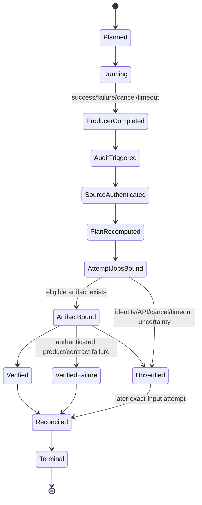
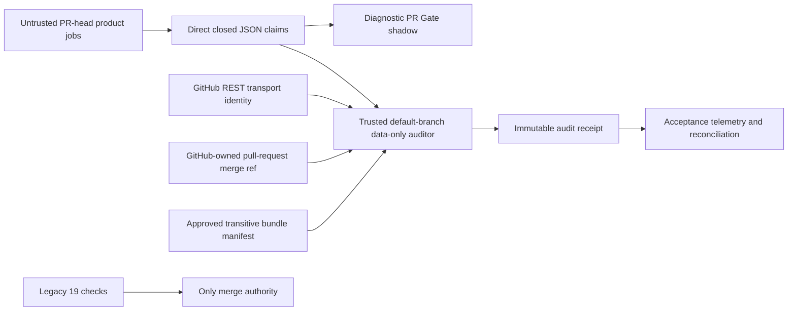

# Feature design: CI shadow closure and exact-SHA evidence

- Status: APPROVED
- Implementation status: IN PROGRESS
- Owner: dpone maintainer
- Issue: [#512](https://github.com/PaulKov/dpone/issues/512)
- Target release: TBD
- Last verified: 2026-08-30

The status in this file is not self-authenticating approval. It becomes
repository evidence only when the exact PR head carrying this specification is
reviewed by the owner, the `Agent PR receipt` succeeds, all required contexts
resolved from the canonical active policy succeed without bypass, and the merge commit is recorded in
issue #512. Until that sequence completes, architecture implementation PRs may
be prepared but must not merge.

## Executive summary

`DPONE-CI-SHADOW-CLOSURE` introduces a measured, non-authoritative
`PR Gate shadow` while preserving the required contexts resolved from the
canonical active policy as the only merge authority. The shadow path classifies a pull request, runs
only the relevant product jobs, publishes one data-only evidence file, and is
audited by trusted code from the default branch without executing pull-request
content.

GitHub Actions may create exactly one check context named `PR Gate shadow`.
No Actions workflow may create `PR Gate`. That name is reserved for a future,
separately administered GitHub App whose positive App ID is not GitHub Actions
App ID `15368`. Provisioning that App, activating union/final protection,
mutating rulesets or classic protection, tags, release workflows, publication,
and release credentials are outside this goal.

The closure is successful when routing, exact-attempt auditing,
reconciliation, immutable two-phase compatibility, default-deny readiness, and
read-only policy observation are implemented and measured under the unchanged
legacy authority. It does not claim or perform production cutover.

## Personas and customer journey

| Persona | Goal | Current pain | Success signal |
| --- | --- | --- | --- |
| Contributor | Understand why a PR ran or skipped each shadow job | Legacy checks do not explain component routing | One exact-head plan and one `PR Gate shadow` result list every selected and `N/A` job |
| Merge owner | Merge only with existing protection | A new diagnostic check could be mistaken for authority | All canonical active required contexts remain required and no bypass or live mutation occurs |
| Shadow auditor operator | Verify one producer attempt safely | Producer artifacts and self-described `PASS` are untrusted | Default-branch auditor binds API identity, direct JSON bytes, claims, and its own revision |
| Security reviewer | Prove privileged jobs never execute PR-controlled code | `workflow_run` can receive write tokens or secrets | Auditor plus verifier preflight/evaluator are data-only; candidate execution is isolated, unprivileged, cacheless, and fail-closed |
| Policy observer | Compare repository intent with live state | Dry-run and apply surfaces can be confused | Policy tooling exposes load, resolve, GET-only snapshot, diff, and receipt; no mutation transport exists |

### Journey

1. **Discover.** The contributor sees that shadow is diagnostic and the legacy
   canonical active required contexts remain the only merge authority.
2. **Prepare.** The workflow derives exact repository, PR, `B/H/M`, run, and
   attempt identity without a write credential or secret. Fork approval is
   fail-closed telemetry until the live canary establishes the platform
   lifecycle.
3. **Configure.** A closed route policy defines every path class. Every evidence
   upload explicitly declares 90-day retention. No repository-admin credential,
   protection mutation, or retention-settings prerequisite is required. Before
   the PR 4C reconciler child is approved, a separately approved read-only
   calibration probe records the request, byte, and wall-time headroom proof.
4. **Execute.** The PR-head producer publishes `PR Gate shadow` and one
   attempt-specific claims file. Trusted default-branch code audits only bounded
   data and never executes subject content.
5. **Observe.** The contributor sees producer status, audit receipt, selected
   and `N/A` jobs, exact identities, and the current reconciliation report.
   The report is scoped to its provider-observable exact interval.
6. **Diagnose.** Stable codes distinguish authenticated failure from missing,
   malformed, ambiguous, cancelled, stale, API-unavailable, resource-limited,
   and retention-lost evidence.
7. **Recover.** A source fix creates a new head; a producer or auditor retry
   creates immutable attempt evidence; reconciliation rescans the whole declared
   interval. Moved merge identity or ambiguous fork lifecycle requires a fresh
   eligible event. Historical loss stops `PASS` for every overlapping interval;
   a fresh auditable attempt establishes only new exact-head evidence, while
   daily-root recovery waits until a later complete clean window excludes the
   lost attempt. Neither path relabels the old report.
8. **Operate.** Daily stateless reconciliation surfaces shadow/legacy
   disagreement without cursors, predecessor state, or protection changes.
9. **Upgrade.** Child PRs land independently. PR 6 public readiness waits for
   authenticated PR 5B evidence, and PR 7 settings observation stays optional
   and non-authoritative.

## Scope

### In scope

- repair the exact baseline and enforce module-size ratchet v2 before CI
  architecture changes;
- CI hygiene that does not modify release workflows;
- a semantic PR-reachable privilege boundary;
- an always-on, non-required `PR Gate shadow`;
- a trusted data-only auditor and attempt-aware reconciliation;
- immutable candidate identity and a completed-producer/default-branch verifier;
- exact-subject, default-deny readiness evidence and crash-safe report pairs;
- a dormant, read-only CI shadow policy v2 and live observation receipts;
- route, burst, cancellation, failure/recovery, SLO, and exact-SHA acceptance
  evidence.

### Non-goals

- an Actions-produced `PR Gate`;
- provisioning or implementing the future GitHub App;
- activating `union` or `final` protection, or changing the canonical active
  required contexts;
- changing ruleset `18806829`, classic protection, repository variables,
  bypass roles, tags, release workflows, release concurrency, release
  publication, or release credentials;
- executing untrusted content in the trusted shadow auditor, verifier
  preflight/evaluator, any `pull_request_target`, privileged job, or self-hosted
  runner; the explicitly unprivileged Workflow-B executor is the only
  `workflow_run`-reachable execution exception;
- reducing the full PR profile before a separate comparative objective;
- changing data-plane manifests, connectors, checkpoint ordering, or runtime
  idempotency;
- adding a generic CI plugin, event bus, evidence store, or workflow polling
  framework.

### Assumptions and constraints

- PR 1 integrated as merge commit
  `0fa1b35bfd20c35fa0cb2a8c3dfa966d7afc11d4` before this specification;
  PR 1 itself remains the only baseline repair permitted to precede the
  specification amendment.
- The live authority is a time-bound observation. On 2026-08-30, ruleset
  `18806829`, classic protection and
  `.agents/policy/github-branch-protection.yml` all resolved the same 21
  contexts from GitHub Actions App ID `15368`. Operational consumers resolve
  the current set from canonical active policy bytes rather than copying this
  observed count.
- The full compatibility contract includes Python 3.11 and 3.12, eight Airflow
  cells, and both runtime-wheel smoke cases.
- PR-scoped concurrency may cancel stale heads. It is not a durable lock and
  never erases attempt identity.
- `workflow_run` edges are hard-limited to one downstream hop in this
  architecture: producer depth 0, auditor/verifier depth 1. Cycles and any
  downstream trigger from depth 1 are rejected. GitHub's additional platform
  capacity is not an implementation reservation; a future finalizer requires a
  new approved ADR and architecture test.
- PR5B post-upload certification is a separate explicit read-only
  `workflow_dispatch`, not a downstream trigger; architecture tests reject any
  `workflow_run` trigger in that workflow, so it does not amend this depth cap.

## Public contract

### Check contexts and authority

- `.github/workflows/pr-gate-shadow.yml` has a `pull_request` trigger without
  `paths` or `paths-ignore`.
- Exactly one always-existing aggregator job has the exact display name
  `PR Gate shadow` and uses `if: always()`.
- Static policy tests reject a second `PR Gate shadow` and any Actions job named
  `PR Gate`.
- `PR Gate shadow` is never required during this goal.
- The PR-head aggregator publishes that context from its own untrusted producer
  attempt. The read-only `workflow_run` auditor never creates or updates a PR
  check and cannot retroactively recolor the producer context.
- The canonical active required contexts remain unconditional and are the only
  merge authority.
- Future `PR Gate` authority requires both context `PR Gate` and a separately
  administered trusted App ID greater than zero and different from `15368`.

### Change plan and routing

`dpone.ci-change-plan.v1` is closed canonical JSON. It binds repository, pull
request, event, base/head SHA, route-policy digest, changed paths, semantic
configuration delta, selected jobs, `N/A` jobs, reasons, and plan digest.

The classifier uses an exact, rename-disabled, NUL-delimited diff. Duplicate
paths are normalized. Unknown paths, invalid identities, policy/schema errors,
or diff errors select the full route or fail the plan; they never silently
skip work.

Closure routing is:

| Change | Required shadow work |
| --- | --- |
| docs only | static contracts plus strict docs; no Python/Airflow matrix |
| `uv.lock` only | static, Python 3.11/3.12 core, package build, applicable wheel smoke; no Airflow scheduler matrix |
| root `pyproject.toml` | semantic TOML diff: tool/dev-only follows core; runtime/build/workspace changes add builds and both wheel smokes; Airflow full only when Airflow compatibility policy changes |
| core | static, contracts, Python 3.11/3.12, packaging; no Airflow unless the changed dependency surface requires it |
| PostgreSQL | core route plus PostgreSQL XMin |
| Airflow pack/provider policy, constraints, or compatibility workflow | core, Airflow build, full eight-cell matrix, both wheel smokes |
| control, classifier ambiguity, or unknown path | full shadow route |

The activation-dependency probe belongs to wheel smoke rather than every
Airflow cell. During this closure every selected Airflow route retains all
eight cells. Representative routing is not activated.

The closed job vocabulary is `static`, `contracts`, `docs`, `python-3.11`,
`python-3.12`, `packaging`, `postgresql`, `airflow`, and
`runtime-wheel-smoke`. Matrix cases are children of their owning job, not
additional aggregate contexts. The exact live authority names remain
defined once by `.agents/policy/github-branch-protection.yml`; this design does
not copy them into a second active policy.

### CI hygiene

- PR 3A-owned non-release CI project-environment synchronization uses
  `uv sync --locked`; its exact allowlist, preserved options, validation, and
  release-workflow exclusions are frozen in the
  [PR 3A executable child specification](feature-design-ci-shadow-pr3a-ci-hygiene.md).
- Dependabot uses the `uv` ecosystem every Monday with open-PR limit 3,
  timezone `Europe/Berlin`, and labels `dependencies` and `python:uv`.
- Dependabot GitHub Actions updates run every Wednesday with open-PR limit 2,
  timezone `Europe/Berlin`, and labels `dependencies` and `github-actions`.
  PR 3A verifies that all three labels exist before relying on them.
- Pull-request concurrency is PR-scoped and cancels only a stale head of the
  same PR. Nightly non-release compatibility uses a stable group,
  `queue: max`, and `cancel-in-progress: false`.
- Legacy and shadow Airflow matrices use `max-parallel: 2`; shadow wheel smoke
  uses `1`; nightly full compatibility uses `4`.
- Pages on a PR validates only. A stable whole-workflow concurrency group, a
  separate read-only current-master freshness job, and SHA/`run_attempt`-bound
  outputs prevent an obsolete or deploy-only rerun from reaching the protected
  default-branch deploy job. Non-PR build/upload is eligible only on attempt
  `1`; every non-PR rerun is unsupported, recovery always creates a new
  current-master run and artifact namespace, and skipped deploy is
  `NOT_RUN/UNVERIFIED`, never deployment PASS. Deploy permissions remain
  isolated to that job.
- Dependency Review remains a native read-only check on both PR test-merge and
  exact `master` push subjects; manual dispatch and synthetic backfill are
  removed so release exact-commit evidence remains available without write
  authority.
- Release workflow files, release dependency installation, and release
  concurrency are unchanged.

### Producer evidence

The producer writes one UTF-8 closed JSON document, at most 1 MiB, with bounded
depth, collection counts, and string lengths. Duplicate JSON keys, non-finite
numbers, unknown fields, invalid Unicode, or trailing bytes are blockers.

The normative schema path is
`docs/schemas/cicd/pr-gate-shadow-evidence-v1.schema.json`. JSON Schema enforces
the closed shape, types, local `maxProperties`/`maxItems`, character-length
bounds, and numeric ranges it can represent. The streaming parser separately
enforces maximum depth 8, 1,024 aggregate object members, 4,096 aggregate array
items, 256 members in one object, 1,024 items in one array, and 65,536 UTF-8
bytes in one string before materializing a value. Integers are non-Boolean,
unsigned, and at most 64-bit. Parser-limit failures use
`JSON_LIMIT_EXCEEDED`; representable schema failures use `JSON_SCHEMA_INVALID`.
Parity tests cover ASCII/multibyte strings, local versus aggregate counts, and
every exact boundary; the schema never claims to enforce global tree budgets.

The filename is immutable and attempt-specific:

```text
pr-gate-shadow-evidence-<run_id>-<run_attempt>.json
```

It is uploaded with pinned `actions/upload-artifact`, `archive: false`,
`overwrite: false`, and 90-day retention. With direct upload, the filename is
the artifact name and the action's `name` input is not used.

The payload contains claims only. The following is an abbreviated explanatory
excerpt; it is intentionally not schema-valid because the other eight mandatory
job keys are elided. Normative fixtures contain all nine keys.

```json
{
  "schema_version": "dpone.pr-gate-shadow-evidence.v1",
  "pr_number": 123,
  "repository_id": 456,
  "head_repository_id": 789,
  "base_ref": "master",
  "head_ref": "feature/example",
  "base_sha": "<40-hex>",
  "head_sha": "<40-hex>",
  "merge_sha": "<40-hex>",
  "subject_tree_oid": "<40-hex>",
  "workflow_blob_oid": "<40-hex>",
  "producer_run_id": 123,
  "producer_run_attempt": 2,
  "plan_digest": "sha256:<hex>",
  "implementation_bundle_digest": "sha256:<hex>",
  "jobs": {
    "static": {
      "selection": "RUN",
      "cases": {
        "default": {"outcome": "PASS", "command_id": "shadow.static"}
      }
    }
  },
  "status": "PASS"
}
```

It cannot contain its own artifact ID, provider digest, URL, or provider size,
because those values exist only after upload. Self-described status is never
authority.

`head_sha` is the authenticated pull-request head `H`; GitHub REST
`workflow_run.head_sha` also binds `H` and must never be relabelled as the
synthetic pull-request merge `M`. REST `run/check_suite.pull_requests[]` is
mutable and may become empty; it is diagnostic only and neither its membership
nor its SHA fields are attempt authority.

`pr_number`, repository IDs, base/head refs, `base_sha`, and `merge_sha` are
event-generated producer claims, not API authority. Before accepting them, the
read-only auditor completely enumerates open PRs and defines exactly one
eligible tuple:

```text
(base_repository_id = run.repository.id,
 base_ref = protected default branch,
 base_sha = B,
 head_repository_id = run.head_repository.id,
 head_ref = run.head_branch,
 head_sha = run.head_sha = H,
 pr_number = claimed N,
 state = open,
 mergeable = true,
 merge_commit_sha = refs/pull/N/merge = claimed M)
```

Pagination must be complete. Another open PR with the same base/head repository
IDs, refs, and SHAs is an ambiguous twin and rejects; PR number alone is not
uniqueness. For the claimed PR, the auditor performs bounded polling of exact
`GET /pulls/N` until mergeability is non-null, resolves the GitHub-owned
read-only ref through an injected Git-ref port, and requires two consecutive
identical full observations of the tuple and the complete eligible-set digest.
Every observation independently repaginates the complete open-PR set before it
polls the exact PR, resolves the ref, and loads its parents; no observation may
reuse a list captured by an earlier read. At most five observations or 30
seconds are allowed; timeout, stale PR response/ref mismatch, partial
pagination, conflict, or ambiguity is `AUDITOR_MERGE_REF_UNVERIFIED`.

The auditor loads immutable `M`, requires exactly two ordered parents `(B, H)`,
and compares them with the stable tuple and claims. Immediately before
persisting the receipt it repeats the complete enumeration, exact-PR polling,
ref resolution, and parent check; the same tuple and OID must still match. This
final read is the audit linearization point. Any final failure is folded into a
schema-valid `UNVERIFIED/AUDITOR_MERGE_REF_UNVERIFIED` receipt before
persistence; only receipt-storage failure may prevent the receipt. Because the
provider-owned ref still equals the collector's `GITHUB_SHA=M` claim at that
point, it authenticates the current merge snapshot without giving the PR
workflow OIDC, write permission, or a secret. It does not claim that a mutable
ref proves a historical event `M`; product execution is independently bound to
`H`. If the ref moved while the PR remains open, recovery requires a genuinely
new `pull_request` event/run (normally a new/rebased head), never rerunning the
old event. If the PR was closed/merged or the ref disappeared, the old attempt
is terminal `UNVERIFIED`; only a new corrective PR can create new evidence.

`subject_tree_oid` binds the `H` tree actually checked out for product and
control commands, and `workflow_blob_oid` is accepted only when the exact
workflow path has the same regular-file mode and blob OID in `B`, `H`, and
provider-bound `M`. A PR that changes the producer workflow is deliberately
`UNVERIFIED` until that workflow is merged and becomes the common base for a
later attempt. Every producer
product/control job that executes repository bytes checks out the event's exact
head repository at immutable `H` with a fully
pinned `actions/checkout`, `persist-credentials: false`, `submodules: false`,
and clean checkout semantics. Before any repository command, the job proves a
clean worktree, `git rev-parse HEAD == H`, and the expected subject tree OID.
No job may rely on checkout's default PR merge ref. A mismatch fails before
product execution and is visible in the provider job conclusion.

Same-repository, fork, and Dependabot producers use the same read-only profile:
no Actions secret, environment, write token, OIDC, or trusted cache. Provider
approval behavior is not promoted to an identity contract. An immutable incoming
`workflow_run` payload with `conclusion=action_required` may produce only
receipt-free `PENDING_OBSERVER` telemetry; the design does not assume GitHub
always emits that delivery or later reuses its run/attempt identity. A current
API `action_required` observation is
`UNVERIFIED/PROVENANCE_APPROVAL_PENDING`. Only an independently authenticated
post-start completed attempt enters audit. Unknown, inaccessible, moved,
deleted, closed/reopened, or ambiguous lifecycle forms stay `UNVERIFIED`, and
recovery uses a fresh eligible PR event/head when no auditable completion
materializes. After PR 4B's safe fallback is merged, the live public-fork
canary required before PR 4C implementation must capture the event and API
sequence. Dependabot keeps its documented fork-equivalent
read-only/no-Actions-secrets boundary.
The auditor's `pull-requests: read` permission enumerates base-repository open
PRs; it never asks a fork to publish trusted evidence.

`jobs` contains exactly the nine keys in the closed job vocabulary. Every job
has `selection=RUN|N/A` and a closed `cases` object. A non-matrix job has only
`default`; Airflow has the eight exact `(2.10.5|2.11.0|3.2.0|3.3.0) x
(3.11|3.12)` case IDs; runtime wheel smoke has `3.11` and `3.12`. Each case has
only `outcome=PASS|FAIL|N/A` and a trusted-policy `command_id`; arbitrary shell
text is forbidden. `N/A` is valid only when both the trusted plan and every
case say `N/A`. The root status is the claimed fold over all cases.
The PR 4A child contract freezes a separate closed provider-workflow job set:
planner, the jobs/cases required by those nine selections, and final claims
aggregator `PR Gate shadow`. The claims `jobs` object never hides
those infrastructure jobs; the auditor binds both vocabularies independently.
Product command steps and jobs may not use `continue-on-error`: each required
command fails its provider job natively. A post-product step on the same mutable runner
is never an enforcement boundary, because untrusted PR code can alter runner
state. Every evidence matrix sets `strategy.fail-fast: false`, so one failing
cell cannot cancel sibling evidence. A separate global `if: always()`
claims-collector job sees all `needs` results,
then uses only `actions: read` to page its own exact run-attempt Jobs API and
derive every matrix case name/provider conclusion; it never relies on matrix
output merging. It uploads the single claims document even when a product job
fails, and no per-cell machine artifact is introduced. The auditor independently
repeats the API query, so producer aggregation remains an untrusted claim. This
fresh aggregator is the only job named `PR Gate shadow`; it folds native product
conclusions without running after untrusted code on the same runner.

The claims collector is checkout-free, cache-free, and download-free. Its
identity fields come only from direct GitHub event expressions
(`repository_id`, PR number, base/head repository IDs and refs, `B`, `H`, and
`GITHUB_SHA=M`) wired by the byte-identical `B/H/M` workflow into a closed static
encoder; no `needs` output, product artifact, PR environment, or candidate shell
text can supply or override them. Its fixed encoder and allowed context paths are
`TRUST_CORE` entries in the approved bundle. Only provider job conclusions come
from the attempt Jobs API. This gives the later read-only audit an
event-generated correlation claim without making producer self-description
authoritative or giving the collector a write capability.

### Trusted shadow audit receipt

The default-branch audit workflow evaluates only an independently authenticated
post-start completed producer attempt. An immutable incoming event whose own
`conclusion=action_required` is receipt-free `PENDING_OBSERVER` telemetry,
not an auditor identity; it downloads no claims and is excluded from duplicate
auditor detection. This is a one-way fail-closed rule, not a promise that the
provider emits an action-required delivery or preserves the same run ID or run
attempt after approval. Current pending API observations belong to stateless
reconciliation. Two independent post-start auditor workflow run IDs remain an
ambiguity blocker. It records two authoritative revisions:

- `auditor_revision_sha = GITHUB_SHA`, the trusted default-branch revision;
- `producer_head_sha = github.event.workflow_run.head_sha`, independently
  matched to REST `run.head_sha` and provider-bound merge parent `H`.

The auditor never derives `B`, `H`, or `M` from current mutable PR association
SHA fields. It accepts claimed `M` only when the exact GitHub-owned pull-request
merge ref still resolves to that OID, then requires parents `(B, H)` plus REST
`run.head_sha == H`. Missing, moved, ambiguous, conflicted, or expired merge
identity is `AUDITOR_MERGE_REF_UNVERIFIED`. A workflow blob/mode mismatch across
`B/H/M` is `AUDITOR_WORKFLOW_SOURCE_UNVERIFIED`.

Before download it queries GitHub REST metadata and verifies repository and
head repository, run ID/attempt, workflow ID/path, event, branch, subject head
SHA/tree OID, provider merge-ref identity, `B/H/M` parentage and workflow blob equality,
status, conclusion, timestamps, artifact ID/name/digest/size/expiration, and
the unique eligible match. Producer fields are claims compared with API data.

The auditor also authenticates the exact pull request, base and head commits;
walks both immutable Git trees by object ID; rejects truncated, incomplete,
over-limit, non-blob, or submodule input; and computes a rename-disabled path/OID
diff itself rather than trusting provider rename heuristics. It reads only the
bounded configuration blobs needed for semantic routing. Trusted default-branch
classifier and route policy code independently recompute canonical plan bytes
and digest. It pages
`/actions/runs/{run_id}/attempts/{attempt}/jobs`, rejects incomplete pagination,
and binds the exact expected workflow job IDs, matrix case names, statuses,
conclusions, and terminal timestamps. Producer outcomes remain claims; provider
job/case conclusions and the independently recomputed plan decide the audit.

Download uses exact repository, run ID, and artifact ID into `runner.temp`,
with `skip-decompress: true` and `digest-mismatch: error`. The auditor never
checks out the PR head, restores a cache, imports producer modules, evaluates
YAML/pickle, sources data, or executes/interpolates downloaded bytes. Rich
diagnostics may be uploaded separately for humans; the auditor never reads
them.

The attempt-specific receipt is:

```text
pr-gate-shadow-audit-<producer_run_id>-<producer_attempt>-<auditor_run_id>-<auditor_attempt>.json
```

The auditor stages that exact filename, fsyncs it, and uploads it directly with
`archive: false`, `overwrite: false`, and 90-day retention before returning its
decision. A receipt-upload failure is `AUDITOR_RECEIPT_PERSIST_FAILED`; the run
cannot report verified success.

The normative audit schema is
`docs/schemas/cicd/pr-gate-shadow-audit-v1.schema.json` with the same parser
budgets. `dpone.pr-gate-shadow-audit.v1` contains exactly:

- `schema_version`, `decision=PASS|FAIL|UNVERIFIED`, and
  `audit_stage=EVENT_RECEIVED|RUN_AUTHENTICATED|PLAN_RECOMPUTED|JOBS_BOUND|CLAIMS_BOUND`;
- required `observed_event`: repository, workflow-run ID, event head repository
  and head SHA, event status/conclusion, receipt timestamp, and canonical
  `observation_key` over repository, producer run ID/attempt, auditor workflow
  ID/revision, and immutable event head identity;
- nullable `producer_identity`, which when `audit_stage>=RUN_AUTHENTICATED`
  contains authenticated base/head repository names and numeric IDs, PR number,
  base/head refs, base/head/merge SHA,
  subject tree OID, exact pull-request merge ref/OID plus initial/final
  resolution timestamps, equal
  `B/H/M` workflow blob OID, workflow ID/path, event,
  branch, run ID/attempt, status, conclusion, and created/updated timestamps;
- tagged `claims_evidence`: `MISSING` is allowed only when no unique usable
  transport artifact can be selected or downloaded and records that exact
  transport blocker; `PRESENT` always binds artifact ID/name/provider
  digest/size/expiration and local raw-byte SHA-256, then carries
  `parse_status=VALID|INVALID` plus a nullable canonical claims digest that is
  non-null only for `VALID`. Merge-ref, workflow, plan, job, or bundle failure
  never relabels already downloaded bytes as missing;
- nullable phase outputs `recomputed_plan_digest`, `attempt_jobs_digest`, and
  `implementation_bundle_digest`, each with a companion completed-phase flag;
- `auditor_identity`: workflow ID/path, trusted revision, run ID/attempt;
- sorted closed `blockers`, trusted `reproduction_command_ids`, optional
  `resolves`, and no unknown fields.

It does not contain the identity of its own not-yet-uploaded artifact. Shadow
audit requires provider metadata, the exact provider-owned merge ref and
immutable parents, locally recomputed digests, semantic revalidation, and the
trusted receipt. It does not create or require an attestation.

`PASS` requires `claims_evidence=PRESENT`, `parse_status=VALID`, and every phase output non-null.
Authenticated product/contract failure also requires a unique transport-bound,
`PRESENT/VALID` subject plus completed merge-ref, plan, bundle, and attempt-job
phases; the claims' self-described status is ignored. Actual transport
absence uses `MISSING`. Invalid JSON retains `PRESENT/INVALID` raw transport
identity; later merge/workflow/plan/job/bundle uncertainty retains the existing
`PRESENT` tag and uses nullable phase results plus exact blockers. Artifact or
merge-ref identity missing/duplicate/expired after any producer conclusion is
always `UNVERIFIED`, never `FAIL`.

Stage invariants are monotonic: each stage requires all prior-stage fields;
later-stage fields must be null before that stage. `PASS` requires
`CLAIMS_BOUND`; authenticated `FAIL` requires at least `JOBS_BOUND`;
`UNVERIFIED` is valid at any stage with an exact blocker. Thus even an API or
permission failure can persist a schema-valid receipt without inventing an
identity or digest.

### Transitive implementation bundle

`dpone.ci-shadow-bundle.v1` has canonical approval path
`.agents/policy/ci-shadow-bundle-v1.yml` on the auditor's trusted default-branch
revision. It is a closed manifest over the workflow,
classifier, evaluator, route policy/schema, every local import/read file/called
script in the routing/evidence control plane, and every pinned external action.
It does not recursively absorb subject workload inputs: product source,
packages, tests, `uv.lock`, build inputs/outputs, and command-ID product programs
remain untrusted PR data exercised by jobs, not approved control-plane bytes.
Manifest roles explicitly distinguish `TRUST_CORE` from `SUBJECT_INPUT`; a file
that can affect route selection, evidence encoding, outcome folding, identity,
or audit is always `TRUST_CORE` and cannot be excluded as workload. A static dependency closure test
rejects dynamic imports, `exec`, `eval`, undeclared helpers, local actions,
local reusable workflows, or unknown dependencies. Unknown closure is
`UNVERIFIED`, not partial approval.

The auditor obtains every producer workflow/local dependency from immutable Git
tree and blob objects, verifies regular-file mode, confined canonical path,
size, blob OID, and SHA-256, then recomputes the manifest digest. The manifest
assigns the producer workflow YAML the role `EXECUTION_WORKFLOW`; its path,
mode, and blob OID must be identical in exact base `B`, subject `H`, and
provider-bound merge `M`. It
resolves checked-out local control-plane files with role `SUBJECT_TRUST_CORE`
from authenticated subject tree `H`. It statically requires every
product/control job to perform the exact `H` checkout and pre-command identity
proof above. It compares that closed subject/workflow closure with the exact
trusted-revision manifest; the producer's bundle digest is only a claim. Any
extra, missing, symlink, submodule, dynamic, unread, mismatched, changed-between-
parents, or identity-unbound dependency is `AUDITOR_BUNDLE_UNAPPROVED`.
Focused taint/closure tests prove that changing a classifier/evaluator/helper or
policy byte invalidates approval, while changing only declared product source,
tests, package inputs, or lockfile leaves the control-plane digest stable and is
still bound through exact subject SHA and provider job conclusions.

### Stateless attempt-aware reconciliation

PR 4C is a bounded diagnostic observer, not a state store. The approved
machine-readable **design fixture** is
`test_artifacts/agent-policy/dpone-ci-shadow-reconciliation-mvp.yml`, validated
by the adjacent closed JSON Schema. It is `runtime_consumable=false` and is
never passed to a production command. The PR 4C reconciler child contract must freeze an
exact canonical runtime object owned by
`dpone.contracts.ci_shadow_reconciliation.ReconciliationPolicyV1`; the
composition root injects that object into the service. There is no external
`--policy` argument or mutable operator choice that can shrink the scan.

#### Observation interval and pagination

The source-free default-branch reconciler runs daily at 03:15 UTC. An injected
trusted UTC clock is floored to a whole RFC 3339 UTC second:

```text
observation_started_at = floor_to_utc_second(trusted_clock.now_utc())
safe_scan_through = observation_started_at - 30 minutes
scan_from = safe_scan_through - 14 days
scan_interval = [scan_from, safe_scan_through]  # closed UTC seconds
```

Every invocation scans that exact 14-day provider-observable interval from
scratch. The 30-minute grace period excludes runs that may still be appearing
or changing. The report says `provider-observable exact interval`; it is not
proof that no hidden, manually deleted, or provider-omitted run ever existed.

Producer discovery uses the exact workflow endpoint and
`event=pull_request&created={lo}..{hi}&per_page=100&page={page}`. Auditor
discovery uses the exact auditor workflow endpoint over
`[scan_from, observation_started_at]` with `event=workflow_run`. For both:

1. one complete whole-window observation independently constructs and pages
   the entire deterministic partition tree, enumerates producer and auditor
   run/attempt records plus exact-attempt Jobs pages and artifact inventories,
   and downloads every selected bounded artifact byte sequence;
2. a slice with `total_count < 1,000` is a completely paged leaf;
3. a slice with `total_count >= 1,000` and `lo == hi` is irreducible and
   `UNVERIFIED`; an adjacent-second `[lo, hi]` splits into `[lo, lo]` and
   `[hi, hi]`; every wider slice splits at its whole-second midpoint into
   closed children `[lo, mid]` and `[mid, hi]`;
4. a shared midpoint second is deliberately observed twice; byte-identical
   stable keys deduplicate, while the same key with changed canonical bytes is
   `UNVERIFIED`;
5. the service performs two consecutive complete whole-window observations;
   their partition topology, total counts, canonical run/attempt/Jobs/artifact
   records, downloaded bytes, and all response/content digests must be
   identical;
   and
6. repeated/missing pages, changed records, partition-depth overflow, or a
   partial response are `UNVERIFIED/API_PAGINATION_INCOMPLETE`.

The second matching whole-window observation is the report's
`evidence_observed_through` boundary. Report persistence follows immediately
without another provider read. Evaluation uses only the bounded bytes retained
from that second observation; a later run/rerun belongs to the next report. The
report claims only the set visible under this exact double-observation
protocol; the 30-minute grace reduces but does not relabel provider omission or
later appearance.

#### Cross-window auditor classification

Auditor discovery deliberately reaches through the 30-minute producer grace so
that every visible auditor record is explained instead of silently discarded.
During **each** complete whole-window observation, every auditor record therefore
causes an exact producer-run lookup. That lookup, its retries, Jobs and artifact
reads, and all response bytes consume the same global budgets as list discovery.
The only timestamp authority for interval membership is the exact producer root
workflow run's provider-authenticated `workflow_run.created_at`; an auditor rerun
does not move the producer into a newer interval.

The closed classification is:

| Producer `created_at` | Current-report outcome | Root effect | Recovery |
| --- | --- | --- | --- |
| `< scan_from` | `OUT_OF_SCOPE_OLD_PRODUCER_RERUN` | diagnostic only | `CREATE_NEW_PRODUCER_RUN` |
| `scan_from <= created_at <= safe_scan_through` | `EVALUATE_NORMALLY` | fold the producer and selected auditor receipt | normal attempt recovery |
| `safe_scan_through < created_at <= observation_started_at` | `DEFER_TO_NEXT_REPORT` | diagnostic only | wait for the next report |
| `created_at > observation_started_at` | `UNVERIFIED / RECONCILIATION_FUTURE_PRODUCER` | block the current report | verify trusted time/provider identity, then rerun |

An exact producer run inside the interval that is absent from the independently
complete producer query is
`UNVERIFIED/RECONCILIATION_PRODUCER_QUERY_OMISSION` with
`RECONCILIATION_RETRY`. Missing, foreign, wrong-workflow, wrong-event, or
otherwise unresolvable producer identity is
`UNVERIFIED/RECONCILIATION_PRODUCER_IDENTITY_UNRESOLVABLE` with
`VERIFY_PRODUCER_IDENTITY_OR_CREATE_NEW_RUN`. Both block the current report.
Every auditor record receives one of these explicit classifications, stable
codes, and recovery command IDs in report bytes. The reconciler never expands
`scan_from` backward to make an old producer authoritative, and a rerun of an
old producer never repaints the current daily root.

List order, page order, artifact creation order, and current PR association SHA
fields are never authority. The raw workflow-run stable key is
`(repository_id, workflow_id, run_id)`. After listing, the reconciler
enumerates every attempt `1..run_attempt` using attempt-specific run and Jobs
APIs; the producer evidence key is
`(repository_id, workflow_id, run_id, run_attempt)`.

There is no cursor, predecessor state, unresolved ledger, genesis state, DAG,
ACI lattice, tombstone, external sort, checkpoint promotion, or
manifest/state/finalization transaction. No previous reconciliation report is
an input. In particular, there is no “latest artifact wins” rule and a missing
older report cannot silently change the current interval.

#### Auditor receipt selection

For each in-window producer key, PR 4C evaluates the matching trusted auditor
workflow runs, attempts, Jobs, inventories, and receipt bytes captured by the
second complete observation. Cross-window auditor records first follow the
classification above. Within one auditor
workflow run, the **highest observed attempt** must be terminal before its
receipt can be selected. If a higher requested, queued, or in-progress attempt
exists, the producer key is `UNVERIFIED`; an earlier completed `PASS` cannot
temporarily win. Lower completed attempts remain diagnostic lineage. Two
independent auditor workflow run IDs, different terminal decisions for the same
authenticated evidence, duplicate artifacts, or foreign identity is
`UNVERIFIED`.

#### Coverage, product, and rollout decisions

The report separates:

- `coverage_status=PASS|UNVERIFIED`, which describes pagination, transport,
  identity, retention availability, and resource completeness;
- each attempt's `product_status=PASS|FAIL|UNVERIFIED`; and
- root `decision`, folded as `UNVERIFIED > FAIL > PASS` for this exact
  interval.

An authenticated terminal product/auditor failure is `FAIL` only when no
coverage uncertainty exists. A missing/nonterminal/skipped/cancelled/timed-out/
action-required/stale attempt, higher nonterminal auditor rerun, incomplete
enumeration, missing/ambiguous receipt, identity mismatch, resource overflow,
or unavailable API is `UNVERIFIED`. `PASS` requires complete stable
pagination, every observed attempt terminal, exactly one authenticated selected
receipt per attempt, and no uncertainty or resource blocker.

Route canaries, deliberate FAIL/cancellation recovery, and two distinct-SHA
full runs are separate rollout oracles and are not daily `PASS` prerequisites
outside the interval. If any such attempt is visible inside the exact producer
interval, it is folded exactly like every other producer attempt: an expected
deliberate `FAIL` makes the daily root `FAIL`, and an expected cancellation
makes it `UNVERIFIED`. The acceptance oracle separately verifies that this was
the intended outcome; it never excludes or repaints the attempt. Canary
artifacts outside the interval are not fetched, so expiry cannot make daily
reconciliation permanently `UNVERIFIED`; a fresh acceptance campaign creates
fresh immutable evidence.

#### Fork-approval telemetry

Fork approval remains fail-closed telemetry. An immutable incoming
`workflow_run` payload whose own conclusion is `action_required` may no-op as
receipt-free `PENDING_OBSERVER`; this does not assert that GitHub always emits
that delivery. A current API action-required run is
`UNVERIFIED/PROVENANCE_APPROVAL_PENDING`. Only an independently authenticated
post-start completed attempt enters audit. The design does not require the same
run ID or run attempt. Unknown, moved, deleted, closed/reopened, rerun, or
otherwise ambiguous forms remain `UNVERIFIED`.

PR 4B first lands the safe fallback above on the default branch without relying
on lifecycle continuity. Then an authorized public-fork lifecycle canary
records its event journal and fully paginated run/Jobs observations before
approval, immediately after approval, while running, after completion, after
rerun, after close/reopen, and after deletion. That fork evidence is required
before the PR 4C reconciler child contract and implementation. Route, deliberate failure/
cancellation, burst, and distinct-SHA campaigns require the implemented PR 4C
report and therefore run only after PR 4C, before goal acceptance. Either class
may strengthen the lifecycle only through a reviewed amendment; absence never
weakens the fallback.

#### Retention and permissions

Each upload binds its own source authority and explicitly sets
`retention-days: 90`, `archive: false`, and `overwrite: false`:

| Evidence source | Upload-setting authority |
| --- | --- |
| PR-head producer | exact workflow path/mode/blob identical in authenticated `B/H/M` |
| default-branch auditor | allowlisted default-branch workflow ID/path/revision/ref/event/run/attempt |
| default-branch reconciler | allowlisted default-branch workflow ID/path/revision/ref/event/run/attempt |

PR 4C authenticates each required artifact's `created_at`, `expires_at`,
`expired`, provider digest, size, and bytes through ordinary Actions-read
metadata. GitHub `expires_at` is an observed availability deadline, not proof
that `expires_at - created_at == 90 days`; the latter equality is never
required. The source-specific authenticated workflow input proves the declared
retention request. Missing, expired, early-deleted, inconsistent, or unreadable
evidence makes the affected interval immutable
`UNVERIFIED/RECONCILIATION_RETENTION_HISTORY_LOST`.

Repository-level retention settings are optional PR 7 telemetry and never an
authority input for PR 4C. PR 4C has only `contents: read`, `actions: read`,
and `pull-requests: read`; it has no repository-admin, check-publication,
OIDC, secret, cache, setter, arbitrary-request, or mutation capability.

#### Reconciliation report and write transaction

Each invocation writes one immutable direct-JSON report named
`pr-gate-shadow-reconciliation-<observer_run_id>-<observer_run_attempt>.json`
with schema `dpone.pr-gate-shadow-reconciliation.v1`. The observer identity in
the filename is never a producer identity. The closed report contains:

- observer/repository/workflow identity and exact interval;
- literal scope `provider-observable exact interval`;
- `coverage_status`, per-attempt product records, root decision, blockers, and
  recovery command IDs;
- complete pagination counters for a normal result; or an explicitly incomplete
  `observed_at_least` lower bound and `last_complete_slice` after a resource
  stop; and
- provider-query digests only for completely observed slices.

The payload does not contain its own length or digest. Before write, the service
checks the 1,048,576-byte limit. After upload, provider artifact ID/digest/size
become transport identity for downstream readers.

Before any workflow integration, the PR 4C calibration-probe child must
introduce the exact capability port
`dpone.ports.evidence.CreateOnlyEvidenceWriterV1` and adapter
`dpone.adapters.filesystem_evidence.DescriptorPinnedCreateOnlyEvidenceWriter`.
The later reconciler child reuses that reviewed capability.
The existing `dpone.readiness.route_attestation_files.write_create_only` is not
authority for the stronger retry semantics and cannot be reused directly. Any
shared extraction or extension must preserve its existing public behavior and
pass the route-attestation compatibility suite before the new adapter is used.

The new confined adapter creates a same-attempt stage, writes bounded bytes,
file-fsyncs, commits without replacement, and parent-fsyncs. A retry that finds
a byte-identical target must descriptor-pin and revalidate the canonical root,
parent, leaf, inode, and bytes, then successfully fsync the file and parent in
the current attempt before returning idempotent success. Different bytes,
symlink, foreign inode, identity mismatch, or any failed durability barrier is
`UNVERIFIED`. Retry may remove only an authenticated same-attempt partial stage,
fsync the parent, and repeat. Failure before durable commit leaves no certified
target; failure after commit preserves the immutable target but remains
non-PASS until the current retry completes the durability barrier.

#### Resource limits and recovery

The numeric request, byte, and wall-time limits below are parent-owned **hard
maxima**, not provisional values that a child may expand. A separately approved
PR 4C calibration-probe child first introduces the read-only command
`tools/ci/calibrate_pr_gate_shadow_capacity.py`, workflow
`.github/workflows/pr-gate-shadow-capacity.yml`, canonical service/ports, and
closed schema
`test_artifacts/agent-policy/dpone-ci-shadow-reconciliation-capacity.schema.json`.
The source-free default-branch `workflow_dispatch` receives only the same
read-only permissions as the reconciler and changes no repository setting.

The probe runs the complete current 14-day double observation under the hard
maxima and publishes one create-only
`pr-gate-shadow-reconciliation-capacity-<observer_run_id>-<observer_run_attempt>.json`
artifact. Its `dpone.ci-shadow-reconciliation-capacity.v1` payload is always
`UNVERIFIED`; a complete matching within-threshold observation uses
`RECONCILIATION_CAPACITY_CALIBRATION_ONLY`, while incomplete, mismatched, or
over-threshold output uses `RECONCILIATION_PR4C_IMPLEMENTATION_BLOCKED`. Neither
certifies a daily root. The payload binds repository/default-branch workflow
path/revision/ref/event/run/attempt, policy SHA-256, exact interval, observation
boundary, matching-observation proof, counters, hard maxima, and thresholds.
The wrapper workflow and calibration CLI are authenticated by that source
identity and are deliberately excluded from the equality-constrained bundle:
the later reconciler has a different, independently authenticated wrapper and
composition root. The shared bundle instead contains the canonical acquisition
policy, service, ports, adapters, their transitive local imports/reads/called
scripts, `pyproject.toml`, and `uv.lock`. Traversal from the shared acquisition
service rejects dynamic/unresolved local inputs, absolute/dot-dot/non-UTF-8
paths, and symlinks.
Entries are unique and strictly ascending by UTF-8 repo-relative path bytes;
each path is at most 1,024 UTF-8 bytes;
each entry is `u32be(path_len) || path || six ASCII mode bytes || raw 32-byte
blob SHA-256`. With at most 4,096 entries, `manifest_bytes` is
`u32be(entry_count)` followed by repeated
`u32be(entry_len) || entry_bytes`. The bundle digest is
`SHA256(domain_utf8 || 0x00 || u64be(manifest_len) || manifest_bytes)` where the
domain is `dpone.ci-shadow-reconciliation-observation-bundle.v1`. The reconciler
child must prove its shared acquisition closure byte-identical; changing that
closure invalidates calibration. Calibration and reconciliation also match the
controllable runner label, architecture, and Python version; dependency locks
are already inside the shared bundle. Provider image version is diagnostic
telemetry, not equality authority; the two-times margin and runtime hard caps
remain fail-closed if the hosted image changes. Wrapper source identities remain
separate. The approval adapter selects one external provider artifact by exact
repository/run/attempt/ID/name, rejects provider ZIP archive size above
8,388,608 bytes before allocation, reads at most 8,388,609 archive bytes, and
verifies actual archive length and SHA-256 against the provider size and digest.
GitHub Actions artifact transport is ZIP, so provider metadata does not claim to
authenticate a direct JSON member. Only after archive authentication does the
adapter accept exactly one expected confined regular JSON member; duplicate
names, directories, symlinks, encrypted entries, traversal, unsupported
compression, or extra files are `UNVERIFIED`. It separately limits and records
the direct payload byte count and SHA-256, then parses those same payload bytes
with the existing duplicate-free/non-finite-rejecting strict JSON primitive. The
parsed tree is additionally capped at depth 32 and 50,000 nodes before schema
validation. Limit approval requires an unexpired,
complete artifact from the same approved policy/shared-bundle/configuration
revision, no crossed limit, and
`valid_until == calibration_observed_at + 24h`. Trusted approval time must be
greater than or equal to `calibration_observed_at` and strictly less than
`valid_until`.

The complete observation is current only when
`observation_started_at <= evidence_observed_through <=
calibration_observed_at` and
`calibration_observed_at - observation_started_at <= 900 seconds`. This UTC
ordering complements, but never replaces, the injected monotonic wall counter;
it prevents a recent stamp from qualifying an arbitrarily old 14-day scan.

Request accounting increments **before every outbound HTTP dispatch**. Closed
classes cover producer/auditor list pages, exact producer and attempt lookups,
Jobs pages, artifact metadata/download endpoints, followed redirects/blob
requests, Git objects, pull-request identity, and polling. Their canonical sum
equals `total_http_requests`; `retry_requests` is an intersecting subset, must
not exceed `total_http_requests`, and is not added again. Response bytes are the response-body octets delivered to the
application before archive decompression. The payload records API response-body
bytes, artifact-download body bytes, and their exact sum
`total_response_body_bytes`. To preserve a two-times safety factor inside parent
authority, complete observed usage must be at most 400 requests, 67,108,864
response-body bytes, and 450 wall seconds—half the hard maxima. Missing, stale,
partial, inconsistent, over-threshold, or untrusted calibration is
`RECONCILIATION_PR4C_IMPLEMENTATION_BLOCKED`; the reconciler child cannot be
approved. Exceeding a threshold requires a reviewed **parent** amendment; a
child cannot raise a hard maximum.

Below a hard limit, counters are exact. `limits_crossed` uses hard-maximum field
order, and every named counter serializes exactly its saturated hard maximum.
A request whose pre-dispatch increment
would exceed 800 is never sent. Byte streams read at most `remaining + 1` octets
to detect overflow; after crossing, the serialized counter saturates at the hard
maximum, `limits_crossed` names the byte budget, and counter semantics identify
the value as a lower bound. Wall time uses an injected monotonic clock from
immediately before first provider dispatch through final observation
evaluation. Every dispatch timeout is
`min(adapter_timeout, remaining_wall_budget)` and no dispatch starts with zero
remaining time. A crossed wall budget similarly serializes the saturated
900-second lower bound and cannot qualify capacity evidence.

| Boundary | Limit | Failure |
| --- | ---: | --- |
| provider results per time slice | 1,000 | split; irreducible same-second cap is `UNVERIFIED` |
| time-partition depth | 32 | `RECONCILIATION_RESOURCE_LIMIT` |
| API requests | 800 | stop immediately with incomplete lower-bound report |
| raw workflow-run / artifact records | 65,536 each | stop immediately with incomplete lower-bound report |
| aggregate API-response plus artifact-download bytes across both observations | 134,217,728 | stop immediately with incomplete lower-bound report |
| wall time | 900 seconds | stop immediately with incomplete lower-bound report |
| producer attempts / audit receipts | 4,096 each | stop immediately with incomplete lower-bound report |
| report bytes | 1,048,576 | compact `UNVERIFIED` report |
| JSON depth/members/items/string bytes | 32/256/4,096/65,536 | `JSON_LIMIT_EXCEEDED` |

Once any budget is crossed, enumeration stops. The report sets
`complete=false`, gives only `observed_at_least` and the last completely
verified slice, and never claims an exact total, first/last key, or digest for
the unseen set.

A retry is a new observer run and immutable report. Transient API failure uses
`RECONCILIATION_RETRY`. A lost required artifact makes that exact report and
every overlapping interval immutable `UNVERIFIED`. A fresh auditable producer
attempt may establish new exact-head evidence, but cannot repair a daily root
whose interval still contains the lost attempt; daily-root recovery waits until
a later completely observed clean window excludes it. A deterministic record,
partition, or output cap likewise waits for a clean window or a separately
approved limit amendment; only transient API/wall-time failure uses immediate
retry. A later `PASS` describes a different interval and never relabels the
older report. There is no in-band history repair, re-genesis, administrative
relabel, or migration prerequisite for ordinary rolling-window recovery.

### Immutable candidate and two-phase compatibility

Workflow A builds an immutable candidate and terminates. During this goal the
only authoritative producer is merged path
`.github/workflows/exact-sha-candidate.yml`, resolved to its API workflow ID,
triggered by `push` on `refs/heads/master`; subject SHA is the authenticated
run head SHA. Schedule, workflow dispatch, tag, other branch/path, same-run, and
non-allowlisted producers are diagnostic `UNVERIFIED`. Tags remain outside this
goal. The allowlist is merged repository policy, not producer input.

The producer exposes repository, workflow ID/path/blob, event/ref, subject SHA,
run ID/attempt, artifact ID/name, provider digest, and a sorted inventory digest.
`artifact_url` is navigation only. Identity and authorization use the
provider-authenticated repository/workflow/run head SHA, exact allowlisted
workflow and checkout proof, run ID, run attempt, artifact ID, provider digest,
and inventory digest. A SHA copied into candidate-controlled bytes is
self-description and is not authority. The attempt-specific candidate artifact contains exactly the root,
Airflow pack, and provider wheels plus one closed
`dpone.compatibility-candidate.v1` manifest. The manifest inventory is sorted by
confined filename and binds distribution, normalized version, SHA-256, and byte
size; duplicates, directories, symlinks, extra archives, invalid wheel names,
or cardinality other than three reject before candidate execution.

Default-branch Workflow B starts only from `workflow_run: completed`, performs
REST metadata preflight, and downloads by artifact ID. It has three explicit
boundaries: a trusted data-only preflight job; a GitHub-hosted unprivileged
executor job; and a trusted data-only evaluator that parses a closed executor
receipt but never imports, sources, or executes its outputs. Every job has only
the minimum `actions: read`/`contents: read` permission and no secret, write,
OIDC, environment, or private-network authority. This verifier is not the
shadow auditor: it intentionally executes candidate wheels only inside its
isolated executor. Same-run and manual or non-allowlisted producers can be
executed only as diagnostic evidence and can never be `VERIFIED`.

Candidate code executes only on a GitHub-hosted ephemeral runner with no
secrets, inherited secrets, write scopes, OIDC, cache restore/save, VPN,
private/on-prem endpoints, or cloud credentials. `actions/cache`, setup-python
cache, and uv cache are forbidden; `setup-uv enable-cache: false` is explicit.
The download token is not available to candidate execution steps. Candidate
outputs remain untrusted data, and no privileged follow-up executes them.

Candidate archives remain acceptable because only the unprivileged executor
opens them after metadata preflight. The trusted shadow evidence path remains
direct, single-file JSON.

### Evidence taxonomy

| Situation | Provenance | Compatibility | Evidence |
| --- | --- | --- | --- |
| allowlisted producer succeeds; tests pass | `VERIFIED` | `PASS` | `PASS` |
| allowlisted producer succeeds; tests fail | `VERIFIED` | `FAIL` | `FAIL` |
| allowlisted producer concludes `failure` | `VERIFIED` | `NOT_RUN` | `FAIL` |
| producer cancelled, timed out, action-required, stale, or skipped | `UNVERIFIED` | `NOT_RUN` | `UNVERIFIED` |
| same-run or non-allowlisted producer | `UNVERIFIED` | actual diagnostic result | `UNVERIFIED` |
| diagnostic verifier dispatch | `UNVERIFIED` | actual diagnostic result | `UNVERIFIED` |
| missing, malformed, expired, duplicate, or ambiguous artifact | `UNVERIFIED` | `NOT_RUN` | `UNVERIFIED` |

For the shadow auditor, producer success plus receipt `PASS` is expected;
producer failure plus receipt `FAIL` is expected; producer success plus receipt
`FAIL` is a blocker; producer failure plus receipt `PASS` is a critical
false-green. Cancelled or timed-out is never `PASS`.

Decision precedence is closed. Foreign/ambiguous identity, incomplete API
pagination, permission/outage uncertainty, cancellation, timeout, stale or
missing proof is `UNVERIFIED`. Matrix folding is deterministic: a missing or
nonterminal required case, or any required case concluded `cancelled`,
`timed_out`, `action_required`, `stale`, or `skipped`, makes the attempt
`UNVERIFIED` and takes precedence over a different case's failure. Only after
the exact case set is complete and none has an uncertainty conclusion does any
authenticated product/job/case or contract failure become `FAIL`, and only when
the unique transport-bound claims document is present. Missing producer JSON is
missing proof and remains `UNVERIFIED`. All required cases succeeding is
the only path to `PASS`. Whole-producer cancellation/timeout/skip uses the same
`UNVERIFIED` precedence. Auditor crash or receipt-persistence failure is
observed as `UNVERIFIED` by reconciliation.

### Readiness evidence

`--subject-commit` is mandatory for readiness commands. The default provenance
verifier denies authority. Fixture, local, stale, forged, legacy, malformed,
self-described, or unauthenticated producer evidence is `UNVERIFIED`; verified
failure is `FAIL`; only a verified exact-subject pass is `PASS`. A domain with
no authenticated producer cannot produce a production `PASS`.

Report pairs use staged writes, file fsync, atomic replace, parent-directory
fsync, and a recovery journal. Process crash and retry preserve truthful status;
host power-loss durability remains `UNVERIFIED` until separately certified.

The pair identity is `(output_directory, report_kind, subject_commit_sha)` and a
non-blocking repository-confined lock serializes the same output directory.
Different subjects cannot overwrite one another; an existing committed pair for
the same subject is an idempotent no-op only when both digests match, otherwise
it is `READINESS_OUTPUT_CONFLICT`. The closed
`dpone.readiness-report-transaction.v1` journal has subject, intended JSON and
Markdown paths/digests, staged paths/digests, and for each existing member a
confined durable prior-byte backup path plus its digest (or explicit null for
an absent prior member). It has state `PREPARED`, `JSON_REPLACED`,
`PAIR_REPLACED`, or `COMMITTED`. Digests are verification data and are never
treated as reconstructable prior content. The implementation reuses
`dpone.manifest.confined_mutations` and its compare-and-exchange/recovery
primitives rather than creating a second pathname mutation boundary. Before
replacement it fsyncs both intended files, the retained prior-byte locations,
the journal, and their parent. Replacing an existing member uses confined
atomic exchange so the displaced prior bytes remain at the journal-bound backup
path; replacing an absent member uses a confined create/rename recorded as such.
The commit point is the parent-directory fsync after both replacements and
before prior backups and the journal are removed last. While a journal exists,
consumers treat the pair as `UNVERIFIED`, even if both public files look valid.

Retry first authenticates the journal, confined paths, and current files.
`PREPARED`, `JSON_REPLACED`, and `PAIR_REPLACED` also require every prior-byte
backup needed for rollback to be present and digest-valid. `PREPARED`
restores/cleans only from those exact bytes; `JSON_REPLACED` restores the prior
JSON bytes or rolls forward only when the staged Markdown and both intended
digests are exact; `PAIR_REPLACED` fsyncs and commits when both current digests
match, otherwise restores both members from the journal-bound prior bytes (or
removes a member whose prior state was absent).

`COMMITTED` revalidates the exact intended public pair first; that pair is now
the authority and no rollback is allowed. Each valid present prior backup is
deleted idempotently, while an absent backup means that exact cleanup step
already completed. A present backup with the wrong digest is `UNVERIFIED` and
is preserved. After each deletion the parent is fsynced; after all backups are
absent, the journal is removed and the parent fsynced last. Thus a crash between
either backup deletion and journal removal resumes cleanup without inventing a
missing-evidence failure. Public-pair digest mismatch remains `UNVERIFIED` and
preserves all remaining pair/journal/backup bytes for investigation.
Focused recovery tests inject a crash after each COMMITTED backup deletion and
prove that replay only completes idempotent cleanup.
Cleanup failure leaves the valid pair but returns non-PASS until an exact retry
completes backup and journal removal.
Missing/torn/foreign/symlinked state is `UNVERIFIED` and preserves all bytes for
recovery. Failures at create, write, file fsync, replace, directory fsync,
journal update, or cleanup return non-PASS, never expose a mixed pair as
committed, and make an exact retry idempotent. PR 6 freezes CLI streams/exits,
24-hour evidence freshness, five-minute future-clock skew, and these schemas in
focused PR 6B public-contract tests before implementation handoff.

### Read-only CI shadow observation overlay v2

PR 7 introduces a non-authoritative dormant observation/target overlay, not a
second production policy, not the release-centric
`dpone.github-governance-policy.v2` governed by ADR 0028, and not the active
branch-protection v1 file. Its closed fixture/input schema is
`dpone.ci-shadow-governance-policy.v2`, but no `.agents/policy` production file
or active consumer is created.

The contract supports only load, resolve, live GET, local snapshot, dry-run
diff, and receipt. No `--apply`, restore, write credential,
`Administration: write`, other admin-write credential, or mutation transport
exists. A least-privilege `Administration: read` credential may be injected
only for the classic-protection GET; if it is absent or denied, that live field
and the observation are `UNVERIFIED`, never empty or passing. This goal does not
provision that optional credential, and PR 4C never consumes it. Its planning
projections are not active protection:

- `legacy_source` contains only the canonical active v1 path, schema version,
  and SHA-256; `governance_policy_access.py` resolves the required context names
  from those exact bytes and the overlay never copies that list. Active v1 does
  not encode provider/App bindings and must never be described as if it did;
- `legacy_expected_provider` is a separate versioned, non-authoritative
  observation expectation in the dormant overlay: `app_id=15368`, observed
  2026-08-08 from ruleset `18806829`, with source snapshot digest and timestamp.
  Live GET independently reads every ruleset/classic binding and compares it
  with that expectation. Missing/mixed provider IDs or inability to read them is
  `UNVERIFIED`; the expected value neither mutates nor authorizes protection;
- `union` is dormant and contains legacy plus `PR Gate shadow`;
- `final.enabled=false`, `context=PR Gate`, `app_id=null`, `receipt=null`.

Even dry-run final resolution fails for missing/stale receipt, App ID `15368`,
non-positive App ID, or context/App/subject identity mismatch. A disabled final
record is negative design evidence, not an activation placeholder. Existing
legacy workflows stay unconditional. Moving any projection into the active
branch/release governance policy is a different approved ADR 0028 atomic
objective; the overlay must be absorbed or deleted rather than become a second
authority.

The planned read-only entry point is
`uv run python tools/agent_policy/ci_shadow_observer.py`. It requires
`--legacy-policy`, `--overlay`, and exactly one of `--live-read` or
`--snapshot-in`; accepts `--snapshot-out`, `--receipt-out`, and
`--format text|json`; and has no apply/restore option or write client. JSON goes
to stdout with empty stderr; text is bounded stdout. Exit 0 means a complete
valid no-drift observation, exit 1 means complete drift/blockers, and exit 2
means configuration/API/permission/schema uncertainty. Local snapshots and
receipts use closed `dpone.ci-shadow-governance-snapshot.v1` and
`dpone.ci-shadow-governance-receipt.v1`, bind source digests and observation
time, and are staged/fsynced/atomically replaced. Missing classic-protection
permission is `UNVERIFIED`/exit 2, never an empty or passing projection.

### Compatibility and migration

- The frozen PR #511 implementation, checks, and artifacts are historical and
  non-authoritative.
- The unmerged prototype name `PR Gate` has no compatibility entitlement and
  is replaced by `PR Gate shadow` before child implementation.
- Existing maturity payloads remain readable only for diagnosis after PR 6;
  they cannot authorize `PASS`.
- Existing canonical active context names, App bindings, required status, strict
  protection, and unconditional availability remain unchanged by this goal.
  Enumerated non-release workflow hygiene may change workflow bytes without
  changing that authority projection.
- PR 2 changes design documentation only. Each later public artifact/CLI/schema
  change carries its own migration tests, documentation, and task contract.

## Detailed algorithm

### Shadow producer and evaluator

1. Treat event/REST `run.head_sha` as `H`, never as `M`, and treat current PR
   association fields as diagnostic only. A checkout-free static collector in
   the approved workflow copies only direct GitHub event contexts into claims:
   repository IDs, PR number, base/head refs, `B`, `H`, and `GITHUB_SHA=M`.
   The trusted auditor later requires the still-current GitHub-owned
   `refs/pull/<pr_number>/merge` to equal claimed `M`, derives exact ordered
   parents `B/H`, and rejects an ambiguous twin PR. Prove the producer workflow
   path/mode/blob and collector are identical/approved in `B/H/M`, then acquire
   a rename-disabled `B..H` diff.
2. In every product/control job, checkout the exact event head repository at
   immutable `H`, disable credential persistence and submodules, and prove the
   clean `H`/subject-tree identity before executing repository bytes.
3. Parse root configuration semantically where path alone is insufficient.
4. Classify every path; fail closed on invalid input and select full on unknown.
5. Emit canonical plan bytes and digest before scheduling product jobs.
6. Run selected jobs with the documented parallelism limits and
   `strategy.fail-fast: false` for every evidence matrix.
7. Let every required product command fail its job natively; step-level and
   job-level `continue-on-error` are forbidden for product work, and no later
   same-runner step is trusted to enforce status.
8. A separate fresh always-existing claims aggregator compares every `needs`
   result with the plan, pages its own exact-attempt Jobs API for matrix cases,
   directly uploads claims without overwriting history, and is the sole
   `PR Gate shadow` context. No post-product same-runner enforcement exists.

### Trusted audit

Every `require_*`/`observe_*` operation below returns the closed decision/blocker
algebra rather than raising past receipt construction. On any terminal blocker,
the algorithm skips unavailable later phases, records their nullable outputs,
persists `UNVERIFIED`, and exits nonzero. Only receipt persistence failure may
leave the attempt without a receipt.

```text
event = require_workflow_run_completed()
trusted_revision = require_default_branch_revision(GITHUB_SHA)
run = api.get_run(event.workflow_run.id)
require_exact_run_identity(run, event)
artifact = api.select_one_exact_artifact(run, expected_attempt_name)
require_transport_metadata(artifact)
bytes = download_by_id_to_runner_temp(artifact)
claims = parse_closed_json(bytes, max_bytes=1_MiB, reject_duplicates=true)
require_run_and_head_claims(claims, run)
initial_snapshot = observe_stable_current_pr_snapshot(
    api,
    git_refs,
    claims,
    run,
    max_observations=5,
    timeout_seconds=30,
)
# Each internal observation freshly and completely pages the open-PR set,
# requires one unique eligible tuple, polls GET /pulls/N, resolves the ref, and
# returns the tuple, ordered parents, and eligible-set digest.
require_equal(initial_snapshot.merge_ref_oid, claims.merge_sha)
merge_commit = api.get_commit(initial_snapshot.merge_ref_oid)
base_sha, head_sha = require_exact_two_parents(merge_commit, run.head_sha)
require_equal(base_sha, claims.base_sha)
base_tree = api.walk_complete_git_tree(base_sha)
head_tree = api.walk_complete_git_tree(head_sha)
merge_tree = api.walk_complete_git_tree(initial_snapshot.merge_ref_oid)
workflow_blob = require_same_workflow_blob(base_tree, head_tree, merge_tree, run.path)
diff = trusted_rename_disabled_tree_diff(base_tree, head_tree)
config_blobs = api.read_bounded_git_blobs(diff.required_config_oids)
trusted_plan = recompute_plan_with_default_branch_code(diff, config_blobs)
require_every_job_checks_out_exact_subject_head(run, head_sha, head_tree.oid)
producer_bundle = recompute_subject_closure(workflow_blob, head_tree)
require_bundle_equal_trusted_manifest(producer_bundle, trusted_revision)
attempt_jobs = api.page_attempt_jobs(run.id, run.run_attempt)
require_exact_job_and_matrix_set(trusted_plan, attempt_jobs)
provider_decision = evaluate_provider_conclusions(trusted_plan, attempt_jobs)
if provider_decision == FAIL:
    decision = FAIL  # provider failure is authoritative; embedded status is ignored
elif provider_decision == UNVERIFIED:
    decision = UNVERIFIED  # cancellation/timeout/API uncertainty
else:
    require_claims_equal_api_identity(claims, run, initial_snapshot, base_sha, head_sha)
    decision = evaluate_success_claims(trusted_plan, attempt_jobs, claims)
final_snapshot = observe_stable_current_pr_snapshot(
    api,
    git_refs,
    claims,
    run,
    max_observations=5,
    timeout_seconds=30,
)
if not same_eligible_set_pr_ref_and_parents(initial_snapshot, final_snapshot, base_sha, head_sha):
    decision = UNVERIFIED
    blockers.add(AUDITOR_MERGE_REF_UNVERIFIED)
persist_attempt_bound_audit_receipt(decision)
exit_nonzero_unless_verified_pass(decision)
```

### PR 4C calibration-probe command

The separately approved calibration child freezes this source-free,
default-branch-only invocation:

```text
uv run python tools/ci/calibrate_pr_gate_shadow_capacity.py \
  --event <trusted-event.json> \
  --output <capacity.json>
```

The composition root injects the same canonical observation policy and bounded
read-only GitHub ports planned for reconciliation. It enforces the parent hard
maxima before every dispatch/read, performs no mutation, and renders only the
closed capacity schema. Exit `1` is the expected successful creation of a
schema-valid `UNVERIFIED` capacity observation (qualifying or blocked);
exit `2` is invalid input on stderr with no file, and exit `70` is a bounded
redacted operational failure with no qualifying artifact. The probe has no exit
`0`, no daily-root `PASS`, and no authority to approve limits by itself.

### PR 4C reconciler composition command

The later thin default-branch adapter has one public invocation and no external policy
file argument:

```text
uv run python tools/ci/reconcile_pr_gate_shadow.py \
  --event <trusted-event.json> \
  --output <reconciliation.json>
```

The composition root constructs the trusted clock, canonical
`ReconciliationPolicyV1`, and read-only GitHub ports; calls one stateless
service; and writes one observer-attempt-bound report. Exit `0` means a
schema-valid report with root decision `PASS`; exit `1` means a schema-valid
`FAIL|UNVERIFIED` report; exit `2` is parser/event-contract usage on stderr
with empty stdout; exit `70` is a bounded redacted unexpected operational
error with no certified output.

The child matrix freezes stdout/stderr and file existence for invalid event,
existing identical/different target, symlink target, provider-shape error,
resource stop, stage/write/fsync/rename/parent-fsync failure, and unexpected
exception. Identical committed bytes are idempotent success; every other
identity or write ambiguity is fail-closed. Identical bytes become success only
after current descriptor-pinned identity checks and current file/parent fsync.

### Reconciliation

1. Instantiate the exact child-owned `ReconciliationPolicyV1`; the design
   fixture is test input only and cannot be loaded by the CLI.
2. Floor trusted observation time to a UTC second and compute the closed exact
   14-day interval ending at the 30-minute grace bound.
3. Perform two consecutive complete whole-window observations. Each builds the
   full deterministic partition tree, uses singleton children for adjacent
   seconds and overlapping-midpoint children for wider slices, and pages every
   leaf under every global request/record/byte/time budget. Each pass also
   acquires every producer/auditor attempt record, exact-attempt Jobs page,
   artifact inventory, bounded selected artifact bytes, and exact producer-run
   lookup for every auditor record. Require identical
   topology, canonical records, downloaded bytes, and all response/content
   digests; retain pass-two bytes and record its completion as
   `evidence_observed_through`.
4. Without further provider reads, classify every captured auditor record by the
   exact producer run's authenticated `created_at`: old producer reruns are
   diagnostic, in-window producers evaluate normally, grace-window producers
   defer, future producers block, and missing/foreign/query-omitted identity is
   `UNVERIFIED`. Then evaluate every in-window producer attempt and exact-attempt
   Jobs result. For each captured auditor run, require its highest observed
   attempt to be terminal; any higher nonterminal attempt is `UNVERIFIED`.
5. From the captured snapshot, authenticate artifact transport identity and
   source-specific upload authority: producer workflow bytes in `B/H/M`, and allowlisted
   default-branch workflow identity/revision for auditor and reconciler. Require
   explicit `retention-days: 90`; treat `expires_at` only as an availability
   deadline and require bytes to remain present and unexpired.
6. Produce coverage status, per-attempt product status, and root
   `UNVERIFIED > FAIL > PASS` for only this interval. A canary visible inside
   the interval folds as an ordinary attempt; its separate rollout oracle never
   excludes or repaints it.
7. Render bounded direct JSON without a self-digest, commit through the exact
   `DescriptorPinnedCreateOnlyEvidenceWriter`, and require a current file plus
   parent fsync even for an identical retry target. Then upload with
   `retention-days: 90`, `archive: false`, and `overwrite: false`.

A transient retry repeats the complete interval in a new observer attempt. No
cursor, prior report, predecessor, checkpoint, or partial-progress state is read
or promoted.

### Compatibility and readiness

1. Producer A builds one candidate inventory and uploads immutable bytes.
2. Producer A terminates; no same-run verifier can create verified evidence.
3. Trusted Workflow B authenticates producer/run/artifact metadata.
4. The ephemeral cacheless executor verifies embedded SHA and executes the full
   compatibility profile.
5. Trusted evaluator classifies provenance, compatibility, and evidence using
   the closed taxonomy.
6. Readiness consumes the exact verifier receipt for the requested subject.
7. Default-deny provenance and crash-safe report publication precede exit.

### State machines





### Failure codes and recovery

Stable families distinguish `IDENTITY_*`, `ARTIFACT_*`, `JSON_*`,
`PLAN_*`, `JOB_*`, `AUDITOR_*`, `RECONCILIATION_*`, `API_*`, and
`PROVENANCE_*`. At minimum, missing/expired/duplicate/ambiguous artifacts,
foreign repository/head/workflow/run/attempt, size/digest mismatch, malformed
or extra JSON, missing/nonterminal/cancelled/timed-out/action-required/stale/
unexpectedly-skipped jobs,
superseded head, API/permission unavailable, and contradictory receipts have
distinct codes.

The v1 stable code set is:

| Family | Codes | Decision/recovery |
| --- | --- | --- |
| identity | `IDENTITY_REPOSITORY_MISMATCH`, `IDENTITY_HEAD_REPOSITORY_MISMATCH`, `IDENTITY_PR_MISMATCH`, `IDENTITY_BASE_SHA_MISMATCH`, `IDENTITY_HEAD_SHA_MISMATCH`, `IDENTITY_MERGE_SHA_MISMATCH`, `IDENTITY_MERGE_PARENT_MISMATCH`, `IDENTITY_WORKFLOW_MISMATCH`, `IDENTITY_RUN_ATTEMPT_MISMATCH`, `IDENTITY_SUPERSEDED_HEAD` | `UNVERIFIED`; retry only an unchanged complete tuple, otherwise create a fresh eligible event/PR, never relabel |
| artifact | `ARTIFACT_MISSING`, `ARTIFACT_DUPLICATE`, `ARTIFACT_AMBIGUOUS`, `ARTIFACT_EXPIRED`, `ARTIFACT_DIGEST_MISMATCH`, `ARTIFACT_SIZE_MISMATCH` | `UNVERIFIED`; create a complete new producer attempt |
| JSON | `JSON_INVALID_UTF8`, `JSON_DUPLICATE_KEY`, `JSON_SCHEMA_INVALID`, `JSON_LIMIT_EXCEEDED` | `UNVERIFIED`; fix producer/schema and create a new attempt |
| plan | `PLAN_DIFF_UNAVAILABLE`, `PLAN_POLICY_INVALID`, `PLAN_DIGEST_MISMATCH`, `PLAN_JOB_SET_MISMATCH` | uncertainty is `UNVERIFIED`; authenticated contract mismatch is `FAIL` |
| job | `JOB_MISSING`, `JOB_NONTERMINAL`, `JOB_SKIPPED`, `JOB_CANCELLED`, `JOB_TIMED_OUT`, `JOB_ACTION_REQUIRED`, `JOB_STALE`, `JOB_UNEXPECTED`, `JOB_FAILED` | missing/nonterminal/skipped/cancelled/timed-out/action-required/stale required evidence is `UNVERIFIED`; with a complete uncertainty-free case set, unexpected or failed work is `FAIL` |
| auditor | `AUDITOR_SOURCE_UNTRUSTED`, `AUDITOR_MERGE_REF_UNVERIFIED`, `AUDITOR_WORKFLOW_SOURCE_UNVERIFIED`, `AUDITOR_BUNDLE_UNAPPROVED`, `AUDITOR_RECEIPT_PERSIST_FAILED` | `UNVERIFIED`; source/storage may rerun the auditor, but moved merge identity needs a fresh PR event/run and closed/merged identity is terminal |
| reconciliation | `RECONCILIATION_MISSING_RECEIPT`, `RECONCILIATION_DUPLICATE_TRIGGER`, `RECONCILIATION_CONTRADICTION`, `RECONCILIATION_RETENTION_HISTORY_LOST`, `RECONCILIATION_RESOURCE_LIMIT`, `RECONCILIATION_PRODUCER_QUERY_OMISSION`, `RECONCILIATION_PRODUCER_IDENTITY_UNRESOLVABLE`, `RECONCILIATION_FUTURE_PRODUCER`, `RECONCILIATION_CAPACITY_CALIBRATION_ONLY`, `RECONCILIATION_PR4C_IMPLEMENTATION_BLOCKED` | `UNVERIFIED`; a query omission, unresolved identity, or future producer blocks the current report; calibration observations never certify a root and incomplete calibration blocks the PR 4C reconciler child; transient API/wall-time failure may retry, but history loss blocks every overlapping interval and deterministic caps wait for a clean window or approved parent amendment; a fresh attempt can establish new exact-head evidence but cannot repair an overlapping daily root; no history is relabelled and no state/cursor/prior report is repaired |
| API | `API_UNAVAILABLE`, `API_PERMISSION_DENIED`, `API_PAGINATION_INCOMPLETE` | `UNVERIFIED`; restore read access/service, then rerun auditor/reconciler |
| provenance | `PROVENANCE_NON_ALLOWLISTED`, `PROVENANCE_SAME_RUN`, `PROVENANCE_SUBJECT_MISMATCH`, `PROVENANCE_APPROVAL_PENDING`, `PROVENANCE_PR_CLOSED` | `UNVERIFIED`; pending approval is telemetry only; audit only independently authenticated post-start completion; ambiguous lifecycle requires a fresh eligible event/head |

`blockers` is sorted by `(code, subject)`; each item has only `code`, bounded
repo-relative/identity `subject`, and `recovery_command_id`. Free-form exception
text, absolute runner paths, tokens, URLs with credentials, and arbitrary shell
reproduction strings are forbidden from machine receipts. Trusted documentation
maps each command ID to a copyable safe recovery.
`RECONCILIATION_RETRY` means restore ordinary read availability and rerun the
complete stateless interval. `RECONCILIATION_WAIT_FOR_CLEAN_WINDOW` means keep
the immutable non-PASS report and wait until a later exact interval excludes
the lost attempt or deterministic over-limit density. A fresh auditable attempt
may establish new exact-head evidence but does not repair that daily interval.
A later `PASS` has different bounds and never repairs or relabels the older
report. A limit change requires an approved child-contract amendment; neither
recovery authorizes settings mutation, state repair, re-genesis, or receipt
rewriting.
`CREATE_NEW_PRODUCER_RUN` is the only recovery for
`OUT_OF_SCOPE_OLD_PRODUCER_RERUN`; rerunning only its auditor cannot move the
producer into the current interval. `VERIFY_PRODUCER_IDENTITY_OR_CREATE_NEW_RUN`
checks the exact repository/workflow/event/run identity and creates a new
eligible producer only when the old identity cannot be resolved.
`PR4C_CALIBRATE_CAPACITY` invokes the approved read-only probe and emits the
capacity evidence required to clear
`RECONCILIATION_PR4C_IMPLEMENTATION_BLOCKED` before reconciler-child approval.
The decision fold applies the matrix uncertainty precedence before evaluating
`JOB_UNEXPECTED` or `JOB_FAILED`; code ordering cannot downgrade `UNVERIFIED`
to `FAIL` or promote either state to `PASS`.

- Source failure: push a fix and use the new head.
- Transient failure while the complete PR/base/head/merge tuple is unchanged:
  rerun the whole producer, creating a new attempt.
- Missing/expired/ambiguous evidence: create a complete new attempt for new
  exact-head evidence; do not rename or copy evidence, and do not treat it as
  repair of an overlapping reconciliation interval.
- Auditor source/API failure: reconcile or rerun the auditor for the exact
  immutable producer coordinates.
- Moved merge ref on an open PR: create a fresh PR event/run; do not rerun the
  stale producer event. Closed/merged PR identity is terminal `UNVERIFIED` and
  can be replaced only by evidence from a new corrective PR.
- Superseded head: stop; prior-head evidence cannot be promoted.
- Shadow/legacy disagreement: retain both, investigate, and do not bypass or
  mutate protection.

### Edge cases

- Empty PR diff is invalid; an explicitly defined initial push may select full.
- Duplicate paths normalize before digesting; duplicate JSON keys reject.
- A planned non-applicable job is `N/A`; an expected job that is skipped yields
  `UNVERIFIED` and blocks `PASS`.
- Cancellation, timeout, provider/API uncertainty, missing audit, or ambiguous
  identity never becomes `PASS`.
- Auditor rerun does not overwrite the prior attempt.
- Artifact URL expiry does not affect identity; URL is never authorization.
- Queue and concurrency state are telemetry, not durable state.
- A provider-owned merge ref authenticates only the current merge snapshot;
  independent plan, workflow, job, and artifact validation still decides the
  audit.

## Architecture

### Components and responsibilities

| Component | Existing/new | Responsibility | Dependencies |
| --- | --- | --- | --- |
| Route classifier | new | Exact diff and semantic config to canonical plan | standard library plus injected Git adapter |
| Gate evaluator | new | Closed result algebra and producer claims | CI contracts only |
| Shadow workflow | new | Untrusted product/claims and one final diagnostic context | classifier/evaluator, pinned read-only actions |
| Bundle closure validator | new | Transitive local/external trust manifest | AST and closed policy |
| Shadow auditor | new | API/Git-ref preflight, data-only parse, audit receipt | GitHub REST/Git-object adapters, trusted default branch |
| Stateless reconciler | new | Complete bounded interval scan and one report | read-only GitHub ports, trusted clock, `ReconciliationPolicyV1`, create-only evidence-writer port |
| Candidate producer | new | Immutable build/inventory | packaging tooling |
| Compatibility verifier | new | Completed-producer provenance and case evidence | read-only API plus ephemeral executor |
| Readiness contract/service | new | Exact-subject default-deny decision | injected provenance verifier and clock |
| CI shadow policy observer | new | Optional dormant GET-only drift telemetry | read-only GitHub API |

Domain and contract code must not depend on GitHub clients. Closed identities,
schemas, result algebra, and state transitions live in cohesive
`dpone.contracts.ci_shadow_*` modules; orchestration lives under
`dpone.services.ci.shadow_*`; provider protocols live under
`dpone.ports.github_ci_shadow`; and REST/Git-object implementations live under
`dpone.adapters.github_ci_shadow_*`. Exact filenames are frozen by each child
specification before implementation and must respect module-size budgets.
`.github/workflows/**` and `tools/ci/**` are thin declarative/CLI composition
roots only: they parse arguments/events, construct injected ports/adapters, call
one service, render the closed result, and contain no routing, evidence,
reconciliation, or status-fold policy. Dependencies are injected; no import-time
I/O, service locator, or vendor SDK exists on base import/help paths.

New components reuse or narrowly adapt existing bounded primitives instead of
creating parallel authorities: artifact limits from
`tools/agent_policy/artifact_resource_limits.py`; provenance/API codecs from
`pr_receipt_source.py` and `pr_receipt_github_metadata.py`; canonical active policy access from
`governance_policy_access.py`; and GET-only ruleset/classic readback from
`github_settings_drift.py`. Pure CI contracts do not import those
GitHub adapters; thin composition roots inject them through canonical ports.
PR 7 adds projections and codecs, not a second GitHub client, policy store, or
live-state authority.

### Trust boundaries

Product, control, and claims jobs are untrusted and receive no secrets, write
scopes, OIDC, environment authority, or trusted cache. No PR-head shadow job
creates an attestation. The native
`PR Gate shadow` result is diagnostic producer output, not verified evidence.
The auditor is trusted because its code revision comes from the default branch,
but it is still configured with only `contents: read`, `actions: read`, and
`pull-requests: read`, no
secrets, cache, PR checkout, content execution, or
check publication. Its
default-branch workflow context is not a PR-head result and is never used as
one. The candidate executor is untrusted, ephemeral, cacheless, and
network-isolated from private resources. Policy observation uses read-only
credentials and exposes no mutation method.

The reconciler is a separate source-free trusted default-branch job. It never
checks out a PR, executes subject content, or receives repository-admin
authority. Its exact allowlist is `contents: read`, `actions: read`, and
`pull-requests: read`. Artifact payloads are bounded data. Repository retention
settings, if later observed by PR 7, are optional telemetry and cannot change a
PR 4C result.

### Alternatives and tradeoffs

| Alternative | Advantages | Disadvantages | Decision |
| --- | --- | --- | --- |
| Reuse frozen #511 workflow | Existing prototype | Wrong authority name, same-run verification, mutation/release scope | rejected |
| Workflow-level path filters | Fewer runs | Required/diagnostic context may be absent or pending | rejected |
| Cross-workflow polling gate | Flexible graph | Race-prone list-order selection and missing-run ambiguity | rejected |
| Trusted auditor executes producer code | Easy reuse | `workflow_run` privilege escalation and cache poisoning risk | rejected |
| ZIP machine evidence | Existing action default | Adds trusted archive-parser surface | rejected for shadow JSON |
| One unified governance v2 | One policy | Conflicts with ADR 0028 release boundary and this no-release goal | rejected in this goal |
| Dormant observation overlay | No active migration; derives legacy from canonical v1 | Future cutover must absorb/delete it through ADR 0028 | accepted |

### ADR requirement

- ADR 0046 owns the diagnostic shadow context and future App authority
  separation.
- ADR 0048 owns exact-SHA, data-only, attempt-bound evidence and default-deny
  verification.
- ADR 0028 remains the untouched release/publication authority.
- ADR 0037 supplies exact-head repository approval evidence.
- ADR 0047 is the completed baseline prerequisite.

### Quality-budget impact

New production Python modules target at most 350 SLOC and never exceed the
400-SLOC hard limit from `docs/benchmarks/quality_budgets.yml`. Parsing,
policy, adapters, rendering, and workflow composition remain separate cohesive
responsibilities. Every new dependency edge is validated against import, layer,
and clustering budgets; no copied budget constants become authority.

## Market and platform comparison

Checked 2026-08-09 against official primary sources.

| System/version | Capability | Observed design | Strength | Limitation | Adopt | Reject | Source/date |
| --- | --- | --- | --- | --- | --- | --- | --- |
| GitHub Actions, hosted service as documented 2026-08-09 | completed-workflow trust boundary | `workflow_run` executes from default branch, can receive secrets/write token, triggers regardless of producer conclusion, and warns against untrusted content | trusted downstream source can verify an untrusted producer | downstream privilege and chain depth expand blast radius | data-only trusted preflight/evaluation, one-hop cap, and a separate zero-secret/read-only hosted executor where compatibility requires candidate execution | content execution in trusted/privileged jobs and downstream chaining | [GitHub events documentation](https://docs.github.com/en/actions/reference/workflows-and-actions/events-that-trigger-workflows#workflow_run), 2026-08-09 |
| GitHub rulesets, hosted service as documented 2026-08-09 | required-check producer authority | a required check can select one expected GitHub App source | binds a familiar context to a specific producer identity | needs separately administered App lifecycle and live mutation | reserve `context + app_id` for the future authority | same-name Actions context as authority | [GitHub ruleset rules](https://docs.github.com/en/repositories/configuring-branches-and-merges-in-your-repository/managing-rulesets/available-rules-for-rulesets), 2026-08-09 |
| GitHub Actions concurrency, hosted service as documented 2026-08-09 | pending-run behavior | `queue: max` preserves up to 100 pending runs and cannot combine with `cancel-in-progress: true` | explicit cancellation versus retention semantics | concurrency is not a durable lock or evidence ledger | cancel stale PR heads; queue non-release nightly work | using concurrency identity as evidence identity | [GitHub concurrency documentation](https://docs.github.com/en/actions/how-tos/write-workflows/choose-when-workflows-run/control-workflow-concurrency), 2026-08-09 |
| GitHub pull-request merge refs, hosted service as documented 2026-08-09 | synthetic merge identity | pull-request workflows use `refs/pull/<N>/merge`; `GITHUB_SHA` is the last merge commit, GitHub creates a temporary simulated-merge ref, and the `refs/pull/` namespace is read-only | a read-only auditor can bind current provider merge bytes without granting PR-head write/OIDC authority | the temporary ref can be stale, move, or disappear after update/merge, so an old event cannot be recovered | bounded-poll exact PR mergeability, require two stable PR/ref observations, claimed `M`, ordered parents `(B,H)`, identical workflow blob in `B/H/M`, and final revalidation | mutable current PR association SHA fields, local recomputation of historical `M`, or retroactive relabelling | [GitHub pull-request event documentation](https://docs.github.com/en/actions/reference/workflows-and-actions/events-that-trigger-workflows#pull_request), [GitHub pull-request refs](https://docs.github.com/en/pull-requests/reference/pull-requests#pull-request-refs-and-merge-branches), [GitHub pull-request REST contract](https://docs.github.com/en/rest/pulls/pulls#get-a-pull-request), [read-only `refs/pull/` namespace](https://docs.github.com/en/pull-requests/how-tos/review-pull-requests/checking-out-pull-requests-locally#error-failed-to-push-some-refs), 2026-08-09 |
| `actions/upload-artifact@v7` | direct machine evidence | `archive: false` uploads one file, uses its filename as artifact name, and exposes artifact ID/digest after upload | removes trusted ZIP parsing and exposes provider identity | ID/digest cannot self-appear in the uploaded bytes | direct JSON and no self-reference | overwrite and self-reported transport identity | [`upload-artifact` v7 source](https://github.com/actions/upload-artifact/tree/v7), 2026-08-09 |
| GitHub Actions artifact REST API | exact artifact retrieval | exposes artifact ID/run/repository/digest/size and redirect download | exact provider-ID selection with a project-owned bounded streaming reader | downloaded content remains untrusted; redirects and bytes require metering | ID/API preflight and create-new unprivileged download | artifact-name/list-order authority or unbounded action download | [official artifact REST documentation](https://docs.github.com/en/rest/actions/artifacts), 2026-08-30 |
| GitHub Dependabot, hosted service as documented 2026-08-09 | `uv` dependency updates | the `uv` package ecosystem is supported in `dependabot.yml` | native lock-aware update PRs and schedule/label controls | update PR success does not certify project compatibility | separate bounded `uv` and Actions schedules | unlocked CI resolution as evidence | [Dependabot options reference](https://docs.github.com/en/code-security/reference/supply-chain-security/dependabot-options-reference), 2026-08-09 |
| Astronomer Cosmos, current hosted documentation 2026-08-09 | Airflow/dbt version compatibility | documents runtime compatibility rather than repository check authority | relevant compatibility-matrix input | no authority over this repository's checks | version-policy evidence only | use as check producer authority | [Cosmos documentation](https://astronomer.github.io/astronomer-cosmos/), 2026-08-09 |

`dlt`, Informatica, Airbyte, Fivetran, Pentaho, Microsoft SSIS, Apache Beam,
and gusty are `N/A`: they provide data execution, orchestration, or DAG-authoring
capabilities, not GitHub check-producer identity or this repository's branch
authority layer.

## Measurable differentiation

```yaml
axis: pull-request runner cost without loss of selected compatibility evidence
scenario: docs-only and uv.lock-only pull requests under legacy coexistence
baseline: same-SHA canonical-required-check job timestamps captured beside each canary; PR 496 is context telemetry only
metric: runner_minutes and execution_wall_seconds
target: docs <=5 runner-minutes and <=6 minutes; uv.lock <=38 runner-minutes and <=18 minutes
procedure: evaluate each completed non-cancelled producer attempt after audit/reconciliation and record the exact same-SHA legacy run/job IDs separately
artifact: test_artifacts/ci/metrics/<window>/summary.json
limitations: does not prove production authority, vendor-live correctness, publication safety, or all-repository performance
```

Metrics are:

```text
queue = run_started - run_created
execution_wall = run_completed - run_started
end_to_end = run_completed - run_created
runner_minutes = sum((job_completed_utc - job_started_utc).total_seconds()) / 60, including time before cancellation
flake = unchanged-SHA FAIL -> PASS, excluding deliberate canary, cancellation, and documented infrastructure outage
escaped_regression = shadow PASS with deterministic legacy FAIL on the same SHA, or a post-merge defect the selected route was required to detect
```

Queue, end-to-end, first signal, and repository-global fanout are coexistence
telemetry rather than closure SLOs.

The SLO sampling unit is one exact completed attempt of
`.github/workflows/pr-gate-shadow.yml`. `runner_minutes` sums only started jobs
in that producer attempt, and `execution_wall` uses that producer run's own
timestamps. Legacy workflows, the later `workflow_run` auditor, daily
reconciliation, retries, and other PRs are not charged to that per-producer SLO;
they are reported separately as contour/coexistence telemetry. Every eligible
docs-only and `uv.lock`-only canary sample must meet the threshold—there is no
averaging or percentile that can hide a slow run. Cancelled attempts still
contribute their consumed runner minutes to cancellation/cost telemetry and the
burst acceptance, but are not relabelled as completed SLO samples. The metrics
artifact lists every included and excluded run/attempt with its reason and never
combines producer, legacy, auditor, or repository-global timestamps.

The thresholds are absolute. A differentiation report may compare the producer
sample with the exact same-SHA legacy check runs by applying the same
started/completed job formula to a separately listed legacy run/job set. It may
not use PR #496 or frozen #511 as a numeric baseline, mix their historical
runner fleet/timing with the canary, or subtract legacy work from shadow cost.
The metrics artifact records all provider run/job IDs, attempts, timestamps,
formula version, and raw/derived values needed to reproduce either series.

## Security, privacy, and operations

### Semantic privilege boundary

A PR-reachable job is privileged when any effective top-level or job-level
permission is `write`, `permissions: write-all` is used, `id-token: write` is
used, or an unknown permission is set to `write`. Inheritance is resolved before
classification. `read-all` is forbidden in security-sensitive jobs as a
least-privilege violation.

The PR-reachability graph starts at `pull_request` and `pull_request_target`,
follows local `workflow_call` edges and `workflow_run` edges from reachable
producers, and resolves reusable workflows transitively. `pull_request_target`
is forbidden for this goal. Unknown/dynamic edges are privileged fail-closed.
The only general PR-head privileged profiles are closed CodeQL and the exact
source-free `ADR0037_GOVERNANCE_SOURCE_ATTESTOR` finalizer. PR 3B retires the
legacy `.github/workflows/ci.yml` job-wide exception: `quality` and the single
governance artifact producer are read-only, while the action-only finalizer
downloads the exact provider artifact as data and attests its bytes without
checkout, `run`, installation, cache, local action, secret, or environment.
Current legacy bytes are a deterministic RED fixture until that atomic split is
implemented. Every mandatory profile closes its complete normalized trigger,
single subject occurrence, and exact route-coordinate multiset; missing,
duplicate, copied, or trigger-drifted profiles fail.
As before, any change/retirement requires a prior approved ADR 0037 amendment;
the paired PR3B amendment supplies that authority before implementation.
No PR-head shadow job may receive write, OIDC, attestation, secret, or
environment authority. The CodeQL profile closes workflow path, job ID, trigger set, exact
permissions, pinned action SHA, and allowed inputs. Arbitrary `run`,
`github-script`, local/Docker actions, unpinned actions,
command/script/entrypoint/args inputs, package installation, and execution of
downloaded artifacts are forbidden.

ADR 0037's existing `merged-closure-check-publisher` remains a separate exact
capability: only `.github/workflows/agent-pr-receipt.yml`, only its closed job,
only after `pull_request` event `closed` with `merged == true`, only integrated
default-branch commit code, and only its exact `checks: write` publication. It
is not a PR-head execution profile and PR 3B must preserve its action/input and
permission allowlist unchanged. No generic or new check-publisher profile is
introduced by this goal.

The CodeQL profile permits checkout with `persist-credentials: false`, pinned
init and analyze actions, and no autobuild, repository build scripts, custom
config/query packs, dependency installation, or local queries/actions. The
finalizer remains outside the shadow trust graph: its result cannot
authenticate `N/B/H/M` or satisfy an audit phase, and attestation provenance is
not semantic PASS. ADR 0037's merged-closure publisher is retained only as an
existing post-merge drift-detection capability; it is not permission to add a
new publisher. No other attestation or check-publisher profile is introduced.

### Concurrency and resource limits

- PR group: one pull request, stale head cancellation enabled.
- Nightly non-release group: stable group, `queue: max`,
  `cancel-in-progress: false`.
- Release concurrency is unchanged.
- Airflow matrix `max-parallel: 2`; shadow wheel smoke `1`; nightly full
  compatibility `4`.
- Producer/auditor JSON remains closed and bounded as specified above.
- Stateless reconciliation uses a 14-day window, 30-minute grace, 1,000 results
  per provider slice, partition depth 32, 4,096 producer attempts, 4,096 audit
  receipts, and a 1-MiB report.
- Any incomplete pagination, irreducible same-second overflow, attempt/receipt
  cap, JSON limit, or report-size overflow is `UNVERIFIED`; no partial scan
  may return `PASS`.

### Operational decisions

For audit receipts, `PASS` means authenticated, complete evidence. `FAIL` means
verified product or contract failure. `UNVERIFIED` means absent, ambiguous,
unauthenticated, stale, cancelled, timed-out, or unavailable proof. `N/A` is
only a planned non-applicable child job. Auditor `FAIL` or `UNVERIFIED` blocks
acceptance of that attempt and invalidates the evidence window, but cannot
change the already-published producer context or merge protection. A producer
`PR Gate shadow` PASS without a matching verified audit receipt is a critical
false-green condition, not verified evidence.

## Test and certification plan

| Layer | Scenarios | Expected evidence |
| --- | --- | --- |
| Unit | routing, semantic TOML diff, outcomes, taxonomy, limits, identity | focused JUnit |
| Contract | unique contexts, permissions inheritance/write-all/unknown scopes, CodeQL profile, cacheless executor, closed JSON, bundle closure | policy test report |
| Integration | direct upload/download identity, API preflight, auditor conclusion matrix, complete stateless interval scan, report recovery | attempt-bound audit and reconciliation JSON |
| Compatibility | completed allowlisted producers on two distinct SHAs, Python 3.11/3.12, eight Airflow cells, two wheel smokes | verifier receipts |
| Live shadow | eight route canaries plus burst/cancellation | producer/audit/reconciliation triplets |
| Performance | docs and lock SLOs, concurrency ceiling, telemetry | metrics JSON/Markdown |
| Security | no secret/write/cache/PR execution path; adversarial claims and artifacts | governance report |
| Documentation | contributor, auditor, policy observer, failure/recovery journeys | strict docs/MkDocs report |

### Executable child-contract gate

This parent specification approves architecture, not underspecified public bytes. Before
any child production code is written, its exact merged child specification must
freeze the paths/schemas/commands below, examples, streams/exits, overwrite and
retry semantics, and the listed positive/negative/boundary matrix. The child
task contract cites that approved head. Missing child detail is a stop condition,
not implementer discretion.

| Child | Planned executable contract | Required positive / negative / boundary / retry evidence |
| --- | --- | --- |
| [PR 3A](feature-design-ci-shadow-pr3a-ci-hygiene.md) | `.github/dependabot.yml`, non-release workflow diffs; `actionlint` plus workflow-governance tests | exact schedules/labels/limits and locked sync / release diff detected / queue 100 and PR cancellation / rerun preserves nightly work |
| [PR 3B](feature-design-ci-shadow-pr3b-semantic-privilege-boundary.md) | `tools/agent_policy/workflow_security_privileged.py --root . --format json`; closed profile fixture/schema; atomic `ci.yml` producer/finalizer migration | current legacy quality envelope FAIL, then exact read-only governance producer plus source-free finalizer, CodeQL, and existing ADR0037 merged closure PASS / inherited unknown write, `write-all`, producer write/OIDC, missing/duplicate/trigger-drifted profile, any extra finalizer step/input, PR-head publisher rejected / reusable-workflow reachability and closed inputs / deterministic rescan; the approved ADR0037 retirement/replacement amendment must merge before implementation |
| PR 4A | thin `tools/ci/change_plan.py` and `gate_evaluator.py` adapters over canonical services; change-plan, producer-evidence, route-policy schemas | each exact route map, exact-H checkout, closed product+infrastructure job sets, claims upload, final context, same-repository/fork/Dependabot read-only runs / unknown, inaccessible foreign head, changed `B/H/M` workflow blob, any product `continue-on-error`, false status / nine-selection, fail-fast-false matrix, and mixed failure/cancellation boundaries / whole producer rerun creates a new immutable attempt |
| PR 4B | thin `tools/ci/audit_pr_gate_shadow.py --event <fixture> --output <receipt>` adapter; audit and bundle schemas | current merge-ref `(B,H,M)` PASS for same-repository/fork/Dependabot post-start completion / mutable association, moved/deleted/ambiguous ref, forged claims, foreign artifact, changed workflow source, false-green / action-required incoming event is receipt-free telemetry only and never assumes later identity continuity / all JSON, Git-ref/object, final-revalidation, and pagination limits; same auditor-run rerun supersedes earlier attempt without overwriting |
| PR 4C calibration probe | `calibrate_pr_gate_shadow_capacity.py --event ... --output ...`; source-free read-only workflow; closed capacity schema; canonical observation service/ports | exact default-branch source/run/attempt plus ZIP-archive digest/size-bound external artifact transport and separate hardened single-JSON payload digest/size, policy/interval/current-observation/strict-pre-expiry freshness, matching controllable runner configuration, two equal complete observations, exact request-class/retry-subset conservation, API/artifact/total response bytes, and shared acquisition manifest/digest with separate wrapper roots, output always UNVERIFIED / missing, stale, partial, mismatched, untrusted, duplicate/extra/symlink/encrypted/traversal archive member, unsorted/duplicate/symlink/dynamic/unresolved manifest evidence; 401 requests, 64 MiB+1, 450s+epsilon / hard-stop/canonical saturated lower bounds at parent 800/128 MiB/900s, remaining+1 bytes, remaining-budget timeouts, redirects/retries counted before dispatch, create-only artifact / rerun probe under unchanged policy/shared bundle/configuration; exceeding half-max threshold or changing acquisition closure requires parent amendment/new calibration |
| PR 4C reconciler | `reconcile_pr_gate_shadow.py --event ... --output ...`; child-owned `ReconciliationPolicyV1`; `dpone.pr-gate-shadow-reconciliation.v1` | two equal whole-window observations including run/attempt, Jobs, inventory, exact producer lookup per auditor, and downloaded receipt bytes; stable empty/nonempty closed-second 14-day interval / `created_at` at `scan_from-1s`, `scan_from`, `safe_scan_through`, `safe_scan_through+1s`, old-producer rerun, grace producer, future/query-omitted/foreign producer with exact code/recovery, adjacent-second split, overlapping seam, changed late rerun/Jobs/artifact/page, same-second overflow, higher nonterminal auditor rerun, missing/duplicate/conflicting receipt, early deletion, source-authority/API/identity uncertainty / 999/1,000/1,001 slice results, 31/32/33 depth, 799/800/801 requests, raw record/byte/time caps, attempts and receipts 4,095/4,096/4,097, report 1 MiB, descriptor-pinned identical-target file+parent fsync, legacy route-attestation compatibility, write/no-replace and JSON limits / full stateless rerun creates a new immutable observer report; approved fresh within-threshold calibration and PR4B-safe-fallback public-fork canary precede this child, other canaries follow implementation |
| PR 5A | `tools/ci/build_candidate_manifest.py --dist <path> --output <path>`; candidate manifest schema | exact three-wheel inventory / extra, duplicate, symlink, digest mismatch / size/name/cardinality limits / producer rerun creates new artifact identity |
| [PR 5B](feature-design-ci-shadow-pr5b-completed-producer-verifier.md) | completed-producer workflow plus closed verifier receipt | allowlisted master PASS/FAIL and exact eight cells/two smokes / manual, same-run, cancelled, malformed / 3.11/3.12 and cacheless profile / full rerun, no prior-cell inheritance |
| PR 6A | dormant internal default-deny core and pair-journal transaction; no public CLI or PASS authority | exact-subject pure decisions and retained-prior-byte recovery / fixture, stale, future, forged, concurrent subject / per-stage I/O and COMMITTED-cleanup boundaries / idempotent rollback/roll-forward |
| PR 6B | public readiness CLI/schema/adapter and migration | authenticated PR 5B verifier PASS/FAIL / missing or stale producer, streams/exits, 24-hour age, five-minute skew / activation only after PR 5B live evidence / no planned UNVERIFIED public window |
| PR 7 | `ci_shadow_observer.py` command and overlay/snapshot/receipt schemas | canonical-v1-derived no-drift / missing permission, stale final receipt, App 15368 / streams/exits and live/snapshot exclusivity / dry-run repeat is byte-stable |

After PR 4B's safe fallback is on the default branch, PR 4C's prerequisite live matrix captures the event journal and fully paginated REST/Jobs observations before approval, immediately after approval, while running, after completion, after rerun, after close/reopen, and after deletion. Until that authorized canary exists, fork approval remains empirical `UNVERIFIED` telemetry and cannot authorize audit identity.

Each matrix includes valid, invalid, boundary, failure, recovery, idempotency,
and compatibility cases. Mocked provider tests are not live evidence; live rows
remain `UNVERIFIED` until the exact child PR produces their authorized artifacts.

### Eight route canaries

Each route canary changes a stable real path already governed by the production
classifier; no test-only policy mapping may certify a product route. The draft
PR change is a documented comment/description-only probe unless the row says
otherwise, is never merged, and is inspected to prove it does not change runtime
semantics. The `unknown` sentinel is deliberately outside every mapping.
`RUN`/`N/A` order is the closed job vocabulary: `static, contracts, docs,
python-3.11, python-3.12, packaging, postgresql, airflow,
runtime-wheel-smoke`.

| Canary | Exact draft-PR change | Expected map | Producer/audit oracle |
| --- | --- | --- | --- |
| docs only | edit only `docs/cicd/pr-gate-shadow.md` | `RUN,RUN,RUN,N/A,N/A,N/A,N/A,N/A,N/A` | producer PASS, audit PASS, zero Python/Airflow jobs |
| `uv.lock` only | regenerate and change only `uv.lock` from a valid locked graph | `RUN,RUN,N/A,RUN,RUN,RUN,N/A,N/A,RUN` | producer/audit PASS; zero Airflow cells |
| core | comment-only edit to `src/dpone/runtime/__init__.py` | `RUN,RUN,N/A,RUN,RUN,RUN,N/A,N/A,N/A` | producer/audit PASS |
| PostgreSQL | comment-only edit to `src/dpone/xmin/__init__.py` | `RUN,RUN,N/A,RUN,RUN,RUN,RUN,N/A,N/A` | producer/audit PASS; XMin case present |
| Airflow | comment-only edit to `packages/dpone-airflow-pack/src/dpone_airflow_pack/__init__.py` | `RUN,RUN,N/A,RUN,RUN,RUN,N/A,RUN,RUN` | producer/audit PASS; exactly eight cells and two smokes |
| control surface | comment-only edit to `.github/dependabot.yml` after PR 3A | all nine `RUN` | producer/audit PASS; full fallback reason; trust-core bundle unchanged |
| unknown path | add only `test_artifacts/ci-shadow-unknown/unknown.txt` | all nine `RUN` | producer/audit PASS; `unknown_paths` contains exact path |
| deliberate failure/recovery | commit 1 adds `tests/test_ci_shadow_deliberate_failure_canary.py` with the approved failing marker; commit 2 changes only that marker to the approved passing value | core map on both heads | first producer FAIL/audit FAIL; second distinct head producer PASS/audit PASS; no prior receipt relabelled |

Each is a distinct exact-head draft PR. Evidence binds base/head, producer
run/attempt, plan digest, selected/`N/A` map, artifact ID/digest, auditor
run/attempt/receipt digest, and reconciliation receipt. Until real runs exist,
all canaries are `UNVERIFIED`.

### Burst and cancellation

- Three rapid commits in one PR; superseded runs become terminal cancelled
  within 90 seconds and never `PASS`; the newest head completes and audits.
- Three parallel `uv.lock` PRs; no cross-PR cancellation and zero shadow Airflow
  jobs.
- Rerun creates attempt 2 and never overwrites attempt 1.
- Reconciliation observes every provider-visible producer in the exact 14-day interval after the 30-minute grace and never carries unresolved state between runs.

### Broad gates

Every implementation PR runs its selected focused tests and, as applicable,
Ruff, format, mypy, import/layer/module gates, all non-live pytest, actionlint,
workflow governance, strict docs/MkDocs, four builds, and Twine. Live checks are
never reported as PASS when skipped or unauthorized.

### Exit criteria

- all child PRs merge without bypass and with the canonical active required
  contexts green;
- exactly one Actions `PR Gate shadow` and zero Actions `PR Gate` contexts;
- eight route canaries plus burst/cancellation pass;
- at least two verified distinct-SHA full runs use completed producers;
- no ruleset, classic protection, repository variable, release workflow, tag,
  or publication change;
- frozen PR #511 closes as superseded with its audit ledger preserved.
- fresh architecture, certification, CLI/UX, and docs/CJM reviews approve the
  exact acceptance head.

Representative experimentation requires a separate decision after at least 14
days, 20 verified distinct-SHA full runs, zero observed flakes, and zero escaped
regressions. Replacing the full PR profile is another objective requiring at
least 100 comparative distinct-SHA runs, observed flake rate below one percent,
zero escaped regressions, and identical representative/full decisions.

## Documentation plan

PR 2 lands this overview, ADR 0046/0048, ADR index entries, one validated PR 2
task contract, a control-surface link, and navigation. It does not import frozen
operational pages or claim implementations exist.

Later PRs add focused pages:

- PR 4A: `docs/cicd/pr-gate-shadow.md`;
- PR 4B: `docs/cicd/shadow-auditor.md`;
- PR 4C: `docs/cicd/shadow-reconciliation.md`;
- PR 5A/5B: `docs/cicd/exact-sha-compatibility.md`;
- PR 6: readiness evidence reference and CLI/Python migration;
- PR 7: `docs/cicd/governance-read-only.md`.

Every page labels current, planned, historical, and future authority; live facts
include timestamp/source; commands link to exact recovery. `docs/ci-cd.md`
remains the stable overview.

### Related guidance

- [PR 3A executable child specification](feature-design-ci-shadow-pr3a-ci-hygiene.md)
  — the approved `dd45dd85` CI-hygiene baseline remains historical authority.
  Any separately reviewed provider-bound security amendment must be `APPROVED`,
  merged without bypass, and named by the rebased task contract before
  implementation; the linked child's status and checklist are the authoritative
  current lifecycle state.
- [CI/CD overview](ci-cd.md) — current implemented workflow behavior.
- [GitHub branch protection](github-branch-protection.md) — current live
  authority and the pending design boundary.
- [ADR 0046](adr/0046-component-aware-pr-gate-authority.md) — diagnostic shadow
  versus future App authority.
- [ADR 0048](adr/0048-exact-sha-readiness-evidence.md) — attempt-bound evidence
  and default-deny readiness.
- [Agent task contracts](agent-task-contracts.md) — next step before each child
  writer handoff.

## Rollout and rollback

1. Freeze #511 and preserve its historical ledger.
2. PR 1 baseline and module ratchet merged as
   `0fa1b35bfd20c35fa0cb2a8c3dfa966d7afc11d4`.
3. Merge this specification after exact-head repository approval.
4. Land CI hygiene and privilege boundary before the evidence window.
5. Land shadow producer and auditor, then the separately approved read-only
   capacity probe, then the calibrated stateless reconciler independently.
6. Land immutable compatibility. PR 6A may develop dormant internal readiness and pair-transaction groundwork after PR 2. PR 6B public adapters, migration, merge, and activation require PR 5B merged with authenticated verifier evidence. Then land optional read-only policy observation.
7. Execute canaries and SLO acceptance under unchanged legacy protection.
8. Close #511 as superseded.

Before any authority cutover, rollback is a reviewed revert or disable of the
non-required shadow workflow. Legacy checks continue unchanged. Any false green,
duplicate context, untrusted execution, identity mismatch, unreconciled current
head, or live governance drift is immediate `NO-GO`; no mutation or bypass is a
permitted recovery.

## Agent execution plan

The integrator exclusively owns workflows, policies, schemas, lockfiles,
navigation, changelog, and other shared semantic files. Parallel writers use
separate worktrees and validated, disjoint contracts created only after their
real base commit exists.

| Child | Owned responsibility | Dependency |
| --- | --- | --- |
| PR 3A | CI hygiene; no release workflow | PR 2 merged |
| [PR 3B](feature-design-ci-shadow-pr3b-semantic-privilege-boundary.md) | semantic PR privilege boundary | PR 2 and PR 3A merged; linked child status and paired ADR 0037 amendment are the lifecycle authority; implementation requires their merged `APPROVED`/`ACCEPTED` state; before evidence window |
| PR 4A | shadow classifier/evaluator and workflow | PR 2 merged |
| PR 4B | trusted data-only auditor and bundle closure | PR 4A |
| PR 4C calibration probe | source-free read-only capacity evidence under parent hard maxima | PR 4B plus approved calibration-probe child contract |
| PR 4C reconciler | stateless bounded attempt reconciliation | PR 4B, live public-fork lifecycle canary, and fresh within-threshold calibration evidence |
| PR 5A | immutable candidate identity | PR 4A |
| [PR 5B](feature-design-ci-shadow-pr5b-completed-producer-verifier.md) | completed-producer verifier and cacheless executor | PR 5A |
| PR 6A | dormant readiness core and pair transaction; no public CLI/PASS | PR 2 merged |
| PR 6B | public readiness adapters, schema, migration, and activation | PR 6A plus PR 5B merged with authenticated verifier evidence |
| PR 7 | separate dormant CI shadow policy and GET-only observer | PR 2 merged |

Concrete PR 3A–PR 7 task contracts are created and validated immediately before
writer handoff, after the preceding merge supplies the true `base_commit`.
Fabricated future base SHAs are prohibited.
PR 6A may prepare isolated dormant internals while PR 5 is in flight, but PR 6B public default-deny behavior, CLI, and migration do not land ahead of their only authenticated producer; no planned outage or permanently
`UNVERIFIED` production window is accepted.

## PR4C capacity V2 amendment

The historical V1 calibration contract remains accepted for immutable receipt
retention and validation at 800 hard / 400 approval requests. The capacity
producer now constructs `ReconciliationPolicyV2`, emits
`dpone.ci-shadow-reconciliation-capacity.v2`, and applies 3,000 hard / 1,500
approval request limits. An amended-prerequisite consumer must require both the
V2 schema and V2 policy digest; V1 receipts cannot qualify it. This narrow
successor changes no interval, independent-observation, source binding,
byte/wall, decision, or merge-authority rule. It supersedes only the V1
calibration-capacity values wherever this parent design describes that
prerequisite; the future reconciler's public contract remains separately
approved work.

## Approval checklist

- [x] User problem and CJM are clear.
- [x] Parent algorithms and stop conditions are explicit; child public bytes
  remain non-implementable until their separately approved executable contract.
- [x] Public contracts and compatibility are explicit.
- [x] Architecture and alternatives are justified.
- [x] Relevant platform research uses current official sources.
- [x] Claimed differentiation is measurable.
- [x] Tests, evidence, docs, rollout, and rollback are complete.
- [x] Path ownership and integration plan are conflict-safe.
- [x] PR 2 exact head `15f6b11e97e0217b4cbbca35b3e5660ccbf3e963`
      received owner attestation and a successful receipt, then merged without
      bypass as `ec0323feba829d547e5f9c2d23acaac5b686f1a4`; issue #512 records the closure.
