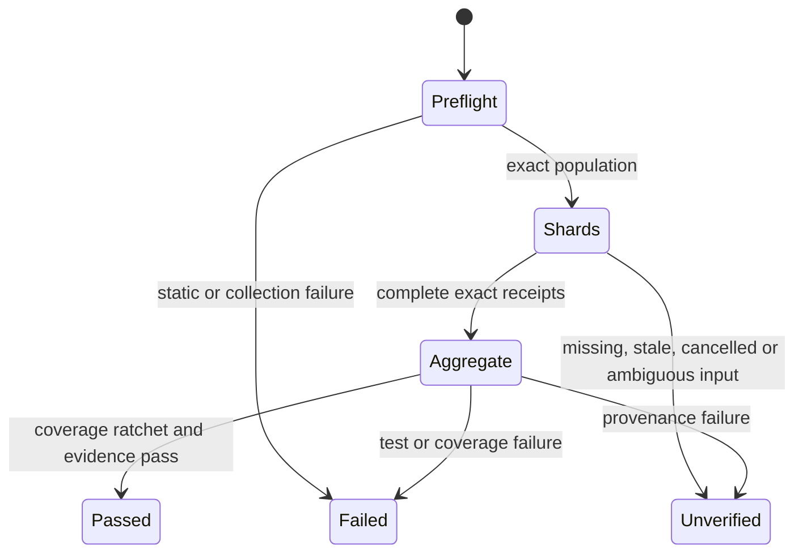

# Feature design: CI quality evidence and deterministic sharding V3

- Status: APPROVED
- Owner: PaulKov / Codex
- Issue: #618
- Target release: next patch
Last verified: 2026-08-27

## Executive summary

The required PR quality contexts currently execute the whole non-live test
population with coverage independently on Python 3.11 and 3.12.  On the
accepted baseline `9ccb97e67e6f67e71780749d58b564b9203a3937` (run
`32608196494`) those contexts took 21m34s and 26m20s respectively.  This V3
change keeps every non-live test, both visible required contexts, the coverage
ratchet, package, documentation, import/layer/module and security gates.  It
partitions the full population deterministically, combines exact-head coverage,
and produces immutable timing/provenance evidence.

Success is not inferred from a local run or a single green workflow.  The DoD
is three independent GitHub-hosted executions of one unchanged SHA, each with
zero unclassified flakes and a quality critical-path duration below 720 seconds;
the conservative p95 for three samples is their maximum.  That is a >50%
reduction against the 26m20s baseline.

## Personas and customer journey

| Persona | Goal | Current pain | Success signal |
|---|---|---|---|
| Contributor | Receive fast, trustworthy PR feedback. | Two whole covered suites dominate the critical path. | Both required contexts pass with a visible exact-head receipt. |
| Maintainer | Change CI without silently losing tests or coverage. | Job topology is a privileged, frozen governance contract. | V3 profile, manifest and aggregate prove complete population and coverage. |
| On-call operator | Diagnose a slow, stale or partial run safely. | Current artifacts do not distinguish runner delay from lost test evidence. | One timing artifact shows identity, phase timings, shard outcomes and recovery. |
| Auditor | Reproduce the performance claim. | A green re-run can mask a prior cancellation or changed head. | Three immutable run-attempt records feed a deterministic p95 decision. |

Journey: the contributor pushes `H`; preflight validates the exact checkout and
builds a sorted `not integration_live` node-id population.  Required shard jobs
run the deterministic membership assigned to their interpreter, publish raw
coverage and an attempt-bound receipt, and the named aggregate context verifies
every expected item before it can pass.  The operator downloads the same-run
artifact and uses the runbook to distinguish `FAIL` from `UNVERIFIED`.  A
maintainer may calculate the performance decision only from three exact `H`
artifacts; a changed SHA starts a new sample set.

Each shard artifact explicitly includes its hidden `.coverage` database as well
as its receipt. GitHub artifact upload otherwise excludes hidden files by
default; absence of any one coverage database is a fail-closed aggregate error.

The preflight does not separately rerun `tests/agent_policy`: the complete
sharded population already executes that same suite on both supported Python
versions. Removing the duplicate invocation shortens the critical path without
removing a test, changing its marker, or weakening any aggregate condition.

## Scope

### In scope

- immutable V3 policy/schema/binding that supersedes V2 only for the reviewed
  `quality-preflight -> quality-shards -> quality -> governance-source ->
  governance-attestation` topology;
- read-only deterministic non-live test planning, shard receipt validation,
  coverage provenance/combination, and timing evidence;
- required and visible Python 3.11 and 3.12 aggregate contexts with unchanged
  names and failing semantics;
- lockfile- and interpreter-bound dependency caching only after cold/warm
  timing evidence demonstrates it is safe;
- operator documentation, a recovery runbook, and three-run measurement tool.

### Non-goals

- removing, skipping, reclassifying, or automatically retrying tests;
- changing the coverage threshold, adding speed-only omissions, reducing live
  certification, branch protection, secrets, OIDC, runners or permissions;
- trusting a cache, artifact, receipt, a prior SHA or a cancelled job as pass;
- balancing by mutable historical timing data in this increment.

### Assumptions and constraints

V1 and V2 policy, schemas and historical fixtures remain byte-exact.  V3 is a
closed profile, not a generic policy plug-in.  GitHub-hosted runners are clean;
GitHub documents that caches are untrusted/restorable input and that artifacts,
not caches, are for job-to-job evidence.  Caches contain no credentials and are
keyed by OS, Python version and `uv.lock` digest.  Sources checked 2026-08-27:
[GitHub cache guidance](https://docs.github.com/en/actions/concepts/workflows-and-actions/dependency-caching),
[matrix jobs](https://docs.github.com/en/actions/how-tos/write-workflows/choose-what-workflows-do/run-job-variations),
and [pytest collection/duration guidance](https://docs.pytest.org/en/stable/how-to/usage.html).

## Public contract and compatibility

No dpone CLI, Python, manifest or data-plane API changes.  Public governance
contracts gain:

- `.agents/policy/workflow-security-privileged-v3.yml` and its exact V3 schema;
- `ci-quality-timing-v1` JSON schema and immutable artifact
  `ci-quality-evidence-<run_id>-<attempt>` retained 90 days;
- a documented local planner/validator command: exit `0` only for structurally
  valid input; malformed/missing/stale evidence is non-zero.  It produces JSON
  on stdout or an explicit diagnostic on stderr, never a synthetic PASS.

The protected contexts remain `Quality checks (3.11)` and `Quality checks
(3.12)`.  A shard is implementation detail only: an aggregate fails if its
preflight, any expected shard, receipt, coverage input, coverage combine or
ratchet fails, is missing, cancelled, duplicated, stale, wrong interpreter or
wrong configuration.  Rollback is a reviewed whole-V3 revert; it restores the
then-exact V2 topology, never edits V1/V2 or relaxes evidence requirements.

## Detailed algorithm

1. Each job checks out exact `H`, captures `H`, `B`, workflow blob digest,
   run/attempt, runner, Python, `uv.lock` and coverage-config digests.
2. Preflight runs all existing cheap static/policy/docs/package gates unchanged,
   collects `pytest -o addopts='' -m 'not integration_live' --collect-only`,
   normalizes/sorts unique node IDs, and emits a versioned population manifest.
3. For each prescribed `{python, shard}` pair, the shard recomputes collection
   on `H`, requires the population digest to match, assigns node IDs using the
   closed SHA-256 algorithm, and executes exactly its selection.  Python 3.11
   remains a complete required compatibility execution; Python 3.12 coverage
   shards jointly cover the complete population.
4. Each shard uploads a uniquely named raw coverage file and receipt including
   exact identities, counts, membership/config digests, terminal status,
   collection/test/coverage phase durations and available resource observations.
5. Each named aggregate downloads only artifacts belonging to its current
   run-attempt, validates the closed expected matrix and exact `H`, rejects all
   incomplete/duplicate/ambiguous input, then combines Python-3.12 coverage and
   applies the existing ratchet once.  The aggregate publishes timing evidence.
6. `governance-source` runs only after both exact aggregate contexts pass;
   `governance-attestation` remains source-free and unchanged in authority.
7. The performance reducer accepts exactly three successful evidence records
   with one `H`, computes `max(samples)` as nearest-rank p95, records queue time
   separately, and returns PASS only below 720 seconds with zero flakes.

```text
population = normalized_collect(H, marker="not integration_live")
for required_pair in closed_matrix:
    receipt = run_shard(H, population, required_pair)
    upload_exact_attempt(receipt, raw_coverage)
for python in [3.11, 3.12]:
    require_exact_complete_matrix(H, python)
    if python == 3.12: combine_and_enforce_existing_coverage_ratchet()
    publish_timing_evidence()
require(quality_311 == PASS and quality_312 == PASS)
```



Empty, duplicate or malformed node IDs, empty shards, configuration drift,
partial upload, runner cancellation, process crash, changed head, unsupported
Python, or duplicate artifacts are `FAIL`/`UNVERIFIED`, never success.  A test
failure is native job failure and is not retried.  GitHub concurrency may cancel
obsolete PR heads; cancellation is evidence for that attempt, not a sample that
may be replaced in a three-run proof.

## Architecture and alternatives

| Component | Existing/new | Responsibility | Dependencies |
|---|---|---|---|
| V3 selector/binding | New | Select one reviewed closed V3 policy. | Existing V1/V2 historical readers. |
| Shard planner | New | Canonical population, fixed partition, receipts. | Stdlib only. |
| Evidence validator/reducer | New | Fail-closed artifact/provenance and p95 decision. | Typed schema/stdlib. |
| CI workflow | Changed composition root | Invoke components and transfer data only. | Planner/validator. |
| Documentation/runbook | Changed | Explain topology, confidence and recovery. | Generated schema/examples. |

New code belongs in cohesive `tools/ci_quality_*` modules initially because it
is CI composition support; it has no runtime/data-plane dependency.  Keep each
module below repository size/graph budgets; split planner, receipt validation
and p95 reduction by responsibility.  No generic scheduler, remote state or
historical-duration database is introduced.

| Alternative | Decision | Rationale |
|---|---|---|
| Run covered full suite on both Pythons | Reject | Baseline misses latency DoD. |
| One coverage leg + version-sensitive classifier | Reject now | Classifier can silently miss compatibility contracts. |
| 3.11 full compatibility + 3.12 full covered shards | Adopt | Complete coverage and both interpreters remain explicit. |
| Dynamic duration-balanced membership | Reject | Mutable data harms reproducibility; collect evidence first. |
| Direct V1/V2 edit | Reject | Violates immutable historical authority. |

ADR-0037 amendment is required because the exact dependency topology changes;
V3 must name the entire chain and cannot accept an open-ended edge pattern.

## Market comparison and measurable differentiation

The listed ETL/ELT and orchestration products (dlt, Informatica, Airbyte,
Fivetran, Pentaho, SSIS, gusty, Astronomer Cosmos and Apache Beam) are N/A:
they do not own dpone's GitHub PR governance authority.  GitHub Actions is the
relevant platform comparator.  We adopt its matrix/artifact model but reject a
cache or matrix result as evidence without independently bound receipts.

```yaml
axis: required PR quality critical-path execution duration
scenario: three GitHub-hosted executions of one unchanged pull-request head
baseline: 26m20s, Quality checks (3.12), run 32608196494
metric: nearest-rank p95 of three execution-duration samples (maximum)
target: less than 720 seconds; zero unclassified flakes
procedure: validate three immutable ci-quality-timing-v1 artifacts and reduce
artifact: test_artifacts/ci-quality/performance-decision-<head>.json
limitations: excludes queue delay; queue/capacity is reported separately
```

## Test, certification, documentation and rollout

| Layer | Required proof |
|---|---|
| Unit | deterministic assignments; population/receipt/schema/p95 boundaries |
| Contract | V1/V2 byte preservation; V3 topology, context names, permissions and fail-closed workflow cases |
| Mocked integration | missing/duplicate/stale/cancelled/wrong-Python artifacts and coverage digests |
| Local | full non-live population parity and combined existing coverage ratchet |
| Hosted certification | three same-SHA runs, artifact re-download and reducer decision |
| Documentation | strict build and tests for local-vs-hosted confidence and recovery matrix |

Add `docs/cicd/ci-performance-evidence.md`, link the CI index/workflow page,
and add a bounded runbook for stale/missing shards, coverage mismatch and
flake/capacity decisions.  Local focused/full commands are useful diagnostics;
only hosted exact-head evidence can satisfy the latency DoD.

Rollout order: merge #607/V2; merge V3 design; implement V3 on that base;
complete local/broad checks; merge only with exact-head hosted checks; then
collect three unchanged-SHA samples.  If evidence fails, revert the whole V3
activation or document capacity as `UNVERIFIED`; do not weaken tests.

## Agent execution plan

| Role | Owned paths | Read-only paths | Forbidden paths |
|---|---|---|---|
| Integrator | V3 policy/schema, workflow, shared selector/tests/docs artifacts | V1/V2 policy/schema/fixtures | V1/V2 edits |
| Planner implementer | new `tools/ci_quality_*`, focused tests | workflow/spec | policies/workflow/shared docs |
| Certifier | tests and hosted evidence review | implementation | policy/workflow mutation |
| Docs reviewer | new performance page/runbook contracts | workflow/schema | governance policy |

The integrator owns all shared semantic files and performs final reconciliation.

## Approval checklist

- [x] User problem, customer journey and exact public contracts are explicit.
- [x] Failure, cancellation, replay and rollback semantics are fail-closed.
- [x] Current primary GitHub/pytest sources and relevant N/A comparison are recorded.
- [x] The 50%+ metric, procedure and immutable artifact are measurable.
- [x] Tests, evidence, documentation, rollout and path ownership are complete.
- [x] Maintainer approved this V3 specification on 2026-08-27 (`APPROVED`).
