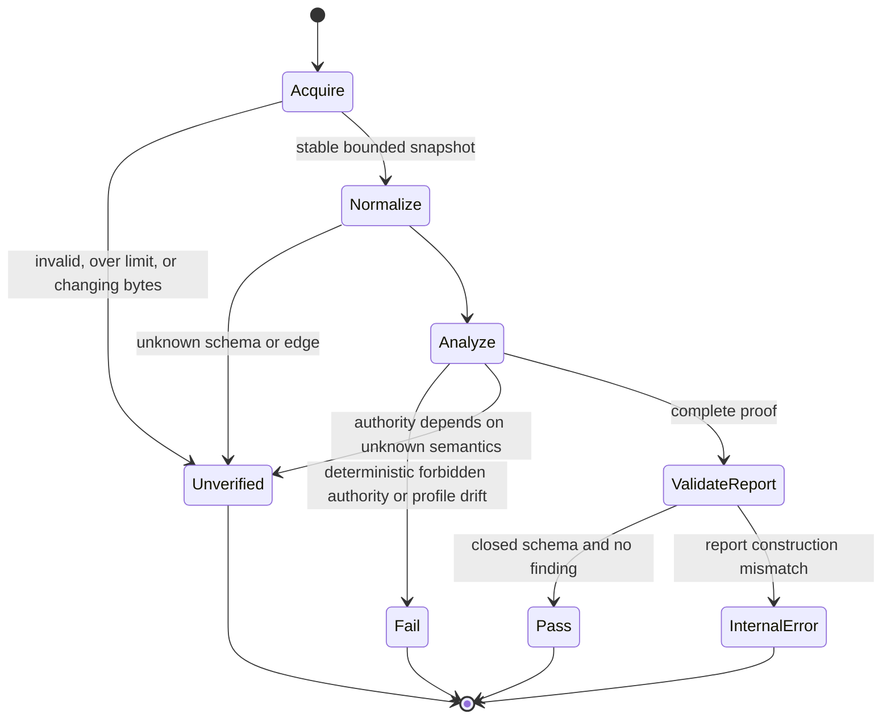
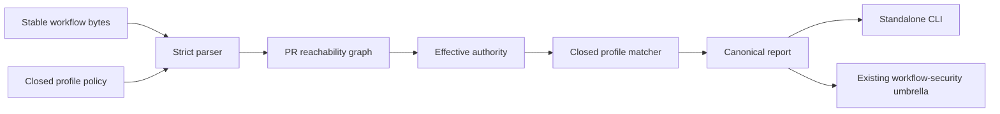

# Feature design: PR 3B semantic PR privilege boundary

- Status: APPROVED
- Public-output amendment status: APPROVED
- Public-output amendment base: `f18298c14af247225758f7fe8901bc8462994dd4`
- Owner: dpone maintainers
- Issue: [#512](https://github.com/PaulKov/dpone/issues/512)
- Parent specification: [CI shadow closure and exact-SHA evidence](feature-design-ci-pr-gate-exact-sha-evidence.md)
- Design base: `c5567128e6e9b847b4b2a023a74ea6d60e7ccd09`
- Target release: TBD
- Last verified: 2026-08-11

## Executive summary

PR 3B closes a repository-security gap that the existing workflow linter cannot
see. Today dpone validates declared permission names, pinned actions, and some
unsafe syntax one workflow at a time. It does not prove whether a job is
reachable from an untrusted pull request through `needs`, a local reusable
workflow, or `workflow_run`; it also treats every documented write scope as
equally acceptable even when PR-controlled code can reach it.

The implementation will add a credential-free semantic scanner:

```bash
uv run python tools/agent_policy/workflow_security_privileged.py \
  --root . \
  --format json
```

The scanner strictly reads a stable local workflow snapshot, constructs the
transitive PR-reachability graph, resolves effective `GITHUB_TOKEN` permissions,
proves closed non-PR guards, and accepts only three separately named
capabilities after the required migration:

1. the closed CodeQL PR upload profile;
2. the exact source-free `ADR0037_GOVERNANCE_SOURCE_ATTESTOR` finalizer; and
3. the post-merge `ADR0037_MERGED_CLOSURE_CHECK_PUBLISHER` capability.

The current PR-head `quality` job is a known deterministic `FAIL`: it executes
PR-controlled repository code while holding job-wide OIDC and attestation
authority. A workflow-envelope digest cannot make that code source-free. The
PR3B implementation therefore atomically removes write/OIDC authority from
`quality`, uploads its immutable governance artifact from the read-only
producer, and adds the exact action-only finalizer below. The second and third
capabilities are not templates. A copied finalizer/publisher, missing mandatory
profile, trigger drift, or authority widening is rejected as
`PRIVILEGE_ADR0037_PROFILE_DRIFT`.

This specification PR does not change workflows, permissions, CodeQL results,
required checks, branch protection, or release behavior. The original design is
`APPROVED`, but a later implementation PR may start only after the
`Public-output amendment status` is also changed to `APPROVED`, merged, and the
resulting integration commit is used as the exact task-contract base.

## Personas and customer journey

| Persona | Goal | Current pain | Success signal |
| --- | --- | --- | --- |
| Workflow author | Add or reuse a safe CI workflow | file-local lint cannot explain a transitive privilege path | one local command shows the exact reachability chain and recovery |
| Security reviewer | Prevent PR-controlled code from receiving write/OIDC authority | a documented write-scope exception is not semantic proof | every reachable write is either one closed profile or a blocking finding |
| Maintainer | Retire the unsafe ADR 0037 exception without breaking evidence UX | ordinary CI edits currently execute under job-wide OIDC | the producer stays read-only and the exact finalizer cannot drift without the prior ADR process |
| Contributor | Understand why a workflow-security gate failed | current messages name a permission but not its route or authority source | the report names root event, workflow/job path, edge chain, permission source, code, and recovery ID |
| Operator | Restore a red security gate safely | widening an allowlist can appear easier than restructuring the workflow | runbook directs restore, least-privilege split, or prior ADR amendment; rerun is deterministic |

The first-time journey is:

- **Discover** — PR 3B is a static repository guard. It adds no merge context,
  GitHub App, secret, live mutation, shadow result, or release authority.
- **Prepare** — use an immutable checkout, Python/uv from the repository, and no
  GitHub credential. The command performs no network access.
- **Configure** — start new PR jobs with `permissions: {}` or the smallest read
  mapping. Keep ordinary PR code in the read-only producer. Only the exact
  source-free finalizer and CodeQL profile may retain PR-route write/OIDC
  authority; do not restore or copy the legacy job-wide exception.
- **Execute** — run the JSON command and the existing workflow-security gate.
- **Observe** — `PASS` means all current workflow bytes were completely parsed
  and every PR-reachable job is unprivileged or exactly matches an approved
  profile. It is not hosted/live evidence.
- **Diagnose** — follow the sorted `findings` entry from root event through every
  edge to the workflow/job and effective permission source. The fixed umbrella
  error `semantic-pr-privilege-internal=PRIVILEGE_INTERNAL_REPORT_INVALID`
  means that no trusted semantic finding was available; it is not a policy
  violation or a recovery hint by itself.
- **Recover** — restore drift, reduce authority, make the route provably non-PR,
  or merge the required ADR amendment first. Never silence the finding by
  editing only the fixture. For the fixed internal error, rerun the immutable
  standalone scanner with
  `uv run python tools/agent_policy/workflow_security_privileged.py --root . --format text`.
  A repeated exit `3` is an implementation defect: preserve the exact head,
  command, and fixed stderr, escalate to the maintainer, and keep integration
  blocked. Never widen the policy or fixture to hide it. This clarification
  itself must be squash-integrated. A missing post-merge receipt is
  `UNVERIFIED`; a receipt that proves a merge commit, wrong parent shape, or
  noncanonical task introduction is a deterministic identity failure. A rerun
  cannot repair that identity. Keep PR3B implementation blocked, preserve the
  receipt, and do not delete, re-add, or reuse the v1 task path. Submit a
  separately approved recovery amendment rooted at the invalid integration,
  using the versioned task path
  `test_artifacts/agent-policy/dpone-ci-shadow-pr3b-public-output-amendment-v2.yml`;
  it must explicitly supersede v1, preserve the failed receipt, and receive its
  own reviewed squash integration and PASS receipt before implementation.
- **Operate** — keep the scanner inside the existing `Workflow security policy`
  CI step and review the machine report for every workflow-control PR.
- **Upgrade** — update CodeQL action pins and its closed profile together. Do
  not change either ADR 0037 fingerprint in the same PR that consumes the new
  exception.

## Scope

### In scope

- strict, bounded loading of `.github/workflows/*.yml` and the closed PR3B
  policy;
- direct `pull_request` and forbidden `pull_request_target` roots;
- transitive local `workflow_call` edges;
- `workflow_run` edges whose named producer is PR-reachable;
- job `needs` propagation and a closed three-valued subset of GitHub `if`
  expressions sufficient to prove a route unreachable;
- workflow/job permission override and reusable-workflow permission
  intersection;
- unknown permission, expression, edge, runner, secret, and environment
  fail-closed behavior;
- exact CodeQL, source-free ADR 0037 governance-attestation finalizer, and ADR
  0037 merged-closure profiles, including exact trigger mappings and mandatory
  single-subject occurrence;
- atomic migration of `.github/workflows/ci.yml` from the known-unsafe legacy
  job-wide exception to a read-only producer plus data-only finalizer;
- repair and runtime validation of the existing workflow-security
  schema/policy pair before the semantic policy is consumed;
- deterministic CLI, policy schema, report schema, stable codes, focused tests,
  existing governance integration, user/developer docs, and recovery;
- removal of the current custom CodeQL config from the later implementation so
  the CodeQL profile is action-only and closed.

### Non-goals

- changing required check names, ruleset `18806829`, classic branch protection,
  App bindings, bypass roles, tags, variables, environments, or repository
  settings;
- adding a new GitHub check or workflow;
- changing `.github/workflows/agent-pr-receipt.yml` in the PR3B implementation;
- preserving, restoring, or copying the legacy `quality` job-wide OIDC and
  attestation exception after the approved split;
- adding any other attestation, deployment, or check-publisher capability;
- claiming that the legacy governance-source job is generally safe;
- executing Actions expression bytecode or implementing the entire GitHub
  expression language;
- downloading external reusable workflows, actions, CodeQL packs, or provider
  state;
- analyzing release-only privilege beyond its possible PR reachability;
- scanning shell, Python, or third-party action internals for arbitrary
  malicious behavior;
- adding a generic policy engine, GitHub client, SARIF publisher, or new runtime
  package;
- changing dpone data-plane APIs, manifests, connectors, state, artifacts, or
  release publication.

### Assumptions and constraints

- The exact design base is merge commit
  `c5567128e6e9b847b4b2a023a74ea6d60e7ccd09`; it contains approved PR 3A,
  its execution-envelope source `518537e616033ecf86bae96d831b8deb23eb8bca`,
  and PR 2 merge `ec0323feba829d547e5f9c2d23acaac5b686f1a4` as ancestors. The intervening
  release/MSSQL changes leave every workflow/policy byte used by this design
  unchanged, so the ADR 0037 envelope source and digests remain exact.
- GitHub resolves workflow permissions first, then job permissions. Once a
  mapping is specified, omitted permissions are `none`.
- A called reusable workflow can maintain or reduce the caller's token
  permissions but cannot elevate them.
- A skipped `needs` predecessor skips downstream jobs unless a status function
  such as `always()` changes that behavior.
- `workflow_run` can execute with default-branch code, secrets, and write
  tokens even when the producer is unprivileged; therefore an unknown
  producer edge is not read-only by assumption.
- Local reusable workflows use bytes from the same commit as the caller.
- Provider-side fork token downgrades are defense in depth, not the static
  authority. The scanner classifies the declared same-repository maximum.
- The existing CodeQL workflow is not yet compliant with the approved parent:
  checkout lacks `persist-credentials: false`, and `config-file` points to a
  repository-controlled custom filter. Those are deliberate implementation
  changes, not accepted baseline behavior.
- The existing `.agents/policy/workflow-security.yml` remains a documented
  write-scope allowlist. It is not the new semantic profile source and cannot
  authorize PR reachability.
- The existing `evals/agent/workflow-security.schema.json` currently lags its
  policy: it omits job-scoped exceptions and three required controls. The
  implementation repairs that schema and makes instance validation executable;
  a schema file that validates only itself is not evidence.

## Public repository contract

There is no dpone CLI or Python-package API change. The new command, policy,
schemas, report, findings, and documented workflow-author journey are public
repository contracts.

### CLI

The public invocation is:

```text
usage: workflow_security_privileged.py [-h] --root ROOT
                                       [--format {text,json}]
```

- `--root` is required and identifies the repository checkout.
- `--format` defaults to `text`; `json` emits one canonical compact JSON object
  followed by one newline.
- Policy location is fixed at
  `.agents/policy/workflow-security-privileged.yml` below `--root`.
- Workflow location is fixed at `.github/workflows` below `--root`.
- The command has no policy override, workflow-directory override, network
  mode, ignore flag, write mode, or live mode.
- Policy results, including `FAIL` and `UNVERIFIED`, are written only to stdout
  in the chosen format; stderr remains empty.
- Exit `0` means report status `PASS`. Exit `1` means `FAIL` or `UNVERIFIED`.
  Argparse usage/type errors exit `2`, write no stdout, and use stderr.
- An implementation defect that prevents construction or schema validation of
  the promised report exits `3`, writes no stdout, and writes exactly
  `PRIVILEGE_INTERNAL_REPORT_INVALID: report construction or schema validation failed\n`
  to stderr without a traceback. It can never be a policy result or `PASS`.
- The command never creates or modifies a file. A broken stdout pipe may return
  the platform I/O failure; it cannot convert a non-pass report into exit `0`.

Text mode prints the exact transcript defined below: status, complete counts,
sorted findings, the stable runbook anchor, and the exact recheck argv. It does
not claim to auto-edit an unsafe workflow. JSON is the evidence and
compatibility authority.

### Closed policy

The implementation owns:

```text
.agents/policy/workflow-security-privileged.yml
evals/agent/workflow-security-privileged-policy.schema.json
evals/agent/workflow-security-privileged-report.schema.json
```

The policy is schema version `1`, has no extension keys, and contains:

- exact parser and graph limits;
- the recognized GitHub permission vocabulary;
- exact workflow roots and edge kinds;
- the CodeQL profile structure;
- immutable ADR 0037 profile identities and fingerprints;
- stable finding-code/recovery mappings; and
- the design/ADR/base identities that authorize the fixture.

The policy does not contain wildcard workflows, wildcard jobs, wildcard actions,
regex permissions, arbitrary safe predicates, or a general `allowed: true`.
Changing an ADR 0037 fingerprint in policy is not sufficient authorization.
The implementation task must prove that the approved ADR amendment already
exists in its base before accepting such a change.

The v1 policy value is exactly this closed mapping. The schema requires every
shown key, forbids every unshown key, preserves every shown array order, and
uses `const` for the identities, limits, vocabulary, profile coordinates,
fingerprints, code/recovery pairs, runbook anchor, and recheck argv. SHA fields
are 64 lowercase hexadecimal characters and commit fields are 40 lowercase
hexadecimal characters.

<!-- pr3b-policy-v1:begin -->
```yaml
schema_version: 1
authority:
  specification: docs/feature-design-ci-shadow-pr3b-semantic-privilege-boundary.md
  design_base: c5567128e6e9b847b4b2a023a74ea6d60e7ccd09
  adr0037: docs/adr/0037-immutable-agent-pr-merge-closure.md
  pr2_merge: ec0323feba829d547e5f9c2d23acaac5b686f1a4
roots:
  - pull_request
  - pull_request_target
edge_kinds:
  - LOCAL_WORKFLOW_CALL
  - WORKFLOW_RUN
  - NEEDS
permission_access:
  actions: [none, read, write]
  artifact-metadata: [none, read, write]
  attestations: [none, read, write]
  checks: [none, read, write]
  code-quality: [none, read, write]
  contents: [none, read, write]
  deployments: [none, read, write]
  discussions: [none, read, write]
  id-token: [none, write]
  issues: [none, read, write]
  models: [none, read]
  packages: [none, read, write]
  pages: [none, read, write]
  pull-requests: [none, read, write]
  security-events: [none, read, write]
  statuses: [none, read, write]
  vulnerability-alerts: [none, read]
limits:
  workflow_files: 256
  reusable_workflows_including_root: 50
  local_call_edges: 9
  workflow_run_edges: 1
  jobs: 4096
  graph_edges: 8192
  roots: 512
  routes: 16384
  authority_records: 16384
  profile_matches: 16384
  route_edges: 256
  findings: 4096
  workflow_bytes: 1048576
  total_workflow_bytes: 33554432
  policy_bytes: 1048576
  expression_bytes: 8192
  expression_tokens: 512
  yaml_depth: 32
  yaml_nodes: 100000
  finding_detail_bytes: 2048
  report_bytes: 16777216
  text_stdout_bytes: 16777216
profiles:
  codeql:
    id: CODEQL_PR_UPLOAD
    workflow: .github/workflows/codeql.yml
    job: analyze
    required_occurrences: 1
    root_event: pull_request
    event_variants: [ACTIVITY:opened, ACTIVITY:reopened, ACTIVITY:synchronize]
    edge_kinds: []
    required_edge_chain: []
    trigger:
      pull_request: {branches: [master]}
      push: {branches: [master]}
      schedule: [{cron: "21 3 * * 1"}]
    trigger_sha256: 3273e73a2ce7ec7b858a8a806755c842dbb4533594b318530f831a4fb0445a03
    permission_source: WORKFLOW
    declared_non_none: {contents: read, security-events: write}
    effective_non_none: {contents: read, security-events: write}
    runner: {classification: GITHUB_HOSTED, labels: [ubuntu-latest]}
    environment: null
    secrets: NONE
    semantic_sha256: 36a5ff903eab36601bd3cfe3636a53497a9d72cd7ca71ce39ef9c19a8aef3c88
  governance_source:
    id: ADR0037_GOVERNANCE_SOURCE_ATTESTOR
    workflow: .github/workflows/ci.yml
    job: governance-attestation
    required_occurrences: 1
    root_event: pull_request
    event_variants: [ACTIVITY:opened, ACTIVITY:reopened, ACTIVITY:synchronize]
    edge_kinds: [NEEDS, NEEDS]
    required_edge_chain:
      - {kind: NEEDS, source_workflow: .github/workflows/ci.yml, source_job: quality, target_workflow: .github/workflows/ci.yml, target_job: governance-source}
      - {kind: NEEDS, source_workflow: .github/workflows/ci.yml, source_job: governance-source, target_workflow: .github/workflows/ci.yml, target_job: governance-attestation}
    trigger:
      pull_request: {branches: [master]}
      push: {branches: [master]}
      workflow_dispatch: null
    trigger_sha256: 481e6bf2e4a8ad5c03d98987c268f105189028497bd227b51786f0764536e2ef
    permission_source: JOB
    declared_non_none: {actions: read, attestations: write, contents: read, id-token: write}
    effective_non_none: {actions: read, attestations: write, contents: read, id-token: write}
    runner: {classification: GITHUB_HOSTED, labels: [ubuntu-latest]}
    environment: null
    secrets: NONE
    producer_sha256: 0bf8016384b224f58cd6be67fc892531cfdad21c114b48fb9f0d90a5d3c9f97f
    envelope_sha256: c5832e92a84ddd4eaa44cbf009d45eb7de2c4a7c3bcfc4258da1702b5aa0b3af
  merged_closure:
    id: ADR0037_MERGED_CLOSURE_CHECK_PUBLISHER
    workflow: .github/workflows/agent-pr-receipt.yml
    job: merge-closure
    required_occurrences: 1
    root_event: pull_request
    event_variants: [CLOSED_MERGED]
    edge_kinds: []
    required_edge_chain: []
    trigger:
      pull_request:
        branches: [master]
        types: [edited, closed]
    trigger_sha256: 893b21fe5846674b730966a96e22ee6a05aaa693b73152b9720ae071511b3f68
    permission_source: JOB
    declared_non_none: {actions: read, checks: write, contents: read}
    effective_non_none: {actions: read, checks: write, contents: read}
    runner: {classification: GITHUB_HOSTED, labels: [ubuntu-latest]}
    environment: null
    secrets: NONE
    envelope_sha256: 92c783c76af4f23ccbce06892fd297f73c830120a030b739a8b05055dec406f3
recovery:
  runbook_anchor: docs/cicd/runbooks.md#semantic-pr-privilege-boundary
  recheck_argv:
    - uv
    - run
    - python
    - tools/agent_policy/workflow_security_privileged.py
    - --root
    - .
    - --format
    - text
  code_to_outcome:
    PRIVILEGE_PULL_REQUEST_TARGET: {status: FAIL, recovery_command_id: REMOVE_PULL_REQUEST_TARGET}
    PRIVILEGE_UNAPPROVED_PR_WRITE: {status: FAIL, recovery_command_id: REDUCE_OR_ISOLATE_PR_AUTHORITY}
    PRIVILEGE_PR_SECRET_OR_ENVIRONMENT: {status: FAIL, recovery_command_id: REMOVE_PR_SECRET_AUTHORITY}
    PRIVILEGE_PR_SELF_HOSTED: {status: FAIL, recovery_command_id: USE_GITHUB_HOSTED_PR_RUNNER}
    PRIVILEGE_WRITE_ALL: {status: FAIL, recovery_command_id: REPLACE_WRITE_ALL}
    PRIVILEGE_READ_ALL: {status: FAIL, recovery_command_id: REPLACE_READ_ALL}
    PRIVILEGE_CODEQL_PROFILE_DRIFT: {status: FAIL, recovery_command_id: RESTORE_CODEQL_PROFILE}
    PRIVILEGE_ADR0037_PROFILE_DRIFT: {status: FAIL, recovery_command_id: RESTORE_ADR0037_PROFILE}
    PRIVILEGE_DYNAMIC_OR_EXTERNAL_EDGE: {status: UNVERIFIED, recovery_command_id: BOUND_WORKFLOW_EDGE}
    PRIVILEGE_UNKNOWN_EXPRESSION: {status: UNVERIFIED, recovery_command_id: SIMPLIFY_PRIVILEGE_GUARD}
    PRIVILEGE_UNKNOWN_PERMISSION: {status: UNVERIFIED, recovery_command_id: UPDATE_PERMISSION_CONTRACT}
    PRIVILEGE_INVALID_POLICY: {status: UNVERIFIED, recovery_command_id: REPAIR_PRIVILEGE_POLICY}
    PRIVILEGE_INVALID_WORKFLOW: {status: UNVERIFIED, recovery_command_id: REPAIR_WORKFLOW_SYNTAX}
    PRIVILEGE_RESOURCE_LIMIT: {status: UNVERIFIED, recovery_command_id: REDUCE_OR_PARTITION_WORKFLOWS}
    PRIVILEGE_CONCURRENT_MUTATION: {status: UNVERIFIED, recovery_command_id: RERUN_IMMUTABLE_CHECKOUT}
```
<!-- pr3b-policy-v1:end -->

The CodeQL semantic digest uses the same canonical JSON algorithm over the
complete mapping between the `pr3b-codeql-profile` markers. It therefore binds
triggers, permissions, job/runner, action pins, order, and inputs; the policy
and workflow digest change together on a reviewed pin update.

Every profile is mandatory. `required_occurrences: 1` means the complete
normalized workflow inventory contains exactly one subject with the exact
`(workflow, job)` coordinate. `trigger_sha256` is SHA-256 of that workflow's
complete normalized `on` mapping, serialized with the same canonical JSON
formula. Empty/omitted default activity types remain omitted in that trigger
mapping and are expanded only into `event_variants`. Comments and YAML mapping
order have no authority; branch, path, activity type, schedule, event, or
workflow-dispatch changes alter the digest. Before route matching, missing,
renamed, copied, duplicate, or trigger-drifted mandatory subjects fail with
`PRIVILEGE_CODEQL_PROFILE_DRIFT` or `PRIVILEGE_ADR0037_PROFILE_DRIFT`.

The schema rejects an empty or reordered root/edge/access mapping, unsupported
access for a known permission, mutable limit, extra
profile, extra recovery code, wildcard, extension key, boolean in an integer
slot, duplicate YAML key, or non-lowercase identity. Any future permission name
is `PRIVILEGE_UNKNOWN_PERMISSION` until a separately reviewed policy/schema
change adds it.

The existing `evals/agent/workflow-security.schema.json` is repaired in the
implementation before either policy is used. Its
`allowed_workflow_write_permissions.<workflow>` value is exactly one of:

- `{permissions: [<one-or-more unique permission names>], reason: <string at
  least 20 characters>}`; or
- `{jobs: {<one-or-more job IDs>: [<one-or-more unique permission names>]},
  reason: <string at least 20 characters>}`.

The two forms are mutually exclusive; `reason` alone, both forms, an empty job
map/list, an unknown key, or an unknown permission is invalid. The repaired
`required_controls` mapping has exactly eight required `const: true` keys:
`forbid_pull_request_target`, `require_top_level_permissions`,
`require_pinned_external_actions`, `forbid_pr_workflow_secrets`,
`require_audit_artifact_retention`, `require_hidden_ci_artifact_transport`,
`isolate_dbt_execution_from_oidc`, and
`require_platform_owned_prod_trust_policy`. Tests validate the current policy
instance and independently reject every malformed form above.

### Exact CodeQL profile

The implementation changes CodeQL to this exact semantic profile. Display-name
comments may differ; parsed keys and values may not.

<!-- pr3b-codeql-profile:begin -->
```yaml
workflow: .github/workflows/codeql.yml
events:
  pull_request:
    branches: [master]
  push:
    branches: [master]
  schedule:
    - cron: "21 3 * * 1"
permissions:
  contents: read
  security-events: write
jobs:
  analyze:
    name: Analyze Python
    runs-on: ubuntu-latest
    steps:
      - uses: actions/checkout@9c091bb21b7c1c1d1991bb908d89e4e9dddfe3e0
        with:
          persist-credentials: false
      - uses: github/codeql-action/init@99df26d4f13ea111d4ec1a7dddef6063f76b97e9
        with:
          languages: python
      - uses: github/codeql-action/analyze@99df26d4f13ea111d4ec1a7dddef6063f76b97e9
```
<!-- pr3b-codeql-profile:end -->

The workflow has exactly one job and three steps. It has no `run`, shell,
autobuild, dependency installation, cache, artifact download, local/Docker
action, custom query/config/pack, `github-script`, container, service,
environment, secret, matrix, reusable-workflow call, or extra action input.
`.github/codeql/codeql-config.yml` is removed. The broader default Python query
set may expose an alert previously filtered as a false positive; that alert is
diagnosed and fixed or documented, never suppressed inside the PR-head profile.

An action-pin update changes the CodeQL profile. It is allowed only when the
workflow and policy change together, the exact owner/repository remains
`actions/checkout` or `github/codeql-action`, all negative profile tests pass,
and hosted CodeQL succeeds on the resulting exact head. It does not by itself
require an ADR 0037 amendment.

### Exact ADR 0037 profiles

The legacy `quality` exception is historical negative evidence, not an approved
profile. At PR 2 merge `ec0323feba829d547e5f9c2d23acaac5b686f1a4`
its security projection had SHA-256
`55b80fe3c773f0313e07288083403e32a8fa002813e96da8c61953c4fede0679`;
at the pre-migration design base its full resolved job envelope had SHA-256
`734cd4a8eb1b6105bff06af68e616108ab03f0b0b7f203eab3e66d5a859c9b32`.
Those digests reproduce the unsafe fixture and must yield
`PRIVILEGE_ADR0037_PROFILE_DRIFT`. They never authorize a PASS. Rolling CI back
to either historical blob would restore job-wide OIDC to PR-controlled code and
is prohibited.

The implementation atomically replaces that exception with three stable
responsibilities: existing matrix `quality` becomes read-only; a non-matrix,
read-only `governance-source` job waits for `quality`, checks out the exact
candidate, generates the governance JSON and uploads it once; and the
source-free `governance-attestation` finalizer consumes only the provider
artifact. The producer transport projection and complete privileged finalizer
below are the exact target. Ordinary producer commands are deliberately outside
the privileged profile because the producer has no write/OIDC authority.

Every fingerprint in this section uses one closed algorithm. Strictly parse the
named YAML mapping, reject keys or scalar values outside the JSON data model,
then serialize the selected mapping with Python-equivalent
`json.dumps(value, sort_keys=True, separators=(",", ":"), ensure_ascii=True,
allow_nan=False).encode("utf-8")`, with no trailing newline, and apply SHA-256.
The replacement profile value is the complete mapping between the markers
below. `producer_sha256` hashes only its `producer` mapping. The finalizer
`envelope_sha256` hashes only its `finalizer` mapping. An ordinary resolved
execution-envelope fingerprint serializes the exact mapping
`{"workflow_permissions": workflow.permissions || {}, "workflow_env":
workflow.env || {}, "workflow_defaults": workflow.defaults || {}, "job":
workflow.jobs[job_id]}`. It therefore binds workflow-level permission, `env`,
and `defaults.run` inheritance as well as every job/step byte with semantic YAML
meaning. Workflow path, job ID, trigger/route, and profile ID are separately
closed policy fields and may not drift. Arrays retain source order. This formula
is shared by policy generation, tests, diagnostics, and the scanner; YAML
presentation, comments, and mapping order have no authority.

The approved replacement is exactly:

<!-- pr3b-adr0037-attestor-profile:begin -->
```yaml
id: ADR0037_GOVERNANCE_SOURCE_ATTESTOR
workflow: .github/workflows/ci.yml
events:
  push: {branches: [master]}
  pull_request: {branches: [master]}
  workflow_dispatch: null
producer:
  job: governance-source
  needs: [quality]
  runs-on: ubuntu-latest
  permissions: {contents: read}
  artifact:
    step_id: governance-upload
    uses: actions/upload-artifact@043fb46d1a93c77aae656e7c1c64a875d1fc6a0a
    with:
      name: agent-governance-gate
      path: test_artifacts/agent-policy/agent_governance_gate.json
      if-no-files-found: error
      retention-days: 90
      archive: true
      overwrite: false
      include-hidden-files: false
    outputs:
      artifact_id: "${{ steps.governance-upload.outputs.artifact-id }}"
      artifact_digest: "${{ steps.governance-upload.outputs.artifact-digest }}"
finalizer:
  workflow_permissions: {contents: read}
  workflow_env: {}
  workflow_defaults: {}
  job:
    needs: [governance-source]
    runs-on: ubuntu-latest
    permissions:
      actions: read
      attestations: write
      contents: read
      id-token: write
    steps:
      - uses: actions/download-artifact@3e5f45b2cfb9172054b4087a40e8e0b5a5461e7c
        with:
          artifact-ids: "${{ needs.governance-source.outputs.artifact_id }}"
          path: test_artifacts/agent-policy/attested-governance
          digest-mismatch: error
      - uses: actions/attest-build-provenance@e8998f949152b193b063cb0ec769d69d929409be
        with:
          subject-path: test_artifacts/agent-policy/attested-governance/agent_governance_gate.json
```
<!-- pr3b-adr0037-attestor-profile:end -->

`finalizer` is the actual resolved execution-envelope value: workflow-level
permissions, `env`, and defaults plus the exact GitHub job mapping. Profile
classification fields such as normalized null environment and `secrets=NONE`
remain separate policy values and are not synthetic workflow keys.

The producer artifact ID selects one immutable same-run artifact. The pinned
download action uses provider metadata and `digest-mismatch: error`; the
producer digest remains transport evidence for the receipt. The pinned
attestation action hashes the exact downloaded JSON subject. Neither action
imports, executes, parses, or trusts its contents. The finalizer has exactly two
steps and no checkout, `run`, local/Docker action, `github-script`, setup,
installation, cache, matrix, service/container, environment, secret,
`continue-on-error`, cross-run token, repository override, glob, or directory
subject. Attestation proves provenance of bytes, not semantic PASS; the existing
receipt validator remains the decision authority.

The merge publisher is frozen to `.github/workflows/agent-pr-receipt.yml`, job
`merge-closure`, the exact `pull_request: closed` plus `merged == true` route,
the integrated commit checkout, job permissions `actions: read`,
`checks: write`, `contents: read`, and resolved execution-envelope SHA-256
`92c783c76af4f23ccbce06892fd297f73c830120a030b739a8b05055dec406f3`.
It is classified `POST_MERGE_INTEGRATED_CODE`, never `PR_HEAD_PROFILE`. This
profile exists only to detect drift in an already-existing post-merge
capability. It is not permission to add, copy, or generalize a publisher, and
the PR3B implementation leaves the workflow byte-identical to its base.

Any mismatch in either ADR 0037 profile is `FAIL` with recovery
`RESTORE_ADR0037_PROFILE`. A proposed change or retirement uses
`MERGE_ADR0037_AMENDMENT_FIRST`; the consuming PR cannot also be the first commit
that approves the new exception. Restore means restore the exact approved
read-only producer/source-free finalizer or merged-closure bytes. It never means
restoring the historical job-wide `quality` exception.

### JSON report

The report has these top-level fields and no others. Every listed field is
required; every object has `additionalProperties: false`; all integers are
JSON integers rather than booleans; all strings are valid UTF-8 without C0
controls other than escaped tab/newline in `detail`; nullable fields say
`null` explicitly.

<!-- pr3b-report-v1:begin -->
```json
{
  "schema_version": 1,
  "status": "PASS",
  "ok": true,
  "root": ".",
  "policy": {"path": ".agents/policy/workflow-security-privileged.yml", "sha256": "0000000000000000000000000000000000000000000000000000000000000000", "schema_version": 1},
  "inventory": {"complete": true, "manifest_sha256": "0000000000000000000000000000000000000000000000000000000000000000", "workflow_count": 1, "job_count": 1, "edge_count": 0, "root_count": 0, "route_count": 0, "overflow_dimensions": []},
  "roots": [],
  "routes": [],
  "route_authority": [],
  "privileged_profiles": [],
  "findings": [],
  "limits": {"workflow_files": 256, "reusable_workflows_including_root": 50, "local_call_edges": 9, "workflow_run_edges": 1, "jobs": 4096, "graph_edges": 8192, "roots": 512, "routes": 16384, "authority_records": 16384, "profile_matches": 16384, "route_edges": 256, "findings": 4096, "workflow_bytes": 1048576, "total_workflow_bytes": 33554432, "policy_bytes": 1048576, "expression_bytes": 8192, "expression_tokens": 512, "yaml_depth": 32, "yaml_nodes": 100000, "finding_detail_bytes": 2048, "report_bytes": 16777216, "text_stdout_bytes": 16777216}
}
```
<!-- pr3b-report-v1:end -->

The nested item shapes are exact:

| Array/object | Required closed item fields | Type/bound/order |
| --- | --- | --- |
| report `root` | — | exact string `.`; never null or an absolute path |
| `roots[]` | `workflow`, `event` | repository-relative string 1..1,024 bytes plus enum `pull_request|pull_request_target`; at most two roots per workflow and max 512; sort `(workflow,event)` |
| `routes[]` | `route_id`, `root_index`, `event_variant`, `edge_chain`, `workflow`, `job_id`, `classification` | `route_id` is `canonical_route_id_v1` of the item without `route_id`; `root_index` is integer into `roots`; `event_variant` is one direct token (`ACTIVITY:<configured-or-default-type>`, `CLOSED_UNMERGED`, or `CLOSED_MERGED`) optionally followed by `>WORKFLOW_RUN:<configured-or-default-type>`; workflow/job are non-null strings 1..1,024/1..256 bytes; max 16,384; sort by `route_id` |
| `edge_chain[]` | `kind`, `source_workflow`, `source_job`, `target_workflow`, `target_job` | causal chain starts at `roots[root_index].workflow`, every target workflow is the next source, and the final workflow equals the route endpoint; a known target job is the next job-origin edge's source and the final known target job equals `route.job_id`; `LOCAL_WORKFLOW_CALL` has non-null source job/null target job and resets the job cursor in the callee, `WORKFLOW_RUN` has both jobs null and resets it in the consumer, and `NEEDS` has two non-null jobs in the same workflow; max 256 |
| `route_authority[]` | `route_id`, `workflow`, `workflow_name`, `job_id`, `classification`, `declared_permissions`, `effective_permissions`, `permission_source`, `runner`, `environment`, `secrets`, `profile_id` | exactly one authority record for every `routes[]` endpoint, including a proven-false route; `route_id` names that route and workflow/job/classification must equal it; workflow/job are non-null strings 1..1,024/1..256 bytes; `workflow_name` is non-null string 1..256 bytes; `permission_source` enum `WORKFLOW|JOB|CALL_INTERSECTION`; `profile_id` is null or one exact policy profile ID; max 16,384; sort `(route_id,workflow,job_id)` |
| permission map | all 17 `permission_access` keys | every key required; value must be allowed by that permission's exact policy row; UTF-8 key order |
| `runner` | `classification`, `labels` | classification enum `GITHUB_HOSTED|SELF_HOSTED|UNKNOWN`; labels unique/sorted/max 16, each max 128 bytes |
| `environment` | — | `null` or string max 256 bytes |
| `secrets` | — | enum `NONE|EXPLICIT|INHERIT|UNKNOWN` |
| `privileged_profiles[]` | `route_id`, `id`, `workflow`, `job_id`, `fingerprint`, `classification` | exactly one match for each and only each `route_authority[]` item whose `profile_id` is non-null; IDs must equal; workflow/job/classification, permission source, complete declared/effective permission maps, runner, environment, and secrets equal the exact policy profile; `fingerprint` equals `semantic_sha256` for CodeQL and `envelope_sha256` for the source-free governance finalizer or merged-closure publisher; the governance producer separately equals `producer_sha256` before route matching; max 16,384; sort `(id,route_id)` |
| `findings[]` | `code`, `status`, `subject`, `route_id`, `detail`, `recovery_command_id` | code/recovery pair from policy; status `FAIL|UNVERIFIED`; `route_id` SHA-256 or `null`; subject max 1,024 bytes; detail max 2,048 bytes; max 4,096; sort `(status_rank,code,subject,route_id,detail)` |

The canonical PASS example above represents one syntactically valid non-PR
workflow, not an empty workflow directory. `policy.path` is the exact fixed
repository-relative path. `policy.sha256` is
the digest of complete raw policy bytes or `null` when open/read/size validation
fails before all bytes are available; `policy.schema_version` is integer `1` or
`null` when bytes are missing or invalid. `inventory.manifest_sha256` is a
lowercase SHA-256 or `null` only when stable complete inventory bytes could not
be acquired. Counts are integers from zero through the corresponding limit + 1,
where N+1 is the saturated overflow sentinel and booleans are rejected.

`canonical_route_id_v1(route_without_id)` is exactly SHA-256 of
`json.dumps(route_without_id, sort_keys=True, separators=(",", ":"),
ensure_ascii=True, allow_nan=False).encode("utf-8")`, with no trailing newline.
The specification, schema documentation, reference model, future
implementation, and non-ASCII fixtures all use these exact bytes.

Before stdout serialization, the report service compares `policy.sha256` with
the SHA-256 of the exact stable policy bytes and compares
`inventory.manifest_sha256` with the exact snapshot manifest digest. A
syntactically valid but different digest is
`PRIVILEGE_INTERNAL_REPORT_INVALID`, exit 3, with no stdout. Completeness and
manifest nullability are biconditional: complete means a valid exact digest;
incomplete means `null`.

Every report builder and the common finalizer receive the same immutable
`SnapshotReference(policy_sha256, policy_schema_version, manifest_sha256,
complete)` value. The reference is created from acquisition results plus the
strict policy parse result; it is never reconstructed from report fields or
ambient state. `policy_schema_version` is exact integer `1` only after the
acquired policy bytes pass the closed schema, and is `null` for missing,
unreadable, over-limit, malformed, or schema-invalid policy bytes. The
finalizer compares all four fields, including the policy parse state and the
completeness/manifest biconditional. Consequently, a stable but invalid policy
can produce a schema-valid `UNVERIFIED` report with its raw policy digest,
`policy.schema_version=null`, and complete manifest identity; an acquisition
failure can produce a schema-valid `UNVERIFIED` report with the unavailable
identities set to `null`. Tampering with any reference field is an internal
report error rather than a different public finding.

Classification is exactly `PR_HEAD`, `POST_MERGE_INTEGRATED_CODE`, or
`PROVEN_NOT_PR_REACHABLE`. Every path is repository-relative. The inventory
manifest is SHA-256 of canonical JSON array entries
`[path, mode, byte_length, sha256]`, sorted by path bytes, with policy first and
then workflows. Counts are exact only when `complete=true`; otherwise they are
saturated observed lower bounds and `overflow_dimensions` is a sorted unique
array drawn from the exact limit keys.

For a complete PASS, every normalized root has at least one retained route, so
`route_count >= root_count`. The workflow, job, and edge counts must be at
least the distinct coordinates represented by roots, routes, and causal edge
chains; those are schema-checkable lower bounds on the complete inventory.
Before report serialization, the application service compares the sorted
`report.routes[].route_id` set byte-for-byte with the complete
`routes.canonical_ids` produced by the graph/variant service. Any missing,
extra, or duplicate route is `PRIVILEGE_INTERNAL_REPORT_INVALID` and exit 3;
schema shape alone is never proof of graph completeness.

All path arrays, roots, jobs, edges, profiles, permissions, and findings use the
orders above before serialization. `ok` is true only for `PASS`, and `PASS`
requires `inventory.complete=true` plus empty findings/overflow. The report has
no timestamp, hostname, absolute path, process ID, Python hash-order value,
GitHub credential state, or current Git branch. Repeated scans of the same
bytes produce byte-identical JSON.

Every discovery loop emits candidates in the canonical order already defined.
If route, path, finding, or output expansion reaches N+1, enumeration stops
before retaining N+1, `complete=false`, and `PRIVILEGE_RESOURCE_LIMIT` is
retained. The normal finding-cap result is the first 4,095 candidates in that
order plus the resource finding. While streaming, the implementation also
retains the lexicographically smallest observed `FAIL`; whenever that smallest
`FAIL` is outside the 4,095-item prefix, it replaces candidate 4,095 so status
and canonical minimal evidence cannot be downgraded. Final findings are then
sorted by their normative order.
If canonical JSON or text would exceed 16 MiB, the deterministic
minimal fallback contains empty `roots`/`routes`/`route_authority`/
`privileged_profiles` arrays plus, in order, the
lexicographically smallest observed `FAIL` finding when one exists and the
resource finding; all exact saturated counts/overflow dimensions remain. The
implementation proves this fallback below 64 KiB at every individual maximum.
An invalid but completely read policy uses its raw byte digest; a missing,
unreadable, or over-limit policy uses `null`. Both set
`policy.schema_version=null`, empty semantic arrays, and
`PRIVILEGE_INVALID_POLICY` without consuming profile values.

Text mode is derived from the validated JSON report and is exactly:

```text
status=<PASS|FAIL|UNVERIFIED> complete=<true|false> workflows=<N> jobs=<N> edges=<N> roots=<N> routes=<N>
finding_count=<N>
finding[0001]=<canonical compact JSON of the complete finding object>
runbook=docs/cicd/runbooks.md#semantic-pr-privilege-boundary
recheck=uv run python tools/agent_policy/workflow_security_privileged.py --root . --format text
```

The `finding[...]` lines are omitted when the count is zero and otherwise use
four-digit one-based indexes in report order. Every output ends with one
newline. The runbook owns diagnosis and safe edits for each stable recovery ID;
the recheck line is the only generic copyable command and never claims to repair
bytes automatically.

### Status, codes, and recovery

Aggregate precedence is `FAIL` over `UNVERIFIED` over `PASS`. All non-pass
states block integration.

| Code | Status | Meaning | Recovery command ID |
| --- | --- | --- | --- |
| `PRIVILEGE_PULL_REQUEST_TARGET` | FAIL | forbidden root exists | `REMOVE_PULL_REQUEST_TARGET` |
| `PRIVILEGE_UNAPPROVED_PR_WRITE` | FAIL | reachable write/OIDC is not a closed profile | `REDUCE_OR_ISOLATE_PR_AUTHORITY` |
| `PRIVILEGE_PR_SECRET_OR_ENVIRONMENT` | FAIL | PR route can receive repository secret/environment authority | `REMOVE_PR_SECRET_AUTHORITY` |
| `PRIVILEGE_PR_SELF_HOSTED` | FAIL | PR route can use a self-hosted/unknown-label runner | `USE_GITHUB_HOSTED_PR_RUNNER` |
| `PRIVILEGE_WRITE_ALL` | FAIL | `write-all` appears on a reachable path | `REPLACE_WRITE_ALL` |
| `PRIVILEGE_READ_ALL` | FAIL | `read-all` violates the closed least-privilege boundary | `REPLACE_READ_ALL` |
| `PRIVILEGE_CODEQL_PROFILE_DRIFT` | FAIL | CodeQL differs from its exact profile | `RESTORE_CODEQL_PROFILE` |
| `PRIVILEGE_ADR0037_PROFILE_DRIFT` | FAIL | an ADR 0037 profile differs | `RESTORE_ADR0037_PROFILE` |
| `PRIVILEGE_DYNAMIC_OR_EXTERNAL_EDGE` | UNVERIFIED | local closure cannot be proven | `BOUND_WORKFLOW_EDGE` |
| `PRIVILEGE_UNKNOWN_EXPRESSION` | UNVERIFIED | a privileged candidate route cannot be decided | `SIMPLIFY_PRIVILEGE_GUARD` |
| `PRIVILEGE_UNKNOWN_PERMISSION` | UNVERIFIED | provider permission semantics are unknown | `UPDATE_PERMISSION_CONTRACT` |
| `PRIVILEGE_INVALID_POLICY` | UNVERIFIED | strict policy/schema validation failed | `REPAIR_PRIVILEGE_POLICY` |
| `PRIVILEGE_INVALID_WORKFLOW` | UNVERIFIED | strict YAML/schema validation failed | `REPAIR_WORKFLOW_SYNTAX` |
| `PRIVILEGE_RESOURCE_LIMIT` | UNVERIFIED | bounded scan could not complete | `REDUCE_OR_PARTITION_WORKFLOWS` |
| `PRIVILEGE_CONCURRENT_MUTATION` | UNVERIFIED | inventory changed during scan | `RERUN_IMMUTABLE_CHECKOUT` |

Codes are stable. Details may add bounded diagnostic text without changing the
decision. New codes require schema, docs, and compatibility tests.
`PRIVILEGE_INTERNAL_REPORT_INVALID` is reserved for the exit-3 stderr contract;
it is never serialized as a finding because the report itself could not be
trusted.

### Compatibility and migration

- Existing `tools/agent_policy/workflow_security.py` remains the public umbrella
  gate and calls the semantic service after its current checks.
- Existing text/JSON fields from `workflow_security.py` remain compatible. For
  every standalone `FAIL` or `UNVERIFIED` finding, in standalone report order,
  the adapter appends exactly one string to `errors` after every existing error:
  `semantic-pr-privilege=<canonical-finding-json>`. It appends no semantic item
  to `warnings`. `<canonical-finding-json>` is the complete closed finding
  object encoded with `json.dumps(finding, sort_keys=True,
  separators=(",", ":"), ensure_ascii=True, allow_nan=False)`, with no newline.
  Therefore both semantic `FAIL` and `UNVERIFIED` produce the existing umbrella
  contract with `status="failed"`, a non-empty `errors` array, the unchanged
  `warnings` array, and exit `1`. The umbrella has no `ok` field; a warning
  mapping can never false-green an unknown privileged route.
- The adapter treats an ordinary semantic-service exception, a report that does
  not pass the closed v1 validator, an identity/finalization mismatch, or any
  finding-serialization exception as one umbrella error with the exact bytes
  `semantic-pr-privilege-internal=PRIVILEGE_INTERNAL_REPORT_INVALID`. It first
  constructs the complete projected-finding list in private memory and mutates
  the legacy result only after every finding serializes successfully. On any
  such internal failure it discards the private list, preserves all legacy
  errors first, appends exactly the one fixed internal error, leaves `warnings`
  unchanged, returns `status="failed"`, and exits `1`; it emits no partial
  semantic finding and no traceback. The umbrella boundary catches ordinary
  `Exception` only. `KeyboardInterrupt`, `SystemExit`, and every other
  `BaseException` propagate and are never relabeled as semantic evidence.
- This compatibility mapping does not change the standalone scanner contract:
  standalone `PRIVILEGE_INTERNAL_REPORT_INVALID` still exits `3`, emits no
  stdout, and writes only its fixed stderr. JSON umbrella output keeps exactly
  `status`, `errors`, and `warnings`; text output keeps warnings first, errors
  second, and the existing summary. Both formats use umbrella exit `1` for the
  fixed internal error.
- The standalone PR3B JSON schema is new at version `1`.
- Existing write-scope policy remains valid but cannot override a semantic
  finding.
- CodeQL keeps the same workflow and job display names, triggers, action pins,
  language, and required hosted check. Its repository custom query filter is
  removed, so reviewers may see additional default-query alerts.
- The implementation changes `.github/workflows/ci.yml` atomically: `quality`
  loses write/OIDC authority, `governance-source` becomes the single read-only
  artifact producer, and `governance-attestation` becomes the sole exact
  attestor. Artifact name, JSON subject bytes, signer workflow path, retention,
  and receipt validation remain compatible; job IDs are additive and are not
  new required branch-protection contexts.
- Migration is required and is not backward compatible with the unsafe
  job-wide exception. Rollback may disable the finalizer while preserving the
  read-only producer, but must never restore OIDC/attestation permissions to a
  job that runs repository-controlled code. It must not restore only the CodeQL
  custom config while leaving a profile that claims action-only execution.

## Detailed algorithm

### 1. Acquire a stable bounded snapshot

1. Resolve `--root` once without following a repository symlink.
2. Open the fixed policy and workflow directory through confined descriptors.
3. Enumerate only regular `*.yml` and `*.yaml` files directly under
   `.github/workflows`. Subdirectories, symlinks, devices, sockets, hard-linked
   paths that escape confinement, and case-colliding names are `UNVERIFIED`.
4. Sort paths by UTF-8 repository-relative bytes.
5. Enforce the exact policy limits before allocation: 256 workflow files, 50
   unique reusable workflows including the root caller, 1 MiB per workflow,
   32 MiB total workflow bytes, 1 MiB policy, 4,096 jobs, 8,192 graph edges,
   512 direct event roots, 16,384 routes, 16,384 route-specific authority records, 16,384 profile
   matches, 256 edges per route, 4,096 findings, expression length 8 KiB,
   512 expression tokens, YAML depth 32, 100,000 YAML nodes, 2 KiB finding
   detail, and 16 MiB for either output format.
6. For every file, record descriptor identity, mode, length, SHA-256, and exact
   bytes. Reject UTF-8 BOM, invalid UTF-8, NUL, duplicate mapping keys, aliases,
   anchors, merge keys, custom tags, non-scalar keys, non-finite numbers, and
   YAML documents other than exactly one mapping.
7. Re-enumerate the directory and re-stat every descriptor/path after the read.
   Any addition, removal, rename, inode/descriptor change, length/mtime change,
   or digest mismatch yields `PRIVILEGE_CONCURRENT_MUTATION` and no `PASS`.

The parser treats `on` as the literal string key under YAML 1.2-compatible
boolean rules. It never relies on PyYAML 1.1 turning `on` into boolean `true`.

### 2. Normalize workflows

For every workflow:

1. Require closed top-level types for `name`, `on`, `permissions`, and `jobs`.
2. Require an explicit top-level permission mapping or `{}`. Missing permissions,
   `read-all`, `write-all`, unknown scalars, or expressions are not defaulted
   from mutable repository settings.
3. Normalize event names, activity types, branch/path filters, workflow display
   name, job IDs, `needs`, `if`, runner labels, environment, secrets, steps, and
   job-level reusable-workflow calls.
4. Validate the exact mandatory profile inventory independently of discovered
   privileged routes. Count raw normalized `(workflow, job)` subjects rather
   than deduplicating them: every policy profile occurs exactly once and its
   complete normalized `on` mapping equals `trigger_sha256`. Missing workflow,
   missing/renamed/copied job, two matches, removed `closed`, widened branch,
   or added/removed path filter is deterministic profile drift.
5. Reject duplicate workflow display names when a `workflow_run` edge names that
   display name.
6. Normalize permission mappings using the current closed GitHub permission
   vocabulary. In a specified mapping, omitted permissions are `none`.

### 3. Build roots and edges

Roots are every workflow with direct `pull_request` or
`pull_request_target`. `pull_request_target` creates a deterministic blocking
finding even if its current job conditions appear false.

Edges are:

- `LOCAL_WORKFLOW_CALL`: a job-level exact
  `./.github/workflows/<regular-file>.yml` reference to a workflow containing
  `workflow_call`;
- `WORKFLOW_RUN`: a workflow whose `workflow_run.workflows` exact display-name
  member names a producer already reachable from a PR root; and
- `NEEDS`: an in-workflow dependency from predecessor job to dependent job.

External reusable workflows, expressions in `uses`, missing targets, calls to a
non-`workflow_call` target, ambiguous display names, cycles, and unsupported
edge shapes are `UNVERIFIED`. The scanner never downloads the missing closure.

Graph discovery continues to a fixed point in sorted order. The direct root
caller is reusable-workflow level 1; nine local call edges reach level 10 and
are valid, while a tenth local call edge would create level 11 and is
`UNVERIFIED`. Across the complete closure there may be at most 50 unique
reusable workflows including every root/callee. Maximum `workflow_run` chaining
depth is one consumer edge after the producer, matching the approved parent
architecture. Any downstream `workflow_run` trigger from that depth-1 consumer
is `UNVERIFIED`. A cycle or N+1 boundary is `UNVERIFIED`, not truncated into
`PASS`. Caller inputs must be declared by
`on.workflow_call.inputs`, every required input must be present,
types/defaults must be closed, and extra inputs or `secrets: inherit` block the
route proof.

### 4. Prove route reachability

The expression engine is deliberately not general. It parses only boolean,
string, and integer literals; parentheses; `!`, `&&`, `||`; `==`/`!=`;
`startsWith`; property references; and the status functions `success`,
`failure`, `cancelled`, and `always`. No bare property truthiness is accepted.

Before route enumeration, each direct PR root is expanded into correlated event
variants. An omitted activity-type filter expands to GitHub's exact default
`opened`, `synchronize`, and `reopened` activity types. Every explicitly
configured non-`closed` type yields one `ACTIVITY:<configured-type>` variant. A
configured `closed` type yields exactly two separate variants:
`CLOSED_UNMERGED` and `CLOSED_MERGED`. Each graph route
contains exactly one variant, and the variant is part of canonical `route_id`
bytes. The evaluator never joins the two `closed` results before profile
matching.

For each expanded direct PR route before a `WORKFLOW_RUN` edge, the abstract
context is exact and closed:

| Property | Abstract value |
| --- | --- |
| `github.event_name` | exact string `pull_request` |
| `github.ref` | `ACTIVITY:<type>` and `CLOSED_UNMERGED`: symbolic `refs/pull/<positive decimal>/merge`; `CLOSED_MERGED`: fully qualified filtered target-branch ref |
| `github.event.action` | exact configured/default type for `ACTIVITY:<type>`; exact `closed` for either closed variant |
| `github.event.pull_request.merged` | `false` for `ACTIVITY:<type>` and `CLOSED_UNMERGED`; `true` for `CLOSED_MERGED` |
| `github.run_attempt` | unknown positive integer |
| `needs.<job>.result` | exact graph status when proven; otherwise `UNKNOWN` |
| every other property or missing property | `UNKNOWN` |

`LOCAL_WORKFLOW_CALL` and `NEEDS` preserve the current event context. Crossing
the single allowed `WORKFLOW_RUN` edge appends `>WORKFLOW_RUN:<type>` to the
route variant for each configured type. An omitted filter expands to the exact
supported `requested`, `in_progress`, and `completed` activity types. The
downstream context is then `github.event_name=workflow_run` and
`github.event.action` is that exact configured/default type;
`github.ref`, `github.event.pull_request.merged`, and every unmodeled
`github.event.workflow_run.*` property are `UNKNOWN`. Upstream PR context is
retained only in the route identity and reachability chain, never reused to
evaluate the downstream job. Therefore a downstream guard
`github.event_name != 'pull_request'` is `TRUE`, not a false proof that the
privileged consumer is unreachable.

The report grammar enforces that an event variant has a
`>WORKFLOW_RUN:<type>` suffix if and only if its causal `edge_chain` contains
exactly one `WORKFLOW_RUN` edge. A direct-only token has none; two such edges,
one edge without a suffix, or a suffix without its edge are schema-invalid and
produce the controlled internal-report error rather than evidence.
Within one workflow, a `NEEDS` target becomes the next known job cursor. A
following `NEEDS` or `LOCAL_WORKFLOW_CALL` must start at that exact job, and a
final known job cursor must equal the route endpoint job. Workflow-level local
call and `WORKFLOW_RUN` transitions reset that cursor because the destination
job is selected inside the newly entered workflow. Disconnected job fragments
or an edge chain ending at a different job are invalid report evidence. A
strict report also rejects a repeated edge coordinate, a `NEEDS` self-loop or
job revisit, and any workflow-level edge that revisits a workflow already in
that route. Cycles detected while building the input graph remain a controlled
`UNVERIFIED` finding; serializing one as route evidence is instead the
controlled internal-report exit.

String `==`/`!=` and `startsWith` use GitHub's case-insensitive string
comparison. Thus `github.event_name == 'PULL_REQUEST'` is `TRUE`, never a proof
of non-PR reachability. Integer and boolean equality is evaluated only when
both operands have the same primitive type; cross-type coercion, null,
object/array comparison, a missing property, or any unsupported function is
`UNKNOWN` rather than guessed. The only symbolic-ref proofs are equality with
an exact literal and `startsWith(github.ref, <literal string>)`; the known PR
pattern decides those case-insensitively. A `closed` expression is evaluated
independently for `CLOSED_UNMERGED` and `CLOSED_MERGED`. A false unmerged route
does not erase a true merged route: `github.ref == 'refs/heads/master'` and
`github.event.pull_request.merged == true` are false for the former and true
for the latter when the filtered target is `master`. This is what makes the
approved merged-closure profile reachable without granting it to the unmerged
variant. `!` accepts only three-valued boolean, never general GitHub truthiness.

Boolean evaluation uses this complete transfer table:

| `A` | `B` | `A && B` | `A || B` |
| --- | --- | --- | --- |
| TRUE | TRUE | TRUE | TRUE |
| TRUE | FALSE | FALSE | TRUE |
| TRUE | UNKNOWN | UNKNOWN | TRUE |
| FALSE | TRUE | FALSE | TRUE |
| FALSE | FALSE | FALSE | FALSE |
| FALSE | UNKNOWN | FALSE | UNKNOWN |
| UNKNOWN | TRUE | UNKNOWN | TRUE |
| UNKNOWN | FALSE | FALSE | UNKNOWN |
| UNKNOWN | UNKNOWN | UNKNOWN | UNKNOWN |

Negation maps TRUE/FALSE to FALSE/TRUE and preserves UNKNOWN. An unsupported
token, operand shape, or function makes the containing atom UNKNOWN.

For a job without a status override, every `needs` predecessor must be reachable
and successful. A predecessor proven skipped makes the dependent route false.
`always`, `failure`, `cancelled`, negated status functions, or an unknown status
combination remove that implicit proof and require the explicit expression to
prove the privileged candidate unreachable.

An unknown expression on a read-only job is retained only as ephemeral internal
analysis metadata bounded by the route limit. It is not serialized, logged,
counted as a finding, or appended to the umbrella output, and it cannot change
report bytes, status, or exit code. This is not public proof-trace evidence. An
unknown expression that is the only barrier to
write/OIDC/secret/environment/self-hosted authority remains the exact
`PRIVILEGE_UNKNOWN_EXPRESSION` / `UNVERIFIED` finding.

### 5. Resolve effective authority

For direct jobs, a job permission mapping replaces the workflow mapping;
otherwise the job inherits the workflow mapping. For a local reusable call, the
caller job mapping and every called workflow/job mapping are intersected by the
permission order `none < read < write`; no called layer may elevate the caller.

A reachable job is privileged when any of these holds:

- any effective permission is `write`;
- `id-token: write` or `write-all` is declared at any effective layer;
- an unknown permission is declared `write`;
- a repository/org/environment secret or `secrets: inherit` is available;
- an environment is attached;
- the runner includes `self-hosted`, an expression, or an unknown label source.

`read-all` is a separate deterministic least-privilege failure. A write scope
that the existing policy documents remains privileged until a closed profile or
non-PR route proves it acceptable.

### 6. Match profiles

Profile matching occurs only after the route and effective authority are known.
The route's root workflow/event, complete `event_variant`, and ordered
`edge_chain[].kind` sequence must equal one of the exact policy coordinates;
workflow/job/fingerprint equality alone never authorizes a profile.
The complete declared and effective permission maps, permission source,
runner classification/labels, null environment, and `secrets=NONE` must also
equal the profile's closed policy values. A PASS report cannot contain a
`pull_request_target` root, and every reachable authority record with a write,
secret, environment, self-hosted, or unknown runner boundary must name one of
these exact profiles; a serializer cannot hide privilege by omitting a match.

1. Direct PR-head CodeQL may match only the exact CodeQL structure above.
2. The exact CI `governance-attestation` job may match only
   `ADR0037_GOVERNANCE_SOURCE_ATTESTOR`, the exact read-only producer transport,
   the source-free finalizer envelope, and their frozen digests. The historical
   privileged `quality` job always fails.
3. The exact merged-closed route may match only
   `ADR0037_MERGED_CLOSURE_CHECK_PUBLISHER` and its full frozen digest.
4. No other profile exists. A profile ID in prose, a copied policy block, a
   matching action name, or a documented write scope has no authority.

After matching, compare counters rather than sets. The observed coordinate is
`(profile_id, root workflow/event, event_variant, complete required_edge_chain,
endpoint workflow/job)`. It must equal exactly one required coordinate for each
configured variant: three CodeQL, three governance-finalizer, and one merged
closure coordinate. Missing, extra, or duplicate matches fail even when the
privileged job was deleted and no route would otherwise request matching.

Any extra CodeQL step/input or altered action pin is profile drift. Any changed
ADR workflow/job/trigger/predicate/permission/action/input/fingerprint is ADR
profile drift. A profile whose route is not the route defined above also fails.

### 7. Produce and integrate evidence

The service creates the complete in-memory report only after final snapshot
revalidation. It validates the report against the closed schema, serializes it
canonically, then writes stdout once.

`workflow_security.py` calls the same application service through an injected
root/policy reader and maps every non-pass finding into its existing result.
There is one graph algorithm and one profile matcher; the umbrella CLI does not
reimplement either. The standalone composition root finalizes a report through
the exit-3 internal lane. The umbrella adapter invokes that service inside an
ordinary-`Exception` boundary, validates and serializes every retained finding
into a private list, and mutates the legacy result only after the entire list is
complete. A service, report, identity, finalization, or serialization failure
therefore appends only the fixed internal umbrella error and returns the legacy
exit `1`; it never exposes a partial finding or a traceback. `BaseException`
subclasses are outside this compatibility boundary.

### Pseudocode

```text
scan(root):
    snapshot = stable_bounded_read(root/workflows, root/policy)
    if snapshot.unverified:
        snapshot_reference = snapshot.reference(policy_schema_version=null)
        report = build_minimal_nonpass_report(UNVERIFIED, snapshot_reference, snapshot.findings)
        return finalize_report(report, snapshot_reference, canonical_route_ids=[])

    policy = strict_validate_policy(snapshot.policy)
    snapshot_reference = snapshot.reference(
        policy_schema_version=policy.schema_version if policy.valid else null
    )
    if policy.invalid:
        report = build_minimal_nonpass_report(
            PRIVILEGE_INVALID_POLICY, snapshot_reference, policy.findings
        )
        return finalize_report(report, snapshot_reference, canonical_route_ids=[])
    workflows = strict_normalize(snapshot.workflow_bytes)
    findings = validate_mandatory_profile_subjects_and_triggers(workflows, policy)
    graph = build_pr_roots_and_transitive_edges(workflows)
    routes = expand_correlated_event_variants(graph)

    findings += graph.structural_findings
    authorities = []
    profile_matches = []
    for route in routes.in_canonical_order:
        reachability = prove_route(route, context_after_each_edge(route))
        authority = resolve_effective_authority(route)
        authorities.append(authority)
        if authority.is_privileged and reachability is UNKNOWN:
            findings += unknown_route(route)
        elif authority.is_privileged and reachability is TRUE:
            profile_result = match_closed_profile(route, authority, policy)
            if profile_result.match is not null:
                profile_matches.append(profile_result.match)
            findings += profile_result.findings

    findings += compare_required_profile_coordinate_counters(profile_matches, policy)
    findings += final_inventory_revalidation(snapshot)
    status = FAIL if any FAIL else UNVERIFIED if any UNVERIFIED else PASS
    report = build_sorted_closed_report(
        status, snapshot_reference, graph, routes, authorities, profile_matches, findings
    )
    return finalize_report(report, snapshot_reference, canonical_route_ids=routes.canonical_ids)

finalize_report(report, snapshot_reference, canonical_route_ids):
    if not report_snapshot_matches(report, snapshot_reference):
        return controlled_internal_exit_3(PRIVILEGE_INTERNAL_REPORT_INVALID)
    if report.route_ids != canonical_route_ids:
        return controlled_internal_exit_3(PRIVILEGE_INTERNAL_REPORT_INVALID)
    if not strict_validate_report(report):
        return controlled_internal_exit_3(PRIVILEGE_INTERNAL_REPORT_INVALID)
    return canonical_report(report)

project_for_umbrella(legacy_result, semantic_service):
    semantic_errors = []
    try:
        report = semantic_service.scan()
        require_closed_v1_report(report)
        semantic_errors = tuple(
            "semantic-pr-privilege=" + canonical_complete_finding(finding)
            for finding in report.findings
        )
    except Exception:
        semantic_errors = (
            "semantic-pr-privilege-internal=PRIVILEGE_INTERNAL_REPORT_INVALID",
        )
    return legacy_result.with_errors_after_legacy(semantic_errors)
```

### State machine



There is no durable state. Cancellation or process crash produces no partial
artifact and no success. A rerun on identical bytes has the same result.

### Edge cases

- Empty workflow directory: `UNVERIFIED`; the repository contract requires
  workflows and cannot certify an empty accidental path.
- No PR roots in a syntactically valid test fixture: `PASS` with empty roots,
  but the production-policy test separately requires the known root inventory.
- `permissions: {}`: accepted as all `none`.
- Missing top-level permissions: `UNVERIFIED`, even if repository defaults are
  currently read-only.
- Job permission mapping: replaces rather than merges the workflow mapping.
- Fork/Dependabot PR: classified from declared maximum; provider downgrade does
  not recolor the static result.
- Workflow called by both PR and schedule: the PR route is analyzed separately.
- Same reusable target reached by two callers: both route chains are retained;
  effective permissions may differ.
- A `workflow_run` producer name matching two workflows: `UNVERIFIED`.
- A write job behind `github.event_name != 'pull_request'`: proven non-PR only
  when the parsed expression is false for every PR root.
- A write job behind a skipped `needs` chain: non-PR only when no status override
  can bypass the skip.
- `always()` collector with read-only permissions: recorded but not privileged.
- Unknown new GitHub permission at `write`: blocking privilege; at `read` or
  unknown access: `UNVERIFIED` until the vocabulary is reviewed.
- YAML anchor/alias or duplicate `permissions`: `UNVERIFIED`, never last-key
  wins.
- Concurrent file addition after initial enumeration: final inventory mismatch.
- A symlink to a regular workflow: rejected; confinement does not follow it.
- JSON output requested on a non-pass: one schema-valid report on stdout and
  exit `1`, not a traceback.

## Architecture

### Components and responsibilities

| Component | Existing/new | Responsibility | Dependencies |
| --- | --- | --- | --- |
| `workflow_privilege_contracts.py` | new | immutable normalized models, enums, and stable codes | stdlib only |
| `workflow_privilege_snapshot.py` | new | confined bounded file acquisition and final descriptor revalidation | contracts |
| `workflow_privilege_parser.py` | new | duplicate-safe YAML/policy parsing and normalization; no I/O | contracts, PyYAML parser primitives |
| `workflow_privilege_graph.py` | new | roots, event-variant routes, typed edges, cycles, depth, and `needs` topology | contracts |
| `workflow_privilege_expressions.py` | new | bounded tokenizer/parser, three-valued transfer, and per-edge event-context transitions | contracts |
| `workflow_privilege_permissions.py` | new | workflow/job/caller/callee permission intersection plus runner/secret/environment authority | contracts |
| `workflow_privilege_profiles.py` | new | exact route-coordinate and fingerprint profile matching | contracts |
| `workflow_privilege_report.py` | new | closed report validation, bounded finding selection, canonical JSON, and text rendering | contracts |
| `workflow_privilege_service.py` | new | application orchestration over injected snapshot/parser/graph/expression/permission/profile/report capabilities | preceding policy modules |
| `workflow_security_privileged.py` | new thin CLI | argparse, service construction, one invocation, and exit/stdout/stderr mapping only | service, report |
| `workflow_security.py` | existing composition root | invoke the same semantic service and preserve existing umbrella output | service |
| closed policy and schemas | new | profiles, limits, evidence, and repaired existing policy-schema parity | no runtime dependency |
| CodeQL workflow | existing, narrowed | exact action-only Python analysis and upload | GitHub-hosted pinned actions |

No new module may exceed the checked-in quality budget. The planned split is by
stable responsibility, not line count: snapshot I/O, syntax, graph topology,
expression proof, authority, profile policy, rendering, orchestration, and CLI
each have a distinct reason to change. Policy modules do not import one another
cyclically. No module imports `src/dpone` or a vendor SDK.

### Data and control flow



### Alternatives and tradeoffs

| Alternative | Advantages | Disadvantages | Decision |
| --- | --- | --- | --- |
| Keep file-local permission allowlist | smallest change | cannot prove PR reachability or inherited authority | reject |
| Search YAML text with regular expressions | simple | duplicate keys, inheritance, `needs`, and reusable calls false-green | reject |
| Run GitHub/actionlint as the semantic oracle | provider syntax fidelity | no closed dpone profile model; network/live state or unsupported policy | reject |
| Implement full Actions expression language | broad coverage | large, brittle second implementation of GitHub semantics | reject |
| Closed three-valued proof plus unknown fail-closed | sound for current routes; bounded | some future valid workflows need simpler guards or contract extension | adopt |
| Download external reusable workflows | wider graph | mutable/network closure and cross-repo trust | reject |
| Preserve the legacy privileged `quality` envelope | smallest workflow diff | PR-controlled code retains OIDC and can false-green despite stable YAML | reject |
| Read-only producer plus source-free action-only finalizer | removes repository-code authority while preserving artifact/receipt UX | requires an atomic `ci.yml` migration and approved ADR amendment | adopt in PR3B implementation |

### ADR requirement

No new ADR number is required. The original PR3B design and its ADR 0037
amendment were approved and integrated at
`f18298c14af247225758f7fe8901bc8462994dd4`; ADR 0037 remains `ACCEPTED` and is
not reopened by this clarification. Only the independently versioned public-
output amendment at the top of this specification is `RESEARCHED` until its
exact reviewed successor is approved and merged. The later PR3B implementation
base must contain both the accepted ADR amendment and this approved public-
output amendment, and must leave ADR 0037 unchanged. Any later change to either
frozen ADR profile is another architectural decision and requires another prior
approved ADR 0037 amendment.

### Quality-budget impact

- ten cohesive agent-policy modules, each targeted below 300 SLOC and below
  the global 400-SLOC hard limit;
- focused tests split by snapshot/parser, graph, expressions, permissions,
  profiles, report, service, and CLI/integration responsibilities;
- no import from production runtime packages;
- no new third-party dependency;
- existing `workflow_security.py` remains a composition root rather than
  absorbing the graph implementation;
- module-size, import rules, layer metrics, and architecture fitness are merge
  gates.

## Market and platform research

This is repository CI security policy, not an ETL/data-integration capability.
dlt, Informatica, Airbyte, Fivetran, Pentaho, Microsoft SSIS, gusty, Astronomer
Cosmos, and Apache Beam are all `N/A`: none is the authority that defines
GitHub Actions event, token, reusable-workflow, or CodeQL semantics. Forcing a
feature comparison would mislead users.

| Platform/version | Relevant capability | Observed design | Adopt | Reject | Source/date |
| --- | --- | --- | --- | --- | --- |
| GitHub Actions, hosted service | permission resolution | workflow then job permissions; omitted entries in a specified map become `none`; fork write downgrade is provider-dependent | classify declared maximum and resolve overrides | treating current repository defaults/fork downgrade as static proof | [Workflow syntax](https://docs.github.com/en/actions/reference/workflows-and-actions/workflow-syntax), checked 2026-08-11 |
| GitHub reusable workflows | transitive token authority | nested permissions can be maintained or reduced, not elevated; local calls use same-commit workflow bytes | permission intersection and transitive local closure | one-file-only scan or external download | [Reusable workflow reference](https://docs.github.com/en/actions/reference/workflows-and-actions/reusing-workflow-configurations), checked 2026-08-11 |
| GitHub `workflow_run` | privileged downstream execution | downstream run can access secrets/write tokens and untrusted producer artifacts are hazardous | follow producer reachability and fail unknown closed | assuming producer read-only means consumer read-only | [Events reference](https://docs.github.com/en/actions/reference/workflows-and-actions/events-that-trigger-workflows#workflow_run), checked 2026-08-11 |
| GitHub jobs | `needs` and skip propagation | skipped/failed prerequisite skips dependents unless conditional status handling overrides | sound three-valued route proof | evaluating a few happy-path event examples | [Jobs reference](https://docs.github.com/en/actions/how-tos/write-workflows/choose-what-workflows-do/use-jobs), checked 2026-08-11 |
| GitHub CodeQL v4 | PR code-scanning upload | PR-triggered CodeQL upload is supported; CodeQL uses pinned init/analyze actions | one exact action-only Python profile | repository build, custom pack/config, or generic SARIF publisher in PR profile | [CodeQL permission troubleshooting](https://docs.github.com/en/code-security/reference/code-scanning/troubleshoot-analysis-errors/resource-not-accessible), checked 2026-08-11 |

## Measurable differentiation

```yaml
axis: deterministic transitive PR privilege detection
scenario: >-
  A repository fixture contains direct PR jobs, a two-level local reusable
  workflow chain, a workflow_run consumer, a Pages non-PR guard, a runtime-image
  needs chain, CodeQL, and both ADR 0037 profiles; mutations add inherited write,
  write-all, a dynamic edge, profile drift, and an always() bypass.
baseline: current tools/agent_policy/workflow_security.py file-local validation
metric: blocking mutations detected without false PASS; repeated-report byte identity
target: >-
  100% of the closed adversarial matrix blocks as FAIL/UNVERIFIED, 100% of the
  approved current topology passes, and 100 repeated scans produce one SHA-256
procedure: >-
  run unit/property fixtures, mutate each semantic boundary independently, run
  the standalone CLI twice and through the umbrella gate, then compare reports
artifact: test_artifacts/agent-policy/pr3b-semantic-privilege-certification.json
limitations: >-
  proves the checked-in bounded workflow graph and closed profiles; it does not
  execute GitHub's full expression engine, inspect third-party action internals,
  or certify mutable hosted settings
```

## Security, privacy, and operations

- no credential, token, environment secret, GitHub API, subprocess action, or
  network dependency is needed;
- absolute filesystem paths and environment values are excluded from evidence;
- untrusted YAML is bounded and duplicate-safe before model construction;
- unknown semantics cannot become `PASS`;
- the report records why a path is reachable and where each effective
  permission came from;
- the existing CI workflow remains the hosted composition root; the
  governance-source and finalizer jobs are additive internal jobs, not new
  required branch-protection contexts or a new artifact kind;
- a local PASS is static evidence only. Hosted CodeQL and the exact-head
  governance receipt remain separate merge evidence;
- a deterministic non-pass alerts the workflow author through required CI. No
  paging/SLO is added for a design-time guard;
- fixture widening is reviewed as security policy, not accepted as an operator
  recovery.

## Test and certification plan

| Layer | Scenario | Environment | Expected artifact |
| --- | --- | --- | --- |
| Unit/parser | duplicate keys, aliases, tags, invalid UTF-8, N/N+1 bytes/nodes/depth, concurrent inventory | temp filesystem | focused JUnit |
| Unit/expression | true/false/unknown, short circuit, status functions, unsupported tokens, exact PR values | pure Python | focused JUnit |
| Unit/graph | direct roots, local calls to depth 10/11, workflow_run fixed point/cycle, needs skip/always override | pure fixtures | focused JUnit |
| Unit/permissions | top/job override, omitted-none, reusable intersection, unknown/write-all/read-all | pure fixtures | focused JUnit |
| Contract/profiles | pre-split RED, exact CodeQL and producer/finalizer; exact mandatory triggers/occurrences/routes; merged closure; copied/renamed/drifted variants | repository fixture | policy report |
| Integration | standalone text/JSON exits/streams and umbrella `workflow_security.py` mapping | local checkout | CLI transcripts |
| Compatibility | current safe PR jobs, Pages non-PR deploy, runtime tag chain, existing release workflows | exact base/head | deterministic report |
| Mutation | inherited unknown write, local/external/dynamic call, workflow_run, self-hosted, environment/secret, predicate weakening | temp repository | mutation matrix JSON |
| Performance | 256 workflows, 512 roots, 4,096 jobs, 8,192 edges, 32 MiB; each N/N+1 boundary | local runner | timing/resource receipt |
| Live certification | exact-head CodeQL plus existing Workflow security and Agent PR receipt | GitHub-hosted PR | provider check URLs and governance artifact |

Required negative and boundary cases include:

- direct, inherited, called, and workflow-run-reached writes;
- unknown permission at read/write and future permission vocabulary;
- `write-all`, `read-all`, missing permissions, and `{}`;
- local call missing target, non-callable target, external pinned SHA, dynamic
  expression, cycle, depth 10/11, and 50/51 unique reusable targets;
- workflow display-name duplicate and missing producer;
- `needs` chain with skipped predecessor, `always`, `failure`, `cancelled`, and
  unknown predicate;
- Pages `event_name != pull_request` guard removed/inverted;
- runtime release-preflight push/tag guard removed and an `always()` write job;
- CodeQL checkout credentials true/missing, action SHA drift, extra input,
  config/query pack, run/autobuild/install/cache/download/local action;
- pre-split `quality` is deterministic FAIL; the exact read-only
  producer/source-free finalizer is PASS; producer write/OIDC, missing or
  duplicate producer/finalizer, renamed job/workflow, trigger branch/path/type
  drift, removed `needs`, `always()` bypass, upload ignore/overwrite/name/path
  drift, name/all-artifact/cross-run download, digest mismatch, subject
  glob/directory, checkout/run/cache/install/local action/secret/environment in
  finalizer, and producer/finalizer failure or cancellation are FAIL;
- governance-finalizer and merge-closure fingerprint, mandatory occurrence,
  copy, move, predicate, permission, action, or input drift;
- merge closure wrong event/action/merged predicate, checkout ref, permission,
  action/input, or copied publisher;
- exact max and max+1 parser/resource limits;
- file mutation/addition/removal between enumeration and final validation;
- report-construction mutations that omit, add, or duplicate a graph-derived
  route ID, each producing the controlled internal-report exit;
- umbrella service exceptions, invalid or identity-mismatched reports, and a
  failure while serializing finding two of two, each producing exactly the
  fixed internal umbrella error after legacy errors, unchanged warnings,
  `status="failed"`, exit `1`, no partial finding, and no traceback in JSON and
  text modes;
- `KeyboardInterrupt`, `SystemExit`, and another `BaseException` propagating
  without being relabeled as semantic evidence;
- two identical scans and interrupted scan/no partial output;
- schema-valid non-pass JSON and invalid CLI argument stream behavior.

Mocked/static tests are not hosted PASS. Live evidence that is unavailable is
`UNVERIFIED`, never silently omitted.

## Documentation plan

- this child spec is the architecture and exact contract;
- parent executable-contract and rollout tables link PR 3B here;
- `docs/ci-cd.md` adds a short semantic-boundary overview and routes readers;
- `docs/cicd/workflows.md` owns exact CodeQL/profile reference without copying
  machine fingerprints;
- `docs/developer-ci-cd.md` owns the workflow-author safe-default and upgrade
  checklist;
- `docs/cicd/runbooks.md` owns the exact
  `#semantic-pr-privilege-boundary` anchor, finding-code diagnosis, safe edit
  guidance, recheck command, emergency-containment blocking semantics, exact
  finalizer restoration, CodeQL custom-filter migration, and the distinction
  between standalone internal exit `3` and the compatible umbrella internal
  error/exit `1` escalation path;
- `docs/testing/overview.md` and `docs/testing/index.md` own commands, streams,
  limitations, focused/mutation checks, exact internal-error JSON/text streams,
  atomic no-partial-output cases, and local-versus-hosted status;
- `docs/agent-governance.md`, `docs/agent-security-mapping.md`, and
  `docs/agent-risk-register.md` record the new semantic control and AG-005
  evidence;
- `docs/github-branch-protection.md` states that no required context, App,
  protection, or publisher is added;
- `CHANGELOG.md` records the compatible repository-security change;
- `docs/quality-metrics.md` is regenerated through its producer;
- `mkdocs.yml` links this child beside the parent and PR 3A design.

No new tutorial page is needed: workflow authors, security reviewers, and
operators are served by existing purposeful reference/how-to/runbook pages.

## Rollout and rollback

1. The original approved design and accepted ADR 0037 amendment merged at
   `f18298c14af247225758f7fe8901bc8462994dd4`.
2. Merge the public-output clarification by **squash only**, and only after
   exact-head review and owner approval transitions
   `Public-output amendment status` from `RESEARCHED` to `APPROVED`; the
   clarification changes no ADR or production byte. Merge-commit,
   rebase/fast-forward, direct-push, bypass, and unverifiable integration are
   prohibited for this clarification even when repository-wide policy permits
   another method elsewhere.
3. Immediately download the exact PR 539 post-merge `agent-pr-receipt` artifact
   by following
   `docs/agent-pr-merge-receipt-runbook.md`. Set the reviewed head and observed
   integration commit explicitly, then require the receipt and local Git
   topology to agree:

    ```bash
    set -euo pipefail
    unverified() { printf 'UNVERIFIED: %s\n' "$1" >&2; exit 1; }
    identity_fail() { printf 'FAIL: %s\n' "$1" >&2; exit 1; }

    [[ -n "${REVIEWED_HEAD:-}" ]] || unverified "set REVIEWED_HEAD"
    [[ -n "${INTEGRATION_COMMIT:-}" ]] || unverified "set INTEGRATION_COMMIT"
    [[ -n "${RECEIPT:-}" ]] || unverified "set RECEIPT"
    command -v git >/dev/null || unverified "git is unavailable"
    command -v jq >/dev/null || unverified "jq is unavailable"
    command -v uv >/dev/null || unverified "uv is unavailable"
    export GIT_NO_REPLACE_OBJECTS=1
    unset GIT_GRAFT_FILE GIT_SHALLOW_FILE
    [[ "${REVIEWED_HEAD}" =~ ^[0-9a-f]{40}$ ]] || unverified "REVIEWED_HEAD must be lowercase 40-hex"
    [[ "${INTEGRATION_COMMIT}" =~ ^[0-9a-f]{40}$ ]] || unverified "INTEGRATION_COMMIT must be lowercase 40-hex"
    [[ -f "${RECEIPT}" ]] || unverified "receipt file is missing"
    [[ "$(git cat-file -t "${INTEGRATION_COMMIT}" 2>/dev/null || true)" == commit ]] || \
      unverified "integration commit is unavailable locally"
    RECEIPT_SCHEMA_PATH="evals/agent/pr-merge-receipt.schema.json"
    set +e
    RECEIPT_JSON="$(
      git show "${INTEGRATION_COMMIT}:${RECEIPT_SCHEMA_PATH}" 2>/dev/null | \
        uv run --frozen --offline python -I -c '
    import hashlib
    import hmac
    import json
    import sys
    from pathlib import Path
    from jsonschema import Draft202012Validator

    def strict_object(pairs):
        value = {}
        for key, item in pairs:
            if key in value:
                raise ValueError("duplicate JSON key")
            value[key] = item
        return value

    def reject_constant(value):
        raise ValueError(f"non-finite JSON constant: {value}")

    def strict_loads(value):
        return json.loads(value, object_pairs_hook=strict_object, parse_constant=reject_constant)

    try:
        raw = Path(sys.argv[1]).read_bytes()
        if b"\x00" in raw:
            raise ValueError("NUL is not valid receipt JSON")
        receipt = strict_loads(raw.decode("utf-8"))
        if not isinstance(receipt, dict):
            raise ValueError("receipt root must be an object")
    except (OSError, UnicodeError, ValueError, RecursionError):
        raise SystemExit(11)
    try:
        schema = strict_loads(sys.stdin.read())
        Draft202012Validator.check_schema(schema)
        Draft202012Validator(schema).validate(receipt)
        if receipt["status"] != "PASS":
            raise SystemExit(10)
        fields = (
            "repository", "protected_base_ref", "pr_number", "merged_at",
            "integration_method", "reviewed_head_sha", "reviewed_head_tree",
            "base_parent_sha", "integration_commit_sha", "integration_tree",
            "changed_paths", "pr_body_sha256", "source_receipt",
        )
        binding = {field: receipt.get(field) for field in fields}
        encoded = json.dumps(binding, sort_keys=True, separators=(",", ":")).encode()
        expected = "sha256:" + hashlib.sha256(encoded).hexdigest()
        if not hmac.compare_digest(receipt["binding_id"], expected):
            raise ValueError("binding mismatch")
        canonical = json.dumps(
            receipt,
            sort_keys=True,
            separators=(",", ":"),
            ensure_ascii=True,
            allow_nan=False,
        )
    except SystemExit:
        raise
    except Exception:
        raise SystemExit(12)
    sys.stdout.write(canonical)
    ' "${RECEIPT}" 2>/dev/null
    )"
    RECEIPT_VALIDATION_STATUS=$?
    set -e
    case "${RECEIPT_VALIDATION_STATUS}" in
      0) ;;
      10) unverified "merge receipt does not contain complete PASS evidence" ;;
      11) unverified "receipt JSON is unreadable" ;;
      *) unverified "receipt PASS schema or binding is incomplete" ;;
    esac
    printf '%s\n' "${RECEIPT_JSON}" | jq -e \
      --arg reviewed "${REVIEWED_HEAD}" \
      --arg integration "${INTEGRATION_COMMIT}" '
      .repository == "PaulKov/dpone" and
      .protected_base_ref == "master" and
      .pr_number == 539 and
      .integration_method == "squash" and
      .reviewed_head_sha == $reviewed and
      .integration_commit_sha == $integration
    ' >/dev/null || identity_fail "receipt subject or integration method disagrees"
    printf '%s\n' "${RECEIPT_JSON}" | jq -e '
      .integration_tree == .reviewed_head_tree
    ' >/dev/null || identity_fail "receipt and local Git identity disagree"

    INTEGRATION_HEADER="$(git cat-file commit "${INTEGRATION_COMMIT}" 2>/dev/null | awk '
      !body { print }
      /^$/ { body = 1 }
    ')" || unverified "integration commit bytes are unavailable locally"
    INTEGRATION_TREES="$(printf '%s\n' "${INTEGRATION_HEADER}" | awk '
      /^$/ { exit }
      $1 == "tree" && NF == 2 { print $2 }
    ')"
    INTEGRATION_TREE_COUNT="$(printf '%s\n' "${INTEGRATION_TREES}" | awk '
      NF { count++ }
      END { print count + 0 }
    ')"
    [[ "${INTEGRATION_TREE_COUNT}" -eq 1 ]] || \
      unverified "integration tree identity is unavailable locally"
    INTEGRATION_TREE="${INTEGRATION_TREES}"
    PARENT_SHAS="$(printf '%s\n' "${INTEGRATION_HEADER}" | awk '
      /^$/ { exit }
      $1 == "parent" && NF == 2 { print $2 }
    ')"
    PARENT_COUNT="$(printf '%s\n' "${PARENT_SHAS}" | awk '
      NF { count++ }
      END { print count + 0 }
    ')"
    [[ "${PARENT_COUNT}" -eq 1 ]] || identity_fail "integration commit is not one-parent squash"
    BASE_PARENT="${PARENT_SHAS}"
    printf '%s\n' "${RECEIPT_JSON}" | jq -e \
      --arg integration_tree "${INTEGRATION_TREE}" \
      --arg base_parent "${BASE_PARENT}" '
      .integration_tree == $integration_tree and
      .base_parent_sha == $base_parent
    ' >/dev/null || identity_fail "receipt and local Git identity disagree"
    [[ "$(git cat-file -t "${INTEGRATION_TREE}" 2>/dev/null || true)" == tree ]] || \
      unverified "integration tree is unavailable locally"

    TASK_PATH="test_artifacts/agent-policy/dpone-ci-shadow-pr3b-public-output-amendment.yml"
    SPEC_PATH="docs/feature-design-ci-shadow-pr3b-semantic-privilege-boundary.md"
    STATUS_PREFIX='- Public-output amendment status:'
    CHECKLIST_TEXT='Maintainer changed public-output amendment status to `APPROVED` after'
    set +e
    SPEC_ENTRY="$(git ls-tree "${INTEGRATION_COMMIT}" -- "${SPEC_PATH}" 2>/dev/null)"
    SPEC_TREE_STATUS=$?
    set -e
    [[ "${SPEC_TREE_STATUS}" -eq 0 ]] || \
      unverified "approved clarification tree is unavailable locally"
    [[ -n "${SPEC_ENTRY}" ]] || \
      identity_fail "approved clarification specification is unavailable"
    set +e
    SPEC_CONTENT="$(git show "${INTEGRATION_COMMIT}:${SPEC_PATH}" 2>/dev/null)"
    SPEC_CONTENT_STATUS=$?
    set -e
    [[ "${SPEC_CONTENT_STATUS}" -eq 0 ]] || \
      unverified "approved clarification specification blob is unavailable locally"
    [[ "$(printf '%s\n' "${SPEC_CONTENT}" | grep -Fxc -- \
      "${STATUS_PREFIX} APPROVED" || true)" -eq 1 ]] || \
      identity_fail "clarification lifecycle is not exactly APPROVED"
    [[ "$(printf '%s\n' "${SPEC_CONTENT}" | grep -Fxc -- \
      "${STATUS_PREFIX} RESEARCHED" || true)" -eq 0 ]] || \
      identity_fail "clarification lifecycle still contains RESEARCHED"
    [[ "$(printf '%s\n' "${SPEC_CONTENT}" | grep -Fxc -- \
      "- [x] ${CHECKLIST_TEXT}" || true)" -eq 1 ]] || \
      identity_fail "clarification approval checklist is not checked exactly once"
    [[ "$(printf '%s\n' "${SPEC_CONTENT}" | grep -Fxc -- \
      "- [ ] ${CHECKLIST_TEXT}" || true)" -eq 0 ]] || \
      identity_fail "clarification approval checklist still contains a pending item"

    GRAFTS_PATH="$(git rev-parse --git-path info/grafts 2>/dev/null)" || \
      unverified "local Git graft path is unavailable"
    [[ ! -s "${GRAFTS_PATH}" ]] || unverified "local Git graft history is not admissible"
    SHALLOW_STATE="$(git rev-parse --is-shallow-repository 2>/dev/null)" || \
      unverified "repository history completeness is unavailable"
    [[ "${SHALLOW_STATE}" == false ]] || \
      unverified "complete non-shallow repository history is required"
    export GIT_GRAFT_FILE=/dev/null
    export GIT_SHALLOW_FILE=/dev/null
    [[ "$(git cat-file -t "${BASE_PARENT}" 2>/dev/null || true)" == commit ]] || \
      unverified "integration base parent commit is unavailable locally"
    set +e
    TASK_INTRODUCTION="$(git log --first-parent --reverse --format=%H --diff-filter=A \
      "${INTEGRATION_COMMIT}" -- "${TASK_PATH}" 2>/dev/null)"
    TASK_HISTORY_STATUS=$?
    set -e
    [[ "${TASK_HISTORY_STATUS}" -eq 0 ]] || \
      unverified "task introduction history is unavailable locally"
    [[ "${TASK_INTRODUCTION}" == "${INTEGRATION_COMMIT}" ]] || \
      identity_fail "integration commit is not the canonical task introduction"

    [[ "$(git cat-file -t "${REVIEWED_HEAD}" 2>/dev/null || true)" == commit ]] || \
      unverified "reviewed head commit is unavailable locally"
    REVIEWED_HEADER="$(git cat-file commit "${REVIEWED_HEAD}" 2>/dev/null | awk '
      !body { print }
      /^$/ { body = 1 }
    ')" || unverified "reviewed head commit bytes are unavailable locally"
    REVIEWED_TREES="$(printf '%s\n' "${REVIEWED_HEADER}" | awk '
      /^$/ { exit }
      $1 == "tree" && NF == 2 { print $2 }
    ')"
    REVIEWED_TREE_COUNT="$(printf '%s\n' "${REVIEWED_TREES}" | awk '
      NF { count++ }
      END { print count + 0 }
    ')"
    [[ "${REVIEWED_TREE_COUNT}" -eq 1 ]] || \
      unverified "reviewed head tree identity is unavailable locally"
    REVIEWED_TREE="${REVIEWED_TREES}"
    printf '%s\n' "${RECEIPT_JSON}" | jq -e \
      --arg reviewed_tree "${REVIEWED_TREE}" '
      .reviewed_head_tree == $reviewed_tree
    ' >/dev/null || identity_fail "receipt and local Git identity disagree"
    [[ "$(git cat-file -t "${REVIEWED_TREE}" 2>/dev/null || true)" == tree ]] || \
      unverified "reviewed head tree is unavailable locally"
    set +e
    git merge-base --is-ancestor "${BASE_PARENT}" "${REVIEWED_HEAD}" >/dev/null 2>&1
    ANCESTRY_STATUS=$?
    set -e
    if [[ "${ANCESTRY_STATUS}" -eq 1 ]]; then
      identity_fail "reviewed head does not descend from the integration base parent"
    elif [[ "${ANCESTRY_STATUS}" -ne 0 ]]; then
      unverified "reviewed-head ancestry cannot be evaluated from local history"
    fi
    printf 'PASS: PR 539 squash receipt identity verified\n'
    ```

    Exact success is exit `0`, the single stdout line
    `PASS: PR 539 squash receipt identity verified`, and empty stderr.
    `RECEIPT` must be the provider-authenticated artifact selected and
    downloaded through the merge-receipt runbook; this local check does not
    replace that provider selection. Before it can use receipt identity, one
    isolated interpreter reads the artifact path as exact bytes, rejects NUL,
    invalid UTF-8, duplicate keys, non-finite constants, and multiple JSON
    documents, validates the full closed receipt schema from the exact
    integration commit, recomputes its canonical `binding_id` including the
    retained source-receipt fields, and emits the sole canonical snapshot used
    by later comparisons. Checkout files and `PYTHONPATH` cannot shadow its
    locked `jsonschema` dependency. Receipt-intrinsic and commit-header OID
    mismatches are evaluated before referenced-object availability, and all
    integration-only lifecycle/history failures precede reviewed-object
    availability. History authority disables Git replace objects, rejects
    local grafts, requires a non-shallow repository, and then pins graft and
    shallow metadata to immutable empty views for all history consumers.
    Missing, malformed, incomplete, non-`PASS`, or locally unavailable evidence
    is `UNVERIFIED`: use only the runbook's bounded transient rerun path. A
    complete `PASS` receipt with a non-squash method, wrong parent count, tree
    mismatch, proven non-ancestry in complete history, or noncanonical task introduction is
    deterministic `FAIL`; do not rerun it to manufacture PASS. Keep
    implementation blocked, preserve the failure receipt, and never
    delete/re-add or reuse this v1 task path. Create a separately approved
    recovery amendment from the invalid integration with the exact versioned
    task path
    `test_artifacts/agent-policy/dpone-ci-shadow-pr3b-public-output-amendment-v2.yml`.
    That amendment must explicitly supersede v1, bind its new base and scope,
    retain this failure evidence, and pass its own squash-only receipt before
    any implementation task exists.
4. **Only after step 3 is PASS**, create the implementation task from that exact
   clarification integration commit. Freeze the approved spec Git blob and the
   receipt-proven squash identity in its contract test. If step 3 is
   `UNVERIFIED` or `FAIL`, stop before creating the task or editing production
   bytes.
5. Record RED parser/graph/profile/CLI mutations before production edits.
6. Atomically implement schemas, policy, modules, umbrella integration, and the
   `ci.yml` migration: read-only `quality`, one read-only `governance-source`,
   and the exact source-free `governance-attestation` finalizer. The pre-split
   base is an expected RED fixture and is never merged as PASS.
7. Narrow CodeQL and delete its custom config in that same coherent
   implementation change.
8. Update docs, changelog, and generated metrics.
9. Run focused, mutation, selected broad, full non-live, package, docs, CodeQL,
   governance, and exact-head hosted gates.
10. Merge the implementation without bypass only after owner attestation and
    its exact-head Agent PR receipt.

Rollback trigger: any current approved workflow becomes unclassifiable, CodeQL
cannot complete on the exact head, the scanner emits non-deterministic bytes, or
the umbrella gate changes existing output incompatibly. Safe rollback preserves
read-only producer jobs. Disabling the finalizer is emergency containment only:
attestation becomes unavailable, the mandatory-profile scanner remains `FAIL`,
and integration remains blocked. Green recovery requires restoring the exact
approved finalizer or merging a prior approved ADR amendment. Rollback never
restores OIDC/attestation to `quality` or any repository-code job. Do not keep a
permissive fixture, partial CodeQL profile, or disabled semantic call.

Post-merge verification runs the standalone JSON command on exact `master`,
validates its schema/status, and confirms the existing exact-master governance
and CodeQL evidence. It does not create a new check.

## Agent execution plan

| Agent/role | Owned paths | Read-only paths | Forbidden paths | Dependency |
| --- | --- | --- | --- | --- |
| explorer | current workflows, tools, tests, docs mapping only | whole repository | all writes | exact approved base |
| test writer | focused PR3B parser/graph/profile/CLI tests | approved spec, production workflows | tools, policy, schemas, workflows, shared files | integrator records RED |
| docs writer | listed CI/CD/governance docs | approved spec and implementation | workflows, tools, schemas, policy, changelog, metrics, MkDocs | green behavior frozen |
| integrator `/root` | `ci.yml`, tools, policy, schemas, CodeQL, umbrella integration, shared tests/docs, changelog, metrics, MkDocs | whole repository | release publication/settings | reviewed RED/docs branches |
| fresh architect/certifier/R6 reviewers | read-only final candidate | whole repository | all writes | immutable candidate SHA |

The implementation contract must give parallel writers disjoint worktrees and
keep `.github/workflows/**`, `.agents/policy/**`, schemas, `CHANGELOG.md`,
`docs/quality-metrics.md`, `mkdocs.yml`, shared composition roots, and common
fixtures under integrator ownership.

This design change also closes the task-contract grammar needed to express that
boundary. Optional `integrator_owned_paths` is valid only when `integrator`
equals `shared_file_owner`; each listed path remains covered by
`forbidden_paths` for delegated writers and is disjoint from ordinary owned and
read-only paths. The validator applies the closed JSON Schema first, so an
unknown ownership escape cannot be silently ignored.

## Approval checklist

- [x] User problem and CJM are clear.
- [x] Algorithm and failure semantics are implementable without guessing.
- [x] Public contracts and compatibility are explicit.
- [x] Architecture and alternatives are justified.
- [x] Relevant market/platform research uses current official sources.
- [x] Claimed differentiation is measurable.
- [x] Tests, evidence, docs, rollout, and rollback are complete.
- [x] Path ownership and integration plan are conflict-safe.
- [x] Maintainer changed status to `APPROVED` after reviewing the exact head.
- [ ] Exact-head required checks, owner attestation, and Agent PR receipt passed
  without bypass.

### Public-output clarification checklist

- [x] Read-only unknown expressions have no public diagnostic or decision effect.
- [x] Privileged unknown expressions remain fail-closed `UNVERIFIED` findings.
- [x] Umbrella mapping, ordering, canonical bytes, status, and exit are exact.
- [x] Maintainer changed public-output amendment status to `APPROVED` after
  reviewing the exact amendment head.
- [ ] Exact-head amendment checks, owner attestation, and Agent PR receipt passed
  without bypass.
