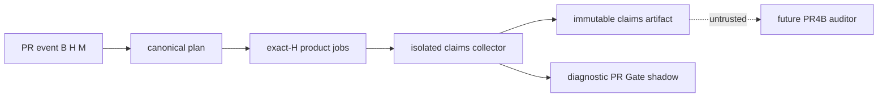

# Feature design: CI shadow PR4A classifier and diagnostic producer

- Status: IMPLEMENTED
- Implementation evidence: [PR #663](https://github.com/PaulKov/dpone/pull/663) merged as `0b4849bd2e7afc9a2778d6120f742d2202db8aff`; its exact reviewed head was `91d2a32a0e46bef10432d55007cf25a751499c74`.
- Owner: dpone maintainers
- Issue: [#512](https://github.com/PaulKov/dpone/issues/512)
- Target release: TBD
Last verified: 2026-08-27

## Executive summary

PR4A is missing although PR4B and PR5A depend on it. It will introduce a read-only diagnostic producer that classifies an exact B..H pull-request diff, runs a closed job set on H, and publishes untrusted immutable claims plus a non-authoritative `PR Gate shadow` context. The existing nineteen legacy checks remain the sole merge authority.

## Personas and customer journey

| Persona | Goal | Success signal |
| --- | --- | --- |
| Contributor | Understand selected CI work for their exact head | diagnostic check and attempt-bound claims artifact |
| Maintainer | Triage route selection safely | docs say the check cannot authorize merge |
| Future auditor | Independently verify producer claims | strict plan, route-policy, and claims schemas |

A contributor observes a diagnostic for H, uses a runbook for an unknown, failed, or cancelled route, and amends their head for a new attempt. A rerun has a distinct identity and never overwrites or promotes prior claims. Same-repository, fork, and Dependabot producers have one read-only profile; unavailable hosted evidence is UNVERIFIED.

## Scope

### In scope

- Canonical planner and outcome evaluator with thin `tools/ci/change_plan.py` and `tools/ci/gate_evaluator.py` adapters.
- Separate exact-H read-only workflow, closed product job/case vocabulary, immutable claims, and one `PR Gate shadow` context.
- Strict schemas, tests, documentation, and hosted certification matrix.

### Non-goals

- `PR Gate`, required or merge-authoritative shadow checks, branch-protection changes, releases, secrets, PR4B auditing, PR4C, PR5, readiness, or cutover.
- Reuse of audit-only superseded #511 prototype.

### Assumptions and constraints

PR4A implements ADR 0046 and ADR 0048 literally. A new ADR is needed only if their trust boundary, lifecycle, or authority changes. No production write may start before a maintainer marks this spec APPROVED and refreshes its task contract base.

## Public contract

### CLI

Approved implementation freezes parser-validated options, defaults, streams and exits for these thin adapters:

```text
python tools/ci/change_plan.py --event <event.json> --policy <route-policy.json> --output <plan.json>
python tools/ci/gate_evaluator.py --plan <plan.json> --jobs <jobs.json> --output <claims.json>
```

Outputs are create-new atomic UTF-8 JSON. Invalid input or I/O is non-zero; a valid UNVERIFIED is JSON, never silent success.

### Python API, schemas, artifact, compatibility

Canonical modules belong in `dpone.contracts.ci_shadow_*` and `dpone.services.ci.shadow_*`, behind injected `dpone.ports.github_ci_shadow` and `dpone.adapters.github_ci_shadow_*`. Tools/workflow compose only and cannot duplicate policy or evidence encoding.

Strict schemas are `docs/schemas/cicd/ci-change-plan-v1.schema.json`, `ci-shadow-route-policy-v1.schema.json`, and `pr-gate-shadow-evidence-v1.schema.json`. The closed job order is `static`, `contracts`, `docs`, `python-3.11`, `python-3.12`, `packaging`, `postgresql`, `airflow`, `runtime-wheel-smoke`; selection is `RUN|N/A`, outcome is `PASS|FAIL|N/A`; Airflow has eight cases and wheel smoke two. Reject unknown fields, duplicate keys, trailing bytes, non-finite numbers, invalid UTF-8 and all limits.

Claims are direct-uploaded create-only as `pr-gate-shadow-evidence-<run-id>-<attempt>.json`, with archive false, overwrite false, 90-day retention and 1-MiB maximum. Streaming validation enforces depth 8 and the parent limits. Claims cannot self-claim provider artifact metadata. `PR Gate shadow` is new and non-required; `PR Gate` is forbidden; all legacy contexts are unchanged.

## Detailed algorithm

1. Validate direct event identity: repository, PR, B, H, M and policy bytes.
2. Obtain rename-disabled NUL-delimited B..H diff and normalize duplicates. Unknown path, diff, identity, policy, schema or semantic-TOML ambiguity selects full work or UNVERIFIED, never less work.
3. Canonically encode plan and SHA-256 digest.
4. Every product job checks out immutable H without credentials/submodules and proves clean worktree, HEAD equals H, and subject tree.
5. Run selected closed jobs/cases natively: no continue-on-error; every matrix uses fail-fast false.
6. A distinct always collector has no checkout/cache/download and no secret/write/OIDC/environment; it pages only its exact attempt Jobs API plus direct event fields.
7. Create-only upload claims and publish `PR Gate shadow`. Cancelled, skipped, timed-out, missing, nonterminal or ambiguous cases fold to UNVERIFIED.
8. Rerun creates a new attempt; no old claim mutates, checkpoints, cursors, or becomes trusted.



A changed producer workflow blob/mode across B/H/M, inaccessible foreign H, false self-described status or incomplete API is UNVERIFIED. The collector trusts neither matrix output merging nor product artifacts. PR-scoped concurrency cannot cancel another PR.

## Architecture and tradeoffs

| Component | Responsibility | Dependency direction |
| --- | --- | --- |
| contracts | closed values, schema, canonical JSON | stdlib |
| shadow service | classify, fold, validate | contracts plus injected ports |
| GitHub port/adapter | diff, exact identity, Jobs API | provider boundary |
| tools/workflow | composition only | services |

`TRUST_CORE` is an explicit closed bundle manifest. Dynamic import, eval/exec, undeclared helper/local action/reusable workflow, or dynamic dependency is default-deny UNVERIFIED. Modules stay below 400 SLOC and split by contract/classification/folding/port/adapter. Reusing #511 and shell/YAML policy duplication are rejected.

## Market comparison

| System/version | Relevant capability | Decision | Source/date |
| --- | --- | --- | --- |
| dlt 1.30.0 | declarative resource selection | reject as CI-governance model; retain closed routing | [official docs](https://dlthub.com/docs/general-usage/source), 2026-08-27 |
| Astronomer Cosmos | Airflow/dbt task orchestration | N/A: not PR evidence authority | [official docs](https://www.astronomer.io/docs/learn/airflow-dbt), 2026-08-27 |
| Airbyte, Fivetran, Informatica, Pentaho, SSIS, gusty, Apache Beam | data integration/execution | N/A: none define exact-head GitHub producer claims | official product scope, 2026-08-27 |

## Measurable differentiation

```yaml
axis: diagnostic route provenance
scenario: unchanged-head PR for every documented route
baseline: PR4A producer absent
metric: exact-H plan/artifact/context coverage and false-authority count
target: 8/8 valid producer artifacts; 0 diagnostics treated as authority
procedure: exact-head route canaries and burst/cancellation tests
artifact: attempt-specific claims JSON and provider receipts
limitations: claims remain UNVERIFIED until PR4B
```

## Security, test and certification plan

All PR4A paths are read-only: no secret, write token, OIDC, environment, trusted cache, collector checkout or collector download. Future docs include run-view/download recovery and distinguish new head from rerun.

| Layer | Required scenario | Evidence |
| --- | --- | --- |
| Unit | nine maps, NUL diff, semantic TOML, fold algebra | deterministic fixtures |
| Contract | strict JSON limits, one-context policy | schema/governance report |
| Mocked integration | inaccessible H, B/H/M mismatch, missing/false jobs | injected-port tests |
| Workflow | same-repo/fork/Dependabot read-only, no continue-on-error | workflow-security report |
| Live | eight routes, failure/recovery, burst/cancellation | exact-head artifacts or UNVERIFIED |
| Compatibility | legacy 19 unchanged | branch-protection policy test |

Focused checks include new tests, actionlint and workflow security. Broad checks use the change-aware selector plus Ruff, format, mypy, import/layer/module, non-live pytest, strict docs, builds and Twine as applicable. Mocked, skipped, unauthorized or stale hosted checks are never PASS.

## Documentation, rollout and rollback

Implementation adds `docs/cicd/pr-gate-shadow.md` for purpose, non-authority, CLI/JSON reference and first success, plus `docs/cicd/pr-gate-shadow-runbook.md` for unknown paths, identity mismatch, cancellation and claims recovery. Add short links and MkDocs navigation; do not grow documentation monoliths.

Land a separate non-required workflow, observe same-repo/fork/Dependabot, then execute canaries. On false green, source mismatch, authority drift or security violation, revert/disable the shadow workflow only; never bypass legacy protection.

## Agent execution plan

The integrator owns shared workflows, policies, schemas, navigation and generated files. Future writers receive disjoint fresh-base contracts; this planning contract allocates no production writes.

## Approval checklist

- [x] Problem, journey, public boundary, algorithm and failure semantics are explicit.
- [x] Security, tests, evidence, documentation, rollout and rollback are planned.
- [x] Primary-source comparison and measurable target are recorded.
- [x] Fresh architecture, execution, certification and docs/UX reviews informed this contract.
- [x] Maintainer changed status to `APPROVED` (2026-08-27).
- [x] Implementation landed with the exact-head PR4B integration and is covered by its non-authoritative producer, auditor, legacy-CI, and Agent PR receipt evidence (2026-08-27).
