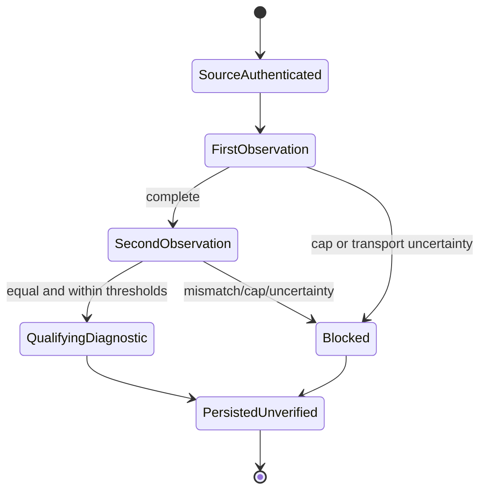

# Feature design: CI shadow PR4C capacity calibration

- Status: APPROVED
- Owner: repository owner (explicit `APPROVED` and complete-all authorization in this task)
- Issue: #512
- Target release: TBD
Last verified: 2026-08-27

> **Parent amendment.** The measured request-budget successor is
> [PR4C budget amendment](feature-design-ci-shadow-pr4c-budget-amendment.md).
> It retains this feature's algorithm and changes only the fixed HTTP request
> hard maximum/derived approval threshold after live evidence showed that the
> original values were structurally infeasible for the observed 14-day volume.

## Executive summary

Before the stateless 14-day CI-shadow reconciler is implemented, an operator
needs bounded, reproducible evidence that a full double observation fits the
parent-owned resource caps. The capacity probe is a read-only, default-branch
`workflow_dispatch` observer. It always emits an `UNVERIFIED` artifact: a
qualifying result may unblock approval of the *next* child, but can never
certify a reconciliation root, change merge authority, or mutate GitHub state.

This child corrects an otherwise impossible transport claim in the parent: the
GitHub API exposes an Actions artifact as a ZIP archive, whose metadata digest
and size bind archive bytes, not the direct JSON member. The probe therefore
authenticates bounded archive bytes first, extracts exactly one confined regular
JSON member, and records a separate payload SHA-256/size. This is a safety
clarification, not a relaxation: each byte boundary has a precise identity.

## Personas and customer journey

| Persona | Goal | Current pain | Success signal |
|---|---|---|---|
| CI/security operator | Measure reconciliation cost safely | Cannot tell whether a 14-day observer will exceed safe limits | Immutable, source-bound diagnostic capacity artifact |
| Reconciler implementer | Obtain a narrow implementation prerequisite | Static policy limits are not production evidence | Fresh qualifying artifact and recorded public-fork canary |
| Contributor | Preserve current merge experience | A new observer could accidentally become authority | Existing nineteen checks are unchanged; no new required context |

The operator finds **CI shadow / Capacity calibration**, confirms PR4B and the
recorded public-fork lifecycle canary, manually dispatches the trusted
default-branch workflow, and retrieves the exact attempt artifact. A qualifying
observation has exit `1` because its decision remains `UNVERIFIED`; it is not a
failed reconciliation. An incomplete or over-threshold result is also
`UNVERIFIED`, with a blocking code and recovery instruction. A malformed local
fixture invocation exits `2`; an unexpected operational failure exits `70` and
does not manufacture a qualifying artifact. Retrying creates a new immutable
attempt artifact and never overwrites an older one.

## Scope

### In scope

- Immutable historical `ReconciliationPolicyV1` plus successor
  `ReconciliationPolicyV2`, fixed parent maxima and derived approval thresholds;
  no external policy argument.
- Default-branch, source-free, read-only calibration workflow and thin CLI.
- Two independent bounded 14-day acquisition observations, canonical equality,
  resource accounting, and always-`UNVERIFIED` capacity evidence.
- Archive-first provider transport authentication and hardened single-file JSON
  extraction.
- Static acquisition-bundle closure/digest and bound execution configuration.
- Create-only evidence writer, tests, public schema/reference, runbook, and
  operator journey.

### Non-goals

- The stateless reconciler, its daily schedule, report, or `PASS|FAIL` root.
- Approval consumption, branch/ruleset/protection/repository settings mutation,
  GitHub App authority, OIDC, secrets, cache, or PR checkout.
- Treating a calibration observation or public-fork canary as merge authority.
- Altering legacy route-attestation writer semantics.

### Assumptions and constraints

- Historical V1 maxima remain `800` requests, `134217728` bytes, and `900`
  seconds. The capacity workflow uses V2 at `3000` requests with the same byte
  and wall caps; qualifying values are at most half those V2 caps.
- GitHub's artifact endpoint is ZIP transport; its provider `size_in_bytes` and
  `digest` bind the archive. Archive and payload are independently bounded.
- The separate public-fork lifecycle canary is required before the later
  reconciler child, not as a substitute for this probe.

## Public contract

### CLI

`uv run python tools/ci/calibrate_pr_gate_shadow_capacity.py --event PATH --output PATH`
is a fixture/test composition root. It accepts only a trusted default-branch
workflow-dispatch event shape; it has no `--policy`, credential, range, or
network-selection option. A completed observation writes one schema-valid JSON
file atomically and exits `1` for either capacity code. Invalid arguments/input
exit `2` to stderr and leave no output; unexpected operational errors exit `70`
and leave no qualifying evidence. stdout is machine-safe JSON summary only.

### Python API

New canonical contracts live under `dpone.contracts`, read-only provider and
clock interfaces under `dpone.ports`, decisions under `dpone.services.ci`, and
the GitHub/filesystem implementations under `dpone.adapters`. Composition roots
inject policy, provider, UTC clock, monotonic clock, and writer; imports perform
no I/O.

### Manifest/schema

Historical `dpone.ci-shadow-reconciliation-capacity.v1` remains closed and
always has `decision=UNVERIFIED`. New workflow output is additive
`dpone.ci-shadow-reconciliation-capacity.v2`, also always `UNVERIFIED`; a V1
receipt is retained as historical evidence and cannot qualify V2. Both record source identity, execution configuration,
policy and acquisition-bundle digests, including the separately verified
manifest digest and the capacity workflow/CLI source closure, exact interval,
double-observation result, limits/counters, and `valid_until`. Transport identity records archive
ID/name/provider archive digest/archive size plus JSON payload SHA-256/payload
size; archive metadata is never compared directly with JSON bytes.

### Artifacts and evidence

The workflow create-only uploads
`pr-gate-shadow-reconciliation-capacity-<observer-run-id>-<attempt>.json` for
90 days. It uses `actions/upload-artifact` with `archive: true`: the approved
transport contract authenticates provider ZIP bytes first, while `archive:
false` uploads a single raw file and would contradict that contract. Its ZIP
transport is authenticated before extraction. The direct JSON
member must be exactly the expected filename, the sole regular non-directory
entry, UTF-8, bounded, and free of traversal, duplicate, symlink, encrypted,
and unsupported-compression ambiguity. The artifact itself has no daily-root or
merge authority.

### Compatibility and migration

This is additive. Existing nineteen required checks, PR4A/PR4B workflow behavior,
and legacy route-attestation output remain unchanged. Rollback disables/reverts
only the capacity workflow and code; no state migration is needed.

## Detailed algorithm

1. Validate trusted event source against the provider: repository, default-branch
   workflow ID/path/revision/ref/event/run/attempt. Reject mismatches before
   acquisition.
2. Build canonical runtime policy bytes and SHA-256. Derive
   `scan_from = floor(utc_now)-30m-14d`, `safe_scan_through = floor(utc_now)-30m`.
   The policy also freezes the current repository-scoped IDs for `PR Gate
   shadow` (343714753) and `PR Gate shadow audit` (343909056); a deleted and
   recreated workflow is a new identity and therefore fails closed until a
   reviewed contract amendment updates it.
3. Build/verify static acquisition-bundle closure from exact trusted Git objects;
   reject dynamic/unresolved imports, reads, scripts, symlinks, invalid paths, or
   mismatched local bytes/modes. Record runner label, architecture, and Python.
4. For observation one and observation two independently enumerate every bounded
   provider input through the metered port. Count every dispatch before it occurs;
   cap timeout at remaining monotonic budget; retain canonical records and raw
   response/content digests. Stop immediately at any hard limit and retain only
   canonical saturated lower-bound information.
5. Do no provider reads after completion of observation two. Compare topology,
   records, artifact archive bytes/digests, extracted JSON payload bytes/digests,
   and identity. Counters are not snapshot identity.
6. Produce a closed `UNVERIFIED` decision. It is
   `RECONCILIATION_CAPACITY_CALIBRATION_ONLY` only if both observations are
   complete/equal, no hard limit crossed, and all three values are within half
   maxima; otherwise it is `RECONCILIATION_PR4C_IMPLEMENTATION_BLOCKED`.
7. Serialize bounded canonical UTF-8 JSON; use the descriptor-pinned create-only
   writer (`stage -> file fsync -> atomic no-replace -> parent fsync`). An
   identical retry is idempotent only after current descriptor/inode/byte/fsync
   revalidation. Persist before returning exit `1`.

### Pseudocode

```text
source = authenticate_default_branch_dispatch(event)
policy = ReconciliationPolicyV2.fixed()
bundle = verify_exact_acquisition_bundle(source.workflow_sha)
first = acquire_complete_observation(policy, clocks, metered_provider)
second = acquire_complete_observation(policy, clocks, metered_provider)
equal = first.complete and second.complete and canonical_digest(first) == canonical_digest(second)
result = capacity_decision(first, second, equal, fixed_half_maxima)
receipt = render_unverified_capacity_evidence(source, policy, bundle, first, second, result)
writer.write_create_only(receipt_path(source), receipt)
return exit(1)
```

### State machine



### Edge cases

Empty intervals are valid only when both independently observed empty snapshots
are equal. Missing/pending/foreign runs, partial pagination, changed pages,
duplicate ZIP entries, malformed/oversized/non-finite JSON, redirects/retries,
timeout, clock regressions, process crash, writer ambiguity, and unsupported
archive features produce a persisted blocking `UNVERIFIED` receipt when possible.
No retry repairs prior evidence or exceeds a cap; transient service failure may
be retried as a new attempt, while deterministic overflow requires a parent
amendment.

## Architecture

| Component | Existing/new | Responsibility | Dependencies |
|---|---|---|---|
| `ReconciliationPolicyV1` | new | fixed runtime policy and canonical bytes | contracts only |
| observation service | new | two bounded canonical acquisitions | ports, policy |
| capacity service | new | equality/threshold decision and evidence | observation service |
| metered GitHub port | new | read-only dispatch, pages, archive bytes | stdlib HTTP, clocks |
| bundle service | new | static closure/digest verification | Git-object port |
| create-only writer | new | durable no-replace evidence | filesystem only |
| CLI/workflow | new | composition and upload | services only |

Dependency direction is roots -> adapters/services -> ports/contracts. The
existing PR4B audit adapter is read-only reference code, not a shared super-port.
The new writer is independent of route-attestation helper behavior.

### Alternatives and tradeoffs

| Alternative | Advantages | Disadvantages | Decision |
|---|---|---|---|
| Bind JSON to artifact metadata directly | concise | false transport identity for ZIP | reject |
| Authenticate ZIP then one hardened JSON member | complete provider/payload chain | more validation | adopt |
| Use YAML policy file at runtime | flexible | mutable/non-reproducible policy | reject |
| Cursor/ledger observer | incremental | violates stateless parent | reject |

### ADR requirement

ADR 0048 and the parent feature design require an amendment because archive and
payload transport semantics are normative evidence behavior.

### Quality-budget impact

Services are split by stable responsibility (policy, acquisition, decision,
bundle, writer, adapter); no module may grow beyond repository budgets. New code
uses standard-library ZIP/HTTP only and keeps composition roots thin.

## Market comparison

| System/version | Relevant capability | Observed design | Strength | Limitation | Adopt/reject | Source/date |
|---|---|---|---|---|---|---|
| GitHub Actions | artifact REST transport | artifact metadata includes digest/size and download endpoint is ZIP | provider transport identity | archive is not payload bytes | authenticate archive then payload | GitHub Docs, 2026-08-27 |
| dlt | N/A | data-pipeline runtime, not CI audit observer | N/A | no comparable CI evidence transport | N/A | N/A |
| Airbyte | N/A | data integration platform, not CI audit observer | N/A | no comparable CI evidence transport | N/A | N/A |
| Fivetran | N/A | managed ELT, not CI audit observer | N/A | no comparable CI evidence transport | N/A | N/A |
| Informatica | N/A | managed integration, not CI audit observer | N/A | no comparable CI evidence transport | N/A | N/A |
| Pentaho | N/A | ETL tooling, not CI audit observer | N/A | no comparable CI evidence transport | N/A | N/A |
| Microsoft SSIS | N/A | ETL runtime, not CI audit observer | N/A | no comparable CI evidence transport | N/A | N/A |
| gusty | N/A | DAG tooling, not CI audit observer | N/A | no comparable CI evidence transport | N/A | N/A |
| Astronomer Cosmos | N/A | dbt/Airflow DAG integration, not CI audit observer | N/A | no comparable CI evidence transport | N/A | N/A |
| Apache Beam | N/A | data processing SDK, not CI audit observer | N/A | no comparable CI evidence transport | N/A | N/A |

## Measurable differentiation

```yaml
axis: evidence transport integrity
scenario: Actions artifact containing capacity JSON under normal ZIP transport
baseline: direct-JSON metadata comparison is impossible
metric: archive digest/size and extracted payload digest/size are independently verified
target: 100% of accepted artifacts satisfy both chains; all archive ambiguity is UNVERIFIED
procedure: deterministic adapter tests plus authenticated default-branch workflow evidence
artifact: pr-gate-shadow-reconciliation-capacity-<run>-<attempt>.json
limitations: proves provider-observable artifact transport, not absence of hidden/deleted runs
```

## Security, privacy, and operations

The workflow has only `contents`, `actions`, and `pull-requests` read access.
It has no secret, OIDC, cache, PR checkout, admin endpoint, or mutation transport.
Archive extraction is in-memory/bounded and never executes, imports, sources, or
interpolates artifact content. Logs contain only stable IDs, counters, and
redacted failure codes. The runbook distinguishes a qualifying diagnostic from
reconciler approval and documents fresh-dispatch recovery.

## Test and certification plan

| Layer | Scenario | Environment | Expected artifact |
|---|---|---|---|
| Unit | policy/interval/counters/equality | deterministic clocks | closed decision |
| Adapter | pages, retries, redirects, ZIP identity/extraction | fake provider | request/byte accounting |
| Filesystem | create-only/replay/fsync failure | temp confined tree | durable byte evidence |
| CLI | valid/invalid/error streams, exits, side effects | fixture files | output/no-output proof |
| Workflow | permissions/source/upload retention | static contracts | workflow proof |
| Live | default-branch dispatch, two observations | approved GitHub environment | authenticated artifact |
| Compatibility | legacy writer and non-live suite | CI | no regression |

Boundaries cover 1,500/1,501 requests, 64MiB/64MiB+1, 450s/epsilon, 3,000/3,001,
128MiB/plus one, 900s/epsilon, JSON depth/nodes, ZIP member ambiguity, and
bundle paths/entries. The public-fork lifecycle remains separately `UNVERIFIED`
until a real canary journal is captured.

## Documentation plan

Add a capacity-calibration overview/reference, public schema, runbook decision
matrix, CI/CD nav, and cross-links from PR Gate shadow docs. Show the manual
default-branch workflow journey and explicitly avoid an operator-controlled
trusted event or policy file. Do not document the later reconciler as available.

## Rollout and rollback

Land this probe only after its exact-head checks pass. Dispatch once from master,
authenticate the artifact, and record whether it is fresh/within threshold. The
later reconciler remains blocked until this and public-fork evidence exist.
Rollback reverts/disables the new workflow; no data or policy state needs repair.

## Agent execution plan

| Agent/role | Owned paths | Read-only paths | Forbidden paths | Dependency |
|---|---|---|---|---|
| integrator | all shared workflow/schema/docs/contract paths | existing PR4B code | protected settings, legacy workflows | approved spec |

## Approval checklist

- [x] User problem and CJM are clear.
- [x] Algorithm and failure semantics are implementable without guessing.
- [x] Public contracts and compatibility are explicit.
- [x] Architecture and alternatives are justified.
- [x] Relevant market research uses current official sources.
- [x] Claimed differentiation is measurable.
- [x] Tests, evidence, docs, rollout, and rollback are complete.
- [x] Path ownership and integration plan are conflict-safe.
- [x] Maintainer approval is present in this task’s explicit authorization.
