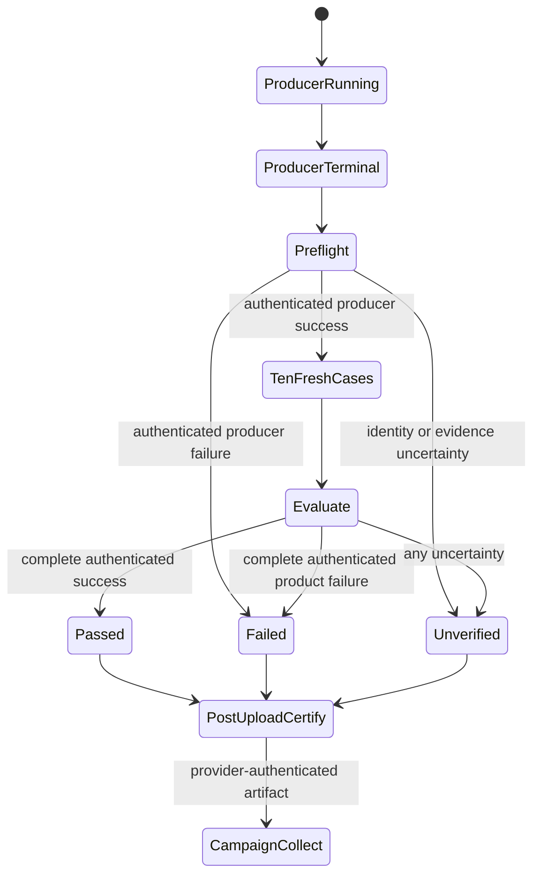
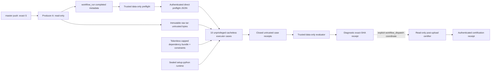

# Feature design: CI shadow PR5B completed-producer verifier

- Status: RESEARCHED
- Owner: dpone maintainers
- Issue: [#512](https://github.com/PaulKov/dpone/issues/512)
- Parent specification: [CI shadow closure and exact-SHA evidence](feature-design-ci-pr-gate-exact-sha-evidence.md)
- Producer prerequisite: [PR5A immutable candidate manifest](feature-design-ci-shadow-pr5a-candidate-manifest.md)
- Architecture decision: [ADR 0048](adr/0048-exact-sha-readiness-evidence.md)
- Target release: TBD
- Approval history: the maintainer approved PR #682 exact researched head
  `2046eab67b432d8caf0fb615f142fae2a8d75d54` on 2026-08-30. A subsequent
  fresh architecture review found two P0 implementability gaps: no authenticated
  cross-job path for the preflight receipt and no explicit dependency-preparation
  capability before the networkless sandbox. Later fresh reviews also found an
  incomplete root descriptor handoff, official-constraint conflicts and an
  ambiguous post-upload job-output boundary. Review of researched head
  `91e3bf1739ab46cd8007b9fa4a78a6f66f586421` then found missing sealed
  Python/constraint capabilities, unobservable pip-network accounting and
  incomplete session/operation framing. Review of researched head
  `6c29c223e9e5b1e868f100a07a17a3a4191ed110` then found pathless resolver
  inputs, unauthenticated launcher bootstrap, incomplete resolver framing,
  ambiguous inner failure classification and no authenticated post-upload
  certification producer. Review of researched head
  `38586dc7e387423fcd0c29bd207279c171ee5d29` found an Ubuntu-incompatible sudo
  argv, invalid pip wheel aliases, a forbidden second `workflow_run` hop and
  schemas unable to represent pre-bootstrap or negative-control uncertainty.
  Successor-diff reviews then found an undefined privileged cleanup inventory,
  premature process-group absence, no explicit pre-READY lifecycle return path,
  incomplete journal framing, non-crash-safe final stage deletion and
  placeholder lifecycle digests in the canonical example. The amendments close
  those gaps but keep the design `RESEARCHED`; a fresh
  exact-head approval is required.
Last verified: 2026-08-31
Fresh approval gate: a fresh exact-head approval is required.

## Executive summary

PR5B turns the PR5A three-wheel manifest into safe, exact-subject compatibility
evidence. A default-branch producer builds one immutable raw USTAR candidate for
one authenticated `master` commit and terminates. A separate `workflow_run`
verifier authenticates producer metadata without opening candidate bytes, runs
the exact eight Airflow cells and two runtime-wheel smokes in fresh unprivileged
cacheless jobs, and folds their closed receipts into one attempt-bound result.

This is diagnostic evidence only. It never replaces the required contexts
resolved from the canonical active branch-protection policy and cannot authorize
a merge, readiness `PASS`, release, publication, tag, ruleset change, or package
upload. Success is measurable as two distinct `master` SHAs with authenticated
ten-case receipts, including a complete producer rerun that inherits no case.

## Personas and customer journey

| Persona | Goal | Current pain | Success signal |
| --- | --- | --- | --- |
| Contributor | Know whether the exact merged wheels work across supported Airflow/Python combinations | Same-run tests do not prove a completed immutable candidate | Receipt binds one producer run/attempt/artifact and all ten fresh cases |
| Release engineer | Diagnose `FAIL` without mistaking missing proof for product failure | Workflow conclusions and “latest” artifacts are ambiguous | Closed blocker and recovery codes distinguish `FAIL` from `UNVERIFIED` |
| Security reviewer | Keep candidate execution out of privileged `workflow_run` code | A downstream workflow may receive write/secrets authority | Trusted jobs are data-only; candidate bytes open only in secretless cacheless jobs |
| Agent | Locate and verify evidence without mutable selection | URLs and first search results are navigation only | Run ID, attempt, artifact ID/digest, subject SHA and profile digest are explicit |

The first-success path is:

1. Merge an ordinary reviewed change to `master`; do not manufacture a test
   merge or dispatch a manual producer.
2. Find `Exact SHA candidate` by the exact 40-hex subject SHA and record its
   provider run ID and attempt.
3. Wait for `Exact SHA compatibility`, which starts only after that producer
   finishes. `workflow_run: completed` is a trigger, not proof of success.
4. Select the verifier by the producer ID/attempt inside its closed receipt,
   never by “latest”, URL, workflow conclusion, or list order.
5. Authenticate repository/workflow/event/ref/SHA/run/attempt, candidate artifact
   ID/name/digest/size, inventory digest, verifier revision/run/attempt and the
   complete ten-case profile. The verifier's uploaded `PASS` is still only a
   candidate receipt because that run cannot observe its own future terminal
   outcome or independently authenticate its just-uploaded artifact.
6. Dispatch `Exact SHA compatibility certification` in `CERTIFY` mode on exact
   `master` HEAD with the closed request containing only verifier run ID, run
   attempt and constant verifier workflow path. The certifier enumerates that
   exact attempt and independently discovers/authenticates its final artifact and
   producer subject; callers do not supply either claim. Wait for that certifier
   attempt to reach `completed/success`, then require its
   exact-current-attempt readback object and independently authenticate the
   certification artifact bytes. Only then interpret certification `PASS`,
   `FAIL`, or `UNVERIFIED`; neither the raw verifier conclusion nor its candidate
   receipt is certification.
7. For the eight-role lifecycle campaign, dispatch the same workflow in
   `COLLECT_CAMPAIGN` mode with the exact authenticated certification coordinates,
   then repeat current-attempt readback and terminal-success authentication for
   the collector artifact. Campaign PASS remains diagnostic and never grants
   release authority.
8. For `FAIL`, repair the product or compatibility contract and create a new
   `master` commit. For `UNVERIFIED`, follow the named recovery action and create
   a fresh producer/verifier attempt when evidence is incomplete. Never repaint
   or overwrite an old receipt.

## Scope

### In scope

- `.github/workflows/exact-sha-candidate.yml`, named `Exact SHA candidate`, on
  `push` to `master` only.
- `.github/workflows/exact-sha-compatibility.yml`, named
  `Exact SHA compatibility`, on completed producer runs only.
- One deterministic bounded raw USTAR candidate containing exactly the three
  PR5A wheels and `compatibility-candidate.json`.
- Provider-authenticated producer preflight; eight Airflow compatibility cases;
  two Python runtime-wheel smokes; an uncertainty-first evaluator.
- Closed preflight, case, and final-receipt schemas, immutable artifacts, thin
  CLI composition roots, canonical contracts/services/ports/adapters, tests,
  operational documentation and hosted evidence.

### Non-goals

- Current required-context, ruleset, classic-protection, release, tag,
  publication, environment, secret, OIDC, cache or write mutation.
- Pull-request, manual, scheduled, tag, other-branch, same-run, fork or private
  network candidate authority.
- Replacing `airflow-pack-compat.yml`, expanding the supported matrix, publishing
  attestations, signing wheels, or making the diagnostic receipt release
  authority.
- Reusing prior verifier cells, failed-only reruns, mutable “latest” pointers,
  durable state, checkpoints or an evidence ledger.
- Adding `dpone-native-accel`: this is the three-wheel compatibility candidate,
  not the four-distribution release candidate.

### Assumptions and constraints

- PR5A is merged and its closed `dpone.compatibility-candidate.v1` bytes remain
  unchanged. PR5B consumes exactly that schema.
- Producer subject authority is the provider-authenticated workflow-run
  `head_sha`, cross-checked with exact checkout and the allowlisted merged
  workflow. Trusted preflight requires the producer workflow regular Git blob at
  that subject to be byte-identical to the same path at the verifier revision,
  records both Git object IDs and SHA-256, and revalidates the blob before final
  persistence. A SHA repeated inside a manifest or wheel would be candidate
  self-description, not authentication, so PR5B does not add such a field.
- `actions/upload-artifact@v7` with `archive:false` accepts one direct file.
  Therefore the four logical members travel as one uncompressed raw USTAR file.
  Trusted preflight and evaluation never open that file.
- Hosted public dependency downloads are allowed only in the tokenless trusted
  dependency-preparation boundary of an unprivileged executor. Preparation,
  inventory authentication and read-only sealing finish before the networkless
  candidate sandbox exists; candidate code never performs a network install.
- The exact matrix metadata remains parity-bound to
  `.github/workflows/airflow-pack-compat.yml` and `docs/compatibility.md`.

## Public contract

### Workflows and jobs

Workflow A is `.github/workflows/exact-sha-candidate.yml`:

- top-level `name: Exact SHA candidate`;
- trigger exactly `push.branches: [master]`; no `pull_request`,
  `workflow_dispatch`, `workflow_call`, schedule, tag or path filter;
- top-level and job permissions exactly `contents: read`;
- one job key `build-candidate`, display name `Build exact SHA candidate`,
  `ubuntu-24.04`, timeout 30 minutes;
- no workflow or job `concurrency` key: every merged subject and complete rerun
  must remain independently observable rather than being cancelled by a newer
  push;
- checkout exact `${{ github.sha }}` with credentials and submodules disabled,
  then require `HEAD`, a clean tracked tree and provider `head_sha` parity;
- build exactly one wheel for `dpone`, `dpone-airflow-pack`, and
  `apache-airflow-providers-dpone`, run `uv run --frozen twine check` with the
  locked Twine 6.2.0, generate PR5A manifest,
  create the raw USTAR file, and upload it directly;
- upload `archive:false`, `overwrite:false`, `retention-days:90`,
  `if-no-files-found:error`. With direct upload, the filename and provider
  artifact name are both
  `exact-sha-candidate-<producer-run-id>-<producer-run-attempt>.tar`.

Workflow B is `.github/workflows/exact-sha-compatibility.yml`:

- top-level `name: Exact SHA compatibility`;
- trigger exactly `workflow_run.workflows: [Exact SHA candidate]` and
  `types: [completed]`; no other trigger;
- default-branch trusted revision only; every job uses `ubuntu-24.04`, and the
  workflow has no `concurrency` key;
- job key/display `preflight` / `Authenticate completed candidate`, then
  `airflow-compat` / `Exact candidate Airflow <airflow> / py<python>` and
  `runtime-wheel-smoke` / `Exact candidate runtime smoke / py<python>`, then
  `evaluate` / `Evaluate exact SHA compatibility` with `if: always()`;
- Airflow matrix `fail-fast:false`, `max-parallel:2`, timeout 60 minutes per
  case; runtime matrix `fail-fast:false`, `max-parallel:1`, timeout 30 minutes
  per case; preflight and evaluator timeout 10 minutes;
- every job and called action receives only `actions: read` and
  `contents: read`; no secret, inherited secret, write permission, OIDC,
  environment, self-hosted runner, VPN, private endpoint or cloud credential;
- preflight/evaluator are trusted data-only and never download/open/import/
  source/execute candidate bytes; executor jobs alone download and open them;
- `setup-uv` has `enable-cache:false`; `UV_NO_CACHE=1`,
  `PIP_NO_CACHE_DIR=1`, and `PYTHONNOUSERSITE=1` are explicit. `actions/cache`,
  setup-python caching and uv cache restore/save are forbidden;
- a dedicated token-bearing acquisition step first authenticates and downloads
  the direct preflight JSON by its exact current verifier run/attempt artifact
  coordinate, then invokes the separately injected bounded candidate streaming
  adapter by immutable artifact ID into a create-new raw file. No process has
  both a direct-JSON reader and candidate parser/executor capability. Later
  dependency preparation, candidate validation and commands run with
  `GITHUB_TOKEN`/`GH_TOKEN` absent and never receive a provider token.

Workflow C is `.github/workflows/exact-sha-compatibility-certify.yml`:

- top-level `name: Exact SHA compatibility certification`;
- trigger exactly `workflow_dispatch` with required `mode`
  (`CERTIFY|COLLECT_CAMPAIGN`) and required bounded `coordinates_json`; it has
  no `workflow_run`, scheduled, push, pull-request or reusable-workflow trigger
  and therefore does not extend the one-hop candidate chain;
- reject unless `github.event_name=workflow_dispatch`,
  `github.ref=refs/heads/master`, `github.ref_type=branch`, the event head
  repository ID equals `github.repository_id`, and `github.sha` is the exact
  provider-observed run `head_sha`. Checkout uses `ref: ${{ github.sha }}` with
  credentials and submodules disabled; the trusted identity step requires a
  clean tree and exact checkout `HEAD == github.sha == provider head_sha ==
  workflow revision_sha`, plus provider tree/workflow-blob parity. Dispatching
  the workflow file from a tag, fork, non-master ref or moving default-branch
  checkout is rejected before any evidence read;
- `certify` / `Certify exact SHA compatibility artifact` and `campaign` /
  `Collect exact SHA compatibility campaign` jobs use mutually exclusive exact
  mode conditions on `ubuntu-24.04`, timeout 10 minutes, and permissions exactly
  `actions: read` and `contents: read`;
- the raw `coordinates_json` limit is 49,152 ASCII bytes/characters, leaving
  headroom beneath GitHub's 65,535-character whole-dispatch-input limit. The
  expression is bound only as the fixed `DPONE_COORDINATES_JSON` step
  environment value; a static-argv trusted input adapter reads that one value,
  removes it from the child environment and writes an `O_EXCL|O_NOFOLLOW`
  create-only raw file before parsing. It is never interpolated into `run`, a
  shell, argv, a command file or logs. Quotes, newlines and expression-looking
  `${{ ... }}` text remain inert input bytes and then fail or pass the closed
  JSON grammar normally;
- construct `CurrentWorkflowCoordinateV1` only from explicitly passed GitHub
  context fields, authenticate the current certifier run/revision/blob/tree and
  every input verifier/certifier coordinate before using its data;
- enumerate exact verifier attempt Jobs/artifacts, bounded-download only direct
  JSON case/final receipts. Each mutually exclusive job has the exact step
  order `capture domain exit → if: always() upload candidate → if: always()
  exact-current-attempt readback → if: always() enforce`. The capture wrapper
  stores one bounded numeric exit without repainting it and commits the
  canonical candidate in a trusted create-only directory, then emits its
  writer-derived kind/schema/size/digest/device/inode commitment once into the
  runner-owned step-output channel before upload; upload consumes that exact
  leaf and uses
  `archive:false`, `overwrite:false`, `retention-days:90`; readback binds the
  upload ID/name/provider digest/size, receives only the prior immutable step
  outputs, independently recaptures that local leaf, and compares all of them
  with independently downloaded canonical bytes; enforcement
  succeeds only when the captured decision, upload and readback agree. Thus an
  expected `UNVERIFIED` selective/cancelled certification is uploaded before
  its certifier job becomes non-success, while missing/malformed capture,
  skipped/failed upload or readback can never pass;
- the producer and readback roots are separate processes with immutable provider
  dispatch partitions of 56 and 8 respectively. Their checked-in workflow
  constants sum to the job ceiling 64; each root rejects its next dispatch at
  the boundary, and no environment value, step output or retry can transfer an
  unused dispatch between them;
- campaign mode parses the exact eight-role coordinate-set schema, revalidates
  every certifier artifact and its terminal run outcome, then writes/uploads
  and reads back the URL-free campaign manifest using the same persistence
  ordering;
- never download the candidate raw tar, execute candidate bytes, receive a
  secret/write/OIDC/environment/private-runner capability or infer authority
  from a verifier workflow conclusion.

Action and toolchain pins are exact implementation bytes:

| Capability | Pin |
| --- | --- |
| checkout | `actions/checkout@9c091bb21b7c1c1d1991bb908d89e4e9dddfe3e0` (v7.0.0) |
| Python | `actions/setup-python@ece7cb06caefa5fff74198d8649806c4678c61a1` (v6), Python 3.11/3.12 |
| uv | `astral-sh/setup-uv@37802adc94f370d6bfd71619e3f0bf239e1f3b78` (v7), `version: 0.11.28`, `enable-cache:false` |
| upload | `actions/upload-artifact@043fb46d1a93c77aae656e7c1c64a875d1fc6a0a` (v7.0.1) |

`actions/download-artifact` is deliberately not used: it cannot enforce the
raw `limit + 1` read or dispatch budget. The project streaming adapter follows
only provider-authenticated redirects, meters before dispatch/read, verifies
provider digest/size and refuses overwrite before the unprivileged case step.

Job dependencies and persistence ordering are closed:

- `preflight` has no `needs`. Its decision step always captures exit code into a
  trusted step output without converting the decision itself to success, then
  a direct preflight receipt upload runs with `if: always()`. A distinct
  post-upload step invokes `download_exact_sha_preflight.py` with the current
  verifier run/attempt and upload ID/name/digest plus the trusted writer
  size/payload digest, writes a separate create-new `verified-preflight.json`,
  and revalidates provider metadata and exact canonical bytes. A following
  `emit_exact_sha_preflight_outputs.py` step receives only that verified receipt,
  the authenticated coordinate and the trusted runner command-file path. Only
  this emitter step owns the seven job-output mappings; raw decision, upload and
  readback step outputs are not job outputs. A final
  enforcement step with `if: always()` fails unless upload and readback
  succeeded, all coordinates agree and the verified status is `READY` or
  authenticated producer `FAIL`. Missing/invalid evidence remains available to
  evaluator through wholly absent or partial outputs.
- Both executor matrices use `needs: preflight` and
  `if: needs.preflight.result == 'success' &&
  needs.preflight.outputs.execute_candidate == 'true'`. After direct preflight
  upload, the job exposes only bounded scalar `preflight_artifact_id`,
  `preflight_artifact_name`, `preflight_provider_digest`,
  `preflight_provider_size_bytes`, `preflight_payload_sha256`, `profile_digest`,
  and `execute_candidate`, in that emitter order with `execute_candidate` last.
  Artifact ID/digest come from the pinned upload action; name, payload digest and
  size come from the trusted writer. The final preflight enforcement requires
  those values and provider metadata to agree.
  Matrices contain only the ten closed case IDs and are parity-tested against
  the canonical profile; they never come from event or candidate bytes.
- Each executor follows `acquire authenticated preflight → acquire raw candidate
  → clear provider-token capability → validate and seal candidate → prepare and
  seal dependencies → create networkless sandbox → execute → trusted write
  case receipt → upload case receipt → enforce`, with upload and enforcement
  `if: always()`. Candidate code never runs the receipt writer. A product
  failure therefore persists `FAIL` before its job becomes failure; a crash or
  missing/upload-failed receipt becomes provider-visible failure and evaluator
  `UNVERIFIED`.
- `evaluate` has `needs: [preflight, airflow-compat,
  runtime-wheel-smoke]` and `if: always()`. The preflight artifact-coordinate
  outputs are an all-or-none optional group. The evaluator re-acquires and
  authenticates the direct preflight JSON itself; missing/upload-failed,
  partial, prior-attempt or invalid coordinates yield a final `UNVERIFIED`
  receipt with empty cases whenever verifier identity is sufficient to persist
  one. It then follows `refetch exact-attempt jobs/receipts → write final receipt
  → upload final receipt → enforce`. Final upload failure cannot yield `PASS`
  and is later observed as `UNVERIFIED`.
- There is no product `continue-on-error`. The small trusted capture wrapper
  records a tool exit code, returns zero only to reach mandatory persistence,
  and the separate final step enforces that exact recorded code plus upload
  outcome. Missing/malformed capture output fails closed.

The output emitter parses the create-new verified preflight JSON and the complete
authenticated coordinate again, then constructs exactly seven ASCII `key=value`
records in the preceding fixed order. It rejects controls, newlines, unknown
fields, disagreement, a non-`READY` receipt with `execute_candidate=true`, or an
output block above 4 KiB. The workflow passes the runner-created `GITHUB_OUTPUT`
path explicitly as `--github-output`; the emitter opens that existing regular
runner-owned file with `O_WRONLY|O_APPEND|O_NOFOLLOW|O_CLOEXEC`, rejects an inode
or owner change and a file already above 1 MiB, performs one bounded write,
`fsync`, reopens/revalidates the same inode and exact appended suffix, and closes
all descriptors. A short/ambiguous write or any later verification failure makes
the step and preflight job fail. Partially appended fields therefore cannot start
an executor because its job condition also requires
`needs.preflight.result == 'success'`; the always-running evaluator receives the
all-or-none optional coordinate group and classifies any partial group as
`INVALID`. No cleanup, truncation or retry mutates the command file.

The closed compatibility profile is:

| Case ID | Airflow | Python | CNCF | MSSQL | Cosmos | Support | constraint source/derived SHA-256 |
| --- | --- | --- | --- | --- | --- | --- | --- |
| `airflow-2.10.5-py3.11` | 2.10.5 | 3.11 | 10.1.0 | N/A | N/A | compatibility | `1f17de3b…63efd` / `ac6399c8…179e4` |
| `airflow-2.10.5-py3.12` | 2.10.5 | 3.12 | 10.1.0 | N/A | N/A | compatibility | `4b1a6a29…675f` / `2eea9d1d…bff9` |
| `airflow-2.11.0-py3.11` | 2.11.0 | 3.11 | 10.5.0 | 4.7.0 | 1.15.0 | compatibility | `b32ab3fa…53f3` / `bf9d1581…24a8` |
| `airflow-2.11.0-py3.12` | 2.11.0 | 3.12 | 10.5.0 | 4.7.0 | N/A | compatibility | `8fd8fe51…76ef` / `0c2b0bb5…cd74` |
| `airflow-3.2.0-py3.11` | 3.2.0 | 3.11 | 10.14.0 | 4.7.0 | N/A | primary | `f7b61e1b…2a53` / `bc2d91f6…9f14` |
| `airflow-3.2.0-py3.12` | 3.2.0 | 3.12 | 10.14.0 | 4.7.0 | N/A | primary | `ba0fda5c…514a` / `5aa338af…e82` |
| `airflow-3.3.0-py3.11` | 3.3.0 | 3.11 | 10.20.0 | 4.7.0 | N/A | latest | `40414c35…6d3a` / `55aeca56…b6ca` |
| `airflow-3.3.0-py3.12` | 3.3.0 | 3.12 | 10.20.0 | 4.7.0 | 1.15.0 | latest | `1ed2f249…e15f` / `be9e2019…c853` |
| `runtime-wheel-smoke-py3.11` | N/A | 3.11 | N/A | N/A | N/A | runtime | N/A |
| `runtime-wheel-smoke-py3.12` | N/A | 3.12 | N/A | N/A | N/A | runtime | N/A |

The complete constraint identities (ellipses above are display-only) are:

| Airflow | peeled official constraint tag commit | py3.11 source / derived | py3.12 source / derived |
| --- | --- | --- | --- |
| 2.10.5 | `5d78b83985da76882c7581e8b3829b8abf0f33cc` | `sha256:1f17de3bf4dfdacb5dddab4324c3c162bf47d61e4d570dea8b545a382ef63efd` / `sha256:ac6399c8d1eda2de93a073474848948aebb3dc8dc0cf594e9e0ff44d2fb179e4` | `sha256:4b1a6a293768efc03620838398df4472eca38abdb3460aea53911111af20675f` / `sha256:2eea9d1d1e7801d5f28f755710639303ca999a70706ec77d6e8280b5abf2bff9` |
| 2.11.0 | `338bcef28071e8b833876554c502079adb3739d0` | `sha256:b32ab3fa687c0e04b2260526fee79813bfb7944da5b6805e429c9f71b07c53f3` / `sha256:bf9d1581f83f1c80d62cbeda738064902e811a5ddcc62e19fb0cccbfaa4824a8` | `sha256:8fd8fe51698491d88902a777f40a20db7f575384350efb78e9650b8e8a3276ef` / `sha256:0c2b0bb517426b900502ffe70c858dae88023f7f6264879e7e733176f5adcd74` |
| 3.2.0 | `cd9049cdc66ffb51fd021fab9c28a5234bd3735f` | `sha256:f7b61e1b2e5728909938b9dd8158def59608031d4ba0e04708636147d83f2a53` / `sha256:bc2d91f6c96e5776c51028b033a66b1687f5e57e234682fa33c3bbb294d69f14` | `sha256:ba0fda5cf0d9a6330243dff88c67b149dc2545e71105e55b2a3bce6e20d9514a` / `sha256:5aa338af70bbd78512dd9086000eedc500eb81807ef7386af76b23c7f960de82` |
| 3.3.0 | `dce316a589d156b364eda656b65ee197298c5bfd` | `sha256:40414c3504388f2ee51267886e93ea5b153a081793e676e01d1087c2178a6d3a` / `sha256:55aeca56fd11d5f590a6eb7a1ee7d9f8b80140c421fb4a55bfb07b877bebb6ca` | `sha256:1ed2f24925bac41bd2ed794b9ab49a444c08b4cb6b320e6452fdc9e2d864e15f` / `sha256:be9e20197c2a398101bd15b58e943403dd1bc8ef8bc8ece46969c424205cc853` |

The closed per-case `official_cncf_removed_version` literals, observed from
those exact immutable source bytes, are: 2.10.5 py3.11/3.12 = `10.1.0`;
2.11.0 py3.11/3.12 = `10.5.0`; 3.2.0 py3.11/3.12 = `10.14.0`; and 3.3.0
py3.11/3.12 = `10.19.0`. They are distinct from the requested compatibility
CNCF field (notably 3.3.0 requests 10.20.0). The case profile stores this exact
field, renders it as a literal `--expected-removed-version` token, and parity
tests recompute all eight values from the authenticated source/derived diff.

Each URL is
`https://raw.githubusercontent.com/apache/airflow/<peeled-commit>/constraints-<python>.txt`.
The override removes exactly one
`apache-airflow-providers-cncf-kubernetes` pin with the existing canonical
override service and installs the table's requested CNCF version explicitly.
Source and derived bytes must match the full digests above before install;
network drift or absence is `UNVERIFIED`. Values were read from official Apache
Airflow constraint tags on 2026-08-30.

The canonical descriptor is
`dpone.contracts.ci_shadow_compatibility_profile.EXACT_SHA_COMPATIBILITY_PROFILE_V1`.
Its closed projection has exactly `schema_version`, `runner`, `uv_version`,
`twine_version` (const `6.2.0`), `actions`, `timeouts_minutes`, `cases`,
`case_command_plans`, `dependency_plans`, `airflow_test_paths`,
`runtime_test_paths`, `runtime_cli_commands`, `root_provisioner_sha256`, and
`profile_digest`; each case has exactly the table fields plus full constraint
commit/source/derived digests, or explicit nulls for runtime/non-applicable
values. Each `case_command_plans` entry has the closed case ID and an ordered
tuple of exact `command_id`, typed `argv_template` tokens, cwd, environment
additions, timeout, phase and failure class; each template has a
domain-separated `template_digest`. Only typed `CandidateWheelRefV1` and
`CandidateInventoryDigestRefV1` tokens may vary at materialization. The
materializer substitutes them from the same authenticated extraction/inspection
snapshot, derives the final `argv_digest` and `operation_plan_digest`, and stores
both in the sealed plan.
Airflow plans use, in order, `verify-constraint`, then for 3.3.0-py3.11 only
`install-negative-control-base`, `pip-check-negative-control-base`,
`install-candidate-negative-control`, `pip-check-candidate-negative-control`,
and `cncf-negative-control`, then `install-airflow`, `pip-check-airflow`,
`install-candidate-provider`, `pip-check-candidate-provider`,
`verify-provider-origins`, optional `cosmos-probe`, `airflow-pytest`,
`airflow-parse-slo`, `install-candidate-dbt`, `pip-check-candidate-dbt`, and
`verify-dbt-runtime`. Runtime plans use `install-candidate-runtime`,
`pip-check-candidate-runtime`, `verify-runtime-origins`, `runtime-pytest`, and
`runtime-cli-contract`. Lists retain declared order; maps canonicalize by ASCII
key.
`ArgvTemplateTokenV1` is a closed tagged union. `LiteralArgvTokenV1` has exactly
`kind` (const `LITERAL`) and one nonempty control/NUL-free ASCII `value`;
`CandidateWheelRefV1` has exactly `kind` (const `CANDIDATE_WHEEL`), normalized
`distribution`, and ASCII-sorted unique `extras`;
`CandidateInventoryDigestRefV1` has exactly `kind` (const
`CANDIDATE_INVENTORY_DIGEST`) and no other field. It resolves only to the
already authenticated `CandidateExtractionSnapshotV1.archive.inventory_digest`.
The materializer never invents a convenience field on the extraction DTO. All
displayed brace values other than a candidate wheel or this inventory digest
are resolved to concrete literal tokens when the per-case profile is
constructed; ambient substitution is forbidden.
`template_digest` is SHA-256 over ASCII domain
`dpone.exact-sha-command-template.v1`, one NUL and canonical JSON of exactly
`command_id`, ordered token objects, `cwd`, ASCII-key-sorted
`environment_additions`, `timeout_seconds`, `phase`, and `failure_class`.

Each ordered `MaterializedCommandV1` has exactly `command_id`, positive
`sequence`, concrete `argv`, `cwd`, sorted `environment_additions`,
`timeout_seconds`, `phase`, `failure_class`, `template_digest`, `argv_digest`,
`operation`, and `operation_plan_digest`. `argv_digest` uses domain
`dpone.exact-sha-command.v1` plus NUL over canonical JSON containing exactly
`command_id`, `sequence`, concrete `argv`, `cwd`, sorted
`environment_additions`, `timeout_seconds`, `phase`, `failure_class`, and
`template_digest`; it excludes all three digest fields and `operation`.
`operation` is the exact `SandboxOperationV1` projection
defined below, and its separate domain digest must agree. The
`MaterializedCasePlanV1.commands` tuple contains these objects in profile order;
the snapshot preserves the identical canonical bytes. Unknown token kinds,
string-in-place-of-token, duplicate extras, unresolved braces, missing/extra
fields or digest disagreement rejects before dependency or root launch.
Each `dependency_plans` entry is a closed `DependencyPlanV1` with exactly
`schema_version` (const `dpone.exact-sha-dependency-plan.v1`), `case_id`,
`index_url` (const `https://pypi.org/simple`), `resolver_distribution` (const
`pip`), `resolver_version` (const `26.2.1`), `resolver_wheel_url` (const
`https://files.pythonhosted.org/packages/f3/6e/1736e5b4ae2b778ef2f81c47d797de9f891d4d8acb047a24ca37a60294dd/pip-26.2.1-py3-none-any.whl`),
`resolver_wheel_sha256` (const
`sha256:71138adf1f4ca900cdb7d289c21b7494329f2332b6d85f0e1c42108c0384ed3e`),
`resolver_wheel_size_bytes` (const 1,816,632), `resolutions`, `only_binary`
(const `:all:`), `resolver_retries` (const 0), `resolver_socket_timeout_seconds`
(const 60), `max_resolver_processes` (equal to `len(resolutions)`), `max_files`
(4,096), `max_bytes` (2 GiB), `timeout_seconds` (1,200 for Airflow or 600 for
runtime), and `plan_digest`. Each ordered
`DependencyResolutionPlanV1` has exactly `environment_id`, `candidate_targets`,
`requirements`, `constraint_source_sha256`, and
`constraint_derived_sha256`. A `CandidateInstallTargetV1` has exactly
`distribution` and an ASCII-sorted `extras` tuple. The only allowed targets are
the three authenticated candidate distributions. The profile contains typed
distribution references, never a fabricated wheel basename.

After archive extraction, the trusted `CandidateWheelInspectorV1` produces the
single immutable validation set defined below. The
`CandidateCasePlanMaterializerV1` joins each typed reference to exactly one
inspected `CandidateWheelSnapshotV1`. It preserves that wheel's authenticated original
PEP 427 basename and creates a closed `MaterializedCasePlanV1` with exactly
`schema_version`, `case_id`, `profile_digest`, `wheel_bindings` (exactly three,
distribution-sorted), `commands` (profile-ordered materialized commands), and
`materialized_plan_digest`. The plan digest is SHA-256 over ASCII domain
`dpone.exact-sha-materialized-case-plan.v1`, one NUL and canonical JSON of
exactly the preceding five fields, excluding itself. Each wheel binding
has exactly `distribution`, `original_filename`, `size_bytes`, `sha256` and
`sandbox_path`; the path is
`/opt/candidate-wheels/<normalized-distribution>/<original_filename>`. The
basename must parse as a wheel and its distribution/version/tags must agree with
the archive manifest, WHEEL and METADATA. The plan is written once as canonical
`materialized-case-plan-v1.json`, fsynced and sealed in
`MaterializedCasePlanSnapshotV1`. Its digest domain is
`dpone.exact-sha-materialized-case-plan.v1` plus NUL. Resolver and sandbox mount
the three wheel leaves read-only at those exact paths and receive the same plan
capability. A duplicate distribution, invalid filename, identity disagreement,
path collision or any substitution after sealing is `UNVERIFIED`.
`CandidateWheelInspectorV1` is the sole producer of
`CandidateWheelInspectionSetV1`. The set has exactly the candidate inventory
digest and three distribution-sorted inspections. Its exact fields are
`candidate_inventory_digest` and `inspections`. Each
`CandidateWheelInspectionV1` has exactly `wheel`
(`CandidateWheelSnapshotV1`), `filename_distribution`, `filename_version`,
nullable `filename_build`, ASCII-sorted unique `filename_tags` rendered as
`interpreter-abi-platform`, `wheel_version` (const `1.0`),
`root_is_purelib`, ASCII-sorted unique `wheel_tags`, `metadata_name`,
`metadata_version`, and ASCII-sorted unique canonical `requires_dist` strings.
Filename identity is produced only by `packaging.utils.parse_wheel_filename`;
each WHEEL `Tag` is produced only by `packaging.tags.parse_tag`, and the two tag
sets must be exactly equal. Normalized distribution/version must agree across
manifest, filename, dist-info directory and METADATA; duplicate canonical
requirements reject rather than silently collapse.
It performs the single bounded ZIP/WHEEL/METADATA validation described below.
Both materializer and dependency preparer receive that same immutable set and
must match its candidate digest; neither reparses wheel metadata.

`MaterializedCasePlanSnapshotV1` has exactly `plan`
(`MaterializedCasePlanV1`), `payload_sha256`, `size_bytes`, `inventory_digest`,
and `directory` (`SealedDirectoryCapabilityV1`). The sealed directory contains
exactly one regular leaf named `materialized-case-plan-v1.json`; its canonical
JSON-plus-newline bytes, file identity and inventory digest are revalidated
descriptor-relative. Resolver and sandbox send that declared plan-directory
descriptor as their final bootstrap capability. The root launcher opens the
exact leaf through the received directory FD, binds only the leaf at
`/opt/verifier-input/materialized-case-plan-v1.json`, then closes the source
directory/leaf descriptors before privilege drop. No file-descriptor capability
or path string substitutes for the sealed directory.
The resolver constants were re-observed from the official
[PyPI pip JSON](https://pypi.org/pypi/pip/json) on 2026-08-30. Version 26.2.1
was the current release, supported Python 3.11/3.12 and had no listed active
vulnerability entry; the earlier 25.2 research pin is rejected because current
PyPI advisory data lists fixed successors. A later implementation cannot silently
float the version: any change needs a researched profile/spec amendment and new
wheel identity.

`ResolverInputPreparerV1` authenticates the absolute regular `sys.executable`
used by the trusted case root (device, inode, Python major/minor and setup-python
tool-cache root), then creates one fresh resolver-input directory. It fetches
the exact pip wheel with one request, zero redirects/retries, a 60-second
exclusive deadline and exactly 1,816,633 bytes of read allowance (`size + 1`),
then verifies filename, exact size and SHA-256. Each official constraint fetch
uses one request, zero redirects/retries, a 60-second exclusive deadline, a
1-MiB-plus-one read allowance, exact raw.githubusercontent.com host/scheme/path,
and the profile's exact SHA-256; redirect, partial body, timeout, `limit+1`
or digest disagreement aborts the whole input snapshot. The derived constraint
is produced only from the verified source by the canonical pin-removal function
and its digest must equal the profile; both verified sizes are recorded in the
input snapshot and its inventory digest. Runtime inputs contain
no constraints. The preparer fsyncs and seals only the exact pip wheel plus the
zero/two constraint leaves as `ResolverInputSnapshotV1`; `0/1/3` Airflow
constraint leaves, a second installer wheel or cleanup ambiguity is
`UNVERIFIED`.

The bounded resolver launcher creates its isolated environment from the sealed
runtime and resolver-input capabilities with `/opt/python/bin/python -I -m venv
--without-pip /work/resolver`, then `ensurepip`, then exact argv
`/work/resolver/bin/python -I -m pip --isolated install --no-index --no-deps
/opt/resolver-input/pip-26.2.1-py3-none-any.whl`. It revalidates pip version
26.2.1, module origin and interpreter identity before network resolution. No
executable is resolved through `PATH`. Only that authenticated resolver invokes
this exact argv without a shell for each ordered resolution:

```text
<absolute-authenticated-venv-python> -I -m pip --isolated download
--disable-pip-version-check --no-cache-dir --retries 0 --timeout 60
--only-binary=:all: --index-url https://pypi.org/simple
--dest <descriptor-confined dependency directory>
[--constraint <verified derived constraint>]
<ordered materialized candidate wheel paths>
<ordered requirements>
```

Candidate wheel arguments are descriptor-opened from the sealed capability and
read-only bind-mounted under the same distribution-scoped PEP 427 paths later
used by the sandbox; the adapter never reconstructs a workspace path and every
dynamic basename is authenticated by `MaterializedCasePlanV1`. Pip may read wheel metadata to resolve declared
dependencies but may not install/import the wheel or run an entry point. Before
the preparer starts, the sole `CandidateWheelInspectorV1` has parsed every
bounded wheel `METADATA` requirement through the canonical PEP 508 parser and
rejected direct references (`name @ URL`), URL/
VCS/local-path requirements, non-index find-links, editable sources, dependency
groups and malformed/duplicate metadata. Plan requirements are closed exact
name/version pins and cannot contain URLs. Network configuration contains no
proxy, client certificate, credential helper, alternate index or trusted-host;
the only configured index is official PyPI and downloads remain tokenless.
copied candidate bytes must retain the authenticated size/SHA-256. Each
resolution downloads into its own fresh confined staging directory. The
preparer then ASCII-sorts and copies regular wheels into the final create-only
directory; a repeated filename is accepted once only when size and SHA-256 are
identical, while conflicting bytes, links, non-wheel leaves or overwrite
attempts are `UNVERIFIED`. It fsyncs every leaf and the directory before sealing.
The plan's resolver-process, file, byte and monotonic-time limits form one
monotonic per-case dependency-preparation budget; counters never reset per resolution and
unused capacity cannot be borrowed by another case. `max_files` and `max_bytes`
are inclusive logical admission limits over every regular downloaded/staged
leaf, verified pip/constraint leaf and copy admitted by the parent, including a
later identical duplicate. Equality is accepted; `N+1` is rejected before the
parent copy/final admission. The monotonic deadline is exclusive: every parent
operation checks remaining time first, each resolver subprocess receives only
that remaining timeout, and completion at or after the deadline is rejected.
The case composition root creates exactly one process-local
`DependencyPreparationBudgetV1` and passes that same explicit capability to the
resolver-input preparer, final dependency preparer and every resolver stream.
It charges each admitted byte before mutation under the closed enum
`DependencyBudgetChargeKindV1`: `RESOLVER_INPUT_DOWNLOAD`,
`DERIVED_CONSTRAINT`, `PARENT_STAGING`, `DUPLICATE_COMPARISON`, and
`FINAL_BUNDLE_COPY`, in that stage order and ASCII leaf order within a stage.
The same physical bytes are charged again when a later stage copies or compares
them; this intentional cumulative accounting has one answer at N/N+1. It is
nonserializable/noncopyable and exposes counters plus remaining time only; no
constructor-captured second budget or counter reset is allowed.

Pip's internal HTTPS requests and deleted temporary files are deliberately not
claimed as observable counters. Instead, each exact resolver invocation runs
through injected `BoundedResolverProcessV1` in a tokenless mount namespace after
an OS-enforced physical tmpfs is created with `size=5GiB` and
`nr_inodes=8192`; the distinct logical admission ceiling is 2 GiB, so exact
logical equality does not compete with the resolver environment, pip temporary
files or filesystem metadata. The child gets `RLIMIT_FSIZE=2GiB`,
`RLIMIT_AS=12GiB`, `RLIMIT_NPROC=256`, `RLIMIT_NOFILE=512`, and `RLIMIT_CPU=900`
for Airflow or 450 for runtime, one process-group deadline, 1-MiB stdout/stderr
caps and no retry (`--retries 0`). The parent allows exactly
`max_resolver_processes`
starts, never retries one, and descriptor-scans the complete namespace after each
successful exit before accepting any leaf. The tmpfs/inode/deadline bounds limit
unobservable transient behavior; the stricter logical 4,096-file/2-GiB cumulative
admission counters bind evidence. Resolver failure, cap/scan ambiguity, `N+1`,
unknown file type or cleanup uncertainty destroys the whole namespace and returns
no `CandidateDependencySnapshotV1`, so the case is `UNVERIFIED`. Tests freeze
`N-1/N/N+1` files and bytes, deadline-before/equal/after, later-resolution
exhaustion and identical-duplicate charging.
The exact resolution projection for every case is below. `targets` always names
the exact candidate distribution and its extras tuple; there are no aliases such
as “provider”, “pack”, or “same tuple”. `constraint derived` means the case's
authenticated derived Airflow constraint digests; `constraint null` means both
constraint digest fields are null.

| Case | Ordered resolution; exact candidate targets; ordered requirements; constraint |
| --- | --- |
| `airflow-2.10.5-py3.11` | `airflow-base`; targets `()`; `apache-airflow==2.10.5`, `apache-airflow-providers-cncf-kubernetes==10.1.0`; constraint derived; then `scheduler-extras`; targets (`apache-airflow-providers-dpone` extras `()`, `dpone-airflow-pack` extras `()`); `apache-airflow==2.10.5`, `apache-airflow-providers-cncf-kubernetes==10.1.0`, `pytest==8.4.2`; constraint null; then `dbt`; targets (`dpone` extras `("dbt-mssql",)`, `dpone-airflow-pack` extras `()`); `dbt-core==1.12.3`, `dbt-sqlserver==1.11.1`, `pytest==8.4.2`; constraint null |
| `airflow-2.10.5-py3.12` | `airflow-base`; targets `()`; `apache-airflow==2.10.5`, `apache-airflow-providers-cncf-kubernetes==10.1.0`; constraint derived; then `scheduler-extras`; targets (`apache-airflow-providers-dpone` extras `()`, `dpone-airflow-pack` extras `()`); `apache-airflow==2.10.5`, `apache-airflow-providers-cncf-kubernetes==10.1.0`, `pytest==8.4.2`; constraint null; then `dbt`; targets (`dpone` extras `("dbt-mssql",)`, `dpone-airflow-pack` extras `()`); `dbt-core==1.12.3`, `dbt-sqlserver==1.11.1`, `pytest==8.4.2`; constraint null |
| `airflow-2.11.0-py3.11` | `airflow-base`; targets `()`; `apache-airflow==2.11.0`, `apache-airflow-providers-cncf-kubernetes==10.5.0`; constraint derived; then `scheduler-extras`; targets (`apache-airflow-providers-dpone` extras `()`, `dpone-airflow-pack` extras `()`); `apache-airflow==2.11.0`, `apache-airflow-providers-cncf-kubernetes==10.5.0`, `apache-airflow-providers-microsoft-mssql==4.7.0`, `astronomer-cosmos==1.15.0`, `pytest==8.4.2`; constraint null; then `dbt`; targets (`dpone` extras `("dbt-mssql",)`, `dpone-airflow-pack` extras `()`); `dbt-core==1.12.3`, `dbt-sqlserver==1.11.1`, `pytest==8.4.2`; constraint null |
| `airflow-2.11.0-py3.12` | `airflow-base`; targets `()`; `apache-airflow==2.11.0`, `apache-airflow-providers-cncf-kubernetes==10.5.0`; constraint derived; then `scheduler-extras`; targets (`apache-airflow-providers-dpone` extras `()`, `dpone-airflow-pack` extras `()`); `apache-airflow==2.11.0`, `apache-airflow-providers-cncf-kubernetes==10.5.0`, `apache-airflow-providers-microsoft-mssql==4.7.0`, `pytest==8.4.2`; constraint null; then `dbt`; targets (`dpone` extras `("dbt-mssql",)`, `dpone-airflow-pack` extras `()`); `dbt-core==1.12.3`, `dbt-sqlserver==1.11.1`, `pytest==8.4.2`; constraint null |
| `airflow-3.2.0-py3.11` | `airflow-base`; targets `()`; `apache-airflow==3.2.0`, `apache-airflow-providers-cncf-kubernetes==10.14.0`; constraint derived; then `scheduler-extras`; targets (`apache-airflow-providers-dpone` extras `()`, `dpone-airflow-pack` extras `()`); `apache-airflow==3.2.0`, `apache-airflow-providers-cncf-kubernetes==10.14.0`, `apache-airflow-providers-microsoft-mssql==4.7.0`, `pytest==8.4.2`; constraint null; then `dbt`; targets (`dpone` extras `("dbt-mssql",)`, `dpone-airflow-pack` extras `()`); `dbt-core==1.12.3`, `dbt-sqlserver==1.11.1`, `pytest==8.4.2`; constraint null |
| `airflow-3.2.0-py3.12` | `airflow-base`; targets `()`; `apache-airflow==3.2.0`, `apache-airflow-providers-cncf-kubernetes==10.14.0`; constraint derived; then `scheduler-extras`; targets (`apache-airflow-providers-dpone` extras `()`, `dpone-airflow-pack` extras `()`); `apache-airflow==3.2.0`, `apache-airflow-providers-cncf-kubernetes==10.14.0`, `apache-airflow-providers-microsoft-mssql==4.7.0`, `pytest==8.4.2`; constraint null; then `dbt`; targets (`dpone` extras `("dbt-mssql",)`, `dpone-airflow-pack` extras `()`); `dbt-core==1.12.3`, `dbt-sqlserver==1.11.1`, `pytest==8.4.2`; constraint null |
| `airflow-3.3.0-py3.11` | `cncf-negative-control`; targets (`apache-airflow-providers-dpone` extras `()`, `dpone-airflow-pack` extras `()`); `apache-airflow==3.3.0`, `apache-airflow-providers-cncf-kubernetes==10.19.0`, `pytest==8.4.2`; constraint derived; then `airflow-base`; targets `()`; `apache-airflow==3.3.0`, `apache-airflow-providers-cncf-kubernetes==10.20.0`; constraint derived; then `scheduler-extras`; targets (`apache-airflow-providers-dpone` extras `()`, `dpone-airflow-pack` extras `()`); `apache-airflow==3.3.0`, `apache-airflow-providers-cncf-kubernetes==10.20.0`, `apache-airflow-providers-microsoft-mssql==4.7.0`, `pytest==8.4.2`; constraint null; then `dbt`; targets (`dpone` extras `("dbt-mssql",)`, `dpone-airflow-pack` extras `()`); `dbt-core==1.12.3`, `dbt-sqlserver==1.11.1`, `pytest==8.4.2`; constraint null |
| `airflow-3.3.0-py3.12` | `airflow-base`; targets `()`; `apache-airflow==3.3.0`, `apache-airflow-providers-cncf-kubernetes==10.20.0`; constraint derived; then `scheduler-extras`; targets (`apache-airflow-providers-dpone` extras `()`, `dpone-airflow-pack` extras `()`); `apache-airflow==3.3.0`, `apache-airflow-providers-cncf-kubernetes==10.20.0`, `apache-airflow-providers-microsoft-mssql==4.7.0`, `astronomer-cosmos==1.15.0`, `pytest==8.4.2`; constraint null; then `dbt`; targets (`dpone` extras `("dbt-mssql",)`, `dpone-airflow-pack` extras `()`); `dbt-core==1.12.3`, `dbt-sqlserver==1.11.1`, `pytest==8.4.2`; constraint null |
| `runtime-wheel-smoke-py3.11` | `runtime`; targets (`dpone` extras `("dbt-mssql",)`, `dpone-airflow-pack` extras `()`); `dbt-core==1.12.3`, `dbt-sqlserver==1.11.1`, `pytest==8.4.2`; constraint null |
| `runtime-wheel-smoke-py3.12` | `runtime`; targets (`dpone` extras `("dbt-mssql",)`, `dpone-airflow-pack` extras `()`); `dbt-core==1.12.3`, `dbt-sqlserver==1.11.1`, `pytest==8.4.2`; constraint null |

Only `airflow-base` and `cncf-negative-control` resolutions use the case's
verified derived constraint. `scheduler-extras`, `dbt`, and `runtime` use null
constraint fields. This mirrors the existing workflow's install ordering and
prevents the official Airflow constraint pins from overriding the compatibility
matrix's explicit pytest, MSSQL-provider, or Cosmos versions. The
`plan_digest` is `sha256(domain || canonical_json(plan_without_plan_digest))`
with exact ASCII domain `dpone.exact-sha-dependency-plan.v1` plus one NUL. The
profile digest covers the complete nested objects. A parity test derives the
same values from the frozen compatibility table and fails on any requirement,
order, resolver argument, candidate target, limit or digest drift.
Public transitive wheel hashes are not pre-allowlisted, so PR5B does not claim a
reproducible dependency lock. The sealed inventory digest makes the exact bytes
used by one case observable and non-substitutable; a later attempt may resolve a
different public transitive inventory and must report its own digest. This is
diagnostic compatibility evidence, never release or supply-chain authority.
`profile_digest` is
`sha256(domain || canonical_json(projection_without_profile_digest))`, where
`domain` is the exact ASCII bytes
`dpone.exact-sha-compatibility-profile.v1` followed by one NUL byte. Workflow
YAML, evaluator, docs and parity tests import or compare this exact object; no
second YAML profile is accepted.

The executor checks out the exact provider-authenticated verifier revision with
credentials/submodules disabled and records/revalidates its root Git tree object
ID as `verifier.verifier_tree_oid`. All harness scripts, fixtures, helpers and
tests execute from that one immutable tree in the unprivileged job. There is no
partial handwritten harness allowlist or speculative closure digest. Trusted
preflight/evaluator execute services and adapters only from that whole
provider-authenticated verifier revision/tree under the exact workflow/profile
contract; candidate bytes never affect verifier revision/tree identity.

The case application service creates its one case-wide deadline before archive
inspection or any filesystem capture, then captures two explicit existing-tree
capabilities inside the persisted stage fold. The thin CLI supplies only the
static trusted checkout root, expected verifier SHA/tree, setup-python location,
fresh confined destinations and injected factories; it neither constructs a
snapshot nor maps a capture failure. `VerifierTreeSnapshotV1` binds the expected
checkout SHA/tree OID, runner owner, root device/inode, recursive regular-file
inventory digest and read-only directory capability. It is acquired only through
`VerifiedCheckoutSnapshotFactoryV1.capture(--verifier-root, expected_sha,
expected_tree_oid)`, which opens the trusted workflow-provided root once,
enumerates the exact Git tree, copies only tracked regular blobs into a fresh
confined tree while rechecking Git blob identities, rejects missing/extra
tracked entries or mutation, seals the copy and exposes no source path afterward.
The mounted verifier capability contains no `.git`, workspace venv, untracked
file or runner path. `PythonRuntimeSnapshotV1` binds implementation `CPython`,
exact case major/minor, full version, executable relative name, setup-python
`pythonLocation` device/inode, recursive inventory digest and directory
capability. The workflow passes the exact `actions/setup-python` output
`pythonLocation` into the case root; on Linux it must be the resolved parent
whose exact `bin/python` leaf is the already-running `sys.executable`. The
factory additionally proves the hosted-tool-cache layout
`$RUNNER_TOOL_CACHE/Python/<full-version>/<architecture>` without treating the
version directory above `<architecture>` as the snapshot root.
`CurrentPythonRuntimeSnapshotFactoryV1.capture` rejects disagreement among the
explicit `pythonLocation`, `sys.executable`, requested case version and layout,
then materializes that exact directory as a fresh confined runtime closure.
The only permitted multiply-resolved aliases are the existing `bin/python`,
`bin/python3`, and `bin/python<major.minor>` chain when all resolve to the same
regular executable inside `pythonLocation`; they are materialized as canonical
regular executable leaves. Any other multiply-resolved,
absolute/escaping/cyclic link, device, socket, mutation or unknown leaf rejects.
It revalidates the source runtime before/after, seals the copy and exposes no
ambient tool-cache path. A mismatch is `UNVERIFIED`; system
`/usr/bin/python` is never substituted for a requested 3.11/3.12 runtime.

Both factories use one frozen descriptor-walk algorithm. The verifier root is
exactly the provider-authenticated Git tree; the runtime root is exactly the
validated setup-python `pythonLocation` directory containing `bin/python`.
Every relative path is normalized UTF-8 NFC, slash-separated, at most 512 bytes
and depth 32; names containing controls, backslash, dot segments or non-ASCII
bytes reject. Directories are traversed by ASCII byte order through `openat`
with no-follow revalidation. Source leaves must be owner-only-or-world-readable
regular files with `st_nlink == 1`; devices, sockets, FIFOs, hardlinks and
mutation reject. Verifier Git modes map only `100644 -> 0444` and `100755 ->
0555`. Runtime internal symlinks are resolved to regular leaves inside the same
source root and materialized once with canonical `0444|0555` mode; absolute,
escaping, cyclic or non-allowlisted multiply resolved aliases reject. The canonical inventory
is the tuple `(relative_path, canonical_mode, size_bytes, sha256)` hashed with
ASCII domain `dpone.exact-sha-tree-inventory.v1` plus NUL, length-prefixed
canonical JSON records and no directories.

Verifier capture permits at most 32,768 files, 2 GiB and 300 exclusive monotonic
seconds; runtime capture permits at most 65,536 files, 4 GiB and 300 seconds.
Those are per-stage ceilings nested inside the same injected
`CaseExecutionDeadlineV1`, not independently reset deadlines: each factory
receives that exact object, caps every operation by both remaining case time and
its 300-second stage ceiling, and cannot extend or replace it.
The fresh destination filesystem must report at least the applicable byte cap
plus 256 MiB before copy; sparse files and allocation ambiguity reject. File,
byte, path-depth and deadline equality are accepted, `N+1` or completion at the
deadline rejects, and no partial snapshot is returned. Tests cover every
`N-1/N/N+1` boundary, before/after source mutation, wrong owner/mode/runtime
layout/version/implementation, hardlink and every link/device/socket/FIFO case,
free-space failure, executable relocation, inventory drift, venv/import/pip
origin and complete cleanup.

#### Candidate sandbox and trusted supervisor

The executor is split into a runner-owner trusted supervisor, a minimal trusted
root namespace launcher and an untrusted candidate sandbox on pinned
`ubuntu-24.04`. Validation, dependency preparation and the receipt writer remain
the runner owner. `VerifiedRootLauncherFactoryV1.capture` opens exactly
`tools/ci/exact_sha_sandbox_root_launcher.py` or
`tools/ci/exact_sha_dependency_root_launcher.py` descriptor-relative from the
sealed verifier snapshot, requires the tracked Git blob/mode/size/SHA-256 and
returns a nonserializable `VerifiedRootLauncherV1` owning one read-only
close-once descriptor. The launcher digest is bound to the verifier inventory
and later protocol/session receipt. A missing, renamed, replaced or mutable blob
rejects; no workspace path is retained.

Ubuntu Noble `sudo` closes descriptors above 2 and exposes no
`--preserve-fds`; `-C/--close-from` is policy-gated and is not used. Each case
therefore has an explicit pre-candidate `RootLauncherProvisionerV1` boundary.
The runner-owner streams the already sealed launcher bytes and expected
size/SHA-256 through standard input to exact argv
`/usr/bin/sudo --non-interactive -- /usr/bin/python3 -I -c
<ROOT_LAUNCHER_PROVISIONER_V1_SOURCE>` without a shell, environment
preservation, TTY or password path. The frozen stdlib-only provisioner accepts
one at-most-256-KiB canonical packet. `ROOT_LAUNCHER_PROVISIONER_V1_SOURCE` is
one ASCII constant of at most 8 KiB in the provisioner adapter;
`ROOT_LAUNCHER_CLEANUP_V1_SOURCE` is a second at-most-8-KiB ASCII constant. The
profile/session `provisioner_sha256` is the domain-separated digest of both
length-prefixed sources in stage-then-cleanup order, so neither command drifts
independently. The stage request has exactly `schema_version`
(`dpone.exact-sha-root-launcher-provision.v1`), `staging_nonce` (64 lowercase
hex), `rendezvous_nonce` (64 lowercase hex), expected runner
UID/GID/PID/start-time, launcher size/SHA-256 and canonical
base64 launcher bytes with no whitespace. It creates/revalidates root-owned
`/run/dpone-exact-sha` mode `0755`, then the no-replace session directory
`stage-<staging_nonce>` owned root:expected-runner-group mode `0710`, creates a
unique root-owned staging directory without following links, creates the
launcher with no replace,
fsyncs, changes it to root-owned mode `0500`, reopens and revalidates
inode/mode/size/digest, writes a root-only launch configuration containing that
exact rendezvous nonce and expected runner UID/GID/PID/start-time as an
at-most-4,096-byte canonical regular leaf, and creates
the root-owned mode-`0600` no-replace `cleanup-journal` leaf. It writes and
fsyncs the journal genesis record before publishing the staging response, then
fsyncs the directory, and
returns one at-most-4-KiB canonical `RootLauncherStagingIdentityV1` with exactly
`schema_version`, `staging_nonce`, `staging_id`, `launcher_basename`,
`config_basename`, `socket_basename`, `cleanup_journal_basename`,
`staging_directory_device`, `staging_directory_inode`, `config_device`,
`config_inode`, `config_sha256`,
`cleanup_journal_device`, `cleanup_journal_inode`, `cleanup_journal_genesis_digest`,
`launcher_device`, `launcher_inode`,
`launcher_size_bytes`, `launcher_sha256`, `provisioner_sha256`,
`supervisor_uid`, `supervisor_gid`, `supervisor_pid`,
`supervisor_start_time`, `rendezvous_nonce`, and `status` (const `STAGED`). The
request's `staging_nonce` names the directory; its distinct 256-bit
`rendezvous_nonce` is generated by the supervisor, written unchanged into the
root-only configuration and returned unchanged, so either side rejects nonce
substitution. The directory is
root-owned, non-reusable and traversable only as required for its group-owned
control socket; precreation, replacement, links, wrong ownership/mode, partial
input, output overflow or cleanup ambiguity is `SANDBOX_UNAVAILABLE`.

The cleanup journal is the sole authority for root-side runtime effects. It is
an append-only sequence of at most 1,024 canonical
`RootCleanupJournalEntryV1` records and at most 262,144 bytes total, including
every frame prefix. Every record is framed as one unsigned eight-byte big-endian
canonical-JSON byte length followed by exactly those bytes; zero length, a
canonical JSON length above 4,096 bytes, a framed record above 4,104 bytes, a
value above the remaining total cap, trailing bytes and partial length/body are
invalid. Every entry has exactly
`schema_version` (const `dpone.exact-sha-root-cleanup-journal-entry.v1`),
zero-based `ordinal`, nullable `previous_entry_digest`, `kind`, and the
kind-specific `payload`. GENESIS is ordinal zero with null previous digest;
for every later entry `previous_entry_digest` is exactly lowercase
`sha256:` followed by 64 hexadecimal characters and equals the immediately
preceding entry digest. An entry digest is SHA-256 over ASCII domain
`dpone.exact-sha-root-cleanup-journal-entry.v1`, NUL and the complete canonical
JSON.
The physical size predicate is exactly
`sum(8 + canonical_json_size(entry) for entry in entries) <= 262144`; neither
the frame prefixes nor retirement frames are excluded.
Each canonical entry is at most 4,096 bytes and its frame is therefore at most
4,104 bytes. Runtime admission reserves exactly the final two entry slots and
8,208 framed bytes exclusively for STAGE_RETIRE_INTENT and STAGE_RETIRED; the
steward rejects a runtime append before effect if the resulting pre-retirement
journal would exceed 1,022 entries or 253,936 framed bytes. These limits leave
space for two maximum-sized 4,096-byte JSON records and both eight-byte prefixes
under the 262,144-byte cap. Cleanup never needs to grow or rewrite an earlier
record.

The GENESIS payload has exactly the JSON keys `staging_nonce`,
`rendezvous_nonce`, `staging_id`, `staging_directory_device`,
`staging_directory_inode`, `config_device`, `config_inode`, `config_sha256`,
`launcher_device`, `launcher_inode`, `launcher_size_bytes`, `launcher_sha256`,
`cleanup_journal_device`, `cleanup_journal_inode`, `provisioner_sha256`,
`supervisor_uid`, `supervisor_gid`, `supervisor_pid`, and
`supervisor_start_time`. Both nonces are 64 lowercase hexadecimal characters;
every device/inode, launcher size, PID and start time is positive; UID/GID is
nonnegative; and every digest is lowercase `sha256:` plus 64 hexadecimal
characters. Every value equals the provision request, root-only config and
staged identity. Runtime kinds are
`PROCESS_INTENT|PROCESS_REAPED|MOUNT_INTENT|MOUNT_ACTIVE|MOUNT_ABSENT|
STAGE_RETIRE_INTENT|STAGE_RETIRED`. A process payload has exactly positive
`pid`, `start_time`, `process_group`, `role`
(`ROOT_PEER|NAMESPACE_INIT|PRIVILEGED_DESCENDANT`) and nullable
`wait_status`. PROCESS_INTENT requires null wait; PROCESS_REAPED requires a
nonnegative raw wait status and byte-identical identity to exactly one prior
unreaped intent. Duplicate reaping is invalid.

A mount payload has exactly the JSON keys `mount_operation_id` and `inventory`:
the ID is positive and gapless and `inventory` is one complete
`MountedInventoryEntryV1`. MOUNT_INTENT reserves the ID and target;
exactly one later MOUNT_ACTIVE or MOUNT_ABSENT must repeat that ID and
byte-identical inventory. Process records and other mount operations may
interleave, but a second pending intent for the same target, an ID gap/reuse or
a terminal record without its intent is invalid. The steward maintains the
pending-ID map and does not ACK MOUNT_INTENT until its durable record exists.
The two retirement payloads and transition are defined by the cleanup state
machine below; no kind admits any unlisted payload key.

The `cleanup_journal_digest` uses ASCII domain
`dpone.exact-sha-root-cleanup-journal.v1`, NUL and canonical JSON of the exact
ordered tuple of lowercase `sha256:` entry-digest strings.
`recorded_process_inventory_digest` and `recorded_mount_inventory_digest` use
respective ASCII domains `dpone.exact-sha-root-recorded-process-inventory.v1`
and `dpone.exact-sha-root-recorded-mount-inventory.v1`, NUL and canonical JSON
of the unique role/PID/start/group-sorted process intents and the
mount-operation-ID-then-target-sorted mount intents. Unknown kinds/fields,
duplicate identities, invalid transitions, ordinal/hash-chain gaps, truncation,
a torn final record, size/count overflow, inode replacement or genesis/config
disagreement make the whole journal `UNVERIFIED`; an authenticated prefix is
diagnostic only and cannot authorize active-stage retirement.

The sudo-launched process is a minimal root steward and the sole journal
writer. It forks the authenticated root peer behind a private close-on-exec
gate, obtains PID/start/process-group, durably appends and fsyncs
PROCESS_INTENT, then releases the gate; EOF before release makes the peer exit
without performing a privileged effect. Before that ACK the blocked child must
remain in the steward's already recorded outer-sudo process group, may only set
its parent-death/EOF guard and read the gate, and cannot change group, open a
staging leaf, create a socket, unshare, mount or exec. Thus a steward crash in
the fork-before-record window leaves no durable effect and the runner's
mandatory outer-group-absence proof covers the short-lived unrecorded child.
After ACK, root peer, namespace and privileged descendants keep that recorded
outer process group; the namespace boundary, rather than a later unrecorded
process-group mutation, contains candidate subprocesses. The root peer uses a private framed
request/ACK channel to ask that steward for journal appends. It applies the
same sequence to namespace init and every additional privileged descendant:
fork blocked, authenticate identity, append+fsync PROCESS_INTENT, receive ACK,
then release. The exact parent reaper appends+fsyncs PROCESS_REAPED with the raw
wait status before reporting terminal state. Before each mount, namespace init
requests and receives a durable MOUNT_INTENT ACK; after the syscall it records
MOUNT_ACTIVE with the same operation ID before that mount may support another
effect, while a failed syscall records MOUNT_ABSENT. An intent with no follow-up is deliberately
ambiguous and must be inspected and removed/proved absent by cleanup. The
steward serializes all runtime appends and terminates before cleanup; only then
may one cleanup helper continue the same hash chain with the two retirement
records. No concurrent writer or cleanup-time reconstructed inventory exists.
Crash tests cover death before and after every ACK/effect
boundary, especially fork-before-record (the closed gate prevents effect),
record-before-effect, effect-before-active-record, torn fsync, stale/substituted
journal inode, and cleanup retry.

The adapter then invokes the immutable staged path with exact argv
`/usr/bin/sudo --non-interactive -- /usr/bin/python3 -I
<root-owned-launcher> --role outer --staging-id <opaque-id>` using only standard
descriptors. After its durable PROCESS_INTENT ACK, the root peer creates a fresh
`AF_UNIX|SOCK_SEQPACKET` socket
inside that directory, grants connect permission only to the expected runner
group, and accepts exactly one peer. Both sides verify `SO_PEERCRED` and
descriptor-open `/proc/<peer>/stat` start-time. The outer first sends canonical
`RootLauncherHelloV1` with staging ID, root PID/start-time, a fresh root
challenge and HMAC-SHA256 keyed by the rendezvous nonce over the frame without
HMAC. The supervisor requires peer UID 0, verifies that HMAC and proves the peer
PID is a descendant of the exact `sudo` process handle started by the adapter;
it then returns canonical `RootSupervisorAuthV1` with expected runner
UID/PID/start-time, both challenges and its HMAC under the same key. The launcher
matches that identity to `SO_PEERCRED` and config before READY. The nonce is
never sent, logged, placed in argv/environment or exposed to a candidate. The
runner does not assume that the peer PID equals the sudo monitor PID.
Both handshake frames are canonical JSON capped at 1 KiB.
`RootLauncherHelloV1` has exactly `schema_version`, `staging_id`, `root_pid`,
`root_start_time`, `root_challenge` (64 lowercase hex), and `hmac_sha256`;
`RootSupervisorAuthV1` has exactly `schema_version`, `staging_id`,
`supervisor_uid`, `supervisor_pid`, `supervisor_start_time`, `root_challenge`,
`supervisor_challenge` (64 lowercase hex), and `hmac_sha256`. Each HMAC covers
its ASCII schema domain, one NUL and canonical JSON without the HMAC field.
Unknown fields, replayed challenge, timeout or a second frame reject.
Only after this
authenticated rendezvous does the existing descriptor-carrying bootstrap begin.
The socket path is navigation, never evidence identity; staging ID, launcher
inode/digest, provisioner digest, peer identities and cleanup status are bound
to the session receipt. No control descriptor needs to survive `sudo`.

`RootLauncherRendezvousV1` has exactly the authenticated staging identity,
`supervisor_uid`, `supervisor_pid`, `supervisor_start_time`, `root_pid`,
`root_start_time`, `root_challenge`, `supervisor_challenge`,
`rendezvous_auth_digest`, and one close-once `RootControlChannelV1`.
`rendezvous_auth_digest` uses ASCII domain
`dpone.exact-sha-root-rendezvous.v1`, one NUL, the exact Hello/Auth framed bytes
and the canonical SO_PEERCRED/start-time projection. Its lifecycle is `OPEN ->
BOOTSTRAPPED -> TERMINAL|ABORTED`; descriptor bootstrap is legal once from OPEN,
terminal close is legal once after BOOTSTRAPPED, abort is legal once from either
nonterminal state, and double terminal/close rejects. Sandbox/resolver session
observations persist the stable peer projection and digest, never the control
capability.
The port exposes only sequenced `send_packet`/`receive_packet`: bootstrap sends
the role's exact directory-descriptor count once; later sends use an empty
descriptor tuple; receive admits zero descriptors except the resolver leaf
frame's exact one. Payload/descriptor caps are checked before ownership transfer.
`RootControlPacketV1.take_descriptor()` is legal exactly once only when count is
one; closing a packet closes every untaken descriptor. The rendezvous owns the
socket until exact-once `close()`/`abort()` and closes on any sequence, cap,
ancillary or ownership violation; concrete adapters never downcast it.

The root-launch attempt has one closed cleanup lifecycle: `STAGED -> LAUNCHED
-> CONNECTED -> CLEANED`, while every active state may transition through its
mandatory cleanup directly to `CLEANED` or, when absence cannot be proved, the
terminal lifecycle state `UNVERIFIED`. A launch/protocol failure makes the
separate evidence result `UNVERIFIED` even if operational cleanup reaches
`CLEANED`; cleanup success never repaints execution evidence. The trusted case
root creates one injected-monotonic absolute deadline
before candidate inspection or any resolver/sandbox staging: 2,700 seconds for
an Airflow case and 1,200 seconds for a runtime case. These are total nested
case budgets inside the 60/30-minute workflow-job timeouts, not additive
dependency-plus-sandbox allowances; they leave 15/10 minutes for setup,
receipt persistence and workflow enforcement. That deadline covers inspection,
materialization, public acquisition, resolver and sandbox stage/launch,
rendezvous, commands, reaping and cleanup and is never reset. The final 30
seconds are reserved for cleanup;
no command starts when its declared exclusive deadline would cross that
reserve. Provisioning and launch+rendezvous each use the smaller of 30 seconds
and the remaining pre-cleanup budget. After `stage` succeeds, launcher
`accept()` has that same launch+rendezvous deadline. The supervisor attempts
`connect()` immediately and then after exactly 25, 50, 100, 200, 400, 800,
1,600 and 3,200 milliseconds, stopping at success or the earlier absolute
deadline; only `ENOENT` and `ECONNREFUSED` are retryable. The listening
descriptor closes after the first accepted peer. An extra peer/frame, bad
credential or nonce ends the attempt `UNVERIFIED`; acceptance never reopens.

`RootLauncherAttemptV1` is the explicit owner of the immutable provisioning
request, both nonces, supervisor and launcher/provisioner identities, the same
`CaseExecutionDeadlineV1`, nullable staging response, and the exact runner-owned
stage-sudo and outer-sudo process handles. Each child starts in a fresh process
group; the attempt retains PID, descriptor-open start time and `pidfd` before
waiting. It also retains the staged cleanup-journal identity and every
authenticated journal digest returned by the root steward. No adapter-global
mutable state or cleanup-time process/mount scan supplies cleanup identity.

Once the stage request is dispatched, the attempt's `finally` block runs on
every success, timeout, launch/connect failure, protocol failure and
cancellation path. While the authenticated rendezvous/control channel remains
open, it first sends the exact next-sequence graceful CLOSE/ABORT frame and waits
for its bounded authenticated terminal/ACK. It then closes the channel and all
bootstrap descriptors. If the channel was already invalid, send/ACK failure is
recorded and it closes without fabricating graceful success. The attempt waits
up to five exclusive seconds for authenticated graceful outer shutdown. The
runner does not claim permission to signal a UID-0 descendant.
If either root child remains, `terminate_and_reap()` invokes the same trusted
cleanup-sudo helper in `TERMINATE` phase. As root, that helper authenticates the
config, the immutable cleanup-journal identity/digest, recorded outer
PID/start-time and, for an incomplete stage, the exact runner-owned stage-sudo
PID/start-time. It uses only the journal's closed process inventory rather than
a cleanup-time reconstructed descendant chain; it sends TERM, waits five
exclusive seconds, then KILL, records authenticated journal/lifecycle terminal
state, and exits without unlinking staging state or claiming either process
group absent. The runner alone applies `RootProcessGroupAbsenceProverV1` to its
direct outer-sudo and stage-sudo children, performs proof-before-reap, preserves
their exact wait statuses and closes their pidfds. `cleanup()` is always called after
the terminal process observation. It may invoke the root helper in
`REMOVE_AND_PROVE` phase only after every started direct child is reaped;
otherwise it returns the bound `PROCESS_UNREAPED|DEADLINE_EXHAUSTED`
UNVERIFIED cleanup observation without spawning a helper or mutating staging.
If either
process cannot be terminated/reaped before the shared deadline, cleanup
cannot report `CLEANED`; it preserves the stage path and returns `UNVERIFIED`,
so a delayed privileged process can never recreate a path after an absence
proof.

`RootPrivilegedLifecycleObservationV1` has exactly `role`
(`ROOT_PEER|NAMESPACE_INIT`), nullable `pid`, `start_time`, `process_group` and
`wait_status`, `state`
(`UNKNOWN_NOT_YET_AUTHENTICATED|NEVER_STARTED|STARTED_UNREAPED|REAPED`), and
no group-absence claim. UNKNOWN_NOT_YET_AUTHENTICATED requires all four nullable
fields null and is legal only after stage dispatch when neither the runner nor a
valid journal can yet prove whether that role crossed PROCESS_INTENT. NEVER_STARTED
also requires all four nullable fields null but asserts that authenticated
journal state contains no intent for the role. STARTED_UNREAPED requires a
positive PID/start/group and null wait; REAPED requires the same identity and a
nonnegative raw wait status. Wait status
exists only when the exact trusted parent reaper's durable
PROCESS_REAPED journal record is authenticated; PID disappearance or a helper
scan never synthesizes it. A runner may hold the UNKNOWN provisional state before
READY; TERMINATE replaces it only from the authenticated journal projection.
Thus a root peer or namespace started and lost during bootstrap remains
attributable in final case evidence, while invalid journal state remains explicit
UNKNOWN and forces UNVERIFIED. Namespace NEVER_STARTED is mandatory when root
peer is NEVER_STARTED; a started namespace requires a started root peer; and namespace
REAPED requires its parent root peer to be REAPED or STARTED_UNREAPED until the
steward records the peer wait. A fully REAPED process observation requires both
roles to be either authenticated NEVER_STARTED or REAPED, never UNKNOWN. Root peer, namespace and every privileged
descendant keep the outer-sudo process group recorded by the runner. Only the
runner may set the enclosing process observation's single
`outer_group_absent=true`, after it has proved that group absent with the
direct-child zombie reuse barrier intact, reaped that exact outer-sudo child and
closed its pidfd; a steward/helper lifecycle object cannot claim group
absence while its enclosing steward is alive.

The runner uses one `RootProcessGroupAbsenceProverV1` per exact recorded
direct-child group: stage-sudo PID/start-time/PGID for `stage_group_absent` and
outer-sudo PID/start-time/PGID for `outer_group_absent`. Each PGID equals its
direct-child leader PID and is never accepted from candidate bytes. The prover
owns that exact pidfd until it returns one closed
`RootProcessGroupReapOutcomeV1`; no expected syscall, identity, deadline or
protocol failure escapes as an exception with ownership retained.

Before reaping either leader, the matching prover calls
`waitid(P_PIDFD, leader_pidfd, WEXITED|WNOWAIT)` and requires the authenticated
direct child to be terminal while its zombie preserves the PID/PGID reuse
barrier. All TERM/KILL operations occur before the corresponding absence proof:
`kill(-pgid, signal)` retries EINTR within the shared deadline, treats ESRCH
only as “nothing signalled” and still requires the absence scan, and treats
EPERM or any other error as UNVERIFIED. With the leader still unreaped, the
prover enumerates the numeric `/proc` entries through descriptor-relative
no-follow opens, parses each complete `stat` identity, and requires no member
with that PGID except the exact terminal direct-child leader. Every recorded
group member must already have its durable terminal state; the outer
fork-before-record gate permits its blocked child neither to fork nor change
group, and the stage launcher cannot create a new member after its terminal
pidfd barrier. Therefore no remaining authority can create or join a member
after the scan. With the zombie and pidfd barrier still intact, the exact
trusted parent calls `waitpid(leader_pid, 0)`, retries EINTR within the deadline,
requires the returned PID to equal `leader_pid`, preserves that syscall's
nonnegative raw wait status, then closes the pidfd. It performs no later signal
or group probe and only then returns `group_absent=true`.

`RootProcessGroupReapOutcomeV1` is a nonserializable closed value with exactly
`role` (`STAGE|OUTER`), positive `leader_pid`, `leader_start_time` and
`process_group`, `leader_reaped`, nullable nonnegative `wait_status`,
`group_absent`, and nullable `diagnostic_code`
(`PROCESS_UNREAPED|DEADLINE_EXHAUSTED|PROTOCOL_INVALID`). Identity fields equal
the prover binding. `leader_reaped` is true exactly when wait status is non-null;
`group_absent=true` requires leader reaped and null diagnostic. A live extra
member or a reaped group leader with a live descendant reaps the already
terminal exact leader, closes the pidfd and returns
`leader_reaped=true`, `group_absent=false`, `PROCESS_UNREAPED`. Partial or
malformed `/proc`, PID/start/PGID disagreement, EINTR exhaustion, EPERM, early
leader reap or attempted PGID reuse returns false absence and
`PROTOCOL_INVALID`; if WNOWAIT already authenticated terminal status, the prover
still attempts exact-PID `waitpid` and preserves that raw wait on success.
EINTR is retried only within the deadline. Exhaustion returns
`leader_reaped=false`, null wait, false absence and DEADLINE_EXHAUSTED; any
other waitpid failure returns the same state with PROTOCOL_INVALID. In either
failure the pidfd is closed and no reap or absence is invented. When WNOWAIT
did not authenticate terminal status, the prover likewise closes the pidfd with
`leader_reaped=false` and null wait. Deadline before authenticated terminal
status likewise closes the pidfd without synthesizing a wait and returns
`DEADLINE_EXHAUSTED`. A reused unrelated PGID after the successful exact-child
reap and pidfd close
cannot alter the already closed descendant-absence claim.

If unexpected cancellation or an adapter exception interrupts the normal
algorithm, the attempt's `finally` calls `abort()`. It performs at most one
nonblocking `waitid(P_PIDFD, ..., WEXITED|WNOWAIT|WNOHANG)` on the same pidfd: an already
terminal child is offered to exact-PID nonblocking `waitpid`; only success sets
reaped/raw wait, while waitpid failure closes the pidfd and returns
unreaped/null wait. A child not yet terminal likewise remains
unreaped. It never signals or claims an absence scan, closes the pidfd in both
branches and returns false absence with `DEADLINE_EXHAUSTED` for exhausted or
cancelled work and `PROTOCOL_INVALID` for adapter failure. Thus both success and
failure paths have a legal local-close result while the public process
observation truthfully preserves reaped versus unreaped state.
The attempt copies the closed outcome into the corresponding
`stage_group_absent|outer_group_absent` flag; false is preserved for every
failure outcome and only the matching successful proof may set true.

When scan and exact-child reap both fail, the prover emits one diagnostic by
the fixed local priority DEADLINE_EXHAUSTED > PROTOCOL_INVALID >
PROCESS_UNREAPED. Thus a later waitpid deadline or protocol failure replaces an
earlier live-member diagnostic; an earlier scan/protocol failure remains only
when waitpid succeeds or itself has no higher-priority candidate. This local
fold happens after both observations are retained and before the closed outcome
is returned.

The prover terminal matrix is exhaustive (`WAIT` means the authenticated raw
wait value and `FAILURE` means DEADLINE_EXHAUSTED for cancellation/deadline or
PROTOCOL_INVALID for adapter/procfs/identity failure):

| Terminal input | leader_reaped | wait_status | group_absent | diagnostic_code |
| --- | --- | --- | --- | --- |
| WNOWAIT terminal, complete scan absent | true | WAIT | true | null |
| WNOWAIT terminal, live member remains | true | WAIT | false | PROCESS_UNREAPED |
| WNOWAIT terminal, scan/protocol failure | true | WAIT | false | PROTOCOL_INVALID |
| WNOWAIT terminal, absent scan, waitpid deadline | false | null | false | DEADLINE_EXHAUSTED |
| WNOWAIT terminal, absent scan, waitpid protocol failure | false | null | false | PROTOCOL_INVALID |
| WNOWAIT terminal, live member and waitpid deadline | false | null | false | DEADLINE_EXHAUSTED |
| WNOWAIT terminal, live member and waitpid protocol failure | false | null | false | PROTOCOL_INVALID |
| WNOWAIT terminal, scan/protocol failure and waitpid deadline | false | null | false | DEADLINE_EXHAUSTED |
| WNOWAIT terminal, scan/protocol and waitpid protocol failure | false | null | false | PROTOCOL_INVALID |
| leader not terminal before deadline | false | null | false | DEADLINE_EXHAUSTED |
| abort observes terminal child | true | WAIT | false | FAILURE |
| abort observes terminal child but waitpid fails | false | null | false | FAILURE |
| abort observes live/unknown child | false | null | false | FAILURE |

`RootCleanupStagingIdentityV1` has exactly `staging_id`, positive
`staging_directory_device`/`staging_directory_inode`, positive
`cleanup_journal_device`/`cleanup_journal_inode`, and
`cleanup_journal_genesis_digest`. It is projected from an authenticated staging
response or independently reconstructed by TERMINATE only after descriptor-
confined config/genesis validation; partial identity is never representable.

`RootLauncherProcessObservationV1` has exactly `schema_version` (const
`dpone.exact-sha-root-process-observation.v1`), nullable `stage_pid`,
`stage_start_time`, `stage_wait_status`, `outer_pid`, `outer_start_time`, and
`outer_wait_status`; `root_peer` and `namespace` closed
`RootPrivilegedLifecycleObservationV1` values; `journal_status`
(`VERIFIED|UNVERIFIED`); nullable `staging_identity`
(`RootCleanupStagingIdentityV1`), nullable `cleanup_journal_digest`,
`recorded_process_inventory_digest`, and `recorded_mount_inventory_digest`;
nullable nonnegative `recorded_privileged_descendant_count`,
`reaped_privileged_descendant_count`, and
`nonzero_privileged_descendant_count`;
plus `terminate_helper_pid`,
`terminate_helper_start_time`, and `terminate_helper_wait_status`; booleans `stage_term_sent`, `stage_kill_sent`,
`stage_reaped`, `stage_group_absent`, `outer_term_sent`, `outer_kill_sent`,
`outer_reaped`, and `outer_group_absent`; and `status`
(`REAPED|UNVERIFIED`) and nullable `diagnostic_code`
(`HELPER_FAILED|PROCESS_UNREAPED|PROCESS_EXIT_NONZERO|JOURNAL_INVALID|DEADLINE_EXHAUSTED|PROTOCOL_INVALID`). For each
of stage, outer and helper, PID/start-time are nullable only as a pair; a
non-null wait status requires that pair and proves the runner reaped that exact
process. Wait status is independently nullable: never-started is all three null;
started-but-not-reaped is non-null PID/start with null wait; reaped is all three
non-null. All PID/start-time values are positive and non-null wait statuses are
nonnegative raw integers. Never-started stage/outer also requires every related
signal/reap/group-absence boolean false. Started-but-unreaped requires its reap
and group-absence booleans false, status UNVERIFIED and exact
`PROCESS_UNREAPED|DEADLINE_EXHAUSTED|PROTOCOL_INVALID`; no raw wait status is synthesized.
TERMINATE not required has all three helper fields null. If it is required but
sudo fails before a PID/start pair, those fields remain null with HELPER_FAILED;
deadline before spawn uses DEADLINE_EXHAUSTED. A helper that starts but is not
reaped retains PID/start, null wait and DEADLINE_EXHAUSTED; a reaped nonzero or
malformed helper retains all three and uses HELPER_FAILED|PROTOCOL_INVALID.
`REAPED` requires every started stage/outer/helper to have a wait status, every
started stage/outer reaped with its group absent, every non-null stage/outer
wait status and any required helper wait status to equal raw wait status `0`,
root peer and namespace either NEVER_STARTED or REAPED with raw wait status
`0`, every recorded PRIVILEGED_DESCENDANT intent followed by a durable
PROCESS_REAPED record with raw wait status `0`, the recorded and reaped
descendant counts equal, the nonzero count is zero, journal VERIFIED with the
identity triple, all three digests and all three counts non-null and mutually
bound, and null
diagnostic. A reaped stage, outer, root-peer, namespace or recorded privileged
descendant process with any nonzero raw wait status contributes
PROCESS_EXIT_NONZERO, preserves that exact status and selects that diagnostic
when no higher-priority candidate below is present. Missing, torn, stale or substituted journal bytes are
`UNVERIFIED/JOURNAL_INVALID`, leave all three journal/inventory digests null,
leave the three descendant counts null, and
preserve any independently authenticated process identities.
`UNVERIFIED` requires exactly one diagnostic selected by
the fixed fold below and preserves all authenticated partial identities.

The process fold first derives candidate diagnostics without discarding any
field: journal UNVERIFIED yields JOURNAL_INVALID; any phase deadline yields
DEADLINE_EXHAUSTED; protocol/identity/procfs/waitpid disagreement yields
PROTOCOL_INVALID; any started-unreaped role or false group caused by a live
member yields PROCESS_UNREAPED; any reaped stage/outer/root-peer/namespace or
recorded descendant with nonzero raw wait yields PROCESS_EXIT_NONZERO; and a
terminate-helper spawn/nonzero failure yields HELPER_FAILED. It selects exactly
one by the global priority shown here, independent of discovery order and of
whether stage or outer prover ran first:

| Priority | Candidate diagnostic | Dominates |
| --- | --- | --- |
| 1 | JOURNAL_INVALID | every lower row |
| 2 | DEADLINE_EXHAUSTED | protocol, unreaped, nonzero, helper |
| 3 | PROTOCOL_INVALID | unreaped, nonzero, helper |
| 4 | PROCESS_UNREAPED | nonzero, helper |
| 5 | PROCESS_EXIT_NONZERO | helper |
| 6 | HELPER_FAILED | none |

For each stage/outer prover outcome the public projection is exhaustive:

| Closed prover/process combination | Public reap/wait/group fields | Candidate diagnostics |
| --- | --- | --- |
| reaped, raw zero, group absent | true / 0 / true | none |
| reaped, nonzero, group absent | true / RAW / true | PROCESS_EXIT_NONZERO |
| reaped, raw zero, group false | true / 0 / false | prover diagnostic |
| reaped, nonzero, group false | true / RAW / false | prover diagnostic + PROCESS_EXIT_NONZERO |
| unreaped, null wait, group false | false / null / false | DEADLINE_EXHAUSTED or PROTOCOL_INVALID or PROCESS_UNREAPED |

`prover diagnostic` is PROCESS_UNREAPED or PROTOCOL_INVALID from the closed
outcome. The global priority chooses the former over a simultaneous nonzero
wait and the latter over both. Stage and outer candidate sets are unioned before
the same fold; equal codes collapse, never depend on execution order. With no
candidate the observation is REAPED/null diagnostic; with any candidate it is
UNVERIFIED and the selected code is representable in the public DTO.

The steward's graceful terminal and the TERMINATE helper return the same closed
`RootJournalTerminalObservationV1`: exactly `schema_version` (const
`dpone.exact-sha-root-journal-terminal.v1`), `journal_status`, nullable
`staging_identity` (`RootCleanupStagingIdentityV1`), `cleanup_journal_digest`,
`recorded_process_inventory_digest`, and `recorded_mount_inventory_digest`;
nullable nonnegative `recorded_privileged_descendant_count`,
`reaped_privileged_descendant_count`, and
`nonzero_privileged_descendant_count`; plus the closed root-peer and namespace
lifecycle values and nullable `diagnostic_code` (`JOURNAL_INVALID`). When the
steward is lost and staging identity is non-null, TERMINATE reopens the journal
only by that staged device/inode, verifies genesis and the complete chain, observes
the recorded process identities, performs bounded termination, and returns this
object. VERIFIED requires staging identity, all three digests and all three
counts non-null, with the reaped count no greater than recorded and nonzero no
greater than reaped. It is terminal-zero only when recorded equals reaped,
nonzero is zero, and root-peer/namespace started values are REAPED at raw zero.
UNVERIFIED requires all digest/count fields null and `JOURNAL_INVALID`; either
role may remain UNKNOWN_NOT_YET_AUTHENTICATED when journal validation cannot
replace a provisional pre-READY value. Staging identity remains non-null only when independently authenticated from
the response or descriptor-confined discovery. The runner accepts identical graceful/helper
values or the sole available authenticated value and uses it in the terminal
process observation; disagreement is PROTOCOL_INVALID. No cleanup-time scan can
manufacture inventory membership or a wait status absent from PROCESS_REAPED.

Both root-helper phases use exact argv `/usr/bin/sudo --non-interactive --
/usr/bin/python3 -I -c <ROOT_LAUNCHER_CLEANUP_V1_SOURCE>`, no shell or preserved
environment, a canonical at-most-64-KiB stdin request and at most 64 KiB canonical
stdout. The one reserved 30-second interval is partitioned without reset:
graceful stop at most 5 seconds, TERMINATE helper at most 10, direct-child reap
at most 5, and REMOVE_AND_PROVE at most the final 10; skipped phases consume
zero and no phase may cross the same absolute case deadline. The request
has exactly `schema_version`
(`dpone.exact-sha-root-launcher-cleanup.v1`), `phase`
(`TERMINATE|REMOVE_AND_PROVE`), both nonces, expected supervisor
UID/GID/PID/start-time, nullable stage/outer sudo PID/start-time pairs,
non-null provisional `root_peer` and `namespace`
`RootPrivilegedLifecycleObservationV1` values,
launcher/provisioner digests, nullable `staging_identity`, nullable
`cleanup_journal_digest`,
`recorded_process_inventory_digest` and `recorded_mount_inventory_digest`,
nullable nonnegative `recorded_privileged_descendant_count`,
`reaped_privileged_descendant_count`, and
`nonzero_privileged_descendant_count`, all read from the explicit attempt, plus
nullable `process_observation_digest`: it is null for TERMINATE and is the
exact terminal process-observation digest for REMOVE_AND_PROVE. That digest is SHA-256 over ASCII domain
`dpone.exact-sha-root-process-observation.v1`, NUL and the observation's complete
canonical JSON. For either phase, each stage/outer PID and start-time is null
only as a pair: the pair is null exactly when that child was never started and
is non-null for started-unreaped and reaped states. Staging identity is one
all-or-none `RootCleanupStagingIdentityV1`: it equals the projection from the
authenticated staging response, or is null when that response was
missing/ambiguous. TERMINATE has null
`process_observation_digest`. With a null staging/journal triple it is the sole
legal discovery path: it opens only the nonce-derived no-link stage directory,
authenticates root ownership plus config/genesis against the provision request,
and either returns an authenticated journal identity/terminal observation or
JOURNAL_INVALID without removal. The runner incorporates a discovered triple
only into the terminal process observation. REMOVE_AND_PROVE is legal only with
a non-null staging identity copied byte-for-byte from that
process observation; it also copies both PID pairs, root-peer/namespace values,
all three journal/inventory digests and all three descendant counts, and
requires the non-null process digest. Every journal digest/count field is null
together when journal status is UNVERIFIED; independently authenticated staging
identity is preserved. TERMINATE uses exactly one canonical pre-READY form:
each role not yet authenticated by the runner is the non-null
UNKNOWN_NOT_YET_AUTHENTICATED DTO; null is forbidden. A role already
authenticated by READY/terminal bytes carries its exact non-UNKNOWN DTO. The
helper replaces UNKNOWN only from the valid journal with the exact
NEVER_STARTED, STARTED_UNREAPED or REAPED projection. If the journal is invalid,
the terminal result uses UNKNOWN_NOT_YET_AUTHENTICATED rather than inventing
NEVER_STARTED; disagreement between a non-UNKNOWN input and the journal is
PROTOCOL_INVALID. REMOVE_AND_PROVE requires both roles non-null and byte-identical
to the terminal process observation. A phase/pair/digest
mismatch is `UNVERIFIED/PROTOCOL_INVALID`; a missing, torn, stale or substituted
journal is `UNVERIFIED/JOURNAL_INVALID` and cannot authorize REMOVE_AND_PROVE.
Thus a pre-spawn failure remains constructible with a null pair rather than an
invented PID. In TERMINATE, it changes no filesystem state except recorded
mount detach required to release a stuck namespace. In REMOVE_AND_PROVE, root cleanup opens only the deterministic
no-link stage leaf, validates root ownership and root-only config commitments,
reopens the journal by its staged device/inode and validates the complete hash
chain. It may signal only still-present journal-recorded process groups, proves
the root peer, namespace and every recorded descendant absent through
authenticated `/proc` identity checks (it never
claims `waitpid`/reaping of a nonchild), unmounts the exact recorded mount
intent inventory in reverse order, including an intent without ACTIVE by
proving the target absent or matching its exact identity before unmount. It
removes only ephemeral socket/mount leaves, never the authority journal. Once
every recorded process and mount is absent it performs the sole crash-safe
stage retirement state machine. It appends+fsyncs STAGE_RETIRE_INTENT whose
payload has exactly `staging_identity`, `process_observation_digest`,
`cleanup_journal_digest`, `recorded_process_inventory_digest`,
`recorded_mount_inventory_digest`, and `retired_basename`; the values are the
authenticated staging identity, terminal process-observation digest,
pre-retirement journal digest, both inventory digests and deterministic
`retired-stage-<staging_nonce>` basename. It then uses descriptor-relative
`renameat2(RENAME_NOREPLACE)` to move the complete stage directory, including
config, launcher and journal, to that basename and fsyncs the parent. It reopens
the retired directory/journal no-follow and requires the original device/inode
identities, appends+fsyncs STAGE_RETIRED whose payload has exactly
`retire_intent_entry_digest`, `retired_basename`, `directory_device`,
`directory_inode`, `journal_device`, and `journal_inode`; those values are the
retire-intent entry digest, retired basename and authenticated directory/journal
device/inode pairs,
changes retained regular leaves to mode `0400` and the directory to `0500`, and
fsyncs journal, directory and parent. The resulting
`retired_cleanup_journal_digest` covers the complete chain including both
retirement records. The active stage path must then be absent and the exact
retired directory present.
The frozen cleanup source calls libc `renameat2` with both parent directory FDs
and flag `RENAME_NOREPLACE`; `ENOSYS`, `EINVAL` or any fallback requirement is
UNVERIFIED, never a replace-capable rename. Hosted Ubuntu capability is a live
implementation prerequisite rather than an assumed design PASS.

A crash before durable retire intent leaves the valid active stage with no
retirement record; a crash after durable intent but before rename leaves active
stage plus that intent; a crash after rename but before STAGE_RETIRED leaves only
the same-inode retired directory with durable intent; a crash after STAGE_RETIRED
but before sealing leaves a resumable exact retired identity; and a lost helper
response after sealing leaves an already sealed tombstone. Retry accepts exactly
these five states and never reconstructs authority from directory contents. In
the first state it revalidates the complete journal, repeats bounded process/mount
absence recovery, and only then appends+fsyncs the first retire intent. In the
next three it finishes the next missing transition. For an already sealed
tombstone it validates the
complete final chain and original directory/journal identity, idempotently
reapplies mode `0400` to retained regular leaves and `0500` to the directory,
fsyncs the journal, directory and parent, appends no record, and returns CLEANED
with the same `retired_cleanup_journal_digest` and retired identity. Both active
and retired paths present, both absent after intent,
no-replace collision, inode/digest drift or an impossible journal transition is
UNVERIFIED and preserved. A fully sealed retired directory is retained as the
immutable cleanup tombstone until ephemeral hosted-job teardown; it is not raw
case evidence and no later workflow step deletes it. The fixed case matrix
creates at most 64 tombstones per job. Each tombstone has exactly three retained
regular leaves: launcher bytes bounded above by the 262,144-byte provision
packet, the at-most-4,096-byte config and the at-most-262,144-byte journal, so
retained regular-file bytes are at most 528,384 bytes (516 KiB) per tombstone
and 33,816,576 bytes across 64. Directory entries and filesystem metadata are
separately platform-accounted rather than misreported as file bytes. Thus retry never
encounters an existing stage after its journal was deleted. A foreign,
partially matching or unprovable path is left untouched and is `UNVERIFIED`.
`RootRetiredStageIdentityV1` has exactly deterministic `retired_basename`,
positive `directory_device`/`directory_inode`, and positive
`journal_device`/`journal_inode`; the directory and journal inode pairs equal
the pre-rename staging identity.
`RootCleanupHelperResponseV1` is the helper's sole stdout object and has exactly
`schema_version` (const `dpone.exact-sha-root-cleanup-helper-response.v1`),
`staging_nonce`, nullable `staging_identity`, `status`
(`CLEANED|UNVERIFIED`), non-null `process_observation_digest`, nullable
`cleanup_journal_digest`, `recorded_process_inventory_digest`,
`recorded_mount_inventory_digest`, the three nullable descendant counts,
nullable `retired_cleanup_journal_digest`, nullable `retired_stage`, non-null
`root_peer` and `namespace`, the four nonnegative absence/unmount counts,
`stage_absent`, `retired_stage_present`, and nullable `diagnostic_code`. It never
contains helper PID, wait status, attempt ordinal or attempt history because the
root child cannot attest its parent-reaped identity. Its digest uses ASCII domain
`dpone.exact-sha-root-cleanup-helper-response.v1`, NUL and the complete canonical
object. The helper writes exactly one at-most-64-KiB canonical object and closes
stdout; trailing/duplicate/noncanonical bytes are invalid. The runner validates
the request binding, staging/journal/inventory/process digests, all count bounds,
retirement identity and state algebra before accepting that digest, then reaps
the exact sudo child independently. A parsed body is accepted as VERIFIED only
after that exact child is reaped at raw wait status zero; nonzero or signalled
exit makes the attempt response INVALID with null reported status/digest even
when its bytes were otherwise canonical. Complete canonical bytes, closing EOF
and the raw wait must all be observed strictly before the shared deadline. A
raw-zero child with no complete EOF-terminated response before the deadline,
including no bytes or a partial prefix/body, is MISSING with no time remaining.
Bytes whose overflow, trailing content, malformed/noncanonical form or binding
failure is completely established before the deadline are INVALID. An unreaped
child uses the deadline branch regardless of partial bytes. Consequently every accepted response
can be reconstructed from final cleanup physical fields plus the final cleanup
status/diagnostic; runner-owned process state never changes an accepted helper
claim.
`RootCleanupHelperAttemptObservationV1` has exactly zero-based
`attempt_ordinal`, nullable `pid`, `start_time`, and `wait_status`,
`response_status` (`MISSING|INVALID|VERIFIED`), and nullable
`reported_status` (`CLEANED|UNVERIFIED`) and nullable `response_digest`.
PID/start-time are nullable only as a
pair; null wait represents not reaped, and a non-null wait is the runner's raw
status for that exact PID/start identity. MISSING or INVALID response requires
null reported status and null response digest; VERIFIED requires both the
helper's authenticated reported status and exact response digest. Response
classification is exhaustive and precedes retry folding:

| Spawn/wait state | Stdout validation | response_status | reported_status / response_digest |
| --- | --- | --- | --- |
| spawn failed, no PID/start | none possible | MISSING | null / null |
| started but unreaped | any partial or complete bytes ignored | MISSING | null / null |
| reaped nonzero or signalled | any bytes ignored | INVALID | null / null |
| raw-zero reaped | no complete EOF response by deadline (none or partial) | MISSING | null / null |
| raw-zero reaped | invalidity established before deadline: overflow, trailing, malformed, noncanonical or binding-invalid | INVALID | null / null |
| raw-zero reaped | complete canonical bound CLEANED | VERIFIED | CLEANED / exact digest |
| raw-zero reaped | complete canonical bound UNVERIFIED | VERIFIED | UNVERIFIED / exact digest |

The runner
reserves one mutable local attempt slot immediately before each
REMOVE_AND_PROVE sudo spawn. A spawn failure finalizes that slot with all three
process fields null; after a successful spawn the runner fills its PID/start
pair, then its independently observed wait and response fields. Only after no
field can change does it append one immutable DTO to the evidence tuple. Slots
are gapless, are never exposed or replaced while mutable, and no successor is
considered before the prior slot is finalized and appended.

The exact retry predicate is a conjunction: the preceding immutable attempt
has a non-null PID/start pair, raw wait status exactly zero, response status
MISSING with null reported status/digest, its pidfd is closed so the sole helper
journal writer is gone, fewer than four attempts exist, and the shared final
phase has positive time remaining. Only that state dispatches a successor,
which must independently authenticate one of the five retirement states. Every
other state stops: null PID/start, null wait, nonzero/signalled wait, INVALID,
VERIFIED CLEANED, VERIFIED UNVERIFIED, four exhausted slots, or nonpositive
remaining time. An unreaped attempt therefore never has a successor and cannot
be described as physically recovered later in the same case. Earlier attempts
in a multi-attempt tuple are necessarily raw-zero MISSING; the sole possible
VERIFIED response is on the final attempt. At most four attempts are admitted
within the unchanged final ten-second phase.
`RootLauncherCleanupObservationV1` has exactly `schema_version` (const
`dpone.exact-sha-root-cleanup-observation.v1`),
`staging_nonce`, nullable `staging_identity`
(`RootCleanupStagingIdentityV1`), `status` (`CLEANED|UNVERIFIED`),
non-null `process_observation_digest`, nullable `cleanup_journal_digest`,
`recorded_process_inventory_digest`, and `recorded_mount_inventory_digest`,
nullable nonnegative `recorded_privileged_descendant_count`,
`reaped_privileged_descendant_count`, and
`nonzero_privileged_descendant_count`, nullable
`retired_cleanup_journal_digest`, nullable `retired_stage`
(`RootRetiredStageIdentityV1`),
the exact copied `root_peer` and `namespace`
`RootPrivilegedLifecycleObservationV1` values,
`recorded_processes_absent`, `recorded_descendants_absent`,
`recorded_mounts_absent` and `mounts_unmounted` (nonnegative integer counts),
`stage_absent` and `retired_stage_present` (booleans), and
nullable `cleanup_helper_response_digest`, the ordered at-most-four
`cleanup_helper_attempts` tuple, and `diagnostic_code`
(null or one of `FOREIGN_STAGE`, `PROCESS_UNREAPED`,
`JOURNAL_INVALID`, `MOUNT_UNVERIFIED`, `STAGE_PRESENT`, `HELPER_FAILED`, `DEADLINE_EXHAUSTED`,
`PROTOCOL_INVALID`). The tuple is empty exactly when REMOVE_AND_PROVE was not
dispatched. The fold consumes finalized attempts in ordinal order and never
reorders or drops one. `CLEANED` requires a nonempty gapless tuple, null diagnostic, every
attempt reaped at raw wait status 0, every earlier attempt response MISSING, and
the final attempt response VERIFIED with reported status CLEANED and a non-null
response digest equal to `cleanup_helper_response_digest`. Every final cleanup
field other than helper history, helper-response digest, and schema is the exact accepted final
`RootCleanupHelperResponseV1` field. It also
requires `stage_absent=true`, `retired_stage_present=true`, non-null retired-stage
identity and retired cleanup-journal digest; staging identity, all three
journal/inventory digests and all three descendant counts non-null and equal
the exact preceding terminal process observation. That process observation may
be REAPED or `UNVERIFIED/PROCESS_EXIT_NONZERO`, but every started process must
have an authenticated wait status and every group must already be absent;
cleanup success does not repaint the nonzero execution status. Recorded-process absence equal
the complete process-intent inventory length; recorded-descendant absence equal
its `NAMESPACE_INIT|PRIVILEGED_DESCENDANT` subset length; recorded-mount absence
equal the complete mount-intent inventory length; and `mounts_unmounted` no
larger than that length. Its process-observation digest equals the exact
preceding observation. Every `UNVERIFIED` result has that same mandatory exact
process-observation digest and copies staging identity, the three
journal/inventory digests and three descendant counts with identical nullability
and values; it never substitutes a cleanup-time identity or digest. Retired
identity/digest/presence report only independently verified retirement progress.
`UNVERIFIED` requires exactly one non-null diagnostic code and preserves the
whole helper-attempt tuple. If the final attempt is VERIFIED UNVERIFIED, its
reported diagnostic is non-null, becomes the runner diagnostic unchanged, its
digest becomes `cleanup_helper_response_digest`, and every physical field is
copied exactly from that response. No successor follows it. No other
UNVERIFIED state has an accepted helper response or response digest. It uses
the exact process-observation-bound identity/digest/count fields, but sets all
four absence/unmount counts to zero, `stage_absent=false`,
`retired_stage_present=false`, and both retired fields null; it never infers
physical progress from a missing, invalid or nonzero-exit response.

The diagnostic fold is exact and first-match ordered: an undispatched cleanup
caused by an unreaped preceding process uses PROCESS_UNREAPED with empty tuple;
deadline before spawn or a started-but-unreaped final helper uses
DEADLINE_EXHAUSTED; spawn failure or any nonzero/signalled helper wait uses
HELPER_FAILED; a raw-zero INVALID response uses PROTOCOL_INVALID; a raw-zero
VERIFIED UNVERIFIED response uses its authenticated diagnostic unchanged; and
raw-zero MISSING with no time remaining uses DEADLINE_EXHAUSTED while raw-zero
MISSING after the fourth slot with time remaining uses HELPER_FAILED. The only remaining terminal
combination is raw-zero VERIFIED CLEANED and folds to CLEANED. None may
synthesize a wait status. These rules mean `MISSING -> CLEANED` may recover
physical retirement and CLEANED evidence, while `INVALID -> CLEANED`, nonzero
`-> CLEANED`, `UNVERIFIED -> CLEANED`, and unreaped `-> CLEANED` are
unrepresentable because no successor is dispatched. `cleanup_observation_digest` is SHA-256 over ASCII domain
`dpone.exact-sha-root-cleanup-observation.v1`, NUL and the complete canonical
cleanup observation. `CLEANED` requires the runner to reap every
REMOVE_AND_PROVE sudo helper at exit 0 and authenticate the final absence
receipt; a
missing or ambiguous stage
response still triggers safe nonce-bound cleanup but can never make case
evidence better than `UNVERIFIED`.

The attempt fold table is exhaustive; “conservative” means zero physical
counts, both presence booleans false, null retirement fields and null helper
response digest as defined above:

| Finalized attempt / boundary | Successor | Terminal cleanup | Diagnostic | Physical source |
| --- | --- | --- | --- | --- |
| raw-zero MISSING, slots/time remain | yes | not terminal | N/A | next attempt reauthenticates |
| raw-zero MISSING, fourth slot and time remains | no | UNVERIFIED | HELPER_FAILED | conservative |
| raw-zero MISSING, no time remains (any slot) | no | UNVERIFIED | DEADLINE_EXHAUSTED | conservative |
| raw-zero INVALID | no | UNVERIFIED | PROTOCOL_INVALID | conservative |
| nonzero or signalled wait | no | UNVERIFIED | HELPER_FAILED | conservative |
| started but unreaped | no | UNVERIFIED | DEADLINE_EXHAUSTED | conservative |
| spawn failure before deadline | no | UNVERIFIED | HELPER_FAILED | conservative |
| deadline before spawn | no | UNVERIFIED | DEADLINE_EXHAUSTED | conservative |
| raw-zero VERIFIED UNVERIFIED | no | UNVERIFIED | exact helper diagnostic | accepted response |
| raw-zero VERIFIED CLEANED | no | CLEANED | null | accepted response |

DTO/state tests cover skipped versus required TERMINATE, failure/deadline before
either helper yields a PID, deadline after PID but before wait for stage, outer,
root peer, namespace and both helpers, every pair/wait/diagnostic violation,
reaped-nonzero stage/outer/root-peer/namespace states, N/N+1 absence
counts, post-spawn helper failure, process/cleanup/journal/inventory digest
mismatch, missing/torn/stale/substituted journals, effect-before-record rejection,
record-before-effect crash recovery, crash before/after retire intent, rename,
retired record and sealing, active/retired collision, all five retirement replay
states including already sealed response loss, ordered successor-helper history,
the exact raw-zero-MISSING-only retry predicate, no-successor
nonzero/signalled/unreaped/invalid/UNVERIFIED branches, each
diagnostic and the sole CLEANED
combination. After both terminal observations return, including these
fail-closed null-helper `UNVERIFIED` states, `RootLauncherAttemptV1.close()` may
release runner-local descriptors; it never upgrades or hides the unproved root
state.

`RootAttemptLifecycleEvidenceV1` has exactly `schema_version` (const
`dpone.exact-sha-root-attempt-lifecycle-evidence.v1`), `attempt_kind`
(`RESOLVER|SANDBOX`), zero-based `attempt_ordinal`, `process_observation`,
`process_observation_digest`, `cleanup_observation`, and
`cleanup_observation_digest`. Both observations are mandatory once a stage
request was dispatched, including before READY; both digests are non-null and
recompute from their exact objects, and the cleanup object's mandatory
`process_observation_digest` must equal the sibling digest for CLEANED and
UNVERIFIED alike. Its own `root_lifecycle_evidence_digest` uses ASCII domain
`dpone.exact-sha-root-attempt-lifecycle-evidence.v1`, NUL and the complete
canonical object. The case receipt persists the ordered tuple of these values
for every dispatched resolver and sandbox root attempt. Ordinals are gapless
and unique separately within each `attempt_kind`; resolver and sandbox may each
start at zero, and the outer tuple is execution ordered. A pre-READY root-peer
or namespace failure therefore remains a closed lifecycle observation rather
than being erased by a null session. Missing evidence after dispatch, any
digest/nullability mismatch, a duplicate ordinal or a session referring to a
different lifecycle digest makes the case receipt invalid.

Lifecycle evidence crosses ports only in closed outcome bundles; exceptions and
adapter-global registries never carry it. `ResolverStartOutcomeV1` is a
nonserializable tagged union with `status`
(`NOT_DISPATCHED|READY|DISPATCHED_FAILURE`), nullable close-once `stream`,
nullable `root_lifecycle_evidence`, and one nullable closed `blocker_code`.
NOT_DISPATCHED has no stream/evidence and a blocker; READY has only the stream;
DISPATCHED_FAILURE has exact evidence, no stream and a blocker.
`take_stream()` is legal exactly once for READY and atomically transfers stream
ownership. `close()` on an untaken READY aborts that stream, completes mandatory
root finalization and returns the closed `ResolverTerminalOutcomeV1`; repeated
close returns that same immutable terminal object without another operation.
For DISPATCHED_FAILURE, close returns its immutable
`RootAttemptLifecycleEvidenceV1` and repeat close returns the same value; no
separate consume state exists. After take, close releases only the empty wrapper
and returns null; NOT_DISPATCHED also returns null. The owner reads status and
blocker before close, then uses the close result as the sole lifecycle handoff.
`ResolverTerminalOutcomeV1`
has exactly non-null `session` (`ResolverSessionObservationV1`) and non-null
`root_lifecycle_evidence`; their three digest references must agree.

`CandidateSandboxStartOutcomeV1` has the same three statuses, nullable
close-once `sandbox`, nullable lifecycle evidence and nullable blocker under the
same matrix; `take_sandbox()` is exact-once for READY.
Its `close()` has the identical ownership algebra: untaken READY calls sandbox
abort/finalization and returns the resulting `SandboxTerminalOutcomeV1`, repeat
close returns the same object, DISPATCHED_FAILURE returns its immutable
`RootAttemptLifecycleEvidenceV1`, and taken READY or NOT_DISPATCHED returns null
without touching transferred authority. There is no consumed-failure state.
`SandboxTerminalOutcomeV1` has exactly non-null `session`
(`SandboxSessionObservationV1|SandboxSessionPartialObservationV1`) and non-null
`root_lifecycle_evidence`, again with exact digest agreement. A sandbox
capability exists only after authenticated READY, so pre-READY failure is always
DISPATCHED_FAILURE from create, not a null value from abort. A READY start
outcome returns the live close-once stream or sandbox before terminal
finalization. A DISPATCHED_FAILURE start outcome returns only after mandatory
process/cleanup finalization; `ResolvedDependencyStreamV1.finish()`/`abort()`
and `CandidateSandboxV1.close()`/`abort()` likewise always return their terminal
bundle after mandatory finalization. Adapter exceptions
are converted to the closed blocker and lifecycle state.

The resolver/sandbox start-outcome close matrix is exhaustive:

| Start status/state | First and repeated close result | Lifecycle append |
| --- | --- | --- |
| NOT_DISPATCHED | null | none |
| DISPATCHED_FAILURE | same RootAttemptLifecycleEvidenceV1 | exactly once by owner |
| READY, not taken | same matching terminal outcome | exactly once by owner |
| READY, taken | null; transferred product untouched | terminal owner appends later |

Ownership is disjoint. `CandidateDependencyPreparerV1` alone owns every
`ResolverStartOutcomeV1`, its taken resolver stream and the resolver
session/lifecycle tuples until it returns a dependency snapshot/failure;
`execute_compatibility_case` never receives a resolver start outcome. The case
service alone owns `CandidateSandboxStartOutcomeV1` and its taken sandbox. Each
owner initializes the taken product to null, reads status/blocker, performs take
inside `try`, and unconditionally closes the start outcome in `finally`. A
DISPATCHED_FAILURE close result is appended once before mapping failure. If
exception/cancellation occurs before READY take, the close-returned abort
terminal session/lifecycle is appended once before propagating/mapping. After
take, only the stream/sandbox owner may finish or abort and it appends that
terminal session/lifecycle before release; wrapper close returns null.
NOT_DISPATCHED has no lifecycle. The dependency result transfers only immutable
resolver session/lifecycle tuples to the case service, never an outcome or live
resolver capability. Tests cover normal take/terminal, untaken cancellation,
adapter exception, DISPATCHED_FAILURE close/repeat-close, repeated READY close,
close after take and no-live-descriptor/no-missing-or-duplicate-lifecycle
invariants for both owners. No hidden mutable handoff is permitted.

`CaseExecutionDeadlineV1` is a nonserializable process-local capability created
exactly once inside `execute_compatibility_case`, before its first archive read
or snapshot attempt, through injected `CaseExecutionDeadlineFactoryV1.create`
with the injected `MonotonicClockV1` and closed case kind. The factory maps
AIRFLOW to 2,700 seconds and RUNTIME to 1,200 seconds with the immutable
30-second cleanup reserve; callers cannot supply numeric durations. The CLI only
injects factory/clock and cannot start,
reset or fold the timer. It has immutable `started_ns`, `deadline_ns`,
`cleanup_reserve_seconds` (const 30), `remaining_seconds()`,
`remaining_before_cleanup_seconds()`, and
`bounded_phase_deadline_ns(max_seconds)`; every method reads only the injected
clock and never wall time. The same object identity is passed through archive
extraction, wheel inspection, plan materialization, verifier/runtime/root-launcher
capture, resolver-input preparation, dependency budget, resolver process, root
attempt, sandbox factory and retained resolver/sandbox session. Every streaming
loop and child wait checks it before the next blocking operation; adapters do not
receive an unbounded blocking primitive. None may construct/reset a deadline or
call ambient `time.monotonic()`.
The logical `DependencyPreparationBudgetV1` still accounts process/file/byte
admission but delegates time remaining to this same deadline. Because the
deadline is application-owned, the caller injects
`DependencyPreparationBudgetFactoryV1`; the service creates the budget
immediately after the deadline via `create(case_id, profile, deadline)`. Tests
require the exact same deadline object identity and forbid late attachment or an
ambient clock. `TrustedUtcClock` is used only for receipt timestamps.

For namespace re-exec, the authenticated outer launcher copies its own
root-owned source into a fresh sealed `memfd`, verifies the same SHA-256, and
passes only that inheritable descriptor plus a private outer-to-inner control
socket through exact `unshare` argv. Namespace PID 1 runs
`/usr/bin/python3 -I /proc/self/fd/3 --role namespace --control-fd 4
--launcher-fd 3`, revalidates the sealed memfd, then closes fd 3 before any
candidate/resolver child. The outer role never closes its source before this
handoff and closes it immediately after the child starts. Missing memfd seals,
`/proc/self/fd`, PID/start-time agreement or exact descriptor lifecycle is
`SANDBOX_UNAVAILABLE`.

The stdlib-only launcher immediately clears its environment, rejects every
denied variable/descriptor, revalidates its own verifier-tree identity and
performs only namespace/mount/limit/bootstrap plus bounded observation.
Candidate wheel installation, imports, CLIs and tests execute only after its
irreversible drop to dedicated numeric UID/GID `20001:20001`; it never writes
receipts. Absence or failure of passwordless non-interactive sudo, exact system
paths, provisioning, rendezvous, namespace, mount, privilege-drop or
resource-limit primitives is `SANDBOX_UNAVAILABLE` and therefore `UNVERIFIED`;
there is no degraded mode. Cleanup failure preserves bounded diagnostics and
returns `UNVERIFIED`.
The only external root helpers are exact `/usr/bin/unshare`, `/usr/bin/mount`,
`/usr/bin/umount`, `/usr/sbin/pivot_root`, and `/usr/bin/setpriv`; the launcher
opens/revalidates each as a root-owned regular file not writable by group/other
before use and invokes absolute argv without a shell. Missing or substituted
helpers fail before candidate execution.

After the authenticated rendezvous, the supervisor sends one canonical-JSON
bootstrap packet of at most 16 KiB plus exactly five `SCM_RIGHTS` descriptors in
this order: sealed candidate extraction, sealed dependency bundle, sealed
verifier tree, sealed setup-python runtime and the sealed one-leaf
materialized-case-plan directory.
The packet has exactly `schema_version` (const
`dpone.exact-sha-sandbox-bootstrap.v1`), `sequence` (const 0), `case_id`,
`profile_digest`, `materialized_plan_digest`, candidate/dependency/runtime
inventory digests, verifier tree OID/inventory digest, provisioner and
sandbox-launcher SHA-256 values, staging identity, and expected descriptor
device/inode pairs. The launcher
rejects truncation, extra packets,
descriptors or ancillary data, non-directory/inheritable/writable descriptors,
identity disagreement and inventory revalidation failure.

`MountedInventoryEntryV1` has exactly `target_path`, `kind`
(`TMPFS|PROC|BIND_FILE|BIND_DIRECTORY`), nullable `source_device`,
`source_inode`, `source_size_bytes`, `source_sha256`,
`source_inventory_digest`, and an ASCII-sorted unique `mount_options` tuple.
TMPFS/PROC require every source field null and their profile-fixed options;
BIND_FILE requires device/inode/size/SHA-256 and null source inventory;
BIND_DIRECTORY requires device/inode/inventory and null size/SHA-256. Targets
are fixed absolute profile paths, unique and sorted by raw ASCII bytes. The
`mounted_inventory_digest` is SHA-256 over ASCII domain
`dpone.exact-sha-mounted-inventory.v1`, one NUL and canonical JSON of exactly
the complete ordered `mounts` tuple. Namespace PID 1 produces it after the last
mount; the outer relay independently reconstructs the tuple from its retained
descriptor identities plus exact `/proc/<pid>/mountinfo` observations before
accepting it. `mount_count` is exactly tuple length. Golden tests cover each
kind, option order, target order, source nullability, N/N+1, substitution and
one extra/missing mount.

`SandboxEnvironmentBootstrapObservationV1` has exactly `environment_id`, fixed
absolute `environment_root`, `interpreter_target_relative_path`, positive
`interpreter_device`/`interpreter_inode`, `python_full_version`,
`ensurepip_status` (const `VERIFIED`), `pip_version` (const `26.2.1`), fixed
absolute `pip_module_path`, positive `pip_module_device`/`pip_module_inode`, and
`pip_module_sha256`. `SandboxBootstrapObservationV1` has exactly
`schema_version` (const `dpone.exact-sha-sandbox-bootstrap-observation.v1`),
positive `namespace_pid`, `namespace_start_time`, `relay_pid`,
`relay_start_time`, `rendezvous_auth_digest`, `relay_digest`,
`mounted_inventory_digest`, positive `mount_count`, and the profile-ordered
nonempty `environments` tuple. `relay_digest` is SHA-256 over ASCII domain
`dpone.exact-sha-sandbox-relay.v1`, NUL and canonical JSON of exactly the four
PID/start-time fields plus `rendezvous_auth_digest`.

The launcher sends exactly one bounded canonical response with exactly
`schema_version` (const `dpone.exact-sha-sandbox-ready.v1`), `sequence` (const
0), `status` (const `VERIFIED`), `observation`
(`SandboxBootstrapObservationV1`) and `bootstrap_digest` before accepting
commands; failure closes the socket and maps to `SANDBOX_UNAVAILABLE`.
`bootstrap_digest` is SHA-256 over ASCII domain
`dpone.exact-sha-sandbox-ready-binding.v1`, one NUL and canonical JSON of
exactly `request` (the complete bootstrap request, including descriptor
identities in declared order) and `observation` (the complete object above).
Namespace PID 1 produces the inner mount/environment fields after bootstrap;
the authenticated outer relay adds its own identity and verifies the inner
facts. The supervisor validates the closed observation and independently
recomputes the relay and bootstrap digests from its retained request and
received observation; it accepts the mount digest only after the authenticated
outer relay's independent reconstruction defined above. Unknown/missing environments,
wrong order/origin/version, or any digest disagreement rejects before commands.

The root launcher is one session per case, not one process per command. It keeps
the namespaces/tmpfs and candidate virtual environment alive across the exact
ordered commands. Each request/response is one canonical JSON `SOCK_SEQPACKET`
record. Request schema `dpone.exact-sha-sandbox-command.v1` contains exactly
`schema_version`, positive `sequence`, `command_id`, `argv_digest`,
`operation_plan_digest`, and `timeout_seconds`. Response schema
`dpone.exact-sha-sandbox-command-observation.v1` contains exactly
`schema_version`, the same `sequence`, and one closed
`SandboxCommandObservationV1` value under `observation`, at most 64 KiB.
Sequence numbers start at one and must be gapless.
`SandboxCloseReasonV1` is the closed enum `COMPLETE|PRODUCT_STOP|ABORT`.
`CandidateSandboxV1.close()` sends exactly `schema_version` (const
`dpone.exact-sha-sandbox-close.v1`), the next sequence, `close_reason`
(`COMPLETE|PRODUCT_STOP`) and nullable `product_stop_sequence`. COMPLETE
requires null; PRODUCT_STOP requires the just-observed command sequence whose
authenticated nonzero observation is classified PRODUCT. `abort()` sends the
same frame shape with reason ABORT and null product stop. Namespace PID 1
returns an at-most-4-KiB `SandboxNamespaceTerminalV1` containing the sequence,
bootstrap/command/terminal states, mounted identities and inner protocol digest;
it cannot claim reaping, outer relay exit or root cleanup. The outer relay
authenticates that frame, reaps the namespace, unmounts its recorded inventory
and returns `SandboxOuterTerminalV1` with the unchanged inner terminal plus
relay PID/start-time, relay status, reap status and outer digest. The supervisor
then waits for exact sudo-process termination, runs
`RootLauncherAttemptV1.cleanup`, and only after that combines the two
terminal frames plus cleanup observation into the public
`SandboxSessionObservationV1`. READY/CLOSE each have a 30-second deadline.
`SandboxNamespaceTerminalV1` has exactly `schema_version` (const
`dpone.exact-sha-sandbox-namespace-terminal.v1`), positive `sequence`,
`bootstrap_status` (const `VERIFIED`), `bootstrap_digest`, `command_count`, `terminal_status`
(`VERIFIED|UNVERIFIED`), `close_reason`, nullable `product_stop_sequence`,
nullable `failed_sequence`, candidate/dependency/
verifier/runtime inventory digests, `materialized_plan_digest`,
`mounted_inventory_digest`, nonnegative `mount_count`, positive
`namespace_pid`/`namespace_start_time`, `inner_protocol_digest`, and nullable
`diagnostic_code` from `COMMAND_INCOMPLETE|MOUNT_IDENTITY_DRIFT|PROTOCOL_INVALID|DEADLINE_EXHAUSTED`.
VERIFIED requires null failed sequence/code, every request identity digest to
match the bootstrap request and mount/bootstrap digests to match the accepted
READY observation, and
one of exactly two terminal algebras: COMPLETE has the complete profile command
count and null product stop; PRODUCT_STOP has a strict profile prefix,
`product_stop_sequence == command_count`, and that last response is a VERIFIED
nonzero PRODUCT operation. ABORT is never VERIFIED. UNVERIFIED requires exactly
one diagnostic, the authenticated prefix count/nullable failed sequence, and
preserves the requested close reason/product-stop sequence when authenticated;
an unverified product-stop coordinate cannot establish product failure. It has
no reap/unmount/cleanup field.

`SandboxOuterTerminalV1` has exactly `schema_version` (const
`dpone.exact-sha-sandbox-outer-terminal.v1`), the unchanged `inner` object,
positive `relay_pid`/`relay_start_time`, nullable nonnegative `namespace_wait_status`,
`namespace_reaped` (boolean), nonnegative `mounts_unmounted`, `mounts_absent`
(boolean), `relay_status` (`VERIFIED|UNVERIFIED`), `outer_digest`, and nullable
`diagnostic_code` from `INNER_INVALID|NAMESPACE_UNREAPED|NAMESPACE_EXIT_NONZERO|UNMOUNT_UNVERIFIED|RELAY_PROTOCOL_INVALID|DEADLINE_EXHAUSTED`.
`namespace_reaped=true` requires non-null wait status; false requires null and
retains the authenticated namespace PID/start identity from inner/bootstrap.
VERIFIED requires authenticated unchanged inner bytes, reaped true, exact raw
`namespace_wait_status=0`, unmounted
count equal inner mount count, mounts absent true and null diagnostic;
UNVERIFIED requires one diagnostic and never upgrades inner status. A reaped
namespace with nonzero raw wait status preserves that status and is exactly
`UNVERIFIED/NAMESPACE_EXIT_NONZERO`.
`outer_digest` is SHA-256 over ASCII domain
`dpone.exact-sha-sandbox-outer-terminal.v1`, NUL and canonical JSON of all fields
except `outer_digest`. Round-trip/state tests cover COMPLETE and PRODUCT_STOP,
deadline after namespace PID but before wait, early infrastructure stop, inner disagreement, reap/unmount/cleanup failure,
every nullable invariant and unknown fields.

`protocol_digest` is SHA-256
over exact ASCII domain `dpone.exact-sha-sandbox-protocol.v1`, one NUL, then for
bootstrap, READY, every request/response, CLOSE and terminal-without-digest in
order: an unsigned eight-byte big-endian canonical-JSON length followed by those
exact bytes. EOF, `MSG_TRUNC`, `MSG_CTRUNC`, truncation, extra/duplicate/
out-of-order/replayed frames, ancillary FDs after bootstrap, timeout, nonzero
sudo/launcher exit or stderr overflow is `UNVERIFIED`. The root launcher alone
retains the authenticated rendezvous descriptor across the full session. Every candidate child closes it and all
descriptors except its stdout/stderr capture write ends before exec.

`unshare --mount --pid --net --fork --mount-proc` re-execs the authenticated
sealed-memfd Python program as PID 1 of the child namespace; the original sudo
child is only a bounded relay/reaper. READY can be emitted only by namespace PID
1 after the outer relay authenticates its PID/start-time and forwards the
unchanged bootstrap over the private socket. Terminal status is accepted only
after PID 1 closes the framed session, every descendant is reaped, mounts are
detached, the outer relay returns the same terminal digest and exit 0, and the
root staging cleanup is verified. Relay disagreement, orphaned descendant or
exit/cleanup ambiguity is `UNVERIFIED`.

The trusted root launcher creates a private mount, PID and network namespace with
`unshare --mount --pid --net --fork --mount-proc`, makes mount propagation
private, and constructs a fresh tmpfs root. It bind-mounts only `/usr`, `/bin`,
`/lib`, `/lib64` when present, the dependency bundle at `/opt/dependencies`, the
authenticated verifier tree at `/opt/verifier`, and the authenticated
setup-python runtime at `/opt/python`. It never mounts the candidate extraction
directory as a visible tree. Instead it creates exactly the three
ASCII-distribution-sorted `0555` directories under the tmpfs-owned
`/opt/candidate-wheels`, creates one empty regular mountpoint at each exact
materialized-plan path, descriptor-opens each authenticated source wheel leaf
from the sealed candidate directory without links, revalidates its
device/inode/size/digest, bind-mounts only that leaf to its planned path,
remounts it read-only/nodev/nosuid/noexec, and revalidates both source and mount
identity. It likewise creates `/opt/verifier-input` mode `0555` and the empty
regular `/opt/verifier-input/materialized-case-plan-v1.json`, descriptor-opens
the exact leaf from the fifth sealed directory, bind-mounts only that leaf there
read-only/nodev/nosuid/noexec and verifies its
device/inode/size/materialized-plan digest. System, dependency, verifier and
runtime mounts are recursively read-only, nodev and nosuid. The source candidate
directory descriptor, three wheel descriptors and plan descriptor are closed
before UID drop; the wheel leaves, plan leaf, then directory mounts are
unmounted in exact reverse construction order before staging cleanup. Fresh virtual
environments under `/opt/candidate` owned by `20001:20001` are the only
persistent writable trees inside the namespace. The sandbox receives a
private `/proc`, a bounded
4-GiB nodev/nosuid scratch tmpfs mounted at `/work`, owned `20001:20001` mode
`0700`, with create-only subdirectories `/work/tmp`, `/work/home`,
`/work/airflow`, `/work/cache` and `/work/venvs`, each mode `0700`. The closed
environment sets `HOME=/work/home`, `TMPDIR=/work/tmp`,
`AIRFLOW_HOME=/work/airflow`, `XDG_CACHE_HOME=/work/cache`,
`PIP_CACHE_DIR=/work/cache/pip`, and `UV_CACHE_DIR=/work/cache/uv`; pip/uv cache
use remains disabled and no path may escape `/work`. It also receives minimal generated `/etc/passwd` and
`/etc/group`, and only `/dev/null`, `/dev/zero` and `/dev/urandom`. No runner
workspace, home, Docker socket, SSH agent, credential store, command file or
host path is mounted. The private network namespace has no configured
interface. The adapter `pivot_root`s into the tmpfs root, lazily detaches the
old root and verifies the old root and runner workspace are unreachable before
privilege drop. Before READY it verifies ownership/mode, writeability by UID
20001 and non-writeability of every read-only mount. The root launcher retains only the rendezvous and sealed identity
descriptors; each candidate child receives only its two bounded capture pipe
write ends and no control/identity descriptor.

Dependency preparation runs before the namespace starts through the injected
`CandidateDependencyPreparerV1`, with provider tokens, caches, user config and
credential environment absent. It accepts only the closed case/profile plan,
fixed public package/constraint origins and the already validated opaque
candidate wheel inventory; it may inspect wheel filenames and hashes but never
imports, installs or invokes a candidate entry point. Resolution uses
`--only-binary`, is bounded to 2 GiB, 4,096 regular files and 1,200 seconds for
an Airflow case or 600 seconds for a runtime case, and rejects links, devices,
duplicates, controls and non-ASCII filenames. The preparer verifies the exact
source/derived constraint digests and retains those bytes as exact regular leaves
`constraint-source.txt` and `constraint-derived.txt` for Airflow cases; runtime
has neither leaf. It also retains the authenticated `pip-26.2.1-py3-none-any.whl`
used by both resolver and sandbox bootstrap. The final dependency bundle accepts
only regular `.whl` leaves plus those two conditionally required constraint
names, derives an ASCII-filename-sorted inventory, records its count, total bytes
and domain-separated SHA-256, and seals the directory read-only before
`CandidateSandboxFactoryV1.create` is called.

`BoundedResolverProcessV1` is implemented by the separate stdlib-only
`exact_sha_dependency_root_launcher.py`. It uses the same
`RootLauncherProvisionerV1`, root-owned staging, authenticated Unix rendezvous,
sealed-memfd namespace re-exec and cleanup protocol as the sandbox launcher;
the nonexistent sudo `--preserve-fds` option and policy-gated `-C` are forbidden.
It receives exactly four bootstrap descriptors in order: sealed candidate
extraction, Python runtime, `ResolverInputSnapshotV1` and the sealed
`MaterializedCasePlanSnapshotV1`. It mounts no workspace/command-file/credential path,
creates the capped tmpfs, drops to `20002:20002` with empty capabilities and
`no_new_privs`, and keeps the ordinary runner network only for tokenless
official-PyPI resolution.

The resolver outer/namespace roles use the same authenticated private relay as
the sandbox, but the namespace is mount+PID only: it deliberately does not
unshare the network namespace. It mounts runtime and resolver-input directories
read-only; mounts the three candidate wheel leaves into the same tmpfs-created
distribution/path view under `/opt/candidate-wheels`; and mounts the sealed plan
leaf at `/opt/verifier-input/materialized-case-plan-v1.json` using the same
descriptor-open identity checks, read-only flags, source-FD closure and reverse
unmount order as the sandbox. The candidate extraction directory is never
mounted as a visible tree. It additionally mounts exact root-owned
`/etc/resolv.conf`, `/etc/hosts`, `/etc/nsswitch.conf` and the resolved regular
CA bundle used by Python SSL; each system leaf is opened, root-owner/mode
checked and read-only mounted before privilege drop. Proxy,
netrc, pip configuration, client-certificate and credential paths are absent.
The outer role forwards frames and `SCM_RIGHTS`
unchanged, accepts no connection other than its authenticated inner peer, and
applies the same terminal/reap/unmount/staging-cleanup proof. Exact hosted tests
must prove official PyPI works and every omitted/changed DNS/CA or extra mount
fails `UNVERIFIED` before a leaf is accepted.

The resolver control channel is a distinct closed protocol, not an informal
reuse of sandbox frames. Bootstrap is one at-most-32-KiB canonical JSON packet
plus those four descriptors and contains exactly `schema_version` (const
`dpone.exact-sha-resolver-bootstrap.v1`), `sequence` (const 0), `case_id`, the
complete `DependencyResolutionPlanV1`, `dependency_plan_digest`,
`materialized_plan_digest`, candidate, runtime and resolver-input inventory
digests, provisioner/resolver-launcher SHA-256 values, staging identity and the
four expected device/inode pairs. READY is at most 4 KiB and contains exactly
`schema_version` (const `dpone.exact-sha-resolver-ready.v1`), sequence 0,
`status` (const `VERIFIED`), `observation`
(`ResolverBootstrapObservationV1`) and `bootstrap_digest`.
`ResolverSystemLeafObservationV1` has exactly `kind`
(`RESOLV_CONF|HOSTS|NSSWITCH|CA_BUNDLE`), positive `size_bytes`, `sha256`,
`device` and `inode`. `ResolverBootstrapObservationV1` has exactly
`schema_version` (const `dpone.exact-sha-resolver-bootstrap-observation.v1`),
positive `namespace_pid`, `namespace_start_time`, `relay_pid`,
`relay_start_time`, `rendezvous_auth_digest`, `relay_digest`, exactly four
`system_leaves` in the closed kind order above, `mounted_inventory_digest` and
positive `mount_count`. `relay_digest` is SHA-256 over ASCII domain
`dpone.exact-sha-resolver-relay.v1`, NUL and canonical JSON of exactly the four
PID/start-time fields plus `rendezvous_auth_digest`.
The resolver `bootstrap_digest` is SHA-256 over ASCII domain
`dpone.exact-sha-resolver-ready-binding.v1`, one NUL and canonical JSON of
exactly `request` (the complete bootstrap request) and `observation` (the
complete observation above). Namespace PID 1 creates the inner fields after all
mounts and privilege changes; the authenticated outer relay adds its identity,
verifies the inner fields, and produces READY. The parent validates the closed
observation and independently recomputes both relay and bootstrap digests from
its retained request and received observation before accepting READY.
Missing/extra/reordered system leaves, mount-count disagreement, unknown fields
or any digest mismatch fails before the resolver child starts.
`dependency_resolution_digest` is SHA-256 over ASCII domain
`dpone.exact-sha-dependency-resolution.v1`, one NUL and canonical JSON of the
complete selected `DependencyResolutionPlanV1`; the resolver terminal persists
that digest and `environment_id`, and the preparer requires both to match the
outer dependency plan before accepting any leaf.

Every ASCII-sorted output leaf is one at-most-4-KiB packet plus exactly one
read-only `SCM_RIGHTS` descriptor. It contains exactly `schema_version` (const
`dpone.exact-sha-resolver-leaf.v1`), positive gapless `sequence`, `ascii_name`,
`size_bytes` and `sha256`. The parent revalidates the descriptor, charges the
logical budget before copying, then sends an at-most-4-KiB response containing
exactly `schema_version` (const `dpone.exact-sha-resolver-ack.v1`), the same
sequence/name/digest and `status` (const `ACCEPTED`) before the next leaf. The
at-most-8-KiB terminal packet has schema
`dpone.exact-sha-resolver-terminal.v1`, next sequence, `status`
(`VERIFIED|UNVERIFIED`), exit/signal/timeout/resource-limit facts, leaf
count/bytes, candidate/runtime/input/output inventory digests and
`protocol_digest`; it carries no descriptor. `protocol_digest` uses ASCII domain
`dpone.exact-sha-resolver-protocol.v1`, NUL and the same eight-byte-length plus
canonical-frame construction as the sandbox protocol, excluding only its own
terminal digest field.
Resolver `output_inventory_digest` is SHA-256 over ASCII domain
`dpone.exact-sha-resolver-output-inventory.v1`, one NUL and canonical JSON of
exactly `dependency_resolution_digest`, `resolver_input_inventory_digest`,
`candidate_inventory_digest`, `runtime_inventory_digest`,
`materialized_plan_digest`, and `leaves`; `leaves` is the accepted
ASCII-name-sorted tuple of exact `ascii_name`, `size_bytes`, and `sha256` values.
The resolver terminal proposes it, while the parent recomputes it only from
descriptor-revalidated ACKed leaves and refuses disagreement.

Bootstrap/READY/leaf/ACK each have a 30-second deadline within the case
deadline. EOF, MSG truncation, ancillary truncation, extra/reordered/replayed
frame or descriptor, leaf disagreement, ACK mismatch, output overflow, launcher
exit disagreement or a terminal before complete namespace scan is
`UNVERIFIED`. `ResolvedDependencyStreamV1.abort()` sends one exact next-sequence
`dpone.exact-sha-resolver-abort.v1` frame; on any abort/failure the launcher sends
TERM to the resolver process group, waits five seconds, sends KILL, reaps every
descendant, proves `/proc` has no owned survivor, unmounts/destroys the namespace
and emits only an `UNVERIFIED` terminal. Cleanup ambiguity returns no dependency
snapshot. On success, `finish()` requires the verified terminal before parent
staging can be sealed. The launcher never sends candidate code, a writable
descriptor or more than the plan's file count and cannot write a receipt. This
transport bounds transient disk and makes accepted stored bytes testable without
pretending to observe pip's internal HTTPS bodies.

The factory receives only sealed candidate, dependency, verifier, Python
runtime and materialized-plan snapshots plus the authenticated sandbox-launcher
and root-launcher-provisioner capabilities, and builds
the fail-closed Linux sandbox. Every install command inside it uses `--no-index
--find-links /opt/dependencies`; the private network namespace has
no configured interface. Preparation, constraint, resolution, limit or sealing
uncertainty produces an `UNVERIFIED` case in phase `INSTALL` without executing
candidate code. Only a fully verified offline install/test nonzero outcome may
be classified as authenticated product `FAIL`.

Before READY, namespace PID 1 creates every profile environment with
`/opt/python/bin/python -I -m venv --without-pip <environment-root>`, verifies
the resulting interpreter resolves back into the sealed `/opt/python` mount,
runs `<environment-python> -I -m ensurepip --default-pip`, then installs only
`/opt/dependencies/pip-26.2.1-py3-none-any.whl` with `-I -m pip --isolated
install --no-index --no-deps`. It revalidates pip version/module origin before
any candidate wheel is installed. All dependency checks use
`<environment-python> -I -m pip --isolated check`; `uv` is never invoked or
mounted inside the sandbox. Airflow cases use distinct `airflow`,
`cncf-negative-control` when applicable, and `dbt` environments; runtime cases
use one `runtime` environment. Venv/ensurepip/pip-origin bootstrap is not hidden
inside a command: it completes before READY and its exact identities are carried
by `SandboxBootstrapObservationV1`, then bound with the request by
`bootstrap_digest`. Any bootstrap failure is infrastructure `UNVERIFIED`. After
READY every command maps to exactly one classified operation, so a fully
observed nonzero cannot be confused with bootstrap failure.

Immediately before candidate execution, the root launcher applies
`setpriv --reuid 20001 --regid 20001 --clear-groups --bounding-set=-all
--inh-caps=-all --ambient-caps=-all --no-new-privs` and fixed `prlimit` values:
12 GiB address space, 4 GiB file size, 512 processes, 1,024 open files, zero
core size, and the case timeout from the canonical profile. The environment is
rebuilt from a closed per-case allowlist. All names beginning `GITHUB_`,
`ACTIONS_`, `RUNNER_`, `CI_`, `GH_` or containing `TOKEN`, `SECRET`,
`PASSWORD`, `CREDENTIAL` or `AUTH` are absent; GitHub command-file paths,
including `GITHUB_ENV`, `GITHUB_OUTPUT`, `GITHUB_PATH` and
`GITHUB_STEP_SUMMARY`, are neither present nor mounted. Exact non-secret test
values named by this specification are added individually after that denial.
`PYTHONDONTWRITEBYTECODE=1`, `PYTHONNOUSERSITE=1`, an empty `PYTHONPATH`, and
`PYTEST_DISABLE_PLUGIN_AUTOLOAD=1` are mandatory.

The only candidate-child-to-root-launcher channels are process termination plus separately
captured stdout and stderr, each capped at 1 MiB. Captured bytes are never
replayed to the workflow command parser; the launcher records byte count and
SHA-256 and returns one closed bounded observation to the runner-owner supervisor
over the authenticated rendezvous `SOCK_SEQPACKET` channel. The supervisor emits only stable redacted codes.
Overflow, signal death, timeout,
resource-limit termination or a command-set mismatch is `UNVERIFIED`. For each
closed case, the supervisor independently requests and verifies every exact
command from the profile; `PASS` requires every expected command to exit zero
and no unexpected command observation.

The case-receipt directory is runner-owned mode `0700`, lies outside every
sandbox mount, and is opened create-only before execution. After the last child
exits, the trusted supervisor revalidates the verifier revision/tree and all
root-owned read-only harness file identities, builds the closed receipt from
its own command observations, fsyncs it, and only then permits upload. Candidate
code can neither create nor modify a receipt, verifier source, workflow command
file or later enforcement input. Tests must attempt all four mutations, token
and host-path reads, network access, namespace escape, output flooding and
workflow-command emission and prove denial or `UNVERIFIED`.

This boundary protects provider identity, runner capabilities, harness bytes
and receipts from candidate-controlled processes. It does not claim to prove
that deliberately malicious source can never return a semantically dishonest
zero from the functionality being tested. Source admission remains the
protected-master review and required-check policy; PR5B supplies functional
compatibility evidence for that admitted source, not a malware verdict. PR6B
may require an authenticated PR5B `PASS` only as that compatibility input and
must not reinterpret it as source-security authority.

#### Exact executor command contract

Every sandbox observation launches the same authenticated read-only driver with
this logical argv. Values are copied only from the closed profile and sealed
materialized case plan; none is reconstructed from ambient paths:

```text
/opt/python/bin/python -I
/opt/verifier/tools/ci/exact_sha_case_step.py
--case {case_id} --command {command_id} --sequence {sequence}
--profile-digest {profile_digest}
--materialized-plan-digest {materialized_plan_digest}
--argv-digest {argv_digest}
--operation-plan-digest {operation_plan_digest}
--scratch /work
```

The logical cwd is exactly `/opt/verifier`. The adapter verifies that the five
logical roots resolve to the expected sealed mounts and passes argv directly
without a shell. Before privilege drop the launcher descriptor-opens the three
manifest-selected candidate wheel leaves and read-only bind-mounts them under
their distribution-scoped paths from the sealed materialized plan.
Distribution, PEP 427 basename, size/hash and source inode must match the sealed
extraction inventory. Invalid short aliases such as `dpone.whl` are forbidden
because pip must receive a valid wheel filename.

`tools/ci/exact_sha_case_step.py` is stdlib-only and has no repository-package
import. Under `python -I` it opens exact sealed verifier leaf
`test_artifacts/ci-shadow/pr5b/compatibility-profile-v1.json` and the exact
sealed `/opt/verifier-input/materialized-case-plan-v1.json`, verifies their
tracked/sealed digests, selects the exact case/command/sequence and recomputes
the profile, materialized-plan, argv and operation-plan digests supplied on its
own argv. It then `execve`s the one exact operation with the closed environment. It never
adds `/opt/verifier/src` to `sys.path`, imports installed `dpone`, constructs a
candidate filename from ambient state or reads ambient configuration. Candidate packages therefore
cannot provide the dispatcher/profile used to install or test themselves. The
Python `EXACT_SHA_COMPATIBILITY_PROFILE_V1` descriptor is the sole normative
profile authority. Its pure `render_exact_sha_compatibility_profile()` function
deterministically produces the checked-in JSON projection; contract tests
require byte-for-byte parity. The generated fixture is runtime input, not a
second hand-authored policy. Independent hand-authored test vectors cover the
producer but are never loaded by the verifier.

The non-pip operation templates are closed and use these exact script paths and
ordered option names; brace values come only from the profile/materialized plan:

| Command ID | Exact operation argv after `<environment-python> -I` |
| --- | --- |
| `verify-constraint` | `/opt/verifier/tools/ci/exact_sha_constraint_probe.py --source /opt/dependencies/constraint-source.txt --source-sha256 {source_digest} --derived /opt/dependencies/constraint-derived.txt --derived-sha256 {derived_digest} --removed-distribution apache-airflow-providers-cncf-kubernetes --expected-removed-version {official_cncf_version}` |
| `verify-provider-origins`, `verify-runtime-origins`, `verify-dbt-runtime` | `/opt/verifier/tools/ci/exact_sha_origin_probe.py --expectations /opt/verifier-input/materialized-case-plan-v1.json --command-id {command_id}` |
| `cncf-negative-control` | `/opt/verifier/tools/ci/exact_sha_cncf_negative_control.py --airflow-version 3.3.0 --cncf-version 10.19.0 --expectations /opt/verifier-input/materialized-case-plan-v1.json --expected-code DURABLE_KPO_CAPABILITY_MISSING` |
| `cosmos-probe` | `/opt/verifier/tools/dbt_self_service/cosmos_coexistence_probe.py --project /opt/verifier/tests/fixtures/dbt-runtime-correctness-v1 --profiles-dir /opt/verifier/tests/fixtures/dbt-runtime-correctness-v1 --target offline --expect-cosmos-version 1.15.0` |
| `airflow-parse-slo` | `/opt/verifier/tools/ci/exact_sha_airflow_parse_slo.py --dag-count 100 --workloads-per-dag 5 --cold-samples 30 --warm-samples 30 --cold-p95-limit-seconds 5.5 --warm-p95-limit-seconds 3.0 --rss-limit-bytes 262144000 --worker-timeout-seconds 30 --airflow-version {airflow_version} --python-version {python_version} --support {support} --constraint-source-sha256 {source_digest} --constraint-derived-sha256 {derived_digest} --cncf-provider-version {cncf_version} --candidate-inventory-digest {candidate_inventory_digest} --materialized-plan /opt/verifier-input/materialized-case-plan-v1.json` |
| `runtime-cli-contract` | `/opt/verifier/tools/ci/exact_sha_runtime_cli_contract.py --commands-fixture /opt/verifier/test_artifacts/ci-shadow/pr5b/runtime-cli-commands-v1.json --missing-environment-exit-code 2` |

The generated profile stores those literal tokens and the complete exact pytest
path tuples shown below. Pip install/check templates are the literal prefix and
argument order defined in the following paragraphs; candidate positions are
typed wheel references replaced only by the materializer. Any missing script,
option, value, order, fixture digest or extra argument fails profile parity
before resolver or sandbox launch.

The complete command-ID projection is:

| Cases | Exact ordered command IDs |
| --- | --- |
| Airflow 2.10.5 × py3.11/py3.12; 2.11.0-py3.12; 3.2.0 × py3.11/py3.12 | `verify-constraint`, `install-airflow`, `pip-check-airflow`, `install-candidate-provider`, `pip-check-candidate-provider`, `verify-provider-origins`, `airflow-pytest`, `airflow-parse-slo`, `install-candidate-dbt`, `pip-check-candidate-dbt`, `verify-dbt-runtime` |
| Airflow 2.11.0-py3.11 | the preceding sequence with `cosmos-probe` immediately after `verify-provider-origins` |
| Airflow 3.3.0-py3.11 | `verify-constraint`, `install-negative-control-base`, `pip-check-negative-control-base`, `install-candidate-negative-control`, `pip-check-candidate-negative-control`, `cncf-negative-control`, then the complete base Airflow sequence beginning with `install-airflow` |
| Airflow 3.3.0-py3.12 | the base Airflow sequence with `cosmos-probe` immediately after `verify-provider-origins` |
| Runtime py3.11/py3.12 | `install-candidate-runtime`, `pip-check-candidate-runtime`, `verify-runtime-origins`, `runtime-pytest`, `runtime-cli-contract` |

For every row, the descriptor stores the closed argv template and the
materialized plan stores the fully substituted argv above. Its
environment additions are the ASCII-key-sorted case constants already named in
this section; a Cosmos command additionally receives only
`DPONE_COSMOS_PROBE_PASSWORD=parse-only`. Command timeouts are exactly 600
seconds for `verify-constraint`, all `install-*`, `pip-check-*`, `verify-*` and
`runtime-cli-contract`; 1,800 seconds for `airflow-pytest`; and 900 seconds for
`cncf-negative-control`, `cosmos-probe`, `airflow-parse-slo`, and
`runtime-pytest`. Each `argv_digest` uses the one normative projection defined
for `MaterializedCommandV1` above: command ID, sequence, substituted argv, cwd,
sorted environment additions, timeout, phase, failure class and template digest,
with exact ASCII domain `dpone.exact-sha-command.v1` plus one NUL. No shorter
legacy projection is accepted, so the table, profile, receipt schema and example
cannot drift.

Each command projection also contains `phase` (`INSTALL|COMPATIBILITY`) and
exactly one closed `SandboxOperationV1`. It has exactly `operation_id` (equal to
`command_id`), `environment_id`, fully substituted argv, cwd, ASCII-sorted
environment additions, timeout and `failure_class`
(`INFRASTRUCTURE|PRODUCT`). The materializer derives `operation_plan_digest`
over that object with domain `dpone.exact-sha-operation-plan.v1` plus one NUL, and the
dispatcher refuses a command whose recomputed object differs. Pre-READY venv,
ensurepip, pip bootstrap and origin checks are always infrastructure and never
appear as operations. `verify-constraint`, `install-airflow`,
`pip-check-airflow`, `install-negative-control-base`, and
`pip-check-negative-control-base` are `INFRASTRUCTURE` because they authenticate
the test environment before candidate admission. `install-candidate-negative-control`,
`pip-check-candidate-negative-control`, and `cncf-negative-control` are
`PRODUCT`, as are all other candidate install/check/probe/test operations. Exact install argv is always the selected
environment interpreter plus `-I -m pip --isolated install --no-index
--find-links /opt/dependencies`, the applicable exact constraint path and the
profile's ordered exact requirements/materialized candidate wheel paths. Check argv is
always the same interpreter plus `-I -m pip --isolated check`; pytest argv is
the same interpreter plus `-I -m pytest -q` and the listed ordered verifier
paths. No operation resolves a program through `PATH`, invokes a shell or
constructs an argument not present in the canonical profile projection.

The total projection algorithm is normative: environment is `airflow` for
constraint/Airflow/provider/Cosmos/pytest/SLO commands, `cncf-negative-control`
for all five `*-negative-control*` install/check/probe commands, `dbt` for the
three dbt commands and `runtime` for all runtime
commands; `operation_id == command_id`; timeout/environment/cwd come from the
closed rules above. Except for the negative control, `install-*` materializes
the ordered requirements followed by the exact candidate-target tuple from that
case's named resolution row. `install-negative-control-base` materializes only
the `cncf-negative-control` row's Airflow/CNCF/pytest requirements and contains
zero `CandidateWheelRefV1` tokens. `install-candidate-negative-control`
materializes only that row's provider/pack target tuple after literal
`--no-deps` and contains zero base-requirement tokens; the already verified base
environment supplies them. Both retain the same exact derived-constraint and
offline-find-links prefix. Profile parity fails if a candidate token enters the
base command, a base requirement enters the candidate command, `--no-deps` is
missing/reordered, or either target set differs. `pip-check-*` is the
single fixed check argv; `verify-*-origins` and `verify-dbt-runtime` invoke
`/opt/verifier/tools/ci/exact_sha_origin_probe.py` with the exact expected
distribution/version/materialized-path tuple; `*-pytest` uses the exact path lists below;
`airflow-parse-slo`, `cosmos-probe`, `cncf-negative-control` and
`runtime-cli-contract` invoke their named verifier scripts with the exact pins,
digests, fixture values and command list in this section. The generated
fixture contains all 10 cases and every resulting operation template. Tests fail
on any missing/extra case/command/field, token, order or digest and independently
recompute the fixture from these tables.

For Airflow, `verify-constraint` streams
`/opt/dependencies/constraint-source.txt` and
`/opt/dependencies/constraint-derived.txt`, matches both exact profile digests
and proves the derived file removes exactly the canonical CNCF pin. Every
`install-airflow` argv includes `--constraint
/opt/dependencies/constraint-derived.txt --find-links /opt/dependencies` plus
explicit Airflow/CNCF versions. Before READY, bootstrap creates the declared
empty `cncf-negative-control` venv and authenticated pip only; it never imports
or installs candidate code. After READY, `install-negative-control-base`
installs exact Airflow 3.3.0, CNCF 10.19.0 and pytest 8.4.2 from the verified
derived constraint/offline bundle, then its pip-check authenticates that base.
`install-candidate-negative-control` installs the exact provider and pack wheel
bindings from the sealed plan, its pip-check must pass, and only then the probe
authenticates upstream and candidate versions/import origins and requires the
candidate durable-KPO contract to fail closed with
`DURABLE_KPO_CAPABILITY_MISSING`. The probe cannot create an environment, invoke
pip or mutate the sealed dependency snapshot. Each install/check/probe is its
own closed `SandboxOperationV1`, so no hidden inner argv exists.
No constraint file is reconstructed from a digest or read from the verifier
tree. Runtime plans contain neither constraint command nor constraint leaf.

The supervisor executes only the canonical prefix. A sandbox/protocol/resource
uncertainty or nonzero `INFRASTRUCTURE` operation stops immediately, closes the
session and persists `UNVERIFIED`; a `VERIFIED` nonzero `PRODUCT` operation stops
immediately, closes the session and persists product `FAIL`; only zero advances.
Because every command has one operation, the trusted profile maps the observed
command ID/digests to exactly one failure class without an exit-code side
channel. The case receipt persists nullable `failed_operation_id` and
`failure_class`; both are null on PASS, both equal the stopped canonical
operation on a verified nonzero, and infrastructure/protocol uncertainty cannot
set `PRODUCT`. `PASS` requires the complete tuple. The case
receipt's command tuple is the exact observed canonical prefix; the profile and
top-level `profile_digest` bind every inner `operation_plan_digest`. There is no
cleanup or continue-on-failure command that can repaint the result. Bootstrap/constraint/
installer uncertainty maps to `INSTALL`; imports/tests/probes/SLO/CLI map to
`COMPATIBILITY`; only the trusted writer maps the completed terminal session to
`RECEIPT`.

Every Airflow case sets
`DPONE_AIRFLOW_SCHEDULER_ONLY=1`,
`DPONE_TEST_USE_INSTALLED_PACKAGE=1`, `PYTHONNOUSERSITE=1`, and an empty
`PYTHONPATH`. It installs the exact Airflow/CNCF pins through the verified
derived constraint, `pytest==8.4.2`, the candidate pack/provider wheels, then
the optional MSSQL/Cosmos pin, and runs the exact isolated `pip check` operation
after each install phase.
It proves `dpone` is absent from the scheduler environment; `airflow`,
`airflow.providers.dpone` and `dpone_airflow_pack` resolve inside that isolated
environment with exact versions. Cosmos cases run
`tools/dbt_self_service/cosmos_coexistence_probe.py` with exact non-secret
`DPONE_COSMOS_PROBE_PASSWORD=parse-only`; every case parses the
independent dpone DAG. Airflow 3.3.0/Python 3.11 additionally proves CNCF
provider 10.19.0 fails the durable-KPO capability contract before validating
10.20.0.

The exact Airflow pytest command uses `-q` and these verifier-revision paths in
this order:

```text
tests/test_airflow_pack_cache.py
tests/test_airflow_interval_env_rendering.py
tests/test_airflow_pack_asset_partitions_compat.py
tests/test_airflow_dag_schedule.py
tests/test_airflow_dag_loader_contract.py
tests/test_airflow_launch_pin.py
tests/test_airflow_launch_pin_real.py
tests/test_airflow_launch_pin_task_state.py
tests/test_airflow_exact_activation_real.py
tests/test_airflow_loader_ack.py
tests/test_airflow_deployment_index_provider.py
tests/test_airflow_provider_init_fetch_execution.py
tests/test_airflow_provider_parse_benchmark.py
tests/test_airflow_pack_bounded_mapping_compat.py
tests/test_airflow_mssql_provider_asset_uri.py
tests/test_airflow_asset_outlets.py
tests/test_kpo_live_base_container_logs.py
tests/test_dbt_workflow_outcome.py
```

Each Airflow case also runs the installed-provider parse SLO command over the
closed topology of 100 generated DAG files with five workloads per DAG (500
workloads total), 30 cold processes and 30 warm parses. It reuses the
verifier-revision benchmark fixture generator and integrity rules from
`tools/airflow_provider_parse_benchmark_support.py`, but imports no candidate
policy and accepts no ambient threshold file. The closed profile carries the
exact inclusive limits: cold p95 <= 5.5 seconds, warm p95 <= 3.0 seconds and
peak RSS <= 262,144,000 bytes; worker timeout is 30 seconds and its stdout JSON
is capped at 256 KiB. P95 is nearest-rank over ascending finite samples,
`samples[ceil(0.95 * count) - 1]`, so equality passes and any greater value
fails. The exact case pins, constraint digests, candidate inventory and
materialized-plan digest are persisted with the measurements as untrusted case
data. Profile parity independently fixes every SLO token and rejects a missing
or extra topology/threshold argument. The three-iteration/120-second template
and `docs/benchmarks/quality_budgets.yml` as a parse-threshold source are
forbidden.
It then installs the candidate root wheel with `[dbt-mssql]` plus pack wheel in
a second isolated environment, runs `pip check`, and verifies core dbt schema/
runtime imports while scheduler imports still resolve without the core package.
This is compatibility-coverage parity with `airflow-pack-compat.yml`; it does
not copy that workflow's Helm or JUnit artifact authority.

Every runtime case sets `DPONE_TEST_USE_INSTALLED_PACKAGE=1`,
`PYTHONNOUSERSITE=1`, and empty `PYTHONPATH`; installs the candidate root wheel
with `[dbt-mssql]`, pack wheel, `dbt-core==1.12.3`,
`dbt-sqlserver==1.11.1`, and `pytest==8.4.2`; runs isolated `pip check`; verifies
import origins; then requires exit 0 for these installed-wheel help commands:

```text
dpone airflow runtime-init-fetch --help
dpone airflow runtime-pack-exec --help
dpone airflow runtime-pod-retention-plan --help
dpone airflow runtime-pod-retention-apply --help
dpone airflow runtime-pod-retention-render --help
dpone airflow cache-retention-plan --help
dpone airflow cache-retention-apply --help
dpone dbt execute-pack --help
```

Calling `runtime-init-fetch` and `runtime-pack-exec` without required environment
must exit 2 without a traceback. The case runs offline dbt parse/selection on
`tests/fixtures/dbt-runtime-correctness-v1` with the exact fixture variables
`DPONE_DBT_FIXTURE_MSSQL_HOST=127.0.0.1`,
`DPONE_DBT_FIXTURE_MSSQL_DATABASE=DWH_Stage`,
`DPONE_DBT_FIXTURE_MSSQL_USER=offline-smoke`, and
`DPONE_DBT_FIXTURE_MSSQL_PASSWORD=offline-smoke`; it requires dbt-core 1.12.3
and dbt-sqlserver 1.11.1, and runs `-q` over these paths in order:

```text
tests/test_airflow_runtime_init_fetch_cli.py
tests/test_airflow_runtime_pod_retention.py
tests/test_airflow_runtime_pod_retention_durable_publisher.py
tests/test_deployment_cache_retention_state.py
tests/test_deployment_cache_retention_recovery_ack.py
tests/test_airflow_cache_retention_occurrence_hardening.py
tests/test_airflow_cache_retention_receipt_hardening.py
tests/test_airflow_runtime_pod_retention_render.py
tests/test_gitops_schema_contracts.py
tests/test_airflow_cache_materializer.py
tests/test_runtime_init_fetch_security.py
tests/test_cli_shim_and_main.py
tests/test_dbt_manifest_schema_validation.py
tests/test_dbt_dev_evidence_verification.py
tests/test_dbt_project_bundle.py
tests/test_dbt_publish_schema_contracts.py
tests/test_dbt_run_results_schema_validation.py
tests/test_dbt_runtime_execution.py
tests/test_dbt_subprocess_supervision.py
```

### CLI and Python API

The implementation exposes eleven thin internal composition roots:

```text
python tools/ci/build_candidate_archive.py \
  --dist <three-wheel-directory> \
  --manifest <compatibility-candidate.json> \
  --output <new-raw-tar>

python tools/ci/preflight_exact_sha_compatibility.py \
  --github-event <workflow-run-event.json> \
  --output <new-preflight.json>

python tools/ci/download_exact_sha_preflight.py \
  --github-event <workflow-run-event.json> \
  --verifier-run-id <positive-int> \
  --verifier-run-attempt <positive-int> \
  --artifact-id <positive-int> \
  --artifact-name <exact-direct-json-name> \
  --provider-digest <sha256-digest> \
  --size-bytes <positive-int> \
  --payload-sha256 <sha256-digest> \
  --output <new-preflight.json>

python tools/ci/emit_exact_sha_preflight_outputs.py \
  --preflight <verified-preflight.json> \
  --verifier-run-id <positive-int> \
  --verifier-run-attempt <positive-int> \
  --artifact-id <positive-int> \
  --artifact-name <exact-direct-json-name> \
  --provider-digest <sha256-digest> \
  --size-bytes <positive-int> \
  --payload-sha256 <sha256-digest> \
  --github-output <trusted-github-output>

python tools/ci/download_exact_sha_candidate.py \
  --preflight <preflight.json> \
  --output <new-raw-tar>

python tools/ci/run_exact_sha_compatibility_case.py \
  --preflight <preflight.json> \
  --candidate <raw-tar> \
  --verifier-root <trusted-checkout-root> \
  --python-location <trusted-setup-python-output> \
  --case <closed-case-id> \
  --output <new-case-receipt.json>

python tools/ci/evaluate_exact_sha_compatibility.py \
  --github-event <workflow-run-event.json> \
  --verifier-run-id <positive-int> \
  --verifier-run-attempt <positive-int> \
  [<zero, some, or all preflight artifact-coordinate options>] \
  --output <new-final-receipt.json>

python tools/ci/materialize_exact_sha_certification_inputs.py \
  --mode <CERTIFY-or-COLLECT_CAMPAIGN> \
  --current-workflow-output <new-current-workflow-coordinate.json> \
  --coordinates-output <new-closed-coordinates.json>

python tools/ci/certify_exact_sha_compatibility.py \
  --current-workflow <current-workflow-coordinate.json> \
  --coordinates <closed-certification-request.json> \
  --output <new-certification-receipt.json> \
  --github-output <trusted-github-output>

python tools/ci/collect_exact_sha_compatibility_campaign.py \
  --current-workflow <current-workflow-coordinate.json> \
  --coordinates <closed-certification-coordinate-set.json> \
  --output <new-certification-manifest.json> \
  --github-output <trusted-github-output>

python tools/ci/readback_exact_sha_certification_evidence.py \
  --kind <CERTIFICATION-or-CAMPAIGN> \
  --current-workflow <current-workflow-coordinate.json> \
  --local-candidate <trusted-create-only-candidate.json> \
  --writer-kind <CERTIFICATION-or-CAMPAIGN> \
  --writer-schema-version <closed-schema-version> \
  --writer-size-bytes <positive-int> --writer-sha256 <sha256-digest> \
  --writer-device <nonnegative-int> --writer-inode <positive-int> \
  --artifact-id <positive-int> --artifact-name <exact-direct-json-name> \
  --provider-digest <sha256-digest> --size-bytes <positive-int> \
  --output <new-verified-upload-coordinate.json>
```

All shown non-bracketed options are required and described by `--help`. Each
evaluator artifact-coordinate option is syntactically optional so the domain
service, not argparse, can preserve upload failure evidence: none means
`MISSING`; all fields are authenticated; any non-empty proper subset means
`INVALID` without a provider read. No case selects “latest” or a prior attempt.
Usage errors exit 2 and use argparse stderr; a partial coordinate is domain
evidence, not a usage error. Successful archive/preflight acquisition/preflight/
case execution and evaluator
`PASS` exit 0 with empty stdout/stderr. A deterministic domain non-pass exits 1
with empty stdout and exactly one stable redacted code on stderr. When enough
identity is known, preflight/evaluator still create the closed non-pass receipt
before enforcing exit 1. No command overwrites, follows an output symlink,
accepts arbitrary URLs/policy, prints a token, or leaves a partial evidence
output. Command-file writes are closed single appends to the existing trusted
`GITHUB_OUTPUT`: the preflight emitter appends its seven records, while each
Workflow C producer appends exactly the six writer-commitment records after the
candidate writer commits and before upload. No root can create, truncate, retry
or repair that file, and readback receives only the runner-retained step outputs.
Evidence files are canonical UTF-8 JSON plus one newline,
except the raw tar.
For the readback root, `--local-candidate` is a static workflow-owned leaf name
inside the already opened trusted job-evidence directory, never a caller-chosen
absolute path. The composition root captures it with `O_RDONLY|O_NOFOLLOW`,
requires one regular link on the expected device, samples device/inode/size
before and after a bounded canonical read, and constructs
`LocalDirectJsonPayloadSnapshotV1`. It separately constructs
`LocalDirectJsonWriterCommitmentV1` from the six prior capture-step outputs;
none may be missing or partially present. The upload action's scalar outputs and
coordinates JSON cannot supply or overwrite the writer commitment or local
payload digest.
The certification-input materializer is the only root permitted to read the
fixed step environment names `DPONE_COORDINATES_JSON`, `GITHUB_EVENT_NAME`,
`GITHUB_REF`, `GITHUB_REF_TYPE`, `GITHUB_REPOSITORY`,
`GITHUB_REPOSITORY_ID`, `GITHUB_HEAD_REPOSITORY_ID`, `GITHUB_HEAD_BRANCH`,
`GITHUB_SHA`, `GITHUB_WORKFLOW_REF`, `GITHUB_RUN_ID` and
`GITHUB_RUN_ATTEMPT`. It requires their closed syntax and master/same-repository
equalities, pops them before invoking any service or child, admits at most
49,152 ASCII bytes for coordinates, and performs two create-only confined
writes. Its process is invoked with static argv; workflow expressions occur
only in the step `env:` mapping. Missing/extra environment capability, quotes,
embedded newlines, expression-looking `${{...}}` bytes, truncation and the
49,153rd byte reject without a provider dispatch or partial file. No domain
service or other CLI reads ambient workflow identity or untrusted dispatch
input.
The case root's `--verifier-root` is the sole existing-tree path input and
`--python-location` is the sole runtime-root input. Workflow YAML supplies both
from its trusted checkout/setup-python steps; the thin root validates only their
closed syntax/absolute form and passes them explicitly, with expected verifier
SHA/tree and injected factories, to `execute_compatibility_case`. That service
starts the shared deadline, validates/extracts the archive, inspects wheels and
materializes the plan before it captures the verifier snapshot, both launcher
sources and finally the runtime snapshot through their factories. It persists
the first failure in that exact stage order and never passes either original
path string to the dependency preparer or sandbox. No component reads an
ambient checkout or tool-cache path.
The hosted evaluator obtains the preflight and exact-attempt case artifacts only
through its injected `ClosedJsonEvidenceReaderV1`; local tests inject an
in-memory provider fixture. It accepts no filesystem-directory or arbitrary
receipt-path option. Missing or invalid preflight evidence still reaches the
final uncertainty fold when the verifier identity is sufficient to persist a
receipt.

The post-upload certifier runs only from the separate read-only
`workflow_dispatch` Workflow C with one explicit verifier coordinate; it is not
a downstream trigger and does not extend the one-hop candidate chain. It
authenticates the exact verifier run/attempt/workflow/revision, enumerates that
attempt's Jobs and artifact inventory, selects observations by exact identity,
and records missing/invalid/verified final and case states without inventing
coordinates. It never reads candidate tar bytes or trusts the verifier
conclusion alone. Campaign mode accepts exactly the eight explicit roles from
the closed coordinate-set schema, re-acquires each certifier provider
record/receipt, and writes a create-only URL-free manifest; it never selects
latest. The workflow/CLI roots are the sole producers of certification
receipt/manifest candidates; a later consumer must still reauthenticate the
uploaded campaign artifact coordinate, and handwritten JSON is not evidence.

These repository-internal APIs are supported for the eleven checked-in
composition roots and are therefore compatibility-tested even though they are
not advertised as end-user dpone APIs. Their exact imports/signatures are:

```python
from dpone.contracts.ci_shadow_compatibility import (
    CiShadowCompatibilityError,
    CiShadowCompatibilityErrorCode,
    CompatibilityCaseReceiptV1,
    CompatibilityCampaignManifestV1,
    CompatibilityCertificationReceiptV1,
    CompatibilityDecision,
    CompatibilityReceiptV1,
    CertificationCaseObservationV1,
    CertificationCoordinateSetV1,
    CertificationFinalObservationV1,
    CertificationRequestV1,
    CertifierTerminalObservationV1,
    CurrentWorkflowCoordinateV1,
    DirectJsonArtifactCoordinateV1,
    DirectJsonArtifactCoordinateFieldsV1,
    LocalDirectJsonWriterCommitmentV1,
    PreflightAcquisitionV1,
    PreflightReceiptV1,
    ProducerIdentityV1,
    VerifierJobObservationV1,
    VerifierIdentityV1,
    VerifierTerminalObservationV1,
    VerifiedDirectJsonUploadV1,
    WorkflowRunEventV1,
    fold_compatibility_decision,
)
from dpone.contracts.ci_shadow_compatibility_profile import (
    EXACT_SHA_COMPATIBILITY_PROFILE_V1,
    CompatibilityProfileV1,
    DependencyPlanV1,
    DependencyResolutionPlanV1,
    MaterializedCasePlanV1,
)
from dpone.contracts.ci_shadow_candidate import (
    CandidateArchiveBuildSnapshotV1,
    CandidateArchiveSnapshotV1,
    CandidateDependencyFailureV1,
    CandidateDependencySnapshotV1,
    CandidateExtractionSnapshotV1,
    CandidateWheelInspectionSetV1,
    CandidateWheelSnapshotV1,
    ConfinedFileIdentityV1,
    ConstraintFileSnapshotV1,
    MaterializedCasePlanSnapshotV1,
    MountedInventoryEntryV1,
    PythonRuntimeSnapshotV1,
    ReadOnlyLauncherFileCapabilityV1,
    RootAttemptLifecycleEvidenceV1,
    RootCleanupHelperAttemptObservationV1,
    RootCleanupHelperResponseV1,
    RootCleanupJournalEntryV1,
    RootCleanupStagingIdentityV1,
    RootJournalTerminalObservationV1,
    RootLauncherCleanupObservationV1,
    RootLauncherProcessObservationV1,
    RootProcessGroupReapOutcomeV1,
    RootPrivilegedLifecycleObservationV1,
    RootRetiredStageIdentityV1,
    RootLauncherSourceObservationV1,
    RootLauncherStagingIdentityV1,
    ResolverInputSnapshotV1,
    ResolverBootstrapObservationV1,
    ResolverSystemLeafObservationV1,
    ResolverSessionObservationV1,
    ResourceLimitCodeV1,
    SandboxCommandObservationV1,
    SandboxBootstrapObservationV1,
    SandboxCloseReasonV1,
    SandboxEnvironmentBootstrapObservationV1,
    SandboxNamespaceTerminalV1,
    SandboxOuterTerminalV1,
    SandboxSessionPartialObservationV1,
    SandboxSessionObservationV1,
    SealedDirectoryCapabilityV1,
    VerifiedRootLauncherV1,
    VerifierTreeSnapshotV1,
)
from dpone.manifest.compatibility_candidate_archive import (
    extract_candidate_archive,
    write_candidate_archive,
)
from dpone.ports.candidate_artifact_reader import (
    CandidateAcquisitionSnapshotV1,
    CandidateArtifactReaderV1,
)
from dpone.ports.candidate_dependencies import (
    BoundedResolverProcessV1,
    CandidateDependencyPreparerV1,
    DependencyPreparationBudgetFactoryV1,
    CandidateWheelInspectorV1,
    DependencyPreparationBudgetV1,
    DependencyBudgetChargeKindV1,
    ResolverInputPreparerV1,
    ResolverInputPreparationOutcomeV1,
    ResolverStartOutcomeV1,
    ResolverTerminalOutcomeV1,
    ResolvedDependencyLeafV1,
    ResolvedDependencyStreamV1,
)
from dpone.ports.fixed_public_http import (
    FixedPublicArtifactRequestV1,
    FixedPublicHttpReaderV1,
)
from dpone.ports.candidate_snapshot_factories import (
    CurrentPythonRuntimeSnapshotFactoryV1,
    VerifiedCheckoutSnapshotFactoryV1,
    VerifiedRootLauncherFactoryV1,
)
from dpone.ports.candidate_case_plan_materializer import (
    CandidateCasePlanMaterializerV1,
)
from dpone.ports.root_launcher_provisioner import (
    ReceivedReadOnlyDescriptorV1,
    RootControlPacketV1,
    RootLauncherAttemptV1,
    RootLauncherProvisionerV1,
    RootLauncherRendezvousV1,
    RootProcessGroupAbsenceProverV1,
)
from dpone.ports.candidate_sandbox import (
    CandidateSandboxV1,
    CandidateSandboxFactoryV1,
    CandidateSandboxStartOutcomeV1,
    SandboxTerminalOutcomeV1,
)
from dpone.ports.ci_shadow_compatibility_io import (
    BoundedBinaryReaderV1,
    CandidateArchiveMemberInputV1,
    ConfinedDirectorySnapshotV1,
    ConfinedOutputDirectoryV1,
    CreateOnlyBinaryWriterV1,
    LocalDirectJsonPayloadSnapshotV1,
    LocalDirectJsonPayloadSnapshotFactoryV1,
    ReadOnlyDirectoryDescriptorV1,
    WorkflowCommandOutputWriterV1,
)
from dpone.ports.closed_json_evidence_reader import ClosedJsonEvidenceReaderV1
from dpone.ports.github_ci_shadow_compatibility_metadata import (
    ProviderBudgetPartitionV1,
    ProviderDispatchBudgetV1,
    ProviderDispatchBudgetFactoryV1,
    ProviderRequestIdentityV1,
    WorkflowArtifactObservationV1,
    WorkflowArtifactPageV1,
    WorkflowEvidenceReaderV1,
    WorkflowJobPageV1,
    WorkflowRunObservationV1,
)
from dpone.ports.trusted_clock import TrustedUtcClock
from dpone.ports.monotonic_deadline import (
    CaseExecutionDeadlineV1,
    CaseExecutionDeadlineFactoryV1,
    MonotonicClockV1,
)
from dpone.services.ci.shadow_compatibility_candidate_acquisition import acquire_candidate_artifact
from dpone.services.ci.shadow_compatibility_case_plan import materialize_compatibility_case_plan
from dpone.services.ci.shadow_compatibility_certification import (
    certify_compatibility_attempt,
    collect_compatibility_campaign,
)
from dpone.services.ci.shadow_compatibility_certification_readback import (
    emit_local_writer_commitment,
    readback_certification_evidence,
)
from dpone.services.ci.shadow_compatibility_case_executor import execute_compatibility_case
from dpone.services.ci.shadow_compatibility_evaluator import evaluate_attempt
from dpone.services.ci.shadow_compatibility_preflight import preflight_completed_producer
from dpone.services.ci.shadow_compatibility_preflight_acquisition import acquire_preflight_receipt
from dpone.services.ci.shadow_compatibility_preflight_outputs import emit_preflight_job_outputs

write_candidate_archive(
    *, wheels: tuple[CandidateArchiveMemberInputV1, ...],
    manifest: BoundedBinaryReaderV1, output: CreateOnlyBinaryWriterV1
) -> CandidateArchiveBuildSnapshotV1
extract_candidate_archive(
    *, archive: BoundedBinaryReaderV1, destination: ConfinedOutputDirectoryV1,
    expected_provider_digest: str, expected_size_bytes: int,
    deadline: CaseExecutionDeadlineV1,
) -> CandidateExtractionSnapshotV1
preflight_completed_producer(
    *, event: WorkflowRunEventV1, provider: WorkflowEvidenceReaderV1,
    budget: ProviderDispatchBudgetV1,
    profile: CompatibilityProfileV1, clock: TrustedUtcClock
) -> PreflightReceiptV1
acquire_preflight_receipt(
    *, event: WorkflowRunEventV1, verifier_run_id: int,
    verifier_run_attempt: int,
    coordinate_fields: DirectJsonArtifactCoordinateFieldsV1,
    reader: ClosedJsonEvidenceReaderV1,
    budget: ProviderDispatchBudgetV1,
    profile: CompatibilityProfileV1,
) -> PreflightAcquisitionV1
emit_preflight_job_outputs(
    *, preflight: PreflightReceiptV1, verifier_run_id: int,
    verifier_run_attempt: int, coordinate: DirectJsonArtifactCoordinateV1,
    output: WorkflowCommandOutputWriterV1,
) -> None
acquire_candidate_artifact(
    *, preflight: PreflightReceiptV1,
    reader: CandidateArtifactReaderV1,
    budget: ProviderDispatchBudgetV1,
    output: CreateOnlyBinaryWriterV1,
) -> CandidateAcquisitionSnapshotV1
materialize_compatibility_case_plan(
    *, case_id: str, profile: CompatibilityProfileV1,
    candidate: CandidateExtractionSnapshotV1,
    inspections: CandidateWheelInspectionSetV1,
    materializer: CandidateCasePlanMaterializerV1,
    destination: ConfinedOutputDirectoryV1,
    deadline: CaseExecutionDeadlineV1,
) -> MaterializedCasePlanSnapshotV1
execute_compatibility_case(
    *, preflight: PreflightReceiptV1, case_id: str,
    profile: CompatibilityProfileV1,
    archive: BoundedBinaryReaderV1,
    trusted_verifier_root: str,
    expected_verifier_sha: str,
    expected_verifier_tree_oid: str,
    python_location: str,
    candidate_destination: ConfinedOutputDirectoryV1,
    materialized_plan_destination: ConfinedOutputDirectoryV1,
    verifier_destination: ConfinedOutputDirectoryV1,
    runtime_destination: ConfinedOutputDirectoryV1,
    resolver_input_destination: ConfinedOutputDirectoryV1,
    dependency_destination: ConfinedOutputDirectoryV1,
    verifier_factory: VerifiedCheckoutSnapshotFactoryV1,
    runtime_factory: CurrentPythonRuntimeSnapshotFactoryV1,
    wheel_inspector: CandidateWheelInspectorV1,
    plan_materializer: CandidateCasePlanMaterializerV1,
    launcher_factory: VerifiedRootLauncherFactoryV1,
    launcher_provisioner: RootLauncherProvisionerV1,
    dependency_budget_factory: DependencyPreparationBudgetFactoryV1,
    resolver_input_preparer: ResolverInputPreparerV1,
    fixed_public_http: FixedPublicHttpReaderV1,
    dependency_preparer: CandidateDependencyPreparerV1,
    resolver: BoundedResolverProcessV1,
    sandbox_factory: CandidateSandboxFactoryV1,
    deadline_factory: CaseExecutionDeadlineFactoryV1,
    monotonic_clock: MonotonicClockV1,
    clock: TrustedUtcClock,
) -> CompatibilityCaseReceiptV1
fold_compatibility_decision(
    *, preflight: PreflightReceiptV1,
    jobs: tuple[VerifierJobObservationV1, ...],
    cases: tuple[CompatibilityCaseReceiptV1, ...],
    profile: CompatibilityProfileV1,
) -> CompatibilityDecision
evaluate_attempt(
    *, event: WorkflowRunEventV1,
    preflight: PreflightAcquisitionV1,
    provider: WorkflowEvidenceReaderV1,
    receipts: ClosedJsonEvidenceReaderV1,
    budget: ProviderDispatchBudgetV1,
    profile: CompatibilityProfileV1, clock: TrustedUtcClock
) -> CompatibilityReceiptV1
certify_compatibility_attempt(
    *, current: CurrentWorkflowCoordinateV1,
    request: CertificationRequestV1,
    provider: WorkflowEvidenceReaderV1,
    budget: ProviderDispatchBudgetV1,
    receipts: ClosedJsonEvidenceReaderV1,
    profile: CompatibilityProfileV1, clock: TrustedUtcClock,
) -> CompatibilityCertificationReceiptV1
collect_compatibility_campaign(
    *, current: CurrentWorkflowCoordinateV1,
    coordinates: CertificationCoordinateSetV1,
    provider: WorkflowEvidenceReaderV1,
    budget: ProviderDispatchBudgetV1,
    receipts: ClosedJsonEvidenceReaderV1,
    profile: CompatibilityProfileV1, clock: TrustedUtcClock,
) -> CompatibilityCampaignManifestV1
readback_certification_evidence(
    *, kind: Literal["CERTIFICATION", "CAMPAIGN"],
    current: CurrentWorkflowCoordinateV1,
    coordinate: DirectJsonArtifactCoordinateV1,
    writer_commitment: LocalDirectJsonWriterCommitmentV1,
    local: LocalDirectJsonPayloadSnapshotV1,
    provider: WorkflowEvidenceReaderV1,
    budget: ProviderDispatchBudgetV1,
    receipts: ClosedJsonEvidenceReaderV1,
) -> VerifiedDirectJsonUploadV1
emit_local_writer_commitment(
    *, kind: Literal["CERTIFICATION", "CAMPAIGN"],
    payload_schema_version: str,
    file: ConfinedFileIdentityV1,
    output: WorkflowCommandOutputWriterV1,
) -> LocalDirectJsonWriterCommitmentV1

# Port methods; `*` means keyword-only and all collections are immutable tuples.
WorkflowEvidenceReaderV1.get_run(
    *, run_id: int, budget: ProviderDispatchBudgetV1,
) -> WorkflowRunObservationV1
WorkflowEvidenceReaderV1.get_run_attempt(
    *, run_id: int, run_attempt: int, budget: ProviderDispatchBudgetV1,
) -> WorkflowRunObservationV1
WorkflowEvidenceReaderV1.list_attempt_jobs_page(
    *, run_id: int, run_attempt: int, page: int, per_page: int,
    budget: ProviderDispatchBudgetV1,
) -> WorkflowJobPageV1
WorkflowEvidenceReaderV1.list_run_artifacts_page(
    *, run_id: int, page: int, per_page: int,
    budget: ProviderDispatchBudgetV1,
) -> WorkflowArtifactPageV1
WorkflowEvidenceReaderV1.get_commit_tree_oid(
    *, commit_sha: str, budget: ProviderDispatchBudgetV1,
) -> str
WorkflowEvidenceReaderV1.read_regular_git_blob(
    *, commit_sha: str, path: str, max_bytes: int,
    budget: ProviderDispatchBudgetV1,
) -> bytes
ProviderDispatchBudgetV1.consume_before_dispatch() -> None
ProviderDispatchBudgetV1.admit_response_bytes(*, chunk_size: int) -> None
ProviderDispatchBudgetV1.remaining_dispatches() -> int
ProviderDispatchBudgetV1.remaining_response_bytes() -> int
ProviderDispatchBudgetV1.remaining_seconds() -> float
ProviderDispatchBudgetFactoryV1.create(
    *, partition: ProviderBudgetPartitionV1,
    clock: MonotonicClockV1,
) -> ProviderDispatchBudgetV1
CaseExecutionDeadlineFactoryV1.create(
    *, case_kind: Literal["AIRFLOW", "RUNTIME"],
    clock: MonotonicClockV1,
) -> CaseExecutionDeadlineV1

CandidateArtifactReaderV1.stream_exact_artifact(
    *, run_id: int, run_attempt: int, artifact_id: int,
    expected_name: str, expected_provider_digest: str,
    expected_size_bytes: int, max_bytes: int,
    budget: ProviderDispatchBudgetV1,
    output: CreateOnlyBinaryWriterV1,
) -> CandidateAcquisitionSnapshotV1
ClosedJsonEvidenceReaderV1.read_exact_receipt(
    *, run_id: int, run_attempt: int, artifact_id: int,
    expected_name: str, expected_provider_digest: str,
    expected_size_bytes: int, max_bytes: int,
    budget: ProviderDispatchBudgetV1,
) -> bytes
# FixedPublicArtifactRequestV1 is a closed value, not a caller-selected URL.
# Its exact fields are kind (PIP_INSTALLER|AIRFLOW_CONSTRAINT), case_id,
# expected_url, nullable expected_size_bytes, expected_sha256, and max_bytes.
# PIP_INSTALLER equals the one profile pip URL/size/digest;
# AIRFLOW_CONSTRAINT equals the exact case URL/digest and 1-MiB-plus-one cap.
# Other scheme/host/path/query/redirect/identity combinations are unconstructible.
FixedPublicHttpReaderV1.read_exact(
    *, request: FixedPublicArtifactRequestV1,
    deadline: CaseExecutionDeadlineV1,
    per_blocking_call_ceiling_seconds: Literal[60],
    max_dispatches: Literal[1],
    output: CreateOnlyBinaryWriterV1,
) -> ConfinedFileIdentityV1

BoundedBinaryReaderV1.readinto(*, buffer: memoryview) -> int
BoundedBinaryReaderV1.close() -> None
CreateOnlyBinaryWriterV1.write(*, chunk: memoryview) -> None
CreateOnlyBinaryWriterV1.commit() -> ConfinedFileIdentityV1
CreateOnlyBinaryWriterV1.abort() -> None
ConfinedOutputDirectoryV1.create_regular(
    *, ascii_name: str, mode: int, max_bytes: int
) -> CreateOnlyBinaryWriterV1
ConfinedOutputDirectoryV1.open_regular(
    *, ascii_name: str, max_bytes: int
) -> BoundedBinaryReaderV1
ConfinedOutputDirectoryV1.seal_read_only() -> ConfinedDirectorySnapshotV1
ConfinedDirectorySnapshotV1.duplicate_read_only_descriptor() -> ReadOnlyDirectoryDescriptorV1
ConfinedDirectorySnapshotV1.open_regular(
    *, ascii_name: str, max_bytes: int
) -> BoundedBinaryReaderV1
ConfinedDirectorySnapshotV1.close() -> None
SealedDirectoryCapabilityV1.duplicate_read_only_descriptor(
) -> ReadOnlyDirectoryDescriptorV1
SealedDirectoryCapabilityV1.open_regular(
    *, ascii_name: str, max_bytes: int
) -> BoundedBinaryReaderV1
SealedDirectoryCapabilityV1.close() -> None
LocalDirectJsonPayloadSnapshotFactoryV1.capture(
    *, kind: Literal["CERTIFICATION", "CAMPAIGN"],
    trusted_directory: ConfinedOutputDirectoryV1,
    ascii_name: str, max_bytes: int,
) -> LocalDirectJsonPayloadSnapshotV1
ReadOnlyDirectoryDescriptorV1.fileno() -> int
ReadOnlyDirectoryDescriptorV1.close() -> None
WorkflowCommandOutputWriterV1.append_once(
    *, records: tuple[tuple[str, str], ...]
) -> None
DependencyPreparationBudgetV1.admit_process_start() -> None
DependencyPreparationBudgetV1.admit_leaf(
    *, ascii_name: str, size_bytes: int, charge_kind: DependencyBudgetChargeKindV1
) -> None
DependencyPreparationBudgetV1.remaining_seconds() -> float
DependencyPreparationBudgetFactoryV1.create(
    *, case_id: str, profile: CompatibilityProfileV1,
    deadline: CaseExecutionDeadlineV1,
) -> DependencyPreparationBudgetV1

CandidateDependencyPreparerV1.prepare(
    *, case_id: str, profile: CompatibilityProfileV1,
    candidate: CandidateExtractionSnapshotV1,
    inspections: CandidateWheelInspectionSetV1,
    materialized_plan: MaterializedCasePlanSnapshotV1,
    runtime: PythonRuntimeSnapshotV1,
    resolver_inputs: ResolverInputSnapshotV1,
    resolver_launcher: VerifiedRootLauncherV1,
    launcher_provisioner: RootLauncherProvisionerV1,
    budget: DependencyPreparationBudgetV1,
    resolver: BoundedResolverProcessV1,
    deadline: CaseExecutionDeadlineV1,
    destination: ConfinedOutputDirectoryV1,
) -> CandidateDependencySnapshotV1 | CandidateDependencyFailureV1
ResolverInputPreparerV1.prepare(
    *, case_id: str, profile: CompatibilityProfileV1,
    runtime: PythonRuntimeSnapshotV1,
    http: FixedPublicHttpReaderV1,
    destination: ConfinedOutputDirectoryV1,
    budget: DependencyPreparationBudgetV1,
    deadline: CaseExecutionDeadlineV1,
) -> ResolverInputPreparationOutcomeV1
ResolverInputPreparationOutcomeV1.take_snapshot() -> ResolverInputSnapshotV1
ResolverInputPreparationOutcomeV1.close() -> None
CandidateWheelInspectorV1.inspect_all(
    *, candidate: CandidateExtractionSnapshotV1,
    deadline: CaseExecutionDeadlineV1,
) -> CandidateWheelInspectionSetV1
BoundedResolverProcessV1.resolve(
    *, plan: DependencyPlanV1, resolution: DependencyResolutionPlanV1,
    candidate: CandidateExtractionSnapshotV1,
    materialized_plan: MaterializedCasePlanSnapshotV1,
    runtime: PythonRuntimeSnapshotV1,
    resolver_inputs: ResolverInputSnapshotV1,
    launcher: VerifiedRootLauncherV1,
    launcher_provisioner: RootLauncherProvisionerV1,
    budget: DependencyPreparationBudgetV1,
    deadline: CaseExecutionDeadlineV1,
) -> ResolverStartOutcomeV1
ResolverStartOutcomeV1.take_stream() -> ResolvedDependencyStreamV1
ResolverStartOutcomeV1.close(
) -> RootAttemptLifecycleEvidenceV1 | ResolverTerminalOutcomeV1 | None
ResolvedDependencyStreamV1.next_leaf() -> ResolvedDependencyLeafV1 | None
ResolvedDependencyStreamV1.acknowledge(
    *, sequence: int, ascii_name: str, sha256: str
) -> None
ResolvedDependencyStreamV1.finish() -> ResolverTerminalOutcomeV1
ResolvedDependencyStreamV1.abort() -> ResolverTerminalOutcomeV1
CandidateSandboxFactoryV1.create(
    *, case_id: str, profile: CompatibilityProfileV1,
    materialized_plan: MaterializedCasePlanSnapshotV1,
    candidate: CandidateExtractionSnapshotV1,
    dependencies: CandidateDependencySnapshotV1,
    verifier: VerifierTreeSnapshotV1,
    runtime: PythonRuntimeSnapshotV1,
    launcher: VerifiedRootLauncherV1,
    launcher_provisioner: RootLauncherProvisionerV1,
    deadline: CaseExecutionDeadlineV1,
) -> CandidateSandboxStartOutcomeV1
CandidateSandboxStartOutcomeV1.take_sandbox() -> CandidateSandboxV1
CandidateSandboxStartOutcomeV1.close(
) -> RootAttemptLifecycleEvidenceV1 | SandboxTerminalOutcomeV1 | None

CandidateSandboxV1.run(
    *, sequence: int, command_id: str, argv: tuple[str, ...], cwd: str,
    argv_digest: str, operation_plan_digest: str,
    environment: tuple[tuple[str, str], ...], timeout_seconds: int,
    stdout_limit_bytes: int, stderr_limit_bytes: int,
) -> SandboxCommandObservationV1
CandidateSandboxV1.close(
    *, close_reason: Literal["COMPLETE", "PRODUCT_STOP"],
    product_stop_sequence: int | None,
) -> SandboxTerminalOutcomeV1
CandidateSandboxV1.abort() -> SandboxTerminalOutcomeV1
VerifiedCheckoutSnapshotFactoryV1.capture(
    *, trusted_root: str, expected_sha: str, expected_tree_oid: str,
    destination: ConfinedOutputDirectoryV1,
    deadline: CaseExecutionDeadlineV1,
) -> VerifierTreeSnapshotV1
CurrentPythonRuntimeSnapshotFactoryV1.capture(
    *, expected_major_minor: str, python_location: str,
    destination: ConfinedOutputDirectoryV1,
    deadline: CaseExecutionDeadlineV1,
) -> PythonRuntimeSnapshotV1
VerifiedRootLauncherFactoryV1.capture(
    *, verifier: VerifierTreeSnapshotV1,
    relative_path: Literal[
        "tools/ci/exact_sha_dependency_root_launcher.py",
        "tools/ci/exact_sha_sandbox_root_launcher.py",
    ],
    deadline: CaseExecutionDeadlineV1,
) -> VerifiedRootLauncherV1
VerifiedRootLauncherV1.observation() -> RootLauncherSourceObservationV1
CandidateCasePlanMaterializerV1.materialize(
    *, case_id: str, profile: CompatibilityProfileV1,
    candidate: CandidateExtractionSnapshotV1,
    inspections: CandidateWheelInspectionSetV1,
    destination: ConfinedOutputDirectoryV1,
    deadline: CaseExecutionDeadlineV1,
) -> MaterializedCasePlanSnapshotV1
ReadOnlyLauncherFileCapabilityV1.duplicate_reader() -> BoundedBinaryReaderV1
ReadOnlyLauncherFileCapabilityV1.close() -> None
RootLauncherProvisionerV1.open_attempt(
    *, launcher: VerifiedRootLauncherV1, supervisor_uid: int,
    supervisor_gid: int, supervisor_pid: int,
    supervisor_start_time: int, staging_nonce: str, rendezvous_nonce: str,
    deadline: CaseExecutionDeadlineV1,
) -> RootLauncherAttemptV1
RootLauncherAttemptV1.stage() -> RootLauncherStagingIdentityV1
RootLauncherAttemptV1.start_outer(
    *, role: Literal["resolver", "sandbox"],
) -> RootLauncherRendezvousV1
RootLauncherRendezvousV1.send_packet(
    *, sequence: int, payload: bytes,
    descriptors: tuple[ReadOnlyDirectoryDescriptorV1, ...],
) -> None
RootLauncherRendezvousV1.receive_packet(
    *, expected_sequence: int, max_payload_bytes: int,
    expected_descriptor_count: Literal[0, 1],
) -> RootControlPacketV1
RootControlPacketV1.payload() -> bytes
RootControlPacketV1.take_descriptor() -> ReceivedReadOnlyDescriptorV1
RootControlPacketV1.close() -> None
ReceivedReadOnlyDescriptorV1.fileno() -> int
ReceivedReadOnlyDescriptorV1.close() -> None
RootLauncherRendezvousV1.abort() -> None
RootLauncherRendezvousV1.close() -> None
RootProcessGroupAbsenceProverV1.prove_absent_and_reap(
    *, deadline: CaseExecutionDeadlineV1,
) -> RootProcessGroupReapOutcomeV1
RootProcessGroupAbsenceProverV1.abort() -> RootProcessGroupReapOutcomeV1
RootLauncherAttemptV1.terminate_and_reap() -> RootLauncherProcessObservationV1
RootLauncherAttemptV1.cleanup(
) -> RootLauncherCleanupObservationV1
RootLauncherAttemptV1.close() -> None
```

Each `RootProcessGroupAbsenceProverV1` is created internally by the injected
root-launcher provisioner already bound to exactly one role, leader PID,
descriptor-open start time, PGID and owned pidfd; candidate data cannot call or
rebind it. `prove_absent_and_reap()` implements the proof-before-reap algorithm
defined above and consumes the prover into exactly one closed outcome. Expected
failure is data in that outcome, not an exception. `abort()` is legal exactly
until the normal method returns; it is the mandatory `finally` path, consumes
the prover, closes the pidfd and never asserts group absence. A second normal or
abort call raises the closed-capability error without another syscall. The
attempt projects the outcome's wait/reap/absence values into the stage or outer
fields and contributes its diagnostic, raw wait and group state to the exact
global process-observation fold; it never copies one role-local diagnostic over
a higher-priority journal, other-role or wait-status candidate.

Every reader, duplicate descriptor and sealed directory is a single-owner
close-once capability. `close()` releases its descriptor and is idempotent only
after the first successful close; every other method after close raises the
closed-capability error. Closing a sealed directory while one of its readers or
descriptor duplicates remains open rejects without changing ownership. The case
service retains originals until their final consumer. The dependency preparer
closes every resolver start wrapper/stream in its own `finally` before returning
only immutable observations plus a closed snapshot/failure. The case-service
`finally` closes its sandbox start wrapper/child, launcher capabilities,
dependency, resolver input, runtime, verifier, materialized-plan and candidate
directories, and the archive reader in reverse dependency order. Tests assert normal, partial,
exception and double-close paths have no live descriptor. A
`RootLauncherAttemptV1.close()` is legal only after every rendezvous is closed,
`terminate_and_reap()` returned a terminal process observation and `cleanup()`
returned its cleanup observation; premature close rejects and never performs
implicit privileged cleanup.

`FixedPublicHttpReaderV1` receives the same case-owned deadline object as
resolver-input preparation. Before its sole dispatch and before every blocking
read it requires positive `remaining_before_cleanup_seconds()` and sets the
transport timeout to `min(60, remaining_before_cleanup_seconds())`; it never
creates or resets a socket/read deadline. Completion at or after the absolute
deadline aborts the create-only writer and maps to dependency preparation
UNVERIFIED. Object-identity tests, a trickle stream, 59/60/61-second phase
ceilings and case-deadline N/N+1 prove the adapter cannot escape the aggregate
case budget. The fixed-public-http port therefore depends on candidate/profile
contracts plus confined-I/O and monotonic-deadline ports, not ambient time.

Pages expose `items`, provider `total_count`, `page`, `per_page` and
`has_next`; callers start at page 1, require `per_page=100`, consume every page,
reject an inconsistent total or duplicate identity, and count a dispatch before
each call. Git paths are exact ASCII repository-relative paths from the closed
workflow/profile contract. The blob reader accepts only provider-verified
regular blobs. `get_run()` is permitted only for initial current-run discovery
before an attempt coordinate exists. Every producer, verifier, certifier and
collector identity used in evidence is re-read through
`get_run_attempt(run_id, run_attempt)` and must echo that exact attempt; after a
rerun, attempt 1 is still authenticated through the provider's immutable
`/actions/runs/{run_id}/attempts/{run_attempt}` resource rather than the mutable
latest-attempt run view. Missing historical-attempt support is `UNVERIFIED`, not
permission to substitute `get_run()`.
The blob reader returns at most `max_bytes`; a `limit + 1` response is
`UNVERIFIED`.

`ProviderDispatchBudgetV1` is a noncopyable process-local aggregate provider
capability with immutable `max_dispatches`, `max_response_bytes`, monotonic
`started_ns`/`deadline_ns`, injected clock, and atomic consumed dispatch/byte
counters. Every dispatching provider-port
method receives the exact budget object and its adapter calls
`consume_before_dispatch()` immediately before each API request, retry, redirect
or artifact-byte request, calls `admit_response_bytes(chunk_size)` before
retaining every response-body chunk (including error/redirect bodies), and caps
connect/read/backoff time by `remaining_seconds()`. Equality is admitted;
dispatch N+1, aggregate byte N+1 or completion at/after the exclusive deadline
rejects before further transport/storage. Services never pre-consume an
estimated count.
Metadata and `ClosedJsonEvidenceReaderV1` calls in one trusted process share one
object, so mixed calls cannot reset the counter. Composition roots receive only
`ProviderDispatchBudgetFactoryV1` plus an injected monotonic clock and request
one closed `ProviderBudgetPartitionV1`; they cannot pass numeric limits or attach
a clock later. The enum-to-limits mapping is exact:

| Partition | Dispatches | Response bytes | Exclusive provider-wall seconds |
| --- | ---: | ---: | ---: |
| `PREFLIGHT_PRODUCER` | 16 | 12,582,912 | 100 |
| `PREFLIGHT_READBACK` | 8 | 4,194,304 | 20 |
| `EXECUTOR_PREFLIGHT` | 5 | 65,537 | 120 |
| `EXECUTOR_CANDIDATE` | 5 | 1,073,872,897 | 600 |
| `EVALUATOR` | 54 | 16,777,216 | 120 |
| `CERTIFICATION_PRODUCER` | 56 | 12,582,912 | 100 |
| `CERTIFICATION_READBACK` | 8 | 4,194,304 | 20 |

Identity tests and mixed metadata/receipt boundary
tests prove N succeeds and N+1 is refused before transport, including internal
redirect/retry paths; mixed metadata/receipt tests also cross the cumulative byte
and monotonic-time boundaries. Workflow B preflight also spans two CLI
processes, so producer and post-upload readback receive the disjoint 16/8,
12-MiB/4-MiB and 100/20-second partitions above. Their exact static sums are 24,
16 MiB and 120 seconds; producer attempt 15/16 is admitted and 17 refused,
readback attempt 7/8 is admitted and 9 refused. Neither process can borrow or
reset the other's budget. `preflight_exact_sha_compatibility.py` may request
only PREFLIGHT_PRODUCER; `download_exact_sha_preflight.py` may request only
PREFLIGHT_READBACK. Workflow C likewise cannot share a process-local meter, so
its static producer/readback enum partitions are respectively 56/8 dispatches,
12 MiB/4 MiB response bytes and 100/20 provider-wall seconds; contract tests
require exact sums 64, 16 MiB and 120 seconds and forbid borrowing.

`WorkflowRunObservationV1` has exactly `repository_id`, `repository`, `workflow_id`,
`workflow_path`, `event`, `head_repository_id`, `head_branch`, `head_sha`,
`status`, nullable `conclusion`, `run_id`, `run_attempt`, `created_at`, and
`updated_at`. `VerifierJobObservationV1` has exactly `job_id`, `run_id`,
`run_attempt`, `name`, `status`, nullable `conclusion`, `started_at`, nullable
`completed_at`, and an ordered `steps` tuple; each step has exactly `number`,
`name`, `status`, and nullable `conclusion`. `WorkflowArtifactObservationV1` has
exactly `artifact_id`, `run_id`, `name`, `size_bytes`, `provider_digest`,
`expired`, `created_at`, and `expires_at`. Job and artifact pages contain only
their respective observation tuple plus the five pagination fields above; run,
job, step and artifact observations reject unknown/missing fields before domain
evaluation.

`DirectJsonArtifactCoordinateFieldsV1` has exactly nullable `artifact_id`,
`artifact_name`, `provider_digest`, `provider_size_bytes`, and `payload_sha256`;
it is the only raw cross-job input to the acquisition service. Required current
verifier run ID/attempt are supplied independently from the authenticated job
context. `DirectJsonArtifactCoordinateV1` adds those `run_id`/`run_attempt`
fields to the five required non-null validated values. `PreflightAcquisitionV1`
has exactly
`status`
(`VERIFIED|MISSING|INVALID`), nullable `coordinate`, nullable `receipt`,
`blocker_codes`, and `recovery_codes`. `VERIFIED` requires exact current
verifier run/attempt, canonical artifact name, provider and payload digest/size,
closed schema and producer/verifier/profile identity agreement. `MISSING` is
valid only when all five raw fields are null. A non-empty proper subset becomes
`INVALID` before constructing `DirectJsonArtifactCoordinateV1` and before any
reader call; stale/prior-attempt complete coordinate, API/upload ambiguity,
mismatch or malformed receipt is also `INVALID`. Both non-verified states still
reach evaluator receipt persistence when verifier identity is sufficient.
Neither state falls back to another artifact or attempt.

`CandidateAcquisitionSnapshotV1` has exactly `producer_run_id`,
`producer_run_attempt`, `artifact_id`, `artifact_name`, `provider_digest`,
`provider_size_bytes`, `stored_sha256`, `stored_size_bytes`, `stored_device`,
`stored_inode`, and `inventory_digest`; the last field is exactly null because
the acquisition adapter never parses candidate bytes.
`CandidateArchiveBuildSnapshotV1` is producer-only and has exactly
`archive_sha256`, `archive_size_bytes`, `inventory_digest`, `manifest_sha256`,
the three immutable member identities (`filename`, `size_bytes`, `sha256`) in
archive order, and `output` (`ConfinedFileIdentityV1`) returned by the committed
writer. It has no provider digest/size or extracted member snapshot because the
producer cannot observe those facts. `write_candidate_archive` is its sole
producer.

`CandidateArchiveSnapshotV1`
has exactly `provider_digest`, `provider_size_bytes`, `archive_sha256`,
`archive_size_bytes`, non-null `inventory_digest`, `manifest_sha256`,
`manifest_file`, and `wheels`. `manifest_file` is a
`ConfinedFileIdentityV1`; `wheels` is an ASCII-filename-sorted tuple of exactly
three `CandidateWheelSnapshotV1` values with fields `filename`, `distribution`,
`version`, `sha256`, `size_bytes`, and `file`. Every confined file snapshot has
exactly `ascii_name`, `device`, `inode`, `mode`, `size_bytes`, and `sha256` and
contains no path or open descriptor. `CandidateExtractionSnapshotV1` has exactly
`archive` and `directory`; `archive` is the preceding
`CandidateArchiveSnapshotV1`, while `directory` is the sealed process-local
`SealedDirectoryCapabilityV1`. The concrete confined-I/O snapshot implements
that protocol. Extraction returns this bundle only
after complete header/trailer validation, manifest parsing, inventory
reconciliation and read-only sealing. The sole wheel inspector receives the
complete extraction bundle and is the only component that parses WHEEL/METADATA.
The materializer and dependency preparer receive its immutable inspection set;
the preparer may stream authenticated wheel bytes to the resolver but cannot
reparse metadata. The sandbox factory receives the complete extraction bundle
only for sealed mounting. None may reconstruct a path or capture a hidden
destination.
`extract_candidate_archive` is the sole producer of
`CandidateArchiveSnapshotV1`; contract tests reject returning the consumer DTO
from the build API and prove every provider/extracted-file field originates from
the authenticated acquisition and confined extraction rather than the manifest.

All immutable archive, extraction, constraint, dependency, resolver-session,
sandbox-command/session, verifier-tree, runtime and `ConfinedFileIdentityV1`
models plus the minimal `SealedDirectoryCapabilityV1` and
`ReadOnlyLauncherFileCapabilityV1` protocols are declared in
`dpone.contracts.ci_shadow_candidate` using stdlib types only. The confined-I/O
port provides reader/writer/directory implementations and the reader-owning
process-local `LocalDirectJsonPayloadSnapshotV1`; the manifest module produces value
models without being imported by consumer ports. I/O/dependency/sandbox ports
consume the contract and never import the manifest implementation. This keeps dependency direction
`manifest/services/ports -> contracts` and removes a manifest↔ports cycle.

Before pip sees any candidate wheel, `CandidateWheelInspectorV1` performs a
descriptor-relative bounded ZIP read. It permits at most 4,096 central entries,
a 4-MiB central directory, 512-byte names and only stored/deflated regular
members; encryption, ZIP64 where the PR5A size does not require it, data
descriptors, duplicate/local-central disagreement, overlap, traversal, links and
unsupported flags reject. Exactly one ASCII
`<normalized-distribution>-<version>.dist-info/METADATA` and one sibling
`WHEEL`, both matching the PR5A manifest, are required. METADATA compressed size
is at most 256 KiB and uncompressed size at most 512 KiB; WHEEL compressed size
is at most 64 KiB and uncompressed size at most 128 KiB; each ratio is at most
20:1. Both readers stream at most limit+1, verify CRC-32 and reject trailing
compressed data. WHEEL is canonical UTF-8 email-style metadata with at most 256
unfolded lines of 8 KiB: it requires exactly one `Wheel-Version: 1.0`, exactly
one `Root-Is-Purelib: true|false`, one optional bounded ASCII `Generator`, and
1..128 `Tag` fields; duplicate scalar fields, unknown fields, malformed/folded
tags and filename/WHEEL tag disagreement reject. The METADATA email parser
allows at most 4,096 unfolded lines of 8 KiB, rejects duplicate/malformed scalar
identity fields, and parses every bounded `Requires-Dist` with the canonical
`packaging.requirements.Requirement` parser. Implementation adds direct project
dependency `packaging>=25,<26`; the verifier lock and hosted composition use
exact 25.0, never pip's vendored parser or a candidate-installed copy.
Name/extras/marker round-trip normalization must be
stable; direct URL/VCS/path references and unknown dependency-group constructs
reject before the resolver process starts. Any ZIP/CRC/decompression/parser
uncertainty is `UNVERIFIED/DEPENDENCY_METADATA_INVALID`, never a candidate
product failure. Dedicated
`tests/test_ci_shadow_pr5b_candidate_metadata.py` freezes `N-1/N/N+1` for entry,
central-directory, name, METADATA/WHEEL compressed/uncompressed, ratio, line,
line-length and Tag-count limits and separate encrypted, ZIP64, data-descriptor,
duplicate, local/central conflict, overlap, traversal, link, flag, CRC,
trailing-stream, missing/duplicate WHEEL, WHEEL scalar/tag, filename-tag, identity,
direct-reference, unstable marker/extra and malformed-header branches. Each
fixture proves no resolver dispatch occurred.

`ResolverInputSnapshotV1` has exactly `case_id`, `plan_digest`,
`constraint_files`, `resolver_wheel`, `runtime_inventory_digest`,
`inventory_digest`, `file_count`, `total_size_bytes`, and `directory`.
`constraint_files` is empty for runtime or the ordered SOURCE then DERIVED pair
for Airflow. Each `ConstraintFileSnapshotV1` has exactly `kind`, fixed
`ascii_name`, `sha256`, `size_bytes`, and `file`; both digests equal the profile.
`resolver_wheel` is a `ConfinedFileIdentityV1` matching the exact 26.2.1
filename/size/digest. Its inventory domain is
`dpone.exact-sha-resolver-input-inventory.v1` plus NUL and canonical JSON of
exactly `case_id`, `plan_digest`, `runtime_inventory_digest`, and `leaves`.
`leaves` is the raw-ASCII-filename-sorted tuple containing the resolver wheel
and zero/two constraint leaves, each with exactly `ascii_name`, `size_bytes` and
`sha256`; no file capability or aggregate count is hashed. The input preparer
produces it from committed leaf identities and the dependency preparer
independently recomputes it descriptor-relative before copying any byte. Its
`directory` is the same pathless
`SealedDirectoryCapabilityV1` used below. The resolver receives this complete snapshot, never detached
file-identity DTOs.
`ResolverInputPreparationOutcomeV1` is a nonserializable close-once tagged union
with exactly `status` (`INVALID|VERIFIED`), nullable `snapshot` and nullable
closed `blocker_code`. INVALID has no snapshot and one blocker; VERIFIED has the
complete snapshot and no blocker. `take_snapshot()` is legal exactly once for
VERIFIED and atomically transfers snapshot ownership to the case service before
returning it. `close()` before take closes the contained snapshot and its sealed
directory; after take it closes only the empty wrapper and never the transferred
snapshot. INVALID close has no child capability. The first close marks the
wrapper closed, later closes are idempotent, and take after close or a second
take raises the closed-capability error without side effects.
`execute_compatibility_case` owns this outcome and initializes its separate
snapshot variable to null before prepare. It immediately enters `try/finally`,
maps INVALID or assigns `snapshot = outcome.take_snapshot()`, and unconditionally
closes the outcome in that inner finally; its outer reverse-order finally closes
the snapshot variable when non-null. Therefore normal transfer, INVALID,
exception or cancellation between prepare and take, downstream exception and
double-close leave no descriptor. On INVALID it does not call
`CandidateDependencyPreparerV1`; it alone constructs
`CandidateDependencyFailureV1.INPUT_INVALID` with input INVALID/null, empty
session/lifecycle tuples and the outcome blocker. On VERIFIED it takes the
snapshot and passes it to the downstream preparer. Exceptions do not bypass this
mapping.

The resolver-input ownership matrix is exhaustive:

| Resolver-input outcome path | Wrapper close result | Snapshot owner after close |
| --- | --- | --- |
| INVALID | no child operation | none |
| VERIFIED, take succeeds | empty wrapper only | case service |
| VERIFIED, close/cancel before take | contained snapshot and directory closed | none |
| second close | no operation | unchanged |
| take after close or second take | closed-capability error | unchanged |

`CandidateDependencyPreparerV1` receives the complete extraction and
resolver-input bundles only to read authenticated bytes through their sealed
directory capabilities; it cannot mutate either. It copies the verified
installer/constraint leaves into the final offline bundle before sealing.
`CandidateDependencySnapshotV1`
has exactly `case_id`, `profile_digest`, `plan_digest`, `constraint_files`,
`resolver_wheel`, `runtime_inventory_digest`,
`resolver_input_inventory_digest`, `resolver_sessions`,
`root_lifecycle_evidence`, `inventory_digest`,
`file_count`, `total_size_bytes`, and `directory`. Its constraint/resolver
snapshots and input digest must equal the input snapshot. `resolver_sessions` is
the exact profile-resolution-ordered tuple of fully combined
`ResolverSessionObservationV1`; its length, `sequence`, environment/resolution
identity, plan/materialized-plan/candidate/runtime/input digests, launcher/
provisioner/rendezvous/process/cleanup identities and output inventory must all
be VERIFIED before a dependency snapshot can exist. The final dependency
inventory projection is SHA-256 over domain
`dpone.exact-sha-dependency-inventory.v1`, one NUL byte and canonical JSON of
exactly `case_id`, `profile_digest`, `plan_digest`,
`runtime_inventory_digest`, `resolver_input_inventory_digest`,
`session_output_inventory_digests` and `leaves`.
`session_output_inventory_digests` is the exact profile-resolution-ordered tuple
of every VERIFIED resolver session's output digest. `leaves` is the
raw-ASCII-filename-sorted tuple of sealed regular dependency files, each with
exactly `ascii_name`, `size_bytes` and `sha256`. The preparer produces this only
after all sessions finish; the sandbox factory independently recomputes it from
the sealed directory and retained session tuple before root launch. Golden and
tamper tests cover empty/reordered/session-substituted tuples, leaf order,
N-1/N/N+1, runtime/input/plan mismatch and one-byte mutation. `directory`
is a process-local descriptor-confined `SealedDirectoryCapabilityV1`,
never serialized or reconstructed from a path. The dependency stage returns
`CandidateDependencyFailureV1`, with exactly
`case_id`, `plan_digest`, `failure_kind`
(`INPUT_INVALID|NOT_DISPATCHED|DISPATCHED_PRE_READY|TERMINAL_UNVERIFIED`),
`resolver_input_observation_status` (`INVALID|VERIFIED`), nullable
`resolver_input_inventory_digest`, the authenticated profile-prefix
`resolver_sessions`, the exact `root_lifecycle_evidence` tuple, and one closed
`blocker_code`. The case service owns INPUT_INVALID as defined above; after
verified input the dependency preparer owns NOT_DISPATCHED,
DISPATCHED_PRE_READY and TERMINAL_UNVERIFIED. Neither owner fabricates a directory
or inventory. Exactly these four
variants are constructible:

- `INPUT_INVALID`: input status is INVALID, input digest is null, and both
  tuples are empty.
- `NOT_DISPATCHED`: input is VERIFIED with a non-null digest; zero or more prior
  resolver sessions are all VERIFIED; lifecycle length equals session length;
  every same-ordinal session/lifecycle digest agrees; and failure occurs before
  dispatch of the next resolver.
- `DISPATCHED_PRE_READY`: input is VERIFIED with a non-null digest; zero or more
  prior terminal sessions are all VERIFIED; lifecycle length is exactly session
  length plus one; the final lifecycle has kind RESOLVER and ordinal equal to
  session length for the dispatched failing attempt; and no session exists for
  that final lifecycle.
- `TERMINAL_UNVERIFIED`: input is VERIFIED with a non-null digest; sessions are
  nonempty, every session except the last is VERIFIED and the last is
  UNVERIFIED; lifecycle length equals session length; and every same-ordinal
  session/lifecycle digest agrees.

Thus every dispatched resolver start/terminal outcome contributes lifecycle
evidence, including a failing pre-READY attempt, while only an authenticated
READY capability can contribute a terminal session. No other combination is
constructible. The case
receipt persists the input status/digest and ordered resolver
observations on both success and failure, plus the successful snapshot's
`dependency_plan_digest` and `dependency_inventory_digest` when available. The
application service copies the dependency outcome's lifecycle tuple into the
case root before attempting sandbox creation. The
evaluator recomputes count/order and every cross-digest equality; a missing,
extra, reordered, stale or cleanup-unverified resolver observation makes the
case `UNVERIFIED`.

`VerifierTreeSnapshotV1` has exactly `expected_sha`, `tree_oid`, `root_device`,
`root_inode`, `inventory_digest`, and `directory`; `PythonRuntimeSnapshotV1` has
exactly `implementation`, `major_minor`, `full_version`, `executable_name`,
`root_device`, `root_inode`, `inventory_digest`, and `directory`. Their
`directory` fields are the same nonserializable sealed capability protocol as the
candidate/dependency directories. The runtime digest is bound into the persisted
dependency inventory digest and terminal session observation; verifier tree OID
plus inventory digest are recorded and revalidated. Neither snapshot contains a
path.

`VerifiedRootLauncherV1` has exactly `relative_path`, `git_blob_oid`,
`sha256`, `size_bytes`, `device`, `inode`, `verifier_inventory_digest` and one
nonserializable close-once `ReadOnlyLauncherFileCapabilityV1`. Only the two
literal launcher paths are constructible. It is captured from a sealed verifier
snapshot and cannot expose/reopen a path.
`RootLauncherSourceObservationV1` is its pathless serialized projection with
exactly those first seven identity fields and no capability. A case stores
exactly two observations in order `exact_sha_dependency_root_launcher.py`, then
`exact_sha_sandbox_root_launcher.py`; either missing/mismatched capture makes the
launcher-source stage INVALID and cannot be represented by a verifier-only
status.
`ReadOnlyLauncherFileCapabilityV1.duplicate_reader()` returns one close-once
bounded reader for provisioning; it never exposes a raw descriptor. `close()`
is idempotent only after every reader duplicate is closed and otherwise rejects.
The provisioned outer launcher later opens its authenticated root-owned source
and creates/revalidates its own sealed memfd; no runner launcher descriptor
crosses sudo.
Provisioner, sandbox and resolver observations bind its SHA-256 plus the
root-owned staged inode and provisioner digest.

`ConfinedDirectorySnapshotV1` is an operational process-local capability, not a
plain DTO. It owns one `O_RDONLY|O_DIRECTORY|O_CLOEXEC` descriptor plus immutable
`device`, `inode`, `mode` and sealed inventory identity; it is non-copyable and
non-serializable and exposes no path. `duplicate_read_only_descriptor()` uses
`F_DUPFD_CLOEXEC`; its returned owner is the only object exposing `fileno()` and
must be closed exactly once. The preparer opens candidate leaves only with
descriptor-relative no-follow operations. The sandbox factory duplicates the
five sealed directory descriptors, sends those duplicates once through the
authenticated rendezvous bootstrap packet, closes its send-side duplicates after
acknowledgement and retains the original snapshots through terminal session
revalidation. No service or adapter may reopen a workspace pathname.

`ResolvedDependencyLeafV1` has exactly `sequence`, `ascii_name`, `size_bytes`,
`sha256`, and one close-once `BoundedBinaryReaderV1`; it exposes no path or
writable handle.
`ResolvedDependencyStreamV1` yields ASCII-sorted unique leaves, requires one ACK
before the next leaf and has the exact lifecycle `OPEN -> FINISHED|ABORTED`.
`finish()` is legal once after terminal EOF; `abort()` is legal once from OPEN
and performs the required kill/reap/cleanup. There is no implicit close method;
the owning preparer calls `abort()` in `finally` on every non-finished path, and
double terminal calls reject.
`ResolverSessionObservationV1` has exactly `sequence`, `status`, `exit_code`,
`signal`, `timed_out`, `resource_limit`, `leaf_count`, `leaf_bytes`,
`bootstrap_observation` (`ResolverBootstrapObservationV1`), `bootstrap_digest`,
`dependency_plan_digest`, `dependency_resolution_digest`,
`resolution_environment_id`, `candidate_inventory_digest`, `runtime_inventory_digest`,
`resolver_input_inventory_digest`, `materialized_plan_digest`,
`output_inventory_digest`, `provisioner_sha256`, `launcher_sha256`,
`staging_id`, `staging_launcher_inode`, `supervisor_pid`,
`supervisor_start_time`, `root_pid`, `root_start_time`,
`rendezvous_auth_digest`, `cleanup_status`
(`VERIFIED|UNVERIFIED`), non-null `process_observation_digest`, non-null
`cleanup_observation_digest`, nullable `cleanup_journal_digest`,
`retired_cleanup_journal_digest`, `recorded_process_inventory_digest`, and `recorded_mount_inventory_digest`,
non-null `root_lifecycle_evidence_digest`, and `protocol_digest`. As for the sandbox, the namespace
terminal cannot claim cleanup: the outer terminal is authenticated and reaped,
then the supervisor runs the root cleanup and combines all observations. Only a
fully combined `VERIFIED` observation with `cleanup_status=VERIFIED` may be
returned by `finish()`; its bootstrap object/digest must byte-match the accepted
READY and all terminal mount/process identities, its lifecycle entry and
process/cleanup digests must match the public case evidence, and all started
stage/outer/helper/root-peer/namespace raw wait statuses must equal `0`.
`abort()` always returns
`UNVERIFIED` even after proven cleanup.
`resource_limit` is null or one closed `ResourceLimitCodeV1` value:
`CPU|ADDRESS_SPACE|FILE_SIZE|PROCESS_COUNT|OPEN_FILES|TMPFS_BYTES|TMPFS_INODES`.
It is non-null only when the supervisor authenticates that exact enforced limit;
an ambiguous signal/exit remains null and status `UNVERIFIED`.

`SandboxCommandObservationV1` has exactly `command_id`, `argv_digest`,
`operation_plan_digest`,
`exit_code`, `signal`, `timed_out`, `resource_limit`, `stdout_size_bytes`,
`stdout_sha256`, `stderr_size_bytes`, `stderr_sha256`, and `sandbox_status`
(`VERIFIED|UNVERIFIED`). `resource_limit` uses the same closed enum plus
`CORE_SIZE`. It contains no raw output. `exit_code` is null on signal/timeout.
For protocol/terminal interruption an observation is emitted only when request
identity and the bounded stdout/stderr prefix are authenticated, with
`sandbox_status=UNVERIFIED` and exact observed digests. If request identity is
ambiguous, no command observation is invented and the session observation is
`INVALID`. `sandbox_status` is `VERIFIED` only after successful namespace,
mount, environment, privilege and post-run verifier-tree checks. The case
receipt contains the exact ordered tuple of these observations; it cannot be
`PASS` unless it equals the profile's closed command/operation digest projection.
The wire response envelope adds exactly `schema_version`, `sequence` and one
`observation` value of that closed type; the case receipt serializes only the
observation payload, so transport sequencing cannot alter its public v1 schema.
`SandboxSessionObservationV1` has exactly `sequence`, `bootstrap_status`,
`bootstrap_observation` (`SandboxBootstrapObservationV1`), `bootstrap_digest`,
`command_count`, `terminal_status`, `close_reason`, nullable
`product_stop_sequence`, `candidate_inventory_digest`,
`dependency_inventory_digest`, `verifier_tree_oid`,
`verifier_inventory_digest`, `runtime_inventory_digest`,
`materialized_plan_digest`, `provisioner_sha256`, `launcher_sha256`,
`staging_id`, `staging_launcher_inode`, `supervisor_pid`,
`supervisor_start_time`, `root_pid`, `root_start_time`,
`rendezvous_auth_digest`, `cleanup_status`
(`VERIFIED|UNVERIFIED`), non-null `process_observation_digest`, non-null
`cleanup_observation_digest`, nullable `cleanup_journal_digest`,
`retired_cleanup_journal_digest`, `recorded_process_inventory_digest`, and `recorded_mount_inventory_digest`, and
non-null `root_lifecycle_evidence_digest`, and `protocol_digest`;
all identities must agree and both statuses must be `VERIFIED` before a case may
be `PASS` or authenticated product `FAIL`; those outcomes also require
`cleanup_status=VERIFIED`, and the bootstrap object/digest must byte-match the
accepted READY and terminal identities. They additionally require the bound
root process observation to be REAPED; every started stage, outer, terminate
helper, root peer and namespace raw wait status to equal `0`; every cleanup
helper attempt must satisfy the CLEANED tuple algebra above, with only raw-zero
MISSING predecessors before the final VERIFIED CLEANED response; all three journal and
inventory digests to be non-null and identical across process and cleanup
observations; the retired journal digest and retired-stage identity to be
non-null with active stage absent and retired stage present; and the public
process/cleanup observation digests to recompute
from those exact objects. A nonzero sudo, launcher, helper, relay or namespace
status is never masked by successful cleanup. PASS additionally requires COMPLETE/null product
stop and the full command tuple. Product FAIL requires PRODUCT_STOP, a strict
authenticated prefix, `product_stop_sequence == command_count`, and the final
command equal the case's named nonzero PRODUCT operation. The supervisor maps
cleanup observation `CLEANED` to
this `VERIFIED` value only after matching both nonces, staging identity,
provisioner/launcher digests, exact process- and cleanup-observation digests,
journal/process/mount inventory digests,
retired journal/stage identity, recorded-process/descendant/mount-absence counts,
`stage_absent=true` and `retired_stage_present=true`;
cleanup observation `UNVERIFIED` maps only to session `UNVERIFIED`.

`SandboxSessionPartialObservationV1` has exactly `last_sequence`,
`bootstrap_status` (const `VERIFIED`), `bootstrap_observation`
(`SandboxBootstrapObservationV1`), `bootstrap_digest`, `command_count`,
`close_reason`, nullable
`product_stop_sequence`, the same candidate,
dependency, verifier, runtime, materialized-plan, provisioner, launcher and
staging/peer/rendezvous identity fields, `terminal_status` (const `UNVERIFIED`),
non-null `cleanup_status` (`VERIFIED|UNVERIFIED`), and
non-null `process_observation_digest`, non-null `cleanup_observation_digest`,
nullable `cleanup_journal_digest`, `recorded_process_inventory_digest`, and
`recorded_mount_inventory_digest`, nullable `retired_cleanup_journal_digest`,
non-null `root_lifecycle_evidence_digest`,
and `protocol_prefix_digest`. The process
and cleanup digests and journal/inventory digest nullability must equal the
underlying observations for both cleanup statuses; substitution is invalid.
`VERIFIED` means mandatory cleanup completed and was
proven despite an earlier protocol/session uncertainty; `UNVERIFIED` means the
mandatory attempt ran but its terminal proof was incomplete. Null is never a
wire value. It is constructible only after
an authenticated READY and preserves exactly the authenticated command prefix
when later EOF/timeout/relay/reap/cleanup uncertainty prevents a full session
observation. It never substitutes for `SandboxSessionObservationV1` in PASS or
product FAIL. A partial PRODUCT_STOP preserves its authenticated coordinate but
cannot authenticate the failure because terminal/cleanup proof is incomplete.
`protocol_prefix_digest` is SHA-256 over ASCII domain
`dpone.exact-sha-sandbox-protocol-prefix.v1`, one NUL, then every fully
authenticated bootstrap/READY/request/response frame through `last_sequence` in
wire order. Each contribution is one direction byte (`0x00` supervisor-to-root,
`0x01` root-to-supervisor), unsigned eight-byte big-endian canonical-JSON length
and exact canonical JSON. No partial/ambiguous frame, terminal or digest field is
included. The supervisor is the sole producer and recomputes from retained
frames; independent vectors cover order, direction, truncation and tamper.
The port returns `SandboxTerminalOutcomeV1` explicitly. Its `session` is the full
type only after inner terminal, outer relay, process reap and cleanup are
verified; otherwise its `session` is the partial type because the sandbox
capability can exist only after READY identity was authenticated. `abort()` also
performs mandatory termination/cleanup and returns that same terminal bundle;
there is no post-READY null session. A pre-READY failure is represented only by
`CandidateSandboxStartOutcomeV1.DISPATCHED_FAILURE`. Neither path hides a partial
value or lifecycle evidence behind an adapter exception.

`WorkflowRunEventV1` is imported from
`dpone.contracts.ci_shadow_compatibility`. Readers/writers and clock contain
data/capabilities only. Archive functions stream bounded chunks and never
materialize wheel/tar bytes in memory; extraction writes only through the
descriptor-confined destination after validating each header. Functions are
deterministic for injected inputs and raise only
`CiShadowCompatibilityError(code: CiShadowCompatibilityErrorCode)` for domain
failure; adapter `OSError`/HTTP errors are mapped before crossing the service
boundary. No implicit environment, global client, filesystem/network I/O or
vendor SDK import occurs on these import or `--help` paths.

`CiShadowCompatibilityErrorCode` is the closed enum
`INPUT_INVALID`, `IDENTITY_UNVERIFIED`, `PROVIDER_UNAVAILABLE`,
`LIMIT_EXCEEDED`, `OUTPUT_CONFLICT`, `ARCHIVE_INVALID`,
`DEPENDENCY_METADATA_INVALID`, `MATERIALIZED_PLAN_INVALID`,
`VERIFIER_SNAPSHOT_INVALID`, `LAUNCHER_SOURCE_INVALID`, `RUNTIME_SNAPSHOT_INVALID`,
`DEPENDENCY_PREPARATION_UNVERIFIED`, `SANDBOX_UNAVAILABLE`,
`PROTOCOL_UNVERIFIED`, and `INVARIANT_VIOLATION`. The exception has exactly one
public `code` field and no free-form/public payload. Mapping is total and occurs
once in the application service:

| Error code(s) | Case phase | Blocker / recovery | CLI |
| --- | --- | --- | ---: |
| `INPUT_INVALID`, `IDENTITY_UNVERIFIED`, `ARCHIVE_INVALID` | `ARCHIVE` | `EVIDENCE_UNAVAILABLE_OR_INVALID` / `CREATE_FRESH_COMPLETE_RUN` | 1 |
| `DEPENDENCY_METADATA_INVALID` | `ARCHIVE` | `DEPENDENCY_METADATA_INVALID` / `FIX_METADATA_OR_CREATE_FRESH_CANDIDATE` | 1 |
| `MATERIALIZED_PLAN_INVALID`, `VERIFIER_SNAPSHOT_INVALID`, `LAUNCHER_SOURCE_INVALID`, `RUNTIME_SNAPSHOT_INVALID` | first attempted tuple stage; `INSTALL` | `SANDBOX_UNAVAILABLE` / `RESTORE_SANDBOX_AND_CREATE_FRESH_RUN` | 1 |
| `DEPENDENCY_PREPARATION_UNVERIFIED`, `LIMIT_EXCEEDED` during dependency work | `INSTALL` | `DEPENDENCY_PREPARATION_UNVERIFIED` / `RESTORE_DEPENDENCY_BOUNDARY_AND_CREATE_FRESH_RUN` | 1 |
| `SANDBOX_UNAVAILABLE`, `PROTOCOL_UNVERIFIED` | `INSTALL|COMPATIBILITY` from authenticated prefix | `SANDBOX_UNAVAILABLE` / `RESTORE_SANDBOX_AND_CREATE_FRESH_RUN` | 1 |
| `PROVIDER_UNAVAILABLE`, provider-side `LIMIT_EXCEEDED` | no fabricated case | `PROVIDER_EVIDENCE_UNVERIFIED` / `RESTORE_OBSERVABILITY_AND_CREATE_FRESH_RUN` | 1 |
| `OUTPUT_CONFLICT`, `INVARIANT_VIOLATION` | current authenticated phase or no artifact | `EVIDENCE_UNAVAILABLE_OR_INVALID` / `CREATE_FRESH_COMPLETE_RUN` | 1 |

Argparse syntax/type errors occur before a service and exit 2. Public application
services (`preflight_completed_producer`, `execute_compatibility_case`,
`evaluate_attempt`, `certify_compatibility_attempt`,
`collect_compatibility_campaign`, and readback) catch adapter errors once and
return their closed non-pass receipt/outcome whenever the minimum identity and
create-only evidence capability remain authenticated; otherwise the CLI emits
only the mapped stable code and exit 1. Archive/snapshot/parser/materializer/
provider port methods raise the closed exception for operational failure.
`CandidateDependencyPreparerV1.prepare` and sandbox `close/abort` use their
explicit failure/partial value unions after work starts and raise only for a
precondition, closed-capability misuse or invariant violation. Tests inject each
adapter code into every application stage and assert the exact tuple, blocker,
recovery, output-presence and exit result; no CLI branch classifies raw
`OSError`, HTTP or vendor exceptions.

### Candidate archive

The raw file is a deterministic uncompressed POSIX USTAR stream of 512-byte
records with exactly four ASCII-filename-sorted root regular-file members: the
three PR5A wheel filenames and `compatibility-candidate.json`. Every name is at
most 100 ASCII bytes and `prefix` is empty. Header `typeflag` is exactly ASCII
`0`, `magic` is `ustar` plus NUL, and `version` is `00`. The 100-byte linkname,
32-byte uname, 32-byte gname, 155-byte prefix and final 12 header padding bytes
are all NUL. devmajor and devminor are each exact ASCII `0000000` plus NUL.
uid/gid and mtime are 0, and regular mode is `0444`.

The builder receives an already-created output capability but parses and closes
the PR5A manifest before its first output write, then
requires exactly three ASCII-filename-sorted `CandidateArchiveMemberInputV1`
values. Each has exactly `filename`, `size_bytes`, `sha256`, and one close-once
`BoundedBinaryReaderV1`; those first three fields must equal one distinct
manifest wheel entry. Header name/size come only from that explicit value, and
the streaming body must end at the exact size and recompute the exact digest
before the writer can commit. Missing, extra, duplicate, reordered, swapped or
N+1 reader bytes abort the create-only output. Caller tuple position alone never
assigns identity. Tests swap same-size readers, duplicate a member, reorder the
tuple, cover short/exact/long bodies, and prove manifest rejection calls
`output.abort()` with zero writes.

Mode, uid, gid, size and mtime use fixed-width ASCII-octal fields with leading
zeros and terminating NUL (`size` is 11 digits plus NUL; mode/uid/gid are seven
digits plus NUL; mtime is 11 digits plus NUL). The checksum is six ASCII-octal
digits, NUL, space, computed over the 512-byte header while its eight checksum
bytes are spaces. Member content follows immediately and is zero-padded to the
next 512-byte record. Exactly two all-zero terminal records follow the fourth
member and EOF follows immediately; extra terminal blocks or bytes reject.

Directories, links, devices, FIFOs, sparse entries, base-256 numeric fields,
PAX/GNU extensions, duplicate headers, traversal, absolute paths, controls,
backslashes, non-ASCII names, encrypted/compressed members, malformed checksum,
non-zero member padding, trailing members or trailing data reject.

The raw tar limit is 1,073,872,896 bytes (PR5A aggregate wheel maximum of 1 GiB,
64 KiB manifest, bounded headers/padding and end markers). Each member and the
aggregate are also checked against PR5A limits. Archive construction uses one
descriptor-confined stable snapshot and create-new/fsync output semantics.

Only an unprivileged executor may parse it. Before installing anything, the
executor bounded-downloads by exact artifact ID, verifies provider digest/size,
extracts into a fresh confined directory, validates exact member inventory,
parses PR5A manifest with duplicate-key/unknown-field rejection, and matches
every filename, distribution, version, byte size and SHA-256. Archive or manifest
uncertainty is `UNVERIFIED`; no wheel is imported or installed first.

### Evidence schemas and artifacts

Closed JSON schemas and example paths are:

| Schema version | Schema path | Canonical example path | Limit |
| --- | --- | --- | ---: |
| `dpone.exact-sha-candidate-preflight.v1` | `docs/schemas/cicd/exact-sha-candidate-preflight-v1.schema.json` | `docs/examples/cicd/exact-sha-candidate-preflight-v1.json` | 64 KiB |
| `dpone.exact-sha-compatibility-case.v1` | `docs/schemas/cicd/exact-sha-compatibility-case-v1.schema.json` | `docs/examples/cicd/exact-sha-compatibility-case-v1.json` | 64 KiB |
| `dpone.exact-sha-compatibility-receipt.v1` | `docs/schemas/cicd/exact-sha-compatibility-receipt-v1.schema.json` | `docs/examples/cicd/exact-sha-compatibility-receipt-v1.json` | 256 KiB |
| `dpone.exact-sha-current-workflow-coordinate.v1` | `docs/schemas/cicd/exact-sha-current-workflow-coordinate-v1.schema.json` | `docs/examples/cicd/exact-sha-current-workflow-coordinate-v1.json` | 4 KiB |
| `dpone.exact-sha-certification-request.v1` | `docs/schemas/cicd/exact-sha-certification-request-v1.schema.json` | `docs/examples/cicd/exact-sha-certification-request-v1.json` | 8 KiB |
| `dpone.exact-sha-certification-coordinate-set.v1` | `docs/schemas/cicd/exact-sha-certification-coordinate-set-v1.schema.json` | `docs/examples/cicd/exact-sha-certification-coordinate-set-v1.json` | 64 KiB |
| `dpone.exact-sha-compatibility-certification.v1` | `docs/schemas/cicd/exact-sha-compatibility-certification-v1.schema.json` | `docs/examples/cicd/exact-sha-compatibility-certification-v1.json` | 64 KiB |
| `dpone.exact-sha-compatibility-campaign.v1` | `docs/schemas/cicd/exact-sha-compatibility-campaign-v1.schema.json` | `docs/examples/cicd/exact-sha-compatibility-campaign-v1.json` | 256 KiB |
| `dpone.exact-sha-verified-direct-json-upload.v1` | `docs/schemas/cicd/exact-sha-verified-direct-json-upload-v1.schema.json` | `docs/examples/cicd/exact-sha-verified-direct-json-upload-v1.json` | 8 KiB |

Every listed root/object field is required and each schema uses
`additionalProperties:false`. There are no URLs or free-form messages. `sha`
means 40 lowercase non-zero hexadecimal characters; `digest` means
`sha256:` plus 64 lowercase hexadecimal characters; timestamps are canonical
UTC RFC 3339 seconds ending `Z`; IDs/attempts/sizes are positive integers.

Shared authenticated `producer` is an object or null and, when present, has exactly:
`repository_id`, `repository` (const `PaulKov/dpone`),
`head_repository_id`, `producer_workflow_id`, `producer_workflow_path` (const
`.github/workflows/exact-sha-candidate.yml`), `producer_workflow_revision_sha`,
`producer_workflow_blob_sha256`, `event` (const `push`), `head_branch` (const
`master`), `subject_sha`, `run_id`, `run_attempt`, `status` (const `completed`),
and `conclusion` (`success|failure|cancelled|timed_out|action_required|stale|skipped|neutral`).
Repository IDs must equal. A non-null producer means those fields were
authenticated; copied candidate/event claims never populate it.

Shared `producer_observation` always exists when a receipt can be identified and
has exactly the same field names, but every field except `run_id` and
`run_attempt` is nullable and observed strings are bounded rather than const.
It preserves foreign/manual/nonterminal provider facts without granting them
identity. `producer` is null whenever observation differs from the allowlisted
constants, is nonterminal, is incomplete, or cannot be independently verified.
If even run ID/attempt cannot be authenticated, no receipt is published and the
provider job itself remains observable `UNVERIFIED`.

Shared `verifier` has exactly `repository_id`,
`verifier_workflow_id`, `verifier_workflow_path` (const
`.github/workflows/exact-sha-compatibility.yml`), `verifier_revision_sha`,
`verifier_tree_oid`, `verifier_workflow_blob_sha256`, `run_id`, and
`run_attempt`.

Shared `candidate` has exactly `artifact_id`, `artifact_name`, `provider_digest`,
`size_bytes`, `created_at`, `expires_at`, `expired` (const false), and
nullable `inventory_digest`. It is an object only for authenticated producer
`success` with verified provider artifact metadata; otherwise it is explicit
null. Trusted preflight always records `inventory_digest:null` because it never
opens candidate bytes. A case fills it only after hardened archive/manifest
validation. The final evaluator accepts a non-null value only when every valid
current-attempt case receipt reports the same digest; disagreement or absence
when proof is required is `UNVERIFIED`. `artifact_name` must exactly equal
`exact-sha-candidate-<producer.run_id>-<producer.run_attempt>.tar`.

The preflight root has exactly `schema_version`, `producer_observation`,
`producer`, `candidate`, `verifier`, `profile_digest`, `preflight_status`
(`READY|FAIL|UNVERIFIED`), `execute_candidate` (boolean), `observed_at`,
`blocker_codes`, and `recovery_codes`. `READY` requires producer `success`, a
non-null candidate and empty codes; authenticated producer `failure` requires
`FAIL`, null candidate and `execute_candidate:false`; every other conclusion or
identity/artifact uncertainty requires `UNVERIFIED` and false.

The case root has exactly `schema_version`, non-null `producer`, non-null
`candidate`, `verifier`, `profile_digest`, `case_id`,
`case_kind` (`AIRFLOW|RUNTIME`), `python_version` (`3.11|3.12`),
`airflow_version` (the closed four-version enum or null),
`constraint_source_sha256`/`constraint_derived_sha256` (digest or null), required
`dependency_plan_digest`, `materialized_plan_observation_status`, nullable
`materialized_plan_digest`,
`dependency_observation_status`, `resolver_input_observation_status`
(`MISSING|INVALID|VERIFIED`), nullable `resolver_input_inventory_digest`,
ordered `resolver_sessions`, nullable `dependency_inventory_digest`,
`runtime_observation_status`, nullable `runtime` (exact `major_minor`,
`full_version`, `inventory_digest` when present),
`verifier_snapshot_observation_status`, nullable `verifier_inventory_digest`,
`launcher_sources_observation_status` (`MISSING|INVALID|VERIFIED`),
`launcher_sources` (empty or the exact two `RootLauncherSourceObservationV1`
values),
`root_lifecycle_evidence` (the exact ordered tuple of
`RootAttemptLifecycleEvidenceV1` values),
`session_observation_status`, nullable closed `session`
(`SandboxSessionPartialObservationV1|SandboxSessionObservationV1` when present), nullable `failed_operation_id`, nullable
`failure_class` (`INFRASTRUCTURE|PRODUCT`), `status`
(`PASS|FAIL|UNVERIFIED`), `phase`
(`ARCHIVE|INSTALL|COMPATIBILITY|RECEIPT`), `commands`, `observed_at`,
`blocker_codes`, and `recovery_codes`. `commands` is the exact ordered tuple of
closed `SandboxCommandObservationV1` objects defined above. Materialized-plan,
dependency, runtime, verifier and launcher-sources observation status is
`MISSING|INVALID|VERIFIED`: MISSING means the stage was not attempted, INVALID
means it was attempted but no authenticated value exists, and VERIFIED requires
the related payload. Session observation status is
`MISSING|INVALID|PARTIAL|VERIFIED`: MISSING/INVALID require null session and no
commands; PARTIAL requires an authenticated
`SandboxSessionPartialObservationV1` and its exact command prefix; VERIFIED
requires the full terminal/cleanup observation. Synthetic expected identities
are forbidden. Launcher MISSING/INVALID requires an empty tuple; VERIFIED
requires the exact ordered two observations matching the verifier inventory and
profile source paths/digests.
`root_lifecycle_evidence` is empty exactly before any resolver or sandbox stage
request is dispatched. Thereafter it contains one gapless role/ordinal entry
for every dispatched root attempt, including attempts that fail before READY;
the current session's lifecycle digest and both observation digests must match
its final SANDBOX entry. `session_observation_status=INVALID` with null session
therefore still retains completed UNVERIFIED process/cleanup evidence for a
pre-READY root-peer or namespace failure. Missing, extra, reordered or
digest-substituted lifecycle evidence invalidates the case receipt.
`resolver_sessions` is empty until the resolver stage starts; afterward it is
exactly the authenticated profile-prefix returned by dependency preparation.
Before dependency is attempted, resolver-input status is MISSING with null
digest and empty sessions. Dependency INVALID admits exactly the four
`failure_kind` variants defined by `CandidateDependencyFailureV1`: INPUT_INVALID
has input INVALID/null and two empty tuples; NOT_DISPATCHED has verified input
and an all-VERIFIED session prefix with equal-length matching lifecycle;
DISPATCHED_PRE_READY has verified input, an all-VERIFIED session prefix and one
additional final RESOLVER lifecycle with no corresponding session; and
TERMINAL_UNVERIFIED has verified input, equal nonzero tuple lengths and a final
UNVERIFIED session matching its lifecycle. Missing, extra or cardinality-invalid
lifecycle evidence invalidates the receipt.
`dependency_observation_status=VERIFIED` requires the complete profile-ordered
VERIFIED-session tuple, resolver-input VERIFIED with non-null digest, and a
non-null dependency inventory. Every INVALID variant requires a null dependency
inventory.

The ordered stage tuple is exactly `(materialized plan, verifier, both launcher
sources, runtime, dependency, session)`. After archive validation the
executor performs those stages strictly left-to-right and stops at the first
failure. The closed pre-READY tuples are `I,M,M,M,M,M`, `V,I,M,M,M,M`,
`V,V,I,M,M,M`, `V,V,V,I,M,M`, `V,V,V,V,I,M`, and `V,V,V,V,V,I`, where `V=VERIFIED`, `I=INVALID`
and `M=MISSING`: every prior stage is VERIFIED, the exact attempted failing
stage is INVALID, and every later stage is MISSING. `ARCHIVE` alone is
`M,M,M,M,M,M` and contains only archive/candidate facts.

`INSTALL` admits those pre-READY tuples and also `V,V,V,V,V,P|V` after an
authenticated READY when the canonical prefix ends in a nonzero
INFRASTRUCTURE operation or later protocol uncertainty; here `P=PARTIAL`, and
the exact command prefix is required. Thus a verified constraint/install
nonzero is serializable as `UNVERIFIED/INSTALL`, never discarded or relabelled.
`COMPATIBILITY` requires `V,V,V,V,V,P|V` and a prefix that reached a PRODUCT
operation. `RECEIPT` requires `V,V,V,V,V,V`. `PASS` is only
`RECEIPT`, has a COMPLETE session, the complete command tuple and null failure
fields. Product `FAIL` is only `COMPATIBILITY|RECEIPT`, requires all six
VERIFIED, a PRODUCT_STOP session whose exact strict prefix ends at its VERIFIED
nonzero PRODUCT observation, and both failure fields naming that stopped
operation. A clean early product stop is therefore terminally VERIFIED without
pretending the unexecuted suffix ran. `UNVERIFIED` contains only
the authenticated canonical command prefix and the exact first failed stage;
an infrastructure nonzero may name its operation/class, while protocol/bootstrap
uncertainty leaves both null unless request identity was verified. The writer
persists an UNVERIFIED case whenever producer/candidate/verifier/case identity
and its create-only output remain authenticated; if those identities or upload
are unavailable, absence of the artifact plus provider job facts is the only
evidence and the evaluator records it MISSING rather than fabricating a case.

The final root has exactly `schema_version`, `producer_observation`, `producer`,
nullable `candidate`, `verifier`, `profile_digest`, `preflight_status`,
`provenance` (`VERIFIED|UNVERIFIED`), `compatibility`
(`PASS|FAIL|NOT_RUN`), `decision` (`PASS|FAIL|UNVERIFIED`), `observed_at`,
`cases`, `blocker_codes`, and `recovery_codes`. When preflight is not `READY`,
`cases` is empty. For `READY`, it has exactly ten profile-ordered observation
objects, each with exactly `case_id`, `job_observation_status`
(`MISSING|INVALID|VERIFIED`), nullable `job_id`, `job_name` and
`job_conclusion`, `receipt_observation_status`
(`MISSING|INVALID|VERIFIED`), nullable `receipt_artifact_id`,
`receipt_artifact_name`, `receipt_provider_digest`, `receipt_size_bytes`, and
`status` (`PASS|FAIL|UNVERIFIED`). A `VERIFIED` observation requires every
coordinate and exact current-attempt identity; `MISSING` requires all related
coordinates null; `INVALID` preserves any bounded observed coordinates and is
never authority. Missing/nonterminal/invalid job or receipt forces case and
root `UNVERIFIED`. Authenticated producer failure also has empty cases.

`CurrentWorkflowCoordinateV1` has exactly `schema_version`, `repository_id`,
`repository`, `event` (const `workflow_dispatch`), `ref` (const
`refs/heads/master`), `ref_type` (const `branch`), `head_repository_id` (equal
to `repository_id`), `head_branch` (const `master`), `head_sha`,
`workflow_path`, `revision_sha` (equal to `head_sha`), `run_id`, and
`run_attempt`. The dedicated input materializer writes it from the fixed
explicit GitHub step environment described above; domain CLIs receive only the
create-only file. The provider must return the same event, run, attempt,
repository, same-repository head, master branch, head SHA and workflow path, and
supplies authenticated workflow ID/tree/blob identity. `ref`, `ref_type` and
`revision_sha` are not invented provider fields: the materialized current GitHub
context proves `refs/heads/master`/`branch`, while exact checkout HEAD and the
provider Git object/blob reads prove `revision_sha == head_sha`. All three views
must agree before any receipt read. A certification request has
exactly `schema_version`, `verifier_run_id`, `verifier_run_attempt`, and the
constant verifier workflow path. It selects no artifact; the certifier
enumerates the exact attempt.

The campaign coordinate-set root has exactly `schema_version`, `profile_digest`
and exactly eight `coordinates` in this fixed role order:
`DISTINCT_SUBJECT_A`, `DISTINCT_SUBJECT_B`,
`PRODUCER_REPLAY_ATTEMPT_1`, `PRODUCER_REPLAY_ATTEMPT_2`,
`VERIFIER_REPLAY_ATTEMPT_1`, `VERIFIER_REPLAY_ATTEMPT_2`,
`SELECTIVE_RERUN_CONTROL`, `CANCELLED_RUN_CONTROL`. Each coordinate has exactly
`role`, `certifier_run_id`, `certifier_run_attempt`, `artifact_id`,
`artifact_name`, `provider_digest`, and `size_bytes`. Every integer is positive,
artifact name is the exact certification name grammar, and all eight provider
coordinates must be pairwise distinct. Zero, seven, nine, duplicate role,
duplicate coordinate, unknown field/role, noncanonical order, non-ASCII input
or input above 49,152 bytes rejects before a provider dispatch. One certification may satisfy only
its declared role; roles never overlap or infer from list order.
`coordinate_set_digest` is SHA-256 over ASCII domain
`dpone.exact-sha-certification-coordinate-set.v1`, one NUL and canonical JSON of
exactly the coordinate-set `schema_version`, `profile_digest`, and the eight
complete coordinates in that fixed role order; it excludes no coordinate field
and excludes the campaign's later digest field. The input materializer computes
the request digest, and the collector independently recomputes it before and
after all eight reads. Independent golden vectors cover order, duplicate,
field-tamper and role substitution.

`CertifierIdentityV1` has exactly `repository_id`, `workflow_id`,
`workflow_path`, `event`, `ref`, `head_repository_id`, `head_branch`,
`head_sha`, `revision_sha`, `tree_oid`, `workflow_blob_sha256`, `run_id`,
`run_attempt`, `observed_status` (`in_progress|completed`), and nullable
`observed_conclusion`. The receipt written inside its own run records
`observed_status=in_progress` and null conclusion; it is candidate evidence,
not proof of its later terminal outcome. The certification root has exactly
`schema_version`, that authenticated `certifier`, `verifier_observation_status`
(`INVALID|VERIFIED`), nullable authenticated `verifier`, nullable
`verifier_terminal_observation`,
`producer_observation_status` (`MISSING|INVALID|VERIFIED`), nullable
`producer`, `candidate_observation_status` (`MISSING|INVALID|VERIFIED`),
nullable `candidate`, nullable `profile_digest`, `final_observation`, ten
profile-ordered `case_artifacts`, `certification_status`
(`PASS|FAIL|UNVERIFIED`), `observed_at`, `blocker_codes`, and `recovery_codes`.

`CertificationFinalObservationV1` has exactly `observation_status`
(`MISSING|INVALID|VERIFIED`), nullable `job_id`, `job_name`, `job_conclusion`,
`artifact_id`, `artifact_name`, `provider_digest`, `size_bytes`,
`payload_sha256`, and `final_decision`. `CertificationCaseObservationV1` has
exactly `case_id`, the same observation status, nullable job/artifact coordinate
fields, nullable `payload_sha256`, and nullable `case_status`. MISSING requires
all nullable fields null; INVALID preserves only bounded independently observed
fields; VERIFIED requires every field and exact current-attempt cross-object
agreement. The tuple always has ten expected case IDs, so cancelled/selective
runs remain representable without synthetic artifacts.

The certification algebra is total: `certification_status=PASS` iff verifier,
producer, candidate, final and all ten cases are VERIFIED,
`verifier_terminal_observation` is exact `completed/success`, and
`final_decision=PASS`. It is `FAIL` iff the same evidence is VERIFIED,
`verifier_terminal_observation` is exact `completed/failure`, and
`final_decision=FAIL`; this is the only allowed authenticated product-failure
shape. Every other combination is `UNVERIFIED`. Thus an already-uploaded PASS
receipt followed by verifier cancellation/failure is not PASS, and an
authenticated product failure is certification `FAIL`, never evidence `PASS`.
Producer failure, missing final upload, selective rerun, cancelled run,
prior/partial attempt, identity drift or provider ambiguity is representable
only as `UNVERIFIED`.

`VerifierTerminalObservationV1` has exactly `run_id`, `run_attempt`, `status`
(const `completed`), `conclusion`, `head_sha`, and `job_set_digest`; it is
required whenever authenticated `verifier` is non-null and must match that same
exact attempt. Positive certification requires conclusion `success`; negative
control certification preserves the exact non-success conclusion and complete
current-attempt job-set projection rather than inferring it from missing
artifacts.

`CertifierTerminalObservationV1` has exactly `repository_id`, `workflow_id`,
`workflow_path`, `event`, `ref`, `head_repository_id`, `head_branch`,
`head_sha`, `revision_sha`, `tree_oid`, `workflow_blob_sha256`, `run_id`,
`run_attempt`, `status` (const `completed`), `conclusion`, and `job_set_digest`.
It is fetched by exact run/attempt only after that run is terminal and is never
copied from the uploaded receipt.

Both `job_set_digest` values are independently recomputed only after complete
pagination, duplicate rejection and exact-attempt authentication. Verifier uses
ASCII domain `dpone.exact-sha-verifier-job-set.v1`; certifier/collector uses
`dpone.exact-sha-certifier-job-set.v1`; each is followed by one NUL and canonical
JSON of exactly `run_id`, `run_attempt`, `head_sha`, and `jobs`. `jobs` is sorted
by positive job ID and each closed job object contains exact ID, name, status,
nullable conclusion/start/completion timestamps and `steps` sorted by positive
step number with exact name/status/nullable conclusion. Pagination order, URLs
and provider free-form fields are excluded. The certification/collector service,
not the adapter DTO, owns recomputation; missing/extra/reordered page content or
digest tamper is UNVERIFIED.

The campaign root has exactly `schema_version`, authenticated in-progress
`collector` (`CertifierIdentityV1`), `coordinate_set_digest`, `profile_digest`,
`certifications` in the fixed eight-role order, `distinct_subject_shas` (exactly
two ASCII-sorted SHAs), `producer_attempt_replay_status`,
`verifier_attempt_replay_status`, `selective_rerun_status`,
`cancelled_run_status` (each `PROVEN|UNVERIFIED`), `decision`
(`PASS|UNVERIFIED`), `observed_at`, `blocker_codes`, and `recovery_codes`.
Each certification entry has exactly its role, certifier provider coordinate,
payload SHA-256, complete certification root and independently fetched
`CertifierTerminalObservationV1`. Positive roles require terminal
`completed/success`. `SELECTIVE_RERUN_CONTROL` requires terminal
`completed/failure`, certification `UNVERIFIED`, embedded verifier terminal
`completed/failure`, blocker set exactly
`[CASE_SET_UNVERIFIED, SELECTIVE_RERUN_OBSERVED]`, and a current-attempt job-set
digest proving fewer than the ten profile case jobs. `CANCELLED_RUN_CONTROL`
requires certifier terminal `completed/failure`, certification `UNVERIFIED`,
embedded verifier terminal `completed/cancelled`, blocker set
exactly `[CANCELLED_RUN_OBSERVED, CASE_SET_UNVERIFIED]`, and the authenticated
incomplete job-set digest. Any other conclusion, reason or job set is
`UNVERIFIED`.

The four derived statuses are exact. `producer_attempt_replay_status=PROVEN`
iff its two roles have the same repository/subject SHA/producer run ID and
attempts exactly 1 then 2, different successful certifier runs, different
verifier run IDs, and ten fresh case artifact coordinates per role.
`verifier_attempt_replay_status=PROVEN` iff its roles have one identical
producer run/attempt/artifact coordinate, one verifier run ID with attempts
exactly 1 then 2, different successful certifier runs and no reused case
artifact coordinate. `selective_rerun_status=PROVEN` and
`cancelled_run_status=PROVEN` iff their respective exact negative-role rules in
the preceding paragraph hold; otherwise the derived status is `UNVERIFIED`.
`distinct_subject_shas` is derived, never input: it is the ASCII-sorted pair of
authenticated producer subject SHAs in `DISTINCT_SUBJECT_A/B`. Those roles must
be certification PASS, terminal successful, use different subject SHAs and
share no producer, verifier, certifier or artifact coordinate.

Campaign `decision=PASS` iff all six positive entries are certification PASS
with terminal success, both control rules hold, all four derived statuses are
`PROVEN`, the distinct-subject rule holds, profile digests agree, and every
required equality/inequality above holds. Any ambiguity or extra role is
`UNVERIFIED`. The uploaded campaign manifest is a URL-free candidate receipt
named exactly
`exact-sha-campaign-<collector-run-id>-<collector-attempt>.json`. Its upload
coordinate is read back in the current collector attempt using exact
ID/name/provider digest/size and payload SHA-256 before enforcement;
prior-attempt, stale, expired, duplicate or partial coordinates are
`UNVERIFIED`. Because the collector cannot observe its own future conclusion,
a PR6B consumer must re-authenticate the collector event/ref/head/workflow,
terminal `completed/success`, exact artifact coordinate and canonical payload
bytes before using diagnostic campaign `PASS`; cancellation or failure after
upload invalidates it.

JSON limits are depth 16, 4,096 nodes, 256 members/items per container and
16 KiB per string. Duplicate keys, non-finite numbers, unknown fields, invalid
UTF-8, controls and trailing bytes reject. Direct JSON evidence uses
`archive:false`, `overwrite:false`, `retention-days:90` and create-new files:

- `exact-sha-preflight-<producer-run-id>-<producer-attempt>-<verifier-run-id>-<verifier-attempt>.json`;
- `exact-sha-case-<case-id>-<producer-run-id>-<producer-attempt>-<verifier-run-id>-<verifier-attempt>.json`;
- `exact-sha-compatibility-<producer-run-id>-<producer-attempt>-<verifier-run-id>-<verifier-attempt>.json`;
- `exact-sha-certification-<verifier-run-id>-<verifier-attempt>-<certifier-run-id>-<certifier-attempt>.json`;
- `exact-sha-campaign-<collector-run-id>-<collector-attempt>.json`.

The code arrays are ASCII-sorted unique closed enums from the taxonomy below;
they are empty only on `PASS/READY`. Provider artifact ID/digest/size of the
final receipt is authenticated only after upload by the separate certifier.
The campaign collector then authenticates the certifier artifact after its own
upload. Receipt bytes or a workflow conclusion alone never become authority.

`LocalDirectJsonWriterCommitmentV1` is the immutable pre-upload value with
exactly `kind`, `payload_schema_version`, `size_bytes`, `payload_sha256`,
`device`, and `inode`. `emit_local_writer_commitment` constructs those fields
only from the just-committed `ConfinedFileIdentityV1` plus the closed expected
kind/schema, appends exactly those six ASCII records to the runner-owned command
file in that order, and returns the same value. It runs in the capture step
before the upload action. A partial append, mismatch between receipt schema and
kind, or output failure is retained as producer failure and can never be
reconstructed from the later file or upload outputs.

`LocalDirectJsonPayloadSnapshotV1` is the non-serializable trusted post-upload local
observation with exactly `kind`, `payload_schema_version`, `size_bytes`,
`payload_sha256`, `device`, `inode`, and a close-once bounded reader capability.
Its factory accepts only the expected create-only leaf in the trusted evidence
directory, rejects links, path replacement during capture, truncation, growth, noncanonical JSON,
kind/schema mismatch and a changed pre/post stat tuple, and rewinds by opening a
same-inode `F_DUPFD_CLOEXEC` reader before validation; after the bounded scan the
duplicate remains at offset zero while the validation descriptor closes. The
thin CLI injects `LocalDirectJsonPayloadSnapshotFactoryV1` and the already opened
confined directory; it never implements stat, no-follow or canonical-JSON
policy. The snapshot owns and closes that reader exactly once. This
snapshot is the sole local-payload input to readback.

`VerifiedDirectJsonUploadV1.schema_version` is const
`dpone.exact-sha-verified-direct-json-upload.v1`; the object has exactly
`schema_version`, `kind`,
`current_run_id`, `current_run_attempt`, `artifact_id`, `artifact_name`,
`provider_digest`, `size_bytes`, `payload_sha256`, and `status` (const
`VERIFIED`). Its schema and canonical example are the fixed 8-KiB row above.
The readback service authenticates the current workflow identity, enumerates
only that run/attempt, requires one nonexpired exact-name artifact, downloads it
by immutable ID with the payload schema-specific cap, and requires four
independent immutable views to agree: the writer-time commitment, the post-upload locally
recomputed snapshot size/digest/kind/schema/device/inode, the provider-returned
immutable artifact coordinate (ID/name/digest/size), and the freshly downloaded canonical
bytes. Replacement/tamper before upload, during upload or between upload and
readback therefore disagrees with at least one committed view. Repeating the
same false digest in upload outputs and coordinates cannot satisfy the writer
commitment. It writes the
verified coordinate create-only; Workflow C
enforcement consumes only this object and the captured domain exit. Wrong kind,
name grammar, prior attempt, duplicate, expiry, partial upload outputs,
coordinate/payload drift, local swap/tamper/truncate/growth, N+1 bytes or
readback failure produces no verified object and forces job failure after
preserving any candidate artifact.

The canonical implementation examples use concrete non-secret identities. The
preflight example is:

```json
{"blocker_codes":[],"candidate":{"artifact_id":301,"artifact_name":"exact-sha-candidate-101-1.tar","created_at":"2026-08-30T12:01:00Z","expired":false,"expires_at":"2026-11-28T12:01:00Z","inventory_digest":null,"provider_digest":"sha256:ffffffffffffffffffffffffffffffffffffffffffffffffffffffffffffffff","size_bytes":4096},"execute_candidate":true,"observed_at":"2026-08-30T12:02:00Z","preflight_status":"READY","producer":{"conclusion":"success","event":"push","head_branch":"master","head_repository_id":42,"producer_workflow_blob_sha256":"sha256:bbbbbbbbbbbbbbbbbbbbbbbbbbbbbbbbbbbbbbbbbbbbbbbbbbbbbbbbbbbbbbbb","producer_workflow_id":201,"producer_workflow_path":".github/workflows/exact-sha-candidate.yml","producer_workflow_revision_sha":"aaaaaaaaaaaaaaaaaaaaaaaaaaaaaaaaaaaaaaaa","repository":"PaulKov/dpone","repository_id":42,"run_attempt":1,"run_id":101,"status":"completed","subject_sha":"aaaaaaaaaaaaaaaaaaaaaaaaaaaaaaaaaaaaaaaa"},"producer_observation":{"conclusion":"success","event":"push","head_branch":"master","head_repository_id":42,"producer_workflow_blob_sha256":"sha256:bbbbbbbbbbbbbbbbbbbbbbbbbbbbbbbbbbbbbbbbbbbbbbbbbbbbbbbbbbbbbbbb","producer_workflow_id":201,"producer_workflow_path":".github/workflows/exact-sha-candidate.yml","producer_workflow_revision_sha":"aaaaaaaaaaaaaaaaaaaaaaaaaaaaaaaaaaaaaaaa","repository":"PaulKov/dpone","repository_id":42,"run_attempt":1,"run_id":101,"status":"completed","subject_sha":"aaaaaaaaaaaaaaaaaaaaaaaaaaaaaaaaaaaaaaaa"},"profile_digest":"sha256:cccccccccccccccccccccccccccccccccccccccccccccccccccccccccccccccc","recovery_codes":[],"schema_version":"dpone.exact-sha-candidate-preflight.v1","verifier":{"repository_id":42,"run_attempt":1,"run_id":102,"verifier_revision_sha":"9999999999999999999999999999999999999999","verifier_tree_oid":"8888888888888888888888888888888888888888","verifier_workflow_blob_sha256":"sha256:aaaaaaaaaaaaaaaaaaaaaaaaaaaaaaaaaaaaaaaaaaaaaaaaaaaaaaaaaaaaaaaa","verifier_workflow_id":202,"verifier_workflow_path":".github/workflows/exact-sha-compatibility.yml"}}
```

The case example reuses those exact `producer`, `candidate`, and `verifier`
objects and expands to this complete canonical document in the example file:

```json
{
  "airflow_version": "2.10.5",
  "blocker_codes": [],
  "candidate": {
    "artifact_id": 301,
    "artifact_name": "exact-sha-candidate-101-1.tar",
    "created_at": "2026-08-30T12:01:00Z",
    "expired": false,
    "expires_at": "2026-11-28T12:01:00Z",
    "inventory_digest": "sha256:eeeeeeeeeeeeeeeeeeeeeeeeeeeeeeeeeeeeeeeeeeeeeeeeeeeeeeeeeeeeeeee",
    "provider_digest": "sha256:ffffffffffffffffffffffffffffffffffffffffffffffffffffffffffffffff",
    "size_bytes": 4096
  },
  "case_id": "airflow-2.10.5-py3.11",
  "case_kind": "AIRFLOW",
  "commands": [
    {
      "argv_digest": "sha256:0101010101010101010101010101010101010101010101010101010101010101",
      "command_id": "verify-constraint",
      "exit_code": 0,
      "operation_plan_digest": "sha256:0101010101010101010101010101010101010101010101010101010101010101",
      "resource_limit": null,
      "sandbox_status": "VERIFIED",
      "signal": null,
      "stderr_sha256": "sha256:e3b0c44298fc1c149afbf4c8996fb92427ae41e4649b934ca495991b7852b855",
      "stderr_size_bytes": 0,
      "stdout_sha256": "sha256:e3b0c44298fc1c149afbf4c8996fb92427ae41e4649b934ca495991b7852b855",
      "stdout_size_bytes": 0,
      "timed_out": false
    },
    {
      "argv_digest": "sha256:0202020202020202020202020202020202020202020202020202020202020202",
      "command_id": "install-airflow",
      "exit_code": 0,
      "operation_plan_digest": "sha256:0202020202020202020202020202020202020202020202020202020202020202",
      "resource_limit": null,
      "sandbox_status": "VERIFIED",
      "signal": null,
      "stderr_sha256": "sha256:e3b0c44298fc1c149afbf4c8996fb92427ae41e4649b934ca495991b7852b855",
      "stderr_size_bytes": 0,
      "stdout_sha256": "sha256:e3b0c44298fc1c149afbf4c8996fb92427ae41e4649b934ca495991b7852b855",
      "stdout_size_bytes": 0,
      "timed_out": false
    },
    {
      "argv_digest": "sha256:0303030303030303030303030303030303030303030303030303030303030303",
      "command_id": "pip-check-airflow",
      "exit_code": 0,
      "operation_plan_digest": "sha256:0303030303030303030303030303030303030303030303030303030303030303",
      "resource_limit": null,
      "sandbox_status": "VERIFIED",
      "signal": null,
      "stderr_sha256": "sha256:e3b0c44298fc1c149afbf4c8996fb92427ae41e4649b934ca495991b7852b855",
      "stderr_size_bytes": 0,
      "stdout_sha256": "sha256:e3b0c44298fc1c149afbf4c8996fb92427ae41e4649b934ca495991b7852b855",
      "stdout_size_bytes": 0,
      "timed_out": false
    },
    {
      "argv_digest": "sha256:0404040404040404040404040404040404040404040404040404040404040404",
      "command_id": "install-candidate-provider",
      "exit_code": 0,
      "operation_plan_digest": "sha256:0404040404040404040404040404040404040404040404040404040404040404",
      "resource_limit": null,
      "sandbox_status": "VERIFIED",
      "signal": null,
      "stderr_sha256": "sha256:e3b0c44298fc1c149afbf4c8996fb92427ae41e4649b934ca495991b7852b855",
      "stderr_size_bytes": 0,
      "stdout_sha256": "sha256:e3b0c44298fc1c149afbf4c8996fb92427ae41e4649b934ca495991b7852b855",
      "stdout_size_bytes": 0,
      "timed_out": false
    },
    {
      "argv_digest": "sha256:0505050505050505050505050505050505050505050505050505050505050505",
      "command_id": "pip-check-candidate-provider",
      "exit_code": 0,
      "operation_plan_digest": "sha256:0505050505050505050505050505050505050505050505050505050505050505",
      "resource_limit": null,
      "sandbox_status": "VERIFIED",
      "signal": null,
      "stderr_sha256": "sha256:e3b0c44298fc1c149afbf4c8996fb92427ae41e4649b934ca495991b7852b855",
      "stderr_size_bytes": 0,
      "stdout_sha256": "sha256:e3b0c44298fc1c149afbf4c8996fb92427ae41e4649b934ca495991b7852b855",
      "stdout_size_bytes": 0,
      "timed_out": false
    },
    {
      "argv_digest": "sha256:0606060606060606060606060606060606060606060606060606060606060606",
      "command_id": "verify-provider-origins",
      "exit_code": 0,
      "operation_plan_digest": "sha256:0606060606060606060606060606060606060606060606060606060606060606",
      "resource_limit": null,
      "sandbox_status": "VERIFIED",
      "signal": null,
      "stderr_sha256": "sha256:e3b0c44298fc1c149afbf4c8996fb92427ae41e4649b934ca495991b7852b855",
      "stderr_size_bytes": 0,
      "stdout_sha256": "sha256:e3b0c44298fc1c149afbf4c8996fb92427ae41e4649b934ca495991b7852b855",
      "stdout_size_bytes": 0,
      "timed_out": false
    },
    {
      "argv_digest": "sha256:0707070707070707070707070707070707070707070707070707070707070707",
      "command_id": "airflow-pytest",
      "exit_code": 0,
      "operation_plan_digest": "sha256:0707070707070707070707070707070707070707070707070707070707070707",
      "resource_limit": null,
      "sandbox_status": "VERIFIED",
      "signal": null,
      "stderr_sha256": "sha256:e3b0c44298fc1c149afbf4c8996fb92427ae41e4649b934ca495991b7852b855",
      "stderr_size_bytes": 0,
      "stdout_sha256": "sha256:e3b0c44298fc1c149afbf4c8996fb92427ae41e4649b934ca495991b7852b855",
      "stdout_size_bytes": 0,
      "timed_out": false
    },
    {
      "argv_digest": "sha256:0808080808080808080808080808080808080808080808080808080808080808",
      "command_id": "airflow-parse-slo",
      "exit_code": 0,
      "operation_plan_digest": "sha256:0808080808080808080808080808080808080808080808080808080808080808",
      "resource_limit": null,
      "sandbox_status": "VERIFIED",
      "signal": null,
      "stderr_sha256": "sha256:e3b0c44298fc1c149afbf4c8996fb92427ae41e4649b934ca495991b7852b855",
      "stderr_size_bytes": 0,
      "stdout_sha256": "sha256:e3b0c44298fc1c149afbf4c8996fb92427ae41e4649b934ca495991b7852b855",
      "stdout_size_bytes": 0,
      "timed_out": false
    },
    {
      "argv_digest": "sha256:0909090909090909090909090909090909090909090909090909090909090909",
      "command_id": "install-candidate-dbt",
      "exit_code": 0,
      "operation_plan_digest": "sha256:0909090909090909090909090909090909090909090909090909090909090909",
      "resource_limit": null,
      "sandbox_status": "VERIFIED",
      "signal": null,
      "stderr_sha256": "sha256:e3b0c44298fc1c149afbf4c8996fb92427ae41e4649b934ca495991b7852b855",
      "stderr_size_bytes": 0,
      "stdout_sha256": "sha256:e3b0c44298fc1c149afbf4c8996fb92427ae41e4649b934ca495991b7852b855",
      "stdout_size_bytes": 0,
      "timed_out": false
    },
    {
      "argv_digest": "sha256:aaaaaaaaaaaaaaaaaaaaaaaaaaaaaaaaaaaaaaaaaaaaaaaaaaaaaaaaaaaaaaaa",
      "command_id": "pip-check-candidate-dbt",
      "exit_code": 0,
      "operation_plan_digest": "sha256:aaaaaaaaaaaaaaaaaaaaaaaaaaaaaaaaaaaaaaaaaaaaaaaaaaaaaaaaaaaaaaaa",
      "resource_limit": null,
      "sandbox_status": "VERIFIED",
      "signal": null,
      "stderr_sha256": "sha256:e3b0c44298fc1c149afbf4c8996fb92427ae41e4649b934ca495991b7852b855",
      "stderr_size_bytes": 0,
      "stdout_sha256": "sha256:e3b0c44298fc1c149afbf4c8996fb92427ae41e4649b934ca495991b7852b855",
      "stdout_size_bytes": 0,
      "timed_out": false
    },
    {
      "argv_digest": "sha256:bbbbbbbbbbbbbbbbbbbbbbbbbbbbbbbbbbbbbbbbbbbbbbbbbbbbbbbbbbbbbbbb",
      "command_id": "verify-dbt-runtime",
      "exit_code": 0,
      "operation_plan_digest": "sha256:bbbbbbbbbbbbbbbbbbbbbbbbbbbbbbbbbbbbbbbbbbbbbbbbbbbbbbbbbbbbbbbb",
      "resource_limit": null,
      "sandbox_status": "VERIFIED",
      "signal": null,
      "stderr_sha256": "sha256:e3b0c44298fc1c149afbf4c8996fb92427ae41e4649b934ca495991b7852b855",
      "stderr_size_bytes": 0,
      "stdout_sha256": "sha256:e3b0c44298fc1c149afbf4c8996fb92427ae41e4649b934ca495991b7852b855",
      "stdout_size_bytes": 0,
      "timed_out": false
    }
  ],
  "constraint_derived_sha256": "sha256:ac6399c8d1eda2de93a073474848948aebb3dc8dc0cf594e9e0ff44d2fb179e4",
  "constraint_source_sha256": "sha256:1f17de3bf4dfdacb5dddab4324c3c162bf47d61e4d570dea8b545a382ef63efd",
  "dependency_inventory_digest": "sha256:dddddddddddddddddddddddddddddddddddddddddddddddddddddddddddddddd",
  "dependency_observation_status": "VERIFIED",
  "dependency_plan_digest": "sha256:abababababababababababababababababababababababababababababababab",
  "failed_operation_id": null,
  "failure_class": null,
  "launcher_sources": [
    {
      "device": 2049,
      "git_blob_oid": "4141414141414141414141414141414141414141",
      "inode": 45101,
      "relative_path": "tools/ci/exact_sha_dependency_root_launcher.py",
      "sha256": "sha256:4141414141414141414141414141414141414141414141414141414141414141",
      "size_bytes": 16384,
      "verifier_inventory_digest": "sha256:1515151515151515151515151515151515151515151515151515151515151515"
    },
    {
      "device": 2049,
      "git_blob_oid": "4242424242424242424242424242424242424242",
      "inode": 45102,
      "relative_path": "tools/ci/exact_sha_sandbox_root_launcher.py",
      "sha256": "sha256:4242424242424242424242424242424242424242424242424242424242424242",
      "size_bytes": 32768,
      "verifier_inventory_digest": "sha256:1515151515151515151515151515151515151515151515151515151515151515"
    }
  ],
  "launcher_sources_observation_status": "VERIFIED",
  "materialized_plan_digest": "sha256:1616161616161616161616161616161616161616161616161616161616161616",
  "materialized_plan_observation_status": "VERIFIED",
  "observed_at": "2026-08-30T12:10:00Z",
  "phase": "RECEIPT",
  "producer": {
    "conclusion": "success",
    "event": "push",
    "head_branch": "master",
    "head_repository_id": 42,
    "producer_workflow_blob_sha256": "sha256:bbbbbbbbbbbbbbbbbbbbbbbbbbbbbbbbbbbbbbbbbbbbbbbbbbbbbbbbbbbbbbbb",
    "producer_workflow_id": 201,
    "producer_workflow_path": ".github/workflows/exact-sha-candidate.yml",
    "producer_workflow_revision_sha": "aaaaaaaaaaaaaaaaaaaaaaaaaaaaaaaaaaaaaaaa",
    "repository": "PaulKov/dpone",
    "repository_id": 42,
    "run_attempt": 1,
    "run_id": 101,
    "status": "completed",
    "subject_sha": "aaaaaaaaaaaaaaaaaaaaaaaaaaaaaaaaaaaaaaaa"
  },
  "profile_digest": "sha256:cccccccccccccccccccccccccccccccccccccccccccccccccccccccccccccccc",
  "python_version": "3.11",
  "recovery_codes": [],
  "resolver_input_inventory_digest": "sha256:2020202020202020202020202020202020202020202020202020202020202020",
  "resolver_input_observation_status": "VERIFIED",
  "resolver_sessions": [
    {
      "bootstrap_digest": "sha256:4848484848484848484848484848484848484848484848484848484848484848",
      "bootstrap_observation": {
        "mount_count": 11,
        "mounted_inventory_digest": "sha256:4949494949494949494949494949494949494949494949494949494949494949",
        "namespace_pid": 704,
        "namespace_start_time": 1102,
        "relay_digest": "sha256:5050505050505050505050505050505050505050505050505050505050505050",
        "relay_pid": 701,
        "relay_start_time": 1101,
        "rendezvous_auth_digest": "sha256:2424242424242424242424242424242424242424242424242424242424242424",
        "schema_version": "dpone.exact-sha-resolver-bootstrap-observation.v1",
        "system_leaves": [
          {"device":2049,"inode":50101,"kind":"RESOLV_CONF","sha256":"sha256:5151515151515151515151515151515151515151515151515151515151515151","size_bytes":256},
          {"device":2049,"inode":50102,"kind":"HOSTS","sha256":"sha256:5252525252525252525252525252525252525252525252525252525252525252","size_bytes":256},
          {"device":2049,"inode":50103,"kind":"NSSWITCH","sha256":"sha256:5353535353535353535353535353535353535353535353535353535353535353","size_bytes":512},
          {"device":2049,"inode":50104,"kind":"CA_BUNDLE","sha256":"sha256:5454545454545454545454545454545454545454545454545454545454545454","size_bytes":214949}
        ]
      },
      "candidate_inventory_digest": "sha256:eeeeeeeeeeeeeeeeeeeeeeeeeeeeeeeeeeeeeeeeeeeeeeeeeeeeeeeeeeeeeeee",
      "cleanup_journal_digest": "sha256:6161616161616161616161616161616161616161616161616161616161616161",
      "cleanup_observation_digest": "sha256:0fc012aaf1c1d27acdb3cbb3a956a0718fddaaf3b2e6076ebec5748232a73f71",
      "cleanup_status": "VERIFIED",
      "dependency_plan_digest": "sha256:abababababababababababababababababababababababababababababababab",
      "dependency_resolution_digest": "sha256:2121212121212121212121212121212121212121212121212121212121212121",
      "exit_code": 0,
      "launcher_sha256": "sha256:1919191919191919191919191919191919191919191919191919191919191919",
      "leaf_bytes": 1048576,
      "leaf_count": 8,
      "materialized_plan_digest": "sha256:1616161616161616161616161616161616161616161616161616161616161616",
      "output_inventory_digest": "sha256:2222222222222222222222222222222222222222222222222222222222222222",
      "protocol_digest": "sha256:2323232323232323232323232323232323232323232323232323232323232323",
      "provisioner_sha256": "sha256:1717171717171717171717171717171717171717171717171717171717171717",
      "process_observation_digest": "sha256:faf384eae76745dbad9613ef2849f82916c88ff9ad0afef0569afcf179a17bfb",
      "recorded_mount_inventory_digest": "sha256:6464646464646464646464646464646464646464646464646464646464646464",
      "recorded_process_inventory_digest": "sha256:6565656565656565656565656565656565656565656565656565656565656565",
      "retired_cleanup_journal_digest": "sha256:8585858585858585858585858585858585858585858585858585858585858585",
      "rendezvous_auth_digest": "sha256:2424242424242424242424242424242424242424242424242424242424242424",
      "resolution_environment_id": "airflow-base",
      "resolver_input_inventory_digest": "sha256:2020202020202020202020202020202020202020202020202020202020202020",
      "resource_limit": null,
      "root_lifecycle_evidence_digest": "sha256:3e2ff21f5e19d79ec31d2ee9740b0b34a2e070425d65d148f726237cd49d9bb9",
      "root_pid": 701,
      "root_start_time": 1101,
      "runtime_inventory_digest": "sha256:1212121212121212121212121212121212121212121212121212121212121212",
      "sequence": 1,
      "signal": null,
      "staging_id": "stage-1111111111111111",
      "staging_launcher_inode": 22341,
      "status": "VERIFIED",
      "supervisor_pid": 601,
      "supervisor_start_time": 1100,
      "timed_out": false
    },
    {
      "bootstrap_digest": "sha256:5555555555555555555555555555555555555555555555555555555555555555",
      "bootstrap_observation": {
        "mount_count": 11,
        "mounted_inventory_digest": "sha256:5656565656565656565656565656565656565656565656565656565656565656",
        "namespace_pid": 705,
        "namespace_start_time": 1202,
        "relay_digest": "sha256:5757575757575757575757575757575757575757575757575757575757575757",
        "relay_pid": 702,
        "relay_start_time": 1201,
        "rendezvous_auth_digest": "sha256:2828282828282828282828282828282828282828282828282828282828282828",
        "schema_version": "dpone.exact-sha-resolver-bootstrap-observation.v1",
        "system_leaves": [
          {"device":2049,"inode":50101,"kind":"RESOLV_CONF","sha256":"sha256:5151515151515151515151515151515151515151515151515151515151515151","size_bytes":256},
          {"device":2049,"inode":50102,"kind":"HOSTS","sha256":"sha256:5252525252525252525252525252525252525252525252525252525252525252","size_bytes":256},
          {"device":2049,"inode":50103,"kind":"NSSWITCH","sha256":"sha256:5353535353535353535353535353535353535353535353535353535353535353","size_bytes":512},
          {"device":2049,"inode":50104,"kind":"CA_BUNDLE","sha256":"sha256:5454545454545454545454545454545454545454545454545454545454545454","size_bytes":214949}
        ]
      },
      "candidate_inventory_digest": "sha256:eeeeeeeeeeeeeeeeeeeeeeeeeeeeeeeeeeeeeeeeeeeeeeeeeeeeeeeeeeeeeeee",
      "cleanup_journal_digest": "sha256:6767676767676767676767676767676767676767676767676767676767676767",
      "cleanup_observation_digest": "sha256:e94b0e08a2f114559013f7116cf0b516e47d13902cbe8b9c82e4eda315d827f2",
      "cleanup_status": "VERIFIED",
      "dependency_plan_digest": "sha256:abababababababababababababababababababababababababababababababab",
      "dependency_resolution_digest": "sha256:2525252525252525252525252525252525252525252525252525252525252525",
      "exit_code": 0,
      "launcher_sha256": "sha256:1919191919191919191919191919191919191919191919191919191919191919",
      "leaf_bytes": 2097152,
      "leaf_count": 16,
      "materialized_plan_digest": "sha256:1616161616161616161616161616161616161616161616161616161616161616",
      "output_inventory_digest": "sha256:2626262626262626262626262626262626262626262626262626262626262626",
      "protocol_digest": "sha256:2727272727272727272727272727272727272727272727272727272727272727",
      "provisioner_sha256": "sha256:1717171717171717171717171717171717171717171717171717171717171717",
      "process_observation_digest": "sha256:55061757171f48ecb2335cb675b869454c52884d39efeb510e9e23530028d327",
      "recorded_mount_inventory_digest": "sha256:7070707070707070707070707070707070707070707070707070707070707070",
      "recorded_process_inventory_digest": "sha256:7171717171717171717171717171717171717171717171717171717171717171",
      "retired_cleanup_journal_digest": "sha256:8686868686868686868686868686868686868686868686868686868686868686",
      "rendezvous_auth_digest": "sha256:2828282828282828282828282828282828282828282828282828282828282828",
      "resolution_environment_id": "scheduler-extras",
      "resolver_input_inventory_digest": "sha256:2020202020202020202020202020202020202020202020202020202020202020",
      "resource_limit": null,
      "root_lifecycle_evidence_digest": "sha256:391c3be681bde84ed8b3b649b42f06cd756c999f71bd9c67e60b2d612a903d9b",
      "root_pid": 702,
      "root_start_time": 1201,
      "runtime_inventory_digest": "sha256:1212121212121212121212121212121212121212121212121212121212121212",
      "sequence": 2,
      "signal": null,
      "staging_id": "stage-2222222222222222",
      "staging_launcher_inode": 22342,
      "status": "VERIFIED",
      "supervisor_pid": 602,
      "supervisor_start_time": 1200,
      "timed_out": false
    },
    {
      "bootstrap_digest": "sha256:5858585858585858585858585858585858585858585858585858585858585858",
      "bootstrap_observation": {
        "mount_count": 11,
        "mounted_inventory_digest": "sha256:5959595959595959595959595959595959595959595959595959595959595959",
        "namespace_pid": 706,
        "namespace_start_time": 1302,
        "relay_digest": "sha256:6060606060606060606060606060606060606060606060606060606060606060",
        "relay_pid": 703,
        "relay_start_time": 1301,
        "rendezvous_auth_digest": "sha256:3232323232323232323232323232323232323232323232323232323232323232",
        "schema_version": "dpone.exact-sha-resolver-bootstrap-observation.v1",
        "system_leaves": [
          {"device":2049,"inode":50101,"kind":"RESOLV_CONF","sha256":"sha256:5151515151515151515151515151515151515151515151515151515151515151","size_bytes":256},
          {"device":2049,"inode":50102,"kind":"HOSTS","sha256":"sha256:5252525252525252525252525252525252525252525252525252525252525252","size_bytes":256},
          {"device":2049,"inode":50103,"kind":"NSSWITCH","sha256":"sha256:5353535353535353535353535353535353535353535353535353535353535353","size_bytes":512},
          {"device":2049,"inode":50104,"kind":"CA_BUNDLE","sha256":"sha256:5454545454545454545454545454545454545454545454545454545454545454","size_bytes":214949}
        ]
      },
      "candidate_inventory_digest": "sha256:eeeeeeeeeeeeeeeeeeeeeeeeeeeeeeeeeeeeeeeeeeeeeeeeeeeeeeeeeeeeeeee",
      "cleanup_journal_digest": "sha256:7373737373737373737373737373737373737373737373737373737373737373",
      "cleanup_observation_digest": "sha256:a7e9a2114a931479eb53bd7f729e329ca1f002390e9d8ad1e252202b46c13f4d",
      "cleanup_status": "VERIFIED",
      "dependency_plan_digest": "sha256:abababababababababababababababababababababababababababababababab",
      "dependency_resolution_digest": "sha256:2929292929292929292929292929292929292929292929292929292929292929",
      "exit_code": 0,
      "launcher_sha256": "sha256:1919191919191919191919191919191919191919191919191919191919191919",
      "leaf_bytes": 3145728,
      "leaf_count": 24,
      "materialized_plan_digest": "sha256:1616161616161616161616161616161616161616161616161616161616161616",
      "output_inventory_digest": "sha256:3030303030303030303030303030303030303030303030303030303030303030",
      "protocol_digest": "sha256:3131313131313131313131313131313131313131313131313131313131313131",
      "provisioner_sha256": "sha256:1717171717171717171717171717171717171717171717171717171717171717",
      "process_observation_digest": "sha256:8c3646de4e7a2ffd0d726f210458b139aa0ef8de2d673592f2c488d3df4f71b6",
      "recorded_mount_inventory_digest": "sha256:7676767676767676767676767676767676767676767676767676767676767676",
      "recorded_process_inventory_digest": "sha256:7777777777777777777777777777777777777777777777777777777777777777",
      "retired_cleanup_journal_digest": "sha256:8787878787878787878787878787878787878787878787878787878787878787",
      "rendezvous_auth_digest": "sha256:3232323232323232323232323232323232323232323232323232323232323232",
      "resolution_environment_id": "dbt",
      "resolver_input_inventory_digest": "sha256:2020202020202020202020202020202020202020202020202020202020202020",
      "resource_limit": null,
      "root_lifecycle_evidence_digest": "sha256:178963c45122f9169e999e3ba51c9070a3e0b9a010272d2ba8858370fcf13748",
      "root_pid": 703,
      "root_start_time": 1301,
      "runtime_inventory_digest": "sha256:1212121212121212121212121212121212121212121212121212121212121212",
      "sequence": 3,
      "signal": null,
      "staging_id": "stage-3333333333333333",
      "staging_launcher_inode": 22343,
      "status": "VERIFIED",
      "supervisor_pid": 603,
      "supervisor_start_time": 1300,
      "timed_out": false
    }
  ],
  "root_lifecycle_evidence": [
    {
      "attempt_kind": "RESOLVER",
      "attempt_ordinal": 0,
      "cleanup_observation": {"cleanup_helper_attempts":[{"attempt_ordinal":0,"pid":8101,"reported_status":"CLEANED","response_digest":"sha256:930e271f7a9670fe7f940649d2502f17c41fc9194d7481c9a238f874322113ff","response_status":"VERIFIED","start_time":1110,"wait_status":0}],"cleanup_helper_response_digest":"sha256:930e271f7a9670fe7f940649d2502f17c41fc9194d7481c9a238f874322113ff","cleanup_journal_digest":"sha256:6161616161616161616161616161616161616161616161616161616161616161","diagnostic_code":null,"mounts_unmounted":11,"namespace":{"pid":704,"process_group":7101,"role":"NAMESPACE_INIT","start_time":1102,"state":"REAPED","wait_status":0},"nonzero_privileged_descendant_count":0,"process_observation_digest":"sha256:faf384eae76745dbad9613ef2849f82916c88ff9ad0afef0569afcf179a17bfb","reaped_privileged_descendant_count":0,"recorded_descendants_absent":1,"recorded_mount_inventory_digest":"sha256:6464646464646464646464646464646464646464646464646464646464646464","recorded_mounts_absent":11,"recorded_privileged_descendant_count":0,"recorded_process_inventory_digest":"sha256:6565656565656565656565656565656565656565656565656565656565656565","recorded_processes_absent":2,"retired_cleanup_journal_digest":"sha256:8585858585858585858585858585858585858585858585858585858585858585","retired_stage":{"directory_device":2049,"directory_inode":9001,"journal_device":2049,"journal_inode":9101,"retired_basename":"retired-stage-1111111111111111111111111111111111111111111111111111111111111111"},"retired_stage_present":true,"root_peer":{"pid":701,"process_group":7101,"role":"ROOT_PEER","start_time":1101,"state":"REAPED","wait_status":0},"schema_version":"dpone.exact-sha-root-cleanup-observation.v1","stage_absent":true,"staging_identity":{"cleanup_journal_device":2049,"cleanup_journal_genesis_digest":"sha256:8989898989898989898989898989898989898989898989898989898989898989","cleanup_journal_inode":9101,"staging_directory_device":2049,"staging_directory_inode":9001,"staging_id":"stage-1111111111111111"},"staging_nonce":"1111111111111111111111111111111111111111111111111111111111111111","status":"CLEANED"},
      "cleanup_observation_digest": "sha256:0fc012aaf1c1d27acdb3cbb3a956a0718fddaaf3b2e6076ebec5748232a73f71",
      "process_observation": {"cleanup_journal_digest":"sha256:6161616161616161616161616161616161616161616161616161616161616161","diagnostic_code":null,"journal_status":"VERIFIED","namespace":{"pid":704,"process_group":7101,"role":"NAMESPACE_INIT","start_time":1102,"state":"REAPED","wait_status":0},"nonzero_privileged_descendant_count":0,"outer_group_absent":true,"outer_kill_sent":false,"outer_pid":7101,"outer_reaped":true,"outer_start_time":1099,"outer_term_sent":false,"outer_wait_status":0,"reaped_privileged_descendant_count":0,"recorded_mount_inventory_digest":"sha256:6464646464646464646464646464646464646464646464646464646464646464","recorded_privileged_descendant_count":0,"recorded_process_inventory_digest":"sha256:6565656565656565656565656565656565656565656565656565656565656565","root_peer":{"pid":701,"process_group":7101,"role":"ROOT_PEER","start_time":1101,"state":"REAPED","wait_status":0},"schema_version":"dpone.exact-sha-root-process-observation.v1","stage_group_absent":true,"stage_kill_sent":false,"stage_pid":7100,"stage_reaped":true,"stage_start_time":1098,"stage_term_sent":false,"stage_wait_status":0,"staging_identity":{"cleanup_journal_device":2049,"cleanup_journal_genesis_digest":"sha256:8989898989898989898989898989898989898989898989898989898989898989","cleanup_journal_inode":9101,"staging_directory_device":2049,"staging_directory_inode":9001,"staging_id":"stage-1111111111111111"},"status":"REAPED","terminate_helper_pid":null,"terminate_helper_start_time":null,"terminate_helper_wait_status":null},
      "process_observation_digest": "sha256:faf384eae76745dbad9613ef2849f82916c88ff9ad0afef0569afcf179a17bfb",
      "schema_version": "dpone.exact-sha-root-attempt-lifecycle-evidence.v1"
    },
    {
      "attempt_kind": "RESOLVER",
      "attempt_ordinal": 1,
      "cleanup_observation": {"cleanup_helper_attempts":[{"attempt_ordinal":0,"pid":8201,"reported_status":"CLEANED","response_digest":"sha256:0dbad5f1de0aae5cbcf284fe0fb989dc88b7f2cd076eb5dced43eedcb184bb08","response_status":"VERIFIED","start_time":1210,"wait_status":0}],"cleanup_helper_response_digest":"sha256:0dbad5f1de0aae5cbcf284fe0fb989dc88b7f2cd076eb5dced43eedcb184bb08","cleanup_journal_digest":"sha256:6767676767676767676767676767676767676767676767676767676767676767","diagnostic_code":null,"mounts_unmounted":11,"namespace":{"pid":705,"process_group":7201,"role":"NAMESPACE_INIT","start_time":1202,"state":"REAPED","wait_status":0},"nonzero_privileged_descendant_count":0,"process_observation_digest":"sha256:55061757171f48ecb2335cb675b869454c52884d39efeb510e9e23530028d327","reaped_privileged_descendant_count":0,"recorded_descendants_absent":1,"recorded_mount_inventory_digest":"sha256:7070707070707070707070707070707070707070707070707070707070707070","recorded_mounts_absent":11,"recorded_privileged_descendant_count":0,"recorded_process_inventory_digest":"sha256:7171717171717171717171717171717171717171717171717171717171717171","recorded_processes_absent":2,"retired_cleanup_journal_digest":"sha256:8686868686868686868686868686868686868686868686868686868686868686","retired_stage":{"directory_device":2049,"directory_inode":9002,"journal_device":2049,"journal_inode":9102,"retired_basename":"retired-stage-2222222222222222222222222222222222222222222222222222222222222222"},"retired_stage_present":true,"root_peer":{"pid":702,"process_group":7201,"role":"ROOT_PEER","start_time":1201,"state":"REAPED","wait_status":0},"schema_version":"dpone.exact-sha-root-cleanup-observation.v1","stage_absent":true,"staging_identity":{"cleanup_journal_device":2049,"cleanup_journal_genesis_digest":"sha256:9090909090909090909090909090909090909090909090909090909090909090","cleanup_journal_inode":9102,"staging_directory_device":2049,"staging_directory_inode":9002,"staging_id":"stage-2222222222222222"},"staging_nonce":"2222222222222222222222222222222222222222222222222222222222222222","status":"CLEANED"},
      "cleanup_observation_digest": "sha256:e94b0e08a2f114559013f7116cf0b516e47d13902cbe8b9c82e4eda315d827f2",
      "process_observation": {"cleanup_journal_digest":"sha256:6767676767676767676767676767676767676767676767676767676767676767","diagnostic_code":null,"journal_status":"VERIFIED","namespace":{"pid":705,"process_group":7201,"role":"NAMESPACE_INIT","start_time":1202,"state":"REAPED","wait_status":0},"nonzero_privileged_descendant_count":0,"outer_group_absent":true,"outer_kill_sent":false,"outer_pid":7201,"outer_reaped":true,"outer_start_time":1199,"outer_term_sent":false,"outer_wait_status":0,"reaped_privileged_descendant_count":0,"recorded_mount_inventory_digest":"sha256:7070707070707070707070707070707070707070707070707070707070707070","recorded_privileged_descendant_count":0,"recorded_process_inventory_digest":"sha256:7171717171717171717171717171717171717171717171717171717171717171","root_peer":{"pid":702,"process_group":7201,"role":"ROOT_PEER","start_time":1201,"state":"REAPED","wait_status":0},"schema_version":"dpone.exact-sha-root-process-observation.v1","stage_group_absent":true,"stage_kill_sent":false,"stage_pid":7200,"stage_reaped":true,"stage_start_time":1198,"stage_term_sent":false,"stage_wait_status":0,"staging_identity":{"cleanup_journal_device":2049,"cleanup_journal_genesis_digest":"sha256:9090909090909090909090909090909090909090909090909090909090909090","cleanup_journal_inode":9102,"staging_directory_device":2049,"staging_directory_inode":9002,"staging_id":"stage-2222222222222222"},"status":"REAPED","terminate_helper_pid":null,"terminate_helper_start_time":null,"terminate_helper_wait_status":null},
      "process_observation_digest": "sha256:55061757171f48ecb2335cb675b869454c52884d39efeb510e9e23530028d327",
      "schema_version": "dpone.exact-sha-root-attempt-lifecycle-evidence.v1"
    },
    {
      "attempt_kind": "RESOLVER",
      "attempt_ordinal": 2,
      "cleanup_observation": {"cleanup_helper_attempts":[{"attempt_ordinal":0,"pid":8301,"reported_status":"CLEANED","response_digest":"sha256:c8a43538a55aac482c562ff16fa9c00fa9a9c7a9b8e9def02a407bc8928b4805","response_status":"VERIFIED","start_time":1310,"wait_status":0}],"cleanup_helper_response_digest":"sha256:c8a43538a55aac482c562ff16fa9c00fa9a9c7a9b8e9def02a407bc8928b4805","cleanup_journal_digest":"sha256:7373737373737373737373737373737373737373737373737373737373737373","diagnostic_code":null,"mounts_unmounted":11,"namespace":{"pid":706,"process_group":7301,"role":"NAMESPACE_INIT","start_time":1302,"state":"REAPED","wait_status":0},"nonzero_privileged_descendant_count":0,"process_observation_digest":"sha256:8c3646de4e7a2ffd0d726f210458b139aa0ef8de2d673592f2c488d3df4f71b6","reaped_privileged_descendant_count":0,"recorded_descendants_absent":1,"recorded_mount_inventory_digest":"sha256:7676767676767676767676767676767676767676767676767676767676767676","recorded_mounts_absent":11,"recorded_privileged_descendant_count":0,"recorded_process_inventory_digest":"sha256:7777777777777777777777777777777777777777777777777777777777777777","recorded_processes_absent":2,"retired_cleanup_journal_digest":"sha256:8787878787878787878787878787878787878787878787878787878787878787","retired_stage":{"directory_device":2049,"directory_inode":9003,"journal_device":2049,"journal_inode":9103,"retired_basename":"retired-stage-3333333333333333333333333333333333333333333333333333333333333333"},"retired_stage_present":true,"root_peer":{"pid":703,"process_group":7301,"role":"ROOT_PEER","start_time":1301,"state":"REAPED","wait_status":0},"schema_version":"dpone.exact-sha-root-cleanup-observation.v1","stage_absent":true,"staging_identity":{"cleanup_journal_device":2049,"cleanup_journal_genesis_digest":"sha256:9191919191919191919191919191919191919191919191919191919191919191","cleanup_journal_inode":9103,"staging_directory_device":2049,"staging_directory_inode":9003,"staging_id":"stage-3333333333333333"},"staging_nonce":"3333333333333333333333333333333333333333333333333333333333333333","status":"CLEANED"},
      "cleanup_observation_digest": "sha256:a7e9a2114a931479eb53bd7f729e329ca1f002390e9d8ad1e252202b46c13f4d",
      "process_observation": {"cleanup_journal_digest":"sha256:7373737373737373737373737373737373737373737373737373737373737373","diagnostic_code":null,"journal_status":"VERIFIED","namespace":{"pid":706,"process_group":7301,"role":"NAMESPACE_INIT","start_time":1302,"state":"REAPED","wait_status":0},"nonzero_privileged_descendant_count":0,"outer_group_absent":true,"outer_kill_sent":false,"outer_pid":7301,"outer_reaped":true,"outer_start_time":1299,"outer_term_sent":false,"outer_wait_status":0,"reaped_privileged_descendant_count":0,"recorded_mount_inventory_digest":"sha256:7676767676767676767676767676767676767676767676767676767676767676","recorded_privileged_descendant_count":0,"recorded_process_inventory_digest":"sha256:7777777777777777777777777777777777777777777777777777777777777777","root_peer":{"pid":703,"process_group":7301,"role":"ROOT_PEER","start_time":1301,"state":"REAPED","wait_status":0},"schema_version":"dpone.exact-sha-root-process-observation.v1","stage_group_absent":true,"stage_kill_sent":false,"stage_pid":7300,"stage_reaped":true,"stage_start_time":1298,"stage_term_sent":false,"stage_wait_status":0,"staging_identity":{"cleanup_journal_device":2049,"cleanup_journal_genesis_digest":"sha256:9191919191919191919191919191919191919191919191919191919191919191","cleanup_journal_inode":9103,"staging_directory_device":2049,"staging_directory_inode":9003,"staging_id":"stage-3333333333333333"},"status":"REAPED","terminate_helper_pid":null,"terminate_helper_start_time":null,"terminate_helper_wait_status":null},
      "process_observation_digest": "sha256:8c3646de4e7a2ffd0d726f210458b139aa0ef8de2d673592f2c488d3df4f71b6",
      "schema_version": "dpone.exact-sha-root-attempt-lifecycle-evidence.v1"
    },
    {
      "attempt_kind": "SANDBOX",
      "attempt_ordinal": 0,
      "cleanup_observation": {"cleanup_helper_attempts":[{"attempt_ordinal":0,"pid":8401,"reported_status":"CLEANED","response_digest":"sha256:bf89193d68ae81409a2a8cfffbf74f0076addaddd5d785f6a2918ffdc2d9e3eb","response_status":"VERIFIED","start_time":1010,"wait_status":0}],"cleanup_helper_response_digest":"sha256:bf89193d68ae81409a2a8cfffbf74f0076addaddd5d785f6a2918ffdc2d9e3eb","cleanup_journal_digest":"sha256:7979797979797979797979797979797979797979797979797979797979797979","diagnostic_code":null,"mounts_unmounted":17,"namespace":{"pid":655,"process_group":7401,"role":"NAMESPACE_INIT","start_time":1002,"state":"REAPED","wait_status":0},"nonzero_privileged_descendant_count":0,"process_observation_digest":"sha256:538be8621d0503932a0557ec5f4c3228353b8fa9b9ee2ce9c49b14e86b20a887","reaped_privileged_descendant_count":0,"recorded_descendants_absent":1,"recorded_mount_inventory_digest":"sha256:8282828282828282828282828282828282828282828282828282828282828282","recorded_mounts_absent":17,"recorded_privileged_descendant_count":0,"recorded_process_inventory_digest":"sha256:8383838383838383838383838383838383838383838383838383838383838383","recorded_processes_absent":2,"retired_cleanup_journal_digest":"sha256:8888888888888888888888888888888888888888888888888888888888888888","retired_stage":{"directory_device":2049,"directory_inode":9004,"journal_device":2049,"journal_inode":9104,"retired_basename":"retired-stage-0123456789abcdef0123456789abcdef0123456789abcdef0123456789abcdef"},"retired_stage_present":true,"root_peer":{"pid":654,"process_group":7401,"role":"ROOT_PEER","start_time":1001,"state":"REAPED","wait_status":0},"schema_version":"dpone.exact-sha-root-cleanup-observation.v1","stage_absent":true,"staging_identity":{"cleanup_journal_device":2049,"cleanup_journal_genesis_digest":"sha256:9292929292929292929292929292929292929292929292929292929292929292","cleanup_journal_inode":9104,"staging_directory_device":2049,"staging_directory_inode":9004,"staging_id":"stage-0123456789abcdef"},"staging_nonce":"0123456789abcdef0123456789abcdef0123456789abcdef0123456789abcdef","status":"CLEANED"},
      "cleanup_observation_digest": "sha256:70bc24ebe8fc2c5f85c66258cab02bc8bd85ef589f51a59e3e74cd9ad46925ea",
      "process_observation": {"cleanup_journal_digest":"sha256:7979797979797979797979797979797979797979797979797979797979797979","diagnostic_code":null,"journal_status":"VERIFIED","namespace":{"pid":655,"process_group":7401,"role":"NAMESPACE_INIT","start_time":1002,"state":"REAPED","wait_status":0},"nonzero_privileged_descendant_count":0,"outer_group_absent":true,"outer_kill_sent":false,"outer_pid":7401,"outer_reaped":true,"outer_start_time":999,"outer_term_sent":false,"outer_wait_status":0,"reaped_privileged_descendant_count":0,"recorded_mount_inventory_digest":"sha256:8282828282828282828282828282828282828282828282828282828282828282","recorded_privileged_descendant_count":0,"recorded_process_inventory_digest":"sha256:8383838383838383838383838383838383838383838383838383838383838383","root_peer":{"pid":654,"process_group":7401,"role":"ROOT_PEER","start_time":1001,"state":"REAPED","wait_status":0},"schema_version":"dpone.exact-sha-root-process-observation.v1","stage_group_absent":true,"stage_kill_sent":false,"stage_pid":7400,"stage_reaped":true,"stage_start_time":998,"stage_term_sent":false,"stage_wait_status":0,"staging_identity":{"cleanup_journal_device":2049,"cleanup_journal_genesis_digest":"sha256:9292929292929292929292929292929292929292929292929292929292929292","cleanup_journal_inode":9104,"staging_directory_device":2049,"staging_directory_inode":9004,"staging_id":"stage-0123456789abcdef"},"status":"REAPED","terminate_helper_pid":null,"terminate_helper_start_time":null,"terminate_helper_wait_status":null},
      "process_observation_digest": "sha256:538be8621d0503932a0557ec5f4c3228353b8fa9b9ee2ce9c49b14e86b20a887",
      "schema_version": "dpone.exact-sha-root-attempt-lifecycle-evidence.v1"
    }
  ],
  "runtime": {
    "full_version": "3.11.14",
    "inventory_digest": "sha256:1212121212121212121212121212121212121212121212121212121212121212",
    "major_minor": "3.11"
  },
  "runtime_observation_status": "VERIFIED",
  "schema_version": "dpone.exact-sha-compatibility-case.v1",
  "session": {
    "bootstrap_digest": "sha256:4343434343434343434343434343434343434343434343434343434343434343",
    "bootstrap_observation": {
      "environments": [
        {
          "ensurepip_status": "VERIFIED",
          "environment_id": "airflow",
          "environment_root": "/work/environments/airflow",
          "interpreter_device": 2050,
          "interpreter_inode": 46101,
          "interpreter_target_relative_path": "bin/python3.11",
          "pip_module_device": 2051,
          "pip_module_inode": 46201,
          "pip_module_path": "/work/environments/airflow/lib/python3.11/site-packages/pip/__init__.py",
          "pip_module_sha256": "sha256:4444444444444444444444444444444444444444444444444444444444444444",
          "pip_version": "26.2.1",
          "python_full_version": "3.11.14"
        },
        {
          "ensurepip_status": "VERIFIED",
          "environment_id": "dbt",
          "environment_root": "/work/environments/dbt",
          "interpreter_device": 2050,
          "interpreter_inode": 46102,
          "interpreter_target_relative_path": "bin/python3.11",
          "pip_module_device": 2051,
          "pip_module_inode": 46202,
          "pip_module_path": "/work/environments/dbt/lib/python3.11/site-packages/pip/__init__.py",
          "pip_module_sha256": "sha256:4545454545454545454545454545454545454545454545454545454545454545",
          "pip_version": "26.2.1",
          "python_full_version": "3.11.14"
        }
      ],
      "mount_count": 17,
      "mounted_inventory_digest": "sha256:4646464646464646464646464646464646464646464646464646464646464646",
      "namespace_pid": 655,
      "namespace_start_time": 1002,
      "relay_digest": "sha256:4747474747474747474747474747474747474747474747474747474747474747",
      "relay_pid": 654,
      "relay_start_time": 1001,
      "rendezvous_auth_digest": "sha256:1818181818181818181818181818181818181818181818181818181818181818",
      "schema_version": "dpone.exact-sha-sandbox-bootstrap-observation.v1"
    },
    "bootstrap_status": "VERIFIED",
    "candidate_inventory_digest": "sha256:eeeeeeeeeeeeeeeeeeeeeeeeeeeeeeeeeeeeeeeeeeeeeeeeeeeeeeeeeeeeeeee",
    "cleanup_journal_digest": "sha256:7979797979797979797979797979797979797979797979797979797979797979",
    "cleanup_observation_digest": "sha256:70bc24ebe8fc2c5f85c66258cab02bc8bd85ef589f51a59e3e74cd9ad46925ea",
    "cleanup_status": "VERIFIED",
    "close_reason": "COMPLETE",
    "command_count": 11,
    "dependency_inventory_digest": "sha256:dddddddddddddddddddddddddddddddddddddddddddddddddddddddddddddddd",
    "launcher_sha256": "sha256:1313131313131313131313131313131313131313131313131313131313131313",
    "materialized_plan_digest": "sha256:1616161616161616161616161616161616161616161616161616161616161616",
    "product_stop_sequence": null,
    "protocol_digest": "sha256:1414141414141414141414141414141414141414141414141414141414141414",
    "provisioner_sha256": "sha256:1717171717171717171717171717171717171717171717171717171717171717",
    "process_observation_digest": "sha256:538be8621d0503932a0557ec5f4c3228353b8fa9b9ee2ce9c49b14e86b20a887",
    "recorded_mount_inventory_digest": "sha256:8282828282828282828282828282828282828282828282828282828282828282",
    "recorded_process_inventory_digest": "sha256:8383838383838383838383838383838383838383838383838383838383838383",
    "retired_cleanup_journal_digest": "sha256:8888888888888888888888888888888888888888888888888888888888888888",
    "rendezvous_auth_digest": "sha256:1818181818181818181818181818181818181818181818181818181818181818",
    "root_pid": 654,
    "root_start_time": 1001,
    "root_lifecycle_evidence_digest": "sha256:660183a7f370334e0a655f8d73e8baff3df5ea5dbbb1d401f4bcea9a1b956d3a",
    "runtime_inventory_digest": "sha256:1212121212121212121212121212121212121212121212121212121212121212",
    "sequence": 12,
    "staging_id": "stage-0123456789abcdef",
    "staging_launcher_inode": 12345,
    "supervisor_pid": 321,
    "supervisor_start_time": 1000,
    "terminal_status": "VERIFIED",
    "verifier_inventory_digest": "sha256:1515151515151515151515151515151515151515151515151515151515151515",
    "verifier_tree_oid": "8888888888888888888888888888888888888888"
  },
  "session_observation_status": "VERIFIED",
  "status": "PASS",
  "verifier": {
    "repository_id": 42,
    "run_attempt": 1,
    "run_id": 102,
    "verifier_revision_sha": "9999999999999999999999999999999999999999",
    "verifier_tree_oid": "8888888888888888888888888888888888888888",
    "verifier_workflow_blob_sha256": "sha256:aaaaaaaaaaaaaaaaaaaaaaaaaaaaaaaaaaaaaaaaaaaaaaaaaaaaaaaaaaaaaaaa",
    "verifier_workflow_id": 202,
    "verifier_workflow_path": ".github/workflows/exact-sha-compatibility.yml"
  },
  "verifier_inventory_digest": "sha256:1515151515151515151515151515151515151515151515151515151515151515",
  "verifier_snapshot_observation_status": "VERIFIED"
}
```

The complete final example is:

```json
{"blocker_codes":[],"candidate":{"artifact_id":301,"artifact_name":"exact-sha-candidate-101-1.tar","created_at":"2026-08-30T12:01:00Z","expired":false,"expires_at":"2026-11-28T12:01:00Z","inventory_digest":"sha256:eeeeeeeeeeeeeeeeeeeeeeeeeeeeeeeeeeeeeeeeeeeeeeeeeeeeeeeeeeeeeeee","provider_digest":"sha256:ffffffffffffffffffffffffffffffffffffffffffffffffffffffffffffffff","size_bytes":4096},"cases":[
{"case_id":"airflow-2.10.5-py3.11","job_conclusion":"success","job_id":501,"job_name":"Exact candidate Airflow 2.10.5 / py3.11","job_observation_status":"VERIFIED","receipt_artifact_id":401,"receipt_artifact_name":"exact-sha-case-airflow-2.10.5-py3.11-101-1-102-1.json","receipt_observation_status":"VERIFIED","receipt_provider_digest":"sha256:1111111111111111111111111111111111111111111111111111111111111111","receipt_size_bytes":1024,"status":"PASS"},
{"case_id":"airflow-2.10.5-py3.12","job_conclusion":"success","job_id":502,"job_name":"Exact candidate Airflow 2.10.5 / py3.12","job_observation_status":"VERIFIED","receipt_artifact_id":402,"receipt_artifact_name":"exact-sha-case-airflow-2.10.5-py3.12-101-1-102-1.json","receipt_observation_status":"VERIFIED","receipt_provider_digest":"sha256:2222222222222222222222222222222222222222222222222222222222222222","receipt_size_bytes":1024,"status":"PASS"},
{"case_id":"airflow-2.11.0-py3.11","job_conclusion":"success","job_id":503,"job_name":"Exact candidate Airflow 2.11.0 / py3.11","job_observation_status":"VERIFIED","receipt_artifact_id":403,"receipt_artifact_name":"exact-sha-case-airflow-2.11.0-py3.11-101-1-102-1.json","receipt_observation_status":"VERIFIED","receipt_provider_digest":"sha256:3333333333333333333333333333333333333333333333333333333333333333","receipt_size_bytes":1024,"status":"PASS"},
{"case_id":"airflow-2.11.0-py3.12","job_conclusion":"success","job_id":504,"job_name":"Exact candidate Airflow 2.11.0 / py3.12","job_observation_status":"VERIFIED","receipt_artifact_id":404,"receipt_artifact_name":"exact-sha-case-airflow-2.11.0-py3.12-101-1-102-1.json","receipt_observation_status":"VERIFIED","receipt_provider_digest":"sha256:4444444444444444444444444444444444444444444444444444444444444444","receipt_size_bytes":1024,"status":"PASS"},
{"case_id":"airflow-3.2.0-py3.11","job_conclusion":"success","job_id":505,"job_name":"Exact candidate Airflow 3.2.0 / py3.11","job_observation_status":"VERIFIED","receipt_artifact_id":405,"receipt_artifact_name":"exact-sha-case-airflow-3.2.0-py3.11-101-1-102-1.json","receipt_observation_status":"VERIFIED","receipt_provider_digest":"sha256:5555555555555555555555555555555555555555555555555555555555555555","receipt_size_bytes":1024,"status":"PASS"},
{"case_id":"airflow-3.2.0-py3.12","job_conclusion":"success","job_id":506,"job_name":"Exact candidate Airflow 3.2.0 / py3.12","job_observation_status":"VERIFIED","receipt_artifact_id":406,"receipt_artifact_name":"exact-sha-case-airflow-3.2.0-py3.12-101-1-102-1.json","receipt_observation_status":"VERIFIED","receipt_provider_digest":"sha256:6666666666666666666666666666666666666666666666666666666666666666","receipt_size_bytes":1024,"status":"PASS"},
{"case_id":"airflow-3.3.0-py3.11","job_conclusion":"success","job_id":507,"job_name":"Exact candidate Airflow 3.3.0 / py3.11","job_observation_status":"VERIFIED","receipt_artifact_id":407,"receipt_artifact_name":"exact-sha-case-airflow-3.3.0-py3.11-101-1-102-1.json","receipt_observation_status":"VERIFIED","receipt_provider_digest":"sha256:7777777777777777777777777777777777777777777777777777777777777777","receipt_size_bytes":1024,"status":"PASS"},
{"case_id":"airflow-3.3.0-py3.12","job_conclusion":"success","job_id":508,"job_name":"Exact candidate Airflow 3.3.0 / py3.12","job_observation_status":"VERIFIED","receipt_artifact_id":408,"receipt_artifact_name":"exact-sha-case-airflow-3.3.0-py3.12-101-1-102-1.json","receipt_observation_status":"VERIFIED","receipt_provider_digest":"sha256:8888888888888888888888888888888888888888888888888888888888888888","receipt_size_bytes":1024,"status":"PASS"},
{"case_id":"runtime-wheel-smoke-py3.11","job_conclusion":"success","job_id":509,"job_name":"Exact candidate runtime smoke / py3.11","job_observation_status":"VERIFIED","receipt_artifact_id":409,"receipt_artifact_name":"exact-sha-case-runtime-wheel-smoke-py3.11-101-1-102-1.json","receipt_observation_status":"VERIFIED","receipt_provider_digest":"sha256:9999999999999999999999999999999999999999999999999999999999999999","receipt_size_bytes":1024,"status":"PASS"},
{"case_id":"runtime-wheel-smoke-py3.12","job_conclusion":"success","job_id":510,"job_name":"Exact candidate runtime smoke / py3.12","job_observation_status":"VERIFIED","receipt_artifact_id":410,"receipt_artifact_name":"exact-sha-case-runtime-wheel-smoke-py3.12-101-1-102-1.json","receipt_observation_status":"VERIFIED","receipt_provider_digest":"sha256:abababababababababababababababababababababababababababababababab","receipt_size_bytes":1024,"status":"PASS"}],"compatibility":"PASS","decision":"PASS","observed_at":"2026-08-30T13:20:00Z","preflight_status":"READY","producer":{"conclusion":"success","event":"push","head_branch":"master","head_repository_id":42,"producer_workflow_blob_sha256":"sha256:bbbbbbbbbbbbbbbbbbbbbbbbbbbbbbbbbbbbbbbbbbbbbbbbbbbbbbbbbbbbbbbb","producer_workflow_id":201,"producer_workflow_path":".github/workflows/exact-sha-candidate.yml","producer_workflow_revision_sha":"aaaaaaaaaaaaaaaaaaaaaaaaaaaaaaaaaaaaaaaa","repository":"PaulKov/dpone","repository_id":42,"run_attempt":1,"run_id":101,"status":"completed","subject_sha":"aaaaaaaaaaaaaaaaaaaaaaaaaaaaaaaaaaaaaaaa"},"producer_observation":{"conclusion":"success","event":"push","head_branch":"master","head_repository_id":42,"producer_workflow_blob_sha256":"sha256:bbbbbbbbbbbbbbbbbbbbbbbbbbbbbbbbbbbbbbbbbbbbbbbbbbbbbbbbbbbbbbbb","producer_workflow_id":201,"producer_workflow_path":".github/workflows/exact-sha-candidate.yml","producer_workflow_revision_sha":"aaaaaaaaaaaaaaaaaaaaaaaaaaaaaaaaaaaaaaaa","repository":"PaulKov/dpone","repository_id":42,"run_attempt":1,"run_id":101,"status":"completed","subject_sha":"aaaaaaaaaaaaaaaaaaaaaaaaaaaaaaaaaaaaaaaa"},"profile_digest":"sha256:cccccccccccccccccccccccccccccccccccccccccccccccccccccccccccccccc","provenance":"VERIFIED","recovery_codes":[],"schema_version":"dpone.exact-sha-compatibility-receipt.v1","verifier":{"repository_id":42,"run_attempt":1,"run_id":102,"verifier_revision_sha":"9999999999999999999999999999999999999999","verifier_tree_oid":"8888888888888888888888888888888888888888","verifier_workflow_blob_sha256":"sha256:aaaaaaaaaaaaaaaaaaaaaaaaaaaaaaaaaaaaaaaaaaaaaaaaaaaaaaaaaaaaaaaa","verifier_workflow_id":202,"verifier_workflow_path":".github/workflows/exact-sha-compatibility.yml"}}
```

The foreign/manual failure-state preflight example preserves observed facts but
authenticates no producer:

```json
{"blocker_codes":["PRODUCER_IDENTITY_UNVERIFIED"],"candidate":null,"execute_candidate":false,"observed_at":"2026-08-30T14:00:00Z","preflight_status":"UNVERIFIED","producer":null,"producer_observation":{"conclusion":"success","event":"workflow_dispatch","head_branch":"feature","head_repository_id":77,"producer_workflow_blob_sha256":null,"producer_workflow_id":999,"producer_workflow_path":".github/workflows/foreign.yml","producer_workflow_revision_sha":"7777777777777777777777777777777777777777","repository":"foreign/dpone","repository_id":77,"run_attempt":1,"run_id":103,"status":"completed","subject_sha":"7777777777777777777777777777777777777777"},"profile_digest":"sha256:cccccccccccccccccccccccccccccccccccccccccccccccccccccccccccccccc","recovery_codes":["USE_ALLOWLISTED_MASTER_PRODUCER"],"schema_version":"dpone.exact-sha-candidate-preflight.v1","verifier":{"repository_id":42,"run_attempt":1,"run_id":104,"verifier_revision_sha":"9999999999999999999999999999999999999999","verifier_tree_oid":"8888888888888888888888888888888888888888","verifier_workflow_blob_sha256":"sha256:aaaaaaaaaaaaaaaaaaaaaaaaaaaaaaaaaaaaaaaaaaaaaaaaaaaaaaaaaaaaaaaa","verifier_workflow_id":202,"verifier_workflow_path":".github/workflows/exact-sha-compatibility.yml"}}
```

The matching final example truthfully has no candidate or cases:

```json
{"blocker_codes":["PRODUCER_IDENTITY_UNVERIFIED"],"candidate":null,"cases":[],"compatibility":"NOT_RUN","decision":"UNVERIFIED","observed_at":"2026-08-30T14:01:00Z","preflight_status":"UNVERIFIED","producer":null,"producer_observation":{"conclusion":"success","event":"workflow_dispatch","head_branch":"feature","head_repository_id":77,"producer_workflow_blob_sha256":null,"producer_workflow_id":999,"producer_workflow_path":".github/workflows/foreign.yml","producer_workflow_revision_sha":"7777777777777777777777777777777777777777","repository":"foreign/dpone","repository_id":77,"run_attempt":1,"run_id":103,"status":"completed","subject_sha":"7777777777777777777777777777777777777777"},"profile_digest":"sha256:cccccccccccccccccccccccccccccccccccccccccccccccccccccccccccccccc","provenance":"UNVERIFIED","recovery_codes":["USE_ALLOWLISTED_MASTER_PRODUCER"],"schema_version":"dpone.exact-sha-compatibility-receipt.v1","verifier":{"repository_id":42,"run_attempt":1,"run_id":104,"verifier_revision_sha":"9999999999999999999999999999999999999999","verifier_tree_oid":"8888888888888888888888888888888888888888","verifier_workflow_blob_sha256":"sha256:aaaaaaaaaaaaaaaaaaaaaaaaaaaaaaaaaaaaaaaaaaaaaaaaaaaaaaaaaaaaaaaa","verifier_workflow_id":202,"verifier_workflow_path":".github/workflows/exact-sha-compatibility.yml"}}
```

### Status, blocker and recovery taxonomy

| Condition | Provenance | Compatibility | Decision | Blocker / recovery |
| --- | --- | --- | --- | --- |
| Exact allowlisted producer and all ten authenticated cases pass | VERIFIED | PASS | PASS | none |
| Exact allowlisted producer concludes failure before candidate exists | VERIFIED | NOT_RUN | FAIL | `CANDIDATE_BUILD_FAILED` / `FIX_PRODUCT_AND_CREATE_NEW_COMMIT` |
| Complete authenticated case set contains a product/test failure | VERIFIED | FAIL | FAIL | `COMPATIBILITY_CASE_FAILED` / `FIX_PRODUCT_AND_CREATE_NEW_COMMIT` |
| Producer/case cancelled, timed out, action-required, stale, skipped or nonterminal | UNVERIFIED | NOT_RUN | UNVERIFIED | `EXECUTION_INCOMPLETE` / `CREATE_FRESH_COMPLETE_RUN` |
| Foreign/manual/same-run/nonallowlisted producer | UNVERIFIED | observed or NOT_RUN | UNVERIFIED | `PRODUCER_IDENTITY_UNVERIFIED` / `USE_ALLOWLISTED_MASTER_PRODUCER` |
| Missing/upload-failed, partial, stale, prior-attempt or invalid preflight coordinate/receipt | UNVERIFIED | NOT_RUN | UNVERIFIED | `EVIDENCE_UNAVAILABLE_OR_INVALID` / `CREATE_FRESH_COMPLETE_RUN` |
| Missing/expired/duplicate/malformed/digest-mismatched candidate or receipt | UNVERIFIED | NOT_RUN | UNVERIFIED | `EVIDENCE_UNAVAILABLE_OR_INVALID` / `CREATE_FRESH_COMPLETE_RUN` |
| Candidate wheel ZIP/METADATA/PEP-508 uncertainty | UNVERIFIED | NOT_RUN | UNVERIFIED | `DEPENDENCY_METADATA_INVALID` / `FIX_METADATA_OR_CREATE_FRESH_CANDIDATE` |
| Dependency constraint/resolution/limit/inventory/sealing uncertainty | UNVERIFIED | NOT_RUN | UNVERIFIED | `DEPENDENCY_PREPARATION_UNVERIFIED` / `RESTORE_DEPENDENCY_BOUNDARY_AND_CREATE_FRESH_RUN` |
| Missing/mutable runtime, root helper, namespace, mount, UID or protocol primitive | UNVERIFIED | NOT_RUN | UNVERIFIED | `SANDBOX_UNAVAILABLE` / `RESTORE_SANDBOX_AND_CREATE_FRESH_RUN` |
| Exact case set incomplete, prior-attempt cell, failed-only rerun or inconsistent profile | UNVERIFIED | NOT_RUN | UNVERIFIED | `CASE_SET_UNVERIFIED` / `RERUN_ALL_JOBS_OR_CREATE_FRESH_RUN` |
| Provider API/permission/pagination/resource uncertainty or evaluator persistence failure | UNVERIFIED | NOT_RUN | UNVERIFIED | `PROVIDER_EVIDENCE_UNVERIFIED` / `RESTORE_OBSERVABILITY_AND_CREATE_FRESH_RUN` |
| Certifier/campaign identity, artifact or post-upload readback uncertainty | UNVERIFIED | observed or NOT_RUN | UNVERIFIED | `CERTIFICATION_EVIDENCE_UNVERIFIED` / `CREATE_FRESH_CERTIFIER_OR_CAMPAIGN_OBSERVATION` |

Uncertainty always outranks authenticated failure, and authenticated failure
outranks pass. A missing executor receipt is infrastructure uncertainty, not a
candidate `FAIL`. `N/A` is not a final decision and is valid only for an
optional package probe explicitly absent in one canonical Airflow case.

One PR5B evaluator observes only its own verifier run/attempt and cannot claim
absence of another run. Cross-run discovery and
`VERIFIER_DECISION_CONFLICT/INVESTIGATE_AND_CREATE_FRESH_PRODUCER_ATTEMPT`
belong to the future PR6B consumer before readiness authority. PR5B live
certification still records duplicate runs as distinct diagnostic evidence and
must not summarize them as one authoritative result.

### Compatibility and migration

PR5B is additive and diagnostic. It does not change public CLI/runtime/manifests,
protected contexts or release behavior. Implementation promotes the already
locked transitive `packaging` library to direct `packaging>=25,<26` runtime
metadata solely for the trusted PEP-508 parser; this additive dependency and
exact hosted 25.0 lock are documented in `CHANGELOG.md`, package metadata and
dependency-policy tests. PR5A schema v1 and existing
`airflow-pack-compat.yml` remain compatible and independent.
Rollback disables/removes only the three diagnostic workflows and their docs;
retained immutable evidence remains historical. PR6B cannot activate public
readiness until authenticated PR5B live evidence exists.

## Detailed algorithm

1. Producer authenticates the push context, exact `master` ref and provider
   subject SHA, checks out that SHA, proves repository identity/clean tree and
   builds exactly three final wheels.
2. It generates and revalidates PR5A manifest, creates a deterministic raw tar,
   reopens it through the bounded reader, and uploads it once.
3. Verifier preflight first authenticates event repository/head-repository ID,
   allowlisted workflow ID/path/blob, proves the producer workflow regular blob
   is byte-identical at subject and verifier revisions, parses it through the
   static trigger/permission/pin contract, revalidates it before persistence,
   then authenticates `push`, `master`, subject SHA, exact run
   ID/attempt/status/conclusion and exact-attempt Jobs. It classifies the
   authenticated terminal conclusion before querying candidate artifacts.
4. For authenticated producer `failure`, candidate is null, no artifact is
   required, no executor case runs, and the evaluator emits `FAIL`. Cancelled,
   timed-out, action-required, stale, skipped, neutral or nonterminal producer
   conclusions are `UNVERIFIED`. Only authenticated `success` proceeds to
   require exactly one nonexpired candidate artifact ID/name/size/digest.
   Preflight emits data-only evidence and never downloads candidate bytes.
5. Preflight uploads its direct JSON, re-acquires exact current-attempt provider
   metadata/bytes into a separate create-new file, and the dedicated emitter
   appends exactly the seven verified outputs with `execute_candidate` last.
   The executor guard requires both successful preflight and that final true
   value, so an emitter or partial-write failure cannot execute candidate bytes.
   Each of ten fresh executor jobs authenticates that current-attempt receipt,
   then downloads the raw candidate by immutable ID through a separate
   capability. It never accepts a missing, partial, stale or prior-attempt
   coordinate and clears provider tokens before any parsing or execution.
6. Each executor starts the one case deadline, validates/seals provider
   bytes/tar/manifest, performs the sole wheel inspection, and materializes the
   sealed case plan. It then captures the exact verifier checkout, captures both
   root-launcher source capabilities, captures the setup-python runtime, and
   finally builds the sealed resolver-input/dependency stage containing official
   constraint/source bytes plus pip 26.2.1. Every failure is persisted in that
   exact stage order. The tokenless capped resolver consumes only those explicit
   capabilities through its closed leaf/ACK protocol, seals the offline bundle
   and records plan/input/dependency/runtime inventory digests. Only then does
   the sandbox factory receive the sealed candidate, dependency, verifier,
   runtime and materialized-plan capabilities plus the provisioned launcher
   identity.
   Airflow cases install exact Airflow/provider pins plus
   candidate pack/provider wheels offline, run `pip check`, import/version/
   origin assertions, prove `dpone` runtime is absent from the scheduler
   environment, run the pinned compatibility tests, and conditionally probe
   MSSQL/Cosmos.
7. Runtime smokes install the candidate root wheel with `[dbt-mssql]` and the
   pack wheel, run `pip check`, assert package origins/imports, and run key
   `dpone --help` and pack CLI help commands.
8. Every executor creates and uploads its case receipt before a final
   enforcement step. A crash without a valid receipt remains `UNVERIFIED`.
9. Evaluator independently acquires the preflight coordinate as
   `VERIFIED|MISSING|INVALID`, re-fetches the exact verifier attempt Jobs and
   current-attempt direct case receipt artifacts, rejects any
   missing/extra/prior/duplicate case, verifies all identities/profile and
   dependency-plan/inventory digests, folds uncertainty first, writes and
   uploads the final receipt, then enforces the decision.
10. The separately dispatched post-upload certifier authenticates the exact attempt
    Jobs, final artifact identity/digest/size and receipt bytes. The verifier
    cannot self-authenticate its own uploaded artifact. The campaign collector
    then re-authenticates the exact eight role-bound certifier artifacts and
    writes the hosted multi-run certification manifest candidate; its consumer
    must authenticate the uploaded artifact before use.

```text
S = authenticate_producer_run(event, allowlisted_workflow)
C = exact_candidate_artifact(S.run_id, S.attempt)
P = data_only_preflight(S, artifact_metadata_only_if_success(S))
PC = authenticate_post_upload_readback(upload_direct_json(P)).exact_coordinate
emit_verified_outputs_once(P, PC, execute_candidate_last=True)
if P.preflight_status != READY:
    return persist(fold(acquire_preflight(PC), no_cases))
receipts = parallel(
    case.execute_fresh(
        acquire_preflight(PC),
        acquire_candidate(C),
        start_shared_case_deadline_before_archive_read(),
        inspect_candidate_wheels_once(),
        materialize_and_seal_case_plan(),
        capture_verifier_tree(),
        capture_resolver_and_sandbox_launcher_sources(),
        capture_setup_python_runtime(),
        seal_resolver_inputs_with_fixed_http_deadline(case),
        prepare_and_seal_dependencies_without_provider_token(case, closed_resolver_protocol),
        create_networkless_sandbox(
            sealed_candidate_dependency_verifier_runtime_and_plan_directories,
            root_launcher_attempt,
            shared_case_deadline,
        ),
    )
    for case in PROFILE
)
jobs = refetch_exact_verifier_attempt_jobs()
decision = fold_uncertainty_first(acquire_preflight(PC), PROFILE, jobs, receipts)
persist_create_new(decision)
certification = certify_post_upload_exact_attempt(decision_artifact)
campaign = collect_provider_revalidated_certifications(explicit_coordinates)
```

### State and retries



A producer rerun has a new run attempt and candidate artifact. A verifier rerun
must rerun **all jobs**; selective/failed-only reruns and prior-attempt receipts
are `UNVERIFIED`. A new verifier run ID is also independent. Nothing resumes,
promotes, mutates or relabels old evidence. Concurrency may avoid redundant
queued work only in a future approved amendment; PR5B declares no concurrency
group and never cancels an evidence attempt.

The hosted selective-rerun negative control uses provider operations only and
never changes source, branch protection or release authority. On a dedicated
certification producer attempt, the operator waits until the verifier has at
least one completed case and one still-running case, records the full attempt-1
Jobs/artifact inventory, then cancels the whole diagnostic verifier run. After
terminal cancellation the operator invokes GitHub's exact job-rerun endpoint for
one recorded cancelled case job ID (not “rerun all” or a mutable UI selection).
The provider-created next attempt necessarily contains only that job and its
dependents; evaluator/certifier must observe the incomplete current-attempt ten
cell set and persist `CASE_SET_UNVERIFIED`. If the provider refuses the exact-job
rerun or schedules a different set, the campaign records `UNVERIFIED` and does
not improvise. A separate ordinary cancelled run supplies the incomplete-run
negative control. Authenticated run/attempt/job/artifact observations are
retained in the certification roots and campaign entries; the seven-field input
coordinates contain only selection identity and never claim to retain provider
responses. Optional raw operator/API logs belong only in the non-authoritative
navigation sidecar. None of these diagnostic runs is a required check or release
input.

### Resource limits and failure handling

- event JSON: 1 MiB; candidate raw tar: 1,073,872,896 bytes; preflight/case:
  64 KiB; final receipt: 256 KiB;
- GitHub pagination: at most 10 pages of 100 records per endpoint;
- the trusted GitHub dispatch budget is statically partitioned: the preflight
  producer gets 16 and its separate post-upload direct-JSON readback gets 8;
  their immutable partition sum is 24. Each of ten executor
  preflight acquisitions gets 5 (50 total); evaluator,
  including its own preflight plus exact Jobs/artifacts and ten case receipts,
  gets 54. Those direct-JSON/metadata partitions sum to 128. Each executor also
  has a disjoint raw-candidate acquisition partition of 5 (50 total), so the
  complete Workflow B ceiling is exactly 178 and each executor job ceiling is
  10; neither category is omitted from the arithmetic. Every job remains at or
  below 64. A job/process cannot borrow unused dispatches from another
  partition; exhaustion is `UNVERIFIED`;
- trusted preflight producer/readback response caps are statically split 12
  MiB/4 MiB and provider-wall caps 100/20 seconds; their exact job sums are 16
  MiB and 120 seconds. Evaluator remains capped at 16 MiB and 120 seconds, so
  preflight/evaluator combined static response capacity is 32 MiB. Counters
  include redirects/retries and are checked
  before dispatch/read. The ten 64-KiB executor preflight downloads and the
  separately bounded raw candidate streams are outside that body total but
  inside their explicit per-acquisition limits;
- each executor performs one candidate acquisition with at most five HTTP
  dispatches/redirects and reads at most 1,073,872,897 bytes (`limit + 1`) to
  distinguish exact limit from overflow. It never retries after any candidate
  byte has been delivered; recovery creates a fresh whole job/attempt;
- each executor performs one direct preflight acquisition with at most five
  dispatches/redirects and 65,537 bytes (`64 KiB + 1`); it never falls back to a
  prior attempt or shares downloaded evidence with another case;
- dependency preparation uses exactly one resolver process per declared
  resolution, zero resolver retries, the case-wide exclusive monotonic deadline,
  capped 5-GiB/8,192-inode transient tmpfs and inclusive cumulative admission of
  at most 4,096 leaves/2 GiB. Internal pip HTTPS bodies are outside evidence
  counters; accepted wheel bytes and all duplicate/copy admissions are inside;
- each Workflow C job has one static cross-process provider budget of exactly 64
  dispatches: the certifier or campaign producer process receives the closed
  `CERTIFICATION_PRODUCER` partition, while its later readback process receives
  the disjoint `CERTIFICATION_READBACK` partition. Both count before every API,
  redirect, retry and artifact-byte dispatch; neither process can borrow from
  the other partition, and the workflow has no third provider client. Producer
  attempt 55/56 is admitted and 57 is refused; readback attempt 7/8 is admitted
  and 9 is refused; any configured sum other than 64 (including 65) fails static
  workflow/contract validation. Exhaustion is `UNVERIFIED`. The same job-wide
  response/time caps are likewise statically partitioned: producer gets 12 MiB
  and 100 seconds, readback gets 4 MiB and 20 seconds. Exact sums are 16 MiB and
  120 seconds; separate processes cannot borrow or reset them;
- provider retries use attempts 1..5 and base delays 1, 2, 4, then 8 seconds.
  `ProviderRequestIdentityV1` has exactly `schema_version` (const
  `dpone.provider-request-identity.v1`), `kind`
  (`RUN_ATTEMPT|ATTEMPT_JOBS_PAGE|RUN_ARTIFACTS_PAGE|COMMIT_TREE|GIT_BLOB|ARTIFACT_BYTES`),
  `method` (const `GET`), `repository_id`, nullable `run_id`, `run_attempt`,
  `artifact_id`, `page`, `commit_sha`, `git_path`, and `redirect_index` (`0|1`).
  The exact non-null matrix (besides schema/kind/method/repository) is:
  RUN_ATTEMPT = `run_id,run_attempt`; ATTEMPT_JOBS_PAGE =
  `run_id,run_attempt,page`; RUN_ARTIFACTS_PAGE = `run_id,page`; COMMIT_TREE =
  `commit_sha`; GIT_BLOB = `commit_sha,git_path`; ARTIFACT_BYTES = `artifact_id`.
  Every nullable field not named for that kind is exactly null. `redirect_index`
  is 0 for every provider API request and may be 1 only for the single
  authenticated ARTIFACT_BYTES HTTPS download target; all other kind/index
  combinations reject. Page identity includes
  fixed `per_page=100` through kind semantics. It contains no hostname/raw URL,
  query, signed redirect token, credential, header or response field. The one
  authenticated artifact redirect retains the same artifact identity and changes
  only `redirect_index` from 0 to 1;
  Retry ordinal `r` is exactly the zero-based integer `0|1|2|3` for the wait
  before provider attempt `2|3|4|5`; its base is exactly `2^r` seconds. For that
  `r`, deterministic equal jitter is `base/2 + base/2 * u`,
  where `u` is the unsigned first eight bytes of SHA-256 over ASCII domain
  `dpone.github-retry-jitter.v1`, NUL, canonical JSON of the complete
  `ProviderRequestIdentityV1`, and `r` as unsigned eight-byte big-endian, divided
  by `2^64`; delay is capped at 8 seconds and by remaining aggregate time. A
  valid integer `Retry-After` for 403 rate-limit/429 takes precedence only when
  0..30 seconds and within remaining time; malformed/negative/oversized values
  are `UNVERIFIED`, not ignored. The closed retryable set is only adapter
  outcomes `CONNECT_TIMEOUT`, `READ_TIMEOUT_BEFORE_BODY`,
  `CONNECTION_RESET_BEFORE_BODY`, `TEMPORARY_DNS_FAILURE`, HTTP 500, 502, 503 or
  504, plus HTTP 429 or rate-limit HTTP 403 with the valid `Retry-After` above.
  HTTP 408, every other 4xx/5xx, permanent DNS, TLS/certificate/protocol errors,
  malformed responses, and any transport failure after one body byte are
  terminal `UNVERIFIED`. An authenticated artifact acquisition may follow only
  its one provider-declared HTTPS download redirect to the allowlisted provider
  host/path class; that redirect consumes a dispatch but is not a retry. Any
  other, second, downgraded, cross-host or post-body 3xx is terminal. Boundary
  tests enumerate every class/status, attempts 1..5, budget-before-dispatch,
  byte-zero versus byte-one faults and exhausted time/dispatch budgets.
  Deterministic vectors cover identical/different identities, page and attempt,
  redirect index, signed-query changes that must not change identity, Retry-After
  precedence and secret-exclusion serialization;
- every request is counted before dispatch and uses a timeout capped by the
  remaining workflow/job budget;
- Airflow case 60 minutes, runtime case 30 minutes, trusted jobs 10 minutes;
- logs contain only stable codes and public identities; token/header/body,
  artifact content and dependency credentials are redacted.

Limit crossing, incomplete pagination, clock/API ambiguity, partial download,
disk exhaustion, process crash, output conflict and upload failure are
`UNVERIFIED`. Deterministic build/test failure is `FAIL` only when exact identity
and complete evidence remain authenticated.

## Architecture

| Component | Existing/new | Responsibility | Dependencies |
| --- | --- | --- | --- |
| `dpone.contracts.ci_shadow_compatibility` | new | identities, receipt models, fold algebra | stdlib only |
| `dpone.contracts.ci_shadow_compatibility_profile` | new | exact ten-case/toolchain/command descriptor and digest | contracts only |
| `dpone.contracts.ci_shadow_candidate` | new | immutable candidate/resolver-input/verifier/runtime/launcher identities and sealed-capability protocols | stdlib only |
| `dpone.manifest.compatibility_candidate_archive` | new | deterministic raw USTAR build/read and PR5A parity | candidate contracts + confined I/O + monotonic-deadline ports + PR5A contract |
| `dpone.services.ci.shadow_compatibility_preflight` | new | producer observation/authentication and preflight receipt | contracts + metadata port |
| `dpone.services.ci.shadow_compatibility_preflight_acquisition` | new | exact current-attempt direct-JSON acquisition and closed validation | contracts + JSON port |
| `dpone.services.ci.shadow_compatibility_preflight_outputs` | new | exact verified seven-field job-output projection | contracts + command-output port |
| `dpone.services.ci.shadow_compatibility_candidate_acquisition` | new | bounded exact-ID stream to create-new file | candidate port |
| `dpone.services.ci.shadow_compatibility_case_plan` | new | join typed candidate targets to authenticated PEP 427 filenames and seal exact operation plan | profile/candidate contracts + materializer port |
| `dpone.services.ci.shadow_compatibility_case_executor` | new | archive validation/extraction, dependency preparation, snapshot/sandbox supervision and trusted receipt for one exact case | contracts + manifest archive + dependency/snapshot/sandbox/I/O ports |
| `dpone.services.ci.shadow_compatibility_evaluator` | new | exact-attempt case observation and final fold | contracts + metadata/JSON ports |
| `dpone.services.ci.shadow_compatibility_certification` | new | post-upload verifier/certifier authentication and multi-run campaign fold | contracts + metadata/JSON ports |
| `dpone.services.ci.shadow_compatibility_certification_readback` | new | current-attempt certification/campaign upload coordinate and canonical-byte authentication | contracts + metadata/JSON ports |
| `dpone.ports.github_ci_shadow_compatibility_metadata` | new | workflow run, exact-attempt Jobs/artifact metadata and closed aggregate provider-budget factory | contracts + monotonic-clock port |
| `dpone.ports.candidate_artifact_reader` | new | bounded raw candidate download, injected only into token-bearing acquisition step | contracts + provider-budget + confined-I/O ports |
| `dpone.ports.candidate_dependencies` | new | sole hardened wheel-inspector protocol, sealed resolver input, bounded resolver protocol and offline inventory | candidate/profile contracts + confined-I/O + monotonic-deadline + fixed-public-HTTP + root-launcher-provisioner ports |
| `dpone.ports.fixed_public_http` | new | one-dispatch exact-origin bounded pip/constraint acquisition | candidate/profile contracts + confined-I/O + monotonic-deadline ports |
| `dpone.ports.candidate_snapshot_factories` | new | verified checkout/runtime and root-launcher snapshot capability acquisition | candidate contracts + confined-I/O + monotonic-deadline ports |
| `dpone.ports.candidate_case_plan_materializer` | new | authenticated wheel-to-plan materialization boundary | candidate/profile contracts + confined-I/O + monotonic-deadline ports |
| `dpone.ports.root_launcher_provisioner` | new | staged root-launch and cleanup lifecycle boundary | candidate contracts + confined-I/O + monotonic-deadline ports |
| `dpone.ports.monotonic_deadline` | new | one injected never-reset case deadline capability | stdlib protocol only |
| `dpone.ports.candidate_sandbox` | new | sealed-snapshot factory and bounded session observation without runner capabilities | candidate/profile contracts + root-launcher-provisioner + monotonic-deadline ports; import rules forbid candidate-dependencies or I/O-port imports |
| `dpone.ports.closed_json_evidence_reader` | new | bounded direct-JSON receipt download for evaluator/consumer | contracts + provider-budget port |
| `dpone.adapters.github_ci_shadow_compatibility_metadata` | new | bounded GitHub REST metadata; no candidate-byte method | metadata port + HTTP boundary |
| `dpone.adapters.github_candidate_artifact_reader` | new | exact-ID raw candidate stream; acquisition composition root only | candidate port + HTTP boundary |
| `dpone.adapters.github_closed_json_evidence_reader` | new | exact-ID direct JSON with strict cap/digest | JSON port + HTTP boundary |
| `dpone.adapters.ci_shadow_compatibility_io` | new | descriptor-confined bounded readers, create-only writers and sealed directories | I/O port + stdlib only |
| `dpone.adapters.candidate_snapshot_factories` | new | descriptor-walked checkout/runtime snapshots with before/after identity checks | snapshot + confined I/O ports |
| `dpone.adapters.public_candidate_dependency_preparer` | new | consume the sole inspector result and perform bounded tokenless public resolution into a sealed offline bundle | dependency port + process/network boundary |
| `dpone.adapters.resolver_input_preparer` | new | exact bounded pip/constraint acquisition and sealed input inventory | dependency + confined I/O + fixed public HTTP boundary |
| `dpone.adapters.fixed_public_http` | new | injected exact URL/size/digest streaming with no ambient config | fixed-public HTTP port + stdlib HTTP boundary |
| `dpone.adapters.candidate_case_plan_materializer` | new | validate original wheel basenames and write sealed materialized plan | candidate/profile contracts + confined I/O |
| `dpone.adapters.root_launcher_provisioner` | new | root-owned create-only staging, Unix rendezvous and authenticated cleanup | launcher + confined process boundary |
| `dpone.adapters.bounded_dependency_resolver_process` | new | capped tmpfs root-launcher stream and cumulative admission transport | dependency port + stdlib process boundary |
| `dpone.adapters.linux_candidate_sandbox` | new | fail-closed Ubuntu namespace/mount/UID/resource isolation and observation | sandbox + confined I/O ports |
| `dpone.adapters.linux_candidate_sandbox_process` | new | exact sudo bootstrap, root-launcher protocol and bounded observation transport | sandbox port + stdlib process boundary |
| `tools/ci/build_candidate_archive.py` | new/thin | archive CLI composition | manifest + confined I/O |
| `tools/ci/preflight_exact_sha_compatibility.py` | new/thin | preflight CLI composition | preflight service + metadata adapter |
| `tools/ci/download_exact_sha_preflight.py` | new/thin | exact current-attempt direct-JSON acquisition only | preflight acquisition + JSON adapter |
| `tools/ci/emit_exact_sha_preflight_outputs.py` | new/thin | verified fixed-order runner output projection and fail-closed append | preflight-output service + confined command-file adapter |
| `tools/ci/download_exact_sha_candidate.py` | new/thin | token-bearing bounded acquisition composition | acquisition service + candidate adapter |
| `tools/ci/run_exact_sha_compatibility_case.py` | new/thin | trusted dependency/sandbox supervisor and receipt composition for one tokenless case | case service + dependency/confined I/O/Linux adapters |
| `tools/ci/exact_sha_case_step.py` | new/thin | stdlib-only dispatch of one authenticated operation from sealed profile fixture | sealed verifier fixture + stdlib process APIs |
| `tools/ci/exact_sha_dependency_root_launcher.py` | new/thin | stdlib-only capped tokenless resolver namespace and read-only leaf stream | bounded dependency process adapter only |
| `tools/ci/exact_sha_sandbox_root_launcher.py` | new/thin | stdlib-only root namespace/mount/limit/bootstrap; irreversible UID/GID drop | Linux sandbox adapter contract only |
| `tools/ci/evaluate_exact_sha_compatibility.py` | new/thin | evaluator CLI composition | evaluator + metadata/JSON adapters |
| `tools/ci/materialize_exact_sha_certification_inputs.py` | new/thin | fixed-environment, no-shell, create-only manual-dispatch input materialization | contracts + confined I/O only |
| `tools/ci/certify_exact_sha_compatibility.py` | new/thin | exact verifier post-upload certification | certification + metadata/JSON adapters |
| `tools/ci/collect_exact_sha_compatibility_campaign.py` | new/thin | provider-revalidated multi-run live manifest | certification + metadata/JSON adapters |
| `tools/ci/readback_exact_sha_certification_evidence.py` | new/thin | exact current-attempt certification/campaign upload readback | certification-readback service + metadata/JSON adapters |
| `.github/workflows/exact-sha-candidate.yml` | new/thin | master-only producer composition | pinned actions/CLIs |
| `.github/workflows/exact-sha-compatibility.yml` | new/thin | completed-producer verifier composition | pinned actions/CLIs |
| `.github/workflows/exact-sha-compatibility-certify.yml` | new/thin | manual read-only post-upload certifier/campaign collector; no downstream trigger | pinned actions/certifier CLI |

Trusted preflight receives only `WorkflowEvidenceReaderV1`; it cannot be
constructed with a candidate-byte capability. The preflight acquisition root
receives only `ClosedJsonEvidenceReaderV1`; the candidate acquisition root
receives only `CandidateArtifactReaderV1` and a create-new writer. Static import
tests reject composition roots that mix these capabilities. The later case root
receives the authenticated local preflight/archive, confined destinations,
tokenless dependency preparer and sandbox factory, but no provider reader or
token. Evaluator receives metadata plus `ClosedJsonEvidenceReaderV1`, whose path
accepts only closed direct-JSON artifact names/limits and cannot open raw tar.
The execution ports intentionally type against immutable candidate contracts,
sealed I/O capabilities and the dependency snapshot named in the table; they do
not import the manifest implementation. Implementations must
not replace those explicit dependencies with path strings, globals or a service
locator. Import-rule tests freeze this direction and reject a reverse adapter or
service dependency.

Do not expand the PR5A manifest module into a god module or reuse the broad
PR-specific `CiShadowAuditProvider`. Reuse strict JSON, digest, confined-file and
resource-budget primitives only where their contracts match. No generic CI
plugin framework is introduced. Each new module stays within the canonical
400-SLOC hard budget and is split by stable responsibility, not mechanically.

### Trust and data flow



There is deliberately no arrow from the receipt to merge, readiness, release or
publication authority.

### Alternatives and tradeoffs

| Alternative | Advantage | Risk | Decision |
| --- | --- | --- | --- |
| Directory upload with provider ZIP | simple YAML | `archive:false` impossible; trusted extractor ambiguity | reject |
| Four direct artifacts | no tar | non-atomic inventory and ambiguous partial upload | reject |
| One bounded raw USTAR | one digest/identity; no provider recompression | hardened unprivileged parser required | adopt |
| Add self-reported subject SHA to manifest/wheels | local diagnostic redundancy | v2 migration or wheel rewriting; still not authentication | reject |
| Provider `head_sha` + exact checkout/workflow + artifact/manifest digests | preserves v1 and binds trusted producer process to bytes | relies on authenticated workflow closure | adopt |
| Same-run matrix | fewer workflows | candidate shares producer lifetime and trust | reject |
| Cached executor | faster | cache poisoning/cross-attempt inheritance | reject |

ADR 0048 contains the dated compatible amendment clarifying raw USTAR transport,
provider-authenticated subject identity, post-upload preflight handoff,
tokenless dependency preparation, sealed-capability root bootstrap and
final-receipt post-upload authentication. Its clause 42 now explicitly preserves
clause 11: Workflow C is manual `workflow_dispatch`, not a second downstream
hop. A new ADR is unnecessary because the one-hop, data-only trusted boundary,
cacheless executor, diagnostic status and readiness dependency remain unchanged.

## Market comparison

| System/version | Relevant capability | Observed design | Adopt/reject | Source/date |
| --- | --- | --- | --- | --- |
| GitHub Actions | `workflow_run` privilege and completed-run handoff | downstream workflow may access secrets/write even when producer cannot | adopt separate data-only trusted boundary | [events documentation](https://docs.github.com/en/actions/reference/workflows-and-actions/events-that-trigger-workflows), checked 2026-08-30 |
| GitHub Actions | manual `workflow_dispatch` input transport | the complete input payload is capped at 65,535 characters and a run may target an explicit ref | reserve headroom with a 49,152-byte ASCII coordinate cap and reject non-master ref identity | [events documentation](https://docs.github.com/en/actions/reference/workflows-and-actions/events-that-trigger-workflows#workflow_dispatch), checked 2026-08-30 |
| GitHub Actions artifacts | immutable provider artifact identity/digest | upload/download digest validation; direct upload supports one file | adopt ID/digest and bounded raw tar | [artifact documentation](https://docs.github.com/en/actions/concepts/workflows-and-actions/workflow-artifacts), [upload-artifact README](https://github.com/actions/upload-artifact/blob/main/README.md), checked 2026-08-30 |
| GitHub secure use | untrusted input in privileged workflows | recommends minimizing token/secret exposure and treating artifacts as untrusted | adopt data-only preflight/evaluator | [secure-use reference](https://docs.github.com/en/actions/reference/security/secure-use), checked 2026-08-30 |
| GitHub dependency caching | caches are mutable across workflow boundaries | poisoned cache can affect execution | reject all executor caches | [cache reference](https://docs.github.com/en/actions/reference/workflows-and-actions/dependency-caching), checked 2026-08-30 |
| Ubuntu Noble sudo | preserves only standard descriptors by default; `-C` is policy-gated and there is no CLI `--preserve-fds` | inherited fd-3 bootstrap is not portable to the pinned runner | adopt root-owned provisioning plus authenticated Unix rendezvous | [Ubuntu sudo manual](https://manpages.ubuntu.com/manpages/noble/en/man8/sudo.8.html), checked 2026-08-30 |
| PyPA wheel format | installer filename is `{distribution}-{version}(-{build})?-{python}-{abi}-{platform}.whl` | short static `.whl` aliases are invalid installer inputs | preserve authenticated original basenames in distribution-scoped mounts | [binary distribution specification](https://packaging.python.org/en/latest/specifications/binary-distribution-format/), checked 2026-08-30 |
| actions/setup-python | `pythonLocation/bin/python` is the Linux CPython executable contract | version-directory root does not guarantee `/bin/python` | snapshot exact authenticated `pythonLocation` | [advanced usage](https://github.com/actions/setup-python/blob/main/docs/advanced-usage.md), checked 2026-08-30 |
| dlt, Informatica, Airbyte, Fivetran, Pentaho, Microsoft SSIS, gusty, Apache Beam | GitHub `workflow_run` wheel trust boundary | N/A: these data-integration products do not define this provider boundary | N/A | official product scope, checked 2026-08-30 |
| Astronomer Cosmos | package in one compatibility cell | relevant only as pinned coexistence dependency, not evidence authority | preserve existing 1.15.0 cells | [official releases](https://github.com/astronomer/astronomer-cosmos/releases), checked 2026-08-30 |

Facts above come from linked primary sources. The choice of USTAR, closed
receipts and uncertainty-first folding is a dpone design inference from those
provider constraints.

## Measurable differentiation

```yaml
axis: exact-subject completed-candidate compatibility evidence
scenario: one merged three-wheel candidate across eight Airflow and two runtime cases
baseline: same-run airflow-pack-compat result without completed-candidate verifier identity
metric: authenticated complete case coverage and unsafe/stale inheritance acceptance
target: 10/10 current-attempt cases on two distinct SHAs; 0 stale, partial, cached, or foreign cases accepted
procedure: local adversarial suites plus producer and whole-verifier attempts 1→2, rejected selective verifier rerun, and a second master SHA
artifact: dpone.exact-sha-compatibility-receipt.v1 with provider artifact identity
limitations: diagnostic only; public-fork PR4C and release publication are outside PR5B
```

## Security, testing and certification

| Layer | Required scenarios | Evidence |
| --- | --- | --- |
| Unit | identity/profile/fold algebra; tar member/name/size/padding; JSON limits; stable errors | focused pytest |
| Contract | triggers, names, permissions, pinned actions, no cache/secrets/write/OIDC/environment/private runner, exact matrices | workflow/schema tests + actionlint |
| Archive | valid four members; 0/2/4 wheels; duplicate, directory, link, device, traversal, PAX/GNU/sparse, nonzero trailer, race, oversize, digest mismatch | adversarial archive suite |
| Provider adapter | exact run/attempt jobs; artifact ID/name/digest/expiry; pagination/retry/rate limit; malformed/foreign data | fixture/injected HTTP tests |
| Preflight handoff | exact current-attempt direct-JSON coordinate; all-or-none outputs; missing/upload-failed, partial, stale, prior-attempt, digest/size/payload/schema mismatch; capability separation | service/CLI/workflow/import contract tests |
| Preflight outputs | fixed order; nonregular/symlink/wrong-owner/oversize command file; inode swap; short/EINTR write; fsync/reopen/suffix faults; partial group cannot admit executor | syscall-fault emitter tests |
| Dependencies | structured full plan; every METADATA ZIP/PEP-508 branch/boundary; exact resolver/runtime/constraint/launcher bytes; fixed-download limit+1/partial/redirect/timeout/digest/leaf-count faults; token/config/cache absence; closed resolver framing; capped tmpfs/RLIMIT/process-group stream; cumulative N-1/N/N+1 file/byte/deadline/duplicate/later-phase faults; kill/reap/no-orphan; offline-only install | metadata, input-preparer, resolver-protocol, structured golden, receipt and fault-injection tests |
| Executor | generated 8 Airflow + 2 runtime operation fixture; authenticated materialized PEP 427 wheel paths; isolated stdlib dispatcher before candidate import; inject every INFRASTRUCTURE/PRODUCT operation nonzero/signal/timeout and prove exact failure fields/prefix/phase/no-later-command; installed-wheel import/origin/version/help; absent core in scheduler; optional MSSQL/Cosmos | hermetic command-plan and focused installed-wheel tests |
| Sandbox | runtime/verifier/candidate/dependency/materialized-plan identities; missing/extra/reordered FDs; MSG_TRUNC/MSG_CTRUNC; READY/command/CLOSE replay/order/timeout/EOF/crash; root staging/rendezvous/memfd replacement and cleanup; child descriptor denial; namespace/UID/mount/resource and mutation attempts; independent cleanup-journal framing/hash-chain/inventory/retirement golden vectors; all five retirement replay states; pre-READY lifecycle discovery; shared-PGID absence and successor-helper faults | protocol unit/fault tests plus early hosted Ubuntu feasibility and adversarial Linux tests; unavailable is `UNVERIFIED` |
| Evaluator | complete pass/fail; uncertainty precedence; missing/extra/prior/duplicate cells; partial rerun; persistence failure; conflict | receipt/evaluator tests |
| Compatibility | parity with `airflow-pack-compat.yml` and `docs/compatibility.md`; PR5A v1 non-regression | contract tests |
| Certification | post-upload verifier and own-upload readback; certifier identity/terminal outcomes; ten exact cells; malformed/foreign/prior/expired coordinates; collector duplicate/order/cross-SHA/replay algebra | closed certification/campaign/readback schema and provider-fixture tests |
| Live | early Ubuntu 24.04 runtime relocation plus resolver/sandbox root feasibility; two distinct master SHAs; producer attempt 1→2; verifier whole-run attempt 1→2 with ten fresh cells; exact-job selective rerun and cancelled/incomplete run must be `UNVERIFIED` | immutable certifier receipts and provider-revalidated campaign manifest; unavailable sandbox remains `UNVERIFIED` |

The first implementation slice is a non-candidate hosted
`ubuntu-24.04` feasibility job and blocks all later executor work. It records
exact `/usr/bin/sudo --version`/`--help`, proves the old
`--preserve-fds=3` argv RED, then proves provision/reopen/digest/inode/mode,
root-owned launch, authenticated rendezvous, SCM_RIGHTS after rendezvous,
sealed-memfd `unshare` re-exec, mount/PID/network/proc/pivot-root topology,
PID1 relay, UID/GID/capability/no-new-privs drop, descriptor denial,
TERM→5-second-KILL/reap/no-survivor, unmount and staging cleanup. Precreated,
replaced, symlinked, wrong-owner/mode/digest launchers and missing primitives all
must produce `UNVERIFIED`. Until this exact hosted proof passes, sandbox and
resolver implementation cannot claim feasibility and PR5B live certification
remains `UNVERIFIED`.

Implementation test files are expected to include
`tests/test_ci_shadow_pr5b_decisions.py`,
`tests/test_ci_shadow_pr5b_receipt_contract.py`,
`tests/test_ci_shadow_pr5b_candidate_archive.py`,
`tests/test_ci_shadow_pr5b_github_adapter.py`,
`tests/test_ci_shadow_pr5b_service.py`,
`tests/test_ci_shadow_pr5b_workflow_contract.py`, and
`tests/test_ci_shadow_pr5b_executor_contract.py`,
`tests/test_ci_shadow_pr5b_dependencies.py`,
`tests/test_ci_shadow_pr5b_preflight_outputs.py`,
`tests/test_ci_shadow_pr5b_candidate_metadata.py`,
`tests/test_ci_shadow_pr5b_resolver_protocol.py`,
`tests/test_ci_shadow_pr5b_runtime_snapshot.py`,
`tests/test_ci_shadow_pr5b_sandbox_protocol.py`, and
`tests/test_ci_shadow_pr5b_linux_sandbox.py`,
`tests/test_ci_shadow_pr5b_root_launcher_provisioner.py`,
`tests/test_ci_shadow_pr5b_root_cleanup_journal.py`,
`tests/test_ci_shadow_pr5b_root_process_group_prover.py`,
`tests/test_ci_shadow_pr5b_root_cleanup_retry.py`,
`tests/test_ci_shadow_pr5b_outcome_ownership.py`,
`tests/test_ci_shadow_pr5b_materialized_plan.py`,
`tests/test_ci_shadow_pr5b_certification.py`,
`tests/test_ci_shadow_pr5b_certification_readback.py`,
`tests/test_ci_shadow_pr5b_campaign.py`, and
`tests/test_ci_shadow_pr5b_certification_cli.py`. The dependency test owns a
machine-readable full ten-case golden projection, not substring checks. The
root-cleanup-journal test owns independent golden byte vectors for every entry
kind: GENESIS, PROCESS_INTENT, PROCESS_REAPED, MOUNT_INTENT, MOUNT_ACTIVE,
MOUNT_ABSENT, STAGE_RETIRE_INTENT and STAGE_RETIRED. It independently computes
each eight-byte big-endian prefix, canonical entry bytes,
`previous_entry_digest`, aggregate journal digest, process inventory projection,
mount inventory projection and both retirement digests. Boundary vectors cover
N-1/N/N+1 around 4,096 canonical JSON bytes, 4,104 framed bytes, 1,024 records,
262,144 total framed bytes and the exact 8,208-byte retirement reserve; fault
vectors cover interleaved mount operation IDs, corrupt/torn/trailing bytes,
record-before-effect replay and all five retirement replay states including
already sealed response loss. These are executable independent projections, not
substring assertions over this specification. Root lifecycle fault tests cover
root-peer release then crash before Hello, namespace intent/release then crash
before READY, journal-derived final identities, a live extra shared-PGID member,
a reaped group leader with a live descendant, EINTR, EPERM, attempted PGID reuse
and the gated fork-before-record child for both stage and outer groups.
Prover vectors cover every row of the closed success/failure outcome matrix,
including exact raw wait retention and pidfd closure. A semantic stage×outer
cross-product folds reaped/null/raw-zero/nonzero, group presence and every
prover diagnostic together with journal/helper candidates, asserting the one
public process diagnostic is representable and independent of execution order.
Successor-helper vectors
retain every finalized attempt and prove that only raw-zero MISSING admits a
successor; nonzero, signalled, unreaped, invalid and reported-UNVERIFIED attempts
stop without later physical recovery. Multi-attempt vectors cover one to three
raw-zero MISSING predecessors followed by VERIFIED CLEANED or VERIFIED
UNVERIFIED, recompute the single accepted response digest from final physical
fields, and prove every no-response terminal projection is conservative.
Outcome-ownership vectors cover normal take/terminal, untaken close,
exception/cancellation, repeat close, take after close and descriptor/lifecycle
conservation for resolver input, resolver stream and sandbox capabilities.
Hosted
certification uses only the three specified certifier/collector/readback composition roots
and writes
`test_artifacts/ci-shadow/pr5b/<producer-run>-<attempt>/<verifier-run>-<attempt>/certification-manifest.json`
with exact run/attempt/job/artifact IDs, provider/payload/profile/plan/inventory
digests, conclusions and timestamps but no URLs. A separate
`certification-navigation.md` sidecar may contain bounded GitHub navigation
links; it is non-authoritative, excluded from manifest digests and never parsed
by a decision service. Expired/missing evidence cannot be serialized as PASS.
Certification/campaign tests cover malformed/unknown/duplicate and 0/7/8/9
coordinate inputs; 49,151/49,152/49,153-byte raw input; inert quotes, newlines
and expression-looking text; fixed-env-to-create-only handoff; workflow_dispatch
event, master ref, same-repository head, exact checkout/provider SHA/tree/blob
identity; mutually exclusive CERTIFY/COLLECT job and step sets; capture before
`if: always()` upload/readback before enforcement; missing/malformed capture and
upload outputs; current certifier identity; positive terminal success and exact
selective-failure/cancelled conclusions; terminal mismatch and
cancel/failure-after-final-upload; certification/campaign readback CLI import,
help, exact filename/current-attempt identity, one-download and create-only
output; writer-commitment emission before upload and exact six-record order;
replacement/tamper between writer and upload, during upload, and between upload
and readback; local symlink, hardlink, nonregular leaf, wrong device/inode,
pre/post-fstat mutation, wrong kind/schema, noncanonical JSON, N-1/N/N+1 local
size, partial commitment, reader close/double-close and descriptor-leak paths;
prior/expired/cross-attempt/cross-SHA evidence; fixed role order,
cross-role equality/inequality and replay algebra; size/dispatch exhaustion and
create-only output. Existing PR5A and Airflow
matrix suites remain mandatory. Focused checks run before change-aware broad
checks; skipped/mock/live-unavailable evidence is never reported as pass.

## Documentation plan

- Repair `docs/cicd/exact-sha-compatibility.md` as overview/CJM and move the
  runnable PR5A tutorial to `docs/cicd/exact-sha-candidate.md` with a fresh
  `mktemp -d`, exact three builds, output outside the wheel directory, Python API
  example, output semantics and explicit native-accel exclusion.
- Add `docs/cicd/exact-sha-compatibility-reference.md` for exact workflows,
  profile, identities, schemas, statuses and CLI/file contracts.
- Add `docs/cicd/exact-sha-compatibility-runbook.md` for detection, exact
  SHA/run/attempt/artifact selection, blocker/recovery rows and safe retry.
- Keep `docs/cicd/runbooks.md`, `docs/cicd/workflows.md` and `docs/ci-cd.md`
  concise indexes/inventories; include the three current shadow workflows and
  all three PR5B workflows without duplicating the detailed contract.
- Add CI/evidence routing to `docs/agent-development.md` and the two-phase trust
  checklist to `docs/developer-ci-cd.md`. Release documents already preserve the
  correct diagnostic/publication boundary and need no PR5B expansion.
- Add MkDocs navigation, schema-valid examples, mutual links, Mermaid trust
  diagram and docs contract tests. Update `CHANGELOG.md` only in implementation.

## Rollout and rollback

1. Obtain fresh maintainer approval for the exact amended `RESEARCHED` head,
   record it, and merge the design with no workflow or production code.
2. Create a fresh implementation task contract bound to the actual merged base
   and immutable approved specification blob.
3. First implement and run the narrow Ubuntu 24.04 feasibility slice for exact
   non-interactive sudo, namespace/mount/pivot, UID/capability drop and closed
   observation. Any unavailable primitive is only `SANDBOX_UNAVAILABLE` and a
   stop condition for implementation, never permission to degrade the sandbox.
4. Implement producer, verifier, schemas, tests and docs in disjoint path-scoped
   worktrees; one integrator owns workflows, schemas, navigation and changelog.
5. Merge without bypass only after exact-head required checks and `Agent PR
   receipt` pass.
6. Observe post-merge producer/verifier attempt 1, rerun the whole producer for
   attempt 2, rerun the complete verifier so attempt 2 produces ten fresh jobs
   and artifacts, exercise a selective/failed-only verifier rerun that must fold
   `UNVERIFIED`, then capture a second distinct-SHA producer/verifier receipt.
   Explicitly dispatch Workflow C to certify every verifier attempt after upload
   and then dispatch campaign mode with the exact eight-role coordinate set.
7. Keep PR6B dormant until the provider-revalidated campaign manifest is PASS.

Rollback disables/removes diagnostic workflows only. It does not delete or
relabel retained evidence and cannot weaken branch protection or release policy.

## Agent execution plan

| Role | Ownership | Dependency |
| --- | --- | --- |
| Explorer | read-only execution paths/contracts | design input |
| Architect | read-only trust, identity, failure semantics | design input |
| Test certifier | read-only negative/boundary/live matrix | design input |
| Docs/UX reviewer | read-only first-success and recovery journey | design input |
| Path-scoped implementers | disjoint modules/tests/docs in separate worktrees | approved merged spec + fresh task contracts |
| Integrator/shared-file owner | workflows, schemas, shared docs/navigation/changelog, reconciliation | all writers |
| Fresh reviewer | correctness, compatibility, false-PASS/security/docs/evidence | integrated exact head |

## Approval checklist

- [x] User problem and CJM are clear.
- [ ] Algorithm and failure semantics are implementable without guessing;
  re-check only after fresh successor-head review.
- [ ] Public contracts and compatibility are explicit; re-check only after
  fresh successor-head review.
- [x] Architecture and alternatives are justified.
- [x] Relevant market research uses current official sources.
- [x] Claimed differentiation is measurable.
- [x] Tests, evidence, docs, rollout, and rollback are complete.
- [x] Path ownership and integration plan are conflict-safe.
- [ ] Maintainer changes status to `APPROVED` for this exact amended
  specification head.
