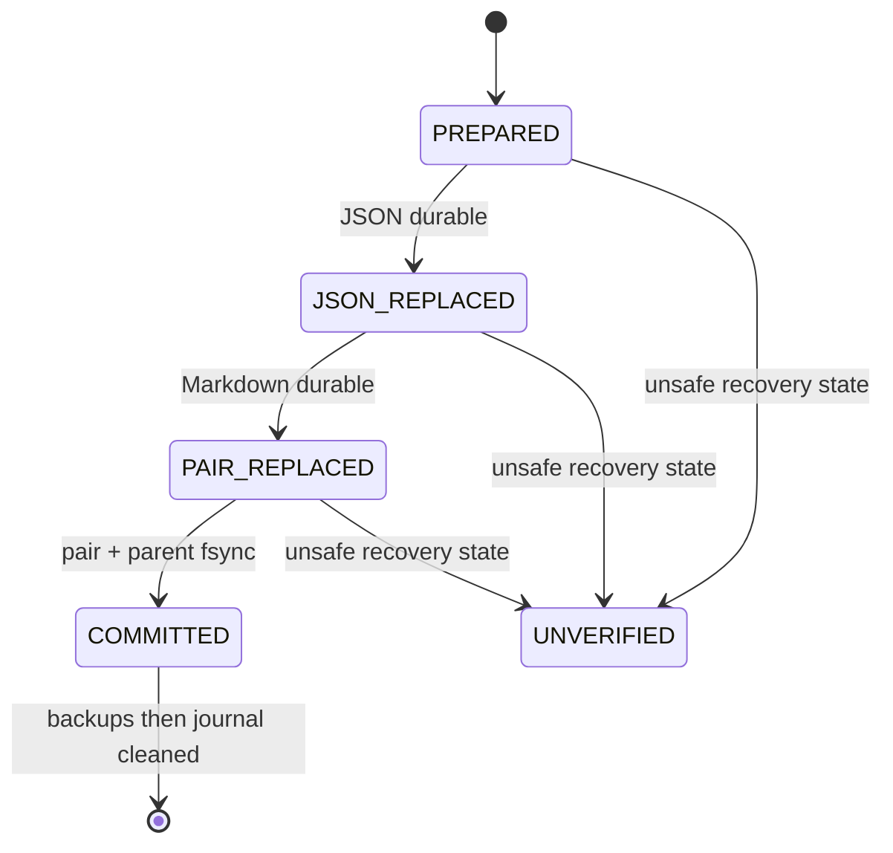

# Feature design: CI shadow PR6A dormant readiness core

- Status: APPROVED
- Owner: dpone maintainers
- Issue: [#512](https://github.com/PaulKov/dpone/issues/512)
- Parent specification: [CI shadow closure and exact-SHA evidence](feature-design-ci-pr-gate-exact-sha-evidence.md)
- Target release: TBD
Last verified: 2026-08-28

## Executive summary

PR6A adds an internal, default-deny readiness decision model and a durable,
crash-recoverable JSON/Markdown pair transaction. It deliberately has no CLI,
public schema, adapter, migration, workflow, readiness `PASS` publication, or
merge/release authority. PR6B alone may expose those public surfaces after
authenticated PR5B verifier evidence exists.

## Personas and journey

| Persona | Goal | Current pain | Success signal |
| --- | --- | --- | --- |
| Readiness implementer | Compose a future report safely | Two independently visible files can diverge on crash | Internal transaction never presents a mixed pair as committed |
| Operator | Recover after interruption | A digest cannot reconstruct lost prior bytes | Journal and retained exact backups permit deterministic recovery |
| Security reviewer | Prevent self-described readiness | Fixture/local data can look successful | All unauthenticated or uncertain provenance is internal `UNVERIFIED` |

The future public command is not available in PR6A. An internal caller evaluates
one exact subject, stages two already-serialized bytes and invokes the pair
transaction. A crash leaves a confined journal; recovery first authenticates it
and preserves uncertain bytes. A future PR6B turns only authenticated verifier
inputs into a user-visible report.

## Scope

### In scope

- Immutable internal exact-subject decision values and default-deny algebra.
- Pair-specific confined transaction journal with retained prior bytes,
  state machine, nonblocking lock, recovery and fault-injection tests.
- Reuse of descriptor confinement and native atomic exchange from
  `dpone.manifest.confined_mutations` without changing its single-file contract.

### Non-goals

- Any public import, CLI, file schema, public output, migration, workflow,
  GitHub client, credentials, cache, branch-protection/release mutation or
  readiness `PASS` authority.
- Any trusted provenance acquisition, clock policy, 24-hour freshness or
  five-minute skew UX: PR6B owns these after PR5B.
- Generic filesystem transaction framework or modifying legacy journal semantics.

### Constraints

- PR2 is the only predecessor and is merged. PR6A must remain dormant until
  PR6B/PR5B's authenticated evidence path exists.
- Every uncertainty class (missing, fixture, local, stale, future, forged,
  malformed, self-described, foreign or ambiguous input) is `UNVERIFIED`.
  An authenticated terminal source failure is `FAIL`. Internal `PASS` is a
  value only, never publication or authority.
- Output identity is `(output_directory, report_kind, subject_commit_sha)`;
  subjects never overwrite one another.

## Internal contract

`dpone.contracts.ci_shadow_readiness` defines immutable `ReadinessSubject`,
`ReadinessDecision` and a closed code vocabulary. The pure evaluator receives
typed provenance facts plus an injected evaluated-at value; it performs no I/O,
clock read or output write. It has no public compatibility promise before PR6B.

`dpone.manifest.ci_shadow_readiness_pair` receives descriptor-confined output
directory, fixed JSON/Markdown leaf names, report kind, subject SHA, and two
already-serialized bounded byte sequences. It uses a nonblocking confined lock.
An existing complete pair for the same identity is an idempotent no-op only when
both intended digests match; otherwise it returns `READINESS_OUTPUT_CONFLICT`.
Lock contention, invalid leaf names, symlinks, foreign inodes and all incomplete
state are non-successes with no mutation.

The closed journal is `dpone.readiness-report-transaction.v1`. It contains only
the identity; intended JSON/Markdown leaf paths and SHA-256 digests; staged leaf
paths/digests; and, for each prior member, a confined backup leaf/path/digest or
explicit null when absent. It never serializes raw prior bytes, but the actual
backup bytes remain durable recovery authority. State is exactly `PREPARED`,
`JSON_REPLACED`, `PAIR_REPLACED`, or `COMMITTED`. Journal, leaf and aggregate
bounds are fixed in code and contract tests; unknown fields and noncanonical
digests are rejected.

## Detailed algorithm and state machine

1. Validate exact subject SHA, report kind, bounded leaf names/bytes and acquire
   the nonblocking confined lock.
2. Recover any prior journal before staging; a non-authenticatable journal makes
   the result `UNVERIFIED` and preserves bytes.
3. Write and fsync both staged bytes; snapshot existing public members to
   durable confined backup leaves and fsync them.
4. Create/fsync journal and its parent. Replace JSON, fsync parent and persist
   `JSON_REPLACED`; replace Markdown, fsync parent and persist `PAIR_REPLACED`.
5. Validate both current intended digests, fsync parent and persist `COMMITTED`.
   That parent fsync is the linearization point.
6. Delete each digest-valid backup with a parent fsync. Remove/fsync journal
   last. While a journal exists, every consumer outcome remains `UNVERIFIED`.



Recovery validates journal, confined paths, snapshots and backup bytes first.
`PREPARED` restores/cleans only exact retained bytes. `JSON_REPLACED` rolls
forward only when staged Markdown and both intended digests are exact; otherwise
it restores both prior states. `PAIR_REPLACED` commits only with both exact
current digests, otherwise restores. `COMMITTED` never rolls back a valid pair;
it only validates and idempotently completes cleanup. Missing/torn/foreign/
symlinked/digest-mismatched state preserves evidence and remains `UNVERIFIED`.

## Architecture and quality

| Component | Responsibility | Direction |
| --- | --- | --- |
| contracts | pure exact-subject decision algebra | stdlib only |
| pair journal codec/service | pair-specific durable state/recovery | contracts + manifest confinement |
| existing confinement primitives | descriptors, exchanges, fsync | reused unchanged |
| tests | fault injection and legacy compatibility | no production provider client |

No new port/adapter is useful before PR6B's provenance I/O. No ADR is needed:
ADR 0048 already accepts this exact architecture. A public interface, different
lock scope, non-exchange portability or recovery deviation requires an amendment.
Modules split by decision, journal codec and pair state machine below the global
400 SLOC budget; existing one-file journal is not expanded into this new model.

## Market comparison and measurable differentiation

GitHub Actions artifacts support retention and `workflow_run` transfer, but do
not provide a local two-file crash transaction; the later PR5B integration uses
that provider boundary. dlt, Informatica, Airbyte, Fivetran, Pentaho, SSIS,
gusty, Astronomer Cosmos and Apache Beam are N/A because they do not define this
exact local readiness-pair recovery layer. Source: [GitHub artifact documentation](https://docs.github.com/en/actions/concepts/workflows-and-actions/workflow-artifacts), checked 2026-08-28.

```yaml
axis: durable readiness-pair recovery
scenario: forced crash after every persistent boundary and cleanup deletion
baseline: no pair transaction
metric: mixed committed public pair observations
target: 0 mixed committed pairs; deterministic idempotent recovery at each phase
procedure: confined-filesystem fault-injection suite
artifact: test logs and journal/backup fixtures
limitations: PR6A does not authenticate or publish readiness evidence
```

## Validation, documentation, rollout and rollback

Unit tests cover exact/default-deny decisions. Fault-injection tests cover absent
and existing pair members, each stage/write/fsync/exchange/directory-sync/journal
failure, each COMMITTED backup deletion, retries, inode/symlink/foreign journals,
output conflict and lock contention. Existing confined-mutation compatibility
tests remain unchanged. Live certification is N/A: PR6A has no external service.
Developer docs describe dormant/no-public-authority boundaries; user CLI docs,
schema reference and migration are deferred to PR6B. Rollback removes only these
unreferenced internals before PR6B; no external state exists.

## Agent execution plan and approval

The integrator owns contracts, manifest pair service and shared test fixtures.
Future writers receive fresh disjoint implementation contracts; `.github`,
MkDocs, CLI/command registry, public schemas and release files are forbidden.

- [x] Problem, journey, state machine, recovery and limits are explicit.
- [x] Architecture and test/certification reviews are reconciled.
- [x] Current relevant primary source and measurable target are recorded.
- [x] Public-boundary deferral and path ownership are explicit.
- [x] Maintainer changed status to `APPROVED` (2026-08-28).
