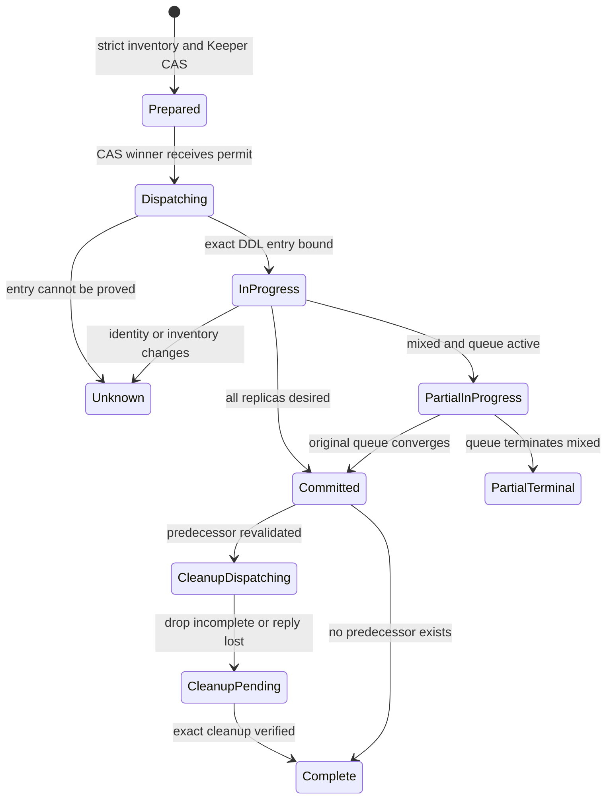
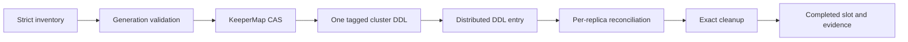

# Feature design: recoverable ClickHouse cluster full-refresh publication

- Status: RESEARCHED
- Owner: maintainers
- Issue: none; independent open-source design
- Target release: TBD
- Last verified: 2026-09-17
- Implementation gate: architecture review and maintainer approval are required

## Executive summary

The bounded ClickHouse `full_refresh` protocol currently admits a local Atomic
or Shared database with non-replicated tables. A cluster adds a failure boundary
that a local catalog marker cannot control: an `ON CLUSTER` statement is
executed independently on each host and can finish on only some replicas.
Repeating `EXCHANGE TABLES` after such an outcome is unsafe because it swaps
already-committed replicas back to the predecessor.

This design extends the protocol to one ClickHouse shard with two or more
`Replicated*MergeTree` replicas in an Atomic database. It uses ClickHouse Keeper,
through a `KeeperMap` control table, as the compare-and-swap authority. It binds
each attempt to the complete replica inventory, exact table UUIDs, normalized
`engine_full`, replication paths, and one distributed-DDL queue entry. No
PostgreSQL or other shared external state service is required.

The measurable safety outcome is zero blind `EXCHANGE` replay. A lost response
or partial distributed DDL is reconciled on every expected replica. An active
partial outcome waits for the original queue entry; a terminal mixed outcome
fails closed and retains both generations for operator recovery. Automatic
terminal-mixed repair is a separate capability because it requires direct
per-replica DDL rather than another global exchange.

## Personas and customer journey

| Persona | Goal | Current pain | Success signal |
|---|---|---|---|
| Analytics author | Publish a bounded dbt full refresh to a replicated table | Cluster recovery details should not become manifest options | Existing bounded `full_refresh` authoring remains sufficient |
| Platform engineer | Operate without a separate state database | A process-local marker cannot fence multiple workers and replicas | One Keeper-backed target authority coordinates every worker |
| Operator | Recover an interrupted cutover without guessing | A timeout does not identify which replicas committed | Evidence lists the exact state and queue result for every replica |
| Connector maintainer | Extend cluster support without weakening local safety | Generic retries and partial topology probes are unsafe for publication | One typed classifier owns identity and retry decisions |

Journey:

1. The platform configures an existing one-shard cluster and grants access to
   its Atomic target database, Keeper-backed control table, catalog tables, and
   distributed DDL.
2. The author uses the existing bounded `full_refresh` contract; there are no
   cluster-recovery fields to tune.
3. Before source extraction, dpone verifies the complete inventory and Keeper
   authority. Unsupported or incomplete topology fails with a stable error.
4. Dpone stages an immutable replicated candidate, waits for every replica,
   acquires a fenced target slot, and dispatches one tagged statement.
5. Output reports committed, waiting, terminal-partial, or unknown with a
   per-replica summary and the bound distributed-DDL entry.
6. A retry resumes the same authority record. It never re-extracts or replays
   publication DDL while the previous outcome is unresolved.
7. Cleanup removes only the exact predecessor after every replica is committed.
   The completed target slot remains as the next recovery baseline.

## Scope

### In scope

- Bounded `full_refresh` into an Atomic database on exactly one shard with
  `N >= 2` replicas.
- Direct `Replicated*MergeTree` target and candidate tables; the target is not a
  `Distributed` facade.
- Existing-target `EXCHANGE TABLES ... ON CLUSTER` and absent-target
  `RENAME TABLE ... ON CLUSTER` publication.
- Complete inventory from `system.clusters`, `system.databases`,
  `system.tables`, `system.replicas`, and the publication authority.
- Exact generation identity from table UUID, normalized `engine_full`, schema
  digest, Keeper ensemble name, and replication path.
- `KeeperMap` compare-and-swap authority, worker fencing, distributed-DDL entry
  identity, lost-response reconciliation, and exact cleanup.
- A two-replica Docker acceptance profile with deterministic fault injection.

### Non-goals

- Multi-shard publication, `Distributed` targets, or cross-database swap.
- Replicated or Shared database engines; V1 requires `Atomic` on every member.
- Automatic repair of a terminal mixed replica state.
- Expiry-based lease stealing or automatic rollback.
- Coordinating writers that bypass the dpone publication authority.
- Treating Docker evidence as production certification.
- Migrating legacy unbounded full refresh.

### Assumptions and constraints

- ClickHouse Keeper is already part of the admitted replicated topology.
- `keeper_map_path_prefix` is configured and the runtime principal can use the
  platform-owned `KeeperMap` table.
- Candidate writes stop before authority acquisition. The candidate is immutable
  throughout publication and recovery.
- Every expected replica is reachable for admission. Publication never uses
  `skip_unavailable_shards=1` or a partial topology result.
- The topology remains one shard for an operation. Inventory-digest drift fences
  the operation.
- Dpone exclusively owns the fixed control-table name and target-key namespace.

## Public contract

### CLI and Python API

No author-facing command or option is added. Existing entrypoints retain their
output shape. The implementation adds stable failure families for unsupported
topology, incomplete inventory, Keeper authority conflict, unresolved
distributed DDL, terminal mixed publication, unknown generation identity, and
unsafe cleanup identity.

Machine-readable details contain hashed operation identity, inventory digest,
queue-entry identity, and per-replica state. Credentials, connection strings,
row values, and raw source SQL are excluded.

### Manifest/schema

The existing positive `max_source_bytes` plus `strategy.mode: full_refresh`
contract remains the authoring boundary. Cluster selection continues to come
from the ClickHouse physical-design contract. There is no user-selectable retry,
marker, Keeper path, or cleanup policy.

V1 activates only when the target selects a cluster and the strict probe admits
the exact topology. The local bounded protocol and legacy unbounded compatibility
path remain separate strategies.

### Artifacts and evidence

The authority stores one bounded record per qualified target. Its canonical
value contains:

- schema version and target-key digest;
- scheduler-stable `operation_id` and random `fence_token`;
- phase and monotonic `dispatch_epoch`;
- plan and cluster-inventory digests;
- predecessor and desired generation identities;
- candidate name and staged row count;
- publication and cleanup distributed-DDL identities;
- timestamps and stable error summary.

The target key is a digest of cluster, database, and target table. KeeperMap's
`_version` is the compare-and-swap version; a JSON field is not a CAS substitute.
The completed record is retained and CAS-transitioned into the next operation,
so Keeper storage remains one row per target. Detailed immutable evidence stays
in the existing runtime evidence channel.

### Compatibility and migration

- Local Atomic/Shared publication remains unchanged.
- Cluster publication stays blocked until this design is approved, implemented,
  and certified.
- Unsupported multi-shard, Distributed, non-Atomic, missing-KeeperMap, or
  incomplete-replica topology fails before source extraction and mutation.
- The implementation must not fall back to multi-table `RENAME`, permissive
  cluster settings, or the local marker protocol.
- Rollback disables cluster admission and preserves unresolved authority and
  candidates for inspection.

## Detailed algorithm

### 1. Bootstrap and strict cluster inventory

1. Read a sorted `system.clusters` inventory containing cluster, shard number,
   replica number, hostname, address, native port, and `internal_replication`.
2. Require exactly one shard, at least two unique replica endpoints, unique
   replica numbers, and `internal_replication = 1`.
3. Read every expected member through `clusterAllReplicas`. A missing,
   unavailable, duplicated, or unexpected member blocks; partial success is
   never admission evidence.
4. Require the database engine to be exactly Atomic on every member.
5. Verify the KeeperMap facade on every member: identical schema, Keeper root,
   and strict-mode capability. Every member must read the same target record and
   KeeperMap `_version`.
6. If the facade is absent everywhere, bootstrap it with one tagged, non-retried
   `CREATE TABLE ... ON CLUSTER`. Reconcile the DDL queue and all catalogs before
   proceeding. A retry may fill absent facades only when every existing facade
   has the expected schema and Keeper root. Conflict or unresolved partial
   bootstrap fails closed.

Bootstrap is capability setup, not publication authority. Publication cannot
start until the control facade is complete on every expected replica.

### 2. Generation and replication validation

For target and candidate on every replica, observe:

```text
generation_identity = (
  table_uuid,
  normalized_engine_full,
  schema_digest,
  zookeeper_name,
  zookeeper_path,
)
```

The target generation must have one identity across all replicas. The candidate
must have a different UUID and replication path from the target but one identity
across its replicas. Engines belong to the admitted `Replicated*MergeTree`
family. Replica names are unique and cover the exact inventory.

Before authority acquisition, wait for candidate replication and require on
every member:

- `is_readonly = 0` and `is_session_expired = 0`;
- an empty replication queue and no Keeper/queue exception;
- `active_replicas = total_replicas = N`;
- caught-up log pointer and queue state;
- the expected staged row count.

Active part names are diagnostic evidence, not equality: background merges can
produce different physical parts for the same logical data.

### 3. Acquire authority and fence workers

1. Derive a stable operation ID from scheduler invocation identity, plan digest,
   cluster, database, and target. Worker try number is excluded.
2. Read the fixed target slot with its KeeperMap version.
3. Create it strictly if absent, or require the same operation. A different
   unresolved operation is fenced. Only `COMPLETED` may CAS into a new operation.
4. Bind inventory digest, predecessor/desired identities, candidate, and row
   count in phase `PREPARED`.
5. Immediately before dispatch, re-read catalogs and authority. CAS
   `PREPARED -> DISPATCHING`, increment `dispatch_epoch`, and create a unique DDL
   tag containing only opaque operation and epoch digests.
6. Only the process whose CAS call returned success receives an in-memory
   dispatch permit. Observing `DISPATCHING` later cannot recreate permission.

There is no lease expiry or automatic ownership transfer. A crash after CAS but
before a provable queue entry intentionally leaves an unknown operation rather
than risking a second exchange.

### 4. Dispatch and bind distributed DDL

For an existing target, issue exactly once:

```sql
/* opaque operation and dispatch tag */
EXCHANGE TABLES database.target AND database.candidate
ON CLUSTER cluster
```

For an absent target, issue one tagged `RENAME TABLE` instead. The adapter uses a
separate client `query_id`, disables driver retry, and overrides settings with:

```text
skip_unavailable_shards = 0
distributed_ddl_output_mode = throw
bounded distributed DDL timeout
```

On success, timeout, or lost response, query `system.distributed_ddl_queue`.
Match by cluster and the exact opaque SQL tag, then bind one and only one entry
plus its query digest to the authority record. Client query ID and
`system.processes` are correlation data, not distributed-DDL identity.

After `DISPATCHING`, zero matches, multiple matches, a changed query digest, or
an entry removed before terminal proof produces `OUTCOME_UNKNOWN`. Missing queue
state is never interpreted as proof that the command was not enqueued.

### 5. Reconcile every replica

Existing-target state per replica:

- `PENDING`: target is predecessor and candidate is desired;
- `COMMITTED`: target is desired and candidate is predecessor;
- `CLEANUP_PENDING`: target is desired and candidate is absent after cleanup;
- `UNKNOWN`: any missing, additional, or mismatched UUID, engine, schema, or
  replication identity.

Absent-target state per replica:

- `PENDING`: target is absent and candidate is desired;
- `COMMITTED`: target is desired and candidate is absent;
- `UNKNOWN`: every other mapping.

Aggregate catalog state with the exact queue entry:

| Replica result | Queue result | Classification and action |
|---|---|---|
| All pending, phase `PREPARED` | No entry | First dispatch is permitted after CAS |
| All committed | Terminal on all expected members | Commit proven; proceed to cleanup |
| Pending/committed mix | Active or inactive anywhere | `PARTIAL_IN_PROGRESS`; wait for the original entry only |
| Pending/committed mix | Terminal everywhere | `PARTIAL_TERMINAL`; fail closed and retain both generations |
| All pending after dispatch | Terminal failure everywhere | V1 fails closed; retry policy needs separate review |
| Any unknown identity or unavailable member | Any | `OUTCOME_UNKNOWN`; prohibit DDL and cleanup |
| Any post-dispatch state | Entry absent, ambiguous, or changed | `OUTCOME_UNKNOWN`; prohibit DDL and cleanup |

The service may poll the bound entry with bounded backoff and cancellation.
Cancellation stops polling but does not cancel or replay DDL. A task retry
resumes reconciliation from the same record.

A terminal mixed `EXCHANGE` is not automatically repairable with another global
exchange: doing so reverts committed replicas. Automated repair requires a
separately designed direct-per-replica connector and local DDL only on pending
members. That capability is outside V1.

### 6. Cleanup and completion

Cleanup begins only after every replica is committed, the exact publication
entry is terminal, and replication health is complete.

For an existing target:

1. Verify every present candidate still has the predecessor UUID and replication
   identity from the authority record.
2. Send one tagged `DROP TABLE IF EXISTS candidate ON CLUSTER` without generic
   retry and bind its distributed-DDL entry.
3. Reconcile every member. A lost or terminal-partial drop may be redispatched
   because it is monotonic only when every remaining object still has the exact
   predecessor identity and absent members contain no conflicting object.
4. Verify candidate absence everywhere and the desired target everywhere.
5. CAS the authority row to `COMPLETED`, preserving desired identity and cleanup
   receipt.

The absent-target branch has no predecessor cleanup. `UNKNOWN` or
`PARTIAL_TERMINAL` publication never drops either generation. No prefix, age,
or schema-wide sweep is part of this protocol.

### Pseudocode

```text
inventory = require_complete_one_shard_inventory(cluster)
authority = require_keeper_map_on_every_replica(inventory)
generations = require_exact_replica_identities(target, candidate, inventory)
require_candidate_converged_and_immutable(generations)

record = create_or_reconcile_target_slot(authority, operation, generations)
state = classify_all_replicas(record, inventory)
if state is committed:
    require_bound_publication_entry_terminal(record)
    return resume_exact_cleanup(record)
if state is partial_in_progress:
    return wait_for_bound_entry_then_reconcile(record)
if state is partial_terminal or unknown:
    fail_closed_with_per_replica_evidence()
if state is not pending or record.phase is not prepared:
    fail_closed()

revalidate_inventory_authority_and_generations()
permit = cas_prepared_to_dispatching_with_new_epoch()
if permit was not returned by this CAS call:
    reconcile_without_dispatch()
execute_one_tagged_on_cluster_statement_without_retry(permit)
bind_exact_distributed_ddl_entry()
reconcile_until_terminal_or_bounded_wait()

if every replica is committed and queue entry is terminal:
    drop_only_exact_predecessor_and_verify_every_replica()
    cas_to_completed()
else:
    retain_everything_and_fail_closed()
```

### State machine



### Edge cases

- Empty source publishes a validated replicated empty candidate.
- Duplicate workers cannot both win `PREPARED -> DISPATCHING` CAS.
- A stale worker cannot advance a changed KeeperMap version or fence token.
- A crash before authority acquisition removes only owned attempt staging.
- A crash after dispatch CAS retains candidate and authority even when no queue
  entry can be proved.
- Schema, engine, UUID, Keeper path, membership, or authority drift is unknown,
  never a reason to rebuild or overwrite automatically.
- A replica outage before admission blocks; an outage after dispatch is
  reconciled from the original entry after connectivity returns.
- Queue retention must exceed the maximum recovery window. Earlier garbage
  collection leaves the result unknown.
- Malformed, unknown-version, or oversized authority values block rather than
  being overwritten.

## Architecture

### Components and responsibilities

| Component | Existing/new | Responsibility | Dependencies |
|---|---|---|---|
| Local bounded publisher | Existing, unchanged | Local Atomic/Shared publication | Existing catalog and marker |
| Cluster publication contracts | New | Identities, phases, classifiers, digests | Contracts only |
| Cluster publication ports | New | Inventory, Keeper CAS, DDL queue and catalog boundaries | Contracts only |
| Strict cluster catalog adapter | New | Complete system-table facts and normalized identity | ClickHouse connector |
| KeeperMap authority adapter | New | Strict create/read/versioned CAS | ClickHouse connector |
| Cluster publication service | New | Fencing, dispatch, reconciliation and cleanup | New narrow ports |
| Strategy selector | Existing, extended | Select local or cluster publisher | Composition root |

Expected implementation paths after approval:

- `src/dpone/contracts/clickhouse_cluster_publication.py`
- `src/dpone/ports/clickhouse_cluster_publication.py`
- `src/dpone/runtime/sinks/clickhouse_cluster_publication_catalog.py`
- `src/dpone/runtime/sinks/clickhouse_cluster_publication_authority.py`
- `src/dpone/runtime/sinks/clickhouse_cluster_full_refresh_publication.py`
- narrow integration in `clickhouse_sink.py` and the query adapter.

The existing general topology preflight remains permissive for current callers.
Publication uses a separate strict inventory rather than silently changing
unrelated routes.

### Ports, adapters, and composition root

The authority port exposes only `create_if_absent`, `read_versioned`, and
`compare_and_swap`. The DDL port exposes one-shot execution and queue lookup; it
does not expose a generic publication retry. The catalog port returns typed
facts rather than policy. The service owns the aggregate classifier.

Runtime orchestration depends inward on contracts and ports. ClickHouse adapters
implement the ports, and the composition root constructs the cluster publisher
only for an admitted bounded cluster plan.

### Data and control flow



### Alternatives and tradeoffs

| Alternative | Advantage | Safety limitation | Decision |
|---|---|---|---|
| Local TinyLog marker on each replica | Simple and used locally | No common CAS; marker creation can be partial | Reject |
| PostgreSQL/shared external journal | Familiar transactional authority | Adds a service absent from many deployments | Reject for this topology |
| KeeperMap target slot | Uses existing Keeper and versioned strict writes | Needs configured prefix and permissions | Adopt |
| Blind retry of cluster EXCHANGE | Appears to improve availability | Toggles committed replicas back | Reject |
| `system.processes` query-ID check | Easy local observation | Transient and not distributed completion evidence | Diagnostic only |
| Exact distributed-DDL entry | Preserves the original command | Queue retention must cover recovery | Adopt |
| Automatic terminal-mixed repair | Less manual work | Needs direct per-replica fenced DDL | Separate design |
| Delete markers after success | Leaves no visible state | Loses recovery baseline and permits ABA | Reject; retain one slot |

### ADR requirement

Implementation requires an ADR because Keeper becomes the cluster publication
authority and terminal mixed state is deliberately fail-closed. It specializes
the existing bounded-publication decision without replacing the local protocol
or claiming cluster-wide atomicity.

### Quality-budget impact

Each new module has one responsibility and should remain below 350 SLOC and the
repository hard limit. The pure classifier has no runtime imports. Shared SQL
rendering remains in adapters. No compatibility facade, global singleton, or
environment-variable policy parser is introduced.

## Market and primary-source comparison

Checked 2026-09-17. This design depends primarily on ClickHouse semantics:

- [EXCHANGE](https://clickhouse.com/docs/reference/statements/exchange)
  documents local atomic exchange for Atomic/Shared databases.
- [system.distributed_ddl_queue](https://clickhouse.com/docs/reference/system-tables/distributed_ddl_queue)
  exposes the query and per-host execution status.
- [system.replicas](https://clickhouse.com/docs/reference/system-tables/replicas)
  exposes replication and Keeper state, while
  [system.tables](https://clickhouse.com/docs/reference/system-tables/tables)
  exposes UUID and engine layout.
- [KeeperMap](https://clickhouse.com/docs/engines/table-engines/special/keepermap)
  provides Keeper-backed key/value state and version-bound updates.

| System/version | Relevant capability | Observed design | Adopt/reject | Official source/date |
|---|---|---|---|---|
| dlt current docs | Full replacement | Destination-specific replacement semantics | Adopt explicit capability admission only | [Full loading](https://dlthub.com/docs/general-usage/full-loading), checked 2026-09-17 |
| Microsoft SSIS, SQL Server 16.x/17.x docs | Batch/commit controls | Explicit completion boundaries, no ClickHouse DDL authority | Adopt explicit completion evidence only | [Data flow performance](https://learn.microsoft.com/en-us/sql/integration-services/data-flow/data-flow-performance-features?view=sql-server-ver17), checked 2026-09-17 |
| Apache Beam current JdbcIO | Retry/write-result boundaries | Batch completion differs from dataset cutover | Adopt explicit retry boundary only | [JdbcIO.Write](https://beam.apache.org/releases/javadoc/current/org/apache/beam/sdk/io/jdbc/JdbcIO.Write.html), checked 2026-09-17 |
| Informatica, Airbyte, Fivetran, Pentaho | Broad data movement | Product comparison does not establish this in-database CAS protocol | N/A for the authority layer | N/A: no claim about product capability |
| gusty, Astronomer Cosmos | Orchestration | They schedule work rather than own ClickHouse generation identity | N/A for publication authority | N/A: orchestration is outside the storage authority layer |

No throughput or universal product-superiority claim is made.

## Measurable differentiation

```yaml
axis: cluster full-refresh replay safety
scenario: EXCHANGE reaches only some replicas and the client loses its response
baseline: retry the same ON CLUSTER exchange after a timeout
metric: unintended second exchange or deletion of an unproven generation
target: 0
procedure: two-replica fault injection, retry, then inspect queue, UUID mapping, Keeper record, and executed-query count
artifact: machine-readable Docker integration receipt and test report
limitations: Docker evidence does not certify production topology, permissions, or Keeper HA
```

## Security, privacy, and operations

- Authority values contain opaque hashes, object identities, counts, phases,
  and timestamps, never credentials or source rows.
- SQL identifiers use the existing renderer; DDL tags are opaque and bounded.
- The principal needs documented catalog reads, KeeperMap access, and target
  database DDL privileges.
- Logs redact connection details and emit stable codes with bounded summaries.
- Alerts distinguish active queue work from terminal partial and unknown states.
  The latter two require an operator and never auto-clean.
- Queue retention and authority backup/restore are deployment prerequisites.

## Test and certification plan

### Offline tests

| Layer | Scenario | Expected assertion |
|---|---|---|
| Unit | Existing/absent-target replica mappings | One stable aggregate classification |
| Unit | Inventory and generation digests | Order-independent; semantic drift changes digest |
| Unit | Authority codec and versions | Malformed fields and stale versions block |
| Contract | Two workers | One CAS winner and at most one dispatch |
| Contract | Queue active, terminal, absent, duplicate, changed | Only the exact active entry is waited |
| Contract | Cleanup partial or reply lost | Only exact predecessor can be dropped |
| Compatibility | Local bounded and legacy unbounded paths | Existing behavior remains unchanged |

### Docker multi-node acceptance

The functional Docker Desktop profile uses two pinned ClickHouse nodes, one
shard, two replicas, one Keeper node, shared `remote_servers`, distinct replica
macros, configured `keeper_map_path_prefix`, separate endpoints, and Atomic plus
ReplicatedMergeTree fixtures using `{uuid}`, `{shard}`, and `{replica}`. Three
Keeper nodes are reserved for later Keeper-HA certification.

Required scenarios:

1. Normal existing- and absent-target publication and cleanup.
2. Lost response after enqueue and commit; executed `EXCHANGE` count remains one.
3. Pause one replica after enqueue, observe `PARTIAL_IN_PROGRESS`, restart it,
   and observe convergence of the original entry.
4. Cause a terminal error on one replica; observe `PARTIAL_TERMINAL`, retain both
   generations, and send no second publication DDL.
5. Race workers and prove one dispatch permit.
6. Inject a KeeperMap version conflict; the stale worker cannot advance.
7. Lose cleanup response; reconcile and complete exact idempotent cleanup.
8. Change UUID, engine, schema, Keeper path, or membership; block before mutation.
9. Partially create the control facade; reconcile safe absence but block mismatch.

The compose fixture is opt-in locally and an explicit CI job. Certification must
pin ClickHouse version, configuration, permissions, topology, exact commit, and
signed evidence. A green Docker run alone leaves external deployments unverified.

## Documentation plan

- Link this design from ClickHouse topology and uncertain-exchange guidance.
- Keep route guides explicit that cluster publication is planned, not admitted.
- Update the snapshot roadmap with this phase after local publication.
- With implementation, add operator recovery, stable errors, Docker instructions,
  certification entry, ADR, and changelog.

## Rollout and rollback

1. Land and approve this design without runtime changes.
2. Implement pure contracts and offline tests.
3. Add adapters behind strict capability admission.
4. Pass the two-node Docker matrix.
5. Keep status experimental/unverified until an exact environment is certified.
6. Roll back by disabling cluster admission; never fall back or delete unresolved
   authority/candidates.

Rollback triggers include duplicate dispatch, classifier ambiguity accepted as
success, cleanup without exact identity, or authority divergence.

## Agent execution plan

| Role | Owned paths | Read-only paths | Forbidden paths | Dependency |
|---|---|---|---|---|
| Design integrator | This design and narrow roadmap links | Runtime and tests | Release workflows | None |
| Runtime implementer after approval | Cluster contracts, ports, adapters, tests | Local publisher except narrow integration | Unrelated connectors | Approved design and ADR |
| Independent reviewer | Exact implementation commit | Entire repository | Writes during review | Green offline and Docker evidence |
| Certifier | Docker/live fixture and generated receipts | Runtime implementation | Hand-authored success evidence | Reviewed implementation |

One integrator owns shared connector and navigation files. Runtime work uses a
separate branch and task only after this specification becomes `APPROVED`.

## Acceptance criteria

- [ ] Exact one-shard/N-replica inventory is required; partial observation never passes.
- [ ] Database, engine, UUID, schema, Keeper path, and replica identities agree.
- [ ] Every replica observes one KeeperMap record and version for the target.
- [ ] One CAS winner dispatches; stale workers cannot recreate permission.
- [ ] Every publication binds exactly one distributed-DDL entry.
- [ ] Lost response never causes blind `EXCHANGE` replay.
- [ ] Active partial waits; terminal mixed fails closed.
- [ ] Unknown identity, queue, or topology prohibits DDL and cleanup.
- [ ] Cleanup targets only the exact predecessor and is verified everywhere.
- [ ] Authority remains bounded to one retained record per target.
- [ ] Local bounded and legacy paths retain existing behavior.
- [ ] The two-node Docker fault matrix passes with generated evidence.
- [ ] Docs distinguish support, Docker evidence, and live certification.

## Approval checklist

- [x] User problem and customer journey are clear.
- [x] Algorithm and failure semantics are implementable without guessing.
- [x] Public contracts and compatibility are explicit.
- [x] Architecture and alternatives are justified.
- [x] Relevant primary sources and comparisons are scoped.
- [x] Claimed differentiation is measurable.
- [x] Tests, evidence, docs, rollout, and rollback are defined.
- [x] Path ownership and integration plan are conflict-safe.
- [ ] Maintainer changed status to `APPROVED` after architecture review.
