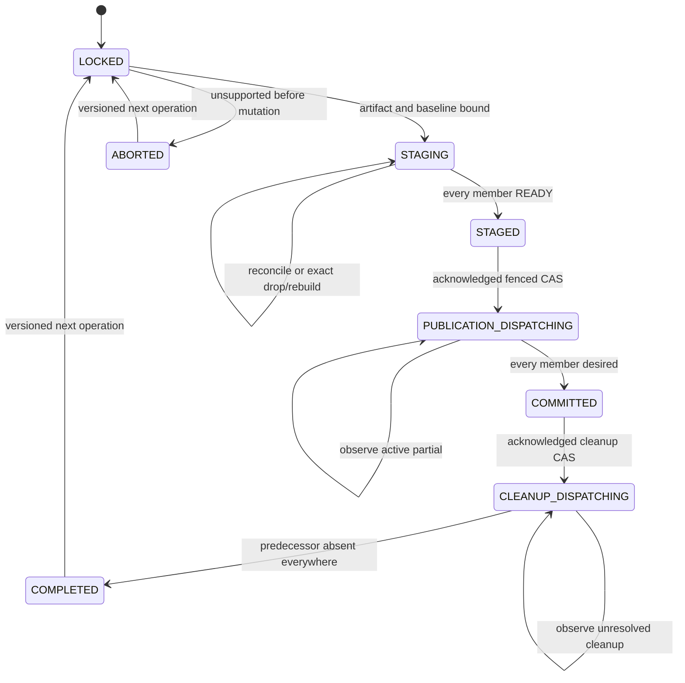
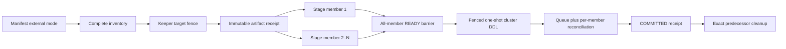

# Feature design: ClickHouse external-replication full-refresh publication

- Status: APPROVED
- Owner: maintainers
- Issue: independent open-source enhancement
- Target release: next minor release
- Last verified: 2026-09-18
- Approval basis: explicit maintainer implementation request on 2026-09-18;
  independent explorer, architecture, certification, and documentation reviews
  incorporated before approval

## Executive summary

ClickHouse clusters whose shard reports `internal_replication=false` send a
Distributed-table insert to every replica. The existing dpone cluster
publication protocol intentionally supports only `internal_replication=true`
with `Replicated*MergeTree`: it stages through one connection and relies on
ClickHouse replication to produce one shared generation. Removing that guard
would either leave nodes unstaged or duplicate data.

This design adds an explicit `external` replication mode for one-shard clusters
of independent, non-replicated `*MergeTree` tables. Dpone acquires Keeper
authority before candidate mutation, consumes one immutable replayable artifact,
and stages that artifact directly to every required member exactly once. A
logical generation binds the artifact and schema digests to an ordered map of
opaque member IDs and physical table UUIDs. Publication remains a single
fenced, correlated `ON CLUSTER` operation and is successful only after every
member exposes the complete desired generation. Interrupted staging is repaired
by dropping and rebuilding only the exact unpublished owned candidate; dpone
never appends blindly after an ambiguous response.

The measurable safety outcome is zero duplicate rows after retry and zero false
success when any required member is missing, divergent, or on another
generation. Existing local publication and `internal_replication=true` behavior
remain unchanged, including their V1 authority and receipt codecs.

## Personas and customer journey

| Persona | Goal | Current pain | Success signal |
| --- | --- | --- | --- |
| Analytics author | Run bounded full refresh without topology-specific scripts | External replication is rejected and local fallback would be unsafe | One manifest selects external mode and produces a complete receipt |
| Platform engineer | Operate independent replicas with deterministic recovery | A broadcast insert hides per-node delivery and retry state | Every member has an explicit stage and publication state |
| Operator | Resume an interrupted generation without guessing | A timeout cannot distinguish committed, partial, or absent work | Read-only evidence identifies the exact safe recovery action |
| Auditor | Prove no node was skipped or double-loaded | Counts and one coordinator response are insufficient | Commit-bound inventory, artifact, generation, and per-member digests |

Journey:

1. Discover the external-mode constraints and confirm a one-shard, two-or-more
   member cluster of direct non-replicated `*MergeTree` tables.
2. Configure `replication_mode: external`, cluster-scoped DDL, same-database
   staging, and a positive source-byte bound.
3. Run `dpone check` and `dpone plan`; static output states that live runtime
   admission, Keeper authority, and replayable-artifact capability are required.
4. Run the workload. Before source I/O, dpone inventories every member and
   fences the target operation in Keeper.
5. Dpone seals the extracted artifact, stages it directly to every member, and
   reports member readiness without exposing endpoints or row data.
6. Dpone publishes one correlated cluster DDL and returns success only after all
   members expose the desired logical generation.
7. A same-operation retry observes authority, candidates, queue, and targets;
   it resumes the incomplete phase without duplicate insert or blind exchange.
8. Cleanup removes only exact predecessor objects after global commit. Operators
   retain unresolved candidates and authority records for diagnosis.
9. Existing manifests without `replication_mode` continue to use internal mode.

## Scope

### In scope

- Bounded ClickHouse `full_refresh` on exactly one shard with at least two
  required members and uniform `internal_replication=false`.
- Explicit manifest mode `external`; omission means `internal`.
- Direct non-replicated `*MergeTree` target and candidate tables in Atomic
  databases. `Distributed` access facades are not publication targets.
- One immutable, replayable, byte-receipted extraction artifact whose schema,
  SHA-256, byte size, and row count are known before member mutation.
- Target fencing before staging, deterministic operation and generation IDs,
  direct per-member staging, one-shot mutations, exact observation, retry,
  replay, interruption recovery, and separately fenced cleanup.
- Existing-target adoption after exact all-member schema and logical-content
  equality is recorded in authority; absent targets are supported.
- Versioned external authority and receipt schemas coexisting with V1 internal
  records on the same target-key namespace.
- A two-member synthetic fixture and fault matrix at the lowest practical layer.

### Non-goals

- Multiple shards, mixed replication flags, one-member clusters, Shared or
  Replicated database engines, or `Distributed` publication targets.
- `Replicated*MergeTree` under external mode; that combination is rejected
  because fan-out plus table replication can duplicate delivery.
- Transparent materialization of a one-shot stream. Unsupported artifacts fail
  before member candidate mutation.
- Global read atomicity during a multi-host DDL. Dpone proves convergence and
  never reports success for a partial generation; applications requiring an
  instantaneous cluster-wide read cutover need a separate indirection layer.
- Automatic repair of a terminal mixed publication without exact queue and
  physical-generation evidence.
- Lease expiry, authority stealing, or coordination with writers that bypass
  dpone.
- Production certification from local synthetic evidence.

### Assumptions and constraints

- Every member is reachable for admission, staging, observation, publication,
  and cleanup. Partial inventory is never sufficient.
- Dpone can create one direct member connection from the already-resolved sink
  credential without logging or persisting secrets.
- KeeperMap is configured and available to every member.
- The replayable artifact is atomically retained in a content-addressed durable
  store, is reopenable by a fresh process from its authority-bound identity,
  and stays immutable until external staging reaches `STAGED` or the operation
  is safely aborted. Authority/evidence contains no local path.
- Logical-content verification uses a deterministic SHA-256 stream over typed
  rows in a canonical all-column order. Unsupported types or an unbounded sort
  fail admission; equal row counts alone never prove equality.
- Candidate names and member identities are opaque, deterministic, and bounded.

## Public contract

### CLI

No command is added. Existing `check`, `plan`, and run entrypoints gain an
additive replication decision:

```json
{
  "requested": "cluster",
  "selected": "cluster_external",
  "replication_mode": "external",
  "runtime_admission_required": true,
  "no_fallback": true
}
```

Static blockers use stable error codes and a non-zero validation exit. Runtime
errors are emitted on stderr; structured output excludes endpoints, credentials,
raw SQL values, file paths, and row data. Normal stdout and file atomicity remain
unchanged. No option enables fallback or force-replay.

### Python API

No new public import is required. Existing manifest and runtime APIs accept the
additive manifest field. Internal V2 models remain under canonical
`dpone.contracts`, `dpone.ports`, and `dpone.runtime` packages. Stable exceptions
retain the `DPONE_CLICKHOUSE_CLUSTER_*` family.

### Manifest/schema

```yaml
physical_design:
  storage:
    clickhouse:
      engine: MergeTree
      cluster:
        name: analytics_cluster
        ddl_scope: cluster
        replication_mode: external
```

`replication_mode` is `internal | external` and defaults to `internal`.

- `internal` preserves the current `Replicated*MergeTree` contract and requires
  every runtime inventory row to report `internal_replication=true`.
- `external` requires a non-replicated `*MergeTree` engine and every runtime row
  to report `internal_replication=false`.
- Mixed flags, missing members, a mode/flag mismatch, or an engine/mode mismatch
  fail before source extraction and never route to the local publisher.
- The existing positive `max_source_bytes`, same target/staging database,
  cluster DDL scope, and no-access-table rules remain mandatory.

### Artifacts and evidence

External authority schema version:
`dpone.clickhouse.cluster-external-full-refresh.v1`.

External receipt schema version:
`dpone.clickhouse.cluster-external-full-refresh-receipt.v1`.

The retained target slot uses the same target-key digest namespace as V1 and
stores:

- replication mode, scheduler-stable operation ID, random fence token, phase,
  dispatch epoch, and Keeper version;
- inventory and normalized-plan digests;
- artifact SHA-256, byte size, row count, schema digest, and logical
  `generation_id`;
- ordered opaque `member_id -> stage/publication/cleanup` records;
- per-member target and candidate physical UUIDs plus canonical content digest;
- bound publication and cleanup queue entry, token, and query digest;
- timestamps and stable redacted error classification.

Evidence uses opaque member IDs derived from `(shard_num, replica_num)` and does
not expose hostnames or addresses. The synthetic evidence producer binds exact
commit and fixture-configuration digests and labels scope `local_synthetic`.

### Compatibility and migration

- Local bounded, local legacy, and internal cluster publication are unchanged.
- Existing manifests default to internal mode. False topology remains blocked
  unless the author explicitly selects external mode.
- V1 authority/receipt decoding and cleanup remain supported. An unresolved V1
  record blocks external mode. A completed V1 record may transition only through
  a version-checked mode-migration CAS after current physical truth is adopted.
- A pre-existing external target is adopted only when every member is reachable
  and the canonical schema and content digests match. The resulting baseline
  receipt is stored before candidate mutation.
- Rollback disables external admission; it does not delete unresolved authority,
  candidates, or predecessors. Internal mode remains available for compatible
  topologies.

## Detailed algorithm

### 1. Static normalization and runtime admission

1. Parse the explicit mode, defaulting to internal.
2. Preserve all current cluster full-refresh static requirements.
3. Require `Replicated*MergeTree` for internal mode and direct non-replicated
   `*MergeTree` for external mode.
4. Read the complete sorted `system.clusters` inventory.
5. Require one shard, at least two unique `(shard_num, replica_num)` members,
   uniform flags, and an exact match between the declared and observed mode.
6. Map each endpoint to one opaque member ID. Missing, extra, duplicate, or
   ambiguous mapping blocks.
7. Require Atomic databases, KeeperMap facade consistency, direct connection
   capability, and canonical-digest support on every member.
8. Never use `skip_unavailable_shards=1` as admission evidence.

### 2. Deterministic identity and pre-source fencing

Derive:

```text
target_key     = H(cluster, database, target)
operation_id   = H(protocol_version, scheduler_invocation, target_key,
                   normalized_plan_digest)
member_id      = H(shard_num, replica_num)
candidate_name = bounded(target + "__dpone_ext_" + operation_id_prefix)
```

Worker try number, host ordering, endpoint text, and random values are excluded
from deterministic IDs. Inventory drift changes `inventory_digest` and fences
the operation; it does not create a second operation ID.

Before source I/O, create or resume one Keeper authority row in phase `LOCKED`.
A different unresolved operation is rejected. A completed record may begin a
new operation only through acknowledged one-shot CAS plus exact version+1
post-read. If a prior V1 record is unresolved, external mode is blocked.

### 3. Seal the replayable artifact and baseline

1. Require a replayable artifact receipt with SHA-256, byte size, row count,
   wire/schema identity, and a byte bound not exceeding `max_source_bytes`.
2. Revalidate the receipt immediately before every member load.
3. Derive `schema_digest` and
   `generation_id = H(operation_id, artifact_sha256, schema_digest, row_count)`.
4. Observe every current target. For an existing target, stream canonical typed
   rows in deterministic all-column order and compute a SHA-256 content digest.
5. Require equal target schema/content across members, while allowing distinct
   physical UUIDs. CAS the ordered predecessor map and artifact identity into
   phase `STAGING` before candidate creation.
6. Empty input is valid: the artifact and canonical empty-content digests still
   identify one complete generation.

### 4. Per-member staging

For each member in stable member-ID order:

1. Read authority and confirm operation, fence, inventory, artifact, phase, and
   the member is not already `READY`.
2. Open a direct local connection through the injected member-connection port.
   Generic connector retry, redirect, reconnect replay, and async insert are
   disabled for create/load/drop mutations.
3. If an owned candidate exists, observe its physical UUID, schema, row count,
   and canonical content digest.
4. If it exactly matches the desired generation, CAS that member to `READY`
   without inserting.
5. If it is absent, generate and CAS a candidate UUID intent before physical
   mutation, execute `CREATE TABLE ... UUID` with that exact value, observe it,
   and CAS the complete candidate identity before load. A retry after process
   death reuses the same intent and never adopts a foreign UUID.
6. If it is incomplete after an ambiguous prior load, require that no member has
   entered publication and the candidate UUID is the exact owned UUID. Drop that
   candidate locally, prove absence, recreate it, bind the new UUID, and replay
   the same immutable artifact. Never append to an ambiguous candidate.
7. Execute the load once with deterministic `query_id` and
   `insert_deduplication_token`; these are defense in depth, not the recovery
   decision.
8. Re-observe schema, count, and canonical content digest. Only an exact match
   may CAS the member to `READY`.
9. A missing, foreign, duplicated, or divergent candidate stops the operation
   without mutating targets.

After every required member is `READY`, CAS phase to `STAGED`. Source terminal
success is not emitted yet; the artifact remains retained until the durable
stage receipt exists.

### 5. Fenced publication

1. Re-observe inventory, targets, and candidates and require the exact bound
   member maps and `STAGED` phase.
2. CAS to `PUBLICATION_DISPATCHING`, increment epoch, and bind one random
   `ddl_correlation_token` plus normalized query digest. Only an acknowledged
   CAS with exact version+1 post-read returns an in-memory dispatch permit.
3. Dispatch exactly one `EXCHANGE TABLES ... ON CLUSTER` for an existing target
   or `RENAME TABLE ... ON CLUSTER` for an absent target. Use the existing
   one-shot transport, `skip_unavailable_shards=0`, `distributed_ddl_output_mode=throw`,
   and bound `log_comment`.
4. Never redispatch that DDL. Resolve the one exact queue entry and reconcile
   every expected member's physical target/candidate UUID pair.
5. Active partial state reports in-progress. Terminal mixed, missing queue
   evidence, foreign UUID, divergent generation, or inventory drift fails
   closed and retains all objects.
6. Only when every target is the desired member generation may dpone CAS
   `COMMITTED` and emit the commit receipt. Downstream source state may advance
   only after that receipt is durable.

### 6. Cleanup, retry, and recovery

1. Cleanup re-reads exact authority and receipt identity.
2. When a predecessor exists, require all members committed and every candidate
   to equal the bound per-member predecessor UUID.
3. CAS `CLEANUP_DISPATCHING`, bind a separate token/query digest, and dispatch
   one correlated `DROP TABLE ... ON CLUSTER`.
4. Reconcile the exact cleanup queue entry and prove predecessor absence on all
   members before CAS `COMPLETED`.
5. A lost response resumes by observation; no cleanup mutation is blindly
   repeated. Unknown evidence retains the objects.
6. A same-operation retry resumes `LOCKED`, `STAGING`, `STAGED`, publication,
   commit, cleanup, or completion. A different operation remains fenced.
7. Before publication only, an unsupported sealed artifact may CAS `ABORTED`
   after exact owned candidate cleanup. `ABORTED` is terminal and reusable by a
   new operation; it never represents success.
8. Cancellation follows the same phase rules. There is no lease stealing.

### Pseudocode

```text
plan = admit_static(manifest)
inventory = admit_runtime(plan)
authority = lock_target(operation_id(plan), inventory)

artifact = extract_and_seal()
desired = logical_generation(artifact, schema, inventory)
authority = bind_baseline_and_stage(authority, desired, observe_targets())

for member in inventory.members:
    current = observe_owned_candidate(member, authority)
    if current == desired.member(member):
        mark_ready(member)
        continue
    if current is ambiguous_owned_partial:
        require_no_publication_started()
        drop_exact_owned_candidate(member)
    persist_candidate_uuid_intent(member)
    create_candidate_with_exact_uuid(member)
    bind_observed_candidate(member)
    load_artifact_once(member, artifact)
    require_exact_content(member, desired)
    mark_ready(member)

require_all_ready()
mark_staged()
permit = cas_publication_dispatching_once()
dispatch_cluster_ddl_once(permit)
reconcile_bound_queue_and_every_member()
mark_committed_and_emit_receipt()

cleanup_per_exact_receipt()
mark_completed()
```

### State machine



### Edge cases

- Empty input publishes a verified empty generation on every member.
- Nulls and temporal/decimal values use the canonical typed-row encoder; an
  unsupported type blocks before member mutation.
- A lost load response never causes an append retry. Exact content completes the
  member; partial content triggers exact candidate replacement before replay.
- Process crash after member load but before Keeper CAS is reconciled from the
  candidate UUID and canonical content digest.
- Duplicate delivery is rejected by exact content, deterministic tokens, and
  replacement-not-append recovery.
- Schema or topology drift fences the operation.
- Partial DDL remains bound to the original queue entry; no second exchange is
  issued.
- Deep/nested types outside the canonical encoder profile are unsupported in
  this version and fail explicitly.

## Architecture

### Components and responsibilities

| Component | Existing/new | Responsibility | Dependencies |
| --- | --- | --- | --- |
| Cluster admission policy | extended | Static mode/engine rules and no-fallback decision | Pure manifest values |
| Inventory contract | extended | Uniform mode and opaque member identity | `system.clusters` facts |
| External authority contracts/codecs | new | V2 state, identities, per-member receipts | Pure values |
| External stage coordinator | new | Fence-before-stage, direct fan-out, replay/rebuild | Authority, member stage port |
| Member connection provider | new | Clone resolved connection for one admitted member | Composition root, connector |
| Member stage/catalog adapter | new | Local create/load/observe/drop and canonical digest | Direct member connector |
| External publication service | new | Barrier, one-shot DDL, reconcile, cleanup | Authority, catalog, DDL |
| Existing internal service | unchanged | V1 internal publication | Existing V1 ports |
| Cluster mode router | extended | Select internal/external only after exact admission | Both services |
| Receipt/evidence producer | extended | Versioned redacted evidence | V1/V2 codecs |

### Ports, adapters, and composition root

Add narrow `ReplicaConnectionProvider` and `ExternalReplicaStagingPort` ports.
Topology discovery remains in the catalog adapter; it does not construct
clients. The composition root copies already-resolved credentials into a
member-local connector without exposing them to contracts or evidence. The
stage coordinator depends only on ports. Vendor SDK imports remain lazy.

The generic connector is not turned into a cluster service and no generic
plugin registry is added. V1 internal code remains a separate strategy behind
the cluster mode router.

### Data and control flow



### Alternatives and tradeoffs

| Alternative | Advantages | Disadvantages | Decision |
| --- | --- | --- | --- |
| Direct per-member staging from one immutable artifact | Observable, exact recovery, no hidden fan-out | More connections, storage, and verification cost | Adopt |
| Insert once through `Distributed` with false mode | Small implementation | Hidden delivery retries and partial fan-out cannot prove exactly-once | Reject |
| Treat false as internal replicated topology | Reuses V1 | Official semantics send to every replica and can duplicate | Reject |
| Require operators to change to true | No code | Does not satisfy external topology | Reject |
| Generic cross-connector distributed transaction framework | Broad reuse | Speculative and disproportionate | Reject |

### ADR requirement

Required. ADR 0069 records that external mode uses Keeper authority plus direct
per-member staging while ADR 0067 remains authoritative for internal mode.

### Quality-budget impact

New pure contracts, staging policy, adapters, and service modules remain split
by responsibility under the repository `max_sloc: 400` limit. Shared admission,
router, schemas, and evidence codecs are integrator-owned. Import direction is
contracts -> ports -> runtime/adapters -> composition; no adapter imports enter
contracts.

## Market comparison

Checked 2026-09-18 against current official primary sources.

| System/version | Relevant capability | Observed design | Strength | Limitation | Adopt/reject | Source/date |
| --- | --- | --- | --- | --- | --- | --- |
| ClickHouse current docs | Distributed writes and replication flag | True sends to one healthy replica; false sends to every replica and does not check replica consistency | Defines the exact platform semantics | Does not provide dpone operation fencing or complete-generation publication | Adopt explicit mode matching; reject hidden Distributed fan-out | `clickhouse.com/docs/reference/engines/table-engines/special/distributed`, 2026-09-18 |
| ClickHouse current docs | KeeperMap | Linearizable writes, sequential reads, strict insert mode, shared `ON CLUSTER` facade | Suitable target fence | Caller must handle ambiguous transport outcomes | Retain one-shot CAS and exact post-read | `clickhouse.com/docs/reference/engines/table-engines/special/keepermap`, 2026-09-18 |
| dlt current docs | Staging dataset for merge/replace | Loads into staging before destination mutation | Clear staging boundary | Does not document this ClickHouse per-member failure model | Adopt staging-first; add member evidence | `dlthub.com/docs/dlt-ecosystem/staging`, 2026-09-18 |
| Fivetran current docs | Full/table re-sync | Re-sync overwrites selected data and pauses incremental updates | Understandable operator workflow | Intermediate destination state may be unsuitable for readers; physical generation fencing is not exposed | Adopt explicit run status; reject unqualified read consistency claim | `fivetran.com/docs/core-concepts/features`, 2026-09-18 |
| Informatica | N/A | Managed integration product; no current public primary contract for ClickHouse `internal_replication=false` publication was identified | N/A | Irrelevant to the physical member protocol | N/A | 2026-09-18 |
| Airbyte | N/A | Connector sync modes do not specify this physical ClickHouse member protocol | N/A | Different abstraction layer | N/A | 2026-09-18 |
| Pentaho | N/A | ETL orchestration does not define this ClickHouse publication primitive | N/A | Different abstraction layer | N/A | 2026-09-18 |
| Microsoft SSIS | N/A | Package execution does not define this ClickHouse publication primitive | N/A | Different abstraction layer | N/A | 2026-09-18 |
| gusty | N/A | DAG generation, not sink publication | N/A | Different layer | N/A | 2026-09-18 |
| Astronomer Cosmos | N/A | dbt orchestration, not sink publication | N/A | Different layer | N/A | 2026-09-18 |
| Apache Beam | N/A | Distributed processing/checkpointing, not ClickHouse physical table publication | N/A | Different ownership boundary | N/A | 2026-09-18 |

## Measurable differentiation

```yaml
axis: duplicate-free same-operation replay across externally replicated members
scenario: response loss after one member accepted a complete candidate load
baseline: naive retry of the same insert into every member
metric: duplicate logical rows per member and false-success count
target: 0 duplicate rows; 0 false successes; all members converge to one generation
procedure: run the two-member synthetic fault profile, lose the first load response,
  retry the same scheduler operation, compare canonical content digests, and replay again
artifact: test_artifacts/clickhouse-external-publication/synthetic-receipt.json
limitations: local synthetic proof does not certify external networks, grants,
  queue retention, server patches, or production workload performance
```

## Security, privacy, and operations

- Reuse resolved credentials in memory only. Never place passwords, endpoints,
  source SQL, local paths, or row values in Keeper, evidence, logs, or errors.
- Evidence exposes opaque member IDs and digests only.
- Required grants cover local candidate create/insert/drop, target exchange or
  rename, cluster DDL observation, system catalogs, and KeeperMap CAS.
- Enforce source-byte, member-count, verification-time, and canonical-sort
  budgets. No silent partial inventory or async fire-and-forget insert.
- Alert on fenced foreign operation, staging divergence, terminal mixed
  publication, queue-evidence expiry, cleanup unknown, and topology drift.
- The recovery runbook forbids local fallback, blind exchange replay, manual
  candidate deletion without UUID evidence, and authority-row deletion.

## Test and certification plan

| Layer | Scenario | Environment | Expected artifact |
| --- | --- | --- | --- |
| Unit | Mode/flag/engine matrix, identities, codec, redaction | Offline | Test report |
| Contract | One-shot member mutation, exact observation, V1/V2 compatibility | Offline fakes | Test report |
| Mocked integration | Stage -> validate -> publish -> cleanup; loss, replay, divergence | In-process synthetic ports | Machine-readable scenario receipt |
| Synthetic integration | Two members, false mode, direct local tables, exact multiset | Opt-in pinned Docker | `local_synthetic` receipt bound to commit/config |
| Fault integration | First-member interruption, lost load response, partial DDL, cleanup loss | Opt-in pinned Docker | Fault-matrix receipt |
| Live certification | Actual external topology, grants, retention, failure injection | Explicitly approved environment | `UNVERIFIED` until available |
| Performance | Canonical digest and N-member fan-out within declared budget | Synthetic bounded data | Benchmark JSON |
| Compatibility | All current internal/local tests and V1 receipt replay | Offline + existing Docker | Test report |

Skipped or unavailable live checks remain `SKIP`/`UNVERIFIED`, never PASS.

## Documentation plan

- Add a tested generic manifest example using `analytics_cluster`,
  `source_table`, and `target_table`.
- Add a ClickHouse cluster-publication overview/how-to, exact reference, and
  operator recovery runbook.
- Document `check`, plan JSON, runtime receipt, exit/error behavior, redaction,
  no-fallback semantics, limitations, and Python API parity.
- Update ClickHouse, load-strategy, physical-design, configuration,
  source-sink, compatibility/migration, certification, matrix, navigation, and
  changelog pages.
- Reconcile stale V1 design/roadmap status without rewriting generated output.

## Rollout and rollback

External mode is opt-in through the manifest; internal remains the default.
Start with synthetic evidence, then an explicitly approved live environment.
Disable external admission if duplicate, divergence, false success, evidence
expiry, or performance budgets fail. Rollback preserves unresolved authority and
tables for recovery. Post-release verification reruns V1 compatibility and the
external fault profile at the exact release commit.

## Agent execution plan

| Agent/role | Owned paths | Read-only paths | Forbidden paths | Dependency |
| --- | --- | --- | --- | --- |
| Implementer: contracts | external contract/port modules and focused tests | approved spec, existing V1 | shared schemas, router, changelog, nav | Approved spec |
| Implementer: runtime | external staging/publication modules and focused tests | contracts, V1 services | shared schemas, changelog, nav | Contract commit |
| Test certifier | synthetic fixture/evidence and fault tests | implementation/spec | production modules, shared release indexes | Integrated runtime |
| Docs reviewer | user docs audit and proposed corrections | spec/diff | production code | Integrated behavior |
| Integrator | shared admission, router, composition, schemas, docs nav, changelog | all | none inside task scope | All owned results |

The primary agent is integrator and sole shared-file owner. Parallel writers use
separate worktrees and validated task contracts.

## Approval checklist

- [x] User problem and CJM are clear.
- [x] Algorithm and failure semantics are implementable without guessing.
- [x] Public contracts and compatibility are explicit.
- [x] Architecture and alternatives are justified.
- [x] Relevant market research uses current official sources.
- [x] Claimed differentiation is measurable.
- [x] Tests, evidence, docs, rollout, and rollback are complete.
- [x] Path ownership and integration plan are conflict-safe.
- [x] Maintainer implementation authorization is recorded and status is `APPROVED`.
