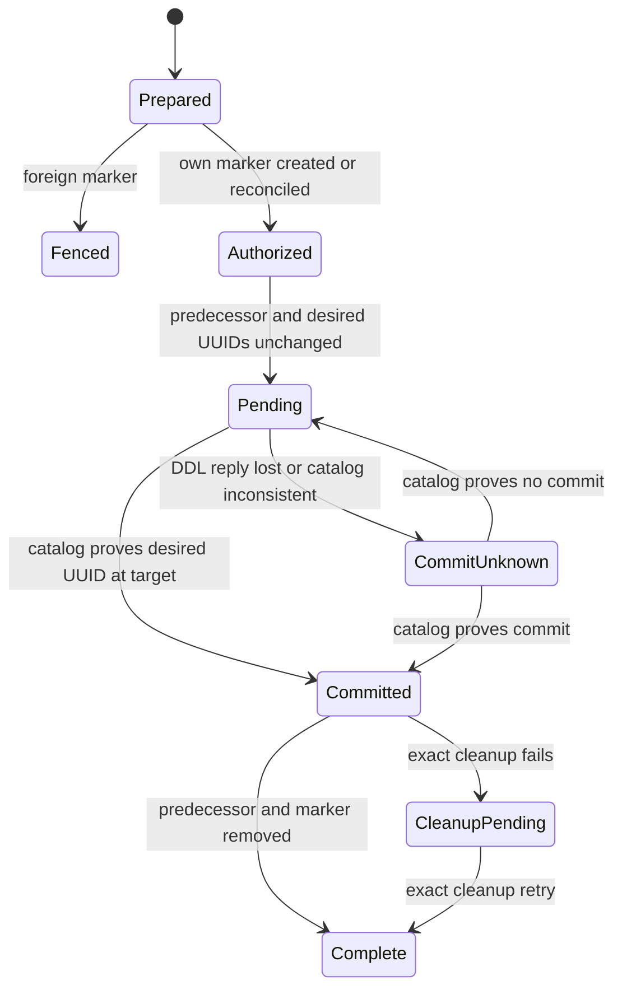

# Feature design: recoverable ClickHouse full-refresh publication

- Status: APPROVED
- Owner: maintainers
- Issue: none; maintainer-directed correctness work
- Target release: next minor release
- Last verified: 2026-09-17

## Executive summary

Bounded ClickHouse `full_refresh` currently replaces an existing target with a
multi-table `RENAME` and immediately drops the predecessor. ClickHouse does not
make a multi-entity rename atomic, and retrying an atomic exchange after an
unknown reply can restore the old generation. This design replaces that path
with an engine-gated, identity-reconciled publication protocol whose durable
coordination state lives in ClickHouse itself. It does not require PostgreSQL or
another shared state service.

The measurable outcome is binary: after a lost publication response, a retry
must classify the exact target and candidate UUID mapping before doing any DDL;
it must never blindly exchange the pair again.

## Personas and customer journey

| Persona | Goal | Current pain | Success signal |
|---|---|---|---|
| Analytics author | Publish a complete dbt model safely | Runtime details leak into authoring | Existing `full_refresh` YAML remains sufficient |
| Platform engineer | Run without a separate state database | Worker-local state cannot coordinate retries | ClickHouse catalog contains the operation authority |
| Operator | Recover an interrupted cutover | A transport error does not reveal commit outcome | Stable error/evidence distinguishes pending, committed and unknown |
| Connector maintainer | Extend publication safely | Rename behavior is implicit | One typed classifier owns engine, identity and retry rules |

Journey: configure bounded full refresh → preflight target engine and topology →
stage and validate the complete candidate → acquire the target-local publication
marker → bind target/candidate UUIDs → publish once → reconcile catalog truth →
clean the predecessor and marker only after verified commit. A retry with the
same orchestration run identity resumes the same operation. A different run is
blocked while unresolved authority remains.

## Scope

### In scope

- Bounded existing-target publication with one `EXCHANGE TABLES` on admitted Atomic or
  Shared database engines.
- Absent-target publication with one `RENAME TABLE` and catalog reconciliation.
- Retry-stable operation identity plus the exact persisted attempt candidate for
  the same scheduler run.
- A target-local ClickHouse marker with strict versioned JSON metadata.
- Exact `system.tables` observation of names, UUIDs, engines and marker comment.
- Lost-response recovery, concurrent dpone attempt fencing and exact cleanup.
- Disabling generic connector-level automatic retries for `EXCHANGE` and
  publication `RENAME` statements.

### Non-goals

- Coordinating arbitrary external writers that bypass dpone.
- Claiming cluster-wide atomic visibility from `ON CLUSTER` alone.
- Retrofitting other load strategies or destination connectors.
- Providing rollback after a later writer has changed the published target.
- Certifying a live route from offline tests.
- Changing legacy unbounded full refresh; it retains its compatibility path and
  remains separate backlog until migrated deliberately.

### Assumptions and constraints

- The target is exclusively published through the admitted dpone authority.
- V1 admits only a topology for which one authoritative catalog observation is
  sufficient. Replicated/distributed or inconsistent multi-replica observations
  fail closed until separately certified.
- Candidate and marker reside in the target database; cross-database exchange is
  not admitted.
- Identifiers remain within ClickHouse limits through deterministic hash suffixes.

## Public contract

### CLI and Python API

No new author-facing option or command is introduced. Existing run entrypoints
return their existing result shape. New stable failures identify unsupported
publication capability, ownership conflict and unknown publication outcome.

### Manifest/schema

Existing `sink.strategy.mode: full_refresh` remains the authoring contract.
Operation IDs, marker names and catalog receipts are platform-owned runtime
details and cannot be overridden through endpoint options.

### Artifacts and evidence

The marker comment is strict canonical JSON with schema
`dpone.clickhouse.full-refresh-publication.v1` and contains operation ID, plan
digest, qualified target/candidate names, predecessor UUID or null, desired UUID
and staged row count. Unknown fields, malformed JSON and identity mismatch block.
The marker is not success evidence by itself; catalog UUID classification is
authoritative.

### Compatibility and migration

Authoring remains backward compatible. Existing targets on unsupported engines
or topologies now fail before publication instead of using non-atomic rename.
That fail-closed correction is deliberate. Other strategies retain current
operation naming and behavior. Rollback restores the prior runtime version; it
must not automatically repeat an unresolved exchange.

## Detailed algorithm

1. Derive `operation_id = sha256(version, scheduler run identity, database,
   target)`; exclude worker try number and random load IDs. The immutable marker
   digest separately binds the exact candidate, predecessor/desired UUIDs and
   staged row count for that operation.
2. Keep the attempt-local candidate name and derive a fixed per-target marker
   name. The immutable marker records the exact candidate and both UUIDs; a retry
   never searches by prefix or creates a replacement candidate.
3. Complete staging, byte-budget admission, schema/data validation and row-count
   evidence before publication authority is acquired.
4. Probe the database engine, topology, target, candidate and marker. Reject
   unsupported or inconsistent observations.
5. Atomically create the marker. If it already exists, parse it and require the
   exact same operation/plan; a different operation is fenced.
6. Observe and bind predecessor and desired UUIDs. Re-observe immediately before
   DDL. Any drift is unknown/conflict, never permission to overwrite.
7. Existing target: execute one non-retried `EXCHANGE TABLES target AND
   candidate`. Absent target: execute one non-retried `RENAME TABLE candidate TO
   target`.
8. Whether DDL returns or raises, query catalog truth. Classify only:
   - pending: target/candidate retain predecessor/desired mapping;
   - committed: target has desired UUID and candidate has predecessor UUID, or
     candidate is absent for the absent-target branch;
   - unknown: every other mapping, missing observation or inconsistent replica.
9. Acknowledged pending is a failure. Raised-but-committed is recovered success.
   Raised-and-pending is reported as unknown for the current attempt. A later
   orchestration retry may execute the DDL once only after pre-source catalog
   reconciliation proves the exact original pending UUID mapping.
10. After verified commit, drop only the exact predecessor candidate whose UUID
    matches the marker, then drop the exact marker. Cleanup failure is
    `CLEANUP_PENDING`, not failed publication.
11. Source state advances only after verified committed classification and
    success evidence. An unknown outcome never triggers source re-extraction or
    target mutation automatically.

### Pseudocode

```text
candidate = validated_attempt_candidate
marker = fixed_marker(target)
prepare_and_validate(candidate)
observation = inspect_catalog(target, candidate, marker)
authority = create_or_reconcile_marker(observation, plan)
state = classify(authority, inspect_catalog(...))
if state == committed: return recovered_success
if state != pending: fail_unknown
revalidate_engine_topology_and_uuids()
execute_exactly_once_without_driver_retry(exchange_or_rename)
state = classify(authority, inspect_catalog(...))
if state != committed: fail_unknown
record_commit_evidence()
drop_exact_predecessor_then_marker()
```

### State machine



### Edge cases

- Empty source still publishes a validated empty candidate.
- Missing/malformed marker, zero UUID, engine drift, target disappearance,
  candidate replacement, duplicate delivery or mixed replica evidence blocks.
- Schema drift after staging blocks at the existing validation boundary.
- Cancellation before DDL removes only the exact owned candidate/marker.
- Cancellation or process crash after DDL is reconciled from catalog identity.
- Two different runs cannot own one fixed target marker concurrently.

## Architecture

| Component | Existing/new | Responsibility | Dependencies |
|---|---|---|---|
| Operation table resolver | Existing, extended | Deterministic full-refresh names | Pure hashing/config |
| Publication contract | New | Marker schema and UUID state classifier | Contracts only |
| ClickHouse publication service | New | Preflight, authority, DDL, reconciliation, cleanup | Connector port + contract |
| Staged load service | Existing, thin integration | Delegate full-refresh finalization | Publication service |
| Query operations | Existing, corrected | Never auto-retry ambiguous publication DDL | Driver adapter |
| Cluster topology probe | Existing, reused | Catalog/engine consistency evidence | Connector port |

Dependencies point from runtime orchestration to the typed classifier and narrow
connector capability. No policy enters a compatibility facade and no PostgreSQL
adapter is introduced. The composition root constructs the publication service.

Alternatives rejected: multi-rename (not atomic), blind repeated exchange (can
restore old data), worker-local file/SQLite marker (not shared across workers),
mandatory PostgreSQL journal (deployment dependency absent for many users), and
name/age-based cleanup (does not prove ownership). ADR 0057 already establishes
UUID reconciliation and no-blind-replay; this design specializes it for bounded
full refresh without changing that decision.

Quality target: focused modules stay below 350 SLOC where practicable and never
cross the repository hard 400-SLOC limit; no architecture baseline is relaxed.

## Market comparison

Checked 2026-09-17 against official sources already registered in the snapshot
research. dlt documents destination-specific replace modes; Microsoft SSIS and
Apache Beam expose explicit batch/commit and completion boundaries. We adopt
explicit strategy/recovery semantics but do not infer whole-snapshot atomicity
from batching. Informatica, Airbyte, Fivetran and Pentaho are N/A to the exact
open-source in-database UUID authority; gusty and Astronomer Cosmos orchestrate
work rather than own ClickHouse DDL publication.

Primary storage facts: ClickHouse documents `EXCHANGE TABLES` as atomic for
Atomic/Shared database engines, documents multi-entity `RENAME` as non-atomic,
and exposes table UUID, engine and comment through `system.tables`. See the
[primary-source register](sqlserver-snapshot-research.md#primary-source-register-and-design-decisions).

```yaml
axis: lost-response full-refresh replay safety
scenario: publication DDL succeeds but the client receives an exception
baseline: generic multi-rename or blind exchange retry
metric: unintended second target mutation
target: 0
procedure: deterministic fault injection before acknowledgement, then retry
artifact: pytest contract results and later live certification receipt
limitations: offline evidence does not certify a distributed production topology
```

## Security, privacy and operations

Marker metadata contains hashes, object identities and counts, never credentials
or source data. SQL identifiers and JSON literals use existing renderers. The
runtime requires CREATE/ALTER/EXCHANGE-or-RENAME/DROP and system-table read
permissions in the target database. Logs emit stable reason codes and hashed
operation identity. Operators reconcile before cleanup; no prefix sweep or
schema drop exists.

## Test and certification plan

| Layer | Scenario | Environment | Expected artifact |
|---|---|---|---|
| Unit | marker codec and all UUID mappings | In-memory | classifier tests |
| Contract | existing/absent target, foreign marker, engine/topology rejection | Fake connector | publication service tests |
| Failure injection | lost reply before/after mutation, repeated retry, cleanup failure | Fake connector | zero double-exchange proof |
| Integration | Atomic ClickHouse with concurrent reader and two workers | Docker | integration receipt |
| Live certification | exact production-like topology and permissions | Approved environment | signed route evidence; initially UNVERIFIED |
| Compatibility | non-full-refresh names/behavior unchanged | Offline suite | regression results |

Documentation updates cover load strategy semantics, MSSQL→ClickHouse recovery,
operator decision tree, changelog and route matrix. Rollout remains fail-closed:
unsupported topology stops before DDL. A regression withdraws route admission;
it does not fall back to multi-rename.

## Agent execution plan

One integrator owns runtime, shared docs, tests and changelog in this branch.
Independent review is read-only and must inspect the exact final commit for data
loss, retry and compatibility risk. Release workflows, customer repositories,
credentials and live deployment artifacts are out of scope.

## Approval checklist

- [x] User problem and CJM are clear.
- [x] Algorithm and failure semantics are implementable without guessing.
- [x] Public contracts and compatibility are explicit.
- [x] Architecture and alternatives are justified.
- [x] Relevant market research uses current official sources.
- [x] Claimed differentiation is measurable.
- [x] Tests, evidence, docs, rollout and rollback are complete.
- [x] Path ownership and integration plan are conflict-safe.
- [x] Maintainer authorized implementation in phased independent work.
