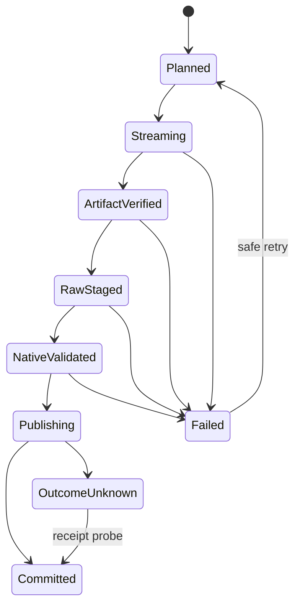
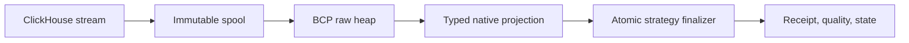

# Feature design: ClickHouse to MSSQL strategy and throughput v1

- Status: APPROVED
- Owner: PaulKov
- Target release: 0.74.21
Last verified: 2026-08-22

## Executive summary

ClickHouse-to-MSSQL loads currently couple the ClickHouse fetch batch, Python
list materialization, temporary-file size, and one `bcp` process. A 1.38M-row
stream with the default 10k batch therefore starts about 138 `bcp` processes
and repeatedly scans a growing raw staging heap. The generic MSSQL path also
computes lineage in Python even though the MSSQL native projector discards
those wire values and computes authoritative lineage again.

The first implementation separates source fetch batching from MSSQL bulk
transport: one bounded logical stream is spooled incrementally to one immutable
BCP artifact and imported by one BCP process whose own `-b` option controls SQL
Server commit batches. MSSQL declares that it owns native lineage, so row-backed
sources no longer serialize ignored lineage bytes. Native staging computes
deterministic lineage and row hash in its set-based projection instead of
rewriting the table in additional passes.

Strategy selection remains semantics-first. In the general platform taxonomy,
immutable cursor-owned events can use append and keyed updates can use merge
only with a trustworthy source boundary. The current ClickHouse-to-MSSQL route
does not implement that durable boundary contract: `incremental_append` and
`incremental_merge` remain unsupported regardless of cursor or key hints. This
route supports complete `full_refresh`, `replace`, `partition_replace`, and
`backfill` boundaries only; complete mutable date windows use atomic
`partition_replace`, while first load, repair, small tables, or sources without
another provable complete boundary use optimized `full_refresh`.

The measurable outcome is fewer transport processes and table passes without
weakening integrity, target atomicity, state ordering, physical design, or
lineage identity. Live promotion requires exact correctness and phase-level
performance evidence, not a vendor or local-file benchmark.

## Personas and customer journey

| Persona | Goal | Current pain | Success signal |
|---|---|---|---|
| Data-product author | Choose a safe fast strategy | Strategy names do not expose boundary prerequisites | Plan explains the selected strategy and blockers |
| Airflow operator | Finish scheduled loads predictably | Small tables can spend minutes in process/scanning overhead | One BCP process per bounded stream; external phase evidence until the benchmark producer lands |
| DWH owner | Preserve SQL Server contracts | Fast swaps can lose object identity, indexes, ACLs, or dependencies | Existing target object and catalog fingerprint remain valid |
| Incident responder | Retry without duplication or partial publication | Transport and publish failures are hard to distinguish | Receipt-backed failure boundary and idempotent retry evidence |

Journey: discover the route guide; declare source semantics and target strategy;
run `dpone plan`; resolve any fail-closed prerequisite; run DEV acceptance;
inspect runtime receipts plus externally collected source-read, spool, BCP,
native-projection, target-finalize, and quality measurements; retry safely on a
pre-commit failure; promote only accepted image and manifest bytes; verify the
production receipt and target acceptance. The exact route remains
`UNVERIFIED` until a versioned benchmark producer and live campaign exist.

## Scope

### In scope

- Explainable strategy policy for append, merge, partition/window replacement,
  full refresh, snapshot history, and actual CDC.
- A single-artifact MSSQL streaming BCP fast path with bounded memory.
- MSSQL-native lineage ownership and set-based lineage/hash projection.
- Full-refresh throughput improvements that preserve the existing target object.
- Environment-bound MSSQL staged/target acceptance metrics.
- ClickHouse-to-MSSQL benchmark and correctness certification requirements.
- Fail-closed documentation for rolling-window target scope and empty expected
  partitions.

### Non-goals

- Adding DuckDB, Duckle, Beam, Arrow Flight, ADBC, or a new database driver to
  the production runtime.
- Replacing BCP with JDBC/TDS multi-row `VALUES`.
- Changing database recovery models, disabling constraints, or dropping target
  indexes automatically.
- Making shadow rename/swap the default for an existing SQL Server target.
- Inferring CDC, hard deletes, source completeness, or lateness from row data.
- Activating Airflow schedules or changing deployment environment bindings.

### Assumptions and constraints

- BCP, ODBC Driver 18, encrypted transport, disposable raw/native staging, and
  target-atomic MSSQL receipts remain the implemented platform path; this
  ClickHouse-to-MSSQL route is not certified by the current increment.
- Source iterators are one-shot and may fail during spool; no target DML may
  occur before an immutable artifact and staging evidence exist.
- One spool file bounds memory but consumes worker-local disk. Runtime storage
  preflight and cleanup policy remain mandatory; future explicit file
  partitioning may split exceptionally large payloads.
- `packet_size` is capped to the safe encrypted ODBC 18 value. A requested 64K
  packet is never treated as effective evidence.
- The observed marketing volumes are workload evidence to verify in DEV, not a
  portable product benchmark.

## Public contract

### CLI

No existing command or exit code changes. `dpone plan` keeps returning the
strategy-intelligence decision. For ClickHouse-to-MSSQL `auto`, it must never
return a target-derived cursor or an unsupported merge merely because a cursor
or key is present. Runtime 0.74.21 does not add a benchmark command or claim a
versioned performance artifact. Live status remains `UNVERIFIED`; operators
collect the first DEV matrix from existing run/acceptance receipts and external
database/task measurements.

### Python API

`MSSQLSink` exposes a stable native-lineage ownership capability. The ETL
coordinator consumes the capability through behavior, not class-name checks.
`StreamingRowsArtifact` optionally calls a staging-manager bulk-stream method;
managers without that capability retain the existing chunked `insert_rows`
path. The sink also exposes an MSSQL acceptance probe that renders the explicit
database, schema, and table from the materialized load config. These are
runtime ports, not new top-level public imports.

### Manifest/schema

The first increment adds no required authoring field and preserves all existing
manifests. BCP `batch_size` continues to mean the vendor `bcp -b` transaction
batch; it no longer accidentally controls source iterator materialization or
the number of BCP processes on the MSSQL streaming fast path.

`partition_replace` still requires a complete authoritative slice. A rolling
window is not certified for physical deletes until the runtime owns the exact
expected target scope, including an expected partition that contains zero
source rows. Until that follow-up contract lands, authors must not claim that
`values_from_staging` proves deletion of an entirely empty partition.

### Artifacts and evidence

Every BCP artifact retains the immutable file receipt, wire-contract digest,
expected row count, vendor copied-row count, physical staging delta, reject-file
check, source provenance, and native-contract digest. The runtime records one
observed sink-stream materialization, not a fabricated source-fetch count. A
follow-up benchmark producer must add observed `source_fetch_batches`,
`artifact_files`, `bcp_process_count`, and phase durations before automated
performance certification is possible.

### Compatibility and migration

Old manifests keep their strategy and target semantics. Non-MSSQL staging
managers keep chunked inserts. MSSQL streaming artifacts use the fast path
automatically because it is semantically equivalent and evidence-compatible.
Rollback is a package-pin rollback to the previous runtime; no stored state or
manifest migration is required.

## Detailed algorithm

1. Validate strategy, source boundary, target/catalog plan, storage, BCP, and
   target-atomic state before source row I/O.
2. Resolve the ClickHouse projection and stream rows in source-driver batches.
   For MSSQL table sinks, do not pre-scan the same source with `COUNT(*)`;
   completed stream consumption publishes exact source row authority.
3. If the sink owns authoritative native lineage, keep the wire schema limited
   to source/business values; freeze load identity in the load config.
4. Create an empty raw MSSQL heap.
5. Stream rows directly to one temporary delimited file without building Python
   batch lists. On source/spool failure, delete the file and raw stage.
6. Freeze and verify the artifact receipt; capture the raw stage count once;
   execute one BCP process using `TABLOCK`, safe packet size, and its independent
   transaction batch; re-verify bytes, rejects, vendor count, and stage delta.
7. Validate lossless raw-to-native conversions and project typed business
   values, authoritative deterministic lineage, and row hash set-wise into a
   fresh native stage. The target-clock `loaded_at` remains transaction-owned.
8. Under the existing serializable target transaction and locks, validate the
   catalog fingerprint, capture one target clock, finalize the selected
   strategy, write the receipt, and commit.
9. Evaluate quality against completed source/staging authority and any certified
   target scope. Advance source state only after the committed receipt and
   quality acceptance.
10. Clean raw/native stages and spool artifacts according to terminal outcome;
    preserve evidence on an unknown commit outcome.

### Pseudocode

```text
decision = advise(source_semantics, target_capabilities, requested_strategy)
preflight(decision, target_catalog, storage, bcp, state)
stream = clickhouse.read(projection, complete_boundary)
payload = skip_python_lineage_if_sink_native(stream)
raw = mssql.create_raw_heap()
file, exported = spool_stream(payload)
verify(file)
raw_before = count(raw)
copied = bcp_in(file, transaction_batch, packet, TABLOCK)
verify(file, rejects, copied, count(raw) - raw_before)
native = insert_select_typed_lineage_hash(raw)
with serializable_target_transaction_and_fence:
    loaded_at = target_clock()
    set_loaded_at(native, loaded_at)
    result = finalize_strategy(native)
    receipt = write_receipt(result, file_digest, native_contract, loaded_at)
commit()
accept_quality_and_state(receipt)
```

### State machine



### Edge cases

- Empty input produces an immutable zero-row receipt and no BCP invocation.
- Delimiters, empty strings, NULL, temporal precision, binary, UUID, decimal,
  text length, and collation retain existing fail-closed codec/type guards.
- A partial spool never reaches BCP; a failed BCP never reaches target DML.
- Duplicate/null keys are rejected before merge/partition finalization.
- An empty expected partition is not silently accepted as replaced; it requires
  a boundary-owned target scope or a fail-closed certification blocker.
- Concurrent target readers observe the pre- or post-transaction target, never
  a partially published window.
- Schema drift is planned before extraction and revalidated under the target
  lock before and after mutation.

## Architecture

### Components and responsibilities

| Component | Existing/new | Responsibility | Dependencies |
|---|---|---|---|
| `StrategyAdvisor` | Existing, changed | Semantics-first explainable selection | Capability catalog only |
| `StreamingRowsArtifact` | Existing, changed | One-shot stream lifecycle and optional bulk-stream port | Staging protocol |
| `MSSQLStagingManager` | Existing, changed | Stream spool and verified BCP materialization | Codec, evidence authority, connector |
| `MSSQLSink` | Existing, changed | Declare native-lineage ownership | MSSQL strategies |
| `MssqlAcceptanceMetricProbe` | New | Query the environment-bound business target independently | MSSQL connector |
| `MssqlNativeStagingNormalizer` | Existing, changed | Lossless typed projection plus authoritative lineage/hash | Native SQL expression helpers |
| Route benchmark producer | Deferred follow-up | Versioned observed phase counters and automated SLO decision | Live ClickHouse/MSSQL endpoints |

### Ports, adapters, and composition root

The artifact depends only on an optional staging behavior. MSSQL implements the
behavior; other adapters are unchanged. The ETL coordinator asks the sink for a
lineage ownership capability; only the MSSQL composition root declares it. SQL
expression generation remains in MSSQL-specific modules.

### Data and control flow



### Alternatives and tradeoffs

| Alternative | Advantages | Disadvantages | Decision |
|---|---|---|---|
| Increase source `batch_size` only | No runtime change | Couples memory and process count; not systemic | Reject as sole fix |
| Duckle/DuckDB in the path | Vectorized local parsing | No comparable CH-to-MSSQL/BCP proof; new engine and conversion | Reject now |
| Arrow/ADBC | Typed columnar path may reduce CPU | Driver compatibility and end-to-end gain unproven | Separate capability-gated spike |
| FIFO directly into BCP | No full spool file | Cannot preserve current pre-import immutable-file proof | Reject for current evidence contract |
| Shadow rename for every full refresh | Short publish phase | Object identity, ACL, index, FK, dependency risks | Reject as default |
| BCP raw heap plus set-based publish | Mature SQL Server bulk path and current evidence | Uses local disk and typed projection | Adopt |

### ADR requirement

No new ADR is required for the first increment: BCP staging, target-atomic
publication, and plan-only strategy intelligence are existing decisions. A
future Arrow/ADBC transport or public cross-dialect window AST requires its own
approved design/ADR.

### Quality-budget impact

Changes stay inside existing ETL, MSSQL staging/native projection, and strategy
intelligence modules. No new cross-package dependency direction is introduced.
Any future dedicated benchmark tool stays outside runtime imports. Quality
budgets remain governed by `docs/benchmarks/quality_budgets.yml`.

## Market comparison

All sources were accessed 2026-08-22; vendor documentation is primary unless
the product itself is the referenced open-source repository.

| System/version | Relevant capability | Observed design | Strength | Limitation | Adopt/reject | Source/date |
|---|---|---|---|---|---|---|
| dlt current | replace/merge and MSSQL destination | staging plus truncate/insert, merge variants; optional third-party ADBC | Clear strategy taxonomy | ADBC claim is not against BCP | Adopt semantics; benchmark ADBC later ([docs](https://dlthub.com/docs/general-usage/full-loading)) |
| Informatica current | SQL Server bulk load | SQL Server bulk API/BCP and parallel initial-load writers | Mature bulk path | Bulk mode reduces recoverability if misused | Adopt separation of bulk stage and publish ([docs](https://docs.informatica.com/data-integration/powerexchange-for-cdc-and-mainframe/10-5/bulk-data-movement-guide/microsoft-sql-server-bulk-data-movement/using-the-sql-server-bulk-load-utility-to-load-bulk-data.html)) |
| Airbyte current | replication modes | full refresh and cursor/PK incremental modes | Explicit boundaries | Polling cannot observe hard deletes | Adopt taxonomy, not transport ([docs](https://airbyte.com/blog/understanding-data-replication-modes)) |
| Fivetran current | initial plus incremental sync | historical initial sync, then cursor incremental; scoped re-sync | Repair lifecycle | No evidence for this sink transport | Adopt lifecycle ([docs](https://fivetran.com/docs/core-concepts/syncoverview)) |
| Pentaho current | JDBC batch output | commit size and JDBC batch updates | Fewer round trips | No MSSQL BCP fast-path evidence | Reject as replacement ([docs](https://docs.pentaho.com/pdia-data-integration/pdi-transformation-steps-reference-overview/table-output)) |
| Microsoft SSIS/SQL Server current | FastLoad/BCP | TABLOCK, rows-per-batch, max commit size, packet tuning | Highest route relevance | Minimal logging is conditional | Adopt ([SSIS](https://learn.microsoft.com/en-us/sql/integration-services/data-flow/ole-db-destination?view=sql-server-ver17), [BCP](https://learn.microsoft.com/en-au/sql/tools/bcp-utility?view=sql-server-ver15)) |
| gusty current | Airflow authoring | DAG generation/orchestration | Authoring UX | Not a transport | N/A ([repo](https://github.com/pipeline-tools/gusty)) |
| Astronomer Cosmos current | dbt orchestration | dbt nodes mapped to Airflow | Visibility | Not a transport | N/A ([docs](https://astronomer.github.io/astronomer-cosmos/getting_started/how-cosmos-works.html)) |
| Apache Beam current | distributed JDBC IO | JDBC batch, partitioned reads, autosharding | Large distributed jobs | No BCP semantics; operational overhead | Reject for current scale ([docs](https://beam.apache.org/documentation/io/managed-io/)) |
| Sling current | full/incremental/backfill/snapshot | every mode uses a temporary target; range backfill can chunk | Strong bounded-window semantics | No documented MSSQL BCP fast path | Adopt semantics ([docs](https://docs.slingdata.io/concepts/replication/modes)) |
| DuckDB current | columnar/Arrow/Parquet | vectorized scan and bulk copy | Efficient local columnar processing | Not a SQL Server sink | Spike only ([docs](https://duckdb.org/docs/guides/import/overview)) |
| Duckle public beta | local CSV benchmark and SQL Server sink | CSV to local DuckDB; SQL Server uses batched TDS `VALUES`/merge | Fast local parse demo | Benchmark excludes ClickHouse/network/MSSQL/BCP | Reject for current implementation ([repo](https://github.com/slothflowlabs/duckle)) |

## Measurable differentiation

```yaml
axis: clickhouse_to_mssql_route_strategy_volume
scenario: full_refresh_and_partition_replace_at_10k_1m_10m_rows_plus_marketing_shapes
baseline: released_dpone_0_74_18_same_manifest_schema_network_and_database_state
metric: total_and_phase_duration_rows_per_second_bcp_processes_peak_rss_correctness
target:
  correctness_failures: 0
  bcp_processes_per_unpartitioned_bounded_stream: 1
  target_load_finalize_rows_per_second_minimum: 15000
  phase_regression_vs_baseline_max_pct: 10
  measured_runs_after_warmup: 3
procedure: one_cold_or_warmup_then_three_measured_runs_per_exact_matrix_cell
artifact: dpone.clickhouse_mssql_benchmark.v1.json
limitations: desired_follow_up_artifact_not_emitted_by_0_74_19_environment_specific_not_comparable_to_local_csv
```

## Security, privacy, and operations

Connections continue to use runtime connection references and deployment
variables; no credential is accepted in manifests or evidence. Commands and
errors redact secrets. Temporary artifacts use confined worker-local storage
and eager cleanup, with preservation only where the existing unknown-outcome
runbook requires evidence. BCP table locks and transaction locks are observable;
benchmark evidence records blocking duration and transaction-log impact.

Operational alerts distinguish source/spool, BCP, native conversion, target
publish, acceptance, and cleanup failures. Operators roll back by pinning the
previous dpone image/package and retrying through receipt/state authority.

## Test and certification plan

| Layer | Scenario | Environment | Expected artifact |
|---|---|---|---|
| Unit | MSSQL stream consumes iterator without Python batch lists and invokes one BCP | Hermetic | Exact call/count assertions |
| Unit | Non-MSSQL manager retains chunked inserts | Hermetic | Backward-compatibility assertions |
| Contract | Native-lineage ownership removes ignored wire columns but preserves target lineage | Hermetic | SQL/evidence parity assertions |
| Contract | Advisor never recommends unsupported CH-to-MSSQL cursor/merge | Hermetic | Decision and blocker assertions |
| Contract | Target acceptance renders `DWH_Dev`/`dwh_example` from load config without substitution | Hermetic | Exact database-qualified SQL assertions |
| Integration | Full refresh preserves target catalog and exact rows/hash | Docker vendor-live | Route receipt/evidence |
| Integration | Partition replace handles late update/delete and outside-window invariance | Docker vendor-live | Scoped reconciliation evidence |
| Negative | Empty expected partition | Docker vendor-live | Fail-closed until boundary-owned scope is implemented |
| Fault | Source, spool, BCP, pre-publish, mid-publish, lost ACK | Docker vendor-live | No partial receipt/state advancement |
| Performance | 10k/1M/10M and marketing-shaped full/window runs | DEV-equivalent | Operator-collected evidence; automated artifact is deferred |
| Compatibility | Existing manifests and non-MSSQL managers | Hermetic full suite | Green suite and schema snapshots |

Each matrix cell uses one warmup and at least three measured runs. Correctness
requires exact counts, deterministic type-safe aggregate/hash, zero rejects,
lineage completeness, physical-design preservation, no unexpected staging
residue, and a committed receipt/state. Partition tests additionally prove
outside-window invariance, late updates/deletes, idempotent retry, and the empty
expected-partition case.

## Documentation plan

Update the ClickHouse-to-MSSQL guide, load-strategy reference, performance
guide, changelog, and benchmark runbook. Document the distinction between BCP
transaction batch and artifact/process count, the conditional nature of
minimal logging, the target-scope limitation of `values_from_staging`, and the
separate Arrow/ADBC evaluation path.

## Rollout and rollback

1. Merge hermetic runtime optimizations and advisor guardrails.
2. Validate a release candidate in an isolated benchmark environment.
3. Run exact DEV full-refresh and partition-window benchmark/correctness cells.
4. Promote only if all correctness gates are green and no phase regresses more
   than 10%; investigate any target-finalize result below 15k rows/s.
5. Validate initial, repair, and rolling runs with complete source/target comparison.
6. Roll back the package pin on correctness failure, repeated regression, or
   unexplained blocking/log growth. Receipt/state compatibility permits retry.

## Agent execution plan

| Agent/role | Owned paths | Read-only paths | Forbidden paths | Dependency |
|---|---|---|---|---|
| Integrator | Runtime, tests, docs, changelog | Entire repository | Credentials, unrelated adapters | Approved design |
| Market researcher | None | Official vendor docs | Runtime edits | Independent |
| Runtime auditor | None | CH/MSSQL call graph and tests | Runtime edits | Independent |
| Benchmark designer | None | Existing tools/integration tests | Runtime edits | Independent |
| Fresh reviewer | None | Final diff and evidence | Edits during review | All gates complete |

The integrator owns all shared files and is the only writer.

## Approval checklist

- [x] User problem and CJM are clear.
- [x] Algorithm and failure semantics are implementable without guessing.
- [x] Public contracts and compatibility are explicit.
- [x] Architecture and alternatives are justified.
- [x] Relevant market research uses current official sources.
- [x] Claimed differentiation is measurable.
- [x] Tests, evidence, docs, rollout, and rollback are complete.
- [x] Path ownership and integration plan are conflict-safe.
- [x] Maintainer changed status to `APPROVED` (explicit user approval, 2026-08-22).
