# Feature design: quality evidence for committed replay

- Status: APPROVED
- Owner: maintainers
- Issue: independent open-source recovery work; no external incident reference
- Target release: TBD after implementation and review
- Last verified: 2026-09-28
- Inspected source: `202310035a2eda90f91783275f1d62de9d3e1991`
- Implementation gate: maintainer approved implementation on 2026-09-28.

This approved design is for runtime maintainers and operators. The bounded
Python opt-in is implemented as described in the [user guide](committed-replay-quality.md).
The protocol below also describes deferred target-capture and additional-backend
work; approval is not a claim that every planned capability has shipped.
Start with the [feature design standard](feature-design-standard.md) and
[existing quality governance](load-governance.md).

## Implementation disposition

The initial implementation supports explicitly composed internal replicated
ClickHouse full refresh, row/hash gates, source/staged acceptance, strict externally
provisioned KeeperMap authority and source-free replay. Target capture is rejected
before source access because no enforceably bounded reader is composed. External
replication, the MSSQL adapter, CLI/manifest selection and the optional Code 999
DDL observation retry remain deferred. The retry evaluation found no absolute
deadline in the stock driver path; no generic or mutation retry was added.
See [ADR 0073](adr/0073-durable-committed-replay-quality.md) and the
[reference](committed-replay-quality-reference.md) for the shipped boundary.
Live certification remains UNVERIFIED.

## Executive summary

A committed publication can lose its acknowledgement, recover its exact target
generation, and still fail governance because `complete_replay_governance`
rejects every non-inert quality policy. The same failure occurs when replaying
an entirely successful publication. Turning quality off or accepting a serialized
process-local receipt would manufacture success.

Introduce a separate durable quality capsule, produced from authoritative
evaluation before publication, bound to the publication authority, and verified
before a fresh process can finish governance. Preserve source-free replay and
one-shot publication dispatch. Treat target acceptance capture, which happens
after publication, as an explicitly separate completion obligation.

The implementation must remain sink-neutral. Initial concrete support targets
ClickHouse cluster full-refresh publication; the shared protocol also defines
the transactional MSSQL adaptation. Backends without the declared durable
capability retain fail-closed non-inert replay. This proposal does not claim
that all connectors acquire durable replay support at once.

## Personas and customer journey

| Persona | Goal | Current pain | Success signal |
|---|---|---|---|
| Pipeline author | Keep quality enabled on retries | A committed retry always fails | Exact supported replay succeeds without source access |
| Operator | Diagnose partial execution | Commit truth and governance success are conflated | Both outcomes and an actionable typed reason are visible |
| Platform engineer | Retain trustworthy evidence | A JSON report cannot prove its producer | Durable authority, retention and permissions are explicit |
| Connector author | Reuse governance policy | Replay currently exposes an MSSQL-specific error | One capability and validator, adapter-owned identity and storage |

1. Discover supported replay capability in the quality and publication references.
2. Prepare the externally governed authority and retain its records throughout
   the supported replay window. Verify its storage engine and concurrency semantics.
3. Keep the existing quality configuration; no manifest flag disables validation.
4. Run a synthetic full-refresh fixture with a row-count reconciliation gate.
5. Observe publication outcome separately from quality-governance outcome.
6. Retry the same invocation and exact configuration after acknowledgement loss.
7. If evidence is missing or mismatched, preserve target and authority. Escalate
   for a reviewed recovery plan; do not delete the journal or invent a new run ID.
8. Upgrade storage only through an explicit operator procedure. Historical
   records without proof cannot be backfilled from current target counts.

## Scope

### In scope

- Exact policy, acceptance, configuration, schema, operation and generation binding.
- A bounded, trusted durable producer and source-free replay validator.
- Replay after acknowledgement loss and after a fully successful publication.
- Typed missing, mismatch, invalid, failed, incomplete and unsupported outcomes.
- Synthetic unit, contract and processor-level regression coverage.
- A separately reviewable read-only distributed-DDL observation retry.

### Non-goals

Release publication, consumer dependency updates, external incident reproduction,
private data or credentials, live certification, arbitrary hook replay, automatic
journal replacement, and general target recertification after external writes.
No retry may redispatch EXCHANGE or source extraction for a proven committed run.

### Assumptions and constraints

The trusted computing base is the runtime producer, injected authority adapter,
and platform-controlled state store. A checksum proves integrity and identity,
not authenticity. Report files, caller dictionaries and `reconciliation_metrics`
are diagnostic projections, never authority. Privileged database administrators
and malicious code executing inside the trusted runtime are outside this boundary.

Only managed generations whose writers honor the publication fence may use
bounded post-commit revalidation. Background TTL/data-changing merges, unmanaged
inserts, mutations and unproven read isolation disqualify that capability.
An unchanged UUID alone is insufficient proof of immutable contents.

## Existing execution and authority findings

`ETLProcessor.run` freezes the quality snapshot, admits the sink, and obtains a
committed replay before source extraction. `complete_replay_governance` raises
`MssqlReplayQualityEvidenceRequired` for any gates or enabled acceptance policy.
The existing negative regression must remain valid for missing evidence.

`LoadGovernanceFinalizationCoordinator.load` evaluates quality and captures source
and staged acceptance before finalization. Target acceptance occurs afterward.
`QualityGateExecution` owns object-identity authority and a single-consumer state
machine. [ADR 0025](adr/0025-process-local-quality-gate-authority.md) explicitly
does not authenticate serialized receipts or survive process restart.

ClickHouse operation identity currently binds scheduler identity, database and
table; its plan digest does not bind quality or complete semantic configuration.
Same-operation `COMPLETED` admission does not re-observe target generations.
Both gaps must be closed in the new quality-capable replay path.

The class `ClickHouseKeeperMapAuthority` currently uses
`ReplicatedReplacingMergeTree` with conditional INSERT and readback. That is not
a linearizable compare-and-swap. [ADR 0067](adr/0067-clickhouse-cluster-publication-authority.md)
requires strict KeeperMap authority. Before enabling durable quality replay,
restore that authority guarantee or reject the storage capability. The existing
external-replication KeeperMap adapter provides a reusable strict SQL pattern;
its presence does not certify the internal adapter.

## Public contract

### CLI and Python API

Existing command arguments, manifests and default inert behavior remain intact.
Success requires independently verified publication and complete quality proof.
A blocked replay preserves committed-target truth, returns execution failure,
and cannot advance source state or run post-hooks as if governance succeeded.

Introduce `ReplayQualityEvidenceError` with `blocks_committed_success = True`
and stable `DPONE_REPLAY_QUALITY_EVIDENCE_*` codes: `REQUIRED`, `MISMATCH`,
`INVALID`, `FAILED`, `INCOMPLETE`, and `UNSUPPORTED`. Safe details identify only
the mismatched field/category and opaque evidence IDs. Keep the historical
`MssqlReplayQualityEvidenceRequired` import and MSSQL unsupported-path code
compatible through an adapter/subclass; do not silently rename its code.

New neutral replay errors use the existing structured runtime failure result:
CLI exit 1, JSON result on stdout in JSON mode, bounded diagnostic on stderr.
The result retains the actual target commit outcome. Golden CLI tests must pin
this mapping before implementation is considered complete. Python consumers
receive the same typed classification and committed-target details.

### Manifest/schema

No quality-policy relaxation or author-supplied proof field. The runtime declares
`durable_quality_replay_v1` through an explicit composed capability, not method
presence. This capability applies only to the initial supported cluster
full-refresh route when its composition explicitly selects the durable adapter.
Without that selection, original non-replay loads on MSSQL and other existing
routes keep their current quality path; non-inert replay still fails closed.
Once selected, unsupported storage fails before extraction on new governed runs;
the runtime must not silently fall back to the legacy adapter.
No source probe is permitted while negotiating an already-committed replay.

### Artifacts and evidence

Define strict `dpone.quality.replay.v1` capsules. Reject unknown fields, duplicate
JSON keys, unknown versions, NaN/infinite numbers, boolean counts and oversized
values. Canonical serialization follows [ADR 0011](adr/0011-canonical-fingerprints.md).
Maximum encoded capsule size is 256 KiB; oversize fails before publication.

| Field group | Required binding |
|---|---|
| Format and producer | Capsule version, evaluator contract version, original run/load IDs |
| Policy | Existing `policy_snapshot_id`, normalized gates and acceptance policy |
| Configuration | Versioned source-free admission digest and producer-recorded effective-plan digest |
| Scope | Source/target logical identities, extraction/filter/projection/transform contract digests |
| Schema | Ordered source, projected payload and physical target schema digests |
| Publication | Backend authority identity, target identity, invocation, operation, fence, generation and plan digest |
| Observations | Exact source/staged quality observations, validated complete gate report, acceptance-side records |
| Completion | `PREPARED`, `TARGET_PENDING`, `COMPLETE` or `FAILED`, target-capture obligation, reason codes |

The admission projection includes strategy, unique keys, column mapping,
normalization, lineage, schema evolution, physical design, source selection and
quality options. Normalize through existing contracts and hash executable query
text without persisting it. Exclude credentials, connection clients, runtime
handles, retry attempt IDs, timestamps and diagnostic/output destinations.
Each excluded field must have a named classification and a test. Unknown
semantic fields fail capability negotiation rather than being silently omitted.
The implementation must supply the exhaustive versioned field registry for
review; generic `repr(config)` and permissive `default=str` are prohibited.

The effective-plan projection additionally binds extraction-derived schema,
overrides, enrichment and validated transformation outputs. Store their bounded
provenance and transformation contract versions in the prepared core. Replay
recomputes the admission digest without source access, then deterministically
reconstructs the effective projection from the recorded inputs using those same
contract versions. A transformation requiring unavailable source information or
an unsupported version cannot grant replay authority. Never compare an enriched
original config directly to an un-enriched replay config or refetch source schema.

No arbitrary report diagnostics or SQL text enter the capsule. A report is
validated using the original authoritative execution before projection. Acceptance
records preserve all requested sides, completeness and safe warning codes.
An explicit allowed `warn_only` outcome remains a warning; missing records are
not silently converted into warnings. A recorded failed evaluation never succeeds.

Store the capsule inside the fenced publication authority payload. Separate its
immutable prepared core from completion: receipt identity binds the prepared-core
digest, while each completion record binds that digest, the previous completion
digest and the exact authority version. Target observations append once; they do
not mutate original observations or the receipt's immutable identity. Recompute
the complete envelope digest on every CAS and validate both chains on read.
Diagnostic exports identify the authority
version and capsule digest but cannot be imported to grant replay permission.
Retain the capsule until the target slot is safely retired; slot reuse invalidates
old replay, regardless of local report retention. There is no time-based success
fallback and no automatic evidence reconstruction for historical rows.

### Compatibility and migration

Read old authority payloads with an explicit absent-capsule state. Inert replay
keeps existing behavior. Non-inert old rows remain blocked. New versioned records
must fail closed in older runtimes; mixed-version writers are unsupported during
the storage rollout. Do not automatically convert, drop or copy authority rows.
Quiesce writers and resolve pending publications before an operator-reviewed
storage migration. This design PR performs no migration.

## Detailed algorithm

### Original execution

1. Freeze normalized quality and admission identities before side effects.
2. For the explicitly selected durable route only, negotiate durable authority
   without source I/O. Require bounded target-capture capability only when the
   policy requests target capture. Fail unsupported selected configurations
   before extraction; preserve the existing ordinary path for other routes.
3. Stage and project using the existing path. Evaluate gates through the original
   `QualityGateExecution`; capture source/staged acceptance exactly once.
4. Freeze the effective plan after extraction overrides and enrichment. Resolve
   the immutable candidate, source/payload/target schemas and publication
   operation under the adapter-owned fence. Build the capsule from validated
   producer objects. No public constructor grants producer authority.
5. Atomically persist the capsule in the `PREPARED` publication record. Verify
   exact version and payload readback. A write error or unknown acknowledgement
   grants no dispatch permit. Revalidate policy/config and candidate binding.
6. Obtain the existing one-shot dispatch permit and publish once. Lost mutation
   acknowledgement follows existing exact reconciliation, never redispatch.
7. Capture required target acceptance after committed proof using the generation
   read guard described below, also on the original execution. Append its safe
   observation through the same versioned authority, marking quality `COMPLETE`.
   With no target obligation, CAS `PREPARED` to `COMPLETE` after publication is
   proven. Both `PREPARED` and `TARGET_PENDING` fence slot reuse throughout this
   interval. Target capture failure remains blocking until its recovery rules apply.
8. Emit derived evidence, accept payload/state in the existing order, and perform
   existing bounded cleanup. Publication cleanup must preserve the capsule and
   its completion state, even when governance is still incomplete.

### Fresh-process committed replay

1. Freeze the current policy/config snapshot. Obtain exact committed publication
   proof through the sink capability before extraction or source-state loading.
2. Read capsule bytes through the trusted authority adapter. Validate format,
   producer contract, exact operation/fence/generation/schema/config/policy and
   complete gate coverage. Reject failed, absent, stale or untrusted evidence.
3. Re-observe generation and inventory, including `COMPLETED` publications.
   Reject slot replacement, successor generation or schema drift. Publication
   queue requirements remain those of the existing publication protocol. Hold
   the generation read guard through authorization acceptance, whose linearization
   point is the final matching authority-version read under that guard. Returned
   quality facts remain historical facts of the original committed generation.
4. If target acceptance is pending, use only the explicitly negotiated immutable
   generation capability below. Never reacquire source or staged observations.
5. Obtain a process-local replay authorization from the validator. Re-evaluate
   the recorded original probes under the exact current policy and compare the
   complete result. Issue a fresh `resume_validation` receipt through the trusted
   execution boundary, then consume it with `accept_payload` and `accept_state`.
   Normal receipt identity checks stay unchanged; a caller-supplied capsule or
   receipt cannot enter this authorization path.
6. Export original quality facts with `replayed_from` origin IDs and current
   replay IDs; run existing permitted post-hooks. Do not rewrite source state.

### Bounded target completion

Only `PREPARED` or already persisted `TARGET_PENDING` proof with all required
original source/staged observations and successful gates can enter this path.
A persisted `FAILED` record cannot be overwritten by a later passing observation.

After exact publication proof, persist `TARGET_PENDING` if target observations
are required. Physical cleanup may reach `COMPLETED`, but a different operation
must not replace that target slot until quality is `COMPLETE`. Every managed
writer must enforce this condition, including admission and slot reuse. A failed
or incomplete quality record requires reviewed operator recovery; automatic
retirement is forbidden. Concurrent replay readers may repeat observations;
only one exact CAS wins. A loser may reread and validate the winner's identical
complete record, but cannot dispatch publication or overwrite conflicting proof.

The adapter must provide a generation read guard that excludes competing managed
publication and data mutation throughout capture and final authority validation.
The guard is a capability, not an unchanged UUID check or a process-local lock.
Unmanaged writers and data-changing background behavior make it unsupported.
For initial ClickHouse support this requires ordinary immutable full-refresh
generations, no data-changing TTL/merge policy, and the platform's existing
single-authority writer boundary from ADR 0067. Replacing/Summing/Collapsing
variants must fail this capability unless separately proven immutable.

Capture each missing target side once, with injected monotonic clock and a
60-second total observation deadline, using the configured metric selections.
Adapter-side query limits must enforce that deadline, not merely measure elapsed
time after a blocking call. No target scan retries are included in this design.
Check the authority and generation before and after capture and persist the
completion through strict CAS. Cancellation, timeout, drift or CAS conflict leaves
governance blocked; release the guard and retain original evidence. A completed
capsule is historical evidence of that publication, not perpetual certification
of data subsequently modified outside the managed boundary.

Cancellation, timeout and transient probe unavailability retain `TARGET_PENDING`
and can be retried by a later invocation with the same proof. An actual failed
quality evaluation or invalid evidence is recorded as `FAILED` and remains
terminal. A `warn_only` probe-unavailable outcome permitted by the original
policy may complete only with its explicit warning record. If persisting a
failure has an unknown outcome, do not infer either completion or permission to
overwrite it: reread exact authority on a later attempt and fail closed unless
the state is unambiguous.

### Pseudocode and state machine

```text
original:
  snapshot = freeze_policy_and_semantic_plan()
  capability = require_durable_quality_capability(snapshot)
  quality = evaluate_and_validate_original_execution()
  prepared = capability.persist_before_dispatch(quality, exact_candidate)
  committed = publish_once_or_reconcile(prepared)
  complete_target_obligation_if_requested(committed)
  finish_existing_governance()

replay:
  committed = prove_committed_without_source()
  proof = trusted_adapter.read_quality(committed)
  authorization = validator.verify(proof, current_snapshot, current_generation)
  if authorization.target_pending:
    authorization = bounded_target_completion(authorization)
  fresh_execution.consume_replay_authorization_once(authorization)
  finish_existing_replay_governance()
```



```mermaid
stateDiagram-v2
    [*] --> Prepared: gates and original observations persisted
    Prepared --> CommittedPending: publication proven; target capture required
    Prepared --> Complete: publication proven; no target obligation
    CommittedPending --> Complete: bounded capture and strict CAS
    CommittedPending --> Failed: recorded target quality failure
    Complete --> ReplayAccepted: exact trusted proof in a fresh process
    Prepared --> Blocked: missing or ambiguous publication proof
    Complete --> Blocked: policy/config/schema/generation mismatch
    Failed --> Blocked: replay cannot erase failure
```

Zero-row inputs still need exact zero observations and normal gate evaluation.
Null/missing metrics, duplicate results and estimated counts cannot substitute
for exact evidence. A crash after dispatch preserves prepared proof; a crash
after target capture but before durable completion requires a new bounded capture
or fails unsupported. A later source schema is never fetched during replay.
Nested lineage and projected schema identities remain part of the semantic plan.

## Architecture

| Component | Kind | Responsibility |
|---|---|---|
| `contracts/quality_replay.py` | New | Immutable bounded capsule, identities and typed errors |
| `ports/quality_replay.py` | New | Durable producer/read capability and generation guard |
| `runtime/governance/quality_replay.py` | New | Exact validation and process-local replay authorization |
| Existing finalization coordinator | Extend | Produce proof at the original authoritative boundary |
| Existing processor runtime | Extend | Consume verified replay authorization, retain missing-proof guard |
| Sink authority adapters | Extend | Fenced persistence, exact generation verification, backend trust |
| Runtime composition roots | Extend | Inject declared capabilities; no hidden global clients |

Contracts and ports import no vendors. Shared policy lives in runtime governance;
ClickHouse SQL and MSSQL transaction details stay in adapters. A new ADR must
extend ADR 0025's boundary without weakening its normal process-local checks.
Modules and graph changes use `docs/benchmarks/quality_budgets.yml`; no duplicated
limits or mechanical module splits.

### Backend variations and prerequisites

ClickHouse: use genuine KeeperMap strict insert/update with `_version`, strict
mode and zero insertion retries, then exact readback. The current replacing-tree
adapter is ineligible. Preserve proof in every publication/cleanup transition,
including external-replication mode. The current bootstrap's invalid-table DROP
path must never run during quality capability negotiation. Missing Keeper support
or a legacy engine yields `UNSUPPORTED`, with no automatic replacement.

MSSQL: the same capsule would bind attempt generation, target identity, route,
mutation plan and payload evidence in the immutable transactional commit receipt.
It requires a reviewed versioned catalog migration and producer integration;
until that separate adapter work is complete, preserve its current rejection.
This is an architectural variation, not a claim of implemented MSSQL support.

### Alternatives and tradeoffs

| Alternative | Benefit | Reason for rejection/selection |
|---|---|---|
| Remove non-inert guard | Small patch | Reject: false success without quality proof |
| Rehydrate public receipt | Reuses dataclass | Reject: violates ADR 0025 authority boundary |
| Rerun source extraction | Obtains fresh data | Reject: not original data and violates source-free replay |
| Store only post-commit report | Simple storage | Reject: misses acknowledgement-loss window |
| Hash local JSON sidecar | Portable | Reject: no trusted producer/store or atomic generation binding |
| Durable capsule plus bounded target completion | Preserves original observations | Select: explicit authority and supported capability limits |

## Read-only DDL observation retry: independent change

Restrict retries to the SELECTs in `ClickHouseClusterPublicationCatalog.find_entries`
and `read_entry`. Do not wrap shared `_rows`, service methods, authority mutations,
EXCHANGE, RENAME, DROP or any dispatch. Retry only a structured driver exception
with integer code 999 and the specific Coordination `No node` condition. Traverse
at most eight distinct `__cause__` objects because the query adapter wraps driver
errors; text-only exceptions, cycles, and unrelated 999 errors fail closed.

Use at most three reads, delays of 50 and 100 milliseconds, and a one-second
retry deadline with injected clock/sleep. Cap each query by the remaining budget;
if the driver cannot enforce a bounded read, do not enable this retry capability.
Cancellation propagates. Exhaustion preserves the cause and emits a typed
observation-unavailable error. Successful empty, ambiguous, wrong-token,
wrong-query or incomplete-host results go unchanged to existing proof validation;
they do not trigger retries or success. This is a transient-error hypothesis to
test synthetically, not a claim that every Code 999 is transient.

## Market comparison

Official rolling documentation checked on 2026-09-28; these are design facts, not
executed competitor benchmarks.

| System/context | Capability and observed design | Strength/limitation | Adopt/reject |
|---|---|---|---|
| [dlt OSS](https://dlthub.com/docs/running-in-production/running) | Resumes pending packages without executing completed jobs again | Explicit recovery; cited page does not establish dpone-style quality authority | Adopt durable completed-work identity; do not infer quality proof from job completion |
| [Apache Beam](https://beam.apache.org/documentation/runtime/model/) | Execution model describes failure and retry boundaries | Makes replay effects explicit; not this database publication protocol | Adopt explicit retry boundaries; reject assuming external side effects are automatically exactly-once |
| Informatica | N/A for this scoped comparison | Proprietary orchestration/recovery is not the chosen OSS embedded-runtime baseline | No product claim |
| Airbyte | N/A for this scoped comparison | Connector checkpoint delivery, not the selected full-refresh publication authority | No product claim |
| Fivetran | N/A for this scoped comparison | Managed connector operations outside this embedded authority API | No product claim |
| Pentaho | N/A for this scoped comparison | Job orchestration not evaluated as a durable quality receipt authority | No product claim |
| Microsoft SSIS | N/A for this scoped comparison | Package restart is a different integration surface | No product claim |
| gusty | N/A | DAG authoring does not own this sink commit boundary | No product claim |
| Astronomer Cosmos | N/A | dbt/Airflow orchestration does not own this sink commit boundary | No product claim |

Backend facts: [KeeperMap documentation](https://clickhouse.com/docs/reference/engines/table-engines/special/keepermap)
describes its write consistency and strict-mode behavior; the
[distributed DDL queue reference](https://clickhouse.com/docs/reference/system-tables/distributed_ddl_queue)
describes the observation fields. Neither source certifies this implementation.

## Measurable differentiation

```yaml
axis: source-free committed replay with unchanged non-inert quality
scenario: synthetic two-replica full refresh, commit succeeds, queue read acknowledgement fails
baseline: dpone master 202310035a2eda90f91783275f1d62de9d3e1991 rejects all non-inert replays
metric: exact replay acceptance and rejected invalid evidence
target: valid supported proof succeeds; every negative fixture fails; replay extraction and EXCHANGE counts are zero
procedure: fresh-process synthetic processor and authority contract tests
artifact: test_artifacts/committed-replay-quality/implementation-tests.xml
limitations: no live certification, cross-product performance claim or release readiness
```

## Security, privacy and operations

Only synthetic identities and data enter tests/examples. Never persist credentials
or arbitrary exception/query text. Require platform-controlled authority writes;
untrusted report readers cannot become proof producers. Bound capsule bytes,
cause traversal, observation attempts and query execution. Expose evidence ID,
origin/current run IDs, validation reason, publication outcome and governance
outcome. Preserve records on failure and never suggest disabling quality.

## Test and certification plan

| Layer | Required scenarios | Evidence |
|---|---|---|
| Unit | Canonical bindings, oversized/malformed/unknown capsules, direct forged proof, failed/incomplete gates, zero/null counts | Synthetic pytest results |
| Contract | Policy, SQL, acceptance selectors, config, schema, scope, target, operation, fence, generation and authority replacement | One negative test per binding |
| Authority | Strict CAS, lost write ACK, concurrent producers, no permit on unknown outcome, reject legacy engine without DROP | Synthetic interleaving tests |
| Processor | Lost ACK then fresh replay; successful publication then repeated fresh replay; no source extraction/probes or mutation redispatch | End-to-end synthetic fixture counters |
| Acceptance | Gates only, acceptance only, mixed; required/warn-only; pending target completion; persistent failure; unsupported mutable generation | Contract matrix |
| Retry | Immediate success, qualifying wrapped error, bounded exhaustion, wrong code/text, cause cycle, cancellation, empty/ambiguous proof | Deterministic fake clock and connector |
| Compatibility | Old inert rows, old non-inert replay rejection, ordinary governed MSSQL/other-sink success, historical MSSQL import/code, unsupported selected capability | Regression suites |
| CLI/docs | Exit/stdout/stderr, commit-versus-execution truth, valid YAML, safe recovery guidance | Golden output and docs checks |
| Live certification | SKIP: synthetic-only task, no approved environment | No manufactured live receipt |
| Performance | Capsule size cap and bounded observation budget | Synthetic bounds only; throughput UNVERIFIED |

Run focused suites first, then change-aware selection and all required Python,
import/layer/module, non-live pytest and documentation gates. New red tests must
fail on the inspected baseline before production changes. CI and a fresh-context
reviewer must inspect the exact implementation commit; no bypasses or monkey-patches.

## Documentation plan

Add a focused replay-quality reference/runbook linked from load governance,
ClickHouse publication reference/runbook and state/architecture overviews. Add
typed-error pages, one synthetic runnable example, an ADR and changelog entry in
the implementation PR. Clearly label current unsupported cases and evidence
retention. Distinguish historical quality proof from current target recertification.

## Rollout and rollback

Land the reviewed authority prerequisite independently if needed, then capsule
production/validation with capability negotiation, then the observation retry in
a separate focused PR. Do not enable the capability on legacy replacing-tree
authority. Quiesce mixed-version writers before migration; retain unresolved
authority. Rollback stops new governed writes and preserves all records for
recovery. It never erases evidence or allows an older reader to infer success.
Release and live verification remain separately authorized work.

## Agent execution plan

One integrator owns all writes. Explorer, architect, test/certification and docs/UX
roles review read-only; no parallel writers are required.

| Role | Owned paths | Read-only paths | Forbidden paths | Dependency |
|---|---|---|---|---|
| Integrator | Scoped contracts/ports/governance/processor/sink/composition changes, focused tests/docs, ADR, changelog/nav | Existing source and synthetic fixtures | Release workflows, credentials, unrelated changes | APPROVED specification and validated task contract |
| Explorer/architect | None | Relevant source and ADRs | All writes | Design or integration diff |
| Test/docs reviewers | None | Focused tests and documentation | All writes and live systems | Design or integration diff |

Create `docs/agent-templates/agent-task-contract.yml`-based concrete ownership
before implementation. The integrator owns shared schemas, `LoadResult`,
composition, `CHANGELOG.md`, `mkdocs.yml` and the ADR index. No dependency or
workflow changes are implied by this design.

## Approval checklist

- [x] Problem, personas and recovery journey are specified.
- [x] Durable producer and replay trust differ from diagnostic reports.
- [x] Evidence ordering, identity, failures and bounded revalidation are specified.
- [x] Capability exclusions and backend prerequisites are explicit.
- [x] Compatibility, migration, docs and synthetic validation are specified.
- [x] Current official comparison sources and limited measurable target are recorded.
- [x] Shared-file ownership and fresh-context review are specified.
- [x] Maintainer approved this specification in the implementation chat.

Implementation is approved. The initial bounded subset, its deferred capabilities
and verification limits are recorded in the implementation disposition above.
Review the integrated source, synthetic evidence and ADR 0073 before merge.
