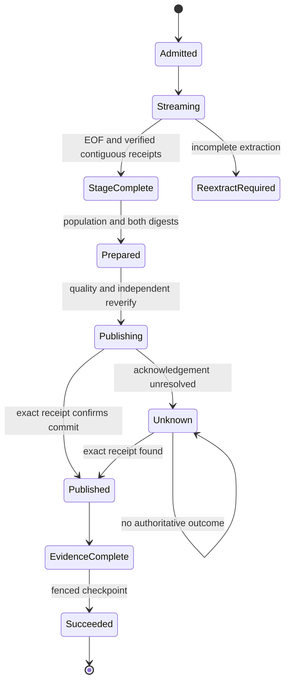

# Feature design: bounded native data-delivery acceleration

- Status: IMPLEMENTED
- Owner: delivery acceleration integrator (DDA-06)
- Issue: implementation tasks linked from the [execution plan](data-delivery-acceleration-tasks.md)
- Target release: TBD; no version bump or publication is part of this work
- Audited baseline: `d5ad9aaecc900c24df421b160ed36b4cfc726e45` (dpone 0.76.0)
- Authorization: on 2026-09-10 the maintainer explicitly requested a specification,
  independent tasks with DoD, and dispatch of those tasks for implementation.
  This records authorization for the bounded scope below, not a claim that the
  maintainer reviewed every subsequent line or authorized production activation.
- Last verified: 2026-09-11

Implementation status covers the bounded code and documentation scope below.
The [implementation closeout](https://github.com/PaulKov/dpone/blob/codex/dda-06-composition-integration/test_artifacts/delivery-acceleration/implementation-closeout/completion.md)
links the reviewed implementation, validation and integration PR. Live performance
remains UNVERIFIED; public native SWITCH activation remains outside this scope.
The original approved planning revision and historical evidence are retained.

Purpose: specify measurable, compatibility-preserving improvements to bounded
ClickHouse-to-MSSQL delivery. Audience: implementation engineers, platform owners,
reviewers and operators. Start with the [native transport guide](mssql-native-transport.md);
use the [task plan](data-delivery-acceleration-tasks.md) for work ownership.

## Executive summary

Reduce repeated preparation work while preserving native bytes, typed integrity,
bounded resources and atomic publication. Ship three internal improvements:
phase observations and reproducible measurement, one prepared-row scan producing
both existing digests, and reuse of the producer's already computed frame size.
Prepare business values and authoritative metadata with one INSERT when eligible.

Develop a separate, initially unregistered SQL Server SWITCH component and a
real-row certification harness. Existing public rejection of uncertified native
SWITCH remains in force. This distinction is a deliverable, not an unfinished
attempt to silently enable SWITCH.

Static tracing found four raw-stage typed readbacks and three prepared-stage
typed readbacks on a fresh successful baseline run. The approved reduction is
**four raw plus two prepared**. Other readbacks cross mutation/recovery boundaries
and remain mandatory. This inventory is not a measured latency result.

## Personas and customer journey

| Persona | Goal | Current pain | Success signal |
|---|---|---|---|
| Data engineer | Deliver an explicit window or complete snapshot | Cannot attribute elapsed time to preparation, transport or publication | A report identifies measured work and retained correctness evidence |
| Platform engineer | Tune bounded resource use | Configured workers obscure actual overlap and SQL limits | Comparable runs disclose limits, actual concurrency and unavailable metrics |
| Operator | Recover a failed delivery | Optimizations can hide ownership and commit ambiguity | Existing state-based recovery remains valid |
| Maintainer | Integrate independent contributions | Several ideas touch the same semantic files | Disjoint writers, fixed interfaces and one integration owner |

1. Discover the current opt-in route and its limitations in the native guide.
2. Prepare the existing Python composition, approved disposable services, native
   BCP tools and explicit filesystem/SQL limits.
3. Inspect `dpone plan examples/native/clickhouse-to-mssql-native.yaml --format md`.
   This inspects a plan; a manifest alone does not supply `native_runtime_factory`.
4. Run the existing composed route. Defaults and invocation semantics remain.
5. Optionally collect a versioned diagnostic sidecar; inspect total delivery
   time, phase work, retry cost and each metric's availability.
6. Diagnose the largest measured stage before changing chunk or worker settings.
7. Recover from the existing journal/target receipt. A performance report cannot
   authorize a checkpoint, cleanup or another publication.
8. Compare baseline/candidate on a frozen workload and layout; record limits and
   limitations alongside any result.
9. Upgrade without changing manifest, wire, journal or recovery versions.

## Scope

### In scope

- Optional injected observations and an offline benchmark comparison producer.
- One-pass business/full prepared digests with unchanged digest algorithms.
- Metadata projection in prepared INSERT through existing canonical expressions.
- A private sized-frame iterator preserving the existing tuple iterator API.
- Isolated SWITCH catalog admission, planning and transaction-bound SQL execution.
- Real-row test/benchmark tooling, honest absence reporting and an operations guide.
- Integration, regression checks and independent review.

### Non-goals

- CDC, dirty-window detection, projection/custom-query admission, source query
  parallelism, or changing the single-query snapshot/re-extraction contract.
- Arrow, Rust/C++, a new bulk protocol, direct memory/FIFO BCP, shared-memory IPC,
  automatic concurrency control or changing default chunk/worker limits.
- Removing raw lifecycle inspections, prepublication verification, evidence,
  fsync, ownership/fencing checks or transaction-clock metadata updates.
- Enabling public native SWITCH, creating production partition layouts, changing
  recovery models/index policies, dropping caller-owned objects, or release work.
- Generalizing every connector or advertising an unmeasured speed multiplier.

### Assumptions and constraints

The existing source remains a plain local MergeTree table in an Atomic database,
with all ordinary columns and a single acquired query. Only full refresh and
explicit UTC half-open partition replacement are admitted. Runtime composition
and current target governance remain prerequisites.

Read the actual task checkout before editing. All implementation branches must
contain the audited baseline and preserve later master changes. Do not reset,
force-push, reuse another writer's worktree or rewrite earlier release history.

## Public contract

### CLI and manifest

No production CLI flags, command defaults, exit codes, stdout/stderr behavior,
manifest fields, capability registration or generated schema changes in this
increment. Existing `native_mode=required`/native-hint rejection remains before
I/O. Existing fallback behavior is unchanged.

The new developer tool is `tools/native_delivery_benchmark.py`. Its `compare`
subcommand accepts `--baseline`, `--candidate`, `--output`, and optional
`--overwrite`. Input/output paths are explicit. Without overwrite, an existing
output is rejected. Exit 0 means a valid report was written, 1 means a measured
acceptance gate failed, and 2 means usage, schema, identity or file-output failure.
A written SKIP/UNVERIFIED report is not a performance PASS. Diagnostics go to
stderr; stdout contains the report path and status, not dataset values.

### Python interfaces and integration seams

The following feature-local names are frozen handoff interfaces. Implementation
details may stay private; changing these signatures requires integrator review.

| Owner | Interface | Contract |
|---|---|---|
| DDA-01 | `NativeDeliveryObservation`, `NativeDeliveryObserver.record(observation)` | Immutable observation and injected sink; models in contracts, protocol in ports |
| DDA-02 | `digest_prepared_rows(rows, *, business_contract, full_contract, max_row_bytes, expected_rows)` | Consume one mapping iterator; return `PreparedDigests(business_digest, full_digest, rows)` |
| DDA-02 | `build_prepared_insert(*, target_sql, source_sql, business_schema, resolved, lineage, quote_identifier)` | Return an explicit ordered INSERT SELECT using canonical metadata expressions; identifiers come from validated ownership |
| DDA-03 | `SizedNativeFrame(rows, encoded_bytes)`, `sized_native_frames(rows, contract, limits, check=None, ipc_overhead=0)` | Frozen frame and private streaming iterator; size is an in-memory reservation, not evidence |
| DDA-04 | `plan_native_switch(snapshot, *, interval, owner_binding)` | Pure eligibility result with a frozen plan or stable ineligibility reasons |
| DDA-04 | `execute_native_switch(plan, *, transaction)` | Execute only inside the existing transaction authority; never begin, commit, rollback or create a receipt itself |

DDA-01 adds a keyword-only optional observer at composition seams through DDA-06.
Omission is a no-op. Observers must not own clients, decide admission, mutate
journal state or change data acceptance. Existing exported APIs remain callable.

DDA-04's snapshot, result and transaction protocol are feature-local contracts.
Its catalog adapter is the only SQL catalog producer; arbitrary user dictionaries
are not deployment authority. These components have no public registration.

### Artifacts and evidence

Existing files, receipts, digest versions and journal/recovery schemas remain.
Observations use a separate `native-delivery-observations-v1.json` sidecar.
The report envelope contains schema version, exact code SHA and dirty-state flag,
dependency/server/tool versions, sanitized environment fingerprint, workload and
configuration digests, baseline/candidate identities, raw sample references,
correctness results, limits and measurement statuses.

An observation contains phase, reason (when a phase has multiple boundaries),
process/worker and clock-domain identity, optional ordinal/attempt, start/end
monotonic values, outcome, row/byte counters, and explicitly optional resources.
No source values, SQL text, credentials or connection URLs are recorded.

Phases: source_read, source_adapt, frame_build, ipc_submit, encode, bcp,
raw_verify, prepare_insert, metadata_project, prepared_verify, quality, publish,
evidence, checkpoint. Reasons distinguish import, immediate inspection,
preparation and prepublication raw verification. Retries remain separate attempts.

Metric availability is explicit: absent measurements are null with a reason,
never zero. Configured workers are not observed overlap. Clocks from different
domains must not be subtracted or merged into an overlap claim. Total delivery
duration is separately measured from source acquisition to confirmed commit with
a successful target visibility probe in live measurement; pipeline completion
through evidence/checkpoint is a separate duration.

Reports are UTF-8, producer-generated and atomically replaced using a temporary
file in the destination directory. Partial reports retain failure/absence status.
Existing result files require explicit overwrite. Report hashes detect accidental
changes; they do not turn self-authored JSON into live certification authority.

### Frozen diagnostic schema

The frozen v1 producer/consumer field contract is:

| Record | Required fields and types |
|---|---|
| Observation | `schema_version: 1`, `phase: str` from the phase list, `reason: str or null`, `clock_domain: str`, `process_id: int`, `worker_id: str`, `ordinal: int or null`, `attempt_id: str or null`, `start_monotonic_ns: int`, `end_monotonic_ns: int`, `outcome: completed/failed/cancelled`, `rows: int or null`, `encoded_bytes: int or null`, `metrics: mapping[str, metric]` |
| Metric | `value: finite number or null`, `unit: str`, `availability: measured/unavailable`, `reason: str or null`, `provenance: str`; unavailable requires null value and a reason |
| Run envelope | `schema_version: 1`, `kind: native-delivery-run`, `producer`, `subject`, `route`, `workload`, `configuration`, `environment`, `samples`, `fidelity_receipt`, `recovery_receipt`, `status`, `limitations` |
| Producer | `name: str`, `version: str`, `commit: full Git SHA`, `dirty: bool` |
| Subject | `commit: full Git SHA`, `dirty: bool`; identifies the dpone checkout actually executed, distinct from the harness producer |
| Route | `source: clickhouse`, `sink: mssql`, `strategy: full_refresh/partition_replace`, `mode: bounded_native/isolated_switch` |
| Workload | `id: str`, `seed: int`, `rows: nonnegative int`, `columns: positive int`, `sha256: hex digest of the canonical dataset description/content authority` |
| Configuration | `sha256: hex digest`, `limits: mapping` containing the exact existing NativeChunkLimits fields/values |
| Environment | `sha256: hex digest`, `versions: mapping[str, str]`, `target_layout_sha256: hex digest`, `resource_profile: mapping`; no secrets or connection URLs |
| Sample | `id: str`, `is_warmup: bool`, `status: PASS/FAIL/SKIP/UNVERIFIED`, `reason: str or null`, `visibility_seconds: metric`, `pipeline_seconds: metric`, `correctness: artifact reference`, `observations: artifact reference or null`, `metrics: mapping[str, metric]` |
| Artifact reference | `path: str` relative to the envelope directory, `sha256: hex digest`, `status: PASS/FAIL/SKIP/UNVERIFIED`; validate retained bytes rather than trusting a supplied PASS |
| Correctness receipt | `schema_version: 1`, `kind: native-delivery-correctness`, `subject_commit: full Git SHA`, `workload_sha256: hex digest`, `configuration_sha256: hex digest`, `environment_sha256: hex digest`, `sample_id: str`, `route: route record`, `scope: sample/type_fidelity/failure_recovery`, `execution: hermetic/live`, `fixture: mapping with id, rows and sha256`, `checks: list[correctness check]`, `status: PASS/FAIL/SKIP/UNVERIFIED` |
| Correctness check | `id: str` from the required-check rules below, `status: PASS/FAIL/SKIP/UNVERIFIED/N/A`, `method: exact_typed_multiset/versioned_typed_digest/transaction_fixture/live_observation/not_applicable`, `reason: str or null`, `expected: JSON value`, `observed: JSON value`, `evidence: artifact reference or null`; non-PASS requires a reason |
| Envelope status | PASS/FAIL/SKIP/UNVERIFIED; `limitations` is a list of explicit strings |

Hashes use SHA-256. Canonical JSON uses sorted keys, compact separators, UTF-8
and rejects non-finite numbers. The dataset hash binds its ordered schema,
deterministic generator/version/seed and content authority; comparison also
requires equal workload identity. Resolve artifact paths beneath the envelope
directory and reject traversal/symlink escape or overwritten artifacts.

Every sample receipt must bind its envelope/sample identity and execute
`typed_content`, `duplicate_multiplicity`, `metadata_parity` and
`commit_receipt_binding`. Partition replacement also requires
`outside_window_unchanged`; full refresh marks that check N/A with a reason.
N/A is accepted only for explicitly inapplicable checks. Missing, skipped or
failed required checks cannot authorize a successful comparison.

Each workload profile additionally supplies a `type_fidelity` receipt using an
exact typed multiset on its deterministic small fixture and a `failure_recovery`
receipt for `empty_input`, `rollback`, `receipt_first_recovery` and
`source_free_resume`. Those profile receipts are referenced by the run envelope's
required `fidelity_receipt` and `recovery_receipt` fields. They bind the same
subject, configuration and workload description; `sample_id` identifies the
profile fixture rather than a timed sample; `fixture` records that fixture's
actual row count/content hash separately from the parent workload identity.
Normal timed samples may use the
existing versioned typed digest for scalable content checks only when the exact
profile fidelity receipt passes; retain its probabilistic limitation. Profile
failure tests and post-run content comparison are outside the timed delivery span.
Unit-generated receipts establish producer contract coverage, not live authority;
live comparison requires live-observation evidence from the real-row producer.

A comparison report uses `schema_version: 1`, `kind: native-delivery-comparison`,
baseline/candidate envelope references, per-workload sample counts/medians/ratios,
thresholds, structural checks, status and limitations. Missing required timing,
fidelity or identity makes a performance result UNVERIFIED. Optional SQL/resource
metrics may remain unavailable with a reason and limit only claims using them.

For multiple workloads, `compare` accepts a v1 campaign file with
`schema_version: 1`, `kind: native-delivery-campaign`, `workloads: list[str]` (the predeclared IDs),
`runs: list[artifact reference]`, and `limitations: list[str]`. Both sides must
contain the same predeclared workload/configuration cases. A single run envelope
is also accepted, but its result is explicitly limited to that one workload.
The campaign gate requires at least one declared median ratio <=0.85 and every
declared median ratio <=1.05; an omitted case is UNVERIFIED, not a smaller campaign.

This table is shared by DDA-01 and DDA-05 before either implementation exists.
Each task keeps a local hermetic fixture of it; DDA-06 runs their producer and
consumer together. Do not resolve schema disagreements by silently coercing data.

### Compatibility and migration

Existing Mapping rows, tuple frames, encoder bytes, digests, chunk boundaries,
load-result units, state ordering and public errors remain compatible. Preserve
direct BCP consumers that still need metadata UPDATE. No migration is required.
Consumers of new sidecars use their explicit schema version; unknown major
versions are rejected. Old journals work without sidecars.

## Detailed algorithm

### 1. Admission and optional observation

Reuse current source, target, type, capacity, transaction and fencing admission.
Construct a no-op observer by default. With an observer, time bounded phases and
record failed/cancelled attempts as work. Collect resource metrics only from
explicitly available providers. Do not add per-row logging or new count queries
solely to populate telemetry.

Observer errors cannot change business success or mask the original exception.
A benchmark observer records a diagnostic collection failure through its own
result channel; the comparison producer then returns UNVERIFIED. Runtime success
is still governed by existing receipts/evidence, not this diagnostic channel.

### 2. Source and sized frames

Keep one source query and the existing Mapping/transformation boundary.
Freeze mutable driver buffers before sizing. The frame builder retains all
current row/native-byte/IPC/row-count checks and yields rows plus their already
computed native byte sum. The compatibility iterator yields only the rows.

DDA-06 changes the scheduler to reserve cumulative native bytes from the frozen
frame. Keep exact aggregate frame and submitted-task pickle size checks; the
size cache does not authorize dropping either check. Workers receive the same
row tuple, validate/encode every value, fsync and seal the same exclusive file.
Check actual encoded bytes against the reservation before successful acceptance.
Resume continues to use retained file bytes and existing durable receipts.

### 3. Prepared population

Retain complete EOF, contiguous receipts, current ownership, capacity and
preparation scope requirements. Build a duplicate-preserving typed UNION ALL
derived source from the same validated raw stages.

Use `MssqlNativeLineageProjection.expressions` and the existing canonical
`row_hash_expression` over that source. INSERT explicitly named business and
framework columns into the existing prepared stage in one statement. Preserve
generated NULL placeholders, key semantics, collations, precision and the
lifecycle-derived loaded_at placeholder.

Refactor the normalizer into private projection and validation/evidence operations.
Its existing public normalization path still calls both. The bounded preparer
calls the common validation/evidence operation only after executing its own
authoritative INSERT. Do not add a manifest/options Boolean or caller-provided
claim that metadata is already valid. Key checks, row counts, type checks and
terminal evidence are still executed.

The transaction finalizer's loaded_at UPDATE remains mandatory: it supplies the
authoritative target clock inside the transaction. It is distinct from the
preparation UPDATE removed here.

### 4. Prepared digests

Build the same business and full contracts. Select full prepared columns once.
For every row, enforce the current metadata/null and finite byte allowances;
independently encode the business projection and all-column projection using
their existing encoders. Maintain two constant-space SHA-256 multiset sums and
the row count.

Validate expected count and compare business digest against aggregated raw
receipt evidence. Store full digest in the unchanged recovery snapshot field.
On prepublication reverify, perform the independent full scan and the existing
raw receipt inspections. Preserve object-id, owner, schema, capacity and lease
checks. SQL applocks are not proof that arbitrary DML cannot change a table.

### 5. Publication and recovery

Production still uses the existing SERIALIZABLE finalizer and predicate/full
refresh publication. Quality precedes publication. Target mutation and its exact
receipt commit atomically; durable evidence precedes checkpoint advancement.

Before EOF failure, settle owned workers and require a new full source query.
After stage completion, restore without reopening ClickHouse. After publication
intent, resolve the target receipt first. Confirmed publication only completes
evidence/state; unknown commit blocks replay and retains recoverable resources.
Cancellation, retry classification, backoff and cleanup authority remain unchanged.

### 6. Isolated SWITCH component

This component is implemented for review and real-row tests but is **not wired
into normal runtime admission** by this increment.

Initial eligibility is deliberately finite: one existing, fully covered temporal
RANGE RIGHT partition with two finite boundaries, same database, identical
partitioning/index/storage shape, and explicit invocation-owned prepared and
empty switch-out tables. No cross-database, multi-partition, partial-boundary or
unbounded-first/last partition support. Source emptiness does not change the plan.

The catalog adapter qualifies all observations by database/schema/object identity.
The plan binds the authored interval, partition boundary values and number,
object/schema/index/constraint/storage fingerprints, owner generation and target
mutation identity. Reject unknown metadata, nonempty switch-out, rows outside the
authored prepared window, or unsupported features (including temporal/history,
CDC/replication dependencies, indexed views, foreign-key dependencies and layouts
not proven by the v1 adapter). Require explicit supported SQL Server metadata;
absence is ineligibility, not an assumption of compatibility.

Under the existing target transaction fence, re-read catalog/owner/layout
bindings and switch-out emptiness, count replaced **rows**, switch the target
partition out, then switch the prepared partition in. The caller writes the
existing receipt in the same transaction and retains transaction ownership.

The executor never falls back after the first SWITCH. Errors propagate to the
finalizer for complete rollback. A future auto mode may fall back only before
mutation; required mode must fail when ineligible. Neither mode is activated here.

Successful SWITCH empties the prepared partition. Receipt-first recovery must
therefore precede any attempt to inspect its former content. The isolated
executor never drops tables or cleans switch-out contents. Test-owned resources
are removed only after known transaction outcome by the approved fixture owner.
No existing caller-owned table is accepted as an owned disposable switch-out.

Activation requires a follow-up contract with aligned-stage provisioning,
ownership/retention, public admission changes and exact-environment live proof.
The current hard rejection remains a regression test.

### Pseudocode

```text
admit_existing_contract()
observer = injected_observer_or_noop()
for sized_frame in one_source_query():
    reserve(sized_frame.encoded_bytes)
    check_exact_frame_and_task_IPC_limits()
    encode_and_import_with_existing_receipt_checks(sized_frame.rows)
complete_only_after_EOF_and_contiguous_receipts()
with owned_preparation_scope():
    verify_raw_receipts()
    insert_business_and_canonical_metadata_with_UNION_ALL()
    validate_keys_counts_and_terminal_evidence()
    business_digest, full_digest = digest_one_prepared_iterator()
    verify_business_digest_and_persist_existing_prepared_snapshot()
run_quality()
with existing_publication_scope_and_transaction():
    reverify_raw_and_prepared_content()
    publish_using_existing_handler_and_commit_exact_receipt()
persist_evidence()
advance_checkpoint()
cleanup_only_owned_resources()
```

### State machine



### Edge cases

| Case | Required behavior |
|---|---|
| Empty input | Preserve the existing empty chunk/EOF contract; an empty authored window removes old in-window rows only |
| NULL, empty text, binary, duplicates | Exact existing typed semantics and duplicate multiplicity |
| Invalid UTF-8, unsupported type, overflow | Existing fail-closed classification; no silent conversion |
| Mutable reused driver buffers | Freeze before sizing; later mutation cannot change reserved rows |
| Missing or altered raw/prepared stage | Existing verification fails before target publication |
| Metadata tamper | Independent full prepublication digest still detects the change |
| Source/worker failure or cancellation | Close source, settle workers; no partial successful publication |
| Lost commit acknowledgement | Probe exact receipt; no second mutation while outcome is unknown |
| Missing observation or live environment | Explicit SKIP/UNVERIFIED; never zero work or a performance PASS |
| SWITCH catalog drift or half-completed switch | Reject before mutation or roll back the whole transaction |

## Architecture

| Component | Existing/new | Responsibility | Dependencies |
|---|---|---|---|
| Native runtime/finalizer/journal | Existing | Ownership, ordering, transaction and recovery | Existing injected services |
| Observation models/port | New | Versioned diagnostic values and a narrow sink | Standard library/contracts |
| Observation collector/comparison | New | Bounded aggregation and truthful comparison | Contracts/ports; no vendor I/O at import |
| Prepared digest/INSERT helpers | New | One-pass integrity and canonical SQL projection | Existing encoders/lineage policies |
| Sized frame iterator | New internal seam | Retain an already computed size | Existing limits and encoder |
| SWITCH planner/catalog/executor | New, unregistered | Finite physical partition admission and transactional SQL | Feature-local contracts and injected target access |
| Live harness | New tools/tests | Disposable real-row fixtures and measured evidence | Existing route composition; explicit opt-in |
| Integrator | Existing process | Reconcile shared wiring, docs and evidence | Completed task handoffs |

No new generic registry or plugin framework. Contracts/ports do not import
runtime or vendor SDKs. Runtime helpers use canonical packages. Existing aliases
remain adapters. Reuse lineage expressions across INSERT and UPDATE rather than
duplicating business hashing. Preserve both Mapping/sequence frame consumers and
lineage-enabled/disabled preparation as realistic variation points.

### Alternatives and tradeoffs

| Alternative | Benefit | Cost/risk | Decision |
|---|---|---|---|
| Cache every raw verification receipt | Fewer scans | No immutable-table authority across boundaries | Reject in this increment |
| SQL CHECKSUM instead of typed digest | Less Python work | Different content/type/collision contract | Reject |
| Arrow/Rust encoder | Potential CPU savings | New dependency/type/lifetime surface; no profile yet | Defer |
| Larger chunks/more workers by default | Fewer starts/more overlap | Higher memory/log pressure; workload dependent | Measure, retain defaults |
| Direct call to old SWITCH mixin | Less new code | Wrong empty-window authority and incomplete admission | Reject |
| Prepared metadata INSERT | One fewer SQL pass | Must reuse exact lifecycle/hash rules | Adopt with parity tests |

### ADR and quality budgets

No ADR is needed for byte-compatible sizing/digest/projection refactors.
DDA-06 creates a new ADR for the isolated SWITCH architecture and activation
boundary, selecting the next unused number at integration time to avoid parallel
number collisions. The decision above is the approved implementation contract.

Use [quality budgets](benchmarks/quality_budgets.yml) and the existing import,
layer and module-size tools. No baseline/budget weakening. Split observation,
digest, SQL projection and catalog responsibilities into cohesive modules; do not
grow the prepared coordinator into a second implementation of these policies.

## Market comparison

Official sources checked 2026-09-10. Rolling documentation has no inferred
installed product version. Observations are source-backed facts; adoption and
scope decisions are dpone design judgments. No cross-product benchmark was run.

| System/version context | Observed design and strength | Relevant limitation | Adopt / reject | Official source |
|---|---|---|---|---|
| dlt, rolling docs | Per-stage workers, buffers and file rotation control parallel work | Tuning depends on resource bottlenecks | Adopt bounded stage measurements; reject blindly raising workers | [Performance](https://dlthub.com/docs/reference/performance) |
| Informatica Cloud Data Integration, SQL Server connector docs | Eligible SQL ELT pushes transformations into the database | Connector/expression eligibility matters | Adopt canonical SQL projection; defer new source pushdown contracts | [SQL Server connector](https://docs.informatica.com/content/dam/source/GUID-0/GUID-0EFA0C0A-79B2-41B9-8CC1-34540DA06CFF/51/en/__Microsoft%28SQL%29ServerConnector_en.pdf) |
| Airbyte, rolling platform docs | Initial snapshot and log-based incremental CDC capture changes | CDC syncs can remain scheduled; connector limits apply | Record future volume-reduction direction; defer CDC in this scope | [CDC](https://docs.airbyte.com/platform/understanding-airbyte/cdc) |
| Fivetran, hosted SQL Server connector | Initial synchronization followed by supported incremental mechanisms | Source authority and selected method constrain behavior | Adopt snapshot/delta separation as future work; reject treating it as a current CH capability | [SQL Server](https://fivetran.com/docs/connectors/databases/sql-server) |
| Pentaho PDI, version 9.3 performance guide | Step tuning and reduced object/conversion overhead improve execution efficiency | This versioned guide is not a current-version throughput guarantee | Adopt avoiding repeated work; reject universal tuning numbers | [Performance tips](https://docs.pentaho.com/pdia-admin/9.3-administer/optimize-the-pentaho-system/performance-tuning/pentaho-data-integration-performance-tips) |
| Microsoft SSIS, SQL Server 17.x docs | Synchronous components can reuse buffers; buffer/concurrency tuning is explicit | Asynchronous boundaries and memory pressure change costs | Adopt bounded buffer reuse and phase diagnostics | [Buffer allocation](https://learn.microsoft.com/en-us/sql/integration-services/extending-packages-custom-objects/data-flow/execution-plan-and-buffer-allocation?view=sql-server-ver17) |
| gusty | N/A: DAG authoring is outside this transport/preparation increment | No scheduler change is proposed | No comparison claim | N/A |
| Astronomer Cosmos | N/A: dbt/Airflow orchestration is outside this increment | No DAG/dbt execution change is proposed | No comparison claim | N/A |
| Apache Beam, rolling Dataflow runner docs | Runner-supported autoscaling and dynamic work rebalancing | Requires splittable work; current query snapshot cannot be reopened arbitrarily | Adopt measured work accounting; defer distributed splitting | [Dataflow runner](https://beam.apache.org/documentation/runners/dataflow/) |

Additional substrate references: [ClickHouse Arrow/block streams](https://clickhouse.com/docs/integrations/language-clients/python/advanced-querying)
support a future columnar evaluation, not end-to-end zero-copy to MSSQL.
[SQL Server columnstore loading](https://learn.microsoft.com/en-us/sql/relational-databases/indexes/columnstore-indexes-data-loading-guidance?view=sql-server-ver17)
and [ALTER TABLE SWITCH](https://learn.microsoft.com/en-us/sql/t-sql/statements/alter-table-transact-sql?view=sql-server-ver17)
justify target-aware experiments. Columnstore bulk rowgroup thresholds apply to
actual target ingestion, not automatically to a transport chunk. TABLOCK behavior
differs between concurrent direct bulk imports and one INSERT SELECT transaction.

## Measurable differentiation

```yaml
axis: less preparation and producer work with unchanged delivery correctness
scenario: bounded native full refresh and explicit UTC window replacement
baseline: d5ad9aaecc900c24df421b160ed36b4cfc726e45
metric:
  structural: prepared readback passes, metadata UPDATE count, repeated sizing calls
  measured: end-to-end visible-delivery seconds, phase work, RSS, bytes, SQL log work
target:
  prepared_readbacks_fresh_run: 2
  raw_readbacks_fresh_run: 4
  preparation_metadata_updates: 0
  repeated_scheduler_sizing_passes: 0
  fidelity_failures: 0
  partial_publications: 0
  candidate_median_on_one_predeclared_workload: "<= 0.85 * baseline"
  candidate_median_on_every_declared_workload: "<= 1.05 * baseline"
procedure: same approved environment and workload; one warmup plus at least three trials
artifact: test_artifacts/delivery-acceleration/measurement/comparison.json
limitations: targets are not observed results; three samples do not establish p95
```

Predeclare narrow, wide/200-column, Unicode/Decimal/NULL/binary and skewed-row
profiles with deterministic seeds. Small exact-multiset datasets prove fidelity;
larger datasets measure throughput only after correctness passes. Compare the same
physical target indexes/partitioning and resource caps. Record execution order.

The harness can evaluate configured chunk bytes and worker counts (for example
16/64 MiB and 1/2/4 workers where valid). These are experiment candidates, not new
defaults or authorization to exceed memory, staging or log limits.

A structural PASS is merge evidence for the optimization. Performance
certification additionally requires actual eligible baseline/candidate samples.
Missing samples, dirty unidentified sources, workload/layout drift or failed
correctness produce UNVERIFIED/FAIL, never a fabricated speed result.

## Security, privacy and operations

Use synthetic data only in benchmarks; redact connection and dataset contents.
Credentials come from the existing explicitly approved environment. Do not run
live profiles, create containers or modify shared databases just because a
benchmark tool exists. SQL catalogs, table ownership and database identity remain
authoritative inputs; display errors with reason codes and recovery actions.

Track committed visibility separately from pipeline completion, failed work and
retry cost. Process RSS must identify the process set and sampling method;
a parent-only number is not aggregate pipeline RSS. SQL observations distinguish
measured allocation/log work from configured ceilings and stop thresholds.
Never alter recovery model, disable quality, remove indexes or suppress errors
to reach a benchmark target.

## Test and certification plan

| Layer | Required proof | Environment | Artifact |
|---|---|---|---|
| Unit | One-shot dual digests, projection parity, sizing reuse, clock/absence handling, pure SWITCH eligibility | Hermetic | DDA task test logs |
| Contract | Exact native bytes/digests/errors, Mapping/tuple compatibility, old journals/manifests, unsupported SWITCH gate | Hermetic | Focused regression logs |
| Integration | Real spawned workers with fake target; actual finalizer with transaction fixtures; retries/tampering/cancellation | Local, no live SQL | DDA-06 integration report |
| Live correctness | Real CH query, native BCP, target multisets, empty/outside-window behavior and recovery | Explicitly approved disposable environment | DDA-05 producer receipt; otherwise SKIP |
| SWITCH component | Eligible layout, drift, rollback between switches, lost ACK, receipt-first recovery | Synthetic transaction tests plus approved real SQL | Isolated component evidence, not public route certification |
| Performance | Frozen baseline/candidate/environment/config; warmup and >=3 successful trials | Approved benchmark environment | Raw samples and comparison.json |
| Documentation | Valid commands, examples, navigation, recovery journey and honest limitations | Local strict docs build | DDA-06 docs results |

Do not place elapsed-time thresholds in normal unit tests. Use poison second
iterators, call counters, exact golden results and synchronization barriers.
Cover integer/Decimal/temporal boundaries, duplicate multiplicity, nullable
metadata, reused bytearray/memoryview, N/N+1 limits, pre/post-EOF failure,
lease loss, target receipt mismatch and catalog changes.

## Documentation plan

DDA-01 through DDA-05 each own a focused feature explanation in
`docs/delivery-acceleration/`. DDA-06 supplies an overview/runbook, connects
navigation and current native docs, updates the architectural explanation/ADR
and adds an Unreleased changelog entry. Do not change 0.75.0 or 0.76.0 history.

Documentation must distinguish shipped default behavior, optional diagnostics,
unregistered SWITCH components and unavailable live evidence. Existing native
limitations remain visible. Each new tool example is executable or parser-tested;
its output status, paths, overwrite behavior and next recovery action are stated.

## Rollout and rollback

1. Land the specification/contracts through their own PR.
2. Develop DDA-01..05 independently against the fixed interfaces.
3. DDA-06 integrates reviewed contributions on an isolated branch preserving
   current master. Enable only the approved internal optimizations and optional
   diagnostic seams; keep public SWITCH rejection.
4. Run required focused and broad checks and a fresh-context independent review.
5. Collect live/performance proof only when its environment is explicitly approved.
   Code readiness may be PASS while live performance remains UNVERIFIED.
6. If parity, memory limits, recovery or measured performance regress, fix or
   revert the responsible isolated change through a normal commit. No reset,
   history rewrite or journal migration. No release is authorized here.

## Agent execution plan

The [task plan](data-delivery-acceleration-tasks.md) and its six machine-validated
contracts are authoritative for paths and DoD. DDA-06 is the sole integrator and
shared-file owner. DDA-01..05 own disjoint feature modules/tests/docs. Existing
coordinators, normalization wiring, factories, shared fixtures, navigation,
schemas, changelog and ADR indexes remain with DDA-06.

DDA-01..05 have no implementation dependency on each other's unfinished branches;
they use the frozen contracts and local test doubles. DDA-05 can build its
harness immediately; candidate execution waits for integration. DDA-06 can map
seams early but starts dependent edits only after reviewed handoffs.

## Approval checklist

- [x] User problem, current baseline and customer journey recorded.
- [x] Algorithms, state/recovery invariants and compatibility boundaries fixed.
- [x] Independent architecture, test and docs/UX analysis reconciled.
- [x] Current official market sources and N/A boundaries recorded.
- [x] Structural and live performance acceptance are separate and measurable.
- [x] Shared-file ownership, task DoD and integration dependencies are explicit.
- [x] Maintainer authorized specification and implementation dispatch in this task.
- [x] Implementation complete and [exact-head validation linked](https://github.com/PaulKov/dpone/blob/codex/dda-06-composition-integration/test_artifacts/delivery-acceleration/implementation-closeout/completion.md).
- [ ] Real-row performance evidence available; currently UNVERIFIED.
