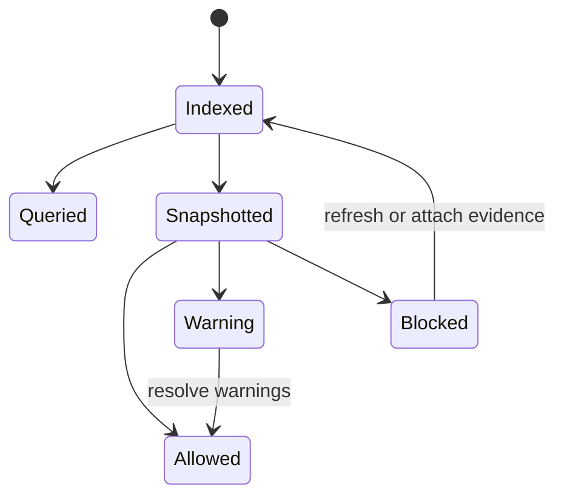
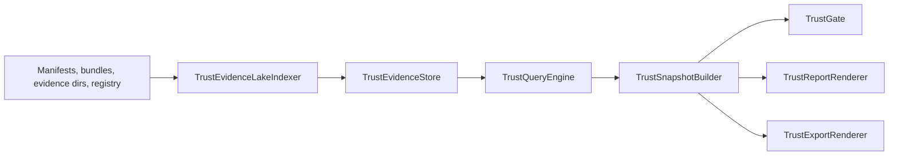

# Feature design: Data Product Trust Center, Evidence Lake, and Query API

- Status: APPROVED
- Owner: dpone maintainers
- Issue: Codex thread request, 2026-07-12
- Target release: v0.70.0, or next free minor if occupied before approval
Last verified: 2026-07-12

## Executive summary

dpone already produces many release and governance artifacts: schema contract
gates, consumer lineage, assertions, SLOs, error budgets, authority, compliance,
audit retention, access governance, connection posture, cost guardrails, and
progressive delivery receipts. The next industrial gap is a self-service Trust
Center that answers, from one queryable evidence plane:

- what evidence proves this data product is safe to release;
- which product, owner, pack, contract, consumer, policy, and gate each artifact
  belongs to;
- whether evidence is fresh, signed, complete, waived, blocked, or missing;
- which action is needed before a production or regulated release can proceed.

This design adds an opt-in offline Trust Center, Evidence Lake, and Query API.
V1 indexes local manifests, bundles, evidence directories, and the existing
evidence registry. It produces deterministic JSON/Markdown artifacts and local
interop payloads only. It does not run a server, mutate targets, publish to
external catalogs, call SCM/catalog/SIEM APIs, or replace existing producers.

The measurable outcome is that a release reviewer can ask one command for the
trust state of a data product and get an evidence matrix, freshness result,
profile-aware gate, and drill-down artifact references without manually reading
dozens of files.

## Personas and customer journey

| Persona | Goal | Current pain | Success signal |
|---|---|---|---|
| Data product owner | Prove a product is safe to release. | Evidence is distributed across schema, SLO, policy, compliance, access, and cost folders. | `dpone data product trust snapshot` shows complete, fresh, owner-routed evidence. |
| Platform release manager | Decide whether a production release should proceed. | Gates are correct but fragmented by domain. | `dpone data product trust gate --profile prod_strict` fails closed with actionable blockers. |
| Compliance reviewer | Inspect regulated evidence and waivers. | Audit packages exist but require manual cross-checking with registry and signatures. | Trust report lists required controls, signatures, waivers, expiries, and source digests. |
| Operator | Diagnose why a release is blocked. | The user must know which artifact kind to inspect first. | Trust query filters by product, domain, status, owner, and freshness. |
| Catalog integrator | Export status to another system. | Governance export has domain payloads, but not one normalized trust snapshot. | Trust export renders DataHub/OpenLineage/OPA/JSON-compatible local payloads. |

Journey: the user enables `data_product.trust_center`, runs `lake index` in CI,
queries the index during review, renders a product snapshot, gates the release,
exports a local payload, records the gate in the registry, and attaches the
Markdown report to release evidence. If a blocker appears, the report routes the
next action to the domain owner: fix the underlying artifact, refresh stale
evidence, attach authority, or request a bounded waiver through existing policy
flows.

## Scope

### In scope

- Offline/local Evidence Lake index over manifests, bundles, registry records,
  and existing dpone evidence artifacts.
- Query API exposed through CLI and a thin Python service facade.
- Product Trust Snapshot with freshness, completeness, status, owner routing,
  blockers, warnings, and deterministic trust score.
- Profile-aware Trust Gate for `advisory`, `stage`, `prod_strict`, and
  `regulated`.
- Markdown/JSON/table/text reports and local export payloads for
  `json`, `datahub`, `openlineage`, and `opa`.
- Bundle, registry, governance export, compliance, fleet, and release-closeout
  integration points.
- JSON schemas, manifest schema, docs, CLI reference, examples, and tests.

### Non-goals

- No hosted web UI or long-running API server in V1.
- No external catalog, SCM, Slack, Jira, SIEM, OpenTelemetry collector, or OPA
  server writes.
- No DB/client SDK imports in provider-neutral readiness modules.
- No target mutation, warehouse queries, scheduler mutation, or traffic routing.
- No legal claim that a framework is satisfied; dpone validates evidence
  completeness and status against configured controls.

### Assumptions and constraints

- `v0.67.0` is already occupied; this feature targets `v0.70.0` from current
  `origin/master` after `v0.69.0`.
- Feature is additive and opt-in. Default `trust_center.enabled` is `false`.
- V1 trust evidence comes from files and the existing registry only.
- Existing artifact producers remain the source of truth. The Trust Center never
  hand-edits or manufactures passing evidence.
- Generic readiness code remains provider-neutral and under the project quality
  budgets: `max_sloc: 400`, `max_avg_clustering: 0.180`.
- PR #291 is out of scope and must not be edited by this work.

## Public contract

### CLI

New commands:

```bash
dpone data product trust lake index \
  --manifests "manifests/**/*.yaml" \
  --registry .dpone/schema-migration/registry.sqlite3 \
  --bundle-dir .dpone/schema-migration/review \
  --evidence-dir .dpone/data-products \
  --format json \
  --output .dpone/trust/evidence-lake-index.json

dpone data product trust query \
  --index .dpone/trust/evidence-lake-index.json \
  --product-id analytics.orders \
  --domain compliance \
  --status blocked \
  --format table

dpone data product trust snapshot \
  --index .dpone/trust/evidence-lake-index.json \
  --product-id analytics.orders \
  --profile prod_strict \
  --format json \
  --output .dpone/trust/orders.trust-snapshot.json

dpone data product trust gate \
  --snapshot .dpone/trust/orders.trust-snapshot.json \
  --profile regulated \
  --format json \
  --output .dpone/trust/orders.trust-gate.json

dpone data product trust report \
  --snapshot .dpone/trust/orders.trust-snapshot.json \
  --format md \
  --output .dpone/trust/orders.trust-report.md

dpone data product trust export \
  --snapshot .dpone/trust/orders.trust-snapshot.json \
  --target json \
  --format json \
  --output .dpone/trust/orders.trust-export.json
```

Format support:

- `lake index`: `json`, `text`, `table`
- `query`: `json`, `text`, `table`
- `snapshot`: `json`, `text`, `table`, `md`
- `gate`: `json`, `text`, `table`, `md`
- `report`: `md`, `json`, `text`
- `export`: `json`, `text` for text-compatible targets

Output rules:

- Console and `--output` payloads are identical except for terminal table
  formatting.
- File writes are atomic: write to a temporary path in the destination
  directory, then replace.
- Existing files are overwritten only when the command already owns the artifact
  path supplied by `--output`; otherwise users must choose a path explicitly.
- Exit code `0` means command execution succeeded. Gate artifacts carry
  `status: allowed|warning|blocked`. CLI returns non-zero for malformed inputs,
  unreadable files, unsupported formats, and schema errors.

### Python API

New provider-neutral service facade:

```python
from dpone.services.data_product_trust import DataProductTrustFacade
```

Facade methods mirror CLI operations:

- `index_lake(...) -> Mapping[str, Any]`
- `query(...) -> Mapping[str, Any]`
- `snapshot(...) -> Mapping[str, Any]`
- `gate(...) -> Mapping[str, Any]`
- `report(...) -> str | Mapping[str, Any]`
- `export(...) -> Mapping[str, Any]`

Domain logic lives under `dpone.readiness` and uses injected ports:

- `TrustEvidenceStore`
- `TrustEvidenceReader`
- `TrustExportRenderer`

No provider SDK, DB client, SCM, Airflow, catalog, or notification SDK may be
imported on `dpone --help` or generic service import paths.

### Manifest/schema

Manifest extension:

```yaml
sink:
  options:
    data_product:
      id: analytics.orders
      owner: data-platform
      tier: gold
      criticality: high

      trust_center:
        enabled: true
        mode: gate                  # observe | gate
        profile: prod_strict        # advisory | stage | prod_strict | regulated
        stale_evidence_policy: block # warn | block
        stale_after_seconds: 86400

        store:
          backend: local_json        # local_json | sqlite
          uri: .dpone/trust/evidence-lake-index.json

        required_domains:
          - contract
          - reliability
          - quality
          - governance
          - compliance
          - access
          - connection_security
          - cost
          - rollout

        include_artifacts:
          - schema_contract_gate
          - data_product_assertion_gate
          - data_product_slo_gate
          - data_product_error_budget_gate
          - data_product_policy_gate
          - data_product_authority_gate
          - data_product_compliance_gate
          - data_product_access_gate
          - data_product_connection_rotation_gate
          - data_product_cost_gate
          - data_product_ring_gate

        query:
          max_results: 500
          allow_unindexed_evidence: warn # allow | warn | block

        trust_score:
          enabled: true
          minimum:
            advisory: 0.0
            stage: 0.70
            prod_strict: 0.85
            regulated: 0.95
          weights:
            contract: 0.10
            reliability: 0.15
            quality: 0.15
            governance: 0.15
            compliance: 0.15
            access: 0.10
            connection_security: 0.05
            cost: 0.05
            rollout: 0.10
```

Old manifests are unchanged. Missing or disabled `trust_center` emits no-op
artifacts and never changes existing commands.

### Artifacts and evidence

New artifacts:

- `dpone.data_product_evidence_lake_index.v1`
- `dpone.data_product_trust_query_result.v1`
- `dpone.data_product_trust_snapshot.v1`
- `dpone.data_product_trust_gate.v1`
- `dpone.data_product_trust_report.v1`
- `dpone.data_product_trust_export.v1`

Common status vocabulary:

- Evidence refs: `passed`, `warning`, `blocked`, `waived`, `expired`,
  `stale`, `unknown`, `not_applicable`
- Snapshot domains: `healthy`, `degraded`, `blocked`, `missing`, `stale`,
  `not_applicable`
- Trust gate: `allowed`, `warning`, `blocked`

Every artifact includes:

- schema id and version;
- product id, owner, tier, criticality when known;
- source command and generated timestamp;
- deterministic artifact id;
- input refs and SHA-256 digests;
- blockers, warnings, and owner-routed actions.

### Bundle and registry integration

Bundle artifact kinds:

- `data_product_trust_gate`
- `data_product_trust_report`
- `data_product_trust_export`

Registry stages:

- `trust_lake_indexed`
- `trust_query_executed`
- `trust_snapshot_rendered`
- `trust_gate_passed`
- `trust_report_rendered`
- `trust_export_rendered`

`bundle gate` can require `data_product_trust_gate` for production and
regulated releases. Governance export and compliance audit packages can include
Trust Snapshot refs when present.

### Compatibility and migration

The feature is opt-in. No existing CLI behavior, manifest behavior, artifact
schema, registry stage, or bundle policy changes without new Trust Center flags
or artifacts. Rollback removes the new trust artifacts from bundle policy and
stops running `dpone data product trust ...`; underlying evidence producers
remain valid.

## Detailed algorithm

### Lake index algorithm

1. Expand manifest, bundle, and evidence glob inputs deterministically.
2. Load `trust_center` options from every manifest; disabled products are
   included only as no-op product refs when explicitly requested.
3. Read bundle files, registry records, and JSON/YAML evidence artifacts.
4. Validate known dpone artifact shapes by schema id and artifact kind.
5. Normalize each evidence item into:
   - `product_id`, `owner`, `tier`, `criticality`;
   - domain, artifact kind, schema version, status;
   - source path or registry ref;
   - generated/recorded timestamp;
   - digest, source command, pack id, bundle id, contract id when present;
   - blockers, warnings, waiver refs, signature refs, and authority refs.
6. Redact paths and metadata known to contain secrets; reject artifact payloads
   that include secret-looking keys when redaction policy requires it.
7. Deduplicate by `product_id + artifact_kind + digest + source_ref`; keep the
   newest registry record and all distinct payload digests.
8. Apply stale policy using manifest `stale_after_seconds`.
9. Persist local JSON index, or SQLite index through a stdlib-only store port.
10. Emit deterministic `evidence_lake_index_id`.

### Query algorithm

1. Read the index and validate query filters.
2. Apply filters: product id, owner, tier, criticality, domain, artifact kind,
   status, stage, waiver id, signature id, generated time, recorded time, and
   source path prefix.
3. Sort results by `product_id`, domain, artifact kind, recorded timestamp,
   source path, and evidence ref id.
4. Enforce `max_results`; emit a truncation warning when more refs match.
5. Emit stable `trust_query_result_id` from normalized filters and selected
   evidence refs.

### Snapshot algorithm

1. Read the index and select one product id.
2. Resolve required domains from manifest options and profile defaults.
3. For every domain, select the latest valid evidence for every configured
   artifact kind; keep older refs as history.
4. Compute domain status:
   - `healthy`: required evidence is present, fresh, and allowed;
   - `degraded`: only warnings or waivers are present;
   - `blocked`: at least one required blocker exists;
   - `missing`: required evidence is absent;
   - `stale`: evidence exists but freshness policy failed;
   - `not_applicable`: domain is not required by scope.
5. Compute trust score as weighted domain coverage. A blocked required domain
   contributes `0`, a stale domain contributes `0.25`, a warning/waived domain
   contributes `0.5`, and a healthy domain contributes `1.0`.
6. Build owner-routed next actions from the highest severity blocker per domain.
7. Emit deterministic `trust_snapshot_id`.

### Gate algorithm

- `advisory`: never blocks; all failed checks become warnings.
- `stage`: blocks missing identity, missing required stage gates, and malformed
  evidence.
- `prod_strict`: blocks stale evidence, blocked domains, unresolved critical
  blockers, and trust score below profile threshold.
- `regulated`: same as `prod_strict`, plus requires owner metadata, authority
  evidence, signatures, compliance gate, audit retention/archive verification,
  access/privacy evidence, and complete registry lifecycle refs.

The gate emits `allowed`, `warning`, or `blocked` plus reviewer actions. The
Trust Center gate does not override the underlying gates; it summarizes and
fails closed when the evidence plane is incomplete.

### Report and export algorithm

1. Render an executive summary: product, owner, tier, trust score, status, and
   release decision.
2. Render a domain matrix with required artifacts, statuses, freshness, digests,
   waivers, signatures, and source refs.
3. Render blockers and next actions grouped by owner.
4. Export local payloads:
   - `json`: native normalized payload;
   - `datahub`: metadata-change-like JSON for assertions, incidents, and trust
     status;
   - `openlineage`: dataset/run facets with trust evidence refs;
   - `opa`: decision-log-like policy/trust event payload.
5. V1 exports are render-only; no network calls.

### Pseudocode

```text
options = load_trust_options(manifests)
refs = []

for source in deterministic_sources(manifests, bundles, evidence_dirs, registry):
    artifact = read_artifact(source)
    ref = normalize_evidence_ref(artifact, source)
    ref = classify_domain_and_status(ref)
    ref = apply_freshness(ref, options)
    refs.append(ref)

index = deduplicate_and_sort(refs)
write_index(index)

snapshot = build_snapshot(index, product_id, options)
gate = evaluate_snapshot(snapshot, profile)
report = render_report(snapshot, gate)
```

### State machine



### Edge cases

- Empty evidence directory: index succeeds with `warning` or `blocked`
  according to profile and required domains.
- Duplicate artifacts: deterministic dedupe keeps all distinct digests and
  marks duplicate refs.
- Malformed JSON/YAML: command returns an actionable blocker with source path.
- Registry unavailable: warn in `advisory|stage`, block in
  `prod_strict|regulated` when registry lifecycle is required.
- Stale but passing gate: domain is `stale`; strict profiles block.
- Unknown artifact kind: indexed as `unknown` only when policy allows; otherwise
  blocks.
- Secret-looking field: redaction blocker in strict profiles.
- Partial write: atomic output prevents truncated index/report.
- Concurrent CI jobs: deterministic file names are user-supplied; no lock file
  in V1, but writes are atomic and idempotent for identical inputs.

## Architecture

### Components and responsibilities

| Component | Existing/new | Responsibility | Dependencies |
|---|---|---|---|
| `TrustCenterOptions` | New | Immutable manifest config for domains, freshness, score, store, and profile policy. | Manifest data only. |
| `TrustEvidenceRef` | New | Normalized evidence reference with product, domain, status, digest, owner, and source. | Standard library. |
| `TrustEvidenceLakeIndexer` | New | Loads and normalizes manifests, bundles, registry records, and evidence dirs. | Injected readers/store. |
| `TrustEvidenceStore` | New port | Stores and retrieves normalized evidence refs. | No provider SDKs. |
| `LocalJsonTrustEvidenceStore` | New adapter | Writes deterministic local JSON evidence index. | Local filesystem. |
| `SqliteTrustEvidenceStore` | New adapter | Optional stdlib SQLite index for larger local evidence sets. | Python `sqlite3`. |
| `TrustQueryEngine` | New | Applies filters, sorting, limits, and query result ids. | Evidence store port. |
| `TrustSnapshotBuilder` | New | Builds product trust snapshot from evidence refs. | Query engine. |
| `TrustScorePolicy` | New | Computes deterministic domain score and threshold result. | Options only. |
| `TrustGate` | New | Profile-aware final decision. | Snapshot data only. |
| `TrustReportRenderer` | New | Renders JSON/text/table/Markdown reports. | Pure rendering. |
| `TrustExportRenderer` | New | Renders local interop payloads. | Pure rendering. |
| `DataProductTrustFacade` | New | Thin file-IO CLI service facade. | Readiness services. |
| `data_product_trust_cmd.py` | New | Typer command group wiring only. | Facade. |

### Ports, adapters, and composition root

Generic readiness modules define ports and pure services. CLI/service code
constructs concrete local stores and readers. External provider-specific export
renderers remain render-only and import no SDKs. If future live publishers are
added, they must be adapter modules behind a publisher port and must not affect
base import/help paths.

### Data and control flow



### Alternatives and tradeoffs

| Alternative | Advantages | Disadvantages | Decision |
|---|---|---|---|
| Only extend existing registry queries | Fewer files and no new index. | Registry does not contain every local artifact or file digest, and evidence-dir search remains manual. | Rejected for V1. |
| Build a hosted Trust Center UI now | Best UX for humans. | Introduces server, auth, API, lifecycle, and frontend scope too early. | Defer until evidence model is stable. |
| Use DataHub/OpenMetadata as source of truth | Strong catalog UX. | Adds provider lock-in and external APIs. | Rejected for generic V1; keep render/export interop. |
| Local JSON only | Simple and reviewable. | Large evidence sets can be slow. | Adopt as default. |
| Local SQLite store | Queryable and scalable offline. | Adds schema migration concerns. | Support as optional stdlib adapter. |

### ADR requirement

No ADR is required for V1 because the feature is additive, opt-in, and follows
the existing data-product evidence architecture. An ADR is required before a
future hosted Trust Center server, external publisher, or public HTTP Query API.

### Quality-budget impact

Expected new production files:

- `src/dpone/readiness/data_product_trust_models.py`
- `src/dpone/readiness/data_product_trust_index.py`
- `src/dpone/readiness/data_product_trust_query.py`
- `src/dpone/readiness/data_product_trust_snapshot.py`
- `src/dpone/readiness/data_product_trust_rendering.py`
- `src/dpone/services/data_product_trust.py`
- `src/dpone/commands/data_product_trust_cmd.py`

Each file must stay below 400 SLOC. Existing dense modules such as data product
SLO/fleet/policy/compliance/access/cost/rollout are not expanded with domain
logic. Shared bundle/registry additions should go through small helper modules
or existing extension tables with minimal glue.

## Market comparison

| System/version | Relevant capability | Observed design | Strength | Limitation | Adopt/reject | Source/date |
|---|---|---|---|---|---|---|
| dlt, current docs | Schema contracts and evolution modes. | Contract settings control whether schema changes evolve, freeze, discard, or validate at load time. | Strong contract-as-code ergonomics. | Does not provide fleet trust evidence query or cross-domain release evidence lake. | Adopt contract ergonomics; reject load-only scope. | https://dlthub.com/docs/general-usage/schema-contracts, https://dlthub.com/docs/general-usage/schema-evolution, checked 2026-07-12 |
| Airbyte, current docs | Schema change management, stream configuration, connection operations. | UI/API review schema changes and connection state. | Clear operator UX around connection-level behavior. | Evidence is platform/connection centric, not deterministic local release evidence. | Adopt review UX and explicit status vocabulary. | https://docs.airbyte.com/platform/using-airbyte/schema-change-management, https://docs.airbyte.com/platform/using-airbyte/configuring-schema, checked 2026-07-12 |
| Fivetran, current docs | Platform Connector and schema logs. | Managed logs expose connector, schema, user, and account metadata. | Strong audit/log availability for managed platform events. | Mostly post-hoc platform logs, not pre-release trust gates. | Adopt auditability and event normalization. | https://fivetran.com/docs/logs/fivetran-platform, https://fivetran.com/docs/logs/troubleshooting/track-schema-changes, checked 2026-07-12 |
| Informatica, current docs | Data quality, observability, governance. | Enterprise observability detects anomalies, monitors quality, and routes remediation. | Mature governance framing and stewardship mindset. | Platform-centric; not GitOps-native local artifacts. | Adopt trust domain taxonomy and owner routing. | https://www.informatica.com/products/data-quality.html, https://www.informatica.com/resources/articles/what-is-data-observability.html, checked 2026-07-12 |
| Pentaho, current docs | Operations Mart. | Aggregates server logs into operational/audit reports. | Useful operations reporting discipline. | Passive reporting, not profile-aware release gating. | Adopt operations matrix/reporting pattern. | https://docs.pentaho.com/pdia-admin/10.2-admin/optimize-the-pentaho-system/monitoring-system-performance/pentaho-operations-mart, checked 2026-07-12 |
| Microsoft SSIS, current docs | SSIS Catalog execution history and permissions. | Catalog centralizes executions, environments, parameters, and history. | Strong operational history model. | SQL Server/package specific. | Adopt catalog-history discipline; keep target-neutral. | https://learn.microsoft.com/en-us/sql/integration-services/catalog/ssis-catalog, https://learn.microsoft.com/en-us/sql/integration-services/system-views/catalog-executions-ssisdb-database, checked 2026-07-12 |
| gusty, current docs | File-oriented Airflow orchestration. | Uses files and directories as the authoring surface for Airflow DAGs and tasks. | Strong self-service ergonomics for orchestration as files. | Does not model product trust, evidence freshness, or release gates. | Adopt file-oriented self-service UX; reject Airflow-specific scope. | https://pipeline-tools.github.io/gusty-docs/, checked 2026-07-12 |
| Astronomer Cosmos, current docs | dbt-to-Airflow orchestration and docs hosting. | Turns dbt projects into Airflow DAGs/task groups and can expose dbt docs in Airflow. | Strong dbt/Airflow integration UX. | Does not aggregate dpone release evidence. | Adopt self-service docs mindset; no runtime dependency. | https://astronomer.github.io/astronomer-cosmos/, https://www.astronomer.io/docs/learn/airflow-dbt, checked 2026-07-12 |
| dbt, current docs | Exposures and discovery metadata for downstream uses. | Exposures describe downstream dashboards, applications, and data science uses, and can appear in generated docs/API surfaces. | Excellent consumer-facing dependency context. | Exposures do not prove release governance evidence, signatures, cost, access, or compliance gates. | Adopt downstream-use vocabulary and docs UX; use as import/evidence input later. | https://docs.getdbt.com/docs/build/exposures, https://docs.getdbt.com/reference/exposure-properties, checked 2026-07-12 |
| Apache Hop, current docs | Metadata-driven pipelines, workflows, and orchestration. | Stores project metadata as JSON files and uses metadata-driven engines/plugins. | Strong metadata-as-code and visual operations model. | Does not provide dpone-style product trust gates across release evidence domains. | Adopt metadata-driven file contracts; reject engine/UI coupling. | https://hop.apache.org/, https://hop.apache.org/docs/architecture/, https://hop.apache.org/manual/latest/index.html, checked 2026-07-12 |
| Sling, current docs | Open-source ELT CLI and platform for data movement. | YAML-defined replication across databases, file systems, and APIs with multiple replication modes. | Simple CLI-first data movement and self-hosted operation. | Focuses on transfer execution, not trust evidence lake or regulated release gate. | Adopt CLI-first ergonomics and local configuration clarity; no runtime dependency. | https://slingdata.io/, https://docs.slingdata.io/, https://docs.slingdata.io/concepts/replication/structure, checked 2026-07-12 |
| Apache Beam, current docs | Portable pipeline programming model. | Unified pipeline model for batch and streaming runners. | Strong runner portability and model abstraction. | Not a release governance/trust center. | N/A for evidence lake; keep provider-neutral design. | https://beam.apache.org/documentation/, https://beam.apache.org/documentation/programming-guide/, checked 2026-07-12 |
| DataHub/OpenLineage/OPA, current docs | Metadata APIs, lineage facets, decision logs. | Metadata queries, lineage facets, and policy decision logs are separately modeled. | Good interop targets and evidence vocabulary. | They are not dpone release control-plane artifacts. | Render compatible payloads while dpone remains source of release decision evidence. | https://docs.datahub.com/docs/api/graphql/overview, https://openlineage.io/docs/spec/facets/dataset-facets/column_lineage_facet/, https://openpolicyagent.org/docs/management-decision-logs, checked 2026-07-12 |

## Measurable differentiation

```yaml
axis: release trust evidence retrieval
scenario: reviewer needs to decide whether analytics.orders can be released to prod
baseline: manually inspect schema, assertion, SLO, policy, compliance, access, cost, and rollout artifacts
metric: number of manual artifact lookups before go/no-go decision
target: one snapshot command plus zero required manual joins for configured domains
procedure: run lake index, snapshot, gate, and report on a fixture with at least 10 evidence domains
artifact: dpone.data_product_trust_snapshot.v1 and dpone.data_product_trust_gate.v1
limitations: V1 does not prove external catalog state or legal compliance; it proves dpone evidence completeness and status
```

Secondary performance target:

```yaml
axis: local query latency
scenario: 100 products and 10000 evidence refs in local JSON index
metric: query wall time on CI runner
target: p95 under 1 second for exact product/domain/status filters
procedure: synthetic performance fixture in non-live tests
artifact: pytest performance evidence marked non-blocking unless regression exceeds threshold
limitations: local filesystem and CI variability
```

## Security, privacy, and operations

- Trust artifacts must never include secret values. Evidence refs store paths,
  ids, fingerprints, and redacted metadata.
- Local index may contain sensitive release status. Users should store it in the
  same protected artifact location as existing governance evidence.
- V1 does not grant permissions, publish externally, or mutate targets.
- Stale evidence, missing signatures, expired waivers, and malformed artifacts
  are explicit blockers in strict profiles.
- Recovery is user-driven: regenerate the underlying producer artifact, rerun
  the index, then rerun snapshot/gate/report.
- Logs should identify source paths and artifact ids, not full payload secrets.

## Test and certification plan

| Layer | Scenario | Environment | Expected artifact |
|---|---|---|---|
| Unit | Disabled config emits no-op index/snapshot/gate. | Local pytest. | No-op artifacts with stable ids. |
| Unit | Duplicate refs, malformed artifacts, stale evidence, and unknown artifact kinds. | Local pytest. | Deterministic blockers/warnings. |
| Unit | Query filters by product, domain, artifact kind, status, owner, and time range. | Local pytest. | `data_product_trust_query_result`. |
| Unit | Snapshot computes domain status, freshness, completeness, and trust score. | Local pytest. | `data_product_trust_snapshot`. |
| Unit | Profile semantics for advisory/stage/prod_strict/regulated. | Local pytest. | Gate statuses differ correctly. |
| Contract | JSON schemas validate all new artifacts. | Local pytest/docs schema check. | Schema validation pass. |
| CLI | Help and `--format json|md|text|table` where supported. | Local CLI tests. | Help snapshots and output parity. |
| CLI | `--output` parity and atomic file write. | Local CLI tests. | Console and file payload equivalence. |
| Integration | Bundle gate can require `data_product_trust_gate`. | Local integration tests. | Bundle gate receipt. |
| Integration | Registry records new trust stages. | Local integration tests. | Registry history/audit report refs. |
| Integration | Governance export includes trust snapshot refs. | Local integration tests. | Local export payload. |
| Performance | 10000-ref JSON index exact query. | Non-live pytest. | Query latency evidence. |
| Live certification | External catalog publication. | N/A in V1. | SKIP with reason. |
| Compatibility | Existing data product commands unchanged without trust flags. | Local regression tests. | Existing tests pass. |

Focused checks for implementation:

```bash
uv run pytest tests/readiness/test_data_product_trust_*.py -q
uv run pytest tests/commands/test_data_product_trust_cli.py -q
uv run pytest tests/integration/test_data_product_trust_integration.py -q
```

Broad gates:

```bash
uv run ruff check .
uv run ruff format --check .
uv run mypy --config-file mypy.ini
uv run dpone docs check-import-rules
uv run dpone docs check-layer-metrics --baseline docs/layer_metrics_baseline.json
HEAD_SHA="$(git rev-parse HEAD)"
BASE_SHA="$(git merge-base "$HEAD_SHA" origin/master)"
if [ "$BASE_SHA" = "$HEAD_SHA" ]; then BASE_SHA="$(git rev-parse "${HEAD_SHA}^")"; fi
uv run dpone docs check-module-size \
  --baseline docs/module_size_baseline.json \
  --base-ref "$BASE_SHA" \
  --head-ref "$HEAD_SHA"
uv run dpone docs update-cli-reference --check
uv run dpone docs update-dev-metrics --check
uv run dpone docs check-docs
uv run dpone docs check-architecture-fitness --target-avg-clustering 0.18 --max-avg-clustering 0.18
uv run pytest -m "not integration_live" -n auto --dist loadfile
uv build
uv build packages/dpone-native-accel --out-dir dist
uv build packages/dpone-airflow-pack --out-dir dist
uv tool run twine check dist/*
```

## Documentation plan

- User guide: `docs/data-product-trust-center.md`.
- Developer guide: `docs/developer-data-product-trust-center.md`.
- CLI reference generated update.
- JSON schemas under `docs/schemas/data-product/`.
- Manifest schema update for `sink.options.data_product.trust_center`.
- CI/CD recipe: run index, snapshot, gate, report after rollout/cost gates.
- Governance export docs: include trust payload examples.
- Changelog and release notes for `v0.70.0` or next free minor.

## Rollout and rollback

Rollout:

1. Add schemas, models, pure services, renderers, facade, and CLI.
2. Add bundle/registry/governance export integration with tests.
3. Add docs and generated references.
4. Run focused checks, broad non-live checks, package build, and wheel smoke.
5. Open PR from isolated worktree and wait for GitHub CI on Python 3.11/3.12,
   Pages, CodeQL, and release workflow.

Rollback:

- Remove Trust Center commands from CI and bundle requirements.
- Existing domain artifacts remain valid and are not modified.
- If a bug is found in indexing, rerun underlying gates directly while the trust
  index is disabled.

## Agent execution plan

| Agent/role | Owned paths | Read-only paths | Forbidden paths | Dependency |
|---|---|---|---|---|
| Integrator | `docs/feature-design-data-product-trust-center-evidence-lake.md`, future trust modules, CLI, schemas, tests, docs, changelog | Existing data product readiness/services/commands, bundle/registry helpers | PR #291 branch/worktree and unrelated parallel feature paths | User approval of this spec |
| Explorer | None for writes | Existing evidence registry, bundle, data product modules, docs | All writes | Integrator request |
| Test reviewer | Future tests only after task contract | Source modules and schemas | Shared release files unless assigned | Implementation PR |
| Docs reviewer | Future trust docs only after task contract | Existing user/developer docs | Release metadata unless assigned | Implementation PR |

The integrator owns shared semantic files during implementation:
`mkdocs.yml`, `CHANGELOG.md`, schemas, bundle artifact catalog, registry stage
tables, and generated references.

## Approval checklist

- [x] User problem and CJM are clear.
- [x] Algorithm and failure semantics are implementable without guessing.
- [x] Public contracts and compatibility are explicit.
- [x] Architecture and alternatives are justified.
- [x] Relevant market research uses current official sources.
- [x] Claimed differentiation is measurable.
- [x] Tests, evidence, docs, rollout, and rollback are complete.
- [x] Path ownership and integration plan are conflict-safe.
- [x] Maintainer changed status to `APPROVED`.
