# Feature design: dbt to dpone inline self-service v1

- Status: APPROVED
- Owner: PaulKov
- Issue: local approved implementation plan
- Target release: 0.73.26
Last verified: 2026-07-27

Revision 2026-08-09: the compact-v1 non-production compatibility materializer
now shares the existing 512 MiB delivery ceiling as a fixed release-wide
aggregate payload budget; release-set v2 authority is unchanged.

Implementation evidence:
[`test_artifacts/dbt-self-service-v1/validation-report.md`](../test_artifacts/dbt-self-service-v1/validation-report.md).

## Executive summary

A dbt author marks a contracted MSSQL model for ClickHouse publishing with
`config.meta.dpone.publish`, runs `dbt parse` and `dpone dbt check`, and opens
one merge request. CI builds one environment-neutral immutable release, deploys
it to Airflow dev, and promotes a production deployment from the same release
digest only after offline runtime-artifact attestation preflight, exact dev
evidence verification, immutable publication and audited compare-and-swap.

dpone remains the only topology, release, deployment, credential, execution and
evidence authority. Astronomer Cosmos is compatible co-installed software, not a
generator or runtime dependency of this feature.

Measurable outcomes are two local author commands, zero per-mart Airflow Python
edits, a dev DAG within ten minutes after merge, and at least 80% of five new
users completing the journey without help in fifteen minutes.

## Personas and customer journey

| Persona | Goal | Current pain | Success signal |
|---|---|---|---|
| Analytics engineer | Publish a contracted dbt mart | Must understand dpone manifests and Airflow | Adds metadata, runs two commands, opens one MR |
| Platform engineer | Govern routes and environments | Policy is mixed with model metadata | Owns reusable policy and binding catalogs |
| Airflow operator | Run and diagnose pinned workloads | Generated dbt pack is not strict-v2 executable | One bounded index and pinned release/deployment |
| Release engineer | Promote dev to prod | Rebuilds can drift between repositories | Same release digest, different deployment digest |

The author edits dbt source only. `manifest.json`, canonical dpone manifests,
packs and DAG specs are generated. Dev CI validates and publishes; prod CI
verifies a byte-identical source mirror, performs offline runtime-attestation
preflight, and may publish/CAS-promote a deployment from the same release only
after every protected gate passes.

## Scope

### In scope

- MSSQL dbt models published to ClickHouse through certified dpone routes.
- Native compact Airflow DAGs: one dbt build task per workflow, then parallel
  transfer tasks and a workflow evidence outcome.
- Strict typed authoring, policy, project-bundle, selection, release, runtime
  execution and evidence contracts.
- Content-addressed dbt project bundle and strict init-fetch runtime delivery.
- Vault-backed runtime dbt profile rendering without scheduler secret access.
- Atomic compilation, multi-repository dev/prod promotion and rollback.

### Non-goals

- Cosmos-owned DAG topology or dbt execution.
- Per-dbt-node Airflow tasks, drag-and-drop authoring or Studio mutation.
- Environment-specific model/database/schema names.
- A workflow-wide transaction across independently published models.
- Automatic retries without a certified replay-safe target fence.

### Assumptions and constraints

- Airflow dev is the only editable dbt authority. Airflow prod contains a
  CI-managed exact mirror which is not runtime authority.
- dbt contracts are mandatory for production publishing.
- Dev and prod use identical logical database/schema/model names.
- Schedule is release semantics; a deployment may keep the dev DAG paused.
- Generated artifacts live only in temporary CI storage and immutable artifact
  storage.

## Public contract

### CLI

```bash
dbt parse
dpone dbt check [PROJECT] [--manifest target/manifest.json] [--allow-empty]
dpone dbt explain [MODEL] [--manifest target/manifest.json]
dpone dbt compile [PROJECT] --output-dir PATH
```

`check` discovers `target/manifest.json` below the project by default and never
invokes dbt implicitly. Zero publish-enabled models is an error unless
`--allow-empty` is explicitly selected; allow-empty is report-only and cannot
publish. JSON mode always emits `dpone.error.v1` on failure. Exit codes retain
the repository-wide `0..5` contract.

`dpone dbt execute-pack RELATIVE_PATH --format json` is an internal shell-free
runtime command accepted only by the verified workload launcher.

### Python API and dependency direction

Contracts live under `dpone.contracts`; artifact readers are adapters; compiler
and policy services live under canonical manifest/dag/services packages; narrow
ports isolate dbt invocation, capability discovery, profile rendering, artifact
publication and evidence persistence. `dpone.dbt_publish` remains a compatibility
facade for at least two minor releases and twelve months.

### Manifest/schema

Published schemas:

```text
dpone.dbt-publish-authoring.v1
dpone.dbt-publish-intent.v2
dpone.dbt-publish-policy.v1
dpone.dbt-selection-lock.v1
dpone.dbt-project-bundle.v1
dpone.dbt-execution-pack.v1
dpone.dbt-execution-evidence.v1
dpone.dbt-execution-evidence-ref.v1
dpone.dbt-airflow-attempt-evidence.v1
dpone.dbt-dev-evidence-authority.v1
dpone.dbt-dev-evidence-bundle.v1
dpone.dbt-dev-evidence-bundle.v2
dpone.dbt-dev-evidence-campaign.v1
dpone.dbt-dev-evidence-campaign-outcome.v1
dpone.dbt-dev-evidence-export-report.v1
dpone.dbt-dev-evidence-provenance.v1
dpone.dbt-dev-evidence-provenance.v2
dpone.dbt-dev-evidence-request.v1
dpone.dbt-dev-evidence-verification.v1
dpone.dbt-dev-evidence-verification.v2
dpone.dbt-workflow-evidence-outcome.v1
dpone.dbt-publish-compile.v2
dpone.dbt-publish-explain.v1
dpone.dbt-source-snapshot.v1
dpone.dbt-release-integrity.v1
dpone.dbt-release-materialization.v1
dpone.dbt-prod-mirror-prepare.v1
dpone.dbt-prod-promotion.v1
dpone.dbt-prod-promotion.v2
dpone.dbt-promotion-verification.v1
dpone.release-set.v2
dpone.airflow-runtime-init-fetch-plan.v2
```

Authoring permits inherited defaults. Normalized intent is closed and fully
typed. Model metadata cannot contain credentials, Vault paths, runtime images,
namespaces, Kubernetes Secret names or arbitrary SQL expressions.

### Artifacts and evidence

The release contains canonical manifests, strict packs, DAG specs, schemas,
validated dbt manifest, exact selection lock and a deterministic project bundle.
Run evidence links release/deployment and Airflow identities to dbt invocation,
manifest/selection/toolchain digests, node outcomes, safe credential-version
metadata and transfer outcomes.

### Compatibility and migration

Release-set v1 remains supported for non-dbt releases. dbt production publishing
uses release-set v2; old generated dbt packs remain local-preview only and are
regenerated rather than repaired. Raw `engine` and `partition_by` overrides are
deprecated compatibility inputs and blocked in production unless represented by
an allowlisted named physical profile.

## Detailed algorithm

1. Capture a stable no-follow dbt source snapshot with sorted POSIX paths,
   normalized modes and timestamps.
2. Exclude `.git`, `profiles.yml`, credentials, `target`, logs and temporary
   files; reject traversal, symlinks, collisions and concurrent source changes.
3. Read and validate the real dbt manifest version and resolved publish metadata.
4. Require at least one enabled contracted model and strict scalar types.
5. Resolve exact model identity and ask dbt to compute the workflow selection
   and upstream closure; persist that result as an immutable selection lock.
6. Resolve route, strategy, quality and physical design through canonical
   capability and platform policy services. Production resolution requires one
   exact `transport × schema_evolution × airflow_runtime_mode` variant with
   current production evidence; its coordinates and evidence digests become
   part of the release selection fingerprint.
7. Compile all canonical manifests, strict packs, DAG specs, evidence and release
   payloads in memory.
8. Validate every schema, fingerprint, reference and provider projection.
9. Write to a sibling staging tree, verify it, and atomically exchange it with
   the destination under compare-and-swap. Identical content is a no-op.
10. Publish the immutable release, create a dev deployment, promote dev
    `current` through CAS, gather exact-release dev evidence, then open the prod
    mirror/promotion MR. Prod CI repeats source, release, attestation, evidence,
    deployment and parse verification, publishes the exact attestation bundle
    with the immutable release, and advances prod `current` only through audited
    CAS against the environment-owned expected pointer.

The reusable CI boundary is split into five workflows: dev build, dev
activation, dev evidence campaign/finalization, prod-PR creation and prod
promotion.
Prod-PR creation verifies signed release bytes and successful evidence for the
exact `release_id` before writing the mirror. Prod promotion repeats those
checks, performs the same offline verifier preflight used by runtime, creates
and parse-smokes the candidate, publishes immutable bytes, and changes the prod
pointer only after all gates pass.

### Runtime artifact attestation

The first concrete production verifier is GitHub Artifact Attestations with
offline verification. It is deliberately an adapter behind the existing
`RuntimeInitFetchAttestationVerifier` port; runtime policy does not import a
GitHub SDK and no network, token, API call or mutable attestation lookup occurs
inside the pod.

Dev build produces two GitHub attestations from the trusted reusable workflow:

1. `release-subjects.sha256`, used by CI to prove the complete release tree;
2. `release-set.json`, used as the exact runtime subject.

The `actions/attest` `bundle-path` for `release-set.json` is copied outside the
release tree, so neither the release fingerprint nor its checksum inventory is
self-referential. Immutable publication stores it at:

```text
attestations/releases/<release_id>/<release-set-sha256>/github.sigstore.jsonl
```

The release completion marker is written only after that bundle. A production
publication without the bundle fails before the first registry write. Dev
activation publishes the same bundle, so later prod promotion observes an
already complete byte-identical release rather than mutating a completed prefix.

The digest-pinned ConfigMap payload uses
`dpone.runtime-artifact-trust-policy.v2`. It contains no credential and has this
closed semantic shape:

```yaml
schema: dpone.runtime-artifact-trust-policy.v2
trust_tier: production
attestations: required_for_prod
verifier:
  backend: github_artifact_attestation_v1
  repository: PaulKov/dpone
  signer_workflow: PaulKov/dpone/.github/workflows/dbt-self-service-dev.yml
  signer_digest: 0123456789abcdef0123456789abcdef01234567
  predicate_type: https://slsa.dev/provenance/v1
  cert_oidc_issuer: https://token.actions.githubusercontent.com
  deny_self_hosted_runners: true
  trusted_root:
    encoding: base64
    content: <trusted_root.jsonl>
    sha256: sha256:...
    generated_at: 2026-07-27T00:00:00Z
    refresh_after: 2026-08-27T00:00:00Z
  gh:
    minimum_version: 2.93.0
    maximum_version_exclusive: 3.0.0
    timeout_seconds: 30
```

`trusted_root.jsonl` is obtained out of band with
`gh attestation trusted-root`, reviewed, base64-encoded and pinned by both its
own digest and the ConfigMap digest. Refreshing signer policy or trusted roots
creates a new policy snapshot and deployment identity. An expired
`refresh_after` fails closed; the platform must promote a deployment with a
fresh reviewed root. Existing release bytes are not rebuilt.

Runtime algorithm:

1. Decode and validate the exact init-fetch plan.
2. Read one no-follow bounded policy snapshot and verify its pinned digest.
3. Parse v2 policy, decode and verify the trusted root, and enforce exact
   repository, workflow, workflow digest, predicate, issuer, runner and GH CLI
   version constraints.
4. Construct the workload-identity registry reader.
5. Fetch and checksum the exact release, deployment, pack and runtime payloads.
6. Derive the attestation key only from pinned `release_id` and staged
   `release-set.json` digest; never list a prefix or resolve `current`.
7. Download at most 8 MiB of bundle bytes into a private temporary directory.
8. Copy the already verified release-set bytes and trusted-root bytes into
   mode-0600 private files, then invoke fixed argv, no shell:

   ```text
   gh attestation verify <release-set>
     --repo <exact repo>
     --bundle <exact local bundle>
     --custom-trusted-root <exact local root>
     --signer-workflow <exact workflow>
     --signer-digest <exact workflow commit>
     --predicate-type https://slsa.dev/provenance/v1
     --cert-oidc-issuer https://token.actions.githubusercontent.com
     --deny-self-hosted-runners
     --format json
   ```

9. Use a secret-free environment and bounded timeout/output. Require exit zero,
   a non-empty JSON result and the exact staged subject SHA-256.
10. Publish runtime-ready state and extract payloads only after attestation
    success.

Stable failures distinguish unavailable/unsupported verifier, missing/oversize
or invalid bundle, invalid/expired trust policy and subject/signer/signature
mismatch. They are security failures (exit `4`) and never fall back to checksum
success. The official runtime image pins an immutable GitHub CLI
`>=2.93.0,<3.0.0`; custom images must pass the same smoke.

### Strategy

An explicit strategy requires policy permission and certified route capability.
`auto` chooses incremental merge only with a unique key and certified merge,
partition replacement only with certified atomic partition capability, and full
refresh only when policy and size budgets allow it. Otherwise compilation fails
with `DPONE_DBT_STRATEGY_UNRESOLVED`. Time windows are anchored to the Airflow
data interval, never wall-clock time.

### Runtime and state

The strict provider pins release/deployment and starts one digest-pinned
composite runtime image. Init-fetch verifies and extracts the project bundle.
`dpone dbt execute-pack` resolves Vault credentials at runtime, writes
`profiles.yml` to tmpfs with mode `0600`, executes the locked dbt selection,
validates `run_results.json`, persists evidence and returns the real dbt exit
code. Any required dbt model/test failure blocks all transfer tasks.

Each transfer checks the live MSSQL relation against the compiled column names,
types, nullability and required constraints before target I/O. dpone staging,
quality and finalization semantics remain authoritative. A possible commit
without durable proof is `COMMIT_UNKNOWN`, not a retryable failure.

Automatic retries default to zero. Reruns use original release/deployment and
Airflow bundle identities. A failed model does not roll back successful dbt
models or other already-finalized transfers; no workflow-wide transaction is
claimed.

Native transfer ordering is monotonic: target acceptance is non-terminal,
all expected checkpoints become durable first, and only then may `passed:true`
be published. A checkpoint failure can produce only `COMMIT_UNKNOWN`, never an
optimistic success. If checkpoint commit succeeds but terminal evidence write
fails, rerun uses the committed checkpoint to repair evidence without repeating
target mutation.

Dev evidence is correlated per publishing workflow. Every workload and terminal
outcome inside one workflow must share that workflow's exact `dag_id/run_id`;
different workflow DAGs in one release have independent pairs and are aggregated
only at release finalization. Cross-workflow evidence mixing fails closed.

The provider owns the raw-evidence producer. A promotion campaign passes one
canonical `dpone_evidence_set_id` in the DAG-run configuration to every workflow
of the exact release/deployment pair. The terminal workflow task then:

1. reads only the XCom values and terminal task states of its own DAG run:
   Airflow 2 uses ORM TaskInstance rows, while Airflow 3 Task SDK consumes each
   exact terminal outcome-gate receipt because it intentionally has no ORM
   `DagRun.get_task_instances()` API; missing or contradictory receipts fail
   closed;
2. validates every expected runtime task against the provider-pinned
   release/deployment, DAG-spec and workload-pack identity;
3. writes one closed `dpone.dbt-airflow-attempt-evidence.v1` object per workload,
   the exact dbt execution evidence, and the terminal workflow outcome;
4. installs every JSON object create-only under the platform-owned evidence
   root using no-follow directory descriptors and byte-for-byte idempotency;
5. reports an immutable conflict instead of replacing another attempt.

The protected campaign controller derives a closed
`dpone.dbt-dev-evidence-request.v1` from the exact compiled release and
deployment. It supports at most 200 workflows, persists that request create-only
before triggering Airflow, and assigns each workflow a deterministic
`dag_run_id`. The Airflow API origin and version come only from protected
development-environment variables; the bearer token is a short-lived secret.
One absolute deadline covers request persistence, all triggers, and polling.
Ambiguous POST failure is reconciled against the exact run ID and `conf`;
identical replay is a no-op and conflicting replay fails closed.

The terminal task exports requested evidence before publishing a passed
`dpone_workflow_outcome` XCom. Export failure therefore leaves a failed
diagnostic outcome, never an optimistic pass. The controller writes one
immutable aggregate `campaign-outcome.json` on pass, failure, or abandonment.
The protected finalizer requires both request and terminal receipt before it can
produce evidence bundle v2.

Controller and finalizer provenance are intentionally distinct. The controller
identity is the calling workflow (`github.*`); finalizer identity is the
reviewed reusable workflow (`github.repository`, `github.workflow_ref`, and
`github.workflow_sha`). Prod verifies both the evidence attestation source and the
finalizer provenance rather than treating either as the other.

The deterministic handoff root is:

```text
<platform-root>/
  dbt-spool/
    releases/sha256-<release>/
      deployments/sha256-<deployment>/
        sets/sha256-<evidence-set>/
          dbt/
  releases/sha256-<release>/
    deployments/sha256-<deployment>/
      sets/sha256-<evidence-set>/
        campaign-request.json
        campaign-outcome.json
        airflow/
        dbt/
        outcomes/
```

Filenames are SHA-256 projections of logical workload/workflow IDs; user input
never becomes a path component. KPO sees only `dbt-spool` through a confined
PVC subpath; the provider validates and copies accepted dbt evidence into the
final set before publishing success. A normal scheduled run without
`dpone_evidence_set_id` performs no export. A requested export without the
platform-owned absolute root fails the terminal task. The Airflow loader still
performs no environment read, filesystem write, network call, database query or
secret resolution during DAG parse.

`dpone.dbt-airflow-attempt-evidence.v1` contains the exact provider run identity,
Airflow attempt identity, canonical XCom digest and XCom object. It is the
canonical v1 producer format. The promotion verifier continues to accept the
pre-existing `gitops.airflow_evidence_bundle` format for compatibility, but
new dbt workflows do not fabricate legacy bundle/run-spec/profile/pod-contract
files that were never runtime outputs.

### Concurrency and limits

Transfers are parallel siblings, constrained by `max_active_tasks` and
platform-owned pools rather than artificial graph edges. A project/target dbt
pool has capacity one. A dev evidence campaign allows at most 200 workflows.
Project bundles allow at most 20,000 files, 64 MiB per file, 256 MiB compressed
and 1 GiB extracted. The non-production compact-v1 compatibility materializer
separately accepts at most 64 distinct runtime payloads, 256 MiB per payload,
and 512 MiB of actual payload bytes across the release-wide inventory. The
aggregate limit is fixed, counts duplicate references once, and blocks before
immutable release publication.

### Stable errors

The implementation provides the `DPONE_DBT_*` families from the approved plan,
including no models, unsupported manifest/route, invalid intent/bundle/results,
selection/schema drift, execution failure, output conflict and source-mirror
drift. Errors never expose raw exceptions or secrets.

## Architecture

```mermaid
flowchart LR
    SRC["dbt source in dev repo"] --> MF["validated manifest + selection lock"]
    MF --> COMP["native dpone compiler"]
    COMP --> REL["immutable release-set v2"]
    REL --> DEV["dev deployment"]
    DEV --> EVIDENCE["exact dev evidence"]
    EVIDENCE --> CANDIDATE["same release, prod candidate"]
    CANDIDATE --> VERIFY["offline runtime-attestation preflight"]
    VERIFY --> PROD["immutable prod publication + CAS"]
    DEV --> IDX["bounded Airflow index"]
    CANDIDATE --> IDX
    IDX --> KPO["strict KPO init-fetch"]
    KPO --> DBT["dbt build/test"]
    DBT --> LOAD["dpone transfers"]
    LOAD --> EV["durable evidence"]
```



The existing release/deployment, provider, credential, capability and evidence
services are reused. No generic orchestration-backend abstraction is added.

### Alternatives

| Alternative | Decision |
|---|---|
| Native compact DAG | Adopt: one topology and identity authority |
| Cosmos full DAG/runtime | Reject: duplicates selection, retry and topology authority |
| Cosmos hybrid projection | Defer pending measured per-node UX demand and a new ADR |
| Project baked into mutable DAG checkout | Reject: violates multi-repo pinning |
| Rebuild in prod | Reject: violates build-once/promote-by-digest |

### ADR and quality budget

ADR 0033 is required because release identity, init-fetch wire, multi-repo
authority and runtime execution change. New modules remain below the global SLOC
budget and split by contract, policy, adapter and application responsibility.

## Market comparison

Research date: 2026-07-27. Facts are from official documentation.

| System | Relevance | Adopt/reject |
|---|---|---|
| dbt Core | Manifest and run-results are canonical graph/runtime artifacts | Adopt official artifacts and unique IDs |
| Astronomer Cosmos | Manifest rendering and per-node/container execution | Adopt static-manifest lesson; reject second topology authority |
| Airflow DAG Bundles | Versioned Git delivery pins DAG code | Adopt bundle identity as deployment evidence |
| dlt | N/A: code-first ingestion, not the requested dbt-to-AF publishing boundary | N/A |
| Informatica | N/A: proprietary suite, no OSS artifact contract to reuse | N/A |
| Airbyte | N/A: connector-centric replication, not dbt DAG authority | N/A |
| Fivetran | N/A: managed product, not OSS Airflow generation | N/A |
| Pentaho | N/A: visual ETL model conflicts with source-controlled dbt authority | N/A |
| SSIS | N/A: package runtime is not the requested OSS architecture | N/A |
| gusty | N/A: DAG authoring reference, lacks dpone release/evidence semantics | N/A |
| Apache Beam | N/A: data processing engine, not dbt/Airflow publication control | N/A |

Sources:

- https://docs.getdbt.com/reference/artifacts/manifest-json
- https://docs.getdbt.com/reference/artifacts/run-results-json
- https://astronomer.github.io/astronomer-cosmos/configuration/parsing-methods.html
- https://astronomer.github.io/astronomer-cosmos/getting_started/execution-modes.html
- https://airflow.apache.org/docs/apache-airflow/stable/administration-and-deployment/dag-bundles.html
- https://docs.github.com/en/actions/how-tos/secure-your-work/use-artifact-attestations/verify-attestations-offline
- https://cli.github.com/manual/gh_attestation_verify

## Measurable differentiation

```yaml
axis: first governed dbt mart published to Airflow
scenario: existing approved MSSQL-to-ClickHouse publish profile
baseline: current local compiler MVP, which cannot materialize a strict release
metric: author commands, Airflow edits, elapsed time, invalid green compiles
target: 2 commands, 0 Airflow edits, <=15 minutes, 0 invalid green compiles
procedure: five fresh-user sessions plus deterministic CI replay
artifact: test_artifacts/dbt_publish/<commit>/<run_id>/
limitations: live certification requires approved MSSQL, ClickHouse, Airflow and Kubernetes
```

## Security, privacy, and operations

Airflow parse performs no network, database, secret or dbt invocation. Runtime
uses workload identity and Vault; secret values never enter release bytes,
operator arguments, XCom, logs or evidence. Archive extraction is bounded and
confined. Production publication requires digest-pinned images, checksums,
offline attestations and CAS current-pointer promotion. Runtime attestation
verification receives no GitHub token and cannot query GitHub.

## Test and certification plan

| Layer | Scenario | Expected artifact |
|---|---|---|
| Unit | strict types, selection, strategy, identities, archive limits | deterministic reports |
| Contract | all schemas, packs, release v2, CLI JSON/errors | schema receipts |
| Integration | compiler through release/deployment/provider | bounded index and LoadReport |
| Runtime | dbt failure/results/profile rendering/schema drift | execution evidence |
| Compatibility | Airflow 2.10/2.11/3.2/3.3 and exact dbt/adapter locks | matrix report |
| Live | MSSQL to ClickHouse strategies and failure injection | certification bundle |
| UX | five first-time users | usability report |

Skipped, mocked, stale or unavailable live rows remain `UNVERIFIED`.

## Documentation plan

Add a five-minute tutorial, inline metadata reference, policy reference,
multi-repo promotion guide, troubleshooting/error catalog, operator runbook,
rollback guide, generated schema reference and executable demo. Beginner pages
avoid pack/KPO/index terminology.

## Rollout and rollback

Rollout proceeds dev first, then prod with the same release digest after exact
dev evidence and offline attestation gates pass. Live MSSQL, ClickHouse,
Airflow, Kubernetes and Vault certification remains `UNVERIFIED` until current
evidence exists and must not be advertised as certified. Rollback CAS-promotes
the previous retained deployment; release bytes are never modified.

## Agent execution plan

| Role | Owned paths | Dependency |
|---|---|---|
| Compiler implementer | dbt compiler/CLI compatibility and focused tests | approved spec |
| Runtime implementer | dbt contracts/runtime execution and focused tests | approved spec |
| Docs/UX implementer | dbt docs/examples outside shared nav | approved spec |
| Integrator | shared schemas, release/provider wire, workflows, nav, changelog | all writers |
| Fresh reviewer | read-only global review | integrated diff |

## Approval checklist

- [x] User problem and CJM are clear.
- [x] Algorithm and failure semantics are implementable without guessing.
- [x] Public contracts and compatibility are explicit.
- [x] Architecture and alternatives are justified.
- [x] Relevant market research uses current official sources.
- [x] Claimed differentiation is measurable.
- [x] Tests, evidence, docs, rollout, and rollback are complete.
- [x] Path ownership and integration plan are conflict-safe.
- [x] Maintainer changed status to `APPROVED`.
