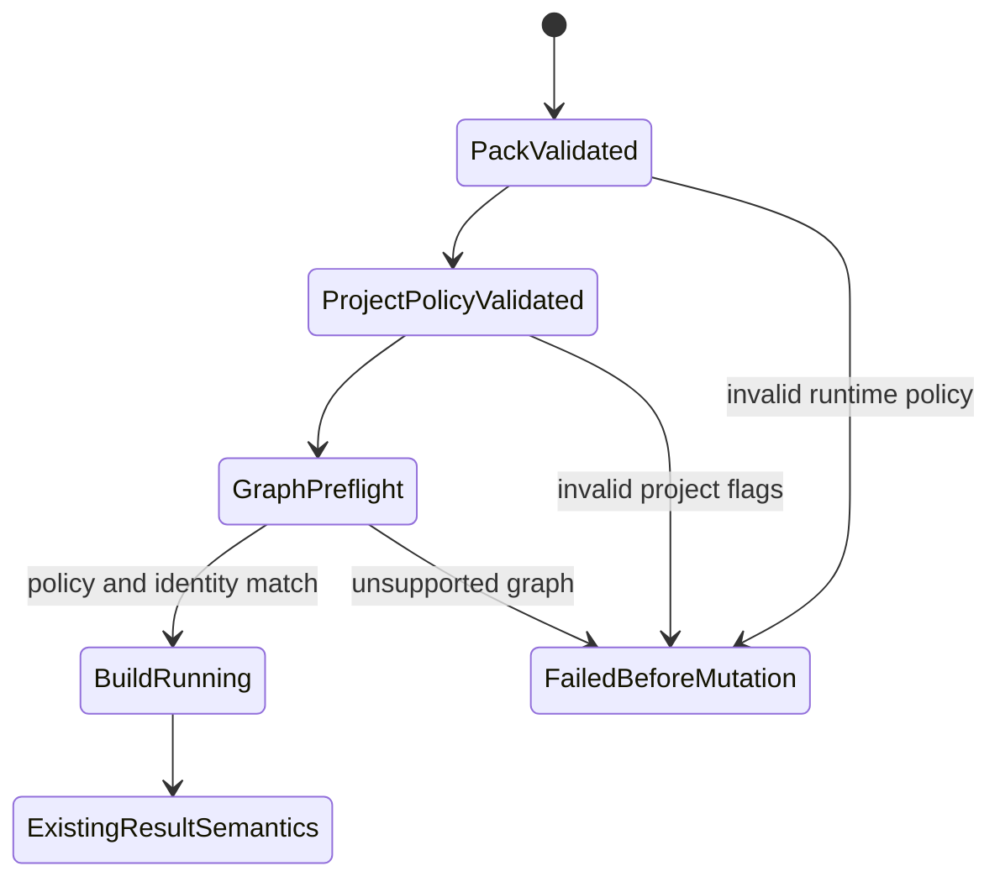

# Feature design: dbt MSSQL adapter guardrails v1

- Status: APPROVED
- Owner: PaulKov
- Issue: PR #454 final adapter-safety review
- Target release: 0.73.26
Last verified: 2026-07-29

## Executive summary

The native dbt self-service path already freezes project, invocation, selection,
target and result identity before it transfers data. The pinned
`dbt-sqlserver==1.10.1` adapter still supplies unsafe implicit defaults, however:
three retries, unbounded login/query timeouts, disabled safety flags and no
machine-enforced resource allowlist for the selected graph.

This remediation makes the effective SQL Server adapter behavior an immutable,
auditable release contract. Unsupported project flags, resources and strategies
fail before `dbt build`; retry and timeout values are rendered explicitly and
participate in release/evidence identity. The outcome is merge-ready as a native
dbt self-service v1 preview, not production GA.

## Personas and customer journey

| Persona | Goal | Current pain | Success signal |
|---|---|---|---|
| Analytics engineer | Check a dbt project before publication | Examples recommend flags but `check` does not enforce them | One actionable blocker names the invalid flag or graph node |
| Platform engineer | Freeze runtime behavior in a release | Adapter defaults can change behavior without changing release identity | Pack and release digests bind effective retry, timeout and capability policy |
| Airflow operator | Bound a failed dbt workload | Query timeout can exceed the process/task budget | Evidence shows `query < dbt process < Airflow task` |
| Auditor | Explain why a graph was admitted | Exact selection does not prove adapter compatibility | Selection lock and evidence bind one policy ID/digest |

The existing author journey remains:

```bash
dbt parse
dpone dbt check
dpone dbt compile --output-dir <new-empty-directory>
```

Configuration errors exit before artifact writes. Runtime validates the
immutable pack/project policy before credentials, then repeats parsed graph
policy validation before `dbt build`.

## Scope

### In scope

- One canonical SQL Server runtime policy for the pinned v1 toolchain.
- Explicit backend, retry, login/query/process/Airflow timeout hierarchy.
- Four required literal `dbt_project.yml` adapter flags.
- A fail-closed allowlist over the complete selected graph.
- Policy identity in selection lock, execution pack, release and evidence.
- Actionable `dpone dbt check`/`compile` errors and branch-local artifact migration.

### Non-goals

- Production GA, live-route certification, certified runtime-image promotion,
  transitive package-tree attestation or collation-aware physical identity.
- A generic adapter/plugin policy framework.
- Seed/snapshot certification, unsafe table/incremental strategies or Cosmos
  graph integration.
- Redesigning existing commit-unknown, concurrency, credential or deployment
  authority.

### Assumptions and constraints

- `dpone.dbt-*.v1` artifacts remain unreleased and are corrected in place.
- The only admitted toolchain is `dbt-core==1.10.13`,
  `dbt-sqlserver==1.10.1`, manifest v12 and run-results v6.
- The existing release stays environment-neutral; host, driver and secrets
  remain deployment/runtime data.
- Live MSSQL failure injection remains `UNVERIFIED` without an explicitly
  approved environment.

## Public contract

### Runtime and adapter policy

Every execution pack contains:

```yaml
adapter_runtime:
  schema: dpone.dbt-sqlserver-runtime-policy.v1
  backend: pyodbc
  retries: 1
  login_timeout_seconds: 15
  query_timeout_seconds: 3300
  adapter_runtime_sha256: sha256:...
adapter_policy:
  schema: dpone.dbt-sqlserver-capability-policy.v1
  required_project_flags:
    dbt_sqlserver_use_native_string_types: true
    dbt_sqlserver_use_dbt_transactions: true
    dbt_sqlserver_use_default_schema_concat: true
    dbt_sqlserver_enable_safe_type_expansion: false
  adapter_policy_sha256: sha256:...
```

`query_timeout_seconds` is derived as `dbt_timeout_seconds - 300`; the Airflow
task execution timeout is `dbt_timeout_seconds + 300`. Publish profiles accept
`dbt_timeout_seconds` from 600 through 86400. `retries: 1` is the pinned
adapter's single SQL execute attempt; Airflow retries remain independently zero.

The runtime policy and capability policy are strict immutable mappings. A
missing, extra or modified field invalidates the pack before credential
resolution or subprocess execution.

### Required project flags

`dbt_project.yml` must contain a top-level `flags` mapping with the four exact
literal booleans above. Missing, duplicate, templated, non-boolean or different
values fail with:

```text
DPONE_DBT_SQLSERVER_PROJECT_POLICY_INVALID
```

The error identifies the flag, expected literal, project file and remediation
without including endpoints, environment or secrets.

### Selected-graph capability policy

The policy evaluates every exact selected ID and requires its ID prefix to match
`resource_type`.

| Resource | Admitted v1 preview behavior |
|---|---|
| model | `language=sql`; materialization `table`, `view` or `incremental` |
| all models | explicit `as_columnstore: false`; no configured or unmanaged index changes |
| table | absent/default `table_refresh_method` normalizes to `rename`; `dml` blocked |
| incremental | explicit `append` or `merge`; merge requires distinct exact contracted identifier columns with admitted column-level `not_null`; `on_schema_change` only `ignore`/`fail` |
| data test | SQL, standard `test` materialization, `store_failures` absent/null/false; every model dependency belongs to the same locked workflow closure |
| unit test | Standard unit-test resource attached to an admitted SQL model |
| seed/snapshot | Blocked until separately certified |

Ephemeral/Python/materialized-view/clone/custom materializations,
delete+insert/microbatch, schema-mutating `on_schema_change`, hooks, grants,
forced full refresh, disabled/missing nodes and unknown resources fail with:

```text
DPONE_DBT_SQLSERVER_GRAPH_CAPABILITY_UNSUPPORTED
```

Project-level `on-run-start` and `on-run-end` hooks must be empty. The same pure
evaluator is used by check, authoritative compile selection and runtime
preflight.

### Identity and evidence

- The selection lock binds the graph policy ID/digest and mutation-relevant
  normalized node fields.
- The inner execution-pack digest binds runtime and adapter policy.
- The outer Airflow pack and release identity bind the exact inner pack bytes.
- Safe execution evidence records backend, retry/timeouts and policy digests,
  never credentials, hosts or raw profile content.
- Airflow provider kwargs bind the derived task timeout and construct
  `datetime.timedelta` only at the provider adapter boundary.

### Compatibility and migration

Existing branch-local v1 packs, locks, releases and evidence are stale and fail
closed. Users add the flags and explicit incremental strategy, then compile into
a new empty output directory. Immutable old artifacts are retained for audit;
no compatibility shim accepts an unsafe pack. Legacy import facades continue to
re-export/delegate without owning new policy.

## Detailed algorithm

1. Confine the dbt project root and parse `dbt_project.yml` with the bounded,
   duplicate-rejecting YAML reader.
2. Require adapter metadata `sqlserver` and the four project flags before dbt
   subprocess or output writes.
3. Build the canonical runtime/capability policy from the publish profile's
   bounded process timeout.
4. Resolve the preview graph for `check`; reject unsupported selected nodes.
5. For compile, execute the existing canonical `dbt parse/ls`, evaluate its
   exact selected graph, then write the lock and pack with policy digests.
6. Cascade the changed inner pack bytes into Airflow pack and release identity.
7. At runtime, strictly parse the pack and project flags before resolving
   credentials or rendering `profiles.yml`.
8. Render explicit backend/retry/login/query fields into the private profile.
9. Run the existing non-mutating parse/ls preflight and evaluate the same graph
   policy against the runtime manifest.
10. On any mismatch, write safe failed evidence with `build_started=false`.
11. Only after all gates pass, create final output, set `build_started=true` and
    invoke `dbt build` under the process and Airflow timeout hierarchy.

### Pseudocode

```text
project_policy = validate_project_flags(project/dbt_project.yml)
runtime_policy = sqlserver_runtime_policy(profile.dbt_timeout_seconds)
graph_policy = canonical_sqlserver_graph_policy()

preview = read_manifest()
assert graph_policy.allows(preview.selected_closure)

exact = dbt_parse_and_ls()
assert graph_policy.allows(exact.selected_graph)
lock = fingerprint(exact, graph_policy)
pack = fingerprint(lock, project_policy, runtime_policy)

runtime_pack = strict_parse(pack)
assert validate_project_flags(extracted_project) == runtime_pack.adapter_policy
profile = render_private_profile(runtime_pack.adapter_runtime)
observed = runtime_parse_and_ls(profile)
assert graph_policy.allows(observed.selected_graph)
assert observed.identity == lock
dbt_build(profile)
persist_safe_evidence()
```

### State and failure semantics



Every new policy failure is deterministic, safe to retry after configuration
repair and produces no durable dbt target mutation. Failures after
`build_started=true` retain the existing non-retryable/`COMMIT_UNKNOWN`
semantics; this remediation does not claim multi-node atomicity.

## Architecture

| Component | Existing/new | Responsibility |
|---|---|---|
| SQL Server runtime policy contract | New | Canonical effective adapter execution behavior and digest |
| SQL Server project policy reader | New focused adapter | Bounded YAML acquisition and exact literal flag validation |
| SQL Server graph policy | New pure contract/policy | Normalize and decide the complete selected graph |
| Selection resolver and preflight | Existing, extended | Invoke the same policy at compile and runtime |
| Runtime profile renderer | Existing, extended | Render exact policy values |
| Airflow execution-pack/provider boundary | Existing, extended | Bind and apply task execution timeout |
| Execution evidence | Existing, extended | Persist safe effective policy |

Contracts and pure policies import no adapters. File/YAML acquisition and
Airflow `timedelta` construction remain adapters. Composition roots inject the
new policy into compiler, release builder and runtime preflight. No service
locator or vendor import is added to base import/help paths.

### Alternatives and tradeoffs

| Alternative | Decision |
|---|---|
| Trust adapter defaults/warnings | Rejected; neither is immutable machine-readable release proof |
| Inject flags only through environment | Rejected; hides authoring errors and couples correctness to adapter warning behavior |
| Validate only at compile | Rejected; stale/tampered runtime bundles must fail before mutation |
| Admit all adapter macros | Rejected; exact selection is not capability certification |
| Generic multi-adapter registry | Rejected; one concrete pinned policy is simpler |
| Preserve old branch-local packs | Rejected; unreleased unsafe artifacts fail closed |

ADR 0034 is amended because it owns retry, immutable pack and runtime authority.
No separate ADR is needed while this remains the same unreleased v1 feature.

New modules stay below the repository's SLOC limits and split acquisition,
normalization/decision and rendering by stable responsibility.

## Market comparison

This is an internal conformance remediation, not a competitive feature. dlt,
Informatica, Airbyte, Fivetran, Pentaho, SSIS, gusty, Astronomer Cosmos and
Apache Beam are all `N/A`: none defines the behavior of the pinned
`dbt-sqlserver` adapter inside dpone, and no market claim is made.

## Measurable differentiation

```yaml
axis: adapter-policy enforcement before mutation
scenario: compile or execute a graph with an unsafe flag, retry value, timeout or selected resource
baseline: adapter defaults or runtime failure after earlier nodes mutate MSSQL
metric: dbt builds started after a known policy violation
target: 0
procedure: contract, CLI and fake-runner negative matrix on the exact pinned toolchain
artifact: test_artifacts/dbt-mssql-adapter-guardrails-v1/validation-report.md
limitations: live database non-mutation remains UNVERIFIED
```

## Security, privacy and operations

- Policy/evidence are secret-free and contain no connection endpoint.
- Runtime validates immutable policy before secret resolution.
- Profile remains private mode `0600` and attempt-scoped.
- Query, build-process and task cutoffs are strictly ordered. `P + 300` bounds
  the whole Airflow task (init-fetch, preflight, build and evidence); it is not
  claimed as a guaranteed post-build completion reserve.
- No automatic Airflow retry is introduced.
- Operators repair source policy and produce a new immutable release; they do
  not edit packs or evidence.

## Test and certification plan

| Layer | Scenario | Expected result |
|---|---|---|
| Unit | Pack/profile with exact runtime policy | Exact YAML, digest and evidence |
| Unit negative | retry/timeout boolean, bounds, unknown/mutated field | Failure before credentials/subprocess |
| Unit negative | missing/false/wrong/duplicate/templated flag | Actionable stable blocker |
| Contract | Change any policy field | Lock/pack/Airflow/release digest changes |
| Graph matrix | Allowed model/test/unit resources | Check/compile/runtime parity |
| Graph negative | Unsupported resource/strategy/hook | `build_started=false`, no build runner |
| CLI | text/JSON check and compile failures | Stable exit code, stderr/JSON and remediation |
| Compatibility | Old preview pack and legacy imports | Pack rejected; imports preserved |
| Integration | Real pinned parse/ls fixture | Exact manifest/selection policy PASS |
| Airflow | Supported provider/Python matrix | Timeout serialization/construction PASS |
| Live MSSQL | Retry/timeout/non-mutation injection | UNVERIFIED without approved environment |

Focused tests precede full non-live, docs, package, Airflow and governance gates.
Generated schemas and references are updated through their producers.

## Documentation plan

Update the first-success tutorial, example project, reference, runtime identity,
error catalog, runbook, compatibility and changelog. Document required flags,
the allowlist, timeout hierarchy, immutable-output migration and preview/GA
limits. Preserve existing navigation; no documentation monolith split is part
of this remediation.

## Rollout and rollback

The corrected v1 policy is always on for the native SQL Server preview path.
Rollout regenerates all PR-local fixtures and releases. Rollback before merge is
reverting the remediation; after publication, operators retain the old release
for audit but must not activate it as certified. Live certification and GA
remain separate follow-up gates.

## Agent execution plan

| Agent/role | Owned paths | Read-only paths | Forbidden paths | Dependency |
|---|---|---|---|---|
| Explorer/architect/test/docs reviewers | none | exact merged PR tree | all writes | completed read-only review |
| Integrator | remediation code, tests, schemas, docs and shared files | whole repository | unrelated user changes | this approved specification |
| Fresh reviewer | none | final diff and evidence | all writes | focused and broad validation |

The parent integrator owns shared schemas, compatibility facades, changelog and
generated references. No parallel writer may edit them.

## Approved follow-up correctness remediation (2026-07-29)

Final review of commit
`e27dbe1d0a7374c5459ed8a8d0c97d192b2e2c8c` found three implementation
violations of this already approved fail-closed contract. The maintainer
explicitly approved their correction. This is an isolated bug remediation, not
a new feature or topology change.

1. Before a compile report or release can pass, evaluate all workflow closures
   together. A selected model may occur in only one workflow closure, and a
   closure may not contain a publish-enabled model owned by another workflow.
   Fail with `DPONE_DBT_WORKFLOW_GRAPH_OVERLAP` or
   `DPONE_DBT_CROSS_WORKFLOW_DEPENDENCY_UNSUPPORTED` before artifact writes.
2. Treat the pinned SQL Server adapter config surface as closed. Reject
   unclassified model/test config keys, non-empty `query_options`,
   `query_options_raw`, `persist_docs`, and `column_types`, and any non-null
   `query_tag` or `sql_header`; reject project `dispatch` configuration and any
   project or package macro that shadows a pinned `dbt_sqlserver` macro.
   This earlier name-only rule is superseded by the execution-critical macro
   authority remediation below. Runtime preflight repeats the same policy
   before `dbt build`.
3. Admit only column-level `not_null` as a physically provable SQL Server
   constraint. Reject every other column constraint and every model-level
   constraint with
   `DPONE_DBT_SQLSERVER_PHYSICAL_CONSTRAINT_UNSUPPORTED` during preview and
   exact selection validation, before release materialization or MSSQL
   mutation.

All admitted adapter values and constraint state participate in the selected
graph contract. Existing branch-local locks and packs are regenerated because
the graph-policy digest changes. The compatibility level remains `compatible`
for the unreleased v1 preview; no migration shim or ADR is required.

Regression proof starts with negative unit/contract cases for each invariant,
then exercises check/compile/runtime parity, the exact dbt fixture, docs gates,
package builds, and the full non-live suite. Live MSSQL/ClickHouse/Airflow
failure injection remains `UNVERIFIED` without an approved environment.

## Approved final boundary remediation (2026-07-29)

Review of commit
`fee918538dd6bf3433a7e5d15a75f7028be27c9b` found two remaining
release-blocking false-pass classes and one eager-test isolation gap. The
maintainer reviewed the proposed contract and explicitly requested
implementation. The merged implementation base is
`d0865a31e661829def07fd2b3d5f4097934bcdf6`.

This section supersedes the earlier name-only macro and non-empty merge-key
rules. It is an isolated fail-closed correction to the same unreleased v1
preview; it does not introduce a new topology, artifact schema major, registry
or plugin framework.

### Framework macro authority

The certified toolchain has one checked-in generated baseline:

```yaml
dbt_core: 1.10.13
dbt_sqlserver: 1.10.1
manifest_schema: v12
adapter_type: sqlserver
trusted_packages: [dbt, dbt_sqlserver]
```

Its producer starts from these trusted roots rather than roots discovered from
the submitted manifest:

```text
macro.dbt_sqlserver.materialization_table_sqlserver
macro.dbt_sqlserver.materialization_view_sqlserver
macro.dbt_sqlserver.materialization_incremental_sqlserver
macro.dbt.get_incremental_append_sql
macro.dbt.get_incremental_merge_sql
macro.dbt.materialization_test_default
macro.dbt.materialization_unit_default
```

It recursively follows `depends_on.macros` and freezes the 131-macro union as
canonical records containing `unique_id`, `package_name`, `name`, SHA-256 of
the exact UTF-8 `macro_sql`, and sorted macro dependencies. Missing roots or
dependencies, cycles, a foreign package in the closure, body drift, dependency
drift or identity mismatch fail closed. The aggregate baseline digest and
generator version participate in `DBT_SQLSERVER_GRAPH_POLICY_SHA256`.

The framework closure is intentionally distinct from the exact macros invoked
directly by the admitted model and generic-test node kinds. A second generated
invocation extension freezes these seven `dbt` records from the same manifest:

```text
macro.dbt.is_incremental
macro.dbt.test_not_null
macro.dbt.default__test_not_null
macro.dbt.test_unique
macro.dbt.default__test_unique
macro.dbt.test_relationships
macro.dbt.default__test_relationships
```

The extension is not counted as framework authority: the framework closure
remains exactly 131 records and its union with the invocation extension is
exactly 138 records. Each extension record is pinned with the same identity,
body-digest and direct-dependency fields as a framework record. Its transitive
dependencies must terminate in the framework closure or the seven-record
extension. A changed extension membership, identity, body or dependency fails
closed and participates in the aggregate baseline and graph-policy digests.
This narrow distinction admits the certified incremental predicate and the
`not_null`, `unique` and `relationships` generic tests without turning every
macro present in the submitted manifest into authority.

Dispatch protection is generated from that trusted closure. Every trusted
macro name is protected. For names with `default__` or `sqlserver__` prefixes,
the producer derives the logical basename and the policy protects the direct,
`default__` and `sqlserver__` candidates; the expected winner is the pinned
SQL Server implementation when present, otherwise the pinned default
implementation. A project/package candidate that could precede or replace that
winner fails with:

```text
DPONE_DBT_SQLSERVER_MACRO_AUTHORITY_INVALID
```

Top-level project `dispatch` remains absent/null/empty. Unreferenced custom
macros may remain immutable project source, but an executable selected node
may depend only on the trusted framework closure, the exact invocation
extension or the exact checked-in `macro.dbt_dpone.dpone_publish` metadata
helper. That helper is pinned by identity and body digest, returns metadata
only, and cannot grant macro authority, emit runtime SQL, call `run_query` or
redirect dispatch. An unrelated unused custom macro is not blanket-rejected.

The baseline is generated Python data in `dpone.contracts` with an explicit
hermetic `--check` producer. Runtime never introspects the installed dbt
packages as its own authority, and canonical imports remain dbt-SDK-free.

### Closed effective merge key

For dbt SQL Server `incremental_strategy=merge` and every dpone
`incremental_merge`, the effective key is a non-empty ordered tuple of
identifiers matching:

```text
^[A-Za-z_][A-Za-z0-9_]*$
```

Each identifier is at most 128 characters. A raw dbt string remains one value;
it is never split on commas. Blank values, non-string values, expressions,
exact duplicates and case-fold duplicates are unsupported. Every key must
byte-exactly match one column in an enforced model contract, and every matched
column must declare the admitted column-level `not_null` constraint.

If publish metadata supplies a key while dbt `config.unique_key` also supplies
one, the two ordered tuples must match exactly. This prevents separate source
and target merge authorities. A table/view source without a dbt merge key may
still supply the one publish key, but it receives the same contract,
identifier and non-null checks.

Stable authoring errors are:

```text
DPONE_DBT_UNIQUE_KEY_MISSING
DPONE_DBT_UNIQUE_KEY_INVALID
DPONE_DBT_UNIQUE_KEY_EXPRESSION_UNSUPPORTED
DPONE_DBT_UNIQUE_KEY_NOT_IN_CONTRACT
DPONE_DBT_UNIQUE_KEY_NULLABLE
```

An ERROR-level dbt `not_null` test is additional result-bearing assurance, not
compile-time nullability proof: `dbt build` may mutate the model before that
test runs. It cannot replace the structural constraint. Similarly, a dbt
`unique` test cannot replace the target-native duplicate gate.

### ClickHouse staging key boundary

After rows, optional lossless decoding, lineage projection and quality gates
reach the attempt-local effective finalization table, but before the
native-transfer guard is armed, the finalizer checks target existence, or any
target schema/swap/delete/update/insert mutation occurs, ClickHouse performs:

```sql
SELECT count()
FROM staging
WHERE `key_1` IS NULL OR `key_2` IS NULL
```

and then the existing duplicate-group query. The same gate covers
`incremental_merge`, `snapshot_diff` and `scd2`, because all three use the
same target key semantics. Failures expose stable `ValueError`-compatible
codes:

```text
DPONE_CLICKHOUSE_STAGING_UNIQUE_KEY_NULL
DPONE_CLICKHOUSE_STAGING_UNIQUE_KEY_DUPLICATE
```

The runtime validates each handle exactly once and passes immutable copies of
the exact validated load configuration and handle to the target finalizer
without repeating the probe after the guard. Later mutation of caller-owned
objects cannot change the table or key semantics being finalized. A sink-owned,
opaque single-use authority token keeps its semantic binding in a private
registry, so copying or caller mutation cannot forge or replay a
validated-finalize call. Abort and cleanup retire unused tokens.
For a nested root/child package, every member passes this boundary before the
first member may finalize.

On a pre-target validation failure, cleanup is attempted for every raw, decoded
and projected attempt table. Failure evidence records `operation_tables`,
`cleanup_status` and `cleanup_verification_required`; a successful DROP request
is not treated as independent proof that every table is absent. The
failure-path `abort_staged_load` operation is the sole rollback/cleanup owner;
the normal post-finalize cleanup is not invoked again for that attempt. The
target, checkpoint success and passed evidence remain untouched, and
native-transfer classification stays `failed_before_target`.

Once the target guard is armed, a finalizer exception is instead
`COMMIT_UNKNOWN`. Dpone retains staged tables for reconciliation and does not
claim safe retry; nested packages surface `nested_package_partial_finalize`
from the first uncertain member with exact finalized, retained, and operation
table identities. A confirmed target followed by cleanup failure instead
reports `target_outcome: committed` and `safe_to_retry: false`. Immutable
evidence is never edited.

### Workflow-local eager tests

The invocation remains `indirect_selection=eager`. For each selected data
test, at least one `model.*` dependency is required and every model in
`depends_on.nodes` must belong to that workflow's complete locked materialized
model closure. `attached_node`, when present, must be one of those local model
dependencies. A multi-model test is admitted only when all its models belong
to the same closure. A foreign or unselected dependency fails before artifacts
or `dbt build` with:

```text
DPONE_DBT_TEST_DEPENDENCY_OUTSIDE_WORKFLOW
```

This rule is applied by the shared selected-graph policy in manifest preview,
authoritative `dbt ls` selection and runtime preflight. Sources remain shared;
no Cosmos or per-model Airflow topology is introduced.

### Ordering and identity algorithm

1. Read the bounded strict manifest and exact selected graph.
2. Validate manifest/node identity and the closed resource/config surface.
3. Reconstruct and compare the trusted framework macro closure; reject
   selected foreign macro dependencies and protected dispatch candidates.
4. Normalize each merge key once and prove enforced contract membership and
   structural non-nullability.
5. Prove every selected test's model dependencies are local to the workflow.
6. Fingerprint all selected dependencies, normalized key/constraint semantics
   and observed macro-authority projection.
7. Only after every workflow passes may selection locks, packs and releases be
   materialized.
8. Runtime repeats steps 1-6 before `dbt build`.
9. After source execution and staging, ClickHouse proves NULL-free and
   duplicate-free keys before any target boundary.

The graph policy digest changes, so prior locks, packs, releases, deployments
and evidence fail closed. No new lock field is required. Authors repair source,
run `dbt deps` only when package declarations changed, run `dbt parse`, and
compile into a new empty output root. Generated JSON is never patched.

### Current primary-source review

Checked on 2026-07-29:

- [dbt incremental strategy](https://docs.getdbt.com/docs/build/incremental-strategy)
  maps built-in append/merge to framework macros and permits custom strategy
  macros.
- [dbt `unique_key` reference](https://docs.getdbt.com/reference/resource-configs/unique_key)
  permits a column or expression, which is broader than dpone's cross-engine
  identifier-only contract.
- [dbt incremental models](https://docs.getdbt.com/docs/build/incremental-models)
  warns that nullable keys can fail to match and create duplicates.
- [dbt test selection](https://docs.getdbt.com/reference/node-selection/test-selection-examples)
  defines eager selection as selecting a test when any parent is selected.

These are upstream facts, not claims that dpone is generally better. The
measurable axis remains violations that reach a mutating build/target boundary;
the target is zero in the deterministic negative matrix.

### Test, documentation and rollout delta

RED-first coverage must include body/dependency drift, core/project/package and
dispatch-family shadows, unrelated unused macros, expression/duplicate/
out-of-contract/nullable/composite keys, planner parity, eager relationship
tests, runtime preflight pass-through, and ClickHouse NULL/duplicate ordering
for absent and existing targets. Exact fixture generation and baseline
generation require deterministic `--check` tests.

Update the tutorial, example, reference, runtime identity, threat model, error
catalog, runbook, compatibility page, ADR 0034 and changelog. Regenerate the
real manifest fixture with the pinned toolchain after adding structural
`not_null`; update retained validation/completion evidence only through the
documented producer flow.

Live MSSQL, ClickHouse, Airflow, Kubernetes and Vault execution remains
`UNVERIFIED` without an explicitly approved environment. This remediation can
be merge-ready as preview after local/CI gates; it is not a production
certification claim.

## Approval checklist

- [x] User problem and CJM are clear.
- [x] Algorithm and failure semantics are implementable without guessing.
- [x] Public contracts and compatibility are explicit.
- [x] Architecture and alternatives are justified.
- [x] Market comparison is correctly N/A for this conformance remediation.
- [x] Claimed differentiation is measurable.
- [x] Tests, evidence, docs, rollout and rollback are complete.
- [x] Path ownership and integration plan are conflict-safe.
- [x] Maintainer approved the plan and explicitly requested implementation.
