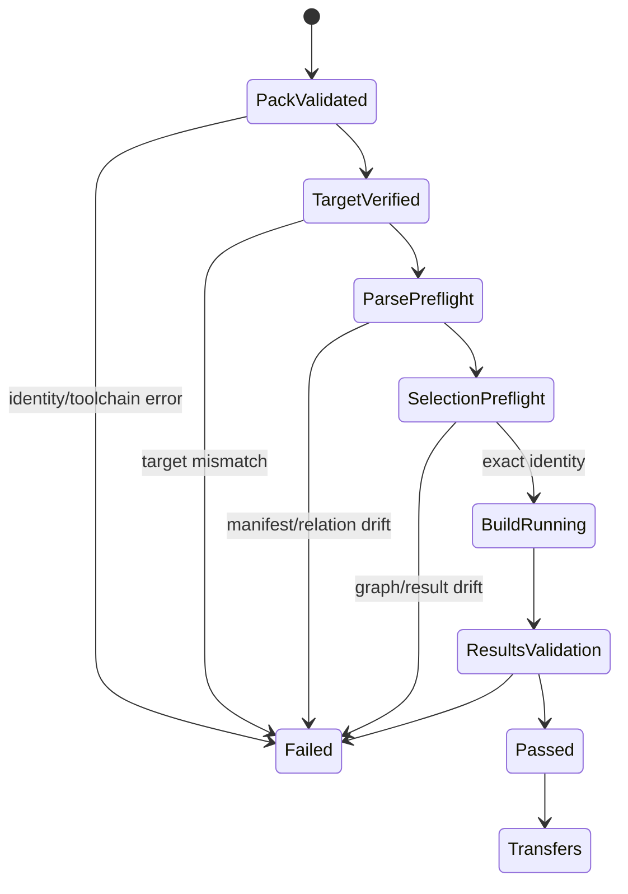

# Feature design: dbt pre-mutation identity remediation v1

- Status: IMPLEMENTED
- Owner: PaulKov
- Issue: PR #454 final correctness review
- Target release: 0.73.26
- Validation: exact-head GitHub Actions artifacts and generated Agent PR receipt
Last verified: 2026-07-28

## Executive summary

The native dpone dbt self-service path already freezes the selected graph,
executes a pinned toolchain and blocks transfers when dbt results are
incomplete. Final review found one remaining release blocker: build-time
selection and runtime execution do not yet prove the same invocation and target
identity before `dbt build` can mutate MSSQL.

This remediation introduces one canonical, secret-free invocation contract,
adds a non-mutating runtime `parse + ls` preflight, and separates logical target
identity in the environment-neutral release from endpoint identity in the
environment-specific deployment. It also closes related correctness gaps in
workflow IDs, strategy selection, MSSQL type decisions, selector behavior and
activation environment validation.

The frozen native DAG, release/deployment, Vault, multi-repository and Cosmos
coexistence architecture does not change.

## Personas and customer journey

| Persona | Goal | Current pain | Success signal |
|---|---|---|---|
| Analytics engineer | Publish one dbt mart safely | Ambient `DBT_*` values can make CI and runtime resolve different graphs | The normal two-command journey remains unchanged and drift fails before mutation |
| Platform engineer | Promote one release to multiple environments | A concrete prod endpoint must not enter release identity | One release digest is reused while each deployment binds and proves its own endpoint |
| Airflow operator | Diagnose a blocked dbt task | A post-build selection error is too late | Evidence identifies invocation, target or selection preflight failure without secrets |
| Release engineer | Trust activation workflows | Activation installs can ignore Airflow constraints | Every supported activation installs isolated exact tooling and scheduler dependency sets; the scheduler set uses official constraints and both pass `pip check` |

The author still runs:

```bash
dbt parse
dpone dbt check
```

No new beginner command is introduced. Invocation and target diagnostics appear
as structured blockers with a next action.

## Scope

### In scope

- `dpone.dbt-invocation-context.v1`, embedded in the unreleased execution pack.
- One shared compile/runtime environment and argv policy.
- Runtime `dbt parse` and `dbt ls` verification before `dbt build`.
- Logical target identity in the release and endpoint identity in deployment.
- Canonical pinned dbt toolchain authority.
- Safe workflow, DAG, workload and artifact identities.
- Capability- and policy-aware `auto` strategy choice.
- One canonical MSSQL special-type contract used by planning and runtime.
- Strict unknown-selector behavior.
- Isolated tooling and scheduler environments in activation workflows; the
  scheduler provider follows Airflow constraints and both environments run
  `pip check`.
- Exact fixture and evidence wording for the tested dbt/Cosmos surface.

### Non-goals

- A new DAG topology, Cosmos graph adapter, dbt retry policy, secret backend,
  live route certification or release/deployment redesign.
- Persisting server names, Vault paths, passwords or environment-specific
  endpoints in the release.
- Allowing arbitrary environment variables or arbitrary dbt command arguments.

### Assumptions and constraints

- The affected `dpone.dbt-*.v1` contracts have not shipped and may be corrected
  in place without a migration shim.
- Dev and prod retain identical logical database, schema and model names.
- Concrete hosts may differ between environments and are deployment data.
- `dbt-core==1.10.13`, `dbt-sqlserver==1.10.1`, manifest v12 and run-results v6
  remain the only production-certified toolchain.
- Runtime preflight may resolve workload-scoped credentials but performs no
  database mutation.

## Public contract

### Invocation context

```yaml
schema: dpone.dbt-invocation-context.v1
environment_policy: isolated_v1
indirect_selection: eager
static_environment:
  DBT_SEND_ANONYMOUS_USAGE_STATS: "false"
  LANG: C.UTF-8
  LC_ALL: C.UTF-8
dynamic_vars:
  - dpone_data_interval_end
  - dpone_data_interval_start
invocation_context_sha256: sha256:966d8702f76ef73c056a10341223bf9c49027610c8f965b55985cc0b58c07b74
```

Rules:

- compile selection, runtime preflight and runtime build use this contract;
- ambient `DBT_*` and `DPONE_DBT_*` values are never inherited;
- `HOME` is a private invocation directory and `PATH` is the certified runtime
  path; their machine-specific values do not enter semantic identity;
- dynamic variable names enter identity, while scheduler-supplied values enter
  run evidence through the existing Airflow interval identity;
- arbitrary environment entries and command flags are rejected.

### Selection lock

The lock additionally contains `publish_model_unique_ids`. It remains a strict
subset of `expected_run_result_unique_ids`. Runtime preflight recomputes:

- `selected_graph_unique_ids`;
- `expected_run_result_unique_ids`;
- relation identity for every publish model;
- one `graph_contract_sha256` over selected node identity, resource type, FQN,
  selected dependencies, materialization, resolved relation and declared
  column contract.

Any mismatch returns `DPONE_DBT_SELECTION_DRIFT` before `dbt build`.

### Logical target

The execution profile becomes:

```yaml
profile:
  profile_name: dpone_runtime
  target_name: runtime
  connection_ref: mssql_marts
  adapter_type: sqlserver
  database: analytics
  schema: mart
  threads: 4
```

`connection_ref`, adapter, database and schema are logical release semantics.
Host, port, driver, resolver and credential values remain in deployment
bindings/registry/runtime resolution. Runtime verifies the resolved registry
connection type, database and schema before profile materialization and before
any dbt subprocess. The deployment fingerprint already binds the registry and
credential runtime.

Evidence adds secret-free `invocation_context_sha256`,
`logical_target_sha256`, `target_binding_sha256`, `preflight_status` and
`build_started`. `dbt_exit_code` is nullable while `build_started: false`; a
preflight failure never fabricates a dbt process exit code.

```text
target_binding_sha256 =
  hash(
    logical_target_sha256
    + deployment_id
    + binding_set_ref
    + connection_registry_ref
    + credential_runtime_ref
  )
```

### Stable errors

```text
DPONE_DBT_INVOCATION_CONTEXT_INVALID
DPONE_DBT_SELECTION_DRIFT
DPONE_DBT_TARGET_IDENTITY_MISMATCH
DPONE_DBT_WORKFLOW_ID_INVALID
DPONE_DBT_STRATEGY_UNRESOLVED
DPONE_DBT_MODEL_NOT_FOUND
```

All JSON failures remain `dpone.error.v1`. No argv, environment dump, endpoint,
secret or raw dbt output is returned.

### Compatibility and migration

The corrected v1 artifacts replace branch-local generated artifacts. No
serialized migration is needed because they are unreleased. CLI authoring
metadata and the two-command journey remain compatible. Unsafe workflow IDs
that previously reached artifact writing now fail before filesystem writes with
a deterministic remediation.

## Detailed algorithm

1. Validate the official manifest, project snapshot, package readiness,
   toolchain contract, workflow IDs and exact model selector.
2. Build the canonical invocation context and use its isolated environment for
   build-time `dbt parse` and `dbt ls`.
3. Resolve the graph and freeze publish IDs, graph IDs, expected result IDs,
   logical target and invocation fingerprint.
4. Choose `auto` strategy only from structurally applicable candidates that are
   policy-authorized and supported by the canonical route capability service.
5. Materialize the immutable environment-neutral release.
6. At runtime, verify release/deployment identity and installed toolchain.
7. Resolve the deployment binding once at workload start.
8. Compare resolved connection type/database/schema with the release logical
   target. On mismatch, write failed evidence and stop.
9. Render the private profile, then run `dbt parse` into a dedicated
   attempt-scoped preflight directory with the exact runtime interval variables
   and invocation context.
10. Validate the official manifest v12 schema and verify publish relation
    identities.
11. Run `dbt ls` with the same profile, target, variables, selectors and
    `indirect_selection`. Compare exact graph and expected-result identities.
12. Delete or isolate preflight output. Only now create the attempt-scoped final
    output directory and invoke `dbt build`; no attempt deletes another
    attempt's `run_results.json`.
13. Validate official run-results v6, status policy and exact expected IDs.
14. Persist durable evidence. Transfers remain blocked unless every step passes.

### Pseudocode

```text
pack = validate(execution_pack)
assert installed_toolchain == pack.toolchain
project = confine(extracted_bundle)
resolved = resolve_binding_once(pack.profile.connection_ref)
assert logical_target(resolved) == pack.profile.logical_target
profile = render_private_profile(resolved)

preflight_manifest = dbt_parse(
  context=pack.invocation_context,
  profile=profile,
  vars=airflow_interval_vars,
  output=preflight_target,
)
validate_official_manifest(preflight_manifest)
assert publish_relations(preflight_manifest) == pack.publish_relations
assert graph_contract(preflight_manifest) == pack.selection_lock.graph_contract_sha256

preflight_selection = dbt_ls(
  context=pack.invocation_context,
  profile=profile,
  vars=airflow_interval_vars,
  selectors=pack.selection_lock.selectors,
)
assert preflight_selection == pack.selection_lock

result = dbt_build(same_context)
validate_run_results(result)
persist_evidence()
allow_transfers_only_when_passed()
```

### State machine



### Failure and replay semantics

- Preflight failures are safe to retry because no target mutation has started.
- Build and transfer retries remain disabled unless the existing route policy
  proves replay safety.
- Missing/extra IDs, an unknown status, target mismatch or malformed artifact
  fails closed.
- Credential rotation may change the resolved credential version without
  changing release/deployment identity when policy is `latest`; logical target
  identity must remain unchanged.
- A process timeout uses the existing process-group supervisor for preflight and
  build alike.
- Concurrent attempts use different run/try-scoped output roots.
- A crash after build starts but before durable evidence is not converted to a
  preflight failure or success; it follows the existing `COMMIT_UNKNOWN`
  reconciliation contract.

## Architecture

### Components and responsibilities

| Component | Existing/new | Responsibility |
|---|---|---|
| `DbtInvocationContext` | New contract | Canonical argv/environment/variable policy and digest |
| dbt invocation policy | Refactored shared policy | Build compile/runtime commands and isolated environment |
| selection resolver | Existing adapter | Resolve build-time graph under canonical context |
| runtime preflight service | New cohesive runtime helper | Parse, schema-check, relation-check and ls before mutation |
| `DbtProfileSpec` | Corrected contract | Carry logical target identity |
| runtime profile renderer | Existing adapter | Verify deployment-resolved target then render private YAML |
| toolchain contract | New canonical contract | Own exact dbt/adapter versions and digest |
| MSSQL type contract | New shared policy helper | Own explicit-contract classification |
| strategy resolver | Refactored service | Select only policy- and capability-valid candidates |

### Ports, adapters and dependency direction

Contracts and pure policies do not import adapters. Runtime services depend on
narrow command, profile, artifact-validation and evidence ports. The bootstrap
composition root injects official manifest/run-results validators and concrete
subprocess/profile adapters. CLI, Airflow provider and compatibility facades
remain thin.

### Alternatives and tradeoffs

| Alternative | Decision |
|---|---|
| Compare selection only after build | Rejected; mutation may already have occurred |
| Put prod host in the release | Rejected; breaks build-once/promote-by-digest |
| Trust stable `profile_name`/`target_name` | Rejected; names do not prove endpoint or relation identity |
| Inherit ambient `DBT_*` | Rejected; non-deterministic and may expose secrets |
| Introduce a general command plugin system | Rejected; a fixed v1 invocation contract is simpler and safer |
| Duplicate MSSQL mappings | Rejected; special-type classification has one canonical authority |

### ADR requirement

No new ADR. ADR-0033 already freezes native DAG authority, immutable release,
environment-specific deployment and runtime credential resolution. This
document repairs conformance to those decisions.

### Quality-budget impact

New modules are split by stable responsibility: invocation contract/policy,
runtime preflight and canonical type/toolchain policy. Existing god modules may
not grow past the repository budgets. Shared schema/workflow/changelog files
remain integrator-owned.

## Market comparison

N/A. This remediation fixes an internal determinism and pre-mutation safety
contract. It introduces no new competitive capability and makes no market
claim.

## Measurable differentiation

```yaml
axis: pre-mutation identity proof
scenario: compile a workflow, change ambient dbt context or deployment target, execute it
baseline: drift can be detected only after build or not detected
metric: mutating dbt builds started after identity mismatch
target: 0
procedure: adversarial compile/runtime environment, selection and target tests
artifact: exact-head GitHub Actions artifacts and generated Agent PR receipt for PR #454
limitations: live MSSQL mutation remains UNVERIFIED without the approved environment
```

## Security, privacy and operations

- Invocation environments are allowlisted and never logged wholesale.
- Target evidence uses canonical digests and logical refs, not endpoint or
  secret values.
- Runtime profile remains tmpfs-only, mode `0600`, and short-lived.
- Preflight and build share bounded timeout, output redaction and process-group
  cleanup.
- Airflow parse performs zero dbt, network, database, secret or filesystem
  discovery calls beyond the immutable deployment index.

## Test and certification plan

| Layer | Scenario | Environment | Expected artifact |
|---|---|---|---|
| Unit | Ambient env differs | local | identical invocation context and no inherited value |
| Unit | Runtime graph/relation drift | local fake runner | build runner is never called |
| Unit | Target database/schema mismatch | local fake resolver | failed evidence before subprocess |
| Unit | `sql_variant` and other special types | local | planning/runtime require explicit contract consistently |
| Unit | auto strategy candidates | local | first policy- and capability-valid candidate only |
| Unit | unsafe/colliding workflow IDs | local | blocker before output |
| Unit | unknown selector | local | no unrelated model compilation |
| Contract | schemas/fingerprints | local | deterministic pack/evidence digests |
| Integration | real dbt fixture with ephemeral/data/unit tests | installed pinned toolchain, no database | parse/ls produce manifest v12 and exact graph IDs |
| Live integration | real fixture build and v6 results | approved MSSQL environment | UNVERIFIED until current retained evidence exists |
| Workflow | isolated activation dependency installs | CI | exact tooling set plus official Airflow-constrained scheduler set; both pass `pip check` |
| Compatibility | exact Cosmos coexistence cells | CI | PASS only for tested cells |
| Live | MSSQL/ClickHouse target mutation | approved environment | UNVERIFIED until executed |

## Documentation plan

Update dbt reference, runtime runbook, threat model, compatibility matrix,
schema reference, changelog and PR evidence. Document that `auto` is governed,
preflight is non-mutating, release target identity is logical, and deployment
owns concrete endpoints. Cosmos graph integration remains `N/A`. Exact
coexistence cells are `PASS` only when the current commit's CI run and retained
evidence prove them; without that evidence they, like wider combinations,
remain `UNVERIFIED`.

## Rollout and rollback

Regenerate all PR-local dbt artifacts after contract changes. No released data
requires migration. Rollback is reverting this remediation before merge. The PR
remains blocked until focused/broad/package/CI gates pass and the maintainer
performs the four owner attestations manually.

## Agent execution plan

| Agent/role | Owned paths | Read-only paths | Forbidden paths | Dependency |
|---|---|---|---|---|
| Explorer | none | current dbt contracts/runtime/services/tests/workflows | all writes | none |
| Architect | none | frozen ADR and target/invocation boundaries | all writes | none |
| Test certifier | none | tests, fixtures and CI matrix | all writes | none |
| Docs/UX reviewer | none | CLI/docs/PR evidence | all writes | none |
| Integrator | all remediation paths and shared semantic files | whole repository | unrelated user changes | approved spec |

## Approval checklist

- [x] User problem and CJM are clear.
- [x] Algorithm and failure semantics are implementable without guessing.
- [x] Public contracts and compatibility are explicit.
- [x] Architecture and alternatives are justified.
- [x] Market comparison is correctly N/A for this correctness remediation.
- [x] Claimed differentiation is measurable.
- [x] Tests, evidence, docs, rollout and rollback are complete.
- [x] Path ownership and integration plan are conflict-safe.
- [x] Maintainer approved implementation through the explicit one-goal request.
