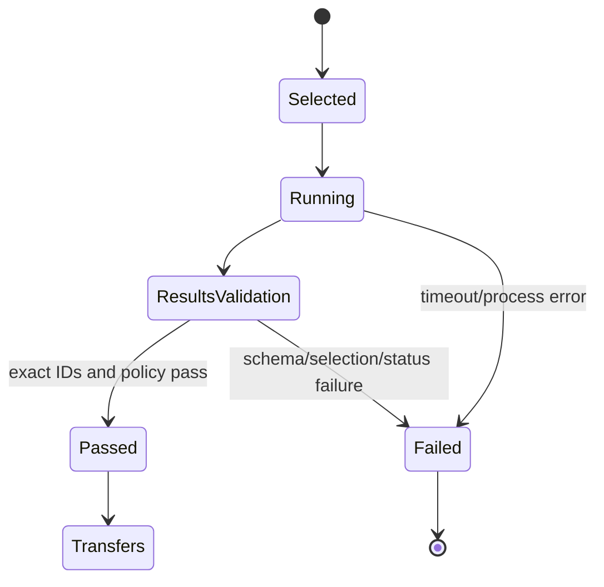

# Feature design: dbt runtime correctness remediation v1

- Status: IMPLEMENTED
- Owner: PaulKov
- Issue: PR #454 review remediation
- Target release: 0.73.26
Last verified: 2026-07-28

Implementation evidence:
[validation report](../test_artifacts/dbt-runtime-correctness-remediation-v1/validation-report.md).

## Executive summary

The dbt self-service implementation already bundles resolved packages and uses
the approved native dpone Airflow topology, but review found four correctness
gaps in its runtime boundary: ephemeral models are incorrectly expected in
`run_results.json`, dbt unit tests are absent from the locked selection, warning
and no-op statuses have no explicit platform policy, and timeout handling can
leave descendant processes or blocked output collectors alive. Runtime also
parses run-results through a hand-maintained field allowlist instead of the
official dbt v6 schema.

This remediation fixes those gaps without changing the frozen multi-repository,
release/deployment, Vault, native DAG, or Cosmos coexistence architecture.
Publication remains blocked until the exact selection, execution result and
evidence are complete.

## Personas and customer journey

| Persona | Goal | Current pain | Success signal |
|---|---|---|---|
| Analytics engineer | Publish a tested dbt mart | Ephemeral parents and unit tests can create false selection drift | Existing two-command journey succeeds without hidden exclusions |
| Platform engineer | Enforce warning policy | dbt warning semantics are implicit | `fail` or `allow` is frozen in policy, pack and evidence |
| Airflow operator | Bound failed tasks | Timed-out dbt descendants can survive | The whole process group stops within a bounded deadline |
| Release engineer | Trust runtime artifacts | Run-results shape is locally approximated | Official v6 schema and exact fixture are verified offline |

The author still runs `dbt parse` and `dpone dbt check`. If packages are
declared but unresolved, dpone returns `dbt deps && dbt parse` as the next
action and performs no network operation itself.

## Scope

### In scope

- Dual selection identities for the selected graph and expected run results.
- First-class selected dbt unit tests.
- Platform-owned `fail | allow` dbt warning policy, defaulting to `fail`.
- Official offline run-results v6 validation and an exact dbt 1.10 fixture.
- POSIX process-group supervision with a bounded non-POSIX fallback.
- Package lock/readiness validation and extracted-bundle regression coverage.
- Accurate compatibility, production-activation and PR evidence wording.

### Non-goals

- A new DAG topology, ADR, dbt retry policy, Cosmos integration, or package
  downloader.
- Supporting a new dbt Core, adapter or artifact schema version.
- Claiming live MSSQL, ClickHouse, Kubernetes or Airflow certification without
  evidence from the exact commit and images.

### Assumptions and constraints

- The affected v1 contracts have not shipped and are corrected in place.
- `dbt-core==1.10.13`, `dbt-sqlserver==1.10.1`, manifest v12 and run-results v6
  remain the exact certified toolchain.
- Production KPO execution is Linux. Other operating systems use a bounded
  parent-process fallback without a production process-tree guarantee.

## Public contract

### Selection lock

`dpone.dbt-selection-lock.v1` contains sorted unique
`selected_graph_unique_ids` and `expected_run_result_unique_ids`. The graph set
contains selected models, seeds, snapshots, data tests, unit tests and
ephemeral models. The result set excludes only selected ephemeral models.
Runtime compares `run_results.json` with the result set. Both sets participate
in `selection_sha256`.

### Warning policy

The platform profile quality object accepts:

```yaml
quality:
  preset: strict
  dbt_warning_policy: fail
```

Allowed values are `fail` and `allow`; omitted means `fail`. Model metadata
cannot override it. The effective value is frozen in
`dpone.dbt-execution-pack.v1`. Evidence records the policy and warning count.

`success`, `pass` and `no-op` pass in both modes. `warn` passes only in `allow`.
`partial success`, `error`, `fail`, `skipped` and `runtime error` fail. Unknown
statuses make the artifact invalid. Fail mode also invokes dbt with
`--warn-error`.

### Package readiness

When `packages.yml` or `dependencies.yml` exists, a current committed
`package-lock.yml` and the configured resolved packages directory are required
before release materialization. The lock's dbt 1.10 declaration hash must match
the selected declaration. dpone never invokes `dbt deps`. Failures use
`DPONE_DBT_PACKAGE_LOCK_REQUIRED` or `DPONE_DBT_PACKAGES_NOT_RESOLVED` and
recommend `dbt deps && dbt parse`.

### Compatibility and migration

There is no serialized migration because the contracts are unreleased. Existing
generated artifacts are rebuilt. `dpone.dbt_publish` remains the compatibility
facade defined by the parent design.

## Detailed algorithm

1. Validate package declarations, lock and resolved package root while capturing
   the stable project snapshot.
2. Ask the exact dbt CLI for selected `model`, `seed`, `snapshot`, `test` and
   `unit_test` resources.
3. Use the parsed manifest to classify selected model materializations.
4. Freeze the full selected graph and derive expected results by excluding
   ephemeral models only.
5. Build the fixed dbt command. Insert `--warn-error` before `build` when the
   effective policy is `fail`.
6. Start dbt in a new process session on POSIX and drain stdout/stderr through
   bounded collectors.
7. On timeout, terminate the process group, wait five seconds, kill the group,
   close parent pipes and join collectors within a shared bounded deadline.
8. Read strict JSON, validate it against the vendored official v6 schema, then
   enforce exact toolchain, invocation, unique result IDs and status policy.
9. Persist durable evidence. No transfer workload starts unless dbt exit,
   artifact, selection and status policy all pass.

### State machine



### Edge cases

- Empty or duplicate selections fail before execution.
- A selected ephemeral model is locked but not expected in run-results.
- A selected unit test is expected and gates transfer.
- Missing, duplicated, extra or absent result IDs fail closed.
- Official optional run-results fields are accepted.
- A child retaining stdout after parent exit cannot cause an unbounded join.
- Package declaration without a lock or resolved package tree writes no release.

## Architecture

| Component | Responsibility |
|---|---|
| Selection resolvers | Produce graph and result identity sets |
| dbt policy compiler | Freeze platform warning policy |
| Execution pack/evidence contracts | Carry policy and deterministic identities |
| Official run-results validator | Offline structural validation |
| Runtime result evaluator | Enforce toolchain, selection and status policy |
| dbt process supervisor | Bound process-tree and collector lifetime |

Dependencies continue to point from runtime/services to ports and contracts.
The subprocess implementation remains an adapter and does not import runtime
policy. Shared schemas, compatibility documentation, changelog and evidence
are owned by the integrator.

### Alternatives and tradeoffs

| Alternative | Decision |
|---|---|
| Expect ephemeral models in run-results | Rejected; dbt does not emit node results for them |
| Ignore unit tests | Rejected; it creates false success |
| Always allow warnings | Rejected; default is governed fail-closed |
| Kill only the dbt parent | Rejected; descendants can retain resources |
| Maintain a local closed field list | Rejected; official schema is authoritative |

### ADR requirement

No new ADR. Authority, topology, release identity and runtime boundaries remain
those of ADR-0033. This is a correctness repair to the approved implementation.

### Quality-budget impact

Process supervision is placed in a cohesive adapter module rather than growing
the existing command runner. Existing module and import-graph budgets may not
regress.

## Market comparison

N/A. This remediation restores the already approved dbt artifact and process
semantics and introduces no new competitive capability or market claim.

## Security, privacy, and operations

No credentials, argv, raw dbt output or row data enter error messages. Output
redaction remains active on success and failure. Official schemas are vendored
and loaded offline. Runtime and Airflow parse perform no package download or
schema network access.

## Test and certification plan

| Layer | Scenario | Expected result |
|---|---|---|
| Unit | Ephemeral and unit-test selection | Dual lock sets are exact |
| Unit | Warning/no-op matrix | Governed pass/fail result |
| Unit | Process timeout and retained pipe | Bounded exit, no surviving POSIX child |
| Contract | Official v6 fixture and optional fields | Offline schema pass |
| Integration | Extracted bundle with custom package root | Offline `dbt parse` succeeds |
| Packaging | Installed wheel schema lookup | Vendored schema is available |
| Live | MSSQL/ClickHouse execution | UNVERIFIED unless exact environment runs |

## Documentation plan

Update dbt reference, compatibility matrix, changelog, generated schema
contracts and PR validation evidence. Cosmos sentinel compatibility is reported
only for exact tested pairs; graph integration remains N/A. Production
activation is described as implemented and fail-closed, while live route
certification remains UNVERIFIED.

## Rollout and rollback

Regenerate all branch-local dbt artifacts. Rollback is reverting the remediation
commit before merge; no released artifact migration exists. The PR remains
blocked until technical gates pass and the maintainer performs the owner
attestation.

## Agent execution plan

| Agent/role | Owned paths | Shared owner |
|---|---|---|
| Process implementer | dbt process supervisor and isolated tests | integrator |
| Schema implementer | official run-results schema adapter and isolated tests | integrator |
| Integrator | selection, policy, contracts, shared schemas, docs and evidence | integrator |
| Fresh reviewer | read-only final diff | integrator |

## Approval checklist

- [x] User problem and CJM are clear.
- [x] Algorithm and failure semantics are implementable without guessing.
- [x] Public contracts and compatibility are explicit.
- [x] Architecture and alternatives are justified.
- [x] Market comparison is correctly N/A for this bug remediation.
- [x] Tests, evidence, docs, rollout and rollback are complete.
- [x] Path ownership and integration plan are conflict-safe.
- [x] Maintainer approved implementation through the explicit plan request.
