# Feature design: declarative committed replay and target acceptance

- Status: RESEARCHED
- Owner: maintainers; one integrator owns shared contracts and composition
- Issue: independent open-source follow-up to PR #224
- Target release: TBD after approval, implementation and validation
- Last verified: 2026-09-28
- Inspected source: `8b0d38b08c349671cb739966aafa9322826a0c18` (`0.85.0`)
- Implementation gate: this extension has not been approved or implemented.

This proposal is for pipeline authors, Airflow operators and runtime maintainers.
It extends the [committed replay design](feature-design-committed-replay-quality-evidence.md)
and [shipped reference](committed-replay-quality-reference.md). Proposed fields and
behavior below are not available in 0.85.0. See the
[design standard](feature-design-standard.md) for approval rules.

## Executive summary

Declarative CLI and Airflow consumers cannot select the durable replay store shipped
in 0.85.0. Required target acceptance is rejected because the current metric probe
cannot enforce an absolute observation deadline. Add an explicit, default-off sink
option and a bounded generation reader. Both original execution and committed retry
must use the same quality completion service, with durable proof before success.

No quality gate is disabled or reinterpreted. Historical operations without original
proof remain unverified; this proposal cannot recreate that proof from today's data.

## Personas and customer journey

| Persona | Goal | Current pain | Success signal |
|---|---|---|---|
| Pipeline author | Declare safe replay once | Python composition is required | Same normalized selector reaches CLI and Airflow runtime |
| Operator | Retry a committed operation | Target truth and quality failure are easily confused | Committed target and blocked governance reported separately |
| Platform engineer | Bound target reads | Socket activity can outlive an elapsed-time check | Supervised reader rejects late/partial output and preserves fences |
| Maintainer | Upgrade without historical fiction | Reports cannot establish original checks | Old bytes remain intact; unsupported history has an explicit outcome |

1. Discover the supported one-shard internal replicated full-refresh route.
2. Provision the existing exact KeeperMap schema and same-service platform attestation.
   All writers must honor the authority and immutable-generation contract.
3. Enable the proposed sink option and retain the existing gates and acceptance policy.
4. Validate the manifest offline; validation is not a live capability certificate.
5. Execute with an explicit stable CLI operation identity, or the normal Airflow DAG
   run/task identity. Keep credentials in existing runtime connection providers.
6. Observe original/current run IDs, target commit truth, quality completion and errors.
7. Retry the same logical invocation and semantic configuration. A new run ID is a new
   operation, not recovery. Changing an Airflow try number alone must not change it.
8. Diagnose missing evidence or reader uncertainty using the recovery runbook; preserve
   authority. Upgrade consumers only in a separately authorized deployment task.

## Scope

### In scope

- Batch and flow manifests, normalized process config, both credential factory paths,
  `dpone run`, and existing Airflow in-process/container runtime composition.
- Existing Python opt-in compatibility and required target row/null/distinct acceptance.
- A supervised, behaviorally read-only ClickHouse worker with a shared 60-second
  target observation budget; exact generation and authority checks remain mandatory.
- Synthetic subprocess, CLI and Airflow tests, truthful errors, docs and recovery matrix.

### Non-goals

Additional load strategies/shards/sinks, external replication, target recertification
after unmanaged writes, automatic authority migration/repair, force-clear commands,
Code 999 retries, arbitrary SQL workers, consumer promotion, production credentials,
live certification without an approved environment, and release publication in this
planning change. dbt-specific opt-in authoring is not added here.

### Assumptions and constraints

Only ordinary immutable full-refresh generations are admitted. Reject data-changing
TTL and Replacing/Summing/Collapsing engines, unproven mutations and unmanaged writers.
Metadata alone cannot prove a common Keeper service or prohibit privileged writes.
Existing platform attestation and access boundaries remain prerequisites.

The first concrete supervised reader supports POSIX workers that allow process
creation, termination and reaping. Unsupported platforms/sandboxes fail admission
before source extraction. Merely installing a driver does not prove this capability.

## Public contract

### Manifest/schema and composition

Proposed selector: `sink.options.durable_quality_replay: true`, strictly boolean,
with omitted/false preserving current behavior. Use existing sink-option inheritance:
batch defaults are merged into each expanded process; an explicit process value wins.
Flow and fragment options must declare the same type. Reject null, strings, numbers,
source placement, conflicting normalized copies and unknown selector spellings.
Do not invent a second quality mode, top-level alias or CLI flag.

The following is a proposed option/policy patch for an otherwise admitted internal
replicated full-refresh process, not an executable 0.85.0 manifest:

```yaml
sink:
  options:
    durable_quality_replay: true
quality:
  acceptance:
    enabled: true
    mode: required
    capture:
      source: true
      staged: true
      target: true
    checks:
      row_count: true
      null_counts: [record_id]
      distinct_counts: [record_id]
```

Existing gates remain alongside acceptance. Acceptance requests observations; it
adds no implicit null/distinct thresholds and does not replace row/hash gates.

A pure parser resolves the selector once, before hydration/credential resolution.
The runtime loader does not automatically apply JSON Schema, so schema additions
alone are insufficient. Reuse the existing cluster-admission policy for route rules.
Repeat narrow type/endpoint checks in public factories before connector creation.
Pass a typed composition option through
`RuntimeEndpointFactory`, `SinkFactory` and `ResolvedEndpointFactory`; only ClickHouse
composition consumes true. Every true unsupported route fails before source access,
DDL or authority mutation. Validate false as a boolean even when unused.

`LoadConfigBuilder` duplicates sink options at the root and under `sink_options`.
Validate both representations, then explicitly exclude only this composition selector
from semantic digest projection. Python 0.85.0 already selects the store outside that
digest. Preserve absent/false bytes and do not add empty containers to old configs.
Do not exclude the entire sink-options map, logical connections or any data semantics.
New registration is tested against the existing identity contract version and golden
0.85.0 capsules. A mismatch in any other semantic input remains blocking.

### CLI and Airflow

No new command is needed. The tutorial must show identical explicit identities on
original execution and retry, for example, after the proposed feature is implemented:

```bash
dpone run replay.batch.yaml --selector refresh --dag-id replay_demo --run-id demo_001 --format json
```

Repeat that exact invocation only for the same logical operation/configuration.
Correct the help producer's current claim that run ID defaults to process name:
`run_manifest.py` actually generates a fresh manual UUID. Regenerate CLI references.

Retain existing exit-code categories. Runtime governance failure exits 1; JSON mode
emits one valid failure result on stdout plus a bounded safe diagnostic on stderr.
Add optional structured replay metadata without renaming existing failure fields:
`target_commit` is `proven`, `unknown`, or `not_started`; `governance` is `blocked` or
`complete`; expose safe error code and known original/current IDs. Populate `proven`
only from observed publication authority. Generic zero counters are not commit proof.
Do not introduce file-output flags or alter existing artifact overwrite/atomicity rules.

Airflow DAG parsing serializes only declarative values and connection references.
Resolve credentials, compose clients and spawn readers inside task execution, never
at parse/import time. Exercise both factory paths and packaged worker payloads.
A changed task attempt preserves logical operation identity; a new DAG run does not.
Quality failure must raise task failure before success-dependent state/asset emission.
No scheduler-level retry may turn a proven commit into a new publication dispatch.

### Python API and evidence

Keep `ClickHouseSink(connector, durable_quality_replay=False)` backward compatible.
An optional keyword-only `target_acceptance_reader` capability may be injected by
trusted Python composition; default factories construct the concrete reader from the
same admitted sink connection descriptor. Target selection without a reader remains
`DPONE_REPLAY_QUALITY_EVIDENCE_UNSUPPORTED` before source extraction. Source/staged-only
Python callers do not acquire subprocess or new credential requirements.

Use a new `dpone.quality.replay.v2` capsule only for the new target obligation. Read
existing v1 capsules under their unchanged semantics; keep source/staged-only writes
v1. The surrounding strict authority remains v2. Old consumers reject unknown capsule
versions; mixed old/new writers are unsupported while new obligations are active.

V2 preserves the immutable prepared core and its digest. Its core acceptance map
contains exactly requested source/staged observations. A terminal completion record
contains the requested target observation and a hash-chain link to the prior record.
Validate required sides according to state; absent target evidence is allowed only
before COMPLETE. Preserve the 256 KiB envelope and two-transition maximum.

The target record has an explicit kind, side, dataset, ordered schema/selection digest,
exact generation binding, observed replica, metric values, warnings and the truthful
capture boundary `committed_generation_before_governance_complete`. Never copy the
legacy unconditional `captured_before_cleanup: true` into post-cleanup evidence.
The exact target observation field set is `kind`, `side`, `dataset`, `columns`,
`selection_digest`, `schema_digest`, `binding`, `replica`, `observation_profile`,
`attempt_id`, `row_count`, `null_counts`, `distinct_counts`, `warnings`, and
`capture_boundary`. Its kind is `dpone.quality.target-observation.v1`, side is `target`,
and profile is `clickhouse-immutable-generation-v1`. Binding equals the sealed core's
publication binding; `attempt_id` is producer-generated diagnostic identity, not a
serialized reader permit. Unknown/missing fields are invalid. Required metrics are
exact UInt64-range integers; unrequested row count is null and unrequested metric maps
are empty. In explicit warn-only mode, a classified probe-unavailable result has
`row_count: null`, empty count maps, and exactly the warning
`target_acceptance_metric_probe_unavailable`, while retaining the verified requested
columns/selection/schema/binding. It contains no partial metric values. That exact
record is valid only under the original warn-only policy; a missing record, missing
field, malformed value or identity mismatch is never equivalent to it.
The completion record's `target` holds that observation directly; pending and failure
records contain no successful target observation. The terminal state is authoritative.

A completed replay result uses `dpone.quality.replay.result.v2`; existing v1 results
are unchanged. Reuse existing safe REQUIRED/MISMATCH/INVALID/FAILED/INCOMPLETE/UNSUPPORTED
codes; diagnostic context does not grant authority.

### Compatibility and historical recovery

| Historical state | Permitted action | Outcome |
|---|---|---|
| Pre-0.85 inert operation | Existing publication recovery | Existing inert semantics, no new quality claim |
| Pre-0.85 committed non-inert operation without capsule | Preserve original authority and diagnostics | REQUIRED; original quality remains UNVERIFIED |
| Old report/count/hash/process-local receipt only | Read as diagnostic material | Cannot populate a trusted capsule or assert original success |
| Valid retained 0.85 v1 capsule | Same operation/configuration and verified store/generation | Existing source/staged replay; no new target obligation retrofitted |
| Missing/replaced authority, stale generation or unverifiable restore | Preserve evidence; operator investigation | Blocked; no automatic adoption or journal replacement |
| Desired new target assessment of old data | Separate future assessment design/authorization | New provenance only; not completion of the historical run |

No supported producer before 0.85 supplied this durable quality capsule. Version
strings, target UUID/count equality and later passing scans cannot recover the missing
original source/staged observations. Proven automatic recovery of those non-inert
historical operations is therefore impossible under this contract. A separately
approved new operation may load current source data, but is not retroactive recovery
and must not overwrite an unresolved authority slot through a bypass.

## Detailed algorithm

1. Parse and normalize the strict selector, route and existing quality snapshot.
   Preserve stable semantic/configuration identity and separate attempt identity.
2. If selected, admit the existing publication route and exact KeeperMap store. If
   target is requested, admit supervised process lifecycle, endpoint reconstruction,
   supported engine/immutability and exact query-limit behavior. Reject unsupported
   custom clients without a safe descriptor or explicitly injected bounded reader.
3. Before source extraction, validate policy/known selectors and capability readiness.
   Once payload columns are known, reject unknown selected columns or unsupported
   metric types before staging publication. Never silently reduce selected metrics.
4. For an original run, evaluate unchanged row/hash gates and capture all requested
   source/staged observations. Stage and seal PREPARED proof into exact authority
   before the existing one-shot publication permit. Source errors prevent dispatch.
   At sealing, calculate the worst-case complete canonical envelope using the actual
   core/binding, all known schema/column/dataset strings, the longest admitted replica,
   fixed 32-hex attempt ID, maximum UInt64 metric/version decimal lengths, digest links,
   both transition records and each permitted warning representation. Require this
   envelope AND its framed worker response to fit their respective 256 KiB limits.
   Reject overflow before dispatch; a core that merely fits PREPARED is insufficient.
   Do not truncate evidence or drop metrics to satisfy the budget.
5. Publish once or reconcile the existing committed operation. Preserve commit truth
   independently from governance. Never rerun extraction, INSERT or EXCHANGE for a
   proven committed retry, including when target capture is still pending.
6. Acquire the existing strict owner-token reader fence and validate authority version,
   immutable core, inventory and desired generation. PREPARED target obligations
   transition to TARGET_PENDING with exact acknowledged CAS/readback before any scan.
7. Start one target observation attempt. Bind a unique private attempt nonce, reader
   token, operation/fence, core digest, inventory, desired generation and metric plan.
   All target-worker reads share one monotonic 60-second deadline, including metadata
   and the aggregate scan. Read one deterministically selected admitted replica of
   the single shard; never add counts across replicas. Validate all-replica generation,
   schema and health before and after the scan through bounded observation requests.
8. Supervise a fixed subprocess module via private bounded pipes. Instantiate a fresh
   client from the admitted endpoint/auth descriptor inside the worker; no connected
   client, authority store, arbitrary callable or pickle crosses the boundary. Generate
   SELECTs from typed plans and quoted identifiers only. Force read-only execution,
   strict throwing limits and no unavailable-shard skipping; never accept partial output.
9. Set server/socket budgets no larger than the remaining time. The parent watchdog
   supplies the actual wall-clock enforcement when the driver keeps receiving packets
   or blocks. At deadline/cancel, revoke the result channel, terminate the process
   group and reap with a separate bounded shutdown budget (maximum five seconds).
   Never wait indefinitely in an executor context manager. Reject late or duplicate
   frames, wrong nonce, oversized output, trailing data and a worker without clean EOS.
10. Parse exactly one aggregate result row, with unique ordinal aliases and exactly
    the requested fields. Validate nonnegative integer counts (not booleans), all
    requested columns, dataset/schema/binding and warnings. Zero is valid; a missing
    alias/row never becomes zero. Existing permissive probe coercions are not reused.
11. Revalidate current guarded authority and generation. Persist COMPLETE with target
    observation through exact CAS and readback. Consume the fresh process-local quality receipt
    while the exact owner guard still protects that generation; then verify guard
    release before emitting external success.
    A missing ACK never becomes success. Mutation attempts remain single-shot.
12. For an existing COMPLETE record, validate the durable target observation and
    current authority/generation under a fresh guard; do not scan the target again.
    Re-evaluate original gates from stored probes and issue a fresh local receipt.

### Deadline, cancellation and failure semantics

The 60 seconds bounds target observation acceptance and worker I/O, not the entire
ETL operation or an in-flight authority mutation. Authority acquire/transition/release
retain strict unknown-outcome handling; no timeout may trigger a duplicate mutation.
Server limits alone are insufficient, because the server may check them between parts.

Timeout, cancellation or unavailable observation leaves TARGET_PENDING. After verified
pending persistence, local worker termination/reaping and irreversible output-channel
revocation, the parent may release its guard by exact owner CAS. A remote orphan SELECT
may still run; its result cannot authorize completion. Remote termination is UNVERIFIED,
not claimed. Pending governance still blocks successors. No general KILL permission
or automatic scan retry is introduced. A later identical invocation may observe again.

If worker quiescence, pending persistence or guard release is uncertain, retain the
fence or its unknown outcome and return INCOMPLETE. Parent death can retain the token;
there is no automatic lease expiry. Malformed evidence or actual quality failure
blocks completion; persist terminal FAILED when trusted authority is available. Never
rewrite a corrupt core to manufacture a valid failure record. FAILED is not retryable
as a new passing observation. Cancellation propagates without a successful receipt.

Required acceptance never converts unavailability into a warning. Existing explicit
warn-only diagnostic policy can produce a validated warning record only for an allowed
probe-unavailable outcome, within the guarded path; it cannot absorb identity drift,
invalid data, deadline/cancellation, missing authority or unknown mutation outcomes.

### Pseudocode and state machine

```text
admit(selected_option, route, policy, reader_capabilities)
if committed_operation_exists:
    recover_exact_commit_without_source_or_publication()
else:
    prepare_original_gates_and_source_staged_evidence()
    seal_before_single_publication_dispatch()
with exact_generation_guard:
    require_original_core_and_policy()
    if complete: validate_persisted_completion()
    elif target_requested:
        persist_target_pending_once()
        target = bounded_observe_exact_generation()
        validate_target_and_current_authority()
        persist_complete_with_target_once()
    else: finish_legacy_v1_completion()
    consume_fresh_local_quality_receipt()
require_verified_guard_release()
emit_external_success()
```



```mermaid
stateDiagram-v2
    [*] --> PREPARED: original checks and sealed core
    PREPARED --> TARGET_PENDING: commit proven and guarded CAS
    TARGET_PENDING --> TARGET_PENDING: bounded read unavailable; later invocation only
    TARGET_PENDING --> COMPLETE: exact target observation and verified CAS
    TARGET_PENDING --> FAILED: terminal invalid or failed evidence
    COMPLETE --> COMPLETE: validate original proof; no target rescan
```

Empty input must produce a real zero aggregate; null columns use explicit null counts.
Schema drift, duplicate delivery, stale generation, corrupted completion chain and
unsupported nested normalization fail closed. Crash after capture but before COMPLETE
requires a new observation; crash after an uncertain completion write requires reading
and validating that exact durable outcome before any further transition.

## Architecture and alternatives

| Component | Responsibility | Dependency direction |
|---|---|---|
| Manifest option parser and typed composition value | Strict input and parity | Manifest/contracts; no I/O |
| Existing runtime hydration/factories | Bind selector, store and reader once | Runtime composition to ports/adapters |
| Contracts-layer target DTOs | Typed bounded request/result and binding | No runtime imports |
| BoundedTargetAcceptanceReader port | Admission and one bounded observation | Port depends on contracts only |
| Supervised ClickHouse reader adapter | Worker lifecycle, pipe framing, SELECT limits | Adapter implements port; SDK imported only in worker |
| Existing QualityReplaySession, extended completion service | Policy, ordering, original/replay parity | Runtime depends on port/contracts |
| Existing ClickHouseReplayQualityStore | Strict transitions and ownership-aware guard release | Store remains sole authority mutation owner |

`collect(request, *, deadline)` is a capability, not arbitrary serialized evidence.
The worker has no publication/authority API. Reusing sink credentials is behaviorally
read-only inside the trusted-runtime boundary; it does not claim a separate database
RBAC principal. Credentials pass only through private pipes, not argv, disk or reports.
Fresh process creation uses `subprocess.Popen`, not `multiprocessing.Process`, so an
Airflow daemon flag alone does not prevent it; actual executor sandbox support is tested.

Do not import runtime acceptance DTOs into ports/adapters. Introduce only the needed
contracts-layer DTOs and convert at the runtime boundary. Keep legacy public imports
and snapshots unchanged. Source/staged-only and target-required paths exercise the
same completion service with distinct declared capabilities; no generic worker plugin
framework is needed. Split framing/supervision from ClickHouse query building and
result validation by responsibility. Use canonical quality budgets without raising them.

| Alternative | Decision |
|---|---|
| Route config silently enables replay | Reject: changes unselected behavior |
| Set max_execution_time or thread future timeout only | Reject: no reliable total wait/result deadline |
| Ordinary permissive acceptance probe | Reject for durable target proof: missing aliases default to zero and aliases can collide |
| Supervised fixed read-only worker | Select: bounded local lifetime and explicit failure authority |
| Current target scan reconstructs historical core | Reject: does not establish original checks |
| New separate target credential knob | Defer: same admitted connection avoids another identity/secret configuration surface |

[Proposed ADR 0074](adr/0074-declarative-replay-target-completion.md) records declarative
selection, worker lifetime and v2 completion evidence. Review it before implementation
approval; ADR 0073 retains its historical shipped decision.

## Market comparison

Sources checked 2026-09-28; rolling docs are observations at that date, not pinned
compatibility claims. Facts below describe the cited layer; dpone choices are inferences.
No cross-product correctness or performance superiority is asserted.

| System/version context | Observed design and relevant strength | Limitation of comparison | Adopt/reject for dpone |
|---|---|---|---|
| dlt, current OSS docs | [Pending load packages and job outcomes](https://dlthub.com/docs/running-in-production/running) guide resumption and failure inspection | Load-package recovery does not establish this capsule/generation contract | Adopt explicit recovery identity; reject relabeling failed quality as success |
| Airbyte, current protocol docs | [State/checkpoint ordering](https://github.com/airbytehq/airbyte/blob/master/docs/platform/understanding-airbyte/airbyte-protocol.md) binds progress to destination acknowledgement | Source checkpoint progress is a different authority from historical quality proof | Adopt ordered evidence before progress; reject treating checkpoint alone as quality proof |
| Astronomer Cosmos, rolling docs | [Operator arguments](https://astronomer.github.io/astronomer-cosmos/guides/run_dbt/operators/operator-args.html) configure rendered Airflow execution | dbt operators do not supply this ClickHouse completion store | Adopt configuration parity tests; reject parse-time database clients |
| gusty, current OSS repository | [File-based DAG construction](https://github.com/pipeline-tools/gusty) separates task authoring from DAG rendering | Rendering is not durable database recovery | Adopt declarative values surviving rendering; reject deriving commit authority from task success |
| Apache Beam, current model docs | [Bundles and retry behavior](https://beam.apache.org/documentation/runtime/model/) make re-execution a design concern | Runner bundle semantics do not prove this external publication protocol | Adopt explicit retry-safe boundaries; reject relying on invocation count |
| Informatica | N/A for this scoped implementation comparison | Managed integration deployment is not the Python/Airflow composition seam being changed | No product capability claim |
| Fivetran | N/A for this scoped implementation comparison | Managed connector service is not the client-side worker/authority seam | No product capability claim |
| Pentaho | N/A for this scoped implementation comparison | Different execution/composition runtime; no adapter parity target here | No product capability claim |
| Microsoft SSIS | N/A for this scoped implementation comparison | Different package/runtime model; no SSIS integration in scope | No product capability claim |

Technical primary sources: [ClickHouse limits](https://clickhouse.com/docs/concepts/features/configuration/settings/query-complexity)
document partial-result overflow modes and checks between data parts;
[clickhouse-driver API, 0.2.11 docs](https://clickhouse-driver.readthedocs.io/en/latest/api.html)
describes connection timeouts and client execution. The repo-locked driver must be
contract-tested independently; these docs do not prove a hard deadline for that driver.

## Measurable differentiation

```yaml
axis: declarative recovery with preserved required quality
scenario: committed full refresh loses acknowledgement before target completion
baseline: dpone 0.85.0 rejects target acceptance and has no declarative selector
metric: source_reads_and_publication_dispatches_during_committed_replay
target: zero additional source reads or publication dispatches
procedure: synthetic CLI and Airflow crash/replay matrix
artifact: test_artifacts/declarative-replay-quality/
limitations: no live or comparative performance claim
```

The acceptance target is zero additional source reads, INSERTs and EXCHANGEs across
CLI and Airflow retries; exactly one durable target completion for the operation;
zero success outcomes after deadline/identity/evidence failure. A synthetic matrix
must measure counters and crash boundaries, including real child-process termination.
Evidence belongs under `test_artifacts/declarative-replay-quality/`. This measures
only the tested protocol, not throughput, live server durability or other products.

## Security, operations and validation

Bound envelope and worker frames to 256 KiB; allow one worker per guarded operation,
never an unbounded executor queue. Use exact field sets and safe integer parsing;
cap configured target metric columns at 256 for this new capability, rejecting a
larger selection before dispatch. Do not leak raw SQL, endpoints or credentials into
errors. Retain authority for the replay window; a successor ends the fixed-slot window.
Report deadline, pending/complete state and guard uncertainty without inventing metrics
or labeling skipped observation successful. Synthetic tests use generated OSS fixtures.

| Layer | Required scenarios | Evidence / environment |
|---|---|---|
| Unit/contracts | Boolean parsing, precedence, dual options, v1 golden identity, v2 chain/sides, complete-envelope reservation, exact metrics/aliases, null/zero/bool/overflow | Offline JUnit and explicit negative matrix |
| Runtime integration | Original success, ACK loss, capture crash, COMPLETE replay, required versus warning, pending/FAILED retirement | Fake authority/catalog with call counters and crash injection |
| Deadline/subprocess | Hung socket, trickle packets, missing EOS, delayed frame, cancellation, failed terminate/reap, pipe bounds | Real local worker fixture plus injected clock tests |
| CLI | Actual manifest hydration, explicit run IDs, JSON/stderr/exit parity, commit truth | Existing CLI runner with source/write traps |
| Airflow | Parse/serialize/runtime and both endpoints, changed try number, failed task/no success asset, subprocess sandbox rejection | Existing supported Airflow matrix and synthetic task execution |
| Compatibility | Old manifests, Python defaults, inert history, valid 0.85 capsules, rejected historical fake evidence, legacy error imports | Golden bytes and old-config regression tests |
| Concurrency | Competing readers and successor, stale completion, wrong owner/version, unknown release | Deterministic paused workers and strict CAS doubles |
| Live certification | KeeperMap, real replica generation, orphan SELECT behavior, strict metrics and cancellation | SKIP until approved environment; then extend producer scenario inventory |
| Performance | Payload/column/time limits | Synthetic bounds; throughput UNVERIFIED |

Run the change-aware selector, focused suites, all required Ruff/format/mypy/import/
layer/module-size/non-live tests and docs gates. Build affected packages and test fresh
install when provider/package code changes. Require independent fresh-context review.
The existing live cluster receipt lacks these scenarios and cannot certify this extension.

## Documentation, rollout and rollback

Update separate replay tutorial/reference/runbook with a parser-tested manifest and
CLI/Airflow journeys, target capture timing, deadline/guard diagnostics and the historical
matrix. Link from manifest, schema, load governance, Airflow and architecture references.
Regenerate schemas/reference docs through producers. Update CHANGELOG only when behavior
is implemented; this proposal does not claim a shipped feature.

Stage rollout: approve design, implement red-green at narrow boundaries, complete source
CI/review, assess ordinary release gates, then obtain separate publication scope when
needed. No consumer promotion occurs in this task. Selectors stay false by default.
Quiesce writers before enabling v2 obligations. Do not roll back to a binary unable to
read active v2 capsules or disable quality on pending operations; finish with a compatible
reader or preserve the fence for reviewed recovery. Old source/staged-only v1 records
remain consumable without conversion.

## Agent execution plan

The integrator starts from these traced boundaries: four schema families
`etl-config`, `etl-batch-manifest`, `etl-flow-manifest` and
`etl-flow-fragment-manifest`; `dag/load_config_builder.py`;
`runtime/bootstrap_sources_sinks.py`; `runtime/credentials/factory.py` and
`runtime/credentials/resolved_endpoint_factory.py`; and
`runtime/clickhouse_cluster_publication_composition.py`. Test public
`SinkFactory.create_resolved` forwarding and any supported staging clone path.

The parent is integrator and sole shared-file owner. Before parallel writing, create
validated task contracts and separate worktrees; the earlier implementation contracts
do not authorize edits to the newly affected manifest and factory paths.

| Role | Owned responsibility/paths after approval | Read-only | Forbidden |
|---|---|---|---|
| Integrator | Shared contracts/ports, schemas, manifest parser/builder, bootstrap/credential factories, replay identity, metadata/navigation/CHANGELOG | All scoped code | Unrelated routes, workflows, credentials, consumer repositories |
| Reader implementer | New bounded target-reader adapter/worker modules and focused tests | Contracts, runtime/store | Shared files, manifest/factories, authority mutations |
| Completion implementer | Replay session/completion and ClickHouse store lifecycle modules and focused tests | Approved shared contracts and reader port | Shared schema/identity/factory files, reader worker |
| CLI/Airflow verifier | Disjoint CLI/Airflow composition tests; report producer/help changes only in explicit contract | Runtime and manifests | Shared fixtures/schemas and other agents' files |
| Docs reviewer | Read-only journey and rendered-doc review | Docs and examples | All writes |
| Fresh reviewer | Read-only final diff and evidence audit | All scoped changes | All writes |

## Approval checklist

- [x] Problem, journey, exact default-off contract and historical limits are defined.
- [x] State, authority, timeout, cancellation and completion ordering are specified.
- [x] Compatibility, architecture, alternatives and current primary sources are recorded.
- [x] Synthetic/live boundaries, docs, rollout and path ownership are explicit.
- [x] Independent design review findings are resolved: guarded receipt ordering,
  pre-dispatch completion capacity, and exact warn-only unavailable representation.
  Final verdict: RESEARCHED review-ready; retained in task review evidence.
- [ ] Maintainer changed status to `APPROVED`.

This specification is ready for design review. Production implementation, route
certification, merge and release readiness are not implied by RESEARCHED status.
