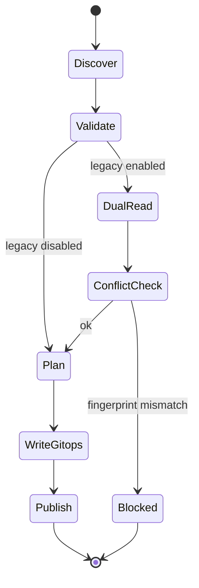
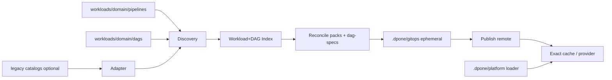

# Feature design: Domain-colocated DAGs + hidden `.dpone` system surface

- Status: APPROVED
- Owner: data-platform / maintainer
- Issue: self-service layout — remove `dpone_workloads` dual SoT; colocate DAGs with pipelines; hide system internals under `.dpone/`
- Target release: TBD (next minor after current `0.73.x` candidate line)
- Last verified: 2026-08-04
- Extends: `docs/feature-design-unified-beginner-init-v1.md` (domain-first pipelines)

## Maintainer approval (2026-08-04)

Locked decisions:

1. Declarative DAG path = `workloads/<domain>/dags/` (not `airflow/`).
2. Committed system subtrees = `.dpone/{platform,docker,config,registry}`.
3. Dual-read conflict policy = fail on fingerprint mismatch.
4. v1 forbids cross-domain pipeline references inside a domain DAG.
5. Migration is staged one domain at a time.
6. Quality bar = maximum; after every feature increment run fresh-context
   review subagents (defect/architecture/security as applicable) before merge.

## Executive summary

Self-service is still crooked for multi-task DAGs: engineers author
`workloads/<domain>/pipelines/**`, but schedule/membership/wiring live in
`dpone_workloads/gitops/domains/**`. Platform loader and smokes also sit under
`dpone_workloads/`, teaching users that “dpone owns their DAG folder”.

This feature makes the repository match the intended mental model:

1. **Users edit only `workloads/<domain>/**`** — pipelines and DAG declarations
   colocated by domain.
2. **System/platform internals move under committed `.dpone/{platform,docker,config,…}`**
   — owner-repo only; not a beginner CJM surface.
3. **Generated artifacts stay under gitignored `.dpone/gitops/`** (unchanged remote
   pack model).
4. **`dpone_workloads/` is removed** after migration.

Measurable outcome: a CRM engineer creates/edits
`workloads/example/pipelines/...` and `workloads/example/dags/...` without opening any
`dpone_workloads` or domain-catalog path; CI reconcile still emits the same
immutable packs + dag-specs consumed by the exact-cache provider.

## Personas and customer journey

| Persona | Goal | Current pain | Success signal |
|---|---|---|---|
| Domain DE (CRM) | Add/change a DAG + pipelines | Wiring buried in `dpone_workloads/gitops/domains` | Edits only `workloads/example/**` |
| Beginner DE | First single-task DAG | Sees catalogs as authoring | `init pipeline` + optional `init dag`; never opens `.dpone/` |
| Domain lead | Own SLA/DQ for domain DAGs | Ownership split across folders | `ownership.yaml` + colocated `dags/` |
| Platform owner | Loader, bridge, docker, policy | Mixed with business catalogs | Owns `.dpone/platform|docker|config` only |
| DataOps | Exact-cache publish | Fear of path churn | Same pack/dag-spec schemas; path remap only |

### CJM (after)

1. Discover domain folder `workloads/<domain>/`.
2. `dpone init pipeline …` → `pipelines/<id>/pipeline.yaml`.
3. `dpone init dag …` (or edit YAML) → `dags/<dag_id>.yaml` with schedule + wiring.
4. `dpone check` / reconcile → packs + dag-specs under `.dpone/gitops/` (ephemeral).
5. CI publish → S3 / desired-state → Airflow exact cache.
6. Diagnose via Airflow + evidence; never edit generated `.dpone/gitops/`.

Beginner CJM must not mention `dpone_workloads`, domain catalogs, or pack URIs.

## Scope

### In scope

- Public layout contract for domain-first tenants:
  - user: `workloads/<domain>/{ownership.yaml,pipelines/**,dags/**}`
  - system (committed): `.dpone/platform/**`, `.dpone/docker/**`, `.dpone/config/**`,
    `.dpone/registry/**` (names frozen below)
  - generated (gitignored): `.dpone/gitops/**`, `.dpone/generated/**` (optional)
- New authored schema `dpone.domain-dag.v1` for `workloads/<domain>/dags/<dag_id>.yaml`
- Discovery: pipelines (existing) + domain DAGs → unified IR used by reconcile
- CLI: `dpone init dag`, discovery/check errors that point to colocated paths
- Migration from `dpone_workloads/gitops/domains/*.yaml` + removal of
  `dpone_workloads/`
- Airflow loader path remap to `.dpone/platform/airflow_dags/`
- Public documentation, user journeys, and layout guidance
- Compatibility shim: read legacy catalogs during deprecation window
- ADR for layout SoT split (user vs system vs generated)

### Non-goals

- Changing pack / dag-spec **runtime** schemas (`gitops.airflow_dag_spec`, packs)
- Changing exact-cache delivery, identity tags, or provider parse path
- Studio UI
- Forcing native Python DAGs into `.dpone/` (native stay under
  `workloads/<domain>/airflow/native/` if present)
- PyPI release of `0.73.32` itself (orthogonal)
- Production cutover before green tenant evidence

### Assumptions and constraints

- `layout.mode: domain_first` remains required for this SoT (flat keeps legacy
  beginner catalogs until a later cleanup).
- PipelineId stays project-wide unique (v1).
- `.dpone/gitops/` remains gitignored (remote artifact model).
- Dot-directory `.dpone/` is used for **system visibility hiding**, not
  “everything gitignored”. Committed subtrees are explicit allowlists.
- Airflow dag bag / git-sync must still see a **committed** loader Python file.
- Multi-domain DAG owns exactly one domain folder (existing ownership rule).

## Public contract

### Repository layout (normative)

```text
workloads/                                 # USER SoT
  <domain>/
    ownership.yaml                         # dpone.domain-ownership.v1
    pipelines/<pipeline_id>/
      pipeline.yaml
      sql/ docs/ …
    dags/<dag_id>.yaml                     # dpone.domain-dag.v1 (NEW)
    airflow/native/…                       # optional native Python DAGs

.dpone/                                    # SYSTEM + GENERATED
  platform/                                # COMMITTED — owner-repo only
    airflow_dags/                          # loader + platform smokes/helpers
    …
  docker/                                  # COMMITTED — system images/recipes
  config/                                  # COMMITTED — former gitops.yaml root
    project.yaml                           # workload-set / includes / env defaults
  registry/                                # COMMITTED — technical registries if needed
  gitops/                                  # GITIGNORED — reconcile output
  generated/                               # GITIGNORED — optional IR dumps

# REMOVED after migration
dpone_workloads/
```

**Naming note:** do **not** put user pipelines under `.dpone/workloads`. If a
generated snapshot of discovered workloads is needed, use
`.dpone/generated/workloads/` or the existing WorkloadIndex dump path.

### CLI

| Command | Behavior |
|---|---|
| `dpone init dag <dag_id> --domain D [--schedule S] [--pipeline P …]` | Create `workloads/D/dags/<dag_id>.yaml`; fail if domain_first and domain missing/ownership missing |
| `dpone init pipeline …` | Unchanged paths under `workloads/<domain>/pipelines/` |
| `dpone check` / reconcile | Discover pipelines + domain DAGs; fail if DAG references unknown pipeline_id; fail if DAG file domain ≠ path domain |
| Legacy `--workload-set dpone_workloads/gitops.yaml` | Compatibility: accepted during deprecation; warn; map to `.dpone/config/project.yaml` |

Exit-code pattern unchanged (SelfServiceResult / GitOps result envelopes).

### Manifest/schema

#### `dpone.domain-dag.v1` (authored, new)

One file per DAG, path = identity:

Synthetic schema example; it does not represent a deployed workload:

```yaml
schema: dpone.domain-dag.v1
dag_id: DAG__example__customer_analytics__refresh
domain: example
description: Synthetic customer analytics example
start_date: 2025-01-01
timezone: UTC
schedule: "0 6 * * *"
catchup: false
max_active_runs: 1
tags: [dpone, example, connection_ref]
default_args:
  owner: example_owner
  retries: 0
operator_overrides:
  in_cluster: true
pipelines:
  - example_ch_contact_dimension
  - example_ch_activity_fact
  - example_customer_mart
wiring:
  mode: explicit
  dependencies:
    example_ch_activity_fact: [example_ch_contact_dimension]
    example_customer_mart:
      - example_ch_contact_dimension
      - example_ch_activity_fact
```

Rules:

- `dag_id` must equal filename stem.
- `domain` must equal path domain.
- `pipelines` entries must exist as discovered `pipeline_id`s (or be explicitly
  marked external — not in v1).
- Wiring semantics reuse current `AirflowDagSpecBuilder` modes
  (`waves` / `explicit` / `assets`).
- Schedule/start_date required as today.

#### Compiled IR

Extend `dpone.workload-index.v1` (or adjacent `dpone.dag-index.v1`) with
discovered domain DAG declarations. Reconcile consumes IR — not git catalogs.

#### Deprecated

- Beginner/root `domains/<domain>.yaml` already skipped in domain_first init.
- Tenant `dpone_workloads/gitops/domains/*.yaml` as **authoring** SoT.
- Directory name `dpone_workloads/` as public layout.

### Artifacts and evidence

Unchanged remote artifacts:

- packs, dag-specs, deployment index, desired-state
- still written under `.dpone/gitops/` locally / published remotely

Evidence for migration:

- discovery report listing moved DAG files
- reconcile `blockers=[]` on the chosen synthetic fixture set

### Compatibility and migration

| Phase | Behavior |
|---|---|
| P0 | Spec APPROVED; no tenant cutover |
| P1 | dpone reads **both** colocated `workloads/*/dags/*.yaml` and legacy catalogs; prefer colocated on conflict (fail if both define same `dag_id` with unequal fingerprint) |
| P2 | Migrate one isolated example domain; verify compatibility before wider adoption |
| P3 | Fail-closed if legacy `dpone_workloads/gitops/domains` still present when `layout.system_root` enabled |
| Rollback | Restore previous pin + legacy paths; keep shim until P3 |

Deprecation window: at least one minor release with dual-read + warnings.

## Detailed algorithm

1. **Load layout policy** from `dpone.yaml`:
   - `layout.mode: domain_first`
   - `layout.root: workloads`
   - `layout.system_root: .dpone` (new; default `.dpone` when mode domain_first)
2. **Discover pipelines** (existing exact-depth scan).
3. **Discover domain DAGs**: scan
   `{root}/<domain>/dags/*.yaml` with schema `dpone.domain-dag.v1`.
4. **Validate**:
   - unique `dag_id` project-wide;
   - path/domain/`dag_id` consistency;
   - every `pipelines[]` id ∈ discovered pipelines;
   - wiring nodes ⊆ `pipelines[]`;
   - no cycle in explicit dependencies.
5. **Optional legacy adapt**: if dual-read enabled, load
   `dpone_workloads/gitops/domains/*.yaml` `dags:` + `workloads:` maps into the
   same IR with source=`legacy_catalog`.
6. **Conflict policy**: same `dag_id` from colocated + legacy → compare
   normalized fingerprint; equal → warn once; unequal → blocker.
7. **Reconcile**: existing pack build + `AirflowDagSpecBuilder` from IR
   (not from catalog file path).
8. **Publish**: unchanged remote desired-state flow.
9. **Runtime**: provider/loader read packs/dag-specs from exact cache; loader
   Python lives at `.dpone/platform/airflow_dags/DAG_dpone_gitops_loader.py`.

### Pseudocode

```text
layout = load_project_layout(root)
pipelines = discover_pipelines(layout.root)          # existing
dags = discover_domain_dags(layout.root)             # NEW
if layout.dual_read_legacy_catalogs:
    legacy = adapt_domain_catalogs(legacy_paths)
    dags = merge_dags(dags, legacy, on_conflict=fail_if_fingerprint_differs)
validate_dag_pipeline_refs(dags, pipelines)
index = build_workload_and_dag_index(pipelines, dags)
packs = build_packs(index)
dag_specs = build_dag_specs(index)                   # reuse wiring semantics
write_ephemeral(.dpone/gitops/..., packs, dag_specs)
```

### State machine



### Edge cases

| Case | Behavior |
|---|---|
| DAG with empty `pipelines` | fail-closed |
| Pipeline not in any DAG | allowed (pack may still build; not schedulable alone if `airflow.enabled: false` project policy) |
| Cross-domain pipeline ref | fail in v1 (owning domain only) |
| Filename ≠ `dag_id` | fail |
| Both legacy + colocated identical | warn; use colocated path as source |
| Missing `.dpone/platform` loader after cutover | CI fail; do not silently fall back to deleted `dpone_workloads` after P3 |
| User edits `.dpone/gitops` | ignored / wiped by reconcile; docs forbid |

## Architecture

### Components and responsibilities

| Component | Existing/new | Responsibility | Dependencies |
|---|---|---|---|
| `project_layout` | extend | `system_root`, dual-read flags | `dpone.yaml` |
| `project_discovery` | extend | discover `dags/*.yaml` | layout |
| `domain_dag_loader` | new | parse/validate `dpone.domain-dag.v1` | schemas |
| `legacy_catalog_adapter` | new | map old domain catalogs → IR | gitops domains |
| `AirflowDagSpecBuilder` | reuse | wiring → dag-spec | IR |
| `AirflowSelfServiceService` | extend | `init dag` scaffold | discovery |
| Tenant CI vars | tenant | loader + workload-set paths | `.dpone/config` |

### Ports, adapters, composition root

- Discovery returns pure IR; reconcile does not import tenant path constants.
- Legacy adapter is the only component that knows `dpone_workloads/**`.
- Composition root: CLI gitops reconcile + self-service init.

### Data and control flow



### Alternatives and tradeoffs

| Alternative | Advantages | Disadvantages | Decision |
|---|---|---|---|
| Keep catalogs under `dpone_workloads/gitops/domains` | No migration | Crooked self-service | Reject |
| Put DAG YAML under `workloads/<domain>/airflow/` | Matches older ownership doc | Collides with native Python tree; user asked for `dags/` | Reject for declarative; keep `airflow/native` for Python |
| Put **all** of `.dpone` in gitignore | Strong hide | Breaks committed loader/docker/config | Reject |
| Generated-only DAG graph from pipeline metadata | Fewer files | Cannot express multi-pipeline wiring simply | Reject for v1 |
| Soft link / generate catalogs from colocated dags | Smaller dpone change | Dual SoT remains | Reject as end state; OK only as temp shim |

### ADR requirement

**Required.** This changes repository SoT, Airflow loader path, and GitOps
discovery inputs. Draft ADR title:
“User workloads vs committed `.dpone` system vs generated `.dpone/gitops`”.

### Quality-budget impact

- New small modules: `domain_dag_loader`, `legacy_catalog_adapter` (keep
  each ≪ 400 SLOC; split if approaching budget).
- Prefer extending `project_discovery` carefully; avoid god-module growth —
  extract dag discovery if file near budget.
- No new import edges from adapters → CLI.

## Market comparison

| System/version | Relevant capability | Observed design | Strength | Limitation | Adopt/reject | Source/date |
|---|---|---|---|---|---|---|
| Apache Airflow 3.3 Dag Bundles | Multi-root dag sources | Bundles from local/git/S3; keep orchestration files separate from business logic | Clear split of sync roots | Does not define ETL authoring SoT | Adopt: committed system root + user domain root | [Airflow Dag Bundles](https://airflow.apache.org/docs/apache-airflow/stable/administration-and-deployment/dag-bundles.html) (stable docs, retrieved 2026-08-04) |
| gusty | Folder→DAG generation | Convention-heavy folder scan | Low ceremony | Weak explicit multi-task wiring | Reject as primary wiring model | gusty docs / prior dpone research |
| Astronomer Cosmos | dbt project as authoring SoT | Business project folder is user SoT | Beginner clarity | dbt-specific | Adopt mental model: domain folder = user SoT | Cosmos docs (prior) |
| dlt | Pipeline-as-code | Single project surface | Simple | No multi-team DAG wiring | N/A for multi-DAG GitOps | — |
| Airbyte / Fivetran / Informatica / Pentaho / SSIS / Beam | Managed UI or different SoT | N/A for git domain layout | — | — | N/A | — |

## Measurable differentiation

```yaml
axis: user-edited paths to create a multi-pipeline DAG
scenario: >
  CRM engineer adds example_customer_mart pipeline and wires it after the synthetic feeders
  into DAG__example__customer_analytics__refresh on a domain_first tenant.
baseline: >
  Edit workloads/example/pipelines/** plus
  dpone_workloads/gitops/domains/example.yaml.
metric: count of distinct top-level trees a non-owner must edit
target: 1 (only workloads/example/**)
procedure: >
  Perform the change on a clean clone following CJM; list paths in the MR diff
  outside workloads/<domain>/; must be empty for business change.
artifact: mr_path_audit.json (CI) + docs example CRM layout
limitations: platform loader/docker changes still touch .dpone/** by owners
```

No unqualified claim that dpone is “better than Airflow/Cosmos”; the claim is
narrowed to tenant self-service path count.

## Security, privacy, and operations

- CODEOWNERS: `workloads/<domain>/` → domain team; `.dpone/**` → platform owners.
- CI path filters: business acceptance on `workloads/**`; platform jobs on
  `.dpone/platform|docker|config`.
- Secrets remain outside git (Vault / connection bridge); layout change must not
  require secret files under `.dpone/`.
- Audit: reconcile report includes `dag_source_path` for every dag-spec.
- Rollback: dual-read + previous image pin.

## Test and certification plan

| Layer | Scenario | Environment | Expected artifact |
|---|---|---|---|
| Unit | discover colocated dag; path/domain mismatch; wiring cycle | local | pytest |
| Unit | legacy adapter fingerprint equality / conflict | local | pytest |
| Contract | `dpone.domain-dag.v1` schema + freeze additions | local | schema + contract tests |
| CLI | `init dag` domain_first gates | local | CLI UX cases |
| Integration | reconcile CRM DAG from colocated files ≡ golden dag-spec fingerprint | local/CI | dag-spec json |
| Compatibility | legacy catalog still works until P3 | CI | warning + pass |

Skipped live checks reported `UNVERIFIED`, never PASS.

## Documentation plan

- OSS: extend domain-first First DAG docs; glossary entries for `domain dag` vs
  `pipeline` vs `system root`.
- Update `docs/airflow-self-service.md` / public contracts YAML if layout fields
  freeze.
- CJM: first team workload shows colocated DAG file next to pipelines.
- CHANGELOG + ADR + this spec status → APPROVED/IMPLEMENTED.

## Rollout and rollback

1. Land OSS dual-read + schemas behind layout flags (default dual-read on for
   domain_first tenants that still have legacy paths).
2. Validate an isolated example domain before migrating existing workloads.
3. Move loader/smokes to `.dpone/platform`; update CI vars.
4. Delete `dpone_workloads/` when empty; enable fail-closed legacy detection.
5. Rollback trigger: reconcile blockers, loader import failure, or desired-state
   visibility regression → re-enable dual-read and restore previous paths.

## Agent execution plan

| Agent/role | Owned paths | Read-only paths | Forbidden paths | Dependency |
|---|---|---|---|---|
| Spec/docs integrator | `docs/feature-design-domain-colocated-dags-hidden-system-v1.md`, ADR draft, CHANGELOG note when landing | schemas, discovery modules | tenant prod cutover | — |
| Discovery/builder | `src/dpone/readiness/**`, `src/dpone/gitops/airflow_dag_spec*.py`, new loader/adapter modules, tests | schemas | `.github/workflows/**` unless tasked | Spec APPROVED |
| Schema/freeze integrator | `docs/schemas/gitops/**`, freeze tests, `mkdocs.yml` nav | feature design | connectors | Discovery PR |

Integrator owns shared: `pyproject.toml` / `CHANGELOG.md` / freeze indexes /
workflow path vars when those change.

## Approval checklist

- [x] User problem and CJM are clear.
- [x] Algorithm and failure semantics are implementable without guessing.
- [x] Public contracts and compatibility are explicit.
- [x] Architecture and alternatives are justified.
- [x] Relevant market research uses current official sources.
- [x] Claimed differentiation is measurable.
- [x] Tests, evidence, docs, rollout, and rollback are complete.
- [x] Path ownership and integration plan are conflict-safe.
- [x] Maintainer changed status to `APPROVED` (2026-08-04).
