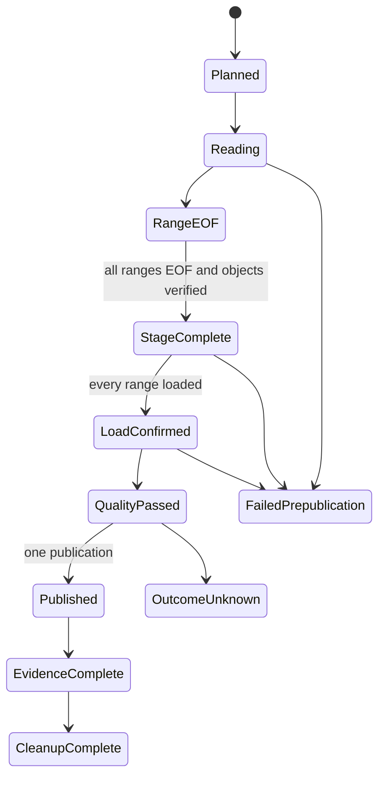

# Feature design: bounded MSSQL columnar range parallelism v1

- Status: APPROVED; runtime activation suspended since 0.87.1 and still suspended in 0.87.3
- Owner: dpone maintainers
- Issue: user-requested follow-up to PR #225/#226
- Target release: 0.87.0; safety suspension: 0.87.1 and later until certified reactivation

Last verified: 2026-09-28

> **0.87.1+ safety notice:** independent review found that the shipped producer
> acquired its byte reservation after ODBC batch materialization and could also
> retain Python, Arrow, and Parquet representations outside that reservation.
> The implementation therefore did not satisfy this approved contract. In
> 0.87.1, `mode: required` fails before source I/O with
> `columnar_range_pre_read_byte_admission_unavailable`; `mode: auto` records the
> same reason and uses the serial columnar path. The algorithm below remains the
> approved target contract, not an active 0.87.1-0.87.3 capability.

## Executive summary

The existing MSSQL → Parquet/object storage → ClickHouse route reads one query
through one ODBC session. This design specifies deterministic, bounded parallel range
reading while retaining one run-owned publication barrier. Partition count and
reader, upload, and load concurrency are independent public settings; `4` is an
example, never a fixed runtime constant.

The measurable outcome is higher source throughput without weakening range
coverage, resource limits, quality gates, failure propagation, or ClickHouse
publication semantics. A run cannot publish when any planned range is missing,
failed, cancelled, duplicated, or unconfirmed.

## Personas and customer journey

| Persona | Goal | Current pain | Success signal |
|---|---|---|---|
| Data architect | Govern safe parallel extraction | One reader underuses source and network | Plan and evidence expose exact ranges and concurrency |
| Platform engineer | Bound resource and connection pressure | Worker knobs are otherwise easy to multiply accidentally | Aggregate row, byte, inflight, and connection budgets are enforced |
| Operator | Recover partial failures safely | Partial objects and target inserts are ambiguous | No publication; owned resources are reconciled and cleaned |

The user discovers the route in the MSSQL → ClickHouse guide, runs `dpone plan`
to inspect its immutable range plan and blockers, executes a synthetic pilot,
observes per-range and aggregate evidence, diagnoses stable blocker codes, and
retries only from a reconciled run state. Upgrades preserve single-reader
behavior unless parallelism is explicitly configured.

## Scope

### In scope

- The existing `mssql_odbc_arrow_parquet` object-storage pull route.
- Canonical `source.options.partitioning` normalization and typed range planning.
- Configurable partition count plus reader, upload, and load concurrency.
- Aggregate row/byte/inflight backpressure across all readers.
- Manual or source-capability-backed automatic bounds.
- Numeric, temporal, rowversion, and explicit SQL Server `uniqueidentifier`
  ranges using source comparison semantics.
- NULL routing, half-open boundaries, overlap/gap validation, empty and skewed
  ranges, deterministic range and plan fingerprints.
- Group-integrity admission for declared keys and fail-closed window-query use.
- `shared_per_run` and `per_partition` staging topology contracts.
- One final quality/publication barrier after all ranges reach EOF and their
  staged row counts are confirmed.
- Synthetic unit, integration, fault-injection, CLI/plan, schema, and docs tests.

### Non-goals

- Changing the default route or auto-enabling parallelism.
- Exporting a SQL Server snapshot token between independent sessions; SQL Server
  does not expose one through this route.
- Arbitrary user SQL fragments as range predicates.
- Splitting one declared window/group partition across source ranges.
- Publishing or retagging `0.85.0`.
- Live corporate infrastructure or credentials.

### Assumptions and constraints

- Each reader uses `MSSQLConnectorPort.open_session()` and owns its session.
- Cross-session consistency requires an immutable source, database snapshot,
  temporal `AS OF` query, or operator-enforced write exclusion. Independent
  `SNAPSHOT` transactions are not represented as one coherent snapshot.
- The range column must be available to the wrapper query and comparable by SQL
  Server. UUID ranges are explicit because UUID arithmetic is undefined and SQL
  Server ordering is not raw-bit ordering.
- Existing ClickHouse staged-load validation and publication remain authoritative.

## Public contract

### CLI

No new command is introduced. `dpone plan <manifest> --format json` adds a
`columnar_fast_path.details.range_parallelism` object containing normalized
policy, stable plan fingerprint, planned range count, concurrency and topology.
Invalid combinations exit non-zero before source I/O. Text/Markdown plan output
continues to render blockers and warnings. `run` success is impossible until the
single publication barrier succeeds.

### Python API

Canonical models live under `dpone.contracts`; planner/runtime policy lives under
`dpone.runtime`. Existing imports remain valid. New dataclasses are immutable.
Ports accept injected session factories, executors, clocks, and budgets; adapters
do not import concrete credentials or create hidden global clients.

### Manifest/schema

The canonical existing surface is extended, not duplicated:

```yaml
source:
  options:
    partitioning:
      column: record_id
      num_partitions: 8
      export_workers: 4
      load_workers: 2
      bounds: auto
      planner:
        boundary_type: numeric
        null_bucket: separate
      range_parallelism:
        mode: required          # off | auto | required
        reader_workers: 4
        upload_workers: 2
        max_inflight_ranges: 4
        max_inflight_rows: 200000
        max_inflight_bytes: 536870912
        gap_policy: reject      # reject | allow_explicit
        consistency: immutable  # immutable | database_snapshot | temporal_as_of | write_exclusion
        consistency_authority: {}
        staging_topology: shared_per_run # shared_per_run | per_partition
        group_key: []
```

`num_partitions` remains the canonical partition count. The route-local
`reader_workers`, `upload_workers`, and `load_workers` are strict concurrency
caps; a simultaneously supplied legacy `export_workers` must agree with
`reader_workers` or preflight rejects the manifest. New settings are strictly
validated and appear in compiled/pack fingerprints.
Defaults preserve one reader and `shared_per_run`; byte-bounded claims require a
positive byte budget and byte measurements from every producer item.
`shared_per_run` requires `load_workers: 1` so each range receipt is measured as
an authoritative staging-table count delta. Use `per_partition` for parallel
ClickHouse range loads; its isolated staging tables make per-range counts
independently observable before assembly.

Manual explicit intervals may be supplied as `partitioning.ranges`, each with a
typed `lower`, `upper`, `include_lower`, `include_upper`, and optional `null`
bucket. They are normalized into the same `RangePartition` AST. Intervals must be
sorted, non-overlapping, and contiguous unless `gap_policy=allow_explicit`.

### Artifacts and evidence

Evidence schema `dpone.native_transfer.columnar_range_parallelism.v1` contains:

- policy and plan fingerprints;
- source consistency mode and staging topology;
- sanitized ranges, typed boundary family, inclusivity, and boundary hashes;
- requested and observed maximum reader/upload/load concurrency;
- per-range state, rows, bytes, object checksums, EOF and stage confirmation;
- aggregate rows/bytes/inflight high-water marks;
- cancellation/failure and cleanup outcomes;
- publication barrier and receipt identity.

Passwords, connection strings, SQL parameters, and unredacted boundary/source
values are never evidence fields.

### Compatibility and migration

The configuration is additive and opt-in. In 0.87.1, old manifests compile to one logical range,
one reader, and existing `shared_per_run` behavior. Existing provider IDs and
route defaults do not change. `mode: auto` explicitly records the safety blocker
and selects serial execution; `mode: required` rejects before source I/O.
Disabling `range_parallelism` keeps the serial route. Artifacts are versioned;
an older runtime rejects a new parallel plan instead of silently executing it
serially.

## Detailed algorithm

1. Parse and normalize canonical partitioning and range-parallelism options.
2. Fetch source metadata and bounds before worker creation. Reject unsupported
   type, unsafe consistency, unresolved group/window integrity, bad ranges, or a
   topology unsupported by the selected sink capability.
3. Produce a canonical range AST and SHA-256 plan fingerprint including query,
   schema, consistency, topology, budgets, and all normalized ranges.
4. Create a run-owned object prefix and staging plan. Open at most
   `export_workers` independent MSSQL sessions.
5. Each worker renders only the canonical typed predicate, reads its assigned
   range, and acquires aggregate row and retained-byte budget before handing a
   batch to the bounded upload lane.
6. Seal Parquet chunks to range-owned keys. Record checksums and row/byte counts;
   release aggregate budget only after downstream ownership transfers.
7. On first failure or cancellation, stop scheduling, cancel/close every reader,
   await all workers, preserve the primary error, and clean only run-owned data.
8. After all ranges reach EOF, verify exact range set, unique ordinals, contiguous
   chunk ordinals, checksums, and aggregate counts. Empty ranges are explicit
   confirmed states, not missing work.
9. Load into the selected topology. `shared_per_run` uses one run-owned staging
   table. `per_partition` uses one run-owned staging table per range and then a
   supported all-partitions assembly step into the authoritative run staging.
10. Confirm staged row counts for every range from target-side observations. A
    shared table uses sequential before/after count deltas; parallel loads use
    isolated per-partition tables. Run existing quality gates against
    the authoritative staging table. Only then invoke the existing single
    ClickHouse publication path and emit success evidence/checkpoint.
11. Cleanup occurs after publication reconciliation. Partial business targets are
    never success and never become publication inputs.

### Pseudocode

```text
policy = normalize(config)
plan = typed_range_planner.plan(policy, source_metadata)
preflight.require_safe(plan, source_consistency, window_groups, sink_topology)
attempt = journal.plan(run_identity, plan.fingerprint)
try:
    parallel(max=policy.reader_workers):
        session = source.open_session(range.application_name)
        for batch in read(session, render(plan.range)):
            aggregate_budget.acquire(batch.rows, batch.retained_bytes)
            upload_lane.submit(range, batch)
        journal.confirm_eof(range)
    upload_lane.join_or_raise()
    journal.require_all_ranges_confirmed(plan)
    staging = load_all_ranges(topology, load_workers)
    journal.require_all_staging_confirmed(staging)
    quality_receipt = validate(staging)
    publication_receipt = publish_once(staging, quality_receipt)
    evidence.complete(publication_receipt, observed_concurrency)
except BaseException as primary:
    cancel_all(); join_all(); cleanup_owned_resources_preserving(primary); raise
```

### State machine



### Edge cases

- NULL is routed once according to `null_bucket`; an empty NULL bucket is valid.
- Adjacent ranges use `[lower, upper)` and only the terminal finite range may be
  upper-inclusive. Explicit deviations require validation.
- UUID predicates cast validated literals to `uniqueidentifier` and rely on SQL
  Server comparison; Python byte/string ordering never plans UUID splits.
- Numeric and temporal bounds retain precision. `time` without a date is rejected.
- A declared group key must be the complete partition key and the range column
  must not divide equal group values; otherwise preflight blocks.
- Raw queries containing window functions are blocked unless an explicit,
  machine-checkable group-integrity declaration proves whole-group routing.
- Oversized single batches fail before exceeding a claimed aggregate byte budget.
- Source changes are safe only under the selected consistency authority.
- `database_snapshot`, `temporal_as_of`, and `write_exclusion` require a
  structured database-snapshot name, typed `as_of` value, or lease/proof
  reference respectively. Missing authority blocks before source I/O.

## Architecture

### Components and responsibilities

| Component | Existing/new | Responsibility | Dependencies |
|---|---|---|---|
| `PartitioningOptionsResolver` | extend | One canonical public config | contracts only |
| `RangePartitioner` and MSSQL renderer | extend | Typed ranges, UUID literals, validation | boundary models |
| Columnar range plan | new | Immutable identity and evidence | canonical fingerprint |
| Bounded range executor | new | sessions, cancellation, aggregate budgets | injected executor/session factory |
| MSSQL columnar provider | extend | range-owned Parquet/object keys | executor and writer ports |
| ClickHouse staged load | extend | topology capability and assembly | existing publication lifecycle |

### Ports, adapters and composition root

`MSSQLConnectorPort.open_session()` is the independent-session port. Range
planning is connector-neutral; MSSQL supplies metadata and predicate rendering.
The columnar runtime assembly injects the existing connector, object client,
writer, and sink topology capability. No vendor SDK import is added to base
import/help paths.

### Alternatives and tradeoffs

| Alternative | Advantages | Disadvantages | Decision |
|---|---|---|---|
| One reader | simplest consistency | lower throughput | compatibility default |
| Independent ungoverned queries | easy | gaps, overlap, partial success | rejected |
| Dynamic work stealing | handles skew | changes range identity during run | deferred |
| Deterministic static typed ranges | auditable, replayable | skew can remain | selected v1 |
| Shared staging | fewer tables | concurrent insert capability required | supported |
| Per-partition staging | isolated retry/accounting | assembly and cleanup cost | supported when sink capability passes |

### ADR requirement

Required: ADR 0075 records source-consistency authority, deterministic range
identity, aggregate resource ownership, topology, and the single publication
barrier. It extends rather than replaces existing ClickHouse publication ADRs.

### Quality-budget impact

New modules are split by stable responsibility and must remain below the
repository `max_sloc` budget. Shared schemas, `CHANGELOG.md`, and navigation are
integrator-owned. Import rules and clustering must not regress.

## Market comparison

Verified against official sources on 2026-09-28:

| System | Relevant capability | Adopt/reject | Source |
|---|---|---|---|
| dlt | Separate extract/load workers, file item/byte rotation, unique staging names | Adopt independent stage limits and run ownership; do not copy implicit defaults | https://dlthub.com/docs/reference/performance |
| Informatica CDI | MSSQL key-range and pass-through partitioning | Adopt explicit key-range concept; reject free-form pass-through predicates | https://docs.informatica.com/content/dam/source/GUID-0/GUID-0EFA0C0A-79B2-41B9-8CC1-34540DA06CFF/51/en/__Microsoft%28SQL%29ServerConnector_en.pdf |
| Apache Beam | Initial deterministic restrictions and dynamic splitting | Adopt immutable restriction identity; defer dynamic splitting | https://beam.apache.org/documentation/programming-guide/ |
| Microsoft SQL Server | UUID comparison and per-transaction snapshot semantics | Use server comparison and explicit consistency limits | https://learn.microsoft.com/en-us/sql/t-sql/data-types/uniqueidentifier-transact-sql and https://learn.microsoft.com/en-us/sql/connect/ado-net/sql/snapshot-isolation-sql-server |
| Airbyte | Cursor-based incremental sync | N/A: not a bounded full-snapshot range contract | https://docs.airbyte.com/platform/using-airbyte/core-concepts/sync-modes/incremental-append-deduped |
| Fivetran | Managed connector internals are not a configurable range contract | N/A | public docs reviewed 2026-09-28 |
| Pentaho | No selected normative source for this contract | N/A | N/A |
| Microsoft SSIS | Parallel data flow is relevant but package-specific | N/A for connector-neutral manifest contract | N/A |
| gusty | DAG construction, not source range execution | N/A | N/A |
| Astronomer Cosmos | dbt orchestration, not source range execution | N/A | N/A |

## Measurable differentiation

```yaml
axis: auditable bounded parallel snapshot throughput
scenario: synthetic 100M-row MSSQL table with skew and NULL partition values
baseline: same route with one reader
metric: rows_per_second with exact coverage and peak retained bytes
target: at least 1.5x throughput at 4 readers without duplicate/missing rows and within configured aggregate budget
procedure: reproducible synthetic benchmark, fixed plan fingerprint, three runs per setting
artifact: test_artifacts/mssql-columnar-range-parallelism-benchmark.json
limitations: no claim until live synthetic evidence exists for an exact commit/environment
```

## Security, privacy and operations

Only resolved connector sessions are cloned; credentials never enter plans or
evidence. Object keys and staging tables are run-owned. Alerts distinguish
preflight block, source-range failure, upload failure, load failure, quality
failure, publication-unknown, and cleanup failure. Operators can correlate every
range through sanitized IDs and the plan fingerprint.

## Test and certification plan

| Layer | Scenario | Environment | Expected artifact |
|---|---|---|---|
| Unit | options, bounds, UUID, NULL, overlap/gap, group policy | hermetic | pytest report |
| Contract | schema, plan output, fingerprints, defaults | hermetic | JSON fixtures |
| Integration | counts 1/2/4/7; worker limits 1/2/4; both topologies | fakes | deterministic event/evidence log |
| Fault injection | reader/upload/load cancellation and partial failure | fakes | no publication assertion |
| Live certification | exact MSSQL/ClickHouse/object-store route | approved synthetic only | UNVERIFIED until run |
| Performance | serial vs configured concurrency | approved synthetic only | benchmark JSON |
| Compatibility | old manifests and pack fingerprints | hermetic | regression tests |

## Documentation plan

Update configuration reference, MSSQL → ClickHouse tutorial/how-to, object
storage architecture/runbook, source-sink matrix, example manifest, changelog,
and generated schemas. Document connection pressure, consistency, group
integrity, topology atomicity, recovery, and diagnostics.

## Rollout and rollback

Opt-in `mode=required` is the production path; `auto` may fall back before source
I/O with evidence. Defaults remain serial. Rollback disables parallelism only
after active attempts are reconciled. Promotion to a preferred route requires
exact-version synthetic certification and benchmark evidence.

## Agent execution plan

| Agent/role | Owned paths | Read-only paths | Forbidden paths | Dependency |
|---|---|---|---|---|
| architect | none | all relevant runtime/contracts/docs | all writes | approved spec review |
| implementer | task-contract paths only | related runtime/tests | shared semantic files | this spec |
| test certifier | tests/evidence assigned separately | implementation | shared semantic files | implementation |
| docs/UX reviewer | docs assigned separately | config/runtime/tests | release controller | stable contract |
| integrator | shared schemas/docs/changelog/runtime composition | all | version/tag/PyPI | all findings |

## Approval checklist

- [x] User problem and CJM are clear.
- [x] Algorithm and failure semantics are implementable without guessing.
- [x] Public contracts and compatibility are explicit.
- [x] Architecture and alternatives are justified.
- [x] Relevant market research uses current official sources.
- [x] Claimed differentiation is measurable.
- [x] Tests, evidence, docs, rollout, and rollback are complete.
- [x] Path ownership and integration plan are conflict-safe.
- [x] Explicit user implementation request on 2026-09-28 constitutes maintainer approval.
