# Feature design: certified MSSQL ODBC range parallelism v2

- Status: RESEARCHED
- Owner: dpone maintainers
- Issue: production reactivation follow-up to PR #225/#226 and the 0.87.1 safety suspension
- Target release: next patch release after approval and exact-commit certification

Last verified: 2026-09-29

## Executive summary

The deterministic MSSQL range route exists, but releases 0.87.1 through 0.87.4
correctly keep it fail-closed. The implementation reserves row capacity before
`fetchmany()`, but reserves bytes only after the ODBC driver and pyodbc have
materialized the batch. The Parquet writer can then retain the original Python
rows, copied row and column lists, Arrow arrays/table, Parquet encoder buffers,
and upload state at the same time. Evidence v1 records configured reservations
and encoded object bytes; it does not prove retained memory or RSS.

This design reactivates the route through a request-specific, versioned admission
capability. A single admission ticket covers the maximum simultaneously live
ODBC, Python, Arrow, Parquet, and upload representations before a payload fetch.
Strict process-memory claims require isolated workers inside one enforceable OS
memory controller; an in-process estimator alone is never described as a hard
memory limit. Cgroup-accounted memory is the enforcement truth. Sampled
process-set RSS is a separate observation and is never used as proof that an
unsampled peak did not occur. The route remains behind one ClickHouse
publication barrier.

The outcome is a production-selectable MSSQL ODBC range route with deterministic
coverage, bounded concurrency, truthful evidence, safe retry identity, and an
exact-commit live certificate. Reactivation is prohibited until every release
gate in this document passes.

## Personas and customer journey

| Persona | Goal | Current pain | Success signal |
|---|---|---|---|
| Data architect | Select a fast governed MSSQL full-snapshot route | The route is visible but always suspended | Plan explains whether the exact projection is admitted and why |
| Platform engineer | Bound source sessions and worker memory | Row and encoded-file limits do not bound process memory | Admission and RSS evidence use distinct, reviewable metrics |
| Operator | Diagnose and retry without duplicates | Partial objects and publication-unknown outcomes are ambiguous | Attempt-owned objects, durable chunk journal, reconciliation-only recovery |
| Release owner | Promote only current proof | Serial or mocked evidence could be mistaken for range certification | Exact SHA/environment artifact closes the route gate |

The user first runs `dpone plan --format json`. The plan reports the selected
admission profile, schema-width authority, admitted batch size, aggregate charge,
source consistency authority, worker isolation capability, and stable blocker
codes. The user starts with `mode: auto` and an explicit profile for a reversible
pilot, then changes to `required` once the plan passes. During execution, evidence
separates admitted bytes, encoded bytes, Arrow pool observations, and sampled RSS.
On failure, the operator follows the attempt reconciliation result; they never
edit evidence or blindly replay a publication-unknown attempt.

## Scope

### In scope

- Reactivation of the existing `mssql_odbc_arrow_parquet` range route for
  MSSQL -> Parquet/S3-compatible object storage -> ClickHouse.
- Exact projected-schema inspection before payload reads.
- Conservative, versioned upper bounds for every admitted scalar type.
- One pre-read ticket covering all simultaneously live producer representations.
- Effective `fetchmany` row count derived from the ticket, never only from a
  user-supplied batch size.
- A bounded Arrow/Parquet writer and bounded file uploader with explicit ownership.
- Linux isolated workers with a cgroup v2 memory limit for a strict
  cgroup-accounted-memory profile.
- Stable operation identity, unique attempt identity/prefix, create-or-compare
  object writes, and durable per-chunk receipts.
- Evidence schema v2 and v1 read compatibility without reinterpretation.
- `off`, explicit-profile `auto`, and `required` behavior.
- Existing typed ranges, consistency checks, both staging topologies, quality
  gates, and the single governed ClickHouse publication barrier.
- Hermetic, fault-injection, live, RSS, replay, and performance certification.

### Non-goals

- Treating encoded Parquet bytes or configured reservations as RSS.
- Supporting `varchar(max)`, `nvarchar(max)`, `varbinary(max)`, `xml`,
  `text`, `ntext`, `image`, UDT, vector, or unknown-width projections in v2.
- Silently truncating values or using `SQL_ATTR_MAX_LENGTH` to manufacture a bound.
- User-defined memory multipliers or an extensible memory-plugin framework.
- Dynamic range splitting or partial-range resume.
- Changing the serial ODBC route or making old manifests parallel implicitly.
- Claiming a portable hard RSS bound without an OS-enforced worker boundary.

### Assumptions and constraints

- The first certified strict profile is Linux/cgroup-v2-specific and fail-closed
  when the controller or required metrics are unavailable.
- Metadata discovery may query schema and bounds, but no range payload row may be
  fetched before admission succeeds.
- SQL Server independent sessions do not share a snapshot token. A certified run
  requires a machine-verifiable database snapshot, temporal `AS OF`, or active
  write-exclusion lease. A bare `immutable: true` assertion is not sufficient.
- Every admitted projection has a finite server-declared octet/precision bound.
- Exact dependency and driver identities are part of the profile digest.
- Credentials and raw source values never enter evidence.

### First-release applicability

The first v2 certificate is deliberately narrow. Every item outside this matrix
is a stable plan-time blocker, not an invitation to execute the dormant path:

| Dimension | Admitted in the first release | Blocked |
|---|---|---|
| Source/sink | MSSQL physical base table -> ClickHouse table | Views, table-valued functions, joins, arbitrary SQL, and other connectors |
| Load strategy | `full_refresh` through governed staging/publication | Incremental append/merge, partition replace, CDC, backfill, and direct target writes |
| Provider/execution | `object_storage_pull`, chunked Parquet, exact MinIO profile certified by image/config digest | AWS S3 and every other S3-compatible backend until separately live-certified; direct push, queryout/BCP, legacy encoded paths |
| Projection | Explicit base columns and metadata-preserving aliases | Expressions and computed columns; an explicit finite `CAST` is deferred until separately certified |
| Types | Closed profile table of finite-width SQL Server types, collations/codepages, precision, scale, and nullability | Every type/profile tuple not present in the signed table, including all MAX/LOB/XML/UDT/vector types |
| Partition planning | Explicit manual numeric half-open ranges, terminal upper inclusion, and `null_bucket: separate` | Automatic/stats bounds, temporal, rowversion and UUID boundaries, alternate NULL policies, and dynamic splitting |
| Consistency | `temporal_as_of` on one system-versioned base table | Database snapshots, write-exclusion and bare immutable assertions until each has its own live certificate |
| ClickHouse staging | `shared_per_run` and `per_partition` in a local Atomic database with plain MergeTree tables and an authoritative all-writer guard, both live-certified | Distributed/Replicated topology, external unguarded writers, and any combination absent from the certificate |

The certified type table is versioned profile data with golden input/output
vectors. Server-described result metadata is compared with cursor metadata before
the first payload fetch. A missing tuple or mismatch blocks; the runtime never
falls back to a guessed bound.

## Public contract

### CLI

No new top-level command is introduced. Planning gains
`--preflight offline|live`; the default is `offline` for compatibility.
`dpone plan <manifest> --preflight live --format json` retains the existing
`columnar_fast_path.details.range_parallelism.status` values (`planned`,
`serial`, `serial_fallback`, `blocked`) and adds:

- `admission_status`: `not_applicable`, `offline_unverified`, `pass`, or `fail`;
- `admission_profile`, `admission_profile_digest`, and `bound_scope`;
- `schema_authority_digest`, admitted/rejected column summaries, and stable reasons;
- `row_width_upper_bound`, `admitted_batch_rows`, `batch_charge_bytes`, and
  aggregate row/byte/range caps;
- worker isolation/RSS enforcement availability and consistency receipt status;
- operation identity inputs, staging topology, and plan fingerprint.

Offline plan does not open credentials, contact MSSQL, acquire consistency
authority, create a cgroup, or claim activation. An otherwise eligible `required`
request is `status=blocked`, `admission_status=offline_unverified`, exits `2`, and
reports `columnar_range_live_preflight_required`; eligible `auto` is
`status=serial_fallback`, has the same admission status/reason, and exits `0`.
`off` remains `status=serial`, `admission_status=not_applicable`. Live plan resolves
credentials, contacts metadata/bounds only under the consistency authority,
inspects delegated cgroup capacity and dependencies, and has a maximum 30-second
connection/statement budget. It never fetches range payload rows or creates
objects/staging resources. For consistency it only verifies a pre-existing,
explicitly supplied temporal authority; it never creates or renews write-exclusion
or other leases. Verification uses read-only permissions and closes every handle
on success, error, timeout, SIGINT, or cancellation. JSON reports receipt digest,
verification time, as-of value, and cleanup result. `run` repeats live preflight
and rejects drift.

Invalid `required` live or offline plans exit `2`; machine-readable JSON goes to stdout and
diagnostics to stderr. Successful `auto` fallback exits `0`, names the serial
route, and emits a warning to stderr; `--warnings-as-errors` retains its existing
behavior. Runtime processing failures exit `1`; publication-unknown exits `3` and
is never reported as a retryable extraction failure. Text and Markdown render the
same decision/recovery guidance. `run` cannot emit success or advance a checkpoint
until publication and evidence are durable. JSON additions are additive.

### Python API

New immutable contracts live under `dpone.contracts`; capability-oriented ports
live under `dpone.ports`; ODBC, cgroup, Parquet, and upload implementations live
under `dpone.adapters`; orchestration remains under `dpone.runtime`. A narrow
`AdmittedOdbcBatchReader` port returns batches only under a live ticket. The
existing broad connector port is not expanded with memory policy.

Factories receive admission, worker-isolation, object-write, journal, sampler,
clock, and cancellation dependencies at composition roots. There are no global
capability booleans, hidden clients, import-time probes, or vendor imports on
base import/help paths.

### Manifest/schema

The existing surface gains one explicit opt-in profile:

```yaml
source:
  options:
    partitioning:
      column: record_id
      num_partitions: 8
      range_parallelism:
        mode: required               # off | auto | required
        admission:
          profile: isolated_cgroup_v1
        reader_workers: 4
        upload_workers: 2
        max_inflight_ranges: 4
        max_inflight_rows: 200000
        max_inflight_bytes: 536870912
        consistency: temporal_as_of
        consistency_authority:
          as_of: "2026-09-29T00:00:00Z"
          receipt_ref: temporal-receipts/synthetic-events/2026-09-29
          verifier_id: platform_temporal_authority
        staging_topology: per_partition
```

`max_inflight_bytes` means aggregate pre-read admitted producer charge, not
encoded output size, cgroup usage, or RSS. The profile defines its charge model
and enforced cgroup-accounted envelope. Users cannot supply coefficients. Old
manifests retain their exact previous behavior: `off` and `auto` remain serial,
while legacy `required` remains fail-closed. An older runtime rejects the new
profile as unsupported.

Execution also requires an explicit stable `operation_key` supplied by the
Python runtime invocation context. A scheduler supplies the same logical job/
scheduled-occurrence key across retries; a manual caller must supply and retain
its key through that context. Missing identity blocks execution. This proposal
does not invent a manifest field or CLI flag for it: the standard CLI blocks
until its configured runtime composition supplies this invocation context.
Live planning remains available without starting an operation.

Decision matrix:

| Mode and request | Result |
|---|---|
| old or new `off` | Serial, unchanged |
| old or new `auto` without explicit profile | Serial, unchanged |
| old `required` without explicit profile | Existing fail-closed blocker is preserved; never downgraded to serial |
| `auto` with profile and all gates passing | Parallel |
| `auto` with a parallel admission/capability blocker | Serial fallback with stable reason if the serial provider preserves guarded publication and the temporal boundary; otherwise blocked before payload I/O |
| `required` with all gates passing | Parallel |
| `required` with any blocker | Non-zero blocked result, before payload I/O |

`auto` fallback always selects the existing serial
`mssql_odbc_arrow_parquet/object_storage_pull` provider over the full source
boundary. Range predicates, range worker settings, and partial range plans become
inactive and are listed as such. For explicit-profile v2 requests, the temporal
source boundary and guarded publication context remain mandatory. The serial plan
has its own route/plan fingerprint and evidence records `full_source_coverage:
true`, `fallback_from`, and the blocker. It never reads one planned range as if it
were the full table.

### Stable reason taxonomy

The plan and runtime use these public codes; implementations may add detail but
must not substitute free text for the code:

| Code | Meaning |
|---|---|
| `columnar_range_live_preflight_required` | Offline plan cannot certify activation |
| `columnar_range_route_scope_unsupported` | Source, strategy, provider, projection, or topology is outside the certified matrix |
| `columnar_range_projection_unbounded` | MAX/LOB/unknown or otherwise non-finite projection |
| `columnar_range_type_profile_unsupported` | Type/collation/precision tuple is absent from the signed profile |
| `columnar_range_row_too_wide` | One maximum-width row cannot fit one batch ticket |
| `columnar_range_admission_arithmetic_overflow` | Charge calculation overflowed or was invalid |
| `columnar_range_profile_runtime_drift` | Driver/dependency/profile/schema identity changed |
| `columnar_range_cgroup_unavailable` | Delegated controller, membership, swap policy, or capacity is invalid |
| `columnar_range_sampler_unavailable` | Required observation sampler cannot start or was lost |
| `columnar_range_session_capacity_unavailable` | Certified independent-session capacity is unavailable |
| `columnar_range_consistency_invalid` | Authority is missing, self-authored, unbound, or rejected |
| `columnar_range_consistency_expired` | Authority expired or lost while source observations were authoritative |
| `columnar_range_writer_unavailable` | Exact bounded Arrow/Parquet writer is unavailable |
| `columnar_range_uploader_unavailable` | Bounded conditional-create uploader is unavailable |
| `columnar_range_source_schema_drift` | Planned and cursor/result metadata differ |
| `columnar_range_driver_over_return` | Driver returned more rows/bytes than the ticket admits |
| `columnar_range_memory_limit_breached` | Cgroup peak/events or OOM prove an envelope breach |
| `columnar_range_publication_unknown` | Publication dispatch outcome is not authoritative |
| `columnar_range_cleanup_incomplete` | Owned-resource cleanup could not be proven complete |
| `columnar_range_journal_unavailable` | Durable transactional CAS journal cannot be reached |
| `columnar_range_journal_corrupt` | Journal checksum, sequence, or transaction record is invalid/torn |
| `columnar_range_operation_fence_held` | Another live owner epoch holds the operation fence |
| `columnar_range_operation_fence_stale` | Caller epoch is stale or renewal was lost |
| `columnar_range_reconciliation_required` | Durable state requires reconciliation before execution |
| `columnar_range_fenced_unknown` | Publication remains unknown and no new attempt is allowed |
| `columnar_range_operation_identity_missing` | Invocation context has no stable operation key |
| `columnar_range_operation_identity_conflict` | Existing operation key is bound to different immutable payload |
| `columnar_range_target_guard_unavailable` | All-writer target exclusion and mutation fencing cannot be enforced |
| `columnar_range_snapshot_order_regression` | Requested temporal snapshot precedes the last published snapshot |

### Artifacts and evidence

New runtime evidence uses
`dpone.native_transfer.columnar_range_parallelism.v2`. It records:

- stable operation ID, unique attempt ID/prefix, exact plan/profile/schema digests;
- exact commit, image/package, OS/controller, ODBC driver, Python, pyodbc,
  PyArrow, compression codec, and uploader identities;
- admitted row-width and batch charge, requested caps, admitted high-water, and
  ticket lifecycle counts;
- encoded/local Parquet bytes and object checksums as separate fields;
- cgroup path/membership digest, `memory.max`, `memory.swap.max`, baseline,
  `memory.current`, reset `memory.peak`, and before/after `memory.events` counters;
- sampled RSS baseline/peak/delta, process-set scope, sampling method/interval,
  missing sample count, and the exact injected Arrow memory-pool peak as
  observations distinct from kernel enforcement;
- per-range sanitized query/parameter/bound digests, start/EOF state, session identity, chunk receipts, stage
  receipts, cancellation, cleanup, reconciliation, and publication receipt;
- consistency authority receipt digest and its validity through final range EOF.

Evidence v1 remains readable as historical v1. Its `bytes_high_water` and
`retained_bytes` are never renamed, migrated, or interpreted as RSS/admitted v2
metrics. Evidence validation rejects missing samples, profile/environment drift,
SKIP, incomplete ranges, budget breaches, and identity mismatches for a live
certificate.

Runtime strict mode requires cgroup counters and membership enforcement on every
attempt; a lost controller or sampler fails the attempt. Full <=10 ms RSS traces
and Arrow-pool traces are required in certification evidence. Routine runtime
evidence may retain their aggregates plus sampler health rather than every sample.
Neither mode substitutes RSS for cgroup `memory.peak/events`.

Attempt-owned certification artifacts use:

```text
test_artifacts/live_certification/mssql-columnar-range-parallelism/<run-id>/
  certificate-index.json
  environment.json
  manifest.sanitized.json
  junit.xml
  range_execution.json
  reconciliation.json
  memory.json
  benchmark.json
  validation-report.md
```

Artifacts are written atomically under an attempt-owned create-once prefix and
retained according to the configured evidence policy; operators need read access,
release validators need immutable read access, and no runtime may overwrite a
completed certificate. `manifest.sanitized.json` is a canonical credential-free
identity document, not the submitted secret-bearing manifest. A versioned
certificate index records producer/validator versions, exact git SHA and source
snapshot digest, `dirty: false`, workflow run/attempt, package/image/environment
digests, and a canonical digest for every required artifact. The validator
recomputes the closure and rejects extra, missing, substituted, ancestor-SHA, or
manually edited artifacts.

The bundle is not its own trust root. Release verification fetches it through the
GitHub Actions API by immutable artifact ID and checks the provider-authenticated
artifact digest/attestation, exact artifact name, successful workflow conclusion,
run attempt, trusted workflow path/ref/event, and `head_sha` equal to the frozen
candidate/tag commit. Protected keyless provenance may replace the provider
digest only when the verifier checks its identity policy. A copied workspace
directory or internally recomputed index can never close the release gate.

### Compatibility and migration

- Serial behavior, defaults, imports, and old manifests remain compatible.
- Existing v1 plans/evidence remain valid historical records but cannot activate v2.
- Adding an admission profile is the explicit migration action.
- `auto` provides audited fallback; `required` is the production enforcement mode.
- Rollback removes the profile or sets `off`, but only after the active attempt is
  reconciled. Publication-unknown attempts cannot be bypassed by configuration.
- Range/plan fingerprints include profile and schema-authority digests, so an
  estimator or dependency change creates a different plan.

### Normative memory model

The signed profile fixes all coefficients, alignments, dependency identities,
and golden vectors. Users can lower certified concurrency/caps; they cannot edit
coefficients or raise a cap beyond the certificate.

For projected schema `S`, admitted rows `n`, configured readers `N`, and alignment
`A` (64 KiB in `isolated_cgroup_v1`):

```text
R(S) = sum(closed_profile_bound(type, collation, precision, scale, nullable))

C_batch(S, n) = align_up(
    B_odbc(S, n)
  + B_python(S, n)
  + B_arrow(S, n)
  + B_parquet(S, n, codec)
  + B_upload(S, n)
  + B_ipc(S, n), A)

P_run(N) = align_up(F_supervisor + N * F_worker_session + sum(F_helper_process), A)
H(N) = align_up(max(H_absolute, ceil(H_ratio * (P_run(N) + max_inflight_bytes))), A)
L = align_up(P_run(N) + max_inflight_bytes + H(N), page_size)
```

`B_*`, `F_*`, `H_*`, codec, allocator, row-array behavior, and rounding rules are
profile constants/functions, not manifest fields. Arithmetic uses checked unsigned
64-bit operations; overflow blocks. `C_batch` covers the maximum simultaneously
live fetch -> Python -> Arrow -> Parquet -> upload set. Let
`K = min(N, max_inflight_ranges, number_of_planned_ranges)`. Empty ranges are
included because discovering EOF still requires a session and admitted fetch. The effective
batch size is the greatest `n >= 1` satisfying both
`K * C_batch(S,n) <= max_inflight_bytes` and
`K * n <= max_inflight_rows`. Multiplication is checked. Configured concurrency is
not silently reduced: if no such `n` exists, or if
`P_run(N) + max_inflight_bytes + H(N)` does not fit the delegated parent, preflight
blocks and tells the user to select a lower certified `reader_workers` value.

Before cgroup creation or any worker/dependency/session allocation, the coordinator
acquires an operation fence and a persistent run reservation for `P_run(N)`. It
then creates one delegated run cgroup with `memory.max = L`,
`memory.swap.max = 0`, resets/records `memory.peak/events`, and places the
supervisor plus every producer child/helper/uploader in it before they allocate or
perform source I/O. Escape or unexpected membership is terminal. Filesystem cache
and other memory charged by cgroup v2 are intentionally inside this enforced
boundary. Every separate uploader/helper baseline is represented by
`F_helper_process`; an unprofiled helper process is forbidden.

One process-safe coordinator is the sole authority for batch tickets. Across all
workers, `sum(outstanding C_batch) <= max_inflight_bytes`. Authenticated,
length-framed IPC binds worker ID, operation fence epoch, range, batch ordinal, and
ticket. Coordinator loss closes admission; worker crash revokes its ticket only
after the process is dead and its resources are reconciled. Acquisition order is
always operation fence -> persistent run reservation/cgroup -> range slot ->
atomic batch ticket -> fetch. Release reverses ownership after durable upload
receipt and destruction of all batch representations. No worker may create a
private aggregate budget.

The operation fence is a renewable lease with an owner epoch. The coordinator
renews before its safety margin and validates the current epoch before every
externally visible side effect: source statement/fetch, object create/adopt,
journal CAS, staging mutation, publication dispatch, evidence/checkpoint write,
and cleanup. Renewal loss closes admission, cancels workers, forbids new side
effects, and enters reconciliation. A stale epoch is never accepted and a new
controller cannot take over until authoritative reconciliation transfers the
fence. Every terminal path releases, in reverse order, batch tickets, range slots,
sessions/workers, cgroup/run reservation, consistency authority, and operation
fence. Release target ownership last, only after server settlement and a durable
resolved target-index record. Publication-unknown deliberately keeps operation
and target exclusion under a reconciliation owner until the target outcome
becomes authoritative.

`memory.max/current/peak/events` and OOM counters are the authoritative hard proof.
Sampled process-set RSS and Arrow-pool metrics explain behavior but cannot pass an
attempt whose kernel accounting failed. Near-boundary golden/live trials prove
the equation and membership.

### Consistency authority

`receipt_ref` is an opaque lookup key, never a credential or arbitrary URL.
`verifier_id` selects a deployment-configured `TemporalAuthorityVerifier` port
in the composition root. The trusted platform authority issues the receipt;
dpone never creates its own trust assertion. Deployment configuration binds that
verifier to an authenticated receipt store and an allowlist of issuer/key IDs.
The receipt contains a version, issuer, key ID, signature, subject server/database
and relation IDs, normalized UTC `as_of`, temporal/history relation identities,
retention authority and validity interval. Verification checks signature, issuer,
expiry, exact subject/as-of binding and source identity under read-only access.
Unknown verifier, missing receipt, invalid signature, wrong subject or expired
authority produces `columnar_range_consistency_invalid` before payload I/O.
The example is usable only after the platform provisions that receipt/verifier;
an `as_of` timestamp alone is insufficient. Tests use an independently provisioned
test issuer; live evidence records issuer/key ID and receipt digest, never keys.

The v2 contract defines these machine-verifiable authority families, but the
first release capability matrix activates only `temporal_as_of`. The other two
remain stable blockers until independently live-certified:

- `database_snapshot`: snapshot database ID/name, source database ID, creation
  LSN/time, issuer and signature/fence generation; every metadata, bounds, range,
  and reconciliation query targets that same snapshot.
- `temporal_as_of`: one normalized UTC value and relation identity bound into a
  signed receipt; every source query uses the same `FOR SYSTEM_TIME AS OF`.
- `write_exclusion`: issuer, subject relation, owner/operation, fence epoch,
  acquired/expiry time, renewable lease token digest, and verification endpoint.

The authority is acquired and fenced before metadata/bounds. It is checked before
every source statement/fetch and after final source reconciliation. The
write-exclusion lease is renewed before its safety margin; expiry or uncertainty
mid-fetch cancels the attempt, invalidates all source observations, and blocks
publication. The same-authority final source count/hash is required. `immutable`
always blocks v2; it remains readable only for serial/v1 compatibility. Receipts
cannot be self-authored by the runtime under test.

### Deployment prerequisites and first run

The deployment must provide a non-root delegated cgroup v2 subtree (container,
systemd scope, or Kubernetes pod/runtime integration), ODBC Driver 18, pinned
Python/pyodbc/PyArrow/codec versions, metadata/bounds and independent-session
permissions, a durable CAS journal, S3 conditional create/read/list/delete for
the attempt prefix, and ClickHouse named-collection/staging permissions. The app
does not receive host-wide cgroup administration.

Before `run`, configure the invocation-context provider with a stable logical
operation key, the authoritative target guard, and the temporal receipt verifier
and store. The stock CLI without that composition fails with the corresponding
missing-capability reason. Retry reuses the operation key; starting a genuinely
new snapshot uses a new key after target reconciliation. The commands below assume
these deployment prerequisites have been met.

```bash
dpone plan manifest.yml --preflight live --format json > plan.json
dpone run manifest.yml --format json
```

The redirection above is ordinary shell output, not an atomic dpone file contract;
use a temporary file plus rename when a durable plan capture is required. Runtime
evidence itself uses the atomic create-once artifact contract described earlier.

The first run uses explicit profile plus `auto`. The operator verifies
`status=planned`, `admission_status=pass`, profile/schema/plan digests, cgroup limit/membership,
consistency receipt, exact reconciliation, one publication, and the evidence
path. Only then is the same pinned deployment changed to `required`. A changed
schema, dependency, controller, authority, or cap requires a new live plan.

## Detailed algorithm

### Recovery and target ownership before source access

The operation lookup key is `(tenant, project, operation_key)` from the persisted
invocation context. Source/target identity, boundary, profile, schema and plan
digests are immutable operation payload, never lookup-key inputs. Reusing a key
with changed payload is a conflict; recovery uses the stored payload. A new key
cannot bypass the target's unresolved-operation index.

Before source access, load the operation journal and acquire the separate
canonical target guard. Its scope is the stable target authority ID plus database
and relation name, independent of connection aliases, strategy, source boundary,
operation key and all plan/profile digests. Resolve aliases through the target
authority. Check the target index for pending publication from any operation.
Reconcile published/unknown attempts using saved intent and target UUID mapping
before source metadata, schema admission, profile probes, or receipt verification.
Proven published operations finish evidence/checkpoint/cleanup without MSSQL.
Unknown operations preserve resources and block all later operations on that target.

Stored-state dispatch is exhaustive and precedes source access:

| Stored state | Disposition |
|---|---|
| Absent | Admit a new operation only after resolving the target index |
| Active owner | Reject duplicate execution; only that owner may continue |
| Failed/prepublication without intent | Reconcile owned resources and fence; a new attempt is allowed only after durable cleanup |
| Intent durable/in flight/unknown | Reconcile UUID mapping and server settlement; no extraction |
| Published/evidence or checkpoint incomplete | Complete finalization from the stored plan; no source access |
| Committed/cleanup incomplete | Return committed result and perform cleanup-only recovery |
| Committed/cleanup complete | Return the persisted result idempotently, without source access or a new attempt |
| Corrupt, missing required records, or unrecognized state | Fail closed pending journal reconciliation |

Explicit-profile `auto` fallback carries the same operation context, target guard
epoch, durable intent protocol and publication sequence into the serial provider.
The serial provider must prove full-source coverage and preserve the declared
temporal boundary. If it cannot honor these publication/consistency capabilities,
fallback is blocked before payload I/O; it may not discard the guard and run an
unguarded refresh. The earlier serial-fallback matrix assumes this compatibility
check passes. Legacy manifests without the v2 profile retain their existing path.

The target guard is an injected all-writer authority, required by ADR 0057;
the journal lease alone is insufficient. It is held from before source planning
through target mutation, server settlement and publication reconciliation. Its
epoch is enforced at mutation boundaries, including outstanding commands after
lease loss. Platforms unable to exclude other writers or fence outstanding
commands fail admission. The authority stores a monotonic publication sequence
and last published `as_of`; an older temporal snapshot cannot replace a newer one.

Each resource acquisition below is enclosed in a lifecycle scope from its first
acquisition, including errors during preflight or worker startup. Early fallback
and errors release acquired resources; unresolved publication retains durable
target exclusion for the reconciliation owner.

1. Parse and normalize manifest options. Reject unknown profiles and conflicting
   worker aliases without contacting the source. Resolve the invocation key,
   recover its journal and acquire target ownership as specified above.
2. Resolve route capabilities. A concrete admission capability, isolated-worker
   controller, bounded writer/uploader, sampler, and create-or-compare object
   store must match the selected profile. Absence is a blocker, never a boolean
   override.
3. Acquire and fence the consistency authority, then fetch result metadata and
   source bounds under that identical authority without fetching range payload rows.
   Normalize the exact projected SQL types, nullability, precision, scale, and
   declared octet lengths. Reject unbounded, unknown, lossy, driver-dependent, or
   unsupported values. The first release blocks projection expressions and
   computed columns; values are never silently truncated.
4. Compute a conservative row-width upper bound. The profile includes ODBC/native
   binding, Python row/scalar, Arrow validity/offset/data/builders/table, Parquet
   encoding/compression scratch and bounded upload components.
   It accounts for representations that coexist. One atomic ticket covers the
   maximum simultaneous set; staged sub-leases that can deadlock are forbidden.
5. Compute `admitted_batch_rows` as the minimum of configured rows, driver/profile
   cap, and the rows fitting one ticket at configured aggregate concurrency.
   Reject before payload I/O when one maximum-width row cannot fit.
6. Build the typed range plan and fingerprint. Bind source/target, boundary,
   plan/profile/schema and consistency digests to the stable invocation key by
   CAS; never derive a new lookup key from them. Acquire the operation CAS
   fence with owner epoch/lease; concurrent/stale controllers fail. Create a
   random unique attempt ID, immutable journal record, and object/staging prefix.
7. Reserve persistent run/worker memory, create the cgroup, enroll every producer
   process/helper before allocations, then import heavy dependencies and open
   sessions inside workers. The parent owns credentials and transmits only scoped
   connection material over authenticated IPC; workers never journal secrets.
8. For each scheduled fetch, atomically acquire row, range, and full byte charge
   before `execute`/first fetch and before every subsequent `fetchmany`. A waiting
   or cancelled worker performs no fetch. The reader may return no more rows or
   bytes than the ticket permits; capability violations fail the attempt.
9. Convert exactly one admitted batch without unaccounted row/column copies.
   Produce a bounded Arrow record batch and sealed local Parquet file. Upload the
   closed file with a bounded uploader. Hold the ticket until ODBC/Python/Arrow/
   Parquet/upload references are released and the upload receipt is durable.
10. Write chunks to immutable keys derived from operation, attempt, range ID and
    ordinal, and chunk ordinal, with conditional create-or-compare semantics.
   Immediately journal every checksum/size/range/chunk receipt. A retry never
   overwrites an object with different content.
11. Sample worker-process-set RSS and exact injected Arrow pool use through the attempt. The
    cgroup accounting/limit is the hard enforcement boundary. Crossing it, losing the
    controller, sampler failure, worker death, or OOM is a terminal failed attempt
    with no publication; configured admitted bytes are not substituted for RSS.
12. First failure closes admission, cancels ODBC statements/workers, stops new
    uploads, joins all workers, durably records known chunks, and preserves the
    primary error if cleanup also fails.
13. After every planned range reaches EOF, validate exact range and chunk sets,
    contiguity, checksums, counts, consistency receipt validity, and immutable
    inventory. Only then load both supported ClickHouse staging topologies.
14. Reconcile source, object, stage, and target counts plus typed hashes/schema.
    Run quality gates, persist fenced publication intent with old/replacement UUIDs
    before dispatch, then invoke exactly one governed publication. Advance state
    only after the publication receipt and v2 evidence are durable.
15. A failed prepublication attempt may be retried from a new attempt prefix after
    owned-resource reconciliation; partial ranges are not resumed. A published or
    publication-unknown attempt enters reconciliation-only recovery and cannot
    blindly publish again.

### Pseudocode

```text
policy = normalize(manifest)
operation = identities.lookup_key(invocation.tenant, invocation.project,
                                  invocation.operation_key)
stored = journal.lookup_before_source_access(operation)
target_guard = target_authority.acquire_canonical_target_guard(stored or policy)
pending = target_authority.inspect_unresolved_operations(target_guard)
disposition = dispatch_all_stored_states_without_source(stored, pending, target_guard)
if disposition.is_terminal_or_reconciliation:
    return disposition.result
require(disposition.allows_new_operation_or_reconciled_attempt)
capability = composition.resolve(policy.admission.profile)
authority = consistency.acquire_and_fence(policy, operation_subject)
metadata = source.describe_projection_without_payload_rows(authority)
schema_bound = capability.bound(metadata, exact_runtime_identity)
plan = planner.plan(policy, metadata, schema_bound, consistency_receipt)
decision = negotiate(policy.mode, capability, plan)
if decision is serial or serial_fallback:
    return serial_route_with_guarded_publication(
        decision.evidence, operation, target_guard, authority,
        durable_intent_protocol, publication_sequence)
if decision is blocked: fail_before_payload_io(decision.reasons)

journal.bind_immutable_payload_cas(operation, plan, source, target)
fence = journal.acquire_operation_cas(operation, owner, epoch, lease)
attempt = journal.begin_unique_immutable_attempt(fence)
run_reservation = budget.reserve_persistent_before_processes(plan.P_run)
cgroup = controller.create_run_group(memory_max=plan.L, swap_max=0)
workers = supervisor.start_enrolled(cgroup, authenticated_ipc, plan)
try:
    dispatch ranges to enrolled workers, concurrently up to reader_workers:
        session = worker.open_session(range.application_name, authority)
        while true:
            ticket = coordinator.acquire_before_fetch_atomically(
                rows=plan.admitted_batch_rows,
                bytes=plan.batch_charge_bytes,
                range=range.id,
            )
            with ticket:
                batch = session.fetchmany_at_most(ticket.rows)
                if batch.empty: journal.confirm_eof(range); break
                parquet = writer.seal_bounded(batch, ticket)
                key = attempt.key(range.id, range.ordinal, chunk.ordinal)
                receipt = uploader.conditional_create_or_compare(key, parquet)
                journal.commit_chunk_cas(receipt, fence)
                release_all_batch_references()
    supervisor.join_or_raise()
    journal.require_exact_ranges_chunks_eof(plan)
    staging = clickhouse.load_and_confirm(attempt.inventory, plan.topology)
    reconciliation = reconcile(source.under(authority), objects, staging, target)
    quality = validate(staging, reconciliation)
    method_plan = target_authority.select_from_sealed_catalog_and_content(
        staging, target, target_guard)
    intent = journal.persist_publication_intent_cas(
        operation, attempt, target_guard.epoch, quality.digest,
        method_plan, target_authority.next_sequence())
    journal.require_durable_ack(intent)
    publication = target_authority.publish_once_under_guard(intent, target_guard)
    journal.persist_publication_receipt_cas(publication, fence)
    evidence = evidence_v2.persist_create_once(attempt, publication)
    checkpoint.promote_cas(operation, publication, evidence)
    journal.mark_committed_cas(fence)
    cleanup_after_committed_reconciliation()
except BaseException as primary:
    budget.close(); cancel_all(); join_all()
    durable = journal.read_authoritative_state(operation, attempt)
    if durable.proves_prepublication:
        reconcile_then_cleanup_attempt_owned_resources(primary)
        release_terminal_resources_and_fence()
        raise ordinary_failed_attempt(primary, retry_allowed_after_cleanup=true)
    elif durable.proves_published:
        final = finish_evidence_checkpoint_and_cleanup_without_republish(primary)
        release_terminal_resources_and_fence()
        if final.cleanup_complete:
            return committed_result(recovered=true, exit_code=0)
        return committed_cleanup_warning(recovered=true, exit_code=1,
                                         retry_scope="cleanup_only")
    else:
        preserve_resources_fence_operation_and_reconcile_only(primary)
        return publication_unknown(exit_code=3, retry_allowed=false)
```

The coordinator/journal is a durable transactional CAS service, not process-local
memory. It acknowledges a record only after durable commit, validates checksums
and sequence numbers on read, rejects torn/corrupt records, and fences stale owner
epochs. Attempt records are terminal-immutable. The exact crash reconciliation is:

| Crash window | Authoritative observation and action |
|---|---|
| Object ACK before chunk journal | List deterministic attempt prefix; compare content digest/size; adopt matching object by CAS or quarantine mismatch |
| Chunk journal before EOF | Missing EOF means incomplete range; preserve inventory, reconcile, then clean and start a new attempt |
| Staging mutation before receipt | Query staging identity/count/hash under attempt fence; adopt exact match or discard entire prepublication staging attempt |
| Intent durable before dispatch, or dispatch before ACK | Permanently close/drain the original publisher under target exclusion; reconcile the frozen method-specific identities/content and claim history. Original observation proves not-published; desired observation with a claim proves published. Recovery never dispatches; uncertain observations retain the fence |
| Publication proven, receipt/evidence missing | Persist receipt/evidence/checkpoint idempotently; never re-extract or republish |
| Evidence durable, checkpoint missing | Promote checkpoint by CAS from publication/evidence identity |
| Checkpoint durable, cleanup incomplete | Business outcome remains committed; retry owned cleanup independently and report warning/failure evidence |

Publication method selection and recovery follow the
[guarded publication design](feature-design-clickhouse-publication-method.md)
and [runbook](clickhouse-publication-methods.md). Prefer REPLACE for one complete
snapshot partition with compatible physical design and no stale target partitions;
retain EXCHANGE for empty/multiple-partition snapshots and design changes. A
partition loop is not atomic full refresh. Unknown catalog visibility blocks.

For EXCHANGE, the saved old/replacement UUID mapping inspected under the target
guard and proven publisher closure are authoritative, with logical checks as
corroboration. For REPLACE, UUIDs remain unchanged: require frozen compatible
design, unchanged sealed staging and typed logical target parity after closure.
This parity is probabilistic and cannot be replaced by row counts alone. The
immutable acknowledged-claim history must survive unknown states; an unclaimed
operation never proves publication. Proven not published permits prepublication
cleanup and a new attempt. Proven published permits only finalization. Still
unknown fences the operation, preserves objects/staging, exits `3`, and requires
operator escalation; no new attempt is admitted.

The marker is the versioned durable pre-dispatch intent, bound to both generation
UUIDs, selected method, original/desired logical evidence, canonical partition
identity where applicable, target guard epoch, operation/attempt, quality receipt
and publication sequence. Existing UUID-v1 markers are not reinterpreted.
Counts/hashes alone never prove an exchange outcome. A journal state preceding
dispatch is not proof of nonpublication when intent exists. An absent ACK or
currently unchanged UUID mapping is also insufficient while a server command can
still settle. Recovery never repeats publication DDL, including REPLACE. The
unbound kernel is a prerequisite, not a production router or authority binding.

### State machine

```mermaid
stateDiagram-v2
    [*] --> OperationPreflight
    OperationPreflight --> SerialFallback: auto blocker
    OperationPreflight --> Blocked: required blocker
    OperationPreflight --> OperationFenced: admitted
    OperationFenced --> AttemptPlanned: unique immutable attempt
    AttemptPlanned --> WorkersEnrolled
    WorkersEnrolled --> WaitingForTicket
    WaitingForTicket --> Fetching: ticket acquired
    Fetching --> Encoding
    Encoding --> Uploading
    Uploading --> ChunkDurable
    ChunkDurable --> WaitingForTicket: more rows
    ChunkDurable --> RangeEOF: terminal empty fetch
    RangeEOF --> InventoryConfirmed: all ranges EOF
    InventoryConfirmed --> Loading
    Loading --> StagingConfirmed
    StagingConfirmed --> QualityRunning
    QualityRunning --> QualityPassed
    QualityPassed --> PublicationIntentDurable
    PublicationIntentDurable --> PublicationInFlight
    PublicationIntentDurable --> ReconciliationOnly: crash before dispatch acknowledgement
    PublicationInFlight --> Published
    PublicationInFlight --> PublicationUnknown
    Published --> EvidenceDurable
    EvidenceDurable --> CheckpointDurable
    CheckpointDurable --> Committed
    Committed --> CleanupComplete
    Committed --> CleanupIncomplete
    WaitingForTicket --> FailedPrepublication
    Fetching --> FailedPrepublication
    Encoding --> FailedPrepublication
    Uploading --> FailedPrepublication
    Loading --> FailedPrepublication
    QualityRunning --> FailedPrepublication
    FailedPrepublication --> ReconciledPrepublication
    ReconciledPrepublication --> NewAttemptAllowed
    PublicationUnknown --> ReconciliationOnly
    ReconciliationOnly --> Published: target marker proves publication
    ReconciliationOnly --> ReconciledPrepublication: marker proves no publication
    ReconciliationOnly --> FencedUnknown: still unknown; no retry
```



### Edge cases

- Empty and NULL-only ranges emit explicit EOF and zero-row receipts.
- Wide-but-bounded rows reduce admitted batch rows; a single row over the ticket
  blocks before payload I/O.
- `MAX`, LOB, XML, UDT, vector, unknown metadata, overflow, bool-as-integer config,
  zero/negative limits, and estimator arithmetic overflow are stable blockers.
- Unicode bounds use maximum encoded octets, not character count.
- Decimal, temporal, UUID, and nullable values include representation overhead.
- A driver returning more rows than requested is a terminal capability violation.
- Cancellation while waiting acquires no ticket and performs no fetch.
- Cleanup/release failures are secondary; the primary processing failure remains.
- Consistency lease expiry before EOF invalidates the whole attempt.
- Missing, duplicate, reordered, or checksum-mismatched chunks/ranges block load.
- Process death/OOM, missing RSS samples, and dirty/exact-SHA drift fail live proof.
- Source/schema drift after planning invalidates the profile and attempt.

### Operator recovery matrix

| Reason | Safe action | Retry condition | Verification |
|---|---|---|---|
| Unbounded/unsupported projection | Use the serial route, remove the column, or redesign it as a separately certified bounded projection; never truncate silently | New plan/profile admits the exact schema | Live plan shows closed type table match |
| Row too wide | Use serial or redesign the route; lowering batch rows cannot help when one row does not fit | One-row charge fits the unchanged signed profile | Golden vector and live plan agree |
| Session/capacity pressure | Lower `reader_workers` within certified values or use serial | Live preflight proves capacity | Observed sessions never exceed the new cap |
| Cgroup/controller/sampler loss | Repair delegated platform integration; do not bypass it | Membership, counters and sampler health pass | Kernel counters and evidence are complete |
| Consistency invalid/expired | Acquire a new snapshot/temporal value/lease and start a new operation or attempt as allowed | Prior attempt reconciled; new authority fenced | Same-authority metadata/ranges/final hash |
| Memory/OOM/profile breach | Disable parallel capability and investigate/recertify; do not raise limits ad hoc | New signed profile and exact-commit certificate | Boundary trials and cgroup events pass |
| Journal unavailable/corrupt | Stop before side effects or fence the active operation; restore the authoritative durable journal, never synthesize records | Journal integrity/CAS validation passes and attempt is reconciled | Provider transaction/checksum/sequence proof |
| Fence held/stale | Do not steal or bypass the epoch; wait for the live owner or perform authorized reconciliation takeover | Old owner is fenced and transfer is durably recorded | One current epoch; stale side effects rejected |
| Prepublication partial attempt | Reconcile deterministic inventory, then clean only attempt-owned resources | Journal proves no publication and cleanup complete | New attempt ID; same stable operation ID |
| Publication proven | Finish missing receipt/evidence/checkpoint and retry cleanup only | Never re-extract or republish | Marker/count/hash and CAS state agree |
| Publication still unknown | Preserve resources, keep operation fenced, escalate | Only authoritative target reconciliation resolves outcome | Exit `3`; no later attempt exists |
| Cleanup incomplete | Keep committed/prepublication outcome unchanged and retry only owned cleanup | Ownership and durable outcome are authoritative | No extraction/publication replay; residue becomes zero |

Lowering worker count, row cap, or byte cap within the signed profile is allowed
but changes the plan fingerprint and requires a new live preflight. Raising any
certified maximum, changing dependencies/types/codec, or changing cgroup policy
requires a new profile and certification.

## Architecture

### Components and responsibilities

| Component | Existing/new | Responsibility | Dependencies |
|---|---|---|---|
| Admission profile contract | New | Versioned type/envelope and identity rules | contracts only |
| Schema-bound calculator | New | Conservative finite row/batch charge | normalized metadata |
| `AdmittedOdbcBatchReader` port | New | Fetch only under a live ticket | cancellation, session |
| Aggregate admission budget | Replace/extend | Atomic row/range/byte tickets before fetch | profile charge |
| Isolated worker supervisor | New | cgroup lifecycle, cancel/join, OOM classification | OS adapter |
| Bounded Arrow/Parquet writer | Replace/extend | Controlled ownership and sealed files | PyArrow adapter |
| Bounded uploader | Extend | File-only bounded create-or-compare upload | object-store adapter |
| Attempt journal | New | Immediate durable chunk/EOF/publication records | durable store port |
| Evidence v2 producer/validator | New | Truthful metrics and certification gate | observations/receipts |
| Range runtime and CH finalizer | Extend | Coordination and one publication barrier | ports only |

### Ports, adapters, and composition root

Contracts define admission profiles, tickets, operation/attempt identities, and
v2 evidence. Ports stay narrow and capability-oriented. Adapters contain pyodbc,
PyArrow, cgroup, object-store, and RSS implementation details. Runtime services
coordinate only through injected ports. Existing route composition selects the
concrete certified bundle and exposes its digest; tests inject deterministic fakes.

### Data and control flow


### Alternatives and tradeoffs

| Alternative | Advantages | Disadvantages | Decision |
|---|---|---|---|
| Flip the existing boolean | Small diff | Fetch precedes byte admission; false evidence/OOM risk | Rejected |
| In-process conservative estimator only | Portable, smaller change | Cannot hard-bound opaque driver/native RSS | Allowed only as non-strict future profile, not first production certificate |
| Two-phase local spool | Reduces overlapping representations | More I/O; still leaves driver/native allocation | Deferred unless writer profiling requires it |
| Isolated worker + cgroup + pre-read ticket | Enforceable failure boundary and truthful kernel-memory accounting | Linux-specific, larger implementation | Selected `isolated_cgroup_v1` profile |
| Support LOB via `SQLGetData` chunks | Can handle unbounded values | Rowset restrictions and new streaming writer contract | Deferred to a separate approved feature |
| Partial-range resume | Less repeat work | Harder identity and consistency semantics | Rejected for v2; new attempt restarts |

### ADR requirement

Required. A new ADR will supplement, not rewrite, ADR 0075. It will define the
pre-read ticket, exact byte-bound scope, OS enforcement boundary, profile digest,
attempt identity, evidence v2 semantics, consistency authority, and release gates.
ADR 0075 remains the historical range/publication decision and suspension record.

### Quality-budget impact

New responsibilities must be split into cohesive modules below the current
`max_sloc: 400` and may not increase import-graph debt beyond
`docs/benchmarks/quality_budgets.yml`. In particular, admission math, cgroup
supervision, journal identity, and evidence validation remain separate. No new
domain policy enters legacy namespaces or connector adapters.

## Market comparison

Official sources were reviewed on 2026-09-29. Facts below describe published
capabilities; dpone design decisions are explicit in the adopt/reject column.

| System/version | Relevant capability | Observed design | Strength | Limitation for this contract | Adopt/reject | Source/date |
|---|---|---|---|---|---|---|
| dlt 1.30 docs | Parallel extract/normalize/load and file rotation | Worker counts, queued-item cap, `file_max_items`/`file_max_bytes` | Separates stages and bounds queued work | File limits are not a pre-fetch ODBC/RSS proof | Adopt independent stage caps; reject equivalence to RSS | https://dlthub.com/docs/reference/performance (2026-09-29) |
| Informatica CDI SQL Server Connector | Key-range and pass-through source partitioning | Partitions read in parallel | Established source-range UX | Public guide does not define dpone's exact memory/evidence contract | Adopt explicit key ranges; reject free-form predicates | https://docs.informatica.com/content/dam/source/GUID-0/GUID-0EFA0C0A-79B2-41B9-8CC1-34540DA06CFF/51/en/__Microsoft%28SQL%29ServerConnector_en.pdf (2026-09-29) |
| Airbyte SQL Server | Snapshot plus CDC-oriented replication | Initial snapshot precedes incremental log processing | Relevant end-to-end connector model | No selected official contract for pre-read range memory admission | N/A to byte admission | https://airbyte.com/blog/supporting-very-large-cdc-syncs-with-wass (2026-09-29) |
| Fivetran SQL Server | Chunked initial copy, then CT/CDC | Limited rows per initial-copy query; managed concurrency | Restartable large-table initial sync | Managed internals do not expose exact memory/profile evidence | Adopt restart-aware operation identity; no memory claim | https://fivetran.com/docs/connectors/databases/sql-server (2026-09-29) |
| Pentaho | ETL pipeline tooling | No current official source selected for this exact safety property | N/A | Not evidence for pre-read ODBC admission | N/A |
| Microsoft SSIS | Balanced Data Distributor and pipeline buffers | Whole buffers distributed to parallel outputs; row/byte buffer settings | Explicit pipeline-buffer concept | Destination/source bottlenecks and ordering still constrain gains | Adopt whole-buffer ownership and independent caps | https://learn.microsoft.com/en-us/sql/integration-services/data-flow/transformations/balanced-data-distributor-transformation?view=sql-server-ver17 (2026-09-29) |
| gusty | Airflow DAG construction | Orchestration layer | N/A | Does not implement ODBC memory admission | N/A |
| Astronomer Cosmos | dbt orchestration | Orchestration layer | N/A | Does not implement ODBC memory admission | N/A |
| Apache Beam current | Splittable DoFn restrictions and trackers | Work must be claimed against a restriction; supports split/checkpoint/progress | Strong work-identity model | Does not define pyodbc/Arrow/Parquet memory envelope | Adopt claim-before-work and stable restriction identity; defer dynamic split | https://beam.apache.org/documentation/programming-guide/ (2026-09-29) |
| Microsoft ODBC current | Row-array sizing and chunked long-data APIs | Fetch size depends on row size/memory; `SQLGetData` can retrieve long data in parts with rowset restrictions | Confirms fetch must be sized from row/memory constraints | Driver/native buffering remains implementation-specific | Adopt finite rowset admission; reject LOB support in this profile | https://learn.microsoft.com/en-us/sql/odbc/reference/develop-app/rowset-size?view=sql-server-ver17 and https://learn.microsoft.com/en-us/sql/odbc/reference/develop-app/getting-long-data?view=sql-server-ver17 (2026-09-29) |

## Measurable differentiation

```yaml
axis: certified parallel full-snapshot throughput under an enforceable memory envelope
scenario: MSSQL 2022/ODBC18 -> MinIO Parquet -> ClickHouse 24.8, finite-width 100M-row synthetic table with NULL, skew, Unicode and wide rows
baseline: same exact route, fixture and environment with one admitted reader
metric: rows_per_second at four readers, exact typed multiset equality, process-set RSS, admitted-byte high-water, and publication count
target: ">=1.5x median throughput across three measured trials; zero missing/duplicate rows; one publication; no budget/cgroup breach"
procedure: balanced/interleaved one-reader/four-reader order after one warmup per setting; at least three equal valid trials each on a clean exact SHA; identical fixture, caps, cgroup, target reset and declared cache policy; validate actual overlapping sessions, counts, typed hashes, schema, objects, staging, cleanup and memory trace before scoring performance
artifact: test_artifacts/live_certification/mssql-columnar-range-parallelism/<run-id>/benchmark.json
limitations: no claim from smaller CI smoke, mocked adapters, skipped trials, unavailable RSS, dirty trees, or a different commit/environment
```

## Security, privacy, and operations

Secrets remain in resolved connectors and are redacted from commands, plans,
journals, and artifacts. Attempt prefixes and staging resources are ownership-
scoped. The cgroup controller must not grant broader host privileges than required.
Logs expose stable reason codes, digests, sanitized range IDs, ticket pressure,
worker/OOM status, and reconciliation state, never SQL parameters or row values.

Alerts distinguish preflight blocker, consistency expiry, ticket starvation,
driver capability violation, OOM/controller loss, conversion, upload, load,
quality, publication-unknown, and cleanup failure. The runbook forbids raising
limits without a new profile/certification and forbids hand-editing evidence.

## Test and certification plan

| Layer | Scenario | Environment | Expected artifact |
|---|---|---|---|
| Unit | Type bounds, arithmetic overflow, ticket-before-fetch event order, exact-bound/+1, release-on-all-exits | Hermetic | pytest/JUnit |
| Contract | Manifest/plan matrix, profile/fingerprint, evidence v1 compatibility and v2 validation | Hermetic | JSON fixtures and schema checks |
| Mocked integration | 1/2/4 readers, 1/2/4/7 ranges, both topologies, barriers and all fault stages | Deterministic fakes | Event/evidence logs; no-publication assertions |
| Process integration | Isolated workers, cgroup loss/OOM, RSS sampler and Arrow pool | Linux CI with cgroup v2 | memory/reconciliation JSON |
| Live certification | Real MSSQL 2022/ODBC18 -> exact certified MinIO image/config -> ClickHouse 24.8, finite narrow/wide/Unicode/NULL/skew/empty ranges | Approved disposable hosted environment | Exact-SHA artifact directory |
| Live failure/retry | Kill source SPID; inject upload/load failure and publication ACK uncertainty | Same live environment | attempt/reconciliation proof |
| Performance | One vs four readers, one warmup + >=3 trials, 100M rows | Same pinned environment | benchmark JSON |
| Compatibility | Old manifests/evidence/imports and serial route | Hermetic | Regression report |

Focused tests must prove the ticket exists before every cursor advancement; a
waiting/cancelled worker performs no fetch; aggregate caps hold across workers;
all live representations are charged until released exactly once; and primary
errors survive cleanup errors. Unsupported/unknown columns fail before payload
I/O. Live certification validates 10k+ rows and 200-column wide smoke fixtures,
then the 100M performance fixture separately. It asserts exact row count, primary
key uniqueness, typed hash/schema, object checksum/size/ordinal, range EOF, stage
counts, one publication, target unchanged before the barrier, and no residual
owned resources after success.

The certified SQL type table is a closed matrix covering every accepted
type/collation/codepage/precision/scale/nullability tuple, with golden charge
vectors and planned-vs-cursor metadata mismatch cases. Sentinel tests scan every
artifact/log field for credentials, raw boundary values, raw SQL, and source row
values. Query, parameter, and boundary evidence contains digests only.

Process tests prove one cross-process atomic coordinator, authenticated/framed
IPC, coordinator-loss closure, worker-death ticket reclamation, no cgroup escape,
exact membership, `memory.swap.max=0`, reset peak, and before/after
`oom`/`oom_kill` counters. They test `memory.max == L`, checked arithmetic, golden
profile vectors, and near-boundary pass/+1-block behavior.

The closed fault matrix injects failure at session open, execute, fetch, worker
death while holding a ticket, Arrow allocation, Parquet seal/fsync, upload before
and after ACK, chunk journal, EOF journal, inventory, stage load, assembly,
quality, publication prepare/dispatch/ACK, evidence, checkpoint, cleanup, sampler,
controller, and consistency renewal. Every case asserts a bounded cancel/join
deadline, no surviving source session/process/upload, ticket reconciliation,
primary-error retention, and publication/state behavior appropriate to its
durable boundary.

Crash-restart tests use a new OS process at every journal window, including
object-before-journal, chunk-before-EOF, stage-before-receipt,
publication-before-ACK, receipt-before-evidence, evidence-before-checkpoint, and
checkpoint-before-cleanup. They cover same operation/new attempt, duplicate
controllers, stale epochs, different operations, ACK loss, journal corruption,
and torn records; only one target publication is permitted.

Regression tests for recovery must disable MSSQL credentials/network after a
publication ACK loss and after receipt persistence: target reconciliation and
evidence/checkpoint completion still succeed without source calls. Changing the
profile, schema, workers or source boundary under the same operation key must
conflict rather than bypass its fence. Different operation keys and connection
aliases targeting the same relation must share exclusion; an unresolved intent
blocks both, and an older `as_of` cannot overwrite a newer publication. Pause a
controller after its lease check and before server execution to prove mutation
fencing prevents stale effects through settlement. Kill the process before and
after durable intent, dispatch and ACK; verify method-specific reconciliation never
dispatches twice, including REPLACE with unchanged UUIDs and a prepared-to-unknown
record without a claim. Temporal verifier tests cover valid provisioned receipts and unknown issuer,
wrong key/signature, expiry, mismatched relation/as-of, missing reference and
unavailable verifier; invalid authority performs no payload fetch.

Both `shared_per_run` and `per_partition` run against real MSSQL, MinIO, and
ClickHouse. Fixtures place rows exactly on adjacent lower/upper boundaries, NULL
exactly once, min/max, empty and skewed ranges. The union typed multiset must equal
the same-authority source and the target must remain unchanged until the barrier.
The first certificate uses explicit manual numeric ranges and the separate NULL
bucket only; tests prove the temporal `AS OF` value is applied to metadata,
bounds, every range, and final reconciliation while concurrent later-version
mutations remain excluded. Other boundary planners, consistency authorities, or
object-store providers require their own positive, negative, restart, and failure
live matrices before capability metadata may advertise them.

Kernel cgroup peak/events are the enforcement result. RSS certification records
baseline and process-set peak/delta at <=10 ms sampling, exact injected Arrow-pool
baseline/delta/peak, admitted high-water, local scratch/file bytes, uploader
buffers, and encoded Parquet bytes separately. Missing samples or sampler failure
is `UNVERIFIED`/`FAIL`, never PASS. The release
candidate evidence workflow must require this route artifact; the existing serial
Parquet/S3 certification is not substitutable.

Functional activation requires the exact-commit live smoke, failure/retry, kernel
memory, and closure artifacts. The `>=1.5x` marketing/performance claim additionally
requires the valid 100M-row balanced benchmark; a 10k/200-column smoke alone may
not publish that claim. Any failed or `UNVERIFIED` trial invalidates the claim.

## Documentation plan

After approval, update the MSSQL -> ClickHouse guide, configuration reference,
object-storage architecture/runbook, source-sink matrix, connector certification,
example manifest, both public JSON schemas/generated references, ADR index,
CHANGELOG, and CLI plan/run examples. The CJM starts with `auto` plus an explicit
profile, explains transition to `required`, shows recovery by reason category,
and separates configuration, admission, RSS, encoded bytes, and publication.

## Rollout and rollback

1. Merge the approved contract and new ADR without activation.
2. Land hermetic implementation/tests with capability absent by default.
3. Add hosted process/live certification and produce exact-commit evidence.
4. Activate only the exact certified `isolated_cgroup_v1` capability bundle.
5. Release through the full pre-tag cycle; verify package/image/source identity.
6. Post-release, run public-image retrospective verification before claiming the
   production capability.

`off` always remains the rollback route. `auto` falls back only before payload
I/O. `required` never falls back. A cgroup/profile/evidence regression immediately
disables capability composition in the next patch and preserves serial behavior.
Active, published, or publication-unknown attempts must be reconciled before any
rollback or retry.

## Agent execution plan

Parallel writers require separate worktrees and approved task contracts. The
integrator owns all shared semantic files and final reconciliation.

| Agent/role | Owned paths | Read-only paths | Forbidden paths | Dependency |
|---|---|---|---|---|
| architect | none | relevant contracts/runtime/ADRs | all writes | approved v2 spec review |
| admission implementer | new admission contracts/ports/calculator/budget and focused unit tests named in task contract | reader/writer/composition | shared schemas/docs/changelog | approved spec + ADR |
| producer implementer | admitted ODBC reader, bounded writer/uploader and focused tests named in task contract | admission contracts/runtime | shared composition/evidence/docs | admission interfaces |
| identity/evidence implementer | attempt journal, v2 evidence/validator and focused tests named in task contract | producer/publication lifecycle | shared schemas/docs/workflows | approved identity contract |
| test certifier | live tool, process/live tests, validators and workflow paths explicitly assigned | implementation and release protocol | runtime/shared docs unless assigned | integrated implementation |
| docs/UX reviewer | route/config/runbook/example docs explicitly assigned | public contracts/tests | release controller | stable plan/evidence output |
| integrator `/root` | composition, public schemas, ADR/index, changelog, task contracts, shared workflows/docs | all | version/tag/publication until gates pass | all reviews |

## Approval checklist

- [x] User problem and CJM are clear.
- [x] Algorithm and failure semantics are implementable without guessing.
- [x] Public contracts and compatibility are explicit.
- [x] Architecture and alternatives are justified.
- [x] Relevant market research uses current official sources.
- [x] Claimed differentiation is measurable.
- [x] Tests, evidence, docs, rollout, and rollback are complete.
- [x] Path ownership and integration plan are conflict-safe.
- [ ] Maintainer changed status to `APPROVED`.
