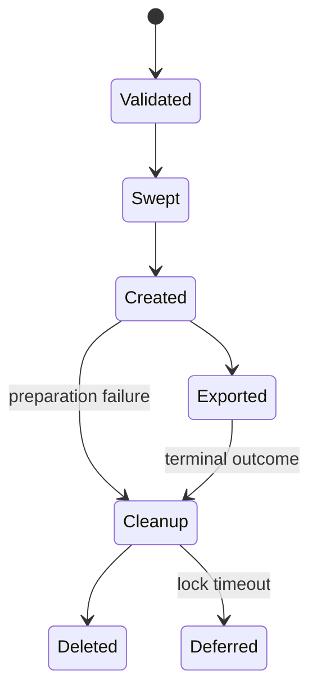

# Feature design: MSSQL source materialization work database

- Status: APPROVED
- Owner: dpone maintainers
- Issue: N/A (production incident and explicit maintainer request)
- Target release: 0.74.30
Last verified: 2026-08-29

## Executive summary

MSSQL source materialization currently creates its run-scoped work table in the
source connection's current database. A route that reads a business relation in
`analytics_staging` therefore cannot place its snapshot in `Example_System` without
changing the deployment-owned source database and failing strict runtime
hydration.

Add an optional `work_database` to the existing materialization policy. When it
is set, dpone must qualify every snapshot, cleanup, permission, and stale-sweep
operation with that database while leaving the source relation and connection
database unchanged. Success is measured by a route that reads a fully qualified
`analytics_staging` relation, creates only a run-scoped
`Example_System.dbo.__dpone_snapshot_*` table, and removes it on every terminal path
covered by the existing cleanup policy.

## Personas and customer journey

| Persona | Goal | Current pain | Success signal |
|---|---|---|---|
| Data architect | Keep operational work tables out of business interchange schemas | Moving the connection database invalidates the signed source authority | Source stays in its business database and snapshots use the technical database |
| DWH operator | Diagnose and recover residual snapshots safely | Evidence identifies only a schema-local name | Evidence and cleanup name the exact database, schema, and table |
| DBA | Grant the minimum required permissions | Source reads and snapshot DDL appear to require one database | Read and DDL grants are independently attributable to their databases |

The author keeps the source relation unchanged, opts into `work_database`, runs
normal validation, and observes the exact three-part work-table name in runtime
evidence. A permission failure blocks before materialization. A terminal load or
preparation failure follows the existing cleanup policy. A later run sweeps only
expired tables in the configured work database and schema.

## Scope

### In scope

- `source.options.native_transfer.snapshot.materialization.work_database` for
  the MSSQL `mssql_work_table` provider.
- Three-part qualification for create, read, index/statistics, cleanup, and
  stale sweep operations.
- Permission checks evaluated in the configured work database.
- Exact work location in decision and snapshot evidence.
- Backward-compatible two-part behavior when `work_database` is absent.

### Non-goals

- A second credential or connection for snapshot DDL.
- Cross-instance or linked-server snapshots.
- A scheduled orphan collector independent of workload execution.
- Changes to source database authority or the existing cleanup lifecycle.

### Assumptions and constraints

- Source and work databases are on the same SQL Server instance and use the
  same authenticated principal.
- The principal has source `SELECT` permissions plus `CREATE TABLE` and schema
  `ALTER` in the work database.
- Database, schema, and table coordinates remain validated SQL Server
  identifiers; caller-provided SQL fragments are never accepted.

## Public contract

### CLI

No new CLI option. `dpone check`, `plan`, and `run` consume the manifest field.
Invalid identifiers or missing permissions fail before snapshot creation with a
non-zero exit code and the existing materialization blocker/error vocabulary.

### Python API

`SourceMaterializationPolicy` and `SourceMaterializationDecision` expose
`work_database: str | None`. The default is `None`, preserving current-database
behavior. No existing call signature becomes mandatory.

### Manifest/schema

```yaml
source:
  table:
    database: analytics_staging
    schema: clickhouse
    name: v_example_contact_dimension
  options:
    native_transfer:
      snapshot:
        materialization:
          provider: mssql_work_table
          allow_source_writes: true
          work_database: Example_System
          work_schema: dbo
```

`work_database` accepts a string or `null`, defaults to `null`, and applies only
to MSSQL work-table materialization. Existing manifests remain byte-for-byte
semantically compatible.

### Artifacts and evidence

Materialization decision and snapshot evidence include `work_database`. The
`work_table` value is a three-part quoted name when configured and remains a
two-part quoted name otherwise. Cleanup status vocabulary and audit step IDs do
not change.

### Compatibility and migration

Existing `work_schema` manifests continue using the connection's current
database. To migrate, add `work_database`, grant the required DDL permissions,
deploy the new runtime, and verify exact snapshot location and removal. Rollback
removes `work_database`; it does not move or clean already existing tables.

## Detailed algorithm

1. Parse and validate the optional work database with the existing MSSQL object
   name contract.
2. Resolve the effective location as `(work_database, work_schema)`, where a
   missing database means the current connection database.
3. Check `CREATE TABLE` and schema `ALTER` in that exact database context.
4. Query that database's `sys.tables` and `sys.schemas` for expired tables with
   the safe configured prefix.
5. Create the snapshot with `SELECT ... INTO
   [database].[schema].[table] FROM (<source query>)`.
6. Reuse the exact qualified name for row count, export rewrite, index,
   statistics, cleanup, retries, and evidence.
7. Preserve the existing terminal lifecycle, lock timeout, retry, and deferred
   cleanup semantics.

### Pseudocode

```text
location = validate(work_database?, work_schema)
if not permissions(location): block before CREATE
sweep_expired(location, safe_prefix, ttl)
work_table = qualify(location, generated_name)
try:
    SELECT projected_columns INTO work_table FROM source_query
    export_query = SELECT projected_columns FROM work_table
    return snapshot(export_query, cleanup(work_table), evidence(location))
except:
    apply existing preparation cleanup policy to exact work_table
    raise original error
```

### State machine



### Edge cases

- `null` database uses current behavior.
- An invalid or empty explicit identifier fails before SQL execution.
- Permission or catalog errors never become an empty successful sweep.
- Empty source results still create and clean the exact work table.
- Lock timeout remains deferred evidence; it is not reported as deleted.
- Concurrent runs use distinct generated names and sweep only expired tables.
- A killed worker still requires the separately reviewed orphan recovery path.

## Architecture

### Components and responsibilities

| Component | Existing/new | Responsibility | Dependencies |
|---|---|---|---|
| `SourceMaterializationPolicy` | Existing, extended | Parse and expose the public location policy | Manifest mapping helpers |
| MSSQL work-table provider | Existing, extended | Validate and apply one exact three-part work location | MSSQL object-name contract, connector port |
| Public JSON schemas | Existing, extended | Validate `work_database` consistently | Schema contract |
| Runtime evidence | Existing, extended | Report the effective work location | Policy and provider outputs |

### Ports, adapters, and composition root

The runtime policy remains connector-neutral and optional. MSSQL identifier and
catalog details stay inside the MSSQL strategy adapter. The hydrated source
connector remains dependency-injected; no second client or global registry read
is introduced.

### Data and control flow


### Alternatives and tradeoffs

| Alternative | Advantages | Disadvantages | Decision |
|---|---|---|---|
| Change source connection default database | No runtime change | Violates strict source database authority and breaks authored relations | Rejected |
| Add a second snapshot credential | Strong isolation | Larger secret, registry, and deployment contract; unnecessary on one instance | Rejected |
| Accept `database.schema` in `work_schema` | No new field | Ambiguous coordinate, unsafe quoting, poor schema validation and UX | Rejected |
| Add explicit `work_database` | Typed, readable, backward compatible, exact evidence | Adds one public field and cross-database tests | Accepted |

### ADR requirement

No ADR is required. This extends an existing provider location coordinate and
does not change dependency direction, state ownership, or the cleanup state
machine.

### Quality-budget impact

The provider receives small location/qualification helpers and should remain
under the repository module-size budget. No new import layer or framework is
introduced.

## Market comparison

Only SQL Server and SSIS are directly relevant to this provider-specific
capability. Microsoft documents `database.schema.object` multipart names and
explicitly permits `SELECT ... INTO` a fully qualified table in another database
on the same instance. SSIS exposes database selection through its connection
manager, but does not provide dpone's run-scoped snapshot cleanup contract.

| System/version | Relevant capability | Observed design | Strength | Limitation | Adopt/reject | Source/date |
|---|---|---|---|---|---|---|
| dlt | N/A | Connector-neutral loader; no MSSQL source work-table contract assessed | N/A | Not relevant to this SQL Server adapter defect | N/A | 2026-08-29 |
| Informatica | N/A | Product-specific staging configuration not needed for this bounded fix | N/A | No dpone manifest compatibility concern | N/A | 2026-08-29 |
| Airbyte | N/A | Connector extraction architecture differs from in-session MSSQL snapshotting | N/A | No equivalent provider contract in scope | N/A | 2026-08-29 |
| Fivetran | N/A | Managed connector behavior is not an authorable work-table API | N/A | No equivalent public field | N/A | 2026-08-29 |
| Pentaho | N/A | Generic SQL steps do not define this runtime lifecycle | N/A | Not relevant to the defect boundary | N/A | 2026-08-29 |
| Microsoft SSIS | Yes | OLE DB sources use a connection manager and may run SQL commands | Familiar database connection boundary | Cleanup and exact work-table evidence remain package-owned | Adopt explicit database coordinate, retain dpone lifecycle | [OLE DB Source](https://learn.microsoft.com/en-us/sql/integration-services/data-flow/ole-db-source?view=sql-server-ver17), 2026-08-29 |
| gusty | N/A | DAG authoring layer, not a SQL Server source adapter | N/A | No work-table provider | N/A | 2026-08-29 |
| Astronomer Cosmos | N/A | dbt orchestration layer, not a SQL Server source adapter | N/A | No work-table provider | N/A | 2026-08-29 |
| Apache Beam | N/A | Distributed processing API, not SQL Server in-session snapshot DDL | N/A | Different execution boundary | N/A | 2026-08-29 |

The SQL syntax decision follows Microsoft's
[multipart-name convention](https://learn.microsoft.com/en-us/sql/t-sql/language-elements/transact-sql-syntax-conventions-transact-sql?view=sql-server-ver17),
[SELECT INTO contract](https://learn.microsoft.com/en-us/sql/t-sql/queries/select-into-clause-transact-sql?view=sql-server-ver17),
and [effective-permission checks](https://learn.microsoft.com/en-us/sql/t-sql/functions/has-perms-by-name-transact-sql?view=sql-server-ver17),
observed on 2026-08-29.

## Measurable differentiation

```yaml
axis: exact work-location governance
scenario: MSSQL business source and technical snapshot database on one instance
baseline: connection database must equal both source and work database
metric: cross-database route success plus residual snapshot count after terminal execution
target: source authority unchanged; zero residual work tables after successful and failed eager-cleanup tests
procedure: contract tests plus approved DEV Airflow acceptance
artifact: runtime evidence and DEV acceptance report
limitations: killed-worker cleanup remains an external recovery concern
```

## Security, privacy, and operations

No secret or credential surface changes. All coordinates are identifiers, not
SQL fragments. Permission checks use the executing principal and the configured
work database. Evidence contains object names but no credentials. Operators must
monitor deferred cleanup and never terminate blocking sessions without explicit
operational authorization.

## Test and certification plan

| Layer | Scenario | Environment | Expected artifact |
|---|---|---|---|
| Unit | Parse/default/evidence and invalid identifiers | Local | pytest result |
| Contract | JSON schemas expose optional `work_database` | Local | pytest result |
| Integration | Create, rewrite, sweep, and cleanup use one exact three-part name | Fake MSSQL connector | pytest result |
| Live certification | Source in `analytics_staging`, work table in `Example_System.dbo`, eager cleanup | Approved DEV Airflow | acceptance JSON and task evidence |
| Performance | No new source scan; qualification-only change | N/A | N/A |
| Compatibility | Missing field preserves current two-part SQL | Local | pytest result |

## Documentation plan

Update the MSSQL guide, native-transfer explanation, configuration reference,
schema examples, changelog, and migration/rollback instructions.

## Rollout and rollback

Release dpone `0.74.30`, update the Airflow runtime/provider pins, then add
`work_database: Example_System` while restoring the source connection projection to
`analytics_staging`. DEV acceptance must prove source reads, exact snapshot
location, and cleanup before production promotion. Rollback removes the new
field and restores the prior runtime pin; any residual tables require a separate
reviewed cleanup.

## Agent execution plan

| Agent/role | Owned paths | Read-only paths | Forbidden paths | Dependency |
|---|---|---|---|---|
| Primary integrator | Runtime policy/provider, schemas, focused tests, docs, release metadata | Existing architecture and release policy | Unrelated connectors and workflows | None |

One integrator owns all changed paths because the active coordination policy
does not authorize additional agents for this task.

## Approval checklist

- [x] User problem and CJM are clear.
- [x] Algorithm and failure semantics are implementable without guessing.
- [x] Public contracts and compatibility are explicit.
- [x] Architecture and alternatives are justified.
- [x] Relevant market research uses current official sources.
- [x] Claimed differentiation is measurable.
- [x] Tests, evidence, docs, rollout, and rollback are complete.
- [x] Path ownership and integration plan are conflict-safe.
- [x] Maintainer changed status to `APPROVED` through the explicit production-remediation request.
