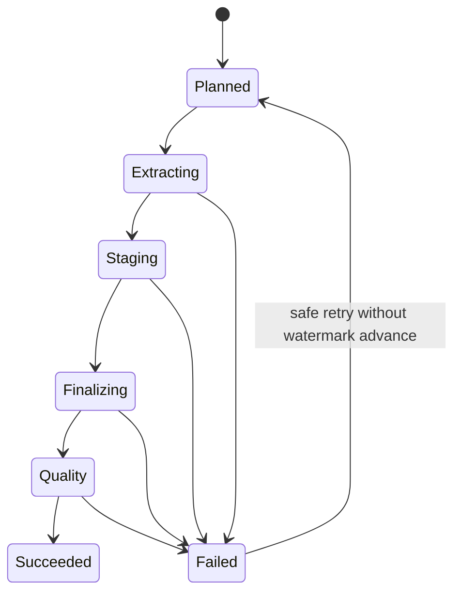

# Feature design: MySQL → MSSQL batch route v1

- Status: IMPLEMENTED
- Owner: dpone maintainers
- Issue: plan mysql→mssql batch MVP (maintainer-authorized implementation)
- Target release: next minor after merge
Last verified: 2026-07-21

## Executive summary

dpone has no MySQL source family. Operators cannot declare a production batch
route from MySQL OLTP into MSSQL landing using the same staging-first, BCP, and
strategy contracts already proven for `postgres → mssql`.

This feature adds a **MySQL source-only** connector family and a documented
`mysql → mssql` batch route: watermark incremental extract, `mssql-delimited`
export via `BulkTextCodec`, existing MSSQL BCP staging and set-based finalize,
Airflow/env credential resolution, matrix/docs/example, and connector Beta
evidence. Binlog CDC and MySQL sink/state are out of scope for v1.

## Personas and customer journey

| Persona | Goal | Current pain | Success signal |
|---|---|---|---|
| Data engineer | Land MySQL tables into MSSQL with merge/append/refresh | No `source.type: mysql` | Example plan/run succeeds with `dpone[mysql,mssql]` |
| Platform engineer | Wire Airflow Connection `mysql` into runtime | `NotImplementedError` for mysql | Credentials resolve; parse path stays lazy |
| Operator | Diagnose fast-path misconfig | No advise for mysql→mssql | Strategy intelligence warns when BCP wire missing |

Journey: discover matrix guide → install extras → registry/Airflow connections →
copy example manifest → `dpone plan` → `dpone batch run` / `dpone run` → quality
checks → artifacts under observability path → recover via staging-first rerun.

## Scope

### In scope

- MySQL source connector, factories, Airflow/env credentials, manifest `source.type`
- Strategies via MSSQL sink: `full_refresh`, `incremental_append`, `incremental_merge`,
  `replace`, `partition_replace`, `snapshot_reconciliation`
- Watermark/`incremental_column` extract; `export_format=mssql-delimited` + `bulk.mode=bcp`
- Type profile `mysql_to_mssql_native_v1`, docs, example, CHANGELOG, Beta certification row
- Integration markers `integration_mysql` + Docker service when practical

### Non-goals

- MySQL sink, MySQL state store, binlog/GTID CDC
- Six-dimensional route attestation / Conformance Lab / safe-sample production I/O
- Ops refresh executor parity with `postgres_mssql`
- Claiming delete-correctness from cursor incremental alone

### Assumptions and constraints

- Reuse ADR 0005 staging-first contracts; no new ADR unless architecture diverges
- Optional dependency `PyMySQL`; lazy import on connector construction only
- State lives on MSSQL target connection (same as postgres→mssql examples)

## Public contract

### CLI

No new top-level commands. Existing `plan`, `batch run` / `run`, `doctor`,
connection-doctor work once `source.type: mysql` resolves.

### Python API

`ConnectionType.MYSQL`, `MySQLConnector`, `MySQLSource` under `dpone.runtime.*`.
No new public surface under legacy `dpone.source` domain modules.

### Manifest/schema

`source.type` enum gains `mysql`. Sink/state enums unchanged.
Recommended options: `export_format: mssql-delimited`, sink `bulk.mode: bcp`,
`state.type: mssql`.

### Artifacts and evidence

Reuse `FileExportArtifact` format `mssql-delimited` and existing run artifacts.
Integration evidence under Docker markers; SKIP ≠ PASS.

### Compatibility and migration

Additive. Airflow `conn_type=mysql` changes from NotImplementedError to supported
credential mapping. Existing routes unchanged.

## Detailed algorithm

1. Validate manifest: `source.type=mysql`, sink `mssql`, required connection_ids.
2. Resolve credentials (env/vault/airflow); construct `MySQLConnector` lazily.
3. Negotiate capabilities; fail closed if sink/state type is mysql.
4. Plan bounded extract (full or `incremental_column` watermark from MSSQL state).
5. Stream SELECT (or write file) through `BulkTextCodec` → `mssql-delimited`.
6. MSSQL staging manager loads via bcp; apply set-based finalize for strategy.
7. Run quality checks; commit source watermark state on MSSQL only after sink success.
8. On failure: rollback MSSQL transaction/staging per existing sink semantics; do not advance watermark.
9. Unsupported: CDC, MySQL sink — clear NotImplementedError / validation error.

### Pseudocode

```text
creds = resolve(source.connection_id)
src = MySQLSource(MySQLConnector(creds), state=mssql_state)
extract = src.extract(load_config)  # full or watermark bound
artifact = export_mssql_delimited(extract)  # BulkTextCodec
sink = MSSQLSink(...)
result = sink.load(load_config, artifact)  # bcp staging + finalize
if result.ok:
    state.commit(watermark)
emit artifacts / quality
```

### State machine



### Edge cases

- Empty extract: succeed with zero rows; do not advance watermark incorrectly
- Missing `incremental_column` for incremental strategies: fail closed with clear message
- Schema drift: existing fail-closed schema evolution before load
- Partial bcp failure: existing MSSQL staging cleanup; no state advance
- Optional dep missing: import error naming `dpone[mysql]`

## Architecture

### Components and responsibilities

| Component | Existing/new | Responsibility | Dependencies |
|---|---|---|---|
| `MySQLConnector` | new | PyMySQL connection, query, schema, file export | ports, AbstractConnector |
| `MySQLSource` + strategies | new | Full/incremental extract, mssql-delimited export | connector, BulkTextCodec |
| `MSSQLSink` | existing | BCP staging + finalize | unchanged |
| Credential factories | extend | SourceFactory + Airflow mysql | ConnectionType.MYSQL |
| Type mapper | new | `mysql_to_mssql_native_v1` | type_system |

### ADR requirement

Not required — stays within ADR 0005 + existing BCP artifact contracts.

### Quality-budget impact

New modules kept under `max_sloc: 400`; split connector / strategies / export mixin.

## Market comparison

Research date: 2026-07-21. Official primary sources.

| System/version | Relevant capability | Observed design | Strength | Limitation | Adopt/reject | Source/date |
|---|---|---|---|---|---|---|
| Airbyte MySQL | CDC binlog + cursor + Full Refresh | Sync modes compose source read × dest write | Production CDC + chunking | Cursor weak on deletes | Adopt full/cursor/append/merge map; defer CDC | docs.airbyte.com 2026-07-21 |
| Fivetran MySQL | Binlog / Teleport | Method switch forces re-sync | Delete-aware incremental | Managed warehouse, not self-hosted BCP | Adopt fail-closed method semantics; defer binlog/Teleport | fivetran.com docs 2026-07-21 |
| dlt sql_database | Cursor incremental + replace/append/merge | PyMySQL/SQLAlchemy extract | Closest OSS batch peer | No opinionated MSSQL bcp wire | Adopt cursor + dispositions; PyMySQL | dlthub.com 2026-07-21 |
| Informatica PC | Bulk load to SQL Server | DB bulk utility; recovery tradeoff | Enterprise bulk | Direct bulk can skip rollback | Adopt bulk; keep staging-first recovery | Informatica 10.5.8 docs |
| SSIS + bcp | Fast load / bcp | ADO.NET MySQL → OLE DB fast load | Canonical MS path | Hand-built packages | Adopt bcp into staging | Microsoft Learn 2026-07-21 |
| Pentaho | JDBC steps | Generic transforms | Flexible | No typed strategy matrix | Light adopt streaming mental model | N/A deep |
| Apache Beam | JdbcIO | Generic runners | Scale | Not MySQL→MSSQL product | N/A | — |
| gusty | Airflow YAML | DAG gen | — | Not EL strategies | N/A | — |
| Astronomer Cosmos | dbt-in-Airflow | Transforms | — | Not EL strategies | N/A | — |

## Measurable differentiation

```yaml
axis: staging-first MySQL→MSSQL with industrial BCP wire and explicit strategy matrix
scenario: MySQL OLTP table → MSSQL landing, incremental_merge, staging+bcp
baseline: ad-hoc SSIS/package or cursor-only ELT without staging evidence
metric: idempotent rerun correctness + sustained rows/sec on Docker fixture
target: correct merge on rerun; throughput same order as postgres→mssql advise band when env available
procedure: integration_mysql × integration_mssql; SKIP if unavailable
artifact: pytest/integration evidence path
limitations: no binlog delete SLO in v1
```

## Security, privacy, and operations

- Credentials via existing resolvers; never log passwords
- Lazy optional MySQL SDK (ADR 0008 parse-safe provider preserved)
- Runbook: install `dpone[mysql,mssql]`, bcp on PATH, registry entries

## Test and certification plan

| Layer | Scenario | Environment | Expected artifact |
|---|---|---|---|
| Unit | Credential mysql accept; type map | hermetic | pytest PASS |
| Contract | SourceFactory builds MySQLSource | hermetic | pytest PASS |
| Integration | incremental_merge happy path | Docker mysql+mssql | PASS or SKIP |
| Live | vendor live | optional | UNVERIFIED if missing |
| Compatibility | non-mysql routes unchanged | hermetic | PASS |

## Documentation plan

- `docs/source-sink/mysql-to-mssql.md`, matrix row, mkdocs, type-mapping, certification Beta, example under `examples/batch/`, CHANGELOG

## Rollout and rollback

Additive feature. Rollback = revert PR; no migration of existing manifests.

## Agent execution plan

| Agent/role | Owned paths | Forbidden | Dependency |
|---|---|---|---|
| Integrator | shared pyproject, CHANGELOG, mkdocs, matrix constants, schemas | — | — |
| Runtime | `runtime/connectors/mysql*`, `sources/mysql*`, credentials branches | sinks/mysql | after APPROVED |
| Docs | source-sink guide, examples | production runtime unrelated | after runtime contracts |

## Approval checklist

- [x] User problem and CJM are clear.
- [x] Algorithm and failure semantics are implementable without guessing.
- [x] Public contracts and compatibility are explicit.
- [x] Architecture and alternatives are justified.
- [x] Relevant market research uses current official sources.
- [x] Claimed differentiation is measurable.
- [x] Tests, evidence, docs, rollout, and rollback are complete.
- [x] Path ownership and integration plan are conflict-safe.
- [x] Maintainer changed status to `APPROVED` (plan implementation authorization 2026-07-21).
