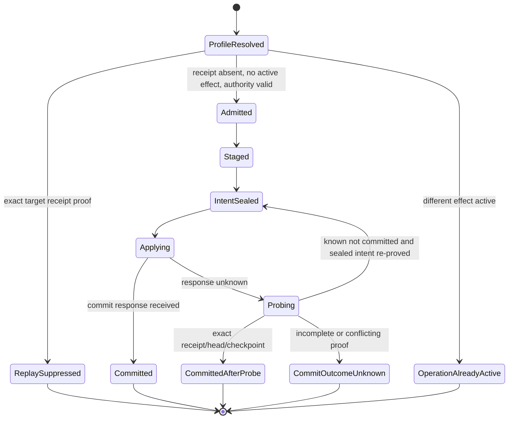
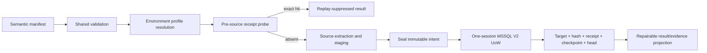

# Feature design: PostgreSQL → MSSQL Batch/XMin correctness R1

> Migration status: historical source document retained for contract context. Source approvals, commit references, test counts and architecture exceptions do not establish approval or passing evidence for the current migration candidate. Current validation and public binding remain separately tracked.

- Status: APPROVED
- Owner: dpone maintainers
- Issue: R1 slice of PostgreSQL → MSSQL industrial integration V7
- Target release: R1
Last verified: 2026-09-05

## Executive summary

R1 makes one deliberately small PostgreSQL → SQL Server profile trustworthy:
PostgreSQL 16 batch full refresh or XMin current-state polling into an ordinary
SQL Server 2022 rowstore table, with every authoritative object in the same
standalone database and one local SQL Server transaction.

The current runtime has useful but separate Batch and XMin atomicity paths.
Batch can probe a target receipt before source work, while XMin couples target
DML, checkpoint and receipt but still needs PostgreSQL schema/authority work
before replay can be decided. Neither path has one persistent target-writer
generation, generation-scoped canonical row hashes, or durable pre-commit
target-quality evidence. R1 introduces those contracts without changing V1
tables or claiming that compatibility paths are certified.

The measurable result is:

```text
target effect
+ generation-scoped row hashes
+ typed V2 receipt
+ XMin checkpoint when applicable
+ target head transition
= one fully durable local SQL Server commit
```

A lost commit response is resolved from a fresh target-only probe. An exact
receipt suppresses both source I/O and repeated DML. An absent receipt permits
retry only when the same sealed artifact/intent and unchanged target authority
can be proved. Every other outcome pauses with `COMMIT_OUTCOME_UNKNOWN`.

This specification was approved by the maintainer on 2026-09-04 together with
[ADR 0056](adr/source-history/0056-mssql-same-database-target-authority-v2.md). Production-code
changes remain subject to the path-scoped task contracts and evidence gates
defined below.

The provider Binding implementation additionally depends on the separately
reviewed
[selected-relation source schema authority](feature-design-postgres-mssql-r1-source-schema-authority-green-v5.md),
which closes relation-to-column anti-splice without changing this approved
target-UoW contract.

The approval includes the 2026-09-04 implementation-readiness amendment: the
profile decision is layered outside runtime, operation rows are the canonical
lease authority, intent uses first-seal-wins semantics, exceptional generation
authority is issued only after staging is sealed, descendant proof is bounded,
and V1 writer revocation is the roll-forward-only cutover point.

## Personas and customer journey

| Persona | Goal | Current pain | Success signal |
|---|---|---|---|
| Data engineer | Run a safe PostgreSQL → MSSQL Batch or XMin route without choosing receipt tables | Planning and validation can disagree; physical correctness details leak into errors | The existing semantic manifest resolves to one certified platform profile or fails before source I/O |
| Platform engineer | Configure one supportable correctness profile | Existing Batch and XMin paths use different authority models | One target-local V2 UoW and closed topology/object contract serves both modes |
| Operator | Retry an ambiguous run without duplicating effects | Commit-response loss can leave unclear target/checkpoint state | Status reports exact target-only receipt/head/checkpoint proof and safe next action |
| Auditor | Prove the target was accepted before it became visible | Some quality results are process-local or post-commit | Receipt binds typed, bounded, target-local quality evidence and exact target generation |

The first-success journey is:

1. Discover the `postgres_mssql_target_uow_v2` capability and its prerequisites.
2. Author the existing semantic Batch full-refresh or XMin current-state
   manifest; do not name drivers, receipt tables, locks, or generations.
3. Run `dpone plan`; the same semantic validator used by `manifest validate`
   resolves a platform-owned profile and reports a non-mutating plan.
4. Provision V2 target-local authority tables and register the target object
   through a platform operation.
5. Run the route. A replay hit is reported before PostgreSQL business I/O.
6. Observe writer generation, head revision, outcome, receipt identity, and
   whether source I/O occurred. Secrets and physical control-object names stay
   redacted.
7. Diagnose stable error codes. For an ambiguous commit, preserve staging and
   run the documented fresh-session probe; do not reset state blindly.
8. Rebaseline through signed, one-shot authority when V2 is first activated or
   when an intentionally empty destructive refresh is required.
9. Upgrade only to a runtime that reads the current V2 contracts. After the
   first V2 effect, rollback is roll-forward or a new signed generation.

## Scope

### In scope

- PostgreSQL 16 batch full refresh and XMin current-state polling as separate
  source modes sharing one SQL Server V2 target UoW.
- SQL Server 2022 standalone, one ordinary disk-based heap or clustered
  rowstore target, one physical database, one physical ODBC session, and one
  local fully durable transaction.
- Target-local head/fence, operation admission, receipt header and typed body,
  row hash, and XMin checkpoint authorities.
- Stable pre-source operation identity and source-free exact receipt replay.
- Three independent monotonic counters: writer generation, head revision, and
  operation epoch.
- One non-null unique scalar business key (`int2`, `int4`, `int8`, or UUID) for
  both Batch and XMin, plus a closed logical row-hash scalar contract.
- One PostgreSQL repeatable-read snapshot per source effect; XMin preserves the
  approved delta + complete-key snapshot algorithm and wraparound guards.
- Closed, bounded, deterministic target-local quality checks before commit.
- V1 read/replay compatibility, fail-closed V1 writer retirement, and signed
  V2 rebaseline.
- Signed one-shot `allow_empty=true` authority for destructive empty refresh.
- Same-database live certification and exact-commit evidence.

### Non-goals

- Cross-database, cross-instance, AG, DTC, or asynchronous checkpoint repair.
- Batch Engine V2 transport, parallel extraction, BCP staging redesign, or
  shadow-publication integration; these belong to R2A/R2.
- WAL streaming, journals, or CDC receipts.
- Concurrent Batch, XMin, shadow/backfill, maintenance, or external target
  writers for the same target binding. R1 rejects overlap before source I/O;
  serial waiting behind another staged operation is not a certified fallback.
- Arbitrary target SQL, full-table quality scans in the commit transaction, or
  external quality services.
- Automatic migration of a V1 target into V2 from target contents alone.
- A broad claim for every PostgreSQL/MSSQL type or target-table feature.

### Assumptions and constraints

- The platform owns all business-target DML/DDL for the certified target, or
  every writer participates in the same V2 fence; R1 certifies exclusive dpone
  ownership only.
- SQL Server database option `DELAYED_DURABILITY` is `DISABLED`.
- Target, final staging, head, operation, sealed intent, receipt, row-hash,
  checkpoint, typed generation-authority consumption, and any destructive state resolve to the
  same database GUID and are accessed through one connection.
- R1 does not alter the exact schema or semantics of V1 receipt/checkpoint
  tables. V1 remains compatibility-only after cutover.
- Existing ADR 0051 shadow/backfill remains a compatibility path and cannot run
  against an active R1 V2 generation until R2 adopts the common head contract.
- The certified runtime uses a dedicated V2 writer principal. Cutover revokes
  the former V1 principal's business-target DML/DDL and authority-table writes;
  V1 row/table/trigger shape remains unchanged for read/replay.
- Any restore, PITR, clone, attach, or recovery-fork change invalidates the
  signed recovery-domain epoch and requires operator recovery or rebaseline.
- Live checks require an explicitly approved environment and credentials.
  Missing live evidence is `UNVERIFIED`, never `PASS`.

## Public contract

### Capability identity and environment profile

The target tuple is:

```yaml
capability_id: postgres_mssql_target_uow_v2
source:
  product: postgresql
  major: 16
  mode: batch_full_refresh | xmin_current_state
target:
  product: sql_server
  major: 2022
  topology: standalone_same_database
  object_profile: ordinary_disk_rowstore
business_key:
  columns: 1
  nullable: false
  allowed_types: [int2, int4, int8, uuid]
logical_row_profile: postgres_mssql_r1_scalar_v1
delete_materialization: hard_delete
transaction:
  session_count: 1
  scope: local_database
  delayed_durability: disabled
authority:
  receipt: mssql_effect_receipt_v2
  row_hash: postgres_mssql_row_hash_v1
  writer_fence: mssql_target_head_v2
spec_status: approved
implementation_status: absent
certification_status: unverified
activation_status: blocked
```

This is the target tuple and current repository state, not a certified or
activatable tuple. Promotion requires `implementation_status=implemented`,
current exact vendor-live `certification_status=vendor_pass` and then
`activation_status=explicit_opt_in`; no implementation may skip directly from
`unverified` to opt-in.

The exact target object already exists and has only ordinary persisted business
columns, one unique index over the declared business key, and an environment-
bounded number of ordinary nonfiltered rowstore indexes. The profile rejects
triggers, inbound/outbound foreign keys, indexed-view dependencies, identity,
computed or rowversion columns, temporal tables, target CDC/replication, RLS,
dynamic data masking, Always Encrypted, memory-optimized/filetable/graph/ledger
features, partitioning, and target-managed business columns.

The user does not author this structure. The deployment registry resolves it
from source and sink connection references, source mode, target registration,
and platform policy. Resolution fails closed if any required dimension is
weaker or unknown. Existing manifests remain compatibility manifests and never
inherit this certification automatically.

### Manifest/schema

R1 adds no physical receipt, lock, topology, epoch, or table-name fields to the
user manifest. Existing Batch and XMin semantic fields remain authoritative.
The environment-owned profile is versioned as
`dpone.postgres-mssql-correctness-profile.v1` and binds:

```yaml
profile_id:
source_connection_ref:
sink_connection_ref:
allowed_source_modes: [batch_full_refresh, xmin_current_state]
capability_id: postgres_mssql_target_uow_v2
target_binding_uuid:
target_contract_revision:
receipt_contract: mssql_effect_receipt_v2
hash_policy: postgres_mssql_row_hash_v1
quality_policy:
certification_ref:
max_descendant_proof_receipts: 100000
```

Connection resolution must prove, not infer, same-database locality. A route
with a separate state database is rejected before PostgreSQL business I/O.

The immutable route/profile decision model and canonical identity bytes live
in `dpone.contracts`; capability/evidence lookups are expressed through
`dpone.ports`. A pure application/readiness resolver composes primitive source,
target, topology, authority and evidence capabilities. Both `manifest validate`
and `plan` call that resolver; neither imports `dpone.runtime`. Environment and
catalog reads live in adapters, and only the composition root wires them.
`MSSQLSink` must not expose a new boolean/string shortcut that bypasses this
multidimensional decision.

### CLI

`dpone plan` and `dpone manifest validate` use the same semantic validation and
profile-resolution service. A successful `dpone plan --format json` includes:

```yaml
mutates: false
capability_id: postgres_mssql_target_uow_v2
source_mode:
target_topology: standalone_same_database
authority_contract: mssql_effect_receipt_v2
implementation_status:
certification_status:
activation_status:
```

Planning must not report success for a manifest that `manifest validate`
rejects. `dpone run --format json` adds an `authority` projection:

```yaml
outcome: committed | committed_after_receipt_probe | replay_suppressed | known_not_committed | blocked
receipt_id:
receipt_contract: mssql_effect_receipt_v2
writer_generation:
head_revision:
operation_epoch:
source_io_performed: true | false
recovery_code:
secondary_status: complete | evidence_repair_required
```

Markdown is a deterministic projection of JSON. Credentials, signed authority
payloads, connection strings, database GUIDs, and physical control-object names
are redacted. Existing exit-code conventions remain unchanged: `0` success,
`1` completed blocked/failed result, and `2` invalid input.

R1 activation requires a retry-stable invocation identity. CLI callers pass an
explicit `--run-id`; the process-name fallback remains compatibility-only.
Airflow derives it from immutable activation occurrence + DAG/run/task/map
identity and excludes try number. Python callers supply the equivalent explicit
run ID. Reusing that ID with changed route/target/source-mode/contract is a
conflict, while scheduler retries reuse the same operation key.

Stable R1 errors are:

```text
DPONE_POSTGRES_MSSQL_PROFILE_REQUIRED
DPONE_POSTGRES_MSSQL_PROFILE_WEAKER_THAN_REQUIRED
DPONE_POSTGRES_MSSQL_SAME_DATABASE_REQUIRED
DPONE_POSTGRES_MSSQL_RECEIPT_V2_REQUIRED
DPONE_POSTGRES_MSSQL_WRITER_FENCE_STALE
DPONE_POSTGRES_MSSQL_RECEIPT_CONFLICT
DPONE_POSTGRES_MSSQL_COMMIT_OUTCOME_UNKNOWN
DPONE_POSTGRES_MSSQL_ROW_HASH_BASELINE_MISMATCH
DPONE_POSTGRES_MSSQL_EMPTY_FULL_REFRESH_AUTHORITY_REQUIRED
DPONE_POSTGRES_MSSQL_RECEIPT_V2_MIGRATION_REQUIRED
DPONE_POSTGRES_MSSQL_UNSUPPORTED_TARGET_OBJECT
DPONE_POSTGRES_MSSQL_UNSUPPORTED_KEY
DPONE_POSTGRES_MSSQL_UNSUPPORTED_TYPE
DPONE_POSTGRES_MSSQL_SEALED_INTENT_UNAVAILABLE
DPONE_POSTGRES_MSSQL_CHECKPOINT_CONFLICT
DPONE_POSTGRES_MSSQL_V1_WRITER_RETIRED
DPONE_POSTGRES_MSSQL_GENERATION_AUTHORITY_INVALID
DPONE_POSTGRES_MSSQL_GENERATION_AUTHORITY_EXPIRED
DPONE_POSTGRES_MSSQL_GENERATION_AUTHORITY_REUSED
DPONE_POSTGRES_MSSQL_TARGET_QUALITY_TIMEOUT
DPONE_POSTGRES_MSSQL_RECOVERY_DOMAIN_CHANGED
DPONE_POSTGRES_MSSQL_OPERATION_ALREADY_ACTIVE
DPONE_POSTGRES_MSSQL_KNOWN_NOT_COMMITTED_RETRY_EXHAUSTED
```

### Python API

The public Python entry remains manifest-driven and requires an explicit stable
`run_id` when the R1 profile is selected. R1 does not export connector,
ODBC session, receipt-store, hash-store, or fence ports. Existing low-level
imports remain compatibility surfaces and do not imply V2 certification.

The run result exposes the same immutable authority projection as CLI JSON at
`result.details.authority`. The field is absent for compatibility routes; when
present, JSON, Markdown and text render exactly the approved redacted fields
and never physical authority object names.
`source_io_performed=false` is guaranteed only for the pre-source historical
receipt path. A transaction-local concurrent receipt discovered after staging
uses the same `replay_suppressed` outcome but reports the truthful value
`source_io_performed=true`.
Connector-specific exceptions are translated to stable dpone error codes at
the application boundary. A failure after a proven commit returns a successful
authority outcome with `secondary_status=evidence_repair_required`; it is not a
retryable failed target effect.

### Artifacts and evidence

The create-only certification artifact is:

```text
test_artifacts/route_live_wide/postgres-mssql/
  dpone-route-live-certification/postgres_mssql_r1_certification.json
```

It binds exact commit/run identity, implementation dependency-closure digest,
profile and capability IDs, PostgreSQL minor, SQL Server CU, ODBC build,
database/topology fingerprint, target-object profile, V2 contract versions,
test inventory, before/after authority values, duplicate/skip counts, expiry,
retention, and `PASS|FAIL|SKIP|UNVERIFIED`. Markdown evidence is generated from
that JSON and is never a second authority.

### Compatibility and migration

- Batch/XMin V1 rows, schemas, constraints and trigger sets remain exact and
  readable; all V2 writes use new tables.
- Dual-write V1+V2 is forbidden.
- V1 receipt presence can explain historical behavior but cannot synthesize a
  V2 receipt or seed row hashes.
- V1→V2 cutover requires all old writers paused and drained, a distinct V2
  principal, revocation of the V1 principal's target/V1 mutation rights, and a
  signed snapshot-bound full-source rebaseline into V2 writer generation 1.
- Rollback to a V1 writer is allowed only before the cutover transaction revokes
  the V1 writer principal. That revocation is the explicit point of no return;
  after it, including before the first V2 target effect, recovery is roll-forward
  with a V2-capable binary or a signed new generation. There is no unaudited
  re-grant or credential cutback path.
- A current compatibility manifest must be explicitly resolved to the R1
  profile; there is no implicit promotion based on connector names.

## Authority and identity contracts

### Three independent counters and generation transitions

| Counter | Meaning | Transition | Must not be used as |
|---|---|---|---|
| `writer_generation` | Target content and row-hash generation | Batch full refresh `N→N+1`; XMin baseline/rebaseline `N→N+1`; ordinary XMin remains `N` | Operation/retry identity |
| `head_revision` | Receipt-chain position inside one generation | New generation starts at `1`; ordinary XMin is `r→r+1` | Lease epoch or source cursor |
| `operation_epoch` | Owner fence for one effect key | Same operation takeover increments it after a proven expiry | Target generation or global sequence |

The values are positive logical domains stored as SQL Server `bigint` and
checked independently. Full refresh receipt `N/r → N+1/1` links the two
generation chains. XMin incremental receipt `N/r → N/r+1` stays in one chain.
Overflow fails closed and requires a signed rebaseline to a new binding; values
never wrap.

Ordinary effects cannot change writer mode. Legal transitions are:

```text
uninitialized → batch_full_refresh     signed initial_cutover
uninitialized → xmin_current_state     signed initial_cutover + snapshot checkpoint
batch_full_refresh → batch_full_refresh non-empty full refresh, or signed empty refresh
batch_full_refresh → xmin_current_state signed rebaseline + snapshot checkpoint handoff
xmin_current_state → xmin_current_state ordinary delta, or signed rebaseline
xmin_current_state → batch_full_refresh signed rebaseline into a new generation
```

### Target and recovery-domain identity

The immutable target registration binds:

```yaml
target_binding_uuid:
target_object_uuid:
server_instance_identity_sha256:
database_guid:
database_family_guid:
recovery_fork_guid:
recovery_domain_uuid:
recovery_domain_epoch:
database_name_digest:
schema_name_digest:
object_name_digest:
object_id:
physical_generation_uuid:
catalog_contract_digest:
target_contract_revision:
```

The provisioner attaches `target_binding_uuid`, `target_object_uuid`,
`physical_generation_uuid`, and `target_contract_revision` as protected SQL
Server extended properties on the business table. The V2 runtime principal has
read but no add/update/drop permission for those properties or the table. A
drop/recreate loses the attached token; copying the token requires privileged
out-of-model interference and is detected by periodic catalog attestation.
Controlled token rotation requires the target lock, provisioner identity, a
signed generation authority, and a new complete baseline.

Every transaction re-reads `object_id`, attached properties, catalog digest and
target contract under the target lock. Thus reused `object_id` or unchanged
coordinates cannot satisfy the proof after object replacement.

The deployment registry supplies a signed recovery-domain UUID and monotonic
epoch. The target head stores the same values and the runtime also reads SQL
Server database/family/recovery-fork identities. Any restore, PITR, clone,
attach, failover to an unregistered copy, or registry/target epoch disagreement
invalidates an outstanding absent-receipt inference. The result is
`COMMIT_OUTCOME_UNKNOWN`; activation requires an operator-issued new recovery
epoch and signed rebaseline. A bare database GUID is never treated as complete
proof that a missing receipt never committed.

Recovery-domain rollover is not an out-of-band head edit. The provisioner
publishes a signed `rebaseline` authority binding old head domain/epoch and SQL
recovery identity to candidate domain/epoch and candidate recovery identity.
After any ambiguous old-domain operation is explicitly resolved or abandoned,
one snapshot-bound full rebaseline UoW verifies the old head and new registry,
replaces target/hash/checkpoint as applicable, writes a receipt containing both
recovery identities, and atomically advances the head to the candidate epoch.
Only this `old_epoch→new_epoch` receipt transition can change recovery epoch.

### Stable operation/effect identity and durable sealed intent

`operation_key` is computed before source I/O only from the normalized route
identity, scheduler-stable invocation identity, source mode, logical target
binding, and contract version. It never contains current/candidate writer
generation, XMin, head revision, attempt number, owner, or lease epoch.

`effect_key` is the SHA-256 digest of contract version, target binding, source
mode, and operation key. The receipt stores both keys and enforces unique
`(target_binding_uuid, operation_key, contract_version)` and unique
`effect_key`. A retry therefore finds the same historical receipt even after a
later head revision or generation supersession.

After staging, `dpone_sealed_intent_v2` and its one-to-many staging-artifact set
durably record canonical bytes and a digest over:

```text
operation/effect keys
+ expected and candidate writer generation/head revision/mode
+ source snapshot/lifecycle identity
+ source schema/type/hash/quality policy digests
+ exact target mutation plan
+ every target-local staging object UUID, attached token, object_id and catalog digest
+ delta, complete-key and/or payload artifacts with rows/bytes/logical digests
+ resource admission and retention policy
+ generation-authority identity when applicable
```

Each staging object follows a database-enforced
`OPEN→SEALED→CONSUMED→GC_AUTHORIZED→DROPPED` lifecycle. BCP/load rights exist
only in `OPEN`. A certificate-signed seal procedure takes the artifact applock,
verifies counts/schema/logical digest, records the immutable seal row, and
installs object-level `DENY INSERT, UPDATE, DELETE` for the runtime/BCP
principals. Runtime cannot reverse the denial or alter the object token.

The UoW takes the same artifact lock plus `TABLOCKX,HOLDLOCK`, verifies the
sealed permission/catalog contract, streams all staged rows in unique-key order
through the closed logical hash grammar on the same session, and recomputes the
row count and ordered artifact digest before target mutation. This additional
resource-admitted staging pass is mandatory in R1. Process loss recovery
re-proves every artifact and uses the identical rows. Missing, mutable, or
digest-mismatched staging blocks with `SEALED_INTENT_UNAVAILABLE`; it never
rereads a changing source under the same operation/effect key.

Artifact ordering never uses PostgreSQL or SQL Server native key ordering.
`dpone-r1-artifact-v1` orders rows by unsigned lexicographic
`canonical_key_payload`; staging stores that payload in a protected dpone column
and enforces it unique. The hashed byte stream is:

```text
"dpone-r1-artifact-v1\0"
+ length-framed artifact_kind
+ schema_digest[32]
+ row_count:uint64be
+ for each row in canonical-key order:
     key_length:uint32be + canonical_key_payload
   + row_length:uint64be + canonical_row_bytes
```

The empty artifact digest is SHA-256 of that header with `row_count=0` and no
row frames. The multi-artifact intent digest uses domain
`dpone-r1-artifact-set-v1\0`, artifact count, then fixed kind order
`batch_payload`, `xmin_delta`, `xmin_complete_keys`, with each kind and digest
length-framed. UUID and integer ordering are therefore identical across source,
Python reference and SQL Server and never depend on `uniqueidentifier` ordering.

### Historical receipt and descendant proof

Every receipt stores `previous_receipt_id`, expected and candidate generation,
previous and committed head revision, and the hash of the preceding receipt.
The database enforces unique
`(target_binding_uuid, candidate_writer_generation, committed_head_revision)`.
The canonical header persists every field of `MssqlTargetIdentityV2`, including
the server-instance digest and normalized database/schema/object-name digests.
Receipt replay must reconstruct and re-hash the exact historical identity from
target-local rows; substituting current registry or caller context into a
historical receipt is forbidden.

An exact historical receipt is valid when:

1. header and exactly one matching typed body re-hash correctly;
2. operation/effect, target, source, contract, intent, and recovery-domain
   identities match;
3. its predecessor transition is adjacent and valid; and
4. the current head either equals its outcome or descends from it through an
   unbroken retained receipt chain, including explicit generation-publication
   links.

For XMin, checkpoint history is append-only and receipt-bound. Each receipt
body records a checkpoint transition `(previous pointer → candidate pointer)`,
including explicit retirement to NULL on XMin→Batch. Each checkpoint row stores
its predecessor pointer even across generations. A historical XMin receipt
remains replay authority when the current head/checkpoint equals its outcome or
the receipt chain from current head traverses adjacent advance, baseline,
handoff, or retirement transitions back to it. Later legitimate commits or
generation changes do not invalidate replay suppression. R1 performs no receipt
compaction or deletion.

Historical proof is an indexed, bounded admission operation. The resolver pins
`max_descendant_proof_receipts` (default and GA maximum `100000`). SQL walks
adjacent `(target_binding_uuid, writer_generation, head_revision)` positions
and predecessor receipt IDs with a statement timeout and stops at that bound.
A chain break, cycle, timeout, missing predecessor, or required traversal above
the bound returns `COMMIT_OUTCOME_UNKNOWN`; it never falls back to source I/O or
DML. Operators perform a signed full rebaseline before the active chain reaches
the configured bound. Receipt compaction/accumulators remain R5 scope and
cannot be inferred in R1.

### Target-local normative schema

All names below live in the profile-owned target authority schema. Every
identifier/digest is non-null unless explicitly marked, all positive counters
have `CHECK (> 0)`, all enums have closed `CHECK` constraints, and every foreign
key uses `NO ACTION`. Provisioning verifies the exact tables, columns, types,
constraints, indexes, triggers, and permissions before source I/O.

```yaml
dpone_target_head_v2:
  target_binding_uuid: uniqueidentifier primary key
  target_object_uuid: uniqueidentifier not null
  database_guid: uniqueidentifier not null
  database_family_guid: uniqueidentifier not null
  recovery_fork_guid: uniqueidentifier not null
  recovery_domain_uuid: uniqueidentifier not null
  recovery_domain_epoch: bigint not null
  object_id: int not null
  physical_generation_uuid: uniqueidentifier not null
  catalog_contract_digest: binary(32) not null
  target_contract_revision: bigint not null
  writer_state: varchar(16) not null  # uninitialized | active | paused
  writer_mode: varchar(32) null  # batch_full_refresh | xmin_current_state
  writer_generation: bigint null
  head_revision: bigint null
  source_authority_sha256: binary(32) not null
  last_receipt_id: uniqueidentifier null
  checkpoint_state_key_digest: binary(32) null
  checkpoint_writer_generation: bigint null
  checkpoint_revision: bigint null
  active_effect_key: binary(32) null
  active_operation_epoch: bigint null
  active_lease_expires_at: datetime2(7) null
  updated_at: datetime2(7) not null
  row_version: rowversion not null

dpone_writer_operation_v2:
  effect_key: binary(32) primary key
  operation_key: binary(32) not null
  contract_version: varchar(64) not null
  target_binding_uuid: uniqueidentifier not null
  source_mode: varchar(32) not null
  expected_writer_generation: bigint null
  candidate_writer_generation: bigint not null
  expected_head_revision: bigint null
  candidate_head_revision: bigint not null
  operation_epoch: bigint not null
  state: varchar(24) not null
  owner_id_digest: binary(32) not null
  lease_expires_at: datetime2(7) not null
  sealed_intent_id: uniqueidentifier null
  receipt_id: uniqueidentifier null
  last_error_code: varchar(96) null
  updated_at: datetime2(7) not null
  unique: [target_binding_uuid, operation_key, contract_version]

dpone_sealed_intent_v2:
  sealed_intent_id: uniqueidentifier primary key
  effect_key: binary(32) not null unique
  target_binding_uuid: uniqueidentifier not null
  expected_writer_generation: bigint null
  candidate_writer_generation: bigint not null
  expected_head_revision: bigint null
  candidate_head_revision: bigint not null
  expected_writer_mode: varchar(32) null
  candidate_writer_mode: varchar(32) not null
  expected_recovery_domain_uuid: uniqueidentifier null
  expected_recovery_domain_epoch: bigint null
  candidate_recovery_domain_uuid: uniqueidentifier not null
  candidate_recovery_domain_epoch: bigint not null
  expected_recovery_identity_digest: binary(32) null
  candidate_recovery_identity_digest: binary(32) not null
  source_snapshot_authority: varbinary(max) not null
  source_snapshot_digest: binary(32) not null
  source_schema_digest: binary(32) not null
  artifact_set_manifest: varbinary(max) not null
  artifact_set_digest: binary(32) not null
  mutation_plan_digest: binary(32) not null
  intent_digest: binary(32) not null unique
  row_count: bigint not null
  payload_bytes: bigint not null
  retention_until: datetime2(7) not null
  generation_authority_id: uniqueidentifier null
  sealed_at: datetime2(7) not null

dpone_staging_artifact_v2:
  artifact_id: uniqueidentifier primary key
  effect_key: binary(32) not null
  artifact_kind: varchar(24) not null  # batch_payload | xmin_delta | xmin_complete_keys
  object_uuid: uniqueidentifier not null
  object_id: int not null
  physical_token: uniqueidentifier not null
  catalog_digest: binary(32) not null
  state: varchar(24) not null
  row_count: bigint not null
  payload_bytes: bigint not null
  ordered_logical_digest: binary(32) null
  permission_contract_digest: binary(32) null
  sealed_at: datetime2(7) null
  consumed_receipt_id: uniqueidentifier null
  retention_until: datetime2(7) not null
  unique: [effect_key, artifact_kind]

dpone_effect_receipt_v2:
  receipt_id: uniqueidentifier primary key
  receipt_kind: varchar(16) not null  # batch | xmin
  operation_key: binary(32) not null
  effect_key: binary(32) not null unique
  contract_version: varchar(64) not null
  target_binding_uuid: uniqueidentifier not null
  target_object_uuid: uniqueidentifier not null
  server_instance_identity_sha256: binary(32) not null
  database_guid: uniqueidentifier not null
  database_family_guid: uniqueidentifier not null
  recovery_fork_guid: uniqueidentifier not null
  previous_recovery_identity_digest: binary(32) null
  candidate_recovery_identity_digest: binary(32) not null
  expected_recovery_domain_uuid: uniqueidentifier null
  expected_recovery_domain_epoch: bigint null
  candidate_recovery_domain_uuid: uniqueidentifier not null
  candidate_recovery_domain_epoch: bigint not null
  database_name_digest: binary(32) not null
  schema_name_digest: binary(32) not null
  object_name_digest: binary(32) not null
  object_id: int not null
  physical_generation_uuid: uniqueidentifier not null
  catalog_contract_digest: binary(32) not null
  target_contract_revision: bigint not null
  writer_mode: varchar(32) not null
  expected_writer_generation: bigint null
  candidate_writer_generation: bigint not null
  previous_head_revision: bigint null
  committed_head_revision: bigint not null
  operation_epoch: bigint not null
  previous_receipt_id: uniqueidentifier null
  previous_receipt_digest: binary(32) null
  route_identity_sha256: binary(32) not null
  source_authority_sha256: binary(32) not null
  intent_digest: binary(32) not null
  type_policy_digest: binary(32) not null
  hash_policy_digest: binary(32) not null
  quality_policy_digest: binary(32) not null
  body_digest: binary(32) not null
  receipt_digest: binary(32) not null unique
  committed_at: datetime2(7) not null
  unique: [target_binding_uuid, operation_key, contract_version]
  unique_chain_position: [target_binding_uuid, candidate_writer_generation, committed_head_revision]

dpone_batch_effect_receipt_v2:
  receipt_id: uniqueidentifier primary key foreign key receipt_header
  effect_type: varchar(24) not null  # full_refresh
  source_snapshot_digest: binary(32) not null
  source_schema_digest: binary(32) not null
  source_payload_digest: binary(32) not null
  staging_intent_digest: binary(32) not null
  mutation_plan_digest: binary(32) not null
  before_row_count: bigint not null
  after_row_count: bigint not null
  payload_bytes: bigint not null
  quality_evidence: varbinary(max) not null
  quality_evidence_digest: binary(32) not null
  generation_authority_id: uniqueidentifier null
  previous_checkpoint_state_key_digest: binary(32) null
  previous_checkpoint_writer_generation: bigint null
  previous_checkpoint_revision: bigint null
  candidate_checkpoint_state_key_digest: binary(32) null
  candidate_checkpoint_writer_generation: bigint null
  candidate_checkpoint_revision: bigint null

dpone_xmin_effect_receipt_v2:
  receipt_id: uniqueidentifier primary key foreign key receipt_header
  effect_type: varchar(24) not null  # baseline | incremental | no_effect
  state_key_digest: binary(32) not null
  previous_checkpoint_state_key_digest: binary(32) null
  previous_checkpoint_writer_generation: bigint null
  source_snapshot_digest: binary(32) not null
  source_schema_digest: binary(32) not null
  scope_digest: binary(32) not null
  previous_xmin: bigint null
  candidate_xmin: bigint not null
  visible_horizon_xmax: bigint not null
  xid_epoch: bigint not null
  previous_checkpoint_revision: bigint null
  candidate_checkpoint_state_key_digest: binary(32) not null
  candidate_checkpoint_writer_generation: bigint not null
  committed_checkpoint_revision: bigint not null
  delta_manifest_digest: binary(32) not null
  complete_key_manifest_digest: binary(32) not null
  frozen_state_payload: varbinary(max) not null
  frozen_state_digest: binary(32) not null
  mutation_plan_digest: binary(32) not null
  before_row_count: bigint not null
  inserted_row_count: bigint not null
  updated_row_count: bigint not null
  hard_deleted_row_count: bigint not null
  unchanged_row_count: bigint not null
  after_row_count: bigint not null
  delta_row_count: bigint not null
  payload_bytes: bigint not null
  quality_evidence: varbinary(max) not null
  quality_evidence_digest: binary(32) not null
  generation_authority_id: uniqueidentifier null

dpone_source_checkpoint_v2:
  state_key_digest: binary(32) not null
  writer_generation: bigint not null
  checkpoint_revision: bigint not null
  target_binding_uuid: uniqueidentifier not null
  safe_xmin: bigint not null
  visible_horizon_xmax: bigint not null
  xid_epoch: bigint not null
  frozen_state_payload: varbinary(max) not null
  frozen_state_digest: binary(32) not null
  snapshot_digest: binary(32) not null
  source_authority_sha256: binary(32) not null
  receipt_id: uniqueidentifier not null unique
  transition_kind: varchar(16) not null  # baseline | handoff | advance
  previous_state_key_digest: binary(32) null
  previous_writer_generation: bigint null
  previous_checkpoint_revision: bigint null
  committed_at: datetime2(7) not null
  primary_key: [state_key_digest, writer_generation, checkpoint_revision]

dpone_target_row_hash_v2:
  target_binding_uuid: uniqueidentifier not null
  writer_generation: bigint not null
  normalized_key_digest: binary(32) not null
  canonical_key_payload: varbinary(900) not null
  canonical_row_hash: binary(32) not null
  hash_policy_digest: binary(32) not null
  last_effect_key: binary(32) not null
  updated_at: datetime2(7) not null
  primary_key: [target_binding_uuid, writer_generation, normalized_key_digest]

dpone_generation_authority_v1:
  authority_id: uniqueidentifier primary key
  authority_kind: varchar(24) not null  # initial_cutover | rebaseline | empty_refresh
  target_binding_uuid: uniqueidentifier not null
  operation_key: binary(32) not null
  effect_key: binary(32) not null
  expected_writer_generation: bigint null
  candidate_writer_generation: bigint not null
  expected_head_revision: bigint null
  expected_recovery_domain_uuid: uniqueidentifier null
  expected_recovery_domain_epoch: bigint null
  candidate_recovery_domain_uuid: uniqueidentifier not null
  candidate_recovery_domain_epoch: bigint not null
  expected_recovery_identity_digest: binary(32) null
  candidate_recovery_identity_digest: binary(32) not null
  source_snapshot_digest: binary(32) not null
  source_artifact_manifest_digest: binary(32) not null
  source_count: bigint not null
  canonical_payload: varbinary(max) not null
  payload_digest: binary(32) not null unique
  signer_identity_digest: binary(32) not null
  signing_key_digest: binary(32) not null
  revocation_revision: bigint not null
  issued_at: datetime2(7) not null
  expires_at: datetime2(7) not null
  state: varchar(16) not null  # issued | consumed | revoked
  consumed_receipt_id: uniqueidentifier null unique
  consumed_at: datetime2(7) null

dpone_generation_authority_revocation_v1:
  revocation_revision: bigint primary key
  revoked_key_or_authority_digest: binary(32) not null
  reason_digest: binary(32) not null
  recorded_at: datetime2(7) not null
```

Receipt header/body and checkpoint rows are append-only; DB triggers reject
update/delete. The generation-authority runtime principal receives only execute
permission on the guarded consume procedure and cannot issue, revoke, un-revoke,
or change signed payloads. Receipt insertion uses one guarded procedure that
inserts a header and exactly one body, verifies body kind/digest, predecessor
adjacency and chain position, and returns the deterministic receipt ID. Receipt
ID is UUIDv5 over the receipt contract namespace and `effect_key`; all canonical
payloads use length-framed UTF-8 field names, fixed field order, explicit NULL
tags, and big-endian integers.

The head `uninitialized` constraint requires mode/generation/revision/receipt/
checkpoint to be NULL; `active|paused` requires mode, positive generation,
positive revision and last receipt. Active-operation columns are either all NULL
or all non-NULL. Operation→intent/receipt, receipt→predecessor, bodies→header,
checkpoint→receipt, and authority→consuming receipt references are exact
foreign keys or guarded unique-key references. `row-hash→effect` is instead a
guarded transaction reference: SQL Server has no deferred foreign keys, while
the normative UoW must write row hashes before target-dependent quality and the
final immutable receipt. Receipt append/read-back therefore proves that every
row-hash change for the candidate effect uses the current `effect_key`;
provisioning and reconciliation reject any retained row-hash effect key without
a matching immutable receipt. A direct FK on `last_effect_key` is forbidden
because it would make the normative write order unexecutable. Receipt transition
checks require either `N/r→N/r+1` or `N/r→N+1/1`; initial receipt requires
NULL→1/1. XMin checkpoint revisions are adjacent within their state key and
generation. Batch headers cannot have an XMin body and vice versa. Runtime has
EXECUTE-only access to guarded transition procedures and no direct UPDATE or
DELETE on authority tables.

Staging state is `OPEN|SEALED|CONSUMED|GC_AUTHORIZED|DROPPED`. Seal fields are
`ordered_logical_digest`, `permission_contract_digest`, and `sealed_at`; all are
NULL in `OPEN` and non-NULL from `SEALED` onward. `consumed_receipt_id` is NULL
in `OPEN|SEALED` and required from `CONSUMED` onward. A Batch
intent has exactly one `batch_payload` artifact. An XMin intent has exactly one
`xmin_delta` and one `xmin_complete_keys` artifact, including an empty delta.
The guarded intent-seal procedure requires the complete artifact set already in
`SEALED` state and stores its ordered canonical set digest. Cleanup may drop a
staging object only after the retained recovery horizon and a separate GC
authorization; cleanup never changes receipt or sealed-intent bytes.

Operation states and legal durable transitions are:

```text
ADMITTED → STAGING → SEALED → COMMITTED
ADMITTED/STAGING → ABANDONED                 only before a sealed intent
ADMITTED/STAGING/SEALED → CANCELLED          operator proof; no active SQL UoW
SEALED → BLOCKED                             artifact/authority/identity failure
```

`APPLYING` is transaction-local and is not durably published before the effect.
The receipt commit changes `SEALED→COMMITTED`. An unknown commit response leaves
the durable operation state uninterpreted until the fresh receipt proof.

Before source I/O, the target-head CAS allows at most one active effect. A lease
is renewed by the exact owner before expiry. Only the same effect may take over
an expired sealed operation, incrementing `operation_epoch` after proving no
live transaction/session owns the application lock. A different effect may
replace an expired operation only if it never reached `SEALED`; otherwise it
waits for operator cancellation/recovery. Stale epoch, failed renewal, or
cancellation blocks source and target work. R1 does not serialize two ordinary
concurrent writers after they have independently staged.

`dpone_writer_operation_v2` is the canonical mutable lease/epoch authority.
The active-operation columns in `dpone_target_head_v2` are a guarded,
transactional projection used for target-wide exclusion. Only one stored
procedure may claim, renew, take over, clear or commit an operation; it updates
the operation row and head projection under the same target lock and
transaction. Any mismatch is corruption: all writers and recovery probes stop
before source or target mutation. No caller repairs one side independently.

Intent uses **first-seal-wins** semantics. Before the first durable `SEALED`
transition, the same effect may abandon an incomplete preparation, increment
its operation epoch through the guarded claim procedure, remove only `OPEN`
artifacts, and prepare new bytes. The atomic seal fixes the artifact set and
`intent_digest`; from then on every retry/takeover uses those exact bytes.
Golden vectors freeze normalized route identity, invocation identity,
`operation_key`, `effect_key`, artifact-set digest, intent digest, receipt ID,
body digest and receipt digest.

### Closed row-hash grammar

R1 requires one non-null unique business key of PostgreSQL `int2`, `int4`,
`int8`, or UUID, mapped to the corresponding SQL Server integer or
`uniqueidentifier`. Keyless, composite, string, nullable, duplicate, collation-
sensitive, or non-indexable keys fail profile negotiation.

`postgres_mssql_r1_scalar_v1` permits only:

```text
bool; int2/int4/int8; numeric(p,s) representable exactly as decimal(P,S) ≤ 38;
finite float4/float8; uuid; date; time(p≤6); timestamp(p≤6);
timestamptz(p≤6); text/varchar within nvarchar UTF-16-unit limits;
bit(1); bytea within varbinary limits
```

It rejects bpchar, unconstrained/over-38 numeric, non-finite numeric/float,
timetz, multi-bit bit/varbit, JSON/XML, arrays/composites/ranges, PostGIS,
domains/custom types, and any lossy target mapping.

Canonical row bytes start with ASCII `dpone-r1-row-hash-v1\0`. Columns appear in
sealed target ordinal order. Each frame is `ordinal:uint32be`, `type_tag:uint8`,
`null_tag:uint8`, `length:uint64be`, then canonical bytes; NULL has zero length
and no payload. Integers are minimal signed two's-complement big-endian; UUID is
16 network-order bytes; bool/bit is `00` or `01`; bytea is raw; text is exact
Unicode scalar content encoded UTF-8 with no case folding, trimming or Unicode
normalization. Numeric is sign byte + signed `scale:int32be` + minimal unsigned
coefficient, with negative zero normalized to positive. Float is IEEE-754
network order with negative zero normalized to positive and non-finite values
blocked. Date is signed days from 2000-01-01; time is microseconds since midnight;
timestamp is signed microseconds from 2000-01-01 without timezone; timestamptz is
the same UTC instant domain. Declared type/precision/scale are part of the type
tag authority. The complete framed row and key payload are SHA-256 hashed.

Target key equality is certified only for integer/UUID keys, avoiding SQL
collation drift. `canonical_key_payload` makes any digest collision explicit;
different payload under the same digest blocks the transaction. Target DML and
sidecar upsert/delete are atomic. A new content generation writes a separate
hash namespace and activates it with the generation receipt/head.

### Typed one-shot generation authority

The existing detached-signature/Cosign boundary verifies canonical authority
bytes for `initial_cutover`, `rebaseline`, or `empty_refresh`. Every authority
binds signer/key, nonce, expiry, revocation revision, target/recovery identities,
expected/candidate generation and head, operation/effect, exact source snapshot
and sealed artifact manifest. `empty_refresh` additionally requires
`allow_empty=true` and source count zero.

The provisioner writes the verified immutable `ISSUED` row; runtime cannot
issue it. Verification occurs before the target transaction. Under the target
lock the guarded consume procedure rechecks payload digest, expiry, target-local
revocation snapshot, state, expected head/generation and sealed intent, then
changes it to `CONSUMED` with the exact receipt in the same transaction as the
effect. Rollback leaves it `ISSUED`. Wrong identity, reuse, revocation, expiry,
unknown signer, or missing signature fails before mutation.

## Detailed algorithm

### Plan and pre-source replay

1. Parse the manifest and resolve connections without business-source I/O.
2. Run the shared semantic validator used by `manifest validate` and `plan`.
3. Resolve the exact environment profile and current registered target identity.
4. Prove same-database topology, delayed durability disabled, object profile,
   V2 schema versions, and writer-version state.
5. Derive stable `operation_key` and `effect_key`.
6. Open a fresh target session and probe the immutable V2 receipt by stable
   operation/effect key, then prove that current head and XMin checkpoint, when
   applicable, equal or descend from that receipt.
7. If the historical descendant proof succeeds, return `replay_suppressed` with
   `source_io_performed=false`.
8. If the effect key exists with any identity/body mismatch, fail permanently.
9. If no receipt exists, require the current recovery-domain epoch and target
   head to equal the operation's expected authority. Any restore/fork change or
   later head blocks absent-receipt retry.
10. Acquire the target-level active-operation lease by CAS. Reject a different
    active or sealed effect before source I/O; reclaim only the same effect under
    the defined epoch rules.
11. Only after admission open one PostgreSQL `REPEATABLE READ READ ONLY`
    transaction and acquire `ACCESS SHARE` on the canonical source relation.

### Sealing and pre-transaction checks

1. Complete extraction and source/staging validation inside the one source
   snapshot. Persist source snapshot, schema, relation and authority digests.
2. Build the exact mutation plan and generation-scoped hash changes.
3. Seal and durably retain the immutable artifact plus `intent_digest`.
4. For initial cutover, rebaseline, or empty destructive refresh, emit the
   sealed generation-authority request. The external provisioner verifies the
   exact sealed snapshot/artifact identities, obtains the detached signature,
   and creates the immutable target-local `ISSUED` row before the UoW starts.
5. Check bounded resource/time policy and target-session prerequisites.
6. After the first successful seal, no retry may use different bytes or intent
   under the same effect key. Before seal, only the guarded first-seal-wins
   preparation transition defined above is allowed.
7. Transition the operation to `SEALED`, retain staging through the recovery
   horizon, and renew its exact active lease before entering the target UoW.

### One-session target transaction

```text
open verified target session
SET XACT_ABORT ON
SET NOCOUNT ON
SET TRANSACTION ISOLATION LEVEL SERIALIZABLE
SET LOCK_TIMEOUT <profile bound>
BEGIN TRANSACTION
assert @@TRANCOUNT = 1 and XACT_STATE() = 1
acquire target transaction applock
acquire operation transaction applock
read head and operation WITH (UPDLOCK, HOLDLOCK)
re-prove database GUID, binding, object_id, physical generation and catalog
probe exact receipt again
assert recovery domain/fork, writer mode/generation, operation epoch, intent and expected head
re-prove target-local staging token/catalog and sealed artifact manifest
admit typed generation authority when applicable
perform target mutation
perform generation-scoped row-hash mutation
run closed bounded target-local quality probes
append immutable V2 header and exactly one typed body
transition every sealed staging artifact to CONSUMED with this receipt
CAS XMin checkpoint when applicable
consume generation authority when applicable
CAS operation to COMMITTED and advance head
read back receipt/body/artifacts/head/checkpoint/authority inside transaction
COMMIT TRANSACTION WITH (DELAYED_DURABILITY = OFF)
```

The profile additionally requires database-level delayed durability disabled;
the commit clause is defense in depth. No external API, PostgreSQL query,
runtime DDL, arbitrary user SQL, cross-database name, evidence writer, or
additional unplanned/unbounded validation or reconciliation scan is permitted
after `BEGIN`. The resource-admitted key-ordered sealed-stage digest,
`DELETE target`, `INSERT ... SELECT sealed_stage`, affected-scope hash work and
closed quality probes are the only R1 whole-effect operations allowed there.

`MssqlTargetUnitOfWorkV2` exclusively owns the connection and every
`begin/commit/rollback/close` decision. Mutation, hash, checkpoint, receipt and
authority ports receive a transaction-scoped handle and may not open, commit,
roll back, or close sessions. A deadlock, timeout, cancellation, or statement
error before `COMMIT` triggers one rollback attempt and closes the session. A
confirmed rollback permits retry of the same sealed intent; failed/unknown
rollback becomes `COMMIT_OUTCOME_UNKNOWN`. After the first COMMIT byte is sent,
no rollback or same-session query is trusted: the session closes and recovery
uses the fresh historical receipt proof.

### Target-local quality

The profile owns a closed registry of versioned probes. R1 permits only:

- affected-row and expected-key counts for the staged effect set;
- non-null/unique checks over affected keys;
- target-to-sidecar key and canonical-hash parity for affected keys;
- target object, writer generation, head, epoch, and catalog reproof;
- XMin previous/candidate and delete-guard invariants.

Every probe is deterministic, side-effect-free, target-local, bounded by the
staged key set and statement timeout, and executed on the same session. Its
typed facts and canonical digest enter the receipt. Expensive reconciliation
runs after commit as nonblocking observation or against a future shadow target;
it cannot retroactively turn a committed effect into a retryable failure.

### Lost commit response and retries

After any ambiguous `COMMIT`, the session is tainted and closed. A new session
re-proves physical target identity and evaluates:

| Fresh proof | Result |
|---|---|
| Exact immutable receipt exists and current head/checkpoint equal or descend through valid chains | `COMMITTED_AFTER_RECEIPT_PROBE`; never reread source or repeat DML |
| Receipt absent; recovery domain, expected head/checkpoint, sealed operation and staging are unchanged; rollback/non-commit is positively proved | `KNOWN_NOT_COMMITTED`; retry only the same sealed artifact and intent |
| Receipt absent after later head, restore/fork/epoch change, or without positive non-commit proof | `COMMIT_OUTCOME_UNKNOWN`; preserve staging and pause |
| Receipt conflicts, chain is broken, proof unavailable, or authorities disagree | `COMMIT_OUTCOME_UNKNOWN`; preserve staging and pause |

Timeout, cancellation, connection loss, or process death before a known commit
never authorizes blind retry. An old V1 receipt cannot satisfy a V2 proof.

`KNOWN_NOT_COMMITTED` has one operational proof. A fresh session starts a
`SERIALIZABLE` transaction, acquires the same target then operation application
locks in the normal order (thereby waiting for any prior UoW/session ownership
to end), and reads receipt, target head, operation, recovery domain, checkpoint
and staging seals with `UPDLOCK,HOLDLOCK`. Only an absent receipt plus unchanged
expected head/checkpoint/recovery identity, exact `SEALED` operation and intact
artifact set proves non-commit. The probe CAS-takes the operation with
`operation_epoch+1`, commits the new lease, and then retries the same sealed
bytes. Failure to acquire the locks or any mismatch is outcome unknown.

### Batch full refresh

The route opens one PostgreSQL `REPEATABLE READ READ ONLY` snapshot, locks and
re-proves the source relation, freezes the schema projection, and extracts the
complete payload into one target-local sealed staging object. Key uniqueness,
nullability, type/hash grammar, counts and artifact completeness are validated
before the target transaction.

The exact R1 publication is in-place transactional replacement of an existing
target:

```text
DELETE target
→ INSERT target SELECT sealed_stage
→ build candidate N+1 row hashes from the same sealed stage
→ bounded affected-scope quality
→ generation receipt/head N/r → N+1/1
```

`TRUNCATE`, direct target BCP, object rename, partition switch and separately
committed delete/load are not R1. Before source I/O and again before mutation,
admission proves configured maximum rows/bytes, estimated target-log bytes,
free log headroom, autogrowth policy, transaction timeout, staging retention,
and the closed target-object catalog. If the effect cannot fit one local
transaction, it fails closed and waits for R2 publication strategies.

Every empty full refresh, including empty→empty, requires a signed
`empty_refresh` authority. Non-empty same-mode Batch refresh advances `N→N+1`
without that exceptional authority; initial activation and mode transition use
their typed authorities. Data and row-hash generation switch with one head.

### XMin current-state

XMin remains current-state polling, not event history. R1 reuses the
snapshot/reconciliation semantics in
[PostgreSQL XMin key reconciliation for MSSQL](feature-design-postgres-xmin-key-reconciliation-mssql-v1.md)
and [XMin initial handoff](feature-design-postgres-xmin-initial-handoff-v1.md),
but deliberately does not reuse the latter's multi-transaction chunk/anchor
implementation. The bounded R1 profile performs its baseline in the single
snapshot and single target UoW defined here; large resumable handoff remains the
ADR 0051/R2 compatibility scope.

`state_key_digest` is immutable over source physical/database/relation identity,
target binding, scoped relation/schema, unique-key contract, delete policy,
type/hash policy and XMin contract version. After pre-source receipt/admission,
one PostgreSQL `REPEATABLE READ READ ONLY` transaction:

1. verifies signed source authority, locks and re-proves the relation;
2. freezes schema and the transaction snapshot token;
3. records safe checkpoint `U = txid_snapshot_xmin(snapshot)`, visible horizon
   `H = txid_snapshot_xmax(snapshot)`, XID epoch and frozen/wraparound evidence;
4. extracts delta `[previous, H)` and the complete scoped key set from that same
   snapshot; baseline extracts complete rows and keys;
5. seals separate delta and complete-key manifests before target mutation.

The candidate checkpoint persists conservative `U`, while `H` and frozen state
prove the extracted visibility window. CAS requires exact state key, source
authority, writer generation, previous safe XMin, previous checkpoint revision,
previous receipt, expected target head and unchanged recovery epoch. Equal XMin
with a later legitimate snapshot still advances checkpoint revision.

The canonical frozen-state payload contains source database OID, relation OID,
current full transaction ID/epoch, snapshot `U/H`, database `datfrozenxid`,
relation `relfrozenxid`, both ages, capture database time, and the configured
warning/block thresholds. Comparison uses PostgreSQL modular XID ordering plus
the recorded epoch; epoch ambiguity, a previous cursor no longer covered by the
frozen horizon, threshold breach, source restore, or relation recreation blocks
incremental application and requires a signed baseline. The digest alone is not
discarded metadata: canonical payload bytes are retained in the sealed intent
and typed checkpoint/receipt evidence.

Initial V2 XMin activation and Batch→XMin handoff use one full snapshot that
produces target rows, complete keys, candidate `U/H`, the new generation hash
baseline and checkpoint revision 1. The signed generation receipt activates
them together in `xmin_current_state`. XMin→Batch has no ordinary handoff: it
requires signed rebaseline into a new Batch generation. Target DML, hashes,
typed receipt, append-only checkpoint and head commit together. Exact historical
receipt replay therefore finishes before PostgreSQL schema, XMin or row reads.

### State machine



### V1→V2 cutover

```text
pause and drain Batch/XMin/shadow/maintenance writers
→ prove no active V1 operation
→ create and validate exact V2 schema
→ provision a distinct least-privilege V2 runtime principal
→ extract, stage and seal the snapshot-bound Batch or XMin baseline
→ external signer/provisioner verifies the seal and issues exact generation authority
→ under canonical target lock revoke the V1 principal's target DML/DDL and authority writes
→ rotate deployment credentials and prove old runtime is denied before source I/O and by SQL Server
→ consume the issued authority and apply the sealed baseline into V2 writer generation 1
→ validate target and complete row-hash baseline
→ atomically commit V2 receipt/checkpoint/head
→ activate V2 profile
```

V1 receipt/checkpoint rows, columns, constraints and triggers remain unchanged
and readable. The intentional breaking boundary is writer authorization for
this target: the former principal loses target business DML/DDL, V1 authority
writes, ADR 0051 shadow/publication rights, backfill rights and maintenance
mutation rights. A deployment registry generation makes old credentials fail
preflight; SQL Server denial closes races from already-running binaries. The V2
principal receives only V2 UoW rights and cannot use V1 mutation paths. V2 is
never seeded by hashing the target alone because that cannot prove source
equality.

The V1-principal revocation transaction is the recorded point of no return.
Failures before it may discard the unconsumed V2 preparation and retain V1.
Failures at or after it remain paused and roll forward through the sealed V2
intent; restoring V1 mutation rights is outside the certified contract.

### Edge cases and failure classification

| Case | Required behavior |
|---|---|
| Empty source, any target state | Signed one-shot `empty_refresh` authority required |
| Duplicate/null key in certified profile | Fail before target mutation |
| Unsupported/lossy type | Capability negotiation failure |
| Target object drop/recreate ABA | Object/generation reproof fails |
| Stale operation owner | Epoch fence rejects mutation |
| Concurrent/different Batch or XMin writer | Durable active-operation CAS rejects before source I/O |
| Quality timeout | Roll back target/hash/receipt/checkpoint/head |
| DML succeeds, receipt insert fails | Whole local transaction rolls back |
| Receipt succeeds, checkpoint/head fails | Whole local transaction rolls back |
| Commit response lost | Close connection and perform fresh target-only proof |
| Post-commit reconciliation fails | Committed-secondary alert; never repeat effect |
| Cross-database authority detected | Reject before PostgreSQL business I/O |
| V1 writer after cutover | Preflight failure plus DB-side rollback defense |
| Sealed target-local staging missing after process loss | Block; never reread source under the same effect key |
| Restore/PITR/clone or recovery epoch change | Commit outcome unknown; signed rebaseline required |

## Architecture

### Components and responsibilities

| Component | Existing/new | Responsibility | Dependencies |
|---|---|---|---|
| `PostgresMssqlCorrectnessProfileDecision` | New pure contract | Immutable multidimensional route/profile decision and identity bytes | Pure contracts only |
| `PostgresMssqlCorrectnessProfileResolver` | New application/readiness service | Resolve semantic route to exact deployment tuple without runtime imports | Profile contracts, injected capability/evidence ports |
| `MssqlTargetAuthorityV2` contracts | New | Immutable identities, heads, operations, receipts, checkpoints | Pure contracts only |
| `PostgresMssqlTypePolicy` / hash policy | Reuse plus narrow R1 hash codec | Existing type mapping remains authoritative; R1 adds canonical equality/key/row bytes | Existing pure type contracts |
| `MssqlTargetUnitOfWorkV2` | New runtime service | Orchestrate one-session mutation and authority commit | Capability-oriented ports |
| Batch mutation adapter | Adapt existing | Apply prepared Batch effect through V2 UoW | V2 transaction session |
| XMin mutation adapter | Adapt existing | Apply delta/checkpoint through V2 UoW | V2 transaction session |
| MSSQL authority adapter | New | SQL DDL/DML, locks, probes, immutable reads | Injected MSSQL connector/session |
| Detached generation-authority verifier | Reuse/adapt | Verify Cosign-backed one-shot authority before the target transaction | Existing `BlobSignatureVerifier` boundary |
| Certification producer | New | Run closed live matrix and emit create-only JSON | Live fixtures and evidence contracts |

### Ports, adapters, and composition root

New internal ports are capability-oriented rather than one universal database
plugin framework:

```text
MssqlTransactionSessionPort
TargetCommitReceiptReaderPort
TargetAuthorityTransactionPort
TargetMutationPort
RowHashTransactionPort
SourceCheckpointTransactionPort
GenerationAuthorityVerifierPort
GenerationAuthorityTransactionPort
```

`MssqlTransactionSessionPort` explicitly declares `begin`, `commit`,
`rollback`, `close`, transaction-state assertions, database identity, and query
timeout behavior; finalizers no longer call hidden transaction methods through
`Any`. Batch and XMin provide different `TargetMutationPort` implementations but
share `MssqlTargetUnitOfWorkV2`.

Session lifecycle and transaction-scoped effects are separate contracts. Only
the UoW receives a session factory and owns open/begin/commit/rollback/close.
Every transaction port receives the same opaque handle and cannot manufacture
another session. `GenerationAuthorityVerifierPort` is pre-transaction and
side-effect-free; `GenerationAuthorityTransactionPort` only admits/consumes an
already issued row on that opaque handle.

Pure models/policies live under `dpone.contracts`; capability boundaries live
under `dpone.ports`; the shared resolver lives in the application/readiness
layer, and UoW orchestration lives in a cohesive `dpone.runtime` module. MSSQL
SQL and ODBC behavior live under `dpone.adapters`. The hydrator/composition root injects the resolved profile,
ports, quality policy, and existing signature verifier. `MSSQLSink` does not
construct the V2 graph internally.

### Data and control flow



### Alternatives and tradeoffs

| Alternative | Advantages | Disadvantages | Decision |
|---|---|---|---|
| Reuse/alter V1 receipt tables | Smaller DDL diff | Breaks exact V1 shape and mixes incompatible authority semantics | Rejected |
| Central receipt database | One query surface | Reintroduces cross-database atomicity/DTC | Rejected |
| Target-local canonical receipt plus control projection | Local atomicity and deterministic repair | Duplicate projection infrastructure | Adopted |
| Store row hashes only in process artifacts | Lower target storage | Cannot fence drift/replay transactionally | Rejected |
| Seed hashes from current target | Avoid full source rebaseline | Cannot prove target equals source | Rejected |
| One counter for generation/epoch/revision | Superficially simple | Conflates content, ordering, and ownership | Rejected |
| Post-commit blocking quality | Shorter target transaction | Can report retryable failure after durable mutation | Rejected |
| DTC for first GA | Cross-database atomicity | Operationally complex and unnecessary | Rejected |

### ADR requirement

Required. R1 changes durable identity, physical authority locality, retry and
writer-version semantics across Batch and XMin. ADR 0056 records the decision
and supersedes no existing ADR; ADR 0022 remains historical Proposed context,
and ADR 0051 remains compatibility scope until R2.

### Quality-budget impact

No production module may exceed the repository budget in
`docs/benchmarks/quality_budgets.yml`. Contracts are split by stable domain
(identity/receipt, hash policy, profile), runtime orchestration by transaction
responsibility, and MSSQL adapters by storage concern. The implementation must
not create a generic god repository or place SQL policy in connector facades.
New import edges point inward from adapters/composition to ports/contracts.

## Market comparison

Facts below are based on official primary sources checked on 2026-09-03;
dpone-specific conclusions are marked as design inferences.

| System/version | Relevant capability | Observed design | Adopt/reject | Official source |
|---|---|---|---|---|
| dlt current docs | Destination load state | Pipeline state can be committed with destination data; destination tables expose internal load/state metadata | Adopt target-local state/effect authority; dpone additionally requires typed target receipts and generation fencing (inference) | [Advanced state](https://dlthub.com/docs/general-usage/incremental/advanced-state), [destination tables](https://dlthub.com/docs/general-usage/destination-tables) |
| Airbyte current docs | Resumable full refresh | Bounded chunks/checkpoints improve restartability; at-least-once recovery can duplicate records | Adopt resumable bounded work later in R2; reject duplicate-tolerant semantics for this R1 target UoW | [Resumable full refresh](https://airbyte.com/blog/resumable-full-refresh-building-resilient-systems-for-syncing-data), [refreshes](https://airbyte.com/blog/introducing-refreshes-reimport-historical-data-with-zero-downtime) |
| Fivetran current docs | Initial/incremental sync and re-sync | Initial sync transitions to cursor-based incremental sync; re-sync is an explicit operation | Adopt explicit lifecycle/rebaseline; receipt internals are not public enough to use as an atomicity contract | [Sync overview](https://fivetran.com/docs/core-concepts/syncoverview), [features](https://fivetran.com/docs/core-concepts/features) |
| Informatica Data Replication 12.1.2 | Persistent replication state and recovery | Product owns replication configuration and recovery metadata | Adopt operator-governed state; exact target-local atomic receipt behavior is not assumed from product-level docs | [User Guide](https://docs.informatica.com/content/dam/source/GUID-7/GUID-771E7C24-813D-40F4-AEAD-CB04E7F7865D/12-1-2/en/IDR_980_UserGuide_en.pdf) |
| Microsoft SSIS current docs | CDC initial/trickle orchestration | CDC Control Task persists state and manages initial-load/trickle transitions | Adopt explicit state transitions; N/A as proof of PostgreSQL → MSSQL target receipt atomicity | [CDC flow components](https://learn.microsoft.com/en-us/sql/integration-services/data-flow/cdc-flow-components?view=sql-server-ver17) |
| Pentaho Data Integration 10.2 | General ETL steps/jobs | General batch orchestration and database steps, not a normative target-local PostgreSQL/XMin receipt contract | N/A for the R1 correctness boundary | [PDI documentation](https://docs.hitachivantara.com/r/en-us/pentaho-data-integration-and-analytics/10.2.x/mk-95pdia003) |
| gusty | Airflow DAG authoring | Declarative Airflow DAG construction, not a database commit authority | N/A | [Official repository](https://github.com/chriscardillo/gusty) |
| Astronomer Cosmos current docs | dbt/Airflow orchestration | Maps dbt nodes into Airflow tasks and task groups | N/A for target-local ETL receipt atomicity | [Cosmos with Airflow](https://www.astronomer.io/docs/learn/airflow-dbt) |
| Apache Beam current docs | Processing semantics | Stateful/distributed processing model is relevant to future ordering and replay, not this connector-local SQL transaction | N/A for R1; compare again for WAL processing semantics | [Beam basics](https://beam.apache.org/documentation/basics/) |

### Measurable differentiation

```yaml
axis: ambiguous-commit recovery without source reread
scenario: kill or disconnect the client at every boundary around SQL Server COMMIT
baseline: current dpone Batch and XMin compatibility paths
metric:
  - repeated_postgres_business_queries
  - repeated_target_effects
  - receipt_head_checkpoint_disagreements
target:
  repeated_postgres_business_queries: 0
  repeated_target_effects: 0
  receipt_head_checkpoint_disagreements: 0
procedure: run the closed fault matrix against the exact same-database profile
artifact: test_artifacts/route_live_wide/postgres-mssql/dpone-route-live-certification/postgres_mssql_r1_certification.json
limitations: applies only to the declared standalone same-database durability domain
```

## Security, privacy, and operations

- Provisioning and runtime identities are separate; the runtime receives only
  target DML and V2 authority permissions required by the profile.
- Signed empty/rebaseline payloads use the existing detached verifier and never
  expose signature material or credentials in logs/results.
- Application locks have deterministic bounded resource names derived from
  non-secret digests. Lock timeout and statement timeout are environment-owned.
- Receipt/header identity is retained until route decommission or governed
  namespace reset. Typed bodies and hash/checkpoint history are retained at
  least through the maximum replay, reconciliation, incident, backup/PITR, and
  legal-hold horizon. Unknown outcomes have no automatic TTL.
- Metrics include replay hits, source-I/O suppression, commit probes, stale
  epochs, head conflicts, hash drift, quality duration, transaction duration,
  log bytes, and retained staging bytes.
- Alerts distinguish profile rejection, safe retry, committed-after-probe,
  ambiguous outcome, stale writer, hash drift, and signed-authority rejection.
- Operator runbooks never advise deleting state or receipts as ordinary retry.

## Test and certification plan

| Layer | Scenario | Environment | Expected artifact |
|---|---|---|---|
| Unit | Profile/identity/hash/receipt canonicalization, stable errors | Hermetic | Focused pytest results |
| Contract | Exact V2 DDL, immutable rows, typed body, V1 retirement, signature payload | Hermetic SQL fakes/containers where appropriate | Contract suite result |
| Runtime | Batch/XMin ordering, source-free replay, every injected crash boundary | Hermetic adapters | Model/state-machine suite |
| Integration | One-session local transaction and rollback boundaries | SQL Server container/profile | Integration result |
| Live certification | PostgreSQL 16 + SQL Server 2022 same DB, exact failure matrix | Approved vendor-live environment | Create-only JSON evidence |
| Compatibility | V1 read/replay, no dual-write, rollback boundary | Hermetic + live cutover | Migration evidence |
| Documentation | Plan/validate parity, examples, runbook commands | Repository docs build | Strict mkdocs and language-contract result |

Required focused suites:

```text
tests/test_postgres_mssql_r1_profile_contract.py
tests/test_postgres_mssql_r1_receipt_v2_contract.py
tests/test_postgres_mssql_r1_writer_cutover.py
tests/test_postgres_mssql_r1_allow_empty.py
tests/test_postgres_mssql_r1_row_hash_contract.py
tests/test_mssql_r1_same_database_unit_of_work.py
tests/test_postgres_mssql_r1_runtime.py
tests/integration/postgres/test_postgres_mssql_r1_same_database_live.py
```

The model suite proves:

```text
never commit target without exact V2 receipt
never advance XMin checkpoint without the same target effect
never expose target/hash generation disagreement
never apply one effect twice
never let stale epoch mutate
never replay from process-local evidence
never authorize empty destructive refresh from a manifest boolean
never lose replay authority after a later head revision or generation
never treat receipt absence after restore/fork change as non-commit proof
never reread source when a sealed intent artifact is unavailable
never admit a second target operation before the first is terminal
```

Crash injection runs before and after target DML, row-hash update, quality,
header, typed body, staging-artifact consumption, checkpoint,
generation-authority consumption, head CAS, commit send, and commit response.
The live fixture must place all authoritative objects
in one database and must separately prove that a cross-database configuration is
rejected before source business queries.

Closed scenarios additionally cover Batch receipt replay after a later full
refresh, XMin receipt replay after later checkpoint revisions and generation
supersession, `N/r→N+1/1` and `N/r→N/r+1` adjacency, XMin initial checkpoint
alignment, Batch↔XMin signed handoff, lease expiry/takeover/cancellation, sealed
staging loss, post-seal DML denial, ordered stage-digest mismatch, target
extended-property loss, V1 principal revocation, and SQL Server
restore/PITR/recovery-fork `old_epoch→new_epoch` transitions.

Evidence is `PASS` only with zero skipped required cases, zero source rereads on
replay, zero repeated target effects, exact current dependency-closure digest,
and an unexpired matching environment fingerprint. A missing approved live
environment leaves certification `UNVERIFIED`.

## Documentation plan

R1 documentation changes are part of implementation, not follow-up:

- split the oversized PostgreSQL → MSSQL route page into overview,
  first-success, reference, recovery, and V1→V2 migration pages;
- make `dpone plan` and `manifest validate` examples use the same valid manifest;
- repair the XMin example so reconciliation, external target provisioning, and
  connection-reference requirements are internally consistent;
- remove unsafe low-level Python examples that call extract, load, and save
  state as independent correctness steps;
- document Batch/XMin semantics, supported target profile, source impact,
  required permissions, signed empty refresh, receipt probe, ambiguous commit,
  rebaseline, upgrade, and rollback;
- update architecture, state, load-governance, compatibility, Airflow, source-
  sink matrix, generated CLI/schema references, navigation, and changelog;
- make no WAL activation or production-readiness claim in R1.

The CJM must cover discovery, prerequisites, plan, provisioning, first run,
observation, diagnosis, retry, signed rebaseline, normal operation, and upgrade.

## Rollout and rollback

1. Merge only after this specification is `APPROVED` and ADR 0056 is Accepted.
2. Ship V2 contracts and profile resolution activation-blocked.
3. Run hermetic/unit/integration gates and documentation validation.
4. Run exact vendor-live same-database certification where authorized.
5. Permit explicit opt-in only for matching evidence and exact dependency
   closure; default activation is a later release decision.
6. Cut over each target independently with pause/drain, V1 retirement, signed
   rebaseline, and V2 generation activation.
7. If a pre-effect deployment fails, remove the inactive V2 profile and retain
   V1. After the first V2 effect, pause and roll forward; do not reactivate V1.

Rollback triggers include receipt/head/checkpoint disagreement, unexpected
cross-database enlistment, row-hash drift, writer-fence violation, malformed
evidence, or any repeated target effect. Durable effects are never undone by
deleting receipt evidence.

## Agent execution plan

One integrator owns shared semantic files and final composition. The R1 task
contract is the integration umbrella only. Before any parallel writer starts,
the integrator must create and validate one narrower task contract per row below
with a separate worktree and disjoint owned paths; the umbrella contract does
not authorize shared-file edits by those writers.

| Agent/role | Owned paths | Read-only paths | Forbidden paths | Dependency |
|---|---|---|---|---|
| Integrator | capability/schema registries, composition roots, generated refs, navigation, changelog | all R1 paths | unrelated connectors | Approved spec and accepted ADR |
| Correctness implementer | V2 contracts, ports, UoW runtime, MSSQL authority adapters | registries/composition | shared schemas/changelog/workflows | Integrator-created interfaces |
| Batch implementer | Batch V2 mutation adapter and focused tests | V2 UoW/contracts | XMin/shared files | Correctness core |
| XMin implementer | XMin V2 mutation/checkpoint adapter and focused tests | V2 UoW/contracts | Batch/shared files | Correctness core |
| Test certifier | model/live/evidence producers | implementation | production semantics | Integrated implementation |
| Docs/UX reviewer | tutorials/reference/runbooks/CJM draft | public contracts | generated refs/navigation | Stable public contract |

## Approval checklist

- [x] User problem and CJM are clear.
- [x] Algorithm and failure semantics are implementable without guessing.
- [x] Public contracts and compatibility are explicit.
- [x] Architecture and alternatives are justified.
- [x] Relevant market research uses current official sources.
- [x] Claimed differentiation is measurable.
- [x] Tests, evidence, docs, rollout, and rollback are complete.
- [x] Path ownership and integration plan are conflict-safe.
- [x] Maintainer changed status to `APPROVED`.
- [x] ADR 0056 status is `Accepted`.
