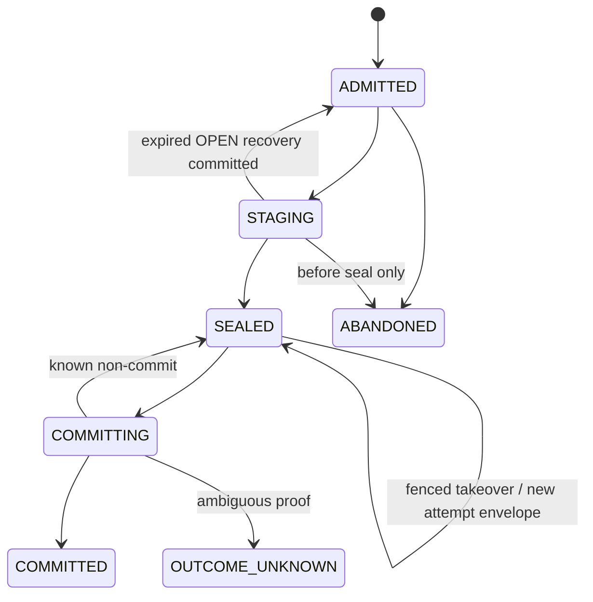

# Feature design: PostgreSQL → MSSQL R1 provider closure

> Migration status: historical source document retained for contract context. Source approvals, commit references, test counts and architecture exceptions do not establish approval or passing evidence for the current migration candidate. Current validation and public binding remain separately tracked.

- Status: APPROVED
- Owner: dpone maintainers
- Issue: PostgreSQL → MSSQL Industrial Integration V7 / R1
- Target release: R1
- Last verified: 2026-09-05

Approval history: the maintainer approved the V7 roadmap and subsequently
authorized continuation through all stages on 2026-09-04. The original V3
provider closure passed fresh architecture and test/certification review. A
later runtime composition audit found missing transaction, target-local
authority-resolution, stage-consumption, candidate-proof and schema-attestation
ports. The resulting narrow contract/port amendment passed fresh architecture,
contract and test/certification review on 2026-09-04. Concrete SQL schema/backend
work remains gated by its own approved exact physical-schema sub-spec. Fresh
implementation review then proved that a digest-only candidate attempt could be
re-authored with a different owner; the narrow exact-attempt amendment below
passed fresh architecture and test/certification review on 2026-09-04 before
the implementation commit was integrated.
The portable/observed schema-2 authority amendment then passed fresh
architecture and test/certification review and was approved by the maintainer
on 2026-09-05. Concrete SQL remains gated by the separate exact physical-schema
specification.

## Executive summary

The approved R1 correctness design has a sound target-local unit of work, but
the current repository cannot yet construct an executable route without
guessing the signed physical target registration, the exact staging/DML
representation, source-free recovery of a sealed effect, generation authority
composition, control-plane replay, and the closed quality evidence format.
Wiring the default runtime before those authorities
exist would convert `implementation_status=implemented` into a false claim.

This amendment closes those boundaries without weakening the original product
scope. It keeps the public manifest semantic, keeps the default activation
blocked until exact vendor-live evidence exists, and introduces only the
operator actions needed to provision and diagnose the target-local R1 domain.
Pure contract/port closure may proceed under a path-scoped task contract. The
concrete SQL schema/backend MUST NOT begin until its exact physical-schema
sub-spec is separately marked `APPROVED`. ADR 0056 is updated consistently.

Measurable outcome:

```text
registered R1 route
→ target provisioned from signed deployment authority
→ OPEN staging registered before load
→ exact canonical rows scanned and SEALED
→ crash-safe source-free SEALED resume
→ one-session target/hash/quality/receipt/checkpoint/head commit
```

No step may infer durable authority from live catalog state, process memory, or
an untyped byte blob.

## Personas and customer journey

| Persona | Goal | Current pain | Success signal |
|---|---|---|---|
| Data engineer | Run a registered Batch/XMin route safely | Planning can select R1 but runtime composition is absent | `dpone run --run-id ...` either commits one exact receipt or returns a stable blocker |
| Platform operator | Provision and attest the target authority | SQL renderers exist without an executable registration workflow | Plan/apply/status commands use signed, redacted, target-local authority |
| On-call operator | Recover after a process or commit-response loss | A durable `SEALED` effect cannot resume before source I/O | Status identifies replay, sealed-resume, safe retry, or manual recovery without source reread |
| Auditor | Prove the target and evidence describe one effect | Stage and quality digests can be caller-supplied opaque bytes | Typed manifests and canonical receipts reproduce every proof |

Customer journey:

1. Discover the exact R1 tuple with `dpone plan`; compatibility routes are not
   promoted by connector-name heuristics.
2. A platform operator creates a signed deployment registration outside the
   pipeline manifest.
3. `dpone ops postgres-mssql-r1-target-plan` validates the registration and
   renders a non-mutating redacted plan.
4. `...-target-provision --yes` installs/attests V3 schema, protected target
   properties, registration and the uninitialized head in one target database.
5. `...-target-status` proves registration, head, permissions, evidence and
   activation state without reading PostgreSQL business rows.
6. The data engineer runs `dpone run MANIFEST --run-id <stable-id>`. A retry
   uses the same run ID.
7. If the process died after sealing, pre-source admission resumes the exact
   target-local request and reports `source_io_performed=false`.
8. If a destructive generation transition is required, the operator verifies
   and imports a signed one-shot authority, then retries the same stable run.
9. Upgrade first verifies read compatibility with current target-local schema;
   rollback is refused when the old binary cannot read it.

## Scope

### In scope

- Signed, provisioner-owned `MssqlTargetRegistrationV1`.
- Exact target identity reader and full live/registered identity reproof.
- Typed `R1OpenStagePlanV1`, `R1SealedStageManifestV1` and canonical codecs.
- Dedicated Batch and XMin staging providers with register-before-load,
  transactional seal, mutation denial, retained replay and exact re-attestation.
- `SEALED_RESUMABLE` pre-source outcome and source-free coordinator path.
- Provisioner-side detached-signature verification and target-local import of a
  closed set of at most two purpose-specific one-shot generation authorities.
- Typed Batch/XMin quality evidence and closed providers.
- Concrete XMin DML, row-hash and append-only checkpoint providers.
- Target-local authority resolution, artifact consumption and full candidate
  read-back inside the same V3 transaction.
- Exact V3 schema inventory, transaction/session identity and least-privilege
  named-procedure grants.
- Mode-specific prepared runners and the final thin application composition.
- Retry-epoch and Batch content-generation invariants already stated by the
  approved R1 design.
- Minimal operator CLI and documentation needed to provision/status/recover R1.

### Non-goals

- WAL CDC, R2A wire optimization, R2 Batch Engine V2, DTC/AG or journals.
- Generic user-defined SQL quality rules.
- Runtime DDL or self-learning physical target identity.
- Reusing the legacy generic staging finalizer for an R1 effect.
- Composite/string keys, multiple business relations or target-managed columns.
- Automatic rollback from a V3 writer to any older writer contract.
- Registration retirement/revocation and revoked-registration completion
  override activation; their incomplete internal contracts remain blocked.

### Assumptions and constraints

- PostgreSQL 16 and SQL Server 2022 standalone/same-database only.
- The target already satisfies the closed ordinary disk-rowstore profile.
- Runtime and provisioner principals are distinct.
- `--run-id` is explicit, stable across retries and excluded from attempt number.
- All staging and target scans are bounded by sealed rows/bytes, target-row and
  transaction/log/time limits admitted before target mutation.
- The current R1 certification remains `UNVERIFIED`; unavailable live
  infrastructure is never converted to `PASS`.
- No production V2 receipt or sealed operation exists yet. Schema upgrade from
  the experimental scalar-authority layout is allowed only after target-local
  proof of that absence; otherwise activation remains blocked.

## Public contract

### CLI

New platform-operator commands:

```text
dpone ops postgres-mssql-r1-target-plan MANIFEST --format json|md
dpone ops postgres-mssql-r1-target-provision MANIFEST --registration-bundle FILE --registration-action initial|rotate --yes --format json|md
dpone ops postgres-mssql-r1-target-status MANIFEST --format json|md
dpone ops postgres-mssql-r1-authority-import MANIFEST --authority-bundle FILE --yes --format json|md
```

Contract:

- JSON is authoritative; Markdown is a deterministic projection.
- Exit `0`: valid non-mutating plan, healthy status, or committed requested
  control-plane mutation.
- Exit `1`: stable blocked/failed result.
- Exit `2`: invalid arguments, manifest or bundle.
- Mutating commands require `--yes`, never prompt in non-interactive mode and
  use create-only/compare-and-set behavior.
- Existing files are not overwritten. Bundle paths are input only; signature,
  credentials, physical database/object GUIDs and authority object names are
  redacted. The opaque `registration_id` and control-effect key are public
  correlation identities.
- `dpone run` requires explicit `--run-id` whenever R1 is selected. Missing ID
  fails before endpoint construction with
  `DPONE_POSTGRES_MSSQL_RUN_ID_REQUIRED`.

### Python API

The public Python surface is one manifest-driven application service:

```python
PostgresMssqlR1ControlService.plan(...)
PostgresMssqlR1ControlService.provision(...)
PostgresMssqlR1ControlService.status(...)
PostgresMssqlR1ControlService.import_generation_authority(...)
```

Low-level sessions, SQL renderers, staging scan plans and UoW ports remain
internal. CLI and Python return the same typed result model and reason codes.

`PostgresMssqlR1ControlResultV1` is the shared JSON/Python control result:

```yaml
schema_version: dpone.postgres-mssql-r1-control-result.v1
operation: plan | provision | status | authority_import
mutates: bool
outcome: planned | committed | replayed | healthy | blocked | failed
reason_code: enum from dpone.postgres-mssql-r1-control-reasons.v1
profile_id: public opaque profile ID
registration_id: uuid | null
expected_head_revision: bigint | null
observed_head_revision: bigint | null
control_effect_key: sha256 | null
commit_classification: not_applicable | committed | replay_suppressed | unknown
recovery_action: enum from dpone.postgres-mssql-r1-recovery-actions.v1 | null
implementation_status: absent | experimental | implemented
certification_status: unverified | local_pass | vendor_pass | expired
activation_status: blocked | explicit_opt_in | default
```

Allowed combinations are versioned with the two enum registries: plan returns
`planned/not_applicable`; healthy status returns `healthy/not_applicable`;
provision/import return `committed/committed` or
`replayed/replay_suppressed`; any ambiguous mutation returns `blocked/unknown`.
Plan/status are non-mutating. Provision and authority import return `committed`
or exact `replayed` only after a target-local control receipt proves the effect.
Unknown commit outcome returns exit `1`, `outcome=blocked`, and a target-only
recovery action. Pause/resume are deferred until their durable transition and
active-operation semantics receive a separately approved amendment.

### Manifest/schema

The user-authored batch manifest is unchanged. The environment profile adds an
opaque `target_registration_ref`; it does not add server names, database GUIDs,
staging tables, signature bundles or receipt locations to the user manifest.

The resolved semantic profile MUST still satisfy:

```yaml
target_effect: effectively_once
maximum_ack_boundary: durable_target_database_authority
transaction_atomicity: route_visible_events
schema_policy: stable_fail_closed
```

### Artifacts and evidence

`MssqlTargetRegistrationPayloadV1` contains, in this exact order:

```yaml
registration_id: uuid
registration_action: initial | rotate
predecessor_registration_id: uuid | null
expected_active_registration_revision: bigint | null
issued_at: UTC instant
expires_at: UTC instant
nonce: 128-bit random value
profile_id: string
capability_tuple_digest: sha256
resolved_profile_digest: sha256
route_source_authority_sha256: sha256
target_object_profile: ordinary_disk_rowstore_v1
catalog_projection_version: dpone-mssql-target-catalog-v1
revocation_revision: non-negative bigint
target_binding_uuid: uuid
target_object_uuid: uuid
recovery_domain_uuid: uuid
recovery_domain_epoch: positive bigint
server_instance_identity_sha256: sha256
database_guid: uuid
database_family_guid: uuid
recovery_fork_guid: uuid
database_name_digest: sha256
schema_name_digest: sha256
object_name_digest: sha256
database_name: NFC canonical identifier
schema_name: NFC canonical identifier
object_name: NFC canonical identifier
object_id: positive int
physical_generation_uuid: uuid
catalog_contract_digest: sha256
target_contract_revision: positive bigint
```

`MssqlTargetRegistrationPayloadV1` is canonical length-framed UTF-8 with domain
separator `dpone-mssql-target-registration-v1\0`, NFC-normalized identifiers,
and the fields above in the documented order. It cannot contain its own digest,
signature data or mutable lifecycle state. `registration_payload_digest` hashes
these exact bytes.

`MssqlTargetRegistrationVerificationV1` records `registration_payload_digest`,
`signature_bundle_digest`, `signer_identity_digest`, trusted-root digest, Cosign
policy digest, verifier version, verification timestamp, certificate
identity/issuer digests and exact payload bytes. Trust
roots and policy come only from environment authority,
never from the bundle. The registration payload and verification-policy digests
are included transitively in `source_authority_sha256`, generation head and
every effect/control receipt.

Every operation and sealed intent also binds `registration_id`, payload digest,
verification-policy digest and `admitted_at_server_time`. New operations require
the active registration to be nonexpired and nonrevoked at admission. A sealed
operation keeps its exact registration: later expiry does not prevent
source-free completion, but explicit revocation blocks it for manual recovery
and never permits a fresh source scan. Rotation uses the
`registration_action=rotate` provision branch to create a successor and
CAS-advance the active-registration head without rebinding admitted, staging or
sealed operations. The UoW re-proves the operation-bound registration, not
merely the current active registration.

Initial payloads require both predecessor fields NULL. Rotation requires the
current predecessor ID and revision. Its transaction proves unchanged physical
identity/binding, inserts the immutable successor, CAS-advances only the
active-registration head, preserves writer head and admitted operations, and
writes a `registration_rotate` control receipt. Exact replay proves the same
successor/head receipt; a revision or physical-identity conflict blocks.

Explicit revocation of an operation-bound registration puts its sealed effects
in manual recovery and blocks R1 execution without source reread. The existing
internal override payload/import prototypes are unreachable from the R1 CLI,
composition and transactional ports. R1 does not import, admit or consume an
override and every R1 effect receipt requires override identity to be absent.
A future override capability requires a separately approved signed revocation
command, durable revocation receipt, target-local resolver and certification;
none is inferred from the prototype types.

Public output exposes only registration ID/profile, revision, status and
redacted digests. The target-local registration row is immutable. R1 supports
only initial registration and rotation; retirement and revocation remain
activation-blocked non-goals. There is one active registration per physical
server/database/object identity and one binding for that object. The
active-registration head stores physical
identity digest, binding UUID, registration ID, revision and last control
receipt, with a unique key on physical identity and another on binding UUID;
protected object properties enforce the same binding. Provisioning first acquires a physical-object
lock derived independently of `target_binding_uuid`, then the canonical binding
lock. Protected target properties, active-registration head and initial writer
head are installed in the same provisioning transaction.

`R1OpenStagePlanV1` fixes before DDL/load:

```yaml
codec_version: dpone-r1-open-stage-plan-v1
artifact_id: uuid
artifact_kind: batch_payload | xmin_delta | xmin_complete_keys
target_binding_uuid: uuid
effect_key: sha256
owner_epoch: positive bigint
server_lease_seconds: bounded positive int
exact_stage_ddl_digest: sha256
ordered_business_columns: closed typed mappings
canonical_payload_columns: closed identifiers and bounds
```

Batch payload requires complete business row plus key/row/hash payload columns.
XMin delta contains current rows selected by the XMin predicate and never a
caller-supplied operation discriminator. XMin complete-keys has key payload
only; its row payload is absent and canonical artifact encoding writes
`row_length=0`.

The owner procedure renders one of three closed templates (business columns use
only types from the registered type-policy projection):

| Artifact kind | Required protected columns |
|---|---|
| `batch_payload` | ordered typed business columns; `__dpone_key varbinary(max) NOT NULL`; `__dpone_row varbinary(max) NOT NULL`; `__dpone_hash binary(32) NOT NULL` |
| `xmin_delta` | the same typed current-row and canonical key/row/hash columns as Batch |
| `xmin_complete_keys` | typed key column; `__dpone_key varbinary(max) NOT NULL`; no row/hash/op column |

Batch/XMin-delta templates put their unique constraint on the typed non-null
business key (`smallint`, `int`, `bigint` or `uniqueidentifier`), never on
`varbinary(max)`; seal separately proves canonical-key uniqueness. The
complete-keys template uses the same typed business key constraint. All
templates reject nullable canonical keys and carry exact
artifact/token/plan extended properties. Names, constraints, column order and
type declarations are canonical inputs to `exact_stage_ddl_digest`; arbitrary
DDL is rejected.

`R1SealedStageManifestV1` is a canonical tuple of:

```yaml
codec_version: dpone-r1-sealed-stage-manifest-v1
artifact_id: uuid
artifact_kind: batch_payload | xmin_delta | xmin_complete_keys
target_binding_uuid: uuid
effect_key: sha256
schema_digest: sha256
catalog_contract_digest: sha256
permission_contract_digest: sha256
type_policy_digest: sha256
object_uuid: uuid
object_id: positive int
physical_token: uuid
target_local_schema: identifier
target_local_object: identifier
ordered_business_columns:
  - source_ordinal: positive int
    stage_column: identifier
    target_ordinal: positive int
    target_column: identifier
    logical_type_id: string
canonical_key_payload_column: identifier
canonical_row_payload_column: identifier | null
canonical_row_hash_column: identifier | null
maximum_key_bytes: positive int
maximum_row_bytes: positive int
observed_row_count: non-negative bigint
observed_payload_bytes: non-negative bigint
row_hash_rule: sha256_canonical_row_v1 | null
open_stage_plan_digest: sha256
exact_stage_ddl_digest: sha256
manifest_digest: sha256
```

For Batch and XMin delta, row-payload/hash fields and row-hash rule are non-null;
for complete keys all three are NULL. The manifest must equal the protected
OPEN-plan and DDL digests. Per-kind artifact grammar is exact: Batch/XMin delta
encode kind, schema digest, count, then key length+key and row length+row;
complete keys encode the same header and each key followed by `row_length=0`.

`observed_payload_bytes` is computed by the sealing scan as the sum of the
length-framed canonical key and row
payload bytes, excluding SQL Server row/page overhead. Canonical manifest bytes
use a versioned length-framed codec; `manifest_digest` is included in artifact
authority, artifact-set digest, sealed intent, mutation plan and receipt.

Staging stores protected typed business columns and canonical key/row bytes.
The UoW performs one ordered scan of both representations and the closed type
policy must encode every typed business value to the exact stored canonical
bytes before those typed columns may feed DML. A mismatch rolls back. No vendor
text reconstruction is allowed. Row hash is SHA-256 of canonical row bytes.

Quality becomes a discriminated canonical union of
`MssqlBatchQualityEvidenceV3` and `MssqlXminQualityEvidenceV3` with:

```yaml
codec_version: dpone-r1-quality-v3
source_mode: batch_full_refresh | xmin_current_state
probe_contract_digest: sha256
batch:
  staged_rows: bigint
  typed_scan_rows: bigint
  candidate_target_rows: bigint
  candidate_sidecar_rows: bigint
  non_null_keys: bigint
  unique_keys: bigint
  canonical_reencode_matches: bigint
  sidecar_hash_matches: bigint
xmin:
  affected_key_count: bigint
  expected_present_keys: bigint
  observed_target_present_keys: bigint
  observed_sidecar_present_keys: bigint
  expected_absent_keys: bigint
  observed_target_absent_keys: bigint
  observed_sidecar_absent_keys: bigint
  survivor_hash_matches: bigint
  complete_key_count: bigint
  target_row_count_after: bigint
  target_row_count_before: bigint
  inserted_count: bigint
  deleted_count: bigint
  delta_no_effect_count: bigint
  unchanged_row_count: bigint
  delta_keys_not_in_complete: bigint
  target_keys_missing_from_complete: bigint
  complete_keys_missing_from_target: bigint
  checkpoint_predecessor_matches: bool
```

The receipt continues storing canonical evidence bytes and its digest. Arbitrary
bytes and user SQL are rejected. The closed predicates are:

| Mode | Scope | Required success equations |
|---|---|---|
| Batch | Complete sealed candidate generation | staged keys = typed-scan keys = candidate target keys = sidecar keys; all four counts equal; every typed row re-encodes to its canonical row bytes and every sidecar hash equals SHA-256(canonical row) |
| XMin | Exact sealed delta and complete-key set | `D/I/U/NΔ` are pairwise disjoint; affected keys = `D∪I∪U∪NΔ`; survivors equal target and sidecar keys in `I∪U∪NΔ`; deleted keys are absent from target and sidecar; hashes match for every survivor; checkpoint predecessor equals the locked head/checkpoint |

For XMin, let `Δ` be delta-stage keys, `K` complete source keys and `T0` target
keys before mutation:

```text
D  = T0 - K
I  = Δ - T0
U  = {k in Δ∩T0 | staged_hash != target_hash}
NΔ = {k in Δ∩T0 | staged_hash == target_hash}
A  = (T0∩K) - Δ
```

Apply is `DELETE D → UPDATE U → INSERT I`. Union variants cannot carry fields
from the other mode. `affected_key_count=|D∪I∪U∪NΔ|`, present counts and
survivor hashes equal `|I∪U∪NΔ|`, absent counts equal `|D|`,
`delta_no_effect_count=|NΔ|`, `unchanged_row_count=|A|+|NΔ|`, and
`target_row_count_before - deleted_count + inserted_count =
target_row_count_after = complete_key_count`. In addition, the cross-artifact
anti-join counts `delta_keys_not_in_complete`,
`target_keys_missing_from_complete` and
`complete_keys_missing_from_target` must all be zero. Thus `Δ⊆K` and final
target keys equal `K`; cardinality alone is never accepted. These query
templates and both manifest digests are bound by `probe_contract_digest`.
Counts use checked SQL `bigint`;
overflow, duplicate
probe rows, timeout or incomplete result rolls back. XMin probes only the
bounded affected-key set except the separately admitted complete-key/target
cardinality query. A whole-target Batch scan requires explicit resource
admission. `probe_contract_digest` binds exact query-template version, scope,
type policy, hash policy and mutation-plan codec.

### Compatibility and migration

- V1 receipts remain read/replay-only; no V1 schema is mutated.
- Experimental scalar-authority V2 rows remain read/replay-only and are never
  reinterpreted as the authority-set contract. Existing scalar sealed intents
  cannot be upgraded automatically.
- Existing compatibility plans and routes keep their output and behavior.
- R1 status is `implementation_status=absent` until the final composition and
  all executable provider tests land; then it may become `implemented` while
  certification remains `unverified` and activation remains `blocked`.
- The V1 principal is retired only during signed cutover. Once a V3 receipt
  exists, an old binary may run only when it can read current V3 authority;
  otherwise the route remains paused.
- New writes use request codec `dpone.mssql-effect-request.v3`, authority-link
  schema V2 and receipt-body codec revision V3 with exact
  `generation_authority_set_digest`. Upgrade is idempotent and allowed only
  after proving no nonterminal operation and no production receipt under an
  older writable revision. Partial schema or unreadable rows block. A new writer
  over historical scalar authority needs explicit initial/rebaseline cutover;
  dual-write is forbidden. Rollback compatibility is decided by the reader's
  declared schema/codec range, not by table existence.

The complete new effect identity is:

```yaml
effect_contract_version: mssql_effect_receipt_v3
request_codec: dpone.mssql-effect-request.v3
quality_codec: dpone-r1-quality-v3
authority_set_codec: dpone-r1-generation-authority-set-v2
```

`effect_contract_version` participates in operation/effect keys, sealed request,
receipt header/body digest, control receipts and every recovery probe. V2 bytes
are decoded only by the V2 read/replay path and cannot collide with or be
interpreted by V3.

## Detailed algorithm

### Target registration and provisioning

1. Resolve the semantic route and exact environment profile without endpoint I/O.
2. Load the create-only signed registration bundle and verify canonical payload,
   trusted identity, signature bundle, expiry and profile digest through the
   existing detached `BlobSignatureVerifier` boundary.
3. Open a provisioner-only SQL Server session; prove standalone/same-database,
   delayed durability disabled and closed target-object capabilities.
4. Read server, database, recovery fork, coordinates, object ID and catalog
   identity. Compare every field with the signed registration; never learn or
   repair a mismatch automatically.
5. In one fully durable transaction, acquire physical-object then binding locks
   and install/upgrade the V3-capable schema. For `initial`, prove no active
   registration, write the immutable registration, attach protected properties,
   create the uninitialized writer/active-registration heads and apply grants.
   For `rotate`, prove predecessor/revision and unchanged physical identity,
   insert the successor and CAS only the active-registration head; preserve
   writer head, properties and admitted operations.
6. Read back registration/properties/head/grants and commit a `provision` or
   `registration_rotate` control receipt. Provision is create-only exact replay.
   An ambiguous commit is classified only by a fresh target-local
   receipt/registration probe.

Authority import verifies its bundle outside the target transaction, then under
physical-object, binding, operation and ordered artifact locks re-proves the
exact sealed intent before create-only insertion of purpose-specific authority
refs and a control receipt. Exact repeats return that receipt. Conflicting
payload, expiry/revocation, active foreign epoch or ambiguous fresh-session
probe blocks. All control commands use the same lock hierarchy as data effects.

`MssqlR1ControlReceiptV1` is immutable:

```yaml
control_receipt_id: uuid
control_effect_key: sha256
operation: provision | registration_rotate | authority_import
target_physical_identity_digest: sha256
target_binding_uuid: uuid
registration_id: uuid
input_payload_digest: sha256
verification_receipt_digest: sha256
expected_active_registration_revision: bigint | null
committed_active_registration_revision: bigint
expected_writer_head_revision: bigint | null
observed_writer_head_revision: bigint
expected_writer_head_digest: sha256 | null
observed_writer_head_digest: sha256
schema_contract_digest: sha256
permission_contract_digest: sha256
affected_authority_set_digest: sha256 | null
committed_at: UTC instant
receipt_digest: sha256
```

`control_effect_key = H(domain, operation, physical-target identity,
registration/authority payload digest, expected revision)` and is unique. The
receipt commits with the registration/schema/grant/authority/head effect. Exact
replay verifies every receipt field plus registration, properties, schema,
grants and relevant head. Presence of a registration row alone never resolves
an ambiguous commit. Conflicting receipt/payload/revision blocks, and authority
import either creates the complete authority set or none of it.

For `provision`, `expected_writer_head_revision` and
`expected_writer_head_digest` are NULL, while the committed observation is the
new uninitialized writer head at revision `1` with a non-NULL exact digest. For
all other control operations, the expected and observed writer-head revisions
are positive and equal, and their digests are non-NULL and exactly equal. A
fresh ambiguous-outcome proof reads a typed writer-head observation and must
match both receipt-bound values; a missing, foreign or modified head blocks.

OPEN-stage retry uses a separate immutable
`MssqlOpenStageRecoveryReceiptV1`, committed with cleanup and epoch/head CAS:

```yaml
recovery_receipt_id: uuid
effect_key: sha256
recovery_effect_key: sha256
operation_key: sha256
old_artifact_set_digest: sha256
abandoned_artifact_ids: ordered uuid list
expected_operation_epoch: positive bigint
committed_operation_epoch: positive bigint
expected_operation_projection_revision: positive bigint
committed_operation_projection_revision: positive bigint
new_artifact_ids: ordered uuid list
new_open_plan_set_digest: sha256
committed_operation_state: ADMITTED
committed_at: UTC instant
receipt_digest: sha256
```

`effect_key` remains the original business-effect identity. The recovery
transition identity is unique and derived as:

```text
recovery_effect_key = H(
  "dpone-r1-open-stage-recovery-v1\0",
  operation_key,
  effect_key,
  old_artifact_set_digest,
  expected_operation_epoch,
  expected_operation_projection_revision
)
```

OPEN/STAGING recovery is valid only for an already admitted operation, so the
expected operation-projection revision is mandatory and positive. The
committed revision is exactly `expected + 1`; there is no NULL/first-revision
branch. The recovery effect key always includes the non-NULL predecessor
projection revision.

Ambiguous recovery probes by `recovery_effect_key` and then requires exact
receipt plus operation/head/artifact read-back; a partial or conflicting
observation blocks source I/O.

### Effect preparation and staging

1. Pre-source admission derives stable operation/effect keys and returns one of
   `REPLAY_SUPPRESSED`, `SEALED_RESUMABLE`, `ADMITTED`, or a blocker.
2. `REPLAY_SUPPRESSED` returns the exact receipt without source I/O.
3. For `SEALED_RESUMABLE`, the target-only takeover primitive validates and
   decodes the retained semantic request and atomically returns its server-built
   attempt envelope with the new epoch. The coordinator never overlays or edits
   it; it re-proves stage and target and invokes the proper prepared runner
   without PostgreSQL construction/open/I/O.
4. `ADMITTED` opens exactly one PostgreSQL snapshot and performs extraction.
5. For each required artifact, runtime invokes a certificate-signed,
   caller-executed procedure that
   atomically creates the stage, attaches token/catalog properties, registers
   `OPEN`, starts a server-timed lease and grants object-local load permission.
   Runtime has `EXECUTE`, not DDL authority.
6. The stage writer stores business columns plus canonical key/row payloads and
   row hashes. Duplicate keys, malformed canonical payloads, bounds or counts
   fail before seal.
7. The owner renews the lease during extraction/load and stops loading after any
   failed renewal. Under artifact applock and `TABLOCKX,HOLDLOCK`, one physical
   session/transaction scans typed and canonical representations, proves their
   equivalence, computes the digest, verifies schema/catalog/permissions, writes
   the typed scan manifest, installs DML denial, changes `OPEN→SEALED`, and reads
   it back.
8. The runner persists exact canonical `R1BatchMutationPlanV1` or
   `R1XminMutationPlanV1` bytes, constructs request codec V3, performs
   first-seal-wins intent sealing, resource admission and exact authority-set
   lookup. A lost artifact/intent seal response is classified only by a fresh
   target-local probe; an inconclusive result forbids source reread.

`R1BatchMutationPlanV1` and `R1XminMutationPlanV1` contain ordered stage/target
column mappings, D/I/U semantics, hash mutations, artifact references,
type/quality contract identities, admitted resource limits and, for XMin, the
checkpoint transition. Exact canonical plan bytes and digest are retained;
unknown codecs block resume and downgrade.

The XMin plan additionally fixes target/delta/complete-key object coordinates,
key mapping, target ordinals, null-safe equality expressions, row-hash columns,
and exact SQL templates/count contracts. Its target order is `DELETE D → UPDATE
U → INSERT I`, followed by sidecar mutations and append-only checkpoint CAS in
the same session. SQL identifiers are rendered only from the sealed plan with
the repository identifier-quoting policy; providers cannot synthesize a new
shape during resume.

The target-specific rendered execution bundle is data-only retained evidence,
not a trust source. At the seal boundary, an injected environment resolver
selects `MssqlR1RendererAuthorityV1` independently from the signed
`resolved_profile_digest`; neither the request nor the returned bundle may
supply or expand the admitted renderer-build set. The certified renderer emits
the exact execution bytes, and an injected verifier admits those bytes against
the independently resolved authority before any persistence or SQL I/O. The
retained bundle stores renderer/authority identity and the admission-evidence
digest, but never a self-authorizing allowlist. Resume executes the already
admitted exact bytes and must not re-render them. Altered SQL remains invalid
even when its statement digest and proposed renderer identifiers are
recomputed.

Artifact digest remains:

```text
"dpone-r1-artifact-v1\0"
+ length-framed artifact_kind
+ schema_digest[32]
+ row_count:uint64be
+ each key-ordered row:
    key_length:uint32be + canonical_key_payload
  + row_length:uint64be + canonical_row_payload
```

### Target transaction

1. Build a mode-specific runner; it composes the existing shared UoW and does
   not expose framework objects to SQL adapters.
2. Re-acquire target, operation and artifact locks in canonical order.
3. Re-prove signed registration against live server/database/catalog/head.
4. Re-scan each sealed artifact from the typed sealed-stage manifest and require exact
   digests/counts/bytes.
5. Resolve and admit the exact already imported target-local issuance and
   ordered generation-authority set when required. Zero or multiple matching
   issuance rows, expiry, foreign registration/revision or a consumed row block.
   An empty authority set resolves to an explicit no-issuance observation.
   Runtime does not verify a detached bundle and cannot issue authority. R1
   resolves no revoked-registration override.
6. Apply Batch or XMin DML, generation-scoped row hash and the corresponding
   closed bounded quality provider on the same handle.
7. Append the typed receipt and XMin checkpoint when applicable.
8. Atomically consume the exact sealed artifact set and every admitted
   generation-authority ref, then advance operation and writer head. Both XMin
   artifacts consume together; partial consumption is invalid.
9. Invoke `candidate.prove(transaction, attempt, receipt)`. The provider ignores
   caller projections and re-reads the exact receipt/body, operation/head,
   target/hash generation, checkpoint, artifact/authority consumption,
   registration/physical authority and schema attestation in the same active
   transaction. Re-assert the transaction is active, then invoke
   `proof.assert_for(transaction.binding, attempt, receipt)` with the same
   independently trusted arguments before commit.
10. Commit with delayed durability off. Any post-dispatch exception uses a fresh
   receipt proof; the old session is never queried again.

### Batch generation rule

```text
if no previous generation:
    candidate generation = 1
    require transition authority initial_cutover
elif previous writer mode is not batch or operator selected rebaseline:
    candidate generation = previous + 1
    require matching transition authority rebaseline
else:
    candidate generation = previous + 1
    non-empty ordinary Batch refresh requires no exceptional authority
if payload is empty:
    additionally require supplemental empty_refresh authority
same-generation or skipped-generation Batch request:
    reject at contract construction
```

XMin ordinary effects remain in the current generation; only its approved
handoff/rebaseline transitions may advance it.

The XMin transition matrix is:

| Previous state | XMin transition | Authority | Candidate |
|---|---|---|---|
| Uninitialized | Initial baseline | `initial_cutover` | `1/1` |
| Batch `N` | Batch→XMin handoff | `rebaseline` | `N+1/1` |
| XMin `N` | Explicit rebaseline | `rebaseline` | `N+1/1` |
| XMin `N/r` | Ordinary poll | — | `N/r+1` |

An empty XMin delta is not an empty source: deletes are derived from complete
keys. No target effect exists only when `D=I=U=∅`; `NΔ` may still advance the
checkpoint. Whenever the complete-key set `K=∅`, every transition and ordinary
poll additionally requires `empty_refresh`, including empty→empty. If `K=∅`
and `T0≠∅`, then `D=T0` and the transaction is a full hard-delete, not a
no-effect poll. Missing empty authority blocks before target mutation.

The normative Batch matrix is:

| Previous state | Payload | Transition authority | Supplemental authority | Candidate |
|---|---:|---|---|---|
| Uninitialized | Non-empty | `initial_cutover` | — | `1/1` |
| Uninitialized | Empty | `initial_cutover` | `empty_refresh` | `1/1` |
| Batch `N` | Non-empty | — | — | `N+1/1` |
| Batch `N` | Empty | — | `empty_refresh` | `N+1/1` |
| XMin `N` → Batch | Non-empty | `rebaseline` | — | `N+1/1` |
| XMin `N` → Batch | Empty | `rebaseline` | `empty_refresh` | `N+1/1` |

`MssqlGenerationAuthoritySetV2` is a canonical ordered set of at most two refs:
zero or one transition purpose (`initial_cutover` or `rebaseline`), followed by
zero or one supplemental `empty_refresh`. Duplicate, extra, reversed or
wrong-purpose refs fail. Each ref binds effect, snapshot, artifact set, mutation
plan, expected/candidate head and generation. The exact set digest is retained
in sealed intent and receipt. Admit and consume lock and transition the complete
set atomically; all refs remain `ISSUED` or all become `CONSUMED`.

### Retry, resume and rollback

```text
pre-source probe / sealed takeover transaction
  exact receipt                 -> replay, no source I/O
  exact SEALED effect           -> atomic fenced takeover, epoch+1, resume, no source I/O
  no receipt/no sealed intent   -> normal source extraction
  identity/head/fork conflict   -> block

commit response lost
  exact receipt on fresh probe  -> committed_after_receipt_probe
  positive non-commit proof     -> retry same sealed intent with monotonic epoch
  anything else                 -> commit_outcome_unknown; preserve stage
```

The immutable semantic effect payload is separate from its retry-attempt
envelope. Sealed takeover executes at `SERIALIZABLE` in one SQL transaction:

```text
BEGIN
→ physical target/binding lock
→ operation lock
→ ordered artifact locks
→ prove receipt absent and registration/head/recovery/checkpoint unchanged
→ prove operation SEALED, server lease expired and every artifact SEALED/retained/immutable
→ CAS operation epoch/owner/server lease
→ CAS head active-operation projection
→ read exact retained semantic request and create attempt envelope
→ COMMIT
```

`SEALED_RESUMABLE` is a decision outcome, not a durable operation state; the
durable operation remains `SEALED`. `COMMITTING/APPLYING` is transaction-local.
An ambiguous takeover commit blocks. Caller-side epoch overlay is forbidden.
Normal lost-commit recovery and pre-source resume use this one primitive, so an
attempt cannot be incremented twice. Composition is exact:

```text
pure manifest/run-id/profile validation
→ lazy target-authority graph and target session
→ target-only admission/replay/sealed takeover
→ only for ADMITTED: construct/open PostgreSQL endpoint, snapshot and extract
```

The coordinator runs the sealed runner before PostgreSQL factory invocation; it
receives only the retained typed request, never current
strategy/payload/source-derived state. Hermetic tests require zero source-factory
calls for replay, sealed resume and every blocker. New epoch
does not change intent, artifact, authority-set or mutation-plan digests.
Coordinator result validation accepts the same or higher committed epoch only
when the exact receipt matches the admitted effect. Lower epochs are rejected.

Cancellation before seal does not permit takeover of an OPEN artifact. Cleanup
first revokes load permission, proves writer quiescence with an exclusive table
lock, then records `ABANDONED`/GC under the artifact lock. A BCP session from a
stale owner can therefore never continue after ownership changes.
Cancellation after seal preserves it. Missing or corrupt stage, registration or
quality authority blocks; it never falls back to a fresh source scan under the
same effect key.

Retry of an unsealed OPEN/STAGING attempt with the same stable run/effect key is
allowed only after this target-only recovery transaction commits:

```text
BEGIN SERIALIZABLE
→ lock physical target, binding, operation and ordered old artifacts
→ prove receipt absent and sealed intent absent
→ prove server-time lease expired and old loader quiescent
→ revoke load permission and acquire exclusive table locks
→ mark old OPEN artifacts ABANDONED with cleanup receipts
→ increment operation epoch and allocate fresh artifact IDs/open-plan digests
→ CAS operation back to ADMITTED and update head projection
→ COMMIT
```

Only then may the normal ADMITTED path open a new PostgreSQL snapshot and create
fresh stages. An ambiguous recovery commit blocks source construction/I/O until
a fresh target-only probe proves its exact control receipt and epoch.

### State machine



### Edge cases

- Empty Batch still advances generation and requires supplemental
  `empty_refresh`; initial/mode-transition empty effects also require their
  independent transition authority.
- NULL business key, duplicate canonical key or unsupported scalar blocks before
  target mutation.
- Empty string and NULL remain distinct canonical payloads.
- Timeout/deadlock before commit rolls back once; failed rollback is unknown.
- Process crash after artifact or intent seal resumes from target-local bytes.
- Schema/catalog/permission drift after seal blocks re-attestation.
- A restored/cloned database with mismatched registration/recovery identity
  cannot infer non-commit.
- Quality mismatch rolls back DML/hash/receipt/checkpoint/head together.
- Unknown or unsupported provider/capability stays activation-blocked; no silent
  compatibility fallback is allowed after R1 selection.

## Architecture

### Components and responsibilities

| Component | Existing/new | Responsibility | Dependencies |
|---|---|---|---|
| `MssqlTargetRegistrationV1` | New contract | Signed deployment and physical identity authority | Pure contracts |
| Target registration adapter | New | Provision/read/re-prove target-local registration | MSSQL session port |
| `R1OpenStagePlanV1` / `R1SealedStageManifestV1` | New contracts | Exact stage creation and sealed scan grammar | Hash/type policy |
| R1 staging provider/attestor | New | OPEN/load/seal/re-scan lifecycle | Stage writer, MSSQL handle |
| Generation authority importer | New | Verify detached bundle and create issued target row | `BlobSignatureVerifier`, provisioner session |
| Batch/XMin quality providers | New | Closed bounded probes and typed evidence | MSSQL handle, scan plan |
| XMin SQL providers | New | D/U/I, row-hash and checkpoint operations | MSSQL handle |
| Prepared Batch/XMin runners | New | Assemble request-specific UoW collaborators | Existing preparations/UoW |
| Execution coordinator | Existing/adapt | Replay, sealed resume and one dispatch | Pre-source authority, runners |
| `PostgresMssqlR1RuntimeFactory` | New, last | Compose only exact resolved tuple | Sink connector, signed registration |

### Ports, adapters, and composition root

The existing R1-only `MssqlTargetAuthorityPreparationPort`,
`MssqlStagingArtifactAttestorPort` and `GenerationAuthorityVerifierPort` have
never been activated or released as public API. Freeze their V2 implementations
as read/replay-only internals and atomically introduce explicit V3 ports; no shim
may choose write policy. Add only the missing variation points:

```text
MssqlTargetRegistrationProvisionerPort
MssqlR1StageWriterPort
MssqlTargetAuthorityPreparationV3Port
MssqlSealedStageAttestorV3Port
MssqlGenerationAuthoritySetTransactionV3Port
MssqlSealedStageConsumptionV3Port
MssqlCandidateEffectProofV3Port
MssqlR1TransactionSessionFactoryV3Port
MssqlGenerationAuthoritySetVerifierV3Port
MssqlGenerationAuthoritySetImporterV3Port
PostgresMssqlR1SealedEffectRunnerPort
```

The active V3 verifier facade accepts only a signed generation-authority-set
command and exposes only `verify_authority_set`. The active importer accepts
only that command and exposes only authority-set import and its fresh proof.
The broader prototype verifier/importer that also exposes revoked-override
operations is never injected into active R1 composition. The provisioner
verifies detached signatures. During an effect, the V3
transaction adapter resolves imported issuance and authority rows from the
target database by the sealed attempt; the caller cannot select or supply an
issuance or authority set. It then admits/consumes those exact rows. Override
resolution is absent from the active R1 composition.
Batch and XMin receive separate quality and mutation providers. No generic
provider registry is introduced.

`MssqlR1TransactionV3` is a UoW-scoped wrapper, not merely an ID. It binds one
transaction UUID, one opaque physical handle and one stable SQL Server session
identity, supports `assert_active()`, and is released when its owning session is
closed. A V3 session factory owns begin/commit/rollback/close; adapters never
open a second connection inside a running effect. Any handle or session-identity
change blocks before the next SQL statement.

`MssqlR1SqlServerSessionIdentityV3` uses canonical domain
`dpone-r1-mssql-session-identity-v3\0` and contains server identity digest,
`database_id`, database
GUID/family/recovery-fork GUIDs, positive `spid` and session-context transaction
UUID. `MssqlR1TransactionBindingV3` uses domain
`dpone-r1-transaction-binding-v3\0` and contains transaction UUID, a random
128-bit factory binding token, session-identity canonical bytes/digest and
state. Python handle object identity is enforced in memory by the factory and
is deliberately not serialized as durable evidence.

The wrapper state machine is closed:

```text
NEW → ACTIVE → COMMIT_DISPATCHED → COMMITTED → CLOSED
             └→ ROLLED_BACK → CLOSED
             COMMIT_DISPATCHED + exception → OUTCOME_UNKNOWN → CLOSED
```

The factory alone creates bindings. The runtime-only binding fixes Python
handle object identity and a 128-bit binding token. The versioned SQL Server
session observation fixes `@@SPID`, `DB_ID()`, database GUID/family/recovery
fork, registered server identity and the transaction UUID stored read-only in
`SESSION_CONTEXT`. MARS is disabled and every effect statement first requires
the same binding plus `@@TRANCOUNT=1` and `XACT_STATE()=1`; the identity probe is
authority SQL, not business SQL. The same UUID with another handle and the same
handle with another UUID/session are both invalid. Binding lifetime is one UoW
and is removed on close, including rollback and ambiguous commit. After
`COMMIT_DISPATCHED`, the old wrapper permits no SQL and no rollback; a commit
exception only permits best-effort discard followed by a different fresh
session for replay classification.

The transaction-only authority interfaces are closed:

```text
authority.resolve_and_admit(transaction, attempt)
  -> admitted target-local issuance + ordered authority set

stages.consume(transaction, attempt, receipt)
  -> exact consumed artifact-set proof

candidate.prove(transaction, attempt, receipt)
  -> exact pre-commit candidate proof
```

`MssqlAdmittedGenerationAuthoritySetV3` and
`MssqlConsumedGenerationAuthoritySetV3` are canonical, transaction-bound
observations. For an empty required set they contain `issuance=None` and no
refs. For a non-empty set they bind:

```yaml
transaction_id: uuid
session_identity_digest: sha256
effect_key: sha256
sealed_request_digest: sha256
issuance_id: uuid
issuance_payload: canonical bytes
issuance_payload_digest: sha256
verification_payload: canonical bytes
verification_receipt_digest: sha256
registration_id: uuid
registration_payload_digest: sha256
registration_revocation_revision: non-negative bigint
authority_set_payload: canonical bytes
authority_set_digest: sha256
ordered_refs: exact canonical authority refs
state: ISSUED | CONSUMED
consuming_receipt_id: uuid | null
consuming_receipt_digest: sha256 | null
observed_projection_revisions: ordered positive bigints
```

Resolution requires exactly one unexpired `ISSUED` issuance whose exact set,
registration/revocation, effect, snapshot, artifact, mutation, generation/head
and recovery coordinates match the attempt. Zero or multiple matches block;
there is no latest/first selection. Issuance expiry is checked at effect
admission using target server time. The V3 receipt header and committed replay
bind issuance ID/payload digest and verification receipt digest when the set is
non-empty; all three are NULL for an empty set. Consumption changes all refs and
the issuance together in one guarded transaction and binds receipt ID/digest.

`MssqlConsumedSealedStageSetV3` is canonical and binds transaction/session,
effect/request, receipt ID/digest and the exact ordered artifact IDs, kinds,
manifest bytes/digests, prior `SEALED` timestamps/retention and resulting
`CONSUMED` timestamps/projection revisions. The only effect transition is:

```text
SEALED(manifest_digest, sealed_at, retention_until)
→ CONSUMED(manifest_digest, receipt_id, receipt_digest, consumed_at)
```

Batch consumes its one payload artifact; XMin consumes delta and complete-key
artifacts together in canonical kind/UUID order. Zero, extra, partial, already
consumed or wrong-receipt observations block. `ABANDONED` is a different
terminal transition requiring an exact OPEN-recovery receipt. Ambiguous rows
never acquire an automatic TTL.

The candidate proof is explicitly not a committed replay proof. It re-reads and
decodes receipt header/body, writer head, row-hash generation, checkpoint,
artifact/authority consumption and operation state inside the current
transaction. Intermediate observations are non-authoritative and are ignored
as caller inputs. Only
after it matches the sealed request and receipt may the session commit. A lost
commit response is still classified on a fresh connection by
`CommittedEffectReplayProofV3`, `KnownNotCommittedEffectReplayProofV3` or
`UnknownEffectReplayProofV3`.

`MssqlCandidateEffectProofV3` has canonical domain
`dpone-r1-candidate-effect-proof-v3\0` and binds:

```yaml
transaction_binding: exact active transaction/session observation
sealed_request_digest: sha256
attempt_payload: exact canonical MssqlR1EffectAttemptEnvelopeV3 bytes
attempt_digest: sha256
receipt_payload: exact canonical V3 receipt bytes
receipt_digest: sha256
operation_observation: COMMITTED with exact epoch, projection, owner, lease and receipt
writer_head_observation: exact candidate generation/head/last receipt
target_generation: positive bigint
row_hash_generation: positive bigint
checkpoint_observation: exact XMin checkpoint | proven absent for Batch
consumed_artifact_set: exact ordered IDs/manifests/receipt binding
consumed_authority_set: exact admitted set and receipt binding
override_observation: absent
registration_id: uuid
registration_payload_digest: sha256
registered_physical_authority_digest: sha256
schema_attestation_digest: sha256
schema_projection_revision: positive bigint
```

Construction decodes `attempt_payload`, verifies its digest, sealed request,
epoch, projection, owner and server lease, and requires the same owner/lease in
the target-local operation observation. Because those serialized values alone
can still be replaced coherently, the proof is not commit-authorizing until the
UoW calls `proof.assert_for(transaction.binding, attempt, receipt)`. That method compares
the embedded attempt bytes/digest byte-for-byte with the independently trusted
`attempt` argument already supplied to `candidate.prove(...)`, rechecks the
transaction binding and exact receipt bytes/digest, and raises before commit on
any mismatch. Direct construction or generic decoding without this external
postcondition is never sufficient authority. It also requires
`target_generation == row_hash_generation`, exact receipt/request/attempt
identity, exact operation and writer-head candidates,
all required artifacts consumed together, exact authority consumption or the
empty-set proof, and the mode-specific checkpoint discriminator. The proof is
valid only while the same transaction remains ACTIVE; it cannot be stored or
used as post-commit replay authority.

The frozen port signatures are:

```python
class MssqlR1TransactionSessionFactoryV3Port(Protocol):
    def open(self) -> MssqlR1TransactionSessionV3Port: ...

class MssqlR1TransactionSessionV3Port(Protocol):
    def begin(self) -> MssqlR1TransactionV3: ...
    def assert_active(self, transaction: MssqlR1TransactionV3) -> None: ...
    def dispatch_commit(self, transaction: MssqlR1TransactionV3) -> None: ...
    def rollback(self, transaction: MssqlR1TransactionV3) -> None: ...
    def close(self) -> None: ...

class MssqlGenerationAuthoritySetVerifierV3Port(Protocol):
    def verify_authority_set(
        self, command: SignedGenerationAuthoritySetCommandV1,
    ) -> MssqlSignedPayloadVerificationV1: ...

class MssqlGenerationAuthoritySetImporterV3Port(Protocol):
    def import_authority_set(
        self, command: SignedGenerationAuthoritySetCommandV1,
    ) -> MssqlR1ControlReceiptV1: ...
    def probe_authority_import_fresh(
        self, control_effect_key: bytes,
    ) -> MssqlR1ControlFreshProofV1 | None: ...

class MssqlGenerationAuthoritySetTransactionV3Port(Protocol):
    def resolve_and_admit(
        self, transaction: MssqlR1TransactionV3,
        attempt: MssqlR1EffectAttemptEnvelopeV3,
    ) -> MssqlAdmittedGenerationAuthoritySetV3: ...
    def consume(
        self, transaction: MssqlR1TransactionV3,
        admitted: MssqlAdmittedGenerationAuthoritySetV3,
        receipt: MssqlR1EffectReceiptV3,
    ) -> MssqlConsumedGenerationAuthoritySetV3: ...

class MssqlSealedStageConsumptionV3Port(Protocol):
    def consume(
        self, transaction: MssqlR1TransactionV3,
        attempt: MssqlR1EffectAttemptEnvelopeV3,
        receipt: MssqlR1EffectReceiptV3,
    ) -> MssqlConsumedSealedStageSetV3: ...

class MssqlCandidateEffectProofV3Port(Protocol):
    def prove(
        self, transaction: MssqlR1TransactionV3,
        attempt: MssqlR1EffectAttemptEnvelopeV3,
        receipt: MssqlR1EffectReceiptV3,
    ) -> MssqlCandidateEffectProofV3: ...

class MssqlCandidateEffectProofV3:
    def assert_for(
        self, transaction_binding: MssqlR1TransactionBindingV3,
        attempt: MssqlR1EffectAttemptEnvelopeV3,
        receipt: MssqlR1EffectReceiptV3,
    ) -> None: ...

class MssqlR1SchemaAuthorityV3Port(Protocol):
    def install_and_attest(
        self, transaction: MssqlR1TransactionV3,
        expected: MssqlR1SchemaContractV3,
    ) -> MssqlR1SchemaAttestationV3: ...
    def attest_fresh(
        self, registration_id: UUID,
    ) -> MssqlR1SchemaAttestationV3: ...
```

The session object invalidates and releases the binding even when close raises.
`dispatch_commit()` changes state before sending COMMIT and never reports an
ambiguous response as active. Transactional ports accept no `object`, raw
cursor, caller authority projection or optional fallback. The UoW MUST invoke
`candidate.prove(...)`, re-assert the opaque transaction ACTIVE, and then invoke
`proof.assert_for(transaction.binding, attempt, receipt)` with the same trusted
binding/attempt/receipt immediately before `dispatch_commit()`; a proof whose
payload and digest were coherently rewritten therefore cannot authorize commit.
The contracts model depends only on `MssqlR1TransactionBindingV3`, so
`dpone.contracts` never imports the opaque port protocol.

`MssqlR1EffectReceiptHeaderV3` gains three all-or-none fields immediately before
`authority_set_digest`: `generation_authority_issuance_id`,
`generation_authority_issuance_payload_digest` and
`generation_authority_verification_receipt_digest`. They are NULL exactly when
the sealed authority set is empty. Valid unreleased V3 golden vectors are
regenerated; V1/V2 readers are unchanged and dual-write is forbidden.

No revoked-override transaction port exists in the active R1 composition.
Signed retirement/revocation payloads, durable revocation receipts and an exact
override resolver require a separate approved capability. Existing prototype
types/import code are internal, unreachable and do not make it available. A
composition test rejects any verifier/importer object whose active interface
exposes `verify_revoked_override`, `import_revoked_override` or
`probe_override_import_fresh`; adapter inheritance or structural typing cannot
smuggle those methods into the active graph.

Dependency direction remains:

```text
contracts
ports -> contracts
runtime -> ports + contracts
adapters -> ports + contracts
services -> ports + contracts
app -> services + runtime + adapters
commands -> services + cli_render
```

`PostgresMssqlR1ControlService` lives in `dpone.services`; composition alone
lives in `dpone.app`. The default hydrator receives a lazy
`PostgresMssqlR1RuntimeFactory` only after all providers exist and hermetic
composition tests prove no legacy co-execution. Base import/help paths do not
import pyodbc or connector SDKs.

### V3 physical schema authority

`MssqlR1SchemaContractV3` schema-2 is a portable expected definition without
database-assigned object/principal IDs. `MssqlR1SchemaAttestationV3` is the typed
fresh result that binds that portable digest to environment-bound object,
schema, owner, principal/SID, permission, module-option and certificate-
signature observations. A bare digest from `install_and_attest_schema()` is
insufficient. Canonical retained payloads are authoritative; relational columns
are projections for uniqueness, locks, CAS and bounded probes. Every fresh
probe decodes the canonical payload and compares all projections.

Its schema-2 canonical domain is
`dpone-r1-schema-attestation-v3-schema-2\0`; the exhaustive ordered fields are:

```yaml
1 schema_contract_version
2 target_binding_uuid
3 registration_payload_digest
4 registration_verification_receipt_digest
5 registered_resolved_profile_digest
6 registered_physical_authority_digest
7 server_instance_identity_sha256
8 database_id
9 database_guid
10 database_family_guid
11 recovery_fork_guid
12 expected_contract_bytes
13 principal_authority_set_bytes
14 ordered_observed_schemas
15 ordered_observed_objects
16 ordered_observed_principals
17 ordered_observed_role_memberships
18 ordered_observed_permissions
19 expected_schema_contract_digest
20 principal_authority_set_digest
21 observed_schema_inventory_digest
22 observed_security_inventory_digest
23 live_identity_digest
24 projection_revision
25 observed_at
26 attestation_digest
```

Fields 3–5 derive from exact registration verification; fields 19–23 and 26 are
derived, never independent caller authority. Supported
codecs occur only inside `expected_contract_bytes`. The exact type algebra,
domains and digest formulas are normative in
`feature-design-postgres-mssql-r1-v3-schema-contract-amendment-v1.md`.

Fields 2, 6, 7 and 9–11 are also closed registration bindings: target binding,
the field-for-field reconstructed `MssqlTargetPhysicalIdentityV1` authority
digest, server identity, database GUID, database-family GUID and recovery-fork
GUID must equal the exact verified registration. `database_id` alone is a fresh
live database fact. Decoding retained attestation bytes is not admission; every
install/status/activation/replay path invokes the registration-binding oracle
and rejects `schema_attestation_registration_mismatch` before use.

Each portable object entry binds kind, schema/name and definition digest,
ordered columns (name, SQL type including length/precision/scale, nullability,
collation, identity/computed flags), ordered PK/UK/FK/CHECK constraints and their
trusted/enabled state, ordered indexes including filters, immutable-trigger
definitions and extended properties. Procedure entries additionally bind exact
parameter order/types/directions, fixed result or stage-scan template,
`EXECUTE AS CALLER`, persisted SET options, signer profile and module-definition
digest. Permission rules bind symbolic principal roles, object/column scope,
GRANT or DENY and grant-option state. Live observations bind those rules to
numeric object/principal identities, SID digests and certificate signatures.
Codec entries bind the exact request, receipt header/body,
quality, authority, control and recovery codec identifiers supported by this
schema revision. All inventory digests are over these ordered canonical entries,
not catalog concatenation chosen by an adapter.

The exact V3 inventory is versioned as one contract and contains:

```text
dpone_authority_contract_v3
dpone_target_registration_v3
dpone_active_registration_head_v3
dpone_target_generation_head_v3
dpone_writer_operation_v3
dpone_sealed_effect_v3
dpone_staging_artifact_v3
dpone_staging_chunk_v3
dpone_generation_authority_issuance_v3
dpone_generation_authority_ref_v3
dpone_generation_authority_consumption_v3
dpone_control_receipt_v3
dpone_open_stage_recovery_receipt_v3
dpone_open_stage_recovery_artifact_v3
dpone_effect_receipt_v3
dpone_batch_effect_receipt_v3
dpone_xmin_effect_receipt_v3
dpone_target_row_hash_v3
dpone_xmin_checkpoint_v3
```

The writer head stores target binding/object and registered physical/recovery
digests, writer state/mode, equal target and row-hash generations, business-head
revision, last receipt identity/digest, active effect/epoch/projection/lease,
source authority, its canonical head digest, projection revision, server time
and rowversion. Active-operation fields are all NULL or all present. An
uninitialized head has no business generation or receipt; active/paused heads
have the complete committed tuple.

The operation row stores operation/effect identity, mode, closed state,
epoch/projection revision, owner and lease, sealed-request identity and optional
committed receipt. The sealed-effect row retains exact seal-intent and request
bytes plus registration, artifact, mutation-plan, rendered-bundle, generation
and authority digests. Staging rows bind their operation and record exactly one
of OPEN, SEALED, CONSUMED(receipt) or ABANDONED(recovery receipt). Authority
issuance/ref rows retain exact signed payload/verification bytes, purpose order,
generation/recovery coordinates and all-or-none consumption. Their canonical
payload/verification columns are immutable; lifecycle uses a separate
one-row-per-issuance consumption projection so a two-ref set cannot partially
consume. The projection transitions once from absent to exact receipt ID/digest
inside the effect transaction.

Effect header/body, control and OPEN-recovery receipts use immutable tables with
unique effect/control/recovery keys and exact canonical bytes/digests. Receipt
kind has exactly one matching typed body. Row-hash and XMin checkpoint rows are
generation-scoped. Checkpoints are immutable and append-only. Row hash is a
mutable fenced current projection inside one generation and may change or be
deleted only in the exact effect UoW. SQL constraints repeat row-local
all-or-none, positivity, adjacency and predecessor invariants; cross-row
artifact disjointness and all-or-none set consumption are enforced by guarded
procedures under canonical locks and supporting unique/FK indexes. Contract
decoding remains mandatory.

Schema installation uses a schema-install applock followed by the normative
physical → binding lock order. Migration is additive: any V2 receipt, sealed
intent, nonterminal operation or ambiguous outcome blocks automatic cutover;
V1/V2 rows are never reinterpreted as V3. Runtime receives EXECUTE only on
named V3 procedures. Closed stage-owner and attestation procedure sets execute
as caller and receive elevated rights only through freshly attested certificate
signatures. Schema-wide EXECUTE, `EXECUTE AS OWNER` and legacy V1/V2 write grants
are forbidden for V3 principals.

Pre-amendment experimental V3 objects are handled separately:

| Observation | Action |
|---|---|
| V3 inventory absent | Install exact schema revision |
| Any schema-1, unversioned or pre-amendment V3 object | Block for manual disposition; never auto-upgrade/drop |
| Partial, extra or unreadable V3 inventory | Block |
| Schema-wide or legacy EXECUTE inherited by a V3 principal | Block; require external disposition and fresh install |

DDL ownership moves from the experimental staging renderer to the single V3
schema provider. Legacy descriptors are diagnosis-only and never authorize
DROP/ALTER. Missing expected objects, unknown columns/codecs or unreadable rows
are blockers. The schema-install lock resource
is `dpone:r1:v3:schema:<database-guid>` and is acquired before
`dpone:r1:v3:physical:<physical-coordinate-digest>` and the binding lock.

Once separately approved, the schema-2 contract amendment makes the pure
schema-attestation contract implementation-ready; the superseded schema-1
implementation must not be mistaken for that authority. The concrete SQL
schema/backend remains blocked until a separate repo-backed schema sub-spec freezes every table
column/type/nullability,
PK/UK/FK/index/CHECK/trigger, procedure parameter/body digest, property and
named permission entry. No backend writer may derive that inventory ad hoc from
the summary above.

### Alternatives and tradeoffs

| Alternative | Advantages | Disadvantages | Decision |
|---|---|---|---|
| Infer identity from current catalog | Less provisioning | Clone/PITR/ABA can bless itself | Rejected |
| Opaque artifact manifest plus stateful attestor | Smaller contract | Replay depends on process memory/guessing | Rejected |
| Reconstruct canonical rows from MSSQL text | Fewer stage columns | Vendor conversion can change logical bytes | Rejected |
| Store canonical key/row bytes explicitly | Exact and replayable | More staging storage | Adopted |
| Verify Cosign bundle inside every UoW | Defense in depth | External trust/I/O boundary leaks into target transaction | Rejected |
| Provisioner verifies, runtime consumes issued row | Small transaction boundary | Requires explicit import workflow | Adopted |
| Re-read PostgreSQL after sealed-process loss | Simple runtime | Same effect key can observe different source | Rejected |
| Reuse legacy staging finalizer | Less code | Wrong lifecycle/receipt authority | Rejected |

### ADR requirement

ADR 0056 must be amended before implementation to record:

- signed target registration as the physical identity authority;
- typed OPEN/sealed-stage manifests and proved typed-business/canonical-row equivalence;
- provisioner-only detached signature verification;
- `SEALED_RESUMABLE` as a pre-source decision over durable `SEALED` state;
- atomic sealed takeover CAS and OPEN-stage no-takeover rule;
- Batch generation advancement, ordered authority sets and typed quality evidence;
- physical-object uniqueness and canonical control/data lock order.

A new ADR is unnecessary unless the authority owner changes.

### Quality-budget impact

Each contract, adapter and provider is split by one stable responsibility and
must remain within `docs/benchmarks/quality_budgets.yml`. The composition root
is wiring only. Expected new modules are 120–300 SLOC; no generic repository,
plugin system or god coordinator is allowed. New import edges follow existing
layer rules, and existing debt may not grow.

## Market comparison

Official primary sources were rechecked on 2026-09-04. The comparison concerns
state/resume/provisioning patterns, not a claim that another product exposes the
same target-local receipt internals.

| System/version | Relevant capability | Observed design | Strength | Limitation | Adopt/reject | Source/date |
|---|---|---|---|---|---|---|
| dlt current docs | Destination state and staging | Pipeline state is restored from destination; SQL merge uses a staging dataset and a transaction | Understandable destination-owned recovery | Does not establish this R1 physical-identity/receipt contract | Adopt explicit destination authority; add typed receipts/fencing | [State](https://dlthub.com/docs/general-usage/state), [destination tables](https://dlthub.com/docs/general-usage/destination-tables), 2026-09-04 |
| Airbyte current docs | Resumable refresh | Bounded checkpoints support restartable refresh | Operator-friendly bounded resume | Its general at-least-once model is not an exact R1 target-effect proof | Adopt resumable stage; reject duplicate-tolerant target semantics | [Resumable full refresh](https://airbyte.com/blog/resumable-full-refresh-building-resilient-systems-for-syncing-data), 2026-09-04 |
| Fivetran current docs | Initial sync and re-sync | Historical initial sync precedes incremental mode; re-sync is explicit | Clear lifecycle | Public docs do not define target-local atomic receipt internals | Adopt explicit rebaseline lifecycle | [Sync overview](https://fivetran.com/docs/core-concepts/syncoverview), 2026-09-04 |
| Informatica Data Replication 12.1.2 | Persistent recovery metadata | Product owns replication configuration and recovery state | Governed operator recovery | Exact R1 authority cannot be inferred from product-level docs | Adopt operator-owned authority only | [User Guide](https://docs.informatica.com/content/dam/source/GUID-7/GUID-771E7C24-813D-40F4-AEAD-CB04E7F7865D/12-1-2/en/IDR_980_UserGuide_en.pdf), 2026-09-04 |
| Microsoft SSIS current docs | Persistent CDC lifecycle state | CDC Control Task persists state and models initial/trickle transitions and redo | Explicit state machine and recovery | Components are deprecated and target receipt atomicity is not specified | Adopt explicit transitions; reject as proof of R1 atomicity | [CDC Control Task](https://learn.microsoft.com/en-us/sql/integration-services/control-flow/cdc-control-task?view=sql-server-ver17), 2026-09-04 |
| Pentaho Data Integration 10.2 | General ETL | Jobs/steps provide orchestration | Broad connector toolbox | No normative R1 target-local authority | N/A | [PDI docs](https://docs.hitachivantara.com/r/en-us/pentaho-data-integration-and-analytics/10.2.x/mk-95pdia003), 2026-09-04 |
| gusty | Airflow authoring | Declarative DAG generation | Simple orchestration authoring | Not a database authority layer | N/A | [Official repository](https://github.com/chriscardillo/gusty), 2026-09-04 |
| Astronomer Cosmos | dbt/Airflow orchestration | Maps dbt nodes to Airflow tasks/groups | Orchestration UX | Not a target commit authority | N/A | [Official docs](https://www.astronomer.io/docs/learn/airflow-dbt), 2026-09-04 |
| Apache Beam current docs | Stateful processing | Stateful/distributed execution model | Strong processing abstractions | Not the connector-local SQL transaction in R1 | N/A; revisit for WAL | [Beam basics](https://beam.apache.org/documentation/basics/), 2026-09-04 |

## Measurable differentiation

```yaml
axis: source-free recovery after durable staging seal
scenario: crash after every OPEN/load/artifact-seal/intent-seal/UoW boundary
baseline: current R1 foundation and current dpone compatibility finalizers
metric:
  repeated_postgres_business_queries: count
  repeated_target_effects: count
  accepted_stage_digest_mismatches: count
  receipt_head_checkpoint_disagreements: count
target:
  repeated_postgres_business_queries_after_seal: 0
  repeated_target_effects: 0
  accepted_stage_digest_mismatches: 0
  receipt_head_checkpoint_disagreements: 0
procedure: execute model suite and approved vendor-live fault matrix for exact R1 tuple
artifact: test_artifacts/route_live_wide/postgres-mssql/dpone-route-live-certification/postgres_mssql_r1_certification.json
limitations: proves only PostgreSQL 16 to standalone SQL Server 2022 same-database R1
```

## Security, privacy, and operations

- Registration and generation-authority bundles are verified by the
  provisioner principal; runtime cannot issue, alter or revoke them.
- Runtime has stage-load rights only while an artifact is OPEN and EXECUTE-only
  rights for guarded authority transitions.
- Target/server identifiers and signature material are never printed. Logs use
  redacted registration/effect IDs and stable reason codes.
- Canonical staging columns are protected, size-bounded and retained through the
  maximum replay/PITR/incident/legal-hold horizon. Unknown outcomes have no TTL.
- Status checks report retained bytes, lease age, head/receipt/checkpoint state,
  registration drift and blocked recovery action.
- Alerts distinguish registration mismatch, sealed-resume, stale epoch,
  quality mismatch, target drift, commit unknown and retained-stage pressure.

## Test and certification plan

| Layer | Scenario | Environment | Expected artifact |
|---|---|---|---|
| Unit | Registration/open/sealed-stage/quality canonicalization, six-cell Batch authority matrix, epoch overlay and overflow | Hermetic | Focused pytest report |
| Contract | Bundle trust/tamper/expiry, exact stage templates, guarded transitions, lock order, permissions and codec round-trip | SQL fakes | Contract report |
| Model | OPEN→SEALED resume, retry epochs, crash boundaries | Hermetic state machine | Property-test report |
| Integration | Real SQL Server DDL/properties/DENY, applock concurrency, tamper, same-session scan/DML/quality/receipt, authority all-or-none and rollback | Local approved SQL Server | Integration result, never certification PASS |
| Route live | Real PostgreSQL snapshot rows through concrete Batch/XMin composition into real SQL Server | Approved credentials | Route integration result |
| Live certification | Exact PG16 + SQL Server 2022/CU tuple, real ODBC and real signature bundle/verifier | Approved credentials | Create-only JSON and deterministic Markdown evidence |
| Compatibility | Non-R1 plans/runtime unchanged; V1 read-only | Hermetic + live cutover | Compatibility evidence |
| Documentation | CLI help/output, examples, runbooks, links | Repository docs | Strict MkDocs/test report |

Required properties:

```text
never accept live identity without matching signed registration
never load an artifact before OPEN registration
never seal or consume bytes that fail the typed sealed-stage manifest
never reread source after a durable sealed intent
never accept a committed retry epoch older than admission
never commit a Batch effect without advancing generation
never leave a multi-authority set partly consumed
never commit an empty effect without empty_refresh
never commit target/hash/checkpoint/head without typed quality evidence
never construct legacy and R1 finalizers for one effect
```

Backend-contract adversarial acceptance is mandatory:

| Boundary | Negative observation | Required result |
|---|---|---|
| Authority | Caller supplies a forged issuance with a matching set digest | Ignore caller input; resolve target-local rows only |
| Authority | Zero or multiple matching issuance rows | Block before DML |
| Authority | Wrong registration/revocation/expiry/purpose/order | Block before DML |
| Authority | Failure between consumption refs | Whole transaction rolls back |
| Session | Same transaction UUID with a different handle | Block before next SQL |
| Session | Same handle with different SPID/database/session context | Block |
| Session | MARS/secondary cursor, `@@TRANCOUNT!=1` or `XACT_STATE()!=1` | Block |
| Staging | Only one XMin artifact consumed | Candidate proof rejects; rollback |
| Staging | Artifact consumption attempted before receipt append | Guarded transition rejects |
| Candidate | Missing/wrong receipt body, head, checkpoint or consumption row | Reject; no commit |
| Candidate | Receipt exists but operation is not exact `COMMITTED` candidate | Reject |
| Candidate | Target and row-hash generations differ | Reject |
| Candidate | Batch has checkpoint or XMin lacks it | Reject |
| Candidate | Attempt owner plus payload/digest are coherently replaced | `assert_for` rejects against trusted attempt |
| Candidate | Attempt lease plus payload/digest are coherently replaced | `assert_for` rejects against trusted attempt |
| Candidate | Operation owner/lease differs from decoded attempt | Candidate construction rejects |
| Candidate | Independently supplied transaction binding differs | `assert_for` rejects |
| Candidate | Independently supplied receipt bytes/digest differ | `assert_for` rejects |
| Recovery | Commit exception while old cursor still answers | Never use old cursor; fresh session only |
| Migration | V1/V2 or pre-amendment V3 active/partial/unreadable state | Cutover blocked |
| Schema | Extra/missing object or disabled/untrusted constraint | Attestation fails |
| Permissions | Inherited schema-wide EXECUTE or callable legacy writer | Attestation fails |
| Override | Prototype importer/port is bound into R1 composition | Activation test fails |

Fixed canonical golden vectors cover transaction/session binding, admitted and
consumed authority observations, consumed artifact set, candidate proof, schema
attestation/object/permission/codec inventories, lock-resource derivation/order,
DDL/procedure inventory and every replay-union branch. Mutation of any field or
projection must fail canonical decode or exact validation.

Live `SKIP`, missing credentials, stale evidence or mocked providers remain
`UNVERIFIED`. Exact environment fingerprint includes wheel/image, git commit,
Python/pyodbc/ODBC versions, PostgreSQL minor and SQL Server CU.

The closed registry `dpone.postgres-mssql-r1-live-scenarios.v1` requires these
route-live IDs for promotion:

```text
closed_tuple_preflight
real_registration_signature_and_provision_replay
registration_rotation_preserves_admitted_operation
revoked_override_activation_blocked
v3_session_handle_spid_drift_rejected
v3_candidate_partial_readback_rollback
v3_xmin_partial_artifact_consumption_rollback
v3_authority_partial_consumption_rollback
v3_schema_inventory_tamper_blocked
v3_schema_wide_execute_inheritance_blocked
v3_legacy_writer_execute_denied
v3_v2_receipt_cutover_blocked
v3_v2_sealed_operation_cutover_blocked
v3_transactional_schema_install_rollback
v3_concurrent_schema_install_serialized
batch_authority_uninitialized_nonempty
batch_authority_uninitialized_empty
batch_authority_batch_n_nonempty
batch_authority_batch_n_empty
batch_authority_xmin_n_to_batch_nonempty
batch_authority_xmin_n_to_batch_empty
batch_receipt_replay_zero_source_queries
batch_sealed_resume_zero_source_queries
batch_lost_commit_response_fresh_probe
open_stage_expiry_cleanup_retry
open_stage_recovery_lost_response_exact_receipt
xmin_initial_baseline
xmin_insert_update_delete_no_effect
xmin_empty_delta_nonempty_complete_keys
xmin_empty_source_empty_target_authorized
xmin_empty_source_nonempty_target_full_delete_authorized
xmin_empty_source_without_authority_blocked
xmin_receipt_replay_zero_source_queries
xmin_sealed_resume_zero_source_queries
xmin_lost_commit_response_fresh_probe
typed_canonical_stage_tamper_rollback
authority_set_all_or_none_rollback
stale_writer_epoch_rejected
compatibility_route_unchanged
```

Model tests cover every state/CAS transition; local live SQL Server tests cover
OPEN/load/seal, permissions, lock concurrency and injection around each target
statement; route-live tests above cover real PostgreSQL snapshot queries,
concrete composition, seal/takeover, COMMIT-response loss and end-to-end replay.
A real vendor container may satisfy route-live evidence only when its exact
image/build/topology is in the certified environment registry; merely being a
container neither includes nor excludes it.

The create-only evidence schema
`dpone.postgres-mssql.r1.route-live-certification.v1` stores registry version
and digest, exact ordered required IDs, one result per ID, implementation and
environment digests, real-verifier receipt digest, connector-double=false,
timestamps and final evidence digest. Producer equality-checks the exact set;
missing, duplicate, unknown, `SKIP` or `N/A` required IDs fail promotion.

Certification `PASS` requires all of: exact PostgreSQL 16 and SQL Server
2022/CU/topology preflight, real ODBC session, real trusted signature
verification and bundle, every required scenario executed, zero `FAIL`, zero
`SKIP`, current commit/dependency closure, and successful create-only evidence
write. Strict certification exits nonzero when the environment is unavailable.
Fake handles, mock verifiers and container-only checks cannot populate a live
scenario result.

Crash injection covers before/after OPEN registration, load, artifact seal,
intent seal, epoch takeover, DML, row hash, quality, receipt, authority-set
consumption, checkpoint, head CAS, COMMIT dispatch and response. Golden/model
tests reject missing/extra/wrong/duplicate/unordered authority refs; mismatched
effect/snapshot/artifact/head; expired/revoked/reused refs; zero/max counts and
`bigint` overflow. XMin model/live negatives include `Δ⊄K` and both final
target↔complete-key anti-join mismatches, all empty-delta/empty-source cases,
and missing empty authority. OPEN/load crash tests prove cleanup CAS increments
epoch once and no source factory runs before its committed outcome. Registration
tests cover initial, rotate and expiry. A negative composition/CLI test proves
that retirement, revocation and override import/admit/consume are unreachable
in R1; a revoked operation remains blocked for manual recovery. Replay never
reconsumes generation authority.

## Documentation plan

- Add R1 architecture/state page and explicit compatibility/V1 cross-links.
- Make the full R1 plan output coherent; never hide contradictory legacy
  sections behind a partial JSON excerpt.
- Add validated Batch and XMin first-success manifests.
- Add operator provisioning/status/authority-import command examples with
  stdout/JSON/exit behavior and recovery actions.
- Require `--run-id` in tutorial, CLI reference, Python and Airflow examples.
- Mark current recovery/migration pages non-executable until provider closure
  lands; then replace banners with verified commands.
- Add exact reason-code/action reference and certification how-to.
- Mark the older broad PostgreSQL→MSSQL and XMin examples explicitly as
  compatibility profiles and ensure advertised examples validate.

## Rollout and rollback

1. Merge already-approved R1 foundation and local correctness fixes while
   activation stays blocked.
2. Approve this amendment and update ADR 0056. The ADR must bind registration
   trust/policy and physical-target uniqueness, stage representation to DML,
   OPEN-stage lease/cleanup, sealed takeover CAS, authority-set semantics and
   the control/data lock order; cryptographic mechanics remain in ADR 0021.
3. Land contracts/codecs, then provisioner, staging, quality and XMin providers
   in disjoint reviewed changes.
4. Close the V3 transaction/authority/consumption/candidate-proof contracts,
   approve the exact physical-schema sub-spec, then implement and attest the
   concrete shared schema/session backends.
5. Adapt the already integrated provisioner, staging, quality and XMin providers
   to the V3 transaction wrapper and named schema backend; remove experimental
   schema-wide grants before any composition.
6. Land prepared runners and composition last. Only then set
   `implementation_status=implemented`.
7. Run exact vendor-live certification; only a current PASS may change
   certification/activation.
8. Roll back a pre-activation provider change by keeping the profile blocked.
   After first V3 receipt, rollback requires a reader-compatible binary; an old
   writer never regains target permissions.

Rollback triggers include identity ambiguity, stage digest mismatch, any
source reread after seal, receipt/head/checkpoint disagreement, or false plan
projection. Post-release verification re-runs status, exact replay, lost-commit
and current environment evidence.

## Agent execution plan

| Agent/role | Owned paths | Read-only paths | Forbidden paths | Dependency |
|---|---|---|---|---|
| Integrator | Spec/ADR, shared schemas/registries/composition/docs/changelog | All R1 | Unrelated connectors | Maintainer approval |
| Contract implementer | Registration, open/sealed-stage, mutation-plan, authority-set, quality and resume contracts/codecs | Spec/ADR | Composition/shared docs | Approved amendment |
| Provisioner implementer | Registration/authority SQL and adapters | Contracts | Runtime composition | Contract commit |
| Staging implementer | Dedicated Batch/XMin staging and attestor | Contracts, existing materializers | Legacy finalizer | Contract commit |
| Quality/XMin implementer | Closed quality and XMin SQL providers | Contracts/UoW | Composition | Contract commit |
| Runtime implementer | Sealed resume and prepared runners | Provider ports | Shared registries/docs | Provider commits |
| Test certifier | Model/live harness and create-only evidence | All implementation | Production policy | Integrated commit |
| Docs/UX reviewer | Tutorials, CLI reference, runbooks, CJM | Exact CLI/results | Code | Integrated behavior |

Each writer receives a separate task contract/worktree. Only the integrator
changes shared semantic files.

## Approval checklist

- [x] User problem and CJM are clear.
- [x] Fresh focused review confirms the exact-attempt candidate amendment.
- [x] Fresh focused review confirms the backend amendment and exact V3 ports.
- [x] Fresh focused review confirms schema/migration/permission compatibility.
- [x] ADR 0056 amendment is consistent with this specification.
- [x] Relevant market research uses current official sources.
- [x] Claimed differentiation is measurable.
- [x] Tests, evidence, docs, rollout, and rollback are complete.
- [x] Path ownership and integration plan are conflict-safe.
- [x] Maintainer changed status to `APPROVED`.
