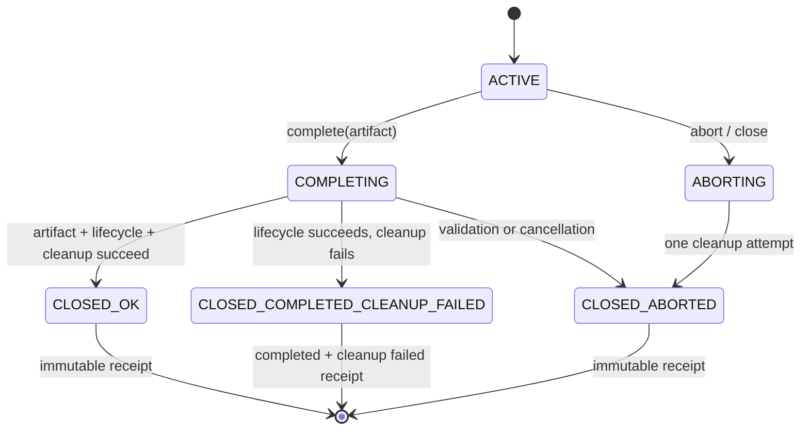

# Feature design: PostgreSQL R1 selected-relation schema authority V1

> Historical provenance: “source record NNN” names a privately archived original, not a Git ref, executable task grant or current validation result. Outcomes attached to these references retain their original historical scope. Current execution requires a separate genuine public authority chain.


> Migration status: historical source document retained for contract context. Source approvals, commit references, test counts and architecture exceptions do not establish approval or passing evidence for the current migration candidate. Current validation and public binding remain separately tracked.

Audience: dpone maintainers, security reviewers and test certifiers designing
the activation-blocked PostgreSQL→MSSQL R1 provider. Start from the
[provider implementation map](developer-postgres-mssql-r1-v3-provider-implementation.md).

- Status: SUPERSEDED
- Successor: [GREEN-v5 specification](feature-design-postgres-mssql-r1-source-schema-authority-green-v5.md)
- Owner: PostgreSQL→MSSQL R1 integrator
- Issue: PostgreSQL→MSSQL Industrial Integration Plan V7 / R1 Binding prerequisite
- Target release: R1
- Last verified: 2026-09-06
- Parent: [R1 correctness V1](feature-design-postgres-mssql-r1-correctness-v1.md)
- Consumer: [provider Binding V2](feature-design-postgres-mssql-r1-v3-provider-binding-contract-v2.md)
- Decision: [ADR 0068](adr/source-history/0068-postgres-selected-relation-schema-authority.md)

> This document is the immutable design chronology and historical contract.
> Current implementation authority lives in the
> [GREEN-v5 specification](feature-design-postgres-mssql-r1-source-schema-authority-green-v5.md).
> Earlier status and execution statements below are audit history, not current
> authorization.

## Current gate

| Item | Current authority |
|---|---|
| Specification | `RESEARCHED`; GREEN-v5 closure awaits fresh review and maintainer approval |
| Accepted implementation | None; GREEN-v4 `7c68b599` is rejected |
| Current evidence for new work | None; V1/V2 are immutable historical compatibility and V3 must be issued |
| Focused inventory | 320 ordered node IDs; replacement RED must preserve every ID and parametrization |
| Activation/certification | Blocked / vendor-live `UNVERIFIED` |
| Next gate | approve closure → freeze Evidence V3 → four-file RED → create-only RED capture → 28-path GREEN-v5 |

The long chronology below is an audit trail, not alternate current authority.
Its earlier `APPROVED`, V2, six-file RED and GREEN-v4 statements are explicitly
historical. The active normative execution path is the GREEN-v5 closure,
Evidence V3 and rollout sections in this revision. Moving the audit trail to a
new document is deferred until after the exact implementation/evidence pair is
accepted, because moving thousands of historical lines during a behavioral
gate would create unrelated link and review churn.

Approval history: the maintainer authorized implementation of Industrial Plan
V7 and continuation through its gated releases. The exact researched candidate
`source record 109` received independent architecture,
code-fit, test/certification and documentation/UX `GO` reviews on 2026-09-05.
This approval authorizes only the path-scoped source-schema prerequisite; it
does not approve Binding V2, activate the route or represent vendor-live
certification.

Implementation planning then exposed one incomplete compatibility boundary:
the aggregate-to-`PostgresFetchedSchema` adapter did not define exact source
and target type tokens or every projected metadata field. No production code
was accepted. The specification returned to `RESEARCHED` for the bounded
projection amendment below; the accepted source-ownership decision in ADR 0068
is unchanged.

The completed amendment at content commit
`source record 038`, pinned for review by
`source record 110`, received fresh independent
architecture, code-fit, test/certification and documentation/UX `GO` reviews
on 2026-09-05. The maintainer therefore returns this child specification to
`APPROVED`. This approval remains scoped to the activation-blocked
source-schema prerequisite and does not approve Binding V2 or vendor-live
certification.

Implementation at candidate `244ffdf95` then exposed a bounded code-fit gap in
the exact path decomposition rather than in the approved behavior: keeping
generic verified-snapshot observation inside the route-specific observation
module and compatibility projection inside the composition bundle worsened the
repository import graph (`avg_clustering` and `cross_layer_ratio`) despite all
functional checks passing. No candidate was accepted and no architecture
exception is requested. This specification returns to `RESEARCHED` only to add
two cohesive implementation-owned modules:

```text
src/dpone/runtime/sources/postgres_verified_relation_observation.py
src/dpone/runtime/sources/postgres_mssql_source_schema_projection.py
```

The first owns connector-neutral verified-relation SQL/witness mechanics; the
second owns the pure compatibility projection. Existing route observation and
runtime composition modules remain narrow callers and do not re-export either
new helper. This amendment changes no authority bytes, lifecycle, public API,
activation state, semantic case denominator or certification claim. Imports in
the focused tests and the evidence-harness digest are repinned before the new
mandatory RED capture.

The implementation-fit content at
`source record 041`, pinned for exact review by
`source record 111`, received fresh independent
architecture, code-fit, test/certification and documentation/UX `GO` reviews
on 2026-09-05. The maintainer reapproves the source-schema child with the exact
import plan above. A new RED capture is mandatory; evidence from the previous
approval identity cannot be reused.

Implementation candidate `source record 011`
and evidence head `source record 012`
received fresh implementation review and were rejected. The candidate kept
activation blocked and passed its aggregate focused tests, but review proved
five contract gaps: nested selected-source fields were not decoded with closed
version-specific types; the snapshot issuer could admit two concurrent
`open()` calls; exact prepared-scope admission was duck-typed downstream; lock
identifiers were manually interpolated; and the evidence producer assigned
semantic `PASS` mechanically without case-to-test attribution. The required
layer-metrics command also regressed the top `runtime → contracts` flow from
the task-base value 199 to 207. No implementation or evidence from that
candidate is accepted.

This bounded corrective amendment returns the child to `RESEARCHED`. It keeps
all canonical authority bytes, user-visible behavior, public imports and
activation state unchanged, but makes the following implementation and proof
requirements normative:

1. the selected-source decoder validates the complete closed V1/V2 document,
   including exact nested database/principal keys and types, topology role,
   physical identity or verification profile, and rejects `bool` as an OID;
2. the snapshot issuer uses a lock-protected
   `IDLE → OPENING → ACTIVE → IDLE` reservation, so at most one caller can
   perform connection I/O through one issuer at a time;
3. only an exact, immutable prepared boundary created by the approved factory
   can carry a verified scope; file and whole-file services receive that
   admitted boundary, never a raw object accepted through `require_active`
   duck typing;
4. the relation lock is composed with `psycopg.sql.Identifier` and explicit
   `ONLY`;
5. every semantic result is derived from a closed case registry that binds an
   expected semantic class to exact pytest node IDs and observed call-phase
   outcomes; aggregate suite success cannot manufacture per-case `PASS`;
6. the evidence protocol has executable negative tests and independently
   rechecks its exact base, approval commit, canonical RED path, base-to-RED
   production diff, frozen arguments, counts and schema/result closure during
   finalization.

The completed corrective content at exact clean commit
`source record 112` received independent architecture,
code-fit, test/certification and documentation/UX `GO` reviews on 2026-09-05.
The maintainer therefore returns this source-schema child to `APPROVED` for the
activation-blocked corrective implementation only. Binding V2, default route
activation and vendor-live certification remain outside this approval.

Two subsequent implementation/evidence pairs were rejected by fresh
architecture, code-fit, test/certification and documentation/UX review:

- code `source record 013` with evidence
  `source record 014`;
- code `source record 015` with evidence
  `source record 016`.

Neither pair is accepted. Review proved that the frozen semantic cases were
still partly self-confirming; exact prepared-boundary admission could be
forged through module/qualname checks; cleanup could expose a generic scope
error and a raw rollback exception through exception chaining; generic query
observation dynamically imported the MSSQL route; the query-profile digest was
not the authority actually executed by fake/live paths; and the approved
eight-edge set did not include the concrete authority import needed for exact
boundary admission. The child therefore returns to `RESEARCHED` for the
bounded dependency, failure and proof amendment below. Public behavior,
canonical authority bytes, the 56-case registry and activation state remain
unchanged.

This amendment replaces, rather than adds to, one governed dependency:

```text
remove  source_schema_runtime → postgres_mssql_type_authority
add     prepared_source_boundary → postgres_mssql_source_schema_authority
```

The schema issuer becomes the sole owner of the exact injected type policy and
validates it with the new model-owned `require_type_policy`; the runtime
uses that exact issuer and no longer accepts a separately supplied policy.
The prepared boundary may therefore use concrete `type(...) is ...` checks for
both the route authority and `PostgresFetchedSchema` without a ninth
runtime-to-contract edge. A module/qualname/attribute comparison, local dynamic
import, re-export, facade, hidden reverse dependency or caller-created brand is
not exact admission.

The same amendment makes the following requirements explicit:

1. generic observation owns only generic typed query-profile items; route
   observation composes the one complete profile and digest and depends on the
   generic module, never the reverse;
2. the executed fake and live paths consume that same profile; every SQL byte,
   parameter encoding, result alias/cardinality and the identifier-safe lock
   rendering is compared with the normative templates below;
3. optional `psycopg.sql` is imported only inside the actual lock-rendering
   function with ordinary `from psycopg import sql`; `importlib`, import-time
   SDK loading and test-only production branches are forbidden;
4. result rows have the exact key set and exact value types; `str(...)`, truthy
   coercion and extra aliases are rejected;
5. `POSTGRES_PG_CATALOG_NAMESPACE_OID_V1 = 11` is a named type-authority
   constant and `resolve_catalog_shape(type_namespace_oid, type_oid, typmod)`
   rejects every other namespace before policy resolution;
6. opening/cleanup failures are normalized after safe rollback/quarantine;
   raw driver exceptions are never attached as `__cause__`/`__context__` to a
   durable route error or primary exception, and prepared-boundary
   `complete(artifact)` translates cleanup-only failure to
   `PostgresMssqlSourceSchemaAuthorityErrorV1("snapshot_cleanup_failed")`;
7. the semantic observer derives each class from independently observed
   behavior for every exact registry constituent. It uses a real V2 authority,
   exact renderer/codec goldens and distinctness, valid unique 1024/1025-column
   fixtures, a genuinely accepted physical `attnum` gap, distinct runtime
   transition/failure scenarios, poison legacy dependencies, actual COPY, and
   separate extraction/seal cleanup;
8. the evidence protocol mutation matrix includes empty/extra case results,
   empty/wrong pytest args, changed/relaxed schema and harness digest,
   out-of-checkout origins, pre-link absence, dirty/HEAD/path/output conflicts,
   count equations, concurrency and every filesystem phase.

Any new implementation requires another task contract and a fresh RED capture;
all prior RED and final artifacts remain rejected or superseded audit trail.

The completed bounded amendment at exact clean content commit
`source record 113` received fresh independent
architecture, code-fit, test/certification and documentation/UX `GO` reviews.
The maintainer therefore returns this child to `APPROVED` for one new
activation-blocked corrective V3 implementation task. ADR 0069 remains
`Proposed` until an exact new code/evidence pair passes implementation review;
Binding V2, default activation and vendor-live certification remain outside
this approval.

The replacement task was issued at
`source record 114`. It pins approved base
`source record 093`, the frozen 56-case registry and
the fresh-RED requirement. This task-issuance commit changes no production
source and does not itself count as RED or implementation evidence.

Corrective V3 implementation `source record 072`
and evidence head `source record 115`
were rejected by all four fresh implementation reviews. The evidence harness
derived semantic classes from the registry and used source-literal inspection
for runtime and prepared-boundary claims, so its 56/56 result was
self-confirming. Review also found a default generic-route regression, a
stale-scope callback window before COPY, bypass of the existing snapshot lease,
retained raw exception context, a hidden contracts cycle, late composition
admission and incomplete cleanup/result classification. Neither the code nor
its RED/final evidence may be reused. The approved behavior is unchanged; a
replacement V4 task must capture executable, independently goldened RED
evidence before any new production implementation.

Fresh review also rejected the later implementation/evidence pairs
`source record 073` /
`source record 116` and
`source record 074` /
`source record 117`. Neither pair is accepted or
reusable. The latest review found a verifier-identity splice, a callback window
between final admission and COPY, incomplete partial-begin cleanup, a
connection/quarantine race, retained raw exception context, incorrect terminal
cancellation semantics and a non-canonical public producer argument failure.

The replacement V9 behavioral harness is frozen at
`source record 098`; its create-only RED artifact is
committed at `source record 118` with SHA-256
`b94a4219c5a07a54fc9567d15192d9f099b641ae8f76e42006ab5cdee2230251`.
It preserves all prior nodes and records 234 unique focused nodes with exactly
146 passes and 88 assertion failures, while the approved-base-to-RED
`src/dpone` diff remains empty. Corrective V5 task
`source record 119`, as governance-amended at
`source record 120`, owns the next production-only
attempt. ADR 0069 remains `Proposed`, activation remains blocked and live
PostgreSQL evidence remains `UNVERIFIED`.

Corrective V5 production candidate
`source record 075` and evidence head
`source record 121` were rejected by fresh
architecture, code-fit and documentation/UX review; the certification review's
bounded `GO` is insufficient against those P0 findings. The real hydrator did
not build and bind the injected runtime, and the real full-extract path neither
forwarded the prepared boundary nor selected `FROM ONLY`. Review also proved
false success after cleanup rollback failure, admission after lifecycle or
physical-session replacement, incomplete seal-adjacent validation, lost
collation/temporal projection metadata, incorrect recovery-reason precedence
and a semantic constituent checking an unrelated public symbol. This pair is
audit history only and cannot support ADR acceptance. A new production-clean
RED and replacement task are required; activation and live certification stay
blocked.

The production-clean V10 replacement is governed in the implementation
lineage itself. RED task `source record 122`
precedes authoritative harness
`source record 097` and create-only RED artifact
`source record 123` (SHA-256
`a0ee37a14961053c96cf54dfbb29961d84c14c32104f9e06ccdde823a5418512`).
The artifact records 251 unique nodes with 146 passes and 105 expected
assertion failures; all prior 234 nodes and all frozen 56 case identities are
preserved. Production-only task
`source record 124` is its descendant and the sole
active writer authority for that attempt.

Fresh review rejected V10 production candidate
`source record 017` and evidence head
`source record 018`. Architecture and code-fit
reviews found false terminal success after a same-session transaction-
incarnation replacement, incomplete terminal revalidation, retained raw
exception context, a broken legacy/no-runtime extraction path, incorrect
`FROM ONLY` compatibility behavior, swallowed caller cancellation, weak
selected-source system-identifier decoding and an open lifecycle-acquisition
cleanup window. Documentation review also proved that the evidence constituent
for unregistered default app composition merely duplicated the public-export
check instead of observing the real composition root. The bounded
certification `GO` cannot override those P0/P1 findings. Neither V10 code nor
final evidence is accepted or reusable.

The next attempt must start from production-clean RED
`source record 123` and issue a new behavioral RED
before production changes. ADR 0069 remains `Proposed`, activation remains
blocked and vendor-live PostgreSQL remains `UNVERIFIED`.

The resulting V11 production candidate
`source record 019` and create-only evidence head
`source record 020` are also rejected. The evidence
artifact SHA-256 is
`0105916f8dcf7270ea02c544703ee5c86c7b7367b5701de9af6ce81c4efdfd62`;
it validly records 270/270 mocked focused tests and 56/56 attributed semantic
cases, but it remains `UNVERIFIED` for vendor-live behavior and does not prove
behavioral completeness. Fresh architecture, code-fit and rejection-audit
review independently reproduced all blocking gaps:

1. active and terminal connection access can translate caller cancellation;
2. terminal admission omits retained-lease and lifecycle revalidation;
3. concurrent terminal callers can execute rollback/release more than once;
4. executed catalog rows admit extra aliases or inexact values;
5. retryable SQLSTATE classes `08`, `40`, `53` and `57P01..57P03` are
   incomplete;
6. the former four-field legacy boundary constructor is not compatible;
7. cleanup can target a replacement connection instead of the pinned physical
   session;
8. malformed catalog identity does not follow the normative reason precedence;
9. connector imports and a duplicate runtime binder widen internal surfaces;
10. the issuer reservation uses a reentrant lock contrary to this contract.

Neither V11 production blobs nor its final evidence may be reused. A V12
candidate must descend from production-clean authority
`source record 069`, preserve the immutable V11 RED
and all 270 node identities, add a fresh behavioral RED, and prove the gaps
above before production work.

The following bounded V12 clarification is normative once its exact revision
receives fresh review and maintainer approval. It changes no
public manifest, CLI, Python export, canonical authority bytes, route
activation or certification claim.

### V12 terminal and construction clarification

Terminal scope transitions are linearizable:

```text
ACTIVE -> COMPLETING | ABORTING -> CLOSED
```

Exactly one caller owns terminal work. Concurrent `complete`, `abort` and
`close_if_active` callers wait for that owner and observe the same immutable
terminal receipt. Rollback, connector quarantine and issuer-reservation
release each execute at most once. The first claimed terminal decision wins.
A non-reentrant `Condition(Lock())` or an equivalent non-reentrant state
machine owns this transition. The generic scope freezes one receipt and every
later terminal call returns that receipt without repeating side effects. The
prepared boundary interprets the receipt for its route-level return/raise
contract; the generic scope never manufactures a later success.

The exact method/state matrix is:

| Call | `ACTIVE` owner | In-flight non-owner | Closed completed (cleanup success or failure) | Closed aborted |
|---|---|---|---|---|
| scope `complete_after_artifact_seal()` | claim `COMPLETING`; validate, complete lifecycle, cleanup, freeze receipt | wait; waiter cancellation propagates unchanged and does not affect owner | return same completed receipt; cleanup flag remains independent | return same aborted receipt |
| scope `abort_preserving(primary)` | claim `ABORTING`; cleanup, freeze aborted receipt; never replace `primary` | wait; waiter cancellation propagates unchanged | return same completed receipt | return same aborted receipt |
| scope `close_if_active()` | claim `ABORTING`; cleanup, freeze aborted receipt | wait; waiter cancellation propagates unchanged | return same completed receipt | return same aborted receipt |
| boundary `complete(artifact)` | invoke scope completion | wait through scope | return `None` for cleanup success; raise `snapshot_cleanup_failed` for cleanup-only failure | re-raise owner failure/cancellation or `snapshot_lease_mismatch` for later incompatible admission |
| boundary `abort_preserving(primary)` | invoke scope abort and return to the caller's original `raise` | wait through scope | preserve `primary` | preserve `primary` |
| boundary `close_if_active()` | invoke scope close, retain receipt and return `None` | wait through scope | no-op/return `None` | no-op/return `None`; never throw from `finally` |

If validation, lifecycle completion or caller cancellation fails after
`COMPLETING` is claimed, the same owner performs the single abort cleanup,
freezes an aborted receipt and re-raises the original failure or the identical
cancellation object. A waiter does not own cleanup. Cleanup failure is stored
only as `cleanup_succeeded=false` and
`cleanup_error_reason=snapshot_cleanup_failed`; it is raised by boundary
`complete()` only when no earlier primary is being preserved. Thus a throwing
`finally` cannot mask a primary, while every retry still observes the same
failed receipt. `abort_preserving(primary)` after a completed outcome leaves
the completed receipt unchanged and preserves `primary`.

Receipt `outcome` records whether artifact/lifecycle completion became durable
inside the source boundary; cleanup is an independent axis. Therefore a
cleanup-only failure after successful lifecycle completion freezes
`outcome=completed`, `cleanup_succeeded=false` and a quarantined connection.
That receipt is not operation success: boundary `complete(artifact)` raises
`snapshot_cleanup_failed` and no downstream target-visible success is allowed.

Pre-COPY, immediately post-COPY and pre-seal admission validate the exact
retained lease, connector, pinned physical session, in-progress lifecycle,
transaction status and incarnation, snapshot token and relation-lock witness.
Artifact completion claims the terminal transition, validates the active
state, completes lifecycle evidence, validates the same physical authority in
its completed phase, and only then performs cleanup. Caller cancellation from
any connection, lease, lifecycle, query, decoder or terminal check propagates
unchanged after the single owning cleanup attempt.

Cleanup operates directly on the physical session pinned at scope issuance;
it never discovers its target by rereading a mutable connector connection.
Replacement-session detection quarantines the connector and cannot report
cleanup success merely because the replacement was rolled back. Reservation
release is bound to the exact scope identity.

Executed query results are admitted centrally against the bound
`PostgresQueryProfileItemV1`: exact mapping keys, exact value types, nullable
arms and cardinality are required before semantic interpretation. `bool` is
not an `int`; coercion through `str`, `int`, truthiness or `.get()` defaults is
forbidden. Structural row violations map to
`internal_invariant_violation`; after structural admission the existing
relation and column failure-precedence table applies unchanged.

Cardinality classification is statement-specific and precedes field
interpretation:

| Statement | Below minimum | Above maximum | Accepted cardinality |
|---|---|---|---|
| `initial_snapshot_witness` | `source_authority_mismatch` | `internal_invariant_violation` | exactly one |
| `v1_physical_identity` | `source_authority_mismatch` | `internal_invariant_violation` | exactly one |
| `active_scope_revalidation` | `snapshot_lease_mismatch` | `internal_invariant_violation` | exactly one |
| `relation_profile` | `source_authority_mismatch` | `internal_invariant_violation` | exactly one |
| `column_catalog` | `column_count_invalid` | `column_count_invalid` only when count exceeds 1024 | 1..1024 |

For an accepted row count, a missing/extra alias or an inexact value type is
`internal_invariant_violation`. A declared nullable field containing `None`
is structurally valid and proceeds to the existing semantic precedence.
Within the structurally admitted one-row `initial_snapshot_witness`, exact
`lock_witness_count` value `0` maps to `relation_lock_not_proven`, `1` is
accepted and a value above `1` maps to `internal_invariant_violation`.

The compatibility constructor is pinned exactly as:

```python
PreparedPostgresSourceBoundary(
    connector,
    snapshot_lease,
    source_identity,
    schema_projection,
)
```

Both positional and keyword forms retain public attributes with those four
names. Unknown arguments, a non-exact lease, or a lease bound to another
connector are rejected; legacy `complete()` remains no-argument and legacy
extraction continues to use ordinary `FROM`.

Cross-module private capability access and pass-through binders are replaced
by two named package-internal boundary-owned factories implemented directly in
`postgres_prepared_source_boundary.py`:

```python
def build_r1_postgres_fetched_schema(
    *,
    relation_schema: tuple[tuple[str, str], ...],
    projected_schema: tuple[tuple[str, str], ...],
    relation_metadata: tuple[SourceColumnProvenance, ...],
    target_projection: PostgresMssqlSchemaProjection,
) -> PostgresFetchedSchema: ...

def issue_r1_prepared_postgres_source_boundary(
    *,
    connector: object,
    scope: PostgresVerifiedRelationSnapshotScopeV1,
    source_schema_authority: PostgresMssqlSelectedRelationSchemaAuthorityV1,
    schema_projection: PostgresFetchedSchema,
) -> PreparedPostgresSourceBoundary: ...
```

Each rejects subclasses or inexact inputs according to the existing closed
admission reasons and requires `type(result)` to be its exact declared return
type. The projection adapter receives
`build_r1_postgres_fetched_schema` directly; the runtime calls
`issue_r1_prepared_postgres_source_boundary` directly. These are internal
construction functions, not wrappers, facades, re-exports, public aliases,
protocols or a new port. They explicitly supersede every earlier requirement
for `PreparedPostgresSourceBoundary._build_fetched_schema`,
`_from_runtime_issued`, an `issuance_capability` object or
`dpone.ports.postgres_mssql_source_schema_runtime`. The composition-root binder
in `bootstrap_postgres_source_authority` remains the sole binder; the
runtime-level alias and duplicate binder are removed. The source object's
runtime-admission method is not a composition binder. The implementation
retains exactly four runtime collaborators and exactly the eight approved
runtime-to-contract edges.

The exact completed V12 amendment at
`source record 125` received fresh architecture
`APPROVED` review with no P0, P1 or P2 findings. Under the maintainer's explicit
authorization to continue the gated Industrial Plan V7 implementation, this
child specification returns to `APPROVED` for separate V12 RED and GREEN tasks.

The later replacement RED task authority
`source record 126` and test-only candidate
`source record 127` are rejected before RED capture.
No V12 RED artifact was created. Although the producer probe correctly recorded
320 unique nodes and a 46-node writer delta with closed assertion-failure
phases, fresh review proved that the harness was not implementable against this
contract: eight historical test references still required the superseded
`_build_fetched_schema` class capability, while the new static golden required
that capability to be absent. Review also found a test-generated rather than
production-propagated waiter cancellation, SQLSTATE phase probes without a
reached-phase witness, and static factory/binder assertions based on text
occurrence rather than exact AST call ownership. The task and candidate are
audit history only and cannot authorize capture, GREEN work or evidence.

The corrected test-only contract preserves every historical node ID while
migrating executable seam references in exactly these six files:

```text
tests/test_postgres_mssql_r1_source_schema_authority_contract.py
tests/test_postgres_mssql_r1_source_schema_authority_mutation.py
tests/test_postgres_mssql_r1_source_schema_runtime.py
tests/test_postgres_mssql_prepared_source_boundary.py
tests/test_runtime_connection_composition_root.py
tests/test_postgres_mssql_r1_wiring.py
```

The first, second and fifth files add no nodes; they only replace calls to the
superseded class capability with the exact boundary-owned function. The other
three retain the approved 25/19/2 new-node allocation. Therefore the frozen
arithmetic remains 270 historical nodes, 274 evidence-repin nodes, 46 new
behavioral nodes and 320 replacement RED nodes.

The controlled mixed terminal schedule must obtain the waiter's exact
`CancelledError` from inside the real scope terminal call while its owner is in
the in-flight state. A controlled condition/wait boundary may raise that exact
object after recording that the waiter reached the production wait; the test
must not raise cancellation itself after the method returns. It proves the
owner remains blocked until the test releases cleanup, then performs the one
cleanup and freezes the one receipt unaffected by waiter cancellation.

Every SQLSTATE phase probe records the exact statement ID immediately before
raising and asserts that recorded ID equals the requested literal phase. The
aggregate also proves the transcript reached the requested position; an earlier
correctly shaped error cannot satisfy a later phase. Query-result fake rows
remain independently constructed from the literal expected matrix.

The static factory proof uses AST definitions and call expressions, not string
presence. Each boundary factory body directly constructs its declared exact
return type without delegating to a local/private helper. The only external AST
call consumer of `build_r1_postgres_fetched_schema` is the projection module;
the only external AST call consumer of
`issue_r1_prepared_postgres_source_boundary` is the runtime module. Across the
complete `src/dpone` tree exactly one top-level composition-binder function has
the binder name and it is defined in `bootstrap_postgres_source_authority`;
same-named class admission methods are not counted as free-function binders.
No runtime alias, re-export, dynamic loader or pass-through helper is admitted.

At that historical stage, the correction changed the exact approved
specification authority and required the then-current Evidence V2 pair to be
repinned after review and maintainer reapproval. Historical V1 validation
remained unchanged and no caller-selected or crossed pair became valid. That
V2 step is now superseded for new work by the current GREEN-v5 Evidence V3
amendment below.

The exact corrected content at
`source record 128` received fresh architecture
`APPROVED` review with no P0, P1 or P2 findings, including executable docs and
lineage checks. Under the maintainer's continuing authorization, this child was
then `APPROVED` for the integrator-owned Evidence V2 repin and the subsequent
six-file RED task. That authority is historical and superseded for future
implementation. ADR 0069 acceptance, activation and vendor-live certification
remain blocked.

Historically, the initially issued V12 RED task at
`source record 129`,
pinned at `source record 130`, received task-gate
`NO-GO` before any test writer or RED capture. The producer and JSON Schema
still pinned the historical V1 base/specification pair, so the task could not
truthfully attribute a new RED to the V12 amendment; its node-delta check also
used a nonexistent artifact key and did not prove that every new node failed.
That task authorizes no edits. At that time the child returned to `RESEARCHED`
for evidence versioning. The current `RESEARCHED` state additionally covers
the six-file seam migration, production-originated waiter cancellation,
reached-phase SQLSTATE witnesses, exact AST ownership and the resulting V2
authority repin.

The eight direct inward runtime-to-contract imports are intentional parts of
the approved anti-splice and exact-type boundary. Removing them would require
duplicated authority, weaker `Any`/duck typing, a re-export tunnel or a
metric-only facade. [ADR 0069](adr/source-history/0069-postgres-source-schema-layer-flow-exception.md)
therefore proposes a visible, time-bounded exception for only those eight
edges. The raw layer-metrics result remains `FAIL`; the baseline is not edited,
activation remains blocked, and the ADR cannot become Accepted until a new
exact implementation commit and evidence head pass fresh review within its
recorded ceilings.

GREEN-v3 stopped before a production commit after the complete required graph
proved the former `avg_clustering=0.191276270675373` feasibility estimate
incorrect. The exact diagnostic worktree at task pin
`source record 021` retained all eight approved inward
edges, removed the duplicate hydrator construction dependency, moved only
annotation-only imports behind `TYPE_CHECKING`, kept the runtime binder solely
in the bootstrap composition root, and measured
`avg_clustering=0.1914014772898714`. The complete dirty source tree is
identified by canonical path/content manifest SHA-256
`6edc61a17fd2fd8112aa109fa89396acc071387c591f17078da43e140f4bb3c0`.
The manifest is the compact, key-sorted UTF-8 JSON array of
`{"path": <repo-relative-path>, "sha256": <file-bytes-digest>}` records for
the sorted union of `git ls-files src/dpone` and
`git ls-files --others --exclude-standard src/dpone`.
It retained `runtime_to_contracts_flow=207`, `max_module_ce=24` and zero class
findings, but exact review measured
`cross_layer_ratio=0.29996842437638144`, above the unchanged
`0.2999368553988634` ceiling. Exact focused behavior was 320/320 before the
final dependency-only cleanup, and the affected focused subsets passed
afterwards, but none of those diagnostic results is committed implementation
or final evidence.

Fresh read-only architecture analysis found no conforming edge removal that
reaches the old clustering ceiling. Every such simulated topology removed an
approved or core dependency, reduced the required edge set, or required a
facade, dynamic import, re-export, `Any` or unrelated metric-only cleanup. The
smallest conforming topology instead restores the honest same-layer
`postgres_mssql_source_schema_runtime → extraction_lifecycle` dependency for
the lifecycle type declared by `prepare_boundary`. It adds one intra-layer edge
without changing the 2,850 cross-layer edges and produces the exact calculated
budgets below:

```text
avg_clustering <= 0.19140574042045186
cross_layer_ratio <= 0.2999368553988634
```

The replacement candidate must use that dependency as a real declared method
contract, not an unused import or duplicate lifecycle validator, and must
remeasure both values with repository tooling. All other graph, ownership,
anti-tunnel, behavior and activation constraints remain unchanged. The shared
baseline is not regenerated, the raw layer gate remains an explicit `FAIL`,
ADR 0069 remains `Proposed`, and any candidate that exceeds either exact
ceiling is a new blocker. The existing immutable RED-v5b capture was the
behavioral oracle for GREEN-v4 only. The GREEN-v5 terminal/cancellation
correction below changes test bytes and supersedes that capture for future
production work; it remains immutable audit history.

The exact clustering-feasibility amendment at
`source record 092` received fresh independent
architecture, code-fit/governance, test/certification and documentation/UX
`GO` reviews with no P0, P1 or P2 findings. Under the maintainer's continuing
authorization to implement Industrial Plan V7 and proceed through its governed
gates, this child returns to `APPROVED` only for issuance and review of a
replacement GREEN-v4 task. ADR 0069 remains `Proposed`; no implementation,
activation, vendor-live certification, Binding V2 or GA claim is approved.

### V12 GREEN-v5 closure amendment

GREEN-v4 production candidate
`source record 024` is rejected. It passed the
320-node focused suite, the 94-node lifecycle compatibility suite and the
task-specific graph ceilings, but four fresh reviews found three release
blockers: the test oracle contradicted the terminal matrix for
`close_if_active()`, caller cancellation was translated at reachable
construction/decoder/artifact/cleanup boundaries, and six candidate-owned
modules introduced unbaselined warning debt above 350 SLOC. No final evidence
was created; neither this production blob nor the prior RED artifact may
authorize a replacement GREEN.

The initial closure text at exact commit
`source record 131` received fresh `NO-GO` review
before any repin, RED task or production work. Review found stale V2/six-file
rollout text, incomplete writer ownership and an under-specified cancellation
test matrix. This corrected amendment replaces those current-state rules and
leaves the rejected commit as audit history only.

This bounded amendment selects one literal terminal contract:

```text
complete(artifact) with cleanup-only failure
    -> freeze failed/quarantined receipt
    -> raise snapshot_cleanup_failed

abort_preserving(primary) with any cleanup failure
    -> freeze truthful failed/quarantined receipt
    -> preserve the identical primary

close_if_active() with ordinary cleanup failure
    -> freeze truthful failed/quarantined receipt
    -> return None; never translate cleanup failure into a route exception
```



`close_if_active()` returning `None` is not target-visible success. The frozen
receipt remains `outcome=aborted`, `cleanup_succeeded=false`,
`cleanup_error_reason=snapshot_cleanup_failed` and
`connection_quarantined=true`. The outcome does not vary with waiter timing,
replacement-session detection or a private cleanup-failure subtype.

`asyncio.CancelledError` is not an ordinary cleanup or dependency failure.
At a non-scope decoder, policy, artifact or runtime-construction boundary it
is re-raised immediately as the identical object with no raw cause/context.
An owning scope operation freezes one truthful receipt and releases its exact
reservation after its single cleanup attempt before re-raising the first
cancellation. A waiting scope caller re-raises its cancellation without
owning cleanup. If `abort_preserving(primary)` already has a primary, that
exact primary wins over a waiter or cleanup cancellation; secondary rollback,
quarantine and release failures cannot mask it. Every reachable broad
normalization boundary must therefore re-raise `CancelledError` before
translating other exceptions, including:

- selected-source document decode and aggregate/model translation;
- catalog-shape resolution and source-column-reference issuance;
- prepared-boundary construction and retained-lease admission;
- artifact-integrity admission;
- active and completed physical-session access;
- pinned physical-session access/rollback, quarantine and issuer release;
- source-schema runtime construction before endpoint I/O.

The corrected RED writer owns exactly four test files and changes only bodies
of existing nodes. It adds, removes and renames no node and changes no
parametrization:

```text
tests/test_postgres_mssql_r1_source_schema_authority_contract.py
tests/test_postgres_mssql_r1_source_schema_runtime.py
tests/test_postgres_mssql_prepared_source_boundary.py
tests/test_runtime_connection_composition_root.py
```

The exact existing node matrix is:

| Existing node | Required injection/assertion |
|---|---|
| `test_cleanup_failure_after_artifact_seal_cannot_return_success` | Retain `outcome=completed` with failed/quarantined cleanup; boundary raises `snapshot_cleanup_failed`, proving outcome is not overall success. |
| `test_terminal_receipt_exposes_only_closed_cleanup_error_reason` | Ordinary rollback failure: boundary close returns `None`; receipt is aborted, failed and quarantined with no secret text. |
| `test_close_if_active_translates_cleanup_failure_to_route_error` | An earlier primary remains identical while close records cleanup failure without throwing a route error. |
| `test_all_model_and_route_translation_paths_drop_raw_exception_links[lone_surrogate_byte_decode]` | Keep malformed-surrogate rejection and additionally inject identical production decoder cancellation; no eager unrelated boundary. |
| `test_all_model_and_route_translation_paths_drop_raw_exception_links[artifact_integrity_failure]` | Inject cancellation from `require_integrity_receipt`; propagate identical object without translation. |
| `test_all_model_and_route_translation_paths_drop_raw_exception_links[model_to_authority_translation]` | Inject aggregate/model translation cancellation and preserve the identical object with no route-error conversion. |
| `test_catalog_issuer_propagates_caller_cancellation_unchanged_after_cleanup` | Exercise query, `resolve_catalog_shape` and `source_column_ref` cancellation subcases; identical object, one cleanup, closed receipt. |
| `test_projection_propagates_caller_cancellation_unchanged` | Retain exact projection cancellation control. |
| `test_v12_active_connection_cancellation_propagates_by_identity` | Exercise active physical access and prepared-boundary constructor retained-lease admission. |
| `test_v12_terminal_connection_cancellation_propagates_by_identity` | Exercise terminal admission plus pinned connection access, rollback, quarantine and issuer-release cancellation precedence; every reachable path either freezes one receipt before re-raise or preserves an earlier primary, and releases at most once. Receipt construction/freeze itself is synchronous, dependency-free and non-cancellable. |
| `test_lifecycle_complete_caller_cancellation_propagates_unchanged_after_truthful_abort` | Retain owner cancellation, one cleanup and aborted receipt. |
| `test_active_scope_revalidation_propagates_caller_cancellation_unchanged` | Retain exact active query cancellation control. |
| `test_v12_terminal_races_are_linearizable_and_cleanup_once[controlled-mixed]` | Retain waiter cancellation from the real wait boundary; owner and receipt unaffected. |
| `test_explicit_r1_schema_factory_caller_cancellation_propagates_before_endpoints` | Cancellation originates inside real production runtime/boundary construction; identity/no links and zero endpoint I/O. |

The names and parametrizations are retained solely to preserve the immutable
ordered 320-node inventory. Producer capture must still observe exactly 320
unique IDs in the same order and only assertion-failure RED outcomes. The
expected production-clean result remains 151 PASS/169 assertion failures; any
different count stops capture for review instead of being normalized.

Because test and specification bytes change, current Evidence V2 remains
read-only historical compatibility. A new
`dpone-postgres-mssql-source-schema-evidence-3` tuple is mandatory. Evidence
V3 keeps the production-clean base
`source record 069`, pins the exact future approved
revision of this amendment, emits only V3 for new capture/finalization, and
keeps V1/V2 schema-valid without accepting crossed version/base/specification
triples. Producer, schema and protocol-test bodies are frozen before the
test-only RED task. No test name or parametrization changes during that repin.

The replacement GREEN task also owns the following behavior-neutral SRP
decomposition so every touched/new module remains below the repository's
350-SLOC warning threshold without minification or an exception ADR:

```text
runtime/connectors/postgres_copy_file.py
    concrete psycopg COPY-to-file streaming, writer and metrics

contracts/postgres_mssql_source_schema_primitives.py
    dependency-free closed JSON/name/OID primitive admission

runtime/sources/postgres_verified_relation_snapshot_cleanup.py
    pinned-session status, rollback and quarantine mechanics

runtime/bootstrap_internal_query_binding.py
    optional post-endpoint internal-query capability binding

runtime/bootstrap_state_identity.py
    verified state-identity derivation and attachment

runtime/sources/postgres_mssql_source_schema_queries.py
    immutable PostgreSQL schema-observation SQL templates
```

`postgres_mssql_type_authority.py` moves its binary-value admission algorithm
to the existing canonical `postgres_mssql_value_admission.py` and retains its
public method as a thin delegation. Existing public symbols, signatures,
`__all__`, stable errors, authority bytes and composition behavior do not move
or re-export. The new helpers are cohesive implementation details, not ports,
facades, registries or extension points.

All new imports are intra-layer or existing dependencies. The candidate must
retain `runtime_to_contracts_flow <= 207`,
`avg_clustering <= 0.19140574042045186`,
`cross_layer_ratio <= 0.2999368553988634`, max module Ce 24 and zero class
findings. ADR 0069 is not widened. Any graph increase requires redesign rather
than a higher ceiling. Module-size validation resolves `HEAD_SHA="$(git
rev-parse HEAD)"` and passes that full lowercase SHA to `--head-ref`; the
literal string `HEAD` is invalid.

The repository-wide baseline-aware module-size command remains a disclosed
`FAIL` in this production-clean lineage because its debt ledger starts at
`e1d93822b47234e940829319cac0dc9678f6906c`, which is not an ancestor of
`source record 069`. It is never reported as `PASS`.
The executable task-specific gate calls the canonical
`dpone.metrics.module_size.analyze_module_sizes` over exactly the 28
GREEN-owned modules with repository thresholds 450/600 LOC and 350/400 SLOC,
`warning_debt_requires_baseline=true`, and requires zero issues. A separate raw
global run records the lineage failure and additionally proves that none of
its issue paths is GREEN-owned. The shared ledger is not rewritten by this
child.

This amendment changes no public API, manifest, authority bytes, activation,
Binding V2 scope or vendor-live claim. It requires fresh architecture,
code-fit, test/certification and documentation/UX review, maintainer
reapproval, Evidence V3 repin, a four-file test-only RED task and capture, and
only then a separately reviewed GREEN-v5 task.

## Executive summary

The accepted PostgreSQL source authority proves a physical relation, while the
R1 type policy can issue a column reference for any caller-supplied name and
owned scalar shape. Passing those values independently to Binding permits a
valid relation authority for table A to be combined with valid type-policy
column references describing table B.

This specification closes that anti-splice gap with one source-owned,
content-addressed aggregate:

```text
verified SelectedPostgresSourceAuthority
+ same-session ACCESS SHARE relation lease
+ unique virtual-transaction incarnation
+ exact pg_attribute/pg_type observation
+ approved PostgreSQL→MSSQL type policy
        ↓
PostgresMssqlSelectedRelationSchemaAuthorityV1
```

The generic PostgreSQL source verifier selects the signed relation without I/O.
A generic source snapshot issuer then locks that exact relation before the
first snapshot-establishing query and returns a branded verified-relation
context. Only the PostgreSQL→MSSQL schema issuer can combine that context with
the type policy. Binding accepts the resulting aggregate and never accepts a
selected relation, raw catalog rows, type policy, or column references
separately.

The outcome is measurable: mutation tests must reject every same-cluster,
same-database and same-policy relation/column splice before any target I/O.
The canonical child is authority/observation work; its runtime integration
strengthens only the existing prepared whole-file extraction boundary. It does
not activate the R1 route, add a new extraction strategy, change the public
manifest, or certify live support.

## Personas and customer journey

| Persona | Goal | Current pain | Success signal |
|---|---|---|---|
| Platform maintainer | Compile one trustworthy source/target binding | Relation identity and column identity arrive through independent inputs | Binding has one source aggregate and no spliceable leaves |
| Security reviewer | Prove catalog observation is least privilege and race safe | A caller-produced wrapper can be self-confirming | Query, session, lock and canonical preimage are explicit |
| Operator | Diagnose unsupported or drifting source schema | Type and catalog failures collapse into unrelated target errors | Stable source-schema reason and recovery class identify the action |
| Test certifier | Reproduce the exact authority | No complete evidence record currently exists | Exact-commit inventory records all mutation, query and live-check results |

Maintainer journey:

```text
resolve and select deployment-signed PostgreSQL source authority without I/O
→ BEGIN REPEATABLE READ READ ONLY
→ LOCK TABLE ONLY the signed relation before the first SELECT
→ acquire snapshot/transaction-incarnation tokens and prove exact-OID lock
→ verifier proves cluster/database/principals/relation in that snapshot
→ verifier observes all live user columns by relation OID
→ issuer resolves each observed OID/typmod through the exact type policy
→ issuer returns one selected-relation schema authority
→ the same owning scope admits `COPY (SELECT ... FROM ONLY relation)`
→ whole-file exporter revalidates the scope immediately before COPY
→ durable artifact sealing completes the scope
→ terminal rollback releases the read-only snapshot and relation lock
→ Binding consumes that authority as its sole source-schema input
```

Discovery, observation and compilation expose no physical identifiers through
the self-service manifest or future public CLI output. Stable failures provide
a redacted reason, recovery class and correlation ID. Unsupported types or
schema drift require an approved policy/schema generation; retries never
reinterpret the old authority.

## Scope

### In scope

- one canonical aggregate binding the existing selected relation authority to
  a complete ordered PostgreSQL column catalog observation;
- exact PostgreSQL 16 `pg_class`, `pg_attribute`, `pg_type` and
  `pg_namespace` observation under the verified snapshot session;
- type-policy resolution and policy-issued source references inside the source
  authority issuer;
- identity of relation kind/persistence/inheritance profile, attribute number,
  type identity,
  typmod, nullability, collation, generated and identity flags;
- deterministic canonical bytes, SHA-256 digest, decode and revalidation;
- a closed failure and recovery contract;
- a package-internal verifier API and a restricted durable artifact contract;
- Binding V2 input replacement and anti-splice tests;
- prepared MSSQL whole-file boundary integration using `FROM ONLY`;
- exact-commit non-live evidence plus explicitly `UNVERIFIED` live evidence.

### Non-goals

- a new extraction algorithm or row-value policy; this child changes only the
  certified prepared-boundary admission and relation scope;
- schema evolution, automatic policy widening or DDL;
- publication/slot/WAL authority;
- primary-key, replica-identity or publication-group certification;
- target mapping, SQL rendering or migration;
- arbitrary projections, selected column subsets or reordered columns;
- domains, arrays, composites, ranges, extension/custom types or generated
  fallback mappings;
- a public Python constructor or a new manifest field;
- vendor-live certification or route activation.

### Assumptions and constraints

- R1 consumes every live user column in physical attribute-number order.
- The selected relation is chosen from signed authority before source I/O.
- `ACCESS SHARE` on `ONLY` the selected relation is acquired before the first
  snapshot-establishing query. It remains held through extraction and artifact
  sealing, not merely authority issuance.
- The issuing physical connection must be `IDLE` before scope acquisition. One
  connection-scoped issuer owns at most one active scope, and no other component
  may use that connector until the scope reaches terminal cleanup.
- The verified context rechecks the exact physical connector/session,
  unique transaction-incarnation witness, transaction status, snapshot token
  and granted relation-OID lock before every authority issuance or business-read
  admission.
- The existing selected-source JSON preimage is preserved byte-for-byte. It is
  not NFC-normalized and its existing SHA-256 meaning is not changed.
- The existing selected-source preimage remains byte-exact, including NFD
  relation names. R1 business column names must already be NFC, trim-equal and
  valid under the accepted source-reference identifier contract; unsupported
  names fail without normalization.
- Dropped attributes are excluded from business columns but their gaps remain
  visible through `attribute_number`; projection ordinals are independently
  contiguous `1..N`.
- A relation with zero or more than 1024 live user columns is unsupported.
- The authority is restricted internal data. Exact physical identifiers are
  redacted from public output.

## Pinned upstream authority

| Authority | Exact implementation commit | Required value |
|---|---|---|
| Selected PostgreSQL source authority/verifier | `source record 030` | closed selected relation document and existing digest preimage |
| PostgreSQL snapshot lease | `source record 031` | branded connector/session lifecycle authority; strengthened context is additive |
| Type authority | `source record 002` | exact scalar shapes, policy and source refs |
| Security/integration base | `source record 032` | accepted R1 provider prerequisites |

The task contract must pin the approved specification commit. Binding cannot
pin this child until its exact implementation commit has passed review.

## Public and restricted contracts

### CLI and manifest

No CLI command, manifest field or default changes. The existing semantic
manifest remains the only planned public authoring surface. Source schema
authority is resolved by the composition root from environment-owned authority
and a verified database observation.

### Python API

No top-level `dpone` export is added. These models remain package-internal
under `dpone.contracts`; the issuer remains under `dpone.runtime.sources`.
Downstream code receives the aggregate, not its construction inputs.

The planned package-internal API deliberately separates generic source locking
from the route-specific type policy. These are valid Python protocol-shaped
signatures; concrete classes may satisfy the same dependency-injected ports:

```python
class PostgresSourceAuthorityVerifier:
    def select_for(
        self,
        load_config: object,
    ) -> SelectedPostgresSourceAuthority: ...


class PostgresVerifiedRelationSnapshotIssuerV1:
    def open(
        self,
        *,
        connector: object,
        lifecycle: ExtractionLifecycleAuthority,
        selected_source_authority: SelectedPostgresSourceAuthority,
        query_profile: PostgresGenericRelationQueryProfileV1,
    ) -> PostgresVerifiedRelationSnapshotScopeV1: ...


class PostgresMssqlRelationSchemaAuthorityIssuerV1:
    def __init__(
        self,
        *,
        type_policy_authority: object,
    ) -> None: ...

    def bind_query_profile(
        self,
        *,
        selected_source_authority: SelectedPostgresSourceAuthority,
    ) -> PostgresMssqlRelationQueryProfileV1: ...

    def issue(
        self,
        *,
        connector: object,
        verified_relation: PostgresVerifiedRelationSnapshotV1,
        query_profile: PostgresMssqlRelationQueryProfileV1,
    ) -> PostgresMssqlSelectedRelationSchemaAuthorityV1: ...
```

Composition is a normal executable call sequence:

```python
selected = verifier.select_for(load_config)
route_query_profile = schema_issuer.bind_query_profile(
    selected_source_authority=selected,
)
scope = snapshot_issuer.open(
    connector=connector,
    lifecycle=lifecycle,
    selected_source_authority=selected,
    query_profile=route_query_profile.generic_relation_profile,
)
verified_relation = scope.require_active(connector)
source_schema_authority = schema_issuer.issue(
    connector=connector,
    verified_relation=verified_relation,
    query_profile=route_query_profile,
)
```

The issuer constructor accepts `object` specifically to avoid a direct import
edge, immediately admits only the exact policy type through the new
model-owned `require_type_policy` helper and retains that immutable authority.
It is the sole owner of the injected type policy for this runtime bundle. The
runtime neither accepts nor compares a second policy object.

`require_type_policy` is new in this child (it is not present at the task base)
and is defined in `postgres_mssql_source_schema_models.py` exactly as:

```python
def require_type_policy(value: object) -> PostgresMssqlTypePolicyAuthorityV1:
    """Return an exact V1 type-policy authority or fail closed."""
```

The model module imports the contract type, requires
`type(value) is PostgresMssqlTypePolicyAuthorityV1`, returns the same object
identity, and otherwise raises its closed internal model error
`PostgresMssqlSourceSchemaModelErrorV1("type_policy_exact_type_required")`.
The issuer catches only that reason and translates it to the public internal
route error `PostgresMssqlSourceSchemaAuthorityErrorV1("exact_type_violation")`
without chaining. No coercion, default construction or protocol/attribute
admission is allowed.

The frozen `runtime.exact-bundle` coverage labels remain unchanged, but their
proof ownership is explicit: `type_policy_exact_type` is exercised at the
schema-issuer constructor and proves wrong/subclass policy rejection;
`fetched_schema_constructor_identity` is exercised through the boundary
module's `build_r1_postgres_fetched_schema` function: that module alone imports
and constructs `PostgresFetchedSchema`. Runtime composition requires
`projection_adapter.fetched_schema_factory is
build_r1_postgres_fetched_schema` before source-object or source I/O; mismatch
raises the stable
`DPONE_POSTGRES_MSSQL_SOURCE_SCHEMA_AUTHORITY_RUNTIME_REQUIRED` configuration
error. The projection adapter stores and uses only that admitted factory. The
prepared boundary alone exact-checks the constructed DTO result; a wrong output
or subclass result rejects before file/COPY I/O.
The other four constituents remain exact runtime collaborator checks. Thus no
semantic case is deleted or reinterpreted as aggregate success merely because
the runtime bundle no longer accepts policy/constructor inputs.

The frozen `projection.no-legacy-policy/injected_constructor_only` constituent
is proven by the same adapter behavior: construct it once with the exact
boundary-owned factory, poison every legacy/default projector, then require
projection to succeed through the retained injected factory. Wrong and
subclass results reject during runtime issuance before the boundary is usable.

`PostgresVerifiedRelationSnapshotScopeV1` is the sole transaction owner from
`open()` through schema issuance, business extraction and durable artifact
sealing. The current `PreparedPostgresSourceBoundary` carries that scope across
the admission/extraction calls; callers do not receive a bare transaction or
lease. Its closed terminal API is:

```python
class PostgresVerifiedRelationSnapshotScopeV1:
    @property
    def lifecycle(self) -> ExtractionLifecycleAuthority: ...

    def require_active(
        self,
        connector: object,
    ) -> PostgresVerifiedRelationSnapshotV1: ...

    def complete_after_artifact_seal(self) -> PostgresSnapshotScopeTerminalReceiptV1: ...

    def abort_preserving(
        self, primary: BaseException
    ) -> PostgresSnapshotScopeTerminalReceiptV1: ...

    def close_if_active(self) -> PostgresSnapshotScopeTerminalReceiptV1: ...

    @property
    def terminal_receipt(self) -> PostgresSnapshotScopeTerminalReceiptV1 | None: ...
```

All terminal methods follow the V12 linearizable method/state matrix above.
`complete_after_artifact_seal()` validates the complete retained scope,
completes extraction lifecycle evidence, revalidates the completed-phase
authority and then rolls back the pinned read-only source transaction to
release locks. Every failure/cancellation path invokes `abort_preserving()`;
an abandoned prepared boundary invokes `close_if_active()`. An out-of-band
commit, rollback, replacement transaction or lifecycle transition cannot
produce a completed receipt.

The runtime-only terminal receipt has these closed fields:

```text
outcome: completed | aborted
cleanup_attempted: bool
cleanup_succeeded: bool
cleanup_error_reason: None | snapshot_cleanup_failed
connection_quarantined: bool
```

It contains no raw driver text and is not part of the durable source-schema
digest.

### Composition and COPY handoff

The activation-blocked R1 composition uses one exact injected bundle; no
component constructs a type policy or scope issuer from defaults:

```text
PostgresMssqlSourceSchemaRuntimeV1(
    verifier: exact PostgresSourceAuthorityVerifier,
    snapshot_scope_issuer: exact PostgresVerifiedRelationSnapshotIssuerV1,
    schema_authority_issuer: exact PostgresMssqlRelationSchemaAuthorityIssuerV1,
    projection_adapter: exact PostgresMssqlSourceSchemaProjectionAdapterV1,
)
```

`DefaultRuntimeHydrator` gains an injected
`postgres_mssql_source_schema_runtime_factory`. When the resolved R1 activation
is present, it calls that factory with the activation, resolved connections,
load config and the exact verifier returned by source-authority preflight. The
factory is itself constructed with an exact schema-authority issuer whose
constructor received the pre-source-I/O `PostgresMssqlTypePolicyAuthorityV1`
selected by the later approved Binding/provider-plan authority. Neither the
factory nor runtime derives, widens or separately retains a policy from the
runtime observation. During this activation-blocked child, hermetic tests
inject that issuer directly. The returned bundle must contain the same verifier
object and exact collaborator types or hydration fails before source-object
construction.

The internal factory constructs the projection adapter with
`build_r1_postgres_fetched_schema` as its sole DTO factory. That package-
internal function is implemented directly in the boundary module, imports
`PostgresFetchedSchema`, constructs it from the adapter's exact keyword-only
DTO fields and requires `type(result) is PostgresFetchedSchema`.
The adapter exposes that retained callable through a package-private read-only
`fetched_schema_factory` property. Runtime bundle admission compares it by
object identity with the exact function before source-object construction
or I/O. The adapter never imports or looks up the DTO class. Runtime issuance
passes the returned DTO directly to
`issue_r1_prepared_postgres_source_boundary`; that boundary-owned function
performs the sole concrete DTO admission, while semantic field-policy
comparison remains in the adapter. The runtime module therefore adds no
metadata import.

`bootstrap_postgres_source_authority.bind_postgres_mssql_source_schema_runtime`
then invokes the new exact source method
`bind_postgres_mssql_source_schema_runtime(runtime)`. Existing
`bind_postgres_source_authority(verifier)` remains unchanged for compatibility,
but the prepared certified path requires the stronger bundle. The default app
composition intentionally does not register this factory in this child, so the
route remains activation-blocked until the approved provider aggregate supplies
the exact type-policy bytes and all remaining R1 dependencies. Tests and later
composition inject the factory explicitly; missing factory/runtime yields
`DPONE_POSTGRES_MSSQL_SOURCE_SCHEMA_AUTHORITY_RUNTIME_REQUIRED` before I/O.

`prepare_mssql_source_boundary()` uses only the bound bundle:

```text
bundle.prepare_boundary(
      connector=connector,
      lifecycle=lifecycle,
      load_config=load_config,
  )
→ internally select through bundle.verifier without I/O
→ bind one complete route query profile from selected authority
→ reserve and open bundle.snapshot_scope_issuer
→ pass the profile's exact generic view to the generic scope
→ issue the observed aggregate through bundle.schema_authority_issuer
→ pass the same complete profile to the route issuer
→ project that exact aggregate through bundle.projection_adapter
→ call the package-internal prepared-boundary issuer exactly once
```

The projection adapter is a pure compatibility projection from the already
observed aggregate; it performs no catalog query. The prepared boundary stores
the owning scope, not a bare `PostgresRepeatableReadSnapshotLease`.

#### Exact compatibility projection

The adapter constructs the existing compatibility DTOs from the aggregate
through its constructor-injected package-private factory owned by the prepared
boundary module. The adapter does not import `PostgresFetchedSchema`; it stores
and uses only the supplied factory, while runtime issuance and boundary
admission require the result's exact concrete type. Projection performs no
default/global lookup. It
must not call `project_postgres_mssql_relation`, its private
helpers or `PostgresMssqlTypeMapper`: those paths read manifest options,
temporal/unique-key policy and physical overrides, and would create a second
type authority. No `load_config` value participates in this projection.

`render_postgres_declared_type(source_shape)` returns these exact lowercase
tokens:

| Source family | Exact token |
|---|---|
| `bool` | `boolean` |
| `int2` | `smallint` |
| `int4` | `integer` |
| `int8` | `bigint` |
| `numeric` | `numeric(p,s)`, preserving signed `s` |
| `float4` | `real` |
| `float8` | `double precision` |
| `uuid` | `uuid` |
| `date` | `date` |
| `text` | `text` |
| `varchar` | `character varying(n)` |
| `bytea` | `bytea` |

Temporal source tokens preserve the catalog typmod distinction:

| Source family | `source_typmod == -1` | Explicit typmod |
|---|---|---|
| `time` | `time without time zone` | `time(p) without time zone` |
| `timestamp` | `timestamp without time zone` | `timestamp(p) without time zone` |
| `timestamptz` | `timestamp with time zone` | `timestamp(p) with time zone` |

The default precision in the shape remains six, but the renderer never invents
an explicit `(6)` when PostgreSQL observed an omitted typmod.

`render_mssql_target_type(target_shape)` returns:

| Target family | Exact token |
|---|---|
| `bit`, `smallint`, `int`, `bigint`, `real`, `uniqueidentifier`, `date` | family value |
| `decimal` | `decimal(p,s)` |
| `float_53` | `float(53)` |
| `time` | `time(p)` |
| `datetime2` | `datetime2(p)` |
| `datetimeoffset` | `datetimeoffset(p)` |
| bounded `nvarchar` | `nvarchar(n)` |
| maximum `nvarchar` | `nvarchar(max)` |
| maximum `varbinary` | `varbinary(max)` |

An impossible family/facet combination fails with the type-authority error; it
is never coerced to a legacy alias such as `float`.

For each observed column the adapter constructs one exact
`SourceColumnProvenance`:

```text
name                         = column.name
declared_type                = render_postgres_declared_type(source_shape)
nullable                     = column.nullable
type_schema                  = column.type_namespace_name
type_name                    = column.type_name
type_kind                    = column.type_kind
type_category                = None
domain_schema/domain_name    = None/None
datetime_precision           = source_shape.precision for time/timestamp/timestamptz,
                               otherwise None
interval_type/precision      = None/None
character_set                = None
collation_schema/name        = None/None
has_default                  = None
default_expression_sha256    = None
is_identity                  = identity_kind != ""
identity_generation          = None | "ALWAYS" | "BY DEFAULT" for "" | "a" | "d"
generation_kind              = "NEVER"
generation_expression_sha256 = None
```

The observer has only a collation OID, so the adapter must not synthesize a
collation name. Default expressions were not observed and must remain unknown,
not false.

The adapter resolves exactly one embedded type decision by byte equality of
`source_shape.canonical_bytes`. Zero, duplicate or unequal matches reject. It
then creates one `PostgresMssqlColumnProjection`:

```text
name/source_name              = column.name
wire_position                 = projection_ordinal - 1
source_type                   = rendered PostgreSQL token
source_native_mssql_type      = rendered decision.target_shape
projected_type                = rendered decision.stage_shape
target_type                   = rendered decision.target_shape
requires_explicit_contract    = False
explicit_contract_source      = None
nullable                      = column.nullable
source_collation              = None
collation                     = decision.target_shape.collation
```

`transfer_representation` is a closed compatibility projection of the embedded
codec:

| Codec | Exact representation |
|---|---|
| `bool_ascii_v1` | `0/1 text` |
| `signed_integer_ascii_v1` | `integer text` |
| `decimal_fixed_ascii_v1` | `decimal text` |
| `ryu_binary32_shortest_ascii_v1`, `ryu_binary64_shortest_ascii_v1` | `float text` |
| `uuid_lower_ascii_v1` | `uuid text` |
| `iso_date_ascii_v1` | `ISO date text` |
| `iso_time_ascii_v1` | `time text` |
| `iso_timestamp_ascii_v1` | `timestamp text` |
| `iso_utc_timestamp_ascii_v1` | `offset timestamp text` |
| `utf8_to_utf16le_v1` | `BulkTextCodec text` |
| `raw_binary_v1` | `hex text via character BCP` |

The final value is exactly:

```text
PostgresFetchedSchema(
  relation_schema=((name, rendered PostgreSQL token), ...),
  projected_schema=((name, rendered stage token), ...),
  relation_metadata=(exact provenance, ...),
  target_projection=PostgresMssqlSchemaProjection(
    columns=(exact column projections, ...),
    retained_target_columns=(),
  ),
)
```

This DTO projection is compatibility plumbing only. The embedded aggregate and
type policy remain the canonical authority.

For this child, prepared R1 file export is deliberately restricted to one
whole-file, non-partitioned transfer. `PostgresFullExtractStrategy` renders the
business query through `format_select_query(..., only_relation=True)`, whose
exact relation fragment is `FROM ONLY <quoted schema>.<quoted relation>`.
`PostgresFileExportMixin` rejects partition candidates and any non-`whole`
batch-commit mode before source I/O when a source-schema scope is present. It
passes the already validated prepared boundary to
`PostgresWholeFileExportService`; legacy callers may still pass the old lease
only through the separate compatibility factory/path.

Missing/wrong runtime bundle or a bare lease on the certified prepared path
raises `DPONE_POSTGRES_MSSQL_SOURCE_SCHEMA_AUTHORITY_RUNTIME_REQUIRED`.
Partition/batched mode on that path raises
`DPONE_POSTGRES_MSSQL_SOURCE_SCHEMA_AUTHORITY_EXPORT_PROFILE_UNSUPPORTED`.
Both are stable `RuntimeConfigurationError` codes emitted before business-row
I/O; neither is translated into a catalog/source-schema failure.

`PostgresMssqlSourceSchemaRuntimeV1.prepare_boundary()` is the only runtime
entry that can request a scoped `PreparedPostgresSourceBoundary`. It checks its
exact collaborator bundle, opens the scope, issues the authority, immediately
projects that same authority and then invokes
`issue_r1_prepared_postgres_source_boundary()` with exact keyword arguments.
The boundary module directly imports
and requires `type(...) is PostgresMssqlSelectedRelationSchemaAuthorityV1` and
`type(...) is PostgresFetchedSchema`; module names, qualified names, attributes
and caller-created brands are never admission authority. Semantic
authority-to-projection correspondence is proved once by the projection adapter
and runtime issuance; the boundary does not duplicate field/type-policy
comparison. Direct scoped construction, subclass admission, a bare
scope/lease and an unrelated exact projection all fail before file/COPY I/O.
The legacy `__init__`/factory remains separate and accepts only the exact legacy
lease shape. Python reflection outside this internal package is not treated as
a security boundary; the certified composition guarantee is exact admission
and anti-splice for ordinary callers and injected collaborators.

The scoped API is exact and closed. The two V12 construction functions above
supersede every earlier private classmethod/capability design:

```python
@dataclass(frozen=True, slots=True)
class PostgresMssqlSourceSchemaRuntimeV1:
    def prepare_boundary(
        self,
        *,
        connector: object,
        lifecycle: ExtractionLifecycleAuthority,
        load_config: LoadConfig,
    ) -> PreparedPostgresSourceBoundary: ...

@dataclass(frozen=True, slots=True, init=False)
class PreparedPostgresSourceBoundary:
    def __init__(
        self,
        connector: object,
        snapshot_lease: PostgresRepeatableReadSnapshotLease,
        source_identity: str,
        schema_projection: PostgresFetchedSchema,
    ) -> None: ...

    def require_active_for_copy(self, connector: object) -> None: ...
    def lifecycle_for_copy(self) -> ExtractionLifecycleAuthority: ...
    def complete(self, artifact: FileExportArtifact | None = None) -> None: ...
    def abort_preserving(self, primary: BaseException) -> None: ...
    def close_if_active(self) -> None: ...

def prepared_postgres_source_boundary(load_config: LoadConfig) -> PreparedPostgresSourceBoundary | None: ...
```

The boundary module retains the legacy constructor whose no-argument
`complete()` behavior is unchanged. Scoped admission uses concrete
`type(...) is` checks for the exact scope, selected-relation authority and
`PostgresFetchedSchema` returned by runtime composition. Runtime issuance
performs the exact authority round-trip and semantic projection comparison
before the package-internal issuer stores the hidden scope and immutable
authority/projection values in frozen slots; the boundary exposes no scope
accessor. Every boundary-owned operation first checks exact boundary type and
hidden scope identity.
`require_active_for_copy()` calls the hidden exact scope and returns no
scope/lease. A direct `object.__new__` instance therefore rejects on first use.
The exact runtime entry, package-internal issuer and boundary are tested
against direct `object.__new__`, subclass, field mutation, fake runtime, fake
`require_active`, bare lease, independently supplied authority/projection and
same-shaped foreign objects. Static import tests prove no production caller
re-exports, wraps or aliases either construction function and only the exact
projection/runtime consumers reference them.

File-export and whole-file services receive the already admitted prepared
boundary rather than a raw scope. Before file creation or PostgreSQL COPY, the
whole-file execution service requires
`type(boundary) is PreparedPostgresSourceBoundary` and delegates to its
boundary-owned admission methods; the file-export mixin does not reproduce or
widen this check. They obtain the lifecycle and revalidate the exact hidden
scope after all local query/guard rendering and immediately before opening
PostgreSQL COPY. They do not inspect `require_active` on arbitrary values,
unwrap/publish the scope or invoke the compatibility verifier on the scoped R1
branch. After COPY closes,
`FileExportArtifact.require_integrity_receipt()` must succeed before
`PreparedPostgresSourceBoundary.complete(artifact)` may call the hidden
scope's `complete_after_artifact_seal()`. The boundary rejects any non-exact
`FileExportArtifact`, missing row count or invalid integrity receipt. Every
exception/cancellation instead reaches scope-owned abort/finally cleanup.

This task therefore proves the current prepared full-extract handoff only.
Partitioned/batched Batch V2, XMin and WAL integrate an equivalent scope under
their later approved release specifications; they receive no implicit fallback
from this child.

`select_for()` is the existing `_select()` behavior made package-internal and
read-only; `preflight()` delegates to it. The existing
`verify_snapshot(...) -> SourcePhysicalIdentity` remains compatibility-only and
unchanged in this child. It is not accepted as R1 schema-authority evidence
because its current snapshot-before-lock order is insufficient. The new R1
composition uses only `PostgresVerifiedRelationSnapshotIssuerV1`.

The implementation adds only this compatibility-preserving preimage helper to
`SelectedPostgresSourceAuthority`:

```python
@property
def authority_document_utf8(self) -> bytes: ...

```

The property is the exact existing digest preimage. The existing
`authority_sha256` becomes a hash of this property, so its output is unchanged
for every accepted authority. The source-schema contract owns a separate
closed `PostgresSelectedRelationAuthorityDocumentV1` decoder because authored
aliases are context, are absent from the preimage and cannot be reconstructed.
That decoder sets no authored alias. If a compatibility projection to
`SelectedPostgresSourceAuthority` is required, its authored names are explicitly
the canonical relation names and object equality with an alias-bearing
selection is not claimed.

The decoder validates the full existing preimage rather than extracting only
relation coordinates. Both versions require exact top-level
`dialect="postgres"`, `role="source"`, `topology_role in {primary, standby}`;
closed `database={canonical_name, oid}`; closed
`principals={effective, session}` whose leaves each have exactly
`{canonical_name, oid}`; and closed
`relation={schema, relation, namespace_oid, relation_oid}`. Names are exact
nonempty strings with no NUL and at most 63 UTF-8 bytes. Every OID is an exact
non-bool integer in `1..2^32-1`. V1 additionally requires a decimal-string
`system_identifier` in `1..2^64-1` and an exact non-bool uint32 `timeline_id`;
it forbids `verification_profile`. V2 requires
`verification_profile="catalog_identity"` and forbids physical identity
fields. Unknown/missing/nested-extra keys, coercions and type subclasses reject
before any aggregate or column comparison.

### Canonical models

```text
PostgresSelectedRelationAuthorityDocumentV1(
    # exact closed fields from the existing version-1 or version-2
    # SelectedPostgresSourceAuthority.to_document() preimage
)

PostgresMssqlObservedSourceColumnV1(
    contract_version: Literal["dpone-postgres-mssql-observed-source-column-1"],
    selected_source_authority_sha256: bytes,
    namespace_oid: int,
    relation_oid: int,
    projection_ordinal: int,
    attribute_number: int,
    name: str,
    type_oid: int,
    type_namespace_oid: int,
    type_namespace_name: Literal["pg_catalog"],
    type_name: str,
    type_kind: Literal["b"],
    type_modifier: int,
    nullable: bool,
    collation_oid: int,
    generated_kind: Literal[""],
    identity_kind: Literal["", "a", "d"],
    source_shape: PostgresMssqlSourceScalarShapeV1,
    source_column_ref: PostgresMssqlSourceColumnRefV1,
)

PostgresMssqlSelectedRelationSchemaAuthorityV1(
    contract_version: Literal["dpone-postgres-mssql-selected-relation-schema-authority-1"],
    selected_source_document_utf8: bytes,
    selected_source_authority_sha256: bytes,
    observation_profile: Literal["postgres-16-live-user-columns-only-relation-v1"],
    relation_kind: Literal["r"],
    relation_persistence: Literal["p"],
    relation_has_subclass: Literal[False],
    ordered_columns: tuple[PostgresMssqlObservedSourceColumnV1, ...],
    type_policy_authority: PostgresMssqlTypePolicyAuthorityV1,
)
```

The R1 profile deliberately supports only an ordinary permanent table with no
inheritance descendants: `relkind='r'`, `relpersistence='p'` and
`relhassubclass=false`. The observation profile also requires the certified
business read to render `FROM ONLY <selected relation>`. PostgreSQL reads
descendants from an unqualified parent by default; `ONLY` makes a concurrent
inheritance attachment unable to widen this run's row scope, while the
conservative profile check keeps known inheritance parents activation-blocked.
Partitioned roots, views, foreign tables, temporary/unlogged relations,
materialized views and inheritance trees require a future capability.

`type_kind='b'` admits PostgreSQL base types only. A domain or other wrapper
cannot be smuggled in by resolving its base type. `type_oid` and `type_modifier`
must equal `source_shape.source_type_oid` and
`source_shape.source_typmod`. `type_namespace_oid` and `type_name` are the
observed catalog identity and must equal the PostgreSQL built-in identity
pinned by the R1 resolver.

`source_column_ref` is issued by the embedded policy from the exact observed
projection ordinal, name, nullability and source shape. It is embedded so
Binding never recreates or substitutes it. Decode recomputes every reference
from `type_policy_authority` and requires canonical-byte equality.

Every column leaf also embeds the exact selected-source digest and its
namespace/relation OIDs. Aggregate validation decodes the selected-source
preimage, requires those three scope fields on every leaf to equal it, and
rejects a complete, independently valid leaf from another relation. Canonical
decoding proves structural anti-splice inside dpone's trusted contract channel;
it does not prove that arbitrary bytes came from a database. Bytes crossing an
untrusted boundary require the existing authenticated deployment/sealed-intent
envelope before this decoder is invoked.

Canonical domains:

| Model | Version literal | Domain prefix |
|---|---|---|
| Selected relation document | source version 1 or 2 | exact existing JSON preimage; no new canonical domain |
| Observed column | `dpone-postgres-mssql-observed-source-column-1` | `dpone-postgres-mssql-observed-source-column-v1\0` |
| Selected-relation schema authority | `dpone-postgres-mssql-selected-relation-schema-authority-1` | `dpone-postgres-mssql-selected-relation-schema-authority-v1\0` |

Canonical field order is dataclass declaration order. It uses the existing
R1 canonical codec. Exact-type validation rejects subclasses and coercions.
Unknown fields, trailing bytes, duplicate map keys and noncanonical encodings
are rejected.

The selected source preimage is exactly:

```python
json.dumps(
    selected_source_authority.to_document(),
    ensure_ascii=False,
    separators=(",", ":"),
    sort_keys=True,
).encode("utf-8")
```

No trim, NFC/NFD conversion, ASCII folding or trailing newline is allowed.
The stored raw digest is `SHA256(selected_source_document_utf8)` and must equal
the 32 decoded bytes of the existing
`SelectedPostgresSourceAuthority.authority_sha256`. Decode reconstructs the
closed version-specific authority document and requires the same digest. The
document decoder has no authored alias fields because those values are absent
from the accepted preimage.

Exact scalar grammar is:

```text
projection_ordinal: integer 1..1024
attribute_number: integer 1..32767, strictly increasing (gaps allowed)
namespace_oid/relation_oid/type_oid/type_namespace_oid: integer 1..2^32-1
collation_oid: integer 0..2^32-1
type_modifier: signed int32; accepted shape narrows it further
name/type_name: nonempty UTF-8, no NUL, at most 63 bytes
business column name additionally: NFC and trim-equal
type_namespace_name: exact pg_catalog
type_kind: exact b
generated_kind: exact empty string
identity_kind: exact empty, a or d
nullable: exact bool
selected_source_authority_sha256: exact 32 bytes
```

For this closed built-in profile, `type_namespace_oid` must equal the named
type-authority constant
`POSTGRES_PG_CATALOG_NAMESPACE_OID_V1: Final[int] = 11`. The leaf model,
issuer and resolver use that symbol; they do not repeat an anonymous literal.

`type_policy_authority.resolve_catalog_shape(
type_namespace_oid, type_oid, type_modifier)` is the single type-owned
resolver. It first requires the exact non-boolean named `pg_catalog` namespace
OID, then exact-matches one embedded decision by the type OID and typmod and
returns that decision's source shape. Zero or multiple matches reject. The
issuer additionally requires the observed base-type name to equal
`source_shape.family.value` and namespace name to equal `pg_catalog`; it does
not duplicate the private OID table.

Authority digest:

```text
selected_relation_schema_authority_digest =
    SHA256(PostgresMssqlSelectedRelationSchemaAuthorityV1.canonical_bytes)
```

### Restricted artifact and evidence

The canonical bytes may be persisted only in the restricted Binding V2 portable
pack, target-local sealed intent, immutable effect/receipt evidence that needs
the exact schema identity, or an exact-commit test artifact. Planned public
plan/status output exposes only the authority digest and redacted status.

Provisioning issues the authority under a short-lived verified source snapshot,
builds the Binding pack, closes/rolls back the read-only source transaction, and
only then allows target Migration I/O. Every non-replay run opens a fresh
verified extraction snapshot, reissues the authority and requires byte/digest
equality with the installed pack before the first business-row read. The exact
authority enters the first sealed intent. After seal, retry uses retained bytes
and existing receipt/sealed-intent authority; it never re-reads source under the
same operation/effect key. Exact receipt replay suppression still occurs before
any source I/O.

Planned evidence path after implementation:

```text
test_artifacts/postgres-mssql-r1-v3/source-schema-authority-v1/
  <exact-commit>/source-schema-authority-inventory.json
```

Planned producer and schema, absent until the implementation task begins:

```text
tests/support/postgres_mssql_r1_source_schema_authority_v1_evidence.py
docs/schemas/evidence/postgres-mssql-r1-source-schema-authority-v1.schema.json
```

The producer has two exact create-only public subcommands. `capture-red` runs
only at the clean red-test `HEAD` and captures its own test execution:

```text
uv run python tests/support/postgres_mssql_r1_source_schema_authority_v1_evidence.py capture-red \
  --implementation-base <exact-base-commit> \
  --approved-specification <exact-approved-specification-commit> \
  --red-commit <exact-red-test-commit> \
  --output test_artifacts/postgres-mssql-r1-v3/source-schema-authority-v1/red/<red-commit>/red-green-input.json
```

`finalize` runs only at the clean candidate `HEAD`, validates that RED input
and executes the same focused tests itself:

```text
uv run python tests/support/postgres_mssql_r1_source_schema_authority_v1_evidence.py finalize \
  --commit <exact-40-char-commit> \
  --red-input test_artifacts/postgres-mssql-r1-v3/source-schema-authority-v1/red/<red-commit>/red-green-input.json \
  --output test_artifacts/postgres-mssql-r1-v3/source-schema-authority-v1/<commit>/source-schema-authority-inventory.json
```

Before writing, the producer requires a clean worktree. `capture-red` requires
`--red-commit == git rev-parse HEAD`; `finalize` requires
`--commit == git rev-parse HEAD`. Each validates its complete document against
the JSON Schema in memory, creates missing directories as `0700`, rejects
symlink/non-directory ancestors and an existing/non-regular destination,
writes a same-directory `0600` `O_EXCL` temporary file, appends one UTF-8 LF,
`fsync`s and closes it, then uses same-filesystem `link(temp, final)` as the
atomic no-clobber publication step. It `fsync`s the directory, unlinks the temp
and `fsync`s again. Two concurrent producers yield exactly one success and one
output-conflict failure; neither overwrites.

Exit/output contract:

| Exit | Meaning | stdout | stderr |
|---:|---|---|---|
| 0 | validated artifact durably published | exact canonical success object below | empty |
| 1 | required case status is not behavioral `PASS` | empty | exact canonical error object below |
| 2 | args, HEAD, clean-tree, inventory or schema invalid | empty | exact canonical error object below |
| 3 | unsafe path, conflict or filesystem outcome | empty | exact canonical error object below |

Successful stdout is exactly the canonical JSON line

```text
{"artifact_path":"test_artifacts/postgres-mssql-r1-v3/source-schema-authority-v1/<commit>/source-schema-authority-inventory.json","status":"created"}\n
```

For `capture-red`, `artifact_path` is its exact repo-relative RED output path;
the other keys and serialization are identical.

The producer serializes every output line with
`json.dumps(value, ensure_ascii=True, separators=(",", ":"), sort_keys=True) +
"\n"`. Error stderr is exactly
`{"reason":"<reason>","status":"error"}\n`, with `<reason>` from this closed
exit-specific vocabulary and no additional free text:

| Exit | Allowed `reason` values |
|---:|---|
| 1 | `required_case_not_pass` |
| 2 | `arguments_invalid`, `commit_mismatch`, `worktree_dirty`, `inventory_invalid`, `schema_invalid`, `red_evidence_invalid` |
| 3 | `unsafe_output_path`, `output_conflict`, `filesystem_error`, `artifact_outcome_unknown` |

Failure before `link` removes the temp and leaves no final path. Failure after
`link` but before confirmed directory durability is `artifact_outcome_unknown`:
the producer attempts unlink+directory-fsync, but never reports success.
Operator recovery validates a surviving final file and either retains it as the
sole create-only result or removes it under explicit evidence cleanup; blind
rerun never overwrites it.

The artifact records separate `behavioral_status` and
`certification_status`, adapter layer (`pure`, `mocked`, `vendor_live`), exact
invocation/commit/dependency digests and environment fingerprint. Missing,
mocked, skipped, stale or live-unavailable cases cannot produce vendor-live
`PASS`.

The evidence protocol has direct mutation tests for every authority field it
rechecks, not merely end-to-end happy paths. At minimum they mutate: empty and
extra `case_results`; empty, reordered and wrong pytest arguments; producer,
schema, case-registry and harness-tree digests; relaxed schema bytes;
out-of-checkout and unresolved module origins; absent final path before link;
dirty worktree and wrong HEAD; unreduced, absolute, symlinked and mismatched
RED/output paths; pre-existing output; every count equation; concurrent
writers; and failures before temp creation, write, fsync, close, link,
directory fsync, unlink and final directory fsync. Each mutation proves the
closed reason and that no successful artifact is manufactured.

Red-green evidence is a separate create-only input to the final producer. Both
subcommands use immutable versioned constants. Evidence contracts V1 and V2
remain valid only for their historical pairs; the current GREEN-v5 correction
uses Evidence V3 and pins the production-clean authority plus the exact
post-amendment reapproval commit. The JSON Schema accepts only those three
complete pairs and rejects crossed or caller-selected combinations.
Historical V1 RED/final and all schema-valid V2 RED artifacts continue to
validate byte-for-byte after the schema update. At the new RED commit the V3
SHA constants are code-reviewed frozen bytes, not CLI-selected authority:

**Historical algorithm summary — not an executable current procedure.** The original executable excerpt and its exact inputs are retained privately. The source locators below identify those original inputs; they are not Git refs and do not grant current execution or certify a current candidate.

The historical declaration distinguished evidence-1 implementation/specification identities from the evidence-2 pair and the evidence-3 implementation base. The evidence-3 approval slot required the exact later GREEN-v5 reapproval identity; it was not filled by a neutral locator. Producer contract versions remained separate. The original production-diff scope, ordered focused-test paths and immutable pytest arguments are retained as historical literal parameters below. This summary does not create the missing current public lineage or make these old constants valid current authority.

**Original source inputs, in recorded order:**

- Historical `HISTORICAL_IMPLEMENTATION_BASE_COMMIT_V1`, entry 1: source record 093.
- Historical `HISTORICAL_APPROVED_SPECIFICATION_COMMIT_V1`, entry 2: source record 093.
- Historical `EXPECTED_IMPLEMENTATION_BASE_COMMIT_V2`, entry 3: source record 069.
- Historical `EXPECTED_APPROVED_SPECIFICATION_COMMIT_V2`, entry 4: source record 091.
- Historical `EXPECTED_IMPLEMENTATION_BASE_COMMIT_V3`, entry 5: source record 069.

**Retained historical literal constraints:**

- Historical literal `HISTORICAL_IMPLEMENTATION_BASE_COMMIT_V1`: `'source record 093'`.
- Historical literal `HISTORICAL_APPROVED_SPECIFICATION_COMMIT_V1`: `'source record 093'`.
- Historical literal `PRODUCER_CONTRACT_VERSION_V1`: `'dpone-postgres-mssql-source-schema-evidence-1'`.
- Historical literal `EXPECTED_IMPLEMENTATION_BASE_COMMIT_V2`: `'source record 069'`.
- Historical literal `EXPECTED_APPROVED_SPECIFICATION_COMMIT_V2`: `'source record 091'`.
- Historical literal `PRODUCER_CONTRACT_VERSION_V2`: `'dpone-postgres-mssql-source-schema-evidence-2'`.
- Historical literal `EXPECTED_IMPLEMENTATION_BASE_COMMIT_V3`: `'source record 069'`.
- Historical literal `EXPECTED_APPROVED_SPECIFICATION_COMMIT_V3`: `'<exact GREEN-v5 reapproval SHA>'`.
- Historical literal `PRODUCER_CONTRACT_VERSION_V3`: `'dpone-postgres-mssql-source-schema-evidence-3'`.
- Historical literal `PRODUCTION_DIFF_PATHS_V1`: `('src/dpone',)`.
- Historical literal `FOCUSED_TEST_PATHS_V1`: `('tests/test_postgres_mssql_r1_source_schema_authority_contract.py', 'tests/test_postgres_mssql_r1_source_schema_authority_mutation.py', 'tests/test_postgres_mssql_r1_source_schema_runtime.py', 'tests/test_postgres_mssql_prepared_source_boundary.py', 'tests/test_postgres_mssql_r1_source_schema_semantic_inventory.py', 'tests/test_postgres_mssql_r1_source_schema_evidence_protocol.py', 'tests/test_runtime_connection_composition_root.py', 'tests/test_postgres_mssql_r1_wiring.py')`.


After the V3 repin, the producer's `capture-red` and `finalize` commands are
V3-only: they accept only the exact V3 triple above, reject V1/V2 inputs, and
never upgrade, rewrite or republish historical evidence. Historical V1/V2
support is read-only JSON Schema validation; replay, if ever required, uses
the producer frozen at the historical commit.

For both a top-level RED record and a final record's nested RED record, the
schema accepts only these complete triples:

```text
V1 = evidence-1 + 1ff4c303... + 1ff4c303...
V2 = evidence-2 + c3276a678... + 6b062def...
V3 = evidence-3 + c3276a678... + exact GREEN-v5 reapproval
```

The final-record producer version must equal its nested RED producer version.
Unknown versions and every crossed version/base/specification combination are
invalid. The envelope and probe type names (`RedCaptureV1`,
`FinalRedGreenRecordV1`, `PytestProbeEvidenceV1`), artifact paths and the
V1-named harness-digest domain remain structurally unchanged; only the
producer-contract version and authority triple advance to V3.

Historical V1 records retain their recorded schema hash
`49cdfa07f2b150075f02411b85c5bdeb99b96cb9dbf0c7c8173d7f2cad44ee8b`.
V2 and V3 RED records store the schema blob hash at their respective RED
commit. Matching-version finalization recomputes and verifies that nested value
against the exact schema blob from the same RED commit. Schema compatibility
never rewrites historical V1/V2 bytes.

The immutable V11 RED already present in the repository is one V1 fixture. A
byte-exact bzip2/base64 compatibility fixture for the rejected V11 final record
is stored at
`tests/fixtures/postgres_mssql_source_schema_evidence/v11-final-v1.json.bz2.base64`;
its decoded JSON SHA-256 must equal
`0105916f8dcf7270ea02c544703ee5c86c7b7367b5701de9af6ce81c4efdfd62`.
The fixture is schema-compatibility input only: it is explicitly not V12
behavioral proof, final evidence, certification or an admissible ancestor.

Historically, the Evidence V2 specification content at
`source record 133` received fresh test-certification
`GO` with no P0/P1 findings. Under the maintainer's continuing authorization,
that exact revision was `APPROVED` for the integrator-owned V2
producer/schema/protocol repin and its replacement RED task. It is not current
GREEN-v5 authority. Production code, ADR 0069 acceptance, activation and
vendor-live certification remain blocked.

`capture-red` retains its explicit SHA arguments for operator clarity but
requires byte equality with the two frozen expected constants. `finalize`
trusts only those frozen constants: it requires the nested RED values to equal
them, requires both expected commits and RED to be ancestors of candidate,
requires the approved commit's exact specification blob to contain
`Status: APPROVED`, and recomputes the production-only RED invariant with:

```bash
git diff --quiet \
  "$implementation_base_commit" \
  "$red_test_commit" \
  -- src/dpone
```

The supplied RED path must equal, as an unreduced repo-relative POSIX string,
`test_artifacts/postgres-mssql-r1-v3/source-schema-authority-v1/red/` plus the
validated `red_test_commit` plus `/red-green-input.json`; absolute paths,
`..`, symlinks and alternate spellings reject before read. The implementation
base may precede the approval commit, but both must be ancestors of RED; RED
must be an ancestor of candidate. The task-repin commit between approval and
RED may change only task/docs/test-harness paths; the whole `src/dpone` diff
above must remain empty.

For each commit the producer starts two fresh Python subprocesses through a
private `probe` mode in the same checked-in file. The collection probe executes
`pytest.main((*FOCUSED_PYTEST_ARGS_V1, "--collect-only"), plugins=[collector])`;
the behavior probe executes
`pytest.main(FOCUSED_PYTEST_ARGS_V1, plugins=[reporter])`. The parent receives
the plugin result through a private same-user `0600` file inside the artifact
directory. Each probe publishes exactly one nested `PytestProbeEvidenceV1`:

```text
probe_kind: collection | behavior
pytest_args
exit_code
ordered_nodeids
ordered_phase_outcomes
semantic_case_observations
outcome_counts:
  passed
  failed
  skipped
  xfailed
  xpassed
  errors
import_origins
diagnostic_reason_ids
```

`ordered_phase_outcomes` is empty for collection and contains exact ordered
`(nodeid, phase, outcome, reason_class)` tuples for behavior. Closed
`reason_class` values are `none`, `assertion_failure` and
`unexpected_exception`; RED admits only call-phase `assertion_failure`, while
candidate admits only `none`. `import_origins` contains deduplicated exact
`(module_name, checkout_relative_path)` pairs sorted by UTF-8 bytes of that
pair; one module name resolving to different files rejects the probe.
`diagnostic_reason_ids` is a sorted unique tuple from the producer's closed
reason vocabulary and contains no free text. A probe protocol error, collection
error, unexpected skip/xfail/xpass/error, non-call RED failure, unexpected
exception or non-exact result shape is `inventory_invalid`.

The parent drains bounded private child stdout/stderr to prevent pipe deadlock
and then discards it. Raw transcripts, elapsed time, absolute paths, temporary
identifiers and environment-specific pytest prose are never serialized,
logged, compared or allowed to decide PASS.

Every private probe uses `sys.executable -I`, removes `PYTHONPATH` and
`PYTHONHOME`, sets `DPONE_TEST_USE_INSTALLED_PACKAGE=0`, runs with the exact
checkout as current directory and inserts only that checkout's `src` plus its
`packages/dpone-airflow-pack/src`,
`packages/apache-airflow-providers-dpone/src` and
`packages/dpone-native-accel/src` roots ahead of environment site-packages. The
plugin records each loaded `dpone`/`dpone.*` module and requires every resolved
module file to be under one of those exact checkout roots. It stores only
`(module_name, checkout_relative_path)` pairs. A module with no resolvable file
or a file outside the detached RED roots is `red_evidence_invalid`; candidate
probes apply the equivalent candidate-root rule.

`capture-red` publishes an exact immutable `RedCaptureV1` containing only facts
that exist at the red checkpoint:

```text
implementation_base_commit
approved_specification_commit
red_test_commit
base_is_ancestor_of_red
red_production_diff_empty
collection_pytest_args
behavior_pytest_args
red_collection_probe: PytestProbeEvidenceV1
red_behavior_probe: PytestProbeEvidenceV1
red_evidence_harness_tree_sha256
producer_contract_version
schema_sha256
```

`finalize` creates `FinalRedGreenRecordV1`; it embeds the byte-exact decoded
`RedCaptureV1`, its SHA-256, and only then adds candidate-time facts:

```text
candidate_commit
red_is_ancestor_of_candidate
candidate_collection_probe: PytestProbeEvidenceV1
candidate_behavior_probe: PytestProbeEvidenceV1
candidate_evidence_harness_tree_sha256
nodeids_equal
harness_tree_equal
red_replay_semantics_equal
```

The red checkpoint contains this producer, the complete focused hermetic tests
and no production-code delta from `implementation_base_commit`. `capture-red`
requires `--red-commit == HEAD`, verifies the approved specification blob and
Git ancestry, executes both probes, requires collection exit `0`, behavior exit
`1`, at least one behavioral failure and no collection/dependency/import/
environment failure, then publishes the RED record itself. The candidate uses
the identical constant argv, requires both exits `0`, identical ordered
nodeids, zero failures and no skip/xfail/xpass/error.

After capture, the integrator commits only the create-only RED artifact in an
evidence-only commit before any production edit. `red_test_commit` remains the
preceding test/harness commit. This makes the RED input available from a clean
candidate checkout without changing the frozen harness or creating a circular
commit identity.

`evidence_harness_tree_sha256` is independent of the repository's Git object hash.
Its preimage is the ASCII domain
`dpone-postgres-mssql-source-schema-evidence-harness-tree-v1\0` followed, in
exact `FOCUSED_EVIDENCE_HARNESS_PATHS_V1` order, by unsigned big-endian `uint32` UTF-8 path
length, path bytes, unsigned big-endian `uint64` Git-blob byte length and exact
blob bytes obtained as `<commit>:<path>`. RED and candidate digests must match;
focused tests, producer and JSON Schema are frozen after RED. Any harness change
requires a new red checkpoint and `capture-red` artifact.

Base must be an ancestor of red and red an ancestor of candidate. `finalize`
verifies all identities, the RED artifact digest, ancestry, empty RED
production diff, historical blob bytes and captured result shape. It then
creates a private `0700` temporary Git worktree detached at `red_test_commit`,
executes the frozen RED producer's private collection and behavior probes there
with the closed import environment above. Replay authority is the byte-exact
canonical nested probe records: ordered nodeids, semantic phase outcomes,
checkout-relative module origins, exit codes, closed counts and diagnostic
reason IDs. No raw transcript field exists in either record. A semantic replay
mismatch is `red_evidence_invalid` with exit `2`. Git worktree creation or
removal failure is `filesystem_error` with exit `3`; neither can report
success. The temporary worktree is removed before publication. This makes a
hand-authored RED file, candidate-package import, changed
producer/denominator/schema, deleted tests, moved live markers or weakened
assertions an evidence failure rather than a green result.

The red capture is not a vendor certification result. It is published by the
same no-clobber filesystem protocol under:

```text
test_artifacts/postgres-mssql-r1-v3/source-schema-authority-v1/
  red/<red-test-commit>/red-green-input.json
```

The final candidate artifact embeds the validated red-green record and its
SHA-256. Hand-authored or overwritten evidence is forbidden.

The frozen denominator is the checked-in, hand-reviewed JSON contract
`docs/schemas/evidence/postgres-mssql-r1-source-schema-authority-v1-cases.json`,
loaded by the producer as `SOURCE_SCHEMA_AUTHORITY_V1_CASE_REGISTRY`. Its exact
bytes are part of this amendment and the harness digest. Each entry has exactly:

```yaml
case_id: stable dotted identifier
expected_class: byte_identical | valid_distinct | typed_rejection | caller_cancelled | invariant_preserved
nodeid: one exact focused pytest node ID
coverage: nonempty ordered list of exact fields, arms or invariants asserted by that node
```

The registry covers every canonical model field, nested selected-source field,
domain, version, enum/optional arm, failure reason, relation/policy/reference
splice, ordering/bounds case, runtime ordering/retry/concurrency case,
compatibility renderer arm/facet/codec and projected DTO field. V1 maps exactly
one node ID to one case ID; many-node reduction is unsupported and rejects. A
node ID cannot prove two cases. A compound case is allowed only when its
checked-in `coverage` list names every constituent and the test iterates that
exact list, asserts each constituent independently and fails if the runtime
inventory has a missing or extra member. Each registered node ID must be
collected exactly once. Unregistered support/protocol tests may run in the focused suite,
but they emit no semantic observation; unregistered semantic mutation tests
and registered node IDs absent from collection are inventory failures.

The semantic inventory test compares the registry's field coverage directly
with `dataclasses.fields(...)` for the observed column, aggregate,
`SourceColumnProvenance`, `PostgresMssqlColumnProjection`,
`PostgresMssqlSchemaProjection` and `PostgresFetchedSchema`. It also compares
the renderer family/facet and codec coverage with their exact closed runtime
sets, and executes every checked-in `reason:recovery` pair plus stable redacted
message from `failure.closed-reason-recovery-message`. Missing, renamed,
invented or extra fields/arms/reasons fail the registered node.

Every registered test receives the `semantic_case_observer` fixture. Only
after its behavioral assertions succeed it calls exactly once:

```python
semantic_case_observer(case_id, observed_class)
```

The fixture appends one closed pytest user property. The probe copies it into
one `SemanticCaseObservationV1`:

```yaml
nodeid: exact collected node ID
case_id: exact registry ID
observed_class: byte_identical | valid_distinct | typed_rejection | caller_cancelled | invariant_preserved
```

Only a passing call phase may emit one observation. Setup/teardown,
failed/skipped/xfailed calls and unregistered support tests emit none. The
behavior probe records exact phase outcomes and ordered semantic observations.
Finalization derives one result per registry entry and refuses
to publish if any mapped node skipped, xfailed, errored, failed unexpectedly or
produced a semantic class different from `expected_class`. It never fills the
map from aggregate pytest exit status. Final evidence records, for every exact
case ID, the expected class, exact node ID and derived `PASS`; there is no
caller-supplied result map.

The exact serialized value is:

```json
{
  "case_results": {
    "<exact-case-id>": {
      "coverage": [
        "<exact-covered-item>"
      ],
      "expected_class": "<exact-expected-class>",
      "nodeid": "<exact-nodeid>",
      "status": "PASS"
    }
  }
}
```

The JSON Schema contains the exact ordered case-ID `const`, an explicit closed
`case_results.properties` entry and `required` item for every case, and
`additionalProperties: false`. It also closes the exact pytest arguments and
requires non-empty node IDs, coherent counts and the complete result shape.
Relational checks that JSON Schema cannot express—phase-count arithmetic,
node-to-case attribution, RED failure classes and candidate semantic classes—
are repeated by the producer before publication.

For a behavior probe, each collected node has exactly one setup, one call and
one teardown report in that order; duplicate/missing/extra phases reject. A
collection probe has no phase reports or semantic observations and
`outcome_counts.passed == len(ordered_nodeids)`. In a behavior probe, only call
reports contribute to passed/failed/skipped/xfail/xpass counts; setup/teardown
failure contributes to `errors`. The sum of terminal call categories plus
setup/teardown errors equals the exact applicable report set, and every report
node belongs to `ordered_nodeids`. Candidate behavior requires every call,
setup and teardown to pass, zero diagnostics and exactly the registry's
semantic observations. RED behavior requires at least one assertion failure,
zero skip/xfail/xpass/unexpected exception and the exact same collection; a
registered case may omit its semantic observation only when its RED call is the
expected assertion failure. Top-level `collection_pytest_args` and
`behavior_pytest_args` equal their nested probe values and the frozen constants
byte-for-byte. Candidate and replayed RED node order, arguments and harness
digest must match their recorded authorities exactly.

`tests/test_postgres_mssql_r1_source_schema_evidence_protocol.py` is part of
the frozen harness. It mutation-tests empty/extra case results, fabricated
PASS, empty/wrong pytest arguments, inconsistent counts, stale identities,
noncanonical RED paths, changed base-to-RED production bytes, no-clobber,
concurrent publication, filesystem failure phases and schema rejection. It
also rejects a missing/duplicate semantic observation; wrong case ID, node ID
or observed class; an observation emitted by a collection, failed or
unregistered node; and detached RED replay whose semantic observations differ.
The
same harness includes direct positive and negative COPY-boundary,
`PostgresConnector.quarantine()`, permission, caller-cancellation and database
`57014` tests; no case may claim `PASS` solely through a fake connector happy
path.

### Compatibility and migration

This is additive restricted authority. Existing public manifests and
`verify_snapshot()` callers retain their behavior. Binding V2 has no committed
bytes or compatibility obligation and changes its researched factory before
approval. No V1 authority migration exists.

Rollback removes the new unused internal issuer only while all dependent
routes remain activation-blocked. Once a sealed intent references the new
digest, rollback requires a binary able to decode the authority; silently
reconstructing it from current catalog state is forbidden.

## Detailed algorithm

### Transaction, lock and observation order

The signed relation is selected before source I/O. The issuer then executes:

```text
require psycopg transaction_status == IDLE and no active issuer scope
connector.begin()
→ SET TRANSACTION ISOLATION LEVEL REPEATABLE READ READ ONLY
→ SET LOCAL lock_timeout = '5000ms'
→ LOCK TABLE ONLY <signed schema>.<signed relation> IN ACCESS SHARE MODE
  # this is before the first snapshot-establishing SELECT
→ SELECT snapshot token/horizon + transaction settings + backend PID
         + unique transaction incarnation
         + current source physical identity
         + current signed-name relation OID
         + granted AccessShareLock witness
→ classify physical/name/OID mismatch before lock-witness absence
→ issue branded PostgresRepeatableReadSnapshotLease
→ observe and verify database/principals
→ observe relation profile by exact OIDs; require exact name/kind/persistence
→ observe complete live-column catalog by exact relation OID
```

The lock statement uses `psycopg.sql.Identifier` and explicit `ONLY`; it does
not interpolate strings and does not recursively lock inheritance descendants.
The R1 lock wait is bounded by the exact `5000ms` setting above; `55P03` is a
retryable catalog observation failure. The scope issuer requires psycopg
`TransactionStatus.IDLE` before changing `autocommit` or executing SQL and
refuses a second scope for the same injected issuer.

The first snapshot-establishing query is the following exact UTF-8 SQL template
with parameters `(selected_schema, selected_relation)`:

```sql
WITH snapshot_witness AS MATERIALIZED (
    SELECT pg_catalog.txid_current_snapshot() AS snapshot_token
)
SELECT
    s.snapshot_token::text AS snapshot_token,
    pg_catalog.txid_snapshot_xmax(s.snapshot_token)::text::bigint
        AS visible_horizon,
    lock_witness.transaction_incarnation,
    pg_catalog.current_setting('transaction_isolation') AS isolation_level,
    pg_catalog.current_setting('transaction_read_only') AS read_only,
    pg_catalog.pg_backend_pid() AS backend_pid,
    pg_catalog.current_database() AS database_name,
    d.oid::bigint AS database_oid,
    CURRENT_USER AS effective_principal,
    effective_role.oid::bigint AS effective_principal_oid,
    SESSION_USER AS session_principal,
    session_role.oid::bigint AS session_principal_oid,
    pg_catalog.pg_is_in_recovery() AS in_recovery,
    n.oid::bigint AS namespace_oid,
    n.nspname AS schema_name,
    c.oid::bigint AS relation_oid,
    c.relname AS relation_name,
    lock_witness.lock_witness_count
FROM snapshot_witness AS s
JOIN pg_catalog.pg_database AS d
  ON d.datname = pg_catalog.current_database()
JOIN pg_catalog.pg_roles AS effective_role
  ON effective_role.rolname = CURRENT_USER
JOIN pg_catalog.pg_roles AS session_role
  ON session_role.rolname = SESSION_USER
LEFT JOIN pg_catalog.pg_namespace AS n ON n.nspname = %s
LEFT JOIN pg_catalog.pg_class AS c
  ON c.relnamespace = n.oid AND c.relname = %s
LEFT JOIN LATERAL (
    SELECT
        pg_catalog.count(*)::integer AS lock_witness_count,
        pg_catalog.min(l.virtualtransaction) AS transaction_incarnation
    FROM pg_catalog.pg_locks AS l
    WHERE l.pid = pg_catalog.pg_backend_pid()
      AND l.locktype = 'relation'
      AND l.relation = c.oid
      AND l.mode = 'AccessShareLock'
      AND l.granted
) AS lock_witness ON true
```

The ordered result shape is exactly the selected aliases above and cardinality
must be one. For selected-source profile V1, this exact query runs next:

```sql
SELECT
    (pg_catalog.pg_control_system()).system_identifier::text
        AS system_identifier,
    CASE
        WHEN pg_catalog.pg_is_in_recovery()
        THEN (pg_catalog.pg_control_checkpoint()).timeline_id::bigint
        ELSE ('x' || pg_catalog.substring(
            pg_catalog.pg_walfile_name(pg_catalog.pg_current_wal_lsn()),
            1,
            8
        ))::bit(32)::bigint
    END AS timeline_id
```

Its ordered result shape is `(system_identifier, timeline_id)` and cardinality
must be one. For profile V2 there is no additional physical query. All
database, principal, topology, physical-cluster and signed name/OID checks run
before lock-witness classification.

The first observation resolves the signed qualified name after `LOCK` and
compares its namespace/relation OIDs and source physical identity with the
selected authority before classifying the lock witness. If the name resolves
to a replacement relation, or the source/database identity differs, issuance
fails as `source_authority_mismatch`; `relation_lock_not_proven` is reserved for
an otherwise matching relation whose exact lock cannot be proved. Only then
does the observation require exactly one granted
`relation / AccessShareLock / selected relation_oid / current PID` row and
exact `repeatable read` plus `on` transaction settings.

The exact lock row's `virtualtransaction` is the runtime-only unique
transaction-incarnation witness. PostgreSQL defines a virtual transaction ID
as backend ID plus a sequential local transaction ID, so a replacement
transaction on the same backend receives another value. It consumes no durable
XID and is not part of schema-authority bytes. `require_active()` first checks
the same connector/session and psycopg `INTRANS`, then runs this exact query:

```sql
SELECT
    pg_catalog.txid_current_snapshot()::text AS snapshot_token,
    pg_catalog.min(l.virtualtransaction) AS transaction_incarnation,
    pg_catalog.count(*)::integer AS lock_witness_count
FROM pg_catalog.pg_locks AS l
WHERE l.pid = pg_catalog.pg_backend_pid()
  AND l.locktype = 'relation'
  AND l.relation = %s
  AND l.mode = 'AccessShareLock'
  AND l.granted
```

The sole parameter is the signed relation OID. Cardinality is exactly one; all
three fields must equal the pinned runtime scope. A replacement transaction on
the same session cannot reproduce the observed transaction incarnation even if
its visibility snapshot is otherwise byte-identical.

The branded `PostgresVerifiedRelationSnapshotV1.require_for()` requires the
same connector and physical connection, psycopg transaction status `INTRANS`,
the existing snapshot lease, the same `txid_current_snapshot()` digest and the
same exact granted lock witness. A commit/rollback or replacement transaction
therefore invalidates the context even if the process-local lifecycle object
was not updated.

Relation profile is observed separately before column count classification, so
an unsupported or missing relation cannot be mislabeled as an empty schema.
The exact query and ordered result shape are:

```sql
SELECT
    c.oid::bigint AS relation_oid,
    c.relnamespace::bigint AS namespace_oid,
    n.nspname AS schema_name,
    c.relname AS relation_name,
    c.relkind,
    c.relpersistence,
    c.relhassubclass
FROM pg_catalog.pg_class AS c
JOIN pg_catalog.pg_namespace AS n ON n.oid = c.relnamespace
WHERE c.oid = %s AND c.relnamespace = %s
```

Parameters are `(selected_relation_oid, selected_namespace_oid)` and
cardinality must be one. Names and OIDs must equal the selected authority;
`relkind`, `relpersistence`, `relhassubclass` must equal `r`, `p`, `false`.
The latter value is retained in canonical authority. A missing/mismatched row
is `source_authority_mismatch`; a matching inheritance parent is
`relation_profile_unsupported`.

The column query is parameterized by the selected relation and namespace OIDs:

```sql
SELECT
    c.oid::bigint AS relation_oid,
    c.relnamespace::bigint AS namespace_oid,
    c.relkind,
    c.relpersistence,
    c.relhassubclass,
    a.attnum::integer AS attribute_number,
    a.attname AS column_name,
    a.atttypid::bigint AS type_oid,
    t.typnamespace::bigint AS type_namespace_oid,
    tn.nspname AS type_namespace_name,
    t.typname AS type_name,
    t.typtype AS type_kind,
    a.atttypmod::integer AS type_modifier,
    NOT a.attnotnull AS nullable,
    a.attcollation::bigint AS collation_oid,
    a.attgenerated AS generated_kind,
    a.attidentity AS identity_kind
FROM pg_catalog.pg_class AS c
JOIN pg_catalog.pg_attribute AS a ON a.attrelid = c.oid
JOIN pg_catalog.pg_type AS t ON t.oid = a.atttypid
JOIN pg_catalog.pg_namespace AS tn ON tn.oid = t.typnamespace
WHERE c.oid = %s
  AND c.relnamespace = %s
  AND a.attnum > 0
  AND NOT a.attisdropped
ORDER BY a.attnum
LIMIT 1025
```

The query never interpolates identifiers. The exact OIDs are parameters. The
`LIMIT 1025` makes the observation bounded while retaining the sentinel row
needed to distinguish the allowed maximum 1024 from overflow. The
issuer rejects a row whose repeated relation/namespace OIDs or embedded
selected-source digest differ, any non-increasing or duplicate `attnum`,
duplicate exact/casefolded name, invalid catalog type, generated column, empty
result or more than 1024 rows.

The generic observation module owns the typed query-profile item and builder
for its generic fixed statements only. The route observation imports those
items, adds the exact column statement and composes the one complete immutable
route profile; the generic module never imports or discovers the route module.
The route issuer's `bind_query_profile()` is the dependency-safe composition
entry because that issuer already depends on route observation. Its
`generic_relation_profile` is an immutable view containing the same generic
item object identities and their canonical digest, not rebuilt copies. The
snapshot scope stores that view identity/digest. `issue()` accepts the complete
route profile and requires its embedded generic view to be the exact stored
view before any column query. Thus the generic snapshot imports only generic
profile types and the runtime does not add a route-observation import.
The generic view digest is exactly SHA-256 of:

```python
b"dpone-postgres-generic-relation-query-profile-v1\0" + json.dumps(
    {
        "contract_version": "dpone-postgres-generic-relation-query-profile-1",
        "selected_source_contract_version": selected_source_contract_version,
        "items": [item.to_document() for item in ordered_generic_items],
    },
    ensure_ascii=True,
    separators=(",", ":"),
    sort_keys=True,
).encode("utf-8")
```

`selected_source_contract_version` is the exact non-boolean JSON integer `1`
or `2` from the existing selected-source document. `ordered_generic_items` is
the route execution item sequence
without `column_catalog`; V1 includes `v1_physical_identity`, V2 omits it. The
view stores that exact item tuple and `generic_relation_profile_sha256`.
Equal-valued reconstruction has the same digest but not the required object
identity and therefore rejects before the column query.
The checked-in query-template-profile digest covers the exact UTF-8 bytes of
every SQL template above, fixed statements, the symbolic identifier-safe lock
template, ordered parameter kinds/slots, ordered result aliases/types,
cardinality and the `5000ms` lock timeout. The separately bound execution
digest covers the rendered `LOCK TABLE ONLY` statement and actual selected
names/OIDs. Fixed statements explicitly use an empty result-field tuple and
their stated no-row cardinality. The issuer, snapshot scope, fake connector and
live test execute or assert SQL only through the same bound route profile; a
parallel hard-coded statement set is forbidden. Whitespace, parameters,
aliases, cardinality or result order changes the applicable digest.

The canonical query-profile preimage is not implementation-defined. One
immutable `PostgresQueryProfileItemV1` contains, in this order:

```text
statement_id: closed ASCII token
sql_text: exact UTF-8-decoded SQL or rendered lock statement
parameters: ordered tuple of {kind, value}
result_fields: ordered tuple of {name, python_type, nullable}
cardinality: none | exactly_one | zero_to_1025
```

SQL code-block content is used without a leading or trailing newline and with
every internal newline shown. The two fixed statement texts are exactly
`SET TRANSACTION ISOLATION LEVEL REPEATABLE READ READ ONLY` and
`SET LOCAL lock_timeout = '5000ms'`.

Parameter kinds are closed to `utf8_text` and `uint32_decimal`. Their values
are respectively the exact Unicode text and unsigned base-10 ASCII with no
sign/leading zero. The execution helper derives the exact Python driver tuple
from those documents (`str`, non-boolean `int`) and executes the
item's `sql_text`; there is no second parameter source. Fixed transaction/setup
statements and the rendered lock statement have no parameters, no result fields
and cardinality `none`.

The complete route profile preimage is exactly:

```python
b"dpone-postgres-mssql-source-schema-query-profile-v1\0" + json.dumps(
    {
        "contract_version": "dpone-postgres-mssql-source-schema-query-profile-1",
        "items": [item.to_document() for item in ordered_items],
    },
    ensure_ascii=True,
    separators=(",", ":"),
    sort_keys=True,
).encode("utf-8")
```

`query_execution_profile_sha256` is SHA-256 of those bytes. `to_document()`
emits exactly the five item keys above; each parameter emits exactly
`kind,value`, each result field emits exactly `name,python_type,nullable`, and
unknown/duplicate statement IDs reject. The ordered statement IDs are `set_transaction`,
`set_lock_timeout`, `lock_relation`, `initial_snapshot_witness`, optional
`v1_physical_identity`, `active_scope_revalidation`, `relation_profile` and
`column_catalog`. The route profile therefore binds the actual SQL, actual
parameters and exact result
contract without relying on Python object representation.

The cross-environment template profile is a separate closed document with
domain prefix
`dpone-postgres-mssql-source-schema-query-template-profile-v1\0`. Each ordered
item contains exactly `statement_id`, `sql_template_text`, `parameter_slots`,
`result_fields` and `cardinality`; a parameter slot contains exactly
`name,kind`, never a bound value. Non-lock SQL is byte-identical to the
normative template. The lock template is exactly
`LOCK TABLE ONLY {schema_identifier}.{relation_identifier} IN ACCESS SHARE MODE`;
only the bound profile contains safely rendered identifiers. Its canonical
preimage is exactly:

```python
b"dpone-postgres-mssql-source-schema-query-template-profile-v1\0" + json.dumps(
    {
        "contract_version":
            "dpone-postgres-mssql-source-schema-query-template-profile-1",
        "items": [item.to_template_document() for item in ordered_items],
    },
    ensure_ascii=True,
    separators=(",", ":"),
    sort_keys=True,
).encode("utf-8")
```

`to_template_document()` emits exactly the five keys above. The exact parameter
slots are:

| Statement ID | Ordered `name:kind` slots |
|---|---|
| `set_transaction` | empty |
| `set_lock_timeout` | empty |
| `lock_relation` | empty; the two symbolic identifier placeholders remain in `sql_template_text` |
| `initial_snapshot_witness` | `selected_schema:utf8_text`, `selected_relation:utf8_text` |
| `v1_physical_identity` | empty |
| `active_scope_revalidation` | `selected_relation_oid:uint32_decimal` |
| `relation_profile` | `selected_relation_oid:uint32_decimal`, `selected_namespace_oid:uint32_decimal` |
| `column_catalog` | `selected_relation_oid:uint32_decimal`, `selected_namespace_oid:uint32_decimal` |

The closed canonical `result_fields.python_type` vocabulary is exactly `str`,
`int`, `bool`; optionality is represented only by the separate exact boolean
`nullable` field, never by a combined token. Names, types, nullable flags and
cardinality are exactly the per-query table below. Unknown keys, tokens, slots,
placeholder counts or statement IDs reject.
There are exactly two checked-in producer/harness constants:
`POSTGRES_MSSQL_QUERY_TEMPLATE_PROFILE_SHA256_V1` includes
`v1_physical_identity` at the stated position, while
`POSTGRES_MSSQL_QUERY_TEMPLATE_PROFILE_SHA256_V2` omits that item. No other
item differs. `query_template_profile_sha256` is SHA-256 of the applicable
domain-prefixed document and evidence stores it together with the exact
selected-source contract version and `query_execution_profile_sha256`.
Independent golden construction verifies both constants. The recorded template
digest must equal the version-selected harness constant; execution digest is
recomputed from the exact selected authority and executed items and is not
compared across environments.

Adversarial query-profile tests independently mutate the contract version,
every SQL byte, statement order/ID, slot name/kind/order, result
name/type/nullability/order and cardinality and require rejection or a distinct
digest. An equal-valued rebuilt generic view is rejected by identity before the
column query. Connector transcripts must equal the bound item's exact SQL text
and driver-parameter tuple while poisoned parallel constants/helpers prove
there is no second execution source. Factory tests cover an unrelated callable,
wrong exact return type and subclass return; none may reach file creation or
COPY. These checks are assertions inside their existing frozen semantic cases,
not newly fabricated case results.

Every mapping result is admitted only when its key set equals the profile's
exact aliases and every value has the exact declared Python type; `bool` is not
an integer here. `str(...)`, truthiness and other coercion are forbidden. The
identifier-safe lock renderer performs an ordinary function-local
`from psycopg import sql`, uses `sql.Identifier`, and is the only optional-SDK
import on this path. `importlib`, import-time psycopg loading and test-only
production branches are forbidden. It freezes the actual executable lock text
with the driver composition object's `as_string(None)`; this requires no
connection and performs no source I/O. The execution helper later sends those
same frozen bytes rather than rendering again.

The result-type portion of the route profile is closed as follows. `int` always
means `type(value) is int`, not `bool`; `str` means `type(value) is str` and a
nonempty value where the semantic field requires one.

| Query | Cardinality | Ordered aliases and exact Python value types |
|---|---:|---|
| initial snapshot witness | exactly 1 | `snapshot_token:str`, `visible_horizon:int`, `transaction_incarnation:str\|None`, `isolation_level:str`, `read_only:str`, `backend_pid:int`, `database_name:str`, `database_oid:int`, `effective_principal:str`, `effective_principal_oid:int`, `session_principal:str`, `session_principal_oid:int`, `in_recovery:bool`, `namespace_oid:int\|None`, `schema_name:str\|None`, `relation_oid:int\|None`, `relation_name:str\|None`, `lock_witness_count:int` |
| V1 physical identity | exactly 1 | `system_identifier:str`, `timeline_id:int` |
| active-scope revalidation | exactly 1 | `snapshot_token:str`, `transaction_incarnation:str\|None`, `lock_witness_count:int` |
| relation profile | exactly 1 | `relation_oid:int`, `namespace_oid:int`, `schema_name:str`, `relation_name:str`, `relkind:str`, `relpersistence:str`, `relhassubclass:bool` |
| ordered column catalog | 0..1025 observed, then classified | `relation_oid:int`, `namespace_oid:int`, `relkind:str`, `relpersistence:str`, `relhassubclass:bool`, `attribute_number:int`, `column_name:str`, `type_oid:int`, `type_namespace_oid:int`, `type_namespace_name:str`, `type_name:str`, `type_kind:str`, `type_modifier:int`, `nullable:bool`, `collation_oid:int`, `generated_kind:str`, `identity_kind:str` |

Only fields explicitly marked `|None` in the table admit `None`: the initial
witness `LEFT JOIN` identity/incarnation fields and the active-scope aggregate
incarnation. Validation first checks the exact closed row shape and these
optional types, then applies the already specified semantic precedence: a missing
namespace/relation maps to `source_authority_mismatch`; only an otherwise
matching physical/name/OID identity with missing transaction incarnation or
`lock_witness_count == 0` maps to `relation_lock_not_proven`. An initial
`lock_witness_count < 0` or `> 1` maps to
`internal_invariant_violation`. On active-scope revalidation, a
missing/different incarnation or any lock count other than exactly `1`,
including negative or multiple counts, deliberately maps to
`snapshot_lease_mismatch`. Optional values are never coerced and never fall
through to `internal_invariant_violation` merely because the signed relation or
lock is absent.

Generated columns are blocked in V1 (`attgenerated=''`). Identity columns are
observed and retained; their data remains ordinary source data. Collation OID
is recorded for drift identity but does not replace the R1 target equality
policy.

### Shape and reference issuance

For each row in `attnum` order:

1. assign `projection_ordinal = index + 1`;
2. resolve exactly one source scalar shape through the type-policy-owned
   `resolve_catalog_shape(type_namespace_oid, type_oid, type_modifier)`;
3. require the embedded policy to own that exact shape;
4. call `type_policy_authority.source_column_ref(...)` with only observed
   values;
5. construct the observed-column leaf through the issuer-only factory;
6. validate and canonical-round-trip the leaf;
7. after all rows, construct and round-trip the aggregate.

There is no caller-supplied column name, ordinal, nullability, shape or
reference in this path. Failure to resolve any live column blocks the entire
authority; V1 does not silently omit unsupported columns.

### Pseudocode

```text
selected = verifier.select_for(load_config)  # no I/O
route_profile = schema_issuer.bind_query_profile(
  selected_source_authority=selected
)
scope = generic_snapshot_issuer.open(
  connector, lifecycle, selected, route_profile.generic_relation_profile
):
  require initially IDLE physical session + no active issuer scope
  BEGIN RR READ ONLY
  SET LOCAL lock_timeout = '5000ms'
  LOCK TABLE ONLY selected relation ACCESS SHARE  # before first SELECT
  witness = observe snapshot + transaction incarnation + identity + relation + lock
  require identity/name/OIDs before exact lock witness
  lease = issue_snapshot_lease(witness)
  relation = observe selected relation profile by OID
  require exact name/OIDs/kind/persistence/relhassubclass=false
  return owning scope with branded verified context

verified = scope.require_active(connector)
issue(connector, verified, route_profile):
  type_policy = issuer-owned exact policy
  require exact verified context and issuer-owned policy
  require route_profile owns the exact generic item identities used by scope
  verified.require_for(connector)
  rows = execute route_profile.column_catalog by locked OIDs
  require ordinary permanent table and 1..1024 live rows
  columns = ()
  for projection_ordinal, row in enumerate(rows, start=1):
      validate repeated relation identity and strict attnum order
      shape = type_policy.resolve_catalog_shape(
          row.type_namespace_oid,
          row.type_oid,
          row.type_modifier,
      )
      require row type namespace/name/kind equal pg_catalog/shape family/base
      ref = type_policy.source_column_ref(
          ordinal=projection_ordinal,
          name=row.column_name,
          nullable=row.nullable,
          source_shape=shape,
      )
      columns += issuer_only_observed_column(
          selected digest + relation OIDs, row, shape, ref
      )
  authority = issuer_only_relation_schema_authority(
      exact_selected_source_preimage(selected),
      observation_profile,
      relation profile,
      columns,
      type_policy,
  )
  require decode(authority.canonical_bytes).canonical_bytes == authority.canonical_bytes
  return authority

try:
  extract and durably seal artifact through boundary.require_active_for_copy(connector)
  boundary.complete(exact_file_export_artifact)
except BaseException as primary:
  boundary.abort_preserving(primary)
  raise
finally:
  boundary.close_if_active()
```

### State, concurrency and replay

The route-specific schema issuer is a pure derivation over one generic verified
source context plus one read-only catalog observation. The connection-scoped
snapshot scope owns transaction acquisition, handoff to extraction and terminal
cleanup:

```text
IDLE
→ OPENING
→ ACTIVE[RELATION_LOCKED]
→ ACTIVE[VERIFIED]
→ ACTIVE[EXTRACTING]
→ ACTIVE[ARTIFACT_SEALED]
→ COMPLETING | ABORTING
→ CLOSED

OPENING..ACTIVE ──primary failure/cancellation──→ ABORTING → CLOSED
COMPLETING|ABORTING ──rollback failure──→ CLOSED(connection_quarantined=true)
```

Before `OPENING`, the physical psycopg session must report `IDLE` and the
issuer must have no active scope. The scope pins the physical connection,
backend PID, exact lock-row virtual transaction incarnation, snapshot-token
digest and exact relation lock. `require_active()` is the only admission to
schema or business reads and rejects every terminal state.

The issuer serializes admission with a private non-reentrant lock and reserves
`OPENING` before the first connector call. A concurrent caller observing
`OPENING` or `ACTIVE` fails with `snapshot_lease_mismatch` and performs no
connector I/O. Successful issuance atomically replaces the reservation with
the exact active scope. Any opening failure rolls back/quarantines as already
specified and releases the reservation in `finally`; terminal scope cleanup
releases only its own matching active identity. A stale scope or failed opener
cannot clear another scope's reservation. The `active` observation is itself
lock-protected. A deterministic two-thread barrier test must prove exactly one
scope success, one typed rejection and one transaction-opening sequence.

`complete_after_artifact_seal()` is legal only after the artifact's immutable
row/byte/hash receipt exists. It completes the extraction lifecycle, then
rolls back the read-only source transaction and restores the connector's
configured autocommit. Every downstream owner executes terminal cleanup in a
`finally` path. Repeated complete/abort/close calls return the same frozen
terminal result and never start another transaction.

If cleanup fails without a primary failure, the scope closes and quarantines
the physical connection. Prepared-boundary `complete(artifact)` translates
that stable outcome to
`PostgresMssqlSourceSchemaAuthorityErrorV1("snapshot_cleanup_failed")`;
prepared-boundary `close_if_active()` retains the same truthful receipt and
returns `None`. The generic scope error never escapes the route boundary and
the generic source module never imports the route-specific error. If cleanup
fails while handling a primary exception or caller cancellation, the original
exception remains the raised value and only the redacted terminal receipt
records cleanup failure.
Raw driver exceptions and generic cleanup exceptions are never attached as
`__cause__` or `__context__`; translation is performed with suppressed
context. Quarantine closes and discards that physical session so no later
operation can mistake an uncertain transaction for an idle reusable
connection.

`PostgresConnector.quarantine()` is idempotent. Under its connection-state
lock it first copies the cached physical connection to a local variable, sets
the cached connection to `None` and permanently marks that connector instance
quarantined; only then does it attempt `close()` on the detached connection.
A close failure is swallowed at this adapter boundary and represented only by
the scope's redacted `cleanup_succeeded=false` and
`connection_quarantined=true` receipt. Every later connection acquisition,
query, transaction or COPY call on that connector raises the stable internal
`postgres_connector.quarantined` error instead of reconnecting. Recovery
constructs a new connector through the composition root. Deterministic tests
inject a close exception and prove the detached physical object is never
returned or reused. Failure to close the socket remains observable in the
frozen cleanup result but does not permit reuse.

It writes no source or target state. `ACCESS SHARE` prevents concurrent DDL
requiring conflicting relation locks until the snapshot transaction ends.
PostgreSQL `ALTER TABLE ... INHERIT` may use a lock compatible with the parent's
`ACCESS SHARE`, so the design does not claim that every inheritance change
waits. Instead, the certified query is always `FROM ONLY` the selected relation;
a concurrent attachment cannot widen the extracted row set. The next run's
profile observation sees the conservative `relhassubclass` signal and blocks.
Retries in the same active scope return byte-identical authority. Retries after
the scope ends must use a newly idle physical transaction, re-observe, and may
produce a new digest; they cannot reuse an old operation/effect key unless the
existing sealed-intent rules explicitly admit the exact prior authority.

Caller cancellation propagates the project's cancellation exception unchanged
after scope cleanup. It returns no authority and is not wrapped as
`PostgresMssqlSourceSchemaAuthorityErrorV1`; the frozen evidence result class
is `caller_cancelled`. Database-originated statement timeout/query cancellation
(`SQLSTATE 57014`) is distinct and maps to retryable
`catalog_observation_failed`. There is no partial authority artifact. Process
loss before durable sealed intent leaves no recoverable state; the database
releases the lost session's transaction and lock.

### Failure contract

`PostgresMssqlSourceSchemaAuthorityErrorV1` exposes one closed reason and
recovery class. Precedence is normative; the first failed phase wins.

Recovery enum values are exactly:

```text
permanent_input_error
permanent_capability_error
retryable_source
operator_intervention
```

| Precedence | Predicate/phase | Reason | Recovery | Exact stable message |
|---:|---|---|---|---|
| 01 | wrong canonical domain | `wrong_domain` | `permanent_input_error` | Source schema authority uses an unsupported canonical domain. |
| 02 | unsupported version/profile | `wrong_version` | `operator_intervention` | Source schema authority uses an unsupported contract version. |
| 03 | malformed/noncanonical bytes | `malformed_canonical_bytes` | `permanent_input_error` | Source schema authority bytes are not canonical. |
| 04 | inexact Python type/subclass | `exact_type_violation` | `permanent_input_error` | Source schema authority uses an inexact model type. |
| 05 | session not initially idle; wrong connector/session/lease; ended, replaced or changed transaction/snapshot | `snapshot_lease_mismatch` | `retryable_source` | Verified PostgreSQL snapshot ownership is no longer valid. |
| 06 | selected source identity/relation mismatch | `source_authority_mismatch` | `operator_intervention` | PostgreSQL source identity differs from approved authority. |
| 07 | exact relation-OID lock absent/not granted | `relation_lock_not_proven` | `retryable_source` | PostgreSQL relation lock authority was not proved. |
| 08 | relation is not ordinary/permanent or has inheritance descendants | `relation_profile_unsupported` | `permanent_capability_error` | PostgreSQL relation profile is not supported by R1. |
| 09 | catalog permission denied (`42501`) | `metadata_permission_denied` | `operator_intervention` | PostgreSQL catalog permission is insufficient. |
| 10 | database-originated `57014`, retryable SQLSTATE class `08`, `40`, `53`, `55P03` or `57P01..57P03` | `catalog_observation_failed` | `retryable_source` | PostgreSQL catalog observation did not complete. |
| 11 | zero or >1024 live columns | `column_count_invalid` | `permanent_capability_error` | PostgreSQL column count is outside the R1 range. |
| 12 | attribute/projection order invalid | `column_ordinal_invalid` | `operator_intervention` | PostgreSQL column order is not canonical. |
| 13 | name is invalid, non-NFC, trim-unequal or colliding | `column_identifier_unsupported` | `permanent_capability_error` | PostgreSQL column identifier is not supported by R1. |
| 14 | OID/namespace/name/kind/typmod/collation catalog identity invalid | `column_type_identity_invalid` | `operator_intervention` | PostgreSQL column type identity is inconsistent. |
| 15 | generated, domain/custom or other unsupported column | `source_column_unsupported` | `permanent_capability_error` | PostgreSQL column capability is not supported by R1. |
| 16 | source shape absent/ambiguous/different in policy | `type_policy_mismatch` | `operator_intervention` | PostgreSQL type policy does not cover the observed schema. |
| 17 | leaf source digest/relation scope or nested authority differs | `authority_splice` | `operator_intervention` | Independently valid source authorities do not share one relation scope. |
| 18 | terminal rollback/session release fails during `complete(artifact)` with no earlier primary | `snapshot_cleanup_failed` | `retryable_source` | PostgreSQL snapshot cleanup did not complete. `close_if_active()` records this reason only in its receipt. |
| 99 | SQLSTATE/codec/dependency reason outside pinned closure or unreachable invariant | `internal_invariant_violation` | `operator_intervention` | Source schema authority invariant was not satisfied. |

Exact upstream mapping is phase-owned, never exception-text parsing:

- selected-source registry/selection/identity/relation mismatch codes map to
  `source_authority_mismatch`;
- snapshot lifecycle connector/session/state/token codes map to
  `snapshot_lease_mismatch`;
- rollback/release failure during `complete(artifact)` without another primary
  maps to the route error `snapshot_cleanup_failed`; `close_if_active()` never
  raises that ordinary cleanup failure and records it only in the redacted
  failed/quarantined receipt; `abort_preserving(primary)` keeps the identical
  primary without chained cleanup or driver exceptions;
- SQLSTATE `42501` maps to `metadata_permission_denied`;
- the listed retryable SQLSTATE classes and database-originated `57014` map to
  `catalog_observation_failed`;
- missing relation SQLSTATE `42P01`/`42704` maps to
  `source_authority_mismatch`; any other SQLSTATE or driver/codec reason outside
  the pinned table maps to `internal_invariant_violation`;
- accepted type reasons `policy_coverage_invalid`, `decision_order_invalid`,
  `decision_duplicate` and `decision_id_invalid` map to
  `type_policy_mismatch`; invalid catalog shape/facet maps to
  `column_type_identity_invalid`; an unlisted future type reason maps to
  `internal_invariant_violation`.

Runtime issuance failures never enter Binding because no aggregate is returned.
Binding translates only canonical aggregate decode/validation reasons, using
the exact table in its own specification. Raw driver or dependency exception
text is neither persisted nor chained onto a durable route error; protected
diagnostics use redacted structured telemetry outside the exception graph.

### Edge cases

- Dropped-column gaps: accepted; `attribute_number` can skip while projection
  ordinal remains contiguous.
- A dropped column becoming live again is impossible; any added/replaced live
  attribute changes canonical bytes.
- Empty table data: irrelevant; this authority observes schema, not rows.
- Empty relation schema: blocked.
- Case-distinct column names that casefold-collide are blocked for the MSSQL R1
  target profile.
- NFD or trim-unequal business column identifier: blocked as
  `column_identifier_unsupported`; the selected-source relation preimage is
  still preserved without normalization.
- Domain over supported base type: blocked because the observed type OID/kind
  is not the base-type authority.
- `varchar` typmod, temporal precision and numeric negative scale: resolved by
  the already approved type-shape algebra; no `format_type()` parsing occurs.
- Concurrent `ALTER TABLE`: waits behind `ACCESS SHARE` or finishes before the
  locked final observation; it cannot splice the relation mid-observation.
- Relation with an inheritance child: blocked because `relhassubclass=true`.
  Concurrent `INHERIT` after observation may commit, but the already sealed
  `FROM ONLY` plan must still exclude child rows; the next run blocks on the
  conservative signal. Concurrent `NO INHERIT` likewise cannot widen the read.
  PostgreSQL may retain `relhassubclass=true` after a child is removed, so R1
  deliberately blocks that signal; supporting or independently proving such a
  relation requires a future capability.
- Same database, two relations with identical columns: distinct selected-source
  preimages and relation OIDs yield distinct aggregate bytes/digests.

## Architecture

### Components and responsibilities

| Component | Existing/new | Responsibility | Dependencies |
|---|---|---|---|
| `SelectedPostgresSourceAuthority` | Existing/additive helper | Existing relation identity and exact JSON preimage | stdlib only |
| observed-column contract | New | Closed canonical observed catalog leaf | canonical codec, source shape/ref |
| selected-relation schema contract | New | Aggregate and anti-splice validation | selected source, type policy |
| generic verified-relation observation | New | Snapshot/lock/physical-identity/relation-profile/transaction-witness SQL and generic driver-error normalization | selected source, PostgreSQL connector protocol |
| route source-schema observation | New | Ordered `pg_attribute`/type observation and route row interpretation only | generic observation primitives |
| generic verified-relation snapshot scope/issuer | New | Exclusive idle-session acquisition, lock-before-snapshot, transaction incarnation, handoff and terminal cleanup | selected source, generic observation, snapshot lease |
| PostgreSQL→MSSQL schema issuer | New | Observe columns and issue route-specific aggregate | verified relation context, type policy |
| type-policy catalog resolver | Existing/adapt | Unique `(namespace OID, type OID, typmod)` to owned source shape | type-policy decisions |
| concrete source-schema runtime bundle and composition factory seam | New | Validate/inject exact verifier, issuers and projection without defaults; enforce export profile | activation/environment composition |
| source-schema projection adapter | New | Render exact tokens and construct the existing extraction-schema DTO through the injected boundary-owned factory, without I/O | selected-relation schema contract, owned shape/projection contracts |
| prepared full-extract/export path | Existing/adapt | Carry scope, render `FROM ONLY`, revalidate at COPY and close after artifact seal | runtime bundle, file integrity receipt |
| Binding V2 | Researched/adapt | Consume only aggregate; never reconstruct source authority | selected-relation schema contract |
| evidence producer/schema | Planned | Exact-commit case inventory | tests and JSON Schema |

### Ports, adapters and dependency direction

Contracts import no runtime, adapter or psycopg module. The generic observation
module imports only `SelectedPostgresSourceAuthority` from the new contract
surface; it owns snapshot, lock, physical-identity, relation-profile and
transaction-witness SQL, plus generic typed query-profile items, and imports no
MSSQL, route or type-policy module. The route observation imports the generic
module, adds ordered `pg_attribute`/type observation and composes the complete
executed profile. Reverse discovery, dynamic import and statement duplication
are forbidden. The generic snapshot issuer depends inward on that observation,
selected-source contracts and the existing snapshot lease. The route-specific
issuer depends on route observation and the generic verified context and owns
the exact type policy admitted by its constructor. Catalog SQL stays in
`dpone.runtime.sources`; PostgreSQL driver types do not enter canonical models.
Binding imports the source-schema contract directly and does not import either
runtime issuer.

The pure projection module imports the selected-relation authority, source/
target shape contracts and existing projection DTO/provenance contracts. It
does not import the concrete `PostgresFetchedSchema` runtime DTO or the enum
module separately. Its constructor stores the exact package-private factory
provided by the prepared-boundary module; runtime composition injects the
already constructed projection adapter and admits its result. The factory is
owned behavior that constructs the final DTO, not a re-export of its class.

Aggregate validation is inward: the authority module depends only on the
source-schema model module plus stdlib; model-owned helpers perform canonical
codec and exact type-policy validation/decoding. The issuer uses those helpers
for policy resolution/error translation and therefore does not import the type
authority or type-target enum modules directly.

After composition validates the exact bundle, `PostgresSource`, base strategy
and file-export mixin retain the injected object without importing its concrete
module. Exact scope/authority/projection admission happens once in the prepared
boundary, which directly imports the exact schema authority, source-schema
models and runtime `PostgresFetchedSchema`. The whole-file service performs the
concrete exact boundary check before file/COPY I/O; the file mixin delegates.
This is DI boundary centralization, not duck-typed activation: a missing or
wrong bundle still fails before source-object or business-row I/O.

The intended new/internal import edges are therefore closed as follows:

```text
verified_relation_observation → selected_source_authority
verified_relation_snapshot → verified_relation_observation
route_schema_observation → verified_relation_observation
route_schema_issuer → route_schema_observation + verified_relation_snapshot
source_schema_projection → schema_authority + type_target_shapes
                           + projection_models + provenance
source_schema_runtime → source_schema_projection
                        + issuers/verifier/export-profile dependencies
                        + prepared_source_boundary
prepared_source_boundary → verified_relation_snapshot
                         + source_schema_models + schema_authority
                         + postgres_schema_metadata
```

No other adapted extraction module imports the concrete runtime bundle,
verified snapshot or source-schema models. The complete planned graph removes
the runtime-bundle → `postgres_schema_metadata` internal edge and adds only
the prepared-boundary → `postgres_schema_metadata` edge for exact DTO
construction/admission; projection retains its injected boundary-owned factory
and adds no metadata edge. The earlier read-only adjacency simulation against
rejected candidate `source record 015` predicted
`avg_clustering=0.191276270675373`; GREEN-v3 proved that simulation omitted
required dependencies and is superseded as a feasibility bound. The complete
diagnostic topology measures `runtime_to_contracts_flow=207`,
`avg_clustering=0.1914014772898714`,
`cross_layer_ratio=0.29996842437638144`, and `max_module_ce=24`. Restoring the
one real same-layer runtime-to-lifecycle type dependency yields calculated
ceilings `avg_clustering=0.19140574042045186` and
`cross_layer_ratio=0.2999368553988634`. The diagnostic worktree and calculation
are not implementation evidence. Only a clean candidate descended from the
replacement reviewed task pin and remeasured by the repository tools is
authoritative.

The exact plan contains eight honest `dpone.runtime → dpone.contracts`
imports. The generic observation and snapshot modules each consume
selected-source authority; the route issuer consumes schema authority/models;
projection consumes schema authority/type shapes; and the prepared boundary
consumes source-schema models/schema authority. The earlier runtime-bundle to
type-authority edge is removed because the schema issuer owns the exact policy.
These are inward dependencies from orchestration to immutable contracts. They
may not be hidden behind `Any`, dynamic imports, re-exports, facade-only modules
or duplicated runtime policy merely to change a graph metric.

The repository layer baseline permits a top flow of 199 while this closed plan
measures 207 at rejected candidate `4db28ae6e`. That raw gate remains a visible
`FAIL`. A new candidate is integrable only if proposed ADR 0069 becomes
Accepted for its exact code/evidence identities, the flow is at most 207,
`avg_clustering` is at most `0.19140574042045186`, cross-layer ratio is at most
`0.2999368553988634`, max module Ce remains at most 24, class findings remain
zero, and no cycle/reverse dependency/facade/re-export appears. Any higher
value or wider path scope is a new blocker. Production promotion must remove
or supersede the exception; activation remains blocked meanwhile.

No generic catalog plugin, service locator, facade, re-export or import-time I/O
is introduced. Composition injects the connector, lease and approved policy.

Planned production decomposition:

```text
src/dpone/contracts/postgres_source_authority.py
src/dpone/contracts/postgres_mssql_type_authority.py
src/dpone/contracts/postgres_mssql_value_admission.py
src/dpone/contracts/postgres_mssql_source_schema_models.py
src/dpone/contracts/postgres_mssql_source_schema_primitives.py
src/dpone/contracts/postgres_mssql_source_schema_authority.py
src/dpone/runtime/sources/postgres_source_authority.py
src/dpone/runtime/connectors/postgres.py
src/dpone/runtime/connectors/postgres_copy_file.py
src/dpone/runtime/postgres_mssql_source_schema_runtime.py
src/dpone/runtime/bootstrap_postgres_source_authority.py
src/dpone/runtime/bootstrap_hydrator.py
src/dpone/runtime/bootstrap_internal_query_binding.py
src/dpone/runtime/bootstrap_state_identity.py
src/dpone/runtime/sources/postgres.py
src/dpone/runtime/sources/postgres_verified_relation_snapshot.py
src/dpone/runtime/sources/postgres_verified_relation_snapshot_cleanup.py
src/dpone/runtime/sources/postgres_verified_relation_observation.py
src/dpone/runtime/sources/postgres_mssql_source_schema_observation.py
src/dpone/runtime/sources/postgres_mssql_source_schema_issuer.py
src/dpone/runtime/sources/postgres_mssql_source_schema_projection.py
src/dpone/runtime/sources/postgres_mssql_source_schema_queries.py
src/dpone/runtime/sources/strategies/postgres/postgres_prepared_source_boundary.py
src/dpone/runtime/sources/strategies/postgres/postgres_full_extract.py
src/dpone/runtime/sources/strategies/postgres/postgres_base_strategy.py
src/dpone/runtime/sources/strategies/postgres/postgres_file_export_mixin.py
src/dpone/runtime/sources/strategies/postgres/postgres_whole_file_export_service.py
src/dpone/runtime/sources/strategies/postgres/postgres_snapshot_failure.py
```

The six helper responsibilities and the binary-admission move are defined by
the GREEN-v5 closure above. Each new module targets below 300 SLOC and all 28
modules must remain below the 350-SLOC warning threshold under the scoped gate.
If direct dependency edges exceed the frozen architecture ceilings, the
implementation must be redesigned; this specification grants no additional
exception.

### Alternatives and tradeoffs

| Alternative | Advantage | Defect | Decision |
|---|---|---|---|
| Binding-local wrapper over relation plus refs | Smallest diff | Self-confirms caller-spliced values | Reject |
| Add columns to deployment registry | No runtime catalog query | Manual drift-prone duplication and difficult self-service | Reject |
| Hash only column names/types | Compact | Cannot revalidate exact OID/typmod/nullability/catalog semantics | Reject |
| Observe relation and columns on separate sessions | Simple APIs | DDL race and no one-snapshot proof | Reject |
| Use `information_schema.columns` | Portable-looking | Loses PostgreSQL physical attribute/type identity required here | Reject |
| Stronger parent lock to block `INHERIT` | Preserves unqualified read syntax | Requires broader privileges and can block normal source DML | Reject for R1 |
| `FROM ONLY` on the prepared R1 read | Keeps selected relation scope exact without stronger lock | Excludes inheritance trees by design | Adopt |
| Source-owned exact aggregate | One auditable authority and no Binding splice seam | Adds a prerequisite contract and observation | Adopt |

### ADR requirement

Required. The aggregate becomes a long-lived source schema identity consumed by
sealed intents and Binding. ADR 0068 records why source observation, not
Binding, owns its construction and why existing source-authority bytes are not
renormalized.

## Market comparison

This comparison concerns relation-schema identity and change detection, not
generic ETL throughput. Product details are taken only from current official
sources checked 2026-09-05.

Technical basis, not a market comparator: PostgreSQL 16
[`pg_attribute`](https://www.postgresql.org/docs/16/catalog-pg-attribute.html),
[`pg_class`](https://www.postgresql.org/docs/16/catalog-pg-class.html) and
[`LOCK`](https://www.postgresql.org/docs/16/sql-lock.html) define the catalog
and lock semantics used by the exact observation. PostgreSQL's
[transaction-identifier model](https://www.postgresql.org/docs/16/transaction-id.html)
defines the backend/local-ID composition and per-transaction uniqueness of the
virtual transaction witness. In particular the relation lock is acquired
before the first snapshot-establishing query.

| System/version | Relevant capability | Observed design | Strength | Limitation for this contract | Adopt/reject | Official source |
|---|---|---|---|---|---|---|
| Fivetran PostgreSQL connector docs, checked 2026-09-05 | Source schema selection/evolution | Connector exposes included schemas/tables and schema-change handling | Strong operator UX for selection and drift | No public canonical relation-OID/column authority for dpone Binding | Adopt explicit drift/block UX only | [PostgreSQL connector](https://fivetran.com/docs/connectors/databases/postgresql) |
| dlt 1.30.0 | Schema contract/content identity | Schema contracts govern column evolution | Clear fail/evolve semantics | Does not prove PostgreSQL relation OID and live catalog tuple | Adopt fail-closed schema policy, reject as physical authority | [Schema contracts](https://dlthub.com/docs/general-usage/schema-contracts) |
| Airbyte Platform/Cloud protocol docs, checked 2026-09-05 | Source discovery | Catalog discovery describes streams and fields | User-friendly discovery | Discovery catalog is not the same-session physical authority needed here | Reject as authority; future UX reference | [Discover schema](https://docs.airbyte.com/platform/understanding-airbyte/airbyte-protocol-docker#discover) |
| Informatica | N/A | Mapping metadata | Enterprise governance | No public exact equivalent evaluated for this pure internal authority | N/A | Deferred to route certification |
| Pentaho | N/A | Transformation metadata | Established ETL tooling | Outside this physical source-authority boundary | N/A | Deferred |
| Microsoft SSIS 2022 | N/A | Source metadata in data-flow design | Tight SQL Server tooling | Does not provide PostgreSQL relation-OID canonical authority | N/A | Deferred |
| gusty | N/A | DAG authoring | Concise orchestration | Does not own source catalog identity | N/A | Deferred |
| Astronomer Cosmos | N/A | dbt/Airflow orchestration | dbt graph integration | Does not own PostgreSQL physical schema authority | N/A | Deferred |
| Apache Beam | N/A | Processing schema model | Portable processing semantics | Source relation identity is connector-specific and out of scope | N/A | Deferred |

### Measurable differentiation

```yaml
axis: source relation-to-column anti-splice detection
scenario: two same-database PostgreSQL relations use the same approved scalar policy and identical-looking columns
baseline: Binding receives selected relation and policy-issued column refs independently
metric: foreign relation/column splice cases rejected before target I/O
target: 100 percent of closed mutation inventory rejected with stable reason
procedure: construct valid authorities for A and B, splice every nested relation/column/policy field, decode and invoke Binding
artifact: test_artifacts/postgres-mssql-r1-v3/source-schema-authority-v1/<commit>/source-schema-authority-inventory.json
limitations: pure-contract evidence is not vendor-live certification
```

## Security, privacy and operations

Minimum source privileges are `SELECT` on the routed relation and visibility of
the referenced `pg_catalog` rows. The runtime has no schema DDL, publication or
slot management rights. Permission denial is stable and fail-closed.

Canonical artifacts contain physical names and OIDs and therefore use the same
restricted retention and logging policy as source authority. Public logs never
emit documents, names, OIDs, raw SQL parameters or digests beyond an approved
short correlation reference.

Metrics:

```text
source_schema_authority_issue_total{status,reason}
source_schema_authority_observation_seconds
source_schema_authority_column_count
source_schema_authority_digest_change_total
```

Alerts trigger on authority mismatch, permission loss, repeated transient
catalog failure or digest change under the same sealed operation. Recovery
never updates the authority in place: operator approves a new schema/policy
generation or restores the expected source identity.

## Test and certification plan

| Layer | Scenario | Environment | Expected artifact |
|---|---|---|---|
| Unit | both selected-source versions, canonical round-trip, exact types, bounds, NFD-column rejection and relation-preimage preservation | Python | focused pytest PASS/FAIL |
| Contract | complete field/domain inventory and semantic mutation | Python | closed inventory JSON |
| Runtime | exact SQL/params/result shapes, idle-session ownership, transaction-incarnation branding, lock-before-observe, terminal cleanup/quarantine | fake protocol connector | focused pytest |
| Projection | every source/target renderer family and facet, codec label, DTO field and forbidden dependency | Python with poison dependencies | focused pytest |
| Integration | real PG16 relation, dropped gap, exact OID lock, rename/drop-recreate/ALTER concurrency and `INHERIT` after plan seal with child-row exclusion | approved PostgreSQL 16 | explicit PASS or UNVERIFIED |
| Consumer | same-source/different-relation and different-policy splice into Binding | Python | Binding V2 mutation inventory |
| Compatibility | existing verifier result/API unchanged | Python | regression pytest |
| Evidence | schema-negative, missing/skipped/mocked/stale, partial write and rerun | filesystem | JSON Schema validation |

Mandatory negative cases include:

- wrong relation/namespace OID repeated in one catalog row;
- duplicate/non-increasing `attnum` and noncontiguous projection ordinal;
- duplicate exact/casefold column name;
- relation kind/persistence mismatch and pre-existing `relhassubclass=true`;
- domain/custom/generated/dropped/system column handling;
- unsupported OID/typmod and policy coverage mismatch;
- selected-source document mutation, Unicode normalization and digest mismatch;
- policy, shape and source-reference splice;
- malformed/trailing canonical bytes and every wrong domain/version;
- connector/lease mismatch, permission denial and transient driver error;
- lock before first snapshot SELECT, exact OID witness, `ONLY` scope and lease
  reuse after out-of-band commit (`out_of_band_commit_reuse_rejected`) and
  rollback (`out_of_band_rollback_reuse_rejected`);
- initially busy session (`initially_busy_physical_session_rejected`),
  replacement transaction with an otherwise identical snapshot, successful
  terminal release, issuer/opening failure (`issuer_opening_failure_cleanup`),
  extraction failure (`catalog_extraction_failure_cleanup` and
  `extraction_failure_cleanup`) and seal failure (`seal_failure_cleanup`);
- rollback failure (`rollback_failure`) followed by detached physical
  connection quarantine (`quarantine_after_rollback_failure`), close-failure
  redaction and connector reuse rejection after closure;
- exact prepared-path `FROM ONLY` rendering, rejection of partition/batched
  export in this R1 child, scope revalidation immediately before COPY, and
  concurrent post-observation `INHERIT` whose child rows remain excluded;
- missing/wrong runtime bundle, bare-lease rejection and both exact
  pre-business-I/O runtime configuration codes;
- same selected source with a valid column leaf issued for another relation;
- same catalog with a different valid policy;
- producer existing-output, atomic-write failure and JSON-schema rejection.

Compatibility-projection coverage is exhaustive rather than representative:

- all 15 source-family arms, including explicit and omitted typmods for each
  temporal family, signed numeric scale and bounded varchar;
- all 15 target-family/facet groups, including every supported temporal
  precision `0..6`, decimal scale forms, bounded/maximum `nvarchar`,
  `varbinary(max)` and exact `float(53)`;
- all 12 codec-to-representation arms;
- every field of `SourceColumnProvenance`,
  `PostgresMssqlColumnProjection`, `PostgresMssqlSchemaProjection` and
  `PostgresFetchedSchema`;
- zero, duplicate and unequal embedded-decision matches;
- poison/monkeypatch tests that make any access to `load_config`,
  `project_postgres_mssql_relation`, `PostgresMssqlTypeMapper` or their private
  resolution helpers fail the test;
- changed producer bytes, changed `SOURCE_SCHEMA_AUTHORITY_V1_CASE_REGISTRY` and a
  relaxed JSON Schema each invalidate the harness digest and yield exact
  `red_evidence_invalid` before candidate probes/publication;
- detached RED replay mismatch in nodeids, semantic phase outcomes,
  checkout-relative module origins, exit codes or counts yields exact
  `red_evidence_invalid`;
- an installed/candidate `dpone` import or an unresolved/out-of-checkout module
  origin during RED replay yields exact `red_evidence_invalid`;
- elapsed-time, temporary-path and other raw transcript variation cannot change
  semantic replay admission.

The 56-case semantic registry is a denominator, not an assertion generator.
Each constituent maps to independently executed behavior and an exact pytest
node ID. In particular: selected-source V2 preimage cases construct a true V2
authority; renderer/target/codec cases compare distinct exact golden values and
fail under constant-result monkeypatches; the exact-bundle, default-activation,
post-DDL, retry and old-intent cases exercise different runtime transitions;
the 1024-column fixture is valid and unique while the 1025-column fixture
differs only by its extra valid column; the accepted physical-gap fixture
contains a genuine noncontiguous `attnum`; whole-file token cases cover
independent transitions; extraction and seal cleanup are distinct; and the
prepared path invokes the actual COPY boundary. Projection no-legacy cases use
poison dependencies so touching legacy projectors, mappers, private helpers or
`load_config` fails. No case may derive its expected result from the same
implementation value under test.

The focused hermetic suite runs with strict markers and no unexpected skip,
`xfail` or `importorskip`. RED and candidate collection nodeids and
`evidence_harness_tree_sha256` values must match exactly as specified by the
evidence contract.

Retry/replay cases are mandatory: same-lease byte identity, ended/wrong lease,
new-lease unchanged identity, post-DDL digest change, caller cancellation
before return with rollback/no result/unchanged propagation, database
`SQLSTATE 57014` as typed retryable observation failure, retry after transient
observation failure, and prohibition on reusing an old sealed-intent identity
after drift.

The exact live path is
`tests/integration/postgres/test_postgres_mssql_r1_source_schema_authority_live.py`
with markers `integration`, `integration_live` and `integration_postgres`.
Its artifact records PostgreSQL server version, image/build, database/role
fixture digest, OS/architecture, test commit, exact template and bound-execution
query-profile digests, concurrency schedule and every PASS/FAIL/SKIP reason.
No approved environment
means `UNVERIFIED`, not a hermetic or vendor pass.

Live PostgreSQL checks run only with explicitly approved credentials. A fake
connector proves query contracts but is labeled mocked and cannot certify the
route. No MSSQL live environment is required for this source-only child.

## Documentation plan

- link this child from the R1 correctness and provider implementation maps;
- replace Binding V2's relation/ref inputs with the aggregate and document its
  failure translation;
- add a maintainer reference showing the composition-owned issuance path;
- document source privileges and schema-generation recovery;
- keep public first-success manifest unchanged and physical details redacted;
- add generated evidence-schema reference after implementation;
- add `CHANGELOG.md` only after implementation review because this is a new
  restricted durable contract, not a public user feature.

## Rollout and rollback

```text
RESEARCHED corrective amendment + Accepted ADR 0068 + proposed ADR 0069
→ fresh architecture/code-fit/test/docs reviews
→ maintainer returns source-schema spec to APPROVED
→ integrator introduces V3 producer/schema/protocol authority without new nodes
→ reviewed four-file RED task pins the exact V3 harness
→ test-only RED keeps the ordered 320-node inventory and 46-node V12 delta
→ integrator captures and commits one create-only RED artifact
→ reviewed GREEN task authorizes red/green/refactor production implementation
→ exact-commit evidence + fresh implementation review
→ ADR 0069 records exact accepted code/evidence identities and becomes Accepted
→ integrator updates this spec, implementation map, provider umbrella,
  maintainer guide, evidence-schema links and CHANGELOG
→ IMPLEMENTED/local_pass but activation-blocked and vendor-live UNVERIFIED
```

The rollout changes no active route. Failure leaves Binding, Migration,
Renderer and activation blocked. Rollback is deletion before any dependent
durable intent exists; after that point the compatibility rule above applies.
Binding V2 remains `RESEARCHED` throughout this child and the public R1
availability text remains unchanged.

## Agent execution plan

| Role | Owned paths | Read-only paths | Forbidden paths | Dependency |
|---|---|---|---|---|
| Integrator | this spec, ADR, implementation map, Binding spec, task contract, Evidence V3 producer/schema/protocol test, changelog | all relevant contracts/tests/docs | unrelated shared registries/workflows | fresh reviews |
| V12 RED writer | only the four focused test files named by the replacement V12 RED task | frozen registry, V3 producer/schema and production | all production, docs, schemas and artifacts | approved V12 amendment/RED task |
| Source-authority corrective implementer | only contract/runtime/connector/prepared-boundary paths named by the V12 GREEN task | frozen tests, registry, producer, specs and compatibility paths | every test, shared export, semantic doc, artifact and unrelated adapter | committed V12 RED/GREEN task |
| Binding implementer | Binding-owned modules/tests only | source authority and accepted provider authorities | source issuer internals | implemented source authority |
| Test certifier | read-only validation and certification review | production contracts, tests, producer, schema, artifacts | all repository writes | exact candidate commit |
| Docs/UX reviewer | read-only review of maintainer/source privilege/recovery content | specs and code | all repository writes | implementation candidate |

One integrator writes the maintainer guide, status/specification updates,
evidence-schema links and `CHANGELOG.md`; Docs/UX is a read-only reviewer. One
integrator owns shared semantic files. Parallel writers require disjoint
worktrees and explicit task contracts.

All earlier corrective tasks authorize no further edits. After this bounded
amendment is reapproved, the integrator first introduces and pins the V3
evidence authority, then creates the reviewed V12 RED contract. The RED
contract descends from production-clean authority
`source record 069`, preserves all 270 immutable V11
node IDs and the frozen 56-case registry, and owns only:

```text
tests/test_postgres_mssql_r1_source_schema_authority_contract.py
tests/test_postgres_mssql_r1_source_schema_runtime.py
tests/test_postgres_mssql_prepared_source_boundary.py
tests/test_runtime_connection_composition_root.py
```

These four files may change only the existing node bodies identified by the
current cancellation matrix. They add, remove and rename no node ID and do not
change parametrization. Every other focused harness file is read-only. The 46
V12 nodes remain distributed 25/19/2 across runtime/prepared-boundary/wiring.

Before the replacement RED task is issued, the integrator adds the V3 evidence
producer and JSON Schema pair for the exact V12 base/reapproval tuple. Existing
protocol-test bodies prove historical V1, all current-schema V2 and current V3
documents while rejecting every crossed tuple and outer/nested mismatch; no
test node or parametrization is added. The V3 harness is frozen before the RED
writer starts. The integrator alone then captures and commits the create-only
V12 RED artifact after a clean test-only commit. Only after that artifact
exists may the integrator issue and review a separate GREEN contract
authorizing one production writer for exactly these paths:

```text
src/dpone/contracts/postgres_source_authority.py
src/dpone/contracts/postgres_mssql_type_authority.py
src/dpone/contracts/postgres_mssql_value_admission.py
src/dpone/contracts/postgres_mssql_source_schema_models.py
src/dpone/contracts/postgres_mssql_source_schema_primitives.py
src/dpone/contracts/postgres_mssql_source_schema_authority.py
src/dpone/runtime/sources/postgres_source_authority.py
src/dpone/runtime/connectors/postgres.py
src/dpone/runtime/connectors/postgres_copy_file.py
src/dpone/runtime/postgres_mssql_source_schema_runtime.py
src/dpone/runtime/bootstrap_postgres_source_authority.py
src/dpone/runtime/bootstrap_hydrator.py
src/dpone/runtime/bootstrap_internal_query_binding.py
src/dpone/runtime/bootstrap_state_identity.py
src/dpone/runtime/sources/postgres.py
src/dpone/runtime/sources/postgres_verified_relation_snapshot.py
src/dpone/runtime/sources/postgres_verified_relation_snapshot_cleanup.py
src/dpone/runtime/sources/postgres_verified_relation_observation.py
src/dpone/runtime/sources/postgres_mssql_source_schema_observation.py
src/dpone/runtime/sources/postgres_mssql_source_schema_issuer.py
src/dpone/runtime/sources/postgres_mssql_source_schema_projection.py
src/dpone/runtime/sources/postgres_mssql_source_schema_queries.py
src/dpone/runtime/sources/strategies/postgres/postgres_prepared_source_boundary.py
src/dpone/runtime/sources/strategies/postgres/postgres_full_extract.py
src/dpone/runtime/sources/strategies/postgres/postgres_base_strategy.py
src/dpone/runtime/sources/strategies/postgres/postgres_file_export_mixin.py
src/dpone/runtime/sources/strategies/postgres/postgres_whole_file_export_service.py
src/dpone/runtime/sources/strategies/postgres/postgres_snapshot_failure.py
```

The GREEN candidate must descend from the V12 RED evidence commit while
rejected V11 code/evidence remain non-ancestors. It must preserve the complete
V12 harness tree byte-for-byte and must not reuse any rejected V11 production
blob anywhere in `src/dpone`.

The integrator alone owns this specification, ADR/index, implementation map,
task contract, frozen
`docs/schemas/evidence/postgres-mssql-r1-source-schema-authority-v1-cases.json`,
`CHANGELOG.md` and downstream Binding amendments. The replacement task lists
the case registry as read-only and pins its SHA-256. The task
changes only the activation-blocked source-schema slice and the six cohesive
size-control helpers listed above; unrelated Batch/XMin/WAL extraction
strategies remain read-only and activation-blocked until their scoped release
specifications integrate the same authority.
`src/dpone/app/runtime_bootstrap.py` remains read-only and does not register the
new factory, preserving activation block until the future aggregate/provider
task.

## Approval checklist

- [x] User problem and maintainer journey are explicit.
- [x] Relation, session, lock, observation and canonical preimage are exact.
- [x] Public/non-public boundaries and compatibility are explicit.
- [x] Failure, retry, drift and rollback semantics are closed.
- [x] Current official primary sources support the design comparison.
- [x] Anti-splice differentiation is measurable.
- [x] Corrective test, evidence, security, docs and rollout plans are specified.
- [x] Agent path ownership is conflict-safe.
- [x] Exact compatibility projection no longer requires implementation guesses.
- [x] Historical V12 and clustering-feasibility reviews are recorded without
      authorizing reuse of rejected code or evidence.
- [ ] Fresh architecture, code-fit, test/certification and documentation/UX
      review of the exact GREEN-v5 closure returns GO.
- [ ] Maintainer returns the exact GREEN-v5 closure to `APPROVED`.
- [ ] Evidence V3 producer/schema/protocol bodies preserve historical V1/V2
      validation and reject all crossed authority pairs without new node IDs.
- [ ] A reviewed four-file RED task changes only the approved existing node
      bodies and preserves the ordered 320-node inventory.
- [ ] New create-only V3 RED evidence is captured after the replacement test
      task is committed.
- [ ] A replacement 28-path GREEN-v5 task pins the exact approved amendment,
      V3 RED, graph ceilings and scoped module-size gate.
