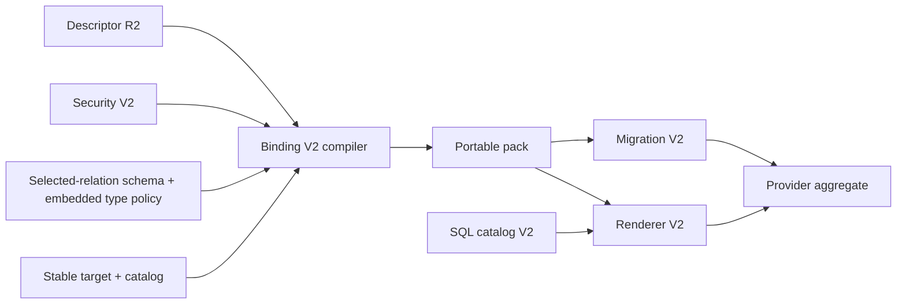

> Historical provenance: “source record NNN” names a privately archived original, not a Git ref, executable task grant or current validation result. Outcomes attached to these references retain their original historical scope. Current execution requires a separate genuine public authority chain.

<!-- Private migration draft: public bindings and approval transfer are PENDING. -->

# Feature design: PostgreSQL → MSSQL R1 V3 provider Binding V2

> Migration scope: this document is retained from source development. Historical approval, acceptance, exception, commit and evidence statements below apply to that source context; they do not establish current migration approval, activation, certification or passing validation. Current candidate status is tracked separately.

- Status: RESEARCHED
- Owner: dpone maintainers
- Issue: PostgreSQL → MSSQL Industrial Integration V7 / R1
- Target release: R1
- Last verified: 2026-09-07
- Previous approval commit: `source record 135` (superseded by RED reachability amendment)
- Amendment base: `source record 136`
- Superseded RED task: `source record 136` at [historical task requirements (not executable)](agent-task-history/postgres-mssql-r1-v3-provider-binding-v2-red.md) is audit-only and non-executable
- Amendment reason: executable RED design proved the approved factory phase denominator and unbounded-upstream size claim unrealizable; production remains untouched
- Reviewed amendment commit: `source record 045`
- Reviewed amendment SHA-256: `af7da569608876fc013790dfec68c5db25a3b38f554b4e18be8393a3a0b1cdd0`
- Review disposition: `GO` — architecture, test/certification, docs/UX and release/provenance
- Provenance wording amendment base: `source record 137`
- Supersedes for implementation: [Binding V1 historical research](feature-design-postgres-mssql-r1-v3-provider-binding-contract-v1.md)
- Integration base: `source record 050`

## Executive summary

Binding V2 is a pure, deterministic contracts-layer compiler. It combines the
already accepted MSSQL physical descriptor, Security V2 policy, source-owned
selected-relation schema/type authority and rotation-stable registered-target
authority into one portable, content-addressed binding pack.

```text
descriptor R2 + Security V2 + selected-relation schema/type authority
+ stable target + target catalog
→ exact source/target mapping
→ three stage-result contracts
→ six semantic module plans
→ signer intent + exact permission paths
→ portable Binding V2 pack
```

Binding V2 performs no I/O, opens no connection, renders no SQL, observes no
catalog and owns no receipt, transaction, state or mutable head. The future
Migration V2 owns observation, classification, install/replay and commit
recovery. Renderer V2 owns final SQL bytes. This boundary prevents an
individually valid authority from being spliced into another target binding and
keeps registration rotation from changing portable pack identity.

Public CLI, manifest and Python API do not change in this child. Provider
activation remains blocked and live SQL Server behavior remains `UNVERIFIED`.

Related authorities: [implementation map](developer-postgres-mssql-r1-v3-provider-implementation.md),
[Security V2 amendment](feature-design-postgres-mssql-r1-v3-provider-security-authority-amendment-v2.md),
[type/target authority](feature-design-postgres-mssql-r1-v3-type-target-authority-v1.md),
[selected-relation source schema authority](feature-design-postgres-mssql-r1-source-schema-authority-green-v5.md),
and the historical [Renderer V1 research contract](feature-design-postgres-mssql-r1-v3-provider-renderer-contract-v1.md).

## Personas and customer journey

| Persona | Goal | Current pain | Success signal |
|---|---|---|---|
| Framework maintainer | Build one exact provider binding without policy duplication | The V1 research text mixes portable identity, rendered SQL and live state | One factory returns byte-stable V2 authority or one typed closed failure |
| Security reviewer | Prove least privilege and signer rotation stability | Prose permission edges cannot be compared with Security V2 closure | Every permission is an exact `MssqlR1ResolvedPermissionPathV2` |
| Migration implementer | Install or replay without guessing binding semantics | No complete expected inventory exists | Pack exposes one derived inventory projection and downstream equality equations |
| Operator | Receive actionable failures without physical secrets | Low-level identifiers and catalog observations can leak into user output | Later control-plane output maps stable reasons to redacted recovery actions |

The maintainer journey is:

1. discover the approved physical, security and registered-target authorities;
2. obtain the source-owned selected-relation schema/type aggregate from the
   same-session PostgreSQL verifier;
3. invoke the Binding V2 factory;
4. receive an immutable portable pack or a stable reason/recovery pair;
5. pass the pack to Migration V2 and Renderer V2 without mutation;
6. compare fresh registration admission to the same stable target/catalog on
   every replay;
7. upgrade only by creating a new versioned pack and an explicit migration.

There is no end-user configuration step in this child. Existing manifests that
contain physical staging, driver, backend or provisioning knobs remain
compatibility-only and cannot activate this provider profile.

## Scope

### In scope

- exact V2 domains, versions, enums and frozen canonical models;
- deterministic target mapping derived from accepted upstream authorities;
- exact stage-result contracts for batch payload, XMin delta and XMin complete
  keys;
- module-local stage buffer plans for exactly six binding modules;
- semantic renderer handoff without final SQL bytes;
- binding-scoped signer identity and signature intents derived from Security V2;
- exact minimal permission-path projection;
- portable identity, expected inventory projection and top-level pack;
- closed failures, anti-splice validation and hermetic evidence.

### Non-goals

- SQL templates/catalog, generic renderer or normalized SQL bytes;
- ODBC, transactions, locks, database sessions or catalog queries;
- registration persistence, current-admission acquisition or rotation workflow;
- migration inventory observation, state classification, receipts or replay;
- DDL, grants, signatures, target mutation or runtime activation;
- live SQL Server and performance certification;
- multiple bindings per target database, replacement, automatic repair or
  generation upgrade;
- public CLI, manifest, schema or exported Python API changes.

### Assumptions and constraints

- ADR 0065 permits exactly one R1 binding pack per target database.
- The target profile is exactly `ordinary_disk_rowstore_v1`.
- The registered target has one non-null scalar primary-key column and at most
  1024 columns.
- Every dependency is exact-type checked; subclasses and duck-typed substitutes
  are rejected.
- Canonical decoding is total, consumes the complete payload and never leaks a
  raw `TypeError`, `KeyError` or codec exception.
- The complete portable pack is at most `67_108_864` bytes. Every nested payload
  is bounded by both the remaining enclosing bytes and that same maximum before
  allocation or nested decode.
- Factory admission additionally requires the sum of its six exact authority
  payloads to be at most `25_165_824` bytes and proves the derived pack remains
  within the complete-pack ceiling.
- Binding V1 was research-only; no persisted V1 compatibility obligation exists.

## Pinned upstream authority

| Authority | Exact implementation | Evidence/acceptance authority | Required value |
|---|---|---|---|
| Physical descriptor | `PENDING_PUBLIC_COMMIT_BINDING` | accepted status inherited by the integration base | `MssqlR1PhysicalSchemaDescriptorV1`, descriptor revision R2 |
| Security authority | `PENDING_PUBLIC_COMMIT_BINDING` | hermetic evidence `source record 004`; accepted status head `source record 032` | exact Security V2 profile, binding lifecycle validation and runtime-EXECUTE closure |
| Type/target authority | `source record 002` | accepted status inherited by the integration base | exact type policy, stable target and catalog contracts |
| Selected-relation source schema authority | `source record 009` | final Evidence V3 `source record 010`; historical immutable artifact (source record 010, source record 009; original location archived privately); ADR 0069 and status accepted at `source record 050` | exact source-owned relation, catalog columns, type policy and refs |
| Integration base | `source record 050` | source-schema status integration and accepted ADRs 0065–0069 | exact ancestor for Binding approval and RED authority |

The factory rejects a digest-only placeholder. It receives the complete
canonical objects, including the independently issued
`MssqlR1BindingSignerLifecyclePolicyV2`, re-decodes embedded payloads and proves
every cross-reference. The shared security profile validates that lifecycle
object through its accepted `validate_binding_policy(descriptor, policy)` API;
Binding never reconstructs it from names, dates or digests.

## Public contract

### CLI and Python API

None. No new command, option, import or exception becomes public. Binding V2
types are imported directly from their internal canonical modules. They are not
re-exported through `dpone.contracts`, compatibility facades or package roots.
This is nevertheless an additive restricted durable contract: persisted pack
bytes, domains, digests and replay interpretation require exact readers,
round-trip tests, implementation documentation and a `CHANGELOG.md` entry when
implemented. “No public API” does not mean “no compatibility obligation.”

### Manifest/schema

None. In particular, user input may not supply:

```text
target_binding_uuid, target_object_uuid, physical_generation_uuid,
database/schema object IDs, stage identifiers, module names,
certificate/user names, SID/thumbprint, SQL/template bytes,
driver, topology, durability or receipt locations
```

`target_binding_uuid` is platform-issued through the restricted registration
workflow. A later semantic manifest revision must remove physical knobs from
the certified profile; that umbrella change is not hidden inside Binding V2.

### Artifacts and evidence

Hermetic tests produce the planned create-only Binding inventory artifact
defined in the certification section. It is contract evidence only, never live
SQL Server evidence. Any later vendor certification artifact is exact-commit
and environment-bound and uses `UNVERIFIED` until real SQL Server checks pass.

### Compatibility and migration

- V1 research bytes are rejected; V2 never aliases or reinterprets them.
- Existing `PostgresMssqlTypeMapper` behavior and public imports are unchanged.
- A persisted V2 pack is immutable.
- Registration rotation is allowed only when a fresh admission reproduces the
  byte-identical stable target authority and target catalog.
- Any different stable authority creates a different pack; automatic coexistence
  or replacement is forbidden in R1.
- Rollback is code-only while no V2 pack has been installed. After installation,
  a binary must understand V2 or the provider remains paused.

## Canonical identity rules

All binding-owned models are frozen slotted dataclasses. Exact enums, exact
types, tuples and contiguous one-based ordinals are mandatory.

```text
canonical_bytes = canonical_bytes(EXACT_DOMAIN, ordered_fields)
digest = SHA256(canonical_bytes)
```

Own digest is always derived and never accepted as an input. A set is serialized
as a documented canonical tuple. Names are valid MSSQL identifiers, and exact
plus Unicode-casefold uniqueness is enforced wherever SQL Server name equality
could collapse values.

### V2 domains and versions

| Model | Version literal | Domain |
|---|---|---|
| `MssqlR1RegisteredTargetRefV2` | `dpone-mssql-r1-registered-target-ref-2` | `dpone-mssql-r1-registered-target-ref-v2\0` |
| `MssqlR1BusinessColumnMappingV2` | `dpone-mssql-r1-business-column-mapping-2` | `dpone-mssql-r1-business-column-mapping-v2\0` |
| `MssqlR1BindingTargetMappingV2` | `dpone-mssql-r1-binding-target-mapping-2` | `dpone-mssql-r1-binding-target-mapping-v2\0` |
| `MssqlR1StageScanProjectionV2` | `dpone-mssql-r1-stage-scan-projection-2` | `dpone-mssql-r1-stage-scan-projection-v2\0` |
| `MssqlR1StageScanInvocationV2` | `dpone-mssql-r1-stage-scan-invocation-2` | `dpone-mssql-r1-stage-scan-invocation-v2\0` |
| `MssqlR1ModuleStageBufferPlanV2` | `dpone-mssql-r1-module-stage-buffer-plan-2` | `dpone-mssql-r1-module-stage-buffer-plan-v2\0` |
| `MssqlR1InstantiatedBindingModuleV2` | `dpone-mssql-r1-instantiated-binding-module-2` | `dpone-mssql-r1-instantiated-binding-module-v2\0` |
| `MssqlR1BindingSignerIdentityV2` | `dpone-mssql-r1-binding-signer-identity-2` | `dpone-mssql-r1-binding-signer-identity-v2\0` |
| `MssqlR1BindingSignatureIntentV2` | `dpone-mssql-r1-binding-signature-intent-2` | `dpone-mssql-r1-binding-signature-intent-v2\0` |
| `MssqlR1BindingAccessPermissionProjectionV2` | `dpone-mssql-r1-binding-access-permission-projection-2` | `dpone-mssql-r1-binding-access-permission-projection-v2\0` |
| `MssqlR1BindingPermissionContractV2` | `dpone-mssql-r1-binding-permission-2` | `dpone-mssql-r1-binding-permission-v2\0` |
| `MssqlR1ExpectedBindingInventoryV2` | `dpone-mssql-r1-expected-binding-inventory-2` | `dpone-mssql-r1-expected-binding-inventory-v2\0` |
| `MssqlR1BindingInstantiationContractV2` | `dpone-mssql-r1-binding-instantiation-2` | `dpone-mssql-r1-binding-instantiation-contract-v2\0` |
| `MssqlR1BindingPortableIdentityV2` | `dpone-mssql-r1-binding-portable-identity-2` | `dpone-mssql-r1-binding-portable-identity-v2\0` |
| `MssqlR1BindingModulePackV2` | `dpone-mssql-r1-binding-pack-2` | `dpone-mssql-r1-binding-pack-v2\0` |

Failure and recovery enums use domains
`dpone-mssql-r1-binding-failure-reason-v2\0` and
`dpone-mssql-r1-binding-recovery-class-v2\0` when serialized inside a typed
error. Reused upstream models retain their original domains unchanged.

## Detailed data contract

### Rotation-stable registered target

```text
MssqlR1RegisteredTargetRefV2(
    contract_version: Literal["dpone-mssql-r1-registered-target-ref-2"],
    target_binding_uuid: UUID,
    target_object_uuid: UUID,
    resource_ref: MssqlR1PhysicalResourceRefV1,
    stable_target_authority_digest: bytes,
    target_catalog_digest: bytes,
)
```

The constructor is factory-only. `resource_ref` is exactly
`REGISTERED_TARGET / None / None / "registered_target"`; no caller-defined
schema or object substitution is admitted. The factory proves exact equality of
binding/object/generation UUIDs, profile, database/schema/object names, object
ID, target revision and
`stable.catalog_contract_digest == catalog.digest`. Full stable authority and
catalog payloads occur once in the top-level pack.

### Source-to-target mapping

Binding consumes the source-owned
[`PostgresMssqlSelectedRelationSchemaAuthorityV1`](feature-design-postgres-mssql-r1-source-schema-authority-green-v5.md).
It never accepts or creates a selected-source wrapper from independently
supplied relation and column values.

```text
MssqlR1BindingTargetMappingV2(
    contract_version: Literal["dpone-mssql-r1-binding-target-mapping-2"],
    registered_target: MssqlR1RegisteredTargetRefV2,
    source_schema_authority_digest: bytes,
    route_source_authority_sha256: bytes,
    type_policy_authority_digest: bytes,
    ordered_columns: tuple[MssqlR1BusinessColumnMappingV2, ...],
)

MssqlR1BusinessColumnMappingV2(
    contract_version: Literal["dpone-mssql-r1-business-column-mapping-2"],
    ordinal: int,
    source_column_ref: PostgresMssqlSourceColumnRefV1,
    target_column_ref: MssqlR1RegisteredTargetColumnRefV1,
    type_decision_id: str,
    key_ordinal: Literal[1] | None,
)

```

The only package-internal construction entry point is exact and keyword-only:

```text
def create(
    self,
    *,
    physical_descriptor: MssqlR1PhysicalSchemaDescriptorV1,
    shared_security_profile: MssqlR1SharedInstallSecurityProfileV2,
    binding_signer_lifecycle_policy: MssqlR1BindingSignerLifecyclePolicyV2,
    source_schema_authority: PostgresMssqlSelectedRelationSchemaAuthorityV1,
    stable_target_authority: MssqlR1RotationStableTargetAuthorityV1,
    target_catalog: MssqlR1RegisteredTargetCatalogV1,
) -> MssqlR1BindingModulePackV2:
    ...
```

Leaf factories are private to the package. Callers cannot inject a derived
target ref, decision ID, stage projection, module, signer, permission or
inventory leaf.

The factory accepts only the exact selected-relation schema aggregate. It
canonical-round-trips the aggregate first, then derives the selected source,
type policy and ordered source references from its embedded payload. It does
not normalize the selected-source JSON; the source-schema contract preserves
the existing byte-exact `SelectedPostgresSourceAuthority` preimage.

Normative checks are:

- `1..1024` columns; 0 and 1025 fail;
- `source_schema_authority.ordered_columns` occurs in exact observed
  attribute-number order and its embedded source-reference ordinals equal
  `1..N`; reordering valid columns/refs is rejected rather than sorted;
- the factory derives the sole R1 mapping `source ordinal i → target ordinal
  i`; there is no caller-supplied permutation parameter because accepted
  `R1OpenStagePlanV1` requires both ordinal sequences to equal `1..N`;
- output mappings are sorted by target ordinal and mapping ordinals equal
  `1..N` in that output order;
- each source and target ref is used exactly once;
- names are exact- and casefold-unique and target names are disjoint from the
  fixed system suffix;
- source and target nullability are equal;
- each source shape resolves to exactly one policy decision;
- reuse of a decision is permitted only for byte-identical source shapes;
- used distinct source shapes equal the complete policy coverage;
- decision stage/target shapes equal the exact mapped target shape;
- exactly one mapping has `key_ordinal=1`; its source and target ordinals retain
  their original full-relation positions and may be any value in `1..N`;
- the one-column complete-keys stage creates a stage-local projection rebased to
  result ordinal `1`, while retaining the exact original source/catalog refs in
  the mapping authority; the key source is non-null;
- mapping/policy/stable/catalog digests and UUIDs are byte-identical.
- `mapping.source_schema_authority_digest` equals
  `SHA256(source_schema_authority.canonical_bytes)`;
- canonical digest bytes stored by `source_schema_authority` equal both
  `stable_target_authority.route_source_authority_sha256` and
  `mapping.route_source_authority_sha256`;
- `mapping.type_policy_authority_digest` equals the embedded policy digest;
- every mapping source reference is byte-identical to the corresponding
  source-owned observed-column reference; no independent valid reference is
  admitted.

### Stage-result authority

```text
MssqlR1StageScanProjectionV2(
    contract_version: Literal["dpone-mssql-r1-stage-scan-projection-2"],
    artifact_kind: R1StageArtifactKindV1,
    core_scan_procedure_ref: MssqlR1PhysicalResourceRefV1,
    stage_scan_template_digest: bytes,
    ordered_business_columns: tuple[MssqlR1ResultColumnV3, ...],
    ordered_result_columns: tuple[MssqlR1ResultColumnV3, ...],
)
```

Business result columns are derived from the exact
`target_catalog.ordered_columns`, not from scalar shape alone. For target column
`i`, `MssqlR1ResultColumnV3` uses its exact ordinal, name,
`system_type_name`, `max_length`, `precision`, `scale`, `nullable`, and
`scalar_shape.collation`; all eight values are compared back to the catalog.
Binding does not duplicate a second role or scalar-shape algebra. The exact suffix is copied
from the resolved template's `ordered_fixed_suffix_columns`, with ordinals offset by
the business-column count. No suffix name or type is hardcoded or accepted from
the caller.

The three results are ordered exactly:

```text
batch_payload      = all business columns + suffix
xmin_delta         = all business columns + suffix
xmin_complete_keys = primary-key business column + suffix
```

There are exactly three projections. `batch_payload` and `xmin_delta` retain
the full catalog ordinals `1..N`. `xmin_complete_keys` contains the sole key as
its first business result column, with result ordinal `1`, regardless of the
key's original catalog ordinal; the following suffix is rebased after that one
business column. The projection still binds that result to the original
`source_column_ref` and `target_column_ref`, so rebasing cannot change mapping
identity.

The resource is exactly the descriptor's `dpone_scan_stage_v3`; the result
cardinality is the existing exact enum
`MssqlR1ResultCardinalityV3.ZERO_OR_MANY`. References use these exact equations:

```text
stage_scan_template_digest =
  SHA256(exact MssqlR1StageScanTemplateV3.canonical_bytes)

scan_procedure_digest =
  SHA256(exact MssqlR1PhysicalProcedureDescriptorV1.canonical_bytes)

stage_scan_request_authority_digest =
  SHA256(exact MssqlR1RequestAuthorityV1.canonical_bytes)

descriptor_template_digest =
  SHA256(exact MssqlR1BindingModuleTemplateV1.canonical_bytes)
```

Each digest resolves to exactly one embedded descriptor leaf of that exact
type and expected resource/module kind. Zero or multiple matches fail. The
projection digest is
`SHA256(canonical_bytes(domain, (version, artifact_kind,
resource.canonical_bytes, stage_scan_template_digest,
business-column-bytes, result-column-bytes)))`. It never depends on an
unavailable template payload. Decoding resolves the stored digest against the
embedded descriptor, re-derives both column tuples and requires byte equality.

### Buffer plans

The binding records the exact scan-envelope ABI; it does not misuse scalar
comparison coordinates for whole request payloads.

```text
class MssqlR1StageBufferSymbolV2(StrEnum):
    BATCH_PAYLOAD = "batch_payload"
    XMIN_DELTA = "xmin_delta"
    XMIN_COMPLETE_KEYS = "xmin_complete_keys"

class MssqlR1StageEnvelopeSourceV2(StrEnum):
    OPEN_STAGE_PLAN_CANONICAL_BYTES = "open_stage_plan_canonical_bytes"
    SHA256_REQUEST_PAYLOAD = "sha256_request_payload"
    PROJECTION_JSON_FROM_OPEN_STAGE_PLAN = "projection_json_from_open_stage_plan"

MssqlR1StageScanInvocationV2(
    contract_version: Literal["dpone-mssql-r1-stage-scan-invocation-2"],
    ordinal: int,
    artifact_kind: R1StageArtifactKindV1,
    buffer_symbol: MssqlR1StageBufferSymbolV2,
    projection_digest: bytes,
    scan_procedure_digest: bytes,
    ordered_envelope_sources: tuple[MssqlR1StageEnvelopeSourceV2, ...],
)

MssqlR1ModuleStageBufferPlanV2(
    contract_version: Literal["dpone-mssql-r1-module-stage-buffer-plan-2"],
    module_kind: MssqlR1BindingModuleKindV1,
    ordered_inputs: tuple[MssqlR1StageScanInvocationV2, ...],
)
```

The descriptor must expose exactly `PAYLOAD_PROJECTION` with these three input
parameters and sources in parameter ordinal order:

| Parameter | Required SQL ABI | Source |
|---|---|---|
| `request_payload` | descriptor exact `varbinary(max)` input | canonical bytes of the runtime `R1OpenStagePlanV1` |
| `request_digest` | descriptor exact `binary(32)` input | `SHA256(request_payload)` |
| `projection_json` | descriptor exact `nvarchar(max)` input | canonical projection JSON decoded from the same admitted open-stage-plan payload |

The pack resolves `scan_procedure_digest` against its one embedded descriptor;
the complete `MssqlR1RequestAuthorityV1`, parameters, codec and projection
grammar are derived views, not repeated canonical payloads. Its scalar binding
tuple must be empty and the three envelope sources must occur exactly in
descriptor parameter order. Renderer V2
owns the one exact projection of the decoded `R1OpenStagePlanV1` under that
grammar and must prove every projected field, including artifact/effect/epoch,
schema/catalog/permission/DDL digests, target binding UUID, type-policy digest
and business-column closure, before dispatch. Static Binding projection data is
only the expected schema witness; it never supplies per-run projection JSON.
The instantiated result identity is then computed only with the accepted
upstream method:

```text
resolved_stage_scan_template.instantiated_digest(
  ordered_business_columns,
  SHA256(open_stage_plan.canonical_bytes),
)
```

Binding never stores a per-run open-plan digest in its portable identity.

The existing adapter path that scans by only `artifact_id/owner_epoch` is a
legacy compatibility implementation and is not compatible evidence for this
three-parameter R2 `PAYLOAD_PROJECTION` ABI. Binding V2 remains activation-
blocked until Renderer/Migration dispatch the exact accepted descriptor ABI.

| Module family | Required local buffers |
|---|---|
| batch mutate / row-hash / quality | `@dpone_batch_payload` |
| XMin mutate / row-hash / quality | `@dpone_xmin_delta`, `@dpone_xmin_complete_keys` |

The exact denominator is six module plans, three projections and nine scan
invocations: the three batch modules each own one `batch_payload` invocation,
and the three XMin modules each own one `xmin_delta` plus one
`xmin_complete_keys` invocation. Invocation ordinals are contiguous within each
module buffer plan. Missing, extra, shared-by-reference or reordered invocation
objects are rejected.

The renderer maps symbols to the exact local variables
`@dpone_batch_payload`, `@dpone_xmin_delta` and
`@dpone_xmin_complete_keys`; those spellings are SQL-catalog constants, not
Binding input. A buffer is declared and populated once through the shared signed
scan module; nested `INSERT EXEC`, dynamic SQL and alternate request envelopes
are forbidden.

### Semantic module plans

```text
MssqlR1InstantiatedBindingModuleV2(
    contract_version: Literal["dpone-mssql-r1-instantiated-binding-module-2"],
    module_kind: MssqlR1BindingModuleKindV1,
    schema_name: Literal["dpone_authority"],
    object_name: str,
    descriptor_template_digest: bytes,
    target_mapping_digest: bytes,
    buffer_plan: MssqlR1ModuleStageBufferPlanV2,
    ordered_target_access_intents: tuple[MssqlR1PhysicalResourceAccessV1, ...],
)
```

Binding has no placeholder or SQL-substitution model. Renderer V2 derives the
only legal identifier/column bindings from the exact target mapping, stage
invocations and descriptor template. This removes a second source of placeholder
truth: arbitrary token, fragment or byte substitution cannot enter the pack.

The exact six-value `MssqlR1BindingModuleKindV1` order is canonical. Each module
is derived from the matching descriptor template, resolved binding UUID name,
mapping, buffer plan and Binding-owned target access matrix. Parameters, result
and caller-UoW semantics are derived properties resolved from the pack's one
embedded descriptor; they are not serialized again. The physical template's
execution read/write sets describe its accepted static/control-template
authority and do not contain a dynamic registered target. Binding therefore
must not filter those sets or pretend they imply target permissions.

The mapping-bound target access matrix is exact and canonical first in
`READ, INSERT, UPDATE, DELETE` enum order and then, for equal access values, by
resource kind in `REGISTERED_TARGET, STATIC_OBJECT` order. Consequently each
quality-module tuple is registered-target `READ` followed by row-hash `READ`:

| Module kind | Exact `ordered_target_access_intents` |
|---|---|
| `batch_mutate` | registered target: `READ`, `INSERT`, `UPDATE`, `DELETE` |
| `batch_row_hash` | descriptor row-hash static object: `READ`, `INSERT`, `UPDATE`, `DELETE` |
| `batch_quality` | registered target: `READ`; row-hash: `READ` |
| `xmin_mutate` | registered target: `READ`, `INSERT`, `UPDATE`, `DELETE` |
| `xmin_row_hash` | descriptor row-hash static object: `READ`, `INSERT`, `UPDATE`, `DELETE` |
| `xmin_quality` | registered target: `READ`; row-hash: `READ` |

These intents are not caller input. Their resource refs are derived from the
exact registered-target mapping and exact descriptor row-hash object. Renderer
V2 must render only operations covered by the module's intents, and the provider
aggregate must compare the rendered SQL access observation to the same tuple.
Missing, extra, reordered or foreign-resource intents are a
`module_set_invalid` failure.

Binding owns semantic module digest only. It never stores caller-supplied
`definition_bytes` or a self-confirming definition digest. Renderer V2 consumes
the semantic plan and emits final normalized SQL plus a rendered definition
digest bound to both `binding_pack_digest` and semantic-module digest. The
provider aggregate later compares those bytes to catalog observation.

The module canonical bytes and sole module digest use the tabled module domain,
exactly `canonical_bytes(b"dpone-mssql-r1-instantiated-binding-module-v2\0", (version,
module_kind, schema_name, object_name, descriptor_template_digest,
target_mapping_digest, buffer_plan.canonical_bytes,
tuple(access.canonical_bytes for access in ordered_target_access_intents)))`.
The descriptor template name is expanded only by
replacing the single literal `{binding_uuid_hex}` with the lowercase 32-hex
binding UUID; any other brace token or occurrence count is rejected.

### Signer intent and exact permission contract

```text
MssqlR1BindingSignerIdentityV2(
    contract_version: Literal["dpone-mssql-r1-binding-signer-identity-2"],
    target_binding_uuid: UUID,
    lifecycle_policy: MssqlR1BindingSignerLifecyclePolicyV2,
    certificate_name: str,
    certificate_user_name: str,
    certificate_subject: str,
    certificate_owner: MssqlR1EnvironmentPrincipalRefV1,
    start_date_yyyymmdd: str,
    expiry_date_yyyymmdd: str,
    certificate_creation_profile: MssqlR1CertificateCreationProfileV1,
    signature_algorithm: MssqlR1CertificateSignatureAlgorithmV1,
    secret_policy_digest: bytes,
)

MssqlR1BindingSignatureIntentV2(
    contract_version: Literal["dpone-mssql-r1-binding-signature-intent-2"],
    ordinal: int,
    module_kind: MssqlR1BindingModuleKindV1,
    semantic_module_digest: bytes,
    signer_identity_digest: bytes,
)

MssqlR1BindingAccessPermissionProjectionV2(
    contract_version: Literal["dpone-mssql-r1-binding-access-permission-projection-2"],
    source_access: MssqlR1PhysicalResourceAccessV1,
    permission_path: MssqlR1ResolvedPermissionPathV2,
)

MssqlR1BindingPermissionContractV2(
    contract_version: Literal["dpone-mssql-r1-binding-permission-2"],
    permission_profile: Literal["exact_target_and_row_hash_v1"],
    ordered_access_projections: tuple[MssqlR1BindingAccessPermissionProjectionV2, ...],
    ordered_runtime_execute_paths: tuple[MssqlR1ResolvedPermissionPathV2, ...],
    ordered_signature_intents: tuple[MssqlR1BindingSignatureIntentV2, ...],
)
```

The signer factory expands only `{binding_uuid_hex}` as 32 lowercase hex
characters and embeds the complete, exact
`MssqlR1BindingSignerLifecyclePolicyV2`; a digest-only lifecycle reference is
forbidden. Signer identity plus six signature intents are the sole Binding-owned
Renderer source authority. Binding does not create a competing SQL-template
grammar. The accepted `MssqlR1SecretSqlTemplateV1` CREATE grammar does not encode
the lifecycle subject, dates and owner, so certificate rendering remains
activation-blocked until SQL Catalog V2 and, if its accepted public seam proves
insufficient, a successor amendment beyond the pinned approved Security V2 own
the exact skeleton and equality witness. No secret-bearing executable SQL is
present in the pack.

Permission projection is one-to-one and exact:

| Source resource/access | Beneficiary | Target | Permission | Other fixed fields |
|---|---|---|---|---|
| exact registered target + `READ` | binding signer instance | exact target object, descendants | `SELECT` | provisioner/direct/GRANT/no grant option |
| exact registered target + `INSERT` | binding signer instance | exact target object, descendants | `INSERT` | same |
| exact registered target + `UPDATE` | binding signer instance | exact target object, descendants | `UPDATE` | same |
| exact registered target + `DELETE` | binding signer instance | exact target object, descendants | `DELETE` | same |
| exact row-hash static object + `READ` | binding signer instance | exact row-hash object, descendants | `SELECT` | same |
| exact row-hash static object + `INSERT` | binding signer instance | exact row-hash object, descendants | `INSERT` | same |
| exact row-hash static object + `UPDATE` | binding signer instance | exact row-hash object, descendants | `UPDATE` | same |
| exact row-hash static object + `DELETE` | binding signer instance | exact row-hash object, descendants | `DELETE` | same |
| exact binding module + `EXECUTE` | runtime environment principal | `dpone_authority.<exact module>`, descendants | `EXECUTE` | same |

The source access set is the unique union of the six modules'
`ordered_target_access_intents`. Every retained access must occur once in
`ordered_access_projections`, sorted by `source_access.canonical_bytes`; its path
is the table row above. Physical descriptor execution read/write sets are
separately validated as descriptor/template authority and are never projected
to dynamic target grants. Runtime paths
are exactly six, sorted in canonical module-kind order. The DML projection is
exactly eight paths: `SELECT`, `INSERT`, `UPDATE` and `DELETE` for the registered
target, and the same four permissions for the row-hash object. Their unique
union with the six runtime `EXECUTE` paths is exactly fourteen paths in the
derived `ordered_permission_paths` property, sorted by
`permission_path.canonical_bytes`, with no duplicate canonical bytes. Stage
grants, role/PUBLIC origins, `DENY`, schema/database widening, wrong grantor,
wrong UUID and redundant paths are rejected. Signature intents are exactly six
and use canonical module-kind order.

Every path is a complete `MssqlR1ResolvedPermissionPathV2`; Binding requires
`is_exact_binding_path(path)` plus the exact access/runtime equations above.
After explicit phase-11 dependency and phase-12 identity/lifecycle checks, but
before deriving signer or permissions, the factory calls the combined
`shared_security_profile.validate_binding_policy(physical_descriptor,
binding_signer_lifecycle_policy)` seam as a redundant postcondition. Any
remaining generic rejection is phase 99. A lifecycle policy that is
individually valid but belongs to another descriptor or security profile is
therefore rejected by the explicit ordered checks and never becomes signer
input.
It cannot call `MssqlR1PermissionClosurePolicyV1.validate_complete()` because
that method requires fresh `observed_paths`. Migration obtains the observation,
and the provider aggregate alone invokes `validate_complete(descriptor,
binding_paths, observed_paths)` over shared plus Binding authority.

### Expected inventory projection

```text
MssqlR1ExpectedBindingInventoryV2(
    contract_version: Literal["dpone-mssql-r1-expected-binding-inventory-2"],
    target_binding_uuid: UUID,
    ordered_module_names: tuple[str, ...],
    certificate_name: str,
    certificate_user_name: str,
    ordered_semantic_module_digests: tuple[bytes, ...],
    ordered_permission_path_digests: tuple[bytes, ...],
    ordered_signature_intent_digests: tuple[bytes, ...],
    permission_contract_digest: bytes,
)
```

This is a derived expected projection for Migration V2. It does not claim that
the database contains no foreign objects. Migration obtains and classifies a
complete database-global observation under its transaction without importing
Renderer or SQL-catalog types. The provider aggregate compares that typed
observation, this Binding projection and the Renderer/SQL-catalog bundle.

The projection is accepted only when all equations hold exactly:

```text
ordered_module_names == tuple(module.object_name for module in ordered_modules)
ordered_semantic_module_digests == tuple(module.digest for module in ordered_modules)
certificate_name == signer_identity.certificate_name
certificate_user_name == signer_identity.certificate_user_name
ordered_permission_path_digests == tuple(path.digest for path in permission_contract.ordered_permission_paths)
ordered_signature_intent_digests == tuple(intent.digest for intent in permission_contract.ordered_signature_intents)
permission_contract_digest == permission_contract.digest
```

No caller supplies inventory fields; decoding re-derives them from the same
portable identity and rejects missing, extra or reordered entries.

### Instantiation contract, input and portable pack

```text
MssqlR1BindingInstantiationContractV2(
    contract_version: Literal["dpone-mssql-r1-binding-instantiation-2"],
    physical_descriptor_digest: bytes,
    shared_security_profile_digest: bytes,
    source_schema_authority_digest: bytes,
    type_policy_authority_digest: bytes,
    stable_target_authority_digest: bytes,
    target_catalog_digest: bytes,
    ordered_binding_template_digests: tuple[bytes, ...],
    stage_scan_template_digest: bytes,
    stage_scan_request_authority_digest: bytes,
    stage_scan_suffix_digest: bytes,
    buffer_matrix_digest: bytes,
    signer_lifecycle_policy: MssqlR1BindingSignerLifecyclePolicyV2,
    permission_projection_profile: Literal["exact_target_and_row_hash_v1"],
    compiler_policy: Literal["pure_fail_closed_v2"],
)

MssqlR1BindingPortableIdentityV2(
    contract_version: Literal["dpone-mssql-r1-binding-portable-identity-2"],
    target_mapping: MssqlR1BindingTargetMappingV2,
    ordered_stage_projections: tuple[MssqlR1StageScanProjectionV2, ...],
    ordered_modules: tuple[MssqlR1InstantiatedBindingModuleV2, ...],
    signer_identity: MssqlR1BindingSignerIdentityV2,
    permission_contract: MssqlR1BindingPermissionContractV2,
    expected_inventory: MssqlR1ExpectedBindingInventoryV2,
)

MssqlR1BindingModulePackV2(
    contract_version: Literal["dpone-mssql-r1-binding-pack-2"],
    physical_descriptor_payload: bytes,
    shared_security_profile_payload: bytes,
    source_schema_authority_payload: bytes,
    stable_target_authority_payload: bytes,
    target_catalog_payload: bytes,
    binding_instantiation_contract_payload: bytes,
    portable_identity: MssqlR1BindingPortableIdentityV2,
)
```

The only durable-byte reader is:

```text
MssqlR1BindingModulePackV2.from_canonical_bytes(payload: bytes)
    -> MssqlR1BindingModulePackV2
```

It requires `type(payload) is bytes`, rejects zero length and any payload above
the fixed `MAX_BINDING_PACK_CANONICAL_BYTES_V2 = 67_108_864` before canonical
decode, applies the same bound to every embedded payload before invoking a
nested decoder, consumes all fields, re-derives all leaves, and requires
`decoded.canonical_bytes == payload`. Quota excess maps to
`canonical_size_exceeded`; invalid tags, lengths, field counts or trailing bytes
map to `malformed_canonical_bytes`. There is no caller-controlled size limit,
partial/streaming decoder, tolerant reader or V1 fallback. A later filesystem or
database reader must perform a bounded read to this exact maximum and pass the
result to this method; such I/O belongs to Migration, not Binding.

Before the existing eager upstream decoders run, an internal read-only framing
preflight walks a `memoryview` without materializing nested sequences. It proves
only safety properties: top-level framing and length containment, maximum
nesting depth `16`, and at most
`MAX_BINDING_PACK_SEQUENCE_ELEMENTS_V2 = 4_194_304` framed sequence elements.
It records, but does not semantically accept or reject, source/target column,
secondary-index, index-ordinal and Binding cardinalities. Those recorded values
are decided at their tabled semantic phase so, for example, 1025 columns always
produce `column_count_invalid`, never `canonical_size_exceeded`. Unknown tags,
overflowed/truncated lengths or safety-quota excess fail before nested
allocation; the exact upstream decoders then enforce semantic equality.

The 64 MiB ceiling intentionally defines a bounded Binding V2 subprofile; it is
not claimed to cover every object accepted by the upstream authorities.
`MssqlR1DefinitionPayloadV1` has no upstream byte ceiling, so an otherwise valid
descriptor can grow without bound. The factory therefore has the stricter exact
preimage guard
`MAX_BINDING_FACTORY_EMBEDDED_INPUT_BYTES_V2 = 25_165_824`: the sum of the exact
canonical byte lengths of its six supplied authorities must not exceed 24 MiB.
`measure_canonical_lengths_without_encoding` uses the pinned codec's exact tag
and framing length algebra over the already resident, exact-typed dataclass
leaves. It maintains a saturating counter capped at guard-plus-one and never
allocates aggregate canonical bytes, decodes nested payloads or invokes an
upstream round-trip before the guard. Its differential tests compare the
calculated length with actual canonical bytes for every authority family and
boundary shape.
The reader independently keeps the 64 MiB complete-pack limit. Exceeding either
applicable guard is phase 02 `canonical_size_exceeded`, a supported,
side-effect-free capacity outcome rather than `dependency_mismatch` or silent
narrowing.

Before GREEN, the independent RED semantic suite must encode the 1024-column /
999-secondary-index reference authority with the pinned standard R2 descriptor,
derive the complete reference pack preimage without importing Binding
production modules, and prove its byte length and element count fit this bounded
subprofile. The factory proof maximizes upstream cardinalities and bounded
identifier widths, pads the otherwise valid definition payload to the exact
24 MiB six-authority preimage budget, and proves the derived complete pack is at
most 64 MiB. It must also independently prove that every valid factory input and
derived output under the upstream cardinality and 24 MiB preimage limits remains
below the `4_194_304` element quota. An otherwise valid enlarged definition
payload proves the 24 MiB factory guard/guard-plus-one; complete canonical pack
bytes prove the separate 64 MiB reader ceiling/ceiling-plus-one.
The independent proof owns a closed monotonic upper-bound formula over every
input byte length, identifier-width and repeated cardinality, then compares that
bound to an actual maximum-shape golden pack. It must not infer universal safety
from one representative fixture alone.
Hostile reader framing alone proves the depth and element quota/quota-plus-one;
canonical bytes/text payloads are atomic values, so no false claim is made that
a valid factory object can reach those structural boundaries. Reader plus-one
fixtures are rejected before eager allocation. If the standard
maximum-cardinality reference or the valid-factory element proof does not fit,
implementation stops for a reviewed specification amendment; raising a constant
or dropping valid indexes is not a writer decision. Factory output is checked
defensively before return; a breach after all accepted input guards is an
internal postcondition failure, not a second public phase-02 path.

The instantiation contract is wholly derived. The source-schema digest is
`SHA256(exact source_schema_authority.canonical_bytes)` and the type-policy
digest is the digest of its one embedded policy; there is no second policy
payload. `ordered_binding_template_digests` equals the six exact
`SHA256(MssqlR1BindingModuleTemplateV1.canonical_bytes)` values in enum order.
The stage-scan template, procedure and request-authority digests resolve
uniquely against the complete accepted `dpone_scan_stage_v3` leaves in the
embedded descriptor according to the equations above. The suffix digest is
`SHA256(canonical_bytes(b"dpone-mssql-r1-stage-suffix-v2\0",
(ordered_suffix_column_bytes,)))`. The buffer matrix digest is
`SHA256(canonical_bytes(b"dpone-mssql-r1-buffer-matrix-v2\0",
(ordered_module_kind_and_invocation_bytes,)))`. The lifecycle object equals the
exact validated factory argument and has been proven against Security V2 by
`validate_binding_policy`; it is not reconstructed from a digest. No derived
field is caller-selectable.

The selected-source preimage inside `source_schema_authority_payload` is decoded
only by
`PostgresSelectedRelationAuthorityDocumentV1.from_authority_document_utf8(...)`;
Binding does not add a JSON decoder or alternate normalization path.

The pack contains exactly those eight dataclass fields, including
`contract_version`, and no registration attempt,
active head, admission, command/bundle, rotation transition, receipt/effect,
observed ID, SID/thumbprint, time, nonce, deployment value, live attestation,
rendered SQL or own digest.

Provisioning source observation and target installation are separate
transactions: the source-owned schema authority is issued and the source
transaction closed before Migration performs target I/O. The installed pack
retains the exact source-schema payload. Every non-replay execution reissues it
under the extraction snapshot and proves byte equality to the installed pack
before business-row reads; first seal retains the same bytes. Exact receipt
replay suppresses source I/O, while a sealed retry uses retained authority and
never re-observes source under the same effect key.

## Deterministic algorithm

1. Reader-only phases 01–05 validate exact top-level bytes, bounded framing,
   Binding family/version and canonical round-trip. Factory phases 01 and 02
   validate its exact six public argument types and bounded embedded-input bytes.
2. Decode or inspect each exact upstream authority independently and extract
   source/schema/policy/reference leaves without cross-authority comparison.
   Failure of this non-classifying extraction for an otherwise accepted object
   is internal phase 99.
3. Execute phase 07 identifier grammar, UTF-16, suffix and casefold closure.
4. Execute phase 10 identity-mapping coverage over independently valid source
   and target cardinalities.
5. Execute phase 11 dependency closure over descriptor/profile, type-policy and
   catalog digests without yet calling the combined Security seam.
6. Execute phase 12 UUID, target object/generation, route/source, lifecycle
   secret/transition and owner identity closure. Only after both phase 11 and 12
   pass, call `shared_security_profile.validate_binding_policy(...)` as a
   redundant postcondition. Any residual rejection is phase 99 and is never
   classified by parsing its generic exception message.
7. Execute phase 13 exact one-column key compatibility and phase 14 target facet,
   nullability and type-decision compatibility, in that order.
8. Execute phase 16 by validating the exact PAYLOAD_PROJECTION scan grammar and
   request ABI exposed by the otherwise valid R2 descriptor.
9. Only after phases `01 → 02 → 07 → 10 → 11 → 12 → 13 → 14
   → 16` pass, derive the registered-target mapping, three stage projections,
   nine invocations, six buffer/module plans, signer, eight DML paths, six
   `EXECUTE` paths, six signatures, inventory, identity, contract and pack.
10. Re-decode the pack and positively prove every derived equality and exact
    canonical output. A breach is phase 99; derived validations never reopen an
    earlier public failure phase.

### Pseudocode

```text
create(*, physical_descriptor, shared_security_profile,
       binding_signer_lifecycle_policy, source_schema_authority,
       stable_target_authority, target_catalog):
  inputs = require_exact_argument_types(...)                  # phase 01
  sizes = measure_canonical_lengths_without_encoding(inputs)
  enforce_factory_input_byte_bounds(sizes)                    # phase 02
  authorities = round_trip_individual_authorities(inputs)     # non-classifying
  leaves = extract_individual_authority_leaves(authorities)   # non-classifying
  selected_source = PostgresSelectedRelationAuthorityDocumentV1.from_authority_document_utf8(
      source_schema_authority.selected_source_document_utf8,
  )
  type_policy = source_schema_authority.type_policy_authority
  source_refs = tuple(
      column.source_column_ref
      for column in source_schema_authority.ordered_columns
  )
  validate_identifier_closure(leaves)                        # phase 07
  validate_identity_mapping_coverage(leaves)                 # phase 10
  prove_dependency_digest_closure(leaves)                    # phase 11
  prove_identity_lifecycle_owner_closure(leaves)             # phase 12
  require_security_binding_postcondition_or_internal_99(
      shared_security_profile,
      physical_descriptor,
      binding_signer_lifecycle_policy,
  )
  validate_key_compatibility(leaves)                         # phase 13
  validate_target_facets(leaves)                             # phase 14
  validate_scan_grammar_and_request_abi(leaves)              # phase 16
  mapping = mapping_factory.derive_identity(
      authorities, source_schema_authority, source_refs,
  )
  projections = stage_factory.derive_projections(authorities.descriptor, mapping)
  buffers = stage_factory.derive_invocations(authorities.descriptor, projections)
  modules = module_factory.derive(authorities.descriptor, mapping, buffers)
  signer = signer_factory.derive(
      binding_signer_lifecycle_policy, mapping.registered_target,
  )
  permissions = permission_projector.derive(modules, signer, authorities)
  inventory = derive_expected_inventory(modules, signer, permissions)
  identity = portable_identity(mapping, projections, modules, signer, permissions, inventory)
  contract = derive_instantiation_contract(authorities, identity)
  pack = pack_exact_payloads(authorities, contract, identity)
  require_derived_postconditions_or_internal_99(pack)
  return pack
```

### State machine, retry and cancellation

Binding is a pure function and has no durable state machine:

```text
Input → Validate/Derive → Returned
                  └────→ TypedFailure
```

- retry with identical bytes returns identical bytes or the same reason/recovery;
- caller cancellation and process-control exceptions are propagated unchanged:
  Binding never catches `BaseException`, including `asyncio.CancelledError`,
  `KeyboardInterrupt`, `SystemExit` and `GeneratorExit`;
- cancellation therefore discards local objects and has no rollback work;
- process crash, timeout and partial write are not Binding states;
- lock, deadlock, CAS and unknown commit outcome remain Migration failures;
- no clock, environment variable, random value, filesystem or network input is
  read during compilation.

### Downstream install and replay equations

Binding does not execute these steps, but its output is sufficient for the
Migration V2/provider aggregate to enforce:

```text
fresh physical session
→ BEGIN SERIALIZABLE on one MssqlR1TransactionV3
→ acquire transaction-owned schema lock
→ same-session registration probe and server-time observation
→ validate admission and stable target/catalog equality with pack
→ acquire canonical target lock, then binding lock
→ complete database-wide inventory observation
→ closed state classification
→ shared effects, then binding effects
→ seven exact post-install observations
→ total permission closure + stable attestation
→ immutable provider receipt append
→ COMMIT
```

The effective install CAS is repeat observation under `SERIALIZABLE`,
transaction-owned locks and a unique immutable receipt. Receipt-only or a
caller-supplied revision is not CAS.

Closed states are:

| Observed state | Disposition |
|---|---|
| Provider and binding wholly absent, no resource receipt | Full install |
| Exact R2 plus one exact binding and complete replay proof | Read-only replay |
| Foreign or second binding | Block |
| Absent provider plus live or receipt fragments | Inconsistent block |
| Partial, conflicting or unreadable inventory | Operator block |

Replay performs no DDL, grant, signature or receipt append. Lost-commit recovery
is delegated unchanged to ADR 0065. Before COMMIT dispatch, after rollback is
proved, retry is legal only when a fresh session proves both receipt absence and
wholly absent provider/binding inventory. After COMMIT dispatch, only exact full replay proof permits success; any
partial, ambiguous or conflicting observation blocks for operator recovery.

## Failure contract

Validation is a closed ordered pipeline; the first failing phase wins. Every
ordinary upstream `Exception` is caught at its phase boundary and mapped to
that row, so overlapping malformed inputs cannot produce two reasons.
`BaseException` subclasses are never normalized. Each phase is entered only
after every applicable earlier phase has completed, and the phase-precedence
tests inject two or more simultaneously constructible defects to prove that the
earlier row wins. Mutually exclusive predicates such as two different domain
prefixes are not fabricated as impossible pair cases. The frozen registry lists
every constructible ordered pair and every excluded pair with a closed
`mutually_exclusive` or `entrypoint_inapplicable` proof; RED independently
replays every included fixture through the real public entrypoint:

| Precedence | Predicate/phase | Reason |
|---:|---|---|
| 01 | public argument or decoded union arm has an inexact Python type | `exact_type_violation` |
| 02 | reader bytes/depth/element safety quota or factory embedded-input byte safety quota is exceeded | `canonical_size_exceeded` |
| 03 | decoded domain prefix is outside the Binding contract family | `wrong_domain` |
| 04 | decoded Binding-family domain has a version literal other than V2 | `wrong_version` |
| 05 | canonical decode, field count, trailing bytes or round-trip fails | `malformed_canonical_bytes` |
| 06 | target profile is not the one R1 profile | `unsupported_target_profile` |
| 07 | identifier grammar, UTF-16 bound or casefold uniqueness fails | `identifier_invalid` |
| 08 | source/catalog column count is outside `1..1024` | `column_count_invalid` |
| 09 | source attribute order, source/target or output ordinals are invalid | `ordinal_invalid` |
| 10 | source-to-target tuple is not the exact identity mapping | `mapping_coverage_invalid` |
| 11 | descriptor/security/type/catalog dependency digest differs | `dependency_mismatch` |
| 12 | UUID, target identity, generation or owner closure differs | `authority_splice` |
| 13 | key count, ordinal, type or nullability differs | `target_key_invalid` |
| 14 | target column facets/nullability/type decision disagree | `authority_splice` |
| 15 | derived result/suffix/catalog equality fails | `stage_shape_invalid` |
| 16 | scan request authority/envelope/buffer matrix differs | `buffer_plan_invalid` |
| 17 | six-module membership/order, access-intent or semantic closure fails | `module_set_invalid` |
| 18 | descriptor template name/body/digest expansion fails | `template_mismatch` |
| 19 | lifecycle/naming/certificate metadata differs | `signer_policy_mismatch` |
| 20 | access-to-path closure widens, omits or duplicates | `permission_widening` |
| 21 | six signature intents differ from modules/signer | `signature_mismatch` |
| 99 | unreachable compiler invariant or unknown pinned-upstream reason | `internal_invariant_violation` |

After phase 21, the factory applies the same byte/element safety bounds to the
fully derived output as a defensive postcondition. The independent
maximum-shape proof makes that postcondition unreachable for accepted input; an
unexpected breach closes as phase 99 `internal_invariant_violation`, not as a
constructible phase-02 input failure, and is excluded from pair precedence.

Entrypoint coverage is not conflated:

| Entrypoint | Real input phases | Ordered-pair denominator |
|---|---|---:|
| `MssqlR1BindingModulePackV2.from_canonical_bytes` | `01..21` through malformed bytes or decoded nested leaves | `C(21,2) = 210` |
| `MssqlR1BindingModulePackFactoryV2.create` | `01`, `02`, `07`, `10`, `11`, `12`, `13`, `14`, `16` through supplied upstream objects | `C(9,2) = 36` |

Factory exclusions from the applicable phase set are normative: 03–05 are
byte-reader concerns; valid upstream constructors already enforce 06, 08 and
09; the factory wholly derives phase-15 stage leaves; pinned R2 enforces the
stage projection leaves, while an independently valid R2 descriptor with a
different scan grammar can trigger phase 16; phase-17 modules and access intents
are derived; phase-18 template identity is upstream-enforced and its
instantiation is derived; Security V2 enforces phase-19 lifecycle constants
while foreign digests/ownership map to 11/12; phase-20 permissions and phase-21
signatures are derived. A breach in any of those factory postconditions is 99,
not a caller-constructible public failure.

Every included pair is exercised by a payload/object that reaches the public
restricted entrypoint; calling a private validator directly is not evidence.
The universe is exactly the disjoint union of those per-entrypoint combinations:
246 keys formatted
`<reader|factory>:<two-digit-earlier>:<two-digit-later>`. Factory-inapplicable
phases are omitted rather than inserted into a synthetic global universe. Each
key occurs exactly once and is classified as `constructible` or one of the
closed exclusions below; included plus excluded must equal 246.

| Entrypoint | Earlier | Later | Sole legal exclusion | Witness |
|---|---:|---:|---|---|
| `reader` | 03 | 04 | `mutually_exclusive` | phase 03 is explicitly a non-Binding-family domain; phase 04 is explicitly the Binding-family domain with a non-V2 version |

The predicates in phases 03 and 04 use those disjoint definitions. All other
245 keys are `constructible` and require an independent fixture through the
real entrypoint. Each factory pair fixture must use ordinary public upstream
constructors/decoders without `object.__new__`, `object.__setattr__`, private
validator calls or monkeypatching. The only exception is the constituent for
phase 01 itself, which must be an ordinary wrong public-argument type; every
other constituent in that pair remains publicly constructed. Removing its
earlier mutation must select the later phase; removing its later mutation must
still select the earlier phase.
The semantic-inventory test owns a hard-coded expected universe
and this one-row exclusion map; it must not derive either from the JSON registry.
The registry must match that independent authority byte-for-byte and also
freezes predicate identities and fixture IDs. Phase `99` is excluded from pair
coverage because valid input cannot select it. Factory-derived ordinal, stage,
buffer, module, template, signer, permission, signature and output-bound
postconditions receive positive golden/re-derivation tests. Their impossible
breach and an unknown upstream reason are covered only by separately labelled
internal unit fault-injection seams at each boundary, requiring
`internal_invariant_violation` with no cause/context. That mocked/internal layer
never contributes to public-entrypoint pair coverage or vendor certification.
The deterministic RED pin freezes the exact 245 included IDs and sole excluded
ID; no implementation author may choose or change that denominator.

Pinned upstream reason translation at the authority round-trip boundary is
exhaustive:

| Upstream reasons | Binding reason |
|---|---|
| nested source-schema `wrong_domain`, `wrong_version`, `malformed_canonical_bytes`, `relation_profile_unsupported`, `column_type_identity_invalid`, `source_column_unsupported` | `dependency_mismatch` |
| inexact source-schema factory argument | `exact_type_violation` |
| source-schema `column_count_invalid` | `column_count_invalid` |
| source-schema `column_ordinal_invalid` | `ordinal_invalid` |
| source-schema `column_identifier_unsupported` | `identifier_invalid` |
| source-schema `source_authority_mismatch`, `authority_splice` | `authority_splice` |
| source-schema `type_policy_mismatch` | `dependency_mismatch` |
| source-schema `internal_invariant_violation` | `internal_invariant_violation` |
| `authority_splice`, `active_head_stale`, `registration_verification_mismatch` | `authority_splice` |
| `target_profile_unsupported`, `target_feature_unsupported` | `unsupported_target_profile` |
| `target_key_invalid` | `target_key_invalid` |
| `ordinal_invalid`, `catalog_order_invalid` after Binding-owned `1..1024` count check, `decision_order_invalid` | `ordinal_invalid` |
| `identifier_invalid`, `duplicate_column` | `identifier_invalid` |
| `policy_coverage_invalid`, `decision_duplicate`, `decision_id_invalid`, `lossy_mapping`, `value_grammar_invalid`, `enum_unsupported`, `invalid_facet`, `catalog_behavior_mismatch`, upstream `wrong_version`, upstream `malformed_canonical_bytes`, upstream `wrong_domain` outside the source-schema decode phase | `dependency_mismatch` |

An unlisted reason from a changed dependency is
`internal_invariant_violation`; it cannot be mislabeled as bad user input and
forces a Binding contract/version review.

`MssqlR1BindingFailureReasonV2` and recovery are closed by this complete table;
there is no catch-all or downstream-only member:

| Reason | Recovery | Stable redacted message |
|---|---|---|
| `wrong_domain` | `permanent_input_error` | Binding input uses an unsupported canonical domain. |
| `wrong_version` | `permanent_input_error` | Binding input uses an unsupported contract version. |
| `malformed_canonical_bytes` | `permanent_input_error` | Binding input is not canonical. |
| `canonical_size_exceeded` | `permanent_input_error` | Binding input exceeds the bounded canonical profile. |
| `exact_type_violation` | `permanent_input_error` | Binding input uses an inexact model type. |
| `ordinal_invalid` | `permanent_input_error` | Binding ordinals are incomplete or reordered. |
| `column_count_invalid` | `permanent_input_error` | Binding column count is outside the supported range. |
| `identifier_invalid` | `permanent_input_error` | Binding identifier policy is not satisfied. |
| `dependency_mismatch` | `operator_intervention` | Approved dependency revisions do not form one closure. |
| `authority_splice` | `operator_intervention` | Independently valid route, source or target authorities do not share one identity. |
| `mapping_coverage_invalid` | `permanent_input_error` | Source-to-target mapping is not the exact R1 identity mapping. |
| `target_key_invalid` | `permanent_input_error` | Target key is outside the R1 profile. |
| `stage_shape_invalid` | `operator_intervention` | Stage projection differs from descriptor/type authority. |
| `buffer_plan_invalid` | `operator_intervention` | Stage scan envelope differs from the accepted ABI. |
| `module_set_invalid` | `operator_intervention` | Binding module set is incomplete or reordered. |
| `template_mismatch` | `operator_intervention` | Descriptor template authority does not match the binding. |
| `signer_policy_mismatch` | `operator_intervention` | Binding signer lifecycle authority does not match Security V2. |
| `permission_widening` | `operator_intervention` | Binding permissions exceed the exact derived closure. |
| `signature_mismatch` | `operator_intervention` | Signature/template intent differs from the module set. |
| `unsupported_target_profile` | `permanent_input_error` | Target profile is not supported by R1. |
| `internal_invariant_violation` | `operator_intervention` | Binding compiler invariant was not satisfied. |

`MssqlR1BindingRecoveryClassV2` therefore has exactly
`permanent_input_error` and `operator_intervention`. Decode/validation errors
from upstream codec, descriptor, Security, type and target contracts are
normalized by the ordered phase table, never by parsing exception text; raw
exception text is never surfaced. `MssqlR1BindingContractErrorV2` exposes only
reason, recovery class and the exact stable message; its public args contain
only that message, and its `__cause__` and `__context__` are cleared so nested
payload-bearing exceptions cannot escape through logging or serialization.
Binding does not create or accept a correlation ID. The caller/provider
aggregate owns correlation and may attach one to its own redacted operational
result. Activation and stale registration are downstream states, not pure
Binding failures.

## Edge cases

| Case | Required result |
|---|---|
| Empty mapping | `column_count_invalid` |
| 1024 columns | Accepted if complete closure holds |
| 1025 columns | `column_count_invalid` |
| Duplicate or casefold-colliding name | `identifier_invalid` |
| Same decision reused by identical source shape | Accepted |
| Same decision reused by different shape | `authority_splice` |
| Nullable key or multiple keys | `target_key_invalid` |
| Foreign but individually valid policy/catalog/security | `authority_splice` |
| Same source/database but relation B column aggregate spliced into relation A | source-schema authority rejects before Binding |
| Selected-source identifier differs only by NFC/NFD form | Distinct existing source-authority bytes; no normalization |
| V1 binding payload | `wrong_domain` |
| Trailing canonical field | `malformed_canonical_bytes` |
| Missing/extra/reordered stage or module | typed stage/module failure |
| Dynamic stage/schema/table identifier encoded in a pack | `template_mismatch` |
| Wider or redundant permission | `permission_widening` |
| Registration rotated with same stable authority | Byte-identical pack |
| Registration rotated to different authority | New pack; R1 replacement blocked |
| Null/missing business value | Not evaluated by this structural contract |
| Nested/deep data | Unsupported by accepted scalar policy; fail closed upstream |

## Architecture

### Components and responsibilities

| Module | Responsibility | Allowed dependencies |
|---|---|---|
| `mssql_r1_v3_binding_modules.py` | Mapping values, stage projections and invocations, semantic module plans and access intents | canonical codec, physical resource contracts and Security V2 binding types |
| `mssql_r1_v3_binding_permissions.py` | Signer identity, signature intents, permissions, expected inventory, instantiation contract and portable identity | physical access contracts, binding modules, canonical codec and exact Security V2 types |
| `mssql_r1_v3_binding_pack.py` | Bounded durable reader, module pack and top-level factory | all lower Binding leaves plus all six exact factory inputs |
| `mssql_r1_v3_binding_validation.py` | Lower-level validators and ordered typed-error normalization | canonical codec and exact upstream scalar error types; never pack/modules |

The current evidence producer uses layout 4, authority version 2 and protocol-tree
domain v4. The four-owner production inventory remains modules, permissions,
pack and validation. Original historical layouts 1, 2 and 3 remain immutable in
the private archive. Public legacy-shape tests use explicitly synthetic records
with new identities; they do not establish historical byte equality. Records
cannot mix historical and current authority versions or owner inventories.
The durable Binding V2 wire domain and canonical data bytes remain unchanged.

There are no Binding V2 ports or adapters. Contracts never import ports.
`binding_pack.py` owns top-level decode, re-derivation and equality; it imports
lower leaves and validation. Validation never imports pack, preventing a cycle.
Migration and Renderer may import Binding independently, never each other.



### Dependency direction and composition

```text
Descriptor + Security + Source-schema/Type + Target
                ↓
             Binding V2
             ↙        ↘
       Migration V2    Renderer V2 ← SQL catalog V2
             ↘        ↙
          provider aggregate
                  ↓
               installer
```

Delivery and import topology are separate. After Binding, Migration V2 and the
Renderer V2 algebra specification may be designed/reviewed independently. The
exact SQL-catalog specification depends on the approved Renderer algebra, and
Renderer implementation depends on that exact catalog. The provider aggregate
is delivered after Migration observation and Renderer/catalog output exist.
Migration never imports Renderer/catalog types; Renderer never imports
Migration types; cross-authority equality belongs to the aggregate.

The composition root eventually selects exact implementations. No service
locator, import-time I/O, umbrella re-export, generic AST, plugin registry or
Binding adapter is added.

### Alternatives and tradeoffs

| Alternative | Advantage | Defect | Decision |
|---|---|---|---|
| Keep V1 pack | Less documentation churn | Mixes attempt bytes, live state and rendered SQL; rotation-unstable | Reject |
| Store only digests | Compact | Cannot prove closure without external mutable lookup | Reject |
| Put final SQL in Binding | Single artifact | Reverses Renderer dependency and permits self-confirming bytes | Reject |
| Pure semantic pack plus later renderer bundle | Stable, testable, separates policy from SQL | Requires aggregate equality proof | Adopt |
| Mutable binding install head | Direct CAS pointer | Duplicates Migration state and creates competing authority | Reject |
| Multiple binding packs in R1 | Flexible | Breaks ADR 0065 and state classification | Future capability |

### ADR requirement

[ADR 0068](adr/source-history/0068-postgres-selected-relation-schema-authority.md) is a
prerequisite because Binding now consumes a long-lived source-owned relation
schema authority rather than a self-confirming local wrapper. Implementation
also follows ADR 0065 and accepted Security/Type authority exactly. If raw
architecture clustering or coupling increases beyond the exact approved
baseline, a new exact-commit bounded exception ADR is required; it is not
pre-approved by this spec. A different mapping policy or non-identity ordinals
requires another approved amendment.

### Quality-budget impact

- eight cohesive production modules, normally 150–300 SLOC each;
- strict target below 350 production SLOC per module and hard repository limit
  from `docs/benchmarks/quality_budgets.yml`;
- maximum efferent coupling target `Ce <= 24`;
- no cycles, facade modules, re-exports or mechanical `part_1/part_2` split;
- direct imports and one owner per invariant;
- existing architecture debt may not grow.

## Market comparison

The capability compared here is not generic ETL or CDC. It is deterministic,
content-addressed composition of target-local least-privilege SQL module
authority. Systems without a public equivalent are marked `N/A`.

| System/version | Capability | Strength | Limitation for this scenario | Decision | Official source checked 2026-09-07 |
|---|---|---|---|---|---|
| Microsoft SQL Server 2022 | Certificate-signed stored modules | Certificate user may hold base-object permissions while callers receive module execution | Vendor primitive does not provide dpone's cross-authority canonical pack identity | Adopt signing and exact catalog attestation | [ADD SIGNATURE](https://learn.microsoft.com/en-us/sql/t-sql/statements/add-signature-transact-sql?view=sql-server-ver16), [certificate signing tutorial](https://learn.microsoft.com/en-us/sql/relational-databases/tutorial-signing-stored-procedures-with-a-certificate?view=sql-server-ver16) |
| dlt 1.30.0 | Content-addressed schema evolution | Schema contracts support explicit evolution disposition and content versioning | Does not define MSSQL target-local signer/permission closure | Adopt fail-closed content identity only | [Schema contracts](https://dlthub.com/docs/general-usage/schema-contracts), [Schema](https://dlthub.com/docs/general-usage/schema) |
| Fivetran current docs | Destination schema configuration | Explicit included-object and schema-change modes | No public target-local signed-module pack found | Adopt explicit schema-policy idea only | [Connection schemas](https://fivetran.com/docs/getting-started/fivetran-dashboard/connectors/schema) |
| Microsoft SSIS 2022 | Project/package deployment parameters | Catalog-managed parameters separate deployment values | Parameters do not prove target-local module/permission closure | Reject as binding authority | [SSIS parameters](https://learn.microsoft.com/en-us/sql/integration-services/integration-services-ssis-package-and-project-parameters?view=sql-server-ver16) |
| Informatica | N/A | N/A | Product-wide deployment metadata is outside this pure signed-module compiler | N/A | Deferred to Migration/installer comparison |
| Airbyte | N/A | N/A | Connector schema management is outside target-local module signing | N/A | Deferred to public connector work |
| Pentaho | N/A | N/A | Transformation/job metadata is outside this authority boundary | N/A | Deferred |
| gusty | N/A | N/A | DAG authoring does not own database module-signing authority | N/A | Deferred |
| Astronomer Cosmos | N/A | N/A | dbt/Airflow orchestration is outside this contracts layer | N/A | Deferred |
| Apache Beam | N/A | N/A | Processing transforms do not define MSSQL signer closure | N/A | Deferred |

Facts above are limited to the cited public behavior. The conclusion that no
public equivalent was found is an inference, not a product-wide impossibility
claim.

## Measurable differentiation

```yaml
axis: deterministic anti-splice binding authority
scenario: compile one 1024-column R1 binding from independently valid authorities
baseline: Binding V1 research model with opaque/digest-only and caller-derived leaves
metric: mutation cases that either produce byte-identical authority or one stable typed rejection
target: 100_percent_of_inventory_cases_classified; zero_unclassified_exceptions
procedure: frozen field/enum/union inventory plus valid-distinct and must-reject mutations
artifact: test_artifacts/postgres-mssql-r1-v3/binding-v2/<exact-commit>/binding-inventory.json
limitations: internal correctness claim only; no SQL Server performance or market superiority claim
```

## Security, privacy and operations

- Pack is restricted internal authority, never public manifest/CLI/evidence
  input or output. Its embedded stable target/catalog payloads intentionally
  contain physical target identifiers and generation UUIDs; its source-schema
  payload may contain system/timeline identity, database/principal/relation
  OIDs and exact column catalog metadata. It contains no
  credential, secret value, expanded secret, private key, SID or thumbprint.
- Certificate and user names are deterministic platform-owned identifiers.
- Exact permission paths are least privilege and prohibit stage access.
- Error messages redact payloads and physical secrets.
- There is no runtime metric/SLO or correlation identity in this pure layer;
  the future caller/provider aggregate records compilation digest, result reason
  and its own correlation ID without raw bytes.
- Live operational permission closure, private-key removal and catalog inventory
  are Migration V2 certification responsibilities.

## Test and certification plan

| Layer | Required scenarios | Expected evidence |
|---|---|---|
| Unit | every scalar/facet→catalog-result equation, descriptor suffix, scan envelope, six-module order, access→permission projection, signer naming, deterministic digests | focused pytest PASS |
| Contract | repeat-success byte identity; repeat-failure identity; round-trip; wrong domain/version/trailing fields; 1/1024/1025 columns; identifier 1/128/129 UTF-16 units; identity accepted and every non-identity permutation rejected; one key; decision reuse; rotation-stable replay | focused pytest PASS |
| Failure inventory | every reason reachable once; phase precedence; exact recovery/message; raw upstream exception redaction | focused pytest PASS and authoritative inventory JSON |
| Anti-splice | foreign descriptor/security/lifecycle/source-schema/policy/stable/catalog/ref/module/access-intent/signer/permission owner; same-source/different-relation columns | owning aggregate rejects every splice |
| Mutation inventory | every dataclass field, enum member, optional arm and external authority ref | frozen classified inventory |
| Compatibility | mapper/import/runtime tests; no public CLI/manifest/schema diff | compatibility PASS |
| Mocked integration | later Migration task only; zero/one/two binding, fragments, rollback, lost commit | `SKIP` or mocked evidence, never live PASS |
| Live SQL Server | later installer task; six definitions/signatures, private-key removal, permission closure, concurrent install | exact vendor artifact or `UNVERIFIED` |

The behavioral denominator is external to both production code and the evidence
producer:

```text
docs/schemas/evidence/postgres-mssql-r1-v3-binding-v2-cases.json
tests/test_postgres_mssql_r1_v3_binding_semantic_inventory.py
```

The create-only producer is
`tests/support/postgres_mssql_r1_v3_binding_v2_evidence.py`; its protocol is
tested independently by
`tests/test_postgres_mssql_r1_v3_binding_evidence_protocol.py`, and its output is
validated against
`docs/schemas/evidence/postgres-mssql-r1-v3-binding-v2-layout-4.schema.json`. The case
registry declares exact ordered case IDs, node IDs, expected observation class
and constituent coverage, but is never an oracle: each semantic scenario owns
independent golden assertions and emits an observation only after every
constituent passes.

The producer has one mandatory, phase-specific authority input:

**Historical algorithm summary — not an executable current procedure.** The original executable excerpt and its exact inputs are retained privately. The source locators below identify those original inputs; they are not Git refs and do not grant current execution or certify a current candidate.

The historical RED phase used the retired RED task; the historical candidate phase used the retired GREEN task. Their complete requirements are preserved in the historical task summaries. Neither summary is an executable authority document, and neither redirects the old grant to a new current task template.


`--authority` must equal the applicable repo-relative POSIX path exactly;
absolute paths, alternate spellings, traversal, symlinks and phase/path mismatch
are `arguments_invalid`. The checked-in YAML must pass the existing
`tools/agent_policy/task_contract.py` validator without changing its closed
schema. Evidence authority is encoded only in that schema's existing required
`dependencies` array as an exact ordered tuple of unique strings:

```text
BINDING_V2_<UPPER_SNAKE_FIELD>=<canonical-value>
```

The first two entries are exactly
`BINDING_V2_CONTRACT_VERSION=dpone-binding-v2-evidence-authority-1` and
`BINDING_V2_PHASE=red|green`; the following entries use the exact common-pin
field order tabled below. JSON-valued counts, tuples and argv use canonical JSON
with `ensure_ascii=True`, `sort_keys=True`, separators `(',', ':')` and no
whitespace. Green then adds, in this order, exactly
`BINDING_V2_DETERMINISTIC_RED_PIN_COMMIT`,
`BINDING_V2_RED_EVIDENCE_COMMIT`,
`BINDING_V2_RED_EVIDENCE_ARTIFACT_SHA256` and
`BINDING_V2_PRODUCTION_PATH_TUPLE`; RED adds none. No other dependency entry is
allowed in these two task contracts: their complete dependency closure is
represented by the pinned commit fields. Unknown prefix, unknown/reordered,
duplicate, missing, noncanonical or inexactly typed values are
`authority_invalid`.

A strict YAML loader rejects duplicate mapping keys before the existing
task-contract validator. The producer then parses the already schema-valid
string array into the closed typed authority; it does not require or introduce
a new top-level task-contract property. It reads the regular file from the clean
current checkout, records `task_authority_path` and SHA-256 of its exact raw
bytes, and never trusts a digest stored inside that same file.

For RED, `git log -1 --format=%H -- <authority-path>` must equal current HEAD,
which is the deterministic pin; the pin SHA itself is derived from current HEAD.
For candidate, that last-touch commit is derived and recorded as
`green_task_contract_commit`; it must be the direct child of the embedded RED
evidence commit and an ancestor of current HEAD. Current HEAD must equal
`--commit` and is derived as `implementation_commit`. Neither authority embeds
the SHA of the commit that creates it or a future commit. The direct-parent
chain back through reviewed RED evidence must match the authority.
Missing/unreadable YAML, validator failure, mismatch against
`git show HEAD:<authority-path>`, wrong last-touch commit, wrong ancestry or any
pinned-value mismatch is `authority_invalid`. The authority file is an input to
evidence, not part of the immutable evidence-protocol tree.

Before any GREEN production edit, a deterministic RED pin records all of these
values in the task authority only. The evidence producer contains no mutable
pin constants and is byte-identical to its reviewed
`evidence_protocol_commit`:

**Historical algorithm summary — not an executable current procedure.** The original executable excerpt and its exact inputs are retained privately. The source locators below identify those original inputs; they are not Git refs and do not grant current execution or certify a current candidate.

- Historical authority/requirement record **approved_specification_commit**: exact 40-hex commit
- Historical authority/requirement record **integration_base_commit**: source record 050
- Historical authority/requirement record **red_task_contract_commit**: exact 40-hex commit
- Historical requirement description **red_test_authority_commit**: exact 40-hex commit
- Historical authority/requirement record **evidence_protocol_commit**: exact 40-hex commit
- Recorded requirement **case_registry_sha256**: exact SHA-256 of checked-in registry bytes
- Recorded requirement **case_count**: exact positive integer
- Recorded requirement **included_phase_pair_count**: 245
- Recorded requirement **excluded_phase_pair_count**: 1
- Recorded requirement **ordered_nodeids_sha256**: exact SHA-256 of canonical ordered collected node IDs
- Recorded requirement **collected_node_count**: exact positive integer
- Recorded requirement **expected_red_outcome_counts**: exact passed/failed/skipped/xfailed/xpassed/errors
- Recorded requirement **expected_red_failing_nodeids**: exact ordered nonempty tuple
- Recorded requirement **expected_red_diagnostic_classes**: exact ordered tuple aligned to failing nodes
- Recorded requirement **behavioral_harness_tree_sha256**: exact digest over frozen tests plus registry
- Recorded requirement **evidence_protocol_tree_sha256**: exact digest over producer, schema and protocol test
- Historical requirement description **focused_pytest_args**: exact immutable argv tuple


The pin commit never embeds its own Git SHA. At RED execution, the producer
requires `--commit == git rev-parse HEAD`, derives
`deterministic_red_pin_commit` from that externally supplied and locally
verified value, and records it as both the artifact's pin field and
`subject_commit`. The following create-only RED evidence commit and its fresh
review verify that the artifact subject is their direct parent. This avoids an
impossible Git self-reference while preserving exact lineage.

All evidence digests are lowercase hexadecimal SHA-256 over exact checkout file
bytes, never Git object IDs, rendered text or producer-supplied digest fields.
For an ordered path set, the tree preimage is:

```text
domain_utf8_with_nul
+ canonical JSON UTF-8 of
  [{"path":"<repo-relative-posix>","sha256":"<file-byte-sha256>"}, ...]
```

JSON uses `ensure_ascii=True`, `sort_keys=True`, separators `(',', ':')`, no
trailing whitespace and one final LF; paths occur in the exact tabled order.
Domains are `dpone-binding-v2-behavior-tree-v1\0` and
`dpone-binding-v2-evidence-protocol-tree-v1\0`. The evidence-protocol tree is
computed over the immutable producer bytes from `evidence_protocol_commit` and
stored only in the later task-authority pin, outside that digest domain. The
node-ID digest uses domain
`dpone-binding-v2-ordered-nodeids-v1\0` plus the same canonical JSON encoding of
the exact ordered string array. The aggregate input-vector digest uses domain
`dpone-binding-v2-input-vectors-v1\0` plus an ordered JSON array of
`{"case_id":...,"inputs":[{"name":...,"sha256":...}]}` records. Each leaf
SHA hashes the exact bytes passed to the restricted entrypoint; names and cases
use registry order. Tests derive these leaf hashes from independent golden
fixtures before invoking production code. Producer and schema SHA fields use
the exact raw bytes of their named repo-relative files. These preimages are
recomputed, never trusted from the artifact under validation.

No wildcard or directory discovery contributes to those values. Removing,
adding, reordering, substituting or duplicating a node/case, or changing RED
counts, invalidates the pin and requires fresh review before GREEN. A valid RED
baseline has `failed > 0` and exactly zero collection errors, skips, xfails and
xpasses; an all-PASS baseline is invalid. Every failing node and its closed
diagnostic class are pinned. Mutation tests prove rejection of all-PASS,
collection-error, skip/xfail/xpass, substituted-failure and changed-count RED
baselines. The artifact records the exact task-authority path and raw-byte
SHA-256 plus the exact approved specification, integration
base, RED task, RED test authority, evidence protocol, deterministic pin, RED
evidence, GREEN task and implementation commits as applicable, plus producer
SHA-256, schema SHA-256, registry SHA-256, ordered-node digest, both tree digests,
input-vector digest, every model field/enum/union, every failure reason
and every test outcome. It cannot write `PASS` when a required case is missing,
skipped, xfailed, xpassed, mocked or collected from outside this checkout. Pure
Binding evidence remains distinct from mocked Migration integration and
vendor-live certification.

Commit fields are phase-closed, avoiding impossible self-reference:

| Artifact phase | Required commit fields | Forbidden/null fields |
|---|---|---|
| `red` | approved specification, integration base, RED task, RED test authority, evidence protocol, deterministic RED pin; `subject_commit == deterministic_red_pin_commit` | RED evidence, GREEN task, implementation and final-evidence commits |
| `candidate` | every preceding field plus RED evidence, GREEN task and implementation; `subject_commit == implementation_commit` | final-evidence commit |

The artifact-only commit that adds each file is verified externally by the next
task/status authority and cannot be embedded in the file it creates. No
placeholder, current-HEAD guess or self-hash is accepted.

The exact RED and candidate producer invocations are:

**Historical algorithm summary — not an executable current procedure.** The original executable excerpt and its exact inputs are retained privately. The source locators below identify those original inputs; they are not Git refs and do not grant current execution or certify a current candidate.

The archived producer invocations selected the RED or candidate phase, the corresponding original task authority, the exact phase-specific commit and a commit-specific output path. The RED invocation produced red-binding-inventory.json; the candidate invocation produced binding-inventory.json. These historical invocations are retired with their task grants. A current invocation requires its own genuine reviewed authority chain and current producer contract; the historical summary and neutral locators are not accepted substitutes for --authority or --commit.


RED mode succeeds only when collection identity, nonempty failing-node vector,
diagnostic classes and the complete pinned RED outcome counts match exactly; it
writes `behavioral_status: RED` and can never write `PASS`. Candidate mode
requires every behavioral case to pass and writes `behavioral_status: PASS`.
Both retain `certification_status: UNVERIFIED`; `record_kind` and `phase` carry
`binding_contract_evidence` plus `red|candidate` separately because this child
performs no vendor-live test.

Before writing, the producer requires a clean worktree and
`--commit == git rev-parse HEAD`, validates the complete JSON document in
memory, creates `0700` directories without symlink traversal, writes a `0600`
same-directory `O_EXCL` temporary file plus one UTF-8 LF, `fsync`s it, and uses
`link(temp, final)` for atomic no-clobber publication. It then `fsync`s the
directory, unlinks temp and `fsync`s again. Existing/non-regular destinations
fail; two concurrent producers yield one creator and one conflict.

Exit `0` writes exactly one canonical JSON line to stdout and nothing to
stderr, substituting the exact requested create-only relative path:

```text
{"artifact_path":"<exact-output-path>","status":"created"}\n
```

The producer serializes every output line with
`json.dumps(value, ensure_ascii=True, separators=(",", ":"), sort_keys=True) +
"\n"`. In candidate mode, exit `1` means a required behavioral case is not
`PASS`; in RED mode, divergence from the pinned collection or RED outcome
vector is `inventory_invalid` at exit `2`. Exit `2` otherwise means invalid
args/HEAD/clean-tree/inventory/schema; exit `3` means unsafe path, conflict or
filesystem outcome. Failures write no stdout and exactly
`{"reason":"<reason>","status":"error"}\n` to stderr, where `<reason>` comes
from this closed exit-specific vocabulary:

| Exit | Allowed `reason` values |
|---:|---|
| 1 | `required_case_not_pass` |
| 2 | `arguments_invalid`, `authority_invalid`, `commit_mismatch`, `worktree_dirty`, `inventory_invalid`, `schema_invalid` |
| 3 | `unsafe_output_path`, `output_conflict`, `filesystem_error`, `artifact_outcome_unknown` |

No additional free text is emitted. A failure before link leaves no final file. A failure after link
but before confirmed directory durability is `artifact_outcome_unknown`; it
attempts explicit unlink+fsync recovery and never reports success. Surviving
final output requires operator validation/removal and is never overwritten.

The checked-in `BINDING_V2_CASE_IDS` constant in the semantic-inventory test is
loaded from and asserted byte-for-byte against the frozen registry denominator
over every model field, enum/union/optional arm, failure reason and external
authority splice. The producer reads the registry independently and does not
import that test constant. Artifact schema requires exact ordered ID/result set equality
and separate behavioral/certification status plus `pure|mocked|vendor_live`
layer. Producer tests cover schema-negative payloads, every write/fsync/link
failure, two-producer conflict, rerun/existing output, missing/extra/duplicate
cases, wrong/missing/unsafe/duplicate-key authority, changed authority bytes or
last-touch commit, changed node order/count/digest, changed registry digest,
foreign import origins, skipped/xfailed/xpassed/error cases and mocked cases. The semantic
inventory covers the exact lifecycle-policy input, three projections, nine
invocations, six modules and their access-intent matrix, six signatures, eight
DML paths, six EXECUTE paths,
eight pack fields, stage-local complete-key rebasing, bounded pack decode,
failure precedence, cleared cause/context and `BaseException` preservation.

The implementation lineage is mandatory and linear:

The earlier task authority at
`source record 136` and
[historical task requirements (not executable)](agent-task-history/postgres-mssql-r1-v3-provider-binding-v2-red.md)
is superseded, audit-only and non-executable because it pins the invalidated
approval and obsolete 363/362 denominator. No RED test, evidence or production
commit that names `source record 136` as its operative
task authority is admissible. Ordinary Git ancestry through that historical
commit is unavoidable and conveys no authority. Restart requires a new approval
commit that is the direct child of the final reviewed amendment, followed by a
replacement RED task commit as its direct child with the corrected 246/245/1
authority; only the replacement task's last-touch commit governs later work.

```text
RESEARCHED candidate
→ four fresh read-only specification reviews
→ maintainer APPROVED specification commit
→ red_task_contract_commit pinned to approved spec and integration base
→ red_test_authority_commit: RED tests + independent case registry
→ evidence_protocol_commit: schema + producer + protocol tests
→ deterministic_red_pin_commit: mechanical task-authority pin only
→ red_evidence_commit: create-only RED artifact only
→ four fresh RED/evidence reviews
→ green_task_contract_commit pinned to exact reviewed RED evidence
→ production writer changes only the eight named production modules
→ exact implementation commit
→ final_evidence_commit: create-only final local artifact only
→ four fresh implementation/evidence reviews
→ integrator-only status/docs/ADR commit
```

Every arrow from `red_task_contract_commit` through `final_evidence_commit` is a
direct-parent edge. The approved specification commit is a direct child of the
last reviewed RESEARCHED candidate, and its only semantic change is status,
review checklist and exact reviewed-content SHA. `red_test_authority_commit`
changes only its four owned files; `evidence_protocol_commit` changes only its
three owned files; `deterministic_red_pin_commit` may replace only predeclared
prior-commit, digest, count, outcome and argv placeholders in the
integrator-owned task authority. It never changes the producer and never embeds
its own SHA; byte-for-byte review proves no other edit. `red_evidence_commit`
and `final_evidence_commit` each change exactly
one create-only artifact path. `implementation_commit` changes exactly the eight
production modules. `green_task_contract_commit` changes only the task authority.

The GREEN gate runs an exact path-restricted diff from
`red_evidence_commit` to `implementation_commit` and requires byte equality for
the behavioral harness, registry, producer, schema and protocol test. The
candidate artifact records and verifies lineage only through
`implementation_commit`; it cannot contain its future artifact-only commit.
The successor review/status authority externally verifies the
`implementation_commit → final_evidence_commit` parent edge and the remaining
lineage. Any merge, squash, rebase, additional path or changed frozen blob
invalidates the lineage and requires a new reviewed RED sequence.

The RED test author, evidence-protocol author, mechanical pin integrator,
RED evidence runner, production writer, final evidence runner and status
integrator
are distinct agent contexts. The production writer cannot edit tests, registry,
schema, producer, artifact, spec, task contracts or shared status files. The
evidence-protocol author cannot edit production code or semantic assertions.
The final evidence path is anchored to the exact production commit, not the
later evidence/status commit.

Required collection and focused commands use exact paths:

```bash
uv run pytest --strict-markers --collect-only -q \
  tests/test_postgres_mssql_r1_v3_binding_contract.py \
  tests/test_postgres_mssql_r1_v3_binding_mutation_inventory.py \
  tests/test_postgres_mssql_r1_v3_binding_semantic_inventory.py

uv run pytest --strict-markers -q \
  tests/test_postgres_mssql_r1_v3_binding_contract.py \
  tests/test_postgres_mssql_r1_v3_binding_mutation_inventory.py \
  tests/test_postgres_mssql_r1_v3_binding_semantic_inventory.py

uv run pytest --strict-markers -q \
  tests/test_postgres_mssql_r1_v3_binding_evidence_protocol.py
```

The task authority mechanically replaces `<implementation-commit>` in the exact
commands below. The advisory selector uses the immutable integration base, never
moving `origin/master`:

**Historical algorithm summary — not an executable current procedure.** The original executable excerpt and its exact inputs are retained privately. The source locators below identify those original inputs; they are not Git refs and do not grant current execution or certify a current candidate.

The historical validation campaign used its original base for change-aware check selection and module-size comparison, with the examined implementation identity as head. It required Ruff check and format verification, mypy, import rules, layer metrics against the repository baseline, architecture/layer-boundary tests, and module-size checks against the repository module baseline. It also ran the listed descriptor, security/runtime-EXECUTE, registered-target, type-target and binding tests, the complete non-live suite, documentation validation and strict documentation build. The exact historical command block is archived privately. Current validation must use a genuine reviewed public source authority and current change-selected checks; no neutral source locator is a valid --base-ref or --head-ref argument.

**Original source inputs, in recorded order:**

- Historical `original source input`, entry 1: source record 050.
- Historical `original source input`, entry 2: source record 050.

Recorded validation paths: `tools/agent_policy/select_checks.py`, `docs/layer_metrics_baseline.json`, `tests/test_architecture_fitness_gate.py`, `tests/test_layer_boundaries.py`, `docs/module_size_baseline.json`, `tests/test_postgres_mssql_r1_v3_physical_descriptor_contract.py`, `tests/test_postgres_mssql_r1_v3_provider_security_contract.py`, `tests/test_postgres_mssql_r1_v3_provider_security_runtime_execute_contract.py`, `tests/test_postgres_mssql_r1_v3_registered_target_catalog_contract.py`, `tests/test_postgres_mssql_r1_v3_registered_target_mutation_contract.py`, `tests/test_postgres_mssql_r1_v3_type_target_authority_contract.py`, `tests/test_postgres_mssql_r1_v3_type_target_mutation_contract.py`, `tests/test_postgres_mssql_r1_source_schema_authority_contract.py`, `tests/test_postgres_mssql_r1_source_schema_authority_mutation.py`, `tests/test_postgres_mssql_r1_source_schema_semantic_inventory.py`, `tests/test_docs_language_contracts.py`.


The production diff gate requires `git diff --name-only
<green-task-contract-commit>..<implementation-commit>` to equal the eight
production paths in the exact order recorded by the task authority. Separate
`git diff --exit-code` checks require no changes to the four frozen behavioral
files, three evidence-protocol files, `src/dpone/__init__.py`,
`src/dpone/contracts/__init__.py`, manifest/schema packages or compatibility
facades. Direct-parent assertions use `git rev-parse <child>^` for every edge in
the lineage above.

The raw layer-metrics command is expected to remain `FAIL` on inherited
`dpone.runtime → dpone.contracts = 207 > 199`; this is reported as `FAIL`, never
relabeled as PASS. ADR 0069 governs only the accepted source-schema
implementation and does not preauthorize any Binding edge or debt. Binding may
proceed only when the exact implementation diff adds no cross-layer edge and
all Binding module budgets pass. The inherited format/non-live environment
failures are likewise reported verbatim. `SKIP`, stale, mocked or unavailable
live checks never become `PASS`.

## Documentation plan

- keep this specification as the normative Binding V2 design;
- update the provider implementation map with dependency/status/evidence;
- add an internal model reference after implementation;
- document Migration V2 state observation separately;
- document Renderer V2 SQL/template behavior separately;
- add `docs/postgres-mssql-r1/binding-v2-maintainer.md` with exact setup,
  keyword-only factory example, success/failure handling, recovery lookup and
  the pack handoff to Migration V2;
- preserve the existing compatibility-only/nonactivating warning in
  `docs/postgres-mssql-r1/first-success.md`; add a future schema-negative test
  requiring its physical knobs to fail for the certified semantic-only profile;
- preserve the existing linked historical banner/backlink in
  `docs/feature-design-postgres-mssql-r1-v3-provider-binding-contract-v1.md`
  and add V2 navigation only when implementation reference pages exist;
- let the integrator add the restricted durable-contract entry to
  `CHANGELOG.md` after implementation review;
- later public plan/status output must redact all physical authority fields;
- preserve the accepted source-schema status, ADR 0069 wording, evidence commit
  and immutable artifact link exactly; Binding documentation may add a dependent
  row but must not rewrite upstream `implemented/local_pass/blocked/UNVERIFIED`
  claims;
- keep every documentation, schema and evidence link repo-relative except the
  intentional immutable GitHub artifact link, and require strict MkDocs plus
  language/link-contract checks before status integration.

This pre-approval file intentionally remains the single normative authority for
identity, algorithm, failures, evidence and execution governance: splitting it
now would create two independently mutable approval surfaces. After
implementation, stable operational guidance moves to the linked maintainer guide
and generated model/evidence references, while this specification remains the
immutable design index. That decomposition is documentation work owned by the
integrator and cannot change canonical behavior without a reviewed amendment.

### Maintainer first-success contract

The implementation reference must show this complete internal journey:

```python
factory = MssqlR1BindingModulePackFactoryV2()
try:
    pack = factory.create(
        physical_descriptor=descriptor,
        shared_security_profile=security_profile,
        binding_signer_lifecycle_policy=binding_signer_lifecycle_policy,
        source_schema_authority=source_schema_authority,
        stable_target_authority=stable_target,
        target_catalog=target_catalog,
    )
except MssqlR1BindingContractErrorV2 as exc:
    decision = exc.recovery_class
else:
    restricted_pack_bytes = pack.canonical_bytes
```

Setup obtains the source-schema aggregate from the verified source snapshot
issuer and all target/provider authorities from their accepted composition factories;
it never hand-constructs physical identifiers. Success displays only pack digest,
module count and status `activation_blocked`. Failure displays stable reason,
recovery class and a caller-owned correlation ID; that ID is not accepted by or
stored in Binding bytes/errors. The handoff artifact is the complete
`MssqlR1BindingModulePackV2.canonical_bytes` on the restricted internal channel,
not a digest-only substitute and never a public CLI payload.

## Rollout and rollback

```text
RESEARCHED spec
→ fresh architecture/security/test/docs review
→ maintainer APPROVED
→ path-scoped task contract
→ red/green/refactor implementation
→ exact-commit local evidence
→ fresh implementation review
→ IMPLEMENTED but activation-blocked
→ Migration V2 and Renderer V2
→ vendor-live certification before provider activation
```

V1 remains a historical research document and is never made readable by V2.
No automatic migration exists because no production V1 bytes exist. Any failed
compile is side-effect free. If downstream installation has started, rollback
follows Migration V2 receipt-aware recovery and cannot be improvised by Binding.

## Agent execution plan

One production writer owns the complete pure Binding implementation so
cross-authority invariants are not split across conflicting branches. Tests and
evidence are frozen by independent contexts before that writer starts. The
integrator owns specs, task contracts and shared semantic files.

| Role | Owned paths | Read-only paths | Forbidden paths | Dependency |
|---|---|---|---|---|
| Integrator | this spec, task contracts, implementation map and post-review status | all relevant contracts/tests/docs | production modules and frozen test/evidence authority except the separately authorized mechanical pin | reviewer approval |
| RED test author | three exact behavioral test paths and case registry below | approved spec and upstream authorities | production, producer/schema/artifact, spec/status/shared files | approved spec + RED task contract |
| Evidence-protocol author | producer, evidence protocol test and evidence schema below | approved spec, frozen tests/registry | production, semantic assertions, spec/status/shared files | frozen RED tests/registry |
| Mechanical pin integrator | predeclared placeholder block in task authority only | exact RED tests/registry/protocol | producer/schema/protocol tests, semantic tests, production, artifacts and status files | reviewed content authorities |
| RED evidence runner | exact create-only `red-binding-inventory.json` path | frozen producer/schema/tests and deterministic RED pin | all other paths | clean deterministic RED pin commit |
| Binding production writer | the eight exact production paths below | exact upstream authorities and frozen tests/evidence protocol | every test, registry, schema, producer, artifact, docs, ports, adapters, runtime, CLI, manifest, package exports, ADRs, shared fixtures, release/CI files | GREEN task contract pinned to reviewed RED authority/evidence |
| Final evidence runner | exact create-only `binding-inventory.json` path | frozen producer/schema/tests and implementation commit | all other paths | clean exact implementation commit |
| Fresh reviewers | none | exact diff and evidence | all writes | implementation commit |

Exact production-writer paths are:

```text
src/dpone/contracts/mssql_r1_v3_binding_modules.py
src/dpone/contracts/mssql_r1_v3_binding_permissions.py
src/dpone/contracts/mssql_r1_v3_binding_pack.py
src/dpone/contracts/mssql_r1_v3_binding_validation.py
```

Exact RED-test-author paths are:

```text
tests/test_postgres_mssql_r1_v3_binding_contract.py
tests/test_postgres_mssql_r1_v3_binding_mutation_inventory.py
tests/test_postgres_mssql_r1_v3_binding_semantic_inventory.py
docs/schemas/evidence/postgres-mssql-r1-v3-binding-v2-cases.json
```

The original historical evidence-protocol-author paths were (their records remain private):

```text
tests/support/postgres_mssql_r1_v3_binding_v2_evidence.py
tests/test_postgres_mssql_r1_v3_binding_evidence_protocol.py
docs/schemas/evidence/postgres-mssql-r1-v3-binding-v2-layout-3.schema.json
```

Exact create-only evidence-runner paths, with placeholders mechanically replaced
in their respective task contracts before execution, are:

```text
test_artifacts/postgres-mssql-r1-v3/binding-v2/<deterministic-red-pin-commit>/red-binding-inventory.json
test_artifacts/postgres-mssql-r1-v3/binding-v2/<implementation-commit>/binding-inventory.json
```

The integrator alone owns this spec, the task contract and
`docs/developer-postgres-mssql-r1-v3-provider-implementation.md`, plus the later
`docs/postgres-mssql-r1/binding-v2-maintainer.md`, navigation and changelog
updates. Each task contract pins the applicable approved/reviewed authority;
any need outside owned paths is a stop-and-report ownership conflict.

## Approval checklist

- [x] User problem, maintainer journey and no-public-impact boundary are clear.
- [x] Exact upstream commits and authority classes are pinned.
- [x] Rotation-unstable registration/admission bytes are excluded.
- [x] Stable target/catalog closure and mapping reuse semantics are exact.
- [x] Stage results, buffers and six semantic modules are deterministic.
- [x] Binding contains no rendered SQL, I/O, live observation or state.
- [x] Security V2 lifecycle and exact resolved permission paths are authoritative.
- [x] Downstream transaction, CAS, replay and unknown-outcome ownership are explicit.
- [x] Failure/recovery taxonomy is closed and redacted.
- [x] Market research is bounded to relevant official behavior.
- [x] Tests, evidence, docs, rollout and rollback are complete.
- [x] Path ownership and quality budgets are conflict-safe.
- [x] Fresh reviewers approve exact amendment `source record 045`.
- [x] Maintainer changes status to `APPROVED` after four independent `GO` reviews.


## Current public evidence authority profile

Evidence contract version 4 uses one exact public integration base and authority
version 2. Its protocol tree binds the following complete ordered dependency
tuple, including the producers of synthetic legacy test inputs:

```text
tests/support/postgres_mssql_r1_v3_binding_v2_evidence.py
docs/schemas/evidence/postgres-mssql-r1-v3-binding-v2-layout-4.schema.json
tests/test_postgres_mssql_r1_v3_binding_evidence_protocol.py
tests/support/binding_evidence_synthetic_fixtures_v1.py
tests/test_binding_evidence_synthetic_fixtures_v1.py
tests/fixtures/binding_evidence_synthetic_v1/recipe.json
tests/fixtures/binding_evidence_synthetic_v1/layout-1.schema.json
tests/fixtures/binding_evidence_synthetic_v1/layout-1-red.json
tests/fixtures/binding_evidence_synthetic_v1/layout-1-candidate.json
tests/fixtures/binding_evidence_synthetic_v1/layout-2.schema.json
tests/fixtures/binding_evidence_synthetic_v1/layout-2-red.json
tests/fixtures/binding_evidence_synthetic_v1/layout-2-candidate.json
tests/fixtures/binding_evidence_synthetic_v1/layout-3.schema.json
tests/fixtures/binding_evidence_synthetic_v1/layout-3-red.json
tests/fixtures/binding_evidence_synthetic_v1/layout-3-candidate.json
```

The [RED template](agent-task-contracts/public-binding-evidence-red-v1.yml) and
[candidate template](agent-task-contracts/public-binding-evidence-candidate-v1.yml)
are explicitly unbound. Zero counts and empty arrays are placeholders, not
observed test results. The producer rejects them. A maintainer must first review
the actual task ownership and establish genuine specification, RED-test,
protocol, RED-evidence and candidate commits with the required exact parent,
changed-path and last-touch relationships. Every protocol dependency above must
participate in that authority chain. Filling hash placeholders alone grants no
permission to edit production code or generate certified evidence.

Historical task summaries preserve earlier requirements and outcomes; they are
not current execution grants. Synthetic temporary Git histories test rejection
and replay rules but cannot certify a real public candidate. Local Docker
campaigns provide separate evidence for the exact source and environment they
exercise; they do not replace this stronger authority chain.
