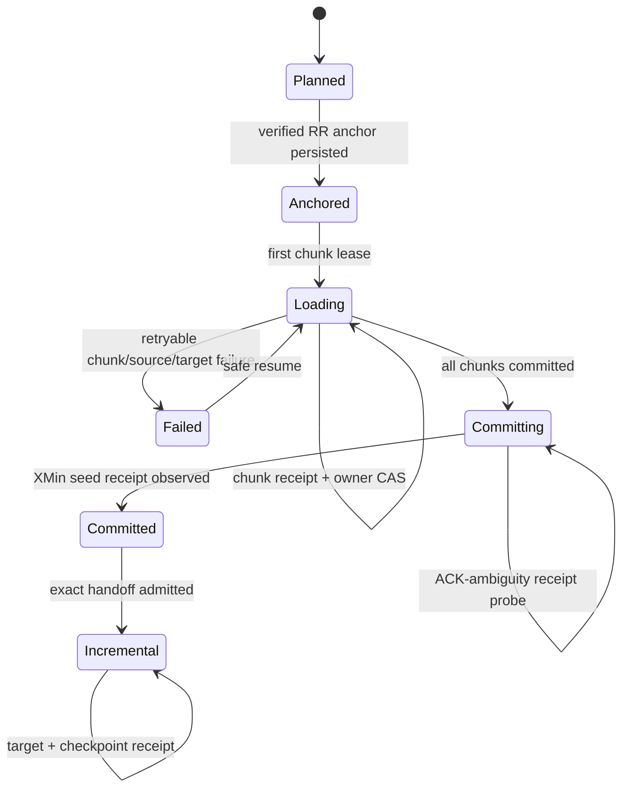

# Feature design: resumable PostgreSQL XMin initial-to-incremental handoff v1

- Status: APPROVED
- Owner: dpone maintainers
- Issue: production follow-up for a large PostgreSQL table in consumer MR !886
- Target release: 0.74.13
Last verified: 2026-08-21
Approval: the maintainer explicitly requested two separate, production-grade
`initial` and `incremental` modes, with a chunked/batched initial load and no
one-off workaround, on 2026-08-21.

## Executive summary

Large PostgreSQL relations must not restart a monolithic baseline after a late
failure, and an operator must not manually invent an XMin checkpoint after a
historical load. dpone will expose an explicit two-phase XMin lifecycle:

1. `initial` runs the existing durable, range-chunked backfill engine. Each
   chunk is a complete bounded PostgreSQL snapshot and an independently
   receipt-backed MSSQL upsert. Before the first chunk, dpone records a real
   PostgreSQL XMin anchor in the durable campaign ledger.
2. after every chunk is committed, dpone atomically seeds the target-scoped
   XMin checkpoint from that recorded anchor and writes an immutable handoff
   receipt;
3. `incremental` refuses to read source data until that exact handoff exists,
   then uses the existing same-snapshot XMin delta plus complete-key image.

This is a framework capability, not CRM-specific logic. It reuses the existing
backfill ledger, portable range scopes, generic MSSQL per-chunk transaction
receipts, XMin state CAS, complete-key delete reconciliation, signed database
and source identities, and target-wide MSSQL mutation fence.

The safety principle is deliberate overlap: the initial anchor is captured
*before* any historical chunk. The first incremental run starts from that old
anchor, so inserts and updates concurrent with initial loading are replayed.
The complete-key image then reconciles physical deletes. Duplicate delivery is
absorbed by key-based changed-row DML; data loss is not accepted.

## Personas and customer journey

| Persona | Goal | Current pain | Success signal |
|---|---|---|---|
| Data engineer | Bootstrap a multi-million-row relation without restart-from-zero | Current XMin baseline is one large attempt | A failed middle chunk resumes without reloading committed chunks |
| Operator | Know when the scheduled incremental route is safe to enable | Manual checkpoint seeding is ambiguous and unsafe | `incremental` is blocked until one exact handoff receipt exists |
| Platform engineer | Reuse one state/credential topology across environments | Separate ad-hoc scripts drift from runtime contracts | One manifest contract, one composition root and exact external catalogs |
| DBA | Bound source and target load | One unbounded query or target transaction can dominate resources | Configured range chunks, bounded workers, target-finalization serialization |

Journey: choose an indexed immutable chunk column -> provision the existing
generic and XMin external state catalogs in one state database -> validate both
manifests -> run the manual `initial` pipeline -> inspect campaign and handoff
evidence -> enable/schedule `incremental` -> retry failures without editing
state -> use a new handoff ID only for an explicitly reviewed re-bootstrap.

## Scope

### In scope

- PostgreSQL source, MSSQL target, XMin plus complete-key reconciliation.
- Explicit public `initial` and `incremental` modes plus backward-compatible
  internal `auto` behavior when the block is absent.
- Deterministic range chunks over `integer`, `date`, `timestamp`, or UUID
  primary-key buckets.
- Durable anchor, chunk progress, handoff status and handoff receipt.
- Internal sequential or bounded parallel chunk workers.
- Target-atomic XMin seed and fail-closed incremental admission.
- Two separate pipeline manifests sharing one handoff identity.

### Non-goals

- Fabricating a checkpoint from target timestamps or operator input.
- Treating a raw SQL predicate as a cross-dialect scope.
- Airflow Dynamic Task Mapping for `initial` v1; internal backfill parallelism is
  supported, while mapped handoff finalization needs a later group-finalizer
  contract.
- Logical-decoding CDC, WAL-slot management, or historical change versions.
- Automatic choice of chunk column or mutable source bounds. UUID buckets are
  the closed exception: they cover the complete immutable 128-bit domain.
- Destructive target truncate/swap during initial loading.

### Assumptions and constraints

- The chunk column is indexed and its declared bounds cover the intended
  relation. Adjacent portable ranges are deterministic and non-overlapping.
- UUID chunking uses `kind: uuid` plus a bounded `buckets` count; it never uses
  a source snapshot's transient UUID `min`/`max` as coverage authority.
- Business identity is an exact, non-null `unique_key` accepted by MSSQL native
  staging.
- Generic MSSQL transaction state and XMin state are separate exact catalogs,
  but may live in the same database and use the same physical connection.
- XMin history is finite. Final handoff fails if the captured anchor is no
  longer above the source freeze horizon.

## Public contract

### Manifest/schema

The source option is public and closed:

```yaml
source:
  type: postgres
  options:
    incremental_strategy: xmin
    xmin_execution:
      mode: initial          # initial | incremental
      handoff_id: crm_archive_reg_important_entity_change_log_v1
```

Rules:

- absent `xmin_execution` is equivalent to `mode: auto` and preserves 0.74.12
  behavior byte-for-byte;
- `initial` requires `sink.strategy.mode: backfill`, a non-empty
  `backfill.chunk`, `backfill.state.backend: audit_schema`, an MSSQL
  `backfill.state.require_distributed_lock: true`, a non-empty `unique_key`,
  an MSSQL `target_atomic`/`external` state, and no Airflow mapping selection;
- `initial` chunks use the configured `backfill.inner_mode`, which must be
  `incremental_merge` in v1;
- `incremental` requires `sink.strategy.mode: incremental_merge`, XMin,
  `reconciliation.mode: key_snapshot`, and the same non-empty `handoff_id`;
- `auto` rejects `handoff_id`, preserving the existing self-contained XMin
  baseline/incremental lifecycle;
- unknown keys and ambiguous combinations fail at manifest validation.

An `initial` and `incremental` manifest may have different process IDs. Their
checkpoint owner is canonicalized to `xmin-handoff:<handoff_id>`; environment,
signed source relation, physical target identity, unique key, schema hash and
scope hash remain in `SourceStateKey`. Therefore a handoff ID cannot move state
to another source, schema, key or target.

### CLI and Python API

No new imperative checkpoint command is added. Existing `dpone check`,
`dpone run`, `dpone backfill status`, `retry-failed`, and `cancel` commands
project the contract. `dpone run --format json` adds an `xmin_handoff` section.

Public Python models live in `dpone.contracts.postgres_xmin_execution`:

```python
class PostgresXminExecutionMode(StrEnum):
    AUTO = "auto"
    INITIAL = "initial"
    INCREMENTAL = "incremental"

@dataclass(frozen=True, slots=True)
class PostgresXminExecutionPolicy:
    mode: PostgresXminExecutionMode
    handoff_id: str | None
```

Stable typed failures include:

- `postgres_xmin_handoff.initial_contract_invalid`;
- `postgres_xmin_handoff.incremental_contract_invalid`;
- `postgres_xmin_handoff.anchor_missing`;
- `postgres_xmin_handoff.state_already_initialized`;
- `postgres_xmin_handoff.not_committed`;
- `postgres_xmin_handoff.identity_changed`;
- `postgres_xmin_handoff.anchor_too_old`;
- `postgres_xmin_handoff.commit_outcome_unknown`.

### Artifacts and evidence

The backfill ledger gains an optional `xmin_handoff` object:

```json
{
  "contract_version": "postgres_xmin_initial_handoff_v1",
  "handoff_id": "...",
  "status": "anchored|committing|committed",
  "anchor_xmin": 123,
  "snapshot_token": "sha256:...",
  "state_key_sha256": "...",
  "source_authority_sha256": "...",
  "plan_hash": "...",
  "seed_load_id": "...",
  "receipt_id": null,
  "candidate_revision": null
}
```

The SQL audit-schema journal remains append-only and authoritative. The final
JSON result contains bounded fields only: status, handoff ID, anchor XMin,
committed chunk count, state-key digest, receipt ID and candidate revision.
Credentials, row values and rendered predicates are never logged.

### Compatibility and migration

Old manifests and ledgers without `xmin_handoff` retain current behavior. The
ledger extension is optional and keeps schema version 2 because readers already
ignore additive JSON fields and no existing field changes meaning. A handoff
policy may not attach to an already-started ledger: config/plan hashes include
the policy and force a new reviewed `backfill_id`.

No state-table DDL change is required. Initial chunks use the generic four-table
catalog; the handoff and subsequent incremental route use the existing six
XMin objects. Operators provision both exact catalogs in the same state
database, without creating another credential.

## Detailed algorithm

1. Parse and validate the closed execution policy before connector I/O.
2. Normalize the backfill plan and bind `handoff_id` into config and plan
   hashes. The existing deterministic run key then detects a conflicting old
   campaign rather than silently creating parallel state.
3. Under the backfill initialization lock, create/load the campaign ledger.
4. If no anchor exists, open one branded PostgreSQL repeatable-read transaction,
   verify signed cluster/database/principal/relation authority, acquire the
   relation `AccessShareLock`, resolve the exact projected schema and target
   identity, compute `SourceStateKey`, read snapshot XMin/visible horizon and
   persist the anchor before releasing the snapshot.
5. Reject any pre-existing active XMin state for that key, except the exact
   idempotent seed receipt of this campaign.
6. Execute pending range chunks through the existing backfill engine. Each
   source range is rendered independently for PostgreSQL and MSSQL from one
   portable AST. Each chunk commits its target DML and generic receipt before
   its ledger owner-CAS becomes `success`.
7. Do not seed XMin while any chunk is pending, running or failed.
8. Re-open a branded PostgreSQL RR boundary; re-verify the same signed relation,
   schema/scope/state-key identity and confirm the recorded anchor is still
   replayable above the freeze horizon.
9. Begin an MSSQL SERIALIZABLE transaction, acquire the canonical physical
   target applock, re-verify target and state database authorities plus target
   registry binding, assert no conflicting XMin target owner, and CAS absent
   state to the recorded anchor with deterministic `seed_load_id` and original
   snapshot token.
10. Commit. On ACK ambiguity, close the session and probe the deterministic
    receipt; only an exact receipt is success.
11. Mark ledger handoff `committed` only after the receipt is observed.
12. `incremental` recomputes the same state key and requires the handoff receipt
    before opening its source RR snapshot. It then runs the existing XMin delta
    and complete-key reconciliation from the old anchor. Target DML, new XMin
    checkpoint and receipt commit atomically.

### Pseudocode

```text
run_initial(config):
  policy = require_initial_policy(config)
  ledger = load_or_create_exact_campaign(config, policy)
  under initialization_lock:
    if ledger.handoff absent:
      anchor = source.capture_verified_rr_anchor(config, checkpoint_owner(policy))
      require state.load(anchor.key) is absent
      ledger = store.append_anchor(ledger, anchor)
  chunks = select_non_committed_chunks(ledger)
  run_chunks_with_owner_leases_and_receipts(chunks)
  require all chunks committed
  proof = source.revalidate_anchor_and_identity(ledger.anchor)
  receipt = target.atomic_seed_xmin_if_absent(proof, deterministic_seed_load_id)
  store.mark_handoff_committed_if_receipt_matches(receipt)
  return exact_campaign_and_handoff_evidence

run_incremental(config):
  policy = require_incremental_policy(config)
  key = derive_verified_state_key(config, checkpoint_owner(policy))
  require exact committed_handoff_receipt(key, policy.handoff_id)
  return existing_xmin_key_snapshot_run(config, key)
```

### State machine



### Edge cases and failure semantics

- Empty planned range is invalid; a valid range producing zero rows still
  commits chunk and handoff evidence.
- Null/duplicate/padded keys fail in native MSSQL staging before business DML.
- A process crash after a chunk target commit but before ledger CAS reuses its
  generic receipt and repairs only the ledger transition.
- A crash after XMin seed commit probes the seed receipt and never advances to
  a newer anchor.
- Concurrent initial campaigns with the same handoff ID share run/state
  identities; exact locks admit one and reject incompatible hashes.
- Source table/schema/database/principal/timeline or physical target changes
  fail before further source reads or handoff mutation.
- Schema drift changes the state-key hash and is not silently adopted.
- Rows inserted/updated after the anchor are intentionally replayed by first
  incremental. Deletes are reconciled by its complete-key image.
- If the anchor ages below freeze horizon, no checkpoint is seeded; the
  operator starts a new campaign. Committed chunks are not falsely certified as
  a usable incremental baseline.
- Cancellation leaves anchor and successful chunks as evidence, but no handoff.

## Architecture

### Components and responsibilities

| Component | Existing/new | Responsibility | Dependencies |
|---|---|---|---|
| `PostgresXminExecutionPolicy` | new | parse/validate public mode and handoff ID | contracts only |
| backfill planner/ledger | existing + additive field | deterministic chunks and durable anchor/handoff state | portable scope, state port |
| `PostgresXminHandoffSource` port | new | capture/revalidate RR anchor and state-key facts | no MSSQL dependency |
| PostgreSQL handoff adapter | new | branded RR, signed identity, anchor/freeze checks | existing XMin/source authority services |
| `XminHandoffCommitPort` | new | target-atomic seed/probe | contracts only |
| MSSQL handoff adapter | new | target fence, identity, state CAS and receipt probe | existing MSSQL XMin storage |
| backfill orchestrator hook | additive | order anchor -> chunks -> handoff | injected ports |
| incremental admission guard | additive | require exact committed handoff before source I/O | XMin storage/receipt reader |
| bootstrap composition | additive | build generic chunk state plus XMin handoff state from one resolved connection | factories only |

Dependencies point from runtime orchestration to capability ports and from
connector adapters to contracts. No source adapter imports an MSSQL adapter.
The default runtime hydrator is the sole production composition root.

### Alternatives and tradeoffs

| Alternative | Advantages | Disadvantages | Decision |
|---|---|---|---|
| One giant same-snapshot baseline | Simplest atomic model | no mid-run resume; source and target resources held for full table | retain only as `auto` compatibility path |
| Per-chunk XMin checkpoint | easy local progress | advances global cursor before full relation exists; delete reconciliation can escape chunk | reject |
| Seed current XMin after backfill | little replay | loses changes committed while earlier chunks ran | reject |
| Operator SQL checkpoint | fast to ship | unaudited, identity-free and loss-prone | reject |
| PostgreSQL logical CDC slot | complete ordered changes | new source permissions/operations and different product contract | non-goal |
| Anchor-before-backfill plus overlap catch-up | resumable, bounded, no change loss | first incremental may replay a large window; XMin freeze limits duration | adopt |

ADR is not required: this composes two already-approved route capabilities
behind additive contracts and does not change dependency direction or replace a
repository-wide architectural decision.

Quality budget: new contract, source adapter, commit adapter and orchestration
service are each targeted below 250 SLOC; shared facades remain thin; no module
may exceed the normative 400 SLOC hard limit.

## Market comparison

Official primary sources were checked on 2026-08-21.

| System/version | Relevant capability | Observed design | Adopt/reject | Source |
|---|---|---|---|---|
| Airbyte 1.x | resumable database full refresh | orders database reads by primary key, splits into bounded queries, persists checkpoints and accepts at-least-once replay | adopt deterministic chunks/checkpoints; retain stronger target receipts and explicit handoff | [Airbyte engineering](https://airbyte.com/blog/resumable-full-refresh-building-resilient-systems-for-syncing-data) |
| Fivetran hosted | historical then incremental sync | initial historical sync precedes scheduled incremental sync; cursors persist incremental progress | adopt explicit phases; reject opaque managed-only state | [sync overview](https://fivetran.com/docs/core-concepts/syncoverview) |
| dlt current | incremental state | resource/source state is committed atomically with loaded data | adopt data+state atomicity; keep external SQL authority | [advanced state](https://dlthub.com/docs/general-usage/incremental/advanced-state) |
| Informatica May 2025 | combined initial and incremental replication | CDC begins before initial load and transition handles overlapping changes | adopt anchor-before-initial ordering; XMin overlap is the dpone-specific mechanism | [official guide](https://docs.informatica.com/content/dam/source/GUID-3/GUID-3A292783-0D9B-4870-A5F5-71E96057503F/43/en/CMI_May2025_MonitoringDataIngestionAndReplicationJobs_en.pdf) |
| Microsoft SSIS SQL Server 2025 docs | initial load to trickle-feed handoff | separate packages share persistent CDC state; active-source initial load samples change boundaries and handles overlap | adopt explicit persisted handoff and fail-closed states; note SSIS CDC components are deprecated | [CDC flow components](https://learn.microsoft.com/en-us/sql/integration-services/data-flow/cdc-flow-components?view=sql-server-ver17) |
| Apache Beam current | splittable bounded source | restrictions can split, checkpoint and resume while runners schedule residual work | adopt explicit split/progress model; reject runner-dependent identity for target state | [Beam basics](https://beam.apache.org/documentation/basics/) |
| Pentaho | N/A | no selected current official contract matching target-atomic XMin handoff | N/A | capability mismatch |
| gusty | N/A | DAG authoring layer, not database checkpoint authority | N/A | capability layer mismatch |
| Astronomer Cosmos | N/A | dbt/Airflow orchestration layer, not source-to-target replication state | N/A | capability layer mismatch |

## Measurable differentiation

```yaml
axis: failure recovery work and correctness at initial-to-incremental transition
scenario: PostgreSQL->MSSQL, 4.5M rows, 100 integer chunks, failure after chunk 90, concurrent inserts/updates/deletes
baseline: dpone 0.74.12 monolithic XMin baseline
metric: source rows re-read after retry; lost business changes; duplicate active keys; operator state edits; time to first successful incremental
target: <=10% initial ranges re-read; 0 lost changes; 0 duplicate active keys; 0 manual state edits; incremental admitted only after one exact handoff receipt
procedure: vendor-live fault injection after chunk 90, resume, mutate source around anchor, run first incremental, compare exact source/target keys and hashes
artifact: test_artifacts/live_certification/postgres_mssql_xmin_initial_handoff.json
limitations: proves the certified PostgreSQL/MSSQL route and configured retention window, not arbitrary connectors or infinite initial duration
```

## Security, privacy, and operations

No new credential type or secret. Source requires existing relation/catalog XMin
authority; target/state use existing signed database pins and external DDL.
Workers log identifiers, digests, counts and durations only. Operators bound
`parallel_workers`, `max_chunks`, lease TTL and source range. Alerts distinguish
chunk failure, stale anchor, missing handoff and receipt ambiguity. The runbook
forbids direct edits to checkpoint or ledger rows.

## Test and certification plan

| Layer | Scenario | Environment | Expected artifact |
|---|---|---|---|
| Unit | strict mode/handoff parsing and invalid combinations | Python | typed errors, zero I/O |
| Unit | ledger anchor serialization, hash binding and replay | memory/file/SQL fakes | exact additive JSON |
| Unit | anchor before chunk, no seed before all success | orchestrator | ordered events |
| Unit | seed commit/rollback/ACK probe | MSSQL fakes | exact receipt outcome |
| Contract | old manifests/ledgers | JSON Schema + runtime | unchanged `auto` behavior |
| Integration | fail chunk N, resume, seed once | PostgreSQL + MSSQL | chunk receipts + one seed receipt |
| Integration | source/target/schema drift and stale anchor | real vendors | pre-source/pre-seed typed reject |
| Integration | concurrent mutations during initial | real vendors | first incremental exact key/hash parity |
| Performance | 4.5M rows and bounded workers | Airflow DEV profile | phase timings, bounded memory, retry work |
| Compatibility | consumer initial + incremental manifests | pinned wheel | both `dpone check` and DAG acceptance green |

## Documentation plan

Update `docs/postgres-xmin.md`, `docs/state.md`, PostgreSQL-to-MSSQL route
reference, manifest schema descriptions, error index, example manifests,
`CHANGELOG.md`, generated CLI/schema references and an operator runbook covering
enablement, status, resume, handoff, schedule and re-bootstrap.

## Rollout and rollback

1. Release 0.74.13 with `auto` as the compatibility default.
2. Pin provider and runtime together in the consumer and validate two manual
   manifests in DEV.
3. Keep incremental DAG disabled until initial result and handoff receipt pass.
4. Run immediate incremental catch-up and exact source/DEV parity.
5. Promote the same authored contract/registry projection to PROD, run initial
   only if PROD target lacks the baseline, then schedule incremental.
6. Roll back the image on any data/evidence mismatch. A failed pre-seed initial
   leaves no incremental authority; a committed handoff remains valid only for
   its exact state/route identity.

Rollback never deletes a receipt or rewinds XMin automatically. Re-bootstrap
requires a new reviewed handoff/backfill ID and existing repair-authority flow.

## Agent execution plan

One integrator owns the change; no parallel writers are used.

| Role | Owned paths | Read-only paths | Forbidden paths | Dependency |
|---|---|---|---|---|
| `/root` integrator | contracts, backfill handoff services, bootstrap, schemas, tests, docs, changelog | existing XMin/backfill/finalizer implementations | unrelated connectors and release evidence | approved spec |

## Approval checklist

- [x] User problem and CJM are clear.
- [x] Algorithm and failure semantics are implementable without guessing.
- [x] Public contracts and compatibility are explicit.
- [x] Architecture and alternatives are justified.
- [x] Relevant market research uses current official sources.
- [x] Claimed differentiation is measurable.
- [x] Tests, evidence, docs, rollout, and rollback are complete.
- [x] Path ownership and integration plan are conflict-safe.
- [x] Maintainer explicitly authorized the two-mode systemic implementation and status is `APPROVED`.
