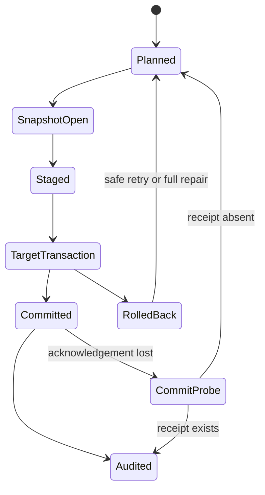

# Feature design: PostgreSQL XMin key reconciliation for MSSQL

- Status: APPROVED
- Owner: dpone maintainers
- Issue: work-item
- Target release: 0.74.9
- Last verified: 2026-08-20

## Approved amendment: least-privilege source identity profiles

Production extraction must not require cluster-control or statistics privileges
when the operator only needs a read-only table replica. The source-authority
contract therefore has two explicit, non-interchangeable profiles:

- version 1 remains the backward-compatible `physical_cluster` profile. It
  verifies the signed PostgreSQL system identifier and timeline in addition to
  topology, database, principals, and relation OIDs. Its existing function
  grants and fail-closed behavior do not change;
- version 2 is the `catalog_identity` profile. It contains no unverified
  system-identifier or timeline fields and never calls `pg_control_system()`,
  `pg_control_checkpoint()`, WAL-file functions, or statistics views. It
  verifies the recovery role, exact database and principal names/OIDs, exact
  schema/relation names/OIDs, and holds the same `ACCESS SHARE` relation lock
  through extraction.

The profile is selected only by the reviewed environment registry. Runtime
does not downgrade version 1 after a permission error, learn physical identity,
or silently ignore a signed field. Switching profiles changes the selected
authority digest and therefore changes the governed route identity. Version 2
accepts the ordinary least-privilege surface: database `CONNECT`, schema
`USAGE`, and relation `SELECT` (including `xmin` where column grants are used).

This is a compatibility-preserving public-contract extension rather than a
retry workaround. Version 1 documents remain valid and retain their stronger
physical-cluster substitution check. Version 2 explicitly trades that extra
check for deployability behind managed read replicas and connection proxies;
the environment-owned connection/TLS controls remain responsible for endpoint
authenticity. Database, principal, and relation recreation still fail closed.

Market check, 2026-08-20: PostgreSQL documents control-data functions as
cluster-wide control-file information, while `pg_is_in_recovery()` is the
ordinary recovery-state query. Fivetran's current query-based XMin setup uses a
dedicated read-only principal with schema/table (and, when restricted, `xmin`)
`SELECT`; it does not require checkpoint-timeline inspection for that mode.
dpone adopts the least-privilege default as an explicit signed profile while
retaining the opt-in physical profile; dlt, Airbyte, Informatica, Pentaho,
SSIS, gusty, Astronomer Cosmos, and Apache Beam are N/A for this narrow
physical-identity contract because their cited public surface does not define
an equivalent signed per-relation timeline authority.

Primary sources:

- <https://www.postgresql.org/docs/current/functions-info.html#FUNCTIONS-INFO-CONTROL>
- <https://www.postgresql.org/docs/current/functions-admin.html#FUNCTIONS-RECOVERY-CONTROL>
- <https://fivetran.com/docs/connectors/databases/postgresql>

## Executive summary

PostgreSQL XMin captures inserts and updates but not physical deletes. Add a
portable, fail-closed contract that extracts the XMin delta and a complete key
snapshot from one PostgreSQL MVCC snapshot, then applies both to MSSQL together
with the source checkpoint in one target transaction. The measurable outcome is
zero active-key drift, deterministic replay, and no checkpoint-ahead-of-data
failure mode for PostgreSQL-to-MSSQL current-state replication.

This is a reusable dpone capability rather than an sample-metrics adapter: source
snapshot identity, delete modes, state location, transaction ordering, metrics,
and recovery are connector contracts shared by future workloads.

## Personas and customer journey

| Persona | Goal | Current pain | Success signal |
|---|---|---|---|
| Data engineer | Configure delete-aware XMin replication declaratively | XMin omits deletes and legacy reconciliation silently skips MSSQL | Valid manifest, deterministic baseline and incremental runs |
| Data architect | Prove target/state consistency | Target and checkpoint commit on separate connections | One receipt proves target plus checkpoint commit |
| Operator | Diagnose and safely retry failures | Ambiguous partial commits and missing delete metrics | Typed outcomes, exact counters, replay-safe recovery |
| Consumer | Query active or deleted rows predictably | Delete markers vary by tool and route | Canonical timestamp/flag modes and documented filters |

Journey: declare source, target, unique key, key-snapshot reconciliation, and a
logical state connection; pass readiness; run a full baseline; observe exact
action metrics and state receipt; retry safely after failure; promote the same
manifest with environment-owned target/state coordinates.

## Scope

### In scope

- PostgreSQL XMin delta plus complete primary-key snapshot from one
  `REPEATABLE READ READ ONLY` snapshot.
- MSSQL staged set-based upsert, reactivation, missing-key delete policy, exact
  metrics, and atomic XMin checkpoint.
- `timestamp_only`, `timestamp_and_flag`, and `flag_only`; default
  `timestamp_only`.
- Typed MSSQL state location inherited from a logical connection, collision-safe
  state identity, CAS, and commit receipts.
- Immutable one-shot repair/delete-guard authority selected only at runtime and
  consumed with the matching commit receipt.
- Deployment-signed PostgreSQL source authority verified on the extraction
  snapshot: least-privilege catalog identity or opt-in physical
  cluster/timeline identity.
- Lossless PostgreSQL-to-MSSQL character bulk wire and route validation.

### Non-goals

- Reconstructing rows deleted before the first baseline.
- Source delete event time or delete history; the timestamp is detection time
  for the current deletion state.
- Distributed transactions across different SQL Server instances.
- Replacing PostgreSQL WAL CDC.
- Automatic production compression rebuilds.
- Runtime discovery, self-learning, or implicit rotation of target, staging, or
  state database identities.
- Runtime discovery, self-learning, or endpoint-based identity for PostgreSQL
  source authority.

### Assumptions and constraints

- Reconciliation requires a complete, validated key snapshot and non-null unique
  key.
- `target_atomic` requires target and state on the same SQL Server instance and
  one principal with direct rights in both databases.
- Key snapshots and XMin deltas use one scope and snapshot token.
- Existing boolean `reconciliation: true` remains a deprecated compatibility
  alias only where its backend is actually supported; it never silently enables
  this contract.

## Public contract

### CLI

`dpone check` validates route support, unique keys, state location, delete mode,
and conflicting legacy reconciliation. Unsupported state atomicity exits
non-zero with a stable diagnostic code. Normal execution keeps existing CLI
entrypoints and emits the new metrics in JSON evidence. Exceptional runs select
one environment-owned approval with `dpone run --repair-authority-ref ID` (or
`DPONE_REPAIR_AUTHORITY_REF`); workload manifests cannot grant this permission.

### Python API

Add immutable contracts for `IncrementalSnapshotEnvelope`, `KeySnapshotReceipt`,
`SourceStateKey`, `MssqlStateLocation`, delete-mode policy, and commit outcome.
Ports expose staged finalization with a candidate checkpoint; connector adapters
do not choose policy.

### Manifest/schema

```yaml
reconciliation:
  enabled: true
  mode: key_snapshot
  cadence: every_run
  consistency: same_source_snapshot
  delete_policy: soft_delete
  empty_snapshot: {policy: fail}
  guards: {max_delete_ratio: 0.05, max_delete_rows: 100000}
state:
  type: mssql
  connection_ref: logical_state
  atomicity: target_atomic
  table: {name: dpone_source_state}
  run_table: {name: dpone_run_state}
  receipt_table: {name: dpone_commit_receipt}
  repair_authority_table: {name: dpone_repair_authority}
  repair_consumption_table: {name: dpone_repair_authority_consumption}
```

State database/schema default to registry-owned connection metadata; explicit
coordinates are allowed only by the typed schema and have deterministic
precedence with conflict evidence. `run_table.name` is canonical; legacy
`run_name` is accepted with deprecation and cannot be combined with `name`.

Every governed MSSQL connection also owns a finite, closed
`database_authorities` map. The key is the canonical SQL Server database name;
case-only route aliases may resolve to that key, but the live catalog must return
the authored spelling exactly. The value has exactly three fields:

```yaml
connection:
  database: DWH
  database_authorities:
    DWH:
      database_id: 7
      create_token: "2026-08-16T09:14:22.1233333"
      database_guid: 01234567-89ab-cdef-0123-456789abcdef
    DWH_Stage:
      database_id: 8
      create_token: "2026-08-16T09:15:01.1000000"
      database_guid: 89abcdef-0123-4567-89ab-cdef01234567
```

The target connection must pin both target and every independently configured
staging database; the state connection must pin its state database. A strict
route validates target, staging, then state against `master.sys.databases` and
`master.sys.database_recovery_status`, requires `ONLINE`, `MULTI_USER`,
`HAS_DBACCESS=1`, and then proves the target/state sessions have the same SQL
Server topology and effective principal. Generic four-object and XMin six-object
state adapters share this pre-source verifier and reject unbound direct/legacy
construction.

The early master-catalog proof is not a staging use lease. For every staging
artifact, runtime opens a separate connector whose current database is the
signed staging database, verifies that session's DBID/name and SQL Server
topology together with the master-visible GUID/create token, and keeps the
session alive from staging CREATE through BCP, native normalization, final
evidence, and cleanup. Every staging boundary checks the lease before and after
its action. An ordinary same-name DROP/CREATE therefore cannot substitute a
different database during a long PostgreSQL extraction; forced session eviction
is a typed staging-authority failure and never becomes authority for the new
database.

Generic catalog v2 retains the v1 `attempt_key` formula (invocation plus physical
target identity) for row compatibility and adds an exact UNIQUE constraint on
`invocation_digest`. SERIALIZABLE allocation locks and queries that scheduler
identity first. A retry after database recreation or approved pin rotation
therefore finds the existing row and rejects target/fingerprint drift instead
of allocating a second attempt. Legitimate multi-target work uses distinct task
partitions.

The v1-to-v2 migration is explicit external DDL. The canonical renderer proves
the exact v1 four-table/trigger/column/index contract under a transaction-owned
application lock, aborts without mutation when historical invocation digests
are duplicated, adds the named unique constraint, and proves v2 before commit.
An exact v2 rerun is idempotent. Operators must repair ambiguous historical
rows and start a new scheduler invocation; runtime neither auto-migrates nor
selects a winner.

The PostgreSQL source connection owns one closed
`postgres_source_authority` document: version, system identifier, timeline,
topology role, canonical database name/OID, effective and session principal
name/OIDs, and a finite relation map keyed by exact canonical
`schema.relation`. Route authoring may use an ASCII-case alias only when one
catalog lookup resolves it unambiguously to the pinned OIDs. Unicode aliases,
duplicate ASCII folds, extra fields, missing pins, and learned current-state
defaults are rejected during registry/admission validation.

The invocation identity binds the versioned digest of the selected signed
cluster/database/principals/relation authority and the matching observed
canonical identity. It deliberately excludes unrelated relation pins,
configured connection aliases, and endpoint address/port. Adding a pin for
another table therefore does not invalidate a safe retry, while source restore,
promotion, principal change, or relation recreation does.

Receipt replay remains source-free. Only after a new operation is admitted does
runtime open one branded PostgreSQL `REPEATABLE READ READ ONLY` boundary,
verify the signed identity, lock the canonical relation in `ACCESS SHARE`, and
re-read its OID under that lock. Schema projection and extraction consume the
same boundary and cached projection; failure before or after planning aborts it
deterministically. This prevents schema planning from trusting an unverified
relation and prevents DROP/rename/recreate substitution between planning and
`COPY`.

Soft delete modes are canonical and reserve dpone column names:

- `timestamp_only`: nullable UTC `__dpone__deleted_at`;
- `timestamp_and_flag`: timestamp plus persisted computed
  `__dpone__is_deleted` derived from the timestamp;
- `flag_only`: stored non-null boolean flag.

### Artifacts and evidence

The envelope records snapshot token, scope hash, candidate checkpoint, key row
count, checksum, completeness, and cleanup handle. Load evidence adds disjoint
`inserted`, `updated`, `reactivated`, `unchanged`, `soft_deleted`, `hard_deleted`,
`active`, `total`, and `staging` counts plus a commit receipt identifier.
Approved exceptional runs also emit the authority ID and digest; the state
database retains the unique receipt-bound consumption row.

### Compatibility and migration

Old manifests without key reconciliation keep their current behavior. Existing
legacy MSSQL XMin state keyed only by source schema/table is not auto-adopted:
unambiguous rows require an explicit migration; ambiguous rows fail closed and
require a baseline. Current unsupported PostgreSQL-to-MSSQL configurations fail
during planning instead of at BCP or after extraction.

Delete-guard overrides and repair baselines never use a manifest boolean. The
environment owner inserts an immutable, expiring authority bound to
`state_key`, `scope_hash`, and either an absent checkpoint or exact
`(xmin, revision)`. Its `allow` block independently bounds `full_baseline`,
`max_delete_rows`, and `max_delete_ratio`. Reuse, expiry, digest drift, binding
drift, or an unused authority fails closed.

Existing target-atomic MSSQL routes must migrate their deployment-owned
connection registry before rollout: discover exact target/staging/state pins,
review the registry diff, run `dpone check --connections`, and publish the new
signed registry artifact. Runtime never fills a missing pin from the currently
reachable database. A restore, recreate, failover to a different physical
database, or intentional state relocation is an explicit rotation. Rotation
changes the role-bound authority SHA-256 included in the invocation route
fingerprint and receipt identity, so an old invocation cannot replay a receipt
under new database authority.

The runtime principal needs database `CONNECT`, its normal schema/object rights,
and the exact server metadata grant `VIEW ANY DATABASE`. SQL Server 2022 vendor
verification proves that `VIEW SERVER STATE` is not required. Dpone checks
`HAS_PERMS_BY_NAME(NULL, NULL, 'VIEW ANY DATABASE')` before interpreting
catalog rows; a denied or invisible grant is a stable
`mssql_transaction.<role>_database_metadata_permission_denied`, not a reason to
weaken the pin. Database/schema creation and generic/XMin state DDL remain
separate reviewed provisioning steps and are not granted to runtime.

When schema, PK, or scope drift creates a new state key for the same physical
target, the authority may additionally carry an all-or-none transfer binding:
the old active `state_key`, XMin, and revision. A transfer is valid only for an
absent new checkpoint with `allow.full_baseline=true`. It preserves the old
state/receipt history as superseded instead of deleting or mutating identity.
The source-state DDL stores `target_identity binary(32)` and enforces one active
owner with a unique filtered index on that binary key where
`superseded_at_utc IS NULL`. The key comes from an immutable target-local
registry whose name columns use `COLLATE DATABASE_DEFAULT`; raw target
coordinates never participate in authority equality.
Catalog preflight preserves exact identifier spelling and rejects
casefold-equivalent decoys. The source envelope freezes the canonical target
coordinates; the finalizer rejects route drift before staging and derives all
target mutation coordinates from that frozen envelope.

## Detailed algorithm

1. Parse the signed finite database pin sets. Open bounded `master` sessions,
   verify target, staging, then state canonical name, `database_id`,
   `create_token`, `database_guid`, ONLINE/MULTI_USER/access state, and prove the
   target/state connector topology and principal. Bind the resulting role-aware
   digest into invocation/receipt identity. Then verify exact state catalogs and
   resolve the immutable target-local registry binding, all before source I/O.
   At the first staging action, open and retain the signed staging-database
   session lease through that artifact's terminal cleanup, checking it before
   and after CREATE/BCP/native operations.
2. Build a SHA-256 state identity from environment, process, source identity,
   binary physical-target identity, unique-key contract, scope/schema hashes,
   and contract version. Raw target aliases are diagnostic only.
3. If the invocation selects a repair authority, read-only preview its immutable
   bindings. Only `allow.full_baseline=true` selects a full payload; a
   delete-guard-only authority stays incremental. Admission is repeated under
   the target transaction lock to close the preview-to-commit race.
4. After receipt probing and new-operation admission, open PostgreSQL
   `REPEATABLE READ READ ONLY`. Verify the selected signed cluster, current
   timeline, topology, database/principal OIDs, and exact relation OIDs; acquire
   `ACCESS SHARE` on the safely quoted canonical relation and re-read its OID
   under the lock. Cache the source schema projection on this same boundary.
   Then capture two different horizons: safe checkpoint
   `U = txid_snapshot_xmin(snapshot)` and visible horizon
   `H = txid_snapshot_xmax(snapshot)`. When workers are used, export that exact
   snapshot.
5. Extract the delta `[previous, H)` and complete scoped key set from that same
   snapshot, but persist only `U`. Rows with XIDs in `[U,H)` are visible and must
   be loaded now for key parity; they can be replayed next run because an older
   transaction keeps `U` conservative. The envelope publishes `visible_horizon`,
   `safe_checkpoint`, and `replay_amplification_xids = H-U`. Baseline emits full
   rows and keys in one pass; incremental performs at most two scans and no exact
   pre-count scan.
6. Fully materialize delta and key staging; validate receipts, checksum,
   completeness, nulls, and duplicates before target mutation.
7. On one MSSQL connection set `XACT_ABORT ON`, begin `SERIALIZABLE`, acquire a
   transaction-owned application lock, and capture one UTC detection timestamp.
8. Before business DML, compute the missing-key population. A non-empty target
   with missing/new state requires `allow.full_baseline`; a delete-guard
   exceedance requires actual rows and ratio to fit the authority bounds. Admit
   the authority before checking target ownership. If it contains a transfer,
   verify exactly one active old owner with its exact XMin/revision and mark it
   superseded by the new state key; otherwise require no competing active owner.
9. Update only changed hashes, reactivate deleted matches, insert absent keys,
   then apply the selected missing-key policy by anti-join against active target
   keys. Use `OUTPUT` for exact action counts; do not use SQL Server `MERGE`.
10. Validate both active-key differences and metric invariants. Guard or reverse
   drift rolls back and marks full repair required.
11. CAS the candidate checkpoint by `(state_key, previous_xmin,
   previous_revision)`, increment its monotonic revision, and insert a receipt
   containing both revisions through a three-part state name on the same
   connection; commit once. Revision is authoritative for staleness when two
   source snapshots have the same safe XMin.
12. When authority was used, insert unique consumption evidence bound to the
    exact state key, load ID, and commit receipt. Then commit once. No repair
    path truncates the target, so existing tombstones are retained. The old
    source-state row remains retained as superseded and its receipts remain
    immutable history; transfer,
    baseline DML, new CAS/receipt, and consumption roll back together.
13. On acknowledgement loss, query the receipt before retry. Pre-commit errors
    roll back target and state. Post-commit cleanup/audit errors retain a typed
    committed outcome and are repaired without replaying business DML.

### Pseudocode

```text
with postgres.repeatable_read_only() as snapshot:
    safe_checkpoint = snapshot.xmin()
    visible_horizon = snapshot.xmax()
    delta, keys = snapshot.extract(previous, visible_horizon, scope)
validate_complete(delta, keys)
stage(delta, keys)
with mssql.serializable_transaction(applock=target_identity) as tx:
    validate_staging(tx)
    repair = admit_exact_authority_if_required(tx, invocation.repair_authority_ref)
    assert_or_transfer_target_authority(tx, repair, new_state_key)
    actions = apply_changed_insert_reactivate(tx, delta_stage)
    actions += reconcile_missing_active_keys(tx, key_stage, delete_mode)
    assert_bidirectional_key_parity(tx)
    compare_and_set_checkpoint(
        tx,
        expected=(previous.xmin, previous.revision),
        candidate=(safe_checkpoint, previous.revision + 1),
    )
    insert_commit_receipt(tx, load_id)
    consume_authority(tx, repair, load_id, commit_receipt)
```

### State machine



### Edge cases

- Empty snapshots default to fail, including a complete empty baseline against
  an empty target. A real truncate/all-delete requires an exact one-shot
  authority whose explicit row and ratio bounds cover the observed active-key
  population and `missing_ratio = 1`. An empty-target baseline instead requires
  `allow.full_baseline=true`; it never receives an implicit safe-empty bypass.
- Null/duplicate keys, partial files, checksum mismatch, scope mismatch, XID
  epoch change, freeze uncertainty, or guard breach cause no target mutation.
- Repeated absence preserves the first detection timestamp in the current
  deleted state; reappearance clears it; later absence creates a new timestamp.
- Identical rows are strict no-ops and keep lineage timestamps unchanged.
- Concurrent runs serialize; stale CAS cannot regress or skip a checkpoint,
  including two snapshots with equal XMin and different state revisions.
- An identity-change baseline without an exact transfer conflicts with the old
  active owner. Missing/multiple owners, checkpoint mismatch, reuse, or an
  unnecessary transfer rolls back. After a successful transfer, old-key loads
  ignore the superseded checkpoint and fail target ownership if they race later.

## Architecture

| Component | Existing/new | Responsibility | Dependencies |
|---|---|---|---|
| PostgreSQL snapshot extractor | extended | Delta and complete keys under one snapshot | PostgreSQL connector, artifact writers |
| Snapshot envelope contracts | new | Typed payload, keys, checkpoint, receipts | contracts only |
| Reconciliation policy | new | Validation, guards, delete-mode decisions | contracts/config |
| MSSQL staged finalizer | extended | Set classification, mutations, metrics, transaction | MSSQL connector |
| State transaction port | new | Location, CAS, receipt on caller transaction | state contracts |
| Runtime composition | extended | Resolve capabilities and inject ports | connection resolver |

Dependency direction is contracts/ports → application/runtime policy → vendor
adapters. Manifest builders normalize configuration but do not execute I/O.

### Alternatives and tradeoffs

| Alternative | Advantages | Disadvantages | Decision |
|---|---|---|---|
| PostgreSQL WAL CDC | Native delete events | Requires replication slot and different operations | Non-goal for this route |
| Full refresh | Simple convergence | Rewrites all data and loses tombstone timing | Fallback only |
| Column cursor | Familiar | No trustworthy sample-metrics watermark; equal/late values lose rows | Reject |
| BigQuery previous/current snapshots | Existing code | Wrong backend and horizon; not target atomic | Reject |
| Target-local current key stage | Native types, set-based, atomic | Full key scan per run | Adopt |

An ADR is required because state authority and transaction ownership change
across connector boundaries. New modules stay below the repository's 400-SLOC
hard budget and split contracts, policy, and MSSQL/PostgreSQL adapters.

## Market comparison

Facts below were rechecked against official sources on 2026-08-15.

| System | Observed design | Adopt/reject | Source |
|---|---|---|---|
| dlt | Staged atomic delete-insert/upsert; source-provided delete hints | Adopt staging/atomicity, reject requirement for source delete marker | [dlt merge loading](https://dlthub.com/docs/general-usage/merge-loading) |
| Informatica | Replication tasks can apply source deletes as soft deletes | Adopt explicit policy; source mechanism differs | [Informatica May 2025 guide](https://docs.informatica.com/content/dam/source/GUID-8/GUID-8535A30D-8159-4EBF-A441-BC2DEBD62457/38/en/CMI_May2025_ApplicationIngestionAndReplication_en.pdf) |
| Airbyte | CDC exposes `_ab_cdc_deleted_at` | Adopt timestamp semantics; WAL CDC is not XMin | [Airbyte CDC](https://airbyte.com/tutorials/incremental-change-data-capture-cdc-replication) |
| Fivetran | Soft delete flag; XMin cannot capture deletes; resync can infer them | Adopt explicit marker and complete-resync inference | [Fivetran features](https://fivetran.com/docs/core-concepts/features) |
| Microsoft SSIS | N/A: workflow/CDC components do not define a portable target soft-delete state contract | N/A | Microsoft product scope |
| Pentaho | N/A: no selected current primary-source contract matching atomic XMin plus key snapshot | N/A | Product scope |
| gusty | N/A: DAG authoring, not replication semantics | N/A | Product scope |
| Astronomer Cosmos | N/A: dbt/Airflow orchestration, not replication semantics | N/A | Product scope |
| Apache Beam | N/A: processing model; sink-specific transaction semantics | N/A | Product scope |

## Measurable differentiation

```yaml
axis: target-and-checkpoint atomicity for XMin delete inference
scenario: PostgreSQL XMin delta plus full keys to two MSSQL databases on one instance
baseline: dpone 0.73.42 separate target/state commits and unsupported MSSQL reconciliation
metric: fault-injection states with target/checkpoint divergence
target: 0 divergent states across every injected pre-commit boundary
procedure: live MSSQL lifecycle plus failure injection and commit-ack loss probe
artifact: test_artifacts/live_certification/postgres_mssql_xmin_reconciliation.json
limitations: not valid across different SQL Server instances
```

## Security, privacy, and operations

Connections use logical references; credentials never enter manifests or
evidence. Preflight verifies direct cross-database permissions and same-instance
identity. Logs redact connection payloads and business values. Operators receive
key counts, checksums, delete guards, receipt identity, and recovery action.
Long-running source snapshots are bounded, never left idle, and cleaned on
cancellation.

PostgreSQL version-2 source verification uses ordinary catalog reads and
`pg_is_in_recovery()` only. Version 1 additionally uses `pg_control_system()`
and the current WAL/checkpoint timeline when the operator explicitly provisions
those grants. No profile uses a cluster-wide `pg_read_all_stats` or `pg_monitor`
grant. Timeline is defense in depth rather than an XMin prerequisite; database,
principal and relation OIDs, recovery role and the relation lock remain exact in
both profiles. The relation
`ACCESS SHARE` lease is held through artifact completion, so ordinary concurrent
DROP or rewrite cannot substitute a same-name relation.

`H-U` is cluster-wide transaction-ID churn, not a route row count. It is always
recorded as amplification evidence. A workload may set an explicit
`source.options.xmin_max_replay_amplification_xids` only after measuring its
cluster; without that option dpone does not impose an arbitrary busy-cluster
threshold. Delta receipt row count and duration remain the route-specific
capacity signals.

Text unique keys use `Latin1_General_100_BIN2` in target and native staging.
Source profiling is disk-backed and rejects null/duplicate values and values
ending in U+0020, because SQL Server pads character equality while PostgreSQL
does not. Case (`A`/`a`) and accents remain distinct. The declared composite
key must fit the 900-byte clustered staging-index limit before source export;
work-item `metric_code nvarchar(450)` is exactly 900 bytes.

## Test and certification plan

| Layer | Scenario | Environment | Expected artifact |
|---|---|---|---|
| Unit | state identity/location, modes, set classification, CAS | Hermetic | pytest results |
| Contract | flow/batch/flat schema and legacy migration | Hermetic | schema tests |
| Integration | snapshot consistency, empty/partial/duplicate keys, retries | Local PG/MSSQL | integration report |
| Source authority | stable identity, OID/database/principal changes, case alias, ACL denial, real standby promotion | Pinned PG primary/standby plus independent PG cluster | Nine exact case observations |
| Live certification | baseline/no-op/change/delete/reactivate/redelete/concurrency/faults | Approved vendor MSSQL+PG | JSON evidence |
| Performance | two-scan ceiling, throughput, metrics accuracy | Approved DEV | benchmark artifact |
| Compatibility | old manifests and state migration | Hermetic | compatibility tests |

The current route-wide test emits `status: passed_partial` and
`release_ready: false`: sequential lifecycle, commit-ack recovery, and one
pre-commit rollback boundary are implemented, while concurrency, source
mutation, permission denial, and the complete per-DML negative matrix remain
mandatory before an exact runtime pin may be called live-certified.

## Documentation plan

Update XMin, load strategies, MSSQL route, lineage/technical columns, state,
manifest reference, integration matrix, and recovery runbook. Add a tutorial for
incremental key reconciliation and explicitly distinguish detection time from
source delete time.

## Rollout and rollback

Ship fail-closed behind route capability negotiation, certify the exact release,
then enable a manual workload baseline. Roll back by disabling the workload and
pinning the previous runtime; do not delete target tombstones or v2 state.
Legacy state remains untouched until an explicit migration succeeds.

## Agent execution plan

| Agent/role | Owned paths | Read-only paths | Forbidden paths | Dependency |
|---|---|---|---|---|
| runtime writer | runtime/contracts and focused tests | schemas/docs/config | shared release files | this spec |
| integrator | schemas/config/factories/docs/release | all | none | runtime writer report |
| reviewer | none | all diff/tests | all writes | integrated head |

The root Codex agent is integrator and shared-file owner.

## Approval checklist

- [x] User problem and CJM are clear.
- [x] Algorithm and failure semantics are implementable without guessing.
- [x] Public contracts and compatibility are explicit.
- [x] Architecture and alternatives are justified.
- [x] Relevant market research uses current official sources.
- [x] Claimed differentiation is measurable.
- [x] Tests, evidence, docs, rollout, and rollback are complete.
- [x] Path ownership and integration plan are conflict-safe.
- [x] Maintainer approval is represented by the explicit request to implement the supplied plan.
