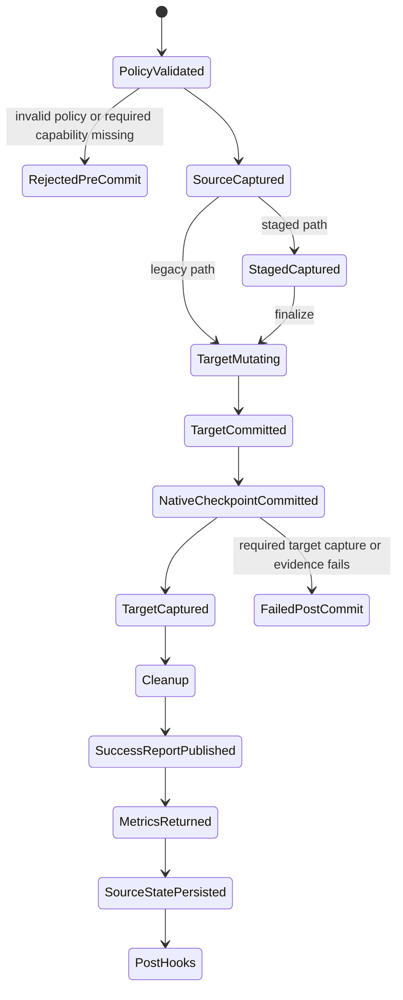

# Feature design: fail-closed quality acceptance across load paths

- Status: APPROVED
- Owner: dpone maintainers
- Issue: global Airflow self-service review for v0.73.1
- Target release: next patch after 0.73.1
Last verified: 2026-07-18

## Executive summary

`quality.acceptance` is documented as a fail-closed runtime evidence contract,
but the current implementation evaluates it only for staged sinks. Legacy sink
loads and native-transfer resume skips can succeed and advance source state
without validating or collecting required acceptance metrics. The public batch
and flow schemas also omit the acceptance object, while the runtime parser
silently normalizes malformed modes, booleans and column selectors.

This bug fix makes one acceptance policy authoritative across staged, legacy
and resume-only load paths. Invalid authoring fails before extraction or target
mutation. `mode: required` fails before mutation when a requested capability is
known to be unavailable and fails before source-state persistence when metric
collection fails. `mode: warn_only` keeps the load available but records an
explicit warning snapshot for every unavailable requested side.

The measurable outcome is zero successful runs or source-state advancement when
a required acceptance side or probe is skipped, unavailable or malformed.

## Personas and customer journey

| Persona | Goal | Current pain | Success signal |
|---|---|---|---|
| Data engineer | Require durable row/null/distinct evidence on every route. | A legacy sink can ignore `mode: required` and still report success. | The same policy and errors apply to staged and legacy routes. |
| Platform engineer | Reject unsafe manifests in CI before runtime side effects. | Schema typos and malformed selectors are accepted and later ignored. | Batch and flow schemas reject malformed acceptance contracts. |
| Operator | Understand whether target data changed before an evidence failure. | Missing failure evidence can make a committed target look like a pre-load failure. | Load-step evidence records the side, phase and commit boundary without row data. |
| Connector author | Add a metric probe without depending on an orchestrator. | Acceptance behavior is coupled to the staged sink coordinator. | A connector-neutral recorder and load-path coordinators consume one probe port. |

Journey:

1. The engineer authors top-level `quality.acceptance`.
2. `dpone check` and manifest compilation validate its complete shape.
3. Runtime validates the same policy before pre-hooks, extraction or sink
   mutation, including direct Python API use that bypasses JSON Schema.
4. The selected load path derives the physically available sides.
5. Required unavailable sides fail before mutation.
6. Source/staged metrics are captured before final target mutation where the
   path supports them; target metrics are captured after a committed load and
   before source-state persistence.
7. Evidence and the result state distinguish pre-commit and post-commit
   failures. Operators use the existing target-commit recovery design for an
   indeterminate or committed-incomplete target; this fix does not claim
   cross-system atomicity.

## Scope

### In scope

- Add one strict `quality.acceptance` contract to both public manifest schemas.
- Apply identical runtime validation to schema and direct-Python execution.
- Preserve one connector-neutral acceptance policy and recorder.
- Cover staged, legacy/non-staged and native resume-only paths.
- Validate requested side availability before a target mutation.
- Capture legacy source/target metrics without inventing a staging object.
- Record safe success, warning and failure evidence.
- Prevent source-state/checkpoint finalization after required acceptance
  collection failure.
- Correct lifecycle documentation and executable examples.
- Add staged, legacy, resume, schema and evidence regressions.

### Non-goals

- A durable target commit journal or target-side idempotency fence.
- Claiming that a post-commit metric failure rolls back target data.
- Replaying a committed target mutation automatically.
- Inventing staged acceptance evidence for a non-staged sink.
- Adding new metric types or connector-specific SQL.
- Changing quality gate semantics.
- Implementing the researched target-commit recovery architecture in
  `docs/feature-design-target-commit-terminal-failures.md`.

### Assumptions and constraints

- The sink exposes one connector-neutral metric probe for `staged` and/or
  `target`; the request identifies the concrete side and dataset.
- A legacy route has no staged dataset. `capture.staged: true` is therefore an
  unavailable requested capability, not an alias for target.
- The default remains source/staged/target capture for staged routes.
- Legacy users who require acceptance must explicitly set
  `capture.staged: false`.
- Native resume skip means the target partition is already represented by a
  committed checkpoint; no new target mutation occurs. Required acceptance is
  still evaluated before the run is reported successful.
- A target metric failure after commit is a post-commit failure. The run fails
  and source state does not advance, but target rollback is not claimed.

## Public contract

### CLI

No command is added. Existing `dpone check`, `dpone run` and structured output
surfaces report validation or runtime failures through their existing exit-code
contract.

Invalid acceptance authoring exits as configuration/validation failure before
runtime side effects. Required missing capabilities use stable safe messages:

```text
source_acceptance_metric_probe_unavailable
staged_acceptance_metric_unavailable
target_acceptance_metric_probe_unavailable
```

Probe execution failures preserve the primary connector-neutral exception and
record only a safe error classification in load-step evidence. SQL, row values,
credentials and absolute secret paths are never copied into evidence.

### Python API

`AcceptanceMetricPolicy.from_load_config(...)` remains the single policy
normalizer. It becomes strict and may raise
`AcceptanceMetricConfigurationError`, a `ValueError` subtype with a stable
`code` and public field path.

`AcceptanceMetricsRecorder` exposes side-oriented operations that do not
require a staged handle for source or target requests. The staged coordinator
and legacy coordinator depend on the recorder; the recorder does not depend on
either coordinator.

No connector API changes. Existing `acceptance_metric_probe.collect(request)`
remains the capability port.

### Manifest/schema

Canonical contract:

```yaml
quality:
  acceptance:
    enabled: true
    mode: required          # warn_only | required
    capture:
      source: true
      staged: false         # true only when the route has a staged dataset
      target: true
    checks:
      row_count: true
      null_counts: [project_id, item_id]
      distinct_counts: business_columns
```

Rules:

- `acceptance` is an object with `additionalProperties: false`.
- `enabled` is required and must be a boolean.
- `mode` is `warn_only` or `required`, defaulting to `warn_only`.
- `capture` accepts only `source`, `staged` and `target`, all booleans.
- `checks` accepts only `row_count`, `null_counts` and `distinct_counts`.
- `row_count` is a boolean and defaults to `true`.
- column checks accept a boolean, `off`, `none`, `all_columns`,
  `business_columns`, `source_and_binary_semantics`, `strict`, or a non-empty
  unique list of non-empty column names.
- An enabled policy must request at least one side and one check.
- Explicit columns absent from the known payload schema fail in required mode;
  warn-only mode records a warning and excludes only the unknown columns.
- A disabled policy is not executed, but its authored shape is still validated.

Previously accepted malformed acceptance objects now fail validation. This is a
fail-closed correction of a documented contract, not a new feature. Correct
manifests remain compatible.

### Artifacts and evidence

Acceptance snapshots retain:

```text
dpone.acceptance.metric_snapshot.v1
dpone.acceptance.run_metrics.v1
```

Each requested side produces exactly one succeeded or warning snapshot in
warn-only mode. Required-mode failure records `load_governance_failed` with:

- `failure_boundary`: `pre_commit`, `post_commit`, or `resume_validation`;
- `acceptance_side`;
- stable error code;
- no row data, SQL or connector exception payload.

When collection succeeds, `load_result.reconciliation_metrics` contains the
merged acceptance snapshots for the physically requested sides. A legacy route
never emits a synthetic `staged` success snapshot.

### Compatibility and migration

- Correct staged acceptance manifests retain behavior.
- Legacy routes with required acceptance and the implicit
  `capture.staged: true` now fail before target mutation. Migrate them by
  setting `capture.staged: false`.
- Acceptance blocks without `enabled` must add `enabled: true` or remove the
  unused block.
- Invalid modes, non-boolean capture values and unknown selector strings no
  longer degrade silently.
- No schema major changes; the patch tightens a previously undocumented hole
  to the already documented public behavior.

## Detailed algorithm

### Fresh-review amendment: canonical evidence and native terminal ordering

The 2026-07-19 fresh review confirmed that the first implementation still
allowed incomplete or connector-controlled snapshots, published a native
success report before resume acceptance, and could downgrade a durable
`COMMITTED` partition to `FAILED` after a secondary report/evidence failure.
This amendment is part of the approved bug contract.

The following invariants are mandatory:

1. Explicit selectors are validated independently against the schema of every
   requested physical side:
   - source uses `extract_result.schema`;
   - staged uses `staged_handle.payload_schema`;
   - target uses the actual target payload schema.
2. A probe response is untrusted input. Runtime rebuilds the persisted snapshot
   from the request and accepts only requested non-negative integer values.
   Boolean values, missing requested keys, negative counts, extra metric keys,
   connector-provided dataset/columns/kind and arbitrary warning text never
   enter evidence.
3. Required mode rejects an incomplete or warning-bearing probe result with
   `<side>_acceptance_metric_snapshot_invalid`. Warn-only mode emits only the
   internal `acceptance_metric_snapshot_invalid` warning.
4. `prepare_before_load()` never writes a successful native report.
5. Native checkpoint persistence and success-report publication are separate
   terminal operations. The checkpoint records target durability; the report
   records successful native transfer acceptance.
6. Once the latest matching partition checkpoint is `COMMITTED`, secondary
   report, runtime-evidence or acceptance-evidence failure must not append or
   overwrite it with `FAILED`.
7. The authoritative JSON report is published last. Temporary files and the
   Markdown companion may exist after a failed publication, but a current-run
   `passed: true` JSON must not.
8. Checkpoint diagnostics contain stable safe error codes only. Raw connector
   exceptions, SQL, paths, credentials and row values are never persisted.
9. These guarantees close retries after a durable partition commit. They do
   not claim process-crash atomicity between target commit and checkpoint
   persistence; that wider window remains governed by proposed ADR 0022.

### Fresh-review amendment: native logical quality scope and truthful failure outcome

The 2026-07-18 global review found two remaining false-evidence paths:

1. native resume/retry quality gates use only the current attempt's
   `extract_result` / `LoadResult`, so a full resume can compare the logical
   source with a synthetic zero target and a partial retry can ignore committed
   skipped partitions;
2. a quality failure after a legacy sink returns success loses the real
   `LoadResult`, and the CLI reports zero rows and zero attempts although the
   target was already mutated.

This amendment is `APPROVED` as part of the same fail-closed bug contract. It
does not add a quality feature or change gate semantics.

#### Native logical scope

For one native transfer attempt define:

```text
P = every planned transfer_partition_id for the logical workload
A = partitions physically active in the current attempt
S = matching COMMITTED partitions selected for skip
R = skipped partitions deliberately reactivated by mixed full_refresh
```

The following invariants are mandatory:

- Gate evaluation uses the logical workload scope, never an unlabelled
  current-attempt counter.
- `source_rows(P)` is the exact sum of active partition rows plus matching
  committed checkpoint rows for `S - R`.
- The projected pre-finalize target is
  `committed_rows(S - R) + staged_rows(A)`.
- After native checkpoint commit, the target count is the sum of matching
  `COMMITTED` checkpoint rows for all `P`.
- Resume-only validation uses matching committed rows for both source and
  target and never calls the sink.
- Mixed `full_refresh` reactivation counts every partition exactly once:
  old rows for `R` are excluded and current staged rows are used.
- A row count is available only when every contributing value is a
  non-negative integer and not a boolean. Missing, stale, string, boolean or
  negative checkpoint/artifact values make the aggregate `None`; runtime never
  coerces them to zero or falls back to an attempt-local count.
- Attempt counters in `LoadResult` retain their current meaning. Logical-scope
  counts belong to quality snapshots/receipt evidence and do not overwrite
  inserted, updated, staged or total rows for the attempt.
- A cross-partition typed hash is unavailable until an explicit aggregate-hash
  contract exists. Runtime must emit `None`, not reuse an attempt hash.
- Evidence contains a stable scope kind, digest and aggregate counts only. It
  records `planned_count`, `active_count`, `skipped_committed_count` and
  `reactivated_count`, but not raw partition identifiers or bounds.

The scope digest is SHA-256 over canonical JSON containing sorted planned,
active, skipped and reactivated partition identities. It is an internal
correlation identity, not a secret and not a replacement for the existing
partition/checkpoint identity.

```text
scope = NativeTransferQualityScope.from_context(native_context)

if resume_only:
    snapshots = scope.resume_snapshots()
elif boundary == pre_commit:
    snapshots = scope.projected_snapshots(staged_rows)
else:
    snapshots = scope.committed_snapshots(checkpoint_store)

run_quality_gates(source=snapshots.source, target=snapshots.target)
```

#### Producer-owned quality receipt

`QualityGateReceipt` is the single typed producer proof:

```text
QualityGateReceipt(
    report,
    boundary,       # pre_commit | post_commit | resume_validation
    scope_summary,  # optional safe logical-scope metadata
)
```

- The staged coordinator produces it before finalization.
- The legacy coordinator produces it after `sink.load` returns success.
- The resume-only coordinator produces it before native success publication.
- `ETLProcessor` trusts only this typed receipt and never a
  `reconciliation_metrics["quality_gates"]` mapping.
- `StagedQualityGateReceipt` and
  `report_from_staged_quality_receipt(...)` remain compatibility aliases /
  facades for at least the current deprecation window.
- A failed receipt is never returned as success; the producer raises
  `QualityGateFailure`.

#### Fresh-review amendment: bind receipts to the evaluated gate policy

The 2026-07-18 independent review found that the initial typed receipt was not
bound to the policy it claimed to evaluate. An empty or unrelated passing
`QualityGateReport` could therefore suppress a non-empty current policy. This
amendment is `APPROVED` as a fail-closed correction of the producer-owned
receipt contract.

The existing constructors remain callable. `QualityGateReport` gains additive
binding metadata minted only by the canonical `QualityGateRunner`:

```text
QualityGateReport(
    results,
    policy_fingerprint="sha256:<64 lowercase hex>",
    gate_contract=(
        {gate_id, type, severity},
        ...
    ),
)
```

`policy_fingerprint` is SHA-256 over canonical JSON for the ordered,
fully-normalized policy. Its payload contains the gate ordinal, id, type,
severity, side, threshold, tolerance mode/value, hash mode, and SHA-256 of SQL
when SQL is part of a gate. It excludes raw authoring aliases, report metrics,
timestamps, run identifiers, raw SQL, and `quality.acceptance`. Gate order is
preserved; object keys are canonicalized; numeric values must be finite.

A receipt is authoritative only when all of the following are true:

- the report kind is exactly `dpone.data_quality.gates.v1`;
- its policy fingerprint equals the current normalized policy fingerprint;
- expected and reported gate contracts match exactly in count and order;
- every result matches the expected gate id, type, and severity;
- statuses belong to the closed quality-gate vocabulary;
- there are no missing, extra, duplicate, or reordered results.

Stable failures are:

- `DPONE_QUALITY_GATE_RECEIPT_REQUIRED` for a missing or legacy-unbound receipt
  under a non-empty current policy;
- `DPONE_QUALITY_GATE_RECEIPT_MISMATCH` for a different fingerprint, contract,
  or result coverage;
- `DPONE_QUALITY_GATE_RECEIPT_INVALID` for malformed types, boundary, scope,
  digest, or status;
- existing `DPONE_QUALITY_GATES_FAILED` for a correctly bound blocking report.

Ordering is fail-closed:

1. Resolve and validate the authored policy before pre-hooks or extraction.
2. Re-resolve it immediately before target mutation and reject policy drift.
3. A staged coordinator validates the runner-minted binding before finalize.
4. A legacy coordinator evaluates exactly once after `sink.load`, validates the
   binding, and never asks the processor to execute gates again.
5. Resume-only validation occurs before native success publication and remains
   sink-free.
6. `PayloadLoadService` validates coordinator output before success evidence.
7. `ETLProcessor` performs a final pure validation before source-state
   persistence; it never executes gates post-commit.

Compatibility is deliberately asymmetric:

- with an empty current policy, no receipt and a legacy unbound empty receipt
  remain accepted during the current deprecation window;
- with a non-empty policy, missing or unbound receipts fail closed;
- existing report JSON remains readable because binding fields are additive;
- custom coordinators must attach a report returned by the canonical runner;
- no compatibility flag may preserve the false-success path.

Receipt diagnostics contain only stable codes, boundary and safe typed outcome
metadata. They never contain SQL, raw policy payloads, rows, credentials,
connector exception text, or absolute infrastructure paths. No new ADR is
required for the policy fingerprint alone. The process-local producer authority
introduced by the next amendment changes the DI trust boundary and is governed
by ADR 0025.

#### Second fresh-review amendment: execution snapshot, authority and replay

Status: `APPROVED` on 2026-07-18.

The first binding amendment still allowed three false-success classes:

- the mutable load configuration could drift from a non-empty policy to an
  empty policy after initial validation;
- a caller could publicly construct or replay a self-consistent passing report
  for the wrong run, load or execution path;
- arbitrary nested metrics and free-form messages could reach durable evidence
  before receipt validation.

The correction introduces one immutable `QualityExecutionSnapshot` before any
run, audit, extraction or sink side effect. It contains the fully normalized
gate and acceptance policies and a canonical `policy_snapshot_id`. After the
load identity exists, one process-local `QualityGateExecution` binds that
snapshot to `run_id` and `load_id`.

The execution object is passed explicitly through:

```text
ETLProcessor
  -> ExtractedPayloadLoadService
  -> PayloadLoadService
  -> staged | legacy | resume-only coordinator
```

Global registries, `ContextVar`, service locators and hidden mutation of
`load_config` are forbidden. The selected runtime path owns the expected
boundary:

| Runtime path | Required boundary |
| --- | --- |
| staged finalization | `pre_commit` |
| legacy sink load | `post_commit` |
| all-skipped native resume | `resume_validation` |

Only `QualityGateExecution.evaluate(...)` may call the canonical runner and
issue an authoritative receipt. The process-local execution owns a locked
single-consumer state machine:

```text
OPEN -> ISSUED -> PAYLOAD_ACCEPTED -> STATE_ACCEPTED
```

Direct construction, `dataclasses.replace`, transfer to another execution,
wrong boundary, wrong input snapshot, replay, out-of-order consumption and
concurrent double consumption fail closed. This is an object-capability
boundary inside the trusted process, not a cryptographic signature.

The original snapshot is revalidated against the current load configuration:

1. immediately before staging or legacy sink mutation;
2. immediately before staged finalization;
3. before quality evidence or success report publication;
4. before source-state persistence.

Drift before target mutation produces zero target calls. Drift observed after a
legacy sink returns is a typed post-commit failure and source state remains
unadvanced. Empty-policy compatibility remains inert: `None` and a legacy
unbound empty receipt are readable, but neither can authorize a non-empty
snapshot.

Receipt evidence is produced only after authority, boundary, policy, contract
and result validation. The public projection is allowlisted by the expected
gate type:

- only bounded scalar metric keys are emitted;
- typed hashes are emitted only as SHA-256 digests;
- unknown, nested, oversized or extra metrics are omitted;
- free-form messages are replaced with stable codes of at most 64 characters;
- raw SQL, rows, arbitrary mappings, credentials and connector text are never
  copied or recursively traversed.

Required red tests cover non-empty-to-empty drift at each boundary, direct and
replaced receipts, cross-execution replay, boundary mismatch, out-of-order and
concurrent consumption, invalid-report-before-recorder ordering, 100 KiB
secret/nested diagnostics, typed-hash projection, resume replay and empty-policy
compatibility.

ADR 0025 records the trust boundary and its limits. This amendment does not
claim durable or cross-process replay protection, serialized-receipt
authenticity, exactly-once target mutation, crash atomicity or protection from
malicious code inside the trusted Python process.

#### Post-commit failure outcome

`QualityGateFailure` keeps the compatible constructor
`QualityGateFailure(report)` and gains an optional typed
`QualityGateFailureOutcome`. The outcome is created only by code that owns the
actual mutation boundary and `LoadResult`; arbitrary dictionaries and
reconciliation metrics are never inferred as authoritative.

The safe outcome contains:

```text
failure_boundary: pre_commit | post_commit | resume_validation
target_state: not_mutated | mutation_returned_success | unknown
checkpoint_state: not_advanced | committed | not_applicable | unknown
source_state: not_advanced | unknown
retry_classification:
  retry_before_target_mutation |
  retry_via_native_resume |
  retry_may_repeat_target_mutation |
  operator_verification_required
inserted_rows / updated_rows / final_rows / extracted_rows: int | None
attempts: positive int
```

`mutation_returned_success` means only that the sink mutation call returned;
it is deliberately weaker than a cross-system durability claim. Invalid
numeric values become `None`. Secret values, SQL, row data, raw exception text
and absolute infrastructure paths are forbidden.

When an enriched failure reaches `dpone run --format json`:

- actual safe counters replace synthetic zeros;
- `attempts` is at least one;
- additive `failure_context` exposes the boundary, target/checkpoint/source
  states and retry classification;
- the existing `quality_gates`, stable error code and redaction contract remain
  unchanged.

For the old `QualityGateFailure(report)` constructor, output remains backward
compatible and no stronger mutation claim is invented.

#### Ordering and retries

1. Validate quality authoring before extraction and target side effects.
2. For staged native loads, evaluate projected logical scope before finalize.
3. For legacy native loads, `sink.load` returns, matching checkpoints are
   committed, then logical-scope gates are evaluated and a receipt is attached.
4. For all-skipped resume, evaluate committed logical scope, attach the receipt,
   then publish the native success report.
5. Only after a valid receipt and required acceptance evidence may native
   success and source state be published.
6. A post-commit gate failure with committed native checkpoints retries through
   sink-free resume validation.
7. A post-commit non-native failure is classified as potentially repeating the
   target mutation; automatic retry safety is not asserted.
8. Secondary audit/report failures never replace the primary quality failure or
   its typed outcome.

Required regressions:

- all-skipped resume evaluates matching committed counts and remains sink-free;
- partial retry combines `S - R` and `A` for both sides;
- mixed `full_refresh` does not double-count reactivated partitions;
- missing, boolean, negative or stale checkpoint rows fail closed as
  unavailable;
- post-commit native quality failure retains committed checkpoints and retries
  without sink mutation;
- legacy post-commit failure reports actual counters and
  `mutation_returned_success`;
- CLI JSON preserves actual counters, `attempts >= 1`, safe
  `failure_context`, quality report and redaction;
- old receipt and exception constructors remain compatible.

### Shared validation

1. Parse `quality.acceptance` before pre-hooks or extraction.
2. Reject unknown fields and invalid scalar/list types.
3. Normalize side and check selections into immutable policy values.
4. Validate at least one requested side and metric when enabled.
5. Resolve the selected execution path: staged, legacy, or resume-only.
6. Build a schema map for every requested physical side and validate explicit
   selectors per side before any target mutation.
7. Compare requested sides with physical sides before any target mutation.
8. In required mode, fail immediately on an unavailable physical side or
   missing probe.
9. In warn-only mode, create a warning snapshot for each unavailable requested
   side and continue.

### Staged load

1. Stage payload and validate staged row metadata.
2. Project lineage and run quality gates.
3. Validate source, staged and target probe availability.
4. Capture requested source and staged metrics.
5. Finalize the staged target.
6. Capture requested target metrics.
7. Record finalized and acceptance evidence.
8. Cleanup staging.
9. Return metrics to the processor.
10. Only then may source state be persisted and post-hooks run.

### Legacy/non-staged load

1. Declare physical sides `source` and `target`; `staged` is unavailable.
2. Validate all required requested sides and probes before `sink.load`.
3. Capture requested source metrics before target mutation.
4. Execute `sink.load`.
5. Mark the failure boundary as post-commit once the sink returns success.
6. Capture requested target metrics using payload/extract schema, not a staged
   handle.
7. Merge snapshots and `governance_finalization: legacy_post_finalize` into the
   `LoadResult`.
8. Return to the processor; source state is persisted only after success.

### Native resume-only load

1. Build the native resume context.
2. If all partitions are skipped, do not invoke `sink.load`.
3. Declare physical sides `source` and `target`; no current staged dataset
   exists.
4. Validate required sides/probes and capture requested source/target metrics.
5. Merge acceptance metrics into the skipped `LoadResult`.
6. Publish the native success report only after required acceptance succeeds.
7. Report the load committed only after the success report is durable.
8. Do not rewrite already committed partition checkpoints as failed when only
   resume validation fails.

### Failure ordering

1. A pre-commit validation/collection failure prevents target mutation.
2. A native target commit transitions matching partition checkpoints to
   `COMMITTED` before secondary runtime evidence or the native success report.
3. A post-commit target collection failure fails the run and prevents source
   state advancement, but a durable `COMMITTED` native checkpoint remains
   terminal so retry performs resume validation rather than target mutation.
4. Before durable native commit, primary load failure may transition active
   checkpoints to `FAILED` with a stable safe code.
5. After durable native commit, report/evidence failure is classified as
   `failure_boundary: post_commit` and never calls the mutating failure path.
6. Resume validation failure leaves existing committed checkpoints and the
   authoritative success report unchanged/absent.
7. Cleanup failures are recorded as `load_governance_failed`; they never abort
   an already finalized target or replace an earlier primary exception.
8. Evidence-write failure never changes whether target mutation happened.
9. The current process cannot make target commit and source-state persistence
   atomic. Durable crash recovery remains governed by the separate researched
   target-commit design.

### Pseudocode

```text
policy = validate_acceptance(load_config)
path = classify_load_path(sink, native_context)
available_sides = path.physical_sides

validate_requested_sides_and_probes(policy, available_sides)
validate_explicit_selectors(policy, schemas_by_side)

if path is resume_only:
    metrics = capture_and_canonicalize(source, target)
    result = skipped_result.with(metrics)
    publish_success_report(result)
    return result

if path is staged:
    handle = stage()
    capture_and_canonicalize(source, staged)
    result = finalize(handle)
    commit_native_checkpoints(result)
    capture_and_canonicalize(target)
    cleanup(handle)
    publish_success_report(result)
    return result.with(metrics)

if path is legacy:
    capture_and_canonicalize(source)
    result = sink.load()
    commit_native_checkpoints(result)
    capture_and_canonicalize(target)
    publish_success_report(result)
    return result.with(metrics)
```

### State machine



### Edge cases

- Empty source/target counts are valid metric values, not missing probes.
- Boolean values are never accepted as integers or selector strings.
- Empty explicit column lists are invalid.
- Duplicate explicit columns are invalid.
- Unknown columns are required-mode failures and warn-only warnings.
- Unknown columns are evaluated per requested side; one side never borrows
  another side's schema.
- Requested counts must be present non-negative integers; `bool` is invalid.
- Probe-supplied kind, dataset, columns, extra keys and warnings are not
  persisted.
- Technical `__dpone__*` columns remain excluded from business selectors.
- A source query is represented by its hash; SQL is not persisted in snapshots.
- A missing source object fails only when source capture is requested.
- `capture.staged: true` on legacy/resume-only is unavailable, never silently
  mapped to target.
- A target metric failure after a successful sink return is post-commit.
- Secondary audit failure preserves the primary acceptance or cleanup error.
- A successful native report means native target transfer plus required load
  acceptance succeeded. It is not an assertion that later processor post-hooks
  completed.
- A committed native checkpoint is terminal for secondary failure handling.

## Architecture

### Components and responsibilities

| Component | Existing/new | Responsibility | Dependencies |
|---|---|---|---|
| `AcceptanceMetricPolicy` | Existing, strict | Validate and normalize authoring once. | immutable values only |
| `AcceptanceMetricsRecorder` | Existing, generalized | Build side requests, collect probes and publish snapshots. | probe port, governance evidence port |
| `LoadGovernanceFinalizationCoordinator` | Existing | Orchestrate staged pre-finalize ordering. | recorder, governance service, staged sink port |
| `LegacyLoadGovernanceCoordinator` | New | Orchestrate legacy source/target acceptance around `sink.load`. | recorder, governance service, sink load port |
| `PayloadLoadService` | Existing composition root | Select staged, legacy or resume-only coordinator. | injected coordinators |
| Batch/flow schemas | Existing | Reject malformed public authoring. | JSON Schema |

### Dependency direction

Policies and requests remain connector-neutral. Coordinators depend on the
recorder and capability ports. Connector adapters expose probes; they do not
import coordinators. `PayloadLoadService` is the composition point. No Airflow,
Vault, DB client, network or import-time I/O is introduced.

### Alternatives and tradeoffs

| Alternative | Advantages | Disadvantages | Decision |
|---|---|---|---|
| Disable acceptance on legacy paths | Small patch | Preserves silent false success | Rejected |
| Treat target as synthetic staged data | Easier defaults | Falsifies evidence identity | Rejected |
| Put all logic in `ETLProcessor` | One call site | Creates a god orchestration method and duplicates staged policy | Rejected |
| Generalize recorder plus a small legacy coordinator | One policy, explicit physical sides | Adds one cohesive module | Adopted |
| Implement durable target journal now | Closes a broader retry window | Unapproved cross-layer architecture and connector work | Deferred to researched design |

### ADR requirement

No new ADR. This fixes execution paths that violate the existing documented
acceptance contract and preserves current dependency direction. Durable
target-commit recovery has its own researched architecture and is not silently
implemented here.

### Quality-budget impact

The generalized recorder and new legacy coordinator must each remain cohesive
and under the repository module budget. `processor.py` and
`payload_loader.py` receive only composition/dispatch changes. Existing import
graph debt may not grow beyond `docs/benchmarks/quality_budgets.yml`.

## Market comparison

This is an internal false-success correction, not a new competitive capability.
dlt, Informatica, Airbyte, Fivetran, Pentaho, SSIS, gusty, Astronomer Cosmos
and Apache Beam are `N/A`: their current behavior does not define how dpone must
honor its already published `mode: required` contract.

## Measurable differentiation

```yaml
axis: required acceptance contract coverage
scenario: identical acceptance policy on staged, legacy and resume-only routes
baseline: legacy/resume paths can omit required evidence and report success
metric: successful runs with skipped required side or probe
target: 0
procedure: focused contract tests plus full non-live regression
artifact: test_artifacts/airflow-self-service-global-review-v0731/
limitations: live connector certification remains UNVERIFIED without an approved environment
```

## Security, privacy and operations

- Evidence contains dataset identity, safe column names, counts and hashes only.
- SQL, row values, credentials, Vault paths and raw connector exceptions are
  not copied into structured evidence.
- Public CLI rendering applies the existing redaction policy.
- Required failures are observable by stable code, side and commit boundary.
- Operators must not infer rollback from a post-commit acceptance failure.
- Runtime metrics and audit writes remain bounded to one snapshot per requested
  side and one aggregate probe query per side.

## Test and certification plan

| Layer | Scenario | Environment | Expected artifact |
|---|---|---|---|
| Unit | strict policy parsing, selectors and side derivation | local | focused pytest report |
| Schema | batch/flow parity and malformed values | local | schema contract tests |
| Runtime | staged success/failure/cleanup ordering | local fakes | load-step audit records |
| Runtime | legacy required/warn-only source and target | local fakes | result metrics and audit records |
| Runtime | native resume-only required/warn-only | real JSONL checkpoint store | result metrics, report ordering and no sink mutation |
| Runtime | report/evidence failure after native commit | real JSONL checkpoint store | latest state remains committed; retry is sink-free |
| Runtime | atomic success-report publication | local filesystem fault injection | authoritative JSON absent on partial publication |
| Security | SQL/rows/secrets absent from failures/evidence | local | redaction assertions |
| Compatibility | correct existing staged manifests | local | regression suite |
| Live certification | supported ClickHouse source/sink routes | approved local-live only | PASS or explicit UNVERIFIED |

Required negatives:

- misspelled `mode`;
- missing/non-boolean `enabled`;
- non-mapping `capture` or `checks`;
- unknown keys;
- invalid/empty/duplicate column selectors;
- unknown explicit columns in required mode;
- missing source/target probes;
- staged requested on legacy/resume-only path;
- source and target probe exceptions;
- incomplete, negative, boolean, warning-bearing and hostile probe snapshots;
- source/target schemas with different explicit-column validity;
- audit and cleanup failures;
- post-commit required failure does not persist source state;
- resume-only required failure does not call sink or rewrite committed
  partition checkpoints;
- all-skipped resume does not publish success before acceptance;
- report/runtime-evidence failure after commit cannot produce
  `COMMITTED -> FAILED`;
- checkpoint/report evidence never contains raw exception text or row data.

## Documentation plan

- Correct `docs/load-governance.md` lifecycle and explicit-column example.
- Document staged versus legacy physical sides and required migration.
- Keep generated schema reference parity.
- Add error/recovery guidance without claiming target rollback.
- Route docs may use acceptance only when the route's probes are actually
  supported and certified.

## Rollout and rollback

Ship as a patch-level fail-closed correction. CI validates both schemas and
runtime direct construction. Rollback is code rollback; no artifact migration
is required. A temporary compatibility flag is explicitly rejected because it
would preserve silent false success. Live certification is reported
`UNVERIFIED`, not `PASS`, when the environment is unavailable.

## Agent execution plan

| Agent/role | Owned paths | Read-only paths | Forbidden paths | Dependency |
|---|---|---|---|---|
| Runtime implementer | acceptance policy/recorder, staged/legacy dispatch, native checkpoint/report terminality, focused tests | processor and source-state service | shared release files | this approved spec |
| Schema/docs implementer | batch/flow schemas, load-governance docs, schema tests | runtime contract | shared release files | runtime semantics |
| Integrator | shared files, conflict resolution, broad gates | all | user-owned files | both implementers |
| Fresh reviewer | read-only architecture/security review | all changed paths | all writes | integrated diff |

The primary Codex task is the integrator and shared-file owner.

## Approval checklist

- [x] User problem and CJM are clear.
- [x] Algorithm and failure semantics are implementable without guessing.
- [x] Public contracts and compatibility are explicit.
- [x] Architecture and alternatives are justified.
- [x] Market comparison is correctly `N/A` for an internal broken contract.
- [x] Differentiation is measurable.
- [x] Tests, evidence, docs, rollout and rollback are complete.
- [x] Path ownership and integration plan are conflict-safe.
- [x] Maintainer intent to complete the review authorizes this bug correction.
