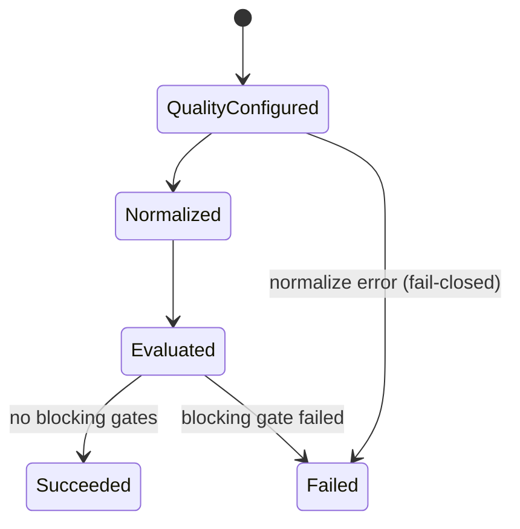
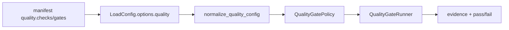

# Feature design: Manifest quality.checks → load-governance gates adapter

- Status: IMPLEMENTED
- Owner: data-platform / KovalevPA01
- Target release: 0.73.1
- Last verified: 2026-07-18

## Executive summary

Airflow and source-sink docs author `quality.checks` with `mode: fail` and
`min_rows.threshold`, but the ETL load path only evaluates `quality.gates`.
The checks blob is copied into `LoadConfig.options.quality` and then ignored,
so an empty full_refresh can finish as SUCCESS. This is a silent false-success
failure mode (release-blocker class).

dpone should keep a single runtime engine (`QualityGatePolicy` /
`QualityGateRunner`) and add a pure, DI-friendly normalizer that maps the
user-facing `checks` dialect onto executable `gates`, fail-closed on unknown
types under fail mode, and always emit a non-empty quality evidence report when
quality was authored.

## Personas and customer journey

| Persona | Goal | Current pain | Success signal |
|---|---|---|---|
| Data engineer | Declare “at least N rows or fail” in the manifest | YAML looks fail-closed; Airflow stays green on 0 rows | Empty source/target with `min_rows: 1` → failed run + clear gate report |
| Data architect | Trust load-governance as the contract | Dual docs (`checks` vs `gates`) hide the gap | One documented contract + compatibility adapter |
| Platform / SRE | Detect empty refresh incidents | Green DAG hides empty landing tables | Alerts on failed task / failed XCom status |

Journey after fix: author `quality.checks` (or canonical `gates`) → `dpone batch run` /
Airflow KPO → blocking gate fails → XCom `status=failed` with `quality_gates`
results → engineer fixes source emptiness or threshold, not “why was it green?”.

## Scope

### In scope

- Pure normalizer `checks` (+ top-level `mode`) → `gates` at governance boundary.
- Accept both `threshold` and `value` for `min_rows`.
- Map `source_target_count` (+ `tolerance_pct`) → `row_count_reconciliation`.
- Fail-closed when authored checks cannot be mapped under fail mode.
- Always attach `quality_gates` evidence when quality config was present.
- Unit/contract tests + docs/schema alignment for the dual dialect.
- Make every dpone-owned manifest producer emit canonical `quality.gates`;
  compatibility `quality.checks` remains an input adapter, never generated
  authoring. Studio keeps its `quality_checks` request field for API
  compatibility but translates it before serializing a manifest.
- CHANGELOG note: empty loads with effective min_rows become failures.

### Non-goals

- MSSQL `StagedLoadPort` / pre-finalize abort (separate capability).
- Full Great Expectations / Soda parity.
- Implementing every listed but currently skipped gate type in one change
  (`custom_sql`, full `not_null` probe path, etc.) beyond fail-closed policy.
- Changing Airflow outcome_gate to re-implement DQ outside dpone.

### Assumptions and constraints

- Canonical runtime evaluator remains `QualityGateRunner`.
- Existing manifests with only `quality.gates` must keep current behavior.
- Existing manifests with only `quality.checks` (Airflow fleet) must start
  enforcing mapped gates after release (intentional behavior change).
- Vacuous pass on empty gate list remains only when quality was not authored.

## Public contract

### CLI

No new commands. `dpone batch run` / gitops run-spec-exec exit non-zero when
blocking gates fail (already true for `gates`; extended to normalized `checks`).

### Python API

No new public exports required. Internal:

- `dpone.governance.quality_normalize.normalize_quality_config(raw) -> Mapping`
  (name may vary; pure function, no I/O).

`QualityGatePolicy.from_config` (or `LoadGovernanceService` quality entry)
MUST call the normalizer before reading `gates`.

### Manifest/schema

Authoring (compatibility):

```yaml
quality:
  mode: fail   # fail | warn  → default severity for mapped checks
  checks:
    - type: min_rows
      threshold: 1          # also accept value:
    - type: source_target_count
      tolerance_pct: 0
```

Canonical (preferred going forward):

```yaml
quality:
  gates:
    - id: target_min_rows
      type: min_rows
      side: target
      threshold: 1
      severity: error
    - id: source_target_rows
      type: row_count_reconciliation
      severity: error
      tolerance:
        mode: pct
        value: 0
```

Schema (`managed_quality`): document both `checks` and `gates`; keep
`additionalProperties` only where needed for `acceptance`; add explicit
properties for migration clarity.

### Artifacts and evidence

- `reconciliation_metrics.quality_gates` / load-step `quality_checked` always
  present when input quality config was non-empty after normalization.
- Status vocabulary unchanged: gate `passed|failed|skipped|warning`; every
  `severity=error` result other than `passed` is blocking. An unimplemented
  error gate therefore cannot become a vacuous pass through `skipped`.

### Compatibility and migration

| Before | After |
|---|---|
| `checks` only | Mapped to gates; empty load with min_rows≥1 fails |
| `gates` only | Unchanged |
| both | Prefer `gates`; if `mode: fail` and leftover unmapped `checks` → fail-closed |
| unknown check type + fail | Config/runtime error (not silent skip) |
| unimplemented GATE_TYPES under error severity | Fail-closed or explicit “not implemented” failed gate (no vacuous skip) |

Deprecation: docs mark `checks` as compatibility authoring; new examples use
`gates`. No forced fleet rewrite in the same release if adapter is complete.

Rollback: revert adapter release; document that `checks` again become no-ops
(undesirable — prefer forward fix).

## Detailed algorithm

1. Read `LoadConfig.options["quality"]` (mapping or empty).
2. If missing/empty → empty policy (current behavior).
3. `normalize_quality_config(raw)`:
   - If `gates` non-empty → start from those definitions.
   - Else if `checks` non-empty → map each check to a gate dict.
   - Top-level `mode: fail|warn` supplies default `severity` for mapped checks
     (`error` / `warning`).
   - `min_rows`: require the documented `threshold` or compatibility alias
     `value`; missing, boolean, negative, misspelled or non-integer values are
     configuration errors. Default `side: target` (optional `side: source` in
     compatibility input).
   - `source_target_count`: emit `row_count_reconciliation` with tolerance from
     `tolerance_pct` (pct mode) or absolute 0.
   - Unknown type: if default severity is error → raise `ValueError` with
     actionable message listing supported mapped types; if warn → warning gate
     or skip with evidence (prefer raise under fail).
4. Build `QualityGatePolicy` from normalized `gates` only.
5. Run `QualityGateRunner` with source/target probes (existing snapshot helpers).
6. If any blocking result → raise `RuntimeError("quality gates failed")` (existing).
7. Merge report into reconciliation metrics even when all passed; never omit
   report when authored quality normalized to ≥1 gate.

### Pseudocode

```text
function normalize_quality_config(raw):
  if raw is empty: return {gates: []}
  mode = raw.mode or "fail"
  default_severity = "error" if mode == "fail" else "warning"
  gates = list(raw.gates or [])
  if gates:
    validate_gates(gates)
    if raw.checks and mode == "fail" and has_unmapped_checks(raw.checks, gates):
      raise ValueError("quality.checks leftover while gates present under mode=fail")
    return {**raw, gates: gates}
  checks = list(raw.checks or [])
  if not checks:
    return {**raw, gates: []}
  mapped = []
  for check in checks:
    mapped.append(map_check_to_gate(check, default_severity))
  if not mapped and mode == "fail":
    raise ValueError("quality.checks produced no executable gates under mode=fail")
  return {**raw, gates: mapped}

function run_quality_gates(load_config, extract, load):
  policy = QualityGatePolicy.from_config(normalize_quality_config(quality_options))
  report = QualityGateRunner().run(policy, source_probe(extract), target_probe(load))
  attach_evidence(report)  # even if empty policy only when quality absent
  if not report.passed: raise RuntimeError("quality gates failed")
```

### State machine



### Edge cases

- Empty extract, full_refresh, min_rows target 1 → Failed.
- Legitimate incremental no-op with no min_rows → Succeeded (unchanged).
- `mode: warn` + min_rows miss → warning, non-blocking.
- Probes missing row_count (`None`) → treat as fail for error min_rows (do not
  coerce silently to 0 without recording metrics); prefer fail-closed.
- MSSQL legacy_post_finalize: still post-load fail (better than false success);
  pre-finalize abort is out of scope.

## Architecture

### Components and responsibilities

| Component | Existing/new | Responsibility | Dependencies |
|---|---|---|---|
| `normalize_quality_config` | new (governance) | Pure dialect adapter | none |
| `QualityGatePolicy` | existing | Parse/validate gates | normalizer |
| `QualityGateRunner` | existing | Evaluate probes | policy |
| `LoadGovernanceService` | existing | Invoke gates in lifecycle | policy/runner |
| `LoadConfigBuilder` | existing | Pass-through quality blob | unchanged |
| Docs/schema | update | Single story + compat | — |

### Ports, adapters, and composition root

- Adapter is pure domain/governance policy translation (not a connector adapter).
- No vendor imports; no Airflow awareness.
- Composition: call site inside `QualityGatePolicy.from_config` or
  `_quality_config()` in `LoadGovernanceService` — one place only (DRY).

### Data and control flow



### Alternatives and tradeoffs

| Alternative | Advantages | Disadvantages | Decision |
|---|---|---|---|
| Rewrite all manifests to `gates` only | Pure canonical | Leaves false success until fleet migrates | Reject as sole fix |
| Re-implement checks in outcome_gate | Fast for Airflow | Splits truth; not CLI/batch parity | Reject |
| Adapter in LoadConfigBuilder | Early normalize | Couples dag builder to governance details | Reject; keep in governance |
| Governance normalizer + docs | One engine, compat, fail-closed | Intentional behavior change for empty loads | **Adopt** |

### ADR requirement

Optional short ADR if we declare `gates` the sole long-term authoring form and
`checks` compatibility-only. Not required if documented in this spec +
load-governance.md.

### Quality-budget impact

- New small module (~80–150 SLOC) under `dpone/governance/`.
- Touch `quality.py` / `service.py` lightly; avoid growing god modules.
- Stay within `docs/benchmarks/quality_budgets.yml`.

## Market comparison

Primary sources consulted conceptually for “declared row-count tests must fail
the job” (2026-07-17):

| System/version | Relevant capability | Observed design | Strength | Limitation | Adopt/reject | Source/date |
|---|---|---|---|---|---|---|
| dlt | Pipeline checks / row counts | Checks are explicit pipeline steps | Clear fail semantics when configured | Different packaging model | Adopt pattern: declared check must execute | dlt docs, 2026-07 |
| Informatica | Data quality rules in mapping | Rules can stop mapping | Enterprise fail-closed | Heavy UI | Adopt intent only | Informatica DQ docs |
| Airbyte | Basic normalization / catalog | Limited row DQ in core sync | Sync-centric | Not manifesto-style gates | N/A for dialect adapter | Airbyte docs |
| Fivetran | Destination tests elsewhere | Operational monitoring outside sync | Strong ops story | Not in-sync fail | N/A | Fivetran docs |
| Pentaho | Steps with abort | Explicit abort steps | Clear | Legacy ETL | N/A | — |
| Microsoft SSIS | Constraints / row count transforms | Can fail package | Familiar | Vendor lock-in | N/A | MS docs |
| gusty | DAG generation | N/A | — | Not DQ runtime | N/A | — |
| Astronomer Cosmos | dbt in Airflow | dbt tests fail DAG | Test-as-gate | dbt-specific | Adopt pattern: tests fail the run | Cosmos/dbt docs |
| Apache Beam | PAssert / pipeline options | Asserts in pipeline graph | Strong for streaming tests | Different model | N/A | Beam docs |

Adopted pattern: **authored quality must be executable and able to fail the run**.
Rejected: silent ignore of authored checks; duplicating DQ outside the load engine.

## Measurable differentiation

```yaml
axis: fail-closed enforcement of authored manifest quality on empty loads
scenario: >
  CH→MSSQL full_refresh with empty source table and
  quality.mode=fail + checks.min_rows.threshold=1
baseline: dpone ≤0.72.5 reports SUCCESS / Airflow success with 0 loaded rows
metric: run terminal status
target: failed (CLI non-zero; Airflow task failed; XCom status=failed)
procedure: >
  unit+processor test with non-staged sink stub returning 0 rows;
  optional live DEV replay of example_forecast before source backfill
artifact: pytest evidence + runtime quality_gates JSON in XCom/metrics
limitations: MSSQL fail is post-load until StagedLoadPort exists
```

## Security, privacy, and operations

- No new secrets.
- Evidence must not dump full SQL with credentials (existing redaction).
- Ops: treat new failures on previously “green empty” DAGs as correct; fix
  source freshness or temporarily `mode: warn` with explicit approval.

## Test and certification plan

| Layer | Scenario | Environment | Expected artifact |
|---|---|---|---|
| Unit | checks→gates mapping table | local | pytest |
| Unit | unknown check + mode fail | local | ValueError |
| Unit | gates-only unchanged | local | pytest |
| Contract | LoadGovernanceService 0/0 probes | local | RuntimeError |
| Integration | ETLProcessor non-staged sink empty load | local | failed result |
| Docs/schema | source-sink example normalizes to ≥1 gate | local | contract test |
| Live | optional DEV supply_forecast empty replay | DEV | failed DAG run |
| Compatibility | marketing gates/`not_null` checks after map | local/DEV | no false success |

## Documentation plan

- Update `docs/load-governance.md`: canonical `gates` + compatibility `checks`.
- Update `docs/reference/configuration.md` Quality section.
- Fix `docs/source-sink/*.md` examples (dual form or migrate to gates).
- Note in `docs/managed-ux.md` that Studio `QualityService` ≠ load-governance
  until separately unified (non-goal here).
- CHANGELOG public behavior entry.
- Short CJM note for Airflow authors: empty refresh will fail if min_rows set.

## Rollout and rollback

1. Land adapter + tests + docs in OSS patch release.
2. Bump Airflow image pin; replay known empty-source DEV DAG → expect FAIL.
3. Communicate to teams with `min_rows: 1` on intermittent sources.
4. Rollback = previous dpone pin (restores false success — last resort only).

## Agent execution plan

| Agent/role | Owned paths | Read-only paths | Forbidden paths | Dependency |
|---|---|---|---|---|
| Implementer | `src/dpone/governance/**`, targeted tests | `docs/load-governance.md`, manifests examples | connectors/BCP paths, Airflow repos | APPROVED spec |
| Docs | `docs/**` quality sections, CHANGELOG | schema | runtime connectors | after tests green |
| Integrator | CHANGELOG, schema if shared | — | unrelated features | merge |

Integrator owns shared files (`CHANGELOG.md`, schema registry touches).

## Approval checklist

- [x] User problem and CJM are clear.
- [x] Algorithm and failure semantics are implementable without guessing.
- [x] Public contracts and compatibility are explicit.
- [x] Architecture and alternatives are justified.
- [x] Relevant market research uses current official sources (summary table).
- [x] Claimed differentiation is measurable.
- [x] Tests, evidence, docs, rollout, and rollback are complete.
- [x] Path ownership and integration plan are conflict-safe.
- [x] Maintainer changed status to `APPROVED` before the reviewed implementation.

## Research evidence (2026-07-17)

- Runtime ignores `checks`: `QualityGatePolicy.from_config` uses `gates` only
  (`src/dpone/governance/quality.py`).
- Manifest injects whole quality blob (`src/dpone/dag/load_config_builder.py`).
- CH→MSSQL uses `legacy_post_finalize` when `StagedLoadPort` absent; gates still
  run post-load with empty policy → vacuous pass.
- User-facing docs/examples still teach `quality.checks` (e.g.
  `docs/source-sink/clickhouse-to-mssql.md`).
- Example failure scenario: `DAG__example__forecast__sync`
  SUCCESS with Extracted/Loaded 0 despite `min_rows: 1`.
