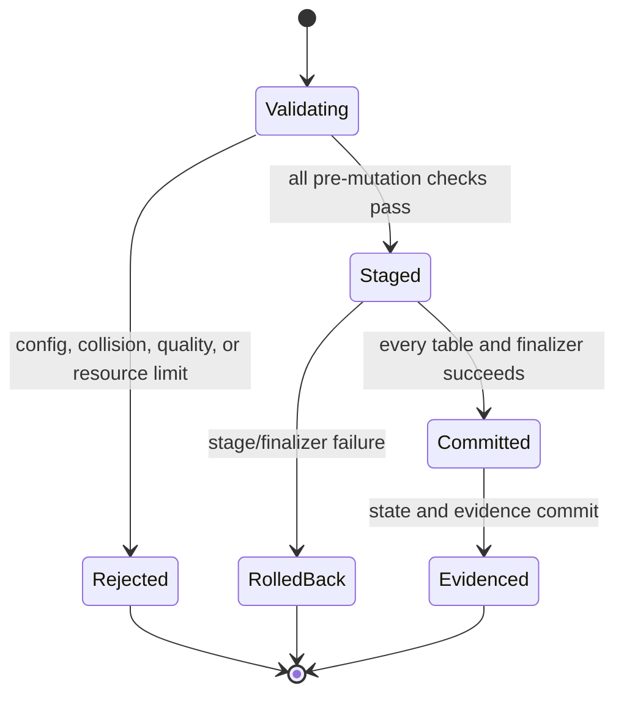

# Feature design: v0.73.28 release-blocker remediation

- Status: APPROVED
- Owner: Codex / dpone maintainer
- Issue: corrective follow-up to PR #473 and the frozen-commit R1-R9 audit
- Target release: 0.73.28
- Last verified: 2026-07-30

## Executive summary

The frozen release commit `8f32637714f6c7c9c57372c72b5ce087aff8d861`
passed protected CI and package checks, but the release audit reproduced
contract failures that those checks did not cover:

- `dpone run` reports pre-execution manifest/configuration failures as exit `1`
  instead of the documented exit `2`;
- the CLI and `dpone.api.run` derive different interval, scheduler, mapping and
  state identity from the same environment;
- nested normalization can lose empty containers, merge colliding generated
  table names, ignore configured duplicate/orphan failure policies, append
  stale rows across spill retries, and publish lossy TSV schemas;
- certification helpers can report static success without exercising the
  claimed behavior;
- merge-receipt artifact downloads and ZIP processing are not byte-bounded;
- the primary Quickstart does not execute, and release/Airflow documentation
  overstates evidence that is still unavailable.

This change restores the already documented contracts, adds fail-closed
resource limits, and makes the first-user journey executable. It does not add a
new connector, route, load strategy, or production certification claim.

The maintainer explicitly authorized implementation and release in the active
release conversation. That authorization is recorded by the `APPROVED` status;
publication still requires a fresh exact-commit R1-R9 `GO`.

## Personas and customer journey

| Persona | Goal | Current pain | Success signal |
| --- | --- | --- | --- |
| Data engineer | Run one manifest from shell or Python | The two entry points derive different execution identity | Equivalent input and environment produce an equivalent run invocation |
| Platform engineer | Normalize nested payloads without loss or duplication | Empty containers disappear; colliding names and duplicate children can silently pass | Loss/collision/quality failures are deterministic and happen before target mutation |
| Release operator | Audit exact reviewed evidence safely | Provider-controlled archives can consume unbounded memory | Oversized metadata, responses and archives fail before certification |
| First-time user | Complete the Quickstart | The copied manifest misses `name` | The documented manifest plans successfully in CI |

Journey:

1. Install dpone and copy the Quickstart manifest.
2. Plan or run it through the documented positional manifest argument.
3. Use either CLI or Python under the same scheduler environment and receive the
   same interval/mapping/state identity.
4. Observe an actionable exit `2` for invalid configuration and exit `1` only
   after execution starts or returns a non-success result.
5. Normalize nested data; empty containers remain distinguishable from missing
   fields, existing ASCII physical identifiers remain stable, and canonical
   collisions fail before staging.
6. On duplicate/orphan child rows, configured `fail` policies abort the package
   before snapshot, target or source-state commit.
7. The release operator retains exact artifacts, reruns Docker/live route
   certification, and publishes only after the new frozen commit passes R1-R9.

## Scope

### In scope

- Restore the documented `dpone run` exit-code matrix and stable output.
- Share environment-derived invocation context between CLI and Python API.
- Preserve empty list/dict meaning during nested round-trip reconstruction.
- Keep existing ASCII generated table names stable, reject non-ASCII physical
  identifiers, and reject distinct source paths whose lowercase canonical
  collision keys resolve to one target table.
- Enforce duplicate-child and orphan-child policies in the real normalization
  path before any staged mutation or state advancement.
- Publish spill retries as isolated immutable generations, preserve typed
  semantic rows for quality/snapshot/portable consumers, and render TSV only
  after the final schema is known.
- Replace static nested certification success with observed checks and full
  representative reverse-readback equality.
- Bound GitHub API responses, artifact downloads, ZIP members, ZIP member count
  and aggregate uncompressed bytes.
- Execute the primary Quickstart in tests; correct release documentation,
  invalid JSON examples and skipped-version history.
- Execute the local Docker MySQL route cells through the same generated
  live-certification plan used by the workflow. A skipped or missing MySQL cell
  keeps the profile non-passing, and retained evidence must never serialize
  connection passwords.
- Keep production Airflow artifact attestation fail-closed but label its live
  rollout/cutover certification `UNVERIFIED` until the specified environment is
  available.
- Add architecture-fitness to protected CI and retain exact-commit output.

### Non-goals

- No generic artifact storage framework or new release-controller design.
- No new naming-convention plugin system.
- No schema materialization for zero-row child tables; `include_empty_tables`
  remains reserved.
- No claim that local Docker substitutes for signed dev/prod Airflow cutover.
- No production-certification expansion beyond the already implemented local
  Docker MySQL route cells; MySQL remains non-certified until the exact-commit
  route evidence passes.
- No expansion of the Airflow matrix.
- No transfer of the repository or paid GitHub runner activation in this PR.

### Assumptions and constraints

- Base commit is `8f32637714f6c7c9c57372c72b5ce087aff8d861`.
- Existing manifests with non-colliding names and valid child keys remain
  behavior-compatible.
- Previously silent collision or child-quality corruption becomes an explicit
  error; this is a compatible correctness fix, not an opt-out migration.
- Docker is explicitly approved for live checks. Signed dev/prod Airflow is not
  available and must remain `UNVERIFIED`.
- All release evidence must be regenerated from the corrective merge commit.

## Public contract

### CLI

- `dpone run PATH` keeps the positional manifest path.
- Success-like execution returns `0`.
- An executed non-success result or execution/runtime exception returns `1`.
- `ETLConfigurationError` and its manifest/DAG subclasses raised before process
  execution return `2`.
- `KeyboardInterrupt` remains `130` through the top-level CLI boundary.
- JSON output stays valid JSON on stdout; text and Markdown formats remain
  redacted and deterministic. Invalid input creates no durable run side effect.

### Python API

- `dpone.api.run` keeps its public signature and return type.
- Explicit `dag_id` and `execution_date` retain precedence.
- Otherwise it consumes the same `DPONE_*` interval and Airflow mapping
  environment as the CLI, applies the same interval mutation, and passes the
  same run-context mapping.
- Python exceptions remain exceptions; CLI exit-code classification is not
  imposed on Python callers.

### Manifest/schema

- No schema keys are added or removed.
- Existing `child_quality.duplicate_child_key` and
  `child_quality.orphan_child_rows` values `fail`, `warn`, and `skip` become
  executable runtime policy.
- `include_empty_tables` remains `false` and reserved. Empty containers are
  preserved on the parent payload solely as a lossless empty-value sentinel;
  non-empty nested structures are still split normally.

### Artifacts and evidence

- GitHub JSON response limit: 4 MiB.
- Compressed artifact limit: 16 MiB.
- Maximum ZIP members: 256.
- Maximum individual uncompressed member: 4 MiB.
- Maximum aggregate uncompressed ZIP content: 32 MiB.
- Maximum declared ZIP compression ratio: 100:1.
- Limits are checked against provider metadata, streamed bytes and `ZipInfo`
  declarations. A response is read only up to `limit + 1`.
- Limit violations are terminal failures and can never produce `PASS`.
- Existing receipt and merge-binding schemas remain unchanged.

### Nested spill publication

- `SpilledNormalizationResult.files` continues to be the authoritative native
  file mapping. Each successful call now points into a unique
  `.dpone-spill-generation-*` directory below the configured `output_dir`;
  callers must consume returned paths instead of constructing flat filenames.
- A retry never appends to or replaces a prior successful generation. Failed
  staging and failed load attempts remove only their attempt-local files, while
  prior successful generations and unrelated legacy files remain byte-identical.
- The additive `semantic_files` mapping identifies internal JSONL with explicit
  scalar type tags for child quality, snapshots, and portable fallback. Every
  spill format receives a hidden sidecar in the same generation; it must be
  retained or removed with the operator-facing file.
- TSV is rendered once from the complete schema. Incompatible heterogeneous
  column types, unsafe table path components, delimiter-bearing cells, and a
  literal `\N` string fail before publication instead of coercing identity or
  corrupting the header.
- Child quality validates the staged semantic sidecar before atomic
  publication. dpone removes failed staging and failed-load generations. The
  caller/operator owns retention of successful results and may delete one only
  after every consumer has finished.
- Sink-native file handoff is disabled per route until the exact writer/loader
  header, delimiter, NULL and type contract has retained end-to-end evidence.
  Uncertified routes consume the typed semantic sidecar through
  `StreamingRowsArtifact`.

### Compatibility and migration

- Valid runs and non-colliding nested payloads need no migration.
- A payload that formerly merged `a-b` and `a_b`, or loaded duplicate configured
  child keys, now fails with the colliding paths/table or quality counts and a
  recovery action. This prevents data corruption.
- Code that assumed `<output_dir>/<table>.<suffix>` must switch to
  `result.files[table]`. Existing flat files are not migrated, read, overwritten
  or deleted. Add retention for completed `.dpone-spill-generation-*`
  directories after sink consumption.
- Historical evidence remains readable. Only new ingestion is bounded.
- Production Airflow runtime continues to fail closed; documentation is
  corrected from production-ready wording to preview/readiness wording.

## Detailed algorithm

1. Build one invocation context from explicit arguments plus environment.
2. Resolve interval values, mapping context, effective DAG id and execution
   date once; pass the same values to `RunManifestService`.
3. Classify only pre-execution `ETLConfigurationError` as CLI exit `2`; render
   all failures through the existing redacted formatter.
4. For nested normalization, preserve the existing ASCII physical table
   spelling and derive a separate lowercase ASCII collision key. Register
   `(collision_key, physical_table, source_path)` in the per-run guard.
5. If a second distinct source path resolves to the same target table, abort
   normalization before building or staging any table.
6. When a nested value is an empty list or mapping, retain that empty value on
   its parent row. Do not create a fake child row or claim an empty-table schema.
7. After all rows are normalized, validate hierarchy references using
   `__dpone__row_id` and `__dpone__parent_row_id`, and validate configured child
   unique keys per generated table.
8. Apply policy:
   - `fail`: raise before snapshot staging and target mutation;
   - `warn`: emit an explicit warning and keep the observed quality result;
   - `skip`: do not evaluate that check.
9. Build certification status from executed normalization/schema/planner
   observations. Reverse readback compares the complete representative source
   payload, not one business column.
10. For spill mode, stream typed rows into a unique same-filesystem staging
    directory, merge the complete schema, render native files, and atomically
    rename the directory to a unique immutable generation. Failed staging is
    removed; no prior or unrelated file is changed.
11. Derive unkeyed child/raw/quarantine identity from the parent/root identity
    and use the source-global row index in memory and spill modes.
12. Before provider download, reject non-positive or over-limit size metadata.
13. Stream the response at most to `limit + 1`; reject overflow, truncation,
    digest mismatch or size mismatch.
14. Before ZIP extraction, reject too many members, unsafe/duplicate paths,
    oversized members, excessive compression ratio or aggregate uncompressed
    size. Read required members through the same bounded reader.
15. Generate the local live-certification plan from one connector registry,
    including MySQL. Execute every selected MySQL cell and derive the profile
    result from JUnit outcomes; a skip, missing cell or credential/configuration
    omission is not success.
16. Redact connection credentials before writing retained executor
    configuration/evidence artifacts.
17. Run executable Quickstart/CJM, focused tests, broad quality gates, exact
    Docker/live route certification and packaging against the corrective commit.

### Pseudocode

```text
invocation = resolve(explicit_args, DPONE_environment)
try:
    report = run_manifest(invocation)
except ETLConfigurationError:
    render_redacted_failure()
    return 2
except execution_error:
    render_redacted_failure()
    return 1

for source_row in rows:
    emit root
    for nested_path:
        physical_target = existing_ascii_identifier(nested_path)
        collision_key = lowercase(physical_target)
        guard.register(collision_key, physical_target, nested_path)
        if empty_container:
            retain empty sentinel on parent
        else:
            emit child rows

quality = validate_hierarchy_and_unique_keys(all_tables)
apply fail/warn/skip policy before stage_result()

assert provider_size <= compressed_limit
bytes = stream_at_most(compressed_limit + 1)
assert zip member_count/member_sizes/aggregate_sizes are bounded
validate digests and closed schemas
```

### State machine



### Edge cases

- Missing and empty remain distinct: missing is absent; empty list/dict is
  retained as empty.
- `a-b`, `a_b`, case-only variants and non-ASCII identifiers fail when their
  destination identity is ambiguous or unsupported.
- Null child-key components participate in duplicate detection; repeated null
  keys do not silently pass.
- An orphan can reference any missing direct parent, including an intermediate
  child table.
- A crash before staging leaves no target/snapshot/state change.
- A crash after staging uses existing package rollback/commit-unknown rules.
- A provider that lies about size is caught by streamed byte limits.
- A ZIP compression bomb is rejected from declared sizes before decompression.
- Retries never convert a limit or integrity failure to success.

## Architecture

### Components and responsibilities

| Component | Existing/new | Responsibility | Dependencies |
| --- | --- | --- | --- |
| Run invocation context service | New | One environment/argument-to-runtime decision | interval and mapping services |
| CLI/Python composition roots | Existing | Adapt inputs and call the shared decision | invocation context, manifest service |
| Explosion guard/table registry | Extended | Per-normalization canonical collision detection without renaming physical tables | nested options only |
| Child quality service | Extended | Hierarchy and configured-key validation | normalization result |
| Nested normalization service | Existing | Execute all pre-mutation normalization checks | emitter, guard, quality service |
| Artifact resource limits | New | Closed byte/member ceilings | standard library only |
| Receipt provider/readers | Existing | Enforce limits while fetching and extracting | resource limits |

Dependency direction remains `commands/api -> services -> runtime/contracts`.
No vendor SDK or I/O is added to import/help paths. Dependencies are injected at
existing composition roots.

### Alternatives and tradeoffs

| Alternative | Advantages | Disadvantages | Decision |
| --- | --- | --- | --- |
| Keep separate CLI/Python setup | Smallest diff | Preserves identity drift | Rejected |
| Lowercase every existing physical name | Matches the old prose literally | Changes durable table and child-row identity in a patch release | Rejected |
| Append a hash to every colliding identifier | Avoids failure | Changes table names silently and complicates migration | Rejected |
| Fail on distinct source-path collision | Deterministic and safe | Previously corrupt payloads stop | Adopted |
| Emit fake row for empty arrays | Creates a child table | Invents source data and row identity | Rejected |
| Retain empty sentinel on parent | Lossless, no fake rows | Parent keeps a JSON empty value | Adopted |
| Read ZIP then validate | Simple | Resource exhaustion before decision | Rejected |
| Stream and preflight sizes | Bounded and fail closed | More negative tests | Adopted |

### ADR requirement

ADR 0038 records the durable nested storage/replay decision: empty containers
remain distinguishable from missing fields, existing ASCII physical table
identity is preserved, a separate lowercase canonical key detects collisions,
and child-quality policy is enforced before mutation. Receipt resource bounds
restore ADR 0037's bounded-evidence assumption and do not need a new ADR. ADR
0035 and its feature specification must be amended to state that signed dev
restart and staged production cutover/rollback remain required before a
production certification claim.

### Quality-budget impact

New helpers must stay below the project hard module limits. Receipt limit
constants/readers are isolated from provider selection. No new cross-layer
dependency is permitted. Architecture fitness, layer metrics, import rules and
module-size gates run in the corrective CI.

## Market comparison

Only dlt is relevant to the nested relational-normalization layer. The release
blockers for dpone-specific CLI identity, exact-commit evidence and Airflow
claims have no equivalent public contract in the other listed systems.

| System/version | Relevant capability | Observed design | Strength | Limitation | Adopt/reject | Source/date |
| --- | --- | --- | --- | --- | --- | --- |
| dlt latest docs | Nested relational normalization and naming | Lowercase snake-case identifiers, deterministic nested linkage and destination collision guards | Clear destination naming and hierarchy contract | Its docs explicitly note that source dictionary-key collisions after normalization are not always detected | Adopt separate canonical collision detection and deterministic linkage; preserve dpone physical names until a versioned migration exists | [Schema](https://dlthub.com/docs/general-usage/schema), [Naming convention](https://dlthub.com/docs/general-usage/naming-convention), checked 2026-07-29 |
| Informatica | N/A | Managed mapping/runtime behavior is not the dpone in-process contract being repaired | N/A | No relevant exact contract comparison | N/A | Checked 2026-07-29 |
| Airbyte | N/A | Connector normalization is not the CLI/API/exact-receipt boundary | N/A | Different layer | N/A | Checked 2026-07-29 |
| Fivetran | N/A | Managed destination schemas are not this local runtime boundary | N/A | Different layer | N/A | Checked 2026-07-29 |
| Pentaho | N/A | No relevant exact-commit receipt contract | N/A | Different layer | N/A | Checked 2026-07-29 |
| Microsoft SSIS | N/A | Package error handling is not dpone invocation identity | N/A | Different layer | N/A | Checked 2026-07-29 |
| gusty | N/A | DAG authoring is not nested runtime normalization | N/A | Different layer | N/A | Checked 2026-07-29 |
| Astronomer Cosmos | N/A | dbt/Airflow rendering is not this remediation | N/A | Different layer | N/A | Checked 2026-07-29 |
| Apache Beam | N/A | Distributed transforms/checkpointing are not the local manifest/receipt boundary | N/A | Different layer | N/A | Checked 2026-07-29 |

## Measurable differentiation

```yaml
axis: fail-closed normalized identifier collisions
scenario: one source row contains both "a-b" and "a_b" nested objects
baseline: dpone 0.73.25 through frozen candidate 8f326377; dlt docs note this source-data collision gap
metric: silent merged target tables
target: zero; normalization exits before staging with both source paths and physical target table named
procedure: focused normalization contract test plus ETL no-mutation test
artifact: test_artifacts/release/v0.73.28/r3_nested_correctness.json
limitations: establishes the tested collision classes, not every destination-specific length rule
```

No unqualified public “better” claim will be added.

## Security, privacy, and operations

All errors are redacted through existing output helpers. Credentials are not
read by the new tests or written to artifacts. Receipt bounds apply before
decompression and before schema validation. Operators recover by correcting
the manifest/source keys, selecting `warn` only when explicitly acceptable, or
regenerating a bounded source receipt. Limit changes require reviewed tests and
documentation; workflows cannot override them upward.

## Test and certification plan

| Layer | Scenario | Environment | Expected artifact |
| --- | --- | --- | --- |
| Unit | CLI exit classes; shared invocation precedence | local hermetic | focused pytest/JUnit |
| Unit | empty containers, collisions, duplicate/orphan policies | local hermetic | R3 JSON receipt |
| Unit | metadata/stream/member/aggregate limits and ZIP amplification | local hermetic | receipt-limit test output |
| Contract | complete CLI/Python invocation parity | local hermetic | R1/R2 JSON receipt |
| Docs/CJM | execute Quickstart YAML and commands | local hermetic | R6 CJM receipt |
| Integration | source/sink matrix with opt-in marker | CI/Docker | matrix report with zero hidden skips |
| Live certification | MSSQL/ClickHouse and PostgreSQL/MSSQL routes, replay, failure/state ordering | approved Docker `real_local` | route bundles and release gates |
| Packaging | eight archives, Twine, fresh Python install, CLI/API smoke | frozen commit | candidate inventory and smoke |
| Security | CodeQL, dependency review, TruffleHog, detect-secrets, bounded receipt negatives | frozen commit | R8/R9 receipts |

## Documentation plan

- Correct Quickstart `name` and promised plan output.
- Correct `dpone run PATH` syntax in release evidence.
- Replace the invalid JSON comment with valid JSON or a non-JSON fence.
- Explain that `0.73.27` was reserved/tagged but not published and is
  superseded by `0.73.28`.
- Amend Airflow attestation spec/ADR/changelog wording to fail-closed preview
  until live rollout evidence exists.
- Document empty-container, collision and child-quality runtime behavior.
- Add executable first-user journey coverage to CI.

## Rollout and rollback

The correction ships atomically in `0.73.28`; there is no feature flag for
silent corruption. Rollback means do not publish the new tag and revert the
corrective PR before any release. After publication, a regression triggers a
new patch—never retag `v0.73.28`. Post-release verification installs all four
packages from PyPI in a clean Python 3.11 environment and reruns CLI/API smoke.

## Agent execution plan

| Agent/role | Owned paths | Read-only paths | Forbidden paths | Dependency |
| --- | --- | --- | --- | --- |
| CLI/API implementer | run command, Python API, shared invocation service, focused tests | manifest/interval/context services and docs | workflows, changelog, schemas | approved spec |
| Nested implementer | nested normalization/runtime paths and focused nested tests | ETL processor and docs | workflows, changelog, schemas | approved spec |
| Receipt implementer | receipt provider/archive/gate paths and focused agent-policy tests | schemas/workflow policy | workflows, changelog, schemas | approved spec |
| Integrator (Codex) | shared docs, ADR/spec wording, workflow, changelog, final tests/evidence | all | none | three reviewed commits |

The integrator is the only shared-file owner.

## Approval checklist

- [x] User problem and CJM are clear.
- [x] Algorithm and failure semantics are implementable without guessing.
- [x] Public contracts and compatibility are explicit.
- [x] Architecture and alternatives are justified.
- [x] Relevant market research uses current official sources.
- [x] Claimed differentiation is measurable.
- [x] Tests, evidence, docs, rollout, and rollback are complete.
- [x] Path ownership and integration plan are conflict-safe.
- [x] Maintainer changed status to `APPROVED`.
