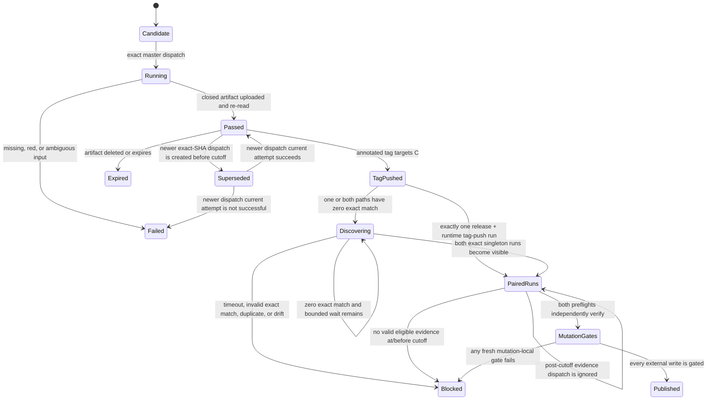

# Feature design: exact-SHA release candidate evidence gate

- Status: APPROVED
- Owner: dpone maintainers
- Issue: corrective release follow-up after PR #525
- Target release: 0.74.0
- Approval: explicit maintainer authorization in the 2026-08-13 release task
- Last verified: 2026-08-14

## Executive summary

The tag workflows can currently publish Python packages and a runtime image
without consuming the real-live release evidence required by
`docs/release-evidence.md`. The existing behavioral evidence assemblers also
accept caller-selected inputs, so their JSON alone is not an authorization
boundary.

This change adds one manual, exact-`master` release-candidate workflow and one
read-only provider verifier. The workflow runs the reviewed live campaign,
derives a closed manifest from observed outputs, and publishes one
attempt-specific artifact. The verifier first authenticates the paired tag
runs, freezes exact-SHA dispatch eligibility at their earliest provider
`created_at`, and selects the unique maximum provider `created_at` within that
pre-cutoff set before evaluating the run's current attempt and result. It binds
the terminal job/check to the exact commit and workflow attempt, downloads the
unique retained artifact under hard limits, and validates every inner identity
and digest. Both PyPI and GHCR tag workflows invoke the same verifier in
preflight and again at their mutation boundaries.

## Personas and customer journey

| Persona | Goal | Current pain | Success signal |
|---|---|---|---|
| Release maintainer | Publish one reviewed commit | A tag can bypass required live evidence | Both publication workflows reject a tag without a current exact-SHA PASS artifact |
| Reviewer | Audit what really ran | Generic JSON can self-assert PASS | Provider run, job, attempt, artifact, source files, and digests form one closed chain |
| Operator | Recover safely | A rerun can accidentally reuse stale green evidence | Before tagging, the newest dispatch must pass; publication selects the unique newest eligible dispatch created by the paired-run cutoff, and equal eligible creation times, a red current attempt, or missing evidence block |

The maintainer merges the corrective PR, waits for exact-commit CI and merge
closure, dispatches `Release candidate evidence` on `master` with the full
commit SHA and proposed tag, and waits for the fixed job and attempt-specific
artifact to pass. Only then may the annotated tag be pushed. Both tag consumers
independently re-read provider state and artifact bytes. The tag push must
create exactly one `release.yml` run and one `runtime-image.yml` run; the
earlier provider `created_at` becomes their shared evidence cutoff. The
publication verifier ignores any evidence dispatch created after that frozen
cutoff.

## Scope

### In scope

- exact-`master`, `workflow_dispatch` release evidence for `native_transfer`,
  a strict superset of `real_local` for this route-heavy release;
- observed service, route, CDC/reconciliation, benchmark, exact-check, and
  merge-closure inputs;
- closed JSON receipt/manifest with deterministic SHA-256 projections;
- newest-eligible-dispatch provider selection and bounded artifact validation;
- exact paired tag-push authentication for `release.yml` and
  `runtime-image.yml`, using the earlier provider start as the cutoff;
- fresh mutation-local verification before release attestation, PyPI,
  GitHub Release, GHCR digest/attestation publication, and alias promotion;
- an immediate PyPI absent-or-exact-candidate-subset gate and attempt-bound
  receipt before the ordinary publisher may use `skip-existing`;
- self-service docs and failure recovery.

### Non-goals

- enabling the synthetic `if: false` release assemblers in
  `live-certification.yml`;
- treating local Docker evidence as production authorization for preview-only
  routes;
- creating a custom check run or granting `checks: write`;
- making Actions artifacts permanent. Missing, deleted, or expired bytes are
  `UNVERIFIED`. Before tagging they require a new campaign; after the cutoff
  freezes they require a newly reviewed version and tag.

### Assumptions and constraints

- Dispatch uses `--ref master`; input `commit_sha`, `GITHUB_SHA`, checkout
  `HEAD`, and current `refs/heads/master` must match at initial preflight.
- Evidence remains bound to that frozen commit after `master` advances. Tag
  consumers require the annotated tag to target that commit. The authority
  cutoff is the earlier GitHub `created_at` across the two exact tag-push runs;
  only exact-SHA evidence dispatches created no later than that cutoff are
  eligible, and post-cutoff dispatches are ignored. An annotated tagger
  timestamp is never trusted as a security boundary.
- The package release workflow has no manual dispatch. The runtime workflow's
  manual and pull-request modes remain non-publishing.
- Paired publication discovery is a semantic, bounded wait for provider
  indexing only: default 10-second interval, initial sweep plus at most 30
  sleeps (31 observations and about 300 seconds of sleep budget, excluding
  request time). The caller detail and both fixed workflow lists are
  read on every sweep. Other-tag runs are ignored. Only zero exact-tag matches
  and mutable current-run `run_attempt`/`updated_at` detail/list projection
  drift are retryable; malformed exact matches, more than one exact match, and
  immutable `id`/`created_at` drift fail immediately. Persistent mutable drift
  fails after the same bounded poll.
- Only GitHub-hosted Linux execution is release authority.
- The live job has no publication token, OIDC authority, or protected
  environment.
- The compact authority archive stays within existing bounded artifact limits.

## Public contract

### Workflow

`.github/workflows/release-candidate-evidence.yml` is manual-only. Required
inputs are `commit_sha` and `release`; the authoritative profile is
`native_transfer`. The fixed terminal job/check name is
`Release candidate evidence`.

The job emits exactly one artifact named
`release-candidate-evidence-<commit>-<run-id>-<attempt>` with requested 90-day
retention and no overwrite. Its closed member set contains these top-level
files:

- `release_candidate_evidence_receipt.json`;
- `release_candidate_evidence_manifest.json`;
- `release_candidate_evidence_pack.json`;
- `release_candidate_evidence_exit_code.txt`.

It also contains the exact observed source files below `sources/` named by the
manifest. Unknown, missing, duplicate, or unlisted members fail validation.
The reusable live job separately retains
`release-candidate-live-<commit>-<run-id>-<attempt>` for diagnosis. That raw
artifact is not authority and is never selected by the tag verifier.

`retention-days: 90` is a request, not durable storage: repository policy,
manual deletion, or expiry can make the artifact unavailable earlier. It is
authoritative only while GitHub reports it unexpired and its downloaded bytes
match provider size and SHA-256 digest.

### Verifier CLI

```text
python tools/agent_policy/release_candidate_evidence_gate.py \
  --repository OWNER/REPO \
  --commit-sha <full-lowercase-sha> \
  --release vX.Y.Z \
  --publication-workflow-path .github/workflows/release.yml \
  --publication-run-id <current-github-run-id> \
  --publication-run-attempt <current-github-run-attempt> \
  --output <path>
```

Exit `0` writes `status=PASS`; every absent, nonterminal, red, malformed,
ambiguous, expired, oversized, stale, or mismatched condition exits nonzero and
writes `status=FAIL`. The token comes from `GITHUB_TOKEN` and is never
serialized. This is a workflow-internal contract, not an operator pre-tag
command: it deliberately requires the exact current in-progress tag-push run
and the paired provider run.

### Evidence identity

The receipt binds repository, exact commit, release, profile, workflow path,
run ID, run attempt, policy version, and manifest digest. The manifest is a
closed, path-sorted list of source names, sizes, and SHA-256 digests. The pack
repeats repository/commit/release/profile/run identity and the exact required
evidence roles. A caller cannot replace or shrink the role set.

Every successful verification receipt is also self-describing for the tag
publication boundary. `paired_publication_runs` contains exactly two entries,
sorted by `workflow_path`, for `.github/workflows/release.yml` and
`.github/workflows/runtime-image.yml`. Each entry has only `workflow_path`,
positive `run_id`, positive `run_attempt`, and provider `created_at` fields.
The flattened current-caller workflow path, run ID, and attempt must match its
corresponding entry. `publication_cutoff` is the exact minimum of the two
creation times, and `publication_pair_sha256` is the tagged SHA-256 of the
canonical JSON bytes of the complete ordered array. The receipt therefore
retains both inputs from which its cutoff decision was derived.

JSON is UTF-8, finite, duplicate-key-free, and mapping-only where specified.
Canonical bytes are `json.dumps(..., ensure_ascii=False, separators=(",", ":"),
sort_keys=True) + "\\n"`. Digests use `sha256:` plus lowercase hex over exact
bytes. Self-digests exclude their own field.

The nested v1 `exact_commit_checks.policy_sha256` source field preserves the
exact-commit `GateReport` producer's bare lowercase 64-hex value. As captured
source-schema data, it is validated without normalization. Other nested source
schemas may also use bare hashes; bundle, provider, manifest, archive, and
receipt digests remain tagged.

### PyPI prepublication receipt

The package publisher consumes the original closed candidate inventory and
the exact local `dist/` bytes, then observes all four exact-version PyPI JSON
endpoints. A PASS accepts only `VERSION_ABSENT` or
`EXACT_CANDIDATE_SUBSET`; every visible row must match a candidate filename,
SHA-256, size, and `yanked=false`. Network/HTTP errors other than exact 404,
malformed or duplicate-key JSON, extra public filenames, and identity conflicts
are terminal pre-upload failures.

`pypi_prepublication_gate.json` is deterministic and closed. It contains the
repository, 40-hex tagged commit, `v<expected_version>` tag, fixed
`release.yml` path, positive GitHub run ID/attempt, SHA-256 of the raw candidate
inventory, the four ordered endpoint observations, eight ordered candidate
classifications, and a digest over the observation/classification projection.
The CLI values must equal GitHub's environment values. A FAIL receipt is
written before returning nonzero whenever the validated boundary can be
represented; no FAIL can unlock the following action.

### Compatibility and migration

Existing `dpone ops performance-certification`, `live-state-reconciliation`,
and `release-evidence-pack` remain behavioral/diagnostic APIs. No released
Python signature or schema changes. Existing raw live workflow use remains
supported.

## Detailed algorithm

1. Validate event, repository, full SHA, release, profile, and branch.
2. Checkout exact `master` without persisted credentials and prove exact HEAD
   identity before repository Python runs.
3. Verify exact required checks and automatic merge closure.
4. Run native-transfer as a strict live superset: service markers, MySQL route
   cells, native fixtures, both route refreshes, CDC update/delete/offset/
   replay/reconciliation, and observed 25,000-row stress benchmark. Require
   each fixed phase metric to be at least 500 rows/s and require its rounded
   rate to be mathematically consistent with the rounded duration.
5. Parse each source with closed schemas and exact identity; reject skips,
   failures, errors, missing cases, non-finite numbers, unknown keys, relaxed
   thresholds, or inconsistent row counts.
6. Derive checklist, chain, and pack only from validated source bytes. No
   booleans or metrics are supplied by the caller.
7. Write the manifest and receipt, then re-read the complete file set. Upload
   once. The terminal job passes only after upload succeeds.
8. Authenticate exactly one tag-push execution for each of `release.yml` and
    `runtime-image.yml`, bound to the same repository, tag, commit, workflow
    path, and `push` event. Require the caller's exact positive run ID/attempt,
    `status=in_progress`, and `conclusion=null`.
9. Discover that pair with an initial provider sweep and at most 30
    ten-second waits (31 observations and about 300 seconds of sleep budget,
    excluding request time). On every sweep re-fetch
    and authenticate the current caller detail and list both fixed paths.
    Ignore other-tag runs. Retry when a path has zero exact-tag matches or the
    current run's mutable `run_attempt`/`updated_at` list projection lags its
    authenticated detail; persistent drift fails after the bound. Fail
    immediately on a malformed exact match, more than one exact match, or
    immutable `id`/`created_at` detail/list inconsistency.
10. Use the earlier of the two provider `created_at` values as the shared
    cutoff. Serialize the closed, path-sorted two-run identity array, require
    the current caller to match its entry, and bind the array with its
    canonical SHA-256 in every successful verification receipt. From exact-SHA
    evidence dispatches created no later than that
    cutoff, select the unique maximum provider `created_at` before examining
    the current attempt or status. Equal eligible creation times are
    ambiguous; post-cutoff dispatches are ignored. Rerunning an older dispatch
    never changes its creation order. Require the selected run's current
    attempt to be `completed/success`; never fall back to an older eligible
    pass.
11. Bind the selected run's one terminal job through check-suite ID to its
    provider-reported current `run_attempt`. Require the run and check to have
    completed and the one unexpired matching artifact to have been created by
    the cutoff. Then verify provider digest, bounded ZIP, closed files,
    manifest, receipt, pack, and every cross-identity.
12. Preserve the provider cutoff across every repeated gate in the same tag
    run: the paired runs identify the same immutable earliest `created_at`, so
    a later evidence dispatch never changes authority for that tag.
13. Run a fresh gate inside every mutation-capable job immediately before its
    first external write. Only PASS unlocks artifact attestation, PyPI,
    GitHub Release, GHCR digest/attestation publication, or alias promotion.
    A multi-write block does not repeat the gate before each attestation; no
    checked-out repository code runs between the gate and its later attest
    writes, and no intervening step can supersede the frozen evidence cutoff.
14. In the PyPI block, rehash the exact candidate set and classify each public
    exact-version endpoint as absent or an exact immutable candidate subset.
    Write the attempt-bound receipt, then permit the single Trusted Publishing
    action only on PASS. Treat `skip-existing` as exact-subset recovery
    mechanics; retain public-byte verification after the non-transactional
    file-by-file upload.

### State machine



### Failure and recovery

- Before tagging, a failed, cancelled, timed-out, or merely queued/running
  newest dispatch invalidates an older PASS for the same commit. During
  publication, that rule applies to the newest dispatch eligible at the
  immutable paired-run cutoff; a post-cutoff dispatch is ignored. Equal
  eligible provider `created_at` values are ambiguous. A rerun of an older
  dispatch remains older, though its current attempt replaces prior attempts
  of that same dispatch and must still have completed by the cutoff. If the
  commit is still current `master`, start a new complete dispatch before
  tagging; otherwise select the new tip as the candidate. Never reuse
  predecessor bytes.
- A different proposed/tagged commit requires evidence for that exact commit.
  Later `master` advancement does not invalidate evidence for frozen commit C;
  it remains usable only when the annotated tag targets C and both exact
  tag-push workflows start after the evidence is complete.
- A missing, duplicate, foreign, manually dispatched, or mismatched package or
  runtime publication run blocks the pair. Never dispatch `release.yml`
  manually; that trigger is intentionally absent.
- Before tagging, missing or expired artifacts require a new full campaign on
  the then-current `master` candidate. After the paired-run cutoff freezes,
  post-cutoff evidence cannot repair the same tag; use a newly reviewed
  version. Never rebuild authority JSON by hand or copy it across attempts.
- An unsafe tag must fail both publication DAGs. Never retarget an annotated
  version tag; recover with a new version.

## Architecture

| Component | Responsibility |
|---|---|
| reusable live workflow | execute unprivileged observed integration work |
| release evidence builder | pure validation and deterministic composition |
| GitHub source adapter | read-only paginated provider transport |
| archive validator | bounded ZIP, strict JSON, exact inner binding |
| release evidence gate | compose provider selection and validation |
| PyPI prepublication gate | classify absent/exact public state before upload |
| tag preflights | independently enforce PASS before mutation |

Dependencies point inward. No product runtime imports agent-policy code.

### Alternatives and tradeoffs

| Alternative | Decision |
|---|---|
| Enable disabled blocks | Rejected: literal placeholder metrics/state/checklist values. |
| Trust raw pack JSON | Rejected: no immutable provider and exact-run identity. |
| Custom check | Rejected: native checks need less privilege. |
| Validate only PyPI | Rejected: runtime-image is an independent tag/GHCR path. |
| Provider-bound job plus artifact | Adopted: provider outcome plus byte evidence. |

ADR 0049 records this cross-workflow trust boundary. Implementation is split
into source selection, archive validation, and CLI composition modules, each
within the global 400-SLOC limit; the product import graph is unchanged.

## Market comparison

The ETL systems named by the feature standard are `N/A`: this change governs
dpone repository publication evidence, not connector or managed ELT behavior.
GitHub Actions is the hosting substrate. Official documentation confirms that
artifacts pass data between jobs, have bounded retention, and check-run listing
supports `filter=all`; checked 2026-08-13:

- https://docs.github.com/en/actions/concepts/workflows-and-actions/workflow-artifacts
- https://docs.github.com/en/rest/checks/runs
- https://docs.github.com/en/rest/actions/artifacts
- https://docs.github.com/en/actions/reference/workflows-and-actions/reusing-workflow-configurations

## Measurable differentiation

```yaml
axis: stale-green release rejection
scenario: PASS evidence is followed by a failed rerun on the same commit
baseline: tag workflow with no release-evidence verifier
metric: unauthorized publication jobs started
target: 0
procedure: provider-adapter mutation test plus both workflow contract tests
artifact: release_candidate_evidence_verification.json
limitations: repository publication gating, not production route readiness
```

## Security, testing, docs, and rollout

Verification uses only `actions: read`, `checks: read`, `contents: read`, and
`statuses: read`. API and archive reads inherit existing hard limits. Tests
cover strict JSON/digests, observed metric/state projections, latest failed
rerun, provider drift, expired/ambiguous archives, reusable native superset,
and both publication DAGs. `docs/release-evidence.md` remains the canonical
operator guide; release, runtime-image, workflow, runbook, testing, and route
pages link to it.

Land through a reviewed corrective PR. After merge, run exact-commit CI and
merge closure, dispatch evidence on new master, and do not tag until PASS.
Rollback before tag is a normal corrective PR; after publication use a new
patch version.

## Agent execution and approval

The root integrator owns workflows, shared docs, verifier modules, and tests.
Specialists performed read-only architecture, test/security, and docs audits.

- [x] User problem and CJM are clear.
- [x] Algorithm and failure semantics are implementable.
- [x] Public contracts, compatibility, architecture, and alternatives are explicit.
- [x] Provider facts use current official sources; irrelevant comparators are N/A.
- [x] Tests, evidence, docs, rollout, and rollback are defined.
- [x] Maintainer explicitly authorized implementation and completion.
