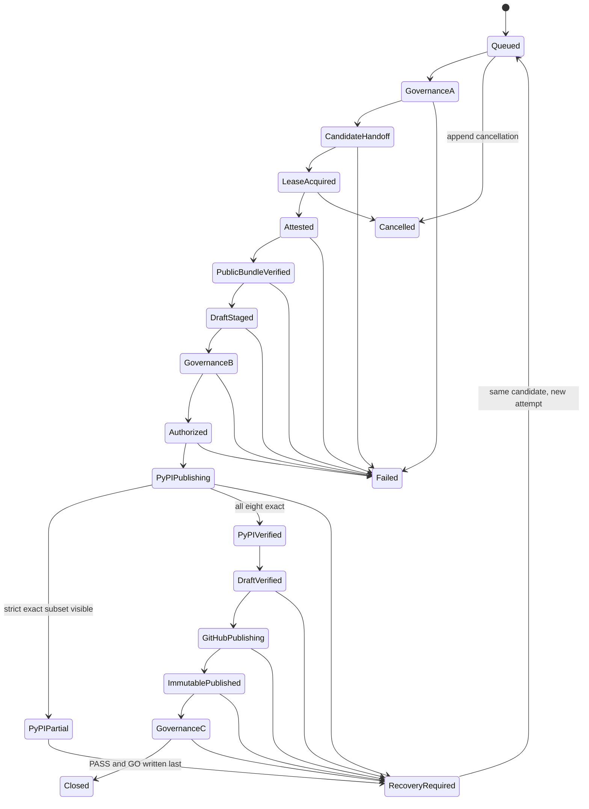

# Feature design: frozen release policy and privileged publication boundary

- Status: APPROVED
- Owner: dpone maintainers
- Issue: SS-45, SS-46, SS-47, SS-48, SS-51, and SS-68 from the v0.73.1 global review
- Target release: 0.73.2
- Last verified: 2026-07-19
- Revision: 2026-07-19 maintainer APPROVED after independent architect `APPROVE_SPEC`; live inventories remain activation blockers
- Approved: 2026-07-19 (maintainer; architect `APPROVE_SPEC` acknowledged)

## Executive summary

The release hardening present in the v0.73.1 review worktree validates an
annotated tag, exact package bytes, required check producers, candidate
inventory, attestations, and PyPI byte identity. Two independent reviews found
connected trust-boundary gaps:

- release policy and the protected base ref can be selected from mutable
  process inputs instead of the frozen release commit;
- replacing the shared governance policy in place would break current PR,
  drift, release, runtime-image, setup, and test consumers unless one atomic
  migration moves all of them to a shared parser and typed views;
- live GitHub comparison does not bind the complete ruleset target,
  conditions, bypass actors, ruleset version, and workflow producer identity;
- jobs holding attestation, OIDC, signing-key, or `contents: write` authority
  execute checked-out repository code, and the privileged workflow graph is
  itself selected from the candidate revision;
- tag identity is not rechecked at each irreversible provider publication
  boundary;
- the two reads are neither internally stable nor followed by a closure read,
  and protected-base advancement has contradictory equality/ancestry rules;
- serialization begins after provider mutations, GitHub concurrency is treated
  as a durable FIFO lock, and queue, attempt, authorization, recovery, and
  cancellation identities are not defined;
- phase receipts lack a strict envelope, producer union, durable append-only
  store, retention, incident-hold, and crash-recovery contract;
- a pre-publication receipt is called `PASS`, token publication can still enter
  the v2 path, and closure does not require PyPI Integrity API provenance; and
- the workflow does not model partial PyPI publication or immutable GitHub
  Release publication as externally committed states.

This researched design migrates the existing governance policy in place to one
schema-v2 authority and moves every consumer atomically to one parser with
branch-governance and release-trust views. A dedicated trusted controller,
whose repository, workflow, revision, environments, and credentials are outside
the candidate revision, owns the privileged composition. It acquires a durable
fenced lease before the first controlled provider mutation, captures bounded
stable governance snapshots A, B, and closure C, and writes schema-complete
append-only receipts before and after every external commit.

The candidate crosses into privilege only through an exact Actions artifact
handoff and then a verified deterministic public-bundle/attestation handoff.
PyPI v2 uses Trusted Publishing only and closes each public file with
cryptographically verified Integrity API provenance. GitHub assets are prepared
and verified on an exact draft release ID, then that same draft is published
under immutable releases and verified with provider release integrity. A
pre-publication decision is `AUTHORIZED`; `status: PASS` and `decision: GO` are
reserved for `state: CLOSED` after snapshot C.

The measurable objective is zero false `GO` decisions when policy, rulesets,
check producers, workflow identity, tag identity, candidate bytes, or public
bytes differ. The design does not claim a cross-provider transaction: after the
first PyPI file is accepted, recovery can only reconcile the same candidate
bytes or stop for an incident.

SS-45 and SS-48 already have local tactical remediations on this branch
(frozen `git show` policy load with `policy_sha256`; annotated-tag recheck
immediately before PyPI and GitHub Release). Those fixes reduce immediate risk
but do not alone close SS-46 or SS-47. SS-68 is closed at design level
(`APPROVED` / ADR Accepted). Full production closure of SS-46/47 requires the
unified policy migration, external privileged controller, durable
lease/evidence store, and A/B/C governance contract documented below.

This document is the approved design authority for that cutover. Approval does
not itself change workflow, policy, production code, provider settings, or live
releases. Unknown provider-assigned repository, ruleset, ruleset-version,
controller, workflow, integration, artifact, evidence-store, and release IDs
remain explicitly `UNVERIFIED`; they block policy activation and live
publication. No placeholder in this document is valid production configuration.

## Personas and customer journey

| Persona | Goal | Current pain | Success signal |
|---|---|---|---|
| Release maintainer | Publish or safely resume one version | A failed upload can leave an unexplained partial public version | The same sealed candidate resumes from observed provider state |
| Security reviewer | Attribute `GO` to immutable policy and trusted producers | Worktree policy, context names, or a foreign producer can look authoritative | Evidence binds policy digest, ruleset versions, app/workflow identity, and exact commit |
| CI/platform engineer | Keep credentials and job topology away from candidate-controlled code | Privileged jobs and their graph are selected by the tagged revision | A separately administered controller revision composes no-checkout privileged jobs |
| Operator/on-call | Diagnose a stopped release without guessing | PyPI and GitHub side effects are summarized as one publish step | State and evidence identify the last external commit and exact recovery action |
| Package consumer | Verify public files and release immutability | A visible version or release does not prove byte identity | PyPI and GitHub assets match the sealed inventory and the GitHub release reports immutable |

### End-to-end journey

| Stage | Maintainer question | Proposed answer and observable result |
|---|---|---|
| Discover | Is this release eligible? | The release run names the canonical tag, frozen commit, policy path, and blocking findings it closes |
| Prepare | What must exist outside the repository? | Active branch and tag rulesets, a dedicated trusted controller, a least-privilege GitHub App, protected environments, an append-only evidence store, immutable releases, and four PyPI Trusted Publishers |
| Configure | Which values are authoritative? | One shared governance-v2 policy read from the release commit at a fixed path; CLI overrides may only repeat, never replace, policy values |
| Execute | What starts publication? | A canonical annotated `vX.Y.Z` tag whose commit is reachable from the policy-owned protected base |
| Observe | How do I know candidates are safe? | The controller shows stable snapshots A/B, an active fenced lease, exact candidate/public-bundle IDs, and `AUTHORIZED`; it does not show `PASS` yet |
| Diagnose | Why did the release stop? | Stable blocker codes distinguish policy, live governance, tag, candidate, PyPI partial, draft, immutable-release, and closure failures |
| Recover | Can I retry? | A recovery attempt references the same recovery and candidate IDs, first reconciles providers under a newer fencing token, then uploads only missing exact files |
| Operate | How are concurrent runs handled? | GitHub queuing is admission control; a durable per-repository/tag lease and append-only ledger are the mutation authority |
| Upgrade | What happens to current scripts? | Existing arguments, artifact names, and v1 evidence remain diagnostic for one minor release; token publication is permanently `LEGACY_UNVERIFIED` and cannot close v2 |

## Scope

### In scope

- one in-place `dpone.github-governance-policy.v2` migration at the fixed
  committed policy path, with no duplicate release-policy file;
- a policy digest and protected repository/base identity derived from the
  frozen release commit;
- complete branch and tag ruleset comparison, including provider version IDs;
- exact required-check producer and GitHub Actions workflow/run identity;
- bounded internally stable governance snapshots A, B, and closure C;
- coherent protected-base ancestry across A/B/C;
- a separately administered, revision-pinned trusted controller as the only
  privileged composition root;
- explicit job, permission, input, output, and credential boundaries;
- queue, serialization, fencing, attempt, candidate, authorization, recovery,
  cancellation, and closure identities;
- immediate tag-object and peeled-commit rechecks before PyPI and GitHub public
  commit points;
- digest-bound candidate and deterministic public-bundle/attestation handoffs;
- schema-complete append-only receipts, durable store, retention, and incident
  hold;
- action-only privileged jobs with no repository checkout or repository code;
- PyPI partial-publication planning and same-candidate recovery;
- Trusted Publisher-only v2 publication and per-file Integrity API provenance;
- GitHub draft asset verification followed by immutable publication;
- evidence v2, compatibility projections, deprecation, migration, security,
  documentation, rollout, and recovery contracts.

### Non-goals

- changing production code, workflows, policy bytes, schemas, tests, or live
  GitHub/PyPI settings in this specification task;
- claiming atomic publication across PyPI and GitHub;
- automatically deleting or replacing a PyPI file or immutable GitHub release;
- treating GitHub Actions `concurrency` as a durable lock, a provider
  transaction, or proof of FIFO dispatch order;
- treating a static policy, screenshot, mocked API response, or stale receipt
  as live evidence;
- inventing tag ruleset IDs, ruleset version IDs, producer IDs, workflow IDs,
  controller IDs, store IDs, release IDs, or immutable-release parity;
- allowing an API token, password, or manually uploaded file to satisfy v2
  Trusted Publisher or Integrity API provenance;
- redesigning GHCR runtime-image promotion, which is governed by
  [ADR 0026](adr/0026-digest-first-runtime-image-promotion.md);
- adding a generic release-provider plugin system;
- changing runtime, connector, Airflow, dbt, or user-manifest behavior.

### Assumptions and constraints

- The repository identity is `PaulKov/dpone`; its provider-assigned numeric ID
  is `UNVERIFIED` in this proposal.
- The fixed policy path remains
  `.agents/policy/github-branch-protection.yml`.
- The schema-v1 bytes currently at that path remain the active authority until
  one integrator lands the complete atomic v2 consumer migration. This
  documentation task does not activate v2.
- The release workflow starts only from an existing canonical annotated tag.
- The privileged controller is a dedicated maintainer-administered repository
  and workflow, not a reusable workflow or action selected from the candidate
  revision. Its live name, numeric repository/workflow IDs, immutable revision,
  GitHub App identity, environments, and evidence-store locator are
  `UNVERIFIED`.
- GitHub ruleset history exposes `version_id`, but the official endpoint
  currently requires repository Administration write permission even for the
  read operation. The implementation must isolate that credential in a pinned,
  no-checkout governance-reader action or reusable workflow maintained outside
  the release-candidate repository, or obtain an explicitly approved
  alternative.
- GitHub immutable releases protect future published releases, not existing
  releases or drafts. An immutable published release locks its uploaded assets
  and associated tag while the release exists; deleting such a release does not
  make the tag name reusable. Current repository-level parity is `UNVERIFIED`.
- For an existing tag, GitHub Release `target_commitish` is ignored and is not
  commit evidence. Tag object and peeled commit identity come from the Git
  ref/object APIs plus a canonical-remote fetch.
- GitHub Release source archives are generated on demand and are not uploaded
  release assets. They are outside the exact public asset manifest.
- PyPI creates a release by accepting files one at a time. There is no
  all-files transaction.
- PyPI publish attestations distinguish Trusted Publishing from API-token
  uploads. v2 requires the Integrity API provenance object and cryptographic
  verification for every public file.
- A GitHub workflow artifact can be deleted with its workflow run. Every
  consumer therefore recomputes candidate and receipt digests; an unavailable
  original handoff is `UNVERIFIED`, not permission to rebuild after partial
  publication.
- GitHub Actions concurrency groups are case-insensitive. With the default
  queue, a new pending run replaces the existing pending run; `queue: max`
  permits at most 100 pending runs. Waiting order is based on when runs start
  waiting and dispatch order is not guaranteed. These semantics are
  availability controls only; the evidence-store lease is authoritative.
- Missing live access, a provider API error, an unknown security-relevant
  field, or an unresolved placeholder is a blocking non-success.

## Public contract

### CLI

The existing internal release tools remain the adapters:

- `tools/agent_policy/release_identity_gate.py`;
- `tools/agent_policy/release_commit_gate.py`; and
- `tools/pypi_release_smoke_dist.py`.

The workflow may add a thin closure/reconciliation command under
`tools/agent_policy/`; no new `dpone` runtime CLI is introduced.

| Surface | v2 behavior | Compatibility behavior |
|---|---|---|
| `--commit-sha` | Required full SHA; also selects the policy blob | Existing spelling retained |
| `--tag` | Required canonical annotated `vX.Y.Z` tag | Existing spelling retained |
| `--repo` | Must equal frozen policy repository identity | Existing value may repeat policy; mismatch fails |
| `--policy` | Omitted or exactly the canonical path; bytes always come from `git show <commit>:<fixed-path>` | Accepted for one minor release; alternate path fails |
| `--ruleset-id` | Omitted or exactly equal to the frozen branch ruleset ID | Accepted for one minor release; cannot override policy |
| `--remote-ref` | Omitted or exactly equal to the frozen protected-base ref | Accepted for one minor release with a deprecation warning |
| `--evidence-version` | `2` in release workflow | Explicit `1` keeps the diagnostic projection for one minor release |
| `--output` | Attempt-scoped, atomic UTF-8 JSON, refuse existing v2 path | v1 projection preserves current overwrite behavior during deprecation |

Exit code remains `0` only for the command's fully satisfied contract and `1`
for invalid input, unavailable evidence, drift, pending state, conflict, or
provider error. Machine-readable JSON goes to stdout or the requested file.
Deprecation guidance goes to stderr. Tokens, authorization headers, signed URLs,
raw provider error bodies, absolute runner paths, and repository secret values
never enter either stream.

The release workflow must invoke v2 explicitly. A v1 report is never
publication authorization even when its projected `status` is `PASS`.

### Python API

There is no new public `dpone` Python API. Internal release tooling uses narrow
immutable models and injected ports:

```python
class FrozenCommitReader(Protocol):
    def read_blob(self, commit_sha: str, path: str) -> bytes: ...

class GitHubGovernanceReader(Protocol):
    def snapshot(self, request: GovernanceRequest) -> GovernanceSnapshot: ...

class PublicPackageReader(Protocol):
    def inventory(self, project: str, version: str) -> PublicInventory: ...
    def provenance(self, project: str, version: str, filename: str) -> Provenance: ...

class ReleaseDraftReader(Protocol):
    def read(self, repository: str, release_id: int) -> ReleaseDraft: ...

class ReceiptLedger(Protocol):
    def append(self, expected_head: ReceiptId, receipt: Receipt) -> ReceiptId: ...

class PublicationLeaseCoordinator(Protocol):
    def acquire(self, lease_id: LeaseId, attempt_id: AttemptId) -> FencedLease: ...
```

Pure policy compares validated models. Git, GitHub, PyPI, filesystem, and
workflow-artifact/store operations remain adapters. Thin CLIs compose only
unprivileged local commands. Privileged composition happens exclusively in the
external trusted controller, never in `dpone.runtime`, connector packages, or
candidate-controlled workflow code.

### Manifest/schema

No workload manifest changes.

The integrator owns the shared schemas and policy bytes. Non-live cutover
prep (2026-07-19) checked in:

- `evals/agent/github-governance-policy-v2.schema.json` (v2 schema sidecar;
  production `evals/agent/github-branch-protection.schema.json` remains v1
  until the atomic consumer migration replaces it in place);
- `docs/schemas/release/release-receipt-envelope-v2.schema.json`;
- `docs/schemas/release/release-public-bundle-v2.schema.json`; and
- `docs/schemas/release/release-evidence-v2.schema.json`.

Typed parser/views live in `tools/agent_policy/governance_policy_v2.py` and
SS-46 projection compare in `tools/agent_policy/governance_projection.py`.
Production `.agents/policy/github-branch-protection.yml` remains v1 until every
consumer row migrates together.

#### Atomic governance-policy migration

There is one migration: the existing file at
`.agents/policy/github-branch-protection.yml` changes atomically from v1 to
`dpone.github-governance-policy.v2`. No second release-policy file, v1/v2
runtime fallback, copied check list, or release-only parser is permitted. One
strict parser returns two immutable typed projections:

1. `BranchGovernancePolicyView`, preserving solo-maintainer mode, owner
   attestation, pull-request rules, protected actions, bypass policy, and exact
   required contexts; and
2. `ReleaseTrustPolicyView`, reusing the same branch ruleset and context
   objects while adding repository identity, producer identity, tag ruleset,
   trusted controller, immutable-release, PyPI, lease, evidence-store, and
   retention requirements.

The following is deliberately non-deployable. Every `UNVERIFIED` value must
come from an approved live inventory before policy activation. The parser
rejects placeholder strings in active policy, duplicate YAML keys, aliases,
unknown keys, booleans used as integers, non-positive provider IDs,
non-canonical refs or digests, duplicate contexts/actors/projects, and a
Trusted Publisher that does not name the external controller.

```yaml
schema: dpone.github-governance-policy.v2
schema_version: 2
github_api_version: "2026-03-10"
branch_governance:
  owner: PaulKov
  last_reviewed: "2026-07-18"
  mode: solo_maintainer
  purpose: Keep master protected without requiring impossible self-approval.
  ruleset:
    id: "<UNVERIFIED_BRANCH_RULESET_ID>"
    version_id: "<UNVERIFIED_BRANCH_RULESET_VERSION_ID>"
    name: protect-master
    target: branch
    source_type: Repository
    source: PaulKov/dpone
    enforcement: active
    conditions:
      include:
        - refs/heads/master
      exclude: []
    bypass_actors:
      - actor_id: "<UNVERIFIED_BRANCH_BYPASS_ACTOR_ID>"
        actor_type: "<UNVERIFIED_BRANCH_BYPASS_ACTOR_TYPE>"
        bypass_mode: "<UNVERIFIED_BRANCH_BYPASS_MODE>"
    pull_request:
      required: true
      allowed_merge_methods:
        - merge
        - squash
      dismiss_stale_reviews_on_push: true
      require_code_owner_review: false
      require_last_push_approval: false
      required_approving_review_count: 0
      required_review_thread_resolution: true
    required_status_checks:
      strict: true
      checks:
        - context: Agent PR receipt
          integration_id: "<UNVERIFIED_INTEGRATION_ID>"
          producer:
            kind: github_actions_workflow
            workflow_path: "<UNVERIFIED_WORKFLOW_PATH>"
            workflow_id: "<UNVERIFIED_WORKFLOW_ID>"
    protected_actions:
      block_deletion: true
      block_force_push: true
  owner_attestation:
    required_when_no_independent_reviewer: true
    evidence_required:
      - PR summary states the owner decision.
      - Required GitHub checks are green on the reviewed head commit.
      - Agent governance receipt is attached for agent-control-plane changes.
      - Admin bypass is not used for normal solo-maintainer merges.
release_trust:
  repository:
    name_with_owner: PaulKov/dpone
    repository_id: "<UNVERIFIED_REPOSITORY_ID>"
    canonical_remote_url: https://github.com/PaulKov/dpone.git
    protected_base_ref: refs/heads/master
    candidate_workflow_path: .github/workflows/release.yml
  tag_ruleset:
    id: "<UNVERIFIED_TAG_RULESET_ID>"
    version_id: "<UNVERIFIED_TAG_RULESET_VERSION_ID>"
    name: protect-release-tags
    target: tag
    source_type: Repository
    source: PaulKov/dpone
    enforcement: active
    conditions:
      include:
        - refs/tags/v*.*.*
      exclude: []
    bypass_actors: []
    protected_actions:
      block_update: true
      block_deletion: true
  trusted_controller:
    repository: "<UNVERIFIED_CONTROLLER_REPOSITORY>"
    repository_id: "<UNVERIFIED_CONTROLLER_REPOSITORY_ID>"
    workflow_path: "<UNVERIFIED_CONTROLLER_WORKFLOW_PATH>"
    workflow_id: "<UNVERIFIED_CONTROLLER_WORKFLOW_ID>"
    workflow_sha: "<UNVERIFIED_CONTROLLER_FULL_COMMIT_SHA>"
    github_app_id: "<UNVERIFIED_CONTROLLER_APP_ID>"
    environments:
      attest: release-attest
      pypi: pypi
      github_release: github-release
  immutable_releases:
    required: true
  publication_control:
    max_pending_attempts_per_release: 32
    lease_ttl_seconds: 300
    lease_renewal_interval_seconds: 60
  pypi:
    index_url: https://pypi.org/
    upload_url: https://upload.pypi.org/legacy/
    projects:
      - dpone
      - dpone-native-accel
      - dpone-airflow-pack
      - apache-airflow-providers-dpone
    trusted_publisher:
      repository_owner: "<UNVERIFIED_CONTROLLER_OWNER>"
      repository_owner_id: "<UNVERIFIED_CONTROLLER_OWNER_ID>"
      repository: "<UNVERIFIED_CONTROLLER_REPOSITORY_NAME>"
      workflow: "<UNVERIFIED_CONTROLLER_WORKFLOW_FILENAME>"
      environment: pypi
  evidence:
    store_id: "<UNVERIFIED_APPEND_ONLY_STORE_ID>"
    pre_mutation_retention_days: 365
    external_commit_retention_days: 2557
    incident_hold_supported: true
```

The final `checks` array has one object for every current context. Its
context-name projection remains exactly:

| Context group | Exact current names | Provider/workflow identity |
|---|---|---|
| Governance | `Agent PR receipt` | `UNVERIFIED` |
| Build | `Build Airflow distribution artifacts` | `UNVERIFIED` |
| Airflow | `Airflow 2.10.5 / py3.11`, `Airflow 2.10.5 / py3.12`, `Airflow 2.11.0 / py3.11`, `Airflow 2.11.0 / py3.12`, `Airflow 3.2.0 / py3.11`, `Airflow 3.2.0 / py3.12`, `Airflow 3.3.0 / py3.11`, `Airflow 3.3.0 / py3.12` | `UNVERIFIED` |
| Runtime wheels | `Runtime wheel smoke / py3.11`, `Runtime wheel smoke / py3.12` | `UNVERIFIED` |
| Core CI | `Analyze Python`, `Quality checks (3.11)`, `Quality checks (3.12)` | `UNVERIFIED` |
| Docs/security/integration | `Build GitHub Pages documentation`, `Dependency Review`, `PostgreSQL XMin integration`, `TruffleHog verified secrets` | `UNVERIFIED` |

The checked-in v1 value `18806829` is historical input, not verified v2
configuration. It may migrate only after a live read proves repository,
target, conditions, bypass actors, complete rules, history version, and
producer identities.

Every semantic consumer changes in one integrator commit:

| Consumer group | Current consumers that must move together | v2 dependency |
|---|---|---|
| Schema/parser | `evals/agent/github-branch-protection.schema.json`, `tools/agent_policy/branch_protection.py` | one parser and closed root model |
| Setup/governance | `tools/agent_policy/governance_checks.py`, `governance_gate.py`, `validate_setup.py`, `select_checks.py`, `setup_inventory.py` | branch view; path, inventory, and CLI remain stable |
| PR and drift | `tools/agent_policy/pr_receipt.py`, `pr_receipt_github.py`, `github_settings_drift.py`, `.github/workflows/agent-pr-receipt.yml`, `.github/workflows/agent-governance-drift.yml` | branch view and canonical live projection; remove the line-oriented ruleset-ID parser |
| Package release | `tools/agent_policy/release_commit_gate.py`, `.github/workflows/release.yml` | frozen release view; no direct YAML indexing |
| Runtime-image release | `.github/workflows/runtime-image.yml` | the same frozen release view; no copied contexts |
| Direct-reader and path tests | `tests/agent_policy/test_agent_policy.py`, `test_branch_protection.py`, `test_github_settings_drift.py`, `test_release_commit_gate.py`, `tests/test_airflow_provider_compatibility_matrix.py`, `tests/test_github_workflow_governance.py`, and workflow/setup policy tests | typed fixtures and projections, including old-command and path compatibility |

Inventory-only references may retain the path, but no code or test may parse
the YAML with its own field assumptions. The migration gate runs all rows
against the same commit. A failure in any row aborts the policy change; the
integrator reverts the complete policy/parser/consumer set rather than leaving
dual schemas active.

Policy bytes are read once from
`git show <release_commit>:.agents/policy/github-branch-protection.yml`.
`policy_sha256` is the SHA-256 of those exact bytes before YAML normalization.
The parsed model and both projections are immutable for the release identity.

### Artifacts and evidence

#### Canonical identities and replay

Every ID is lowercase `sha256:<64 hex>` over RFC 8785-compatible canonical
JSON. The object being hashed includes the exact domain shown below; values
from different domains can never alias:

| Identity | Canonical domain and fields | Replay rule |
|---|---|---|
| release | `dpone.release.identity.v2`: repository ID, canonical version/tag, ordered four-project set | stable semantic release identity; source commit is excluded under [ADR 0011](adr/0011-canonical-fingerprints.md) |
| authority | `dpone.release.authority.v2`: release ID, tag-object SHA, peeled commit SHA, policy SHA-256, protected-base ref | stable for one frozen authorization lineage |
| candidate | `dpone.release.candidate.v2`: authority ID, canonical eight-file inventory digest | identical bytes under the same authority retain the ID |
| attempt | `dpone.release.attempt.v2`: authority ID, controller repository/workflow/run IDs and run attempt | new for every execution |
| queue entry | `dpone.release.queue-entry.v2`: authority ID, attempt ID | appended once; never reused |
| lease | `dpone.release.publication-lease.v2`: repository ID, canonical tag ref | stable key with a monotonically increasing fencing token |
| authorization | `dpone.release.authorization.v2`: attempt ID, candidate ID, public-bundle digest, snapshot A/B digests, lease ID and fencing token | attempt-scoped; expires on lease loss or cancellation |
| recovery | `dpone.release.recovery.v2`: release ID, candidate ID | stable across attempts after the first external commit |
| cancellation | `dpone.release.cancellation.v2`: attempt ID, ledger sequence, reason code | append-only event; never erases earlier state |
| receipt | `dpone.release.receipt.v2`: complete envelope bytes with `receipt_id` omitted | content identity |

A retry never discovers candidates by artifact name or "latest run." It starts
a new attempt, references the same candidate and recovery IDs, obtains a higher
fencing token, and reconciles receipts and providers before requesting a new
authorization. A different candidate after any PyPI or GitHub public commit is
a conflict, not a retry.

#### Receipt envelope and producer union

Every transition is one immutable
`dpone.release-receipt-envelope.v2` object:

```yaml
schema: dpone.release-receipt-envelope.v2
schema_version: 2
receipt_id: sha256:<canonical-envelope-without-receipt-id>
receipt_type: governance_snapshot
stream:
  release_identity_id: sha256:<release-identity>
  release_authority_id: sha256:<release-authority>
  sequence: 7
  previous: sha256:<previous-receipt>
scope:
  kind: candidate
  candidate_id: sha256:<candidate-identity>
attempt:
  attempt_id: sha256:<attempt-identity>
  queue_entry_id: sha256:<queue-entry-identity>
lease:
  lease_id: sha256:<lease-identity>
  fencing_token: 3
producer:
  kind: github_actions_job
  repository_id: "<POSITIVE_CONTROLLER_REPOSITORY_ID>"
  workflow_id: "<POSITIVE_CONTROLLER_WORKFLOW_ID>"
  workflow_path: "<CONTROLLER_WORKFLOW_PATH>"
  workflow_sha: "<FULL_CONTROLLER_COMMIT_SHA>"
  run_id: "<POSITIVE_RUN_ID>"
  run_attempt: 1
  job_name: governance-b
  environment: none
timestamps:
  observed_at: "2026-07-19T00:00:00Z"
  committed_at: "2026-07-19T00:00:01Z"
payload:
  kind: governance_snapshot
  snapshot: B
  snapshot_sha256: sha256:<canonical-snapshot>
payload_sha256: sha256:<canonical-payload>
```

`stream.previous` is the literal `GENESIS` only at sequence `0`. The `scope`
union is exactly `release`, `candidate`, `authorization`, or `recovery`, with
the corresponding IDs required and no null placeholders. The producer union
is exactly:

- `github_actions_job`: controller repository/workflow/path/SHA/run/attempt,
  job name, and environment;
- `trusted_controller_service`: controller deployment digest, GitHub App ID
  and installation ID, and workload identity; or
- `maintainer_incident_action`: provider actor ID, approved incident record
  digest, and action `HOLD` or `RELEASE_HOLD`.

Candidate-repository jobs may produce only candidate-handoff receipts. They
cannot produce lease, authorization, mutation, recovery, or closure receipts.
Payload is a closed tagged union:
`REQUEST_ENQUEUED`, `LEASE_ACQUIRED`, `LEASE_RENEWED`, `LEASE_RELEASED`,
`GOVERNANCE_SNAPSHOT`, `CANDIDATE_HANDOFF`, `MUTATION_INTENT`,
`ATTESTATION_VERIFIED`, `PUBLIC_BUNDLE_VERIFIED`, `DRAFT_TRANSITION`,
`AUTHORIZED`, `PYPI_FILE_TRANSITION`, `GITHUB_RELEASE_TRANSITION`,
`CANCELLATION`, `RECOVERY_OBSERVATION`, `INCIDENT_HOLD`, and `CLOSED`.

`MUTATION_INTENT` is a one-use receipt appended under the active lease before
any short-lived provider capability is issued. Required fields are lease ID,
fencing token, mutation kind (`ATTESTATION`, `DRAFT_TRANSITION`,
`PYPI_FILE`, or `GITHUB_RELEASE`), subject identity digest, and attempt ID.
A second intent with the same `(lease_id, fencing_token, mutation_kind,
subject_identity_digest)` is rejected unless the bytes are identical.

Unknown tags, unknown keys, missing variant fields, null required fields,
placeholder syntax, duplicate identities, non-finite numbers, invalid
timestamps, chain gaps, and a payload/envelope digest mismatch are invalid.

#### Durable append-only store, retention, and incident hold

GitHub Actions artifacts and release assets are transport or public mirrors,
not the receipt authority. The authoritative store is outside the candidate
repository and supports:

- transactional compare-and-swap append on `(release_identity_id, sequence,
  previous)` and idempotent acceptance only of identical receipt bytes;
- transactional lease acquisition/renewal/release plus the matching ledger
  event, with a monotonically increasing fencing token;
- object versioning/WORM retention, encryption, audit logging, and OIDC-bound
  writers scoped to the external controller;
- read-after-write verification by receipt ID and payload digest; and
- retrieval by release, candidate, attempt, authorization, recovery, and
  provider transition identity.

Pre-mutation failed streams are retained for at least 365 days. Any stream with
a PyPI file, published GitHub release, recovery, cancellation after external
commit, or closure receipt is retained for at least 2,557 days. Candidate and
public-bundle bytes needed to recover an exact partial publication use the
same 2,557-day class. Queue and lease events inherit their release stream's
class.

An incident `HOLD` is an append-only receipt naming `hold_id`, scope, reason
code, incident-record digest, actor, and start time. Garbage collection fails
closed while any hold is active. Releasing a hold appends a distinct
`RELEASE_HOLD` event; it never removes history or shortens the baseline
retention period. The live store ID, enforcement configuration, and retention
parity are `UNVERIFIED` and block activation.

#### Verified deterministic public bundle

Draft staging consumes only an exact `release-public-bundle.v2` handoff created
after candidate and attestation verification. Its canonical manifest binds:

- the eight distributions by normalized project, filename, size, and SHA-256;
- `release-candidate-sha256sums.txt`;
- the canonical candidate inventory;
- retained public SBOM/provenance/attestation JSON assets listed below;
- release-body bytes and SHA-256, but not a duplicate release-notes asset;
- each GitHub artifact-attestation receipt by filename and SHA-256;
- candidate, policy, snapshot-A, lease, and attestation receipt IDs; and
- the complete expected GitHub asset name set in bytewise sort order.

Signature and timestamp bytes inside provider attestations may differ across
new attestations; "deterministic bundle" means that one chosen attestation set
has a canonical closed manifest and immutable digest. It is never regenerated
or glob-expanded after verification. An unprivileged verifier downloads the
handoff by exact controller run, artifact ID, and provider digest, rejects
missing or extra files, recomputes every digest, cryptographically verifies all
attestations, and appends `PUBLIC_BUNDLE_VERIFIED`. Only then may the
action-only draft job receive the public-bundle ID and artifact ID.

#### Existing artifact compatibility lifecycle

Every current release artifact has an explicit disposition:

This table records the v0.73.2 baseline and therefore preserves its historical
unsuffixed artifact labels. Starting in v0.74, audit/diagnostic workflow
uploads use `<base>-<run-id>-<attempt>`. Immutable `release-candidates` and
`release-supply-chain-local` retain fixed no-rebuild names. Downstream jobs
bind the producer's exact artifact ID and provider digest rather than treating
either a base or a reconstructed current-attempt name as a selector.

| Current artifact | v2 disposition | Compatibility window / authority |
|---|---|---|
| `release-preflight/release_identity.json` | projected into the v2 preflight receipt | standalone v1 mirror for one minor release; diagnostic only |
| `release-preflight/exact_commit_checks.json` | replaced by attributable A/B/C snapshot receipts | standalone v1 mirror for one minor release; never authorization |
| `release-preflight/workflow_context.json` | fields move into the producer union | standalone mirror for one minor release |
| `release-preflight` Actions artifact (v0.73.2 base; current `release-preflight-<run-id>-<attempt>`) | retained as a compatibility mirror | 90-day transport retention; not authoritative |
| eight wheels/sdists | preserved byte-for-byte | canonical candidate and public assets |
| `release-candidate-sha256sums.txt` | preserved | canonical public asset |
| `release_notes.md` | preserved as release-body input | not a release asset; body digest is authoritative |
| `candidate-inventory.json` | preserved as a compatibility member and projected into `release-public-bundle.v2.json` | one minor release under old name |
| `package-archive-gate.json`, `pip-check.txt`, `candidate-versions.txt`, `package-smoke.txt` | preserved in the sealed candidate handoff | one minor release as diagnostics; typed receipts then replace them |
| `release-candidates` Actions artifact | preserved as immutable unprivileged transport selected by exact run/artifact ID/digest; fixed name is a no-rebuild tripwire | 90-day mirror plus durable recovery copy when an external commit occurs |
| `sbom.spdx.json`, `sbom.cyclonedx.json` | preserved | canonical public assets |
| `provenance.intoto.json` | preserved as supplemental provenance | public asset; never substitutes for provider verification |
| `supply_chain_attestation.json` | preserved as the deterministic supplemental bundle index | public asset |
| `supply_chain_attestation.md` | preserved only in diagnostic transport | one minor release; not a public asset or closure evidence |
| `signature.hmac-sha256.json` | no new v2 production; existing copies remain readable as `LEGACY_UNVERIFIED` | reader support for one minor release; never v2 authority |
| eight `*.github-attestation.json` receipts | preserved from the trusted-controller attestation and verification | canonical public assets bound by the bundle |
| `release-attestation-evidence` Actions artifact (v0.73.2 base; current `release-attestation-evidence-<run-id>-<attempt>`) | retained as a compatibility mirror of the exact attestation handoff | 90 days; external store is authoritative |
| `pypi_release_smoke.md` and `pypi-resolver-smoke` (v0.73.2 base; current artifact `pypi-resolver-smoke-<run-id>-<attempt>`) | retained as post-publication diagnostics | one minor release; typed per-file Integrity receipts supersede them |
| GitHub-generated source `.zip`/`.tar.gz` links | explicitly excluded | generated on download, not uploaded release assets |

No existing artifact is silently reclassified as v2 proof. Previously
published assets are never rewritten.

#### Final evidence and status vocabulary

The pre-publication receipt uses `authorization_state: AUTHORIZED`; it does not
contain `status: PASS` or `decision: GO`. `AUTHORIZED` is valid only while its
attempt holds the recorded fencing token. Final evidence includes snapshots A,
B, and closure C, all prior receipt IDs, and:

```yaml
schema: dpone.release-evidence.v2
schema_version: 2
status: PASS
decision: GO
state: CLOSED
release_identity_id: sha256:<release-identity>
release_authority_id: sha256:<release-authority>
candidate_id: sha256:<candidate-identity>
attempt_id: sha256:<closing-attempt>
recovery_id: sha256:<recovery-identity>
authorization:
  authorization_id: sha256:<authorization-identity>
  authorization_state: AUTHORIZED
  lease_id: sha256:<lease-identity>
  fencing_token: 3
public_bundle:
  artifact_id: "<POSITIVE_PROVIDER_ID>"
  artifact_digest: sha256:<provider-artifact>
  manifest_sha256: sha256:<canonical-manifest>
governance_snapshots:
  A:
    started_at: "2026-07-19T00:00:00Z"
    completed_at: "2026-07-19T00:00:10Z"
    read_count: 2
    snapshot_sha256: sha256:<snapshot-a>
    protected_base_sha: "<FULL_COMMIT_SHA>"
  B:
    started_at: "2026-07-19T00:10:00Z"
    completed_at: "2026-07-19T00:10:10Z"
    read_count: 2
    snapshot_sha256: sha256:<snapshot-b>
    protected_base_sha: "<FULL_COMMIT_SHA>"
  C:
    started_at: "2026-07-19T00:20:00Z"
    completed_at: "2026-07-19T00:20:10Z"
    read_count: 2
    snapshot_sha256: sha256:<snapshot-c>
    protected_base_sha: "<FULL_COMMIT_SHA>"
pypi:
  files:
    - project: "<EXPECTED_PROJECT>"
      filename: "<EXPECTED_FILE>"
      size: "<BOUNDED_NON_NEGATIVE_INTEGER>"
      sha256: "<64_LOWERCASE_HEX>"
      yanked: false
      transition: UPLOADED_OR_ALREADY_EXACT
      integrity:
        media_type: application/vnd.pypi.integrity.v1+json
        provenance_sha256: sha256:<response-bytes>
        publisher_kind: GitHub
        publisher_repository: "<EXACT_CONTROLLER_REPOSITORY>"
        publisher_workflow: "<EXACT_CONTROLLER_WORKFLOW_FILENAME>"
        publisher_environment: pypi
        predicate_type: https://docs.pypi.org/attestations/publish/v1
        cryptographically_verified: true
github_release:
  release_id: "<POSITIVE_PROVIDER_ID>"
  tag: vX.Y.Z
  draft: false
  prerelease: false
  immutable: true
  release_body_sha256: sha256:<release-body>
  assets_sha256: sha256:<canonical-asset-inventory>
  release_integrity_verified: true
receipt_chain:
  final_sequence: "<POSITIVE_INTEGER>"
  head_receipt_id: sha256:<closed-receipt>
  verified: true
blockers: []
```

Every PyPI file must be downloaded, hash-matched, queried through
`GET /integrity/<project>/<version>/<filename>/provenance`, and verified
cryptographically against the exact file and configured external-controller
Trusted Publisher. Presence of a provenance object without signature,
certificate, subject/digest, predicate, and publisher-claim verification is
not closure. An API-token upload has no acceptable publish attestation and is
`LEGACY_UNVERIFIED`, even if its bytes match.

Allowed report statuses remain `PASS`, `FAIL`, `SKIP`, `N/A`, and
`UNVERIFIED`. Transition states include `AUTHORIZED`,
`PYPI_PARTIAL_EXACT`, `PYPI_CONFLICT`, `GITHUB_DRAFT_READY`,
`GITHUB_IMMUTABLE_PUBLISHED`, `RECOVERY_REQUIRED`, and `CLOSED`. Only
`CLOSED` may carry final `PASS/GO`.

### Compatibility and migration

- Existing tag format, four package names, exact eight-file candidate set, and
  `.github/workflows/release.yml` tag-push entrypoint remain. That workflow
  becomes an unprivileged candidate producer; it cannot compose or invoke
  privileged publication jobs.
- `--policy`, `--ruleset-id`, and `--remote-ref` remain accepted for one minor
  release only as equality assertions. They cannot select authority.
- Evidence v1 remains available through explicit `--evidence-version 1` for
  one minor release as a lossy diagnostic projection. It cannot authorize
  publication or project `AUTHORIZED/CLOSED`.
- Policy activation is one atomic v2 cutover across the consumer matrix above.
  There is no active v1 policy parser fallback. Before the first provider
  mutation the whole cutover can be reverted; after a public commit, recovery
  continues under the frozen v2 policy and original candidate.
- The four PyPI projects must configure the same exact external-controller
  owner, repository, workflow filename, environment, and stable owner ID.
  Candidate-repository or reusable-workflow identities do not satisfy v2.
- Automatic long-lived-token selection is removed. A separately and manually
  invoked first-project bootstrap may remain for one minor release, but its
  output is permanently `LEGACY_UNVERIFIED`; it cannot share the v2
  authorization, receipts, public bundle, or closure path.
- Existing releases remain `LEGACY_UNVERIFIED` for immutable-release and
  Integrity API parity. Evidence is never backfilled as `PASS`.
- Each compatibility warning names the removal release and replacement. The
  v1 projection, equality-only arguments, old diagnostic filenames, HMAC
  reader, and token bootstrap are removed only after the documented one-minor
  window and usage review.

## Detailed algorithm

### 1. External admission, frozen authority, and queue identity

1. The candidate repository's tag-push workflow may build candidates, but it
   cannot dispatch, select, or compose the privileged controller.
2. A separately administered GitHub App delivers the tag event to the trusted
   controller, or a maintainer starts that controller directly. All supplied
   repository, tag, commit, run, and artifact values are untrusted selectors.
3. The controller workflow must execute from the repository, workflow ID/path,
   and full commit SHA frozen in policy. Any other controller identity fails.
4. Normalize the target repository numeric ID, canonical annotated tag ref,
   tag-object SHA, peeled commit SHA, and SemVer. Reject a branch, lightweight
   tag, missing tag, or repository-name-only identity.
5. Read and hash the fixed policy blob with
   `git show <peeled-commit>:.agents/policy/github-branch-protection.yml`.
   Validate unified governance policy v2 and derive every authority from it.
6. Verify package metadata, exact internal pins, changelog, canonical remote,
   and release-commit ancestry from the frozen policy.
7. Derive release, frozen-authority, and attempt IDs. Transactionally append
   `REQUEST_ENQUEUED` with a store-assigned monotonically increasing queue
   sequence.
8. The durable queue admits at most 32 pending entries per lease key and
   selects the lowest non-cancelled sequence. GitHub Actions `queue: max` may
   reduce runner churn, but it is neither the order authority nor the lock.

No worktree policy, candidate-controlled workflow graph, caller path, caller
remote, environment ruleset, repository name without numeric ID, or fallback
default can influence authority.

### 2. Bounded stable governance snapshots A, B, and closure C

The same snapshot procedure is used three times:

- A starts after admission and before the controller accepts a candidate;
- B starts after the verified public bundle has been staged on the exact draft
  and immediately before `AUTHORIZED`; and
- closure C starts after all PyPI files and the immutable GitHub release have
  been observed exact and immediately before final closure.

One snapshot attempt performs two complete, independent provider reads at
least five seconds apart. Each read fetches repository numeric identity,
protected-base ref/SHA, annotated tag object and peeled commit, complete branch
and tag rulesets plus history-head version IDs, required check/check-suite/
workflow-run identities, immutable-release setting, pagination metadata, and
provider observation times. Bounded limits are three attempts and 180 seconds
total per A, B, or C. Each page is capped at the provider maximum of 100 items;
pagination must terminate with an observed final page.

The canonical start and end projections must be byte-identical, including the
protected-base SHA. Response timestamps and transport metadata are recorded
outside the projection. A mismatch retries the whole snapshot within the
budget; budget exhaustion is `UNVERIFIED`, never the "latest" read.

Across A, B, and C:

- repository ID, remote, protected-base ref, tag object, peeled commit,
  ruleset IDs/version IDs/security projection, immutable setting, and exact
  required-check producer/run identities remain equal to policy and A;
- protected-base SHAs need not be equal between snapshots;
- `base_A` must be an ancestor of or equal to `base_B`, and `base_B` an
  ancestor of or equal to `base_C`;
- the release commit must be an ancestor of or equal to all three base SHAs;
  and
- a rewind, force replacement, sideways history, changed remote/ref, or
  release commit becoming unreachable is blocking.

This is the only advancement rule. It replaces the contradictory combination
of exact protected-base SHA equality and permission for base advancement.
Unknown rule types, hidden bypass actors, empty integration IDs, ambiguous
workflow runs, cache substitution, pagination truncation, rate limit, API
error, or immutable-release `404` is blocking.

### 3. Candidate handoff and pre-mutation fenced lease

1. The unprivileged candidate workflow builds the four distributions, applies
   the closed bounded no-follow inventory, inspects archives and metadata,
   performs fresh-install and `pip check`, derives release notes from the
   frozen changelog, and generates the supplemental SBOM/provenance bundle
   without a signing secret or HMAC authority.
2. It uploads one non-overwritable, attempt-scoped candidate artifact and
   records workflow run ID/attempt, artifact ID/provider digest, canonical
   eight-file inventory, and candidate ID.
3. The external controller downloads by those exact identities, recomputes all
   bytes and metadata, and appends `CANDIDATE_HANDOFF`. Name-only lookup,
   "latest successful run," rebuild, missing provider digest, or changed file
   identity fails.
4. Before any attestation write, draft creation/upload, PyPI upload, or GitHub
   release publication, the selected queue entry acquires the durable lease by
   compare-and-swap. Acquisition increments the fencing token and appends
   `LEASE_ACQUIRED` in the same store transaction.
5. The lease has a 300-second TTL and is renewed at least every 60 seconds.
   Every mutation job verifies the current token, appends a one-use mutation
   intent, and receives its short-lived provider capability only after that
   check. A stale attempt cannot append or obtain another capability.

Candidate artifact upload is unprivileged input preparation and cannot mutate
PyPI, attestations, drafts, tags, or releases. It may occur before the
publication lease. Every controlled provider mutation starts after lease
acquisition. Because provider APIs do not accept dpone fencing tokens, a
provider call that was already accepted at lease loss is reconciled by the
observer; the design does not claim impossible provider-side atomic fencing.

### 4. Attestation, verified public bundle, and draft staging

1. The action-only attestation job receives only candidate artifact ID/digest,
   candidate ID, lease ID/token, and exact subject manifest.
2. It uses full-SHA-pinned actions, no checkout, package installation, cache,
   repository script, arbitrary shell, or mixed write authority.
3. Generate provider attestations for all eight candidates from the external
   controller identity.
4. A separate unprivileged job downloads the candidates and attestations,
   verifies subject filename/digest plus the external controller's signer
   repository, workflow, ref, full workflow SHA, predicate, and receipt bytes.
   It separately verifies that the authenticated append-only handoff binds the
   target candidate authority ID, tag object, peeled commit, and policy digest,
   then appends `ATTESTATION_VERIFIED`.
5. Assemble the closed public-bundle manifest, transfer it once by exact
   artifact ID/provider digest, independently recompute every member, and
   append `PUBLIC_BUNDLE_VERIFIED`.
6. Only then may the action-only `contents: write` job create or resume one
   draft by exact target repository and tag, upload only manifest-listed
   assets, and append every `DRAFT_TRANSITION`.
7. Draft creation must reference an already existing tag. GitHub ignores
   `target_commitish` for an existing tag, so that field is neither supplied as
   authority nor recorded as commit proof.

Draft staging is a lease-protected provider mutation and remains reversible.
It is not `AUTHORIZED`, `GO`, or `PASS`.

### 5. Snapshot B and publication authorization

1. Verify the exact draft ID, release-body digest, and public-bundle assets.
2. Capture bounded stable snapshot B using the procedure above.
3. Require B's non-base governance projection to equal policy and A, and apply
   the A-to-B fast-forward ancestry rule.
4. Recheck the active lease and fencing token after B.
5. Derive the authorization ID and append an authorization receipt whose state
   is exactly `AUTHORIZED`.

The receipt contains no `status: PASS` and no `decision: GO`. Authorization is
attempt-, candidate-, snapshot-, bundle-, lease-, and fencing-token-specific.
It expires immediately on lease loss, cancellation, governance drift, tag
drift, or a changed candidate/public bundle.

GitHub and PyPI do not expose atomic "recheck and publish" operations. The tag
ruleset plus credential broker are preventive controls; provider reconciliation
and snapshot C are detective controls. A race produces `RECOVERY_REQUIRED`, not
retroactive authorization or success.

### 6. PyPI plan, Trusted Publisher commit, and partial recovery

1. Under the active authorization, query the JSON release endpoint and JSON
   Simple Index for all four projects with bounded retry.
2. For each expected file, compare normalized project, filename, size,
   SHA-256, yanked state, and Integrity API provenance.
3. Classify:
   - absent as `PENDING_UPLOAD`;
   - exact bytes with cryptographically verified publish attestation from the
     configured external-controller Trusted Publisher as
     `ALREADY_PUBLISHED_EXACT`; or
   - different/duplicate/yanked bytes, missing or invalid provenance, token
     publisher, or another publisher identity as `CONFLICT`.
4. If any conflict exists, append an incident hold and publish nothing.
5. Seal only absent files from the original candidate into an upload-subset
   handoff bound to candidate, authorization, and fencing token.
6. Immediately re-read tag object/peeled commit and recheck the lease.
7. The action-only `pypi` environment job uses only `id-token: write` and the
   exact external-controller Trusted Publisher. Duplicate skipping and API
   token fallback are disabled.
8. After each provider response, the observer re-reads all project inventories.
   For every visible file it downloads and hashes bytes, retrieves the exact
   Integrity API provenance, verifies the DSSE signature/certificate,
   single-file subject/digest, publish-attestation predicate, and exact
   publisher claims, then appends `PYPI_FILE_TRANSITION`.
9. Eight exact verified files continue. A strict exact subset produces
   `PYPI_PARTIAL_EXACT`, activates the stable recovery ID, and stops the
   attempt without releasing recoverability.
10. A later attempt may upload only the remaining files from the same
    candidate after obtaining a higher fencing token and new authorization.

PyPI deletion is not rollback. A conflict is an incident; normal remediation
is a release-wide yank when appropriate and a new reviewed version.

### 7. Provider-exact GitHub immutable publication

1. Recheck tag object/peeled commit, immutable-release setting, authorization,
   and active fencing token immediately before publication.
2. Read the draft by exact provider release ID, never by "latest."
3. Require the same repository/tag/release ID, `draft: true`,
   `prerelease: false`, exact body digest, and the complete public-bundle asset
   set.
4. For each asset require one unique positive asset ID, `state: uploaded`,
   exact name/size, and exact provider `sha256:` digest. Reject `starter`,
   missing digests, extras, duplicates, renamed files, or generated source
   archives.
5. Require typed Integrity receipts for all eight PyPI files.
6. The action-only `contents: write` job publishes that same draft and performs
   no asset operation afterward.
7. The read-only verifier requires the same provider release ID and tag,
   `draft: false`, `prerelease: false`, `immutable: true`, exact body and asset
   inventory, and unchanged tag object/peeled commit.
8. Verify GitHub's immutable-release attestation with `gh release verify` (or
   its documented API equivalent) and every local public-bundle asset with
   `gh release verify-asset`. Generated source archives are excluded because
   GitHub creates them on demand and does not support asset verification for
   them.

Immutable publication locks uploaded assets and the associated tag while the
release exists. GitHub still permits deletion of the release; after deletion
the tag may be deleted but the tag name cannot be reused. The design therefore
does not claim that an immutable release object is undeletable.

### 8. Snapshot C, closure, cancellation, and recovery

1. After exact PyPI and GitHub observations, capture bounded stable closure
   snapshot C.
2. Require the A/B/C non-base governance projection and required-check
   identities to remain exact; apply the A-to-B-to-C fast-forward ancestry
   rule.
3. Reconcile the full append-only chain, active fencing token, candidate/public
   bundle, every PyPI Integrity receipt, GitHub release ID/assets/integrity,
   tag object, and policy bytes.
4. Append `CLOSED` with `status: PASS` and `decision: GO` last, then release the
   lease in a separate append. A closed replay returns the existing exact
   closure; it does not create another `PASS`.
5. Poll exact checks for at most 300 seconds at 15-second intervals and PyPI
   visibility for at most 900 seconds at 30-second intervals. Honor
   `Retry-After` within those budgets. Never retry identity, authorization,
   schema, digest, publisher, or ancestry conflicts.
6. Queued cancellation appends `CANCELLATION` and removes the entry from
   selection. Cancellation while holding the lease stops renewal and future
   capability minting, then invokes the always-run observer.
7. On process loss or lease expiry, the observer uses the durable chain and
   provider reads. It may append only observed facts; it cannot synthesize a
   missing receipt or assume an unobserved mutation failed.
8. Before any external commit, cancellation can end as failed/abandoned. After
   an external commit it activates the stable recovery ID and ends
   `RECOVERY_REQUIRED`; it never deletes public state.

### Pseudocode

```text
request = trusted_controller_admit(untrusted_event)
policy = validate_unified_v2(
    git_show(request.peeled_commit_sha, FIXED_POLICY_PATH)
)
identity = verify_release_identity(request, policy)
attempt = append_queue_entry(identity, controller_run_identity())

snapshot_a = stable_snapshot("A", identity, policy, max_attempts=3, budget=180)
require_policy_parity(snapshot_a)

candidate = verify_exact_candidate_handoff(
    run_id=request.candidate_run_id,
    artifact_id=request.candidate_artifact_id,
    artifact_digest=request.candidate_artifact_digest,
)

lease = acquire_fenced_lease(identity, attempt, ttl=300)
try:
    attestation = attest_action_only(candidate, lease)
    verify_attestation_unprivileged(attestation, candidate, policy)
    bundle = build_and_verify_public_bundle(candidate, attestation, policy)
    draft = stage_exact_draft_action_only(bundle, lease)

    snapshot_b = stable_snapshot("B", identity, policy, max_attempts=3, budget=180)
    require_same_governance(snapshot_a, snapshot_b)
    require_fast_forward(snapshot_a.base, snapshot_b.base)
    authorization = append_authorized(candidate, bundle, snapshot_a, snapshot_b, lease)

    pypi_plan = reconcile_pypi_with_integrity(candidate, policy)
    require(no_conflicts(pypi_plan))
    publish_absent_subset_trusted_only(pypi_plan, authorization, lease)
    pypi = verify_all_files_and_integrity_or_record_partial(candidate, policy)
    if pypi.is_partial:
        activate_recovery_id(identity, candidate)
        stop_recovery_required()

    verify_exact_draft_and_tag(draft, bundle, authorization, lease)
    publish_same_draft_action_only(draft.id, lease)
    github = verify_immutable_release_and_assets(draft.id, bundle, identity)

    snapshot_c = stable_snapshot("C", identity, policy, max_attempts=3, budget=180)
    require_same_governance(snapshot_a, snapshot_b, snapshot_c)
    require_fast_forward(snapshot_a.base, snapshot_b.base, snapshot_c.base)
    append_closed_pass_last(pypi, github, snapshot_c, authorization, lease)
finally:
    observe_provider_state_and_append_facts()
    release_or_expire_lease_without_deleting_public_state()
```

### State machine



### Transaction and evidence boundaries

| Boundary | Reversible? | Commit evidence | Recovery |
|---|---|---|---|
| Queue and snapshot A | Yes; no public mutation | queue and stable-snapshot receipts | cancel or start a new attempt after correction |
| Candidate artifact upload | Yes; artifact may be discarded | artifact ID/digest plus handoff receipt | rebuild only before any PyPI file exists |
| Fenced lease acquisition | Durable control-state mutation | lease ID/token and ledger sequence | expire; retry with a higher token |
| Provider attestation | Not assumed deletable | exact attestation and verification receipts | re-attest same candidate under a new authorization |
| Verified public bundle | Immutable handoff | artifact ID/digest and closed manifest | rebuild only before provider publication and reauthorize |
| GitHub draft/assets | Yes while draft | draft ID and per-asset transition receipts | repair or recreate under active lease, then repeat B |
| Snapshot B / `AUTHORIZED` | Authorization, not public success | snapshot and authorization IDs | expires on lease/candidate/governance change |
| Each PyPI file upload | No automatic rollback | public filename/digest/provenance | upload missing exact files from same handoff |
| GitHub draft publication | No asset/tag mutation while immutable release exists | release ID, integrity result, exact asset set | corrective new version for defects |
| Snapshot C / final closure | Append-only evidence | stable C and complete receipt chain | no `PASS` until current attributable evidence closes |

### Edge cases

- **Empty candidate directory:** fail closed. During recovery, an empty upload
  subset is valid only when all eight public files already match.
- **Null or missing provider ID/version ID:** policy is invalid or live state is
  `UNVERIFIED`; publication does not start.
- **Duplicate YAML key, context, producer, file, asset, or release:** fail before
  side effects.
- **Legacy successful commit status:** record diagnostically; never satisfy a
  required context.
- **Multiple check runs:** require the latest attributable run from the exact
  configured producer/workflow; any ambiguity or newer non-success blocks.
- **Ruleset target/condition/bypass drift:** fail even when context names remain
  equal.
- **Unstable snapshot:** discard both reads and retry the entire snapshot
  within the three-attempt/180-second budget; never merge fields across reads.
- **Tag deleted, replaced, changed from annotated to lightweight, or peeled to
  another commit:** stop at the next commit gate.
- **Protected base advances within one snapshot:** that attempt is unstable.
  Advancement between A/B/C is allowed only along the explicit fast-forward
  ancestry chain while the release remains reachable.
- **Provider timeout, 401, 403, 404, 429, 5xx, malformed JSON, or pagination
  truncation:** classify explicitly. GitHub immutable-release `404` means not
  enabled; other unavailable evidence is non-success.
- **Queue overflow or replacement:** the durable queue rejects entry 33 for
  the same lease key. GitHub cancellation/reordering does not remove the
  append-only queue or cancellation receipts.
- **Lease loss before mutation:** no capability is minted; append failure and
  retry as a new attempt. **Lease loss during a provider call:** reconcile
  provider state under a higher fencing token and do not infer rollback.
- **PyPI partial exact publication:** retain exact state and resume only from
  the original candidate.
- **PyPI missing/invalid Integrity API provenance, token publisher, digest
  conflict, or yanked file:** incident hold; do not delete, overwrite, or
  continue to GitHub publication.
- **GitHub draft has an extra or `starter` asset:** repair while draft, record
  the transition, regenerate/verify the public bundle if bytes changed, then
  repeat snapshot B and authorization.
- **GitHub release already published:** exact same immutable release may be
  verified through closure C and closed idempotently; mutable or different
  identity fails.
- **GitHub release deleted after publication:** append incident hold and
  `RECOVERY_REQUIRED`; do not recreate the same tag/release identity.
- **Candidate artifact deleted after PyPI partial:** state is
  `RECOVERY_REQUIRED/UNVERIFIED`; do not rebuild the same version.
- **Concurrent rerun:** has a distinct attempt/queue entry, waits for the
  durable lease, obtains a higher fencing token, and replans from provider
  state.
- **Cancellation:** append the cancellation identity before stopping renewal.
  After any external commit, recovery remains tied to the original candidate.
- **Schema/API evolution:** unknown security-relevant fields or rule types fail
  until policy and tests are deliberately updated.
- **Nested data and connector capability negotiation:** `N/A`; this is release
  governance, not an ETL payload path.

## Architecture

### Components and responsibilities

| Component | Existing/new | Responsibility | Dependencies |
|---|---|---|---|
| frozen commit reader | changed internal | Read fixed policy/package/changelog blobs from one commit | local Git adapter |
| unified governance-policy parser | changed shared internal | Strict v2 schema and branch/release typed views without copied fields | pure YAML/model code |
| release identity gate | changed internal | Tag, commit, package, base, repository identity | frozen reader, Git adapter |
| stable governance snapshot service | changed internal | Bounded start/end reads for A/B/C and coherent base ancestry | GitHub/Git reader ports |
| candidate inventory/handoff | changed internal | Closed bounded set and exact artifact ID/digest | filesystem and Actions artifact adapters |
| durable queue/lease service | new external | FIFO admission sequence, CAS lease, fencing, and capability eligibility | append-only store |
| public-bundle service | new internal | Closed manifest and independent attestation/byte verification | candidate and attestation readers |
| PyPI reconciliation and Integrity verifier | new internal | Absent/exact/conflict plan and per-file cryptographic provenance | public PyPI ports |
| GitHub draft/release verifier | new internal | Exact draft, asset, immutable state, and release-integrity closure | GitHub release ports |
| evidence v2 ledger | new external | Schema-complete append-only receipts, retention, and holds | WORM store adapter |
| trusted controller | new external composition root | Select reviewed jobs and isolate every privileged capability | protected external repository |

### Ports, adapters, and composition root

- Models and decisions are pure and provider-response-free.
- Git, GitHub REST/attestation/Actions artifacts, PyPI JSON/Simple/Integrity,
  and the durable store implement narrow ports.
- CLI files parse arguments, construct adapters, call one application service,
  and render stable output.
- A protected, revision-pinned workflow in the separately administered trusted
  controller repository is the only privileged composition root.
- `.github/workflows/release.yml` in the candidate repository remains a thin,
  unprivileged candidate producer. It cannot call the controller with a
  credential, choose controller code, mint a publication token, or hold
  attestation/release/PyPI authority.
- Provider mutation jobs consume only verified artifact/authorization IDs and
  use action-only steps. No candidate checkout, candidate action, candidate
  container, repository script, package manager, cache, or arbitrary command is
  permitted on those paths.
- The queue/lease broker verifies the current fencing token before issuing a
  one-use, short-lived provider capability. Provider observers append results
  separately, so publication jobs do not also hold evidence-store write
  authority.
- No release-governance module is imported by `dpone.runtime`, manifests,
  connectors, Airflow provider code, or normal CLI help/import paths.
- Shared schemas, workflow, policy, changelog, ADR index, and documentation are
  parent-integrator owned.

The controller repository name/ID, workflow path/ID/SHA, App and installation
IDs, protected-environment rules, and evidence-store identity remain
`UNVERIFIED`. Until an independent live inventory confirms them, no job below
is deployable and policy activation is blocked. Those unknowns do not block
review of this architecture.

### Trusted controller job/permission/input/output matrix

`none` means no target-repository or package-index permission. Evidence-store
writers use an audience-bound OIDC exchange that cannot mint GitHub or PyPI
credentials. The ruleset-history App permission is technically
`Administration: write` because that is what the current GitHub endpoint
requires; the pinned reader exposes no mutation operation.

| Logical job / location | Exact granted authority | Accepted immutable inputs | Required output |
|---|---|---|---|
| `candidate-build` / candidate repo | target `contents: read`; no OIDC, attestations, administration, or contents write | tag event, peeled commit, fixed policy blob | exact candidate run/attempt/artifact ID and provider digest |
| `admit-and-snapshot-a` / controller | controller `contents: read`; target App `metadata: read`, `contents: read`, `actions: read`, `checks: read`, `statuses: read`, isolated `administration: write`; store append only | target repository ID, tag ref/object, peeled commit, policy digest, controller identity | queue receipt and stable snapshot-A receipt |
| `candidate-import` / controller | target App `actions: read`, `contents: read`; store append only | exact candidate run/attempt/artifact ID/digest | verified candidate ID and handoff receipt |
| `lease-acquire-renew` / controller service | store lease CAS and append only; no GitHub/PyPI mutation | release/attempt/queue IDs and current ledger head | lease ID, fencing token, expiry, lease receipt |
| `attest` / controller protected environment | controller `id-token: write`, `attestations: write`, `contents: read`; no target contents write | candidate ID, exact subject manifest, current one-use lease capability | provider attestation IDs/bytes for eight subjects |
| `verify-and-bundle` / controller | target/controller `actions: read`, `attestations: read`; store append only | candidate and attestation IDs/digests | attestation receipt and verified public-bundle artifact ID/digest |
| `stage-draft` / controller protected environment | target App `contents: write` only; no OIDC, administration, or store write | existing tag identity, exact public-bundle ID/digest, one-use lease capability | exact draft release ID and provider responses |
| `observe-draft` / controller | target App `contents: read`; store append only | draft ID and public-bundle manifest | per-asset draft receipts |
| `snapshot-b-authorize` / controller | same read-only target API set and isolated ruleset-history permission as A; store append only | A, draft receipts, candidate/public-bundle IDs, active lease | stable B and `AUTHORIZED` receipts |
| `publish-pypi` / controller `pypi` environment | `id-token: write` for exact PyPI audience only; no target/store write | sealed absent-file subset, authorization ID, one-use lease capability | upload response; no success decision |
| `observe-pypi` / controller | public PyPI read; store append only | candidate ID and expected four-project/eight-file inventory | byte and Integrity receipts per file |
| `publish-github` / controller protected environment | target App `contents: write` only; no OIDC, administration, or store write | exact draft ID, eight PyPI receipts, authorization ID, one-use lease capability | publish response for the same draft ID |
| `snapshot-c-close` / controller | read-only target APIs, isolated ruleset-history permission, public PyPI read, store append only | full receipt chain, exact provider IDs, active lease | stable C, immutable-release integrity receipts, final `CLOSED/PASS` |
| `always-observe` / controller service | target `contents/actions/attestations: read`, public PyPI read, store append only; no provider mutation | attempt/recovery IDs and last durable receipt | observed transitions, cancellation or `RECOVERY_REQUIRED` |

No row may inherit workflow-level write permissions. A future implementation
test must parse the controller workflow and prove exact job-level permissions,
absence of forbidden steps, audience separation, and that every mutation row
is downstream of lease acquisition and public-bundle verification.

The design supports two concrete variations without a generic plugin layer:

1. first publication, where all eight PyPI files are absent;
2. recovery, where an exact strict subset is already public.

Trusted Publishing from the exact external controller is canonical. A token
bootstrap is a separate `LEGACY_UNVERIFIED` maintenance action, not another
policy implementation or matrix row.

### Data and control flow


### Alternatives and tradeoffs

| Alternative | Advantages | Disadvantages | Decision |
|---|---|---|---|
| Read policy from worktree | Simple current CLI | Mutable bytes can authorize a frozen commit | Rejected |
| Add a second release-only policy/parser | Isolated implementation | Duplicates governance semantics and lets consumers drift | Rejected |
| Compare only ruleset ID/context names | Fewer API calls | Misses target, bypass, rule, version, and producer drift | Rejected |
| Use A/B without closure C | Lower latency | Final success can hide post-authorization drift | Rejected |
| Candidate-repository workflow as privileged root | Keeps one repository | Tagged candidate can select its own privileged graph | Rejected |
| GitHub concurrency as publication lock | Built in | Runner queue is not durable provider fencing or recovery state | Rejected |
| Run repository verifier in privileged job | Easy immediate check | Candidate-controlled code receives publication authority | Rejected |
| Stage and publish GitHub Release in one action | Fewer jobs | Cannot verify complete assets before immutable commit | Rejected |
| Upload all PyPI files with unconditional `skip-existing` | Easy rerun | Duplicate bytes can be skipped without prior identity proof | Rejected |
| Close exact token-uploaded PyPI bytes | Supports old credentials | Cannot prove Trusted Publisher publish provenance | Rejected; `LEGACY_UNVERIFIED` only |
| Delete partial PyPI release | Restores apparent cleanliness | Destructive, disruptive, and not transactional | Rejected |
| Dedicated pinned privileged governance reader | Can obtain ruleset version history | API permission is broader than read intent | Proposed only with parent approval |
| Full generic provider transaction API | Extensible | No cross-provider atomic primitive and only one route | Rejected |

### ADR requirement

Required. [ADR 0028](adr/0028-frozen-release-policy-and-publication-boundary.md)
records atomic unified-policy migration, stable A/B/C governance, the external
privileged root, pre-mutation fencing, tag/release provider semantics, evidence
retention, and irreversible recovery.

### Quality-budget impact

Implementation should add small cohesive modules under `tools/agent_policy/`,
not production packages. Policy parsing, governance projection, PyPI
reconciliation, GitHub draft verification, and evidence rendering are separate
responsibilities. Each Python module remains below the
`docs/benchmarks/quality_budgets.yml` hard limits; workflow YAML contains
composition only. The design adds no runtime import-graph edge.

## Market comparison

The named ETL/orchestration comparators are `N/A` for this capability. They do
not define the GitHub/PyPI trust boundary of this repository, and a forced
feature comparison would not support a design decision.

| System/version | Relevant capability | Observed design | Strength | Limitation | Adopt/reject | Source/date |
|---|---|---|---|---|---|---|
| dlt | Repository release governance | N/A | N/A | Does not administer dpone GitHub/PyPI publication | N/A | N/A, checked 2026-07-19 |
| Informatica | Repository release governance | N/A | N/A | Managed integration product, not this repository publisher | N/A | N/A, checked 2026-07-19 |
| Airbyte | Repository release governance | N/A | N/A | Its project release process is not dpone's provider contract | N/A | N/A, checked 2026-07-19 |
| Fivetran | Repository release governance | N/A | N/A | Managed ELT service, not this repository publisher | N/A | N/A, checked 2026-07-19 |
| Pentaho | Repository release governance | N/A | N/A | ETL product behavior is outside this boundary | N/A | N/A, checked 2026-07-19 |
| Microsoft SSIS | Repository release governance | N/A | N/A | Package runtime, not GitHub/PyPI governance | N/A | N/A, checked 2026-07-19 |
| gusty | Repository release governance | N/A | N/A | DAG authoring does not define provider publication semantics | N/A | N/A, checked 2026-07-19 |
| Astronomer Cosmos | Repository release governance | N/A | N/A | Airflow/dbt integration is unrelated to this commit boundary | N/A | N/A, checked 2026-07-19 |
| Apache Beam | Repository release governance | N/A | N/A | Data processing model is unrelated to this commit boundary | N/A | N/A, checked 2026-07-19 |

Relevant primary platform sources, checked 2026-07-19:

- [GitHub ruleset rules](https://docs.github.com/en/repositories/configuring-branches-and-merges-in-your-repository/managing-rulesets/available-rules-for-rulesets)
- [GitHub repository ruleset and ruleset-history REST API](https://docs.github.com/en/rest/repos/rules?apiVersion=2026-03-10)
- [GitHub immutable releases](https://docs.github.com/en/code-security/concepts/supply-chain-security/immutable-releases)
- [GitHub immutable-release repository setting and REST endpoint](https://docs.github.com/en/rest/repos/repos?apiVersion=2026-03-10#check-if-immutable-releases-are-enabled-for-a-repository)
- [GitHub Releases REST API](https://docs.github.com/en/rest/releases/releases?apiVersion=2026-03-10)
- [GitHub release-assets REST API](https://docs.github.com/en/rest/releases/assets?apiVersion=2026-03-10)
- [GitHub release-integrity verification](https://docs.github.com/en/code-security/how-tos/secure-your-supply-chain/secure-your-dependencies/verify-release-integrity)
- [GitHub Actions concurrency and queue semantics](https://docs.github.com/en/actions/how-tos/write-workflows/choose-when-workflows-run/control-workflow-concurrency)
- [GitHub secure use of Actions](https://docs.github.com/en/actions/reference/security/secure-use)
- [GitHub artifact attestations](https://docs.github.com/en/actions/how-tos/secure-your-work/use-artifact-attestations/use-artifact-attestations)
- [PyPI Upload API](https://docs.pypi.org/api/upload/)
- [PyPI JSON API](https://docs.pypi.org/api/json/)
- [PyPI Index API](https://docs.pypi.org/api/index-api/)
- [PyPI Integrity API](https://docs.pypi.org/api/integrity/)
- [PyPI Trusted Publishers](https://docs.pypi.org/trusted-publishers/)
- [PyPI Trusted Publisher internals](https://docs.pypi.org/trusted-publishers/internals/)
- [PyPI publish-attestation contract](https://docs.pypi.org/attestations/publish/v1/)
- [PyPI attestation verification](https://docs.pypi.org/attestations/consuming-attestations/)
- [PyPI yanking](https://docs.pypi.org/project-management/yanking/)

Facts adopted from those sources:

- GitHub rulesets can target branches or tags and expose target, conditions,
  bypass actors, rules, history, and version IDs.
- Full-length action SHAs are the immutable action reference supported by
  GitHub guidance.
- GitHub recommends draft, attach assets, then publish for immutable releases;
  immutability applies only to future published releases.
- GitHub release and asset responses expose release identity, immutable state,
  and SHA-256 asset digests.
- For an existing tag, GitHub ignores Release `target_commitish`; the Git ref
  and object APIs remain the commit authority.
- GitHub's release-integrity commands verify the immutable release and uploaded
  assets, but not generated source archives.
- GitHub Actions queuing is runner admission with bounded pending capacity; it
  is not provider-side fencing or a durable recovery ledger.
- PyPI creates releases one uploaded file at a time and exposes filename/hash
  identity through JSON and Simple APIs.
- Trusted Publishing binds a short-lived publisher identity to repository,
  direct workflow filename, stable repository-owner ID, and optionally
  environment. A reusable workflow cannot be the configured PyPI publisher.
- The Integrity API returns per-file provenance objects. Closure must verify
  the contained publish attestation cryptographically; object presence alone
  is insufficient, and the response bytes are retained because provenance may
  gain attestations over time.
- PyPI yanking is non-destructive and currently release-wide; deletion is not
  treated as rollback.

Inference, not provider guarantee: combining those primitives can make dpone
fail closed and recover exact partial state, but cannot create an atomic
transaction across GitHub and PyPI.

## Measurable differentiation

```yaml
axis: exact release authorization and truthful partial-publication recovery
scenario: ruleset or tag drifts after initial preflight, or the publisher stops after any one of eight PyPI files
baseline: dpone release workflow at ef88ae7fbe678b748885eb52868604d5b653d02a plus the reviewed local remediation
metric: false GO decisions and public files not attributable to the frozen candidate
target: 0 false GO decisions; 0 mismatched public files; exact-subset recovery for every one-of-eight failure point
procedure: fault-inject every state transition, mutate each governance field, spoof each producer identity, and rerun from observed provider state
artifact: test_artifacts/release-trust-boundary/<tag>/<run-id>/release-evidence.v2.json
limitations: non-live tests do not prove current tag-ruleset IDs/version IDs, PyPI Trusted Publisher parity, or GitHub immutable-release parity
```

No public claim that dpone is "better" is authorized by this target. It measures
only the specified dpone baseline and failure matrix.

## Security, privacy, and operations

- Privileged jobs are deny-by-default: no checkout, no package manager, no
  cache, no repository script, no arbitrary shell, no persisted checkout
  credential, and no mixed write authorities.
- Attestation, PyPI OIDC/token, governance-history, and GitHub contents-write
  permissions live in separate protected jobs and environments.
- Every action is pinned to a reviewed full commit SHA.
- Unprivileged jobs may execute frozen repository tools but have no publication
  secret, OIDC minting, attestation write, administration write, or contents
  write.
- The governance-history credential is isolated even though the provider API
  labels its required permission as write. Its pinned implementation is not
  sourced from the release candidate.
- Trusted Publishing from the exact external-controller workflow is mandatory
  for v2. A token bootstrap is separate, manually selected, time-bounded, and
  permanently `LEGACY_UNVERIFIED`.
- The durable lease and one-use capability broker are outside GitHub Actions
  runner state. Loss of the lease prevents new capabilities and forces
  provider reconciliation.
- Evidence contains stable IDs, refs, digests, safe timestamps, outcomes, and
  blocker codes only. It excludes tokens, claims containing secrets, signed
  URLs, raw exception bodies, workstation paths, and artifact payload bytes.
- Alert on policy digest changes, ruleset version drift, bypass changes,
  producer/workflow drift, controller drift, lease expiry/fencing rejection,
  queue overflow, immutable-release disablement, tag mutation, PyPI
  partial/provenance conflict, draft asset drift, closure-C instability, and a
  deleted or mutable published release.
- Operational SLO: no controlled provider mutation starts without an active
  lease; no draft starts without the verified public bundle; no irreversible
  publication starts without `AUTHORIZED`; and no final `PASS` exists before
  stable closure C.
- The external WORM store enforces 365-day pre-mutation and 2,557-day
  external-commit retention plus incident hold. GitHub artifacts and immutable
  release assets are mirrors, not the ledger authority.

## Test and certification plan

| Layer | Scenario | Environment | Expected artifact |
|---|---|---|---|
| Unit | strict unified policy parse, branch/release views, duplicate/placeholder/ID/ref rejection | local | pytest result |
| Unit | canonical A/B/C start/end stability and protected-base fast-forward ancestry | local fixtures | pytest result |
| Unit | domain-separated release/candidate/attempt/authorization/recovery/cancellation IDs | local | pytest result |
| Unit | queue bounds, lease CAS/fencing/expiry, cancellation, and stale-writer rejection | deterministic store | pytest result |
| Unit | closed receipt/producer unions, chain CAS, retention, and incident hold | local store fake | pytest result |
| Unit | PyPI absent/exact/conflict, upload subset, and Integrity verification matrix | local fixtures | pytest result |
| Unit | `AUTHORIZED` without PASS and A/B/C-bound PASS-last closure | local | pytest result |
| Contract | v1 argument/evidence compatibility and warnings | local CLI | JSON/stdout/stderr fixtures |
| Contract | every current governance consumer migrates atomically to typed v2 views | repository fixtures | consumer matrix report |
| Contract | exact external-controller job matrix and no inherited/forbidden permissions | parsed workflow | workflow contract report |
| Contract | verified public bundle is a hard dependency of draft staging | parsed graph/artifact fixture | ordering report |
| Contract | every current supply-chain artifact has the documented preserve/deprecate outcome | release fixtures | compatibility report |
| Security | mutable worktree policy, alternate path/ref/repo/ruleset override | local Git fixture | stable blocker matrix |
| Security | target/condition/bypass/version drift and missing bypass visibility | mocked GitHub API | governance evidence |
| Security | foreign candidate/controller App, workflow/run/attempt/SHA, or publisher | mocked provider APIs | identity blockers |
| Security | artifact ID/digest substitution, duplicate/archive race, deleted handoff | local/provider fixtures | handoff blockers |
| Security | stale fencing token, lease loss during each provider call, and observer recovery | deterministic provider fake | recovery receipts |
| Security | token/error/signed-URL/path sentinel redaction | local | redaction test result |
| Retry/replay | failure before and after each of eight PyPI uploads | deterministic fake index | partial/recovery receipts |
| Integration | draft create/upload/read/repair/publish plus immutable release verification | isolated test repository | draft/release evidence |
| Integration | Integrity API provenance and exact external-controller Trusted Publisher | approved test projects | per-file receipts |
| Compatibility | v1 projection, equality-only CLI, old artifacts, HMAC reader, token-bootstrap deprecation | local workflow fixtures | compatibility report |
| Documentation | links, language, schemas, CJM, migration, strict build | local docs | docs check output |
| Live GitHub | target/controller/App/store IDs, branch/tag ruleset versions, producers, immutable setting | approved credentials | `UNVERIFIED` until executed |
| Live PyPI | four exact controller Trusted Publishers, partial recovery, Integrity provenance | approved test projects/environment | `UNVERIFIED` until executed |
| Performance | three bounded stable snapshots, 32-entry queue, and eight-file reconciliation | deterministic fake clock | duration/call-count report |

Negative tests must prove that no privileged job starts after any missing,
pending, failed, skipped, stale, neutral, malformed, drifted, ambiguous, or
unattributable prerequisite. A skipped live check is `SKIP` or `UNVERIFIED`,
never `PASS`.

## Documentation plan

The implementation PR updates, under parent ownership:

- `docs/release.md`: first-success release path, exact prerequisites, public
  commit points, partial recovery, and post-release verification;
- `docs/agent-release-protocol.md`: v2 evidence and frozen-commit R8/R9 gates;
- `docs/compatibility.md`: one-minor argument/evidence/token deprecation;
- `docs/cicd/release-and-pages.md`: candidate/controller job graph, exact
  permission matrix, lease, and public-bundle boundary;
- `docs/adr-index.md`: ADR 0028 entry;
- schema reference for unified policy, receipt envelope, public bundle, and
  final evidence v2;
- release runbook for `PYPI_PARTIAL_EXACT`, conflict, draft repair, immutable
  publication, queue/lease expiry, cancellation, incident hold, and closure-C
  failure;
- generated CLI/workflow reference tests;
- `CHANGELOG.md`.

The CJM must let a first-time maintainer:

1. inventory and approve provider IDs/settings without copying credentials;
2. validate the frozen policy before tagging;
3. identify queue, lease/fencing, candidate, policy, public-bundle, A/B/C, and
   authorization identities in the run;
4. distinguish retryable exact partial state from an incident;
5. verify PyPI files and immutable GitHub assets;
6. close or escalate without deleting public state.

No documentation may show a fabricated live ID, a placeholder as runnable
configuration, or an immutable-release `PASS` without current provider
evidence.

## Rollout and rollback

1. ~~An independent architect accepts this design and Proposed ADR; maintainer
   marks the feature `APPROVED` and ADR Accepted.~~ **Done 2026-07-19**
   (architect `APPROVE_SPEC`; maintainer APPROVED / ADR Accepted).
2. In an approved live-administration session, inventory target/controller
   repository IDs, controller workflow ID/SHA, App/installation IDs, evidence
   store, branch/tag ruleset IDs/versions/bypass actors, all required-check
   producers, immutable-release state, and four PyPI publisher configurations.
3. Provision the external controller, isolated ruleset-history reader, durable
   store/retention/hold controls, capability broker, and protected environments.
4. Configure all four PyPI projects to the exact direct controller workflow,
   reconcile the tag ruleset, and enable immutable releases. This docs-only
   task performs none of those writes.
5. In one integrator commit, migrate the existing policy/parser/schema and
   every consumer matrix row; add receipt/public-bundle/evidence schemas,
   adapters, tests, workflow split, docs, compatibility note, and changelog.
6. Run non-live migration, permission, fencing, fault, artifact-lifecycle, and
   closure matrices. A partial policy-consumer migration blocks merge.
7. Run a no-public-mutation controller rehearsal, then a supervised release in
   approved environments and retain current evidence.
8. Keep only the documented one-minor diagnostic compatibility surfaces.
   Remove them after the window and observed-usage review.

Before the first controlled provider mutation, rollback restores the complete
v1 policy/parser/consumer set and disables v2 as one unit. After an attestation
or draft mutation but before PyPI, expire the lease, observe and close the
failed attempt, and repair/abandon the draft; do not silently resume under v1.
After exact PyPI partial publication, recovery uses only the retained original
candidate under frozen v2 policy. A conflict requires incident hold, review,
release-wide yank when appropriate, and a new version. After immutable GitHub
publication, use a corrective new release; do not mutate, delete, or reuse the
published release/tag automatically.

## SS-68 architect gap closure

The first architecture proposal failed independent review (SS-68). This revision
closes each rejected gap at specification level. Fact/inference separation and
`UNVERIFIED` provider parity markers are unchanged.

| SS-68 rejection gap | Closure in this document | Primary normative sections |
|---|---|---|
| 1. Atomic shared governance policy migration for all consumers | One in-place `dpone.github-governance-policy.v2` cutover; one strict parser; branch and release typed views; every semantic consumer in one integrator commit with rollback on any failure | [Atomic governance-policy migration](#atomic-governance-policy-migration); consumer matrix; [Compatibility and migration](#compatibility-and-migration) |
| 2. Final governance snapshot; A/B/C freshness; protected-base advancement | Three bounded stable snapshots (A before candidate, B before `AUTHORIZED`, C before closure); two reads ≥5s apart; start/end byte identity; single fast-forward ancestry rule `base_A ≤ base_B ≤ base_C`; release commit must remain reachable | [§2 Bounded stable governance snapshots A, B, and closure C](#2-bounded-stable-governance-snapshots-a-b-and-closure-c); [Snapshot C, closure, cancellation, and recovery](#8-snapshot-c-closure-cancellation-and-recovery) |
| 3. Enforceable privileged composition root | Externally administered, revision-pinned controller repository/workflow is the only privileged root; candidate `release.yml` is unprivileged input only; job matrix forbids checkout, repository scripts, and inherited write permissions on mutation paths | [External admission](#1-external-admission-frozen-authority-and-queue-identity); [Trusted controller job/permission/input/output matrix](#trusted-controller-jobpermissioninputoutput-matrix); [Ports, adapters, and composition root](#ports-adapters-and-composition-root) |
| 4. Pre-mutation serialization; lock-recovery identities (not runner concurrency) | Durable append-only store lease CAS before first controlled mutation; fencing token on every capability; GitHub Actions queue is admission-only; domain-separated queue/attempt/recovery/cancellation/lease identities | [§3 Candidate handoff and pre-mutation fenced lease](#3-candidate-handoff-and-pre-mutation-fenced-lease); [Canonical identities and replay](#canonical-identities-and-replay); [Assumptions and constraints](#assumptions-and-constraints) |
| 5. Schema-complete append-only evidence | Closed `dpone.release-receipt-envelope.v2` with stream/scope/attempt/lease/producer/payload unions; transactional chain append and lease CAS; retention and incident hold | [Receipt envelope and producer union](#receipt-envelope-and-producer-union); [Durable append-only store, retention, and incident hold](#durable-append-only-store-retention-and-incident-hold) |
| 6. `AUTHORIZED` vs `PASS`/`GO`; no token publication into v2; per-file PyPI Integrity API | Pre-publication receipt is `AUTHORIZED` only; final evidence writes `PASS`/`GO` only at `CLOSED`; token bootstrap is permanently `LEGACY_UNVERIFIED`; each public file requires downloaded bytes plus cryptographically verified Integrity API provenance | [Final evidence and status vocabulary](#final-evidence-and-status-vocabulary); [§6 PyPI plan](#6-pypi-plan-trusted-publisher-commit-and-partial-recovery); [Compatibility and migration](#compatibility-and-migration) |
| 7. GitHub draft lifecycle after verified public-bundle handoff; supply-chain artifact lifecycle | Draft staging is strictly downstream of `PUBLIC_BUNDLE_VERIFIED` and active lease; immutable publication only after PyPI exact closure; every current artifact has an explicit preserve/deprecate/disposition row | [§4 Attestation, verified public bundle, and draft staging](#4-attestation-verified-public-bundle-and-draft-staging); [§7 Provider-exact GitHub immutable publication](#7-provider-exact-github-immutable-publication); [Existing artifact compatibility lifecycle](#existing-artifact-compatibility-lifecycle) |

**Inference, not live proof:** closing these gaps in documentation does not
prove current repository ruleset IDs, immutable-release setting, Trusted
Publisher parity, or evidence-store enforcement. Those remain `UNVERIFIED` until
approved live inventory and rehearsal evidence exist.

## Finding ownership and implementation sequencing

| Finding | Relationship to this design | Closure status |
|---|---|---|
| SS-45 | Local tactical fix (frozen policy bytes) is accurate and retained; full closure is the v2 migration plus frozen release view | Tactical: Fixed locally. Full: open until atomic cutover |
| SS-48 | Local tactical fix (pre-publication tag recheck) is accurate and retained; full closure adds tag ruleset, external controller, and lease-gated mutations | Tactical: Fixed locally. Full: open until cutover |
| SS-46 | Specification-complete: live comparison must bind target, conditions, bypass actors, ruleset version IDs, and exact check producer/workflow/run identity through A/B/C snapshots | Spec: closed. Implementation: unblocked by `APPROVED` + Accepted ADR 0028; requires coordinated cutover |
| SS-47 | Specification-complete: privileged mutation/attestation/OIDC/contents-write paths are action-only in the external controller with no candidate checkout or repository code | Spec: closed. Implementation: unblocked by `APPROVED` + Accepted ADR 0028; requires coordinated cutover |
| SS-51 | Closed by policy-owned protected-base ref in frozen release view; caller `--remote-ref` is equality-only deprecated assertion | Local Fixed; full v2 view still lands with atomic policy migration |
| SS-68 | Seven architect gaps closed at design level; independent architect `APPROVE_SPEC`; maintainer APPROVED | Spec: closed. Production code proceeds under agent execution plan |

SS-46 and SS-47 **cannot** be marked closed by incremental patches to the
current candidate-repository workflow alone. Any interim hardening must not
contradict the external-controller split, lease-before-mutation ordering, or
`AUTHORIZED`/`PASS` vocabulary defined here. With this feature `APPROVED` and
ADR 0028 Accepted, implementation of SS-46 and SS-47 proceeds as one
coordinated cutover with the policy migration, evidence store, and controller
provisioning — not as isolated workflow edits.

## What blocks activation (not design approval)

Design approval is complete (`APPROVED` / ADR Accepted, 2026-07-19). The
following remain **activation and public-mutation blockers**. They must not be
reported as `PASS` while `UNVERIFIED`:

1. **Live provider inventory (`PARTIAL` as of 2026-07-19, updated same day):**
   see
   `test_artifacts/airflow-self-service-global-review-v0731/shape-b-live-inventory-2026-07-19.md`
   for repository id `1255975556`, branch ruleset `18806829` history-head
   `version_id` `43592502`, bypass actor `5/RepositoryRole/always`, observed
   required-check → workflow producer map, and **live tag ruleset**
   `protect-release-tags` id `19179508` / history-head `version_id`
   `43597427`. Immutable-release repository setting parity remains
   `UNVERIFIED`.
2. **External controller inventory (`PARTIAL`):** repository
   `PaulKov/dpone-release-controller` id `1305993853`; workflow
   `.github/workflows/release-controller.yml` id `316322127`; environments
   `release-attest` / `pypi` / `github-release` exist with **0** protection
   rules (required-reviewers blocked on free billing). GitHub App
   `dpone-release-controller` id `4341356`, installation `147673155` on
   `PaulKov/dpone` and `PaulKov/dpone-release-controller` (PEM in controller
   Actions secrets). Lease + attest/draft **dry-run** receipt jobs are live on
   the controller; **real attestation/draft mutation and PyPI Trusted Publisher
   rebind remain not activated.** Target-repo env `pypi` is still the live
   candidate publisher until cutover.
3. **Evidence store inventory (`PARTIAL`, smoke PASS):** Backblaze B2 bucket
   `dpone-release-evidence-v1` (id `87db248c461b71c09afb0416`, endpoint
   `s3.us-east-005.backblazeb2.com`, Object Lock enabled); applicationKeyId
   `0057b4c6b10ab460000000001`; compliance-retained smoke object written.
   OIDC-bound writer scope and incident-hold procedure are not yet complete.
4. **Isolated ruleset-history credential:** parent approval for a pinned
   external reader that holds GitHub `Administration: write` for version reads
   only, with no mutation surface. History was readable in the 2026-07-19
   admin capture session; dedicated reader App not provisioned.
5. **In-place governance schema/policy migration not yet activated:** v2
   schemas and parser/projection are checked in beside v1; the atomic consumer
   cutover that replaces production policy bytes and
   `evals/agent/github-branch-protection.schema.json` remains open.

Non-live implementation and tests may continue under validated task contracts.
Controlled provider mutation and release activation require items 1–4 with
current evidence.

## Agent execution plan

Implementation requires new validated task contracts with disjoint writers:

| Agent/role | Owned paths | Read-only paths | Forbidden paths | Dependency |
|---|---|---|---|---|
| policy-consumer implementer | shared parser plus explicitly assigned consumer/test paths | approved spec, current policy and all consumers | workflow, policy bytes, shared schemas/docs | approved atomic migration plan |
| evidence/lease implementer | focused receipt/store/identity modules and matching tests | approved schemas and ADR | workflow, policy, shared docs/schemas | approved store contract |
| PyPI recovery implementer | focused reconciliation tool and PyPI tests | candidate inventory and PyPI docs | workflow, policy, shared schemas | sealed handoff contract |
| controller/workflow integrator | external controller plus candidate workflow, policy, shared schemas | all worker diffs | unrelated runtime/connectors | all focused implementations |
| workflow security reviewer | read-only permission/job-graph review | controller, release tooling and tests | all writes | integrated workflow |
| docs/UX reviewer | focused release runbook/reference pages if assigned | approved implementation and evidence | workflow, policy, shared index/changelog | executable behavior |
| parent integrator | shared policy/consumer cutover, schemas, ADR index, release docs, compatibility, changelog | all worker diffs | unrelated runtime/connectors | all workers and fresh review |

The parent Codex agent is the integrator and shared-file owner. Writers may
start now that the specification is `APPROVED`, once exact owned paths are
assigned and the task contract passes repository validation.

## Approval checklist

- [x] Feature lifecycle uses `APPROVED`; ADR lifecycle uses `Accepted`
  (2026-07-19).
- [x] User problem and CJM are clear.
- [x] Algorithm, ordering, external commit points, and failure semantics are
  specified without assuming cross-provider atomicity.
- [x] Public contracts, compatibility, deprecation, and migration are explicit.
- [x] Atomic policy migration and every current consumer group are explicit.
- [x] Stable A/B/C snapshots and one protected-base ancestry rule are explicit.
- [x] External composition root and exact permission/input/output matrix are
  explicit.
- [x] Queue, lease/fencing, replay identities, cancellation, and recovery are
  explicit.
- [x] Receipt/store/retention/hold and public-bundle contracts are explicit
  (including one-use `MUTATION_INTENT`).
- [x] `AUTHORIZED` is pre-publication; only `CLOSED` carries `PASS/GO`.
- [x] Trusted Publisher plus Integrity API provenance is required for v2.
- [x] Every current supply-chain artifact has a compatibility disposition.
- [x] Named ETL market comparison is correctly `N/A`.
- [x] Relevant GitHub and PyPI facts use current official primary sources.
- [x] Differentiation target and evidence procedure are measurable.
- [x] Tests, docs, rollout, and irreversible recovery are covered.
- [x] Future path ownership and one-integrator plan are conflict-safe.
- [x] SS-68 architect gap closure matrix maps all seven rejection reasons to
  normative sections ([SS-68 architect gap closure](#ss-68-architect-gap-closure)).
- [x] Independent architecture review accepts the corrected design
  (`APPROVE_SPEC`, 2026-07-19).
- [x] Maintainer changes status to `APPROVED` and ADR 0028 to Accepted
  (2026-07-19).
- [ ] Activation: parent supplies target/controller/store/ruleset/version/App/
  producer identities; all currently `UNVERIFIED` (see
  [What blocks activation](#what-blocks-activation-not-design-approval)).
- [ ] Activation: parent confirms live immutable-release, durable-store/
  retention, and four exact external-controller Trusted Publisher
  configurations; all currently `UNVERIFIED`.
- [ ] Activation: parent provisions the isolated ruleset-history credential and
  approves exact live branch/tag bypass actors.
