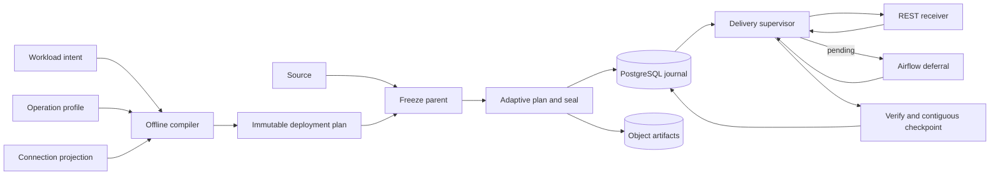

# Feature design: governed REST bulk delivery V1

- Status: RESEARCHED
- Owner: dpone maintainers and Data Platform Architecture
- Target release: 0.75.0 or later
Last verified: 2026-08-30

This revision incorporates four external architecture reviews received on
2026-08-30. It replaces the earlier broad “universal REST sink” claim with a
bounded, certifiable V1 and makes the identity, generation, remote-effect,
immutable-plan, zero-RPO journal, source-sealing, recovery, and Airflow
contracts normative. Runtime implementation remains **NO-GO** until maintainers
approve this specification, the companion proposed ADRs, the
[machine-readable design contract](rest-bulk-delivery-design-contract-v1.yaml),
[strict Draft 2020-12 schema](schema/rest-bulk-delivery-design-contract-v1.schema.json),
and the [threat model](rest-bulk-delivery-threat-model.md).

## Executive summary

dpone can read REST APIs but cannot publish governed datasets to HTTP
destinations. Teams therefore implement authentication, serialization,
batching, rate limits, asynchronous polling, retry, and recovery in individual
DAGs. That duplicates high-risk behavior and makes a remote mutation's outcome
depend on process-local state.

V1 adds a governed REST **bulk-delivery** sink for two protocol families:

1. one-request synchronous batch delivery;
2. one-submit asynchronous bulk jobs with read-only receipt polling.

V1 is not a general CRUD, reverse-ETL, resumable-upload, callback, or arbitrary
OpenAPI workflow engine. Those families have separate contracts and roadmap
gates.

A delivery is a durable state machine. dpone freezes a source boundary, seals
an immutable payload, reserves a logical `delivery_key`, binds an immutable
mutation intent, submits at most when the remote effect is known absent or a
certified fence makes repetition safe, records a receipt, observes any remote
job, verifies the effect, and only then promotes the source checkpoint. A
transport error never proves that the receiver did not mutate.

Acceptance requires fault-injection evidence for
zero silent loss, zero false success, and zero automatic unproved resend across
every process-cut boundary. A 30-minute asynchronous job must consume no more
than five seconds of Airflow worker time after submission.

## Architecture-review closure

The following items are approval gates, not optional follow-ups.

| Review item | Normative resolution |
|---|---|
| Mutation identity | Separate `delivery_key`, `mutation_intent_digest`, `execution_policy_digest`, and explicit generation. |
| Changed payload for the same logical scope | Fail before HTTP with `REST_DELIVERY_INTENT_CONFLICT`; replacement requires a new explicit generation. |
| Terminal-state overload | Model execution, remote effect, acknowledgement, verification, and checkpoint as independent axes. |
| Continuation | Return `DeliveryCompleted`, `DeliveryPending`, or `DeliveryBlocked`; persist all authority before returning pending. |
| Existing `ETLProcessor` | Preserve relational behavior; introduce `ResumableDeliveryProcessor` for non-relational continuation. |
| Airflow trigger safety | Trigger is read-only, duplicate-safe, bounded, and carries only an operation id and non-secret journal locator. |
| Self-service boundary | Workloads select a versioned platform-owned `operation_profile_ref`; protocol semantics are not authored per route. |
| Journal authority | PostgreSQL 15+ is the only V1 production operation journal; SQLite is local development only. |
| Takeover after submit starts | Lease expiry never authorizes another mutation; takeover becomes observation/reconciliation only. |
| Fence retention | Compact effect authority survives the maximum replay horizon; successful append and replacement watermarks are not deleted on receiver TTL. |
| Adaptive planning | One source boundary is materialized; all children are planned, sealed, and admitted as immutable topology before submit. |
| Parallel checkpoint | Only the highest contiguous completed frontier can be promoted. |
| Recovery | Recovery uses the immutable journal plan and operation id, never a current authoring manifest. |
| Protocol scope | V1 is synchronous batch plus one-submit async bulk job; CRUD and multi-step protocols are excluded. |
| Airflow matrix | Airflow 3.2.x is primary; the latest supported patch of every declared `>=2.10,<3.4` minor is a compatibility target. |
| Per-record partial results | V1 fails the delivery and retains bounded result evidence; automatic per-record quarantine is V1.1. |

## Open approval blockers after second architecture review

The second review exposed distributed-correctness invariants that were not
fully specified by the first closure. Their normative contracts are now
written, but they remain approval blockers until owners accept the ADRs,
machine-readable contract, threat model, and required evidence. “Specified” is
not presented as implemented or certified.

| Review item | Normative resolution in this revision | Remaining approval/evidence |
|---|---|---|
| P0.17 overlapping replacement generations | Overlap-aware effect conflict domain, ordered `(scheduled_interval_end_utc, explicit_correction_revision)`, stale watermark, and pre-submit fence with stable errors. | Architecture approval plus concurrency/property evidence. |
| P0.18 durable child topology | `parent_plan_digest` binds frozen parent, compiled plan, planner version, ordered children, payload refs, and coverage; one transaction admits every child before mutation. | PostgreSQL transaction/fault evidence. |
| P0.19 source survival | Production V1 materializes and verifies one immutable parent artifact, closes the source snapshot immediately, then plans/seals every child before the first mutation. | Source/artifact hard-kill evidence. |
| P0.20 zero-loss journal | Critical transitions require synchronous remote-apply quorum, immutable `MAY_ATTEMPT`, journal epoch, and a post-restore environment mutation gate. | Control-plane and security approval plus failover/PITR campaign. |
| P0.21 identity algebra | Split operation semantics, execution policy, and full profile contract; bind operation namespace, stable remote principal, and complete rendered-request envelope. | Canonicalization/property evidence and certified connection handshake. |
| P0.22 replay horizon | Compact success authority survives the maximum replay horizon; replacement keeps a permanent highest-generation watermark. | Retention/decommission/reset operating approval. |
| P0.23 legal state cross-product | `UNDETERMINED` separates normal running work from lost proof; legal tuples, transitions, terminality, monotonic fields, operator-only paths, and CAS predicates are frozen in YAML. | State-machine model/property evidence. |

Implementation is not authorized while any row above lacks its named approval.
The exact executable design authority is
[`dpone.rest-bulk-delivery-design.v1`](rest-bulk-delivery-design-contract-v1.yaml),
not prose substring tests.

## Formal closure after third architecture review

The third review accepted the design for merge as `RESEARCHED` and identified
the final formalization required before ADR approval. This revision makes those
choices normative; implementation remains blocked until owners approve them
and the named certification evidence exists.

| Approval blocker | Frozen V1 decision |
|---|---|
| Safe retry versus terminal state | Add `RETRY_WAIT`; `REQUEST_NOT_STARTED` with remaining budget transitions `SUBMITTING -> RETRY_WAIT -> SUBMITTING` under explicit guards and a new attempt ordinal. `final_not_started` is used only when automatic retry is unavailable or intentionally abandoned. |
| Success acknowledgement with contradictory effect | Preserve acknowledgement independently: `SUCCEEDED` can finalize as `FULLY_APPLIED`, `PARTIALLY_APPLIED`, or `UNKNOWN`; failed, cancelled, expired, accepted, and not-accepted acknowledgement variants are also retained. |
| Cancellation continuation | `poll_receipt` is the only automatic V1 continuation and reports externally observed `CANCELLED`; there is no `observe_external_cancel` continuation or active cancel mutation. |
| Overlap linearization | PostgreSQL domain-lock row acquired with `SELECT FOR UPDATE`, half-open range scopes, GiST `&&` lookup, and one admission transaction. Permanent watermarks are a normalized non-overlapping interval map, not one scalar for the resource. |
| Append correction | `incremental_append` rejects correction generations and an already-applied exact scope by default with `REST_DELIVERY_APPEND_SCOPE_ALREADY_APPLIED`; only a separately certified dedup/upsert/replacement/compensation profile may opt in. |
| Parent-level async execution | Narrow V1 allows exactly one in-flight child for `async_bulk_job`; bounded-parallel async supervision is V1.1. Synchronous batch may retain profile-bounded parallelism. |
| Attempt and capacity authority | `MAY_ATTEMPT` is keyed by operation namespace, operation id, and attempt ordinal. Capacity reservation, attempt row/marker binding, and CAS to `SUBMITTING` share one PostgreSQL critical transaction. |
| Executable contract | Draft 2020-12 JSON Schema, duplicate-key-rejecting bounded YAML load, semantic validator CLI, transition/failure reachability, terminal closure, acknowledgement preservation, and model-wide generation guards are mandatory CI. |

The machine contract and validator freeze these decisions. Their existence is
design evidence, not runtime or environment certification.

## Final closure after fourth architecture review

The fourth review classified the direction as `GO` and merge as conditional on
three packaging/validator fixes. It also identified five approval-level gaps.
This revision closes all eight in the normative contract while preserving the
separate organizational approval and runtime evidence gates.

| Review finding | Normative resolution |
|---|---|
| Base-wheel `jsonschema` availability | `jsonschema` is a base dependency because the validator is public base CLI. Primary CI installs the built wheel into a clean venv and runs the contract command. |
| Malformed UTF-8 bypass | The application service reads contract bytes through the filesystem port. Bounded YAML owns UTF-8 validation and CLI returns exit 2 plus `yaml.invalid_utf8` without a traceback. |
| Incomplete error catalog | `stable_error_codes` and `error_catalog` are exact-set checked; every normative `REST_DELIVERY_*` reference must resolve to complete metadata. |
| Cross-namespace receiver key collision | `receiver_mutation_key = H(operation_namespace, delivery_key)` is the remote fence; payload digest is excluded. |
| Undefined receiver binding digest | The executable contract binds authority, principal, account, resource namespace, authentication semantics, TLS policy identity, and network policy identity. Secret rotation is excluded when semantics remain unchanged. |
| Locally split physical conflict domains | Effect conflicts are keyed by physical receiver identity, resource, and profile-owned `effect_conflict_group`; operation namespace and mutation kind cannot split one physical effect. |
| Reconciliation cannot prove effect independently | Every unknown acknowledgement variant can resolve to no effect, full effect, partial effect, or remain unknown while preserving acknowledgement. Full+verified results become checkpoint eligible regardless of acknowledgement. |
| Mutable promotion of `RESEARCHED` | The design artifact remains immutable. A separate [`dpone.rest-bulk-delivery-approval.v1`](schema/rest-bulk-delivery-approval-v1.schema.json) receipt binds the design digest, ADR digests, owner decisions, and evidence requirements. Production certification remains a third artifact. |

The validator provides deterministic mutation, negative, graph-reachability,
terminal-closure, and model-wide invariant tests. Stateful/generative model
checking remains required implementation evidence; this document does not
mislabel the current suite as Hypothesis-style property-based testing.

## Personas and self-service journey

| Persona | Responsibility | Success signal |
|---|---|---|
| Data product author | Select a certified profile, map a dataset, and choose a mutation scope. | YAML and SQL only; no endpoint-specific Python or protocol fields. |
| Platform owner | Own connection bindings, operation profiles, policy bounds, and certification. | Workloads cannot alter authority, credentials, acknowledgement, or retry safety. |
| Operator | Inspect and recover durable operations. | One operation id explains effect certainty and permits only proven-safe actions. |
| Security engineer | Constrain egress, credentials, evidence, and retention. | No secret or unbounded body reaches manifests, XCom, trigger kwargs, logs, or metrics. |
| Connector maintainer | Implement and certify protocol capabilities. | Ports and profiles remain independent of Airflow and customer DAGs. |

The authoring journey is:

1. discover a certified `operation_profile_ref` and its supported mutations;
2. reference a governed connection and mapping;
3. run offline `dpone check` and `dpone plan`;
4. inspect the compiled source boundary, delivery keys, generations, limits,
   and profile digest;
5. deploy an immutable release;
6. let the runtime freeze, seal, submit, observe, verify, and checkpoint;
7. recover by operation id from durable state if execution is interrupted.

## Scope and protocol families

### V1 in scope

- `sink.type: rest` for governed bulk delivery in `dpone.batch.v1`.
- Platform-owned, versioned operation profiles selected by reference.
- Immutable connection-binding snapshots with fixed authority and secret refs.
- `POST` and naturally idempotent or conditionally fenced `PUT` for certified
  profiles. `PATCH` is allowed only when a profile proves its exact retry fence.
- Deterministic CSV/gzip, JSON array, NDJSON, and raw sealed-file payloads.
- Multipart file upload and single-body requests.
- One-request synchronous acknowledgement.
- One-submit asynchronous job acknowledgement with read-only status polling.
- Body- and header-derived receipts through bounded typed extractors.
- Deterministic batching by rows, decoded bytes, wire bytes, and date windows.
- Frozen source boundaries, immutable payload artifacts, lineage, and coverage
  proofs for every split.
- Serial async child delivery in V1 and profile-bounded synchronous delivery,
  both with ordered contiguous checkpoint promotion.
- Distributed submit/poll rate limits, request concurrency, and remote-job
  concurrency.
- Durable identity, CAS transitions, leases, effect tombstones, attempts,
  receipts, observations, verification, and checkpoint evidence.
- Airflow deferral through the full provider package.
- CLI inspection, reconciliation, safe resume, observation of externally
  cancelled jobs, and connector certification.

### Explicitly excluded from V1

- Per-record add/change/remove reverse-ETL semantics.
- Automatic item retry, rejection splitting, item quarantine, or dead-letter
  routing after a partial result.
- Generic CRUD resource discovery and `DELETE`.
- Multi-request create/upload/finalize workflows.
- Resumable range upload, presigned-URL upload, and callback/webhook completion.
- Response-driven arbitrary next URLs or general protocol graphs.
- Arbitrary OpenAPI operation execution. OpenAPI may later bootstrap a draft
  platform profile, but never becomes runtime authority by itself.
- Arbitrary Jinja, Python, JavaScript, shell, or expression evaluation.
- SOAP/WSDL, GraphQL subscriptions, gRPC, WebSockets, and unbounded streaming.
- Distributed transactions with the receiver.
- Active receiver cancellation. A cancel endpoint is another mutation and is
  deferred to V1.2; V1 observes externally cancelled work only.

### Versioned protocol-family roadmap

| Family | V1 | V1.1 | V1.2 |
|---|---:|---:|---:|
| Synchronous batch | Yes | Yes | Yes |
| One-submit async bulk job | Yes | Yes | Yes |
| Object mutation: add/change/remove | No | Yes | Yes |
| Per-record result routing/quarantine | Evidence only | Yes | Yes |
| Generic `DELETE` | No | Profile-specific | Yes |
| Create/upload/finalize | No | No | Yes |
| Resumable byte ranges | No | No | Yes |
| Presigned upload | No | No | Yes |
| Callback completion | No | No | Yes |

The state and evidence models reserve compatible continuation and item-result
types, but unsupported families fail compilation in V1.

### Current dpone baseline

The implementation survey, refreshed on dpone 0.74.32, found:

- REST is registered as an API source, not a sink;
- `ConnectionType`, sink factories, and runtime endpoint factories have no REST
  target branch;
- `ETLProcessor` and `AbstractSink.load()` have a synchronous relational
  lifecycle;
- immutable artifact publication is reusable, but current route execution
  stores are local JSON/SQLite rather than a production mutation journal;
- the repository already has platform-owned profile and connection-projection
  patterns that can be extended without inventing workload-local protocol
  authority;
- `dpone-airflow-pack` is intentionally PyYAML-only, while
  `apache-airflow-providers-dpone` declares Airflow `>=2.10,<3.4`.

The design therefore adds a typed non-relational path. It does not scatter
`sink_type == "rest"` branches through the relational processor.

## Authority model and public authoring contract

### Three authorities

REST delivery has three non-overlapping sources of authority:

1. **Connection binding**: platform registry owns base authority, credential
   reference, TLS, proxy, egress, and network policy.
2. **Operation profile**: platform registry owns method, semantic path/query/
   headers, codecs, acknowledgement, duplicate handling, retry fences, polling,
   limits, result extraction, timeout bounds, and profile version.
3. **Workload intent**: author owns dataset mapping, logical resource, mutation
   kind and source scope, plus bounded planning preferences allowed by the
   profile.

The compiler resolves all three into an immutable deployment plan. The runtime
does not read authoring YAML, a mutable registry, or the network to reinterpret
an active operation.

### Workload manifest

The following linked examples describe a synthetic local mock, not a deployed
service or a certified vendor profile. Limits and receipt vocabulary are
illustrative; production profiles require independent certification.

```yaml
sink:
  type: rest
  connection_ref: mock_measurements
  operation_profile_ref: mock.dataset-jobs@1
  resource: measurements

  mutation:
    kind: partition_replace
    generation_from: scheduled_interval
    scope:
      type: inclusive_date_window
      source_field: business_date

  payload:
    mapping_ref: mock.measurements.v1

  delivery_overrides:
    preferred_window_days: 3
```

No request path, bearer header, task-state vocabulary, duplicate status, retry
classification, or low-level timeout can be authored in this workload.
`delivery_overrides` is closed and range-checked against the selected profile.

### Platform operation profile

```yaml
id: mock.dataset-jobs
version: 1
protocol_family: async_bulk_job

request:
  method: POST
  path: /mock/v1/dataset-jobs
  media_type: multipart/form-data
  body:
    type: multipart_file
    payload_part:
      name: file
      format: csv
      compression: gzip
      content_type: application/gzip
    scalar_parts:
      range_start: {value_from: scope.from, format: date}
      range_end: {value_from: scope.to, format: date}

acknowledgement:
  accepted_statuses: [202]
  receipt:
    id: {body_json_pointer: /job_id, required: true}
  duplicate:
    statuses: [409]
    requires_receipt_for_same_delivery_key: true
  poll:
    method: GET
    path: /mock/v1/dataset-jobs/{receipt.id}
    state: {body_json_pointer: /phase}
    running: [pending, running]
    succeeded: [complete]
    partial: [incomplete]
    failed: [error]

mutation_fence:
  type: receiver_duplicate_key
  location: payload_filename
  value_from: receiver_mutation_key
  key_payload_binding: required
  certification_ref: required_before_production

effect_conflict_group: mock.measurements

limits:
  max_rows: 100000
  max_decoded_bytes: 64000000
  planning_decoded_bytes: 56000000
  max_wire_bytes: 16000000
  planning_wire_bytes: 14000000
  preferred_window_days: {default: 3, min: 1, max: 4}

result_policy:
  all_rows_accounted: true
  partial_result: fail_and_retain
```

The registry publishes immutable `operation_semantics_digest`,
`execution_policy_digest`, and `profile_contract_digest` plus lifecycle
metadata. Changing protocol semantics creates a new version. Profiles can be
deprecated but cannot be mutated in place while referenced by a release. A
separate mutable **deny-only** revocation authority can prevent every new submit
using a compromised profile or binding; it cannot enable a behavior, reinterpret
a pinned plan, or prevent read-only observation and reconciliation.

V1 path segments, query parameters, semantic headers, multipart scalar parts,
and receipt fields are typed profile fields with RFC-compliant encoding. They
use a finite symbol set (`resource`, `delivery_key`, `scope.*`, `receipt.*`) and
never accept absolute URLs, traversal, control characters, header names from
data, or executable templates. Null, omitted, and empty values are distinct and
profile-owned. Conditional headers and header-derived receipts are supported
only as typed certified fields. An absolute `Location` or `Operation-Location`
is accepted only when a typed profile canonicalizes it to the same HTTPS origin
and an allowlisted relative receipt path. Scheme, authority, port, userinfo,
fragment, path escape, and DNS-policy changes fail closed.

V1 multipart contains exactly one sealed payload part plus bounded scalar
parts. Multiple file parts, nested multipart, `application/x-www-form-urlencoded`,
XML bodies, and arbitrary response-derived request parameters are unsupported
and fail profile compilation. Reserved media types, HTTP 207, and vendor error
envelopes require an explicit profile extractor and certification.

### Connection-binding snapshot

```yaml
connection_type: rest
authority: https://receiver.example.test
auth_provider: bearer
credential_ref: vault://path/to/token
remote_principal_id: reference-account-example-company
remote_account_id: reference-b2b
remote_resource_namespace: ingest
remote_identity:
  mode: receiver_attested
  evidence_ref: evidence://reference/whoami/sha256:...
  verified_at: 2026-08-30T08:00:00Z
  valid_until: 2026-11-28T08:00:00Z
tls_policy_ref: corporate-public-tls@1
network_policy_ref: reference-egress@1
binding_digest: sha256:...
```

The snapshot contains secret references, never secret values. A certified
connection handshake records stable non-secret `remote_principal_id`,
`remote_account_id`, and `remote_resource_namespace`; authority URL alone is
not receiver identity. Every process resolves a fresh short-lived credential
from the same immutable binding. OAuth refresh, token rotation, and certificate
rotation do not change mutation identity when the certified remote principal,
authority, and authentication semantics are unchanged. A principal/account
swap changes binding identity and cannot resume an existing mutation.

`remote_identity.mode` is either `receiver_attested`, backed by a certified
receiver identity endpoint/claim, or `platform_attested` when no trustworthy
`whoami` capability exists. Platform attestation requires two-person approval,
immutable evidence, an expiry, and periodic recertification; an expired
attestation blocks new submissions but not observation/reconciliation. Secret
objects are non-serializable and never enter a plan, journal, trigger event,
XCom, metric, span, or exception.

### Compiled contract, compatibility, and migration

The compiler emits `dpone.rest_delivery_plan.v1` with the exact workload
intent, operation semantics/policy/profile-contract digests, binding semantics
digest, source-boundary contract,
allowed policy values, and required adapter capabilities. It is immutable in a
release and closed to unknown fields.

- Existing source and sink manifests retain their meaning.
- `api` remains a source spelling; the new sink spelling is `rest`.
- Relational `LoadConfig`, `LoadResult`, `AbstractSink`, and `ETLProcessor`
  imports and behavior remain unchanged.
- A REST sink does not synthesize database, schema, table, DDL, staging, or
  schema-evolution fields.
- V1 artifact schemas permit additive optional fields only. Breaking semantic
  changes require V2, dual-read migration, and an accepted ADR.
- Migration must import verified checkpoint and receipt state explicitly; it
  must never infer successful delivery from the current schedule.
- Runtime downgrade refuses operations whose plan/profile schema it cannot
  read. It does not reinterpret them with an older profile.

### Artifacts and evidence

| Schema | Durable purpose | Retention authority |
|---|---|---|
| `dpone.rest_delivery_plan.v1` | Immutable compiled semantics and capability requirements. | Release plus operation tombstone. |
| `dpone.rest_source_parent.v1` | Frozen source boundary, ordering, digest, row count, and completeness. | Parent operation policy. |
| `dpone.rest_payload.v1` | Child scope, lineage, content address, codec settings, counts, and sizes. | Remote-effect-aware payload policy. |
| `dpone.rest_delivery_operation.v1` | Identities, state axes, CAS revision, leases, attempts, and pinned refs. | PostgreSQL journal. |
| `dpone.rest_delivery_receipt.v1` | Accepted receipt and bounded observations. | Certified receipt/task TTL plus margin. |
| `dpone.rest_delivery_result.v1` | Accepted, rejected, unprocessed, remote ids, counters, and verification. | Data classification and result policy. |
| `dpone.rest_delivery_reconciliation.v1` | Read proof, operator decision, expected digests, and safe action. | Audit policy. |
| `dpone.rest_delivery_effect_tombstone.v1` | Compact mutation/effect authority after large artifact GC. | Maximum replay horizon; successful append route lifetime, permanent replacement watermark, unknown/partial until reconciliation. |
| `dpone.rest_sink_certification.v1` | Static, local-live, vendor-live, fault, TTL, and security evidence. | Certification policy. |
| `dpone.rest-bulk-delivery-design.v1` | Machine-readable identities, invariants, legal state tuples/transitions, and gates. | Versioned design authority retained with implementation lineage. |

Canonical JSON evidence uses sorted keys, UTF-8, schema id, producer version,
environment, creation time, content digest, and operation/delivery identity.
Only allowlisted bounded response scalars are embedded. Large item results are
content-addressed spill artifacts. Publication is create-if-absent and digest
verified; overwriting evidence is forbidden.

## Canonical identity and conflict policy

The earlier design incorrectly made payload content part of a single operation
identifier. That allowed a changed source read after an ambiguous submit to
look like a new operation. V1 separates namespace, mutation semantics,
rendered intent, execution policy, and the complete pinned profile contract.

```text
operation_namespace = H(
  platform_instance_id,
  tenant_id,
  environment_id,
  namespace_revision
)

delivery_key = H(
  logical_route_id,
  target_effect_scope,
  source_boundary,
  mutation_kind,
  explicit_generation
)

receiver_mutation_key = H(
  operation_namespace,
  delivery_key
)

receiver_binding_semantics_digest = H(
  authority_origin,
  remote_principal_id,
  remote_account_id,
  remote_resource_namespace,
  authentication_semantics,
  tls_policy_identity,
  network_policy_identity
)

operation_semantics_digest = H(
  method_semantics,
  path_query_header_semantics,
  canonical_body_envelope_semantics,
  acknowledgement_contract,
  mutation_fence_contract,
  verification_contract
)

rendered_request_semantics_digest = H(
  method,
  normalized_rendered_path_and_query,
  all_non_secret_semantic_headers,
  ordered_scalar_multipart_parts,
  payload_part_name,
  deterministic_filename,
  content_disposition_and_type,
  deterministic_multipart_boundary,
  sealed_payload_digest
)

mutation_intent_digest = H(
  receiver_binding_semantics_digest,
  operation_semantics_digest,
  rendered_request_semantics_digest
)

execution_policy_digest = H(
  timeout_policy,
  retry_policy,
  distributed_rate_policy,
  retention_policy,
  observability_policy
)

profile_contract_digest = H(
  operation_semantics_digest,
  execution_policy_digest,
  profile_schema_id,
  profile_version
)
```

`H` is canonical SHA-256 over a versioned, typed, length-delimited encoding;
display strings are not hash inputs. Semantic headers exclude ephemeral
authorization, tracing, date, and transport-generated fields. The concrete
multipart boundary is deterministic, collision-checked against every part, and
bound to the rendered envelope. Hard `max_wire_bytes` is measured over the
complete emitted request body, including boundaries, scalar parts, part
headers, CRLF framing, filename, and file bytes; payload size alone is never
used as wire size.

`source_boundary` in `delivery_key` is the logical extraction occurrence and
interval/checkpoint span, not a content hash or mutable snapshot token. The
frozen source version and parent/payload digests belong to the mutation intent.
Consequently, rereading the same logical boundary with corrected bytes after an
ambiguous submit produces the same delivery key and a different intent, so it
is blocked. `target_effect_scope` is the receiver-visible partition/resource
scope after canonical time-zone and inclusivity rules.

Rules:

- Unique admission is keyed by `(operation_namespace, delivery_key)`. Same key
  and same `mutation_intent_digest` resumes the existing operation. It never
  creates a second mutation intent.
- Same `delivery_key` and different `mutation_intent_digest` fails before HTTP
  with `REST_DELIVERY_INTENT_CONFLICT`.
- A deliberate replacement uses a new, explicit monotonic generation. Runtime
  retries and Airflow try numbers never create generations.
- Policy-only changes update `execution_policy_digest` within certified bounds
  and do not change `operation_semantics_digest` or mutation identity. The full
  `profile_contract_digest` is nevertheless pinned in the immutable parent plan
  so recovery uses the exact certified policy rather than the current registry.
- The receiver idempotency key, when used, is derived from `delivery_key`, not
  payload digest or Airflow task identity. The concrete remote fence is
  `receiver_mutation_key = H(operation_namespace, delivery_key)`, preventing
  collisions between platform instances, tenants, environments, and namespace
  revisions that share one receiver account.
- A duplicate receipt is accepted only when it proves the same delivery key and
  intent. A bare `409` is not proof.

### Replacement generation and overlap fence

`explicit_generation` is an ordered tuple, not an opaque label:

```text
generation = (
  scheduled_interval_end_utc,
  explicit_correction_revision
)

effect_conflict_domain = H(
  remote_principal_id,
  remote_account_id,
  remote_resource_namespace,
  receiver_resource_id,
  effect_conflict_group
)
```

`explicit_correction_revision` is a governed non-negative integer for
`partition_replace` and permits a legitimate correction for the same scheduled
interval without reusing an old intent. Ordinary `incremental_append` does not
permit a correction revision: a second append for an already fully applied
exact scope fails before HTTP with
`REST_DELIVERY_APPEND_SCOPE_ALREADY_APPLIED`. A profile may opt in only when
certification proves receiver deduplication/upsert, a natural idempotent key,
replacement semantics, or an explicit compensating-correction contract.
`effect_conflict_group` is immutable platform-owned profile authority. It joins
all operation kinds and local namespaces that can mutate the same physical
receiver effect; the synthetic mock profile uses `mock.measurements`. `partition_replace`
uses canonical interval **overlap**, because adaptive child
boundaries may change between independent generations.

Normative rules, enforced atomically with revision CAS before `SUBMITTING`:

- once generation `N` is admitted for an effect scope, every lower overlapping
  generation is permanently forbidden from entering `SUBMITTING` and returns
  `REST_DELIVERY_STALE_GENERATION`;
- generation `N` cannot submit while any lower overlapping generation is
  `SUBMITTING`, accepted/running with `UNDETERMINED` effect, `UNKNOWN`, or
  `PARTIALLY_APPLIED`; it returns
  `REST_DELIVERY_OVERLAPPING_EFFECT_IN_FLIGHT` and waits for reconciliation;
- once generation `N` is `FULLY_APPLIED`, the compact effect index permanently
  marks every lower overlapping generation stale;
- admission and the effect index are scoped by stable physical receiver
  identity, resource, and `effect_conflict_group`. Local operation namespaces
  remain admission/tenancy authority but cannot hide two mutations that reach
  the same physical receiver effect.

The PostgreSQL adapter linearizes admission, rather than merely checking then
inserting:

1. canonicalize each effect scope as a half-open `daterange` or `tstzrange`;
2. create the `rest_delivery_effect_domain_lock` row idempotently and lock it
   with `SELECT FOR UPDATE`, keyed by the complete physical effect-conflict
   domain;
3. query overlapping operations and watermarks with the range `&&` operator
   through a GiST index;
4. reject stale/unresolved overlaps or insert the admission while the same row
   lock is held;
5. commit before any child may enter `SUBMITTING`.

All code paths acquire domain locks in canonical conflict-domain order. A fully
applied replacement updates, under the same domain lock and effect transaction,
a normalized non-overlapping interval map
`(effect_conflict_domain, conflict_scope_range,
highest_applied_generation)`. Therefore a January generation never stales a
lower, non-overlapping February generation. PostgreSQL row locks and range/GiST
semantics are used as documented by PostgreSQL 15
([explicit locking](https://www.postgresql.org/docs/15/explicit-locking.html),
[range types](https://www.postgresql.org/docs/15/rangetypes.html)).

## Frozen source boundary and adaptive planning

One parent source boundary is frozen **before** payload planning. Production V1
then enforces a **seal-all-before-submit barrier**:

1. open a consistent source read using an immutable version or snapshot;
2. materialize the parent boundary as immutable authority;
3. verify parent completeness, row count, ordering, and content digest;
4. close the source snapshot immediately after materialization is durable;
5. plan every child from the immutable parent and prove complete gap-free coverage;
6. seal and publish every child payload from that parent artifact;
7. durably admit the complete parent/child topology;
8. only then permit the first remote mutation.

A database snapshot token provides consistency only while materializing the
immutable parent and is closed before potentially long CSV/gzip planning and
sealing. The durable parent artifact, not the source snapshot, is the sole
input to planning and sealing and the recovery authority after materialization.
An exception requires a separately certified `durable_reopenable_snapshot`
capability proving survival after process loss, cross-worker reopen, and a
lifetime beyond the maximum sealing horizon. A mutable query rerun is never a
source boundary. Adaptive shrinking cannot re-read a newer source version.

The parent records deterministic sort and split keys, row count, logical scope,
source version, and content digest. Each child records parent id, ordinal,
scope, row interval, digest, decoded bytes, wire bytes, and coverage proof.
Children are split deterministically until every limit is met. A receiver-atomic
scope that exceeds one-request limits fails; it is never silently divided.

Before the first child can enter `SUBMITTING`, PostgreSQL admits in one
transaction the parent operation, immutable plan, every child ordinal/scope,
delivery key, payload ref/digest, generation, frontier order, and coverage
proof. The authoritative topology is bound by:

```text
parent_plan_digest = H(
  frozen_parent_digest,
  compiled_plan_digest,
  profile_contract_digest,
  planner_algorithm_version,
  ordered_child_descriptors,
  complete_coverage_proof
)
```

Artifacts are published create-if-absent before the transaction and digest
verified during admission; unreferenced artifacts are safe GC orphans. An
existing parent operation always resumes its pinned child topology and **must
not invoke the planner again**, even after a code or planner-version upgrade.
The invariant is `first child SUBMITTING => complete parent plan durably
ADMITTED and source snapshot closed`.

For bounded parallel execution, successful later children do not advance the
checkpoint past a gap. If `01-07` succeeds, `08-14` fails, and `15-21`
succeeds, the promotable frontier remains `07`. An empty boundary advances only
when the frozen read proves complete and the profile's empty-input policy
allows promotion.

Deterministic CSV parameters are profile-owned: UTF-8 encoding, BOM policy,
delimiter, quote and escape characters, line terminator, header order, null and
empty-string encoding, decimal format, timestamp precision/time zone, filename,
gzip level, and gzip `mtime`. JSON profiles own stable field ordering, numeric
and timestamp encoding, null behavior, Unicode policy, and framing. `Content-Digest`
or `Repr-Digest` may be added only according to [RFC 9530](https://www.rfc-editor.org/rfc/rfc9530.html)
and a certified receiver profile.

## Outcome model

One terminal enum cannot distinguish a failed request from a partially applied
or unknown remote effect. Each operation stores independent axes.

```text
execution_state:
  PLANNED | SEALED | SUBMITTING | RETRY_WAIT | ACCEPTED | WAITING | VERIFYING |
  FINALIZED

remote_effect:
  NONE_PROVEN | UNDETERMINED | FULLY_APPLIED | PARTIALLY_APPLIED | UNKNOWN

acknowledgement_state:
  NOT_ACCEPTED | ACCEPTED | RUNNING | SUCCEEDED | FAILED | CANCELLED |
  EXPIRED | PROTOCOL_UNKNOWN

verification_state:
  NOT_RUN | PASSED | FAILED | NOT_PROVABLE

checkpoint_state:
  BLOCKED | ELIGIBLE | PROMOTED
```

Invariants:

- `checkpoint_state=ELIGIBLE` requires `remote_effect=FULLY_APPLIED` and
  `verification_state=PASSED`.
- V1 does not promote a checkpoint for `PARTIALLY_APPLIED`, even when rejected
  items are durably recorded. A future explicit quarantine policy may allow
  that in V1.1.
- `NONE_PROVEN` is valid before transport or after positive proof that no
  request/effect occurred. `UNDETERMINED` is the normal effect state after
  submit while a receipt is accepted/running. `UNKNOWN` means proof was lost,
  expired, contradictory, or unavailable; it is not a synonym for normal
  asynchronous waiting.
- `UNKNOWN` never becomes `NONE_PROVEN` because a local lease expired or a
  worker restarted. It can be refined only by an operator reconciliation with
  new immutable evidence and CAS.
- Acknowledgement `FAILED`, `CANCELLED`, or `EXPIRED` does not imply
  `NONE_PROVEN`; the profile's verification contract determines remote effect.
- `FINALIZED` means no automatic transition remains, not necessarily success.
  `FINALIZED + RUNNING` and `UNKNOWN + RUNNING` are illegal. An operator-only
  reconciliation may CAS a finalized unknown/partial tuple back to `VERIFYING`
  with a new reconciliation id; prior evidence is append-only, never rewritten.
- `verification_state=FAILED` or `NOT_PROVABLE` can become `PASSED` only through
  that operator-only reconciliation path with a new evidence digest.
- Source checkpoint promotion is a separately leased and CAS-guarded action.
- `SUBMITTING -> RETRY_WAIT` is legal only with durable
  `REQUEST_NOT_STARTED` proof and remaining retry budget. The due transition
  `RETRY_WAIT -> SUBMITTING` preserves the delivery key, increments
  `attempt_ordinal`, and atomically creates a new attempt-scoped marker and
  capacity reservation. `final_not_started` is terminal only when automatic
  retry is exhausted, permanently blocked, or intentionally abandoned.
- Acknowledgement is never collapsed into effect: `SUCCEEDED` can finalize as
  `FULLY_APPLIED`, `PARTIALLY_APPLIED`, or `UNKNOWN`; `FAILED`, `CANCELLED`,
  `EXPIRED`, `PROTOCOL_UNKNOWN`, `ACCEPTED`, and `NOT_ACCEPTED` have independent
  no-effect, full, partial, and unknown resolution tuples. Operator
  reconciliation preserves the observed acknowledgement while read-only
  receiver evidence refines effect. Any `FULLY_APPLIED + PASSED` result is
  checkpoint eligible regardless of the acknowledgement axis.

The exhaustive initial tuple, legal tuple names, automatic and operator-only
transitions, terminal tuples, monotonic fields, forbidden combinations, and CAS
preconditions are frozen in the
[machine-readable state contract](rest-bulk-delivery-design-contract-v1.yaml).
Runtime accepts only a listed tuple and transition; the prose failure table is
explanatory and cannot introduce another enum value. Mandatory monotonic fields
include journal revision/epoch, attempt and observation ordinals, correction
revision, highest applied generation, and contiguous checkpoint frontier.

## Safe retry and remote fencing

[RFC 9110](https://www.rfc-editor.org/rfc/rfc9110.html#name-idempotent-methods)
defines method semantics but does not make arbitrary POST or PATCH mutation
safe to repeat. The proposed `Idempotency-Key` field remains an
[expired Internet-Draft](https://datatracker.ietf.org/doc/draft-ietf-httpapi-idempotency-key-header/),
not a ratified RFC. Therefore a header name alone is not a safety proof.

A mutation may be retried automatically only when one of these is true:

- the transport proves `REQUEST_NOT_STARTED` and no request byte could have
  reached the peer;
- the operation profile certifies receiver idempotency for the delivery key,
  payload binding, concurrency, and retention window;
- the request uses a deterministic resource identity with naturally idempotent
  PUT semantics and verified representation rules;
- a conditional request provides a certified remote precondition;
- a read-only query proves exact absence for the delivery key under certified
  consistency;
- a receiver-owned fence proves the previous attempt cannot still apply.

DNS, connect, TLS, write, read, idle, and total-request timeouts have distinct
classification. Once a request may have reached the receiver, POST/PATCH moves
to `remote_effect=UNKNOWN` unless a certified fence permits same-key replay.
An Airflow task retry never changes this rule and is not an HTTP retry policy.

For an already permitted retry, delay is full jitter in
`[0, min(max_delay, initial_delay * 2**attempt)]`. A valid `Retry-After` sets a
lower bound on the next attempt. If that full server delay exceeds the remaining
request/operation budget, the operation becomes blocked/expired with
`REST_DELIVERY_RETRY_AFTER_EXCEEDS_BUDGET`; dpone never truncates the delay and
retries earlier than the server allowed. `429`, `408`, and `5xx` are not
independently retry-safe for a mutation; both status classification and the
remote-fence predicate must pass.
Read-only receipt polling has a separate retry budget and can repeat under its
observation lease. Circuit-breaker state and distributed token buckets are
shared by certified endpoint/principal scope, not process-local.

Certification records:

- idempotency-key retention TTL and pruning behavior;
- whether the key is bound to payload or semantic intent;
- concurrent duplicate behavior;
- receipt/task/result retention TTLs and expiry response;
- query consistency and read-after-write behavior;
- maximum operation duration and clock-skew allowance.

Stripe's documented behavior illustrates why this is endpoint-specific: keys
may be pruned after a retention interval and parameter mismatches are rejected.
dpone imports no vendor behavior without a profile-specific certification.

## Durable continuation contract

### Runtime result

The connector-neutral supervisor returns one of these immutable results:

```python
RouteExecutionResult = (
    DeliveryCompleted
    | DeliveryPending
    | DeliveryBlocked
)

DeliveryPending(
    operation_id="op_v1_...",
    continuation_kind="poll_receipt",
    next_check_after="2026-08-30T08:00:10Z",
)
```

`DeliveryCompleted` includes durable receipt and checkpoint eligibility.
`DeliveryBlocked` includes effect certainty, stable error code, retained
evidence, and allowed operator actions. `DeliveryPending` is returned only
after operation identity, payload ref, submit attempt, accepted receipt, and
next-check bound are durable.

The only automatic V1 continuation is `poll_receipt`. It reports terminal
`SUCCEEDED`, `FAILED`, `CANCELLED`, `EXPIRED`, or `PROTOCOL_UNKNOWN`
observations; external cancellation is not a second continuation kind. For
`async_bulk_job`, V1 fixes `max_in_flight_children: 1`: the parent supervisor
submits one child, returns pending while that child is active, and resumes the
next admitted child only after the prior child is terminal. Bounded-parallel
async parent supervision is V1.1. Synchronous batch profiles may still use a
certified bounded child concurrency.

`RETRY_WAIT` is an internal durable mutation-supervisor state, not a public
continuation kind. A live worker waits only within the bounded submit retry
budget; after worker loss, ordinary orchestration retry rereads the same journal
state and may perform the guarded due transition. The orchestration retry is
therefore a wake-up mechanism, never authority to resend.

`reconcile_delivery_key` remains a blocked/operator workflow when no accepted
receipt exists; it is never generic automatic polling of a mutation. Active
remote cancellation is outside V1 because invoking a cancel endpoint is itself
a mutation.

### Integration with the current ETL lifecycle

The existing `ETLProcessor.run()` owns a payload, calls synchronous
`AbstractSink.load()`, finalizes the owned payload, and then persists source
state. Changing that behavior in place would put relational sinks at risk.

V1 therefore introduces `ResumableDeliveryProcessor` and a typed
`DeliverySink` protocol. The compiler and composition root choose it for REST
delivery. Existing `ETLProcessor`, `AbstractSink.load()`, `LoadResult`, and
relational route behavior remain unchanged. Shared extraction, quality,
artifact, logging, and source-state services are injected into both processors;
policy is not copied. A later convergence requires an independent compatibility
ADR and tests.

The resumable processor owns the payload until `FINALIZED` and retention
eligibility. A pending return does not call payload success or promote source
state. A completed return promotes only the contiguous eligible frontier.

### Airflow adapter

The Airflow implementation lives in `apache-airflow-providers-dpone`, whose
declared compatibility already spans Airflow `>=2.10,<3.4`. It does not enter
the PyYAML-only `dpone-airflow-pack` scheduler package.

```text
execute
  -> submit_or_resume(operation_id)
  -> DeliveryPending
  -> defer(trigger=DeliveryReceiptTrigger(operation_id, journal_locator))

trigger
  -> read journal
  -> acquire observation lease
  -> GET certified receipt URL
  -> CAS bounded observation
  -> emit bounded TriggerEvent(operation_id, observed_revision)

execute_complete
  -> reread journal as authority
  -> verify terminal result
  -> publish receipt/result evidence
  -> promote checkpoint if eligible
```

Trigger requirements follow Airflow's documented deferrable model:

- trigger kwargs are JSON-serializable and contain no token, certificate,
  payload, authored manifest, or response body;
- trigger code is read-only toward the business receiver: GET/HEAD only;
- duplicate trigger instances and repeated events are safe;
- trigger events are hints, never state authority;
- polling and journal writes are bounded and CAS-protected;
- trigger packaging contains a minimal async journal/observation client with
  lazy imports; blocking `requests`, synchronous PostgreSQL calls, and the full
  dpone runtime are forbidden in the shared asyncio triggerer process;
- `execute_complete` rereads the journal and distrusts event payload state;
- deferral frees worker and usually pool capacity, so a separate distributed
  remote-job semaphore remains held while the receiver job is active.

The primary acceptance image is Airflow 3.2.x. Because the provider declares
`apache-airflow>=2.10,<3.4`, compatibility evidence covers the latest supported
patch of 2.10, 2.11, 3.0, 3.1, 3.2, and 3.3. A release may instead narrow the
feature's declared range before implementation, but cannot claim untested
minors. Triggerer restart, duplicate trigger execution, worker loss, and
scheduler replay are mandatory tests.

## Production journal and leases

### Selected authority

PostgreSQL 15+ in a dedicated control-plane database/schema is the only V1
production journal. SQLite is a local-development reference adapter only.
Object storage remains authority for immutable parent/payload/result artifacts;
the PostgreSQL journal stores pinned artifact identities and effect tombstones.

The production adapter requires:

- unique `delivery_key` and immutable `mutation_intent_digest` admission;
- integer `revision` CAS on every transition;
- database-clock lease decisions, never worker clocks;
- transactionally appended attempts and observations;
- row-level tenancy and environment scoping;
- schema migrations with expand/migrate/contract compatibility;
- `mutation_admission_rpo: zero` and `submit_attempt_rpo: zero` using a
  certified synchronous replication quorum and `synchronous_commit =
  remote_apply` for critical transitions;
- refusal to submit when the synchronous quorum or its proof is unavailable;
- HA topology, backups, point-in-time recovery, journal epochs, restore
  exercises, monitoring, and capacity policy supplied by the environment
  profile;
- no submission when journal or artifact authority is unavailable.

### Zero-RPO mutation admission and disaster recovery

Technology choice alone does not protect a receiver from journal rewind. Every
parent-plan admission, generation fence, pre-attempt correlation,
`SUBMITTING`, accepted receipt, effect decision, and checkpoint transition is a
critical transaction that must be acknowledged by the certified synchronous
remote-apply quorum before a dependent external action occurs.

The pre-submit sequence is normative:

1. assign the next monotonic `attempt_ordinal` and deterministic `attempt_id`;
2. create an immutable, independently retained `MAY_ATTEMPT` marker with
   create-if-absent key
   `(operation_namespace, operation_id, attempt_ordinal)`, binding operation
   and parent/child identity, generation, expected journal revision, journal
   epoch, mutation-intent digest, and creation time;
3. in one PostgreSQL critical transaction reserve remote-job capacity, append
   the attempt row and marker digest, and CAS the operation to `SUBMITTING`;
4. commit that transaction with the required synchronous quorum;
5. only after confirmed commit, execute HTTP.

A marker without its exact matching journal `attempt_id`, ordinal, expected
revision, and epoch is treated as possible remote effect, never as permission
to resend. The marker authority uses a failure domain and credentials
independent from PostgreSQL restore. Orphan markers created before a failed
journal transaction are conservative reconciliation work keyed by attempt id,
not mutation authority.

Every failover/restore carries a `journal_epoch`. If zero-RPO continuity cannot
be proven, the environment-wide mutation gate becomes `BLOCKED`; read-only
inspection, receipt observation, and reconciliation remain available. A
reconciliation campaign compares journal rows, immutable markers, receipts,
effect authority, and receiver proof. New mutations resume only after a new
epoch attestation and explicit platform/security approval. PITR never implies
that an external receiver rolled back.

### Lease separation

Three independent leases exist:

- `mutation_lease`: may initiate a mutation only before `SUBMITTING` and under
  the safe-retry rules;
- `observation_lease`: may perform duplicate-safe read-only polling;
- `checkpoint_lease`: may promote an already eligible contiguous frontier.

The V1 remote-job semaphore is not Redis, etcd, or process memory: its slots and
reservations live in the same PostgreSQL control plane as the operation
journal. Capacity reservation, attempt-scoped marker binding, attempt append,
and CAS to `SUBMITTING` are committed atomically. It survives Airflow deferral,
worker/triggerer loss, and journal lease turnover. Accepted/running and
`UNKNOWN` operations retain capacity until certified expiry plus reconciliation
or an audited operator transfer to incident-reserved capacity; ordinary TTL GC
cannot silently free it and exceed receiver concurrency. A proven
`REQUEST_NOT_STARTED` attempt transfers/releases capacity only in the durable
`RETRY_WAIT` or terminal transaction; reconciliation repairs orphan
reservations by `attempt_id`.

Lease expiry after `SUBMITTING` does **not** authorize a replacement POST.
Another worker can observe or reconcile only. It may submit again only after
exact absence is proven or a certified remote fence authorizes same-key replay.
The local fence prevents concurrent dpone decisions; it cannot stop an HTTP
request already executing at the receiver.

### Retention and compact effect authority

Large payloads and verbose observations may expire only after policy permits.
A compact operation tombstone/effect index retains, at minimum, operation
namespace, delivery key, intent digest, generation, effect conflict domain,
target scope, payload/profile/binding digests, remote effect, receipt identity,
terminal verification, checkpoint decision, and retention horizon. Its
authority is based on the maximum permitted replay horizon, not only receiver
TTL:

- successful append keys live until route decommission or an audited namespace
  reset;
- replacement keeps a permanent `highest_applied_generation` over canonical
  conflict-scope coverage;
- `UNKNOWN` and `PARTIALLY_APPLIED` live until explicit reconciliation and then
  their governed post-reconciliation horizon;
- payloads and verbose observations may be collected much earlier because they
  are not the replay fence;
- reset is a separate audited administrative operation unavailable to workload
  authors and ordinary runtime GC.

Artifact policy includes encryption at rest, KMS key reference, tenant prefix,
ACL, classification, residency, access audit, quota, secure deletion, legal
hold, and retention alerts. Payload data never enters PostgreSQL rows.

## Execution algorithm

1. Resolve and freeze the deployment's connection snapshot, operation profile,
   workload intent, semantic/policy/profile digests, and journal epoch.
2. For a new parent, freeze and materialize one source boundary, verify its
   completeness/digest, and close the source snapshot.
3. Plan deterministic children from the immutable parent artifact and prove
   complete, non-overlapping coverage.
4. Seal **all** child payloads from that artifact and validate complete
   row/decoded/wire limits.
5. Compute every child identity and `parent_plan_digest`.
6. In one PostgreSQL transaction admit the parent and complete immutable child
   topology. Reject intent, namespace, principal, generation, or coverage
   conflict before any HTTP or secret resolution.
7. For an existing parent operation, load the admitted topology and artifacts
   directly; never run source freeze, planner, or sealer again.
8. Before each new submit, assign an attempt ordinal/id and publish its
   create-if-absent `MAY_ATTEMPT`; then, under the PostgreSQL domain lock, one
   critical transaction rechecks overlap/append policy, reserves remote-job
   capacity, appends the attempt/marker binding, and CAS-commits `SUBMITTING`
   under the journal epoch. Resolve a fresh credential but never persist it.
9. Classify transport evidence. Persist receipt and `ACCEPTED`, or persist the
   exact remote-effect certainty before releasing the lease.
10. Return `DeliveryPending` for async work. Airflow defers using operation id
    only. V1 never submits a second async child while one child is pending.
11. Poll with an observation lease and independent rate limits until bounded
    terminal, expired, cancelled, or protocol-unknown state.
12. Verify counters, digests, scope, and profile-specific invariants. Publish
    bounded terminal and optional item-result artifacts.
13. Mark remote effect, verification, and checkpoint eligibility independently.
14. Under a checkpoint lease, promote only the highest contiguous eligible
    source frontier.
15. Finalize evidence and apply retention without deleting replay/generation
    authority.

### Generic pseudocode

```python
def execute_delivery(compiled_plan, source_boundary, parent_operation_id=None):
    if parent_operation_id is not None:
        parent = journal.load_admitted_parent(parent_operation_id)
        # Recovery authority is pinned topology; planner/sealer are not called.
    else:
        frozen_parent = source_snapshot.freeze_and_materialize(source_boundary)
        frozen_parent.verify_complete_digest()
        source_snapshot.close(frozen_parent)
        descriptors = planner.plan_and_prove(
            frozen_parent,
            compiled_plan.limits,
            algorithm_version=compiled_plan.planner_algorithm_version,
        )
        sealed_children = payload_sealer.seal_all(frozen_parent, descriptors)
        parent_plan = plan_factory.build_complete(
            frozen_parent,
            compiled_plan,
            sealed_children,
        )
        parent = journal.admit_complete_parent_plan(parent_plan)

    for operation in parent.ordered_children:

        if operation.intent_conflict:
            return DeliveryBlocked(code="REST_DELIVERY_INTENT_CONFLICT")

        if operation.needs_submission:
            retry_guard.assert_mutation_permitted(operation)
            attempt = attempt_factory.next_for(operation)
            marker = pre_attempt_store.create_if_absent(operation, attempt)
            operation = journal.reserve_and_cas_submitting_with_zero_rpo(
                operation,
                attempt,
                marker.digest,
                lock_effect_domain=True,
            )
            submit_result = submitter.submit_after_durable_fence(operation)
            operation = journal.record_submit_result(submit_result)

        if operation.needs_observation:
            return DeliveryPending(
                operation_id=operation.id,
                continuation_kind="poll_receipt",
                next_check_after=operation.next_check_after,
            )

        terminal = verifier.verify(operation)
        journal.record_terminal_axes(terminal)
        checkpoint.promote_contiguous_frontier_if_eligible(parent.id)

    return DeliveryCompleted(parent_id=parent.id)
```

## Failure and partial-result policy

| Evidence | Remote effect | Automatic action | Checkpoint |
|---|---|---|---|
| Validation or admission failed before transport | `NONE_PROVEN` | Fix and retry same generation/intent as applicable. | Blocked. |
| Transport proves request not started | `NONE_PROVEN` | Retry within policy. | Blocked. |
| Request may have reached receiver, no certified fence | `UNKNOWN` | Observe/reconcile; never automatic POST. | Blocked. |
| Accepted receipt persisted | `UNDETERMINED` | Return pending and poll. | Blocked. |
| Duplicate with receipt proving same key and intent | Profile-derived | Resume observation. | Blocked until verified. |
| Bare duplicate/conflict response | `UNKNOWN` | Reconcile; no resend. | Blocked. |
| Receiver says failed/cancelled/expired | Profile-derived, possibly `PARTIALLY_APPLIED` or `UNKNOWN` | Verify and retain evidence. | Blocked. |
| Partial or per-record rejection | `PARTIALLY_APPLIED` unless receiver proves atomic rollback | Publish bounded accepted/rejected/unprocessed evidence; no item replay in V1. | Blocked. |
| All rows accounted and verification passes | `FULLY_APPLIED` | Finalize. | Eligible, then promoted under lease. |
| Verification counters missing or contradictory | `UNKNOWN` or `PARTIALLY_APPLIED` | Reconcile. | Blocked. |

V1 result artifacts reserve accepted, rejected, unprocessed, and remote-id
collections with bounded counts and content-addressed spill files. They support
diagnosis but do not authorize per-record retry. Automatic quarantine and
rejection bisection are explicitly V1.1 because they are unsafe for atomic
partition replacement and require item-level mutation identities.

Receiver errors use bounded typed mappings. Profiles may recognize
`application/problem+json` according to [RFC 9457](https://www.rfc-editor.org/rfc/rfc9457.html),
HTTP 207, or vendor envelopes only when their semantics are certified.

### Edge cases

- **Empty input:** promote only from a complete frozen read and an explicit
  profile policy; otherwise skip without checkpoint or fail.
- **Null versus empty:** codecs preserve profile-owned distinct encodings;
  ambiguous mappings fail before sealing.
- **Unicode:** input is normalized only as declared; invalid source bytes fail
  with field evidence before mutation. UTF-8 round-trip goldens include Cyrillic.
- **Duplicate rows:** dpone does not invent row deduplication. Mapping/profile
  contracts define whether duplicates are valid and verification accounts for
  them.
- **Schema drift:** closed mapping compilation fails; an active sealed payload
  is never rebuilt under a newer mapping.
- **Oversized atomic scope:** fail with `REST_DELIVERY_SCOPE_EXCEEDS_LIMIT`; do
  not split a receiver-atomic replacement.
- **Timeout or connection reset:** use transport-phase evidence and the safe
  retry rules; timeout alone never proves absence.
- **Process crash:** resume from the admitted parent topology and pinned
  artifacts. No process-local variable is recovery authority; recovery never
  replans or reseals.
- **Receipt expiry:** retain effect as unknown unless another certified proof
  establishes it; do not resubmit merely because GET returns 404/410.
- **Partial/207 result:** publish bounded result evidence, mark partial or
  unknown according to profile, and block checkpoint.
- **Redirect/DNS change:** fail authority validation and never forward auth to a
  new authority.
- **Cancellation:** V1 only observes an externally cancelled job. It never calls
  a cancel endpoint. A cancellation acknowledgement does not prove rollback;
  verification still derives remote effect.
- **Journal restore/failover:** without an attested zero-RPO epoch, block the
  environment mutation gate and reconcile immutable `MAY_ATTEMPT` markers;
  never infer that PITR rolled back receiver state.
- **Stale generation:** a lower overlapping replacement cannot submit after a
  higher admission and remains permanently stale after higher full application.
- **Clock skew:** journal leases use PostgreSQL time; receiver TTL certification
  includes skew margin.
- **Unsupported family/capability:** fail compile or preflight before source
  extraction and secret resolution.
- **Deep/nested response:** reject beyond profile byte, depth, field, and string
  bounds; arbitrary body content is not evidence.

## CLI and recovery

Recovery never accepts an authoring manifest. The immutable plan referenced by
the journal is runtime authority.

```bash
dpone delivery inspect \
  --environment dev \
  --operation-id op_v1_... \
  --format json

dpone delivery reconcile \
  --environment dev \
  --operation-id op_v1_... \
  --expected-release-digest sha256:... \
  --expected-profile-contract-digest sha256:... \
  --apply

dpone delivery resume \
  --environment dev \
  --operation-id op_v1_... \
  --apply
```

`--environment` resolves only the journal/artifact control-plane profile. It
does not resolve a current workload manifest. Optional expected digests are
operator guards. `inspect` is read-only. `reconcile --apply` and `resume`
require audited authority and appropriate leases. `resume` refuses any mutation
not permitted by the durable operation's certified fence. No V1 CLI command
calls a receiver cancel endpoint.

Commands are non-interactive unless `--apply` is present; automation SHOULD add
`--yes` where the CLI requires confirmation. `--format json` writes one stable,
redacted schema to stdout and human diagnostics to stderr. Evidence publication
is atomic create-if-absent; a conflicting existing digest fails. Exit codes are:

| Code | Meaning |
|---:|---|
| 0 | Command completed, including successful inspection of a failed operation. |
| 2 | Invalid arguments, unsupported schema/profile, or intent conflict. |
| 3 | Journal, artifact authority, credential provider, or receiver unavailable. |
| 4 | Remote effect unknown/partial or manual authority required. |
| 5 | Proven terminal receiver failure with no safe automatic action. |

`inspect` exposes each outcome axis, child/frontier position, artifact ids,
receipt age, certified TTL horizon, and a machine-readable list of allowed next
actions. It never prints arbitrary headers, query secrets, payload rows, or raw
response bodies.

Stable errors include:

- `REST_DELIVERY_INTENT_CONFLICT`;
- `REST_DELIVERY_REMOTE_EFFECT_UNKNOWN`;
- `REST_DELIVERY_PARTIALLY_APPLIED`;
- `REST_DELIVERY_UNSAFE_RETRY`;
- `REST_DELIVERY_SCOPE_EXCEEDS_LIMIT`;
- `REST_DELIVERY_COUNT_MISMATCH`;
- `REST_DELIVERY_RECEIPT_EXPIRED`;
- `REST_DELIVERY_PROTOCOL_UNKNOWN`;
- `REST_DELIVERY_STALE_GENERATION`;
- `REST_DELIVERY_OVERLAPPING_EFFECT_IN_FLIGHT`;
- `REST_DELIVERY_RETRY_AFTER_EXCEEDS_BUDGET`;
- `REST_DELIVERY_APPEND_SCOPE_ALREADY_APPLIED`;
- `REST_DELIVERY_JOURNAL_EPOCH_BLOCKED`.

The machine contract is the stable error metadata authority. In particular:

| Code | Exit class | Retryability | Required operator action | Severity/evidence |
|---|---:|---|---|---|
| `REST_DELIVERY_INTENT_CONFLICT` | 2 | Never | Correct intent or create an explicit governed generation. | Warning; operation evidence. |
| `REST_DELIVERY_REMOTE_EFFECT_UNKNOWN` | 4 | Reconciliation only | Inspect immutable evidence and reconcile. | Critical; reconciliation evidence. |
| `REST_DELIVERY_PARTIALLY_APPLIED` | 4 | Compensation/reconciliation only | Reconcile or run the certified compensation contract. | Critical; reconciliation evidence. |
| `REST_DELIVERY_UNSAFE_RETRY` | 4 | Never | Reconcile the delivery key before any resend. | Critical; reconciliation evidence. |
| `REST_DELIVERY_SCOPE_EXCEEDS_LIMIT` | 2 | Never | Shrink the scope or change the certified receiver atomicity contract. | Warning; operation evidence. |
| `REST_DELIVERY_COUNT_MISMATCH` | 4 | Reconciliation only | Inspect receiver counts and reconcile effect. | Critical; reconciliation evidence. |
| `REST_DELIVERY_RECEIPT_EXPIRED` | 4 | Reconciliation only | Query by delivery key when certified or reconcile manually. | Warning; reconciliation evidence. |
| `REST_DELIVERY_PROTOCOL_UNKNOWN` | 4 | Reconciliation only | Inspect protocol evidence and reconcile. | Critical; reconciliation evidence. |
| `REST_DELIVERY_STALE_GENERATION` | 2 | Never | Inspect the newer overlapping generation. | Warning; operation evidence. |
| `REST_DELIVERY_OVERLAPPING_EFFECT_IN_FLIGHT` | 4 | Observation/reconciliation only | Resolve or observe the older overlap. | Warning; reconciliation evidence. |
| `REST_DELIVERY_RETRY_AFTER_EXCEEDS_BUDGET` | 4 | Blocked | Extend the governed budget or wait for the server window. | Warning; operation evidence. |
| `REST_DELIVERY_APPEND_SCOPE_ALREADY_APPLIED` | 2 | Never | Use an explicitly certified correction contract. | Warning; effect tombstone. |
| `REST_DELIVERY_JOURNAL_EPOCH_BLOCKED` | 4 | Reconciliation only | Complete restore reconciliation and approve the new epoch. | Critical; reconciliation evidence. |

## Public Python contracts and ports

Immutable public models live under `dpone.contracts.rest_delivery`. Runtime
services depend on capability ports, not concrete HTTP, PostgreSQL, object
storage, clocks, Airflow, or secret SDKs.

```python
from dpone.contracts.rest_delivery import (
    AcknowledgementState,
    CheckpointState,
    DeliveryBlocked,
    DeliveryCompleted,
    DeliveryPending,
    DeliveryOperation,
    ExecutionState,
    RemoteEffect,
    RestSinkSpec,
    VerificationState,
)
from dpone.runtime.delivery import ResumableDeliveryProcessor
```

Required ports include:

- `DeliveryJournalPort` with CAS admission/transitions and typed leases;
- `ImmutableArtifactPort` for parent, payload, result, and evidence objects;
- `SourceSnapshotPort`;
- `PayloadCodecPort`;
- `RestTransportPort` with phase evidence;
- `CredentialResolverPort`;
- `DistributedRateLimiterPort`;
- `RemoteJobSemaphorePort`;
- `DeliveryVerifierPort`;
- `CheckpointFrontierPort`;
- `ClockPort` and deterministic jitter source.

The composition root selects adapters. Domain services never instantiate their
dependencies. HTTP request classes containing credentials remain private.

## Architecture components

| Component | Existing/new | Responsibility | Dependencies |
|---|---|---|---|
| Manifest compiler | Extend | Resolve references offline and emit immutable typed delivery plan. | Pure contracts and registries. |
| Operation profile registry | Extend trusted-profile pattern | Own versioned protocol semantics, overrides, certification, and digest. | Registry/artifact ports. |
| Connection projection | Extend | Resolve immutable authority/security snapshot without secret values. | Existing binding resolver. |
| Source freezer | New | Produce immutable parent artifact or certified source snapshot. | Source and artifact ports. |
| Adaptive planner | New | Split one frozen parent deterministically and prove coverage. | Pure contracts only. |
| Payload sealer | New | Produce canonical streamable payload and measurements. | Codec and artifact ports. |
| Identity service | New | Derive delivery, intent, and policy identities and detect conflicts. | Pure canonical encoder. |
| Delivery supervisor | New | Enforce state transitions, retry gates, continuation, and verification. | Capability ports only. |
| PostgreSQL journal adapter | New | Provide zero-RPO admission, epoch/restore gate, CAS, leases, attempts, effect index, and GC metadata. | `DeliveryJournalPort`, PostgreSQL driver. |
| Object-storage adapter | Reuse/extend | Store encrypted immutable parent/payload/result/evidence artifacts. | Existing immutable artifact port. |
| REST transport | New | Apply auth/TLS/proxy, stream bytes, and report transport-phase evidence. | Transport and credential ports. |
| Airflow provider | Extend | Convert pending results to deferral and terminal journal state to task outcome. | Public runtime continuation API. |
| CLI | Extend | Inspect, reconcile, resume, and certify by operation id. | Application services, no adapter policy. |

Dependency direction is contracts ← ports ← domain/runtime services ←
adapters/composition roots. Airflow, HTTP libraries, PostgreSQL, object storage,
and secret SDKs remain outside pure contracts and policy. Concrete construction
occurs only in CLI/runtime/provider composition roots.



The companion decisions are:

- [ADR 0053](adr/0053-rest-delivery-identity-effect-journal.md): identity,
  outcome axes, journal, leases, source freeze, and checkpoint frontier;
- [ADR 0054](adr/0054-resumable-delivery-runtime-airflow.md): continuation,
  processor compatibility, and Airflow boundary;
- [ADR 0055](adr/0055-rest-operation-profile-authority.md): connection,
  operation-profile, workload, and protocol-family authority.

### Alternatives and tradeoffs

| Alternative | Advantage | Rejected because |
|---|---|---|
| Keep native DAG code | Fastest reference-only change. | Repeats unsafe protocol policy and provides no platform recovery contract. |
| Put all HTTP fields in workload YAML | Maximum apparent flexibility. | Moves security, idempotency claims, and protocol drift to data authors. |
| Extend `ETLProcessor` with REST branches | Reuses one entry point. | Couples synchronous relational cleanup to pending remote jobs and risks compatibility. |
| Use Airflow retries/Variables as journal | No new control-plane database. | Task state cannot prove remote effect; Variables lack the required admission/CAS/lease model. |
| Use only object storage as journal | Reuses an existing authority. | Cross-object CAS, ordered attempts, leases, and queryable recovery are operationally weaker for V1. |
| Generic protocol graph in V1 | Covers more APIs immediately. | Multiplies state, secret, and retry semantics before the two core families are certified. |
| PostgreSQL journal plus object artifacts | Strong transactional control state with scalable immutable payloads. | Selected; adds an operated database and migrations. |

### Quality-budget impact

Implementation MUST stay within `docs/benchmarks/quality_budgets.yml`, including
the current 400-SLOC module cap and import-graph non-regression. Planned cohesive
modules are contracts/state, compiler/profile resolution, identity, frozen
source/planning, sealing/codecs, supervisor, verifier/frontier, journal port,
PostgreSQL adapter, transport adapter, CLI applications, and Airflow adapter.

No module owns more than one state transition policy and one adapter concern.
The supervisor coordinates injected services rather than becoming a god module.
HTTP response parsing is profile-driven but implemented by typed bounded
extractors, not a generic expression engine. New import edges point inward to
contracts/ports; provider and adapter dependencies do not reach base imports.
The change-aware check plan, module-size check, layer metrics, import rules,
ruff, mypy, and non-live suite are merge gates for implementation PRs.

## Market comparison

The comparison is based on rolling official documentation verified on
2026-08-30, not marketing rank. A version is named only where the source names
one; otherwise “current docs” means the page observed on that date. The second
column records an observed pattern and what dpone adopts. The third column is an
explicit design inference or rejected/deferred pattern. Products solve different
scopes, so “best” means stronger evidence and recovery within V1's declared
bulk-delivery boundary, not more connector breadth.

| System/context | Capability and observed design | Strength and adopted pattern | Limitation and rejected/deferred pattern | Official source/date |
|---|---|---|---|---|
| dlt, current docs | Python custom destinations use load packages/jobs, configurable batch size, retry, failed-job evidence, and pending package recovery. | Adopt immutable load artifacts, explicit job outcomes, and checkpoint blocking while a package is incomplete. | Its docs warn a half-committed custom API batch can duplicate and atomicity is implementer-owned; reject blind batch replay. | [Reverse ETL/custom destination](https://dlthub.com/docs/dlt-ecosystem/destinations/destination), checked 2026-08-30. |
| Duckle, current repository/docs | Local-first DuckDB engine with `snk.rest` POST/PUT/PATCH batched JSON, webhook, GraphQL, Salesforce, and Salesforce Bulk sinks plus a broad visual catalog. | Adopt compact declarative REST authoring, batching ergonomics, searchable catalog, preview, and consistent UX vocabulary. | The reviewed public contract does not document a PostgreSQL-backed durable mutation journal, async receipt lifecycle, cross-process effect reconciliation, or checkpoint fence; do not infer those guarantees from connector breadth. | [Official repository](https://github.com/slothflowlabs/duckle), checked 2026-08-30. |
| Redpanda Connect `http_client`, current docs | HTTP output exposes count/byte/time batching, `max_in_flight`, retry/backoff/status policy, rate limiting, TLS/mTLS, OAuth/JWT/Basic, multipart, and backpressure. | Adopt systematic transport controls and explicit performance knobs behind governed profiles. | Transport retry and backpressure do not prove a receiver mutation's durable effect; dpone keeps effect journal, generation fence, and async recovery as separate correctness authority. | [HTTP client output](https://docs.redpanda.com/connect/components/outputs/http_client/), checked 2026-08-30. |
| Apache NiFi InvokeHTTP 2.11.0 | Configurable HTTP methods/body/TLS route FlowFiles through explicit `Original`, `Retry`, `No Retry`, `Failure`, and optional response relationships while projecting status, duration, URL, transaction id, and bounded response attributes. | Adopt explicit response/retry/no-retry result channels and redacted HTTP evidence projection. | Status-family routing alone is unsafe for ambiguous non-idempotent remote effects; dpone additionally requires certified fences and durable effect/reconciliation state. | [InvokeHTTP](https://nifi.apache.org/components/org.apache.nifi.processors.standard.InvokeHTTP/), checked 2026-08-30. |
| Informatica REST V2, current Cloud docs | OpenAPI/Swagger-backed source, target, and midstream operations with multiple auth and TLS modes. | Adopt profile bootstrap, typed operations, enterprise connection ownership, and mapping UX. | Generated breadth does not prove endpoint-specific idempotency/effect recovery; reject automatic certification from OpenAPI. | [REST V2 Connector](https://docs.informatica.com/integration-cloud/data-integration-connectors/current-version/rest-v2-connector/introduction-to-rest-v2-connector.html), checked 2026-08-30. |
| Microsoft SSIS, SQL Server 2022/current docs | Separate HTTP Connection Manager and Web Service Task configure URL, credentials, timeout, WSDL operation, and outputs. | Adopt separation of reusable connection authority from operation execution. | Built-in task is WSDL/SOAP-oriented with limited auth; REST and async recovery are component/script-specific. | [Web Service Task](https://learn.microsoft.com/en-us/sql/integration-services/control-flow/web-service-task), checked 2026-08-30. |
| Airbyte, repository master | Destination protocol has record/batch delivery, destination state/checkpoint concepts, and connector release/certification stages. | Adopt explicit state acknowledgement, generation-aware identity, and maturity evidence. | A generic receiver's mutation fence remains connector-specific; do not equate destination acknowledgement with exact remote effect. | [Destination implementation reference](https://github.com/airbytehq/airbyte/blob/master/airbyte-integrations/developer-docs/destinations/implementation-reference.md), checked 2026-08-30. |
| Fivetran Activations, current docs | Per-record results and recursive splitting isolate rejected records during retry. | Defer item-result routing and rejection bisection to a V1.1 contract with item identities. | Splitting is unsafe for receiver-atomic partition replacement; reject as a universal retry strategy. | [Retry handling](https://fivetran.com/docs/activations/syncs/retry-handling), checked 2026-08-30. |
| Sling, current docs | Compact YAML/JSON replication defines source, target, streams, modes, defaults, keys, transforms, and target options. | Adopt concise defaults plus bounded per-stream overrides. | Targets center on stores/files rather than async REST mutation recovery; reject protocol semantics in free-form hooks. | [Replication structure](https://docs.slingdata.io/concepts/replication/structure), checked 2026-08-30. |
| Hightouch HTTP Request, current hosted docs | Added/changed/removed triggers drive configurable methods, paths, payloads, rate, concurrency, and error handling. | Adopt strong request preview/inspector and explicit future mutation modes. | Complex chained operations are limited and per-sync controls are not the V1 durable journal; defer reverse ETL to V1.1. | [HTTP Request destination](https://hightouch.com/docs/destinations/http-request), checked 2026-08-30. |
| Confluent Cloud HTTP Sink V2 | OpenAPI paths, upsert, path parameters, tombstone delete, and success/error topics. | Adopt typed path/query parameters, profile templates, and explicit result channels. | Kafka offset and stream semantics differ from frozen bulk scopes; reject leaking sensitive receiver content into generic result topics. | [HTTP Sink V2](https://docs.confluent.io/cloud/current/connectors/cc-http-sink-v2.html), checked 2026-08-30. |
| Pentaho Data Integration 11.0 | REST Client exposes method, body, parameters, headers, auth, TLS, status, and response fields in visual transformations. | Adopt redacted request preview and field-level mapping UX. | Data-driven URL/method are too permissive for production authority; reject ungoverned dynamic authority. | [REST Client step](https://docs.pentaho.com/pdia/11.0-data-integration/pdi-transformation-steps-reference-overview/rest-client-step), checked 2026-08-30. |
| Apache Beam, current docs | Runner-portable processing, state, timers, and checkpoint/retry primitives. | Adopt deterministic partitioning and injected runner-independent domain policy. | N/A as a direct REST sink comparator: it does not supply a certified generic receiver mutation protocol. | [Programming guide](https://beam.apache.org/documentation/programming-guide/), checked 2026-08-30. |
| gusty, repository main | Declarative Airflow DAG authoring from YAML/front matter. | Adopt concise authoring as a UX reference. | N/A to receiver correctness: no REST intent, receipt, remote-effect, or journal contract. | [Official repository](https://github.com/chriscardillo/gusty), checked 2026-08-30. |
| Astronomer Cosmos, current docs | Separates dbt parsing/rendering, execution modes, and connection/profile mapping into Airflow. | Adopt thin provider integration and runtime-mode separation. | N/A as a REST sink: it orchestrates dbt and delegates destination commit semantics. | [How Cosmos works](https://astronomer.github.io/astronomer-cosmos/getting_started/how-cosmos-works.html), checked 2026-08-30. |
| Salesforce Data Cloud ingestion | Explicit create-job, upload, and close lifecycle with job ids. | Reserve a bounded multi-step continuation graph. | More than one mutation step; defer to V1.2 rather than weakening V1 recovery. | [Create ingestion job](https://developer.salesforce.com/docs/data/data-cloud-int/references/data-cloud-ingestionapi-ref/c360-a-api-create-a-job.html), checked 2026-08-30. |
| Microsoft Graph upload session | Session creation and byte-range PUT continuation with upload-specific authorization rules. | Reserve range checkpoints and credential-free upload URL handling. | Requires resumable-range state and new security rules; defer to V1.2. | [Upload session](https://learn.microsoft.com/en-us/graph/upload-data-to-upload-session), checked 2026-08-30. |
| Google long-running operations | Standard operation name plus done/error/response observation shape. | Candidate platform async profile template. | Field, authority, cancellation, and retention still need endpoint certification; do not certify by shape alone. | [Long-running operations](https://developers.google.com/google-ads/api/reference/rpc/google.longrunning), checked 2026-08-30. |
| Stripe, current API docs | Reusing a key returns the stored result, parameters are compared, and keys can be pruned after a finite interval. | Adopt key-to-intent binding and explicit TTL certification. | Vendor behavior is not a universal `Idempotency-Key` standard; reject header-presence as proof. | [Idempotent requests](https://docs.stripe.com/api/idempotent_requests), checked 2026-08-30. |

### Industrial differentiation targets

The “industrial standard” goal is evaluated on reproducible axes, not feature
count.

```yaml
axis: mutation safety after ambiguous transport failure
scenario: receiver commits a POST, then connection is cut before any response byte
baseline: synthetic naive Airflow HTTP task retry fixture
metric: duplicate mutations, false successes, unproved automatic resends
target: 0, 0, 0 across every injected process/transport cut
procedure: deterministic fault proxy plus worker restart on a second host
artifact: test_artifacts/connectors/rest/remote_effect_fault_matrix.json
limitations: applies only to certified endpoint fences and tested transport phases
```

```yaml
axis: immutable-intent conflict protection
scenario: same route, target scope, source boundary, and generation are resealed with changed bytes
baseline: payload-derived operation identity that creates a new operation
metric: HTTP mutations before conflict and stable error classification
target: 0 HTTP mutations; 100% REST_DELIVERY_INTENT_CONFLICT
procedure: property tests over payload, profile, binding, and policy mutations
artifact: test_artifacts/connectors/rest/identity_conflict_matrix.json
limitations: canonical encoder correctness remains part of the trusted base
```

```yaml
axis: asynchronous orchestrator efficiency and correctness
scenario: 30-minute remote job with worker and triggerer restart plus duplicate trigger event
baseline: worker-resident polling sensor/operator
metric: post-submit worker time, duplicate mutations, lost terminal observations
target: <=5 seconds, 0, 0; remote-job semaphore never exceeded
procedure: Airflow 3.2 primary acceptance with controlled receiver and journal
artifact: test_artifacts/connectors/rest/airflow_async_acceptance.json
limitations: excludes receiver processing latency and scheduler-wide capacity
```

```yaml
axis: adaptive frozen-window utilization and checkpoint correctness
scenario: synthetic variable-volume source bounded by the selected mock profile
baseline: fixed-width files and mutable-query replanning
metric: requests, limit violations, source gaps/overlaps, invalid checkpoint jumps
target: fewer requests than fixed-width baseline; 0 violations/gaps/overlaps/jumps
procedure: freeze one synthetic parent, split/restart under all child completion orders
artifact: test_artifacts/connectors/rest/adaptive_frontier_benchmark.json
limitations: request count is distribution-specific; correctness targets are universal
```

```yaml
axis: operator recovery UX
scenario: one unknown-effect operation with a queryable certified receipt
baseline: inspect DAG logs, Variables, files, and receiver manually
metric: commands, median elapsed time, unsafe resend choices, evidence completeness
target: <=3 commands; <=10 minutes; 0 unsafe choices; 100% required evidence
procedure: 10 fresh operators follow only CLI output and the generated runbook
artifact: test_artifacts/connectors/rest/recovery_ux.json
limitations: small internal usability study, not a general human-factors claim
```

## Security, timeout, and operations policy

Production profiles require HTTPS, verified TLS, authority allowlisting,
redirect policy, DNS-rebinding defense, proxy governance, bounded response
parsing, header allowlists, and connection isolation. Data cannot choose scheme,
host, port, credential, proxy, TLS policy, poll authority, or response-derived
next URL.

The normative [REST bulk-delivery threat model](rest-bulk-delivery-threat-model.md)
covers journal rewind, generation rollback, remote-principal swap, cross-tenant
collision/leakage, object-store compromise, namespace reset, profile
revocation, SSRF/redirects, triggerer exhaustion, semaphore loss, and evidence
leakage. Security-owner approval is a Phase 0 and production gate, not a future
documentation task.

V1 authentication capabilities are bearer token, API key in an allowlisted
header, HTTP Basic, OAuth 2.0 client credentials, and mTLS. API key in query is
**forbidden by production default** because URLs leak through proxy/WAF/access
logs, tracing, exceptions, and receiver telemetry. A profile-specific exception
requires security approval and verified URL redaction across every one of those
layers. HMAC,
AWS SigV4, delegated-user/browser OAuth, arbitrary token exchange, and
response-derived credentials require a later profile capability and threat-model
approval. A mutable deny-only revocation can block new submissions for a
profile/binding while preserving read-only observation and reconciliation.

Timeouts are a vector, not one integer:

- DNS, connect, TLS, write, read, idle, and request-total bounds;
- operation-total, poll interval, poll retry, and receiver-expiry bounds;
- submit retry budget and observation retry budget;
- explicit behavior for `Retry-After` date and delta values.

Distributed controls are separately keyed for submit requests, polls, result
downloads, active requests, and active remote jobs. Scope can include endpoint,
credential principal, tenant, and environment. Deferral does not release the
remote-job semaphore.

Metrics use bounded labels; operation ids belong in logs and spans. Required
metrics cover operations by every state axis, source and checkpoint lag,
rows/bytes, rate-limit wait, active remote jobs, receipt age, unknown-effect age,
artifact retention, CAS conflict, and recovery action. Audit records include
actor, operation id, expected digests, decision, and artifact ids.

## Test and certification plan

| Layer | Mandatory scenarios | Evidence |
|---|---|---|
| Design authority | Draft 2020-12 schema with `additionalProperties: false`, bounded duplicate-key-rejecting YAML load, reachable transitions, terminal closure, failure mapping, acknowledgement preservation, and monotonic generation checks through `dpone docs check-rest-delivery-design-contract`. | CLI JSON report plus negative fixtures. |
| Schema/compiler | Closed workload/profile schemas, bounded overrides, unsupported family rejection, absolute URL/secret rejection. | Negative fixture matrix. |
| Identity/property | Namespace isolation, same key/intent resume, intent conflict, semantic/policy split, principal swap, rendered envelope, concurrent overlap winner, range-scoped watermark, append correction rejection. | Property/model-test artifact. |
| Source/planner | Seal-all barrier, immutable complete parent topology, planner-upgrade recovery without replanning, codecs, limits, coverage, empty proof, contiguous frontier. | Golden digests, transaction cuts, and coverage proofs. |
| Journal | PostgreSQL unique admission, CAS, three leases, DB clock, synchronous quorum, attempt-scoped `MAY_ATTEMPT`, domain-lock/range linearization, atomic capacity reservation, epoch, lossy restore gate, permanent interval effect index. | Failover/PITR/restore, concurrent admission, and retention matrix. |
| Transport | Phase-specific timeout evidence, redirects, 409/413/429/5xx, `Retry-After`, idempotent/non-idempotent cases. | HTTP classification matrix. |
| Sync integration | JSON, NDJSON, multipart, counters, duplicate proof, contradictory results, partial application. | Connector certification artifact. |
| Async integration | Serial child supervision, 202/receipt, expired receipt, duplicate trigger, restart, external-cancel observation through `poll_receipt`, no active cancel, no-receipt blocked taxonomy. | Continuation matrix. |
| Process cuts | Kill before/after every journal write and request boundary; restart elsewhere. | Zero-unproved-resend fault matrix. |
| Airflow primary | 3.2.x submit/defer/resume, triggerer restart, worker loss, duplicate event, pre-submit remote-job semaphore, minimal async/lazy trigger client. | Airflow acceptance JSON. |
| Airflow compatibility | Same suite on latest supported patch of every declared minor: 2.10, 2.11, 3.0, 3.1, 3.2, and 3.3. | Compatibility evidence. |
| Security | Dedicated threat model: journal rewind, principal swap, cross-tenant isolation, object compromise, SSRF, revocation, trigger exhaustion, secret/evidence limits. | Security-owner approval and zero-leak matrix. |
| Performance | Profile-bounded rows and bytes, bounded RSS, stream upload, adaptive planning. | Throughput/RSS benchmark. |
| Vendor live | Certified environment-specific profile, receipt TTL, duplicate behavior, counters, Unicode, restart and recovery. | Signed environment-bound receipt. |

Maturity is `experimental` after static tests, `beta` after PostgreSQL,
object-storage, local-live, and Airflow 3.2 gates, and `production` only after
vendor-live fault recovery, restore, security, operator-runbook, and retention
certification. Skipped live evidence is `UNVERIFIED`, never `PASS`.

## Implementation roadmap and estimate

Implementation begins only after this specification and ADRs 0053–0055 are
approved. Each phase must ship its own negative tests and evidence; no phase may
claim a later guarantee.

| Phase | Deliverable | Acceptance gate | Estimate |
|---|---|---|---:|
| 0 | Approve scope, threat model, identities, state axes, PostgreSQL journal, TTL policy, ADRs. | No unresolved P0 contract. | 1–2 weeks |
| 1 | Operation-profile registry, workload schema, compiler, immutable deployment plan. | Offline closed-schema and compatibility suite. | 2 weeks |
| 2 | Reference state model, identity algebra, strict design schema/validator, property/state-machine tests. | Exhaustive legal-transition, failure-mapping, duplicate-key, acknowledgement, and conflict tests. | 2 weeks |
| 3 | PostgreSQL journal, domain-lock/range linearization, atomic remote capacity, zero-RPO quorum, epoch/restore gate, attempt-scoped markers/artifacts, leases, interval effect index. | Hard-kill, concurrent admission, failover/PITR, capacity, and retention gates. | 3–4 weeks |
| 4 | First synchronous JSON vertical slice and secure transport. | End-to-end sync delivery without Airflow. | 2 weeks |
| 5 | Deterministic file codecs/envelope, frozen source, seal-all barrier, immutable adaptive plan, multipart. | Golden payload, process-cut, no-replan, and coverage/limit gates. | 2–3 weeks |
| 6 | Serial-child async receipt/poll continuation and reconciliation. | Process-cut, one-in-flight-child, cancellation-observation, and expiry matrix. | 2–3 weeks |
| 7 | Airflow provider integration for 3.2 primary and every declared compatibility minor. | Worker/triggerer restart, async-client, and semaphore gates. | 2 weeks |
| 8 | V1 production hardening, threat-model controls, certification UX, inspectors, runbooks. | Multi-worker/load/security/DR exercises and owner approvals. | 2–4 weeks |
| 9 | Production observation and closeout. | SLO window with no unsafe resend, false success, generation rollback, or unresolved DR gap. | Calendar observation window |

Effort and calendar commitments must be estimated for the selected certified
profiles and environments. The phase ordering above is a dependency plan, not
a customer deployment commitment.

V1.1/V1.2 are a separate **24–36+ engineer-week broad program** after the V1
production gate and observation decision. Per-record result routing, object
mutation/quarantine, OpenAPI bootstrap beyond profile drafting, and multi-step
protocols must not start between V1 core and its hardening/migration gates.

## Documentation deliverables

- self-service tutorial using a certified local mock profile;
- operation-profile authoring and certification guide for platform owners;
- reference for workload schema, profile schema, state axes, identities,
  continuation, errors, CLI, artifacts, metrics, and maturity;
- runbooks for intent conflict, unknown effect, partial application, expired
  receipt, overlapping generation, checkpoint gap, zero-RPO failover/restore
  gate, namespace reset, and effect-authority retention;
- machine-readable design/state contract and generated legal-transition
  reference;
- dedicated security threat model and approval record;
- Airflow 3.2 primary plus 2.10/2.11/3.0/3.1/3.3 compatibility deployment and
  triggerer capacity guide;
- generated profile catalog, source/sink matrix, and certification evidence;
- request preview/inspector that renders redacted semantic request metadata and
  sealed payload measurements without credentials or network I/O.

## Rollout and rollback

The connector ships behind `runtime.features.rest_bulk_delivery_v1: false` and
maturity `experimental`. Rollout stages are compile-only, frozen seal-only
shadow, controlled local-live, environment-specific canary, scheduled DEV, and production
candidate. Static tests alone never raise maturity.

New submissions require the flag. Disabling it stops new mutation admission but
does not abandon accepted or unknown work: observation, reconciliation,
checkpoint completion, evidence retention, and operator CLI remain available.

Rollback triggers include any duplicate mutation, false success, checkpoint
promotion without verified full effect, source coverage gap/overlap, secret
sentinel leak, unbounded response, journal/artifact inconsistency, TTL violation,
or rate/semaphore breach. Rollback preserves journal, artifacts, tombstones, and
receipts. It does not delete or compensate receiver data automatically.

Post-release verification repeats the exact vendor-live profile after every
profile, transport, journal, Airflow-provider, or receiver-contract change.
Certification is bound to commit, environment, binding/profile digest, and test
artifact; stale evidence does not authorize production.

## Agent execution plan

One integrator owns public schemas, shared indexes, `mkdocs.yml`, and final
reconciliation. Parallel writers may start only after the approved contracts
land, in separate worktrees with disjoint task contracts.

| Role | Owned paths | Read-only paths | Forbidden paths | Dependency |
|---|---|---|---|---|
| Contract integrator | `src/dpone/contracts/rest_delivery/**`, manifest/profile schemas, public exports, `mkdocs.yml` | Entire repository | Unrelated feature code | Approved spec and ADRs |
| Identity/state implementer | Pure identity, state machine, property tests | Approved contracts | Adapters, provider, shared schemas | Contract PR merged |
| Journal implementer | Journal port, PostgreSQL/SQLite adapters, migrations, fault/restore tests | Contracts and ADR 0053 | HTTP/provider/compiler | State contract merged |
| Source/payload implementer | Freeze, planner, codecs, sealing, object artifacts, golden tests | Contracts/artifact ports | Journal/HTTP/provider | Contract PR merged |
| HTTP/security implementer | REST transport, auth projection adapter, bounds, classifiers, adversarial tests | Profile/ports | Runtime state and provider | Ports merged |
| Runtime integrator | `ResumableDeliveryProcessor`, supervisor, verifier, frontier | All prior public APIs | Adapter internals and shared schemas | Journal/payload/transport merged |
| Airflow integrator | Full provider operator/trigger and 3.2 primary plus every declared compatibility minor | Runtime continuation API | `dpone-airflow-pack` runtime expansion | Runtime API merged |
| UX/certification owner | CLI applications, profile inspector, docs, runbooks, evidence producers | Implemented public API | Core policy | Behavior stable |

The dpone maintainer assigned to the implementation series is the named
integrator and shared-file owner. Every implementation PR runs focused red-green
tests, then the change-aware selector and full required gate. No role may edit a
shared semantic file without integrator handoff.

## Approval checklist

- [x] First, second, third, and fourth external-review P0 items are addressed normatively in
      prose, ADRs, and the machine-readable contract.
- [x] V1 protocol-family scope and exclusions are explicit.
- [x] Namespace, principal, operation semantics, rendered intent, generation,
      execution policy, and full profile contract are separate.
- [x] Remote effect and checkpoint eligibility are not overloaded into one enum.
- [x] Continuation and current `ETLProcessor` compatibility are explicit.
- [x] PostgreSQL is selected with zero-RPO critical commits, immutable
      pre-attempt markers, journal epoch, and post-restore mutation gate.
- [x] Seal-all source barrier, immutable complete parent topology, adaptive
      split lineage, no-replan recovery, and contiguous frontier are explicit.
- [x] Recovery is independent of the current manifest.
- [x] Airflow 3.2 primary and every declared `>=2.10,<3.4` minor are explicit.
- [x] V1 partial-result behavior is explicit and fail-closed.
- [x] Market comparison and estimates are scoped honestly.
- [x] Dedicated threat model covers journal rewind, principal/tenant isolation,
      object authority, revocation, SSRF, and triggerer exhaustion.
- [x] Safe retry has a reachable `RETRY_WAIT` path and terminal no-retry path.
- [x] Success/failure/cancel/expiry acknowledgements survive partial/unknown
      effect classification and operator reconciliation.
- [x] PostgreSQL domain-lock/range linearization and range-scoped watermark are
      selected; append correction is forbidden by default.
- [x] V1 async bulk execution is serial across child operations.
- [x] `MAY_ATTEMPT` is attempt-scoped and remote capacity shares the
      PostgreSQL submit transaction.
- [x] Strict schema, byte-preserving duplicate-key/UTF-8 loader, semantic
      validator, clean-wheel smoke, and model-wide state guardrails make the
      design contract executable in CI.
- [x] Receiver mutation identity is namespace-bound; receiver binding semantics
      and physical effect conflict grouping are explicit.
- [x] The stable error catalog is complete and exact-set checked.
- [x] The immutable `RESEARCHED` contract promotes only through a separate
      digest-bound approval receipt; production certification remains separate.
- [ ] Architecture owner approves P0.17–P0.23 and the design contract.
- [ ] PostgreSQL owner approves synchronous quorum, journal epoch, restore gate,
      and marker authority.
- [ ] Maintainer approves this specification.
- [ ] Maintainer approves ADRs 0053–0055.
- [ ] Security owner approves the threat model and artifact-retention profile.
