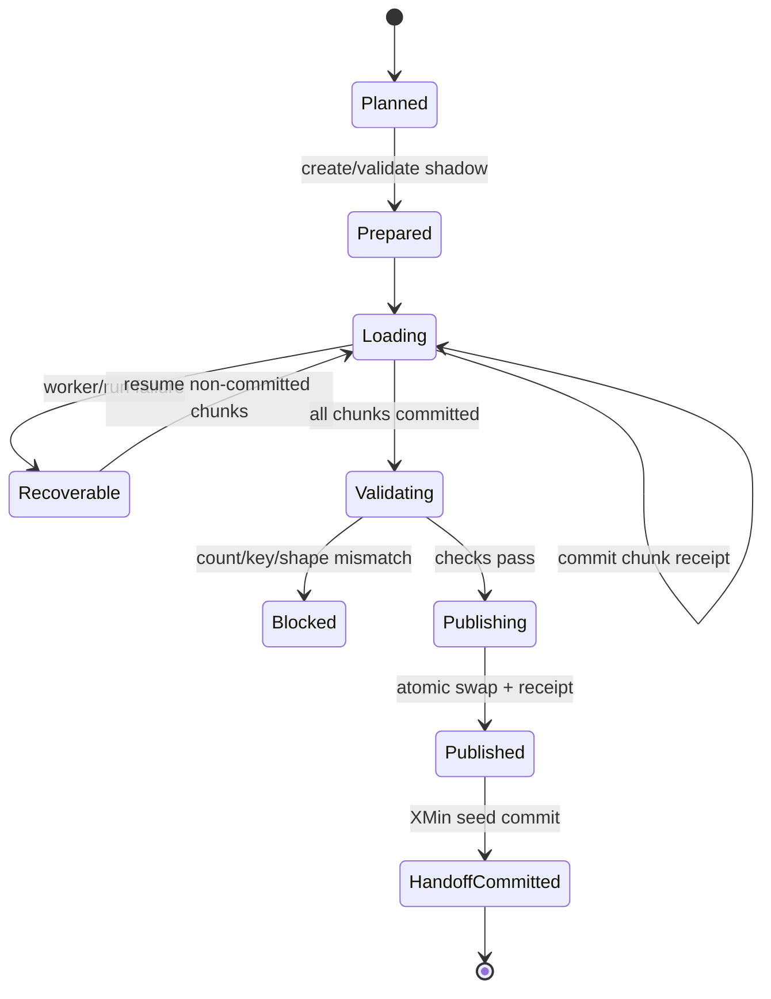
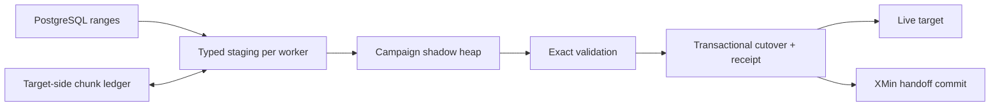

# Feature design: resumable shadow-published initial load

- Status: APPROVED
- Owner: Data Platform
- Issue: work-item / PostgreSQL-to-MSSQL initial-load incident
- Initial target release: 0.74.22
- Process-isolation and lease-fencing hardening addendum: 0.74.27
Last verified: 2026-08-23

## Executive summary

Large initial loads must not execute an incremental merge for every chunk. That
shape repeatedly probes and mutates the growing live target, creates avoidable
locking, and turns a bounded initial snapshot into an operation whose cost grows
with both target size and chunk count.

This feature adds a governed `backfill.publication.mode: shadow_swap` contract.
Each deterministic chunk is bulk-appended to a campaign-owned MSSQL shadow
table. Durable target-side chunk receipts plus a campaign ledger make committed
chunks exactly-once resumable, including a crash between target commit and
ledger CAS. After all
chunks commit, dpone performs exact row-count and unique-key validation, then
publishes the shadow table with one transactional rename and publication
receipt. PostgreSQL XMin handoff is committed only after target publication.

The measurable outcome for the incident route is to replace the observed
85--95 hour merge projection with a bounded initial-load path whose cost is
approximately linear in source bytes and whose four workers can make useful
progress without per-chunk scans of the live target.

## Personas and customer journey

| Persona | Goal | Current pain | Success signal |
|---|---|---|---|
| Data engineer | Load a large table once, then enable incremental sync | The initial route uses incremental DML and appears stuck | Explicit initial manifest, visible progress, safe resume |
| Data operator | Recover after a pod, network, or database failure | It is unclear which chunks are durable | `status` reports committed/running/failed/remaining and the next safe action |
| Data architect | Preserve correctness while loading in parallel | Append retries can duplicate data and direct refresh can expose partial data | Durable receipts, exact validation, atomic publication and rollback table |
| Platform maintainer | Reuse one implementation for large MSSQL initial loads | One-off DAG SQL and target-specific patches recur | A connector capability with contract tests, docs and live certification |

The engineer selects `backfill` with deterministic chunks, four workers and
`publication.mode: shadow_swap`. Preflight proves MSSQL target-atomic state,
distributed ledger support, a unique key and an existing reviewed target
shape. During execution, logs and `dpone backfill status` show bounded campaign
progress and ETA. If a worker fails, a retry claims only non-committed chunks.
When every chunk is durable, dpone validates and publishes the shadow table,
then commits the XMin handoff. The ordinary incremental DAG can start only after
that handoff receipt exists.

## Scope

### In scope

- PostgreSQL-to-MSSQL chunked backfills with MSSQL target-atomic state.
- A new optional `backfill.publication` manifest object.
- Deterministic shadow and backup names derived from the governed live target;
  a server-side owner property binds the stable shadow to one immutable run key.
- Concurrent staging-to-shadow append without a target-wide table lock; the
  target's clustered columnstore is created once before loading and deferred
  unique indexes are built once after data validation rather than once per
  chunk.
- Exact aggregate row-count and duplicate-key validation before publication.
- Transactional MSSQL cutover and publication receipt.
- Crash-safe replay before, during and after publication.
- Progress heartbeat and bounded Airflow/XCom campaign summary.
- PostgreSQL XMin handoff ordering after target publication.

### Non-goals

- Online schema migration or arbitrary target-schema changes.
- Exposing partial shadow data to downstream consumers.
- Generic exactly-once semantics for sinks without a transactional target-side
  receipt store.
- Dynamic chunk splitting in the first release. The immutable plan remains the
  retry authority.
- Installing dpone in Airflow scheduler or worker images; execution remains in
  the runtime KPO.

### Assumptions and constraints

- The target table is provisioned and reviewed before the campaign. Its catalog
  shape is the authority for the shadow table.
- The source chunk key is deterministic, non-null and range-addressable.
- The unique key is declared and immutable for the campaign.
- Four concurrent worker lanes use independent source, sink and state
  connections. Connections live for the lane; lightweight per-chunk services
  are rebuilt without hundreds of reconnects. Lanes pull from one pending
  queue and do not synchronize at chunk waves.
- The source may change during the initial campaign. The captured XMin anchor
  plus the first incremental reconciliation closes post-anchor changes and
  physical-delete gaps.
- The shadow table consumes additional target storage until the backup-retention
  policy removes the old target.

## Public contract

### CLI

Existing commands remain stable:

```bash
dpone backfill plan pipeline.yaml
dpone backfill run pipeline.yaml --execute
dpone backfill resume pipeline.yaml
dpone backfill status pipeline.yaml --format json
dpone backfill doctor pipeline.yaml
```

`plan`, `status` and `doctor` add a `publication` object with phase, target,
shadow, committed chunks, exact rows when known, validation state, receipt and
recommended action. Human output prints a single summary line and a heartbeat;
JSON remains bounded and never embeds per-row or secret values.

### Python API

The canonical backfill policy gains immutable publication value objects. The
campaign orchestrator receives a narrow publication port through dependency
injection. Connector-specific SQL remains in the MSSQL adapter. Existing callers
that omit `publication` receive the current direct-target behavior.

### Manifest/schema

```yaml
sink:
  type: mssql
  strategy:
    mode: backfill
    unique_key: [id]
    backfill:
      inner_mode: incremental_append
      backfill_id: orders_initial_typed_v1
      parallel_workers: 4
      retry_policy: non_committed
      state:
        backend: audit_schema
        schema: system
        require_distributed_lock: true
      publication:
        mode: shadow_swap
        retain_backup: true
        artifact_scope: campaign
      chunk:
        column: id
        kind: uuid
        buckets: 512
```

Contract rules:

- `publication.mode` supports `direct` (default) and `shadow_swap`.
- `shadow_swap` requires a chunked backfill, `inner_mode:
  incremental_append`, `only_new_rows: false`, a non-empty `unique_key`, MSSQL
  target, `audit_schema`, distributed locking and target-atomic state.
- `retain_backup` defaults to `true`. Automatic backup deletion is not part of
  this release.
- `artifact_scope: campaign` derives shadow and backup names from a bounded
  digest of `backfill_id`. A reviewed new generation can therefore start beside
  an incomplete older campaign without claiming or deleting its physical
  evidence; the default `stable` scope remains for backward compatibility.
- Unknown fields and unsupported route combinations fail before source I/O.
- Publication policy participates in the execution-policy, plan and config
  digests. Changing it requires a new campaign identity.

### Artifacts and evidence

The backfill result adds:

```json
{
  "backfill": {
    "progress": {
      "pending": 0,
      "running": 0,
      "committed": 512,
      "failed": 0,
      "rows_extracted": 496600000,
      "rows_loaded": 496600000,
      "rows_per_second": 0,
      "eta_seconds": 0
    },
    "publication": {
      "mode": "shadow_swap",
      "phase": "published",
      "validation": "passed",
      "expected_rows": 496600000,
      "actual_rows": 496600000,
      "duplicate_keys": 0,
      "receipt_id": "...",
      "backup_retained": true
    }
  }
}
```

The target-side journal remains authoritative. XCom carries only aggregate
counters and publication evidence.

### Compatibility and migration

- Existing backfill manifests are byte-for-byte compatible in behavior because
  `publication.mode` defaults to `direct`.
- Existing `incremental_merge`, `replace` and `partition_replace` inner modes
  are unchanged.
- Teams migrate large initial loads by adding `publication.mode: shadow_swap`
  and using `inner_mode: incremental_append`. Incremental pipelines remain
  separate manifests and continue to use `incremental_merge`.
- Rollback removes the new publication block and resumes the old campaign only
  if its original plan/config digest and ledger remain intact.

## Detailed algorithm

1. Parse and normalize the complete backfill and publication policy.
2. Fail closed unless the route, unique key, state backend, atomicity and
   distributed lock satisfy the shadow-publication capability.
3. Derive run key, plan hash, stable shadow/backup names and publication key
   from the governed target plus immutable execution policy.
4. Acquire the campaign lock. Load or create the target-side ledger.
5. Capture the PostgreSQL XMin initial anchor before any chunk source I/O.
6. Under an MSSQL application lock, create the deterministic empty shadow from
   the reviewed target catalog, add its clustered columnstore and server-side
   run-key owner, or validate an existing campaign-owned shadow. The shadow is
   a derived artifact of the already registered live target and needs no second
   immutable registry row. Persist `prepared` in the campaign journal.
7. Each fixed worker lane is a long-lived interpreter started with `spawn` and
   opens one source/sink/state connection set. A child executes chunks serially
   and pulls from the parent-owned pending queue as soon as its current chunk
   reaches a durable boundary. Parallelism exists across processes, never as
   concurrent ODBC calls inside one interpreter. The parent synchronously owns
   campaign/chunk/operation lease and ledger I/O; exact safe-point IPC replaces
   background ODBC heartbeat threads. A worker claims one chunk lease, extracts
   its disjoint source range into typed
   staging, and inserts staging rows into the shadow without `TABLOCK`. The
   disjoint lanes may hold only their operation-scoped application locks; a
   table lock would serialize the lanes and can invert lock order with the
   target-side receipt journal.
   Target mutation and the per-chunk commit receipt share the target transaction.
   Temporal value-domain guards are projected into that chunk's single
   PostgreSQL `COPY`; they do not issue an earlier full-range scan. A shared
   stop token prevents new claims after a known failure. Native exit diagnostics
   include signal and faulthandler state. Already-running peers have a bounded
   drain and are terminated before a final fresh receipt probe if they do not
   reach a truthful receipt boundary.
   Campaign, chunk and generic-operation ownership share one process-runtime
   policy: a 90-second TTL renewed every 30 seconds by the parent. This is not
   the authored legacy lease setting; it guarantees that termination of the
   parent process and its SQL session becomes reclaimable before the five-minute
   scheduler retry. Immediately after successful child admission, the finite
   operation lease is registered with the parent and parent-owned renewal starts
   before post-admission source-boundary or schema-preplan work. The
   MSSQL campaign session application lock remains held across non-preemptible
   parent SQL phases; only proof that the same session still owns that fence may
   refresh an elapsed durable timestamp. Each POSIX lane creates a process group
   and sends READY with its PID/PGID. The parent validates and caches that exact
   identity, then returns the containment ACK; only afterward may the child
   enter the opener and emit the distinct runtime-ready event that gates claims.
   Parent cleanup uses the cached identity to terminate and prove the validated
   process group, including inherited BCP descendants, before completing
   failure recovery.
   A node/network partition that preserves the server-side session is outside
   this bound and must not bypass the fence; supporting bounded takeover there
   requires a distinct epoch lease row plus phase-level fencing.
   Process sentinels are consumed before result IPC and again before redispatch.
8. The runtime-proven campaign run key replaces the scheduler occurrence in the
   chunk receipt invocation identity. After commit, compare-and-set the chunk
   ledger to `success`. A crash after target commit but before ledger CAS is
   therefore replay-suppressed from the same target receipt on a later Airflow
   run and never appends the chunk twice. The parent retains the last exact
   operation descriptor after child unregister until durable ledger CAS, closing
   the commit-then-unregister-then-native-crash window.
9. Emit heartbeat counters after every transition and at least every 30 seconds.
10. After all chunks succeed, compare the sum of committed extracted/loaded rows,
    exact shadow count and duplicate unique-key count. Any mismatch blocks
    publication while preserving the live target.
11. Build the declared physical design once on the validated shadow.
12. In one MSSQL transaction protected by an application lock, rename the live
    target to the deterministic backup, rename shadow to target, and append a
    publication receipt. A replay with the same receipt is a no-op; a conflicting
    target identity fails closed.
13. Revalidate and commit the XMin handoff only after publication receipt exists.
14. Return aggregate evidence and retain the backup for explicit rollback.

### Pseudocode

```text
policy = normalize(manifest.backfill)
require_shadow_capability(policy, route, state)
plan = immutable_chunks(policy.chunk)
ledger = load_or_create(plan, policy)

with campaign_lock(ledger.run_key):
    xmin_anchor = capture_or_revalidate_anchor(ledger)
    publication = prepare_or_validate_shadow(target, ledger)

    spawn_fixed_lanes(policy.workers, child_connections=one_set_per_lane)
    parent_event_loop non_committed(plan):
        with chunk_lease(chunk):
            receipt = probe_chunk_receipt(chunk)
            if receipt is absent:
                staged = extract_typed(chunk.scope)
                atomic_target_transaction:
                    append_without_table_lock(staged, publication.shadow)
                    write_chunk_receipt(chunk, staged.row_count)
            cas_chunk_success(chunk, receipt)

    require_all_chunks_success(ledger)
    validate_exact_rows_and_unique_keys(publication.shadow, ledger)
    build_physical_design(publication.shadow)
    receipt = transactional_publish_or_probe(target, publication)
    commit_xmin_handoff(xmin_anchor, receipt)
    return bounded_campaign_evidence(ledger, receipt)
```

### State machine



### Edge cases

- Empty source: zero committed rows, zero shadow rows and zero duplicates pass;
  an empty reviewed target is published.
- Null unique key: preflight or final validation blocks publication.
- Duplicate unique key: shadow is retained for diagnosis; live target is intact.
- Process/pod crash that closes its MSSQL session: short durable leases become
  reclaimable; target receipts resolve ambiguous commits.
- Child target-commit connection loss: after the validated lane process group
  is empty, a fresh immutable receipt probe decides whether to replay.
- Parent campaign-session partition: while SQL Server preserves the original
  session application lock, takeover remains fenced even after the durable
  timestamp elapses; operators wait for that session to retire and do not clear
  ownership evidence.
- Schema drift: exact target/shadow catalog mismatch blocks before a new chunk.
- Publication crash: transactional receipt distinguishes pre-commit from
  committed cutover.
- XMin commit crash: published target is retained and handoff commit is retried.
- Cancellation: no new chunks are claimed after the stop is observed; committed
  chunks and every durable non-success chunk remain resumable.
- Changed plan/config: digest mismatch requires a new campaign and shadow.

## Architecture

### Components and responsibilities

| Component | Existing/new | Responsibility | Dependencies |
|---|---|---|---|
| `BackfillExecutionPolicy` | extended | Normalize immutable publication policy | Domain models only |
| `BackfillTargetPublicationPort` | new | Prepare, validate and publish a campaign target | Backfill contracts |
| MSSQL shadow publisher | new adapter | Render catalog-safe DDL, validation and atomic receipt SQL | MSSQL connector port |
| `BackfillOrchestrator` | extended | Order anchor, chunks, publication and handoff | Injected ports |
| `BackfillChunkExecutor` | extended | Route governed chunks to deterministic shadow and fixed runtime lanes | Pure policy + chunk runner |
| Progress reporter | new service | Derive bounded counters, rate and ETA | Ledger + clock |

### Ports, adapters, and composition root

The backfill domain owns publication models and the capability-oriented port.
It has no MSSQL or Airflow imports. The MSSQL adapter owns identifiers, catalog
queries, application locks, validation and transactional cutover. Runtime
composition selects the adapter only for a certified MSSQL shadow-publication
policy. Airflow remains an orchestrator and receives bounded evidence only.

### Data and control flow



### Alternatives and tradeoffs

| Alternative | Advantages | Disadvantages | Decision |
|---|---|---|---|
| Incremental merge per chunk | Reuses current path | Repeated target scans, locking, non-linear cost | Reject for initial loads |
| Truncate then append live | Simple and fast | Partial target visible; weak rollback | Reject |
| Delete/insert changed keys | Good incremental semantics | Still key-probes growing target | Keep for incremental only |
| Direct BCP into final shadow | Fastest write | BCP commits cannot share the dpone receipt transaction | Defer until certified exactly-once protocol exists |
| Staging then columnstore append | Transactional receipt, typed validation, minimal target work | One extra target-local staging write | Adopt |
| Mutable/adaptive chunk plan | Better skew handling | Weakens deterministic resume identity | Defer; immutable V1 |

### ADR requirement

Required. The change introduces a reusable initial-load publication boundary,
transaction ordering and a new public manifest contract. The implementation
must add an ADR that records shadow ownership, receipt atomicity, backup
retention and the separation between initial and incremental strategies.

### Quality-budget impact

New policy, port, MSSQL adapter, progress service and tests are split by stable
responsibility. No module may exceed the repository SLOC budget. The backfill
domain must not import runtime sinks; composition owns the new edge.

## Market comparison

Official sources were checked on 2026-08-22.

| System/version | Relevant capability | Observed design | Strength | Limitation | Adopt/reject | Source/date |
|---|---|---|---|---|---|---|
| dlt current docs | Pending load-package recovery | Completed jobs are not rerun and destination state does not advance before package completion | Clear job state and retry UX | Partial destination writes are not automatically reverted | Adopt durable job outcomes; add atomic target receipt | [Running](https://dlthub.com/docs/running-in-production/running), 2026-08-22 |
| Informatica PowerCenter 10.5 | Session recovery | Recovery can resume from a saved session checkpoint with documented partition/grid/pushdown restrictions | Mature recovery controls | Capability depends on session topology and repeatability rules | Adopt explicit capability admission; reject implicit support | [Checkpoint recovery](https://docs.informatica.com/data-integration/powercenter/10-5/advanced-workflow-guide/workflow-recovery/rules-and-guidelines-for-session-recovery/configuring-recovery-to-resume-from-the-last-checkpoint.html), 2026-08-22 |
| Airbyte resumable full refresh | Database initial/full extraction | Ordered bounded queries and periodic source checkpoints; at-least-once delivery may repeat a checkpoint page | Scales extraction and avoids restarting from zero | Duplicate tolerance is delegated downstream | Adopt ordered bounded extraction; require exactly-once target receipt | [Engineering design](https://airbyte.com/blog/resumable-full-refresh-building-resilient-systems-for-syncing-data), 2026-08-22 |
| Fivetran Connector SDK/current service | Initial then incremental sync | State is saved at checkpoints; data between checkpoints is written atomically; initial historical sync precedes incremental mode | Strong checkpoint/target coupling and table progress | Managed and connector-specific internals are not portable | Adopt atomic checkpoint batch and visible counters | [State management](https://fivetran.com/docs/connector-sdk/connector-sdk-concepts/state-management), [sync overview](https://fivetran.com/docs/core-concepts/syncoverview), 2026-08-22 |
| Pentaho PDI current docs | Job restart | A restartable checkpoint stores job-entry state and a checkpoint log resumes from the last completed hop | Straightforward operator model | Coarse job-entry granularity; no target publication transaction | Adopt explicit status/log UX; reject as data correctness authority | [Job checkpoints](https://docs.pentaho.com/pdia-data-integration/transforming-data-with-pdi/logging-and-performance-monitoring/use-checkpoints-to-restart-jobs), 2026-08-22 |
| Microsoft SSIS current docs | Package restart | Checkpoint files restart at control-flow tasks; a package cannot restart in the middle of a Data Flow task | Familiar coarse-grained restart | Requires manual decomposition into multiple Data Flow tasks | Adopt bounded unit-of-work idea; provide chunk granularity natively | [SSIS checkpoints](https://learn.microsoft.com/en-us/sql/integration-services/packages/restart-packages-by-using-checkpoints), 2026-08-22 |
| Duckle 0.7/public beta | Worker batch resume | OS-lock claims plus append-only NDJSON ledger; finished items are kept, failed items retry; delivery is explicitly at least once | Excellent candid UX and worker progress | No transactional store; finish-before-ledger crash repeats an item; manual Parquet checkpoint wiring | Adopt progress/claim clarity; reject non-transactional append for database initial loads | [Repository documentation](https://github.com/slothflowlabs/duckle), 2026-08-22 |
| Apache Beam current | Splittable work/checkpoint | Runner can split and checkpoint sub-elements; exact runtime semantics vary by runner | Strong work decomposition abstraction | Not a database publication protocol | Adopt the bounded restriction concept; publication is N/A | [Beam basics](https://beam.apache.org/documentation/basics/), 2026-08-22 |
| gusty | Airflow DAG authoring | Generates DAG/task topology rather than managing sink commits | Useful orchestration authoring | N/A for target-side initial-load recovery | N/A; no forced comparison |
| Astronomer Cosmos current | dbt/Airflow task topology | Materializes dbt models as retryable Airflow tasks with model-level visibility | Fine orchestration visibility | N/A for source extraction and target publication | Adopt visibility principle only | [Cosmos tutorial](https://www.astronomer.io/docs/learn/airflow-dbt), 2026-08-22 |

## Measurable differentiation

```yaml
axis: crash-safe large-table initial-load recovery and target publication
scenario: PostgreSQL UUID table, approximately 496.6M rows, MSSQL CCI target, four workers
baseline: dpone 0.74.20 incremental_merge backfill; 3/2048 chunks in approximately 14 minutes and projected 85-95 hours
metric: committed rows/second, p95 chunk duration, duplicate rows after injected crash, live-target partial visibility, operator recovery steps
target: ">=4x baseline throughput; p95 <=120s for ~1M-row chunks; 0 duplicate/missing keys; 0 partial live-target exposure; one resume command"
procedure: run 512 immutable UUID chunks; inject crashes before target commit, after target commit, after ledger CAS and during publication; validate exact source/target count and key digest
artifact: test_artifacts/live_certification_vendor/postgres_mssql_shadow_initial/report.json
limitations: certifies the reviewed PostgreSQL-to-MSSQL route and environment, not every connector or arbitrary source mutation pattern
```

## Security, privacy, and operations

- Connection credentials remain in the existing runtime projection and are
  never copied into manifests, logs or evidence.
- Deterministic identifiers are quoted and bounded to MSSQL limits.
- The application lock and publication receipt prevent concurrent cutovers.
- Progress emits counts and rates only, never row payloads.
- Operators need create/insert/index/rename rights in the target schema and
  insert/select rights in the state schema.
- Alert when no chunk transition occurs for ten minutes, any lease expires,
  validation blocks, or ETA exceeds the configured SLO.
- Backup cleanup is an explicit later operation, not an automatic destructive
  side effect of successful publication.

## Test and certification plan

| Layer | Scenario | Environment | Expected artifact |
|---|---|---|---|
| Unit | Policy normalization, identity, naming, progress/ETA | Local | pytest results |
| Contract | Unsupported sink/state/atomicity/inner mode fails before source I/O | Local fakes | blocker-code assertions |
| Pre-deploy smoke | 10 chunks, 4 fixed lanes, retained older-generation shadow, crash after target receipt before ledger CAS, new scheduler run resumes | Disposable local PostgreSQL + MSSQL | 10 exact rows, zero duplicates, preserved old artifact, source-free receipt replay, published receipt |
| Transaction | Crash windows around append receipt and cutover receipt | MSSQL container | exact ledger/target assertions |
| Integration | Four work-conserving lanes, skew, empty chunks, fail-fast bounded in-flight work, retry and cancellation | PostgreSQL + MSSQL containers | integration report |
| Live certification | 512-chunk CRM archive initial plus incremental handoff | Approved DEV | machine-readable acceptance report |
| Performance | Merge baseline versus shadow append | Approved DEV | benchmark JSON with rates and p95 |
| Compatibility | Existing direct backfills unchanged | Full default suite | regression suite |

## Documentation plan

- Extend the backfill guide with initial-versus-incremental decision guidance,
  manifest example, progress interpretation and recovery steps.
- Extend load-strategy and PostgreSQL XMin docs with publication/handoff order.
- Add an ADR and a PostgreSQL-to-MSSQL runbook section.
- Update generated manifest reference and changelog.
- Document backup retention and rollback explicitly.

## Rollout and rollback

1. Release the optional contract with default `direct` behavior.
2. Certify the route in DEV with injected crash windows and performance evidence.
3. Migrate the CRM archive initial manifest to 512 chunks and shadow publication.
4. Run DEV initial, validate exact counts/digest, then run incremental handoff.
5. Promote the exact release and manifests to PROD; run bootstrap, initial and
   incremental acceptance.
6. Enable the 05:30 incremental schedule only after both environments pass.

Rollback before publication keeps the live target unchanged. Rollback after
publication renames the retained backup under an application lock and records
an operator-authorized rollback receipt.

## Agent execution plan

| Agent/role | Owned paths | Read-only paths | Forbidden paths | Dependency |
|---|---|---|---|---|
| Codex integrator | Feature spec, ADR, backfill contracts/services, MSSQL adapter, tests, docs, release files | Existing runtime and certification code | Secrets and unrelated connectors | User-approved design |

The integrator owns shared schemas, changelog and release files. No parallel
writer edits shared semantic files.

## Approval checklist

- [x] User problem and CJM are clear.
- [x] Algorithm and failure semantics are implementable without guessing.
- [x] Public contracts and compatibility are explicit.
- [x] Architecture and alternatives are justified.
- [x] Relevant market research uses current official sources.
- [x] Claimed differentiation is measurable.
- [x] Tests, evidence, docs, rollout, and rollback are complete.
- [x] Path ownership and integration plan are conflict-safe.
- [x] Maintainer authorized systematic implementation and status is `APPROVED`.
