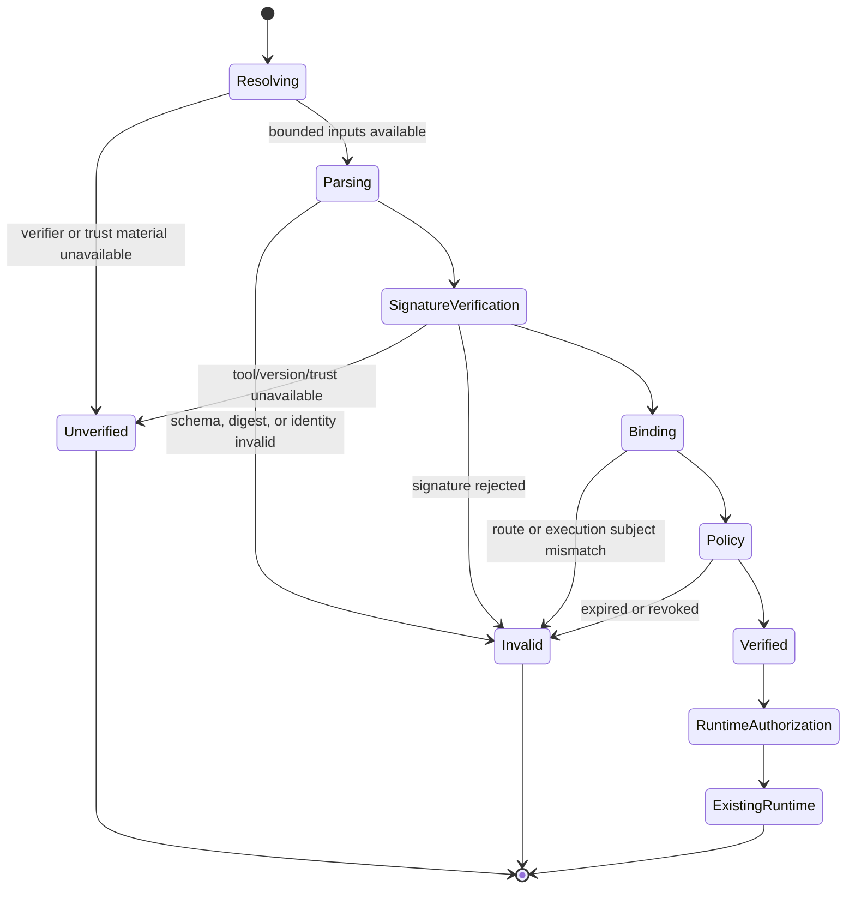
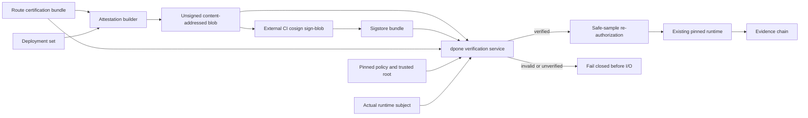

# Feature design: production route-attestation integrity v0.72.6

- Status: IMPLEMENTED
- Owner: dpone maintainers
- Issue: frozen Airflow self-service Phase 1B route-trust completion
- Target release: 0.72.6
- Last verified: 2026-07-15
- Base commit: `078ff2bc`
- Approval: maintainer requested autonomous continuation of the frozen plan on
  2026-07-15
- Implementation evidence:
  `test_artifacts/airflow-self-service-v0726-route-attestation/validation-report.md`
- Live certification: UNVERIFIED until an approved MSSQL/ClickHouse, Vault,
  Kubernetes, and Sigstore environment executes this exact path

## Executive summary

The explicit live safe-sample path is fail-closed by default, but its reserved
trust seam still accepts raw `verified_route_ids` from an injected command
context. That seam was useful while Phase 1B assembled the physical runtime,
but it is not a production authorization mechanism: a string does not prove
who certified a route or bind the proof to the release, deployment,
environment, runtime image, and evidence digest that will execute.

This slice replaces that runtime seam with one concrete, external-identity
trust path. Platform CI builds a small environment-specific authorization blob,
signs the exact bytes with Sigstore/cosign outside dpone, and publishes the blob,
Sigstore bundle, route-certification bundle, and verification policy. The dpone
runtime verifies those local immutable inputs before credentials, artifact
fetch, target DDL, or source/sink I/O. Only a complete `verified` decision can
authorize production pushdown sampling.

The beginner journey remains unchanged. Route attestations are platform-owned
deployment controls, not another pipeline authoring concept.

## Personas and customer journey

| Persona | Goal | Current pain | Success signal |
|---|---|---|---|
| Data engineer | Run the documented five-command sample journey | Production trust internals must not leak into authoring | No new beginner command or Vault/Sigstore field |
| Platform engineer | Authorize one certified deployment without embedding secrets | A raw route ID can be replayed and has no provenance | CI emits and externally signs one content-addressed blob |
| Security engineer | Prove the exact signer and execution subject | Existing proof is an injected string | Exact identity/issuer, digest, time, and subject checks fail closed |
| Airflow operator | Diagnose why runtime did not start | Missing and invalid proof look like generic policy failure | Structured state, code, safe remediation, and receipt are available |
| Auditor | Reconstruct the authorization chain | Runtime evidence has no route-signature lineage | Evidence links attestation, certification bundle, policy, release, and deployment digests |

Journey:

1. Route certification CI produces an immutable
   `dpone.route_certification_bundle.v1` at level `certified`.
2. Deployment CI invokes `dpone ops route-attestation-build` with that bundle
   and the immutable deployment projection.
3. CI signs the exact emitted JSON with `cosign sign-blob`; dpone never handles
   the signing identity or private material.
4. A platform preflight can run `dpone ops route-attestation-verify` and retain
   the create-only verification receipt.
5. The KPO runtime receives pinned local paths for the attestation, Sigstore
   bundle, route-certification bundle, policy, and trusted root.
6. The runtime re-verifies the complete chain against its execution plan.
7. Only `verified` becomes an internal route authorization; all other states
   stop before credential resolution and external data I/O.
8. Successful runtime evidence records safe verification metadata and the
   exact subject identities.

## Scope

### In scope

- Add `dpone.route-attestation.v1`,
  `dpone.route-attestation-policy.v1`, and
  `dpone.route-attestation-verification.v1` contracts.
- Add deterministic attestation construction from one certified route bundle
  and one immutable deployment projection.
- Bind route ID, full static route tuple, certification bundle digest/profile/
  level, release ID, deployment ID, environment, authorization profile,
  runtime image digest, and bounded validity.
- Add one narrow cryptographic verification port and one cosign keyless blob
  adapter.
- Require exact certificate identity and OIDC issuer plus a local trusted root
  whose bytes match a pinned SHA-256.
- Require a supported cosign release and reject known-vulnerable/unknown
  versions before verification.
- Add local attestation and signer revocation checks.
- Remove raw CLI-context route authorization from production composition.
- Add successful route verification metadata to runtime execution evidence.
- Add build/verify platform commands, structured errors, schema docs, tests,
  runbook, compatibility notes, and validation evidence.

### Non-goals

- No new beginner command, authoring field, recipe, or Airflow parse behavior.
- No signing inside dpone and no storage of OIDC tokens, private keys, KMS
  credentials, or Vault signing secrets.
- No generic trust backend/plugin registry. Sigstore/cosign keyless blob
  verification is the only v1 production adapter.
- No online trust-store or revocation service. v1 consumes a pinned local trust
  root and policy revocation snapshot.
- No claim of live route certification without an approved live environment.
- No change to release/deployment content identities. The authorization
  overlay is evidenced but does not cause release rebuilds or deployment-ID
  cycles.
- No reuse of the local HMAC evidence signer as a production identity.

### Assumptions and constraints

- The route-certification bundle is immutable and retained by digest.
- Production uses the `vendor_live` certification profile and level
  `certified`; development may verify other profiles but cannot use them to
  authorize production.
- The static safe-sample route catalog remains credential-free metadata and is
  not itself authority.
- The policy and all verification inputs are mounted/materialized before the
  runtime starts; the verifier performs no artifact discovery or `current`
  lookup.
- Trusted-root refresh is a platform deployment action and changes the policy
  fingerprint.
- Runtime clock is UTC and sufficiently synchronized for bounded validity.
- Attestation, policy, certification bundle, Sigstore bundle, and trusted root
  are bounded before parsing or subprocess execution.

## Public contract

### CLI

Build an unsigned, create-only authorization blob:

```bash
dpone ops route-attestation-build \
  --route-id mssql_clickhouse_incremental_merge_airflow_kpo \
  --route-certification-bundle route_certification_bundle.json \
  --deployment-set deployment.json \
  --authorization-profile safe_sample_production \
  --issued-at 2026-07-15T10:00:00Z \
  --not-before 2026-07-15T10:00:00Z \
  --expires-at 2026-07-16T10:00:00Z \
  --output route-attestation.json
```

External CI signs the bytes:

```bash
cosign sign-blob --yes \
  --bundle route-attestation.sigstore.json \
  route-attestation.json
```

Verify without credentials or data-system I/O:

```bash
dpone ops route-attestation-verify \
  --attestation route-attestation.json \
  --sigstore-bundle route-attestation.sigstore.json \
  --route-certification-bundle route_certification_bundle.json \
  --policy route-attestation-policy.json \
  --deployment-set deployment.json \
  --output-dir .dpone/route-attestation-verification
```

Explicit live runtime adds platform-only inputs:

```bash
dpone ops safe-sample-runtime-run \
  --plan-json plan.json \
  --pipeline-source pipelines/orders_daily/pipeline.yaml \
  --enable-live-copy \
  --binding-set environments/prod/binding-set.yaml \
  --connection-registry platform/connection-registries/prod.yaml \
  --credential-runtime environments/prod/credential-runtime.yaml \
  --route-attestation route-attestation.json \
  --route-attestation-bundle route-attestation.sigstore.json \
  --route-certification-bundle route_certification_bundle.json \
  --route-attestation-policy route-attestation-policy.json
```

CLI rules:

- Build requires explicit timestamps. It never uses an implicit local clock,
  which makes CI inputs and identity reproducible.
- Build and verification receipts use create-only atomic writes and never
  replace existing evidence.
- Verify returns `0` only for `verified`.
- Invalid or unverified trust returns security/safety exit `4`.
- Malformed CLI usage returns `2`; internal failure returns `5`.
- `--enable-live-copy` requires all four route-attestation inputs. Non-live
  rehearsal rejects those flags as an invalid combination.
- Human output is bounded and contains no route registry body, certificate,
  Sigstore bundle, trusted-root body, or subprocess output.
- JSON output uses the public verification contract.

### Python API

The implementation exposes narrow internal contracts, not a generic trust SDK:

```python
class RouteAttestationSignatureVerifier(Protocol):
    def verify_blob(
        self,
        *,
        blob: bytes,
        sigstore_bundle: bytes,
        trusted_root: bytes,
        policy: CosignVerificationPolicy,
    ) -> SignatureVerificationResult: ...

class RouteAttestationVerificationService:
    def verify(
        self,
        *,
        attestation: bytes,
        sigstore_bundle: bytes,
        certification_bundle: bytes,
        policy: Mapping[str, object],
        trusted_root: bytes,
        expected: RouteAttestationExpectedSubject,
    ) -> RouteAttestationVerification: ...
```

`CosignRouteAttestationSignatureVerifier` is injected at the readiness/CLI
composition root. Domain parsing, binding, time, and revocation policy do not
import subprocess, Airflow, Vault, Kubernetes, or connector modules.

### Schemas

Attestation:

```yaml
schema: dpone.route-attestation.v1
attestation_id: sha256:...
claims:
  route:
    route_id: mssql_clickhouse_incremental_merge_airflow_kpo
    source: mssql
    sink: clickhouse
    strategy: incremental_merge
    transport: native_bcp_to_clickhouse
    schema_evolution: widening
    airflow_runtime_mode: kpo
    sampling_mode: pushdown
  certification:
    bundle_sha256: sha256:...
    profile: vendor_live
    level: certified
  subject:
    release_id: sha256:...
    deployment_id: sha256:...
    environment: production
    runtime_image_digest: sha256:...
    authorization_profile: safe_sample_production
  validity:
    issued_at: 2026-07-15T10:00:00Z
    not_before: 2026-07-15T10:00:00Z
    expires_at: 2026-07-16T10:00:00Z
```

Identity is defined without self-reference:

```text
attestation_id = sha256(JCS(canonical claims))
```

The signature covers the exact complete attestation file bytes, including the
schema and attestation ID.

Policy:

```yaml
schema: dpone.route-attestation-policy.v1
backend: cosign_keyless_v1
certificate_identity: https://github.com/PaulKov/dpone/.github/workflows/route-attestation.yml@refs/heads/master
certificate_oidc_issuer: https://token.actions.githubusercontent.com
trusted_root:
  path: /etc/dpone/sigstore/trusted_root.json
  sha256: sha256:...
cosign:
  minimum_version: 3.0.4
  maximum_version_exclusive: 4.0.0
  timeout_seconds: 30
allowed_environments: [production]
allowed_authorization_profiles: [safe_sample_production]
allowed_certification_profiles: [vendor_live]
minimum_certification_level: certified
max_validity_seconds: 86400
clock_skew_seconds: 300
revoked_attestation_ids: []
revoked_certificate_identities: []
```

The policy uses exact strings, not regular expressions. `trusted_root.path` is
platform-local metadata and is never copied into runtime evidence.

Verification receipt:

```yaml
schema: dpone.route-attestation-verification.v1
decision: verified  # verified | invalid | unverified
code: DPONE_ROUTE_ATTESTATION_VERIFIED
attestation_id: sha256:...
attestation_sha256: sha256:...
certification_bundle_sha256: sha256:...
policy_fingerprint: sha256:...
route_id: mssql_clickhouse_incremental_merge_airflow_kpo
release_id: sha256:...
deployment_id: sha256:...
environment: production
authorization_profile: safe_sample_production
signer:
  backend: cosign_keyless_v1
  certificate_identity: https://github.com/PaulKov/dpone/.github/workflows/route-attestation.yml@refs/heads/master
  certificate_oidc_issuer: https://token.actions.githubusercontent.com
  verifier_version: 3.0.4
validity:
  not_before: 2026-07-15T10:00:00Z
  expires_at: 2026-07-16T10:00:00Z
verified_at: 2026-07-15T10:03:00Z
errors: []
```

`verified_at` is evidence metadata and is excluded from deterministic decision
identity. Invalid/unverified receipts contain only safe codes and messages.

### Artifacts and evidence

| Artifact | Ownership | Write semantics | Secret content |
|---|---|---|---|
| `route-attestation.json` | deployment CI | create-only | none |
| `route-attestation.sigstore.json` | external signer | immutable | none, but body is not logged |
| `route-attestation-policy.json` | platform/security | immutable snapshot | none; infra-sensitive paths hidden from normal logs |
| `route-attestation-verification.json` | verifier/runtime | create-only | safe metadata only |
| `safe-sample-runtime-execution.json` | runtime | create-only | additive verification summary only |

Successful runtime evidence adds:

```yaml
route_attestation_verification:
  decision: verified
  attestation_id: sha256:...
  attestation_sha256: sha256:...
  certification_bundle_sha256: sha256:...
  policy_fingerprint: sha256:...
  route_id: mssql_clickhouse_incremental_merge_airflow_kpo
  signer:
    backend: cosign_keyless_v1
    certificate_identity: https://github.com/.../route-attestation.yml@refs/heads/master
    certificate_oidc_issuer: https://token.actions.githubusercontent.com
    verifier_version: 3.0.4
```

No certificate, signature bytes, trusted-root body/path, subprocess stdout,
Vault path, credential value, sampled row, or signed URL is recorded.

### Compatibility and migration

- The five beginner commands and non-live runtime are unchanged.
- Existing production integrations that injected `verified_safe_sample_route_ids`
  are no longer authorized. This was an undocumented reserved seam and is
  removed as a security fix; there is no production compatibility fallback.
- Unit/application callers may continue using the low-level detector with
  trusted IDs during one internal deprecation release, but the CLI and live
  assembly do not expose that path.
- Platform automation migrates by generating, externally signing, and mounting
  the four new runtime inputs.
- Rollback disables explicit live copy and returns to fail-closed no-I/O
  rehearsal. Rollback must never restore raw route-ID production trust.
- No release/deployment rebuild is required when only the short-lived
  attestation rotates. A different deployment requires a new attestation.

## Detailed algorithm

### Build

1. Read the route-certification bundle and deployment-set once as bounded raw
   bytes; reject non-regular files and oversized input.
2. Parse JSON mappings with duplicate-key rejection and validate public schemas.
3. Resolve the explicit route ID from the static route catalog.
4. Require the certification bundle route key to equal the catalog route key,
   `passed: true`, `level: certified`, and an allowed profile for the target
   environment.
5. Require a runnable, complete deployment with non-empty content-addressed
   release/deployment IDs, environment, and runtime image digest.
6. Parse timestamps as timezone-aware UTC values. Require
   `issued_at <= not_before < expires_at` and a positive validity duration.
7. Build claims from normalized catalog, certification, and deployment facts.
8. Compute `attestation_id = sha256(JCS(claims))`.
9. Serialize stable sorted UTF-8 JSON with a trailing newline.
10. Write the output atomically with create-only semantics. Emit no signing
    command containing secrets; display only the safe next-step template.

### Verify and authorize

1. Read attestation, Sigstore bundle, certification bundle, policy, and trusted
   root once with per-file size limits. Traverse every parent component through
   descriptor-relative `O_NOFOLLOW` opens, reject `..`, and revalidate parent
   and file inodes after the read. Resolve the trusted-root path from the policy,
   then verify its raw digest before use.
2. Parse attestation, certification, and policy with duplicate-key rejection;
   validate all schemas and supported backend/version semantics.
3. Recompute the attestation ID from canonical claims. Verify the raw
   certification-bundle digest equals the signed claim.
4. Copy the already-read attestation, Sigstore bundle, and trusted root bytes to
   a private temporary directory. Never let cosign reopen caller-controlled
   paths, avoiding symlink/TOCTOU replacement.
5. Execute an injected command runner with an argument vector and no shell:

   ```text
   cosign verify-blob
     --bundle <private bundle path>
     --trusted-root <private trusted-root path>
     --certificate-identity <exact identity>
     --certificate-oidc-issuer <exact issuer>
     --timeout 30s
     <private attestation path>
   ```

6. Before verification, run bounded `cosign version --json`; require the
   policy-supported, security-fixed range. Timeout, missing binary, unsupported
   version, or unavailable trust material yields `unverified` and fails closed.
7. Non-zero signature verification yields `invalid`; no command output is
   copied into the public message.
8. Compare signed route fields with both the static route catalog and the route
   certification bundle. Reject missing, duplicate, or mismatched identities.
9. Compare release ID, deployment ID, environment, runtime image digest, and
   authorization profile with the actual runtime plan/deployment context.
10. Enforce exact allowed profiles, minimum certification level, maximum
    validity, not-before/expiry with injected UTC clock and bounded skew, and
    attestation/signer revocation snapshots.
11. Produce a deterministic verification decision plus `verified_at` evidence.
    Both `invalid` and `unverified` are terminal for production.
12. Convert only a `verified` decision to the internal route ID set used by the
    existing capability detector. Recompute safe-sample policy from authoring
    facts. Do not serialize the trust bit into the plan.
13. Continue pinned source, binding/registry/runtime fingerprint, credentials,
    init-fetch, DDL, and data-copy checks in their existing order.
14. Add the safe verification summary to create-only runtime evidence.

### Pseudocode

```text
attestation_bytes = bounded_read(attestation_path)
bundle_bytes = bounded_read(sigstore_bundle_path)
certification_bytes = bounded_read(certification_bundle_path)
policy = parse_and_validate(bounded_read(policy_path))
trusted_root_bytes = bounded_read(policy.trusted_root.path)
require sha256(trusted_root_bytes) == policy.trusted_root.sha256

claims = parse_and_validate(attestation_bytes)
require sha256(JCS(claims)) == attestation.attestation_id
require sha256(certification_bytes) == claims.certification.bundle_sha256

signature = signature_verifier.verify_blob(
    blob=attestation_bytes,
    bundle=bundle_bytes,
    trusted_root=trusted_root_bytes,
    exact_identity=policy.certificate_identity,
    exact_issuer=policy.certificate_oidc_issuer,
)
if signature.unavailable:
    return UNVERIFIED
if not signature.valid:
    return INVALID

require route_tuple == catalog[route_id]
require certification_route == route_tuple.source_sink_strategy
require certification_passed_and_level_and_profile
require subject == actual_release_deployment_environment_runtime_image_profile
require validity_window_and_revocation_policy

decision = VERIFIED(attestation_id, safe_lineage)
authorized_plan = reauthorize(pipeline, verified_route_ids=[decision.route_id])
execute_existing_runtime(authorized_plan, evidence=decision.safe_summary)
```

### State machine



### Ordering, transactions, retries, and replay

- Verification is pure local control-plane work except for the bounded cosign
  process. Production network policy blocks trust-root refresh; all trust bytes
  are pre-materialized.
- The verifier may perform one bounded read of the already materialized,
  checksum-pinned local pack to derive the expected execution subject. This is
  control-file verification, not runtime artifact delivery.
- No credential resolution, remote `init_fetch`, DB client creation, DDL,
  source read, or sink write occurs before `verified` and the existing local
  identity checks pass.
- Attestation and verification receipt writes are create-only and atomic.
- Verification may be retried with identical byte inputs. It recomputes the
  same attestation, bundle, and policy digests; only `verified_at` changes.
- Runtime does not cache a verification decision beyond one workload process.
  A retry re-verifies current policy and revocation snapshot.
- A deployment change always mismatches the old signed subject and requires a
  new attestation. Secret rotation under `version_policy: latest` does not
  change release/deployment identity and does not require a new attestation.
- Concurrent verification has no shared mutable state. Outputs target unique
  run directories; duplicate output paths fail rather than replace evidence.
- Cancellation or cosign timeout produces `unverified`; no compensating data
  action is needed because runtime I/O has not started.

### Failure taxonomy and recovery

| State | Example codes | Exit | Recovery |
|---|---|---:|---|
| `invalid` | `DPONE_ROUTE_ATTESTATION_SIGNATURE_INVALID`, `DPONE_ROUTE_ATTESTATION_SUBJECT_MISMATCH`, `DPONE_ROUTE_ATTESTATION_EXPIRED`, `DPONE_ROUTE_ATTESTATION_REVOKED` | 4 | Rebuild/re-sign for the exact deployment or investigate tampering |
| `unverified` | `DPONE_ROUTE_ATTESTATION_VERIFIER_UNAVAILABLE`, `DPONE_ROUTE_ATTESTATION_VERIFIER_VERSION_UNSUPPORTED`, `DPONE_ROUTE_ATTESTATION_TRUST_ROOT_UNAVAILABLE` | 4 | Repair runtime image/trust material; do not bypass |
| usage/config | `DPONE_ROUTE_ATTESTATION_INPUT_INVALID`, `DPONE_ROUTE_ATTESTATION_POLICY_INVALID` | 2 | Correct platform files or CLI flags |
| success | `DPONE_ROUTE_ATTESTATION_VERIFIED` | 0 | Continue runtime |

Messages name logical inputs and expected identities but never include raw
certificate, signature, trust-root, subprocess output, or infrastructure paths
outside platform-role output.

### Edge cases

- Empty or missing attestation: `unverified`, no fallback.
- Duplicate JSON keys: invalid before signature process.
- Unknown route ID or route tuple drift: invalid.
- Route bundle passed but level is not `certified`: invalid.
- Production bundle profile is not `vendor_live`: invalid.
- Attestation signed correctly for another release/deployment/environment/image:
  invalid.
- Exact expiry boundary: expired after configured skew semantics; deterministic
  injected clock tests define both sides.
- Negative/zero/excessive validity: invalid.
- Attestation or signer appears in revocation snapshot: invalid even with a
  valid signature.
- Trusted-root digest mismatch: invalid trust material and `unverified`.
- Cosign missing, timed out, malformed version output, or unsupported version:
  `unverified`.
- Cosign produces large or sensitive output: output is truncated internally
  and never copied to public evidence.
- Symlink swap after read: irrelevant because cosign receives private copies of
  the bytes already hashed.
- One valid and one malformed route in a future batch: v1 verifies one
  attestation per workload; no partial batch semantics are introduced.

## Architecture

### Components and responsibilities

| Component | Existing/new | Responsibility | Dependencies |
|---|---|---|---|
| Route certification service | Existing | Produce environment-neutral route evidence | ops evidence services |
| Route attestation models | New | Immutable claims, expected subject, decisions | canonical fingerprint only |
| Route attestation builder | New | Join certified bundle and deployment facts | models, static route catalog |
| Signature verifier port | New | Verify exact blob bytes through one capability interface | value objects only |
| Cosign adapter | New | Execute bounded exact-identity `verify-blob` | subprocess runner DI |
| Verification policy service | New | Digest, subject, time, profile, revocation checks | injected clock, verifier port |
| Readiness composition | Modified | Read bounded files and create verified decision | verifier service |
| Live runtime authorizer | Modified | Consume verified decision only | existing policy evaluator |
| Runtime executor/evidence | Modified | Persist safe authorization lineage | existing redaction writer |
| CLI parsers/handlers | Modified | Platform build/verify/runtime flags and exit codes | thin service delegation |

### Ports, adapters, and composition root

Dependency direction is inward:

```text
commands/readiness composition
    -> application verification service
        -> contracts/value objects
        -> RouteAttestationSignatureVerifier port
            <- Cosign subprocess adapter
```

The policy service never imports subprocess or vendor SDKs. The cosign adapter
does not know safe-sample policy, route catalogs, deployments, or credentials.
The command handler never evaluates trust itself. Constructors receive clock,
runner, verifier, and file reader dependencies where tests require control.

### Data and control flow



### Alternatives and tradeoffs

| Alternative | Advantages | Disadvantages | Decision |
|---|---|---|---|
| Raw verified route IDs | Minimal code | No signer, digest, subject, expiry, or replay protection | Reject for production |
| Runtime HMAC | Easy local verification | Runtime must hold signing secret; weak identity/rotation boundary | Reject |
| Digest-only signature | No secret | Proves bytes only, not trusted publisher | Reject |
| GitHub `gh attestation verify` only | Strong GitHub provenance UX | Couples runtime authorization to GitHub predicate model and CLI | Defer as future adapter |
| Sigstore/cosign signed blob | Exact byte digest, OIDC identity, portable bundle, external signing | Requires binary/trusted-root lifecycle | Adopt |
| Generic trust plugin framework | Future flexibility | Speculative abstraction and larger attack surface | Reject |

### ADR requirement

Required and accepted as ADR 0014 because this changes the production trust
authority, public failure semantics, evidence chain, and composition boundary.

### Quality-budget impact

- New modules split models, policy, adapter, and composition; each remains under
  the global 400 SLOC hard limit and preferably under 350 SLOC warning.
- Existing CLI modules stay thin; shared schema registry and changelog remain
  integrator-owned.
- One new inward port and one outward adapter are added; no Airflow, Vault,
  Kubernetes, or connector imports enter contract/service modules.
- Import/layer metrics must not exceed
  `docs/benchmarks/quality_budgets.yml` baselines.

## Market comparison

Checked 2026-07-15 using current official primary documentation. The listed
ETL/orchestration products do not expose a directly comparable signed,
deployment-bound authorization overlay for dpone safe-sample, so irrelevant
rows are explicitly N/A rather than forced comparisons.

| System/version | Relevant capability | Observed design | Strength | Limitation for this scope | Adopt/reject | Source/date |
|---|---|---|---|---|---|---|
| dlt | N/A | Loading framework, not this runtime trust layer | N/A | No comparable dpone route authorization | N/A | N/A, 2026-07-15 |
| Informatica | N/A | Managed data-integration controls | Central governance | Not a portable signed dpone blob verifier | N/A | N/A, 2026-07-15 |
| Airbyte | N/A | Connector/runtime platform | Connector catalog and operations | No comparable dpone execution-subject attestation | N/A | N/A, 2026-07-15 |
| Fivetran | N/A | Managed ELT service | Managed operational boundary | No user-controlled runtime trust adapter | N/A | N/A, 2026-07-15 |
| Pentaho | N/A | ETL tooling | Mature job execution | No comparable content-addressed authorization overlay | N/A | N/A, 2026-07-15 |
| Microsoft SSIS | N/A | Package execution platform | Enterprise deployment tooling | No comparable dpone route attestation | N/A | N/A, 2026-07-15 |
| gusty | N/A | Airflow DAG generation | Minimal DAG authoring | Does not own runtime artifact trust | N/A | N/A, 2026-07-15 |
| Astronomer Cosmos | N/A | dbt/Airflow orchestration | Strong model-to-task UX | Does not authorize dpone route evidence | N/A | N/A, 2026-07-15 |
| Apache Beam | N/A | Portable data processing | Runner portability | No comparable deployment authorization blob | N/A | N/A, 2026-07-15 |
| Sigstore cosign v3 | Signed blob verification | Bundle verifies blob digest with exact certificate identity and OIDC issuer | External identity and portable verification material | Tool and trusted-root lifecycle are operator responsibilities | Adopt exact identity/issuer and bundle; reject regex/insecure flags | [Official verify docs](https://docs.sigstore.dev/cosign/verifying/verify/), 2026-07-15 |
| GitHub Artifact Attestations | Offline artifact provenance | Downloaded bundles can be verified against GitHub identity/policy | Strong CI provenance UX | GitHub-specific and not the v1 runtime predicate | Defer as future adapter | [Official offline verification](https://docs.github.com/en/actions/how-tos/secure-your-work/use-artifact-attestations/verify-attestations-offline), 2026-07-15 |
| SLSA v1.2 | Artifact verification model | Verifier checks subject digest and expected provenance/build properties | Clear separation of cryptographic and policy checks | General supply-chain model, not route policy | Adopt digest plus expected-subject pattern | [Official verification spec](https://slsa.dev/spec/v1.2/verifying-artifacts), 2026-07-15 |

Security note: production certification requires cosign `>=3.0.4,<4`; older
v3 versions are outside the supported range because Sigstore published a
verification advisory. The range is a policy contract and must be re-certified
before expansion.

## Measurable differentiation

```yaml
axis: production safe-sample authorization integrity
scenario: attempt to execute one production MSSQL-to-ClickHouse sample with forged, stale, replayed, or mismatched route proof
baseline: v0.72.4 raw composition-context verified_route_ids seam
metric: attack-matrix cases rejected before credential, artifact, DDL, source, or sink I/O
target: 100 percent of specified negative cases; zero external data-system calls before verified
procedure: unit plus mocked integration matrix with instrumented ports; one approved live certification run
artifact: test_artifacts/airflow-self-service-v0726-route-attestation/validation-report.md
limitations: proves this route and verifier contract; it does not certify every route, cosign release, or deployment environment
```

No public claim that dpone is generally better than the listed systems is made.

## Security, privacy, and operations

- Signing identity is external; runtime receives no private key, OIDC token,
  KMS secret, or HMAC key.
- Exact certificate identity and issuer are mandatory. Regex identities and all
  `--insecure-*` flags are prohibited.
- Trusted-root bytes are locally pinned by digest. The runtime deployment, not
  the verifier, refreshes them.
- Files are size-bounded and read once through pinned directory descriptors;
  parent symlinks, traversal, and inode swaps fail closed. Cosign uses private
  copies to eliminate caller-path TOCTOU.
- Create-only outputs are written and fsynced as private temporary files in a
  pinned parent descriptor, atomically hard-linked to the final name, and
  revalidated before success is reported.
- Subprocess uses `shell=False`, a fixed subcommand/flag set, sanitized
  environment, timeout, and bounded safe reporting.
- Production network policy should deny public Sigstore/TUF egress during
  runtime verification because the complete bundle/root are pre-materialized.
- Revocation snapshots are policy-owned. A changed snapshot changes the policy
  fingerprint and is re-evaluated on retry.
- Metrics: decisions by status/code, verification latency, verifier version,
  expired/revoked count. Labels never include filesystem paths or full signer
  data beyond the allowlisted logical identity.
- Alert on any production `invalid`, repeated `unverified`, unsupported verifier
  version, or subject mismatch.
- Operator recovery never recommends bypass flags. Repair inputs/tooling,
  rebuild for the exact deployment, or disable live execution.

## Test and certification plan

| Layer | Scenario | Environment | Expected artifact |
|---|---|---|---|
| Unit | Canonical ID, timestamps, route tuple, policy, revocation | local | deterministic model assertions |
| Unit | Cosign argv/version/timeout/output redaction | fake runner | adapter result |
| Contract | Three JSON schemas and generated docs agree | local | schema files |
| Negative security | forged signature, unknown signer, unsupported version, stale/revoked, digest/subject mismatch, duplicate keys, oversized files, parent symlink/swap, traversal | local/fake runner | explicit invalid/unverified codes |
| Mocked integration | No credential/fetch/DDL/DB call before verified | local injected spies | runtime evidence/error |
| CLI UX | build, verify, invalid flag matrix, output atomicity, exit codes | local/fake cosign | stdout plus receipts |
| Compatibility | beginner five commands and non-live rehearsal unchanged | local | existing quickstart tests |
| Performance | 100 local verification policy evaluations excluding cosign p95 <= 10 ms | CI runner | benchmark JSON |
| Live certification | Keyless-signed production-like route, Vault/KPO/MSSQL/ClickHouse | approved environment only | signed bundle plus runtime evidence |

Required negative cases include forged proof, one-byte attestation mutation,
one-byte certification-bundle mutation, exact/unknown signer, issuer mismatch,
known-vulnerable cosign version, timeout, missing binary, trust-root mismatch,
wrong route/release/deployment/environment/profile/runtime image, expired and
not-yet-valid proof, revoked attestation/signer, final/parent symlink, parent
inode swap, path traversal, secret-looking subprocess output, and duplicate
output publication.

Live checks are `UNVERIFIED` or `SKIP` when the approved environment is absent;
mocked signature verification is never reported as live PASS.

## Documentation plan

- Add a platform route-attestation build/sign/verify/run guide with a simple
  Mermaid chain and exact recovery table.
- Update Airflow self-service architecture and Phase 1B backlog status.
- Update compatibility/deprecation guidance for raw route-ID injection.
- Update CLI reference/generated schemas and error catalog.
- Keep the first-DAG and first-safe-run beginner pages free of Sigstore details;
  link operators to the platform guide only from diagnostic/runtime sections.
- Record the external-signing requirement and no-secret guarantees in the
  operator runbook and changelog.

## Rollout and rollback

1. Land schemas, builder, verifier, and standalone CLI with tests.
2. Wire production live runtime to require a verified decision and remove raw
   CLI-context injection.
3. Publish a platform migration guide and create a CI signing workflow outside
   this code slice.
4. Run mocked attack matrix and broad gates.
5. Run approved live certification; until then route status remains
   experimental/UNVERIFIED and no production-ready claim is made.
6. Rollback disables live-copy authorization. It does not restore raw route
   IDs or weaken signature policy.

Rollback triggers: any false authorization, secret leakage, input TOCTOU,
unsupported verifier acceptance, or data-system I/O before `verified`.

## Agent execution plan

| Agent/role | Owned paths | Read-only paths | Forbidden paths | Dependency |
|---|---|---|---|---|
| Read-only explorer | Existing route/runtime/CLI paths | repository | all writes | none |
| Read-only architect | ADR/spec and boundaries | repository | all writes | explorer map |
| Read-only test certifier | threat matrix/tests | repository | all writes | explorer map |
| Codex integrator | task-contract owned paths | normative docs | `.cursor/`, unrelated shared files | approved spec |

Codex is the only writer and owns shared schema registry, changelog, docs nav,
and integration semantics for this slice.

## Approval checklist

- [x] User problem and CJM are clear.
- [x] Algorithm and failure semantics are implementable without guessing.
- [x] Public contracts and compatibility are explicit.
- [x] Architecture and alternatives are justified.
- [x] Relevant market research uses current official sources.
- [x] Claimed differentiation is measurable.
- [x] Tests, evidence, docs, rollout, and rollback are complete.
- [x] Path ownership and integration plan are conflict-safe.
- [x] Maintainer authorized autonomous continuation and status is `APPROVED`.
