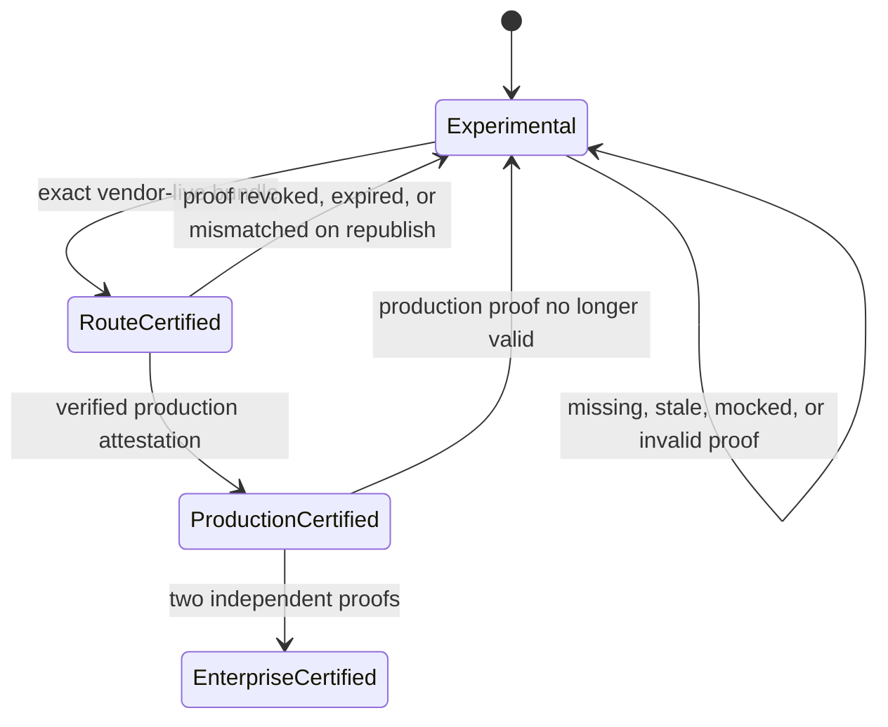
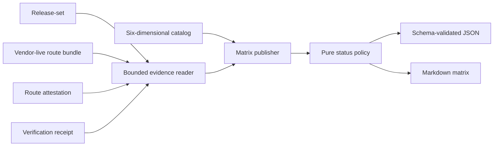

# Feature design: six-dimensional route certification matrix v1

- Status: IMPLEMENTED
- Owner: dpone maintainers
- Issue: Airflow self-service roadmap Phase 4
- Target release: v1.0 standardization
Last verified: 2026-07-16

## Executive summary

dpone already has connector capability metadata, deterministic integration-matrix
contracts, route live-certification bundles, release gates, and signed
deployment-bound route attestations. Operators cannot currently answer one simple
question from one artifact: which exact combination of source, sink, strategy,
transport, schema evolution, and Airflow/runtime mode has actually been proved?

This feature publishes a fail-closed `dpone.route-certification-matrix.v1`
projection. It does not execute workloads and does not introduce a second
certification engine. It combines the existing static route catalog with bounded,
immutable evidence and never converts mock, missing, stale, mismatched, or unsigned
evidence into a production claim.

## Personas and customer journey

| Persona | Goal | Current pain | Success signal |
|---|---|---|---|
| Data engineer | Select a route that is appropriate for a pipeline | Connector-level support hides transport/runtime caveats | One row names all six dimensions and links its proof |
| Platform engineer | Publish an auditable support matrix | Evidence is spread across several artifacts | One deterministic JSON/Markdown projection is generated from exact inputs |
| Airflow operator | Decide whether a KPO route can run in production | A passing contract test can look like live certification | Production status requires a verified deployment-bound attestation |
| Security/audit reviewer | Trace a claim to immutable evidence | Static docs do not prove signer, release, or deployment | Every promoted row records digests, identities, validity, and safe provenance |

Journey:

1. Discover the matrix in `docs/route-certification-matrix.md`.
2. Publish a catalog-only matrix for the exact commit.
3. Run existing route live-certification and release gates.
4. Place one bounded evidence set in a dedicated directory.
5. Re-publish the matrix with `--evidence-dir`.
6. Inspect blockers and proof digests; repair upstream evidence, never the matrix.
7. Promote status only after the existing signed attestation verifier succeeds.

## Scope

### In scope

- one row identity over `source x sink x strategy x transport x schema_evolution x airflow_runtime_mode`;
- public statuses `experimental`, `route-certified`, `production-certified`, and `enterprise-certified`;
- separate contract, live, and production evidence states;
- bounded, non-recursive ingestion of existing evidence artifacts;
- exact release content identity and source-commit provenance checks;
- deterministic JSON and human-readable Markdown output;
- schema registration, CLI, tests, docs, and roadmap status update.

### Non-goals

- executing live tests or mutating route evidence;
- certifying every theoretical Cartesian-product cell;
- replacing connector certification, integration-matrix tests, route release gates,
  route attestations, or signed catalog conformance;
- allowing an operator to set a certification status manually;
- claiming external production or usability evidence that is unavailable.

### Assumptions and constraints

- v1 publishes only explicitly registered six-dimensional candidates. The initial
  candidate is the existing MSSQL to ClickHouse safe-sample route.
- Evidence directories contain exact well-known file names and are never scanned
  recursively.
- The expected commit SHA is supplied explicitly by CI or the operator.
- Missing evidence is `UNVERIFIED`, not failure and not pass.
- Invalid supplied evidence is `FAIL`, keeps the route experimental, and makes the
  CLI exit non-zero after writing the diagnostic report.

## Public contract

### CLI

```bash
dpone certify routes \
  --commit-sha "$(git rev-parse HEAD)" \
  --output-dir test_artifacts/route-certification-matrix

dpone certify routes \
  --commit-sha "$(git rev-parse HEAD)" \
  --evidence-dir test_artifacts/routes/mssql-clickhouse-prod-a \
  --evidence-dir test_artifacts/routes/mssql-clickhouse-prod-b \
  --output-dir test_artifacts/route-certification-matrix \
  --format json
```

Options:

| Option | Contract |
|---|---|
| `--commit-sha` | required non-empty exact source commit expected in release provenance |
| `--evidence-dir` | repeatable; one non-recursive proof set per directory |
| `--output-dir` | required destination for the two report files |
| `--max-age-hours` | default `168`; bounds `1..8760`; applies to live bundles |
| `--format` | `md` default or `json`; controls stdout only |

Exit codes are `0` when the projection is valid, `1` when supplied evidence is
invalid/failed, and `2` for invalid CLI input or unsafe I/O. Experimental and
unverified rows alone do not make publication fail.

Output is create-only. Repeating the exact publication is a no-op; differing
bytes at the same destination are a conflict. Partial staging is removed before
returning an error.

### Python API

```python
from dpone.ops.route_certification_matrix import (
    RouteCertificationMatrixRequest,
    RouteCertificationMatrixService,
)

report = RouteCertificationMatrixService().publish(request)
```

The service receives catalog and clock dependencies through its constructor.
It performs no network, database, Airflow metadata, Vault, or secret calls.

### Manifest/schema

No manifest behavior changes. The generated artifact validates against
`dpone.route-certification-matrix.v1`.

### Artifacts and evidence

Each evidence directory may contain only these consumed names:

```text
release-set.json                         required for any promotion
route_certification_bundle.json         required for route-certified
route-attestation.json                   required for production-certified
route-attestation-verification.json      required for production-certified
```

Unknown files are ignored because the reader does not enumerate the directory.
Files are regular, non-symlink files, bounded to 4 MiB, parsed as strict JSON,
and represented by SHA-256 in the matrix.

Evidence states use `PASS`, `FAIL`, and `UNVERIFIED`. Public route status uses:

| Status | Minimum proof |
|---|---|
| `experimental` | registered six-dimensional candidate; no qualifying immutable proof |
| `route-certified` | exact-commit, content-valid release-set plus passed `vendor_live` route bundle with a content-bound `matrix_claim` for the same release and all six route dimensions |
| `production-certified` | route-certified plus non-expired `verified` route attestation for a production deployment |
| `enterprise-certified` | two production-certified proofs with distinct deployment IDs and distinct verified signer identities |

The enterprise rule is intentionally conservative. Two receipts from the same
deployment or CI signer are not independent evidence.

### Compatibility and migration

This is additive. Existing connector matrices, integration reports, route bundles,
attestations, and commands remain unchanged. A route with old evidence lacking the
required release provenance remains `experimental` with an actionable blocker.

## Detailed algorithm

1. Validate request bounds, expected commit, and output confinement.
2. Load the explicit six-dimensional candidate catalog in deterministic ID order.
3. Resolve each candidate against the existing route profile catalog. Unknown or
   unsupported catalog rows are emitted as failed experimental rows.
4. For each explicit evidence directory, read only the four well-known files.
5. Validate `release-set.json`: public schema, canonical content-addressed
   `release_id`, and `provenance.source_commit == expected_commit`.
6. Validate the route bundle: schema, passed/level/profile, immutable byte digest,
   and a `dpone.route-matrix-claim.v1` that binds the bundle to the exact release ID,
   source commit, certification time, route ID, and all six route dimensions.
7. Match the content-bound claim to exactly one six-dimensional candidate. Never
   infer a transport or runtime mode from a three-dimensional route key alone.
8. If attestation files are present, require both. Verify receipt decision, exact
   attestation digest and ID, certification-bundle digest, release ID, six route
   dimensions, production environment, validity interval, signer identity, and
   deployment ID.
9. Aggregate evidence per candidate. `FAIL` dominates `UNVERIFIED`; no status is
   promoted past the strongest complete proof.
10. Upgrade to enterprise only when two production proofs satisfy both independence
    checks.
11. Sort rows by stable six-dimensional ID, calculate counts, render JSON/Markdown,
    validate the JSON schema, and publish through a create-only staged directory.

### Pseudocode

```text
rows = catalog candidates sorted by certification_id
proofs = []
for evidence_dir in explicit evidence_dirs:
    proof = read_bounded_known_files(evidence_dir)
    validate_release_identity_and_commit(proof.release)
    candidate = exact_catalog_match(proof.bundle.matrix_claim.route)
    validate_vendor_live_bundle(proof.bundle, candidate, release, expected_commit)
    if attestation or verification exists:
        require both
        validate_verified_attestation(proof, candidate, release, now)
    proofs.append(proof)

for candidate in rows:
    matched = proofs for candidate
    status = experimental
    if any qualifying route proof: status = route-certified
    if any qualifying production proof: status = production-certified
    if two independent production proofs: status = enterprise-certified
    emit row with independent evidence states, blockers, and proof digests

publish schema-validated report atomically or exact-no-op
```

### State machine



The matrix is a fresh projection, not mutable state. A later publication may
downgrade when its proof set no longer satisfies policy.

### Edge cases

- empty evidence list emits a valid experimental matrix;
- duplicate evidence directories are de-duplicated by resolved path;
- unknown route or ambiguous candidate fails the supplied evidence;
- one malformed proof does not hide valid rows, but publication exits `1`;
- stale content-bound claim, wrong commit, altered release ID, mismatched digest, expired
  attestation, development environment, same deployment, or same signer cannot
  raise status;
- symlink files/directories, oversized files, duplicate JSON keys, NaN/Infinity,
  and non-object JSON are rejected;
- no secret-bearing body is copied into the matrix.

## Architecture

### Components and responsibilities

| Component | Existing/new | Responsibility | Dependencies |
|---|---|---|---|
| `certified_sampling_route_catalog` | existing | Own explicit six-dimensional candidates | none |
| `RouteProfileCatalog` | existing | Resolve three-dimensional capability metadata | integration/strategy catalogs |
| `RouteCertificationMatrixClaimBuilder` | new | Add a release- and six-dimension-bound claim to vendor-live route bundles | release-set, explicit route catalog, injected clock |
| `RouteCertificationEvidenceReader` | new | Bounded strict reading and normalization | filesystem, existing digest helpers |
| `RouteCertificationMatrixPolicy` | new | Pure fail-closed status decision | normalized values only |
| `RouteCertificationMatrixService` | new | Orchestration, rendering, create-only publication | injected catalog, reader, policy, clock |
| `dpone certify routes` | new facade | Parse arguments and render report/error | service facade |

### Ports, adapters, and composition root

The policy has no filesystem or vendor dependencies. The reader is the only local
filesystem adapter. The service composes injected catalog/clock/reader/policy.
CLI is a thin adapter. Existing route execution and attestation verification remain
upstream producers and are not imported on the default package/help path.

### Data and control flow



### Alternatives and tradeoffs

| Alternative | Advantages | Disadvantages | Decision |
|---|---|---|---|
| Generate full Cartesian product | Visually exhaustive | Implies unregistered support and explodes rows | Rejected |
| Add a second live-certification engine | Tailored inputs | Duplicates mature route gates and violates DRY | Rejected |
| Manually maintained status YAML | Simple | Status can drift from evidence | Rejected |
| Project existing catalog and evidence | Reuses trusted contracts, fail-closed | Initial matrix is intentionally small | Adopted |

### ADR requirement

No new ADR. The design applies frozen decisions on route-level certification,
immutable evidence, exact identities, and signed deployment authorization without
changing dependency direction or runtime architecture.

### Quality-budget impact

Use cohesive modules below 400 SLOC: models/rendering, evidence reader, pure policy,
service, and schema contract. No vendor SDK or Airflow imports. New graph edges stay
inside `dpone.ops`, `dpone.services`, and `dpone.gitops`; existing debt may not grow.

## Market comparison

Facts were re-verified from official sources on 2026-07-16.

| System/version | Relevant capability | Observed design | Adopt/reject | Source/date |
|---|---|---|---|---|
| dlt 1.29 | Verified sources | Verified sources are tested against real APIs but represent source-level maintenance | Adopt visible evidence tier; add route/runtime dimensions | [official docs](https://dlthub.com/docs/dlt-ecosystem/verified-sources), 2026-07-16 |
| Airbyte | Connector support levels and acceptance tests | Support is connector/catalog oriented | Adopt explicit lifecycle; reject treating connector support as route proof | [official repository docs](https://github.com/airbytehq/airbyte/blob/master/docs/integrations/README.md), 2026-07-16 |
| Fivetran | Private Preview, Beta, GA, Sunset | Release phase is public and machine-readable, but centered on connector type | Adopt clear maturity vocabulary; add exact evidence provenance | [official release phases](https://fivetran.com/docs/core-concepts), 2026-07-16 |
| Astronomer Cosmos | Execution-mode matrix | Explicit worker/container modes expose operational differences | Adopt runtime mode as an independent axis | [official docs](https://astronomer.github.io/astronomer-cosmos/getting_started/execution-modes.html), 2026-07-16 |
| Informatica | N/A | No required public artifact comparable to this exact open six-axis projection was identified | N/A for implementation | 2026-07-16 |
| Pentaho | N/A | Product compatibility is not the route evidence contract being implemented | N/A | 2026-07-16 |
| Microsoft SSIS | N/A | Package/runtime support does not provide this evidence projection | N/A | 2026-07-16 |
| gusty | N/A | DAG generation scope, not route certification | N/A | 2026-07-16 |
| Apache Beam | N/A | Portable execution model, not connector-route maturity publication | N/A | 2026-07-16 |

Inference: public systems commonly expose connector or execution-mode maturity;
dpone's measurable target is a narrower claim: every promoted status is traceable
to exact route, transport, runtime, release, deployment, and proof bytes.

## Measurable differentiation

```yaml
axis: evidence-to-claim traceability
scenario: publish the MSSQL-to-ClickHouse Airflow KPO route matrix
baseline: connector-level support label without six-dimensional proof identity
metric: promoted rows missing exact six dimensions, commit, digests, and proof status
target: 0
procedure: mutate each identity/digest/validity input and rerun contract tests
artifact: route-certification-matrix.json
limitations: external production evidence remains UNVERIFIED until approved live runs exist
```

## Security, privacy, and operations

- no network, secret resolver, Airflow metadata, or credential access;
- strict bounded JSON and no recursive discovery;
- symlink and path escape rejection;
- no registry bodies, Vault paths, credentials, signed URLs, or row data in output;
- invalid evidence is isolated and visible, never silently skipped;
- report includes safe digests, signer identity, release/deployment IDs, validity,
  and relative artifact references only;
- upstream evidence remains immutable and is repaired through its producer.

## Test and certification plan

| Layer | Scenario | Environment | Expected artifact |
|---|---|---|---|
| Unit | status thresholds and independence | local | policy result |
| Contract | empty catalog proof, vendor-live proof, verified production proof | local temp files | schema-valid matrix |
| Negative | checksum/commit/route/validity/profile/symlink/size/JSON failures | local | experimental row plus blocker |
| CLI | Markdown/JSON, exit codes, exact-no-op/conflict | local | both report files |
| Integration | consume real upstream route artifact shapes | local artifact fixtures | route-certified projection |
| Live | two independent deployments | approved external env only | production/enterprise proof set |
| Compatibility | Python 3.10-3.13 and supported package matrix | CI | workflow receipts |

No unavailable live profile is reported as PASS.

## Documentation plan

- add route matrix reference and operator runbook;
- cross-link source/sink matrix, connector certification, Airflow architecture,
  route attestation, and roadmap;
- register and generate the JSON Schema reference;
- document the difference between capability, contract, live, production, and
  enterprise claims with a six-axis diagram;
- keep beginner First DAG docs unchanged because this is a platform/audit path.

## Rollout and rollback

The feature is additive. Rollout first publishes the catalog-only experimental
matrix, then consumes exact upstream proofs. Rollback removes the publisher and
generated artifact without changing any route execution contract. Any unexpected
promotion is a release blocker and triggers immediate downgrade by republishing
from the trusted proof set.

## Agent execution plan

| Agent/role | Owned paths | Read-only paths | Forbidden paths | Dependency |
|---|---|---|---|---|
| Integrator | route matrix modules/tests/docs/schema/CLI | existing catalogs and evidence contracts | unrelated runtime/connectors | approved spec |
| Fresh reviewer | read-only diff and evidence | all changed paths | writes | completed validation |

The integrator owns shared schema registry, CLI registry, changelog, and navigation.

## Approval checklist

- [x] User problem and CJM are clear.
- [x] Algorithm and failure semantics are implementable without guessing.
- [x] Public contracts and compatibility are explicit.
- [x] Architecture and alternatives are justified.
- [x] Relevant market research uses current official sources.
- [x] Claimed differentiation is measurable.
- [x] Tests, evidence, docs, rollout, and rollback are complete.
- [x] Path ownership and integration plan are conflict-safe.
- [x] Maintainer-approved frozen roadmap authorizes this Phase 4 implementation.
