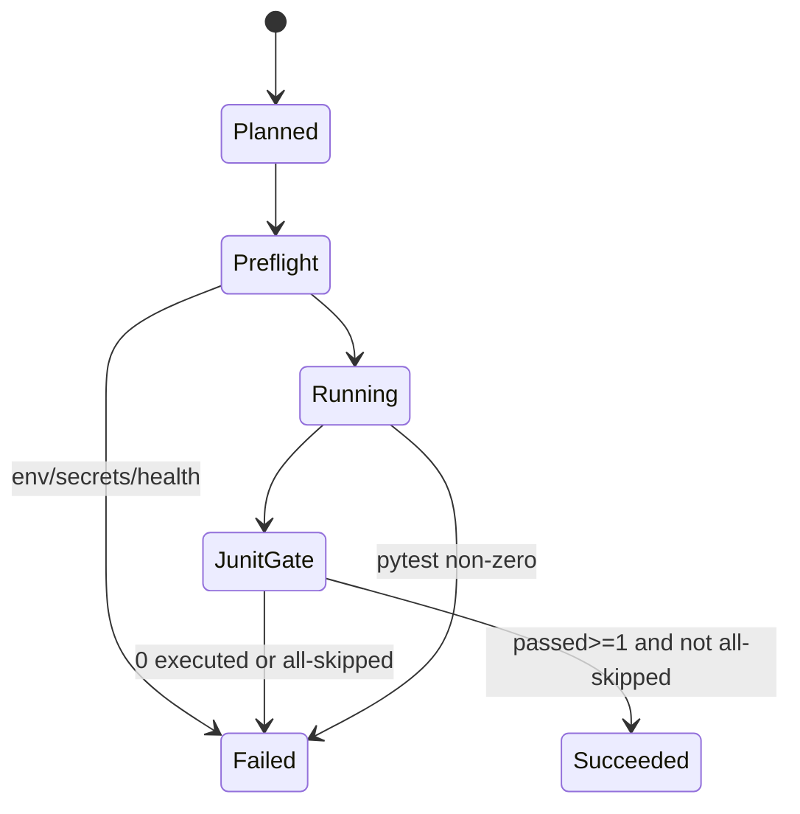

# Feature design: route live wide CI v1 (Phase D)

- Status: IMPLEMENTED
- Owner: dpone maintainers
- Issue: Phase D of postgres route live wide certification program
- Target release: next patch after Phase C stack merges
Last verified: 2026-07-23
Approval: maintainer APPROVED 2026-07-23 — approach A workflow + B triggers
  + C SKIP≠PASS (preflight + junit gate); BQ dispatch-only

## Executive summary

Phases A–C delivered wide vendor-live suites, closed N/A gaps, and a
self-service golden path. Maintainers still re-run Docker route evidence only
from laptops, so regressions can land green while live suites silently skip.
Phase D adds a dedicated, opt-in GitHub Actions workflow that composes
mysql/postgres + sinks, runs the existing per-route vendor-live modules, uploads
junit/evidence, and **fail-closes when SKIP would otherwise look like PASS**.

## Personas and customer journey

| Persona | Goal | Pain | Success |
|---|---|---|---|
| Maintainer | Nightly signal that Docker wide-cert still green | Manual laptop runs; silent all-skip | Scheduled job FAIL/PASS with artifacts |
| Release owner | Reproduce route evidence on demand | No single dispatch entrypoint | `workflow_dispatch` matrix + BQ optional leg |
| Contributor | Unchanged PR CI | Fear of live jobs on every PR | Default `ci.yml` still excludes `integration_live` |

Journey: discover workflow in docs → dispatch (or wait for nightly) → inspect
junit/artifact → fix route or env → re-run. Claims in matrix/guides still require
human judgment; CI is the repeatable gate, not a substitute for certification
authority.

## Scope

### In scope

- New `.github/workflows/route-live-wide-certification.yml`
  - Triggers: `workflow_dispatch` + nightly `schedule`
  - Docker matrix: `source ∈ {postgres, mysql}` ×
    `sink ∈ {postgres, mssql, clickhouse, kafka}` (8 legs)
  - BigQuery: dispatch-only when `include_bigquery=true` (never on schedule)
- Preflight fail-closed (compose health + required env/secrets before pytest)
- Post-run junit gate: **0 executed or all-skipped ⇒ job FAIL**
- Thin reusable helper to evaluate junit for that gate
- Workflow contract tests (YAML shape / triggers / SKIP≠PASS policy strings)
- Docs: CI section in `docs/testing/route-live-wide-certification.md` + CHANGELOG
- Cross-link from program spec Phase D row

### Non-goals

- Changing default PR `ci.yml` to run live suites
- Extending `live-certification.yml` / `connector-certification.yml`
- New public CLI commands or manifest fields (helper may be a small `tools/`
  script or private ops util invoked only from CI)
- Re-certifying matrix claims or altering strategy support tables
- Publishing credentials, SA keys, or connection strings in artifacts
- Path-filtered PR live jobs (explicitly rejected for v1)

### Assumptions and constraints

- Stacked on Phase C tip (`feat/certified-route-self-service-ux` / `#439`)
- Existing suites and `*_enabled()` gates remain the execution authority
- Compose file already defines `mysql`, `postgres`, `mssql`, `clickhouse`,
  `kafka`, `schema-registry`
- BQ requires repo secrets / vars already used by vendor-live paths
  (`BIGQUERY_DWH_*`); missing secrets on a BQ-enabled dispatch ⇒ FAIL preflight
- `permissions: contents: read` only
- SKIP ≠ PASS is a release invariant (`AGENTS.md`)

## Maintainer decisions (brainstorm)

| Topic | Choice |
|---|---|
| Triggers | **B** — `workflow_dispatch` + nightly Docker; BQ manual-only |
| SKIP≠PASS | **C** — preflight fail-closed + post-run executed/all-skipped gate |
| Workflow shape | **A** — new dedicated workflow file |

## Public contract

### CLI / Python API / Manifest

No new public CLI, Python API, or schema. Optional internal helper:

```text
python tools/ci/assert_junit_executed.py --junit path --min-passed 1
```

Exit `0` only when junit shows ≥1 passed and not (all collected skipped).
Exit non-zero otherwise. Not advertised in user docs as a product command.

### Artifacts and evidence

| Artifact | Path / name | Retention |
|---|---|---|
| JUnit | `test_artifacts/route_live_wide/{source}-{sink}/junit.xml` | GH Actions artifact |
| Upload name | `route-live-wide-{source}-{sink}` | `if: always()` |
| BQ upload | `route-live-wide-{source}-bigquery` | same |

Status vocabulary for job conclusion: green only when pytest exit 0 **and**
junit gate passes. All-skipped / missing env is **FAIL**, never silent success.

### Compatibility and migration

Additive CI only. No change to local pytest UX. Existing
`DPONE_RUN_INTEGRATION` / `DPONE_RUN_INTEGRATION_LIVE` semantics unchanged for
laptop runs (skip when unset remains valid locally; CI always sets them and
then fail-closes if suites still skip).

## Detailed algorithm

### Inputs

- Event: `schedule` | `workflow_dispatch`
- Dispatch inputs:
  - `source`: `postgres` | `mysql` | `all` (default `all`)
  - `sink`: `postgres` | `mssql` | `clickhouse` | `kafka` | `bigquery` | `all`
    (default `all`; `bigquery` ignored unless `include_bigquery`)
  - `include_bigquery`: boolean (default `false`)

### Matrix expansion

```text
DOCKER_SINKS = {postgres, mssql, clickhouse, kafka}
if event == schedule:
  legs = all (source in {postgres,mysql}) × DOCKER_SINKS
else:
  sources = {postgres,mysql} if source==all else {source}
  sinks = DOCKER_SINKS if sink in {all, bigquery} else {sink} ∩ DOCKER_SINKS
  # if sink == bigquery only: docker legs empty; BQ job handles it
  legs = sources × sinks
BQ_LEGS = sources × {bigquery} iff include_bigquery and
          (sink in {all, bigquery}) and event == workflow_dispatch
```

### Per Docker leg

1. Checkout; setup uv + Python 3.12; `uv sync --all-extras`
2. If sink == mssql: install ODBC + `mssql-tools18` (same as backfill workflow)
3. Compose `up -d --wait` required services:
   - source always: `mysql` or `postgres`
   - sink extras: `postgres` (for mysql→pg or pg→pg), `mssql`, `clickhouse`,
     `kafka`+`schema-registry` as needed
4. **Preflight**: assert compose healthy; export standard `DPONE_IT_*` defaults
   from compose; set `DPONE_RUN_INTEGRATION=1` (and `DPONE_RUN_INTEGRATION_LIVE=1`
   for consistency with suite gates). FAIL if health/env missing.
5. Run:
   `uv run pytest tests/integration/{source}/test_{source}_to_{sink}_vendor_live_integration.py -q -rs --junitxml=...`
6. **Post-run gate**: parse junit; FAIL if `tests == 0` OR `passed == 0` OR
   (`skipped == tests` and `failures == 0` and `errors == 0`)
7. Upload artifact `if: always()`

### Per BQ leg (dispatch only)

1. Same setup; start source container only
2. **Preflight secrets**: require `BIGQUERY_DWH_PROJECT_ID` and SA key material
   from GitHub secrets/vars. Missing ⇒ **FAIL** (do not skip)
3. Set `DPONE_RUN_INTEGRATION=1` + `DPONE_RUN_INTEGRATION_LIVE=1` + BQ env
4. Pytest corresponding `*_to_bigquery_vendor_live_integration.py`
5. Same junit gate (billing all-skip ⇒ FAIL)
6. Upload artifact `if: always()`

### Pseudocode

```text
for leg in docker_legs(event, inputs):
  start_services(leg)
  preflight_or_fail(leg)
  rc = pytest(leg.module, junit=path)
  assert_junit_executed(path)  # may fail even if rc==0 all-skipped edge
  if rc != 0: fail
  upload(always)

if include_bigquery and event == dispatch:
  for leg in bq_legs(inputs):
    preflight_bq_secrets_or_fail()
    ...
```

### State machine



### Edge cases

| Case | Behavior |
|---|---|
| Schedule + no secrets | Docker legs only; BQ not scheduled |
| Dispatch `include_bigquery=true` without secrets | BQ job FAIL at preflight |
| Compose unhealthy | FAIL preflight |
| Suite collects tests but all skipif | FAIL junit gate |
| Partial strategy failures | FAIL via pytest rc |
| Billing blocked mid-suite (all remaining skipped) | FAIL if resulting passed==0 / all-skipped |
| `sink=bigquery` + `include_bigquery=false` | No legs / explicit workflow error on dispatch validation |
| Default PR CI | Unaffected |

## Architecture

### Components

| Component | New/existing | Responsibility |
|---|---|---|
| `route-live-wide-certification.yml` | new | Triggers, matrix, compose, env, upload |
| `tools/ci/assert_junit_executed.py` | new | Fail-closed junit gate (pure, no network) |
| Vendor-live IT modules | existing | Strategy evidence |
| `mysql_live_support` / `postgres_live_support` | existing | Enablement helpers |
| `docker-compose.integration.yml` | existing | Disposable services |
| Workflow contract tests | new | Prevent trigger/policy drift |

### Ports / DI

No runtime DI change. CI helper is a pure function over junit XML.
Composition root = GitHub Actions job env + compose.

### Alternatives and tradeoffs

| Alternative | Pros | Cons | Decision |
|---|---|---|---|
| Extend `live-certification.yml` | One file | Already overloaded; mixes type-matrix/native | Reject |
| Reusable workflow + callers | DRY later | Extra abstraction for one consumer | Reject for v1 |
| PR path-filter live | Catch PR regressions early | Slow/flaky; secrets on forks | Reject for v1 |
| Trust pytest skip as green | Simple | Violates SKIP≠PASS | Reject |

### ADR requirement

Not required — operational CI gate, no new architectural boundary beyond
existing live-cert opt-in pattern.

### Quality-budget impact

- New helper ≪ 400 SLOC; keep junit parse in one module
- No new import edges into `dpone.runtime`
- Workflow YAML contract tests stay hermetic

## Market comparison

| System | Relevant? | Note |
|---|---|---|
| dlt | Partial | Docs/CI for destinations; no dpone-equivalent wide strategy matrix gate |
| Airbyte | Partial | Connector CI in their monorepo; different product boundary |
| Fivetran | N/A | Closed SaaS; no public self-hosted route CI |
| Informatica / Pentaho / SSIS | N/A | Enterprise IDE/runtime cert, not GH Actions route matrix |
| gusty / Cosmos | N/A | Airflow authoring, not source→sink live cert |
| Apache Beam | N/A | Runner ITs, not ETL strategy matrix |

Adopted pattern: opt-in `workflow_dispatch` + schedule (GitHub Actions common
practice; mirrors existing dpone `backfill-integration.yml` / `live-certification.yml`).
Rejected: treating skipped live as green (Airbyte-style “optional check” without
explicit fail-closed when the job was intentionally invoked).

## Measurable differentiation

```yaml
axis: fail-closed live evidence when CI is intentionally invoked
scenario: nightly Docker wide-cert for postgres/mysql→{pg,mssql,ch,kafka}
baseline: laptop-only pytest; all-skip can still exit 0 / green empty job
metric: intentional CI run concludes FAIL when passed==0 or all-skipped
target: 100% of Docker legs enforce junit gate; BQ never on schedule
procedure: dispatch with broken env / empty skip suite; observe job FAIL + artifact
artifact: junit.xml + workflow logs under route-live-wide-*
limitations: does not prove GCP billing; BQ requires configured secrets
```

## Security, privacy, and operations

- Secrets only via GitHub Actions secrets; never echo key file contents
- Artifact paths exclude SA JSON and connection passwords
- `contents: read` only; no `id-token` write unless already required elsewhere
  (v1: none)
- Timeout per job: start at 60 minutes (wide strategies); tune if needed
- Runbook: docs section with dispatch inputs and how to read FAIL vs flake

## Test and certification plan

| Layer | Scenario | Expected |
|---|---|---|
| Unit | junit gate: passed≥1 OK; all-skipped FAIL; empty FAIL | hermetic |
| Contract | workflow has schedule + dispatch; no PR trigger; BQ not on schedule; gate step present | hermetic |
| Live | Nightly/manual Docker legs | PASS with junit artifacts when stack healthy |
| Live BQ | Manual dispatch with secrets | PASS or FAIL honestly; never silent skip-green |
| Compatibility | `ci.yml` still `-m "not integration_live"` | unchanged |

## Documentation plan

- Add **CI (Phase D)** section to `docs/testing/route-live-wide-certification.md`
- CHANGELOG Unreleased note
- Optional one-line pointer from program spec Phase D row
- No mkdocs nav new page (section update only)

## Rollout and rollback

1. Land workflow + helper + contract tests on stack tip
2. Manual `workflow_dispatch` smoke for one Docker leg before relying on schedule
3. Enable schedule (same PR)
4. Rollback: delete/disable workflow file; no runtime user impact

## Agent execution plan

| Role | Owned paths | Forbidden |
|---|---|---|
| Integrator | `.github/workflows/route-live-wide-certification.yml`, `tools/ci/assert_junit_executed.py`, `tests/test_route_live_wide_ci_workflow_contract.py`, docs/CHANGELOG listed above | Unrelated workflows, connector runtime, matrix claim edits |

Shared owner: integrator (this change set).

## Success criteria

1. New workflow exists with dispatch + nightly; no `pull_request` trigger.
2. Schedule expands only the 8 Docker legs; BQ never scheduled.
3. Preflight + junit gate enforce SKIP≠PASS for intentional runs.
4. Contract + unit tests cover (1)–(3).
5. Docs explain how to dispatch and interpret FAIL.

## Approval checklist

- [x] User problem and CJM are clear
- [x] Algorithm and failure semantics implementable without guessing
- [x] Public contracts and compatibility explicit (additive CI)
- [x] Architecture and alternatives justified
- [x] Market research scoped; irrelevant systems N/A
- [x] Differentiation measurable
- [x] Tests, evidence, docs, rollout complete
- [x] Path ownership conflict-safe
- [x] Maintainer marks this spec **APPROVED**
