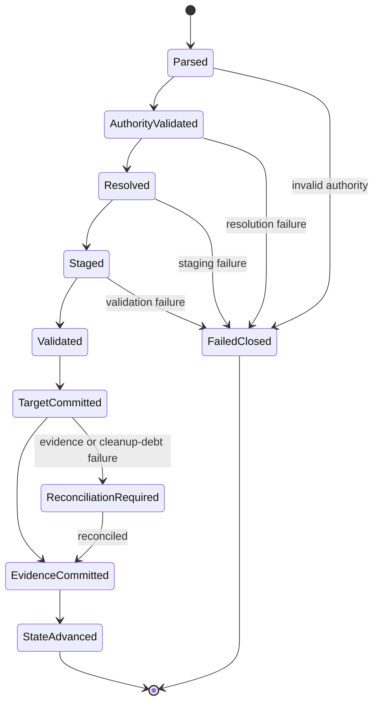
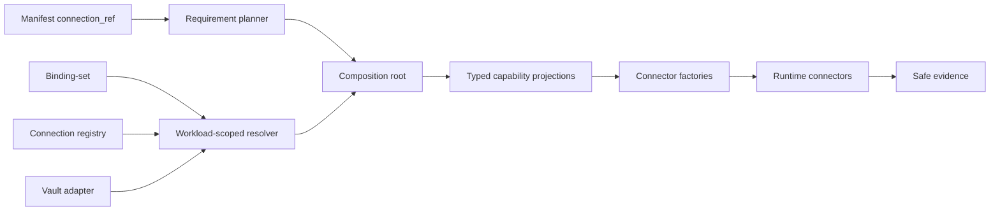

# Feature design: runtime connection authority and tenant hygiene

- Status: APPROVED
- Owner: dpone maintainers
- Issue: SS-40 and follow-up findings from the Airflow self-service global review
- Target release: 0.73.2
- Last verified: 2026-07-18

## Executive summary

dpone still contains tenant-specific GCS, Vault, proxy, and API defaults in
runtime code. Some routes infer infrastructure identity from schema or
environment names, some compatibility helpers create their own Vault clients,
and the API registry forwards provider-specific arguments through an
inconsistent factory surface. This violates the accepted binding-set and
runtime-only credential architecture, can disclose infrastructure locators, and
can defer a configuration failure until after data I/O.

This change establishes one authority for every runtime connection value:

1. authoring declares only a logical `connection_ref`;
2. a binding-set maps that logical name to a platform registry alias;
3. the registry owns non-secret endpoint metadata and credential resolver
   references;
4. one workload-scoped resolver creates immutable typed connection projections;
5. the runtime composition root injects those projections into connectors;
6. compatibility adapters accept explicit legacy inputs for one minor release
   but never restore implicit defaults.

The same release adds a bounded source/archive hygiene gate. It certifies that a
frozen commit and the exact built wheels/sdists contain no protected
tenant-specific identifiers or defaults.

Success means zero embedded tenant defaults, zero Vault locator leakage across
public output, one successful credential resolution per alias and workload, and
zero source/target side effects when required connection authority is missing.

## Personas and customer journey

| Persona | Goal | Current pain | Success signal |
|---|---|---|---|
| Pipeline author | Select a platform connection without knowing Vault or cloud topology. | Some routes require or infer backend paths and bucket conventions. | The manifest contains only `connection_ref`; static check explains missing bindings before runtime. |
| Platform engineer | Move a connection between Vault paths, projects, or buckets without editing pipelines. | Infrastructure details are duplicated in helpers and manifests. | One registry change creates a new deployment identity; release identity is unchanged. |
| Runtime operator | Diagnose resolution and cleanup safely. | Logs/evidence can expose Vault paths, buckets, URIs, or backend error text. | Structured errors expose only logical refs and bounded codes. |
| Connector developer | Implement a provider through one stable factory contract. | `from_vault` signatures differ and the registry forwards unsupported arguments. | Every built-in API provider passes the same typed factory contract tests. |
| Release engineer | Prove that source and distributions are tenant-neutral. | Archive checks inspect names but not bounded member bodies. | Frozen-source and exact-archive hygiene reports are deterministic and clean. |

### End-to-end journey

1. The author selects `connection_ref` values from a platform-owned catalog.
2. `dpone check` validates syntax, single authority, binding presence, registry
   type, required non-secret fields, and compatibility policy without reading
   secret values.
3. Build produces environment-neutral packs containing logical references only.
4. Deployment binds the release to a binding-set, registry, credential runtime,
   and runtime image digest.
5. At workload start, one injected resolver resolves every required capability.
6. Runtime converts each result into an immutable typed projection before any
   source or target I/O.
7. Connectors operate on the projection and cannot discover Vault or construct
   cloud clients through hidden global state.
8. Evidence records logical identity and safe resolver/version metadata.
9. A retry creates a new workload resolver; an already-running workload keeps
   its resolved snapshot.
10. Migration tooling reports legacy config paths and proposed logical refs
    without reading or copying secret values.

## Scope

### In scope

- Remove every active tenant-specific runtime default for GCS, state, proxy, and
  Mindbox.
- Define canonical connection metadata and typed runtime projections.
- Make one workload-scoped resolver the authority for source, sink, state,
  proxy, object-storage, and API capabilities.
- Replace the API registry's provider-specific `from_vault` dispatch with an
  explicit factory protocol.
- Fail required GCS routes before extraction when access is unavailable.
- Make GCS object identity deterministic and replacement non-destructive.
- Prevent Vault paths, bucket/project topology, signed URLs, response bodies,
  and raw backend errors from crossing public logs/evidence/errors.
- Preserve explicit legacy Python/config inputs for one minor release behind a
  platform-owned compatibility policy.
- Add bounded frozen-source and built-archive tenant hygiene gates.
- Update schemas, examples, migration docs, error catalog, compatibility docs,
  tests, and release evidence.

### Non-goals

- A generic connector plugin hierarchy.
- Storing secret values in manifests, packs, registries, deployment indexes, or
  evidence.
- Mid-workload credential refresh.
- `dag_run_start` credential snapshots.
- Restoring old implicit defaults through a feature flag or environment
  variable.
- Replacing `vault-kv-client`.
- Making every cloud SDK a core dependency.

### Assumptions and constraints

- ADR 0010 and ADR 0012 remain authoritative.
- `vault_kv` plus Kubernetes Auth is the primary production resolver.
- `env_var` remains development/legacy only.
- Existing public imports remain importable for the stated compatibility
  window.
- New modules remain below the repository module-size budget and do not add
  policy to legacy namespaces.
- Live GCS/Vault certification is `UNVERIFIED` without an approved environment.

## Public contract

### CLI

No new beginner command is required. Existing commands gain the following
behavior:

```text
dpone check <pipeline>
  - rejects missing or conflicting runtime connection authority;
  - never resolves Vault or emits backend locators in default/static mode.

dpone check <pipeline> --connections
  - verifies resolver handshakes through existing bounded live-check policy;
  - reports logical connection_ref only.

dpone migrate connections --plan
  - reports legacy capability/config paths and proposed connection_ref aliases;
  - never reads Vault, copies secret values, or mutates files.
```

Exit codes retain the public contract: `1` validation, `2` CLI/config usage,
`3` live dependency unavailable, `4` safety/security violation, and `5`
internal error.

### Python API

Canonical contracts:

```python
from collections.abc import Mapping
from dataclasses import dataclass
from typing import Any, Protocol


@dataclass(frozen=True, slots=True)
class ResolvedConnectionDescriptor:
    connection_type: str
    properties: Mapping[str, Any]


@dataclass(frozen=True)
class ResolvedBindingConnection:
    credentials: CredentialsConfig
    safe_metadata: dict[str, Any]
    descriptor: ResolvedConnectionDescriptor | None = None


class ApiConnectorFactory(Protocol):
    def __call__(
        self,
        *,
        connection: ResolvedBindingConnection | None,
        options: Mapping[str, Any],
        sink_connector: Any = None,
        logger: RuntimeLogger | None = None,
    ) -> Any: ...


def build_api_runtime_source_from_connection(
    *,
    source_cfg: Mapping[str, Any],
    resolved_connection: ResolvedBindingConnection | None,
    sink_connector: Any = None,
    logger: RuntimeLogger | None = None,
) -> Any: ...
```

`ResolvedConnectionDescriptor.properties` is recursively frozen and
`repr=False` in the implementation. Secret values stay in
`CredentialsConfig` secret wrappers and are never copied wholesale into
`additional_params`.

Typed projections remain small and capability-specific:

```python
GcsLocation(bucket, project_id)
GcsRuntimeAccess(location, service_account_credentials)
GcsHmacAccess(location, access_key, secret_key)
ProxySettings(...)
MindboxCredentials(token, endpoint_id)
```

The canonical exception belongs under `dpone.contracts`. Runtime namespaces may
re-export it but may not define a second policy implementation.

### Manifest and registry

Canonical authoring uses logical references:

```yaml
source:
  type: api
  api_type: mindbox
  connection_ref: api-primary

state:
  connection_ref: state-primary
  # Or: reuse: sink

bigquery_proxy:
  connection_ref: bq-proxy

object_storage:
  prefix: staging/orders
  runtime_access:
    connection_ref: gcs-staging
  clickhouse_write_access:
    connection_ref: gcs-staging
```

`state.connection_ref` and `state.reuse` are mutually exclusive. Reuse is valid
only if the selected sink advertises a compatible state-store capability.
Presence of `bigquery_proxy.connection_ref` enables the proxy; absence disables
it.

The platform registry owns environment metadata and resolver wiring:

```yaml
schema: dpone.connection-registry.v1
connections:
  gcs-staging:
    type: gcs
    connection:
      bucket: example-dpone-staging
      project_id: example-data-platform
    credentials:
      resolver: vault_kv
      mount: secret
      path: teams/example/gcs-staging
      fields:
        service_account_info: service_account_json
        hmac_access_key: hmac_access_key
        hmac_secret: hmac_secret
      version_policy: latest
      resolution_scope: workload_start

  api-primary:
    type: mindbox
    connection:
      endpoint: https://api.example.invalid
      parameters:
        endpoint_id: example-endpoint
    credentials:
      resolver: vault_kv
      mount: secret
      path: teams/example/api-primary
      fields:
        token: api_token
      version_policy: latest
      resolution_scope: workload_start
```

Authority rules:

- Canonical and legacy configuration for the same capability is an error.
- Bucket/project are never derived from schema, environment, or credentials.
- A URI bucket conflicting with resolved metadata is an error.
- HMAC key and secret come from one resolver snapshot.
- Mindbox `endpoint_id` is required non-secret connection metadata.
- Vault paths are legal only in the platform-owned registry.
- No precedence chain or fallback merge exists.

### Errors

| Code | Fixed public message | Retryable |
|---|---|---:|
| `DPONE_RUNTIME_CONNECTION_REF_REQUIRED` | `Required runtime connection_ref is missing.` | No |
| `DPONE_RUNTIME_CONNECTION_AUTHORITY_CONFLICT` | `Runtime connection configuration has more than one authority.` | No |
| `DPONE_RUNTIME_CONNECTION_TYPE_UNSUPPORTED` | `Resolved connection type does not support the requested capability.` | No |
| `DPONE_RUNTIME_CONNECTION_FIELD_REQUIRED` | `Resolved connection is missing a required field.` | No |
| `DPONE_RUNTIME_CONNECTION_VALUE_MISMATCH` | `Resolved connection metadata conflicts with the requested resource.` | No |
| `DPONE_LEGACY_RUNTIME_DEFAULTS_DISABLED` | `Implicit runtime defaults are disabled; configure a logical connection_ref.` | No |
| `DPONE_API_CONNECTOR_FACTORY_CONTRACT_INVALID` | `Registered API connector factory does not satisfy the runtime factory contract.` | No |

Existing credential error codes remain canonical for missing binding, missing
registry entry, missing field, unsupported resolver, and backend unavailability.

Allowed public context is limited to `capability`, logical `config_path`,
`connection_ref`, `field`, `resolver`, and `retryable`. Raw values, Vault
locators, bucket/project, endpoint identifiers, proxy names, URIs, responses,
queries, and backend exception text are forbidden.

### Artifacts and evidence

Resolution evidence contains:

```yaml
connection_ref: gcs-staging
connection_type: gcs
resolver: vault_kv
resolution_scope: workload_start
resolved_version: 17
credential_ref_fingerprint: sha256:...
```

It excludes registry bodies, Vault mount/path, secret values, password hashes,
tokens, service-account JSON, signed URLs, bucket/project, endpoint identifiers,
and sensitive lease IDs.

Hygiene evidence:

```json
{
  "schema": "dpone.tenant-hygiene.v1",
  "mode": "archive",
  "status": "FAIL",
  "findings": [
    {
      "code": "DPONE_HYGIENE_TENANT_DEFAULT",
      "path": "dpone/runtime/example.py"
    }
  ]
}
```

No line numbers, excerpts, matched text, secret pattern, digest of protected
text, or per-pattern counts are emitted.

### Compatibility and migration

Platform policy:

```yaml
runtime:
  compatibility:
    legacy_runtime_connections: disabled  # disabled | explicit_only
```

- Default is `disabled`.
- No mode restores embedded defaults.
- `explicit_only` permits only values explicitly present in the legacy
  configuration and only for one minor release.
- Python adapters emit one `DeprecationWarning` per process.
- Readiness/CLI emits `DPONE_LEGACY_CONNECTION_CONFIG_FOUND`.
- `get_gcs_bucket_name(schema, env)` remains importable but raises
  `DPONE_LEGACY_RUNTIME_DEFAULTS_DISABLED` when asked to infer a bucket.
- Explicit HMAC key/secret pairs remain temporarily accepted; partial pairs fail.
- Automatic Vault path generation is removed immediately.
- Explicit state/proxy Vault paths require `explicit_only`.
- `ObjectStorageConnectionRef` remains a deprecated explicit-legacy model.
  Canonical code uses a separate `BoundObjectStorageConnectionRef`.
- Deprecated signatures and backend-specific manifest fields are removed in the
  next major release.

Migration never reads secret values. It produces a deterministic plan of
logical config paths, required capabilities, and proposed aliases. Platform
engineers create registry entries, then pipeline authors switch references.

## Detailed algorithm

### Static validation and planning

1. Parse the selected authoring source and reject duplicate/conflicting
   authorities.
2. Normalize source, sink, strategy, state, proxy, API, and object-storage
   capability requirements.
3. Determine whether each capability is optional or required for the selected
   route.
4. Validate every required logical ref against binding-set and registry.
5. Validate registry connection type and required non-secret fields.
6. Emit only logical, redacted diagnostics.
7. Build packs with logical refs and fingerprints; do not serialize registry
   bodies.

### Runtime resolution and execution

1. Construct one `WorkloadScopedCredentialResolver` at the runtime composition
   root.
2. Resolve each unique required alias before source or sink I/O.
3. Resolve success once; do not cache failures.
4. Convert each result to an immutable typed projection.
5. Validate all required fields and URI/metadata consistency.
6. Construct provider adapters through explicit factories.
7. Build safe in-memory resolution receipts.
8. Execute extraction, staging, validation, and target commit.
9. Persist reconciliation and resolution evidence.
10. Advance checkpoint/state last.

### GCS replacement

1. Resolve GCS runtime and, where required, ClickHouse HMAC access before
   extraction.
2. Derive an attempt-scoped object prefix from workload, run, partition, and
   artifact identity.
3. Upload with a create-only generation precondition.
4. If an object already exists, accept it only after digest verification.
5. Validate row/count/checksum evidence.
6. Load or attach the new object generation.
7. Commit target data.
8. Record durable cleanup debt for the prior generation.
9. Retire the prior generation only after the new generation is accepted.
10. Cleanup failure does not replay a committed load; inability to record
    cleanup debt makes commit outcome unknown and requires reconciliation.

### Retry, replay, and concurrency

- One workload attempt uses one credential snapshot.
- A retry creates a fresh resolver and can observe a rotated `latest` secret.
- Same-alias concurrent callers receive the same immutable successful result.
- Failures are retryable only when the credential backend is unavailable.
- Deterministic GCS identity plus digest comparison makes replay idempotent.
- Resolution or required evidence failure never advances checkpoint/state.
- Cancellation before target commit removes only attempt-owned staging.
- Post-commit cancellation follows commit-journal recovery and never downgrades a
  known committed outcome.

### Tenant hygiene scan

Source mode:

1. Accept a full frozen commit SHA and a CI-owned in-memory deny policy.
2. Enumerate blobs through `git ls-tree`, never the worktree.
3. Reject unsafe paths and enforce blob count, per-blob, and aggregate budgets.
4. Read each blob by object identity with bounded bytes.
5. Scan decoded text and selected binary-safe byte patterns.
6. Emit only safe code/path findings in deterministic order.

Archive mode:

1. Accept explicitly listed regular wheel/sdist files.
2. Open archives no-follow and bind identity with `fstat`.
3. Reject absolute/traversal paths, links, devices, nested archives, unsupported
   formats, and replacement during read.
4. Enforce 32 archives, 20,000 members per archive, 32 MiB per member, 1 GiB
   uncompressed per archive, and 100:1 compression-ratio limits.
5. Scan bounded member bytes without extracting.
6. Emit deterministic, non-disclosing findings.

Exit codes are `0` clean, `2` finding, and `3` unable to certify.

### State machine



### Pseudocode

```text
requirements = plan_required_connections(manifest, route)
validate_single_authority(requirements)

resolver = composition_root.workload_credential_resolver()
resolved = {}
for requirement in sorted_unique(requirements):
    binding = resolver.resolve(requirement.connection_ref)
    projection = project_and_validate(binding, requirement.capability)
    resolved[requirement.connection_ref] = deep_freeze(projection)

connectors = build_connectors(resolved, explicit_factories)
staged = connectors.extract_and_stage()
validated = reconcile(staged)
target_outcome = commit_target(validated)

try:
    write_resolution_and_load_evidence(target_outcome, resolved.safe_receipts)
    record_cleanup_debt(target_outcome.previous_artifacts)
except Exception:
    raise CommitOutcomeUnknown

advance_state(target_outcome)
```

### Edge cases

- Missing/empty refs fail before backend I/O.
- Canonical plus legacy config fails; no precedence choice is made.
- Partial HMAC pairs fail atomically.
- Missing Mindbox `endpoint_id` fails before HTTP I/O.
- Empty input still resolves only route-required connections and produces
  truthful `no_data` evidence.
- Vault rotation between workloads can produce different versions; rotation
  within a workload does not change its snapshot.
- Malformed registry metadata never falls back to credential payload inference.
- URI bucket mismatch fails without logging either bucket.
- Oversized, compressed, linked, nested, raced, or unreadable archive input is
  `unable to certify`, never clean.

## Architecture

### Components and responsibilities

| Component | Existing/new | Responsibility | Dependencies |
|---|---|---|---|
| Connection requirement planner | New | Enumerate and validate route capabilities and authorities. | Manifest and route capabilities only |
| Binding credential resolver | Extended | Resolve credentials plus safe immutable descriptor. | Resolver ports |
| Workload-scoped resolver | Existing | Success cache and retry boundary. | Injected resolver |
| Typed capability projectors | New | Convert resolved bindings to GCS/proxy/API/state inputs. | Contract models |
| API connector factory | New | Uniform provider construction. | Typed connection, options |
| Runtime hydrator | Existing composition root | Inject resolver, factories, SDK clients, and logger. | Ports and adapters |
| Legacy adapters | Extended | Explicit-only translation and warnings. | Canonical services |
| Tenant hygiene gate | New agent-policy tool | Frozen-source and archive-body certification. | Git/archive readers |

### Ports, adapters, and dependency direction



- Domain/contracts know no Vault, GCS, Airflow, or SDK classes.
- Ports describe capability-oriented resolution and storage behavior.
- Adapters import vendor SDKs lazily and only in runtime execution paths.
- The composition root owns concrete construction.
- Legacy namespaces adapt/re-export only; they contain no new policy.

### Alternatives and tradeoffs

| Alternative | Advantages | Disadvantages | Decision |
|---|---|---|---|
| Keep environment-derived defaults | No migration | Hidden global authority, tenant leakage, non-portable packs | Rejected |
| Put Vault paths in manifests | Simple implementation | Breaks environment neutrality and exposes topology | Rejected |
| Inspect connector signatures or catch `TypeError` | Small patch | Masks provider bugs and is brittle | Rejected |
| Generic capability plugin framework | Extensible | Premature abstraction and larger attack surface | Rejected |
| Typed projections plus explicit factories | Small stable interfaces and testable DI | Requires provider adapters | Adopted |
| Delete legacy APIs immediately | Cleanest implementation | Unnecessary compatibility break | Rejected |
| Explicit-only adapters for one minor | Controlled migration | Temporary maintenance cost | Adopted |

### ADR requirement

Required. This decision changes authority, dependency direction, public Python
compatibility, manifest/schema validation, evidence, and failure ordering. ADR
0027 records the frozen decision and extends ADR 0010/0012.

### Quality-budget impact

- New modules split by requirement planning, typed projection, factory
  adaptation, and hygiene scanning.
- No module may exceed `max_sloc: 400`.
- Existing legacy GCS helpers shrink and delegate to canonical services.
- No import-graph regression beyond
  `docs/benchmarks/quality_budgets.yml`.
- Connector factories are explicit mappings, not a reflective registry.

## Market comparison

Research date: 2026-07-18. Facts below use current official primary sources.

| System/version | Relevant capability | Observed design | Adopt/reject | Source |
|---|---|---|---|---|
| dlt 1.29.0 | Separate configuration and secrets from source code | Typed/configurable credentials and secret providers; broad provider precedence/default discovery | Adopt separation; reject implicit multi-provider precedence for this production authority boundary | [dlt credentials](https://dlthub.com/docs/general-usage/credentials) |
| PyAirbyte current docs | Runtime secret references | `secret_reference::` decouples config from secret values and resolves through registered managers | Adopt logical indirection; retain explicit dpone binding/registry authority instead of default env fallback | [PyAirbyte secrets](https://airbytehq.github.io/PyAirbyte/airbyte/secrets.html) |
| HashiCorp Vault v2.x | Workload identity and versioned KV | Kubernetes Auth binds ServiceAccount identity; KV v2 exposes versioned static secrets | Adopt runtime Kubernetes Auth and safe version evidence | [Kubernetes Auth](https://developer.hashicorp.com/vault/docs/auth/kubernetes), [KV v2](https://developer.hashicorp.com/vault/docs/secrets/kv/kv-v2) |
| Informatica | N/A | Product secret-management behavior is not needed to fix dpone's internal authority bug | N/A |
| Fivetran | N/A | Managed connector credential storage is not an embeddable runtime contract for this change | N/A |
| Pentaho | N/A | No relevant portable runtime reference model required here | N/A |
| Microsoft SSIS | N/A | Package parameters are not the target execution or artifact model | N/A |
| gusty | N/A | DAG generation does not define runtime credential authority | N/A |
| Astronomer Cosmos | N/A | Airflow/dbt orchestration is outside this runtime credential remediation | N/A |
| Apache Beam | N/A | Pipeline execution APIs do not define dpone's registry/Vault contract | N/A |

Fact: dlt and PyAirbyte separate secret values from pipeline configuration.
Inference: dpone's single-authority binding/registry model is better suited to
reproducible environment-neutral releases because it forbids fallback
precedence. This is a scoped design inference, not a general product claim.

## Measurable differentiation

```yaml
axis: runtime connection authority and tenant neutrality
scenario: build and run the same release in dev and prod with different registries
baseline: current source contains active tenant defaults and inferred backend paths
metric:
  - embedded_tenant_literals
  - locator_or_secret_leaks
  - successful_backend_reads_per_alias_per_workload
  - data_side_effects_on_configuration_failure
target:
  embedded_tenant_literals: 0
  locator_or_secret_leaks: 0
  successful_backend_reads_per_alias_per_workload: 1
  data_side_effects_on_configuration_failure: 0
procedure:
  - scan frozen source and exact built archives
  - run sentinel redaction tests
  - run concurrent workload-scope resolver tests
  - inject every configuration failure before source and target I/O
artifact:
  - tenant-hygiene-source.json
  - tenant-hygiene-archives.json
  - runtime-connection-contract-tests.xml
limitations: live Vault and GCS behavior requires an approved environment
```

## Security, privacy, and operations

- Protected deny patterns are CI-owned and never committed with tenant values.
- Hygiene reports never echo protected text.
- Registry storage is restricted; normal explain/log output shows aliases only.
- SDK clients and credential managers are injected, not globally discovered.
- Vault token/JWT/AppRole material never crosses pack/operator arguments.
- Signed URLs are treated as credentials and are never logged.
- Source scan bounds: 50,000 blobs, 16 MiB per blob, 1 GiB aggregate.
- Archive bounds: 32 archives, 20,000 members/archive, 32 MiB/member, 1 GiB
  uncompressed/archive, 100:1 compression ratio.
- Unsafe scan input is a certification failure.
- Metrics: resolution attempts/success/failure by safe resolver type, authority
  conflicts, legacy adapter use, cleanup debt, hygiene status.
- Alerts: repeated backend unavailability, cleanup-debt age, legacy usage after
  deprecation deadline, and hygiene inability-to-certify.

## Test and certification plan

| Layer | Scenario | Environment | Expected artifact |
|---|---|---|---|
| Unit | Authority conflict, required fields, URI mismatch, atomic HMAC | Local | Focused pytest report |
| Unit | Every API provider satisfies exact factory protocol | Local | Provider contract report |
| Unit | Workload success cache, failure retry, concurrent same-ref | Local | Resolver contract report |
| Contract | Schema, compatibility policy, error/redaction payload | Local | JSON Schema tests |
| Contract | Frozen-source hygiene bounds and safe output | Temporary Git repo | Source hygiene report |
| Contract | Wheel/sdist hostile members, bodies, ratios, races | Local archives | Archive hygiene report |
| Integration | Resolution failure before source/sink I/O | Fake adapters | Side-effect assertions |
| Integration | Deterministic GCS replay and non-destructive replacement | Fake storage/target | Reconciliation evidence |
| Packaging | Exact four-package wheel/sdist scan | Built distributions | Clean archive report |
| Live certification | Vault Kubernetes Auth, rotation, GCS read/write/cleanup | Approved K8s/Vault/GCS | Signed route evidence or UNVERIFIED |
| Compatibility | Legacy imports and explicit-only warnings | Python 3.11/3.12 | Wheel smoke report |

Negative tests include malformed descriptors, unknown types, missing
`endpoint_id`, partial HMAC, duplicate authorities, resolver failures, evidence
write failure, cleanup-debt failure, symlink/traversal archives, replacement
races, nested archives, decompression limits, protected-value sentinels in every
public output channel, and no vendor/Vault imports on CLI/help/Airflow parse.

## Documentation plan

- Update `docs/connections.md`, `docs/state.md`, `docs/mindbox.md`,
  credential lifecycle, object-storage and GCS route docs.
- Add a migration runbook with credential-free plan examples.
- Generate schema and error-code references.
- Replace all tenant-specific examples with neutral values.
- Update Python API compatibility and deprecation guide.
- Update release docs with frozen-source and exact-archive hygiene gates.
- Record live paths as `UNVERIFIED` until current evidence exists.

## Rollout and rollback

1. Land schemas/contracts and static migration plan.
2. Add typed projections and API factory adapters.
3. Disable implicit defaults immediately.
4. Permit explicit legacy inputs only through platform policy.
5. Migrate examples and internal manifests.
6. Add source/archive hygiene gates before publication.
7. Canary Vault/GCS routes with current evidence.
8. Monitor legacy use and cleanup debt.
9. Remove explicit-only adapters in the next major release.

Rollback may restore the previous package version but may not re-enable hidden
defaults. Operational rollback uses explicit registry entries or explicit-only
legacy config while the migration window is active.

## Agent execution plan

| Agent/role | Owned paths | Read-only paths | Forbidden paths | Dependency |
|---|---|---|---|---|
| Contracts/schema implementer | `dpone.contracts`, credential models, focused tests | ADR/spec | Workflows, shared docs | Spec |
| API factory implementer | API registry and built-in provider adapters/tests | Contract models | Schemas, workflows | Contracts |
| GCS/state/proxy implementer | Canonical projections, legacy adapters, route tests | Contracts | Shared release files | Contracts |
| Hygiene implementer | One agent-policy tool and focused tests | Release workflow | Dependencies/workflow | Spec |
| Integrator | Shared schemas, workflow, docs, changelog, examples | All slices | User-owned files | All writers |
| Fresh reviewer | Read-only integrated diff | All | All writes | Integration |

The parent agent is integrator and shared-file owner. Writers receive validated
task contracts with disjoint paths.

## Approval checklist

- [x] User problem and CJM are clear.
- [x] Algorithm and failure semantics are implementable without guessing.
- [x] Public contracts and compatibility are explicit.
- [x] Architecture and alternatives are justified.
- [x] Relevant market research uses current official sources.
- [x] Claimed differentiation is measurable.
- [x] Tests, evidence, docs, rollout, and rollback are complete.
- [x] Path ownership and integration plan are conflict-safe.
- [x] Maintainer changed status to `APPROVED`.
