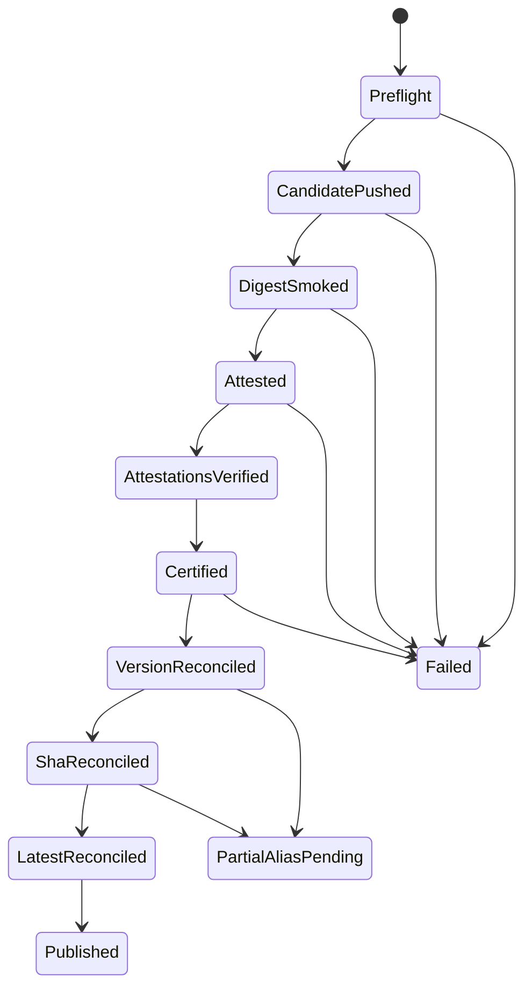

# Feature design: digest-first runtime image certification and promotion

- Status: APPROVED
- Owner: dpone maintainers
- Issue: global Airflow self-service review for v0.73.1
- Target release: 0.73.2
- Last verified: 2026-07-18

## Executive summary

The current GHCR workflow publishes `X.Y.Z`, `sha-*`, and `latest` before the
registry digest has passed the complete smoke, SBOM, attestation, and
attestation-verification sequence. It also treats every failed manifest lookup
as an absent tag. A registry outage or a failed post-push check can therefore
leave an uncertified public release alias.

The approved fix separates candidate certification from alias promotion:

1. build and push an unaliased digest-addressed candidate;
2. pull and test that exact digest;
3. generate and verify digest-bound provenance and SBOM attestations;
4. write a machine-readable PASS certification;
5. in a separately permissioned and globally serialized job, reconcile public
   aliases by create-or-compare semantics.

The workflow must never claim GHCR-enforced tag immutability or multi-tag
atomicity. It provides fail-closed workflow policy, idempotent same-digest
repair, postcondition checks, and evidence. External writers and registry-level
immutability remain outside that guarantee.

## Personas and customer journey

| Persona | Goal | Current pain | Success signal |
|---|---|---|---|
| Release engineer | Retry a failed image release safely | Existing aliases either block every retry or may expose uncertified bytes | Same digest is a no-op; another digest blocks |
| Platform engineer | Pin a certified runtime image | A version tag can exist before smoke and attestations finish | Deployment consumes a digest present in PASS certification |
| Security reviewer | Prove source and artifact identity | Attestation creation is not followed by verification | Verification receipts bind digest, commit, ref, workflow, and predicate |
| Operator | Understand partial promotion | Three tag writes are presented as one atomic action | Publication evidence shows every transition and repair action |

Normal dpone users do not run these commands. A tag push starts release
preflight. On success, the workflow certifies the digest and then promotes
aliases. A failed certification leaves no release aliases. A partial promotion
is a failed but repairable state: a rerun reuses the same certified digest and
reconciles missing aliases.

## Scope

### In scope

- digest-only BuildKit candidate publication;
- machine-readable digest capture;
- complete digest-pinned smoke;
- provenance and SPDX SBOM attestation plus verification;
- versioned certification and publication evidence;
- fail-closed authenticated registry lookup;
- fixed-tag create-or-compare;
- non-regressing SemVer `latest` policy;
- global promotion serialization;
- attempt-scoped immutable workflow evidence;
- runtime-specific deny-by-default Docker build context;
- source-commit timestamp instead of a wall-clock build label;
- documentation and executable workflow contract tests.

### Non-goals

- claiming permanent GHCR tag immutability;
- an atomic transaction across version, SHA, and `latest` aliases;
- reproducible image rebuilds while base images, APT repositories, and package
  resolution are not fully content pinned;
- deleting a failed digest candidate automatically;
- a generic OCI registry plugin system;
- using dpone runtime artifact-registry ports for release governance;
- live GHCR certification without an approved tag-push environment.

### Assumptions and constraints

- GHCR and GitHub Actions are the only production implementation in this phase.
- Public runtime deployments already require a digest, not a mutable tag.
- The 12-character SHA alias remains for compatibility.
- GitHub concurrency serializes cooperating jobs but does not guarantee dispatch
  order or exclude external writers.
- A registry lookup has only `PRESENT`, authenticated `ABSENT`, or `ERROR`.
- Missing live credentials or Docker daemon is `UNVERIFIED`, never `PASS`.

## Public contract

### Workflow

The tag-push workflow is split into:

| Job | Minimum permissions | Contract |
|---|---|---|
| `release-preflight` | repository/check read | Certify tag, commit, checks, package identities, and build inputs; no registry write |
| `build-runtime-candidate` → `push-attest-runtime-candidate` → `certify-runtime-candidate` | build/certify: contents read; push-attest: package/attestation/id-token write without checkout | Build and smoke locally, push digest-only candidate, attest/verify, then publish certification |
| `promote-certified-image` | contents/actions read, packages write | Validate certification and reconcile aliases; no attestation permission |
| `collect-runtime-image-evidence` | contents/actions read | Collect attempt-scoped evidence without synthesizing success |

PR and manual workflows remain non-publishing.

### Internal policy API

One focused internal tool under `tools/agent_policy/` owns release policy:

```python
class ManifestState(Enum):
    PRESENT = "present"
    ABSENT = "absent"
    ERROR = "error"

def decide_fixed_tag(
    *,
    expected_digest: str,
    observed: ManifestObservation,
) -> TagDecision: ...

def decide_latest(
    *,
    candidate_version: Version,
    candidate_digest: str,
    observed: ManifestObservation,
    observed_version: Version | None,
) -> TagDecision: ...
```

The command adapter performs authenticated OCI lookup and `imagetools create`.
Pure policy has no network, Docker, GitHub, or global state.

### Artifacts and evidence

`dpone.runtime-image-certification.v1` is written with `status: PASS` only after
all digest-bound checks pass:

```yaml
schema: dpone.runtime-image-certification.v1
status: PASS
idempotency_key: ghcr.io/paulkov/dpone-runtime|0.73.2|sha256:...
release:
  version: 0.73.2
  tag: v0.73.2
  source_commit_sha: 40-hex
  source_ref: refs/tags/v0.73.2
subject:
  name: ghcr.io/paulkov/dpone-runtime
  digest: sha256:...
  platform: linux/amd64
build:
  run_id: "..."
  run_attempt: "..."
  dockerfile_sha256: sha256:...
  dockerignore_sha256: sha256:...
  context_manifest_sha256: sha256:...
checks:
  - id: pip-check
    status: PASS
    subject_digest: sha256:...
attestations:
  provenance:
    status: PASS
    subject_digest: sha256:...
  sbom:
    status: PASS
    subject_digest: sha256:...
```

`dpone.runtime-image-publication.v1` records each alias:

```yaml
schema: dpone.runtime-image-publication.v1
status: PASS
outcome: PUBLISHED
candidate_digest: sha256:...
certification_sha256: sha256:...
transitions:
  - role: version
    reference: ghcr.io/paulkov/dpone-runtime:0.73.2
    before: {state: ABSENT}
    decision: CREATED
    after: {state: PRESENT, digest: sha256:...}
    status: PASS
```

Allowed decisions are `CREATED`, `NOOP_SAME`, `ADVANCED`,
`PRESERVED_NEWER`, and `BLOCKED`. `PARTIAL_ALIAS_PENDING` is always a workflow
failure. Evidence artifact names include `run_id` and `run_attempt`; overwrite
is forbidden.

### Compatibility and migration

- `X.Y.Z`, `sha-<12>`, and `latest` references remain available.
- `latest` now means the highest successfully certified stable SemVer release,
  not the most recently completed workflow.
- An existing fixed alias at the expected digest is successful idempotency.
- An existing fixed alias at another digest is a blocker.
- Existing images without current certification are `LEGACY_UNVERIFIED`.
- Version tags are described as workflow create-or-compare aliases, not as
  registry-enforced immutable objects.

## Detailed algorithm

### Preflight and candidate certification

1. Validate annotated tag, full commit SHA, ancestry, package/changelog bytes,
   exact required check producers, and exact PyPI candidate identities.
2. Derive stable release version and source commit timestamp.
3. Build with the runtime-specific bounded context.
4. Push with BuildKit `push-by-digest=true` and no public aliases.
5. Read `containerimage.digest` from the BuildKit metadata file.
6. Pull `IMAGE@DIGEST`.
7. Verify installed dpone version, `dpone --version`, `pip check`, `bcp`,
   `sqlcmd`, `clickhouse-client`, native acceleration doctor, and both Airflow
   runtime command help paths.
8. Generate the SPDX JSON SBOM for `IMAGE@DIGEST`.
9. Publish provenance and SBOM attestations for `IMAGE@DIGEST`.
10. Verify both OCI attestations against expected repository, source commit,
    source ref, signer workflow, OIDC issuer, and predicate type.
11. Write PASS certification last and upload it with an attempt-scoped name.
12. If any step fails, do not publish version, SHA, or `latest`.

### Promotion

1. Download one immutable certification artifact by exact run identity.
2. Validate schema, PASS status, source, version, digest, required check set,
   and certification checksum.
3. Acquire job-level global concurrency
   `runtime-image-ghcr-promotion` with `cancel-in-progress: false`.
4. Resolve the version alias through authenticated OCI HEAD:
   - `ABSENT`: create alias to digest and verify the postcondition;
   - `PRESENT(expected)`: record `NOOP_SAME`;
   - `PRESENT(other)` or `ERROR`: block without a write.
5. Reconcile the SHA alias by the same rule.
6. Resolve `latest`, including its certified version:
   - absent: create;
   - same digest: no-op;
   - older version: advance;
   - newer version: preserve;
   - same version with another digest, invalid metadata, or lookup error: block.
7. Write publication evidence after every observed transition.
8. Mark PASS only if version and SHA bind the candidate and `latest` is either
   the candidate or a newer certified release.

### Lookup and retry policy

```text
HTTP 200 + canonical Docker-Content-Digest -> PRESENT(digest)
authenticated HTTP 404                    -> ABSENT
all other outcomes                        -> ERROR(code)
```

Retry only 408, 425, 429, 5xx, and transport failures with bounded exponential
backoff, capped delay, and capped `Retry-After`. Treat 401, 403, malformed
headers, invalid JSON, and exhausted retry budget as `ERROR`. No error text may
contain credentials, authorization headers, or signed URLs.

### State machine



### Pseudocode

```text
digest = build_and_push_by_digest(metadata_file)
smoke(IMAGE@digest)
sbom = generate_sbom(IMAGE@digest)
publish_attestations(IMAGE@digest, sbom)
verify_attestations(IMAGE@digest, source_identity)
certification = write_pass_certification_last()

with global_promotion_serialization:
    reconcile_fixed(version_ref, digest)
    reconcile_fixed(sha_ref, digest)
    reconcile_latest(candidate_version, digest)
    verify_all_postconditions()
    write_publication_receipt()
```

### Failure and recovery

- Candidate, smoke, SBOM, or attestation failure: leave digest candidate, no
  aliases, rerun certification.
- Failure before version write: safe retry.
- Failure after version write: report `PARTIAL_ALIAS_PENDING`; rerun promotion
  with the same certification and digest.
- Existing same digest: no-op and continue repair.
- Existing different digest: incident blocker; never overwrite automatically.
- Semantically bad certified image: publish a patch release; never silently
  retag the affected version.
- No automatic deletion or rollback is claimed.

## Architecture

### Components and responsibilities

| Component | Existing/new | Responsibility |
|---|---|---|
| release identity gates | existing | Exact commit, tag, package, and producer trust |
| BuildKit workflow adapter | changed | Digest-only build/push and metadata capture |
| runtime image promotion policy | new | Pure lookup/alias decisions and evidence models |
| GHCR adapter | new internal | Authenticated HEAD, bounded retry, alias creation, postcheck |
| certification producer | new internal | Validate required checks and write PASS last |
| promotion workflow job | changed | Least-privilege composition root |
| evidence collector | changed | Attempt-scoped truthful aggregation |

No production module imports release tooling. `tools/agent_policy` remains an
internal governance boundary.

### Alternatives and tradeoffs

| Alternative | Decision |
|---|---|
| Push release tags, then verify | Rejected: exposes uncertified aliases |
| Treat any CLI lookup failure as absent | Rejected: fails open on infrastructure errors |
| Reject every existing version tag | Rejected: prevents safe retry |
| Remove `latest` immediately | Rejected for compatibility; make it monotonic instead |
| Claim atomic multi-tag promotion | Rejected: GHCR/OCI exposes no such transaction |
| Generic registry plugin interface | Rejected: one governance implementation, no stable variation need |
| External immutable-tag registry policy | Recommended follow-up for stronger guarantees |

### ADR requirement

Required. ADR 0026 fixes the digest-first commit point, create-or-compare
semantics, concurrency limits, and the explicit absence of registry-level
immutability guarantees.

### Quality-budget impact

One focused internal policy module and one test module must remain below project
hard limits. Workflow YAML stays a composition root. OCI transport parsing,
pure decisions, and evidence validation are separate cohesive responsibilities,
without importing vendor SDKs into dpone runtime packages.

## Market comparison

The named ETL comparators are `N/A` for this contract. dlt, Informatica,
Airbyte, Fivetran, Pentaho, SSIS, gusty, Astronomer Cosmos, and Apache Beam do
not define this repository's GHCR release-governance boundary. Forced product
comparison would not support an implementation decision.

Relevant primary platform sources, checked 2026-07-18:

- [Docker image registry exporter](https://docs.docker.com/build/exporters/image-registry/)
- [Docker Buildx metadata](https://docs.docker.com/reference/cli/docker/buildx/build/)
- [Docker imagetools create](https://docs.docker.com/reference/cli/docker/buildx/imagetools/create/)
- [Docker build contexts](https://docs.docker.com/build/concepts/context/)
- [GitHub artifact attestations](https://docs.github.com/en/actions/how-tos/secure-your-work/use-artifact-attestations/use-artifact-attestations)
- [GitHub workflow concurrency](https://docs.github.com/en/actions/how-tos/write-workflows/choose-when-workflows-run/control-workflow-concurrency)
- [GitHub container registry](https://docs.github.com/en/packages/working-with-a-github-packages-registry/working-with-the-container-registry)
- [OCI Distribution specification](https://github.com/opencontainers/distribution-spec/blob/main/spec.md)

Adopt digest-addressed build output, verified OCI attestations, bounded context,
and serialized create-or-compare promotion. Reject assumptions of atomic
multi-tag updates or permanent tag immutability.

## Measurable differentiation

```yaml
axis: fail-closed runtime image promotion
scenario: smoke or attestation fails after candidate upload
baseline: current dpone runtime-image workflow
metric: public release aliases referencing an uncertified digest
target: 0
procedure: fault-inject after every certification and promotion transition
artifact: test_artifacts/runtime-image/runtime-image-publication.json
limitations: local tests do not prove exclusion of external GHCR writers
```

## Security, privacy, and operations

- Build and promotion permissions are separated.
- Secrets are environment-only and never written to evidence or command output.
- Only authenticated 404 means absence.
- Docker context is deny-by-default and runtime-specific.
- Certification and publication evidence contain safe refs, digests, versions,
  decisions, workflow identity, and sanitized blocker codes.
- Alert on different-digest fixed aliases, attestation mismatch, partial alias
  promotion, and version-tag drift.
- Monitor version/SHA aliases after release; external mutation is an incident.

## Test and certification plan

| Layer | Scenario | Expected artifact |
|---|---|---|
| Unit | lookup classification, fixed tags, latest SemVer matrix | pytest result |
| Contract | certification rejects missing/SKIP/wrong digest; publication exposes partial state | JSON fixtures |
| Workflow | job graph, permissions, ordering, global concurrency, no early aliases | workflow contract tests |
| Security | 401/403/429/5xx, malformed digest, credential redaction, context sentinels | pytest result |
| Retry | failure after each transition and same/different digest rerun | transition receipts |
| Local integration | ephemeral OCI registry HEAD/create/postcondition | integration evidence or SKIP |
| GHCR live | supervised tag-push promotion | UNVERIFIED until approved environment |

The complete digest smoke includes all nine checks listed in the algorithm.
Tests must prove that no public alias write occurs before PASS certification.

## Documentation plan

Update `docs/runtime-image.md`, `docs/release.md`,
`docs/cicd/release-and-pages.md`, the global review report, ADR index, workflow
examples, evidence inventory, compatibility note, and changelog. Add an
executable documentation test forbidding an unqualified immutable-GHCR-tag
claim.

## Rollout and rollback

1. Inventory existing GHCR version, SHA, and `latest` bindings.
2. Classify old images as `LEGACY_UNVERIFIED`; do not manufacture PASS receipts.
3. Merge policy, tests, workflow split, schemas, and docs together.
4. Run the first tag promotion with protected `ghcr` environment approval.
5. Validate digest, aliases, attestations, and attempt-scoped evidence.
6. On failure before aliases, rerun certification.
7. On partial promotion, rerun promotion with the same certification.
8. On conflicting digest, stop and perform incident review.

## Agent execution plan

| Role | Owned paths | Forbidden paths |
|---|---|---|
| runtime-image implementer | workflow, focused policy tool/tests, Dockerfile-specific ignore | runtime/connectors and unrelated shared files |
| integrator | specs, ADR, shared docs, changelog, final evidence | user `.codex/config.toml` and parallel P2 spec |
| fresh reviewer | read-only integrated diff | all writes |

The parent integrator owns shared semantic files and final validation.

## Approval checklist

- [x] User problem and CJM are clear.
- [x] Algorithm and failure semantics are implementable without guessing.
- [x] Public contracts and compatibility are explicit.
- [x] Architecture and alternatives are justified.
- [x] Relevant platform research uses current official sources.
- [x] Claimed differentiation is measurable.
- [x] Tests, evidence, docs, rollout, and rollback are complete.
- [x] Path ownership and integration plan are conflict-safe.
- [x] Maintainer authorized the global hardening implementation.
