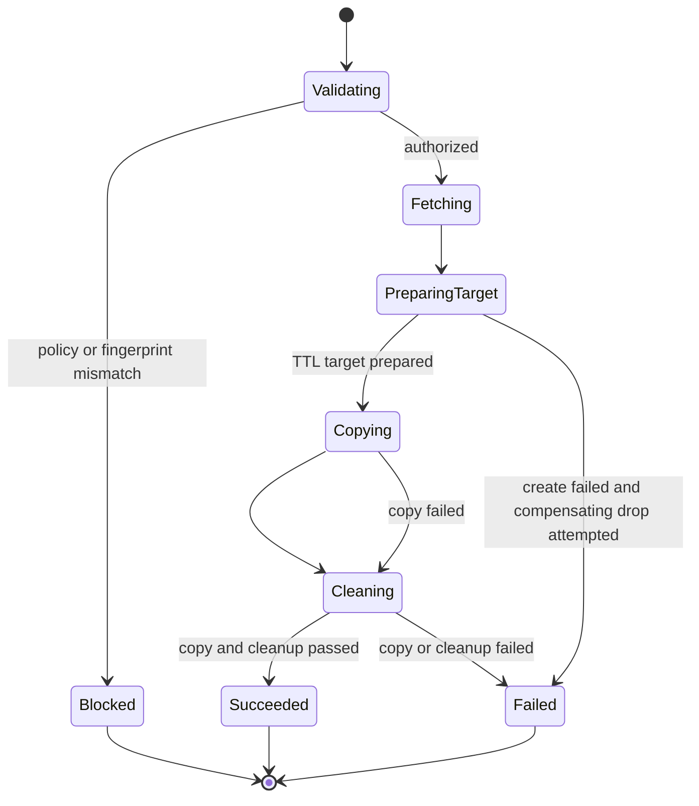

# Feature design: safe-sample live runtime integrity v0.72.4

- Status: IMPLEMENTED
- Owner: dpone maintainers
- Issue: frozen Airflow self-service Phase 1B completion
- Target release: 0.72.4
- Last verified: 2026-07-15
- Base commit: `4880c52d30b10222520e8181ab2deb61b69f329d`
- Validation evidence:
  `test_artifacts/airflow-self-service-v0724-live-runtime/validation-report.md`
- Live certification: UNVERIFIED (no approved MSSQL/ClickHouse, Vault, or KPO
  environment was used)

## Executive summary

The Phase 1B runtime command can assemble an MSSQL to ClickHouse live copier,
but its current composition still uses the local no-op temporary-target
adapter. A mocked copy can therefore report success without proving that the
temporary ClickHouse table was created, protected by server-side expiry, and
removed. The runtime also accepts serialized policy state and environment
binding files without recomputing policy or proving that the files match the
fingerprints pinned by the deployment.

This slice makes the explicit live runtime path fail closed until all three
preconditions are true:

1. policy is re-evaluated from the pipeline route and immutable defaults;
2. binding-set, connection-registry, and credential-runtime payloads match the
   pinned deployment fingerprints;
3. the exact primary authoring source matches the manifest fingerprint recorded
   inside the pinned workload pack;
4. a real ClickHouse temporary-target lifecycle is injected and shares one
   workload-scoped credential resolution with the bounded copy executor.

The beginner command and non-live rehearsal remain network-free. Production
route authorization remains fail closed until a trusted certification verifier
injects verified route IDs; authoring data and serialized plan flags cannot do
that.

Implementation review also proved that the existing ClickHouse writer selected
an unsupported native-driver path: it passed Python row mappings while emitting
`FORMAT JSONEachRow`. `clickhouse-driver` requires data inserts through this API
to end with `VALUES`. Repairing that live-path defect is part of this integrity
slice.

## Personas and customer journey

| Persona | Goal | Current pain | Success signal |
|---|---|---|---|
| Data engineer | Run a bounded development sample | The handoff can report a mocked copy while target DDL is a no-op | Explicit live handoff creates, writes, and drops one TTL-protected target |
| Platform engineer | Promote immutable environment bindings | Runtime can load files whose content differs from deployment fingerprints | Mismatched inputs fail before credentials or database I/O |
| Security engineer | Prevent forged production sample plans | Persisted `runnable` and policy fields can be edited | Runtime recomputes policy and production remains blocked without trusted evidence |
| Operator | Diagnose partial failures | Target and copy failures can be conflated | Evidence records prepare, copy, cleanup, and stable error codes separately |

Journey:

1. The beginner command still creates a pinned execution plan and a live-copy
   handoff command without reading secrets.
2. The runtime command validates the plan and all non-secret runtime inputs.
3. It recomputes canonical fingerprints and policy before artifact fetch,
   credential resolution, source reads, or target writes.
4. After pinned `init_fetch`, it resolves each logical connection once for the
   workload.
5. It creates the ClickHouse target with server-side TTL, reads a bounded
   MSSQL sample, writes it, and drops the target in `finally`.
6. The user receives structured outcome axes and immutable, secret-free
   evidence.

## Scope

### In scope

- Re-authorize explicit live copy from pipeline source plus default policy.
- Reject inconsistent plan/request/environment/pipeline route state.
- Verify binding-set, connection-registry, and credential-runtime canonical
  fingerprints against the pinned deployment context.
- Record the primary manifest as a workload-pack dependency and verify its raw
  content digest against the pinned pack before live authorization.
- Require an explicit project source root for live verification; never infer
  authoring identity from the runtime cache location.
- Add workload-scoped in-memory credential caching.
- Wire the existing `ClickHouseTemporaryTargetAdapter` into live runtime.
- Emit deterministic native ClickHouse `INSERT ... (columns) VALUES` plans,
  skip the physical insert for an empty batch, and require the native driver to
  return the exact inserted-row count.
- Use the same scoped resolver for ClickHouse target lifecycle and data copy.
- Preserve local no-op target behavior for non-live rehearsal.
- Add structured errors, evidence metadata, tests, docs, and changelog entry.

### Non-goals

- Automatically enabling network I/O for plain `dpone run` in this slice.
- Claiming a live MSSQL/ClickHouse or Vault certification without an approved
  environment.
- Adding a new credential backend, target backend, authoring mode, or scheduler
  contract.
- Implementing the external signed route-certification store. The new
  authorizer accepts only trusted injected route IDs so that integration can be
  added without changing policy semantics.
- Reusing one database connection between source, target DDL, and target DML.
  Credential version consistency is required; connection pooling is not.

### Assumptions and constraints

- The frozen architecture already requires temporary target create/TTL/drop,
  pinned environment identities, and `resolution_scope: workload_start`.
- `canonical_fingerprint` is the authority for binding/deployment payloads.
- Live runtime runs inside one workload process or pod; its credential cache is
  not shared across workloads.
- No credential value, Vault path, token, sampled row, or signed URL is
  serialized into evidence.

## Public contract

### CLI

The existing command remains canonical:

```bash
dpone ops safe-sample-runtime-run \
  --plan-json plan.json \
  --pipeline-source pipelines/orders_daily/pipeline.yaml \
  --enable-live-copy \
  --binding-set environments/dev/binding-set.yaml \
  --connection-registry platform/connection-registries/dev.yaml \
  --credential-runtime environments/dev/credential-runtime.yaml
```

- No new required flags.
- Non-live invocation stays network-free and uses the no-op target adapter.
- Explicit live invocation performs physical target DDL and source/sink I/O
  only after authorization and identity validation.
- Exit `0`: execution succeeded, cleanup succeeded, and no structured errors.
- Exit `1`: runtime/dependency/data/cleanup failure.
- Exit `2`: malformed usage, plan, policy, or pinned runtime input.
- Messages remain bounded and recursively redacted.

New stable error codes:

- `DPONE_SAFE_SAMPLE_LIVE_POLICY_INVALID`
- `DPONE_SAFE_SAMPLE_LIVE_POLICY_NOT_AUTHORIZED`
- `DPONE_SAFE_SAMPLE_BINDING_SET_FINGERPRINT_MISMATCH`
- `DPONE_SAFE_SAMPLE_CONNECTION_REGISTRY_FINGERPRINT_MISMATCH`
- `DPONE_SAFE_SAMPLE_CREDENTIAL_RUNTIME_FINGERPRINT_MISMATCH`
- `DPONE_SAFE_SAMPLE_PIPELINE_SOURCE_PIN_MISSING`
- `DPONE_SAFE_SAMPLE_PIPELINE_SOURCE_FINGERPRINT_MISMATCH`
- `DPONE_SAFE_SAMPLE_TEMPORARY_TARGET_CONNECTION_MISMATCH`

### Python API

Internal composition contracts are additive:

```python
WorkloadScopedCredentialResolver.resolve(connection_ref) -> ResolvedBindingConnection
build_live_safe_sample_runtime_assembly(...) -> LiveSafeSampleRuntimeAssembly
run_local_safe_sample_runtime_handoff(..., temporary_target_executor=...) -> SafeSampleRuntimeRunReport
```

Existing functions keep their default fail-closed behavior.

### Manifest/schema

No authoring schema version changes. Airflow pack v3 gains an additive
`workload_dependencies` entry with `kind: manifest`; its existing schema already
accepts this dependency kind. Existing valid development inputs remain valid.
Previously accepted live inputs whose source or environment content does not
match the pinned deployment now fail closed by design.

`dpone.clickhouse-safe-sample-insert-plan.v1` keeps its schema version and
fields, but its `sql` invariant changes from the non-working
`FORMAT JSONEachRow` suffix to the native-driver `VALUES` suffix. These plans
are runtime-generated and are not accepted as authoring input, so no stored-plan
migration is required.

### Artifacts and evidence

`dpone.safe-sample-runtime-execution.v1` remains the evidence schema. Its
existing `temporary_target_prepare.adapter_metadata` and cleanup sections gain
additive safe metadata:

```yaml
backend: clickhouse
operation: create
applied: true
server_side_expiry: true
ttl_seconds: 86400
credential_resolution:
  connection_ref: clickhouse_dev
  resolver: vault_kv
  resolved_version: 17
```

Fingerprint mismatch produces no runtime evidence file because execution did
not start. CLI output still uses `dpone.error.v1`.

### Compatibility and migration

- The CLI shape is unchanged.
- Non-live behavior is unchanged.
- Live behavior becomes stricter and physically correct.
- Deployment projections must be rebuilt if environment files changed after
  projection; immutable published deployments are never edited.
- Workload packs built before the manifest dependency pin must be rebuilt before
  explicit live execution. Non-live rehearsal and Airflow parsing remain
  compatible.
- Rollback is removal of the live assembly injection; it restores fail-closed
  no-I/O behavior, never the unsafe mocked-success behavior.

## Detailed algorithm

1. Validate CLI usage and public execution-plan schema.
2. Load the pipeline exactly once as bytes plus a parsed mapping; compute its raw
   SHA-256 without canonicalizing away comments or formatting.
3. Require the caller to provide the project source root. Resolve the primary
   source under that root and reject a missing root, traversal, or symlink escape.
4. Read the selected workload pack only through its pinned `cache://` reference,
   verify the pack digest from `airflow-index.json`, and compare the loaded source
   bytes with its `kind: manifest` dependency. Reject an absent or mismatched pin.
5. Load binding-set, registry, and credential-runtime as mappings.
6. Verify plan sample rows, request sample rows, environment, temporary target,
   and pipeline route are internally consistent.
7. Detect source capability from the verified pipeline. Inject verified route IDs only
   from the trusted composition boundary; the default set is empty.
8. Re-evaluate the immutable environment policy. Reject any failed result.
9. Canonicalize each environment payload and compare its digest with the
   deployment context. Reject absent or mismatched pins.
10. Validate credential-runtime and environment consistency.
11. Construct one `BindingCredentialResolver` and wrap it in
   `WorkloadScopedCredentialResolver`.
12. Construct the certified data copier and credential-resolving ClickHouse
   target adapter from the same scoped resolver.
13. Fetch only pinned runtime artifacts.
14. Resolve sink credentials on target prepare, create database/table, add the
   materialized expiry column, and configure TTL.
15. Resolve source credentials, reuse the cached sink credential result, and
   read within row/byte/time budgets.
16. For a non-empty batch, sort and quote the common row-column names, require
   every row to have the same column set, and execute native
   `INSERT INTO <temporary> (<columns>) VALUES`. For an empty batch, perform no
   insert call. Require the native driver to return an integer equal to the
   planned row count; any other result fails closed.
17. In `finally`, drop the target with the same target adapter.
18. Persist create-only redacted evidence after cleanup outcome is known.

### Pseudocode

```text
plan = validate_and_load(plan_json)
inputs = load_non_secret_runtime_inputs()
pipeline_bytes, pipeline = load_pipeline_source_once()
pack = read_and_verify_pinned_pack(plan)
verify_manifest_dependency(pack, sha256(pipeline_bytes))

authorized_plan = authorizer.authorize(
    plan,
    pipeline,
    verified_route_ids=injected_trust_decisions,
)
verify_fingerprint(inputs.binding_set, plan.binding_set_ref)
verify_fingerprint(inputs.registry, plan.connection_registry_ref)
verify_fingerprint(inputs.credential_runtime, plan.credential_runtime_ref)

resolver = WorkloadScopedCredentialResolver(BindingCredentialResolver(inputs))
target = CredentialResolvingClickHouseTemporaryTargetAdapter(resolver)
copier = build_certified_copier(resolver)

fetch_pinned_artifacts()
try:
    target.create_with_ttl()
    copier.copy_bounded_rows()
finally:
    if target_was_prepared:
        target.drop()
write_create_only_evidence()
```

### State machine



### Edge cases

- Empty source: succeeds with `data_outcome: no_data`, then drops target.
- Rows with inconsistent column sets: fail closed before the ClickHouse driver
  call; row values never enter the error.
- Driver inserted-row mismatch: fails the copy and still drops the target.
- Exact row/byte budget: accepted; greater values fail before write.
- Fingerprint mismatch: no credentials, artifact fetch, DDL, or evidence write.
- Source changed after release build: exact-byte mismatch blocks before policy,
  credentials, artifact fetch, DDL, or evidence write.
- Missing explicit project source root: fail closed before reading a pack or
  resolving credentials; the cache root is never used as an authoring anchor.
- Native driver returns a non-integer or a different inserted-row count: fail
  the copy and still execute target cleanup.
- Sink credential rotation during a workload: cached version is reused.
- Rotation between workloads: the next workload resolves the new version.
- Target create partial failure: adapter performs compensating drop.
- Copy failure: cleanup still runs.
- Cleanup failure: execution is failed even if data outcome passed.
- Replayed run ID: create-only evidence rejects replacement.
- Production plan with a forged proof string: re-authorization fails because no
  trusted verified route ID is injected.

## Architecture

### Components and responsibilities

| Component | Existing/new | Responsibility | Dependencies |
|---|---|---|---|
| `SafeSampleLiveExecutionAuthorizer` | new service | Rebuild the policy decision from pipeline facts and trusted injected IDs | policy and capability services |
| `LiveSafeSampleRuntimeInputLoader` | new readiness adapter | Load, validate, and fingerprint non-secret runtime files | canonical fingerprint, credential checks |
| `PinnedWorkloadSourceVerifier` | new readiness adapter | Verify indexed pack bytes and the exact primary manifest digest | local cache registry, pack provenance |
| `WorkloadScopedCredentialResolver` | new runtime decorator | Resolve each logical ref once per workload | runtime credential resolver protocol |
| `CredentialResolvingClickHouseTemporaryTargetAdapter` | new readiness adapter | Bind existing target DDL policy to runtime credentials at the composition boundary | ClickHouse connector provider and service adapter |
| `LiveSafeSampleRuntimeAssembly` | new composition model | Return matching copier and target lifecycle ports | readiness composition root |
| Runtime command handler | changed thin adapter | Validate, assemble, execute, render | assembly and runner |

### Ports, adapters, and composition root

`dpone.services` owns policy, lifecycle, and copier protocols. Runtime modules
own credential and connector adapters. `dpone.readiness` is the explicit
composition root and is the only layer that wires both directions together.
No service locator, global client, import-time I/O, or Airflow parse dependency
is introduced.

### Alternatives and tradeoffs

| Alternative | Advantages | Disadvantages | Decision |
|---|---|---|---|
| Add DDL to the ClickHouse writer | Fewer objects | Mixes target lifecycle and row writing; cleanup becomes implicit | Rejected |
| Resolve sink credentials separately for DDL and copy | Simple wiring | Can observe different rotated versions and violates `workload_start` | Rejected |
| Cache credentials globally | Fewer Vault calls | Cross-workload secret lifetime and rotation bugs | Rejected |
| Workload-scoped resolver decorator | Small, testable, backend-neutral | One in-memory cache per execution | Adopted |
| Trust serialized `policy_result` | No new validation | User-editable authorization | Rejected |
| Trust mutable `pipeline.yaml` after release build | No pack read in assembly | Runtime may execute a route different from the pinned release | Rejected |
| Verify exact source bytes through pack manifest dependency | Reuses immutable pack identity; no second DSL | Formatting-only changes require rebuild | Adopted fail-closed behavior |

### ADR requirement

No new ADR. This repairs implementation drift from the frozen authority,
credential-resolution, temporary-target, and evidence contracts.

### Quality-budget impact

- New cohesive modules keep runtime credential and target adapter changes out
  of the existing large `binding_resolver.py`.
- Existing command/readiness modules remain below the global hard SLOC budget.
- No generic plugin framework is introduced.

## Market comparison

N/A. This is a correctness repair of approved dpone contracts and adds no new
competitive capability. No product superiority claim is made.

## Measurable differentiation

```yaml
axis: safe self-service sample integrity
scenario: explicit MSSQL to ClickHouse development live handoff
baseline: mocked copy can pass while temporary target DDL is not applied
metric: unsafe or identity-mismatched executions reaching source/target IO
target: 0
procedure: contract tests plus approved live route certification
artifact: safe-sample runtime evidence and live certification receipt
limitations: live status remains UNVERIFIED without an approved environment
```

Primary implementation reference checked 2026-07-15:
[clickhouse-driver quickstart](https://clickhouse-driver.readthedocs.io/en/0.2.9/quickstart.html#inserting-data).

## Security, privacy, and operations

- Fingerprint and policy validation occur before secret resolution and network.
- Credential values exist only in runtime memory.
- Vault path/address/role and secret reference topology remain redacted.
- The scoped resolver stores only workload-lifetime values.
- Target DDL uses quoted identifiers derived from the validated plan.
- Server-side TTL remains a backstop; explicit drop is still mandatory.
- No sampled rows enter logs, CLI output, evidence, or exception text.

## Test and certification plan

| Layer | Scenario | Environment | Expected artifact |
|---|---|---|---|
| Unit | workload cache resolves one ref once and separates refs | offline | pytest result |
| Unit | live authorizer rejects forged/mismatched plans | offline | structured errors |
| Contract | each pinned input mismatch blocks before adapter construction | offline | CLI `dpone.error.v1` |
| Contract | source changes after release build block before authorization and I/O | offline | source fingerprint error |
| Contract | missing project source root blocks before pack read and I/O | offline | source-root-required error |
| Contract | ClickHouse native insert uses quoted columns plus `VALUES`; `FORMAT` and non-exact driver acknowledgements are rejected | offline | insert-plan schema and client tests |
| Integration | fake connectors observe create/TTL, bounded copy, drop ordering | offline mocked ports | runtime evidence JSON |
| Integration | create/copy/drop failures preserve cleanup and outcomes | offline mocked ports | runtime evidence JSON |
| Live certification | MSSQL to ClickHouse development route | approved local-live only | route/evidence receipt |
| Compatibility | non-live and legacy handoff remain no-I/O | offline | existing test suite |

Exact-budget, empty-input, secret-redaction, duplicate-evidence, and production
fail-closed tests are mandatory. Unavailable live infrastructure is
`UNVERIFIED`, never `PASS`.

## Documentation plan

- Correct Phase 1B status in architecture and backlog.
- Update First DAG troubleshooting and runtime handoff explanation.
- Add operator ordering and fingerprint mismatch recovery.
- Update generated CLI/schema references only through producers.
- Add an Unreleased changelog entry.

## Rollout and rollback

The stricter behavior ships in 0.72.4. Run offline and mocked integration gates,
then an approved local-live certification. A fingerprint mismatch instructs the
operator to rebuild/promote a deployment instead of bypassing identity checks.
Rollback disables explicit live assembly and returns to fail-closed no-I/O.

## Agent execution plan

| Agent/role | Owned paths | Read-only paths | Forbidden paths | Dependency |
|---|---|---|---|---|
| Integrator | spec, runtime/services/readiness/command modules, tests, docs, changelog | frozen architecture and standards | user `.cursor/` | none |
| Architecture reviewer | none | implementation and spec | all writes | spec draft |
| Test/certification reviewer | none | tests, backlog, docs | all writes | current behavior |
| Fresh reviewer | none | final diff and evidence | all writes | focused/broad gates |

## Approval checklist

- [x] User problem and CJM are clear.
- [x] Algorithm and failure semantics are implementable without guessing.
- [x] Public contracts and compatibility are explicit.
- [x] Architecture and alternatives are justified.
- [x] Market comparison is correctly N/A for a bug-contract repair.
- [x] Differentiation is measurable without an unqualified claim.
- [x] Tests, evidence, docs, rollout, and rollback are complete.
- [x] Path ownership and integration plan are conflict-safe.
- [x] Maintainer continuation request approves the frozen Phase 1B contract.
