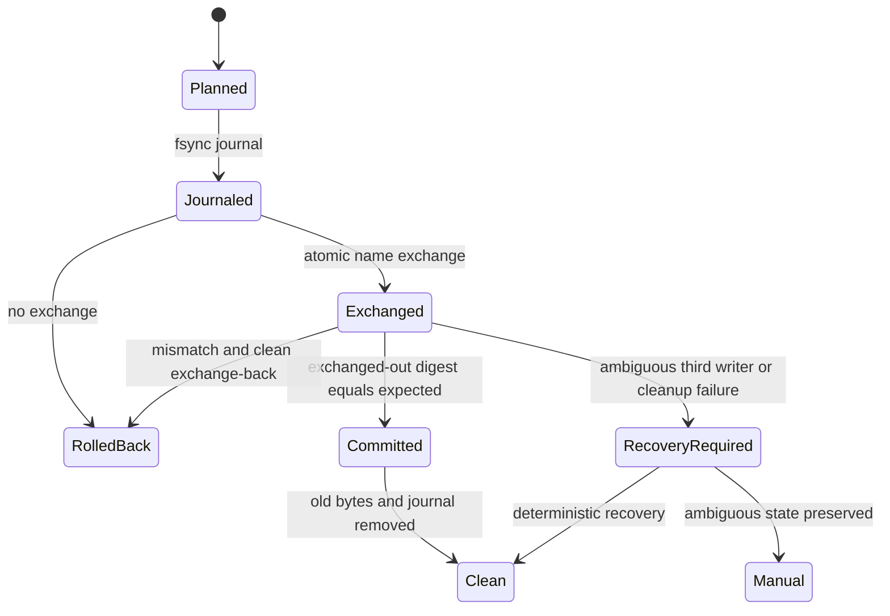
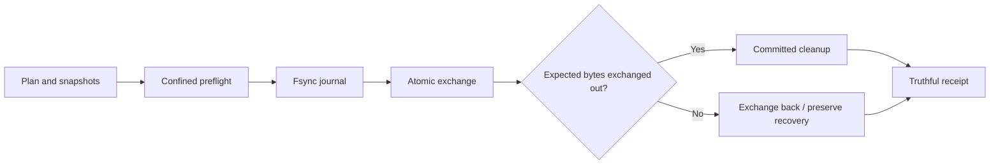

# Feature design: crash-safe self-service authoring transactions

- Status: APPROVED
- Owner: dpone maintainers
- Issue: global self-service review after v0.73.1
- Target release: next patch after v0.73.1
Last verified: 2026-07-18

## Executive summary

The v0.73.1 self-service review found that authoring apply and rollback paths
preserve most concurrent writers but do not yet provide one truthful transaction
boundary. In particular, compare-and-replace temporarily removes the authoritative
pathname, rollback can delete a same-content concurrent file, and workload init can
publish a root source after a dependent fragment changed.

This bug fix introduces one descriptor-confined transaction primitive for existing
authoring files, exact ownership receipts for created files, and fail-closed
preflight for every path. A successful command either publishes the complete
intended state or returns a receipt that accurately identifies preserved recovery
artifacts. User-owned bytes are never silently overwritten or deleted.

## Personas and customer journey

| Persona | Goal | Current pain | Success signal |
|---|---|---|---|
| New data engineer | Re-run `dpone init` safely | A race or symlink can produce a partial project | Repeated apply is a no-op or an explicit conflict |
| Platform engineer | Automate scaffold and migration in CI | A process crash can leave an ambiguous filesystem state | Recovery is deterministic and machine-readable |
| Repository maintainer | Preserve hand-edited catalog fields | Existing DAG fields can be overwritten by scaffold defaults | Exact declarations are no-op; differences are conflicts |

The normal journey is unchanged: plan, inspect diff, apply, and commit authoring
sources. On a concurrent change, unsafe path, unsupported atomic primitive, or
incomplete prior transaction, dpone fails before new project state is published.
When cleanup cannot complete after the atomic commit point, the result says
`recovery_required` and identifies only non-secret project-relative artifacts.

## Scope

### In scope

- Existing-file compare-and-replace used by authoring migration and catalog patching.
- Exact rollback ownership for newly created scaffold and migration fragment files.
- Stable bounded reads that reject in-place mutation during a read.
- Fragment revalidation immediately before primary-source activation.
- Workload-set no-follow preflight.
- Non-destructive merge semantics for existing domain DAG declarations.
- Best-effort rollback that continues after each individual compensation failure.
- Fault-injection tests for every transaction phase and concurrency boundary.

### Non-goals

- Distributed transactions across Git, Airflow, object storage, or runtime state.
- Automatic merge of differing user-authored YAML declarations.
- A generic filesystem transaction framework outside dpone authoring.
- Background recovery daemon or a new user-facing command in this patch.
- Cross-filesystem atomic moves.

### Assumptions and constraints

- All transaction artifacts are siblings of their authoritative file and therefore
  remain on one filesystem.
- POSIX production platforms must expose an atomic name-exchange primitive:
  Linux `renameat2(RENAME_EXCHANGE)` or macOS `renameatx_np(RENAME_SWAP)`.
- A platform without a certified atomic exchange adapter fails before mutation with
  `atomic_exchange_unsupported`; it does not fall back to a clobbering replace.
- External editors do not participate in dpone locks. Correctness therefore relies
  on atomic namespace operations, immutable ownership receipts, and recovery
  artifacts rather than a cooperative lock alone.
- Existing public CLI command names and successful JSON shapes remain compatible.

## Public contract

### CLI

No command or option is added.

For `dpone init ... --apply`, authoring migration apply, and catalog apply:

- exit `0`: all requested state is committed or already identical;
- exit `1`: deterministic user conflict, including a source or dependent fragment
  changed after planning;
- exit `4`: unsafe path, symlink, unsupported atomic transaction primitive, or an
  unresolved recovery state;
- exit `5`: unexpected internal failure, with a truthful transaction receipt when
  any mutation may have occurred.

Plan mode performs no writes, including no journal, temporary, recovery, or cache
file creation.

### Python API

The internal confined mutation API returns explicit outcomes:

```python
replace_file_if_digest(...) -> ConfinedReplaceOutcome
remove_file_if_owned(...) -> ConfinedRollbackOutcome
recover_file_transaction(...) -> ConfinedRecoveryOutcome
```

`ConfinedReplaceOutcome.committed` identifies the atomic linearization result.
`cleanup_required` and `recovery_name` distinguish a committed replacement whose
old bytes or journal still require cleanup from a pre-commit failure. Callers must
not translate post-commit cleanup failure into a rollback claim.

`OwnedFile` contains descriptor identity and a content digest/size, not a pathname
comparison alone. Rollback removes only that exact owned inode through a
descriptor-confined operation.

### Manifest/schema

No manifest or JSON Schema changes are introduced. Existing user-owned catalog
values become stricter:

- an existing exact DAG declaration is a no-op;
- an existing declaration with any differing generated field is a conflict;
- dpone never overwrites schedule, owner, retries, timezone, workload membership,
  or unknown user fields through implicit `dict.update`.

### Artifacts and evidence

One deterministic sibling journal is allowed while a replacement is in progress:

```text
.<leaf>.dpone-transaction.json
```

It contains schema/version, leaf names, expected and desired SHA-256 digests, and
phase. It never contains authoring bytes, secrets, absolute paths, or repository
metadata.

Temporary and recovery names are random sibling leaf names. Public receipts expose
project-relative recovery paths only. Journals and transaction artifacts are
bounded regular files opened with no-follow semantics.

### Compatibility and migration

- Successful idempotent authoring behavior is unchanged.
- Unsafe races that previously appeared successful now fail closed.
- Windows or another platform without a certified exchange adapter may still use
  plan/check/preview but mutation fails before writing. A native adapter requires
  its own platform contract tests before support is claimed.
- No existing authoring source is rewritten merely by upgrading.
- Recovery is automatic only when journal state proves one unambiguous action.
  Ambiguous state is preserved for manual recovery.

## Detailed algorithm

### Existing-file compare-and-replace

1. Open the project root and every parent directory by descriptor without following
   symlinks.
2. Recover an existing deterministic transaction journal for the leaf. If state is
   ambiguous, stop without a new mutation.
3. Validate target and prepared replacement as bounded regular sibling files.
4. Verify the target digest equals the plan's expected digest.
5. Write and fsync the bounded transaction journal, then fsync the directory.
6. Atomically exchange target and replacement names. This is the linearization
   point: the authoritative pathname is never absent.
7. Read the exchanged-out file from its descriptor-stable name.
8. If it matches the expected digest, the commit is successful. Remove the old file
   and journal, fsyncing the directory. Cleanup failure returns committed with
   `cleanup_required`; it does not trigger dependent rollback.
9. If it does not match, atomically exchange the names back. If a third writer raced,
   preserve every non-owned version under a recovery name and return
   `source_changed` plus recovery metadata.
10. Never overwrite an unknown pathname winner.

### Journal recovery

For target digest `T`, exchange-side digest `X`, expected `E`, and desired `D`:

| Observed state | Recovery |
|---|---|
| `T=D`, `X=E` | Commit had linearized; remove `X`, then journal |
| `T=D`, `X!=E` | Source changed before exchange; exchange back and preserve any third winner |
| `T=E`, `X=D` | Exchange did not linearize or was rolled back; remove owned `X`, then journal |
| `T=D`, `X` missing | Commit cleanup completed; remove stale journal |
| Any unknown/symlink/non-regular state | Preserve all paths and return `recovery_required` |

Journal recovery itself is idempotent. A crash during recovery leaves the same
table applicable on the next invocation.

### Created-file rollback

1. Creation returns an `OwnedFile` receipt from `fstat` of the exact created file.
2. Rollback performs an atomic name exchange or quarantine operation that never
   unlinks by content comparison alone.
3. It removes the candidate only when device, inode, size, digest, and expected
   content identity match the receipt.
4. A pre-existing identical fragment has no ownership receipt and is never removed.
5. A concurrent replacement is preserved at the authoritative path. Displaced
   bytes receive a recovery path when needed.

### Multi-file authoring apply

1. Validate every path and build the complete plan with zero writes.
2. Create a missing dependent fragment and retain its exact ownership receipt, or
   verify a pre-existing identical fragment without claiming ownership.
3. Immediately before root activation, re-open and revalidate the fragment.
4. Atomically replace the root source.
5. If root replacement fails pre-commit, rollback only the exact owned fragment.
6. If root replacement committed but cleanup is incomplete, do not rollback the
   fragment; return `recovery_required`.
7. Scaffold rollback processes all receipts in reverse order. One compensation
   error is recorded and does not stop remaining compensations.

### Pseudocode

```text
recover(target)
assert safe_bounded_regular(target, replacement)
assert digest(target) == expected
journal = fsync(create_journal(expected, desired, replacement))
atomic_exchange(target, replacement)

if digest(replacement) == expected:
    committed = true
    cleanup_owned_old_and_journal()
    return committed_outcome(cleanup_status)

atomic_exchange(target, replacement)
preserve_any_third_party_bytes()
remove_only_owned_desired_bytes()
raise source_changed(recovery_artifacts)
```

### State machine



### Edge cases

- Empty regular files are valid if their expected digest matches.
- FIFO, directory, device, socket, and symlink targets fail before mutation.
- In-place growth, truncation, or rewrite during read raises `source_changed`.
- A fragment changed after creation but before root activation blocks activation.
- A pre-existing identical fragment remains user-owned.
- A rollback exception does not prevent compensation of earlier receipts.
- A crash before journal fsync has no namespace mutation.
- A crash after exchange is recoverable from target, exchange-side file, and
  journal digests.
- Directory fsync failure is reported conservatively; it is never called proof of
  durable success.

## Architecture

### Components and responsibilities

| Component | Existing/new | Responsibility | Dependencies |
|---|---|---|---|
| `confined_files` | Existing, hardened | Stable bounded descriptor reads | OS descriptors |
| `confined_atomic_exchange` | New | Certified platform atomic exchange adapter | libc/Win32 adapter |
| `confined_transaction_journal` | New | Bounded durable journal and recovery decision | confined files |
| `confined_mutations` | Existing, refactored | Transaction policy and ownership outcomes | exchange + journal |
| `authoring_migration_io` | Existing | Fragment ownership and root activation ordering | confined mutations |
| workload init storage/UoW | Existing | Multi-file receipts and exhaustive compensation | confined mutations |

### Ports, adapters, and composition root

The transaction policy depends on a narrow atomic-exchange callable injected for
tests. Native platform selection happens once in the filesystem composition root.
CLI and readiness services remain thin. No vendor SDK, network, secret, or Airflow
dependency enters the authoring filesystem layer.

### Data and control flow



### Alternatives and tradeoffs

| Alternative | Advantages | Disadvantages | Decision |
|---|---|---|---|
| `rename(old, recovery)` then link new | Portable, preserves bytes | Authoritative-name gap; crash ambiguity | Rejected |
| `os.replace` after digest check | Portable, simple | Can clobber a writer racing after check | Rejected |
| Cooperative lock plus replace | Easy between dpone processes | External editors do not honor lock | Rejected as correctness boundary |
| Atomic name exchange plus durable journal | No missing pathname; crash recovery; preserves versions | Native adapter and recovery complexity | Accepted |
| Full repository transaction database | Strong coordination | Excessive dependency and scope | Rejected |

### ADR requirement

Required. The linearization point, native-platform contract, crash recovery, and
post-commit cleanup semantics are cross-layer decisions. See
[ADR 0023](adr/0023-confined-authoring-transaction-semantics.md).

### Quality-budget impact

Platform exchange, journal codec/recovery, and mutation policy are separate stable
responsibilities. Every production module remains below the current `max_sloc: 400`
budget. Existing god-module debt must not grow. No new import from readiness into
manifest or from runtime/Airflow into authoring is allowed.

## Market comparison

N/A for dlt, Informatica, Airbyte, Fivetran, Pentaho, SSIS, gusty, Astronomer
Cosmos, and Apache Beam. This is an internal correctness repair of an already
promised dpone authoring contract, not a new competitive capability. No market
claim is made.

## Measurable differentiation

```yaml
axis: internal authoring transaction correctness
scenario: concurrent edit or process interruption during self-service apply
baseline: v0.73.1 fault injection
metric: lost user files, absent authoritative paths, false rollback receipts
target: 0 for every certified transaction phase
procedure: deterministic race and subprocess-kill fault injection
artifact: test_artifacts/airflow-self-service-global-review-v0731/
limitations: live filesystem and Windows certification are reported separately
```

## Security, privacy, and operations

- All paths are descriptor-confined, no-follow, project-relative, and redacted.
- Journals contain only leaf names, digests, state, and schema version.
- No authoring bytes, connection references, Vault paths, or secrets enter errors.
- Temporary and journal files use restrictive creation modes and bounded payloads.
- Recovery never scans recursively; it checks one deterministic sibling journal.
- Metrics distinguish `committed_cleanup_required`, `rolled_back`, and
  `recovery_required`.

## Test and certification plan

| Layer | Scenario | Environment | Expected artifact |
|---|---|---|---|
| Unit | Atomic exchange success/mismatch/unsupported | tmp filesystem | pytest report |
| Unit | Crash point before/after journal/exchange/cleanup | fault injection | pytest report |
| Contract | Exact ownership and pre-existing identical file | tmp repository | pytest report |
| Contract | Fragment mutation before root activation | tmp repository | no root mutation |
| Contract | Symlink workload-set and catalog paths | tmp repository | zero mutations |
| Contract | Existing DAG exact/no-op and differing/conflict | tmp repository | plan receipt |
| Integration | Workload init rollback with multiple failing compensations | tmp repository | recovery receipt |
| Compatibility | Linux and macOS atomic adapters | CI matrix | platform reports |
| Live certification | Windows/native adapter | unavailable until implemented | UNVERIFIED |

Required negative tests include path traversal, symlink escape, FIFO, oversized
journal, corrupt journal, wrong transaction leaf, source mutation during read,
third writer before exchange-back, unlink/fsync failures after commit, and crash
recovery idempotency.

## Documentation plan

Update the self-service architecture transaction section, troubleshooting/error
catalog, and workload-init recovery runbook. Public docs explain plan-first,
no-clobber, and recovery receipts without exposing native syscall details.

## Rollout and rollback

Ship as a fail-closed patch. There is no unsafe compatibility fallback. If a native
adapter is unavailable, apply is blocked before mutation while plan/check remain
usable. Rollback of the release restores old code only after all deterministic
transaction journals have been recovered or manually preserved.

## Agent execution plan

| Agent/role | Owned paths | Read-only paths | Forbidden paths | Dependency |
|---|---|---|---|---|
| Filesystem implementer | confined read/exchange/journal/mutation modules and focused tests | this spec/ADR | CLI, docs, catalogs | ADR accepted |
| Migration implementer | authoring migration I/O and migration tests | mutation API | shared mutation modules | filesystem API |
| Workload-init implementer | scaffold/UoW/service/catalog merge and focused tests | mutation API | manifest transaction modules | filesystem API |
| Integrator | shared docs, ADR index, validation, evidence | all | user-owned unrelated files | all agents |

The parent Codex task is the integrator and shared-file owner.

## Approval checklist

- [x] User problem and CJM are clear.
- [x] Algorithm and failure semantics are implementable without guessing.
- [x] Public contracts and compatibility are explicit.
- [x] Architecture and alternatives are justified.
- [x] Market comparison is correctly N/A for an internal correctness fix.
- [x] Differentiation is measurable by fault injection.
- [x] Tests, evidence, docs, rollout, and rollback are complete.
- [x] Path ownership and integration plan are conflict-safe.
- [x] Maintainer authorization to fix all confirmed review defects is recorded.
