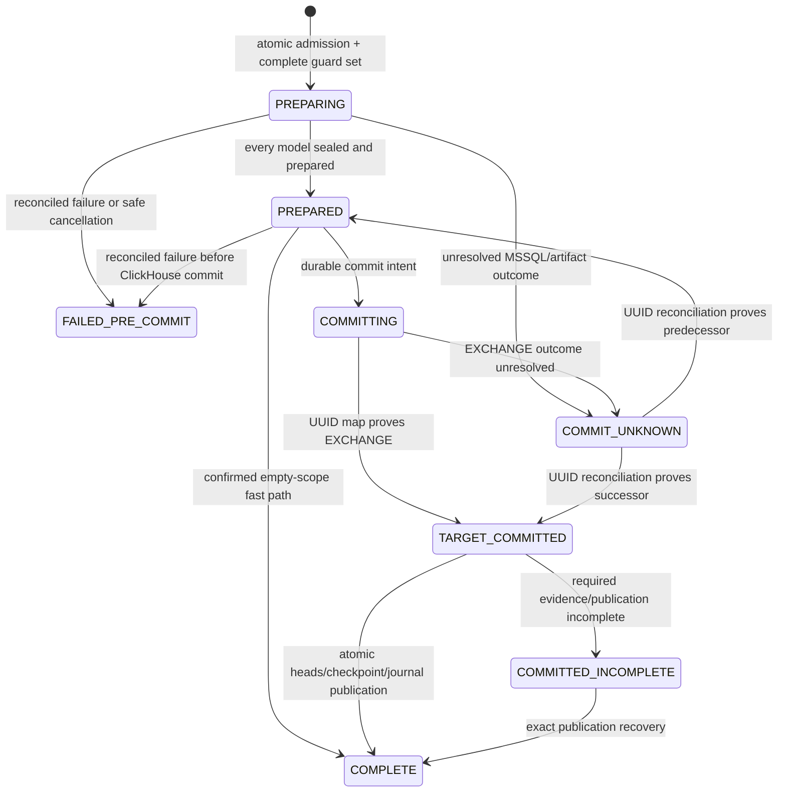

# Feature design: V2 semantic refresh runtime

- Status: APPROVED
- Owner: dpone maintainers
- Approval: explicit maintainer implementation request in Codex task, 2026-08-08
- Issue: design MR
- Target release: 0.74.0
Last verified: 2026-08-09 against integration commit `f2090b3ab2e08f98e0bfc344c1c3cb56eebaebac`

Approval scope: implementation of the 0.74 preview contract only. Production
activation remains unavailable until the exact live-certification and retained-
generation controller requirements below are both satisfied. The later
termination-binding, current-holder/CAS continuation, and commit-outcome
classifier amendments are not part of this approval.

## Executive summary

V2 adds one deliberately narrow, evidence-driven semantic-refresh cell for
target-independent dbt event facts. It turns one daily UTC scope into a durable
operation spanning a fenced SQL Server mutation, immutable source artifact,
prepared ClickHouse generation, exact target-local conformance, atomic table
exchange, and atomic control-state publication. Airflow is a projection; the
SQL Server journal, receipts, object versions, and ClickHouse UUIDs are the
authorities.

The first cell is `scope_stable_event_fact`: an immutable effective key that
contains event time, mutable payload for the same key, `[start,end)` UTC day
scope, `UPDATE` then `INSERT`, and `ignore_missing`. It requires an existing
certified/adopted baseline, one SQL Server database for model and control state,
and a single-node/single-replica ClickHouse `Atomic` database with plain
`MergeTree`. It does not claim workflow-wide publication atomicity.

## Personas and customer journey

| Persona | Goal | Current pain | Success signal |
|---|---|---|---|
| dbt author | Publish an event-fact model without orchestration code | Runtime/recovery internals leak into authoring | Existing `meta.dpone.publish` is sufficient |
| platform operator | Prove outcome after crashes | Airflow/dbt exit state cannot prove database commit | Journal, receipt, artifact and UUID reconciliation is deterministic |
| release reviewer | Promote only supported combinations | Aggregate capability labels can hide untested paths | Exact cell, policies, digests and live evidence are bound |

Journey:

1. The author writes a target-independent SQL model and existing publish meta.
2. The beginner loop remains `dbt parse` then `dpone dbt check .`; optional
   `dpone dbt explain MODEL` shows scope, supported archetype, proof status,
   lifecycle authority, writer assurance and upsert-only replay semantics.
3. CI runs the pinned offline `dbt compile` because `compiled_code` is required
   for target-independence proof, and produces immutable proof inputs and a
   deployment-bound pack. The platform-owned package supplies the strategy;
   authors do not select or install it.
4. Deployment activation constructs the final release/deployment-bound plans
   and a content-addressed, run-neutral Airflow DAG projection. The immutable
   deployment index lists that projection; DAG parsing performs no database or
   network I/O.
5. The first worker boundary binds the actual Airflow logical DagRun identity
   to the protected deployment plan. Airflow then runs one dbt build/test gate,
   parallel PREPARE tasks, deterministic sequential model commits, and one
   durable workflow summary.
6. On failure, the operator plans resume, failed-precommit replacement, or
   completed-scope replay from durable evidence. No `assume committed`, force
   writer, delete-missing, or cross-DagRun resume switch exists.

## Scope

### In scope

- `scope_stable_event_fact`, UTC day scope, exact event-time/effective-key cell.
- Existing SQL Server table, pinned dbt Core 1.10.13/dbt-sqlserver 1.10.1.
- Exact V2 dbt selection with no ancestor execution.
- Target-independent model and bounded SQL Server read-dependency proof.
- Durable workflow/resource guards and engine-local fencing.
- Atomic SQL Server before/after images and model build receipt.
- Failed-precommit workflow replacement with one workflow successor CAS.
- `dpone_parquet_v1` sealed artifacts through a create-only versioned store.
- Full ClickHouse shadow, exact multiset proof, `EXCHANGE TABLES`, UUID fence.
- Atomic target/scope/checkpoint/journal state publication.
- Airflow 3.3/Kubernetes projection and evidence-driven recovery.

### Non-goals

- Greenfield bootstrap, current-state moves, SCD2, delete-missing, backfill.
- Text, float, nullable, implicitly cast, rounded or rescaled effective keys.
- Ephemeral, custom materializations, hooks, operations, seeds or snapshots.
- Unresolved SQL modules, scalar/multi-statement/CLR functions, synonyms,
  linked servers, external tables, `OPENQUERY`, `OPENROWSET`, computed source
  columns, cross-database modules, or encrypted definitions.
- Replicated ClickHouse, partition replace, workflow-wide database transaction.
- Cross-DagRun resume, automatic SQL retry, Cosmos execution authority.

### Assumptions and constraints

- Authors cannot mutate platform policy or physical credentials.
- All model/control SQL Server writes are in one database transaction domain.
- Production writers and DDL are controlled by ACL plus current attestation.
- Required live checks remain `UNVERIFIED` until run on the exact environment.

## Public contract

### Author surface and CLI

The existing author manifest is unchanged:

```yaml
meta:
  dpone:
    publish:
      enabled: true
      profile: mssql_to_clickhouse_mart
      workflow: competitive_pricing
```

No new beginner command is required. `dpone dbt explain` adds projections for
workflow mode, dependency closure, adapter lifecycle, scope/key policy, UTC
assurance, writer assurance, publication/recovery status, and the explicit
statement that replay never removes missing input keys. Text, JSON, exit-code,
stderr and no-side-effect error behavior remain parity contracts.

### Versioned contracts

Closed schemas and Python models are added for:

```text
dpone.semantic-refresh-operation-plan.v1
dpone.semantic-refresh-workflow-plan.v1
dpone.semantic-refresh-workflow-replacement-plan.v1
dpone.semantic-refresh-workflow-execution-binding.v1
dpone.semantic-refresh-attempt-binding.v1
dpone.semantic-refresh-attempt-continuation-receipt.v1
dpone.semantic-refresh-model-definition-proof.v1
dpone.semantic-refresh-mutation-closure.v1
dpone.semantic-refresh-sqlserver-lifecycle-policy.v1
dpone.semantic-refresh-read-dependency-proof.v1
dpone.semantic-refresh-compiler-runtime-authority-bundle.v1
dpone.semantic-refresh-baseline-adoption-receipt.v1
dpone.semantic-refresh-route-live-certification-receipt.v1
dpone.semantic-refresh-runtime-assurance-receipt.v1
dpone.semantic-refresh-seal-authorization-receipt.v1
dpone.semantic-refresh-sealed-artifact-manifest.v1
dpone.semantic-refresh-v2-dag-projection.v1
dpone.semantic-refresh-failed-workflow-summary.v1
dpone.semantic-refresh-durable-workflow-summary.v1
dpone.semantic-refresh-trusted-attempt-termination-receipt.v1
dpone.semantic-refresh-clickhouse-failed-scratch-cleanup-receipt.v1
dpone.semantic-refresh-mssql-failed-precommit-cleanup-ack.v1
```

V1 schemas, `+fqn:` selection, CLI/Python behavior and artifacts are unchanged.
V1 and V2 cannot be mixed within one workflow.

Deployment activation authorities are immutable per canonical
`(release_id, deployment_id, plan_bundle_sha256)`. The MSSQL store uses
`(deployment_id, plan_bundle_sha256)` as its physical primary key and separately
requires one release/store identity for every receipt under a deployment. This
allows a failed-precommit replacement plan to retain the exact release,
deployment, pre-release/package and assurance closure while adding its own
create-only plan receipt. The predecessor receipt remains ACTIVE; mutable
revision numbers and `latest` selection are prohibited. Authority planning
freezes `persisted_at`, and acknowledgement-loss apply must reuse the same typed
authority bytes. Recovery persistence never re-runs initial baseline, owner or
target-head activation.

### Identity

The dependency direction is strictly one-way:

```text
contracts/toolchain/policies
-> exact selection/dependency closure
-> model definition proof
-> operation identity/operation plan
-> workflow plan
-> optional replacement plan
-> workflow execution binding
-> attempt binding
-> runtime receipts/state/evidence
```

`operation_id`, plan, workflow, recovery, execution and attempt digests are
SHA-256 over the existing canonical JSON representation without their own
digest field. Runtime/DagRun/try/pod/fence/timestamp/count/artifact/outcome data
never feeds semantic operation identity. A semantic workflow plan never
contains `recovery_plan_digest`; a replacement plan references the already
computed workflow-plan digest.

Identity construction is intentionally staged. Repository/CI compilation
produces immutable definition, selection, dependency, lifecycle and policy
proof inputs; it does not invent `release_id`, `deployment_id`, an execution
binding, or a fencing epoch. After the release and deployment authorities exist,
a typed deployment-stage compiler combines only those frozen proofs with the
exact release/deployment, baseline, ownership, scope and predecessor authority
to build the canonical operation/workflow plan bundle. The controller emits a
run-neutral DAG projection from that authenticated bundle. Its descriptor is
listed by the Airflow deployment index, but its digest is deliberately excluded
from `deployment_id` derivation because the projection already contains that
identity. The complete projection is create-only and byte-verified before cache
promotion.

The projection also binds the existing workflow profile's complete static DAG
policy: `schedule`, `start_date`, `timezone`, `catchup`, `max_active_runs`,
`owner`, tags, and the governed task-concurrency limit. These values participate
in the topology/projection digest. The scheduler must not supply a default
epoch, schedule, timezone, owner, tags, or concurrency override while loading
the sidecar.

The workflow execution binding is a later worker-bound identity. The scheduler
does not invent it and no static index contains a future DagRun id. At the first
worker boundary, the actual Airflow `dag_run.run_id` is loaded from task context,
verified against protected run-admission authority, compiled into one canonical
execution binding, and persisted create-only before dbt or writer work. All
later workers resolve that binding from protected state by deployment plan plus
logical DagRun identity; XCom, caller JSON and parse-time database reads are not
authority. The plan and execution bundles are not inserted back into the
release artifact descriptor set, so neither `release_id` nor `deployment_id`
depends on an identity that already contains it.

### Workflow modes and closure

`workflow_mode` is one of `normal`, `failed_precommit_replacement`, and
`complete_scope_replay`. JSON Schema uses `oneOf`:

```text
all modes:
  selected_mutating_node_ids
  == model_operation_plan_ids
  == expected_model_outcome_ids

normal / complete_scope_replay:
  replacement_action_ids == empty
  recovery_plan_digest absent

failed_precommit_replacement:
  selected_mutating_node_ids
  == model_operation_plan_ids
  == expected_model_outcome_ids
  == replacement_action_ids
  recovery_plan_digest required
```

Closure status is `PROVEN`, `NONCONFORMANT`, or `UNVERIFIED`; only `PROVEN`
executes. V2 uses exact selectors without `+` and `--indirect-selection empty`.
Only publish-enabled SQL incremental models using `dpone_scope_merge`, enforced
contracts, and `on_schema_change=fail` can mutate. Selected or transitive
ephemeral and every unclassified mutating resource fail closed.

### Read dependency policy

Direct base tables, same-database non-encrypted `SCHEMABINDING` views, and
same-database non-encrypted schema-bound inline TVFs are admitted. View/inline
TVF dependencies are recursively resolved by object identity to admitted base
tables; normalized definitions and ordered edges are digested. Synonyms,
scalar/multi-statement/CLR functions, procedures, external tables, linked
servers, `OPENQUERY`, `OPENROWSET`, computed source columns, caller-dependent,
encrypted, cross-database/server, unresolved, cyclic, over-budget, or
metadata-invisible dependencies fail closed. Platform policy supplies bounded
depth/node/edge/definition-byte limits; missing limits are not defaulted.

Runtime rechecks relation/module/catalog digests before `dbt build`. Missing
`VIEW DEFINITION` or unverifiable DDL exclusivity is `UNVERIFIED`, not an empty
dependency set.

### Effective key and event time

For every admitted pair, SQL Server equality must equal ClickHouse equality
after a deterministic injective mapping. Allowed mappings are `bit->Bool`,
integer width-preserving pairs, `uniqueidentifier->UUID` for equality only,
`date->Date` within `1970-01-01..2149-06-06`, exactly
`datetime2(6)->DateTime64(6,'UTC')` within
`1900-01-01T00:00:00.000000Z..2299-12-31T23:59:59.999999Z`, and exact
`decimal(p,s)->Decimal(p,s)` for `p<=38`. Text, float, nullable, wrappers,
rounding, truncation, rescaling and implicit timezone conversion are blocked.
`datetime2(6)` requires a protected ongoing UTC assurance; baseline adoption
can attest only historical rows.

## Detailed algorithm

### Planning and admission

1. During repository/CI compilation, resolve the immutable project, manifest,
   exact selected models/tests and platform policy, and emit only immutable
   definition/closure/lifecycle proof inputs. Final semantic operation plans
   are forbidden at this phase because release/deployment authority does not
   yet exist.
2. Apply the V2 graph policy. Exact selectors never execute ancestors. Data and
   unit tests remain read-only and cannot store failures.
3. Inspect raw Jinja/macro closure; reject author `this`, `is_incremental`,
   relation introspection, runtime query macros, caller environment branches,
   dynamic SQL and side effects.
4. Run pinned `dbt compile`, parse one read-only T-SQL query/CTE/set expression,
   resolve and digest the bounded catalog dependency closure, and reject target
   self/dependency reads. Recompute at runtime before mutation.
5. At deployment activation, load the final release/deployment identities,
   protected connection/capability authorities and the frozen compile proofs;
   build and persist the canonical operation/workflow plan bundle without
   feeding it back into release identity. Build a closed run-neutral DAG
   projection from that exact plan, publish it create-only, and list its exact
   path, size and digest in the immutable deployment index.
6. Require an existing physical SQL Server table and complete baseline receipt.
   Target absence/view/full-refresh never falls into an adapter bootstrap path.
7. Verify one deployment-wide ClickHouse target owner and current writer/DDL
   assurance. The DDL assurance binds a positive monotonic SQL Server DDL epoch.
8. On the first worker boundary, read the actual logical DagRun identity from
   Airflow task context and create/replay its exact protected execution binding.
   Then, in one SQL Server `SERIALIZABLE` transaction, validate
   predecessor/successor contracts, acquire the workflow plus sorted full
   resource guard set, assign fencing epochs, create the attempt/controller
   binding, reservation, and every PREPARING model journal. Partial acquisition
   leaves nothing durable.
9. A later task try in the same logical DagRun never substitutes its pod/try
   identity into the original attempt. Under the original active fence it
   recomputes the current scoped target digest, compares it with the durable
   after-image, and persists/replays a create-only
   `dpone.semantic-refresh-attempt-continuation-receipt.v1` before admission
   replay. Receipt v1 permits only the immediate successor try (`N -> N+1`);
   a later try fails with
   `DPONE_SEMANTIC_REFRESH_CONTINUATION_CHAIN_UNSUPPORTED` and requires manual
   recovery. It is a guarded admission condition, not an automatic SQL retry.
   A new DagRun remains a governed successor, never a continuation.

### 0.74 continuation compatibility freeze

`dpone.semantic-refresh-attempt-continuation-receipt.v1` is permanently frozen
to the published 0.74 closed schema and digest subject. It binds one immediate
same-DagRun successor to the original operation, plan, attempt, fence, trusted
termination, engine-quiescence observations, build receipt, and unchanged
after-image. It does not authorize a second successor, cross-DagRun resume,
changed plan/scope, or replacement of the original holder.

Any monotonic current-holder chain, detached termination-authority binding, or
broader retry contract must use an additive
`dpone.semantic-refresh-attempt-continuation-receipt.v2`, retain v1 reader
compatibility, and receive separate post-0.74 design approval, migration,
certification, and rollback evidence. No post-0.74 implementation may add
required fields or change the meaning of v1 in place.

### Pinned SQL Server adapter lifecycle

The certified tuple binds dbt Core 1.10.13, dbt-sqlserver 1.10.1, Python/image,
pyodbc/driver, SQL Server version/compatibility, package artifacts, full
materialization/macro/dispatch closure, project/profile flags, and policy
digests. Any tuple change requires a new release and recertification.

Only the existing-table incremental branch is reachable. Before dbt starts,
operation-bound preflight proves that adapter intermediate/backup names are
absent, preventing the standard pre-BEGIN cleanup from dropping objects.
Hooks, grants, docs, dispatch, predicates, query options, full refresh, schema
mutation, columnstore and index changes are closed. Enforced contract skips type
expansion; `on_schema_change=fail` performs read-only comparison or throws.
Post-strategy grants/docs are no-ops; index reconciliation may describe indexes
but its computed mutation set must be empty. The only post-strategy target
mutation is adapter commit; after commit only exact attempt-local temp cleanup
is allowed. Cleanup failure is separate and never changes a committed outcome.

### SQL Server scope mutation

Inside the adapter-open transaction the pinned strategy:

```text
SET NOCOUNT/XACT_ABORT; assert transaction
-> acquire transaction-owned sp_getapplock
-> acquire the shared DDL-freeze applock and compare the protected DDL epoch
-> lock actual durable guard row by PK with UPDLOCK,HOLDLOCK
-> compare workflow/attempt/operation/plan/epoch/owner/status
-> reconcile an exact existing receipt
-> create full-scope before image
-> filter dbt temp to the canonical scope
-> gate source and current target null/duplicate/type/domain/scope keys
-> UPDATE matching non-key columns
-> INSERT missing keys
-> repeat target gates
-> create full-scope after image
-> write immutable model-build receipt
-> return to the proven adapter tail and commit
```

The strategy never begins/commits, uses SQL Server `MERGE`, deletes missing
rows, changes keys, or retries SQL. Model SQL may compute the full logical
result; source-side pruning is explicitly `NOT_PROVEN` and is resource-budgeted.
Same-DagRun continuation applies the protected row, conservative byte,
aggregate-image, and hard 64 MiB gates before materializing the target JSON used
by the frozen v1 digest. Worker admission sets and re-reads the driver query
timeout at no more than the smallest protected `max_statement_seconds` before
creating the SQL cursor; continuation rechecks that bound before SQL. An
unavailable, late, or unacknowledged timeout fails closed.

If the atomic worker-admission `commit()` call starts but its acknowledgement
is lost, the failed client handle is closed without an ineffective rollback and
the call fails with
`DPONE_SEMANTIC_REFRESH_WORKER_ADMISSION_COMMIT_UNKNOWN`. It never returns
success and never enters ordinary continuation automatically. The operator
keeps scheduling frozen and inspects the canonical authority, guard, journal,
and admission closure before any new attempt. A distinct-session automatic
classifier and physical pool quarantine are post-0.74 amendments, not part of
this preview.

### SQL Server outcome and replacement

Per-model outcomes are `NOT_INVOKED`, `ROLLED_BACK`,
`COMMITTED_WITH_IMAGES`, and `COMMIT_UNKNOWN`:

- exact receipt plus matching committed images/identity/fence proves committed;
- controller proof of no database invocation and no engine evidence proves not
  invoked;
- positive terminated-transaction/rollback evidence plus no receipt/images
  proves rolled back;
- unavailable/live/unknown session, receipt absence without rollback proof,
  orphan image, digest conflict or mixed evidence is commit unknown.

Airflow/dbt exit/process state and row count are never commit evidence.
`COMMIT_UNKNOWN` blocks transfer, retry and replacement until reconciliation.

Before the actual successor DagRun is admitted, the controller persists the
replacement plan's immutable activation receipt under the same deployment and
retains the predecessor receipt. In the worker admission transaction, the
run-bound activated-pack fingerprint and static projection must resolve to the
exact composite plan receipt; a deployment-only or latest receipt lookup is
not authority. The exact predecessor route/runtime-assurance receipt bytes must
remain current because those deployment-level tables are create-only; renewal
requires a separately governed deployment, not recovery.

One failed-workflow replacement plan owns one CAS successor and maps committed
models to `RESTORE_THEN_REBUILD`, rolled-back/not-invoked models to
`BUILD_FRESH`, and unknown models to `BLOCK`. Restore/rebuild verifies current
scope equals predecessor after-image, restores the predecessor before-image,
verifies it, captures the new operation before-image from that clean base,
replays the exact governed update/insert, captures a new after-image and receipt, and
commits once. Any failure rolls back restore and replayed replacement DML
together.

Failure terminalization releases guards after persisting the exact failed
summary. A released target guard remains inadmissible to both an ordinary run
and a replacement until a protected cleanup controller proves the failed
operation's deterministic ClickHouse staging/shadow relations absent, proves
the target UUID unchanged, releases the exact five allocation rows, and stores
one create-only cleanup acknowledgement. Cleanup request success is not the
proof; post-DROP absence plus the released allocation closure is. No cleanup
authority is issued for `COMMIT_UNKNOWN`.

### Seal, ClickHouse, and state publication

The committed after-image is exported deterministically through
`dpone_parquet_v1`. The transport-only `__dpone_seal_*` namespace never reaches
business staging/target. Chunks use atomic create-if-absent, exact provider
version/generation, independent SHA-256, strong read-after-write, encryption,
operation-scoped access, bounded retention, and manifest-last publication.
Journal, version-pinned manifest, and chunk digest separately authorize state,
inventory, and bytes.

ClickHouse staging, shadow, backup and target use the same certified `Atomic`
database. The shadow equals old target anti-joined by staged effective keys plus
staging. Before `EXCHANGE TABLES`, exact bidirectional grouped-multiset equality
over every business column/multiplicity, count/key/schema/physical/budget gates,
guard/fence and old UUID must pass. Physical authority covers cluster topology,
the complete engine expression, partition/order/primary/sample keys, TTL,
column codecs, projections, skipping indexes, constraints, incoming
materialized-view writers whose `TO` destination is the target, outgoing
dependencies and pending mutations; absent mechanisms are asserted absent, not
defaulted. Any incoming materialized-view writer blocks publication. Actual UUID
map reconciles exchange outcome and the exchanged target is re-observed against
that same authority.
One SQL Server `SERIALIZABLE` transaction then updates target generation head,
scope revision head, checkpoint and journal terminal evidence atomically.
Only after that transaction publishes `COMPLETE` may maintenance delete the
retained predecessor generation. Cleanup failure retains bytes and emits a
maintenance outcome; it never changes the already-published terminal state to
`COMMITTED_INCOMPLETE`.

The current V2 slice deliberately does **not** ship the destructive predecessor
retention controller. Production activation is forbidden until a separately
reviewed plan/apply controller proves the exact retained UUID, minimum retention
age, absence of readers/dependencies, current replacement head, and a
create-only deletion receipt in live certification. Preview retains predecessor
generations for operator reconciliation; no wildcard, name-pattern, or
best-effort deletion is authorized. Version 0.74 enforces this boundary through
the application composition root and an injected guard on the canonical MSSQL
activation service. The shipped guard raises
`DPONE_SEMANTIC_REFRESH_PRODUCTION_ACTIVATION_UNAVAILABLE` before authority
persistence, physical mutation, or new-DagRun admission from a preserved V2
activation receipt. Only local integration fixtures may inject a
test allow-guard; it is never production authority.

### Airflow, retry, replay, and state

Airflow projects one dbt build/test task, parallel PREPARE tasks, deterministic
sequential model commits, and an all-done workflow summary. The scheduler reads
only one provenance-verified local deployment index and its digest-pinned,
run-neutral semantic-refresh DAG projection. It does not query SQL Server,
ClickHouse, Vault or an artifact registry while importing or materializing the
DAG. The sidecar binds release/deployment, topology, plan bundle, workflow plan,
operation/dependency/Asset closure, and pre-release/package identities, but it
contains no logical DagRun, workflow-execution binding, attempt or fence.
It also contains the authenticated static DAG policy copied from the compiled
workflow profile. This is the sole timing and scheduling authority used during
materialization; a missing policy makes the projection unloadable.

The selected V2 deployment topology pins
`dpone[semantic-refresh-airflow]`, `apache-airflow-providers-dpone` and
`dpone-airflow-pack` to the same release in the Airflow 3.3 Kubernetes
scheduler/worker image. This is an explicit exception to the normal lightweight
provider image: the semantic application root constructs only lazy injected
factories at DAG parse time, and all MSSQL, Vault, S3 and ClickHouse I/O remains
worker-only. The unbounded `dpone[full]` extra and version-skew are rejected.

The dbt gate's worker wrapper is the run-admission boundary. It reads the
actual `dag_run.run_id`, persists/reconciles the exact execution binding and
then invokes the V2 dbt bootstrap. PREPARE, COMMIT and summary workers resolve
the same protected binding using the static plan identity plus the current
logical DagRun; no XCom value authorizes a mutation. Direct readers may observe
partial multi-model publication; success Assets emit only after the durable
summary is fully complete.

Canonical operation states are PREPARING, PREPARED, COMMITTING,
TARGET_COMMITTED, COMPLETE, FAILED_PRE_COMMIT, COMMIT_UNKNOWN and
COMMITTED_INCOMPLETE. Heartbeat expiry never grants takeover. Takeover requires
trusted attempt termination plus exact SQL Server/ClickHouse quiescence and
journal/image/manifest/UUID reconciliation.

Same-operation continuation is confined to the original logical DagRun and,
for receipt v1, to one immediate successor try. A new
DagRun must use failed-precommit replacement or complete-scope revision `n+1`.
Completed-scope replay updates/inserts and preserves target keys absent from the
new input; row removal is unsupported.

#### Normative state graph



`FAILED_PRE_COMMIT` is terminal and cannot be resumed as the same semantic
operation. A corrected run is a new workflow replacement. `COMMIT_UNKNOWN` and
`COMMITTED_INCOMPLETE` are reconciliation states, never authorization to assume
success, replace, or replay. A transition is valid only when its boundary
receipt and canonical predecessor match; Airflow state never creates an edge.

#### Empty scope

The no-swap edge `PREPARED -> COMPLETE` is allowed only when the immutable
post-build manifest is present with `chunks=[]` and zero rows, the current
ClickHouse target has zero rows in the exact scope, the target UUID/design,
guard, owner, schema/key and scope predecessors still match, and every outcome
is resolved. `target_mutation_outcome=NOT_REQUIRED_EMPTY_SCOPE`; the target
generation remains unchanged while the scope head and checkpoint advance in
the same state transaction. A non-empty target scope is `TARGET_DIVERGED`, not
an empty success. Value-conversion conformance is `NOT_APPLICABLE_NO_DATA`.

#### Cancellation, timeout, and backoff

- Cancellation is cooperative and is checked only at declared safe boundaries.
  Before database invocation it is reconciled as `NOT_INVOKED`; during a SQL
  transaction, artifact publication, ClickHouse exchange, or state publication
  the controller first proves the boundary outcome. It never converts an
  interrupted call into failure or success by process state alone.
- A cancellation reconciled before ClickHouse commit terminates as
  `FAILED_PRE_COMMIT` with a closed operator-cancel reason. Cancellation is
  refused after `COMMITTING`; recovery must finish UUID and state publication.
- SQL mutation has no automatic retry. Control-plane observation may poll with
  a policy-bound maximum attempts, exponential delay and jitter, but polling
  never repeats a mutating statement. Exhaustion leaves the corresponding
  boundary `*_UNKNOWN` and blocks progress.
- A dbt/client timeout invokes MSSQL receipt/session/rollback reconciliation; a
  chunk or manifest timeout invokes exact key/version reconciliation; an
  `EXCHANGE` timeout invokes UUID reconciliation; a state-commit timeout reads
  all journal/head/checkpoint rows and accepts only all-predecessor or
  all-successor values. Mixed state is corruption and fails closed.
- All execution, lock, statement, artifact, preparation, commit, polling and
  overall deadlines are mandatory deployment policy. No production default
  silently extends authority or grants takeover.

## Architecture

| Component | Responsibility |
|---|---|
| Semantic refresh compiler/codec | Pure identity, plans, modes, canonical serialization |
| dbt closure verifier | Exact selection, mutation closure, target/module proof |
| SQL Server lifecycle verifier | Frozen tuple/config/branch/statement authority |
| Transactional refresh state port | Guards, journals, heads, checkpoint, successor CAS |
| SQL Server strategy/recovery adapter | Fenced scope mutation, images, receipts, restore |
| Sealed artifact store port | Create-only versioned chunks and manifest |
| ClickHouse prepared publisher | Stage, shadow, multiset proof, UUID exchange |
| Airflow DAG projection | Create-only, deployment-indexed, run-neutral task graph and Assets |
| Worker run admission | Actual DagRun identity to protected execution/attempt binding |

Core contracts depend on ports, not Airflow, Cosmos, SQL Server or ClickHouse
SDKs. Vendor imports stay in adapters/composition roots. Shared schemas and
registries are integrator-owned. Existing quality budgets may not regress.

ADR 0034 must be amended for exact V2 selection, platform strategy/lifecycle
authority and workflow modes. ADR 0022 must record the multi-boundary journal,
receipt/UUID outcomes and recovery gates. A dedicated V2 semantic-refresh ADR
records identity, scope, closure, replacement and publication semantics.

## Market comparison and measurable differentiation

Sources were checked on 2026-08-08. Facts below come from the linked vendor or
project documentation; the dpone design choices are explicitly marked as
inferences. No source is treated as proof of a product behavior outside the
documented version/capability.

| System | Relevance and official evidence | Adopted pattern | Rejected/deferred pattern |
|---|---|---|---|
| Astronomer Cosmos Watcher | Relevant to one producer `dbt build`, per-model observation and retries. Watcher is documented stable from 1.15.0; consumer retry can fall back to a separate dbt invocation and concurrent DAG runs can race. [Watcher execution mode](https://astronomer.github.io/astronomer-cosmos/guides/run_dbt/airflow-worker/watcher-execution-mode.html) | One-build author UX and deterministic downstream projection. | Airflow sensor/task success as database commit authority; fallback model executions; concurrent writer admission. |
| dlt | Relevant to incremental state and write disposition. Current docs describe append/merge/replace and state committed with destination data. [Incremental loading](https://dlthub.com/docs/general-usage/incremental-loading), [advanced state](https://dlthub.com/docs/general-usage/incremental/advanced-state) | Bind checkpoint progress to durable data outcome; name the exact write disposition. | Generic merge/replace semantics as proof for this cross-engine dbt cell. |
| Airbyte | Relevant to incremental dedupe and refresh. Official Airbyte material describes incremental append/deduped modes and refresh that completes source sync before destination commit. [Replication modes](https://airbyte.com/blog/understanding-data-replication-modes), [refresh syncs](https://airbyte.com/blog/introducing-refresh-syncs) | Separate ordinary incremental sync from an explicit repair/refresh operation. | Assuming connector job success proves the MSSQL/dbt/ClickHouse multi-boundary outcome. |
| Fivetran | Relevant to table re-sync and history semantics. Current docs say table/full re-sync pauses incremental updates; history-mode re-sync invalidates prior rows and starts history again. [Features and re-sync](https://fivetran.com/docs/using-fivetran/features), [History Mode](https://fivetran.com/docs/core-concepts/sync-modes/history-mode) | Explicitly distinguish ordinary refresh, historical repair and their cost. | Importing SCD2/delete behavior into the V2 `ignore_missing` event-fact cell. |
| Informatica PowerCenter | Relevant to workflow/session recovery. Official 10.x documentation distinguishes fail/restart/resume and warns that restart may require partial-target cleanup. [Advanced Workflow Guide](https://docs.informatica.com/content/dam/source/GUID-C/GUID-C8BED160-70C5-4C88-BDF6-800DF653A287/28/en/PC_102HF1_AdvancedWorkflowGuide_en.pdf) | Recovery is a declared operation with target-state prerequisites. | A generic “resume” button without engine receipts and predecessor proof. |
| Microsoft SSIS | Relevant to checkpoint/restart boundaries. SQL Server 2022/17 docs state that restart is at control-flow task/container granularity, not mid-data-flow, and checkpoint plus transaction can repeat committed work. [Restart packages by using checkpoints](https://learn.microsoft.com/en-us/sql/integration-services/packages/restart-packages-by-using-checkpoints?view=sql-server-ver17) | Make atomic/restart boundaries explicit and evidence-driven. | Checkpoint presence as sufficient commit authority. |
| Pentaho | N/A: no compared official capability defines the pinned dbt-sqlserver materialization plus ClickHouse UUID exchange boundary. | N/A | No inference is made from a generic ETL retry feature. |
| gusty | N/A: DAG authoring is not the governed cross-engine mutation/recovery protocol measured here. | N/A | DAG generation as commit authority. |
| Apache Beam | N/A: stateful stream/batch processing is not the dbt adapter lifecycle and two-database publication route in this cell. | N/A | Runner guarantees as proof for external MSSQL/ClickHouse state. |

Inference: none of the relevant documented patterns alone supplies the exact
combination of dbt lifecycle closure, same-transaction MSSQL fencing/images,
version-pinned artifacts, ClickHouse UUID reconciliation, and atomic control
state used here. The measurable claim is therefore narrow and testable, not a
general statement that dpone is better.

```yaml
axis: false-success-free recovery after kill at a cross-engine commit boundary
scenario: one daily scope, pinned MSSQL/dbt build, ClickHouse exchange, kill at every boundary
baseline: current V1 dbt publishing path
metric: silent loss/duplication/corruption/false-success count
target: 0 across the certified failure matrix
procedure: live fault injection plus independent journal/image/artifact/UUID reconciliation
artifact: test_artifacts/semantic-refresh-v2/live-certification.json
limitations: one supported capability cell; no workflow-wide transaction
```

## Security, privacy, and operations

Secrets remain protected deployment bindings. Writer/DDL authority requires
engine ACL proof, platform allowlist, external-job inventory and current
organizational attestation. Artifact data is encrypted, least-privilege,
audited, retained only as evidence/recovery requires, and never copied into
public evidence. Raw module definitions, keys and row values are redacted from
public CLI output.

Resource policy binds per-model and workflow temp/image/log/version-store,
artifact/staging/shadow/backup/disk/time limits. Missing or unverifiable
production budgets block before the next side effect.

## Test and certification plan

| Layer | Required proof |
|---|---|
| Unit/golden | Identity DAG, canonical vectors, modes/oneOf, type domains, reducer |
| Contract | Exact selection, closure/module/lifecycle policies, versioned schemas |
| Fault integration | Kill at every SQL/image/seal/exchange/state/evidence boundary |
| Live MSSQL | Fence, DML/image receipt atomicity, outcome/replacement, SQL trace |
| Live ClickHouse | Exact shadow multiset, UUID exchange ambiguity, budgets |
| Airflow 3.3 | Same-DagRun attempt identity, partial outcome, terminal Assets |
| Compatibility | V1 artifacts and `+fqn:` behavior unchanged |

Mandatory negatives include direct/indirect target reads, every unsupported SQL
module, ephemeral, lifecycle branch/config drift, scratch conflict, missing
metadata permission, null/duplicate/domain keys, unknown commit, competing
replacement, artifact conflict, UUID drift, state acknowledgement loss and
premature Asset emission. Live skipped/unavailable evidence remains
`UNVERIFIED` and cannot activate the route.

## Documentation, rollout, and rollback

Update dbt tutorial/reference, explain/error catalog, runtime identity,
architecture, runbook, compatibility, source-sink matrix, examples and
changelog. The design document is self-contained and repository-relative.

The 0.74 rollout is opt-in only in a disposable local diagnostic profile; V1
remains the production compatibility lane. A future production rollout needs
the approved exact-UUID retention controller, certified allow-guard, and
current evidence from that later release. Local-preview rollback stops the
harness and returns to the prior immutable V1 release; V2 journals and evidence
remain retained and are never interpreted as V1 assurance.

## Agent execution plan

| Role | Ownership | Shared files |
|---|---|---|
| contracts implementer | pure contracts, schemas and contract tests | none |
| dbt proof implementer | selection, closure, lifecycle and focused tests | none |
| MSSQL implementer | state/fencing/strategy/recovery and focused tests | none |
| publication implementer | artifact/ClickHouse/Airflow projection and tests | none |
| integrator | ADRs, docs, schemas index, shared fixtures, changelog, final validation | all shared files |

Parallel writers use separate worktrees and task contracts under
`test_artifacts/semantic-refresh-v2/agent-task-contracts/`.

## Approval checklist

- [x] User problem and CJM are clear.
- [x] Algorithm and failure semantics are implementable without guessing.
- [x] Public contracts and compatibility are explicit.
- [x] Architecture and alternatives are justified.
- [x] Relevant market research is scoped to official sources.
- [x] Claimed differentiation is measurable.
- [x] Unit/contract tests and local-preview documentation are complete.
- [x] Production live evidence and the exact-UUID predecessor-retention
      controller are explicitly excluded from 0.74; activation stays blocked.
- [x] Path ownership and integration plan are conflict-safe.
- [x] Maintainer explicitly requested implementation on 2026-08-08.
