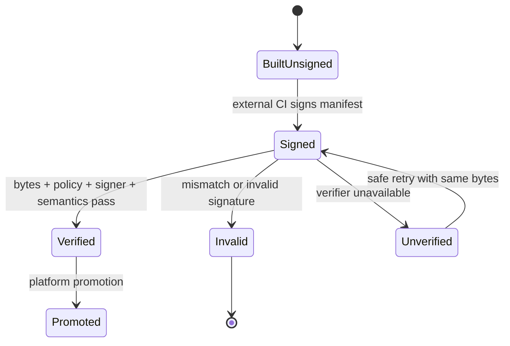
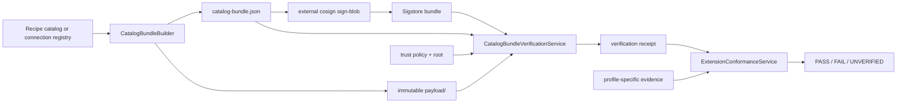

# Feature design: signed catalog bundles and extension conformance v1

- Status: IMPLEMENTED
- Owner: dpone maintainers
- Issue: Industrial Self-Service Airflow roadmap, Phase 4B
- Target release: TBD (Phase 4B)
- Last verified: 2026-07-17
- Approval: the maintainer requested autonomous completion of the frozen
  Industrial Self-Service Airflow roadmap.

## Executive summary

Phase 2 lets a platform team use exact local recipe pins, and Phase 1B keeps a
connection registry outside workload packs. Those controls prove byte identity
after the files are present, but they do not prove who published the catalog or
registry. Phase 4 also promises an extension conformance suite, but a generic
"plugin passed" badge would be dangerous unless the required evidence and the
meaning of `PASS` are closed and machine-readable.

This feature adds two platform-only capabilities without changing the beginner
journey:

1. A deterministic `dpone.catalog-bundle.v1` directory packages either one
   recipe catalog closure or one connection registry. CI signs the exact
   content manifest outside dpone with Sigstore/cosign. A local verifier checks
   signer identity, trusted root, every payload digest, schema, and semantic
   contract before producing a create-only verification receipt.
2. A closed extension conformance evaluator accepts one of four profiles:
   `airflow_provider`, `recipe_catalog`, `credential_resolver`, or `route`. Each
   profile has a fixed evidence checklist. Missing live evidence produces
   `UNVERIFIED`, never a synthetic `PASS`.

Recipe expansion remains build-plane-only. Connection registry bodies remain
restricted platform data. Airflow DAG parsing, task execution, Vault resolution,
and connector runtime do not fetch catalogs, execute templates, or verify
signatures.

## Personas and customer journey

| Persona | Goal | Current pain | Success signal |
|---|---|---|---|
| Data engineer | Use an approved recipe without understanding signatures | Trust mechanics could leak into the five-command path | Existing `dpone init pipeline --recipe ...` remains unchanged |
| Platform engineer | Promote a recipe catalog or registry from CI | Exact hashes do not establish publisher identity | One deterministic manifest is externally signed and verified before promotion |
| Extension author | Know the minimum evidence required for support | "Works locally" has no common meaning | A profile-specific report lists every required check and recovery action |
| Security engineer | Prevent unsigned or substituted platform inputs | Mutable directories and signer ambiguity permit substitution | Exact identity, issuer, root digest, payload digest, and policy are verified |
| Release auditor | Distinguish contract conformance from production certification | PASS/SKIP/live status can be conflated | Closed statuses and evidence digests make missing proof explicit |

### Catalog publisher journey

1. Validate the existing recipe catalog or connection registry locally.
2. Build a create-only catalog bundle in CI.
3. Sign only `catalog-bundle.json` with `cosign sign-blob --bundle ...`.
4. Publish the immutable directory plus Sigstore bundle.
5. In the target build/materializer plane, verify the bundle with an explicit
   local trust policy and pinned trusted root.
6. Retain the verification receipt and expose the verified payload directory to
   the existing recipe or deployment build path.
7. Never resolve or verify the bundle from Airflow parsing or a connector.

### Extension author journey

1. Select one documented conformance profile.
2. Run the profile's existing tests and producers.
3. Create a bounded request that references the exact evidence files and
   expected digests.
4. Run `dpone supply-chain extension-conformance`.
5. Fix `FAIL`, collect missing proof for `UNVERIFIED`, and publish the report.
6. Treat profile `PASS` as contract conformance only. Route and credential
   production claims still require approved live evidence.

## Scope

### In scope

- `recipe_catalog` and `connection_registry` catalog bundle kinds.
- One deterministic manifest plus a confined `payload/` directory.
- Exact byte SHA-256, bounded file count/size, canonical ordering, no symlinks,
  no traversal, create-only atomic publication, and idempotent rebuild.
- Existing recipe catalog closure validation and existing connection registry
  schema/security validation before a bundle can be built or verified.
- External Sigstore/cosign signing and local offline-capable verification.
- A generic blob-signature infrastructure port extracted from the existing
  route-attestation adapter, with route-compatible wrappers and error codes.
- Exact certificate identity, OIDC issuer, trusted-root digest, bounded cosign
  version range, timeout, and safe output handling.
- `dpone.catalog-trust-policy.v1` and
  `dpone.catalog-bundle-verification.v1`.
- Closed conformance profiles and `dpone.extension-conformance.v1` reports.
- Platform CLI, JSON/text output, structured errors, docs, tests, and evidence.

### Non-goals

- No new beginner command, authoring mode, recipe syntax, resolver, or runtime
  plugin system.
- No signing key, OIDC token, KMS credential, Vault token, or HMAC production
  identity inside dpone.
- No network fetch, OCI registry client, mutable `latest`, recursive discovery,
  or Airflow parse-time verification.
- No archive decompression. A bounded directory avoids zip/tar traversal and
  decompression-bomb behavior.
- No arbitrary bundle kinds or arbitrary conformance profiles in v1.
- No claim that a signed catalog is semantically correct merely because the
  signature is valid; content validation is independent and mandatory.
- No claim that local resolver/route tests are production certification.
- No connection registry body, Vault path, secret name, signer certificate, or
  subprocess output in normal text output.

### Assumptions and constraints

- An external artifact materializer places the complete immutable directory on
  local disk before verification. Network retry belongs to that materializer.
- Signing happens after deterministic bundle build and before promotion.
- Verification happens in CI/materializer/build plane, never in DAG parse.
- Existing recipe sources keep exact artifact pins, so unrelated catalog
  promotion cannot change existing pipeline semantics.
- Connection registry secret values remain absent; only logical resolver
  configuration may be bundled.
- A maximum of 1,001 payload files, 4 MiB per file, and 64 MiB total is
  sufficient for v1. The recipe catalog itself already limits entries to 1,000.
- The trusted root and Sigstore bundle are verification inputs, not bundle
  payload members and not part of the catalog bundle identity.

## Public contract

### CLI

Build a recipe catalog bundle:

```bash
dpone supply-chain catalog-bundle-build \
  --kind recipe_catalog \
  --source platform/recipes/catalog.yaml \
  --bundle-root .dpone/catalog-bundles \
  --publisher-id data-platform-recipes \
  --format json
```

Build a connection registry bundle:

```bash
dpone supply-chain catalog-bundle-build \
  --kind connection_registry \
  --source platform/connection-registries/prod.yaml \
  --bundle-root .dpone/catalog-bundles \
  --publisher-id data-platform-connections \
  --environment prod \
  --format json
```

The command prints the bundle ID and exact manifest path. CI signs the manifest:

```bash
cosign sign-blob --yes \
  --bundle catalog-bundle.sigstore.json \
  .dpone/catalog-bundles/sha256-*/catalog-bundle.json
```

Verify before promotion or local consumption:

```bash
dpone supply-chain catalog-bundle-verify \
  --bundle-dir .dpone/catalog-bundles/sha256-... \
  --sigstore-bundle catalog-bundle.sigstore.json \
  --policy platform/catalog-trust-policy.yaml \
  --trusted-root platform/sigstore/trusted-root.json \
  --output .dpone/catalog-verification/receipt.json \
  --format json
```

Evaluate one closed conformance request:

```bash
dpone supply-chain extension-conformance \
  --request extension-conformance-request.yaml \
  --output-dir test_artifacts/extension-conformance/my-extension \
  --format json
```

CLI rules:

- Exit `0` only for successful build, `verified`, or conformance `PASS`.
- Validation failure exits `1`, bad CLI/config exits `2`, unavailable verifier
  exits `3`, security/integrity violation exits `4`, internal failure exits `5`.
- Build and verification outputs are create-only and atomically published.
- Rebuilding identical content returns the same bundle and is a no-op after
  byte-for-byte verification.
- Existing non-empty output with different bytes is a conflict, never replaced
  by `--force`.
- Human output contains IDs, statuses, counts, and safe fixes only. JSON is the
  canonical audit output.

### Python API

The public implementation surface is capability-oriented and injected:

```python
class BlobSignatureVerifier(Protocol):
    def verify_blob(
        self,
        *,
        blob: bytes,
        sigstore_bundle: bytes,
        trusted_root: bytes,
        policy: CosignVerificationPolicy,
    ) -> BlobSignatureVerification: ...

class CatalogBundleBuilder:
    def build(self, request: CatalogBundleBuildRequest) -> CatalogBundleBuildResult: ...

class CatalogBundleVerificationService:
    def verify(self, request: CatalogBundleVerifyRequest) -> CatalogBundleVerification: ...

class ExtensionConformanceService:
    def evaluate(self, request: Mapping[str, object]) -> ExtensionConformanceReport: ...
```

`dpone.contracts` contains immutable contracts and canonical identities.
`dpone.ports` contains the blob-verification boundary. `dpone.adapters` owns
cosign subprocess execution. `dpone.services` owns bundle/content/conformance
policy. CLI modules only parse, compose, render, and map exits.

Existing route imports remain compatible. The route adapter delegates to the
generic blob verifier and maps generic results to route-specific stable codes.

### Manifest/schema

Bundle manifest:

```yaml
schema: dpone.catalog-bundle.v1
bundle_id: sha256:...
kind: recipe_catalog
publisher_id: data-platform-recipes
environment: null
entrypoint: payload/catalog.yaml
artifacts:
  - logical_id: catalog
    path: payload/catalog.yaml
    sha256: sha256:...
    size_bytes: 2048
  - logical_id: recipe/governed-orders@1.2.0
    path: payload/artifacts/sha256-...yaml
    sha256: sha256:...
    size_bytes: 4096
```

Trust policy:

```yaml
schema: dpone.catalog-trust-policy.v1
policy_id: production-platform-catalogs
allowed_kinds: [recipe_catalog, connection_registry]
allowed_publishers: [data-platform-recipes, data-platform-connections]
allowed_environments: [prod]
certificate_identity: https://github.com/acme/data-platform/.github/workflows/catalog.yml@refs/heads/master
certificate_oidc_issuer: https://token.actions.githubusercontent.com
trusted_root_sha256: sha256:...
verifier:
  minimum_version: 3.0.4
  maximum_version_exclusive: 4.0.0
  timeout_seconds: 30
```

Verification receipt:

```yaml
schema: dpone.catalog-bundle-verification.v1
decision: verified
code: DPONE_CATALOG_BUNDLE_VERIFIED
bundle_id: sha256:...
bundle_manifest_sha256: sha256:...
kind: recipe_catalog
publisher_id: data-platform-recipes
environment: null
policy_fingerprint: sha256:...
verified_artifacts: 8
verifier_version: 3.0.4
verified_at: 2026-07-16T12:00:00Z
errors: []
```

Conformance request:

```yaml
schema: dpone.extension-conformance-request.v1
profile: recipe_catalog
subject:
  id: data-platform-recipes
  version: 1.2.0
  digest: sha256:...
evidence:
  - check: bundle_verification
    artifact_ref: .dpone/catalog-verification/receipt.json
    sha256: sha256:...
    expected_schema: dpone.catalog-bundle-verification.v1
  - check: catalog_validation
    artifact_ref: test_artifacts/recipe/catalog-validation.json
    sha256: sha256:...
    expected_schema: dpone.extension-check-receipt.v1
  - check: scaffold_fixture
    artifact_ref: test_artifacts/recipe/scaffold-fixture.json
    sha256: sha256:...
    expected_schema: dpone.extension-check-receipt.v1
```

Conformance result statuses are uppercase `PASS`, `FAIL`, `UNVERIFIED`, and
`N/A`. Required checks cannot become `N/A`. `FAIL` dominates `UNVERIFIED`.

Closed required check sets:

| Profile | Required checks | Live required for PASS |
|---|---|---|
| `airflow_provider` | `public_contract`, `provider_discovery`, `airflow_matrix`, `package_smoke`, `parse_budget` | No |
| `recipe_catalog` | `bundle_verification`, `catalog_validation`, `scaffold_fixture`, `semantic_fingerprint` | No |
| `credential_resolver` | `contract`, `recovery`, `secret_redaction`, `runtime_isolation`, `live` | Yes |
| `route` | `route_contract`, `reconciliation`, `recovery`, `state_evidence_ordering`, `live` | Yes |

### Artifacts and evidence

```text
<bundle-root>/sha256-<hex>/
  catalog-bundle.json
  payload/
    ... exact files listed by the manifest
  _SUCCESS

<verification-root>/
  receipt.json

<conformance-output>/
  extension-conformance.json
  extension-conformance.md
```

`_SUCCESS` is written last. A directory without it is incomplete. Signature
bundles and trusted roots are stored beside platform trust configuration, not
inside the signed catalog payload.

### Compatibility and migration

- Existing local trusted recipe catalogs remain valid. Signed bundle use is an
  additive platform promotion path, not a new authoring source.
- Existing connection registry locations and deployment fingerprints do not
  change. Promotion copies or exposes only a verified payload; the deployment
  continues to fingerprint the exact registry bytes.
- Existing route-attestation public imports and error codes remain stable.
- The local HMAC supply-chain helper remains explicitly non-production and is
  not accepted by catalog verification.
- No automatic catalog upgrade or mutable alias is introduced.

## Detailed algorithm

### Bundle build

1. Resolve project root, source, and bundle root without following symlinks
   outside the root. Reject absolute/traversal paths and special files.
2. Read the source with bounded YAML limits.
3. For `recipe_catalog`, validate catalog shape, unique pins, every artifact
   byte digest, recipe/profile/component schema, and every recipe closure using
   existing recipe services.
4. For `connection_registry`, validate the registered v1 schema, environment,
   logical connection aliases, supported resolver contracts, and forbidden
   secret-value keys. Do not resolve credentials.
5. Create deterministic artifact descriptors. The entrypoint is first;
   remaining descriptors sort by `logical_id`. Payload filenames are derived
   from exact digest plus `.yaml`, not source directories.
6. Copy exact bytes into a private staging directory with create-only files.
7. Compute `bundle_id` from canonical manifest identity fields excluding
   `bundle_id` and all volatile provenance. `source_commit`, timestamps,
   signatures, and build IDs are not identity.
8. Write canonical pretty JSON manifest, verify every staged digest and size,
   then write `_SUCCESS` last.
9. Atomically rename staging to `sha256-<hex>`. If the destination exists,
   verify exact equivalence and return `no_op`; otherwise fail conflict.

### External signing

1. CI signs only `catalog-bundle.json` exact bytes.
2. CI stores the Sigstore bundle separately.
3. dpone never receives a private key or OIDC token.
4. Signing failure leaves an unsigned but immutable build artifact that cannot
   pass verification or promotion.

### Bundle verification

1. Require `_SUCCESS`, manifest, policy, Sigstore bundle, and trusted root.
2. Enforce per-file and total byte limits before parsing.
3. Parse manifest/policy with duplicate-key rejection and exact v1 schemas.
4. Recompute `bundle_id`, policy fingerprint, manifest digest, and trusted-root
   digest. Reject any mismatch before invoking cosign.
5. Enforce allowed kind, publisher, and environment.
6. Resolve every manifest path under the configured bundle root. Reject absolute
   paths, traversal, symlinks, devices, missing files, duplicates, unlisted
   payload files, size mismatch, or digest mismatch.
7. Invoke the injected blob verifier with fixed arguments, a sanitized
   environment, private temporary files, bounded output, timeout, exact
   identity/issuer, pinned root, and certified version range.
8. Independently re-run recipe or registry semantic validation against the
   verified local payload.
9. Produce `verified`, `invalid`, or `unverified`. `invalid` means bytes/policy/
   signature contradict the contract; `unverified` means the verifier or
   required external dependency is unavailable.
10. Atomically create the receipt. Never replace an existing different receipt.

### Conformance evaluation

1. Read a bounded request and validate the closed profile and subject identity.
2. Select the built-in profile policy; no entry points or dynamic imports are
   loaded from the request.
3. Require every named check exactly once and reject unknown/duplicate checks.
4. Confine each evidence path, verify exact bytes and SHA-256, parse the
   expected schema, and derive its status from the receipt itself.
5. A catalog verification receipt passes only when `decision=verified` and its
   bundle ID equals the conformance subject digest.
6. A generic extension check passes only with schema
   `dpone.extension-check-receipt.v1`, matching subject digest, `status=PASS`,
   and non-empty producer/command metadata.
7. Any malformed/digest-mismatched/explicitly failed evidence yields `FAIL`.
   Missing, skipped, unavailable, or live-unapproved evidence yields
   `UNVERIFIED`.
8. Compute `conformance_id` from profile, subject, and sorted evidence digests;
   exclude timestamps and output paths.
9. Write JSON and Markdown atomically. Do not publish `PASS` if any required
   evidence is not `PASS`.

### Pseudocode

```text
build(source, kind):
  source_bytes = confined_bounded_read(source)
  semantic_inputs = validate_and_collect(source_bytes, kind)
  descriptors = canonical_descriptors(semantic_inputs)
  identity = fingerprint(kind, publisher, environment, entrypoint, descriptors)
  stage exact bytes -> verify bytes -> write manifest -> write _SUCCESS
  atomic_publish(identity)

verify(bundle, signature, policy, root):
  require_complete_and_bounded(bundle)
  manifest = parse_exact_schema(bundle.manifest)
  verify_identity_policy_paths_digests(manifest, policy, root)
  signature_result = blob_verifier.verify_blob(manifest_bytes, signature, root, policy)
  if signature_result != verified: emit safe non-pass receipt
  validate_semantics(manifest.kind, manifest.entrypoint, manifest.artifacts)
  emit create_only verified receipt

conformance(request):
  profile = BUILT_IN_PROFILES[request.profile]
  for required_check in profile.required_checks:
    evidence = exact_named_evidence(request, required_check)
    result = verify_digest_schema_subject_and_status(evidence)
  status = FAIL if any fail else UNVERIFIED if any non-pass else PASS
  emit content-addressed report
```

### State machine



### Failure and recovery

| Failure | Result | Recovery |
|---|---|---|
| Source changes during build | `DPONE_CATALOG_SOURCE_CHANGED` | Re-plan/rebuild from a stable commit |
| Existing ID has different bytes | `DPONE_CATALOG_BUNDLE_CONFLICT` | Investigate producer; never overwrite |
| Missing `_SUCCESS` | `DPONE_CATALOG_BUNDLE_INCOMPLETE` | Re-materialize exact bundle |
| Digest/size/path mismatch | `DPONE_CATALOG_BUNDLE_INTEGRITY_FAILED` | Discard local copy and sync by digest |
| Signer/policy mismatch | `DPONE_CATALOG_BUNDLE_SIGNATURE_INVALID` | Use approved workflow identity/policy |
| Cosign unavailable/timeout | `DPONE_CATALOG_VERIFIER_UNAVAILABLE` | Restore certified verifier and retry |
| Semantic catalog invalid | `DPONE_CATALOG_CONTENT_INVALID` | Publish a new corrected bundle |
| Required conformance evidence absent | `UNVERIFIED` | Run the documented producer; do not waive |
| Required evidence explicit failure | `FAIL` | Fix extension and regenerate evidence |

Retries are safe because bundle identity is content-addressed and receipts are
create-only. Cancellation removes only private staging/temp files. Published
bundles are immutable. Rollback points consumers to a previously verified
bundle; it never mutates a published bundle.

## Architecture

### Components and responsibilities

| Component | Existing/new | Responsibility | Dependencies |
|---|---|---|---|
| `RecipeCatalogOperations` | Existing | Validate exact recipe closure | Manifest confined readers |
| `GitOpsSchemaValidator` | Existing | Validate connection registry contract | Registered schema contracts |
| `CatalogBundleBuilder` | New | Deterministic bundle planning/publication | Injected content validators/filesystem |
| `CatalogBundleVerificationService` | New | Integrity, trust policy, semantic decision | Blob verifier port + validators |
| `BlobSignatureVerifier` | New extracted port | Vendor-neutral blob verification boundary | Pure contracts only |
| `CosignBlobSignatureVerifier` | New adapter | Fixed bounded cosign execution | subprocess/temp files |
| Route cosign wrapper | Compatibility refactor | Preserve route API/codes | Generic adapter |
| `ExtensionConformanceService` | New | Closed profile evidence aggregation | Confined evidence reader |
| Supply-chain command facade | New thin commands | Parse/compose/render/exit mapping | Services |

### Data and control flow



### SOLID, DRY, KISS, and dependency direction

- **SRP:** build, cryptographic verification, semantic validation, conformance
  aggregation, and CLI rendering are separate.
- **OCP without speculation:** blob verification is one narrow port because two
  real use cases already exist (route and catalog). Catalog kinds/profiles stay
  closed enums instead of a generic plugin registry.
- **LSP/ISP:** route and catalog consume the same small blob verifier result;
  neither depends on subprocess details.
- **DIP:** services depend on ports and injected validators; adapters depend on
  contracts, never on services or commands.
- **DRY:** fixed cosign invocation, version bounds, private temp files, sanitized
  environment, and bounded output have one implementation.
- **KISS:** a signed JSON manifest plus plain files is used instead of OCI,
  archives, online transparency lookup, or a second package manager.

### Alternatives and tradeoffs

| Alternative | Advantages | Disadvantages | Decision |
|---|---|---|---|
| Sign every YAML file | Fine-grained signatures | Many signatures, identity drift, poor UX | Reject; sign one digest manifest |
| Sign tar/zip bundle | Single transport object | Traversal/decompression attack surface | Reject in v1 |
| Verify in Airflow provider | Immediate scheduler visibility | Parse I/O, latency, secrets/trust coupling | Reject |
| Reuse route-specific verifier directly | Small diff | Leaks route terminology/codes into catalogs | Reject; extract narrow generic port |
| Arbitrary conformance plugins | Extensible | Executes untrusted code and hides PASS meaning | Reject; four closed profiles |
| Local HMAC | Easy offline tests | Shared secret and no publisher identity | Test evidence only, never production |

### ADR requirement

ADR 0021 is required because this feature establishes a reusable trust boundary,
defines which bytes are signed, and fixes parse/runtime exclusion rules.

### Quality-budget impact

- New production modules target at most 250 SLOC each and one responsibility.
- No module may exceed the repository hard limit in
  `docs/benchmarks/quality_budgets.yml`.
- Commands import services only; ports do not import adapters; adapters do not
  import manifest/runtime.
- The generic cosign extraction must not duplicate subprocess policy or grow the
  current route adapter.

## Market comparison

Checked 2026-07-16 against current official primary sources.

| System/version | Relevant capability | Observed design | Adopt/reject | Source/date |
|---|---|---|---|---|
| dlt 1.29 | Verified source catalog | Maintained sources are separately distributed and tested against real APIs | Adopt curated/tested catalog idea; reject copying mutable source code into an existing pipeline as promotion identity | [dlt verified sources](https://dlthub.com/docs/dlt-ecosystem/verified-sources), 2026-07-16 |
| Airbyte current | Connector validation/conformance | Validation tests check protocol, records, state, errors, and schemas; regression tests compare versions | Adopt standardized evidence categories; reject one undifferentiated connector badge | [Airbyte connector testing](https://airbyte.com/blog/how-we-test-airbyte-and-marketplace-connectors), 2026-07-16 |
| Fivetran Connector SDK 2.x | Extension build/test/deploy | Authors test locally then deploy code; hosted runtime owns execution and secrets | Adopt explicit local-test/deploy stages; reject coupling dpone extension artifacts to one hosted runtime | [Connector SDK](https://fivetran.com/docs/connector-sdk), 2026-07-16 |
| Astronomer Blueprint Preview | Reusable workflow blocks | Platform Python exposes bounded parameters to YAML/no-code users | Adopt self-service parameter hiding; reject scheduler-visible arbitrary Python recipes | [Blueprint overview](https://www.astronomer.io/docs/learn/blueprint-overview), 2026-07-16 |
| Apache Beam current | I/O standards/conformance | Prescribes unit, integration, performance tests and warns connector defects can cause data loss/duplication | Adopt layered conformance and live distinction | [Beam I/O standards](https://beam.apache.org/documentation/io/io-standards/), 2026-07-16 |
| Informatica | N/A | Managed marketplace trust does not define an OSS local signed recipe/registry bundle contract relevant to this slice | N/A |
| Pentaho | N/A | Plugin packaging is not the declarative build-plane catalog boundary being designed | N/A |
| Microsoft SSIS | N/A | Deployment packages are runtime-specific and do not address Airflow parse-safe declarative catalogs | N/A |
| gusty | N/A | DAG generation helper, not a signed ETL catalog/conformance authority | N/A |
| Astronomer Cosmos | Partially relevant | Parses pinned dbt artifacts/projects into Airflow tasks | Existing Phase 1-3 comparison covers parse mode; no additional signing pattern adopted here | [Cosmos/dbt orchestration](https://www.astronomer.io/docs/learn/airflow-dbt/), 2026-07-16 |

Security sources:

- Sigstore recommends a blob bundle containing signature/certificate/log proof
  and verification with exact certificate identity and issuer:
  [signing blobs](https://docs.sigstore.dev/cosign/signing/signing_with_blobs/),
  [verifying signatures](https://docs.sigstore.dev/cosign/verifying/verify/).
- GitHub states that generating an attestation alone provides no benefit unless
  the signature, timestamps, and signer identity are verified:
  [artifact attestations](https://docs.github.com/en/actions/concepts/security/artifact-attestations).

## Measurable differentiation

```yaml
axis: deterministic signed catalog promotion without Airflow parse side effects
scenario: build and verify a 1000-entry recipe catalog twice, then parse 100 DAGs
baseline: current Phase 2 trusted local catalog without publisher proof
metric:
  - independent build bundle-id equality
  - substituted-byte detection
  - parse-time network/secret/subprocess calls
  - verification p95
target:
  - identical bundle_id across independent builds
  - 100% one-byte substitutions rejected
  - 0 parse-time network/secret/subprocess calls
  - p95 local integrity verification <= 2 seconds excluding cosign startup
procedure: deterministic fixture build, mutation corpus, parse benchmark, 20 verification repetitions
artifact: test_artifacts/signed-catalog-extension-conformance-v1/benchmark.json
limitations: does not establish live connector correctness or compare hosted marketplace operations
```

## Security, privacy, and operations

- Bundle payload rejects secret-value keys and never contains credentials.
- Connection registry paths are infrastructure-sensitive: normal text shows
  only bundle/publisher/environment IDs; registry body is role-restricted.
- Cosign receives fixed argv, no shell, sanitized environment, bounded output,
  private temp files, timeout, and pinned version policy.
- Trusted root digest is verified before subprocess execution.
- Signatures prove publisher identity and exact bytes, not semantic safety;
  semantic validation remains mandatory.
- No online verification is required when a complete Sigstore bundle and
  trusted root are supplied.
- Metrics: build/verify duration, artifact count/bytes, decision/code, profile
  status. Never label metrics with file paths, connection refs, or signer
  certificate bodies.
- Alerts: invalid signature/integrity are security alerts; unavailable verifier
  is operational; repeated bundle conflict is a publisher incident.

## Test and certification plan

| Layer | Scenario | Environment | Expected artifact |
|---|---|---|---|
| Unit | canonical identity, ordering, limits, state precedence | local | pytest |
| Contract | all six schemas and stable codes/statuses | local | schema report |
| Integration | recipe and registry build/verify with fake blob verifier | local | verification receipts |
| Security | traversal, symlink, substitution, secret key, malicious stderr, timeout | local | pytest |
| Compatibility | route adapter legacy imports/codes; existing unsigned catalogs | local | pytest |
| Conformance | four closed profiles, missing/live/failed evidence | local | reports |
| Performance | 1000 entries / 64 MiB bounds and deterministic rebuild | local fixed runner | benchmark JSON |
| Live | real keyless Sigstore identity/root and restricted registry storage | approved CI only | signed receipt; otherwise UNVERIFIED |

Required negative cases include duplicate JSON/YAML keys, duplicate logical IDs,
case/path normalization collision, path traversal, symlink escape, special file,
missing/extra payload file, wrong size/digest, source mutation during build,
partial staging directory, missing `_SUCCESS`, unsupported kind/profile, wrong
publisher/environment/identity/issuer/root/version, corrupt Sigstore bundle,
cosign timeout/missing executable/oversized output, secret value keys, forged
conformance status, evidence subject mismatch, and required live evidence marked
`SKIP`/`N/A`.

Real Sigstore, Vault, Kubernetes, MSSQL, and ClickHouse checks are `UNVERIFIED`
until an approved environment executes them. They are never inferred from fakes.

## Documentation plan

- Platform tutorial: build, externally sign, verify, and promote a catalog.
- Reference: all schemas, CLI, statuses, limits, and error codes.
- Architecture: build/materializer trust boundary and parse/runtime exclusion.
- Runbook: invalid signature, unavailable verifier, bundle conflict, rollback,
  root rotation, and evidence retention.
- Extension author guide: four profiles and exact evidence checklist.
- Recipe guide: existing beginner command remains unchanged.
- Compatibility guide and changelog: additive signed promotion path and route
  adapter compatibility.

## Rollout and rollback

1. Land generic blob verifier extraction with route regression tests.
2. Land bundle build/verify and schemas behind platform-only commands.
3. Run local fake-verifier security corpus and exact route tests.
4. Run one approved Sigstore CI verification before production designation.
5. Land conformance reports and CI artifact upload.
6. Rollback by selecting the previous verified bundle ID and reverting the
   feature commit; never mutate or re-sign an existing bundle ID.

Promotion policy may require signed bundles per environment, but existing local
catalog behavior remains available during migration. A future breaking policy
that forbids unsigned catalogs requires a separate deprecation plan.

## Agent execution plan

| Agent/role | Owned paths | Read-only paths | Forbidden paths | Dependency |
|---|---|---|---|---|
| Explorer/reviewer | repository read-only | all relevant code/docs | all writes | before/after implementation |
| Implementer | contracts/ports/adapters/services/commands/schemas/tests/docs listed in task contract | route and recipe implementation | unrelated runtime/connectors | approved spec |
| Integrator | shared registries, changelog, nav, generated refs, final validation | full diff | `.cursor/**` | implementer complete |

Fresh-context review is mandatory before merge. If the orchestrator cannot
create a reviewer, report it as `UNVERIFIED`; do not call it PASS.

## Approval checklist

- [x] User problem and CJM are clear.
- [x] Algorithm and failure semantics are implementable without guessing.
- [x] Public contracts and compatibility are explicit.
- [x] Architecture and alternatives are justified.
- [x] Relevant market research uses current official sources.
- [x] Claimed differentiation is measurable.
- [x] Tests, evidence, docs, rollout, and rollback are complete.
- [x] Path ownership and integration plan are conflict-safe.
- [x] Maintainer authorized autonomous implementation of the frozen roadmap.

## Implementation evidence

- Validation and residual-risk report:
  `test_artifacts/signed-catalog-extension-conformance-v1/validation-report.md`.
- Completion report:
  `test_artifacts/signed-catalog-extension-conformance-v1/completion-report.md`.
- 1,000-entry deterministic benchmark:
  `test_artifacts/signed-catalog-extension-conformance-v1/benchmark.json`.
- Closed-profile contract fixture reports:
  `test_artifacts/signed-catalog-extension-conformance-v1/conformance-fixture/`.
- Governance receipt:
  `test_artifacts/signed-catalog-extension-conformance-v1/agent-governance-gate.json`.

The local implementation and non-live gates pass. Real keyless Sigstore
verification remains `UNVERIFIED` because no approved CI identity and trusted
root were available. Fresh-context reviewer evidence also remains `UNVERIFIED`
because the orchestrator returned `agent thread limit reached`; neither item is
represented as a local `PASS`.
