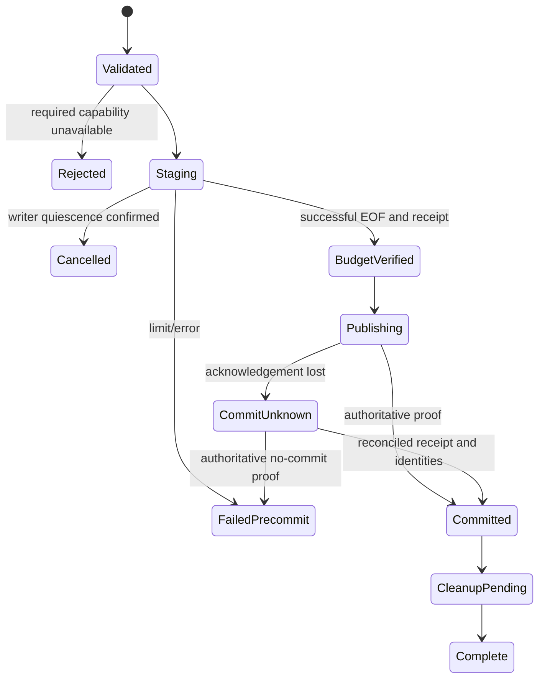

# Feature design: full-refresh resource safety and recoverable publication

Purpose: give data engineers and operators an enforceable snapshot-size contract
and an exact recovery path. This is a researched proposal, not currently
available configuration. Start with the [roadmap](sqlserver-snapshot-roadmap.md).

- Status: RESEARCHED; unresolved choices require maintainer approval.
- Owner: maintainers; issue: none; target release: TBD.
- Last verified: 2026-09-09.
- Baseline: `6533c27fbf77c78a00b8013bcf72e2293e281e1f`.

## Executive summary, scope and personas

The dbt full-refresh size policy reaches compile artifacts but is dropped while
building runtime configuration. Separately, generic ClickHouse replacement uses
a multi-rename operation that does not establish the documented atomicity
contract. Both deserve correctness work before performance tuning. Temporary
object lifecycle needs a scoped ownership/recovery audit; retained stages after
an unknown commit are deliberate protection, not automatically defects.

| Persona | Goal | End-to-end success signal |
|---|---|---|
| Data engineer | Know what a declared byte limit actually controls | Plan and runtime receipt share metric, value, scope and digest |
| Platform engineer | Reject unsupported mandatory safety controls | Admission fails before work starts; no silent telemetry fallback |
| Operator | Distinguish failed load from committed load with cleanup pending | Exact outcome and safe recovery instruction, without blind retry |
| Connector author | Add a second measured transport without changing policy | Same typed measurement receipt and publication gate |

Discover route/certification status → configure a synthetic workload → inspect
metric/unit/limit and namespace → execute → observe bytes and publication outcome
→ diagnose exceedance/unknown measurement → clean or reconcile exact owned
resources → retry only a safe state → upgrade old explicit limits deliberately.

In scope: generic full-refresh transfer from dbt policy into native runtime,
initial MSSQL-to-ClickHouse route tests, typed measurement/evidence, engine-aware
publication and exact resource lifecycle. Other native routes adopt the guard
only after capability tests. Non-goals: RAM/database/log control through one byte
number, cross-database transactions, CDC redesign, arbitrary cleanup, automatic
limit increases, compact-delivery or runtime wire-v2 implementation.

## Baseline authoring-to-runtime trace

All source references below are at the baseline. A code trace is not live
execution proof; the two failing contract boundaries were reproduced offline.

| Boundary | Repository evidence | Observed behavior |
|---|---|---|
| Authoring | `src/dpone/contracts/dbt_publish_schema_contract_policy.py:197–211` | Positive integer max_source_bytes, maximum signed 64-bit value |
| Public policy schemas | `docs/schemas/dbt/dpone.dbt-publish-policy.v1.schema.json:419`, v2 `:520`, v3 `:417` | Field published |
| Parse | `src/dpone/manifest/dbt_publish_profiles.py:88`, `:242–269`; `src/dpone/contracts/dbt_publish_models.py:176` | Policy validation and full_refresh_max_source_bytes |
| Plan | `src/dpone/services/dbt_publish_planning.py:60`, `:205–224` | Requires budget and labels bounded full refresh |
| Compile | `src/dpone/services/dbt_publish_model_compiler.py:106–121`, `:289` | Generated sink.strategy retains limit; no kind field |
| Compile evidence | `src/dpone/contracts/dbt_publish_models.py:217` | resolved_strategy carries advertised limit |
| YAML / pack | `src/dpone/services/dbt_project_artifacts.py:146–157` | Serializes model manifest, then builds transfer pack |
| Load routing | `src/dpone/manifest/loader.py:83–88`, `:130–157` | Kind-less generated manifest follows legacy single path |
| Runtime configuration | `src/dpone/dag/process_config_parser.py:53`; `src/dpone/dag/load_config_builder.py:202–227`, `:287–357`; `src/dpone/config/load_config.py:22` | Selected fields copied; no budget retained in LoadConfig |
| Runtime execution | `src/dpone/runtime/etl/processor.py:181–193`; `src/dpone/runtime/sinks/clickhouse_staged_load.py:133`, `:203` | Extraction/load/publication consumes budget-free configuration |
| Separate schema mismatch | `src/dpone/schema/etl-batch-manifest.schema.json:2426–2431` | Strategy disallows extra properties and does not declare max_source_bytes |

Do not claim schema rejection universally prevents unsafe execution: the traced
single-manifest path does not establish that schema as a mandatory runtime gate.
Do not claim complete pack execution was tested: artifact handoff was inspected,
while configuration loss and schema rejection were reproduced directly.

Existing `tests/test_dbt_inline_publishing.py:409–439` verifies the compile report
strategy only. `src/dpone/runtime/byte_stream_artifacts.py:90–100` counts chunk
bytes; `src/dpone/runtime/native_transfer_evidence.py:44–66` records transfer bytes;
`src/dpone/runtime/consumed_payload_evidence.py:30`, `:292` verifies artifact size.
None establishes this policy's enforcement or metric semantics. Separate bounded
semantic-refresh `maximum_source_bytes` checks in
`src/dpone/contracts/dbt_semantic_refresh_source_proof.py:69`, `:120` are not this
execution path and must not be duplicated.

## Metric decision and proposed public contract

| Candidate | Purpose / strength | Limitation / decision |
|---|---|---|
| Logical value bytes | Comparable across formats if a canonical typed codec exists | Needs precise null, type, nested and encoding rules; defer a new canonical codec |
| Uncompressed serialized payload | Measurable at extraction boundary; reproducible with frozen framing | Format-dependent; recommended first metric, pending approval |
| Wire/compressed bytes | Network allowance and retry cost | Compression changes result; separate telemetry/optional future budget |
| Local staging footprint | Disk occupied by concurrent artifacts/generations | Separate local capacity guard; does not bound server files/log |

Candidate measurement identifier: `serialized_payload_v1`. It means exact bytes
of the explicitly identified serializer output before compression. Freeze
format version, encoding, row/schema framing and inclusion rules in the plan.
For text, record UTF-8 and exact escaping/newline/delimiter rules; for binary,
record serializer version and framing. Headers count when emitted; rows are not
re-encoded to estimate size. A format switch changes the measurement identity
and invalidates resume/old receipt reuse. Empty row input measures the actual
serialized output, including any required header: zero only for a serializer
that emits no bytes. It is never inferred from missing telemetry.

This recommends an initial metric without assigning an undocumented meaning to
historical max_source_bytes. Before approval, select the first supported
serializer/route and freeze its exact profile in the narrow implementation spec.
A transparent native protocol without an observable pre-compression boundary
must reject this mandatory metric until a trustworthy producer exists.

Proposed semantic fields (not a current YAML schema): `metric`, `metric_version`,
`serializer_profile`, `max_bytes`, `required`, and policy digest. Max bytes is a
strict positive integer in bytes, not a float or ambiguous MB string; equality
passes, greater-than fails. Initial dbt explicit budget is always required.
No new user-facing optional flag may downgrade an already-required policy.

Scope is the complete extracted result for one workload/source snapshot attempt,
across chunks and partitions, before filtering/quarantine or sink coercion can
make the admitted source volume smaller. Source-side dbt materialization can
precede extraction: this guard cannot limit that work, SQL data files, tempdb,
transaction log, or already allocated producer memory. Such resources need
separate preflight/reservations and platform limits.

CLI/Python reuse existing entrypoints and typed runtime config. Preserve existing
exit/output conventions, atomic UTF-8 artifact writing and non-interactive error
handling; add registered error classifications for unavailable measurement,
exceeded budget, stale receipt and ownership conflict. A plan must distinguish
`enforcement_available` from `ENFORCED`, which only runtime completion can prove.
Evidence records metric/profile, limit, accepted bytes, observed bytes up to
failure, EOF/completeness, attempt/policy/payload identity, publication state and
cleanup outcome. Budget statuses proposed: ENFORCED, EXCEEDED, UNAVAILABLE and
NOT_CONFIGURED. These are not substitutes for route-certification PASS.

## Algorithm, state and concurrency

```text
parse policy and retain it through serialization/runtime hydration
validate metric support before extraction; reject unavailable required control
acquire source snapshot identity and exact stage/publication authority
persist stage ownership; admit independent capacity requirements
for each authenticated source chunk:
    measure uncompressed serialized bytes at the declared boundary
    atomically reserve bytes before forwarding to the next stage
    if reservation would exceed max_bytes:
        cancel producer, quiesce writers, abort owned stage, fail with evidence
    record reservation and ordered chunk identity before forwarding
    forward chunk once; record acknowledged delivery
on successful EOF:
    seal receipt against completed content/stage identity
    verify schema, data quality, budget and publication authority
    publish using an admitted primitive
    persist/read back commit proof; only then advance source state
    cleanup only exact eligible objects; preserve recovery evidence
```



Use one atomic counter/reservation authority per full snapshot, including
concurrent partition workers; per-worker limits cannot enforce the total. Bound
producer buffers independently and allow no forwarding of a chunk that crosses
the cap. A large record may already have been allocated upstream, so do not
advertise a RAM bound. Reader/subprocess cancellation must wait for writer
quiescence before destructive cleanup.

Initial release restarts extraction under a fresh attempt; no partial source
resume is admitted without stable snapshot identity and durable accounting.
Count repeated rows as data, even when bytes are identical. Within an attempt,
transport retries may reuse only authenticated chunk identity/offset/digest
when the transport proves no duplicate delivery or provides idempotent delivery.
Reservation state is RESERVED before forwarding and DELIVERED after confirmed
acknowledgement. Any crash or failure between these states is delivery-unknown:
the minimum implementation quiesces writers, abandons the exact owned stage, and
starts a fresh attempt/stage. It must not refund the counter and resend into an
ambiguous stage. Physical retransmission bytes are a separate counter. Never deduplicate by
content hash alone. A different snapshot or policy digest starts a fresh attempt;
concurrent attempts cannot publish to the same target without fencing. A total
network-cost ceiling across retries is a different future policy.

Unknown EOF, truncated stream, counter overflow, unsupported profile, missing
receipt or inconsistent totals fail closed before publication. Empty results
still require successful EOF and independent empty-input policy. Failures after
publication require commit reconciliation, not an automatic rerun. No budget
breach advances source checkpoint or produces successful completion evidence.

## Publication and lifecycle contract

Generic ClickHouse full refresh currently calls the swap helper at
`src/dpone/runtime/sinks/clickhouse_staged_load.py:203–209`, implemented with
multi-entity rename and immediate backup drop at
`src/dpone/runtime/sinks/clickhouse_sink.py:207–220`.
The [official RENAME contract](https://clickhouse.com/docs/reference/statements/rename)
does not provide multi-entity atomicity. The proposed minimum correction admits
single-pair EXCHANGE only on proven compatible database engines, using exact
before/after UUIDs and a recoverable journal; unsupported topology fails closed.
A missing target uses an independently verified create/rename publication branch.
This is not a promise of atomic cluster-wide publication. See the
[research register](sqlserver-snapshot-research.md#primary-source-register-and-design-decisions).

Publication retries must read the actual before/after mapping and durable
receipt. Repeating EXCHANGE blindly can restore the old target. Bind a prepare
record to target UUID, stage UUID, expected generation and fenced lease; after
acknowledgement loss, read catalog under authority and classify only exact known
mappings. All other mappings remain COMMIT_UNKNOWN and require reconciliation.
Keep old target through an explicit retention horizon, not immediate deletion.
Rollback after committed replacement requires the same identity/fence checks and
proof that no later generation or writes would be overwritten; otherwise reject.

Existing MSSQL transaction finalization already provides serializable mutation,
catalog/authority revalidation and receipts
(`src/dpone/runtime/sinks/strategies/mssql/mssql_transaction_finalizer.py:127`, `:237`). Its stage
consumer retains unknown-commit stages and handles BaseException cleanup
(`src/dpone/runtime/sinks/strategies/mssql/mssql_staging_consumer.py:141–151`). Reuse this behavior;
do not replace it with generic rename logic.

Existing ClickHouse finalization intentionally distinguishes retained stage and
post-commit cleanup failure (`clickhouse_staged_load.py:100–108`). Existing bounded
semantic-refresh cleanup binds UUIDs and ownership comments
(`src/dpone/adapters/semantic_refresh_clickhouse_cleanup.py:99`). Those protections
are reference patterns, not proof of generic-route lifecycle coverage.

### Exact ownership, namespaces and crash recovery

Persist resource purpose, qualified name, created object identity, run/attempt,
policy/design digest, lease/fencing token, creation state, writer status and
retention deadline. Record create intent before mutation and bind actual catalog
identity afterwards; crash between creation and binding requires reconciliation,
not inference from a similar name. If ownership cannot be proven, retain and
report conflict.

Generic names currently use random suffixes
(`src/dpone/runtime/sinks/clickhouse_operation_tables.py:28`); named cleanup at
`src/dpone/runtime/sinks/clickhouse_sql_mixin.py:127` does not by itself prove UUID
ownership. This is an audit candidate for the complete call chain, not proof of
a foreign-object deletion incident.

Reuse configurable `staging_schema` (`clickhouse_operation_tables.py:22`). The
default resolves to the target database; explicit namespace selection already
exists. Future test harness uses explicitly allowed neutral `test_sink` and
`test_stage` namespaces with exact per-run inventory. Never drop a shared schema,
run prefix sweep, or delete by age/name resemblance.

Cleanup is idempotent only for an object proven eligible by identity and terminal
state. Missing object is success only when absence is allowed by the recorded
cleanup step; missing retained target during recovery can be an error. UUID or
lease mismatch blocks. A stale artifact becomes eligible after retention,
terminal publication proof and writer quiescence, not elapsed time alone. A
cleanup failure preserves primary outcome and yields CLEANUP_PENDING with a safe
retry instruction. Process crash resumes the journal; it cannot execute finally
blocks. Retention expiry never grants authority to delete unowned objects.

### Capacity preflight

Inventory separate local and remote resources: extraction/spool, decoded stage,
projection stage, new target, retained old target, rebuild/sort space, tempdb and
log. For each, expose estimated peak, measurement time, free/quota capacity,
reservation or headroom, and uncertainty. Avoid double-counting shared volumes;
account for concurrent admitted work and retained generations. A mandatory
unknown capacity proof blocks, while an optional estimate is explicitly advisory.
Free-space sampling alone is not a reservation or guarantee against other
workloads. Reject insufficient capacity; never auto-increase the byte limit or
change recovery model/compression to force admission.

## Architecture, migration and alternatives

Reuse `ByteStreamArtifact` for measurable serialized streams, existing consumed
payload/evidence writers, runtime transaction finalizers and dbt composition
roots. Add only a typed budget contract and a cohesive accounting guard plus
publication-gate input; inject measurement producer, counter, clock and evidence
store through the existing roots. Policy must not import driver/SDK types. A
second transport implements the same capability or reports unavailable. Do not
reuse heterogeneous throughput telemetry as the enforcement authority.

Shared serialization/config/evidence ownership remains with one integrator.
`LoadConfig` is a compatibility surface: adapt via canonical contracts rather
than adding domain policy to legacy facades. An ADR is required for byte metric,
receipt ordering and recoverable publication. Actual module/graph changes must
meet [quality budgets](benchmarks/quality_budgets.yml); no speculative plugin
framework or unrelated refactor is proposed.

| Alternative | Assessment |
|---|---|
| Merely add the key to JSON Schema | Makes an ignored limit look supported; reject |
| Enforce final compressed file size | Wrong metric unless explicitly chosen; reject as default |
| Check after target publication | Too late for safety; reject |
| Estimate with SELECT COUNT or average row size | Useful estimate, never exact byte enforcement |
| First fail closed for explicit unsupported budgets | Small safe bridge; recommended before full accounting implementation |
| Durable resumable per-chunk ledger immediately | Higher complexity; defer until stable snapshot identity is available |

Migration sequence: first reject previously explicit but unenforced budgets at
runtime admission with actionable explanation; next add the approved metric and
end-to-end support atomically. Previously unbudgeted generic manifests remain
valid with NOT_CONFIGURED and must not be described as bounded. Previously
explicit dbt budgets must be migrated with an explicit metric selection or
rejected—no silent reinterpretation or ignored key. Schema, parser, hydration,
pack compatibility and runtime gate must ship together for the new metric.
Old runtime readers must reject a plan requiring unsupported enforcement;
producer/runtime capability negotiation cannot assume identical versions.

Rollback disables newly admitted options and retains fail-closed protection.
Do not roll back to silently ignoring a declared limit. Existing published data
is not automatically reverted when configuration support is rolled back.
Compact-delivery/wire-v2 work is a dependency and integration-test boundary only:
assert the existing authoritative identity survives pack/runtime handoff, but
change none of that workstream's files in these PRs.

## Tests, diagnostics, documentation and rollout

| Stage | Required acceptance | Release/rollback control |
|---|---|---|
| P0a fail-closed/schema coherence | Every explicit budget either reaches an enforcing runtime or is rejected; no advertised bounded execution without support | Safety bridge first; preserve old unbudgeted manifests; rollback keeps rejection |
| P0b accounting | Authoring→compile→YAML→pack→hydration→receipt round trip; N-1/N/N+1; framing/Unicode/null/binary; overflow; EOF failure; concurrent reservation; failure between reservation/forward/acknowledgement; no publication after breach | Opt-in supported serializer/route; disable route admission on regression |
| P0c publication | Old/new visibility and exact UUID mapping; empty target; acknowledgement loss; no double exchange; unsupported engine blocked | Independent correctness PR; retain journal/old generation on uncertainty |
| P1 lifecycle | Create-intent crash, cancel/kill, stale lease, owner mismatch, missing/replaced object, cleanup failure, retry/retention | Dry-run inventory then bounded cleanup; no blanket deletion |
| P1 diagnostics | Correct CLI exit/stdout/stderr/JSON/file behavior and Python parity; explicit accepted versus observed bytes; NOT_CONFIGURED versus ENFORCED | Version evidence additively; keep original error plus cleanup outcome |

Offline unit/contract tests and mock failure injection must run before broader
checks. Live certification remains UNVERIFIED until an approved dedicated
MSSQL/ClickHouse environment proves real row preservation, concurrent-reader
visibility, driver cancellation, permissions, process crash, ambiguous network
outcome and resource measurements. Bind evidence to exact source/sink/strategy/
transport/schema-evolution/runtime variant, engine versions, commit and
configuration. Mock success never promotes route certification.

Implementation documentation includes a metric reference, synthetic first-run
example, capacity checklist, threshold-error example, committed/unknown/pending
recovery decision tree, exact cleanup preview and migration guide. Update links
from dbt self-service, load strategies and route docs; do not enlarge unrelated
runbooks. Schema examples must be generated/tested only after the mapping is
approved. Public benchmark evidence follows the
[reproducible protocol](sqlserver-snapshot-research.md).

Market comparison is recorded in the
[roadmap](sqlserver-snapshot-roadmap.md#market-comparison). Proposed advantage is
binary and testable: zero target publication/checkpoint advancement after budget
breach. No CPU, disk or throughput advantage is claimed without live evidence.

## Agent execution and approval

Future read-only explorer/architect/test/docs reviews precede each narrow PR.
One integrator owns config builders, schemas, compiler mapping, evidence contracts,
shared fixtures, changelog and navigation. Separate worktree writers may own the
new accounting guard plus tests, or the ClickHouse publication implementation
plus tests, under explicit disjoint task contracts. All other paths are read-only;
release workflows, dependency pins, compact-delivery/wire-v2 implementation and
any live deployment artifacts are forbidden.

Open maintainer decisions: serializer profile and metric identifier; migration
of existing explicit budgets; supported ClickHouse engines/topologies; retention
horizon and journal backend; mandatory capacity-proof scope; exact public
schema/enforcement capability version. No implementation starts before these
choices and the narrow task contract are APPROVED.

- [x] Actual dropped-budget and schema boundaries traced and reproduced.
- [x] Metric alternatives and bounded candidate semantics described.
- [x] Publication, ownership, failure, recovery and concurrency specified.
- [x] Tests, CJM, compatibility and rollout scoped.
- [ ] Maintainer resolves public-contract choices and approves implementation.
